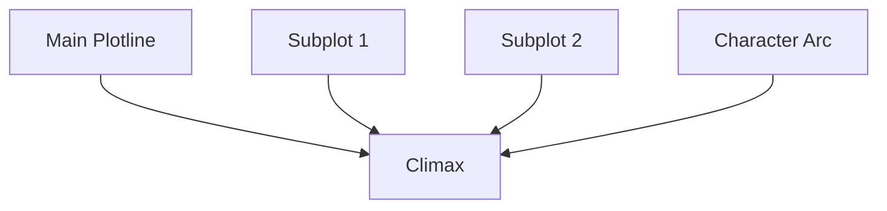

Harmonized Plotlines

# The Leechseed Manifesto

## SECTION: Narrative Doctrine

## TITLE: Harmonized Plotlines

---

### **Definition**

**Harmonized Plotlines** is the narrative design principle of aligning multiple story threads—main plot, subplots, character arcs, and thematic tracks—into a **cohesive, resonant structure** where each thread amplifies, reflects, or tensions the others. Rather than fragmenting story momentum, harmonized plotlines **weave a single rhythmic and thematic braid.**

> A plotline that doesn't contribute to the harmony is narrative noise.

---

### **Table of Contents**

1. [Core Purpose](#core-purpose)
2. [Types of Plotlines](#types-of-plotlines)
3. [Core Mechanics of Harmony](#core-mechanics-of-harmony)
4. [Braid Structures](#braid-structures)
5. [Thematic Resonance Across Plots](#thematic-resonance-across-plots)
6. [Conflict Layering](#conflict-layering)
7. [Timing, Rhythm, and Modulation](#timing-rhythm-and-modulation)
8. [Common Pitfalls](#common-pitfalls)
9. [Tools for Plotline Harmonization](#tools-for-plotline-harmonization)
10. [Final Dictum](#final-dictum)

---

### **Core Purpose**

* Ensure **narrative unity** even in complex or ensemble-driven stories
* Deliver **thematic echo** across characters and situations
* Allow **emotional modulation**—breathers, contrasts, amplifiers
* Maintain **constant engagement** through dynamic tension shifts
* Prevent viewer fatigue and fragmentation

---

### **Types of Plotlines**

| Type                             | Description                                                   | Example                        |
| -------------------------------- | ------------------------------------------------------------- | ------------------------------ |
| **Primary Plotline**             | The central conflict or quest that drives the story           | Neo vs. The Matrix             |
| **Secondary/Subplot**            | Supports the main story by exploring a different lens         | Morpheus vs. Authority         |
| **Character Arc Plotline**       | Tracks internal change of key characters                      | Frodo’s temptation arc         |
| **Thematic Plotline**            | Allegorical or symbolic thread that runs parallel             | The Ring as metaphor in *LOTR* |
| **Romantic/Relational Plotline** | Humanizes story and creates stakes through emotional intimacy | Joel and Ellie in *TLOU*       |

---

### **Core Mechanics of Harmony**

| Mechanic                        | Function                                                  |
| ------------------------------- | --------------------------------------------------------- |
| **Cause-and-Effect Links**      | Events in one plotline ripple into another                |
| **Character Cross-Pollination** | Characters appear across threads to reinforce unity       |
| **Shared Stakes**               | All threads feed the same climactic outcome               |
| **Thematic Parallels**          | Different plots reflect the same question from new angles |
| **Rhythmic Alternation**        | Cutting between threads to control tension and energy     |

---

### **Braid Structures**

**Braiding** is the art of tightening the narrative weave:

* Each subplot escalates toward or collides with the main plot
* Parallel structures mirror beats (e.g., midpoint shifts in all arcs)
* The climax synthesizes all threads into one explosive resolution

---

### **Thematic Resonance Across Plots**

| Theme                    | Main Plot                         | Subplot                          | Emotional Payoff                          |
| ------------------------ | --------------------------------- | -------------------------------- | ----------------------------------------- |
| **Freedom vs. Control**  | Protagonist rebels against system | Mentor shows limits of rebellion | Catharsis when protagonist rewrites rules |
| **Faith vs. Doubt**      | Religious war                     | Minor character loses belief     | Emotional collapse then renewal           |
| **Power and Corruption** | Political ascent                  | Friendship dissolves             | Tragic irony at climax                    |

---

### **Conflict Layering**

* Every plotline should introduce its own **conflict engine**
* Conflicts should **escalate in tandem** but with unique stakes
* Plotlines can be **contrapuntal** (one rises as another falls)
* The **climax** must resolve all critical conflict layers simultaneously

**Example:**

* A rebellion succeeds (main plot)
* The rebel leader loses their lover (subplot)
* The lover’s death is a consequence of the rebellion (linkage)

---

### **Timing, Rhythm, and Modulation**

| Element                  | Role in Plotline Harmony                                     |
| ------------------------ | ------------------------------------------------------------ |
| **Pacing Control**       | Rotate between fast and slow threads for tension balance     |
| **Emotional Modulation** | Use plotlines with different tones to avoid fatigue          |
| **Checkpoints**          | Align key structural beats (midpoint, climax) across threads |
| **Scene Sequencing**     | Strategically interleave scenes for contrast or synergy      |

---

### **Common Pitfalls**

| Pitfall                  | Symptom                                                     |
| ------------------------ | ----------------------------------------------------------- |
| **Fragmented Narrative** | Threads feel isolated or disconnected                       |
| **Asymmetric Weight**    | Subplots dominate or undercut the main story                |
| **Empty Intercutting**   | Cutting between threads adds no value or contrast           |
| **Unresolved Plotlines** | Subplots don’t resolve or contribute to climax              |
| **Redundant Themes**     | All plotlines say the same thing with no variation or depth |

---

### **Tools for Plotline Harmonization**

| Tool                            | Function                                                            |
| ------------------------------- | ------------------------------------------------------------------- |
| **Plotline Matrix**             | Rows = plotlines, columns = structure beats (Act I, Midpoint, etc.) |
| **Theme-Weave Chart**           | Tracks how theme is explored differently across threads             |
| **Beat Convergence Tracker**    | Maps when and how plotlines intersect or collide                    |
| **Character Crossover Diagram** | Visualize which characters interact across plotlines                |
| **Rhythm Timeline**             | Plots scene pacing and emotional load of each thread over time      |

---

### **Final Dictum**

> **Plotlines are not side quests. They are symphonic voices.**
> When every thread harmonizes, the audience doesn’t just watch—they *hear* the story.
> If it doesn’t resonate together, it doesn’t resonate at all.
> **Harmonize your plotlines—or risk narrative dissonance.**

id: 0ff5dfc25aa24a0680f5831743e06977
parent_id: 95f7b4518255498bb3a1bd165a6ab0b3
created_time: 2025-05-06T12:52:16.338Z
updated_time: 2025-05-06T13:16:17.086Z
is_conflict: 0
latitude: 30.43825590
longitude: -84.28073290
altitude: 0.0000
author: 
source_url: 
is_todo: 0
todo_due: 0
todo_completed: 0
source: joplin-desktop
source_application: net.cozic.joplin-desktop
application_data: 
order: 0
user_created_time: 2025-05-06T12:52:16.338Z
user_updated_time: 2025-05-06T13:16:17.086Z
encryption_cipher_text: 
encryption_applied: 0
markup_language: 1
is_shared: 0
share_id: 
conflict_original_id: 
master_key_id: 
user_data: 
deleted_time: 0
type_: 1