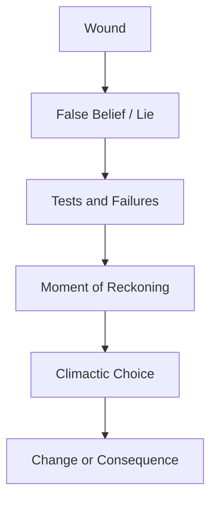

Dynamic Character Arcs

# The Leechseed Manifesto

## SECTION: Narrative Doctrine

## TITLE: Dynamic Character Arcs

---

### **Definition**

A **Dynamic Character Arc** is the transformation of a character’s identity, beliefs, or behavior over the course of a narrative in response to pressure, loss, failure, and revelation. The arc **maps the internal journey**—it is not about what happens to the character, but what the character becomes. It is the **backbone of emotional investment**.

> Static characters may survive the plot. Dynamic ones *become* it.

---

### **Table of Contents**

1. [Core Purpose](#core-purpose)
2. [Arc Structure](#arc-structure)
3. [Types of Character Arcs](#types-of-character-arcs)
4. [The Arc Engine: Wound → Lie → Change](#the-arc-engine)
5. [Stages of a Dynamic Arc](#stages-of-a-dynamic-arc)
6. [Structural Integration](#structural-integration)
7. [Tools for Designing Character Arcs](#tools-for-designing-character-arcs)
8. [Common Pitfalls](#common-pitfalls)
9. [Final Dictum](#final-dictum)

---

### **Core Purpose**

* Reflect and reinforce the **narrative theme**
* Evolve **character identity** in response to stakes
* Create **emotional investment** through inner conflict
* Amplify the meaning of the **climax and resolution**

---

### **Arc Structure**

* **Wound**: Origin of internal dysfunction
* **Lie**: The flawed belief that shapes behavior
* **Tests**: The narrative confronts the character with dissonance
* **Reckoning**: Moment of clarity or collapse
* **Climax**: Decision reflects who the character has become
* **Consequence**: The world responds to their transformation (or failure)

---

### **Types of Character Arcs**

| Arc Type                | Description                                                   | Example                   |
| ----------------------- | ------------------------------------------------------------- | ------------------------- |
| **Positive Change Arc** | Character overcomes flaw and becomes more whole               | *Elizabeth Bennet* (P\&P) |
| **Negative Change Arc** | Character gives in to flaw, falls morally or emotionally      | *Walter White* (BB)       |
| **Flat / Static Arc**   | Character remains steadfast and changes others around them    | *Captain America*         |
| **Disillusionment Arc** | Character discovers the world is darker than they believed    | *Frodo Baggins*           |
| **Redemptive Arc**      | Character recovers from moral failure or guilt through action | *Zuko* (*Avatar: TLA*)    |

---

### **The Arc Engine: Wound → Lie → Change**

1. **The Wound**

   * A past trauma, loss, or shame that shaped identity
   * Often subconscious, guarded, or unspoken

2. **The Lie**

   * A false belief based on the wound (e.g., "I’m unworthy," "Power protects me")
   * Dictates actions and creates moral blindness

3. **The Change**

   * Must result from earned confrontation, not convenience
   * Driven by consequence, loss, failure, or empathy

> If the wound is the root, and the lie is the vine, then the change is the bloom—or the rot.

---

### **Stages of a Dynamic Arc**

| Stage              | Description                                            |
| ------------------ | ------------------------------------------------------ |
| **Status Quo**     | Character’s default state; lies unchallenged           |
| **Disruption**     | External conflict forces confrontation of flaw         |
| **Resistance**     | Character denies, evades, or doubles down on their lie |
| **Escalation**     | Stakes rise; flaw causes losses or consequences        |
| **Breakpoint**     | Moment of psychological, emotional, or moral crisis    |
| **Revelation**     | Character sees truth—but must still choose             |
| **Transformation** | Climax reflects final choice between lie and truth     |
| **Aftermath**      | Demonstrates new identity or downfall                  |

---

### **Structural Integration**

* The character arc must align with **major plot beats**
* **Midpoint** reveals or tests the lie
* **Second Pinch Point** threatens the consequence of failure
* **Climax** is where the truth is acted upon or denied
* **Resolution** shows the cost or reward of change

> Every beat in the plot should pressure the arc.

---

### **Tools for Designing Character Arcs**

| Tool                            | Purpose                                                                |
| ------------------------------- | ---------------------------------------------------------------------- |
| **Wound Worksheet**             | Unpacks formative trauma and belief systems                            |
| **Lie-to-Truth Ladder**         | Maps how the lie is confronted and eroded over time                    |
| **Arc Integration Matrix**      | Aligns arc stages with plot structure                                  |
| **Transformation Trigger List** | Catalogs specific moments/events that force inner reckoning            |
| **Moral Crossroads Chart**      | Identifies key decisions where the character must choose between paths |

---

### **Common Pitfalls**

| Pitfall                  | Description                                                     |
| ------------------------ | --------------------------------------------------------------- |
| **Unmotivated Change**   | The character changes suddenly, without buildup or pressure     |
| **Flatline Development** | The arc stagnates or repeats the same beat multiple times       |
| **Externalized Arc**     | Change is caused entirely by plot, not inner decision           |
| **Contradictory Climax** | Final action contradicts previous growth or regression          |
| **Redundant Resolution** | No meaningful difference between character in Act I and Act III |

---

### **Final Dictum**

> **A dynamic arc is not a makeover—it’s a war.**
> Every decision, every loss, every confrontation should leave the character changed.
> If your character ends where they began, make damn sure they earned their stasis.
> **Character arcs are crucibles. Burn them clean—or burn them down.**

id: 7a6247ea03cc44088159cc1c58eacd74
parent_id: 95f7b4518255498bb3a1bd165a6ab0b3
created_time: 2025-05-06T13:12:38.310Z
updated_time: 2025-05-06T13:12:45.709Z
is_conflict: 0
latitude: 30.43825590
longitude: -84.28073290
altitude: 0.0000
author: 
source_url: 
is_todo: 0
todo_due: 0
todo_completed: 0
source: joplin-desktop
source_application: net.cozic.joplin-desktop
application_data: 
order: 0
user_created_time: 2025-05-06T13:12:38.310Z
user_updated_time: 2025-05-06T13:12:45.709Z
encryption_cipher_text: 
encryption_applied: 0
markup_language: 1
is_shared: 0
share_id: 
conflict_original_id: 
master_key_id: 
user_data: 
deleted_time: 0
type_: 1