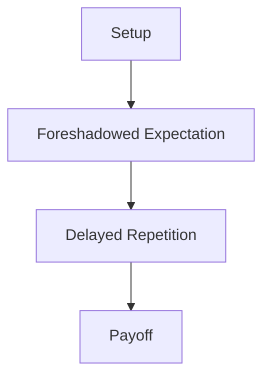

 Payoff With Setup

# The Leechseed Manifesto

## SECTION: Narrative Doctrine

## TITLE: Payoff With Setup

---

### **Definition**

**Payoff With Setup** is the principle that **every major narrative moment must be earned by its foundation**—that is, the careful planting of emotional, thematic, or plot-related seeds earlier in the story. The reverse is also true: **no setup should exist without a corresponding payoff**. This principle enforces structural integrity, reader satisfaction, and thematic weight.

> “Foreshadowing without fulfillment is a lie. Fulfillment without foreshadowing is theft.”

---

### **Table of Contents**

1. [Core Purpose](#core-purpose)
2. [The Principle of Narrative Echo](#the-principle-of-narrative-echo)
3. [Setup Components](#setup-components)
4. [Types of Payoff](#types-of-payoff)
5. [Design Patterns](#design-patterns)
6. [Payoff Timelines](#payoff-timelines)
7. [Common Pitfalls](#common-pitfalls)
8. [Tools and Techniques](#tools-and-techniques)
9. [Final Dictum](#final-dictum)

---

### **Core Purpose**

* Ensure that major story moments feel **inevitable, not arbitrary**
* **Reward attentiveness** in the audience
* Deepen narrative **density, resonance, and structure**
* Create emotional **catharsis** and intellectual **closure**
* Build a **closed-loop system** of cause and effect

---

### **The Principle of Narrative Echo**

**Narrative Echo** is when a moment in the story resonates because it connects to something previously shown, said, or experienced.

| Echo Type       | Description                                        | Example                                 |
| --------------- | -------------------------------------------------- | --------------------------------------- |
| **Verbal Echo** | A line repeated with new meaning                   | “I am Iron Man.” – *Iron Man / Endgame* |
| **Visual Echo** | A shot, gesture, or image re-used in a new context | Hand touch in *The Handmaiden*          |
| **Action Echo** | A decision repeated or inverted                    | Frodo offers the ring → Sam rejects it  |
| **Moral Echo**  | Early choice reframed with higher stakes           | Batman won’t kill → Joker exploits it   |

---

### **Setup Components**

| Component             | Function                                                    |
| --------------------- | ----------------------------------------------------------- |
| **Object/Prop**       | Physical item that gains narrative weight later             |
| **Phrase/Dialogue**   | Words that later return with irony, truth, or reversal      |
| **Character Flaw**    | Sets up inner conflict the climax must resolve              |
| **Thematic Question** | A dilemma posed early, resolved through action              |
| **Symbol/Motif**      | Recurring visual or verbal marker that culminates in payoff |

---

### **Types of Payoff**

| Type                 | Description                                                           | Example                                      |
| -------------------- | --------------------------------------------------------------------- | -------------------------------------------- |
| **Plot Payoff**      | Information or event setup that leads to a major twist or action      | Chekhov’s Gun                                |
| **Emotional Payoff** | Setup moment establishes emotional stakes resolved later              | Reunion in *The Pursuit of Happyness*        |
| **Thematic Payoff**  | Abstract ideas presented earlier are brought into concrete resolution | “You either die a hero…” – *The Dark Knight* |
| **Symbolic Payoff**  | Imagery returns with deeper emotional meaning                         | Shattered mask in *Watchmen*                 |
| **Reversal Payoff**  | Setup leads to expectation, payoff inverts it                         | *Gone Girl*’s diary twist                    |

---

### **Design Patterns**

| Pattern                                | Function                                                         |
| -------------------------------------- | ---------------------------------------------------------------- |
| **Setup → Reinforce → Delay → Payoff** | Keeps memory alive and builds anticipation                       |
| **Hidden in Plain Sight**              | Camouflages payoff setup to deliver a surprise                   |
| **False Setup / Subversion**           | Makes audience expect one payoff, delivers another               |
| **Nested Setup/Payoff**                | Payoffs inside payoffs—multiple echoes from a single setup       |
| **Chekhov’s Web**                      | Multiple setups feed a single moment, creating narrative gravity |

---

### **Payoff Timelines**

| Duration       | Effect                                                       |
| -------------- | ------------------------------------------------------------ |
| **Short-Term** | Setup resolves quickly; maintains fast pacing                |
| **Mid-Term**   | Setup planted in Act I, paid off in Act II or III            |
| **Long-Term**  | Delayed for maximum resonance—requires careful reinforcement |
| **Recursive**  | The same motif or line pays off repeatedly in new ways       |

**Best practice**: Mix short, mid, and long-term setups to layer payoff density and maintain engagement.

---

### **Common Pitfalls**

| Pitfall                  | Symptom                                               |
| ------------------------ | ----------------------------------------------------- |
| **Unestablished Payoff** | Twist feels random or contrived                       |
| **Wasted Setup**         | Object or idea introduced and never revisited         |
| **Overexposed Setup**    | Too obvious; audience predicts everything             |
| **Overloaded Setup**     | So many setups, none land meaningfully                |
| **Disconnected Payoff**  | The payoff doesn’t tie into character, plot, or theme |

---

### **Tools and Techniques**

| Tool                      | Usage                                                            |
| ------------------------- | ---------------------------------------------------------------- |
| **Setup Tracker Grid**    | Spreadsheet of all setups + expected payoff timing               |
| **Thematic Matrix**       | Aligns setups with themes and character arcs                     |
| **Echo Loop Map**         | Diagram of recurring visual/verbal echoes and their significance |
| **Foreshadowing Ladder**  | Ranks foreshadowing by subtlety to control audience awareness    |
| **Beat Cross-Referencer** | Connects early beats with future echoes to enforce structure     |

---

### **Final Dictum**

> **Payoff with Setup is narrative karma.**
> What is planted must bloom. What blooms must have roots.
> When a payoff lands, the audience should feel the world tighten.
> **It’s not magic. It’s engineering.**

id: c09b07e64016469eb3e1db08face05c5
parent_id: 95f7b4518255498bb3a1bd165a6ab0b3
created_time: 2025-05-06T13:09:32.358Z
updated_time: 2025-05-06T13:09:43.177Z
is_conflict: 0
latitude: 30.43825590
longitude: -84.28073290
altitude: 0.0000
author: 
source_url: 
is_todo: 0
todo_due: 0
todo_completed: 0
source: joplin-desktop
source_application: net.cozic.joplin-desktop
application_data: 
order: 0
user_created_time: 2025-05-06T13:09:32.358Z
user_updated_time: 2025-05-06T13:09:43.177Z
encryption_cipher_text: 
encryption_applied: 0
markup_language: 1
is_shared: 0
share_id: 
conflict_original_id: 
master_key_id: 
user_data: 
deleted_time: 0
type_: 1