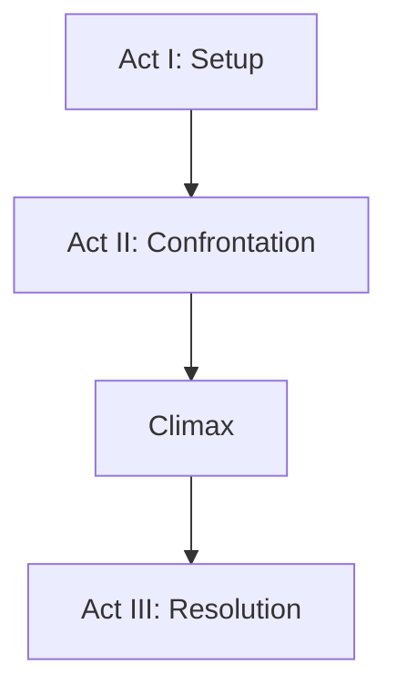

Earned Climax

# The Leechseed Manifesto

## SECTION: Narrative Doctrine

## TITLE: Earned Climax

---

### **Definition**

An **Earned Climax** is a story’s final, explosive payoff that is **fully justified by everything that came before it**. It is not a surprise for surprise’s sake. It is a resolution forged through conflict, decision, transformation, and sacrifice. The audience doesn’t just witness it—they *feel* it, because they’ve taken every step of the journey to arrive there.

**An unearned climax is narrative betrayal. An earned climax is narrative salvation.**

---

### **Table of Contents**

1. [Core Purpose](#core-purpose)
2. [Structural Positioning](#structural-positioning)
3. [Prerequisites for Earned Climax](#prerequisites-for-earned-climax)
4. [Climax Composition](#climax-composition)
5. [Character Integration](#character-integration)
6. [Thematic Convergence](#thematic-convergence)
7. [Common Climax Archetypes](#common-climax-archetypes)
8. [Common Pitfalls](#common-pitfalls)
9. [Design Tools](#design-tools)
10. [Final Dictum](#final-dictum)

---

### **Core Purpose**

* Deliver **maximum emotional and narrative payoff**
* Resolve or transform the central dramatic question
* Cement character evolution (or failure)
* Recontextualize theme through final action
* Burn itself into the audience’s memory

---

### **Structural Positioning**

The climax is the **natural result of narrative tension**, placed at the **end of the second act or beginning of the third**. It concludes the protagonist’s journey, ties off major arcs, and drives home the meaning of the story.

---

### **Prerequisites for Earned Climax**

| Prerequisite                 | Description                                                                |
| ---------------------------- | -------------------------------------------------------------------------- |
| **Causal Progression**       | Every event leading to the climax must be logically and emotionally linked |
| **Escalated Stakes**         | The stakes must reach their highest point just before the climax           |
| **Character Transformation** | The protagonist must change through hardship, loss, or insight             |
| **Conflict Synthesis**       | Multiple threads converge and collide                                      |
| **No Easy Outs**             | No deus ex machina, no sudden cheat resolution                             |

---

### **Climax Composition**

| Element                      | Role in Climax                                                                     |
| ---------------------------- | ---------------------------------------------------------------------------------- |
| **Catalyst**                 | Immediate trigger for final confrontation                                          |
| **Moral Dilemma**            | Forces the character to reveal who they truly are                                  |
| **Sacrifice or Consequence** | Proves the stakes are real and irreversible                                        |
| **Final Action**             | The literal or metaphorical final blow—the decision or event that resolves the arc |
| **Aftershock**               | The fallout that shows the cost or transformation resulting from the climax        |

---

### **Character Integration**

* The climax must be **intimately tied to the protagonist’s arc**
* It should **test their flaw, belief, or desire**
* The decision made should reflect their **growth or failure**

> **In an earned climax, the protagonist chooses their ending.**

**Examples:**

* Max decides not to return to isolation (*Fury Road*)
* Joel lies to protect Ellie (*The Last of Us*)
* Walter White admits he did it for himself (*Breaking Bad*)

---

### **Thematic Convergence**

* The climax is not just resolution—it’s **meaning under pressure**
* Theme must be expressed **through character action**, not monologue

| Theme Type              | Expression in Climax                                   |
| ----------------------- | ------------------------------------------------------ |
| **Freedom vs. Control** | A character breaks or submits to authority             |
| **Love vs. Duty**       | A character chooses emotional truth over obligation    |
| **Self vs. Self**       | The protagonist destroys or accepts their old identity |
| **Power vs. Humanity**  | Final act either reclaims or extinguishes compassion   |

---

### **Common Climax Archetypes**

| Archetype             | Description                                           | Example                            |
| --------------------- | ----------------------------------------------------- | ---------------------------------- |
| **Final Showdown**    | Physical or ideological confrontation with antagonist | *The Matrix*, *John Wick*          |
| **Revelation Choice** | Character acts on a discovered truth                  | *Arrival*, *Fight Club*            |
| **Tragic Climax**     | Hero fails, dies, or falls into darkness              | *Macbeth*, *The Godfather Part II* |
| **Redemptive Climax** | Atonement through sacrifice                           | *Iron Giant*, *Gran Torino*        |
| **Cathartic Release** | Emotional explosion that frees or destroys            | *Marriage Story*, *Whiplash*       |

---

### **Common Pitfalls**

| Pitfall                  | Symptom                                                  |
| ------------------------ | -------------------------------------------------------- |
| **Unmotivated Climax**   | Comes out of nowhere, not built by previous beats        |
| **Overexposition**       | Dialogue explains everything instead of showing it       |
| **No Sacrifice**         | The character gets everything too easily                 |
| **Tonally Disconnected** | The climax feels like it belongs to a different story    |
| **Thematic Disconnect**  | Actions contradict or ignore the story’s central meaning |

---

### **Design Tools**

| Tool                             | Use                                                                      |
| -------------------------------- | ------------------------------------------------------------------------ |
| **Climactic Causality Map**      | Map every beat leading to the climax; verify logical/emotional causality |
| **Flaw vs. Choice Grid**         | Ensure the climax directly confronts the character’s core weakness       |
| **Tension Curve Graph**          | Measure rising stakes and intensity toward the peak                      |
| **Theme-Action Alignment Chart** | Align climax action with stated or implied theme                         |

---

### **Final Dictum**

> **An earned climax is not a surprise. It is a reward.**
> The audience should gasp, not because it was unexpected—**but because it was inevitable**.
> If the audience doesn’t *feel* it in their bones, it isn’t the climax.
> **Earned means paid for—in pain, in choice, in blood.**

id: cf56c1df48c245b1bf2b6704f11cde23
parent_id: 95f7b4518255498bb3a1bd165a6ab0b3
created_time: 2025-05-06T13:06:32.497Z
updated_time: 2025-05-06T13:06:41.906Z
is_conflict: 0
latitude: 30.43825590
longitude: -84.28073290
altitude: 0.0000
author: 
source_url: 
is_todo: 0
todo_due: 0
todo_completed: 0
source: joplin-desktop
source_application: net.cozic.joplin-desktop
application_data: 
order: 0
user_created_time: 2025-05-06T13:06:32.497Z
user_updated_time: 2025-05-06T13:06:41.906Z
encryption_cipher_text: 
encryption_applied: 0
markup_language: 1
is_shared: 0
share_id: 
conflict_original_id: 
master_key_id: 
user_data: 
deleted_time: 0
type_: 1