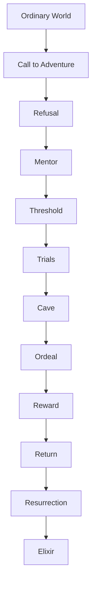
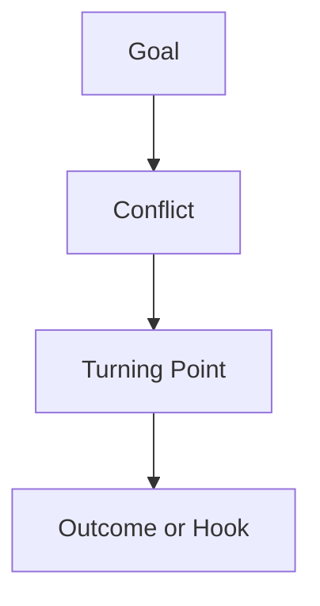

Narrative Structure


# The Leechseed Manifesto  
## SECTION: Narrative Doctrine  
## TITLE: The Structure of Narrative

---

### **Table of Contents**

1. [Definition](#definition)
2. [Core Structural Units](#core-structural-units)
3. [Macro-Structures](#macro-structures)
   - [Three-Act Structure](#three-act-structure)
   - [Five-Act Structure](#five-act-structure)
   - [Hero’s Journey](#heros-journey)
4. [Micro-Structures](#micro-structures)
   - [Scene Structure](#scene-structure)
5. [Turning Points and Milestones](#turning-points-and-milestones)
6. [Parallel and Nested Structures](#parallel-and-nested-structures)
7. [Thematic Structures](#thematic-structures)
8. [Narrative Rhythm and Flow](#narrative-rhythm-and-flow)
9. [Common Structural Pitfalls](#common-structural-pitfalls)
10. [Final Dictum](#final-dictum)

---

### **Definition**

**Narrative Structure** is the deliberate arrangement of events, scenes, and turning points to form a coherent emotional and thematic arc. It governs how a story unfolds across time, tension, and transformation. Structure is not a constraint—it’s the skeleton that lets a story move, escalate, and resonate.

---

### **Core Structural Units**

| Unit         | Definition                                                                 |
|--------------|-----------------------------------------------------------------------------|
| **Beat**        | A single moment of change—emotional or narrative.                         |
| **Scene**       | A self-contained event in time and space that pushes the story forward.   |
| **Sequence**    | A series of scenes forming a mini-arc toward a shared goal.               |
| **Act**         | A major shift in goal, stakes, or worldview; usually 3–5 per story.       |
| **Arc**         | The transformational path of a character or theme.                        |
| **Plotline**    | A thread of narrative progression (main plot, subplot, etc.).             |

---

### **Macro-Structures**

#### **Three-Act Structure**

```mermaid
flowchart TD
    A[Act I: Setup] --> B[Act II: Confrontation] --> C[Act III: Resolution]
````

* **Act I – Setup**: Worldbuilding, character intro, tone. Ends with Inciting Incident.
* **Act II – Confrontation**: Rising conflict. Midpoint reveals stakes. Ends with crisis.
* **Act III – Resolution**: Climax, fallout, recontextualization of the whole.

---

#### **Five-Act Structure**

```mermaid
flowchart TD
    A[Exposition] --> B[Rising Action] --> C[Climax] --> D[Falling Action] --> E[Denouement]
```

* **Exposition**: Establish setting, tone, premise.
* **Rising Action**: Build tension through complications.
* **Climax**: Peak conflict, truth revealed.
* **Falling Action**: Fallout and narrative descent.
* **Denouement**: Closure, resolution, echo.

---

#### **Hero’s Journey**



* Symbolic and psychological structure centered on transformation, sacrifice, and rebirth.

---

### **Micro-Structures**

#### **Scene Structure**



* **Goal**: Character objective.
* **Conflict**: Resistance or complication.
* **Turning Point**: Shift in power, truth, or tactic.
* **Outcome**: Success, failure, or escalation.

---

### **Turning Points and Milestones**

| Point                 | Function                                            |
| --------------------- | --------------------------------------------------- |
| **Inciting Incident** | Disrupts the ordinary world; story ignition.        |
| **First Plot Point**  | Entry into the story’s true stakes and conflict.    |
| **Midpoint**          | Reversal, revelation, or elevation of stakes.       |
| **Second Plot Point** | Commitment to final act; setup for climax.          |
| **Climax**            | Peak conflict; irrevocable choice or confrontation. |
| **Denouement**        | Aftermath, meaning, and return to emotional stasis. |

---

### **Parallel and Nested Structures**

* **A/B Plotline**: Interwoven plots that comment on or contrast each other.
* **Frame Narrative**: Story inside a story (*Heart of Darkness*, *The Princess Bride*).
* **Rashomon**: Multiple perspectives on a single event.
* **Nonlinear/Modular**: Reordered segments that prioritize theme over chronology.

---

### **Thematic Structures**

| Arc Type               | Effect                                            | Example                  |
| ---------------------- | ------------------------------------------------- | ------------------------ |
| **Transformation Arc** | Character grows or evolves.                       | *Breaking Bad*           |
| **Static Arc**         | Character unchanged, but transforms others/world. | *No Country for Old Men* |
| **Fall Arc**           | Hero degrades ethically or spiritually.           | *Macbeth*                |
| **Redemptive Arc**     | Character regains lost value or heals.            | *Gran Torino*            |
| **Cyclical Arc**       | Return to origin with new understanding.          | *Arrival*                |

---

### **Narrative Rhythm and Flow**

| Element        | Function                                                            |
| -------------- | ------------------------------------------------------------------- |
| **Pacing**     | Controls narrative tempo; accelerates for tension, slows for depth. |
| **Escalation** | Each beat raises stakes or intensity.                               |
| **Breathers**  | Space between spikes to reset audience tension.                     |
| **Echoes**     | Repetition with variation for emotional or thematic emphasis.       |

---

### **Common Structural Pitfalls**

1. **Act II Stall** – No tension, stakes, or new goals in the middle.
2. **Unmotivated Climax** – Ending isn't earned by prior structure.
3. **No Setup, Just Payoff** – Climaxes come from nowhere; feel hollow.
4. **Flatline Arcs** – Characters don't evolve; beats feel redundant.
5. **Overloaded Plotlines** – Too many threads competing for significance.

---

### **Final Dictum**

> **Structure is not a formula. It is a weapon.**
> It sharpens momentum, reveals truth, and delivers catharsis.
> The story must move. The character must change. The audience must feel.
> **Narrative structure is the gravity that gives your chaos weight.**


id: cfc3faf83edc4ac68f9f2594dcfb1042
parent_id: 95f7b4518255498bb3a1bd165a6ab0b3
created_time: 2025-05-06T12:56:32.989Z
updated_time: 2025-05-06T12:56:56.077Z
is_conflict: 0
latitude: 30.43825590
longitude: -84.28073290
altitude: 0.0000
author: 
source_url: 
is_todo: 0
todo_due: 0
todo_completed: 0
source: joplin-desktop
source_application: net.cozic.joplin-desktop
application_data: 
order: 0
user_created_time: 2025-05-06T12:56:32.989Z
user_updated_time: 2025-05-06T12:56:56.077Z
encryption_cipher_text: 
encryption_applied: 0
markup_language: 1
is_shared: 0
share_id: 
conflict_original_id: 
master_key_id: 
user_data: 
deleted_time: 0
type_: 1