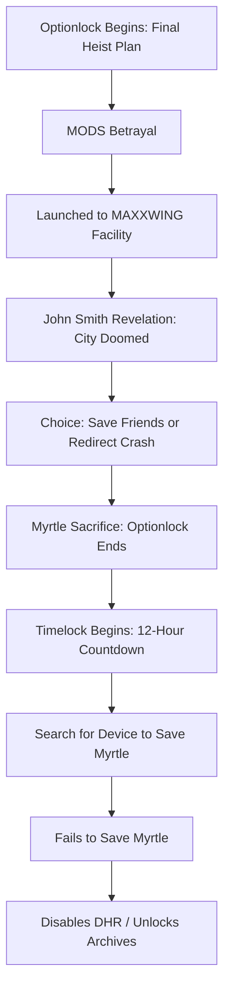

# 📘 Plot Dynamics Report — *Story Limit: Optionlock*

**Section**: Plot Dynamics – Story Limit
**Project**: ASTRO7EX
**Studio**: GUTS99
**Date**: 2025-06-09
**Prepared by**: Narrative Chemistry Engine

---

## 📓 Table of Contents

1. [Overview](#overview)
2. [Definition of Optionlock](#definition-of-optionlock)
3. [Narrative Function in ASTRO7EX](#narrative-function-in-astro7ex)
4. [Triggering the Optionlock](#triggering-the-optionlock)
5. [Optionlock to Timelock: The Chain of Escalation](#optionlock-to-timelock-the-chain-of-escalation)
6. [Bloom, McKee, and Structural Echoes](#bloom-mckee-and-structural-echoes)
7. [Early 2000s Sci-Fi Anime Parallels](#early-2000s-sci-fi-anime-parallels)
8. [Narrative Astrology of Limit and Choice](#narrative-astrology-of-limit-and-choice)
9. [Final Dramatica Answer: Story Limit](#final-dramatica-answer-story-limit)
10. [Flowchart Summary](#flowchart-summary)
11. [Status](#status)

---

## ✍️ Overview

In *ASTRO7EX*, the **Story Limit** is governed by an Optionlock: the plot advances through **strategic paths being systematically exhausted**, rather than through a countdown. The audience watches as Vivian and her team eliminate possibility after possibility, until there is only one route left—a route that leads to irrevocable choice and narrative transformation.

---

## 🔐 Definition of Optionlock

* **Optionlock (Dramatica Definition)**: *A story climax that occurs because all options have been explored or eliminated. Once no other choices remain, the story must resolve.*

---

## 🧠 Narrative Function in ASTRO7EX

The Optionlock in ASTRO7EX builds pressure through **limiting pathways**. Unlike a timer-based race, the story narrows around **decisions**, each removing future flexibility. This lock culminates not from **urgency**, but from **necessity**—Vivian must choose because nothing else is left.

---

## 🚨 Triggering the Optionlock

1. **The Last Heist Plan**: Vivian’s team attempts to hijack a single remaining MORN cargo launcher—**the only viable path** to the MAXXWING facility.
2. **MODS Betrayal**: The MODS override the launch, **isolating Vivian** and cutting off her allies.
3. **Confrontation with John Smith**: At the MAXXWING facility, Vivian learns that it is being **deorbited** to destroy the megacity.
4. **Vivian’s Choice**:

   * Stay and redirect the facility—**save the city**.
   * Return and help her friends—**lose the city**.
5. **Myrtle’s Sacrifice**: Myrtle, revealed to be a sentient AI, volunteers to stay. Vivian accepts, **closing the last open option**.

---

## ⛓️ Optionlock to Timelock: The Chain of Escalation

Once Vivian accepts Myrtle’s sacrifice:

* The Optionlock **ends**—no more paths exist.
* The **Timelock begins**: a 12-hour countdown labeled **DEAD HAND RECLAMATION**.
* Stakes shift from choice to **urgency**—Vivian must now act **before time runs out**.

---

## 📚 Bloom, McKee, and Structural Echoes

### **Harold Bloom**

* This moment channels the **American Sublime**: Vivian faces a **choice as curse**. Like Ahab’s doomed pursuit, her clarity arrives only once the path is irreversible.

### **Robert McKee**

* The story shifts from **deliberation (Planning Act)** to **execution (Final Act)**. McKee’s principle of escalation is mirrored in the seamless Optionlock-to-Timelock transition—raising stakes while collapsing narrative escape hatches.

---

## 📺 Early 2000s Sci-Fi Anime Parallels

* **Evangelion**: Shinji’s final decision to pilot the Eva when no one else can mirrors the Optionlock collapse.
* **Lain**: With each action, the world closes around her—until she *must* merge with the Wired.
* **Ghost in the Shell: Stand Alone Complex**: Logic-based systems enforce behavior until all paths collapse into identity crisis.
* **Big O**: Memory and machinery eliminate free will—the end is fated because of prior design.

---

## 🌌 Narrative Astrology of Limit and Choice

### **Key Placements**

* **Saturn in Aries**: Choice restricted by fate, obligation, and unfinished war.
* **Pluto in 12th House**: The collapse of hidden systems; subconscious forces triggering final action.

### **Progressions**

* **Progressed Sun Square Natal Saturn**: Decision becomes a burden that *forces self-definition*.
* **Progressed Moon in Aquarius**: She must *choose the collective over the self*—and suffer.

---

## 🧾 Final Dramatica Answer: Story Limit

**What is the Optionlock that brings ASTRO7EX to a climax?**

> The Optionlock in *ASTRO7EX* is triggered when Vivian and her team initiate a final heist to hijack a decommissioned MORN cargo launcher—**the last operational means** of reaching the MAXXWING orbital facility. It is the *only* remaining option in a sequence of failed plans designed to uncover her forgotten past and counter the collapse of the Moon’s surface systems.
>
> As this final strategy unfolds, the MODS—entities programmed to preserve dead systems—**betray her** by overriding the launch protocols. Vivian is forcibly launched into space alone, cutting her off from her squad and ending any remaining strategic alternatives. Once she reaches the facility, she is **ambushed by a lobotomizer unit** and confronted by **John Smith the Eternal**, who reveals that the facility is in a forced deorbit and is on a collision course with the lunar megacity. At the same time, her squad is being overwhelmed in an ambush back on the Moon.
>
> Vivian is then presented with a final decision: **remain aboard** to manually redirect the facility away from the city, **or return** to save her squad—**but not both**. When Myrtle, a mysterious AI companion embedded in Vivian’s consciousness, **volunteers to stay behind**, this closes the final narrative pathway. Vivian accepts Myrtle’s offer and escapes—**exhausting all possible options**.
>
> This **irrevocable choice**—accepting Myrtle’s sacrifice and surrendering control of the facility—marks the **climactic collapse of the Optionlock**, after which a 12-hour Timelock begins. The Optionlock brings ASTRO7EX to its climax not through a countdown, but through **strategic attrition**: once **every other path is stripped away**, the only action left is the one that leads to sacrifice, irreversible loss, and truth.

---

## 🕸️ Flowchart Summary

---

## ✅ Status

**Story Limit – Complete**
**Limit Type**: *Optionlock → Triggers Timelock*
**Validated Against**: Dramatica, Bloom, McKee, 2000s Anime Structures, Narrative Astrology
