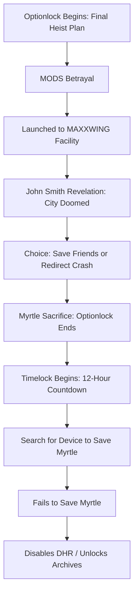

# 🧩 **ASTRO7EX: Optionlock → Timelock Narrative Outline**

---

### **I. OPTIONLOCK SEQUENCE**

> **(Limited Paths / Strategic Moves Exhausted)**

#### **1. The Heist Plan**

* **Goal**: Launch Vivian to the old MAXXWING facility via a hijacked MORN cargo resupply launcher.
* **Squad**: MODS + Myrtle + others participate.
* **Setup**: Final option—only one viable cargo launcher remains.

#### **2. Betrayal by MODS**

* MODS go silent or reroute mission protocol.
* Vivian is **isolated and launched** without agreed fallback.
* This **exhausts the final strategic option**—no backup path exists.

#### **3. Arrival at MAXXWING Facility**

* Vivian lands.
* Ambushed by a **lobotomizer unit**.
* Forced into a conversation with **John Smith the Eternal**.

#### **4. John Smith’s Revelation**

* Facility is being **deorbited** toward the **lava tube megacity**.
* **No escape** unless Vivian takes control.
* Squad below is **under siege**—they're losing.

---

### **II. CRISIS POINT: The Final Fork**

> **(Trigger Point: Decision that locks the Timelock in place)**

#### **5. Vivian’s Dilemma**

* **Option A**: Crash the facility away from the megacity = **save thousands**.
* **Option B**: Return and help friends = **lose the city**.
* No time to do both—**choice must be made**.

#### **6. Myrtle's Sacrifice**

* Myrtle volunteers to **stay and pilot the crash manually**.
* **Revealed**: Myrtle is a *real AI*—not a hallucination.
* Staying behind means **Vivian may never recover Myrtle’s memories**.

> ✅ **Vivian chooses to leave Myrtle and save her friends.**
> 🎯 **Optionlock ends → Timelock begins.**

---

### **III. TIMELOCK SEQUENCE**

> **(Fixed countdown to irreversible event)**

#### **7. Aftermath at the Crashsite**

* Vivian returns to find the satellite **crashed successfully**.
* Myrtle is **missing**—**looters** took all major components.
* Only thing left: A **countdown** reading
  🕛 **“DEAD HAND RECLAMATION: 12:00:00”**

#### **8. Understanding the DHR Protocol**

* Fission reactor core will **detonate in 12 hours**, wiping out the Moon’s surface.
* Vivian can:

  * **Remove core & destroy memory drives** = Myrtle dies.
  * **Find a portable shell/device** = attempt Myrtle’s transfer.

#### **9. Countdown Race**

* Vivian has 12 hours:

  * Navigate underground warzone.
  * Find *1 functional core*.
  * Bypass failed MODS protocols.
  * Resist urge to relive lost past.

---

### **IV. ENDGAME & CONSEQUENCE**

> **(Climax of the Limit)**

#### **10. Final Loss / Gain**

* Vivian fails to save Myrtle.
* She disables the DHR manually.
* Access to **MAXXWING archives unlocked**—her **true past revealed**.

---

# 🔁 Structural Flowchart

---

### ✅ **Dramatica Alignment Summary**

| Element           | Expression in ASTRO7EX                                                               |
| ----------------- | ------------------------------------------------------------------------------------ |
| **Story Driver**  | **Action** – MODS betrayal triggers irreversible sequence.                           |
| **Story Limit**   | **Optionlock → Timelock** – Strategic options exhausted, then a 12-hour race begins. |
| **Crisis Choice** | Vivian must choose between her past (Myrtle) and her present (squad).                |
| **Climax**        | Vivian sacrifices Myrtle to prevent global destruction.                              |
| **Resolution**    | Access to the full truth about her identity and past.                                |

---

Let me know if you'd like this translated into a **full Story Limit Dramatica Report** next, or expanded into a beat sheet or scene list.
