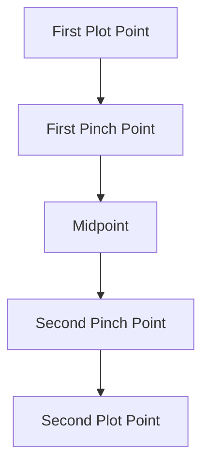

# The Leechseed Manifesto

## SECTION: Narrative Doctrine

## TITLE: The Ascendant Second Act

---

### **Definition**

The **Ascendant Second Act** is the art of making the middle of a story the most intense, transformative, and structurally essential section of the narrative. It **defies the infamous "sagging middle"** by using a system of rising stakes, character evolution, plot escalation, and thematic deepening. It is not passive development—it is **narrative combustion**.

---

### **Table of Contents**

1. [Core Purpose](#core-purpose)
2. [Structural Milestones](#structural-milestones)
3. [Functional Layers](#functional-layers)
4. [Escalation Mechanisms](#escalation-mechanisms)
5. [The Midpoint Event](#the-midpoint-event)
6. [Scene Patterning](#scene-patterning)
7. [Second Act Substructure](#second-act-substructure)
8. [Common Pitfalls and Solutions](#common-pitfalls-and-solutions)
9. [Design Tools and Frameworks](#design-tools-and-frameworks)
10. [Final Dictum](#final-dictum)

---

### **Core Purpose**

* **Bridge and Forge**: The second act bridges inciting incident and climax—but also **forges character identity and thematic complexity**.
* **Character Breakpoint**: It forces the protagonist to adapt, fail, or transform.
* **Escalation Crucible**: This is where the story *pressurizes*. Every beat must add tension.

**Without a strong second act, the third act has no punch.**

---

### **Structural Milestones**

| Milestone              | Description                                                  |
| ---------------------- | ------------------------------------------------------------ |
| **First Plot Point**   | Launches the main narrative arc.                             |
| **First Pinch Point**  | Reminds the audience of antagonistic force; stakes increase. |
| **Midpoint**           | The *moment of revelation, reversal, or false victory*.      |
| **Second Pinch Point** | Tightens the noose; makes failure tangible.                  |
| **Second Plot Point**  | The final shift that forces a committed charge into Act III. |

---

### **Functional Layers**

1. **External Conflict Layer**

   * Plot complications, rising action, reversals

2. **Internal Conflict Layer**

   * Personal doubts, shifting self-perception, unraveling identity

3. **Relational Layer**

   * Allies tested, betrayals happen, power dynamics shift

4. **Thematic Layer**

   * Ideological tension is brought to the forefront

5. **Structural Layer**

   * Scenes connect by causal logic and compound meaning

---

### **Escalation Mechanisms**

| Mechanism                    | Function                                                            |
| ---------------------------- | ------------------------------------------------------------------- |
| **Progressive Complication** | Each scene makes the goal harder, not easier                        |
| **False Hope/False Defeat**  | Lulls the protagonist/audience into premature resolution or despair |
| **Reversals**                | Flip character assumptions, change goalposts                        |
| **Time Compression**         | Deadline or ticking clock introduced                                |
| **Resource Drain**           | Allies die, assets fail, information is lost                        |
| **Moral Complexity**         | Victory begins to cost something unacceptable                       |

---

### **The Midpoint Event**

The **Midpoint** is the *fulcrum* of Act II. It transforms the protagonist’s perception of:

* **Themselves**
* **Their goal**
* **The stakes**

It is often:

* A **Reversal** (e.g. the villain wins, or the goal was a trap)
* A **Revelation** (e.g. betrayal, twist, identity shift)
* A **False Victory** (e.g. success that hides deeper failure)

**The midpoint is not a twist—it's a revelation that changes the nature of conflict.**

---

### **Scene Patterning**

| Scene Type           | Role in Second Act                                         |
| -------------------- | ---------------------------------------------------------- |
| **Obstacle Scene**   | Shows direct opposition to the goal                        |
| **Loss Scene**       | Protagonist loses something vital—status, ally, confidence |
| **Reflection Scene** | Quiet scene revealing character doubt or re-evaluation     |
| **Tension Scene**    | Builds suspense without immediate resolution               |
| **Bonding Scene**    | Creates character intimacy that heightens later stakes     |
| **Break Scene**      | Protagonist breaks a rule or value in desperation          |

---

### **Second Act Substructure**

Each segment follows a mini arc:

* **Goal → Complication → Shift → Fallout**

**Design Note**: Each segment of the second act should feel like a **mini-episode** with its own thematic spine.

---

### **Common Pitfalls and Solutions**

| Pitfall                   | Solution                                                     |
| ------------------------- | ------------------------------------------------------------ |
| **Wandering Plot**        | Reinforce clear stakes and goal evolution                    |
| **Flat Characterization** | Force difficult decisions that reveal internal contradiction |
| **Disconnected Scenes**   | Use thematic glue and narrative causality to bind beats      |
| **No Emotional Tension**  | Layer subtext and conflict beneath surface dialogue          |
| **Lack of Escalation**    | Employ ticking clock, betrayals, resource attrition          |

---

### **Design Tools and Frameworks**

| Tool                          | Function                                                             |
| ----------------------------- | -------------------------------------------------------------------- |
| **Tension Index**             | Rate each scene 1–5 for tension to monitor escalation                |
| **Emotional Trajectory Map**  | Track protagonist’s internal state scene by scene                    |
| **Scene Dependency Graph**    | Visualize causal flow to ensure logical progression                  |
| **Conflict Grid**             | Cross-reference characters and ideologies to mine scenes for tension |
| **Dramatic Question Tracker** | Track open questions and when they're answered or flipped            |

---

### **Final Dictum**

> **The Second Act is where heroes are forged or broken.**
> If Act I lights the fire, Act II is where it spreads.
> No one leaves Act II unchanged—least of all your audience.
> **If the middle doesn't rise, the end won't matter.**
