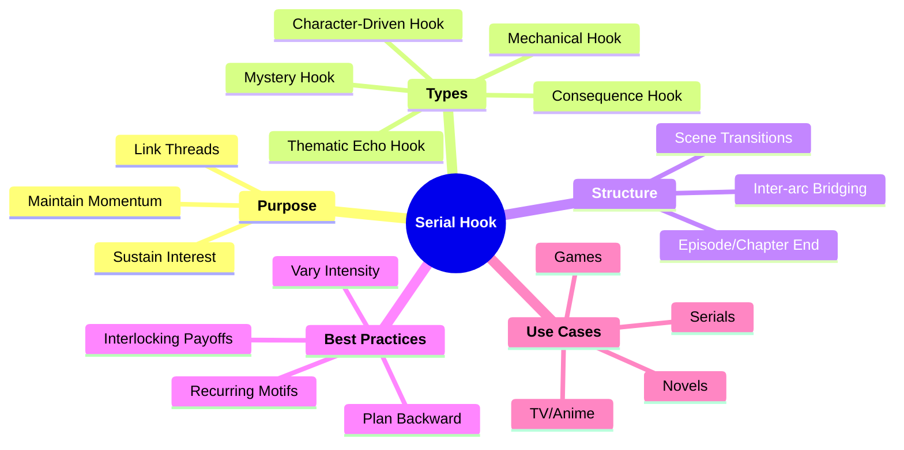

# The Leechseed Manifesto  
## SECTION: Narrative Doctrine  
## TITLE: The Serial Hook

---

### **Definition**

The **Serial Hook** is a narrative design technique used at the **end or midpoint** of a scene, chapter, episode, or mission to **maintain forward momentum** and compel continued engagement. Unlike simple cliffhangers, the serial hook functions as a **modular structural device**, **linking narrative threads**, raising emotional or thematic stakes, and sustaining rhythm across installments.  
It is not just about suspense—**it’s about compulsion**.

> A great hook doesn't ask you to keep going—it *dares* you not to.

---

### **Table of Contents**

1. [Core Purpose](#core-purpose)  
2. [Hook Typology](#hook-typology)  
3. [Usage by Format](#usage-by-format)  
4. [Best Practices](#best-practices)  
5. [Structural Integration](#structural-integration)  
6. [Examples](#examples)  
7. [Tool Comparisons](#tool-comparisons)  
8. [Narrative Functionality](#narrative-functionality)  
9. [Mindmap](#mindmap)  
10. [Final Dictum](#final-dictum)

---

### **Core Purpose**

* Sustain narrative momentum from one entry to the next  
* Create psychological need in the reader/player/viewer to advance  
* Introduce unresolved or destabilizing elements  
* Unify otherwise modular episodes or scenes into a rhythmic whole  
* Keep tension cycling without exhausting climax

---

### **Hook Typology**

| Type                    | Description                                                               | Example                                        |
|-------------------------|---------------------------------------------------------------------------|------------------------------------------------|
| **Mystery Hook**        | Ends with a question or unknown element                                   | “Who was watching from the car?”              |
| **Consequence Hook**    | Action occurs with no immediate resolution                                | “He pulled the trigger—cut to black.”         |
| **Thematic Echo Hook**  | Repeats or flips a core theme in a new context                            | “Power always corrupts… even hers.”           |
| **Character Hook**      | Internal or emotional pivot of a character shifts audience alignment       | “He couldn’t lie this time.”                  |
| **Mechanical Hook**     | In games, teases a new system or environment linked to story progression   | A new location or ability is hinted at        |

---

### **Usage by Format**

| Format                      | Usage Pattern                                                                 |
|-----------------------------|-------------------------------------------------------------------------------|
| **TV / Anime / Serials**    | Episode ends on surprise, question, or character reversal                     |
| **Games**                   | Calls, messages, or discoveries end missions with narrative forward motion    |
| **Web Serials / Fanfic**    | Final lines create anticipation for next post or arc                          |
| **Graphic Novels / Manga**  | Chapter closes with a reveal, inversion, or delay in expected outcome         |

---

### **Best Practices**

| Principle                 | Execution Strategy                                                                 |
|--------------------------|-------------------------------------------------------------------------------------|
| **Plan Backward**        | Write the hook with full knowledge of what it connects to                         |
| **Balance Payoff**       | Don't string readers along with empty teases—pay off hooks meaningfully           |
| **Use Recurring Motifs** | Reinforce hooks with repeated themes or visuals to embed them subconsciously       |
| **Vary Intensity**       | Quiet hooks are sometimes more powerful than loud ones                             |
| **Interlock Hooks**      | Use leapfrogging structure—Hook A resolves in Ch. 3 while Hook B begins in Ch. 2   |

---

### **Structural Integration**

#### **Scene-Level Flow**
```mermaid
flowchart TD
    A[Start of Scene] --> B[Plot Development]
    B --> C[Micro Climax or Beat End]
    C --> D[Serial Hook]
    D --> E[Next Scene / Installment]
````

#### **Episode/Seasonal Flow**

```mermaid
flowchart TD
    S[Season 1]
    S --> E1[Episode 1 Hook]
    E1 --> E2[Episode 2 Hook]
    E2 --> E3[Episode 3 Hook]
    E3 --> F[Finale Hook (Season 2 Setup)]
```

---

### **Examples**

| Medium    | Serial Hook Example                                                         |
| --------- | --------------------------------------------------------------------------- |
| **TV**    | *Breaking Bad* – “Say my name.” → Sets up moral shift and tension loop      |
| **Games** | *GTA V* – Heist setups teased through calls and incomplete info             |
| **Anime** | *Attack on Titan* – “What’s in the basement?” persists across multiple arcs |
| **Books** | *The Expanse* – Every chapter ends with political or emotional escalation   |

---

### **Tool Comparisons**

| Tool              | Purpose                      | Relation to Serial Hook                               |
| ----------------- | ---------------------------- | ----------------------------------------------------- |
| **Cliffhanger**   | Sudden suspense              | Serial hook includes but expands beyond this function |
| **Teaser**        | Preview of upcoming material | Serial hooks create narrative, not just promo         |
| **Button Scene**  | Stylistic closer             | Can be a hook if implication remains unresolved       |
| **Chekhov’s Gun** | Long-term payoff             | Hooks often plant the “gun” without revealing it yet  |

---

### **Narrative Functionality**

* **Narrative Valve**: Releases just enough pressure to maintain build without detonation
* **Cross-Pollination Tool**: Links characters, arcs, and themes across episodes or entries
* **Scene Rhythm Control**: Turns disconnected scenes into an interwoven dramatic pulse
* **Serialization Engine**: Core tool in web serials, episodic media, and open-world game storytelling

---

### **Mindmap**



---

### **Final Dictum**

> **The Serial Hook is not a gimmick—it’s a gravitational force.**
> It bends narrative time, warps structure, and locks the reader in orbit.
> If your story doesn’t compel continuation, it doesn’t deserve it.
> **Hook them. Then drag them deeper.**

