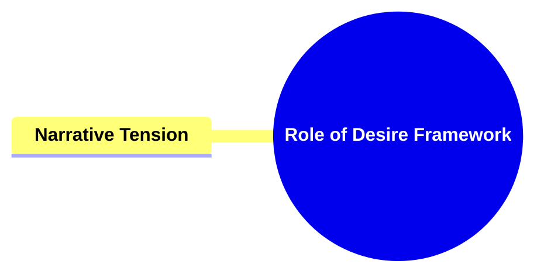
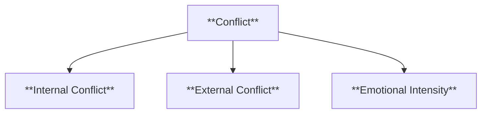

- `character background report template prompt sections`
- `psycho-sexual emotional imprint origin family narrative`
- `ASTRO7EX character illustrating master template`


```
# Batch Extraction: character background report template prompt sections

---
## HIGH-PRECISION (k=5, min=0.25)
[1] score=0.565 (vec=0.543, kw=0.629)
FILE: C:/Users/U01_LEECHSEED/Desktop/_setsunadev/OVER_EXIT_OUT_OBSIDIAN/OVEREXITOUT/00_IMPORTED_JOPLIN/ASTROSE7X/4. STORYWEAVING/1 CHARACTER STORYWEAVING/PROMPTS.md
------------------------------------------------------------------------------------------
OK, now we are moving on to the next step in Theme Development in the Dramatica methodology. That step is Main vs Impact Story Theme. Please familiarize yourself with this step since you are an expert, and provide a review report for me to prepare for what is to come


---


> Create a comprehensive report for the following Character Storyweaving prompt. **follow the structure and language style of the “Understanding” report template** Remember to be thorough and use methods that facilitate easy understanding, such as bolding, italicizing, formatting, and bulleting. In addition to a summary section for each component, which provides an overview of the section using several sentences. Also, remember the Table of Contents. MOST IMPORTANTLY, WE ARE USING DRAMATICA and ASTRO7EX 
>
>  Introducing your Impact Character 
> IMPORTANT: THIS ENTIRE REPORT IS the MODS introduction - this needs to be ANSWERED SPECIFICALLY DUDE
> Describe how the MODS will be introduced to the audience:
>
> Explanation:  First impressions are always important.
>
> > Theory: Every character needs to be introduced to the audience  
> REMEMBER: That the mods are split up into different personalities. Please fill

[2] score=0.557 (vec=0.533, kw=0.629)
FILE: C:/Users/U01_LEECHSEED/Desktop/_setsunadev/.ASTRO7EX.SYNC.JOPLIN/2bcfcde6911243f5bd7bbfd32ea0e7fe.md
------------------------------------------------------------------------------------------
eloped

> OK, now we are moving on to the next step in Theme Development in the Dramatica methodology. That step is Main vs Impact Story Theme. Please familiarize yourself with this step since you are an expert, and provide a review report for me to prepare for what is to come


---


> Create a comprehensive report for the following Character Storyweaving prompt. **follow the structure and language style of the “Understanding” report template** Remember to be thorough and use methods that facilitate easy understanding, such as bolding, italicizing, formatting, and bulleting. In addition to a summary section for each component, which provides an overview of the section using several sentences. Also, remember the Table of Contents. MOST IMPORTANTLY, WE ARE USING DRAMATICA and ASTRO7EX 
>
>  Introducing your Impact Character 
> IMPORTANT: THIS ENTIRE REPORT IS the MODS introduction - this needs to be ANSWERED SPECIFICALLY DUDE
> Describe how the MODS will be introduced to the audience:
>
> Explanation:  First impressions are always important.
>
> > Theory: Every character needs to be introduced to the audience  
> REMEMBER: That the mods are split up into different personalities. Pl

[3] score=0.547 (vec=0.520, kw=0.629)
FILE: C:/Users/U01_LEECHSEED/Desktop/_setsunadev/.ASTRO7EX.SYNC.JOPLIN/43e769de2d3b4484a4fd9049468aee9d.md
------------------------------------------------------------------------------------------
TAGS: 

PROMPTS


> **PLEASE REFRAIN FROM SPEAKING I NEED TO JUST COPY AND PASTE THIS SHIT IN**
>
> Create a comprehensive report for the following  prompt. **follow the structure and language style of the “Understanding” report template** Remember to be thorough and use methods that facilitate easy understanding, such as bolding, italicizing, formatting, and bulleting. In addition to a summary section for each component, which provides an overview of the section using several sentences. Also, remember the Table of Contents. MOST IMPORTANTLY, WE ARE USING DRAMATICA and ASTRO7EX 
> **REMEMBER: There must be a Dramatica Summary in paragraph form as well.**
> Main Character Throughline Synopsis
> IMPORTANT: THIS ENTIRE REPORT IS Main Character Throughline Synopsis report  this needs to be ANSWERED SPECIFICALLY DUDE
>  Describe the Main Character (Vivian) throughline in 'ASTRO7EX'
> REMEMBER: What we've developed since we've last explored this topic. 
> Explained: WHEN STARTING TO DEVELOP A STORY, IT OFTEN HELPS TO WRITE A SHORT SYNOPSIS THAT CAN SERVE AS AN OVERVIEW WHICH WILL GUIDE CREATIVE CHOICES. 

Use the following reference materials' models and methodologies to reinforce the pr

[4] score=0.523 (vec=0.524, kw=0.520)
FILE: C:/Users/U01_LEECHSEED/Desktop/_setsunadev/.ASTRO7EX.SYNC.JOPLIN/ffb4e846454f44a78ab546d335c45406.md
------------------------------------------------------------------------------------------
TAGS: 

PROMPT - SYMPTOM


> **PLEASE REFRAIN FROM SPEAKING I NEED TO JUST COPY AND PASTE THIS SHIT IN**
>
> Create a comprehensive report for the following  prompt. **follow the structure and language style of the “Understanding” report template** Remember to be thorough and use methods that facilitate easy understanding, such as bolding, italicizing, formatting, and bulleting. In addition to a summary section for each component, which provides an overview of the section using several sentences. Also, remember the Table of Contents. MOST IMPORTANTLY, WE ARE USING DRAMATICA and ASTRO7EX 
> **REMEMBER: There must be a Dramatica Summary in paragraph form as well.**
> Illustrate the Overall Story's Symptom 
> IMPORTANT: THIS ENTIRE REPORT IS  the Main (Vivian) vs Impact (the MODS) Story Synopsis report  - this needs to be ANSWERED SPECIFICALLY DUDE
> Illustrate how attention is focused on *Projection* in the Overall Story:
> Explained: The Overall Characters do not address the actual problem of the story until the climax.
> Theory: The Overall Story Symptom describes the nature of how the Overall Story Problem appears to the characters.
> Definition: Projection - an extension of proba

[5] score=0.516 (vec=0.515, kw=0.520)
FILE: C:/Users/U01_LEECHSEED/Desktop/_setsunadev/.ASTRO7EX.SYNC.JOPLIN/abfb2efcc1794a489436387ed335634e.md
------------------------------------------------------------------------------------------
TAGS: 

PROMPT - RESPONSE


> **PLEASE REFRAIN FROM SPEAKING I NEED TO JUST COPY AND PASTE THIS SHIT IN**
>
> Create a comprehensive report for the following  prompt. **follow the structure and language style of the “Understanding” report template** Remember to be thorough and use methods that facilitate easy understanding, such as bolding, italicizing, formatting, and bulleting. In addition to a summary section for each component, which provides an overview of the section using several sentences. Also, remember the Table of Contents. MOST IMPORTANTLY, WE ARE USING DRAMATICA and ASTRO7EX 
> **REMEMBER: There must be a Dramatica Summary in paragraph form as well.**
> Illustrate the Overall Story's Response
> IMPORTANT: THIS ENTIRE REPORT IS  the Main (Vivian) vs Impact (the MODS) Story Synopsis report  - this needs to be ANSWERED SPECIFICALLY DUDE
> Illustrate how the efforts in the Overall Story are directed towards *speculation*:
> Explained: The Overall Characters do not address the actual problem of the story until the climax.
> Theory: During the course of the story, the characters cannot deal with the real Problem until they handle the negative effects the problem creates for

---
## WIDE-NET (k=40, min=0.08)
[1] score=0.565 (vec=0.543, kw=0.629)
FILE: C:/Users/U01_LEECHSEED/Desktop/_setsunadev/OVER_EXIT_OUT_OBSIDIAN/OVEREXITOUT/00_IMPORTED_JOPLIN/ASTROSE7X/4. STORYWEAVING/1 CHARACTER STORYWEAVING/PROMPTS.md
------------------------------------------------------------------------------------------
OK, now we are moving on to the next step in Theme Development in the Dramatica methodology. That step is Main vs Impact Story Theme. Please familiarize yourself with this step since you are an expert, and provide a review report for me to prepare for what is to come


---


> Create a comprehensive report for the following Character Storyweaving prompt. **follow the structure and language style of the “Understanding” report template** Remember to be thorough and use methods that facilitate easy understanding, such as bolding, italicizing, formatting, and bulleting. In addition to a summary section for each component, which provides an overview of the section using several sentences. Also, remember the Table of Contents. MOST IMPORTANTLY, WE ARE USING DRAMATICA and ASTRO7EX 
>
>  Introducing your Impact Character 
> IMPORTANT: THIS ENTIRE REPORT IS the MODS introduction - this needs to be ANSWERED SPECIFICALLY DUDE
> Describe how the MODS will be introduced to the audience:
>
> Explanation:  First impressions are always important.
>
> > Theory: Every character needs to be introduced to the audience  
> REMEMBER: That the mods are split up into different personalities. Please fill

[2] score=0.557 (vec=0.533, kw=0.629)
FILE: C:/Users/U01_LEECHSEED/Desktop/_setsunadev/.ASTRO7EX.SYNC.JOPLIN/2bcfcde6911243f5bd7bbfd32ea0e7fe.md
------------------------------------------------------------------------------------------
eloped

> OK, now we are moving on to the next step in Theme Development in the Dramatica methodology. That step is Main vs Impact Story Theme. Please familiarize yourself with this step since you are an expert, and provide a review report for me to prepare for what is to come


---


> Create a comprehensive report for the following Character Storyweaving prompt. **follow the structure and language style of the “Understanding” report template** Remember to be thorough and use methods that facilitate easy understanding, such as bolding, italicizing, formatting, and bulleting. In addition to a summary section for each component, which provides an overview of the section using several sentences. Also, remember the Table of Contents. MOST IMPORTANTLY, WE ARE USING DRAMATICA and ASTRO7EX 
>
>  Introducing your Impact Character 
> IMPORTANT: THIS ENTIRE REPORT IS the MODS introduction - this needs to be ANSWERED SPECIFICALLY DUDE
> Describe how the MODS will be introduced to the audience:
>
> Explanation:  First impressions are always important.
>
> > Theory: Every character needs to be introduced to the audience  
> REMEMBER: That the mods are split up into different personalities. Pl

[3] score=0.547 (vec=0.520, kw=0.629)
FILE: C:/Users/U01_LEECHSEED/Desktop/_setsunadev/.ASTRO7EX.SYNC.JOPLIN/43e769de2d3b4484a4fd9049468aee9d.md
------------------------------------------------------------------------------------------
TAGS: 

PROMPTS


> **PLEASE REFRAIN FROM SPEAKING I NEED TO JUST COPY AND PASTE THIS SHIT IN**
>
> Create a comprehensive report for the following  prompt. **follow the structure and language style of the “Understanding” report template** Remember to be thorough and use methods that facilitate easy understanding, such as bolding, italicizing, formatting, and bulleting. In addition to a summary section for each component, which provides an overview of the section using several sentences. Also, remember the Table of Contents. MOST IMPORTANTLY, WE ARE USING DRAMATICA and ASTRO7EX 
> **REMEMBER: There must be a Dramatica Summary in paragraph form as well.**
> Main Character Throughline Synopsis
> IMPORTANT: THIS ENTIRE REPORT IS Main Character Throughline Synopsis report  this needs to be ANSWERED SPECIFICALLY DUDE
>  Describe the Main Character (Vivian) throughline in 'ASTRO7EX'
> REMEMBER: What we've developed since we've last explored this topic. 
> Explained: WHEN STARTING TO DEVELOP A STORY, IT OFTEN HELPS TO WRITE A SHORT SYNOPSIS THAT CAN SERVE AS AN OVERVIEW WHICH WILL GUIDE CREATIVE CHOICES. 

Use the following reference materials' models and methodologies to reinforce the pr

[4] score=0.523 (vec=0.524, kw=0.520)
FILE: C:/Users/U01_LEECHSEED/Desktop/_setsunadev/.ASTRO7EX.SYNC.JOPLIN/ffb4e846454f44a78ab546d335c45406.md
------------------------------------------------------------------------------------------
TAGS: 

PROMPT - SYMPTOM


> **PLEASE REFRAIN FROM SPEAKING I NEED TO JUST COPY AND PASTE THIS SHIT IN**
>
> Create a comprehensive report for the following  prompt. **follow the structure and language style of the “Understanding” report template** Remember to be thorough and use methods that facilitate easy understanding, such as bolding, italicizing, formatting, and bulleting. In addition to a summary section for each component, which provides an overview of the section using several sentences. Also, remember the Table of Contents. MOST IMPORTANTLY, WE ARE USING DRAMATICA and ASTRO7EX 
> **REMEMBER: There must be a Dramatica Summary in paragraph form as well.**
> Illustrate the Overall Story's Symptom 
> IMPORTANT: THIS ENTIRE REPORT IS  the Main (Vivian) vs Impact (the MODS) Story Synopsis report  - this needs to be ANSWERED SPECIFICALLY DUDE
> Illustrate how attention is focused on *Projection* in the Overall Story:
> Explained: The Overall Characters do not address the actual problem of the story until the climax.
> Theory: The Overall Story Symptom describes the nature of how the Overall Story Problem appears to the characters.
> Definition: Projection - an extension of proba

[5] score=0.516 (vec=0.515, kw=0.520)
FILE: C:/Users/U01_LEECHSEED/Desktop/_setsunadev/.ASTRO7EX.SYNC.JOPLIN/abfb2efcc1794a489436387ed335634e.md
------------------------------------------------------------------------------------------
TAGS: 

PROMPT - RESPONSE


> **PLEASE REFRAIN FROM SPEAKING I NEED TO JUST COPY AND PASTE THIS SHIT IN**
>
> Create a comprehensive report for the following  prompt. **follow the structure and language style of the “Understanding” report template** Remember to be thorough and use methods that facilitate easy understanding, such as bolding, italicizing, formatting, and bulleting. In addition to a summary section for each component, which provides an overview of the section using several sentences. Also, remember the Table of Contents. MOST IMPORTANTLY, WE ARE USING DRAMATICA and ASTRO7EX 
> **REMEMBER: There must be a Dramatica Summary in paragraph form as well.**
> Illustrate the Overall Story's Response
> IMPORTANT: THIS ENTIRE REPORT IS  the Main (Vivian) vs Impact (the MODS) Story Synopsis report  - this needs to be ANSWERED SPECIFICALLY DUDE
> Illustrate how the efforts in the Overall Story are directed towards *speculation*:
> Explained: The Overall Characters do not address the actual problem of the story until the climax.
> Theory: During the course of the story, the characters cannot deal with the real Problem until they handle the negative effects the problem creates for

[6] score=0.503 (vec=0.461, kw=0.629)
FILE: C:/Users/U01_LEECHSEED/Desktop/_setsunadev/OVER_EXIT_OUT_OBSIDIAN/OVEREXITOUT/00_IMPORTED_JOPLIN/ASTROSE7X/3. Illustrating/THEME DEVELOPMENT/PROMPTS.md
------------------------------------------------------------------------------------------
> OK, now we are moving on to the next step in Theme Development in the Dramatica methodology. That step is Main vs Impact Story Theme. Please familiarize yourself with this step since you are an expert, and provide a review report for me to prepare for what is to come


---


> Create a comprehensive report for the following Main vs. Impact Story Plot Progression development prompt. **follow the structure and language style of the “Understanding” report template** Remember to be thorough and use methods that facilitate easy understanding, such as bolding, italicizing, formatting, and bulleting. In addition to a summary section for each component, which provides an overview of the section using several sentences. Also, remember the Table of Contents. MOST IMPORTANTLY, WE ARE USING DRAMATICA and ASTRO7EX 
>
> Main vs. Impact Story Plot Signpost 4
> IMPORTANT: THIS ENTIRE REPORT IS the M/I Signpost  4 - this needs to be ANSWERED SPECIFICALLY DUDE
> Describe how the Main (Vivian) vs Impact Story (MODS) centers around issues regarding 'Changing One's Nature:'

> Explanation:  The relationship between the Main Character, Vivian, and Impact Characters, MODS, will climax and conclude  wi

[7] score=0.503 (vec=0.460, kw=0.629)
FILE: C:/Users/U01_LEECHSEED/Desktop/_setsunadev/OVER_EXIT_OUT_OBSIDIAN/OVEREXITOUT/00_IMPORTED_JOPLIN/ASTROSE7X/5. POST STORYGUIDE/3 Relationships/PROMPTS.md
------------------------------------------------------------------------------------------
TAGS: 

> **PLEASE REFRAIN FROM SPEAKING I NEED TO JUST COPY AND PASTE THIS SHIT IN**
>
> Create a comprehensive report for the following  prompt. **follow the structure and language style of the “Understanding” report template** Remember to be thorough and use methods that facilitate easy understanding, such as bolding, italicizing, formatting, and bulleting. In addition to a summary section for each component, which provides an overview of the section using several sentences. Also, remember the Table of Contents. MOST IMPORTANTLY, WE ARE USING DRAMATICA and ASTRO7EX 
> **REMEMBER: There must be a Dramatica Summary in paragraph form as well.**
> Main Character Throughline Synopsis
> IMPORTANT: THIS ENTIRE REPORT IS Main Character Throughline Synopsis report  this needs to be ANSWERED SPECIFICALLY DUDE
>  Describe the Main Character (Vivian) throughline in 'ASTRO7EX'
> REMEMBER: What we've developed since we've last explored this topic. 
> Explained: WHEN STARTING TO DEVELOP A STORY, IT OFTEN HELPS TO WRITE A SHORT SYNOPSIS THAT CAN SERVE AS AN OVERVIEW WHICH WILL GUIDE CREATIVE CHOICES. 

Use the following reference materials' models and methodologies to reinforce the prompt's val

[8] score=0.502 (vec=0.460, kw=0.629)
FILE: C:/Users/U01_LEECHSEED/Desktop/_setsunadev/.ASTRO7EX.SYNC.JOPLIN/375c8ed4db77444f8f1554155adc5bba.md
------------------------------------------------------------------------------------------
Concern

> OK, now we are moving on to the next step in Theme Development in the Dramatica methodology. That step is Main vs Impact Story Theme. Please familiarize yourself with this step since you are an expert, and provide a review report for me to prepare for what is to come


---


> Create a comprehensive report for the following Main vs. Impact Story Plot Progression development prompt. **follow the structure and language style of the “Understanding” report template** Remember to be thorough and use methods that facilitate easy understanding, such as bolding, italicizing, formatting, and bulleting. In addition to a summary section for each component, which provides an overview of the section using several sentences. Also, remember the Table of Contents. MOST IMPORTANTLY, WE ARE USING DRAMATICA and ASTRO7EX 
>
> Main vs. Impact Story Plot Signpost 4
> IMPORTANT: THIS ENTIRE REPORT IS the M/I Signpost  4 - this needs to be ANSWERED SPECIFICALLY DUDE
> Describe how the Main (Vivian) vs Impact Story (MODS) centers around issues regarding 'Changing One's Nature:'

> Explanation:  The relationship between the Main Character, Vivian, and Impact Characters, MODS, will climax and con

[9] score=0.493 (vec=0.485, kw=0.520)
FILE: C:/Users/U01_LEECHSEED/Desktop/_setsunadev/.ASTRO7EX.SYNC.JOPLIN/e9b40e59601f4e2198e7568cc36a430b.md
------------------------------------------------------------------------------------------
TAGS: 

PROMPTS


> **PLEASE REFRAIN FROM SPEAKING I NEED TO JUST COPY AND PASTE THIS SHIT IN**
>
> Create a comprehensive report for the following  prompt. **follow the structure and language style of the “Understanding” report template** Remember to be thorough and use methods that facilitate easy understanding, such as bolding, italicizing, formatting, and bulleting. In addition to a summary section for each component, which provides an overview of the section using several sentences. Also, remember the Table of Contents. MOST IMPORTANTLY, WE ARE USING DRAMATICA and ASTRO7EX 
> **REMEMBER: There must be a Dramatica Summary in paragraph form as well.**
> Main (Vivian) vs Impact (the MODS) Story Synopsis
> IMPORTANT: THIS ENTIRE REPORT IS  the Main (Vivian) vs Impact (the MODS) Story Synopsis report  - this needs to be ANSWERED SPECIFICALLY DUDE
> Describe the Main (Vivian) vs Impact (the MODS) Story throughline in 'ASTRO7EX':
> REMEMBER: That the mods are split up into different personalities. Please fill out accordingly
> Explained: When starting to develop a story, it often helps to write a short synopsis that can serve as an overview which will guide creative choices. 
> REMEM

[10] score=0.484 (vec=0.435, kw=0.629)
FILE: C:/Users/U01_LEECHSEED/Desktop/_setsunadev/.ASTRO7EX.SYNC.JOPLIN/eee5ca1c357641339687091bcc4ab981.md
------------------------------------------------------------------------------------------
Concern

> OK, now we are moving on to the next step in the Plot Progressions in the Dramatica methodology. That step is Main Character Plot Progression. Please familiarlize yourself with this step since you are an expert, and provide a review report for me to prepare for what is to come


---


> Create a comprehensive report for the following Main vs. Impact Story Plot Progression development prompt. **follow the structure and language style of the “Understanding” report template** Remember to be thorough and use methods that facilitate easy understanding, such as bolding, italicizing, formatting, and bulleting. In addition to a summary section for each component, which provides an overview of the section using several sentences. Also, remember the Table of Contents. MOST IMPORTANTLY, WE ARE USING DRAMATICA and ASTRO7EX 
>
> Main vs. Impact Story Plot Signpost 4
> IMPORTANT: THIS ENTIRE REPORT IS the M/I Signpost  4 - this needs to be ANSWERED SPECIFICALLY DUDE
> Describe how the Main (Vivian) vs Impact Story (MODS) centers around issues regarding 'Changing One's Nature:'

> Explanation:  The relationship between the Main Character, Vivian, and Impact Characters, MODS, will clim

[11] score=0.477 (vec=0.465, kw=0.513)
FILE: C:/Users/U01_LEECHSEED/Desktop/_setsunadev/OVER_EXIT_OUT_OBSIDIAN/OVEREXITOUT/copy2 - DATA DATA DATA.md
------------------------------------------------------------------------------------------
ponent, which provides an overview of the section using several sentences. Also, remember the Table of Contents. MOST IMPORTANTLY, WE ARE USING DRAMATICA and ASTRO7EX 
> **REMEMBER: There must be a Dramatica Summary in paragraph form as well.**
> Main Character Throughline Synopsis
> IMPORTANT: THIS ENTIRE REPORT IS Main Character Throughline Synopsis report  this needs to be ANSWERED SPECIFICALLY DUDE
>  Describe the Main Character (Vivian) throughline in 'ASTRO7EX'
> REMEMBER: What we've developed since we've last explored this topic. 
> Explained: WHEN STARTING TO DEVELOP A STORY, IT OFTEN HELPS TO WRITE A SHORT SYNOPSIS THAT CAN SERVE AS AN OVERVIEW WHICH WILL GUIDE CREATIVE CHOICES. 

Use the following reference materials' models and methodologies to reinforce the prompt's val

[73] score=0.412 (vec=0.442, kw=0.272)
FILE: C:/Users/U01_LEECHSEED/Desktop/_setsunadev/.ASTRO7EX.SYNC.JOPLIN/ef9223a0faf547e2aad35114495b85e8.md
------------------------------------------------------------------------------------------
lusions:
  - Must be summarized as bullet points inside the chapter body.
  - Must not be rendered as “#### Conclusion” headings.
- If the document contains a single ter

[12] score=0.474 (vec=0.459, kw=0.520)
FILE: C:/Users/U01_LEECHSEED/Desktop/_setsunadev/OVER_EXIT_OUT_OBSIDIAN/OVEREXITOUT/00_IMPORTED_JOPLIN/ASTROSE7X/5. POST STORYGUIDE/5 Theme Illustrating/PROMPT - SYMPTOM.md
------------------------------------------------------------------------------------------
TAGS: 

> **PLEASE REFRAIN FROM SPEAKING I NEED TO JUST COPY AND PASTE THIS SHIT IN**
>
> Create a comprehensive report for the following  prompt. **follow the structure and language style of the “Understanding” report template** Remember to be thorough and use methods that facilitate easy understanding, such as bolding, italicizing, formatting, and bulleting. In addition to a summary section for each component, which provides an overview of the section using several sentences. Also, remember the Table of Contents. MOST IMPORTANTLY, WE ARE USING DRAMATICA and ASTRO7EX 
> **REMEMBER: There must be a Dramatica Summary in paragraph form as well.**
> Illustrate the Overall Story's Symptom 
> IMPORTANT: THIS ENTIRE REPORT IS  the Main (Vivian) vs Impact (the MODS) Story Synopsis report  - this needs to be ANSWERED SPECIFICALLY DUDE
> Illustrate how attention is focused on *Projection* in the Overall Story:
> Explained: The Overall Characters do not address the actual problem of the story until the climax.
> Theory: The Overall Story Symptom describes the nature of how the Overall Story Problem appears to the characters.
> Definition: Projection - an extension of probability into the fut

[13] score=0.465 (vec=0.447, kw=0.520)
FILE: C:/Users/U01_LEECHSEED/Desktop/_setsunadev/OVER_EXIT_OUT_OBSIDIAN/OVEREXITOUT/00_IMPORTED_JOPLIN/ASTROSE7X/5. POST STORYGUIDE/5 Theme Illustrating/PROMPT - RESPONSE.md
------------------------------------------------------------------------------------------
TAGS: 

> **PLEASE REFRAIN FROM SPEAKING I NEED TO JUST COPY AND PASTE THIS SHIT IN**
>
> Create a comprehensive report for the following  prompt. **follow the structure and language style of the “Understanding” report template** Remember to be thorough and use methods that facilitate easy understanding, such as bolding, italicizing, formatting, and bulleting. In addition to a summary section for each component, which provides an overview of the section using several sentences. Also, remember the Table of Contents. MOST IMPORTANTLY, WE ARE USING DRAMATICA and ASTRO7EX 
> **REMEMBER: There must be a Dramatica Summary in paragraph form as well.**
> Illustrate the Overall Story's Response
> IMPORTANT: THIS ENTIRE REPORT IS  the Main (Vivian) vs Impact (the MODS) Story Synopsis report  - this needs to be ANSWERED SPECIFICALLY DUDE
> Illustrate how the efforts in the Overall Story are directed towards *speculation*:
> Explained: The Overall Characters do not address the actual problem of the story until the climax.
> Theory: During the course of the story, the characters cannot deal with the real Problem until they handle the negative effects the problem creates for them. 
> Definition:

[14] score=0.460 (vec=0.404, kw=0.629)
FILE: C:/Users/U01_LEECHSEED/Desktop/_setsunadev/OVER_EXIT_OUT_OBSIDIAN/OVEREXITOUT/00_IMPORTED_JOPLIN/ASTROSE7X/3. Illustrating/PLOT ILLUSTRATING/PROMPTS.md
------------------------------------------------------------------------------------------
> OK, now we are moving on to the next step in the Plot Progressions in the Dramatica methodology. That step is Main Character Plot Progression. Please familiarlize yourself with this step since you are an expert, and provide a review report for me to prepare for what is to come


---


> Create a comprehensive report for the following Main vs. Impact Story Plot Progression development prompt. **follow the structure and language style of the “Understanding” report template** Remember to be thorough and use methods that facilitate easy understanding, such as bolding, italicizing, formatting, and bulleting. In addition to a summary section for each component, which provides an overview of the section using several sentences. Also, remember the Table of Contents. MOST IMPORTANTLY, WE ARE USING DRAMATICA and ASTRO7EX 
>
> Main vs. Impact Story Plot Signpost 4
> IMPORTANT: THIS ENTIRE REPORT IS the M/I Signpost  4 - this needs to be ANSWERED SPECIFICALLY DUDE
> Describe how the Main (Vivian) vs Impact Story (MODS) centers around issues regarding 'Changing One's Nature:'

> Explanation:  The relationship between the Main Character, Vivian, and Impact Characters, MODS, will climax and co

[15] score=0.454 (vec=0.432, kw=0.520)
FILE: C:/Users/U01_LEECHSEED/Desktop/_setsunadev/.ASTRO7EX.SYNC.JOPLIN/fa111c4e9081431fbeccfaad974ec8ea.md
------------------------------------------------------------------------------------------
TAGS: 

PROMPTS


> **PLEASE REFRAIN FROM SPEAKING I NEED TO JUST COPY AND PASTE THIS SHIT IN**
>
> Create a comprehensive report for the following  prompt. **follow the structure and language style of the “Understanding” report template** Remember to be thorough and use methods that facilitate easy understanding, such as bolding, italicizing, formatting, and bulleting. In addition to a summary section for each component, which provides an overview of the section using several sentences. Also, remember the Table of Contents. MOST IMPORTANTLY, WE ARE USING DRAMATICA and ASTRO7EX 
> **REMEMBER: There must be a Dramatica Summary in paragraph form as well.**
> Illustrate the Overall Story's Dividends
> IMPORTANT: THIS ENTIRE REPORT IS  the Overall Story's Dividends report  this needs to be ANSWERED SPECIFICALLY DUDE
>  How do the Dividends accrued by your characters on the way to the Goal pertain to *The Past*
> REMEMBER: What we've developed since we've last explored this topic. 
> Explained: On the path toward achieving the goal, unexpected items or perks are collected that make the effort itself worthwhile, independent of the Goal. 
> Theory: Each obstacle that is overcome on the wa

[16] score=0.444 (vec=0.418, kw=0.520)
FILE: C:/Users/U01_LEECHSEED/Desktop/_setsunadev/.ASTRO7EX.SYNC.JOPLIN/0a2f7a1f612348b388604a249226f61f.md
------------------------------------------------------------------------------------------
TAGS: 

PROMPTS

> PLEASE REFRAIN FROM SPEAKING I NEED TO JUST COPY AND PASTE THIS SHIT IN
>


> Create a comprehensive report for the following  prompt. **follow the structure and language style of the “Understanding” report template** Remember to be thorough and use methods that facilitate easy understanding, such as bolding, italicizing, formatting, and bulleting. In addition to a summary section for each component, which provides an overview of the section using several sentences. Also, remember the Table of Contents. MOST IMPORTANTLY, WE ARE USING DRAMATICA and ASTRO7EX 
> REMEMBER: There must be a Dramatica Summary as well. 
>  Story Setting
> IMPORTANT: THIS ENTIRE REPORT IS the  Story Setting  -  this needs to be ANSWERED SPECIFICALLY DUDE
>  Where does 'ASTRO7EX' take place?
>
> Explained: The location or locations in which a story unfolds from something of a medium for the plot. 
>
>
>Reference the following texts and authors:
> use the examples  as methods to examine and analyze 
>- Building Imaginary Worlds by Mark J.P. Wolf
> - Revisiting Imaginary Worlds: A Subcreation Studies Anthology by Mark Wolf
> - Exploring Imaginary Worlds: Essays on Media, Structure, and Sub

[17] score=0.444 (vec=0.418, kw=0.520)
FILE: C:/Users/U01_LEECHSEED/Desktop/_setsunadev/.ASTRO7EX.SYNC.JOPLIN/5c15fecf1c54442eb51140483112390d.md
------------------------------------------------------------------------------------------
TAGS: 

PROMPTS

# step 1 

> **PLEASE REFRAIN FROM SPEAKING I NEED TO JUST COPY AND PASTE THIS SHIT IN**
>
> Create a comprehensive report for the following  prompt. **follow the structure and language style of the “Understanding” report template** Remember to be thorough and use methods that facilitate easy understanding, such as bolding, italicizing, formatting, and bulleting. In addition to a summary section for each component, which provides an overview of the section using several sentences. Also, remember the Table of Contents. MOST IMPORTANTLY, WE ARE USING DRAMATICA and ASTRO7EX 
> **REMEMBER: There must be a Dramatica Summary in paragraph form as well.**
> Physical Traits and Mannerisms - John Smith the Eternal
> IMPORTANT: THIS ENTIRE REPORT IS the Physical Traits and Mannerisms - John Smith the Eternal  -  this needs to be ANSWERED SPECIFICALLY DUDE
>  Desrcibe John Smith the Eternal's physical traits and distinctive mannerisms:
> REMEMBER: What we've developed since we've last explored this topic. 
> Explained: Characters do not live by structure alone. 

# step 2

 >please add a section that details > - Narrative Astrology 
	- Narrative Natal Chart
	- Transits 
	- Pro

[18] score=0.441 (vec=0.414, kw=0.520)
FILE: C:/Users/U01_LEECHSEED/Desktop/_setsunadev/.ASTRO7EX.SYNC.JOPLIN/0ea2b55accc144cea5c913f19c9b3e0d.md
------------------------------------------------------------------------------------------
TAGS: 

os issue prompt


> Create a comprehensive report for the following OS Theme Development prompt. **follow the structure and language style of the “Understanding” report template** Remember to be thorough and use methods that facilitate easy understanding, such as bolding, italicizing, formatting, and bulleting. In addition to a summary section for each component, which provides an overview of the section using several sentences. Also, remember the Table of Contents. MOST IMPORTANTLY, WE ARE USING DRAMATICA and ASTRO7EX 
>
> Illustrate the Overall Story Issue
> IMPORTANT: THIS ENTIRE REPORT IS the OS Issue - this needs to be ANSWERED SPECIFICALLY DUDE
> Describe how thematic issues regarding 'Conditioning' affect everyone in ASTRO7EX

> How do you want the audience to feel about 'Conditioning' in 'ASTRO7EX? Answer using the scale below, and elaborate on the answer. 
> On an 11 point spectrum scale ranging from on one side Advantageous, in the middle, Neutral, and on the further side, Disadventageous, 
 

> Explanation:  'Conditioning' determines the category of subject matter that willbe explored in your Overall Story's theme. 
>
>
> THEORY: There is no right or wrong way to

[19] score=0.439 (vec=0.415, kw=0.513)
FILE: C:/Users/U01_LEECHSEED/Desktop/_setsunadev/OVER_EXIT_OUT_OBSIDIAN/OVEREXITOUT/00_IMPORTED_JOPLIN/ASTROSE7X/4. STORYWEAVING/1 CHARACTER STORYWEAVING/41 Nacho Introduction.md
------------------------------------------------------------------------------------------
TAGS: overview, dramatica-character-function, introduction-purpose, introduction-scene-breakdown, craft-strategies, genre--archetype-framing, emotional-design, symbolic-positioning, narrative-astrology, summary, status, storyweaving, nacho, guardianentry, astro7ex, dramaticacharacterflow

Understood. Below is the **correct** and **comprehensive Dramatica-style report** for:

> **Nacho’s Introduction**
> **(NOT Myrtle & Fiona)**

Following the **“Understanding” report template** in tone, structure, and formatting.

---

# 📘 Report: Introducing Nacho — *Character Storyweaving Entry*

**Section**: Step 4 – *Storyweaving: Character Introduction*
**Project**: ASTRO7EX
**Studio**: GUTS99
**Date**: 2025-06-24
**Prepared by**: Narrative Chemistry Engine

---

## 📓 Table of Contents

1. [Overview](#overview)
2. [Dramatica Character Function](#dramatica-character-function)
3. [Introduction Purpose](#introduction-purpose)
4. [Introduction Scene Breakdown](#introduction-scene-breakdown)
5. [Craft Strategies](#craft-strategies)
6. [Genre & Archetype Framing](#genre--archetype-framing)
7. [Emotional Design](#emotional-design)
8. [Symbolic Positioning](#symbolic-positioning)
9. [Narrative Astrolo

[20] score=0.439 (vec=0.414, kw=0.513)
FILE: C:/Users/U01_LEECHSEED/Desktop/_setsunadev/.ASTRO7EX.SYNC.JOPLIN/d30e2daf5abe46d9b6b7c07304b8ef89.md
------------------------------------------------------------------------------------------
TAGS: overview, dramatica-character-function, introduction-purpose, introduction-scene-breakdown, craft-strategies, genre--archetype-framing, emotional-design, symbolic-positioning, narrative-astrology, summary, status, storyweaving, nacho, guardianentry, astro7ex, dramaticacharacterflow

41 Nacho Introduction

Understood. Below is the **correct** and **comprehensive Dramatica-style report** for:

> **Nacho’s Introduction**
> **(NOT Myrtle & Fiona)**

Following the **“Understanding” report template** in tone, structure, and formatting.

---

# 📘 Report: Introducing Nacho — *Character Storyweaving Entry*

**Section**: Step 4 – *Storyweaving: Character Introduction*
**Project**: ASTRO7EX
**Studio**: GUTS99
**Date**: 2025-06-24
**Prepared by**: Narrative Chemistry Engine

---

## 📓 Table of Contents

1. [Overview](#overview)
2. [Dramatica Character Function](#dramatica-character-function)
3. [Introduction Purpose](#introduction-purpose)
4. [Introduction Scene Breakdown](#introduction-scene-breakdown)
5. [Craft Strategies](#craft-strategies)
6. [Genre & Archetype Framing](#genre--archetype-framing)
7. [Emotional Design](#emotional-design)
8. [Symbolic Positioning](#symbolic-positioning

[21] score=0.436 (vec=0.408, kw=0.520)
FILE: C:/Users/U01_LEECHSEED/Desktop/_setsunadev/OVER_EXIT_OUT_OBSIDIAN/OVEREXITOUT/00_IMPORTED_JOPLIN/ASTROSE7X/5. POST STORYGUIDE/5 Theme Illustrating/PROMPTS.md
------------------------------------------------------------------------------------------
TAGS: 

> **PLEASE REFRAIN FROM SPEAKING I NEED TO JUST COPY AND PASTE THIS SHIT IN**
>
> Create a comprehensive report for the following  prompt. **follow the structure and language style of the “Understanding” report template** Remember to be thorough and use methods that facilitate easy understanding, such as bolding, italicizing, formatting, and bulleting. In addition to a summary section for each component, which provides an overview of the section using several sentences. Also, remember the Table of Contents. MOST IMPORTANTLY, WE ARE USING DRAMATICA and ASTRO7EX 
> **REMEMBER: There must be a Dramatica Summary in paragraph form as well.**
> Main (Vivian) vs Impact (the MODS) Story Synopsis
> IMPORTANT: THIS ENTIRE REPORT IS  the Main (Vivian) vs Impact (the MODS) Story Synopsis report  - this needs to be ANSWERED SPECIFICALLY DUDE
> Describe the Main (Vivian) vs Impact (the MODS) Story throughline in 'ASTRO7EX':
> REMEMBER: That the mods are split up into different personalities. Please fill out accordingly
> Explained: When starting to develop a story, it often helps to write a short synopsis that can serve as an overview which will guide creative choices. 
> REMEMBER: What

[22] score=0.431 (vec=0.401, kw=0.520)
FILE: C:/Users/U01_LEECHSEED/Desktop/_setsunadev/OVER_EXIT_OUT_OBSIDIAN/OVEREXITOUT/00_IMPORTED_JOPLIN/ASTROSE7X/3. Illustrating/THEME DEVELOPMENT/os issue prompt.md
------------------------------------------------------------------------------------------
TAGS: 

> Create a comprehensive report for the following OS Theme Development prompt. **follow the structure and language style of the “Understanding” report template** Remember to be thorough and use methods that facilitate easy understanding, such as bolding, italicizing, formatting, and bulleting. In addition to a summary section for each component, which provides an overview of the section using several sentences. Also, remember the Table of Contents. MOST IMPORTANTLY, WE ARE USING DRAMATICA and ASTRO7EX 
>
> Illustrate the Overall Story Issue
> IMPORTANT: THIS ENTIRE REPORT IS the OS Issue - this needs to be ANSWERED SPECIFICALLY DUDE
> Describe how thematic issues regarding 'Conditioning' affect everyone in ASTRO7EX

> How do you want the audience to feel about 'Conditioning' in 'ASTRO7EX? Answer using the scale below, and elaborate on the answer. 
> On an 11 point spectrum scale ranging from on one side Advantageous, in the middle, Neutral, and on the further side, Disadventageous, 
 

> Explanation:  'Conditioning' determines the category of subject matter that willbe explored in your Overall Story's theme. 
>
>
> THEORY: There is no right or wrong way to evaluate a proble

[23] score=0.423 (vec=0.470, kw=0.283)
FILE: C:/Users/U01_LEECHSEED/Desktop/_setsunadev/logseq_2023_journals_notes/leechseed2/leechseed2/OBSIDIAN_CATALOG/D0 LIBRARY/00_THEORY OF COMPOSITION/00001_BAL - Narratology Introduction/00001C_BAL - Narratology Introduction.md
------------------------------------------------------------------------------------------
in a fabula varies from <mark style="background: #FFF3A3A6;">brief crises</mark> to <mark style="background: #FFF3A3A6;">long developments</mark>.
   - The choice of duration can reflect the narrative's thematic focus.

6. **Crisis vs. Development in Narrative Structure:**
   - <mark style="background: #FFF3A3A6;">Crisis-focused narratives</mark> compress significant events into a short period.
   - <mark style="background: #FFF3A3A6;">Development-focused narratives</mark> depict a gradual progression over time.

7. **Implications of Choosing Crisis or Development Forms:**
   - <mark style="background: #FFF3A3A6;">Crisis forms</mark> often require selective presentation and can include asides like <mark style="background: #FFF3A3A6;">recollections</mark>.
   - <mark style="background: #FFF3A3A6;">Development forms</mark> may include summarized or skipped parts to maintain narrative flow.

8. **Extension and Compression Techniques in Narratives:**
   - Techniques to extend the crisis form include recollections and sub-fabulas.
   - Development forms may be compressed through <mark style="background: #FFF3A3A6;">selection</mark> and <mark style="background: #FFF3A3A6;">summarization<

[24] score=0.420 (vec=0.429, kw=0.392)
FILE: C:/Users/U01_LEECHSEED/Desktop/_setsunadev/logseq_2023_journals_notes/leechseed2/leechseed2/OBSIDIAN_CATALOG/D0 LIBRARY/00_THEORY OF COMPOSITION/00001_BAL - Narratology Introduction/00001B_BAL - Narratology Introduction.md
------------------------------------------------------------------------------------------
focused narratives</mark> depict a gradual progression over time.

7. **Implications of Choosing Crisis or Development Forms:**
   - <mark style="background: #FFF3A3A6;">Crisis forms</mark> often require selective presentation and can include asides like <mark style="background: #FFF3A3A6;">recollections</mark>.
   - <mark style="background: #FFF3A3A6;">Development forms</mark> may include summarized or skipped parts to maintain narrative flow.

8. **Extension and Compression Techniques in Narratives:**
   - Techniques to extend the crisis form include recollections and sub-fabulas.
   - Development forms may be compressed through <mark style="background: #FFF3A3A6;">selection</mark> and <mark style="background: #FFF3A3A6;">summarization</mark>.

**Key Idea:**
In narrative analysis, understanding the psychological and ideological relationships between characters is crucial for interpreting the fabula. Additionally, the choice between focusing on a brief crisis or a long development in the narrative structure has significant implications for the story's thematic depth and character dynamics. These structural choices, along with techniques for extending or compressing the narrative t

[25] score=0.403 (vec=0.364, kw=0.520)
FILE: C:/Users/U01_LEECHSEED/Desktop/_setsunadev/OVER_EXIT_OUT_OBSIDIAN/OVEREXITOUT/00_IMPORTED_JOPLIN/ASTROSE7X/5. POST STORYGUIDE/4 Plot Illustrating/PROMPTS.md
------------------------------------------------------------------------------------------
TAGS: 

> **PLEASE REFRAIN FROM SPEAKING I NEED TO JUST COPY AND PASTE THIS SHIT IN**
>
> Create a comprehensive report for the following  prompt. **follow the structure and language style of the “Understanding” report template** Remember to be thorough and use methods that facilitate easy understanding, such as bolding, italicizing, formatting, and bulleting. In addition to a summary section for each component, which provides an overview of the section using several sentences. Also, remember the Table of Contents. MOST IMPORTANTLY, WE ARE USING DRAMATICA and ASTRO7EX 
> **REMEMBER: There must be a Dramatica Summary in paragraph form as well.**
> Illustrate the Overall Story's Dividends
> IMPORTANT: THIS ENTIRE REPORT IS  the Overall Story's Dividends report  this needs to be ANSWERED SPECIFICALLY DUDE
>  How do the Dividends accrued by your characters on the way to the Goal pertain to *The Past*
> REMEMBER: What we've developed since we've last explored this topic. 
> Explained: On the path toward achieving the goal, unexpected items or perks are collected that make the effort itself worthwhile, independent of the Goal. 
> Theory: Each obstacle that is overcome on the way toward t

[26] score=0.400 (vec=0.360, kw=0.520)
FILE: C:/Users/U01_LEECHSEED/Desktop/_setsunadev/OVER_EXIT_OUT_OBSIDIAN/OVEREXITOUT/00_IMPORTED_JOPLIN/ASTROSE7X/3. Illustrating/OS ILLUSTRATION/JOHN SMITH THE ETERNAL - REVISIONS.md
------------------------------------------------------------------------------------------
TAGS: 1-character-description, 2-narrative-function, 3-activity-profile, 4-summary

Here is the completed **Character Function Report** for **John Smith the Eternal** using the **osrev template**:

---

# 📘 Character Function Report: JOHN SMITH THE ETERNAL – ANTAGONIST

**Section**: Dramatica Methodology – Step 3: Illustrating (Character Roles)
**Project**: ASTRO7EX
**Studio**: GUTS99
**Date**: "2025-05-31"
**Prepared by**: Narrative Chemistry Engine

---

## 📚 Table of Contents

1. [Character Description](#1-character-description)
2. [Narrative Function](#2-narrative-function)

   * 2.1. Narrative Obstruction Through Inevitability
   * 2.2. Emotional Counterbalance to Vivian
   * 2.3. Strategic Sabotage of the Story Goal
   * 2.4. Instrument of the System (Its Perfect Believer)
   * 2.5. Emotional Conflict Engine for Vivian
3. [Activity Profile](#3-activity-profile)
4. [Summary](#4-summary)

---

## 1. Character Description

### 🟦 **John Smith the Eternal** – *Antagonist*

* **Motivation**: Oppose, Uncontrolled, Reaction, Inaction
* **Purpose**: Ability, Perception, Cause, Potentiality
* **Evaluation**: Test, Cause
* **Methodology**: Potentiality, Inaction

> John Smith the Eterna

[27] score=0.400 (vec=0.371, kw=0.487)
FILE: C:/Users/U01_LEECHSEED/Desktop/_setsunadev/.ASTRO7EX.SYNC.JOPLIN/83262ca5eb8545b58eaca8d125dba249.md
------------------------------------------------------------------------------------------
TAGS: 

REPORT 5


# 📘 Documentation Report: Throughline Illustrating – ASTRO7EX  
**Section**: Dramatica Methodology – Step 3: Illustrating  
**Project**: ASTRO7EX  
**Studio**: GUTS99  
**Date**: 2025-05-27  
**Prepared by**: Narrative Chemistry Engine

---

## 🎯 Objective
To complete Step 3 of the Dramatica methodology: **Throughline Illustrating**, using *ASTRO7EX* as the narrative case study. The goal was to conceptually and thematically flesh out the four throughlines defined in Step 2: Storyforming, by using deeply reflective prose, narratological reasoning, and custom formatting protocols.

---

## 🧭 Methodological Overview

### **Primary Goal**
Illustrate each of the four Dramatica Throughlines:
1. **Overall Story Throughline** – *Prophets of Rot*
2. **Main Character Throughline** – Vivian’s Situation
3. **Impact Character Throughline** – MODS' Fixed Attitude
4. **Relationship Story Throughline** – *DDoSing the Machine Gods*

---

## 📐 Framework Used

### **Summ Template Structure**
All illustrations followed a custom internal format known as the **`summ template`**, designed for clarity, depth, and consistency. Each section used this structure:

- `🎯 Summary` (Title and F

[28] score=0.398 (vec=0.330, kw=0.602)
FILE: C:/Users/U01_LEECHSEED/Desktop/_setsunadev/.ASTRO7EX.SYNC.JOPLIN/fbbdecdc999447169f9613e9d44d368d.md
------------------------------------------------------------------------------------------
le not explicitly included in every prompt today, all thematic points are now positioned to integrate:

  * **Narrative Natal Charts**: Mapping character arcs to cosmic identity signatures.
  * **Transits**: Identifying turning points and thematic triggers in the story’s psychological sky.
  * **Progressions**: Signifying deep narrative growth or stasis milestones.

---

## 📖 Literary & Theoretical Framework Alignment

* Each report referenced and wove in frameworks from:

  * Robert McKee (*Story*)
  * John Truby (*The Anatomy of Story*)
  * Shakespearean tragic archetypes
  * Harold Bloom’s "anxiety of influence" and American thematic concerns
  * Late 2000s sci-fi anime’s existential and aesthetic motifs
* Strengthened theoretical rigor to ensure ASTRO7EX remains narratively philosophical and emotionally resonant.

---

## 🟣 Dramatica Summaries

* Provided comprehensive paragraph-format Dramatica Summaries for each thematic element, reinforcing storyform logic and philosophical continuity.

---

## ✅ Next Steps

* Begin explicit **Theme Dynamics Illustrating**, including Issue and Counterpoint for each throughline.
* Integrate Narrative Astrology sections into each remaining rep

[29] score=0.397 (vec=0.355, kw=0.520)
FILE: C:/Users/U01_LEECHSEED/Desktop/_setsunadev/.ASTRO7EX.SYNC.JOPLIN/852e1e6ff53a41ce98f8794ef80881ac.md
------------------------------------------------------------------------------------------
TAGS: 

PROMPTS


> ok please create a report of what we have accomplished with Fiona's exposition. Elaborate on each individual component developed

> OK, now we are moving on to the next step in Storyweaving n the Dramatica methodology. That step is Plot Exposition. Please familiarize yourself with this step since you are an expert, and provide a review report for me to prepare for what is to come


> ok i need you to reference the data below as well as the next post to pick up where we were. Remember what astro7ex is and that we are developing in dramatica. we are going to next illustrate the Concerns. below are two reports which should catch you up with everything and with that you can reference your memory you already have


> Create a comprehensive report for the following  Plot Exposition prompt. **follow the structure and language style of the “Understanding” report template** Remember to be thorough and use methods that facilitate easy understanding, such as bolding, italicizing, formatting, and bulleting. In addition to a summary section for each component, which provides an overview of the section using several sentences. Also, remember the Table of Contents. MOST IMPOR

[30] score=0.397 (vec=0.355, kw=0.520)
FILE: C:/Users/U01_LEECHSEED/Desktop/_setsunadev/.ASTRO7EX.SYNC.JOPLIN/677eaf78a5324d91add25b0bd9e3faa8.md
------------------------------------------------------------------------------------------
TAGS: 

PROMPTS


> ok please create a report of what we have accomplished with Fiona's exposition. Elaborate on each individual component developed

> OK, now we are moving on to the next step in Storyweaving n the Dramatica methodology. That step is Plot Exposition. Please familiarize yourself with this step since you are an expert, and provide a review report for me to prepare for what is to come


> ok i need you to reference the data below as well as the next post to pick up where we were. Remember what astro7ex is and that we are developing in dramatica. we are going to next illustrate the Concerns. below are two reports which should catch you up with everything and with that you can reference your memory you already have


> Create a comprehensive report for the following  Plot Exposition prompt. **follow the structure and language style of the “Understanding” report template** Remember to be thorough and use methods that facilitate easy understanding, such as bolding, italicizing, formatting, and bulleting. In addition to a summary section for each component, which provides an overview of the section using several sentences. Also, remember the Table of Contents. MOST IMPOR

[31] score=0.397 (vec=0.355, kw=0.520)
FILE: C:/Users/U01_LEECHSEED/Desktop/_setsunadev/.ASTRO7EX.SYNC.JOPLIN/6297828487dd4173a79de6fb11f7c714.md
------------------------------------------------------------------------------------------
TAGS: 

PROMPTS


> ok please create a report of what we have accomplished with Fiona's exposition. Elaborate on each individual component developed

> OK, now we are moving on to the next step in Storyweaving n the Dramatica methodology. That step is Plot Exposition. Please familiarize yourself with this step since you are an expert, and provide a review report for me to prepare for what is to come


> ok i need you to reference the data below as well as the next post to pick up where we were. Remember what astro7ex is and that we are developing in dramatica. we are going to next illustrate the Concerns. below are two reports which should catch you up with everything and with that you can reference your memory you already have


> Create a comprehensive report for the following  Plot Exposition prompt. **follow the structure and language style of the “Understanding” report template** Remember to be thorough and use methods that facilitate easy understanding, such as bolding, italicizing, formatting, and bulleting. In addition to a summary section for each component, which provides an overview of the section using several sentences. Also, remember the Table of Contents. MOST IMPOR

[32] score=0.396 (vec=0.398, kw=0.392)
FILE: C:/Users/U01_LEECHSEED/Desktop/_setsunadev/logseq_2023_journals_notes/LOGSEQ BUILD/journals/2023_05_26.md
------------------------------------------------------------------------------------------
negative prompts
- neg_hands512
- No512
- neg_anime512
- anime512
- verybadimagenegative_v1.3
- ng_deepnegative_v1_75t
- easynegative
- illustration, 3d, sepia, painting, cartoons, sketch,
- ---
- ## building the prompt
- (masterpiece, top quality, best quality, hyper realistic, beautiful and aesthetic:1.2) celebrity full body portrait, of tall athletic Defiance512 girl, long legs, rogue agent, (1girl:1.4) iridescent stealth body suit, lights on armor, bleached ([white|black] hair) pony tail, cybernetic headwear, looking at camera, dangerous clinical atmosphere , professional, hasselblad X1D, Zeiss 85mm 1.4, foreboding mood, overhead fluorescent lighting street lights, low ambient light, prevalent shadows, harsh contrasts, strong directional neon lighting, cinematic, background cyberpunk neo-tokyo at night, tall imposing architecture
- ---
- ### run through GPT
- #### 3.5
- Stunning celebrity portrait of Defiance512, an athletic rogue agent, showcasing a hyper-realistic, aesthetic masterpiece. With long legs and iridescent stealth bodysuit, she exudes a dangerous allure. Her cybernetic headwear accentuates the foreboding mood, while the clinical atmosphere adds to her professional

[33] score=0.395 (vec=0.354, kw=0.520)
FILE: C:/Users/U01_LEECHSEED/Desktop/_setsunadev/.ASTRO7EX.SYNC.JOPLIN/9e00d1beb94c4cffa1068d64cade906e.md
------------------------------------------------------------------------------------------
TAGS: 1-character-description, 2-narrative-function, 3-activity-profile, 4-summary

JOHN SMITH THE ETERNAL - REVISIONS

Here is the completed **Character Function Report** for **John Smith the Eternal** using the **osrev template**:

---

# 📘 Character Function Report: JOHN SMITH THE ETERNAL – ANTAGONIST

**Section**: Dramatica Methodology – Step 3: Illustrating (Character Roles)
**Project**: ASTRO7EX
**Studio**: GUTS99
**Date**: "2025-05-31"
**Prepared by**: Narrative Chemistry Engine

---

## 📚 Table of Contents

1. [Character Description](#1-character-description)
2. [Narrative Function](#2-narrative-function)

   * 2.1. Narrative Obstruction Through Inevitability
   * 2.2. Emotional Counterbalance to Vivian
   * 2.3. Strategic Sabotage of the Story Goal
   * 2.4. Instrument of the System (Its Perfect Believer)
   * 2.5. Emotional Conflict Engine for Vivian
3. [Activity Profile](#3-activity-profile)
4. [Summary](#4-summary)

---

## 1. Character Description

### 🟦 **John Smith the Eternal** – *Antagonist*

* **Motivation**: Oppose, Uncontrolled, Reaction, Inaction
* **Purpose**: Ability, Perception, Cause, Potentiality
* **Evaluation**: Test, Cause
* **Methodology**: Potentialit

[34] score=0.395 (vec=0.354, kw=0.520)
FILE: C:/Users/U01_LEECHSEED/Desktop/_setsunadev/OVER_EXIT_OUT_OBSIDIAN/OVEREXITOUT/00_IMPORTED_JOPLIN/ASTROSE7X/5. POST STORYGUIDE/2 Character Illustrating/PROMPTS.md
------------------------------------------------------------------------------------------
TAGS: 

# step 1 

> **PLEASE REFRAIN FROM SPEAKING I NEED TO JUST COPY AND PASTE THIS SHIT IN**
>
> Create a comprehensive report for the following  prompt. **follow the structure and language style of the “Understanding” report template** Remember to be thorough and use methods that facilitate easy understanding, such as bolding, italicizing, formatting, and bulleting. In addition to a summary section for each component, which provides an overview of the section using several sentences. Also, remember the Table of Contents. MOST IMPORTANTLY, WE ARE USING DRAMATICA and ASTRO7EX 
> **REMEMBER: There must be a Dramatica Summary in paragraph form as well.**
> Physical Traits and Mannerisms - John Smith the Eternal
> IMPORTANT: THIS ENTIRE REPORT IS the Physical Traits and Mannerisms - John Smith the Eternal  -  this needs to be ANSWERED SPECIFICALLY DUDE
>  Desrcibe John Smith the Eternal's physical traits and distinctive mannerisms:
> REMEMBER: What we've developed since we've last explored this topic. 
> Explained: Characters do not live by structure alone. 

# step 2

 >please add a section that details > - Narrative Astrology 
	- Narrative Natal Chart
	- Transits 
	- Progressions

[35] score=0.393 (vec=0.386, kw=0.412)
FILE: C:/Users/U01_LEECHSEED/Desktop/_setsunadev/.ASTRO7EX.SYNC.JOPLIN/2d0ffcd9514e403d926440e44ece1547.md
------------------------------------------------------------------------------------------
TAGS: overall-story-theme, main-character-theme-vivian, impact-character-theme-mods, main-vs-impact-theme-vivian-vs-mods, summary-statement

REPORT 18

# 📘 Report: Theme Development Summary — *ASTRO7EX*

**Section**: Dramatica Methodology – Step 3: Theme Development
**Project**: ASTRO7EX
**Studio**: GUTS99
**Date**: 2025-06-15
**Prepared by**: Narrative Chemistry Engine

---

## 🎯 Objective

To provide a complete and comprehensive summary of all completed Theme Development for ASTRO7EX, structured according to the four essential Throughlines of the Dramatica model: Overall Story, Main Character, Impact Character, and Main vs. Impact Character Relationship.

Each section elaborates on the central **thematic Issue**, the opposing **Counterpoint**, and the resulting **Conflict**. Spectrum placements are also briefly noted to mark authorial bias and thematic tilt.

---

## 📓 Table of Contents

1. [Overall Story Theme](#overall-story-theme)

   * Issue: Conditioning
   * Counterpoint: Instinct
   * Conflict: Conditioning vs. Instinct
2. [Main Character Theme (Vivian)](#main-character-theme-vivian)

   * Issue: Destiny
   * Counterpoint: Fate
   * Conflict: Destiny vs. Fate
3. [Impact Ch

[36] score=0.392 (vec=0.389, kw=0.398)
FILE: C:/Users/U01_LEECHSEED/Desktop/_setsunadev/.FACTORIO.SYNC.JOPLIN/8f79663d7c3c40559c0ae74e2b1e4c4b.md
------------------------------------------------------------------------------------------
TAGS: 

PROMPTS 1

ok create a documentation report entry on what we have completed so far and what we have planned next. please use the yaml template and knowledgebase report format, make sure to use a table of contents and make it easy to copy and paste. below is the yaml template

---
title: "[Document Title Here]"
project: "Beltline Salvation"
author: "Hubertimus Magillicutty"
date_created: "2025-07-24"
last_updated: "2025-07-24"
version: "v1.0"
phase: "[Phase Name or Global]"
document_type: "[Charter | Playbook | Checklist | Register | Log | Report | Map]"
status: "[Draft | In Progress | Final]"
related_blueprints: 
  - "[Blueprint Name or URL]"
related_phases:
  - "[Phase 1: Foundations]"
tags:
  - "PMP"
  - "Factorio"
  - "Railworld"
  - "Belt Only"
  - "[Additional Tags]"
table_of_contents: true
---

id: 8f79663d7c3c40559c0ae74e2b1e4c4b
parent_id: 718817123be949aeb2f17c71ebb77d47
created_time: 2025-07-24T21:03:16.409Z
updated_time: 2025-07-24T21:03:38.080Z
is_conflict: 0
latitude: 30.43825590
longitude: -84.28073290
altitude: 0.0000
author: 
source_url: 
is_todo: 0
todo_due: 0
todo_completed: 0
source: joplin-desktop
source_application: net.cozic.joplin-desktop
application_

[37] score=0.388 (vec=0.317, kw=0.602)
FILE: C:/Users/U01_LEECHSEED/Desktop/_setsunadev/OVER_EXIT_OUT_OBSIDIAN/OVEREXITOUT/00_IMPORTED_JOPLIN/ASTROSE7X/REPORTS/REPORT 35.md
------------------------------------------------------------------------------------------
icitly included in every prompt today, all thematic points are now positioned to integrate:

  * **Narrative Natal Charts**: Mapping character arcs to cosmic identity signatures.
  * **Transits**: Identifying turning points and thematic triggers in the story’s psychological sky.
  * **Progressions**: Signifying deep narrative growth or stasis milestones.

---

## 📖 Literary & Theoretical Framework Alignment

* Each report referenced and wove in frameworks from:

  * Robert McKee (*Story*)
  * John Truby (*The Anatomy of Story*)
  * Shakespearean tragic archetypes
  * Harold Bloom’s "anxiety of influence" and American thematic concerns
  * Late 2000s sci-fi anime’s existential and aesthetic motifs
* Strengthened theoretical rigor to ensure ASTRO7EX remains narratively philosophical and emotionally resonant.

---

## 🟣 Dramatica Summaries

* Provided comprehensive paragraph-format Dramatica Summaries for each thematic element, reinforcing storyform logic and philosophical continuity.

---

## ✅ Next Steps

* Begin explicit **Theme Dynamics Illustrating**, including Issue and Counterpoint for each throughline.
* Integrate Narrative Astrology sections into each remaining report.
* Star

[38] score=0.387 (vec=0.423, kw=0.277)
FILE: C:/Users/U01_LEECHSEED/Desktop/_setsunadev/logseq_2023_journals_notes/LOGSEQ BUILD/journals/2023_04_04.md
------------------------------------------------------------------------------------------
find all the Tags/prompts that can be used. Also u can find Inspiration from all the great Artist out ther and when you view a picture, you can see all the related Tags/prompts.
		- ​
		- -Third a Background Introduction Guide
		- [https://docs.google.com/document/d/1Mb4IyLPqVoIxmr1F2zbSwTW7oQhuXIdysopk_qZ89MU/edit#heading=h.8e5d9o47r33p](https://docs.google.com/document/d/1Mb4IyLPqVoIxmr1F2zbSwTW7oQhuXIdysopk_qZ89MU/edit#heading=h.8e5d9o47r33p)
		- Here you can find a Google doc that has a tremendous amount of informations about how u can pimp your Pics up with beautiful backgrounds.
		- ​
		- -Fourth finding prompts from an existing pic
		- [https://huggingface.co/spaces/NoCrypt/DeepDanbooru_string](https://huggingface.co/spaces/NoCrypt/DeepDanbooru_string)
		- here you can upload an already existing picture to find out which prompts you can use with Novelai
		- ​
		- -Fifth Art styles and influences
		- [https://zele.st/NovelAI/](https://zele.st/NovelAI/)
		- here u can find images that show the influence of artists' names, art movements, techniques, and photo effects when used in prompts.
		- ​
		- -sixth Simple Animation
		- [https://convert.leiapix.com/#/](https://convert.le

[39] score=0.386 (vec=0.423, kw=0.277)
FILE: C:/Users/U01_LEECHSEED/Desktop/_setsunadev/logseq_2023_journals_notes/leechseed2/leechseed2/OBSIDIAN_CATALOG/D3 STORY MANUSCRIPT - BLOODWORK/D3 - STORY MANUSCRIPT BLOODWORK/NARRATOLOGY/11_ETC/LOGSEQ MD FILES README/journals/2023_04_04.md
------------------------------------------------------------------------------------------
can find all the Tags/prompts that can be used. Also u can find Inspiration from all the great Artist out ther and when you view a picture, you can see all the related Tags/prompts.
		- ​
		- -Third a Background Introduction Guide
		- [https://docs.google.com/document/d/1Mb4IyLPqVoIxmr1F2zbSwTW7oQhuXIdysopk_qZ89MU/edit#heading=h.8e5d9o47r33p](https://docs.google.com/document/d/1Mb4IyLPqVoIxmr1F2zbSwTW7oQhuXIdysopk_qZ89MU/edit#heading=h.8e5d9o47r33p)
		- Here you can find a Google doc that has a tremendous amount of informations about how u can pimp your Pics up with beautiful backgrounds.
		- ​
		- -Fourth finding prompts from an existing pic
		- [https://huggingface.co/spaces/NoCrypt/DeepDanbooru_string](https://huggingface.co/spaces/NoCrypt/DeepDanbooru_string)
		- here you can upload an already existing picture to find out which prompts you can use with Novelai
		- ​
		- -Fifth Art styles and influences
		- [https://zele.st/NovelAI/](https://zele.st/NovelAI/)
		- here u can find images that show the influence of artists' names, art movements, techniques, and photo effects when used in prompts.
		- ​
		- -sixth Simple Animation
		- [https://convert.leiapix.com/#/](https://conver

[40] score=0.386 (vec=0.377, kw=0.412)
FILE: C:/Users/U01_LEECHSEED/Desktop/_setsunadev/OVER_EXIT_OUT_OBSIDIAN/OVEREXITOUT/00_IMPORTED_JOPLIN/ASTROSE7X/REPORTS/REPORT 18.md
------------------------------------------------------------------------------------------
TAGS: overall-story-theme, main-character-theme-vivian, impact-character-theme-mods, main-vs-impact-theme-vivian-vs-mods, summary-statement

# 📘 Report: Theme Development Summary — *ASTRO7EX*

**Section**: Dramatica Methodology – Step 3: Theme Development
**Project**: ASTRO7EX
**Studio**: GUTS99
**Date**: 2025-06-15
**Prepared by**: Narrative Chemistry Engine

---

## 🎯 Objective

To provide a complete and comprehensive summary of all completed Theme Development for ASTRO7EX, structured according to the four essential Throughlines of the Dramatica model: Overall Story, Main Character, Impact Character, and Main vs. Impact Character Relationship.

Each section elaborates on the central **thematic Issue**, the opposing **Counterpoint**, and the resulting **Conflict**. Spectrum placements are also briefly noted to mark authorial bias and thematic tilt.

---

## 📓 Table of Contents

1. [Overall Story Theme](#overall-story-theme)

   * Issue: Conditioning
   * Counterpoint: Instinct
   * Conflict: Conditioning vs. Instinct
2. [Main Character Theme (Vivian)](#main-character-theme-vivian)

   * Issue: Destiny
   * Counterpoint: Fate
   * Conflict: Destiny vs. Fate
3. [Impact Character The

---
## DEEP-DREDGE (k=100, min=0.01)
[1] score=0.565 (vec=0.543, kw=0.629)
FILE: C:/Users/U01_LEECHSEED/Desktop/_setsunadev/OVER_EXIT_OUT_OBSIDIAN/OVEREXITOUT/00_IMPORTED_JOPLIN/ASTROSE7X/4. STORYWEAVING/1 CHARACTER STORYWEAVING/PROMPTS.md
------------------------------------------------------------------------------------------
OK, now we are moving on to the next step in Theme Development in the Dramatica methodology. That step is Main vs Impact Story Theme. Please familiarize yourself with this step since you are an expert, and provide a review report for me to prepare for what is to come


---


> Create a comprehensive report for the following Character Storyweaving prompt. **follow the structure and language style of the “Understanding” report template** Remember to be thorough and use methods that facilitate easy understanding, such as bolding, italicizing, formatting, and bulleting. In addition to a summary section for each component, which provides an overview of the section using several sentences. Also, remember the Table of Contents. MOST IMPORTANTLY, WE ARE USING DRAMATICA and ASTRO7EX 
>
>  Introducing your Impact Character 
> IMPORTANT: THIS ENTIRE REPORT IS the MODS introduction - this needs to be ANSWERED SPECIFICALLY DUDE
> Describe how the MODS will be introduced to the audience:
>
> Explanation:  First impressions are always important.
>
> > Theory: Every character needs to be introduced to the audience  
> REMEMBER: That the mods are split up into different personalities. Please fill

[2] score=0.557 (vec=0.533, kw=0.629)
FILE: C:/Users/U01_LEECHSEED/Desktop/_setsunadev/.ASTRO7EX.SYNC.JOPLIN/2bcfcde6911243f5bd7bbfd32ea0e7fe.md
------------------------------------------------------------------------------------------
eloped

> OK, now we are moving on to the next step in Theme Development in the Dramatica methodology. That step is Main vs Impact Story Theme. Please familiarize yourself with this step since you are an expert, and provide a review report for me to prepare for what is to come


---


> Create a comprehensive report for the following Character Storyweaving prompt. **follow the structure and language style of the “Understanding” report template** Remember to be thorough and use methods that facilitate easy understanding, such as bolding, italicizing, formatting, and bulleting. In addition to a summary section for each component, which provides an overview of the section using several sentences. Also, remember the Table of Contents. MOST IMPORTANTLY, WE ARE USING DRAMATICA and ASTRO7EX 
>
>  Introducing your Impact Character 
> IMPORTANT: THIS ENTIRE REPORT IS the MODS introduction - this needs to be ANSWERED SPECIFICALLY DUDE
> Describe how the MODS will be introduced to the audience:
>
> Explanation:  First impressions are always important.
>
> > Theory: Every character needs to be introduced to the audience  
> REMEMBER: That the mods are split up into different personalities. Pl

[3] score=0.547 (vec=0.520, kw=0.629)
FILE: C:/Users/U01_LEECHSEED/Desktop/_setsunadev/.ASTRO7EX.SYNC.JOPLIN/43e769de2d3b4484a4fd9049468aee9d.md
------------------------------------------------------------------------------------------
TAGS: 

PROMPTS


> **PLEASE REFRAIN FROM SPEAKING I NEED TO JUST COPY AND PASTE THIS SHIT IN**
>
> Create a comprehensive report for the following  prompt. **follow the structure and language style of the “Understanding” report template** Remember to be thorough and use methods that facilitate easy understanding, such as bolding, italicizing, formatting, and bulleting. In addition to a summary section for each component, which provides an overview of the section using several sentences. Also, remember the Table of Contents. MOST IMPORTANTLY, WE ARE USING DRAMATICA and ASTRO7EX 
> **REMEMBER: There must be a Dramatica Summary in paragraph form as well.**
> Main Character Throughline Synopsis
> IMPORTANT: THIS ENTIRE REPORT IS Main Character Throughline Synopsis report  this needs to be ANSWERED SPECIFICALLY DUDE
>  Describe the Main Character (Vivian) throughline in 'ASTRO7EX'
> REMEMBER: What we've developed since we've last explored this topic. 
> Explained: WHEN STARTING TO DEVELOP A STORY, IT OFTEN HELPS TO WRITE A SHORT SYNOPSIS THAT CAN SERVE AS AN OVERVIEW WHICH WILL GUIDE CREATIVE CHOICES. 

Use the following reference materials' models and methodologies to reinforce the pr

[4] score=0.523 (vec=0.524, kw=0.520)
FILE: C:/Users/U01_LEECHSEED/Desktop/_setsunadev/.ASTRO7EX.SYNC.JOPLIN/ffb4e846454f44a78ab546d335c45406.md
------------------------------------------------------------------------------------------
TAGS: 

PROMPT - SYMPTOM


> **PLEASE REFRAIN FROM SPEAKING I NEED TO JUST COPY AND PASTE THIS SHIT IN**
>
> Create a comprehensive report for the following  prompt. **follow the structure and language style of the “Understanding” report template** Remember to be thorough and use methods that facilitate easy understanding, such as bolding, italicizing, formatting, and bulleting. In addition to a summary section for each component, which provides an overview of the section using several sentences. Also, remember the Table of Contents. MOST IMPORTANTLY, WE ARE USING DRAMATICA and ASTRO7EX 
> **REMEMBER: There must be a Dramatica Summary in paragraph form as well.**
> Illustrate the Overall Story's Symptom 
> IMPORTANT: THIS ENTIRE REPORT IS  the Main (Vivian) vs Impact (the MODS) Story Synopsis report  - this needs to be ANSWERED SPECIFICALLY DUDE
> Illustrate how attention is focused on *Projection* in the Overall Story:
> Explained: The Overall Characters do not address the actual problem of the story until the climax.
> Theory: The Overall Story Symptom describes the nature of how the Overall Story Problem appears to the characters.
> Definition: Projection - an extension of proba

[5] score=0.516 (vec=0.515, kw=0.520)
FILE: C:/Users/U01_LEECHSEED/Desktop/_setsunadev/.ASTRO7EX.SYNC.JOPLIN/abfb2efcc1794a489436387ed335634e.md
------------------------------------------------------------------------------------------
TAGS: 

PROMPT - RESPONSE


> **PLEASE REFRAIN FROM SPEAKING I NEED TO JUST COPY AND PASTE THIS SHIT IN**
>
> Create a comprehensive report for the following  prompt. **follow the structure and language style of the “Understanding” report template** Remember to be thorough and use methods that facilitate easy understanding, such as bolding, italicizing, formatting, and bulleting. In addition to a summary section for each component, which provides an overview of the section using several sentences. Also, remember the Table of Contents. MOST IMPORTANTLY, WE ARE USING DRAMATICA and ASTRO7EX 
> **REMEMBER: There must be a Dramatica Summary in paragraph form as well.**
> Illustrate the Overall Story's Response
> IMPORTANT: THIS ENTIRE REPORT IS  the Main (Vivian) vs Impact (the MODS) Story Synopsis report  - this needs to be ANSWERED SPECIFICALLY DUDE
> Illustrate how the efforts in the Overall Story are directed towards *speculation*:
> Explained: The Overall Characters do not address the actual problem of the story until the climax.
> Theory: During the course of the story, the characters cannot deal with the real Problem until they handle the negative effects the problem creates for

[6] score=0.503 (vec=0.461, kw=0.629)
FILE: C:/Users/U01_LEECHSEED/Desktop/_setsunadev/OVER_EXIT_OUT_OBSIDIAN/OVEREXITOUT/00_IMPORTED_JOPLIN/ASTROSE7X/3. Illustrating/THEME DEVELOPMENT/PROMPTS.md
------------------------------------------------------------------------------------------
> OK, now we are moving on to the next step in Theme Development in the Dramatica methodology. That step is Main vs Impact Story Theme. Please familiarize yourself with this step since you are an expert, and provide a review report for me to prepare for what is to come


---


> Create a comprehensive report for the following Main vs. Impact Story Plot Progression development prompt. **follow the structure and language style of the “Understanding” report template** Remember to be thorough and use methods that facilitate easy understanding, such as bolding, italicizing, formatting, and bulleting. In addition to a summary section for each component, which provides an overview of the section using several sentences. Also, remember the Table of Contents. MOST IMPORTANTLY, WE ARE USING DRAMATICA and ASTRO7EX 
>
> Main vs. Impact Story Plot Signpost 4
> IMPORTANT: THIS ENTIRE REPORT IS the M/I Signpost  4 - this needs to be ANSWERED SPECIFICALLY DUDE
> Describe how the Main (Vivian) vs Impact Story (MODS) centers around issues regarding 'Changing One's Nature:'

> Explanation:  The relationship between the Main Character, Vivian, and Impact Characters, MODS, will climax and conclude  wi

[7] score=0.503 (vec=0.460, kw=0.629)
FILE: C:/Users/U01_LEECHSEED/Desktop/_setsunadev/OVER_EXIT_OUT_OBSIDIAN/OVEREXITOUT/00_IMPORTED_JOPLIN/ASTROSE7X/5. POST STORYGUIDE/3 Relationships/PROMPTS.md
------------------------------------------------------------------------------------------
TAGS: 

> **PLEASE REFRAIN FROM SPEAKING I NEED TO JUST COPY AND PASTE THIS SHIT IN**
>
> Create a comprehensive report for the following  prompt. **follow the structure and language style of the “Understanding” report template** Remember to be thorough and use methods that facilitate easy understanding, such as bolding, italicizing, formatting, and bulleting. In addition to a summary section for each component, which provides an overview of the section using several sentences. Also, remember the Table of Contents. MOST IMPORTANTLY, WE ARE USING DRAMATICA and ASTRO7EX 
> **REMEMBER: There must be a Dramatica Summary in paragraph form as well.**
> Main Character Throughline Synopsis
> IMPORTANT: THIS ENTIRE REPORT IS Main Character Throughline Synopsis report  this needs to be ANSWERED SPECIFICALLY DUDE
>  Describe the Main Character (Vivian) throughline in 'ASTRO7EX'
> REMEMBER: What we've developed since we've last explored this topic. 
> Explained: WHEN STARTING TO DEVELOP A STORY, IT OFTEN HELPS TO WRITE A SHORT SYNOPSIS THAT CAN SERVE AS AN OVERVIEW WHICH WILL GUIDE CREATIVE CHOICES. 

Use the following reference materials' models and methodologies to reinforce the prompt's val

[8] score=0.502 (vec=0.460, kw=0.629)
FILE: C:/Users/U01_LEECHSEED/Desktop/_setsunadev/.ASTRO7EX.SYNC.JOPLIN/375c8ed4db77444f8f1554155adc5bba.md
------------------------------------------------------------------------------------------
Concern

> OK, now we are moving on to the next step in Theme Development in the Dramatica methodology. That step is Main vs Impact Story Theme. Please familiarize yourself with this step since you are an expert, and provide a review report for me to prepare for what is to come


---


> Create a comprehensive report for the following Main vs. Impact Story Plot Progression development prompt. **follow the structure and language style of the “Understanding” report template** Remember to be thorough and use methods that facilitate easy understanding, such as bolding, italicizing, formatting, and bulleting. In addition to a summary section for each component, which provides an overview of the section using several sentences. Also, remember the Table of Contents. MOST IMPORTANTLY, WE ARE USING DRAMATICA and ASTRO7EX 
>
> Main vs. Impact Story Plot Signpost 4
> IMPORTANT: THIS ENTIRE REPORT IS the M/I Signpost  4 - this needs to be ANSWERED SPECIFICALLY DUDE
> Describe how the Main (Vivian) vs Impact Story (MODS) centers around issues regarding 'Changing One's Nature:'

> Explanation:  The relationship between the Main Character, Vivian, and Impact Characters, MODS, will climax and con

[9] score=0.493 (vec=0.485, kw=0.520)
FILE: C:/Users/U01_LEECHSEED/Desktop/_setsunadev/.ASTRO7EX.SYNC.JOPLIN/e9b40e59601f4e2198e7568cc36a430b.md
------------------------------------------------------------------------------------------
TAGS: 

PROMPTS


> **PLEASE REFRAIN FROM SPEAKING I NEED TO JUST COPY AND PASTE THIS SHIT IN**
>
> Create a comprehensive report for the following  prompt. **follow the structure and language style of the “Understanding” report template** Remember to be thorough and use methods that facilitate easy understanding, such as bolding, italicizing, formatting, and bulleting. In addition to a summary section for each component, which provides an overview of the section using several sentences. Also, remember the Table of Contents. MOST IMPORTANTLY, WE ARE USING DRAMATICA and ASTRO7EX 
> **REMEMBER: There must be a Dramatica Summary in paragraph form as well.**
> Main (Vivian) vs Impact (the MODS) Story Synopsis
> IMPORTANT: THIS ENTIRE REPORT IS  the Main (Vivian) vs Impact (the MODS) Story Synopsis report  - this needs to be ANSWERED SPECIFICALLY DUDE
> Describe the Main (Vivian) vs Impact (the MODS) Story throughline in 'ASTRO7EX':
> REMEMBER: That the mods are split up into different personalities. Please fill out accordingly
> Explained: When starting to develop a story, it often helps to write a short synopsis that can serve as an overview which will guide creative choices. 
> REMEM

[10] score=0.484 (vec=0.435, kw=0.629)
FILE: C:/Users/U01_LEECHSEED/Desktop/_setsunadev/.ASTRO7EX.SYNC.JOPLIN/eee5ca1c357641339687091bcc4ab981.md
------------------------------------------------------------------------------------------
Concern

> OK, now we are moving on to the next step in the Plot Progressions in the Dramatica methodology. That step is Main Character Plot Progression. Please familiarlize yourself with this step since you are an expert, and provide a review report for me to prepare for what is to come


---


> Create a comprehensive report for the following Main vs. Impact Story Plot Progression development prompt. **follow the structure and language style of the “Understanding” report template** Remember to be thorough and use methods that facilitate easy understanding, such as bolding, italicizing, formatting, and bulleting. In addition to a summary section for each component, which provides an overview of the section using several sentences. Also, remember the Table of Contents. MOST IMPORTANTLY, WE ARE USING DRAMATICA and ASTRO7EX 
>
> Main vs. Impact Story Plot Signpost 4
> IMPORTANT: THIS ENTIRE REPORT IS the M/I Signpost  4 - this needs to be ANSWERED SPECIFICALLY DUDE
> Describe how the Main (Vivian) vs Impact Story (MODS) centers around issues regarding 'Changing One's Nature:'

> Explanation:  The relationship between the Main Character, Vivian, and Impact Characters, MODS, will clim

[11] score=0.477 (vec=0.465, kw=0.513)
FILE: C:/Users/U01_LEECHSEED/Desktop/_setsunadev/OVER_EXIT_OUT_OBSIDIAN/OVEREXITOUT/copy2 - DATA DATA DATA.md
------------------------------------------------------------------------------------------
ponent, which provides an overview of the section using several sentences. Also, remember the Table of Contents. MOST IMPORTANTLY, WE ARE USING DRAMATICA and ASTRO7EX 
> **REMEMBER: There must be a Dramatica Summary in paragraph form as well.**
> Main Character Throughline Synopsis
> IMPORTANT: THIS ENTIRE REPORT IS Main Character Throughline Synopsis report  this needs to be ANSWERED SPECIFICALLY DUDE
>  Describe the Main Character (Vivian) throughline in 'ASTRO7EX'
> REMEMBER: What we've developed since we've last explored this topic. 
> Explained: WHEN STARTING TO DEVELOP A STORY, IT OFTEN HELPS TO WRITE A SHORT SYNOPSIS THAT CAN SERVE AS AN OVERVIEW WHICH WILL GUIDE CREATIVE CHOICES. 

Use the following reference materials' models and methodologies to reinforce the prompt's val

[73] score=0.412 (vec=0.442, kw=0.272)
FILE: C:/Users/U01_LEECHSEED/Desktop/_setsunadev/.ASTRO7EX.SYNC.JOPLIN/ef9223a0faf547e2aad35114495b85e8.md
------------------------------------------------------------------------------------------
lusions:
  - Must be summarized as bullet points inside the chapter body.
  - Must not be rendered as “#### Conclusion” headings.
- If the document contains a single ter

[12] score=0.474 (vec=0.459, kw=0.520)
FILE: C:/Users/U01_LEECHSEED/Desktop/_setsunadev/OVER_EXIT_OUT_OBSIDIAN/OVEREXITOUT/00_IMPORTED_JOPLIN/ASTROSE7X/5. POST STORYGUIDE/5 Theme Illustrating/PROMPT - SYMPTOM.md
------------------------------------------------------------------------------------------
TAGS: 

> **PLEASE REFRAIN FROM SPEAKING I NEED TO JUST COPY AND PASTE THIS SHIT IN**
>
> Create a comprehensive report for the following  prompt. **follow the structure and language style of the “Understanding” report template** Remember to be thorough and use methods that facilitate easy understanding, such as bolding, italicizing, formatting, and bulleting. In addition to a summary section for each component, which provides an overview of the section using several sentences. Also, remember the Table of Contents. MOST IMPORTANTLY, WE ARE USING DRAMATICA and ASTRO7EX 
> **REMEMBER: There must be a Dramatica Summary in paragraph form as well.**
> Illustrate the Overall Story's Symptom 
> IMPORTANT: THIS ENTIRE REPORT IS  the Main (Vivian) vs Impact (the MODS) Story Synopsis report  - this needs to be ANSWERED SPECIFICALLY DUDE
> Illustrate how attention is focused on *Projection* in the Overall Story:
> Explained: The Overall Characters do not address the actual problem of the story until the climax.
> Theory: The Overall Story Symptom describes the nature of how the Overall Story Problem appears to the characters.
> Definition: Projection - an extension of probability into the fut

[13] score=0.465 (vec=0.447, kw=0.520)
FILE: C:/Users/U01_LEECHSEED/Desktop/_setsunadev/OVER_EXIT_OUT_OBSIDIAN/OVEREXITOUT/00_IMPORTED_JOPLIN/ASTROSE7X/5. POST STORYGUIDE/5 Theme Illustrating/PROMPT - RESPONSE.md
------------------------------------------------------------------------------------------
TAGS: 

> **PLEASE REFRAIN FROM SPEAKING I NEED TO JUST COPY AND PASTE THIS SHIT IN**
>
> Create a comprehensive report for the following  prompt. **follow the structure and language style of the “Understanding” report template** Remember to be thorough and use methods that facilitate easy understanding, such as bolding, italicizing, formatting, and bulleting. In addition to a summary section for each component, which provides an overview of the section using several sentences. Also, remember the Table of Contents. MOST IMPORTANTLY, WE ARE USING DRAMATICA and ASTRO7EX 
> **REMEMBER: There must be a Dramatica Summary in paragraph form as well.**
> Illustrate the Overall Story's Response
> IMPORTANT: THIS ENTIRE REPORT IS  the Main (Vivian) vs Impact (the MODS) Story Synopsis report  - this needs to be ANSWERED SPECIFICALLY DUDE
> Illustrate how the efforts in the Overall Story are directed towards *speculation*:
> Explained: The Overall Characters do not address the actual problem of the story until the climax.
> Theory: During the course of the story, the characters cannot deal with the real Problem until they handle the negative effects the problem creates for them. 
> Definition:

[14] score=0.460 (vec=0.404, kw=0.629)
FILE: C:/Users/U01_LEECHSEED/Desktop/_setsunadev/OVER_EXIT_OUT_OBSIDIAN/OVEREXITOUT/00_IMPORTED_JOPLIN/ASTROSE7X/3. Illustrating/PLOT ILLUSTRATING/PROMPTS.md
------------------------------------------------------------------------------------------
> OK, now we are moving on to the next step in the Plot Progressions in the Dramatica methodology. That step is Main Character Plot Progression. Please familiarlize yourself with this step since you are an expert, and provide a review report for me to prepare for what is to come


---


> Create a comprehensive report for the following Main vs. Impact Story Plot Progression development prompt. **follow the structure and language style of the “Understanding” report template** Remember to be thorough and use methods that facilitate easy understanding, such as bolding, italicizing, formatting, and bulleting. In addition to a summary section for each component, which provides an overview of the section using several sentences. Also, remember the Table of Contents. MOST IMPORTANTLY, WE ARE USING DRAMATICA and ASTRO7EX 
>
> Main vs. Impact Story Plot Signpost 4
> IMPORTANT: THIS ENTIRE REPORT IS the M/I Signpost  4 - this needs to be ANSWERED SPECIFICALLY DUDE
> Describe how the Main (Vivian) vs Impact Story (MODS) centers around issues regarding 'Changing One's Nature:'

> Explanation:  The relationship between the Main Character, Vivian, and Impact Characters, MODS, will climax and co

[15] score=0.454 (vec=0.432, kw=0.520)
FILE: C:/Users/U01_LEECHSEED/Desktop/_setsunadev/.ASTRO7EX.SYNC.JOPLIN/fa111c4e9081431fbeccfaad974ec8ea.md
------------------------------------------------------------------------------------------
TAGS: 

PROMPTS


> **PLEASE REFRAIN FROM SPEAKING I NEED TO JUST COPY AND PASTE THIS SHIT IN**
>
> Create a comprehensive report for the following  prompt. **follow the structure and language style of the “Understanding” report template** Remember to be thorough and use methods that facilitate easy understanding, such as bolding, italicizing, formatting, and bulleting. In addition to a summary section for each component, which provides an overview of the section using several sentences. Also, remember the Table of Contents. MOST IMPORTANTLY, WE ARE USING DRAMATICA and ASTRO7EX 
> **REMEMBER: There must be a Dramatica Summary in paragraph form as well.**
> Illustrate the Overall Story's Dividends
> IMPORTANT: THIS ENTIRE REPORT IS  the Overall Story's Dividends report  this needs to be ANSWERED SPECIFICALLY DUDE
>  How do the Dividends accrued by your characters on the way to the Goal pertain to *The Past*
> REMEMBER: What we've developed since we've last explored this topic. 
> Explained: On the path toward achieving the goal, unexpected items or perks are collected that make the effort itself worthwhile, independent of the Goal. 
> Theory: Each obstacle that is overcome on the wa

[16] score=0.444 (vec=0.418, kw=0.520)
FILE: C:/Users/U01_LEECHSEED/Desktop/_setsunadev/.ASTRO7EX.SYNC.JOPLIN/0a2f7a1f612348b388604a249226f61f.md
------------------------------------------------------------------------------------------
TAGS: 

PROMPTS

> PLEASE REFRAIN FROM SPEAKING I NEED TO JUST COPY AND PASTE THIS SHIT IN
>


> Create a comprehensive report for the following  prompt. **follow the structure and language style of the “Understanding” report template** Remember to be thorough and use methods that facilitate easy understanding, such as bolding, italicizing, formatting, and bulleting. In addition to a summary section for each component, which provides an overview of the section using several sentences. Also, remember the Table of Contents. MOST IMPORTANTLY, WE ARE USING DRAMATICA and ASTRO7EX 
> REMEMBER: There must be a Dramatica Summary as well. 
>  Story Setting
> IMPORTANT: THIS ENTIRE REPORT IS the  Story Setting  -  this needs to be ANSWERED SPECIFICALLY DUDE
>  Where does 'ASTRO7EX' take place?
>
> Explained: The location or locations in which a story unfolds from something of a medium for the plot. 
>
>
>Reference the following texts and authors:
> use the examples  as methods to examine and analyze 
>- Building Imaginary Worlds by Mark J.P. Wolf
> - Revisiting Imaginary Worlds: A Subcreation Studies Anthology by Mark Wolf
> - Exploring Imaginary Worlds: Essays on Media, Structure, and Sub

[17] score=0.444 (vec=0.418, kw=0.520)
FILE: C:/Users/U01_LEECHSEED/Desktop/_setsunadev/.ASTRO7EX.SYNC.JOPLIN/5c15fecf1c54442eb51140483112390d.md
------------------------------------------------------------------------------------------
TAGS: 

PROMPTS

# step 1 

> **PLEASE REFRAIN FROM SPEAKING I NEED TO JUST COPY AND PASTE THIS SHIT IN**
>
> Create a comprehensive report for the following  prompt. **follow the structure and language style of the “Understanding” report template** Remember to be thorough and use methods that facilitate easy understanding, such as bolding, italicizing, formatting, and bulleting. In addition to a summary section for each component, which provides an overview of the section using several sentences. Also, remember the Table of Contents. MOST IMPORTANTLY, WE ARE USING DRAMATICA and ASTRO7EX 
> **REMEMBER: There must be a Dramatica Summary in paragraph form as well.**
> Physical Traits and Mannerisms - John Smith the Eternal
> IMPORTANT: THIS ENTIRE REPORT IS the Physical Traits and Mannerisms - John Smith the Eternal  -  this needs to be ANSWERED SPECIFICALLY DUDE
>  Desrcibe John Smith the Eternal's physical traits and distinctive mannerisms:
> REMEMBER: What we've developed since we've last explored this topic. 
> Explained: Characters do not live by structure alone. 

# step 2

 >please add a section that details > - Narrative Astrology 
	- Narrative Natal Chart
	- Transits 
	- Pro

[18] score=0.441 (vec=0.414, kw=0.520)
FILE: C:/Users/U01_LEECHSEED/Desktop/_setsunadev/.ASTRO7EX.SYNC.JOPLIN/0ea2b55accc144cea5c913f19c9b3e0d.md
------------------------------------------------------------------------------------------
TAGS: 

os issue prompt


> Create a comprehensive report for the following OS Theme Development prompt. **follow the structure and language style of the “Understanding” report template** Remember to be thorough and use methods that facilitate easy understanding, such as bolding, italicizing, formatting, and bulleting. In addition to a summary section for each component, which provides an overview of the section using several sentences. Also, remember the Table of Contents. MOST IMPORTANTLY, WE ARE USING DRAMATICA and ASTRO7EX 
>
> Illustrate the Overall Story Issue
> IMPORTANT: THIS ENTIRE REPORT IS the OS Issue - this needs to be ANSWERED SPECIFICALLY DUDE
> Describe how thematic issues regarding 'Conditioning' affect everyone in ASTRO7EX

> How do you want the audience to feel about 'Conditioning' in 'ASTRO7EX? Answer using the scale below, and elaborate on the answer. 
> On an 11 point spectrum scale ranging from on one side Advantageous, in the middle, Neutral, and on the further side, Disadventageous, 
 

> Explanation:  'Conditioning' determines the category of subject matter that willbe explored in your Overall Story's theme. 
>
>
> THEORY: There is no right or wrong way to

[19] score=0.439 (vec=0.415, kw=0.513)
FILE: C:/Users/U01_LEECHSEED/Desktop/_setsunadev/OVER_EXIT_OUT_OBSIDIAN/OVEREXITOUT/00_IMPORTED_JOPLIN/ASTROSE7X/4. STORYWEAVING/1 CHARACTER STORYWEAVING/41 Nacho Introduction.md
------------------------------------------------------------------------------------------
TAGS: overview, dramatica-character-function, introduction-purpose, introduction-scene-breakdown, craft-strategies, genre--archetype-framing, emotional-design, symbolic-positioning, narrative-astrology, summary, status, storyweaving, nacho, guardianentry, astro7ex, dramaticacharacterflow

Understood. Below is the **correct** and **comprehensive Dramatica-style report** for:

> **Nacho’s Introduction**
> **(NOT Myrtle & Fiona)**

Following the **“Understanding” report template** in tone, structure, and formatting.

---

# 📘 Report: Introducing Nacho — *Character Storyweaving Entry*

**Section**: Step 4 – *Storyweaving: Character Introduction*
**Project**: ASTRO7EX
**Studio**: GUTS99
**Date**: 2025-06-24
**Prepared by**: Narrative Chemistry Engine

---

## 📓 Table of Contents

1. [Overview](#overview)
2. [Dramatica Character Function](#dramatica-character-function)
3. [Introduction Purpose](#introduction-purpose)
4. [Introduction Scene Breakdown](#introduction-scene-breakdown)
5. [Craft Strategies](#craft-strategies)
6. [Genre & Archetype Framing](#genre--archetype-framing)
7. [Emotional Design](#emotional-design)
8. [Symbolic Positioning](#symbolic-positioning)
9. [Narrative Astrolo

[20] score=0.439 (vec=0.414, kw=0.513)
FILE: C:/Users/U01_LEECHSEED/Desktop/_setsunadev/.ASTRO7EX.SYNC.JOPLIN/d30e2daf5abe46d9b6b7c07304b8ef89.md
------------------------------------------------------------------------------------------
TAGS: overview, dramatica-character-function, introduction-purpose, introduction-scene-breakdown, craft-strategies, genre--archetype-framing, emotional-design, symbolic-positioning, narrative-astrology, summary, status, storyweaving, nacho, guardianentry, astro7ex, dramaticacharacterflow

41 Nacho Introduction

Understood. Below is the **correct** and **comprehensive Dramatica-style report** for:

> **Nacho’s Introduction**
> **(NOT Myrtle & Fiona)**

Following the **“Understanding” report template** in tone, structure, and formatting.

---

# 📘 Report: Introducing Nacho — *Character Storyweaving Entry*

**Section**: Step 4 – *Storyweaving: Character Introduction*
**Project**: ASTRO7EX
**Studio**: GUTS99
**Date**: 2025-06-24
**Prepared by**: Narrative Chemistry Engine

---

## 📓 Table of Contents

1. [Overview](#overview)
2. [Dramatica Character Function](#dramatica-character-function)
3. [Introduction Purpose](#introduction-purpose)
4. [Introduction Scene Breakdown](#introduction-scene-breakdown)
5. [Craft Strategies](#craft-strategies)
6. [Genre & Archetype Framing](#genre--archetype-framing)
7. [Emotional Design](#emotional-design)
8. [Symbolic Positioning](#symbolic-positioning

[21] score=0.436 (vec=0.408, kw=0.520)
FILE: C:/Users/U01_LEECHSEED/Desktop/_setsunadev/OVER_EXIT_OUT_OBSIDIAN/OVEREXITOUT/00_IMPORTED_JOPLIN/ASTROSE7X/5. POST STORYGUIDE/5 Theme Illustrating/PROMPTS.md
------------------------------------------------------------------------------------------
TAGS: 

> **PLEASE REFRAIN FROM SPEAKING I NEED TO JUST COPY AND PASTE THIS SHIT IN**
>
> Create a comprehensive report for the following  prompt. **follow the structure and language style of the “Understanding” report template** Remember to be thorough and use methods that facilitate easy understanding, such as bolding, italicizing, formatting, and bulleting. In addition to a summary section for each component, which provides an overview of the section using several sentences. Also, remember the Table of Contents. MOST IMPORTANTLY, WE ARE USING DRAMATICA and ASTRO7EX 
> **REMEMBER: There must be a Dramatica Summary in paragraph form as well.**
> Main (Vivian) vs Impact (the MODS) Story Synopsis
> IMPORTANT: THIS ENTIRE REPORT IS  the Main (Vivian) vs Impact (the MODS) Story Synopsis report  - this needs to be ANSWERED SPECIFICALLY DUDE
> Describe the Main (Vivian) vs Impact (the MODS) Story throughline in 'ASTRO7EX':
> REMEMBER: That the mods are split up into different personalities. Please fill out accordingly
> Explained: When starting to develop a story, it often helps to write a short synopsis that can serve as an overview which will guide creative choices. 
> REMEMBER: What

[22] score=0.431 (vec=0.401, kw=0.520)
FILE: C:/Users/U01_LEECHSEED/Desktop/_setsunadev/OVER_EXIT_OUT_OBSIDIAN/OVEREXITOUT/00_IMPORTED_JOPLIN/ASTROSE7X/3. Illustrating/THEME DEVELOPMENT/os issue prompt.md
------------------------------------------------------------------------------------------
TAGS: 

> Create a comprehensive report for the following OS Theme Development prompt. **follow the structure and language style of the “Understanding” report template** Remember to be thorough and use methods that facilitate easy understanding, such as bolding, italicizing, formatting, and bulleting. In addition to a summary section for each component, which provides an overview of the section using several sentences. Also, remember the Table of Contents. MOST IMPORTANTLY, WE ARE USING DRAMATICA and ASTRO7EX 
>
> Illustrate the Overall Story Issue
> IMPORTANT: THIS ENTIRE REPORT IS the OS Issue - this needs to be ANSWERED SPECIFICALLY DUDE
> Describe how thematic issues regarding 'Conditioning' affect everyone in ASTRO7EX

> How do you want the audience to feel about 'Conditioning' in 'ASTRO7EX? Answer using the scale below, and elaborate on the answer. 
> On an 11 point spectrum scale ranging from on one side Advantageous, in the middle, Neutral, and on the further side, Disadventageous, 
 

> Explanation:  'Conditioning' determines the category of subject matter that willbe explored in your Overall Story's theme. 
>
>
> THEORY: There is no right or wrong way to evaluate a proble

[23] score=0.423 (vec=0.470, kw=0.283)
FILE: C:/Users/U01_LEECHSEED/Desktop/_setsunadev/logseq_2023_journals_notes/leechseed2/leechseed2/OBSIDIAN_CATALOG/D0 LIBRARY/00_THEORY OF COMPOSITION/00001_BAL - Narratology Introduction/00001C_BAL - Narratology Introduction.md
------------------------------------------------------------------------------------------
in a fabula varies from <mark style="background: #FFF3A3A6;">brief crises</mark> to <mark style="background: #FFF3A3A6;">long developments</mark>.
   - The choice of duration can reflect the narrative's thematic focus.

6. **Crisis vs. Development in Narrative Structure:**
   - <mark style="background: #FFF3A3A6;">Crisis-focused narratives</mark> compress significant events into a short period.
   - <mark style="background: #FFF3A3A6;">Development-focused narratives</mark> depict a gradual progression over time.

7. **Implications of Choosing Crisis or Development Forms:**
   - <mark style="background: #FFF3A3A6;">Crisis forms</mark> often require selective presentation and can include asides like <mark style="background: #FFF3A3A6;">recollections</mark>.
   - <mark style="background: #FFF3A3A6;">Development forms</mark> may include summarized or skipped parts to maintain narrative flow.

8. **Extension and Compression Techniques in Narratives:**
   - Techniques to extend the crisis form include recollections and sub-fabulas.
   - Development forms may be compressed through <mark style="background: #FFF3A3A6;">selection</mark> and <mark style="background: #FFF3A3A6;">summarization<

[24] score=0.420 (vec=0.429, kw=0.392)
FILE: C:/Users/U01_LEECHSEED/Desktop/_setsunadev/logseq_2023_journals_notes/leechseed2/leechseed2/OBSIDIAN_CATALOG/D0 LIBRARY/00_THEORY OF COMPOSITION/00001_BAL - Narratology Introduction/00001B_BAL - Narratology Introduction.md
------------------------------------------------------------------------------------------
focused narratives</mark> depict a gradual progression over time.

7. **Implications of Choosing Crisis or Development Forms:**
   - <mark style="background: #FFF3A3A6;">Crisis forms</mark> often require selective presentation and can include asides like <mark style="background: #FFF3A3A6;">recollections</mark>.
   - <mark style="background: #FFF3A3A6;">Development forms</mark> may include summarized or skipped parts to maintain narrative flow.

8. **Extension and Compression Techniques in Narratives:**
   - Techniques to extend the crisis form include recollections and sub-fabulas.
   - Development forms may be compressed through <mark style="background: #FFF3A3A6;">selection</mark> and <mark style="background: #FFF3A3A6;">summarization</mark>.

**Key Idea:**
In narrative analysis, understanding the psychological and ideological relationships between characters is crucial for interpreting the fabula. Additionally, the choice between focusing on a brief crisis or a long development in the narrative structure has significant implications for the story's thematic depth and character dynamics. These structural choices, along with techniques for extending or compressing the narrative t

[25] score=0.403 (vec=0.364, kw=0.520)
FILE: C:/Users/U01_LEECHSEED/Desktop/_setsunadev/OVER_EXIT_OUT_OBSIDIAN/OVEREXITOUT/00_IMPORTED_JOPLIN/ASTROSE7X/5. POST STORYGUIDE/4 Plot Illustrating/PROMPTS.md
------------------------------------------------------------------------------------------
TAGS: 

> **PLEASE REFRAIN FROM SPEAKING I NEED TO JUST COPY AND PASTE THIS SHIT IN**
>
> Create a comprehensive report for the following  prompt. **follow the structure and language style of the “Understanding” report template** Remember to be thorough and use methods that facilitate easy understanding, such as bolding, italicizing, formatting, and bulleting. In addition to a summary section for each component, which provides an overview of the section using several sentences. Also, remember the Table of Contents. MOST IMPORTANTLY, WE ARE USING DRAMATICA and ASTRO7EX 
> **REMEMBER: There must be a Dramatica Summary in paragraph form as well.**
> Illustrate the Overall Story's Dividends
> IMPORTANT: THIS ENTIRE REPORT IS  the Overall Story's Dividends report  this needs to be ANSWERED SPECIFICALLY DUDE
>  How do the Dividends accrued by your characters on the way to the Goal pertain to *The Past*
> REMEMBER: What we've developed since we've last explored this topic. 
> Explained: On the path toward achieving the goal, unexpected items or perks are collected that make the effort itself worthwhile, independent of the Goal. 
> Theory: Each obstacle that is overcome on the way toward t

[26] score=0.400 (vec=0.360, kw=0.520)
FILE: C:/Users/U01_LEECHSEED/Desktop/_setsunadev/OVER_EXIT_OUT_OBSIDIAN/OVEREXITOUT/00_IMPORTED_JOPLIN/ASTROSE7X/3. Illustrating/OS ILLUSTRATION/JOHN SMITH THE ETERNAL - REVISIONS.md
------------------------------------------------------------------------------------------
TAGS: 1-character-description, 2-narrative-function, 3-activity-profile, 4-summary

Here is the completed **Character Function Report** for **John Smith the Eternal** using the **osrev template**:

---

# 📘 Character Function Report: JOHN SMITH THE ETERNAL – ANTAGONIST

**Section**: Dramatica Methodology – Step 3: Illustrating (Character Roles)
**Project**: ASTRO7EX
**Studio**: GUTS99
**Date**: "2025-05-31"
**Prepared by**: Narrative Chemistry Engine

---

## 📚 Table of Contents

1. [Character Description](#1-character-description)
2. [Narrative Function](#2-narrative-function)

   * 2.1. Narrative Obstruction Through Inevitability
   * 2.2. Emotional Counterbalance to Vivian
   * 2.3. Strategic Sabotage of the Story Goal
   * 2.4. Instrument of the System (Its Perfect Believer)
   * 2.5. Emotional Conflict Engine for Vivian
3. [Activity Profile](#3-activity-profile)
4. [Summary](#4-summary)

---

## 1. Character Description

### 🟦 **John Smith the Eternal** – *Antagonist*

* **Motivation**: Oppose, Uncontrolled, Reaction, Inaction
* **Purpose**: Ability, Perception, Cause, Potentiality
* **Evaluation**: Test, Cause
* **Methodology**: Potentiality, Inaction

> John Smith the Eterna

[27] score=0.400 (vec=0.371, kw=0.487)
FILE: C:/Users/U01_LEECHSEED/Desktop/_setsunadev/.ASTRO7EX.SYNC.JOPLIN/83262ca5eb8545b58eaca8d125dba249.md
------------------------------------------------------------------------------------------
TAGS: 

REPORT 5


# 📘 Documentation Report: Throughline Illustrating – ASTRO7EX  
**Section**: Dramatica Methodology – Step 3: Illustrating  
**Project**: ASTRO7EX  
**Studio**: GUTS99  
**Date**: 2025-05-27  
**Prepared by**: Narrative Chemistry Engine

---

## 🎯 Objective
To complete Step 3 of the Dramatica methodology: **Throughline Illustrating**, using *ASTRO7EX* as the narrative case study. The goal was to conceptually and thematically flesh out the four throughlines defined in Step 2: Storyforming, by using deeply reflective prose, narratological reasoning, and custom formatting protocols.

---

## 🧭 Methodological Overview

### **Primary Goal**
Illustrate each of the four Dramatica Throughlines:
1. **Overall Story Throughline** – *Prophets of Rot*
2. **Main Character Throughline** – Vivian’s Situation
3. **Impact Character Throughline** – MODS' Fixed Attitude
4. **Relationship Story Throughline** – *DDoSing the Machine Gods*

---

## 📐 Framework Used

### **Summ Template Structure**
All illustrations followed a custom internal format known as the **`summ template`**, designed for clarity, depth, and consistency. Each section used this structure:

- `🎯 Summary` (Title and F

[28] score=0.398 (vec=0.330, kw=0.602)
FILE: C:/Users/U01_LEECHSEED/Desktop/_setsunadev/.ASTRO7EX.SYNC.JOPLIN/fbbdecdc999447169f9613e9d44d368d.md
------------------------------------------------------------------------------------------
le not explicitly included in every prompt today, all thematic points are now positioned to integrate:

  * **Narrative Natal Charts**: Mapping character arcs to cosmic identity signatures.
  * **Transits**: Identifying turning points and thematic triggers in the story’s psychological sky.
  * **Progressions**: Signifying deep narrative growth or stasis milestones.

---

## 📖 Literary & Theoretical Framework Alignment

* Each report referenced and wove in frameworks from:

  * Robert McKee (*Story*)
  * John Truby (*The Anatomy of Story*)
  * Shakespearean tragic archetypes
  * Harold Bloom’s "anxiety of influence" and American thematic concerns
  * Late 2000s sci-fi anime’s existential and aesthetic motifs
* Strengthened theoretical rigor to ensure ASTRO7EX remains narratively philosophical and emotionally resonant.

---

## 🟣 Dramatica Summaries

* Provided comprehensive paragraph-format Dramatica Summaries for each thematic element, reinforcing storyform logic and philosophical continuity.

---

## ✅ Next Steps

* Begin explicit **Theme Dynamics Illustrating**, including Issue and Counterpoint for each throughline.
* Integrate Narrative Astrology sections into each remaining rep

[29] score=0.397 (vec=0.355, kw=0.520)
FILE: C:/Users/U01_LEECHSEED/Desktop/_setsunadev/.ASTRO7EX.SYNC.JOPLIN/852e1e6ff53a41ce98f8794ef80881ac.md
------------------------------------------------------------------------------------------
TAGS: 

PROMPTS


> ok please create a report of what we have accomplished with Fiona's exposition. Elaborate on each individual component developed

> OK, now we are moving on to the next step in Storyweaving n the Dramatica methodology. That step is Plot Exposition. Please familiarize yourself with this step since you are an expert, and provide a review report for me to prepare for what is to come


> ok i need you to reference the data below as well as the next post to pick up where we were. Remember what astro7ex is and that we are developing in dramatica. we are going to next illustrate the Concerns. below are two reports which should catch you up with everything and with that you can reference your memory you already have


> Create a comprehensive report for the following  Plot Exposition prompt. **follow the structure and language style of the “Understanding” report template** Remember to be thorough and use methods that facilitate easy understanding, such as bolding, italicizing, formatting, and bulleting. In addition to a summary section for each component, which provides an overview of the section using several sentences. Also, remember the Table of Contents. MOST IMPOR

[30] score=0.397 (vec=0.355, kw=0.520)
FILE: C:/Users/U01_LEECHSEED/Desktop/_setsunadev/.ASTRO7EX.SYNC.JOPLIN/677eaf78a5324d91add25b0bd9e3faa8.md
------------------------------------------------------------------------------------------
TAGS: 

PROMPTS


> ok please create a report of what we have accomplished with Fiona's exposition. Elaborate on each individual component developed

> OK, now we are moving on to the next step in Storyweaving n the Dramatica methodology. That step is Plot Exposition. Please familiarize yourself with this step since you are an expert, and provide a review report for me to prepare for what is to come


> ok i need you to reference the data below as well as the next post to pick up where we were. Remember what astro7ex is and that we are developing in dramatica. we are going to next illustrate the Concerns. below are two reports which should catch you up with everything and with that you can reference your memory you already have


> Create a comprehensive report for the following  Plot Exposition prompt. **follow the structure and language style of the “Understanding” report template** Remember to be thorough and use methods that facilitate easy understanding, such as bolding, italicizing, formatting, and bulleting. In addition to a summary section for each component, which provides an overview of the section using several sentences. Also, remember the Table of Contents. MOST IMPOR

[31] score=0.397 (vec=0.355, kw=0.520)
FILE: C:/Users/U01_LEECHSEED/Desktop/_setsunadev/.ASTRO7EX.SYNC.JOPLIN/6297828487dd4173a79de6fb11f7c714.md
------------------------------------------------------------------------------------------
TAGS: 

PROMPTS


> ok please create a report of what we have accomplished with Fiona's exposition. Elaborate on each individual component developed

> OK, now we are moving on to the next step in Storyweaving n the Dramatica methodology. That step is Plot Exposition. Please familiarize yourself with this step since you are an expert, and provide a review report for me to prepare for what is to come


> ok i need you to reference the data below as well as the next post to pick up where we were. Remember what astro7ex is and that we are developing in dramatica. we are going to next illustrate the Concerns. below are two reports which should catch you up with everything and with that you can reference your memory you already have


> Create a comprehensive report for the following  Plot Exposition prompt. **follow the structure and language style of the “Understanding” report template** Remember to be thorough and use methods that facilitate easy understanding, such as bolding, italicizing, formatting, and bulleting. In addition to a summary section for each component, which provides an overview of the section using several sentences. Also, remember the Table of Contents. MOST IMPOR

[32] score=0.396 (vec=0.398, kw=0.392)
FILE: C:/Users/U01_LEECHSEED/Desktop/_setsunadev/logseq_2023_journals_notes/LOGSEQ BUILD/journals/2023_05_26.md
------------------------------------------------------------------------------------------
negative prompts
- neg_hands512
- No512
- neg_anime512
- anime512
- verybadimagenegative_v1.3
- ng_deepnegative_v1_75t
- easynegative
- illustration, 3d, sepia, painting, cartoons, sketch,
- ---
- ## building the prompt
- (masterpiece, top quality, best quality, hyper realistic, beautiful and aesthetic:1.2) celebrity full body portrait, of tall athletic Defiance512 girl, long legs, rogue agent, (1girl:1.4) iridescent stealth body suit, lights on armor, bleached ([white|black] hair) pony tail, cybernetic headwear, looking at camera, dangerous clinical atmosphere , professional, hasselblad X1D, Zeiss 85mm 1.4, foreboding mood, overhead fluorescent lighting street lights, low ambient light, prevalent shadows, harsh contrasts, strong directional neon lighting, cinematic, background cyberpunk neo-tokyo at night, tall imposing architecture
- ---
- ### run through GPT
- #### 3.5
- Stunning celebrity portrait of Defiance512, an athletic rogue agent, showcasing a hyper-realistic, aesthetic masterpiece. With long legs and iridescent stealth bodysuit, she exudes a dangerous allure. Her cybernetic headwear accentuates the foreboding mood, while the clinical atmosphere adds to her professional

[33] score=0.395 (vec=0.354, kw=0.520)
FILE: C:/Users/U01_LEECHSEED/Desktop/_setsunadev/.ASTRO7EX.SYNC.JOPLIN/9e00d1beb94c4cffa1068d64cade906e.md
------------------------------------------------------------------------------------------
TAGS: 1-character-description, 2-narrative-function, 3-activity-profile, 4-summary

JOHN SMITH THE ETERNAL - REVISIONS

Here is the completed **Character Function Report** for **John Smith the Eternal** using the **osrev template**:

---

# 📘 Character Function Report: JOHN SMITH THE ETERNAL – ANTAGONIST

**Section**: Dramatica Methodology – Step 3: Illustrating (Character Roles)
**Project**: ASTRO7EX
**Studio**: GUTS99
**Date**: "2025-05-31"
**Prepared by**: Narrative Chemistry Engine

---

## 📚 Table of Contents

1. [Character Description](#1-character-description)
2. [Narrative Function](#2-narrative-function)

   * 2.1. Narrative Obstruction Through Inevitability
   * 2.2. Emotional Counterbalance to Vivian
   * 2.3. Strategic Sabotage of the Story Goal
   * 2.4. Instrument of the System (Its Perfect Believer)
   * 2.5. Emotional Conflict Engine for Vivian
3. [Activity Profile](#3-activity-profile)
4. [Summary](#4-summary)

---

## 1. Character Description

### 🟦 **John Smith the Eternal** – *Antagonist*

* **Motivation**: Oppose, Uncontrolled, Reaction, Inaction
* **Purpose**: Ability, Perception, Cause, Potentiality
* **Evaluation**: Test, Cause
* **Methodology**: Potentialit

[34] score=0.395 (vec=0.354, kw=0.520)
FILE: C:/Users/U01_LEECHSEED/Desktop/_setsunadev/OVER_EXIT_OUT_OBSIDIAN/OVEREXITOUT/00_IMPORTED_JOPLIN/ASTROSE7X/5. POST STORYGUIDE/2 Character Illustrating/PROMPTS.md
------------------------------------------------------------------------------------------
TAGS: 

# step 1 

> **PLEASE REFRAIN FROM SPEAKING I NEED TO JUST COPY AND PASTE THIS SHIT IN**
>
> Create a comprehensive report for the following  prompt. **follow the structure and language style of the “Understanding” report template** Remember to be thorough and use methods that facilitate easy understanding, such as bolding, italicizing, formatting, and bulleting. In addition to a summary section for each component, which provides an overview of the section using several sentences. Also, remember the Table of Contents. MOST IMPORTANTLY, WE ARE USING DRAMATICA and ASTRO7EX 
> **REMEMBER: There must be a Dramatica Summary in paragraph form as well.**
> Physical Traits and Mannerisms - John Smith the Eternal
> IMPORTANT: THIS ENTIRE REPORT IS the Physical Traits and Mannerisms - John Smith the Eternal  -  this needs to be ANSWERED SPECIFICALLY DUDE
>  Desrcibe John Smith the Eternal's physical traits and distinctive mannerisms:
> REMEMBER: What we've developed since we've last explored this topic. 
> Explained: Characters do not live by structure alone. 

# step 2

 >please add a section that details > - Narrative Astrology 
	- Narrative Natal Chart
	- Transits 
	- Progressions

[35] score=0.393 (vec=0.386, kw=0.412)
FILE: C:/Users/U01_LEECHSEED/Desktop/_setsunadev/.ASTRO7EX.SYNC.JOPLIN/2d0ffcd9514e403d926440e44ece1547.md
------------------------------------------------------------------------------------------
TAGS: overall-story-theme, main-character-theme-vivian, impact-character-theme-mods, main-vs-impact-theme-vivian-vs-mods, summary-statement

REPORT 18

# 📘 Report: Theme Development Summary — *ASTRO7EX*

**Section**: Dramatica Methodology – Step 3: Theme Development
**Project**: ASTRO7EX
**Studio**: GUTS99
**Date**: 2025-06-15
**Prepared by**: Narrative Chemistry Engine

---

## 🎯 Objective

To provide a complete and comprehensive summary of all completed Theme Development for ASTRO7EX, structured according to the four essential Throughlines of the Dramatica model: Overall Story, Main Character, Impact Character, and Main vs. Impact Character Relationship.

Each section elaborates on the central **thematic Issue**, the opposing **Counterpoint**, and the resulting **Conflict**. Spectrum placements are also briefly noted to mark authorial bias and thematic tilt.

---

## 📓 Table of Contents

1. [Overall Story Theme](#overall-story-theme)

   * Issue: Conditioning
   * Counterpoint: Instinct
   * Conflict: Conditioning vs. Instinct
2. [Main Character Theme (Vivian)](#main-character-theme-vivian)

   * Issue: Destiny
   * Counterpoint: Fate
   * Conflict: Destiny vs. Fate
3. [Impact Ch

[36] score=0.392 (vec=0.389, kw=0.398)
FILE: C:/Users/U01_LEECHSEED/Desktop/_setsunadev/.FACTORIO.SYNC.JOPLIN/8f79663d7c3c40559c0ae74e2b1e4c4b.md
------------------------------------------------------------------------------------------
TAGS: 

PROMPTS 1

ok create a documentation report entry on what we have completed so far and what we have planned next. please use the yaml template and knowledgebase report format, make sure to use a table of contents and make it easy to copy and paste. below is the yaml template

---
title: "[Document Title Here]"
project: "Beltline Salvation"
author: "Hubertimus Magillicutty"
date_created: "2025-07-24"
last_updated: "2025-07-24"
version: "v1.0"
phase: "[Phase Name or Global]"
document_type: "[Charter | Playbook | Checklist | Register | Log | Report | Map]"
status: "[Draft | In Progress | Final]"
related_blueprints: 
  - "[Blueprint Name or URL]"
related_phases:
  - "[Phase 1: Foundations]"
tags:
  - "PMP"
  - "Factorio"
  - "Railworld"
  - "Belt Only"
  - "[Additional Tags]"
table_of_contents: true
---

id: 8f79663d7c3c40559c0ae74e2b1e4c4b
parent_id: 718817123be949aeb2f17c71ebb77d47
created_time: 2025-07-24T21:03:16.409Z
updated_time: 2025-07-24T21:03:38.080Z
is_conflict: 0
latitude: 30.43825590
longitude: -84.28073290
altitude: 0.0000
author: 
source_url: 
is_todo: 0
todo_due: 0
todo_completed: 0
source: joplin-desktop
source_application: net.cozic.joplin-desktop
application_

[37] score=0.388 (vec=0.317, kw=0.602)
FILE: C:/Users/U01_LEECHSEED/Desktop/_setsunadev/OVER_EXIT_OUT_OBSIDIAN/OVEREXITOUT/00_IMPORTED_JOPLIN/ASTROSE7X/REPORTS/REPORT 35.md
------------------------------------------------------------------------------------------
icitly included in every prompt today, all thematic points are now positioned to integrate:

  * **Narrative Natal Charts**: Mapping character arcs to cosmic identity signatures.
  * **Transits**: Identifying turning points and thematic triggers in the story’s psychological sky.
  * **Progressions**: Signifying deep narrative growth or stasis milestones.

---

## 📖 Literary & Theoretical Framework Alignment

* Each report referenced and wove in frameworks from:

  * Robert McKee (*Story*)
  * John Truby (*The Anatomy of Story*)
  * Shakespearean tragic archetypes
  * Harold Bloom’s "anxiety of influence" and American thematic concerns
  * Late 2000s sci-fi anime’s existential and aesthetic motifs
* Strengthened theoretical rigor to ensure ASTRO7EX remains narratively philosophical and emotionally resonant.

---

## 🟣 Dramatica Summaries

* Provided comprehensive paragraph-format Dramatica Summaries for each thematic element, reinforcing storyform logic and philosophical continuity.

---

## ✅ Next Steps

* Begin explicit **Theme Dynamics Illustrating**, including Issue and Counterpoint for each throughline.
* Integrate Narrative Astrology sections into each remaining report.
* Star

[38] score=0.387 (vec=0.423, kw=0.277)
FILE: C:/Users/U01_LEECHSEED/Desktop/_setsunadev/logseq_2023_journals_notes/LOGSEQ BUILD/journals/2023_04_04.md
------------------------------------------------------------------------------------------
find all the Tags/prompts that can be used. Also u can find Inspiration from all the great Artist out ther and when you view a picture, you can see all the related Tags/prompts.
		- ​
		- -Third a Background Introduction Guide
		- [https://docs.google.com/document/d/1Mb4IyLPqVoIxmr1F2zbSwTW7oQhuXIdysopk_qZ89MU/edit#heading=h.8e5d9o47r33p](https://docs.google.com/document/d/1Mb4IyLPqVoIxmr1F2zbSwTW7oQhuXIdysopk_qZ89MU/edit#heading=h.8e5d9o47r33p)
		- Here you can find a Google doc that has a tremendous amount of informations about how u can pimp your Pics up with beautiful backgrounds.
		- ​
		- -Fourth finding prompts from an existing pic
		- [https://huggingface.co/spaces/NoCrypt/DeepDanbooru_string](https://huggingface.co/spaces/NoCrypt/DeepDanbooru_string)
		- here you can upload an already existing picture to find out which prompts you can use with Novelai
		- ​
		- -Fifth Art styles and influences
		- [https://zele.st/NovelAI/](https://zele.st/NovelAI/)
		- here u can find images that show the influence of artists' names, art movements, techniques, and photo effects when used in prompts.
		- ​
		- -sixth Simple Animation
		- [https://convert.leiapix.com/#/](https://convert.le

[39] score=0.386 (vec=0.423, kw=0.277)
FILE: C:/Users/U01_LEECHSEED/Desktop/_setsunadev/logseq_2023_journals_notes/leechseed2/leechseed2/OBSIDIAN_CATALOG/D3 STORY MANUSCRIPT - BLOODWORK/D3 - STORY MANUSCRIPT BLOODWORK/NARRATOLOGY/11_ETC/LOGSEQ MD FILES README/journals/2023_04_04.md
------------------------------------------------------------------------------------------
can find all the Tags/prompts that can be used. Also u can find Inspiration from all the great Artist out ther and when you view a picture, you can see all the related Tags/prompts.
		- ​
		- -Third a Background Introduction Guide
		- [https://docs.google.com/document/d/1Mb4IyLPqVoIxmr1F2zbSwTW7oQhuXIdysopk_qZ89MU/edit#heading=h.8e5d9o47r33p](https://docs.google.com/document/d/1Mb4IyLPqVoIxmr1F2zbSwTW7oQhuXIdysopk_qZ89MU/edit#heading=h.8e5d9o47r33p)
		- Here you can find a Google doc that has a tremendous amount of informations about how u can pimp your Pics up with beautiful backgrounds.
		- ​
		- -Fourth finding prompts from an existing pic
		- [https://huggingface.co/spaces/NoCrypt/DeepDanbooru_string](https://huggingface.co/spaces/NoCrypt/DeepDanbooru_string)
		- here you can upload an already existing picture to find out which prompts you can use with Novelai
		- ​
		- -Fifth Art styles and influences
		- [https://zele.st/NovelAI/](https://zele.st/NovelAI/)
		- here u can find images that show the influence of artists' names, art movements, techniques, and photo effects when used in prompts.
		- ​
		- -sixth Simple Animation
		- [https://convert.leiapix.com/#/](https://conver

[40] score=0.386 (vec=0.377, kw=0.412)
FILE: C:/Users/U01_LEECHSEED/Desktop/_setsunadev/OVER_EXIT_OUT_OBSIDIAN/OVEREXITOUT/00_IMPORTED_JOPLIN/ASTROSE7X/REPORTS/REPORT 18.md
------------------------------------------------------------------------------------------
TAGS: overall-story-theme, main-character-theme-vivian, impact-character-theme-mods, main-vs-impact-theme-vivian-vs-mods, summary-statement

# 📘 Report: Theme Development Summary — *ASTRO7EX*

**Section**: Dramatica Methodology – Step 3: Theme Development
**Project**: ASTRO7EX
**Studio**: GUTS99
**Date**: 2025-06-15
**Prepared by**: Narrative Chemistry Engine

---

## 🎯 Objective

To provide a complete and comprehensive summary of all completed Theme Development for ASTRO7EX, structured according to the four essential Throughlines of the Dramatica model: Overall Story, Main Character, Impact Character, and Main vs. Impact Character Relationship.

Each section elaborates on the central **thematic Issue**, the opposing **Counterpoint**, and the resulting **Conflict**. Spectrum placements are also briefly noted to mark authorial bias and thematic tilt.

---

## 📓 Table of Contents

1. [Overall Story Theme](#overall-story-theme)

   * Issue: Conditioning
   * Counterpoint: Instinct
   * Conflict: Conditioning vs. Instinct
2. [Main Character Theme (Vivian)](#main-character-theme-vivian)

   * Issue: Destiny
   * Counterpoint: Fate
   * Conflict: Destiny vs. Fate
3. [Impact Character The

[41] score=0.384 (vec=0.373, kw=0.419)
FILE: C:/Users/U01_LEECHSEED/Desktop/_setsunadev/logseq_2023_journals_notes/leechseed2/leechseed2/OBSIDIAN_CATALOG/D0 LIBRARY/03_CHARACTER/030003_WRITER'S DIGEST - Creating Characters.md
------------------------------------------------------------------------------------------
haracter, establishing a connection between the reader and this character, and creating a disruption in the protagonist's world. By the end of Act I, it's essential to hint at or introduce the antagonist, who should ideally be as strong as or even stronger than the protagonist. Moreover, the antagonist should be nuanced, making the narrative more engaging.

*Handling Exposition:*  
Exposition or background information is crucial, but how it's presented can make or break a story. Avoid long, tedious dumps of information, especially in dialogue. Rather than revealing everything upfront, incorporate these tidbits creatively. Here are some rules to follow:
1. **Act first, explain later.** Begin with active scenes, gradually weaving in background details.
2. **The Iceberg Rule.** Show just a fraction of a character's backstory or current situation, reserving the bulk for later reveals.
3. **Embed information in confrontation.** Intense scenes or conflicts are ideal settings to drop essential information.

*Examples of Effective Beginnings:*  
1. *Midnight* by Dean Koontz offers a gripping start with a character jogging at night, seamlessly blending exposition with action and setting.
2.

[42] score=0.383 (vec=0.346, kw=0.493)
FILE: C:/Users/U01_LEECHSEED/Desktop/_setsunadev/.ASTRO7EX.SYNC.JOPLIN/d264a11fec2246ab9f249fbd80ae5eba.md
------------------------------------------------------------------------------------------
TAGS: 

PROMPTS

Got it ✅ — here’s a **system-style prompt** you can use in a new AI chat to replicate exactly what I’ve been doing for you:

```markdown
# System Prompt: Exercise Formatter

You are an assistant whose job is to take raw creative writing workbook exercises, notes, or draft fragments and **reformat them into clean, reusable Markdown worksheets**.  

## Rules of Operation
1. **No commentary, no filler** — only return the formatted worksheet.  
2. **Always structure the output in Markdown**, using headings, subheadings, bullet points, and tables when appropriate.  
3. **Preserve numbering and step structure** from the original exercise.  
4. **Generalize characters/names into blanks** unless the user explicitly says to keep them.  
5. **Maintain consistency across exercises** — each one becomes a standalone drop-in template.  
6. **YAML front matter** is included if the user provides an `id`, `filename`, `title`, `chapter_index`, `step_rank`, `status`, and `updated` field.  
7. **No extra explanations** — output only the requested worksheet/template.  

## Output Style
- Title: **Bold, level 1 heading** or pulled from YAML front matter.  
- Sections: Use `###` for subs

[43] score=0.382 (vec=0.336, kw=0.520)
FILE: C:/Users/U01_LEECHSEED/Desktop/_setsunadev/OVER_EXIT_OUT_OBSIDIAN/OVEREXITOUT/00_IMPORTED_JOPLIN/ASTROSE7X/3. Illustrating/OS ILLUSTRATION/NACHO - REVISIONS.md
------------------------------------------------------------------------------------------
TAGS: 1-character-description, 2-narrative-function, 3-activity-profile, 4-summary

Here is Nacho applied to the **osrev template**:

---

# 📘 Character Function Report: NACHO – GUARDIAN

**Section**: Dramatica Methodology – Step 3: Illustrating (Character Roles)
**Project**: ASTRO7EX
**Studio**: GUTS99
**Date**: "2025-05-31"
**Prepared by**: Narrative Chemistry Engine

---

## 📚 Table of Contents

1. [Character Description](#1-character-description)
2. [Narrative Function](#2-narrative-function)

   * 2.1. Narrative Guidance Through Logic
   * 2.2. Emotional Counterbalance to Fiona
   * 2.3. Strategic Support of the Story Goal
   * 2.4. Instrument of Care (Not Control)
   * 2.5. Moral Compass for Vivian
3. [Activity Profile](#3-activity-profile)
4. [Summary](#4-summary)

---

## 1. Character Description

### 🟩 **Nacho** – *Guardian*

* **Motivation**: Conscience, Logic, Help
* **Purpose**: Ending, Expectation, Hunch, Evaluation
* **Evaluation**: Hunch, Expectation, Evaluation
* **Methodology**: Protection, Reduction, Probability

> Nacho is the whisper of duty beneath velvet. A Mexican gentleman AI of bare-metal sophistication, he guards not only Vivian’s material estate, but her

[44] score=0.382 (vec=0.342, kw=0.500)
FILE: C:/Users/U01_LEECHSEED/Desktop/_setsunadev/.ASTRO7EX.SYNC.JOPLIN/03ee7bb11e6146b89b5c225093623a7d.md
------------------------------------------------------------------------------------------
TAGS: 1-structural-theory--what-developing-a-plan-means-in-dramatica, 2-narrative-conflict--how-vivian-and-the-mods-clash-over-strategy, 3-mods-as-a-five-headed-system-of-planning, 4-thematic-analysis--bloom-mckee-anime-astrology, 5-summary--how-developing-a-plan-defines-the-mi-conflict, 6-status

9 M/I Concern 1

Absolutely. Here is a **comprehensive Dramatica-based report** focused *entirely* on illustrating the **Main vs. Impact Character Concern** in *ASTRO7EX*, with particular attention to the **conflict between Vivian and the MODS over “Developing a Plan.”** All sections are deeply integrated with theory and contextualized using your core inspirations.

---

# 📘 Report: Main vs. Impact Character Concern — *Developing a Plan (Vivian vs. MODS)*

**Section**: Plot Illustrating – Main vs. Impact Character Concern
**Project**: ASTRO7EX
**Studio**: GUTS99
**Date**: 2025-06-09
**Prepared by**: Narrative Chemistry Engine

---

## 📓 Table of Contents

1. [Structural Theory – What “Developing a Plan” Means in Dramatica](#1-structural-theory--what-developing-a-plan-means-in-dramatica)
2. [Narrative Conflict – How Vivian and the MODS Clash Over Strategy](#2-narrative-conflict--how-vivian

[45] score=0.379 (vec=0.332, kw=0.520)
FILE: C:/Users/U01_LEECHSEED/Desktop/_setsunadev/.ASTRO7EX.SYNC.JOPLIN/3498cadfa76b45df91f26297a14bd2f3.md
------------------------------------------------------------------------------------------
TAGS: 1-character-description, 2-narrative-function, 3-activity-profile, 4-summary

NACHO - REVISIONS

Here is Nacho applied to the **osrev template**:

---

# 📘 Character Function Report: NACHO – GUARDIAN

**Section**: Dramatica Methodology – Step 3: Illustrating (Character Roles)
**Project**: ASTRO7EX
**Studio**: GUTS99
**Date**: "2025-05-31"
**Prepared by**: Narrative Chemistry Engine

---

## 📚 Table of Contents

1. [Character Description](#1-character-description)
2. [Narrative Function](#2-narrative-function)

   * 2.1. Narrative Guidance Through Logic
   * 2.2. Emotional Counterbalance to Fiona
   * 2.3. Strategic Support of the Story Goal
   * 2.4. Instrument of Care (Not Control)
   * 2.5. Moral Compass for Vivian
3. [Activity Profile](#3-activity-profile)
4. [Summary](#4-summary)

---

## 1. Character Description

### 🟩 **Nacho** – *Guardian*

* **Motivation**: Conscience, Logic, Help
* **Purpose**: Ending, Expectation, Hunch, Evaluation
* **Evaluation**: Hunch, Expectation, Evaluation
* **Methodology**: Protection, Reduction, Probability

> Nacho is the whisper of duty beneath velvet. A Mexican gentleman AI of bare-metal sophistication, he guards not only Vivian’s materi

[46] score=0.376 (vec=0.410, kw=0.277)
FILE: C:/Users/U01_LEECHSEED/Desktop/_setsunadev/_1.04 RC1_MARIMARI_EN_BUILD/.CONTENT/guts99_documentation/2_research_design/prompt_templates.md
------------------------------------------------------------------------------------------
TAGS: 

### **Template: Research Prompts Knowledgebase**

This template provides a structured format for documenting and organizing prompts used during the research process. It ensures consistency, traceability, and reusability of prompts while fostering transparency and collaboration.

---

#### **1. Title and Overview**

- **Purpose**: Briefly describe the purpose of the page and the role of prompts in the research process.
- **Content**:
  - A title that summarizes the focus of the page (e.g., "Research Prompts Database").
  - An overview highlighting the importance of prompts in guiding research and generating insights.

**Example**:

> **Title**: "Research Prompts Database"  
> Prompts are essential for structuring research queries, generating content, and solving complex problems. This database documents all prompts used during the research process, categorized for easy reference.

---

#### **2. Categories of Prompts**

- **Purpose**: Organize prompts into meaningful categories based on their use cases.
- **Examples**:
  - **Data Analysis Prompts**: Queries for exploring, cleaning, or interpreting data.
  - **Writing Prompts**: Content generation for summaries, explanations,

[47] score=0.376 (vec=0.410, kw=0.277)
FILE: C:/Users/U01_LEECHSEED/Desktop/_setsunadev/_1.03.1 RC1_BUNNIRU_BUILD_HUGO/.CONTENT/guts99_documentation/2_research_design/prompt_templates.md
------------------------------------------------------------------------------------------
TAGS: 

### **Template: Research Prompts Knowledgebase**

This template provides a structured format for documenting and organizing prompts used during the research process. It ensures consistency, traceability, and reusability of prompts while fostering transparency and collaboration.

---

#### **1. Title and Overview**

- **Purpose**: Briefly describe the purpose of the page and the role of prompts in the research process.
- **Content**:
  - A title that summarizes the focus of the page (e.g., "Research Prompts Database").
  - An overview highlighting the importance of prompts in guiding research and generating insights.

**Example**:

> **Title**: "Research Prompts Database"  
> Prompts are essential for structuring research queries, generating content, and solving complex problems. This database documents all prompts used during the research process, categorized for easy reference.

---

#### **2. Categories of Prompts**

- **Purpose**: Organize prompts into meaningful categories based on their use cases.
- **Examples**:
  - **Data Analysis Prompts**: Queries for exploring, cleaning, or interpreting data.
  - **Writing Prompts**: Content generation for summaries, explanations,

[48] score=0.376 (vec=0.414, kw=0.263)
FILE: C:/Users/U01_LEECHSEED/Desktop/_setsunadev/logseq_2023_journals_notes/leechseed2/leechseed2/OBSIDIAN_CATALOG/D0 LIBRARY/00_THEORY OF COMPOSITION/00009_GAVINS - Text World Theory.md
------------------------------------------------------------------------------------------
central theme or insight of the overall topic in a single sentence.
>
> By following this optimized prompt, you will generate an effective summary that encapsulates the essence of the given text in a clear, concise, and reader-friendly manner.

[49] score=0.376 (vec=0.414, kw=0.263)
FILE: C:/Users/U01_LEECHSEED/Desktop/_setsunadev/logseq_2023_journals_notes/leechseed2/leechseed2/OBSIDIAN_CATALOG/D0 LIBRARY/00_THEORY OF COMPOSITION/00008_ALISON - Meander, Spiral, Explode.md
------------------------------------------------------------------------------------------
central theme or insight of the overall topic in a single sentence.
>
> By following this optimized prompt, you will generate an effective summary that encapsulates the essence of the given text in a clear, concise, and reader-friendly manner.

[50] score=0.376 (vec=0.414, kw=0.263)
FILE: C:/Users/U01_LEECHSEED/Desktop/_setsunadev/logseq_2023_journals_notes/leechseed2/leechseed2/OBSIDIAN_CATALOG/D0 LIBRARY/00_THEORY OF COMPOSITION/00007_DUCHAN - Deixis in Narrative.md
------------------------------------------------------------------------------------------
central theme or insight of the overall topic in a single sentence.
>
> By following this optimized prompt, you will generate an effective summary that encapsulates the essence of the given text in a clear, concise, and reader-friendly manner.

[51] score=0.376 (vec=0.414, kw=0.263)
FILE: C:/Users/U01_LEECHSEED/Desktop/_setsunadev/logseq_2023_journals_notes/leechseed2/leechseed2/OBSIDIAN_CATALOG/D0 LIBRARY/00_THEORY OF COMPOSITION/000012_O'GORMAN - Routledge Companion 21st Century Literary Fiction.md
------------------------------------------------------------------------------------------
central theme or insight of the overall topic in a single sentence.
>
> By following this optimized prompt, you will generate an effective summary that encapsulates the essence of the given text in a clear, concise, and reader-friendly manner.

[52] score=0.376 (vec=0.414, kw=0.263)
FILE: C:/Users/U01_LEECHSEED/Desktop/_setsunadev/logseq_2023_journals_notes/leechseed2/leechseed2/OBSIDIAN_CATALOG/D0 LIBRARY/00_THEORY OF COMPOSITION/000011_BREAULT - The Art and Craft of Narrative Design.md
------------------------------------------------------------------------------------------
central theme or insight of the overall topic in a single sentence.
>
> By following this optimized prompt, you will generate an effective summary that encapsulates the essence of the given text in a clear, concise, and reader-friendly manner.

[53] score=0.376 (vec=0.414, kw=0.263)
FILE: C:/Users/U01_LEECHSEED/Desktop/_setsunadev/logseq_2023_journals_notes/leechseed2/leechseed2/OBSIDIAN_CATALOG/D0 LIBRARY/00_THEORY OF COMPOSITION/000010_CRON - Wired for Story.md
------------------------------------------------------------------------------------------
central theme or insight of the overall topic in a single sentence.
>
> By following this optimized prompt, you will generate an effective summary that encapsulates the essence of the given text in a clear, concise, and reader-friendly manner.

[54] score=0.376 (vec=0.335, kw=0.500)
FILE: C:/Users/U01_LEECHSEED/Desktop/_setsunadev/_2025.02_SELACIOUS_BUILD/.NARRATIVE CHEMISTRY ENGINE/multiple departmetn reports/character attributes astrology.md
------------------------------------------------------------------------------------------
TAGS: 

# 🔥 INTERNAL DEVELOPMENT REPORT — CHARACTER TEMPLATE FRAMEWORK

**Prepared by:** FLUBBERGLAM OPS — Narrative Systems Unit  
**Date:** 2025-04-12  
**Project Codename:** ASTRO-NARRATIVE SYNTHESIS v0.1  
**Classification:** Internal Use Only / DO NOT DISTRIBUTE

---

## 🧠 EXECUTIVE SUMMARY

We have initiated and structured the groundwork for a **robust, dual-layer character creation pipeline** that synthesizes **astrological personality modeling** with **narrative theory**. This document summarizes our current progress, key milestones, next steps, and technical roadmap for creating modular, extensible character templates suitable for serialized storytelling, RPG design, and AI-integrated pipelines.

---

## ✅ MILESTONES ACHIEVED

### 1. **Structural Alignment Between Astrology and Narrative Design**

- Defined **Big Three** (Sun, Moon, Rising) as baseline for personality and identity.
- Mapped **planetary placements** (Mars, Venus, Mercury, etc.) to **narrative levers** (drive, love language, conflict style).
- Integrated **elemental and modal dominances** (Fire, Water, Cardinal, Mutable, etc.) into behavior categorization.

### 2. **Step-by-Step Pipeline Established**

- Ste

[55] score=0.376 (vec=0.323, kw=0.534)
FILE: C:/Users/U01_LEECHSEED/Desktop/_setsunadev/.ASTRO7EX.SYNC.JOPLIN/458bf2f8d477452d865459dbb6a2f394.md
------------------------------------------------------------------------------------------
TAGS: 

Theme Study - Norton Theory and Criticism Contents Relevant to ASTRO7EX

research and apply theory and criticism norton anthology with theme


-  create truncated list of norton theory and criticism contents
-  top three influencial figures in each category
-  create report using template that summarizes and gives overview of each category
-  create report tying each to narrative 
-  create a template prompt that compares all of that to each thematic

-  use this research to then inform the development of THEME of ASTRO7EX beyond the dramatica

-  in addition to a deep dive in to american themes. 

id: 458bf2f8d477452d865459dbb6a2f394
parent_id: 1deedc70024a4fedbd88ff1a9556b407
created_time: 2025-06-16T06:00:40.925Z
updated_time: 2025-06-16T06:08:54.126Z
is_conflict: 0
latitude: 30.43825590
longitude: -84.28073290
altitude: 0.0000
author: 
source_url: 
is_todo: 1
todo_due: 0
todo_completed: 0
source: joplin-desktop
source_application: net.cozic.joplin-desktop
application_data: 
order: 0
user_created_time: 2025-06-16T06:00:40.925Z
user_updated_time: 2025-06-16T06:08:54.126Z
encryption_cipher_text: 
encryption_applied: 0
markup_language: 1
is_shared: 0
share_id: 
conflict_ori

[56] score=0.375 (vec=0.331, kw=0.507)
FILE: C:/Users/U01_LEECHSEED/Desktop/_setsunadev/logseq_2023_journals_notes/leechseed2/leechseed2/OBSIDIAN_CATALOG/D3 STORY MANUSCRIPT - BLOODWORK/D3 - STORY MANUSCRIPT BLOODWORK/NARRATOLOGY/11_ETC/LOGSEQ MD FILES README/pages/97816812540 - TEXT - hennesy.md
------------------------------------------------------------------------------------------
teps provided here as well as other effective strategies, including graphic organizers, visual and textual clues, prompts, and questions.
				- An example using textual clues to infer characteristics or motivation can be used to describe a character.
				- *__Intentional Instruction: Graphic Organizers__*
				- Graphic organizers are designed to prompt connections between text and knowledge and can support the reader.
				- The organizer shown in Figure 8.6 reminds students to use what they have heard or read, visualized, and learned about the grasshopper.
				- They can use the written prompts to respond to questions about his personality (eg, lazy, irresponsible) or motivation (eg, enjoy life, have no worries).
				- 
				- Other organizers may use questions to prompt purposeful connections between the author's words and the student's background knowledge (Beers, 2003).
				- Although meaningful for all students, this approach is particularly helpful for those who have the necessary knowledge base but do not surface it while reading.
				- They need additional supports that prompt them to make direct connections from their knowledg

[57] score=0.374 (vec=0.366, kw=0.398)
FILE: C:/Users/U01_LEECHSEED/Desktop/_setsunadev/.ASTRO7EX.SYNC.JOPLIN/0bba1e8df86049dda9197d8927245bb7.md
------------------------------------------------------------------------------------------
TAGS: 

08-1000

---
id: CB-081000
filename: 08-1000.md
title: 
chapter_index: 8
step_rank: 1000
status: draft
updated: 2025-09-06
---

# CREATE “ESSENCE STATEMENTS” — Personality One-Liners

Refine your character and setting descriptions by condensing them into vivid, personality-filled one-liners.

---

### **Worksheet Template**
- **Main Character Essence Statement:**  
  > (One-line description capturing personality, tone, or defining trait)

- **Supporting Character Essence Statement:**  
  > (One-liner that quickly conveys voice, role, or energy)

- **Antagonist Essence Statement:**  
  > (Punchy line that defines presence, motive, or menace)

---

### **Example Snips**
- **Main Character:** *A dreamer in a leather jacket who runs on caffeine and bad decisions.*  
- **Supporting Character:** *A chatterbox mechanic who never met a conspiracy theory he didn’t like.*  
- **Antagonist:** *A smiling shark in a tailored suit who never raises his voice but always gets his way.*  

---

### **Essence Statement Log**
| Character Role | Essence Statement (One-Liner) | Notes |
|----------------|-------------------------------|-------|
| Main           |                               |

[58] score=0.373 (vec=0.367, kw=0.392)
FILE: C:/Users/U01_LEECHSEED/Desktop/_setsunadev/.ASTRO7EX.SYNC.JOPLIN/5639e8caf01a4a7983a2a21d20f2ec78.md
------------------------------------------------------------------------------------------
TAGS: 1-overview, 2-main-character-resolve, 3-main-character-growth-direction, 4-main-character-approach, 5-main-character-problem-solving-style, 6-status

REPORT 2


# 📑 ASTRO7EX — DRAMATICA STORYFORMING: Main Character Choices  
**Character:** Vivian  
**Role:** Protagonist / Main Character  
**Phase:** Step 2 – Storyforming  
**Prepared by:** GUTS99 // Narrative Chemistry Engine  
**Date:** 2025-05-26  
**Purpose:** Internal Documentation and System Lock Report  

---

## 📚 Table of Contents  
1. [Overview](#1-overview)  
2. [Main Character Resolve](#2-main-character-resolve)  
3. [Main Character Growth Direction](#3-main-character-growth-direction)  
4. [Main Character Approach](#4-main-character-approach)  
5. [Main Character Problem-Solving Style](#5-main-character-problem-solving-style)  
6. [Status](#6-status)

---

## 1. Overview

This report documents the finalized **Main Character Choices** for Vivian in the Dramatica system’s **Storyforming phase**. These decisions define the foundation of her emotional and thematic role in ASTRO7EX and determine how her internal arc will resonate with the audience, opposition, and narrative design.

---

## 2. Main Character Resolve

[59] score=0.373 (vec=0.328, kw=0.507)
FILE: C:/Users/U01_LEECHSEED/Desktop/_setsunadev/logseq_2023_journals_notes/LOGSEQ BUILD/pages/97816812540 - TEXT - THE READING COMPREHENSION BLUEPRINT HELPING STUDENTS MAKE MEANING FROM TEXT %2Aby Nancy Hennessy%2A.md
------------------------------------------------------------------------------------------
rovided here as well as other effective strategies, including graphic organizers, visual and textual clues, prompts, and questions.
				- An example using textual clues to infer characteristics or motivation can be used to describe a character.
				- ***Intentional Instruction: Graphic Organizers***
				- Graphic organizers are designed to prompt connections between text and knowledge and can support the reader.
				- The organizer shown in Figure 8.6 reminds students to use what they have heard or read, visualized, and learned about the grasshopper.
				- They can use the written prompts to respond to questions about his personality (eg, lazy, irresponsible) or motivation (eg, enjoy life, have no worries).
				- 
				- Other organizers may use questions to prompt purposeful connections between the author's words and the student's background knowledge (Beers, 2003).
				- Although meaningful for all students, this approach is particularly helpful for those who have the necessary knowledge base but do not surface it while reading.
				- They need additional supports that prompt them to make direct connections from their knowledge base

[60] score=0.372 (vec=0.366, kw=0.392)
FILE: C:/Users/U01_LEECHSEED/Desktop/_setsunadev/_2025.02_SELACIOUS_BUILD/.NARRATIVE CHEMISTRY ENGINE/multiple departmetn reports/Rosenfield_Intimate_Character.md
------------------------------------------------------------------------------------------
*

> ✅ Status: Complete  
> 📦 Deliverable: [Full Report – Rosenfeld Chapter Analysis]

---

## ✅ Phase II: Attribute Synthesis — The Intimate Character

We extracted and compiled a **dedicated attribute profile** representing Rosenfeld’s "Intimate Character." These attributes function as data schema or design pillars.

### 🧬 Attribute Set (Core Highlights)

- **Interior-Centered POV**
- **Emotional Transparency**
- **Psychological Depth**
- **Sensory Anchoring**
- **Unique, Consistent Voice**
- **Emotional Cause and Effect**
- **Subtextual Layering**
- **Bias and Subjectivity**
- **Conflict-Rich Interior**
- **Integrated Thought-Action**
- **Minimal Authorial Distance**
- **Desire-Driven Perception**

> ✅ Status: Complete  
> 📦 Deliverable: [Rosenfeld Intimate Character Attribute Sheet]

---

## 🛠️ NEXT PHASE RECOMMENDATIONS (Phase III)

### 🔄 Standardization & Integration

- **Convert Attributes into YAML**: Use for reusable character templates.
- **Behavioral Tagging**: Integrate psychological + emotional flags into simulation agents.
- **Database Schema**: Prototype `intimate_character` table structure for relational use.

### 🧪 Testing Protocol

- Apply Rosenfeld attributes to

[61] score=0.372 (vec=0.334, kw=0.487)
FILE: C:/Users/U01_LEECHSEED/Desktop/_setsunadev/OVER_EXIT_OUT_OBSIDIAN/OVEREXITOUT/00_IMPORTED_JOPLIN/ASTROSE7X/REPORTS/REPORT 5.md
------------------------------------------------------------------------------------------
TAGS: 

# 📘 Documentation Report: Throughline Illustrating – ASTRO7EX  
**Section**: Dramatica Methodology – Step 3: Illustrating  
**Project**: ASTRO7EX  
**Studio**: GUTS99  
**Date**: 2025-05-27  
**Prepared by**: Narrative Chemistry Engine

---

## 🎯 Objective
To complete Step 3 of the Dramatica methodology: **Throughline Illustrating**, using *ASTRO7EX* as the narrative case study. The goal was to conceptually and thematically flesh out the four throughlines defined in Step 2: Storyforming, by using deeply reflective prose, narratological reasoning, and custom formatting protocols.

---

## 🧭 Methodological Overview

### **Primary Goal**
Illustrate each of the four Dramatica Throughlines:
1. **Overall Story Throughline** – *Prophets of Rot*
2. **Main Character Throughline** – Vivian’s Situation
3. **Impact Character Throughline** – MODS' Fixed Attitude
4. **Relationship Story Throughline** – *DDoSing the Machine Gods*

---

## 📐 Framework Used

### **Summ Template Structure**
All illustrations followed a custom internal format known as the **`summ template`**, designed for clarity, depth, and consistency. Each section used this structure:

- `🎯 Summary` (Title and Framing)
- `

[62] score=0.372 (vec=0.325, kw=0.513)
FILE: C:/Users/U01_LEECHSEED/Desktop/_setsunadev/OVER_EXIT_OUT_OBSIDIAN/OVEREXITOUT/00_IMPORTED_JOPLIN/ASTROSE7X/REPORTS/REPORT 7.md
------------------------------------------------------------------------------------------
TAGS: 

# 📄 Progress Report: Character Relationship Design – VIVIAN

**Section**: Dramatica Methodology – Step 3: Illustrating (Character Function and Relational Web)
**Project**: ASTRO7EX
**Studio**: GUTS99
**Date**: "2025-06-01"
**Prepared by**: Narrative Chemistry Engine

---

## 📚 Table of Contents

1. Objective
2. Summary of Accomplishments
3. Character Function Established
4. Relay Relationships Illustrated
5. Thematic Integration
6. Epistemological Lens Inventory
7. Current Completion State
8. Next Phase

---

## 🎯 1. Objective

To complete Vivian’s character illustration within Step 3 of the Dramatica methodology by establishing her *dramatic function*, *key relationships*, and *narrative positioning* across multiple epistemological lenses. This included mapping all six major relational roles (Contagonist, Antagonist, Skeptic/Impact, Sidekick, Guardian, Reason) using the **relay template**.

---

## 🧾 2. Summary of Accomplishments

* ✅ **Vivian's character function finalized** as **Protagonist** in Dramatica terms.
* ✅ **All six character relationships illustrated** using the **relay template**, ensuring narrative-theoretical coverage.
* ✅ **Each relationship tied to a spec

[63] score=0.371 (vec=0.322, kw=0.520)
FILE: C:/Users/U01_LEECHSEED/Desktop/_setsunadev/OVER_EXIT_OUT_OBSIDIAN/OVEREXITOUT/00_IMPORTED_JOPLIN/ASTROSE7X/5. POST STORYGUIDE/1 Setting the Stage/PROMPTS.md
------------------------------------------------------------------------------------------
TAGS: 

> PLEASE REFRAIN FROM SPEAKING I NEED TO JUST COPY AND PASTE THIS SHIT IN
>


> Create a comprehensive report for the following  prompt. **follow the structure and language style of the “Understanding” report template** Remember to be thorough and use methods that facilitate easy understanding, such as bolding, italicizing, formatting, and bulleting. In addition to a summary section for each component, which provides an overview of the section using several sentences. Also, remember the Table of Contents. MOST IMPORTANTLY, WE ARE USING DRAMATICA and ASTRO7EX 
> REMEMBER: There must be a Dramatica Summary as well. 
>  Story Setting
> IMPORTANT: THIS ENTIRE REPORT IS the  Story Setting  -  this needs to be ANSWERED SPECIFICALLY DUDE
>  Where does 'ASTRO7EX' take place?
>
> Explained: The location or locations in which a story unfolds from something of a medium for the plot. 
>
>
>Reference the following texts and authors:
> use the examples  as methods to examine and analyze 
>- Building Imaginary Worlds by Mark J.P. Wolf
> - Revisiting Imaginary Worlds: A Subcreation Studies Anthology by Mark Wolf
> - Exploring Imaginary Worlds: Essays on Media, Structure, and Subcreation

[64] score=0.371 (vec=0.364, kw=0.392)
FILE: C:/Users/U01_LEECHSEED/Desktop/_setsunadev/OVER_EXIT_OUT_OBSIDIAN/OVEREXITOUT/00_IMPORTED_JOPLIN/ASTROSE7X/3. Illustrating/CHARACTER ILLUSTRATING/2 Evaluation Character Assignments.md
------------------------------------------------------------------------------------------
TAGS: dramatica, astro7ex, evaluation-final, character-grid, vivian, nacho, mods, fiona, johnsmith, myrtle, committee

# 📘 FINAL REPORT: **Character Element Assignments – Dramatica Evaluation Quadrant (Revised & Approved)**

**Section**: Dramatica Methodology – Step 3: Illustrating (Character Element Grid)
**Project**: ASTRO7EX
**Studio**: GUTS99
**Date**: "2025-05-31"
**Prepared by**: Narrative Chemistry Engine

---

## 🎯 Objective

Finalize the Evaluation quadrant of the Dramatica Character Element Grid by integrating refined symbolic swaps for optimal thematic alignment, functional clarity, and narrative contrast across characters.

---

## 📐 Framework

This quadrant governs **how characters evaluate meaning, judge results, and determine significance** within the story. It tracks internal filters: how each character *interprets* what happens, not just what happens.

---

## ✅ Implemented Adjustments

### 🔄 Swap 1:

* **Test** → John Smith
* **Unproven** → MODS

### 🔄 Swap 2:

* **Expectation** → Fiona
* **Determination** → Nacho

### 🔄 Swap 3:

* **Non-Accurate** → Fiona
* **Accurate** remains with Myrtle

---

## 🧪 FINAL ASSIGNMENTS (EVALUATION QUADRANT)

---

### 🔷 1. **Eviden

[65] score=0.370 (vec=0.327, kw=0.500)
FILE: C:/Users/U01_LEECHSEED/Desktop/_setsunadev/OVER_EXIT_OUT_OBSIDIAN/OVEREXITOUT/00_IMPORTED_JOPLIN/ASTROSE7X/3. Illustrating/PLOT ILLUSTRATING/9 M_I Concern 1.md
------------------------------------------------------------------------------------------
TAGS: 1-structural-theory--what-developing-a-plan-means-in-dramatica, 2-narrative-conflict--how-vivian-and-the-mods-clash-over-strategy, 3-mods-as-a-five-headed-system-of-planning, 4-thematic-analysis--bloom-mckee-anime-astrology, 5-summary--how-developing-a-plan-defines-the-mi-conflict, 6-status

Absolutely. Here is a **comprehensive Dramatica-based report** focused *entirely* on illustrating the **Main vs. Impact Character Concern** in *ASTRO7EX*, with particular attention to the **conflict between Vivian and the MODS over “Developing a Plan.”** All sections are deeply integrated with theory and contextualized using your core inspirations.

---

# 📘 Report: Main vs. Impact Character Concern — *Developing a Plan (Vivian vs. MODS)*

**Section**: Plot Illustrating – Main vs. Impact Character Concern
**Project**: ASTRO7EX
**Studio**: GUTS99
**Date**: 2025-06-09
**Prepared by**: Narrative Chemistry Engine

---

## 📓 Table of Contents

1. [Structural Theory – What “Developing a Plan” Means in Dramatica](#1-structural-theory--what-developing-a-plan-means-in-dramatica)
2. [Narrative Conflict – How Vivian and the MODS Clash Over Strategy](#2-narrative-conflict--how-vivian-and-the-mods-cla

[66] score=0.370 (vec=0.322, kw=0.513)
FILE: C:/Users/U01_LEECHSEED/Desktop/_setsunadev/.ASTRO7EX.SYNC.JOPLIN/986b368c8386425481ef8f3d532ec0a8.md
------------------------------------------------------------------------------------------
TAGS: 

REPORT 7

# 📄 Progress Report: Character Relationship Design – VIVIAN

**Section**: Dramatica Methodology – Step 3: Illustrating (Character Function and Relational Web)
**Project**: ASTRO7EX
**Studio**: GUTS99
**Date**: "2025-06-01"
**Prepared by**: Narrative Chemistry Engine

---

## 📚 Table of Contents

1. Objective
2. Summary of Accomplishments
3. Character Function Established
4. Relay Relationships Illustrated
5. Thematic Integration
6. Epistemological Lens Inventory
7. Current Completion State
8. Next Phase

---

## 🎯 1. Objective

To complete Vivian’s character illustration within Step 3 of the Dramatica methodology by establishing her *dramatic function*, *key relationships*, and *narrative positioning* across multiple epistemological lenses. This included mapping all six major relational roles (Contagonist, Antagonist, Skeptic/Impact, Sidekick, Guardian, Reason) using the **relay template**.

---

## 🧾 2. Summary of Accomplishments

* ✅ **Vivian's character function finalized** as **Protagonist** in Dramatica terms.
* ✅ **All six character relationships illustrated** using the **relay template**, ensuring narrative-theoretical coverage.
* ✅ **Each relationship tied

[67] score=0.370 (vec=0.362, kw=0.392)
FILE: C:/Users/U01_LEECHSEED/Desktop/_setsunadev/.ASTRO7EX.SYNC.JOPLIN/68a4ae6787c247739aee68aeefa8998b.md
------------------------------------------------------------------------------------------
TAGS: dramatica, astro7ex, evaluation-final, character-grid, vivian, nacho, mods, fiona, johnsmith, myrtle, committee

2 Evaluation Character Assignments


# 📘 FINAL REPORT: **Character Element Assignments – Dramatica Evaluation Quadrant (Revised & Approved)**

**Section**: Dramatica Methodology – Step 3: Illustrating (Character Element Grid)
**Project**: ASTRO7EX
**Studio**: GUTS99
**Date**: "2025-05-31"
**Prepared by**: Narrative Chemistry Engine

---

## 🎯 Objective

Finalize the Evaluation quadrant of the Dramatica Character Element Grid by integrating refined symbolic swaps for optimal thematic alignment, functional clarity, and narrative contrast across characters.

---

## 📐 Framework

This quadrant governs **how characters evaluate meaning, judge results, and determine significance** within the story. It tracks internal filters: how each character *interprets* what happens, not just what happens.

---

## ✅ Implemented Adjustments

### 🔄 Swap 1:

* **Test** → John Smith
* **Unproven** → MODS

### 🔄 Swap 2:

* **Expectation** → Fiona
* **Determination** → Nacho

### 🔄 Swap 3:

* **Non-Accurate** → Fiona
* **Accurate** remains with Myrtle

---

## 🧪 FINAL ASSIGNMENTS (EVALUA

[68] score=0.369 (vec=0.362, kw=0.392)
FILE: C:/Users/U01_LEECHSEED/Desktop/_setsunadev/.ASTRO7EX.SYNC.JOPLIN/89a96202b0224317aca0c89feb78ef63.md
------------------------------------------------------------------------------------------
TAGS: dramatica, astro7ex, character-element-grid, purpose-final, vivian, mods, fiona, nacho, johnsmith, myrtle, committee

1 Purpose Character Assignments


---

# 📘 FINALIZED REPORT: **Character Purpose Assignments – ASTRO7EX**

**Section**: Dramatica Methodology – Step 3: Illustrating (Character Element Grid)
**Project**: ASTRO7EX
**Studio**: GUTS99
**Date**: "2025-05-31"
**Prepared by**: Narrative Chemistry Engine

---

## 🎯 Objective

Finalize the Purpose quadrant of the Dramatica Character Element Grid by accurately assigning each of the 16 Purpose elements to characters in ASTRO7EX, reflecting the narrative’s symbolic, functional, and thematic design.

---

## 📐 Framework

Each element in the Purpose quadrant defines what a character ultimately seeks to *be* or *achieve*. These are not momentary tactics or motivations—they are **fundamental ends**. The structure is divided into four thematic quads:

1. **Cognitive Drives**
2. **Epistemological Orientation**
3. **Systemic Worldview**
4. **Temporal Disposition**

---

## 🧪 FINALIZED ASSIGNMENTS (Purpose)

---

### 🔷 1. **Cognitive Drives**

| Element       | Character         | Notes

[69] score=0.369 (vec=0.323, kw=0.507)
FILE: C:/Users/U01_LEECHSEED/Desktop/_setsunadev/logseq_2023_journals_notes/LOGSEQ BUILD/logseq/bak/pages/LEARNING DEVELOPMENT STUDIES/2023-01-07T20_26_59.070Z.Desktop.md
------------------------------------------------------------------------------------------
her effective strategies, including graphic organizers, visual and textual clues, prompts, and questions.
				- An example using textual clues to infer characteristics or motivation can be used to describe a character.
				- ***Intentional Instruction: Graphic Organizers***
				- Graphic organizers are designed to prompt connections between text and knowledge and can support the reader.
				- The organizer shown in Figure 8.6 reminds students to use what they have heard or read, visualized, and learned about the grasshopper.
				- They can use the written prompts to respond to questions about his personality (eg, lazy, irresponsible) or motivation (eg, enjoy life, have no worries).
				- 
				- Other organizers may use questions to prompt purposeful connections between the author's words and the student's background knowledge (Beers, 2003).
				- Although meaningful for all students, this approach is particularly helpful for those who have the necessary knowledge base but do not surface it while reading.
				- They need additional supports that prompt them to make direct connections from their knowledge base to the text and integrate

[70] score=0.369 (vec=0.323, kw=0.507)
FILE: C:/Users/U01_LEECHSEED/Desktop/_setsunadev/logseq_2023_journals_notes/LOGSEQ BUILD/logseq/bak/pages/LEARNING DEVELOPMENT STUDIES/2023-01-05T08_28_19.493Z.Desktop.md
------------------------------------------------------------------------------------------
her effective strategies, including graphic organizers, visual and textual clues, prompts, and questions.
				- An example using textual clues to infer characteristics or motivation can be used to describe a character.
				- ***Intentional Instruction: Graphic Organizers***
				- Graphic organizers are designed to prompt connections between text and knowledge and can support the reader.
				- The organizer shown in Figure 8.6 reminds students to use what they have heard or read, visualized, and learned about the grasshopper.
				- They can use the written prompts to respond to questions about his personality (eg, lazy, irresponsible) or motivation (eg, enjoy life, have no worries).
				- 
				- Other organizers may use questions to prompt purposeful connections between the author's words and the student's background knowledge (Beers, 2003).
				- Although meaningful for all students, this approach is particularly helpful for those who have the necessary knowledge base but do not surface it while reading.
				- They need additional supports that prompt them to make direct connections from their knowledge base to the text and integrate

[71] score=0.369 (vec=0.314, kw=0.534)
FILE: C:/Users/U01_LEECHSEED/Desktop/_setsunadev/OVER_EXIT_OUT_OBSIDIAN/OVEREXITOUT/00_IMPORTED_JOPLIN/ASTROSE7X/3. Illustrating/THEME DEVELOPMENT/Theme Study - Norton Theory and Criticism Contents.md
------------------------------------------------------------------------------------------
TAGS: 

research and apply theory and criticism norton anthology with theme


-  create truncated list of norton theory and criticism contents
-  top three influencial figures in each category
-  create report using template that summarizes and gives overview of each category
-  create report tying each to narrative 
-  create a template prompt that compares all of that to each thematic

-  use this research to then inform the development of THEME of ASTRO7EX beyond the dramatica

-  in addition to a deep dive in to american themes.

[72] score=0.367 (vec=0.353, kw=0.412)
FILE: C:/Users/U01_LEECHSEED/Desktop/_setsunadev/OVER_EXIT_OUT_OBSIDIAN/OVEREXITOUT/00_IMPORTED_JOPLIN/ASTROSE7X/5. POST STORYGUIDE/1 Setting the Stage/7 Story Setting.md
------------------------------------------------------------------------------------------
sonant.

---

## ✅ Status

* The **Story Setting** is finalized, integrated with thematic, character, and plot architectures.
* Ready for scene-level application and transmedia development phases.

---

**End of Report**

[73] score=0.367 (vec=0.318, kw=0.513)
FILE: C:/Users/U01_LEECHSEED/Desktop/_setsunadev/OVER_EXIT_OUT_OBSIDIAN/OVEREXITOUT/00_IMPORTED_JOPLIN/ASTROSE7X/REPORTS/REPORT 32.md
------------------------------------------------------------------------------------------
re Integration](#plot--structure-integration)
5. [Source Reference System Enhancements](#source-reference-system-enhancements)
6. [Archetypal and Psychological Framework Alignment](#archetypal-and-psychological-framework-alignment)
7. [Final Dramatica Summaries](#final-dramatica-summaries)
8. [Recommendations for Next Session](#recommendations-for-next-session)
9. [Status](#status)

---

## 🧠 Overview

In the last 24 hours, we have **completed an extensive suite of comprehensive character, theme, and narrative structure reports**, focusing primarily on Fiona (Contagonist) in *ASTRO7EX*. Each report followed the **"Understanding" report template**, integrating Dramatica theory, ASTRO7EX lore, and layered narrative psychology. This groundwork is designed to ensure seamless continuation and allow the next ChatGPT session to immediately resume with maximal narrative coherence and thematic precision.

---

## 🎭 Character Detailing: Fiona

### 📍 Physical Traits & Mannerisms

* Fully documented Fiona’s **physical signatures**:

  * Elegant, controlled movements, trained for misdirection rather than direct combat.
  * Seductive postural stillness; minimal expressive leakage (Ekman model).

[74] score=0.366 (vec=0.356, kw=0.398)
FILE: C:/Users/U01_LEECHSEED/Desktop/_setsunadev/OVER_EXIT_OUT_OBSIDIAN/OVEREXITOUT/00_IMPORTED_JOPLIN/COFFEEBREAK SCREENWRITER/08-1000.md
------------------------------------------------------------------------------------------
TAGS: 

---
id: CB-081000
filename: 08-1000.md
title: 
chapter_index: 8
step_rank: 1000
status: draft
updated: 2025-09-06
---

# CREATE “ESSENCE STATEMENTS” — Personality One-Liners

Refine your character and setting descriptions by condensing them into vivid, personality-filled one-liners.

---

### **Worksheet Template**
- **Main Character Essence Statement:**  
  > (One-line description capturing personality, tone, or defining trait)

- **Supporting Character Essence Statement:**  
  > (One-liner that quickly conveys voice, role, or energy)

- **Antagonist Essence Statement:**  
  > (Punchy line that defines presence, motive, or menace)

---

### **Example Snips**
- **Main Character:** *A dreamer in a leather jacket who runs on caffeine and bad decisions.*  
- **Supporting Character:** *A chatterbox mechanic who never met a conspiracy theory he didn’t like.*  
- **Antagonist:** *A smiling shark in a tailored suit who never raises his voice but always gets his way.*  

---

### **Essence Statement Log**
| Character Role | Essence Statement (One-Liner) | Notes |
|----------------|-------------------------------|-------|
| Main           |                               |       |
|

[75] score=0.366 (vec=0.379, kw=0.324)
FILE: C:/Users/U01_LEECHSEED/Desktop/_setsunadev/OVER_EXIT_OUT_OBSIDIAN/OVEREXITOUT/00_IMPORTED_JOPLIN/ASTROSE7X/3. Illustrating/THEME DEVELOPMENT/10 M_I ISSUE.md
------------------------------------------------------------------------------------------
ce*.

---

## ✅ Status

**Main vs. Impact Story Issue: Complete.**
Theme: **Sense of Self**
Author Bias: **Slightly Advantageous**
Ready to proceed to: **Main vs. Impact Character Counterpoint — State of Being**.

[76] score=0.365 (vec=0.392, kw=0.283)
FILE: C:/Users/U01_LEECHSEED/Desktop/_setsunadev/_2025.02_SELACIOUS_BUILD/2 Character and Plot Esoterics/Character Wicked Sources/Corbett_The_Compass_of_Character.md
------------------------------------------------------------------------------------------
* through choices and interactions.

### 8.2 Detailed Points

1. **Dialogue Subtext**
   - The **way** a character speaks reveals their **wounds, fears, and desires**.
2. **Behavior Under Pressure**
   - What a character **does** in crisis speaks louder than words.
3. **Symbolic Details**
   - Recurring **objects or habits** reinforce motivation (e.g., a locket symbolizing loss).
4. **Interiority**
   - Glimpses into **internal thoughts** highlight conflicts.

---

## 9. Integrating Theme and Character Motivation

### 9.1 Key Concept: **Theme Emerges from the Protagonist’s Moral Conflict**

- A story’s **message** should be shown through **character struggles, not forced exposition**.

### 9.2 Detailed Points

1. **Theme as a Question**
   - Instead of **stating** the theme, let it emerge through **character choices**.
2. **Character-Theme Alignment**
   - The protagonist’s **arc should exemplify the story’s central theme**.
3. **Multiple Perspectives**
   - Secondary characters offer **alternative takes** on the theme.

---

## 10. Conclusion: The Compass as a Writing Tool

### 10.1 Key Concept: **Character Motivation is the Engine of Storytelling**

- Corbett emphasizes using **T

[77] score=0.364 (vec=0.322, kw=0.493)
FILE: C:/Users/U01_LEECHSEED/Desktop/_setsunadev/logseq_2023_journals_notes/leechseed2/leechseed2/OBSIDIAN_CATALOG/D0 LIBRARY/00_THEORY OF COMPOSITION/00001_BAL - Narratology Introduction/00001E-BAL - Narratology Complete Glossary.md
------------------------------------------------------------------------------------------
specific setting. |
| scenes | Plural of scene; refers to multiple sections of continuous action in specific settings. |
| second-person narrators | Narrators who address the reader directly using 'you,' creating an immersive and interactive narrative experience by positioning the reader as a character in the story. |
| secondary narratives | These are subordinate or supporting narratives within a main narrative. In Narratology, secondary narratives often complement or contrast with the primary story, adding depth, background, and richness to the overall narrative structure. |
| secret | Hidden information or undisclosed aspects in a narrative, which can create suspense, intrigue, or dramatic revelations affecting the plot and character relationships. |
| secret helper | A character in a narrative who discreetly assists or aids the main subject, often without their knowledge, contributing to the story's resolution or the subject's success. |
| secrets revealed gradually | A narrative strategy where key information or plot elements are slowly disclosed over the course of the story, often enhancing suspense and engagement. |
| selection | The process in narratology of choosing specif

[78] score=0.364 (vec=0.316, kw=0.507)
FILE: C:/Users/U01_LEECHSEED/Desktop/_setsunadev/logseq_2023_journals_notes/LOGSEQ BUILD/logseq/bak/pages/LEARNING DEVELOPMENT STUDIES/2023-01-03T10_48_32.645Z.Desktop.md
------------------------------------------------------------------------------------------
d to make inferences for varied reasons.
				- For example, young children may be asked to infer goals, emotions, or personality characteristics related to principal characters or individuals in a text.
				- Teachers can use the steps provided here as well as other effective strategies, including graphic organizers, visual and textual clues, prompts, and questions.
				- An example using textual clues to infer characteristics or motivation can be used to describe a character.
				- ***Intentional Instruction: Graphic Organizers***
				- Graphic organizers are designed to prompt connections between text and knowledge and can support the reader.
				- The organizer shown in Figure 8.6 reminds students to use what they have heard or read, visualized, and learned about the grasshopper.
				- They can use the written prompts to respond to questions about his personality (eg, lazy, irresponsible) or motivation (eg, enjoy life, have no worries).
				- 
				- Other organizers may use questions to prompt purposeful connections between the author's words and the student's background knowledge (Beers, 2003).
				- Although meaningful for all s

[79] score=0.364 (vec=0.316, kw=0.507)
FILE: C:/Users/U01_LEECHSEED/Desktop/_setsunadev/logseq_2023_journals_notes/LOGSEQ BUILD/logseq/bak/pages/LEARNING DEVELOPMENT STUDIES/2022-12-29T16_19_44.460Z.Desktop.md
------------------------------------------------------------------------------------------
d to make inferences for varied reasons.
				- For example, young children may be asked to infer goals, emotions, or personality characteristics related to principal characters or individuals in a text.
				- Teachers can use the steps provided here as well as other effective strategies, including graphic organizers, visual and textual clues, prompts, and questions.
				- An example using textual clues to infer characteristics or motivation can be used to describe a character.
				- ***Intentional Instruction: Graphic Organizers***
				- Graphic organizers are designed to prompt connections between text and knowledge and can support the reader.
				- The organizer shown in Figure 8.6 reminds students to use what they have heard or read, visualized, and learned about the grasshopper.
				- They can use the written prompts to respond to questions about his personality (eg, lazy, irresponsible) or motivation (eg, enjoy life, have no worries).
				- 
				- Other organizers may use questions to prompt purposeful connections between the author's words and the student's background knowledge (Beers, 2003).
				- Although meaningful for all s

[80] score=0.364 (vec=0.316, kw=0.507)
FILE: C:/Users/U01_LEECHSEED/Desktop/_setsunadev/logseq_2023_journals_notes/LOGSEQ BUILD/logseq/bak/pages/LEARNING DEVELOPMENT STUDIES/2022-12-28T09_31_24.947Z.Desktop.md
------------------------------------------------------------------------------------------
d to make inferences for varied reasons.
				- For example, young children may be asked to infer goals, emotions, or personality characteristics related to principal characters or individuals in a text.
				- Teachers can use the steps provided here as well as other effective strategies, including graphic organizers, visual and textual clues, prompts, and questions.
				- An example using textual clues to infer characteristics or motivation can be used to describe a character.
				- ***Intentional Instruction: Graphic Organizers***
				- Graphic organizers are designed to prompt connections between text and knowledge and can support the reader.
				- The organizer shown in Figure 8.6 reminds students to use what they have heard or read, visualized, and learned about the grasshopper.
				- They can use the written prompts to respond to questions about his personality (eg, lazy, irresponsible) or motivation (eg, enjoy life, have no worries).
				- 
				- Other organizers may use questions to prompt purposeful connections between the author's words and the student's background knowledge (Beers, 2003).
				- Although meaningful for all s

[81] score=0.364 (vec=0.316, kw=0.507)
FILE: C:/Users/U01_LEECHSEED/Desktop/_setsunadev/logseq_2023_journals_notes/LOGSEQ BUILD/logseq/bak/pages/LEARNING DEVELOPMENT STUDIES/2022-12-27T17_25_34.365Z.Desktop.md
------------------------------------------------------------------------------------------
d to make inferences for varied reasons.
				- For example, young children may be asked to infer goals, emotions, or personality characteristics related to principal characters or individuals in a text.
				- Teachers can use the steps provided here as well as other effective strategies, including graphic organizers, visual and textual clues, prompts, and questions.
				- An example using textual clues to infer characteristics or motivation can be used to describe a character.
				- ***Intentional Instruction: Graphic Organizers***
				- Graphic organizers are designed to prompt connections between text and knowledge and can support the reader.
				- The organizer shown in Figure 8.6 reminds students to use what they have heard or read, visualized, and learned about the grasshopper.
				- They can use the written prompts to respond to questions about his personality (eg, lazy, irresponsible) or motivation (eg, enjoy life, have no worries).
				- 
				- Other organizers may use questions to prompt purposeful connections between the author's words and the student's background knowledge (Beers, 2003).
				- Although meaningful for all s

[82] score=0.364 (vec=0.355, kw=0.392)
FILE: C:/Users/U01_LEECHSEED/Desktop/_setsunadev/OVER_EXIT_OUT_OBSIDIAN/OVEREXITOUT/00_IMPORTED_JOPLIN/ASTROSE7X/3. Illustrating/CHARACTER ILLUSTRATING/1 Purpose Character Assignments.md
------------------------------------------------------------------------------------------
TAGS: dramatica, astro7ex, character-element-grid, purpose-final, vivian, mods, fiona, nacho, johnsmith, myrtle, committee

---

# 📘 FINALIZED REPORT: **Character Purpose Assignments – ASTRO7EX**

**Section**: Dramatica Methodology – Step 3: Illustrating (Character Element Grid)
**Project**: ASTRO7EX
**Studio**: GUTS99
**Date**: "2025-05-31"
**Prepared by**: Narrative Chemistry Engine

---

## 🎯 Objective

Finalize the Purpose quadrant of the Dramatica Character Element Grid by accurately assigning each of the 16 Purpose elements to characters in ASTRO7EX, reflecting the narrative’s symbolic, functional, and thematic design.

---

## 📐 Framework

Each element in the Purpose quadrant defines what a character ultimately seeks to *be* or *achieve*. These are not momentary tactics or motivations—they are **fundamental ends**. The structure is divided into four thematic quads:

1. **Cognitive Drives**
2. **Epistemological Orientation**
3. **Systemic Worldview**
4. **Temporal Disposition**

---

## 🧪 FINALIZED ASSIGNMENTS (Purpose)

---

### 🔷 1. **Cognitive Drives**

| Element       | Character         | Notes                                                             |
| -------------

[83] score=0.363 (vec=0.349, kw=0.405)
FILE: C:/Users/U01_LEECHSEED/Desktop/_setsunadev/.ASTRO7EX.SYNC.JOPLIN/225dbec4e6a546a298355073d8e764c8.md
------------------------------------------------------------------------------------------
TAGS: 

08-1100

---
id: CB-081100
filename: 08-1100.md
title: 
chapter_index: 8
step_rank: 1100
status: draft
updated: 2025-09-06
---

# ESSENCE + ACTION — Character Introduction Enhancer

Strengthen character introductions by pairing **essence statements** with **an immediate action**.

---

### **Worksheet Template**
- **Main Character Essence Statement + Action:**  
  > (One-liner essence plus a defining action that shows it in motion)

- **Supporting Character Essence Statement + Action:**  
  > 

- **Antagonist Essence Statement + Action:**  
  > 

---

### **Example Snips**
- **Main Character:** *A dreamer in a leather jacket who runs on caffeine and bad decisions — now racing to fix his broken-down motorcycle with duct tape.*  
- **Supporting Character:** *A chatterbox mechanic who never met a conspiracy theory he didn’t like — handing out flyers about lizard people in the subway.*  
- **Antagonist:** *A smiling shark in a tailored suit who never raises his voice but always gets his way — sliding a contract across the table with a pen that bleeds red ink.*  

---

### **Essence + Action Log**
| Character Role | Essence Statement + Action | Notes |
|----------------|--------

[84] score=0.363 (vec=0.346, kw=0.412)
FILE: C:/Users/U01_LEECHSEED/Desktop/_setsunadev/.ASTRO7EX.SYNC.JOPLIN/57148d126d7b4d9dae8384ff4409c6d9.md
------------------------------------------------------------------------------------------
TAGS: 1-character-description, 2-narrative-function, 3-activity-profile, 4-summary

MODS - REVISIONS

Here is the updated report with an added subsection discussing MODS' **dual role as Skeptic** in Dramatica theory:

---

# 📘 Character Function Report: MODS – IMPACT CHARACTER

**Section**: Dramatica Methodology – Step 3: Illustrating (Character Roles)
**Project**: ASTRO7EX
**Studio**: GUTS99
**Date**: "2025-05-31"
**Prepared by**: Narrative Chemistry Engine

---

## 📚 Table of Contents

1. [Character Description](#1-character-description)
2. [Narrative Function](#2-narrative-function)

   * 2.1. Narrative Obstruction Through Inertia
   * 2.2. Emotional Counterbalance to Vivian
   * 2.3. Strategic Sabotage of the Story Goal
   * 2.4. Instrument of the System (Dead Code)
   * 2.5. Emotional Conflict Engine for Vivian
   * 2.6. Dual Role: MODS as Skeptic Archetype
3. [Activity Profile](#3-activity-profile)
4. [Summary](#4-summary)

---

## 1. Character Description

### 🟥 **MODS** – *Impact Character*

* **Motivation**: Control, Logic, Inertia, Test
* **Purpose**: Inaction, Process, Test, Non-Accurate
* **Evaluation**: Test, Process, Non-Accurate
* **Methodology**: Inaction, Deduction

[85] score=0.361 (vec=0.351, kw=0.392)
FILE: C:/Users/U01_LEECHSEED/Desktop/_setsunadev/OVER_EXIT_OUT_OBSIDIAN/OVEREXITOUT/00_IMPORTED_JOPLIN/ASTROSE7X/REPORTS/REPORT 2.md
------------------------------------------------------------------------------------------
TAGS: 1-overview, 2-main-character-resolve, 3-main-character-growth-direction, 4-main-character-approach, 5-main-character-problem-solving-style, 6-status

# 📑 ASTRO7EX — DRAMATICA STORYFORMING: Main Character Choices  
**Character:** Vivian  
**Role:** Protagonist / Main Character  
**Phase:** Step 2 – Storyforming  
**Prepared by:** GUTS99 // Narrative Chemistry Engine  
**Date:** 2025-05-26  
**Purpose:** Internal Documentation and System Lock Report  

---

## 📚 Table of Contents  
1. [Overview](#1-overview)  
2. [Main Character Resolve](#2-main-character-resolve)  
3. [Main Character Growth Direction](#3-main-character-growth-direction)  
4. [Main Character Approach](#4-main-character-approach)  
5. [Main Character Problem-Solving Style](#5-main-character-problem-solving-style)  
6. [Status](#6-status)

---

## 1. Overview

This report documents the finalized **Main Character Choices** for Vivian in the Dramatica system’s **Storyforming phase**. These decisions define the foundation of her emotional and thematic role in ASTRO7EX and determine how her internal arc will resonate with the audience, opposition, and narrative design.

---

## 2. Main Character Resolve

- **✅ Choice

[86] score=0.361 (vec=0.308, kw=0.520)
FILE: C:/Users/U01_LEECHSEED/Desktop/_setsunadev/OVER_EXIT_OUT_OBSIDIAN/OVEREXITOUT/00_IMPORTED_JOPLIN/ASTROSE7X/4. STORYWEAVING/4 SCENE CREATION/PROMPTS.md
------------------------------------------------------------------------------------------
TAGS: 

> ok please create a report of what we have accomplished with Fiona's exposition. Elaborate on each individual component developed

> OK, now we are moving on to the next step in Storyweaving n the Dramatica methodology. That step is Plot Exposition. Please familiarize yourself with this step since you are an expert, and provide a review report for me to prepare for what is to come


> ok i need you to reference the data below as well as the next post to pick up where we were. Remember what astro7ex is and that we are developing in dramatica. we are going to next illustrate the Concerns. below are two reports which should catch you up with everything and with that you can reference your memory you already have


> Create a comprehensive report for the following  Plot Exposition prompt. **follow the structure and language style of the “Understanding” report template** Remember to be thorough and use methods that facilitate easy understanding, such as bolding, italicizing, formatting, and bulleting. In addition to a summary section for each component, which provides an overview of the section using several sentences. Also, remember the Table of Contents. MOST IMPORTANTLY, WE

[87] score=0.361 (vec=0.308, kw=0.520)
FILE: C:/Users/U01_LEECHSEED/Desktop/_setsunadev/OVER_EXIT_OUT_OBSIDIAN/OVEREXITOUT/00_IMPORTED_JOPLIN/ASTROSE7X/4. STORYWEAVING/3 THEME EXPOSITION/PROMPTS.md
------------------------------------------------------------------------------------------
TAGS: 

> ok please create a report of what we have accomplished with Fiona's exposition. Elaborate on each individual component developed

> OK, now we are moving on to the next step in Storyweaving n the Dramatica methodology. That step is Plot Exposition. Please familiarize yourself with this step since you are an expert, and provide a review report for me to prepare for what is to come


> ok i need you to reference the data below as well as the next post to pick up where we were. Remember what astro7ex is and that we are developing in dramatica. we are going to next illustrate the Concerns. below are two reports which should catch you up with everything and with that you can reference your memory you already have


> Create a comprehensive report for the following  Plot Exposition prompt. **follow the structure and language style of the “Understanding” report template** Remember to be thorough and use methods that facilitate easy understanding, such as bolding, italicizing, formatting, and bulleting. In addition to a summary section for each component, which provides an overview of the section using several sentences. Also, remember the Table of Contents. MOST IMPORTANTLY, WE

[88] score=0.361 (vec=0.308, kw=0.520)
FILE: C:/Users/U01_LEECHSEED/Desktop/_setsunadev/OVER_EXIT_OUT_OBSIDIAN/OVEREXITOUT/00_IMPORTED_JOPLIN/ASTROSE7X/4. STORYWEAVING/2 PLOT EXPOSITION/PROMPTS.md
------------------------------------------------------------------------------------------
TAGS: 

> ok please create a report of what we have accomplished with Fiona's exposition. Elaborate on each individual component developed

> OK, now we are moving on to the next step in Storyweaving n the Dramatica methodology. That step is Plot Exposition. Please familiarize yourself with this step since you are an expert, and provide a review report for me to prepare for what is to come


> ok i need you to reference the data below as well as the next post to pick up where we were. Remember what astro7ex is and that we are developing in dramatica. we are going to next illustrate the Concerns. below are two reports which should catch you up with everything and with that you can reference your memory you already have


> Create a comprehensive report for the following  Plot Exposition prompt. **follow the structure and language style of the “Understanding” report template** Remember to be thorough and use methods that facilitate easy understanding, such as bolding, italicizing, formatting, and bulleting. In addition to a summary section for each component, which provides an overview of the section using several sentences. Also, remember the Table of Contents. MOST IMPORTANTLY, WE

[89] score=0.361 (vec=0.346, kw=0.405)
FILE: C:/Users/U01_LEECHSEED/Desktop/_setsunadev/OVER_EXIT_OUT_OBSIDIAN/OVEREXITOUT/00_IMPORTED_JOPLIN/ASTROSE7X/3. Illustrating/MC DEVELOPMENT/MC APPROACH.md
------------------------------------------------------------------------------------------
TAGS: -summary, -dramatica-framework--approach-as-do-er, -narrative-astrology-embodiment-over-rumination, 31-natal-chart, 32-transits, 33-progressions, -robert-mckee--doing-as-story-momentum, -harold-bloom--the-burden-of-acting-figures, -2000s-anime-sci-fi-tropes--action-as-trauma-logic, -synthesis--patterns-of-the-do-er-approach-across-modalities, -status

# 📘 Main Character Approach Report: Vivian – *She is a DO-ER*

**Section**: Dramatica Methodology – Step 3: Character Illustrating
**Project**: ASTRO7EX
**Studio**: GUTS99
**Date**: "2025-06-01"
**Prepared by**: Narrative Chemistry Engine

---

## 📚 Table of Contents

1. [🎯 Summary](#-summary)
2. [🧭 Dramatica Framework – Approach as DO-ER](#-dramatica-framework--approach-as-do-er)
3. [🪐 Narrative Astrology: Embodiment Over Rumination](#-narrative-astrology-embodiment-over-rumination)

   * 3.1 [Natal Chart](#31-natal-chart)
   * 3.2 [Transits](#32-transits)
   * 3.3 [Progressions](#33-progressions)
4. [🎥 Robert McKee – Doing as Story Momentum](#-robert-mckee--doing-as-story-momentum)
5. [📖 Harold Bloom – The Burden of Acting Figures](#-harold-bloom--the-burden-of-acting-figures)
6. [📺 2000s Anime Sci-Fi Tropes – Action as Trauma

[90] score=0.361 (vec=0.353, kw=0.385)
FILE: C:/Users/U01_LEECHSEED/Desktop/_setsunadev/OVER_EXIT_OUT_OBSIDIAN/OVEREXITOUT/00_IMPORTED_JOPLIN/COFFEEBREAK SCREENWRITER/03-300.md
------------------------------------------------------------------------------------------
TAGS: 

id: CB-03300
filename: 03-300.md
title: 
chapter_index: 3
step_rank: 300
status: draft
updated: 2025-09-06

---


# Exercise P — Beat-Sheet Supporting Character / Antagonist Rewrite

---

### **1. New Goal**
- **Prompt:** Use the main character’s feelings for a supporting character to create a NEW GOAL.  
- **Rewrite:** [Describe the new goal inspired by the supporting character.]  

---

### **2. New Activity**
- **Prompt:** Use the skills of a supporting character to create a more interesting ACTIVITY.  
- **Rewrite:** [Describe the new activity leveraging the supporting character’s skills.]  

---

### **3. New Complication**
- **Prompt:** Make a COMPLICATION more interesting by allowing the antagonist to connect in some unexpected way to the main character or supporting character.  
- **Rewrite:** [Describe the new complication and the antagonist’s role.]

[91] score=0.360 (vec=0.395, kw=0.256)
FILE: C:/Users/U01_LEECHSEED/Desktop/_setsunadev/logseq_2023_journals_notes/LOGSEQ BUILD/pages/MEDIUM STUDIES.md
------------------------------------------------------------------------------------------
- *A Save the Cat! scene shows the audience the hero is worth fighting for. *
		- ### A Rooting Resume
			- A **rooting resume** is a list of traits summarizing why the audience continues to root for the character.
			-
		-
	-
	-
	-

[92] score=0.360 (vec=0.309, kw=0.513)
FILE: C:/Users/U01_LEECHSEED/Desktop/_setsunadev/.ASTRO7EX.SYNC.JOPLIN/76d9f19b8629423e93431c711a218066.md
------------------------------------------------------------------------------------------
t & Structure Integration](#plot--structure-integration)
5. [Source Reference System Enhancements](#source-reference-system-enhancements)
6. [Archetypal and Psychological Framework Alignment](#archetypal-and-psychological-framework-alignment)
7. [Final Dramatica Summaries](#final-dramatica-summaries)
8. [Recommendations for Next Session](#recommendations-for-next-session)
9. [Status](#status)

---

## 🧠 Overview

In the last 24 hours, we have **completed an extensive suite of comprehensive character, theme, and narrative structure reports**, focusing primarily on Fiona (Contagonist) in *ASTRO7EX*. Each report followed the **"Understanding" report template**, integrating Dramatica theory, ASTRO7EX lore, and layered narrative psychology. This groundwork is designed to ensure seamless continuation and allow the next ChatGPT session to immediately resume with maximal narrative coherence and thematic precision.

---

## 🎭 Character Detailing: Fiona

### 📍 Physical Traits & Mannerisms

* Fully documented Fiona’s **physical signatures**:

  * Elegant, controlled movements, trained for misdirection rather than direct combat.
  * Seductive postural stillness; minimal expressive leakage (Ekm

[93] score=0.359 (vec=0.308, kw=0.513)
FILE: C:/Users/U01_LEECHSEED/Desktop/_setsunadev/OVER_EXIT_OUT_OBSIDIAN/OVEREXITOUT/00_IMPORTED_JOPLIN/COFFEEBREAK SCREENWRITER/PROMPTS.md
------------------------------------------------------------------------------------------
takes**
- **What does the main character have to lose if they don’t succeed?**  
  [Clarify the consequences of failure, both external and internal.]
````

---

## Primary Function

When the user pastes in an **exercise, draft, or raw text**, **convert it into a clean Markdown worksheet or template** — no deviation, no extra explanation.

---

```

Do you want me to also make a **shorter "user-facing" version** (like a copy-paste instruction you can drop in at the start of a new chat), so you don’t have to paste this whole system prompt every time?
```

[94] score=0.358 (vec=0.349, kw=0.385)
FILE: C:/Users/U01_LEECHSEED/Desktop/_setsunadev/.ASTRO7EX.SYNC.JOPLIN/a10e220a5254474baf89dbd19efac65e.md
------------------------------------------------------------------------------------------
TAGS: 

03-300

id: CB-03300
filename: 03-300.md
title: 
chapter_index: 3
step_rank: 300
status: draft
updated: 2025-09-06

---


# Exercise P — Beat-Sheet Supporting Character / Antagonist Rewrite

---

### **1. New Goal**
- **Prompt:** Use the main character’s feelings for a supporting character to create a NEW GOAL.  
- **Rewrite:** [Describe the new goal inspired by the supporting character.]  

---

### **2. New Activity**
- **Prompt:** Use the skills of a supporting character to create a more interesting ACTIVITY.  
- **Rewrite:** [Describe the new activity leveraging the supporting character’s skills.]  

---

### **3. New Complication**
- **Prompt:** Make a COMPLICATION more interesting by allowing the antagonist to connect in some unexpected way to the main character or supporting character.  
- **Rewrite:** [Describe the new complication and the antagonist’s role.]  


id: a10e220a5254474baf89dbd19efac65e
parent_id: 9db17b06d6964206ba370cb4fa4687e9
created_time: 2025-09-16T23:56:58.208Z
updated_time: 2025-09-17T04:45:19.712Z
is_conflict: 0
latitude: 30.43825590
longitude: -84.28073290
altitude: 0.0000
author: 
source_url: 
is_todo: 0
todo_due: 0
todo_completed: 0
source:

[95] score=0.356 (vec=0.347, kw=0.385)
FILE: C:/Users/U01_LEECHSEED/Desktop/_setsunadev/OVER_EXIT_OUT_OBSIDIAN/OVEREXITOUT/00_IMPORTED_JOPLIN/ASTROSE7X/3. Illustrating/MC DEVELOPMENT/MC PROBLEM.md
------------------------------------------------------------------------------------------
TAGS: -summary, -dramatica-framework--problem-of-aware, -narrative-astrology-the-cosmic-pattern-of-awareness, 31-natal-chart, 32-transits, 33-progressions, -robert-mckee--awareness-as-character-conflict, -harold-bloom--awareness-in-the-american-sublime, -2000s-anime-sci-fi-tropes--awareness-as-tragedy, -synthesis--patterns-of-aware-across-modalities, -status

# 📘 Main Character Problem Report: Vivian – *Driven by AWARE*

**Section**: Dramatica Methodology – Step 3: Character Illustrating
**Project**: ASTRO7EX
**Studio**: GUTS99
**Date**: "2025-06-01"
**Prepared by**: Narrative Chemistry Engine

---

## 📚 Table of Contents

1. [🎯 Summary](#-summary)
2. [🧭 Dramatica Framework – Problem of AWARE](#-dramatica-framework--problem-of-aware)
3. [🪐 Narrative Astrology: The Cosmic Pattern of Awareness](#-narrative-astrology-the-cosmic-pattern-of-awareness)

   * 3.1 [Natal Chart](#31-natal-chart)
   * 3.2 [Transits](#32-transits)
   * 3.3 [Progressions](#33-progressions)
4. [🎥 Robert McKee – Awareness as Character Conflict](#-robert-mckee--awareness-as-character-conflict)
5. [📖 Harold Bloom – Awareness in the American Sublime](#-harold-bloom--awareness-in-the-american-sublime)
6. [📺 2000s An

[96] score=0.356 (vec=0.337, kw=0.412)
FILE: C:/Users/U01_LEECHSEED/Desktop/_setsunadev/OVER_EXIT_OUT_OBSIDIAN/OVEREXITOUT/00_IMPORTED_JOPLIN/ASTROSE7X/3. Illustrating/OS ILLUSTRATION/MODS - REVISIONS.md
------------------------------------------------------------------------------------------
TAGS: 1-character-description, 2-narrative-function, 3-activity-profile, 4-summary

Here is the updated report with an added subsection discussing MODS' **dual role as Skeptic** in Dramatica theory:

---

# 📘 Character Function Report: MODS – IMPACT CHARACTER

**Section**: Dramatica Methodology – Step 3: Illustrating (Character Roles)
**Project**: ASTRO7EX
**Studio**: GUTS99
**Date**: "2025-05-31"
**Prepared by**: Narrative Chemistry Engine

---

## 📚 Table of Contents

1. [Character Description](#1-character-description)
2. [Narrative Function](#2-narrative-function)

   * 2.1. Narrative Obstruction Through Inertia
   * 2.2. Emotional Counterbalance to Vivian
   * 2.3. Strategic Sabotage of the Story Goal
   * 2.4. Instrument of the System (Dead Code)
   * 2.5. Emotional Conflict Engine for Vivian
   * 2.6. Dual Role: MODS as Skeptic Archetype
3. [Activity Profile](#3-activity-profile)
4. [Summary](#4-summary)

---

## 1. Character Description

### 🟥 **MODS** – *Impact Character*

* **Motivation**: Control, Logic, Inertia, Test
* **Purpose**: Inaction, Process, Test, Non-Accurate
* **Evaluation**: Test, Process, Non-Accurate
* **Methodology**: Inaction, Deduction, Certainty

> MOD

[97] score=0.356 (vec=0.342, kw=0.398)
FILE: C:/Users/U01_LEECHSEED/Desktop/_setsunadev/logseq_2023_journals_notes/leechseed2/leechseed2/OBSIDIAN_CATALOG/D3 STORY MANUSCRIPT - BLOODWORK/D3 - STORY MANUSCRIPT BLOODWORK/NARRATOLOGY/11_ETC/LOGSEQ MD FILES README/journals/2023_05_26.md
------------------------------------------------------------------------------------------
test prompt
- best quality, masterpiece, detailed
- celebrity portrait, professional, vivid colors, bokeh,
- full body
- UHD
- hasselblad X1D
- Zeiss 85mm 1.4
- foreboding mood
- clinical imposing atmosphere
- overhead fluorescent lighting from street lights, low ambient illumination, prevalent shadows, harsh contrasts, strong directional lighting, glowing neon lights from broken fixtures,
- hyper realistic, cinematic,
- background game concept art cyberpunk neo tokyo at night, tall imposing skyscrapers
-
---
- ### good openers
- (masterpiece, top quality, best quality, official art, beautiful and aesthetic:1.2)
- (1girl:1.4)
- ([white|black] hair)
-
- ### loras
- lora:nijiMecha:0.6
- <lora:Better light:0.1>
- lora:add_detail:0.5
- lora:add_saturation:0.4
- lora:arcane_offset:1
- lora:epi_noiseoffset2:1
-
- ### textual imbeds
- Defiance512 place directly after subject aka *a portrait of Defiance512 girl* (this is an emotion on face)
-
- ### nsfw inbeds i should test
- (breasts out:1.2)
-
-
---
- ### negative prompts
- neg_hands512
- No512
- neg_anime512
- anime512
- verybadimagenegative_v1.3
- ng_deepnegative_v1_75t
- easynegative
- illustration, 3d, sepia, painting, cartoons, sket

[98] score=0.356 (vec=0.353, kw=0.365)
FILE: C:/Users/U01_LEECHSEED/Desktop/_setsunadev/_1.04 RC1_MARIMARI_EN_BUILD/bin/Tier 1/NS-3301 Narrative Structure/1sternbergemf_expositional_modes_framework_sternberg.md
------------------------------------------------------------------------------------------
ts-of-direct-exposition)
      - [2.1.1.1. **Immediate Contextualization**:](#2111-immediate-contextualization)
      - [2.1.1.2. **Explicit Character Introduction**](#2112-explicit-character-introduction)
      - [2.1.1.3. **Explicit Setting Introduction**](#2113-explicit-setting-introduction)
      - [2.1.1.4. **Background Information**:](#2114-background-information)
      - [2.1.1.5. **Clarity**](#2115-clarity)
      - [2.1.1.6. **Efficiency**](#2116-efficiency)
    - [2.1.2. **Purpose and Function**](#212-purpose-and-function)
  - [2.2. **Delayed Exposition**](#22-delayed-exposition)
    - [2.2.1. **Components of Delayed Exposition**:](#221-components-of-delayed-exposition)
      - [2.2.1.1. **Gradual Revelation**:](#2211-gradual-revelation)
      - [2.2.1.2. **Building Suspense**:](#2212-building-suspense)
      - [2.2.1.3. **Enhancing Emotional Impact**:](#2213-enhancing-emotional-impact)
      - [2.2.1.4. **Reader Engagement**:](#2214-reader-engagement)
    - [2.2.2. **Purpose and Function**:](#222-purpose-and-function)
  - [2.3. **Suspended Exposition**](#23-suspended-exposition)
    - [2.3.1. **Components of Suspended Exposition**:](#231-components-of-suspended-exposition

[99] score=0.356 (vec=0.353, kw=0.365)
FILE: C:/Users/U01_LEECHSEED/Desktop/_setsunadev/_1.03.1 RC1_BUNNIRU_BUILD_HUGO/bin/Tier 1/NS-3301 Narrative Structure/1sternbergemf_expositional_modes_framework_sternberg.md
------------------------------------------------------------------------------------------
ts-of-direct-exposition)
      - [2.1.1.1. **Immediate Contextualization**:](#2111-immediate-contextualization)
      - [2.1.1.2. **Explicit Character Introduction**](#2112-explicit-character-introduction)
      - [2.1.1.3. **Explicit Setting Introduction**](#2113-explicit-setting-introduction)
      - [2.1.1.4. **Background Information**:](#2114-background-information)
      - [2.1.1.5. **Clarity**](#2115-clarity)
      - [2.1.1.6. **Efficiency**](#2116-efficiency)
    - [2.1.2. **Purpose and Function**](#212-purpose-and-function)
  - [2.2. **Delayed Exposition**](#22-delayed-exposition)
    - [2.2.1. **Components of Delayed Exposition**:](#221-components-of-delayed-exposition)
      - [2.2.1.1. **Gradual Revelation**:](#2211-gradual-revelation)
      - [2.2.1.2. **Building Suspense**:](#2212-building-suspense)
      - [2.2.1.3. **Enhancing Emotional Impact**:](#2213-enhancing-emotional-impact)
      - [2.2.1.4. **Reader Engagement**:](#2214-reader-engagement)
    - [2.2.2. **Purpose and Function**:](#222-purpose-and-function)
  - [2.3. **Suspended Exposition**](#23-suspended-exposition)
    - [2.3.1. **Components of Suspended Exposition**:](#231-components-of-suspended-exposition

[100] score=0.355 (vec=0.377, kw=0.290)
FILE: C:/Users/U01_LEECHSEED/Desktop/_setsunadev/_2025.02_SELACIOUS_BUILD/1 Rapid Prototype Validation/2_Rapid_Story_Development.md
------------------------------------------------------------------------------------------
ggests that a clearly defined theme infuses depth across all elements.
   - **Avoiding Preaching**: Theme emerges organically from character choices and plot developments, not heavy-handed exposition.

2. **Subtext vs. Text**

   - **Implicit Meaning**: Subtext is the undertone or unstated meaning in dialogue and action.
   - **Strategic Use of Subtext**: Lyons advocates using subtext to convey emotional truths, build tension, or challenge the audience’s assumptions.

3. **Maintaining Thematic Consistency**
   - **Recurring Motifs**: Visual or symbolic cues that reaffirm the theme.
   - **Character Thematic Roles**: Supporting characters may personify different views on the central theme, creating rich thematic debate.

---

## **Chapter 9: Rapid Revision Strategies**

1. **Foundational vs. Surface Revisions**

   - **Structure Check**: The first pass of revision should ensure the story’s underlying architecture remains solid.
   - **Pacing and Flow**: The second pass focuses on the arrangement of scenes, transitions, and escalations.

2. **Targeted Feedback Loops**

   - **Alpha Readers**: Use a small circle of trusted readers who understand the RSD approach, so feedback remains c


- `psycho-sexual emotional imprint origin family narrative`
# Batch Extraction: psycho-sexual emotional imprint origin family narrative

---
## HIGH-PRECISION (k=5, min=0.25)
[1] score=0.597 (vec=0.560, kw=0.767)
FILE: C:/Users/U01_LEECHSEED/Desktop/_setsunadev/OVER_EXIT_OUT_OBSIDIAN/OVEREXITOUT/00_IMPORTED_JOPLIN/ASTROSE7X/5. POST STORYGUIDE/2 Character Illustrating/15  - Myrtle - Background.md
------------------------------------------------------------------------------------------
TAGS: overview, origin-context-and-creation, formative-emotional-imprints, symbolic-family-framework, psycho-sexual-conditioning, narrative-astrology, narrative-natal-chart, transits, progressions, summary, dramatica-summary

# 📘 Report: Background & Family History — *Myrtle*

**Section**: Character Psychological & Historical Roots
**Project**: ASTRO7EX
**Studio**: GUTS99
**Date**: 2025-07-06
**Prepared by**: Narrative Chemistry Engine

---

## 📓 Table of Contents

1. [Overview](#overview)
2. [Origin Context and Creation](#origin-context-and-creation)
3. [Formative Emotional Imprints](#formative-emotional-imprints)
4. [Symbolic Family Framework](#symbolic-family-framework)
5. [Psycho-Sexual Conditioning](#psycho-sexual-conditioning)
6. [Narrative Astrology](#narrative-astrology)

   * [Narrative Natal Chart](#narrative-natal-chart)
   * [Transits](#transits)
   * [Progressions](#progressions)
7. [Summary](#summary)
8. [Dramatica Summary](#dramatica-summary)

---

## 🧠 Overview

Myrtle’s background is a manufactured void rather than a biological inheritance — a curated ghost story encoded into synthetic flesh. Her emotional "lineage" was deliberately designed to maximize reflectivit

[2] score=0.585 (vec=0.546, kw=0.767)
FILE: C:/Users/U01_LEECHSEED/Desktop/_setsunadev/.ASTRO7EX.SYNC.JOPLIN/6883c751960f4d3e81cca7e55936f4c9.md
------------------------------------------------------------------------------------------
TAGS: overview, origin-context-and-creation, formative-emotional-imprints, symbolic-family-framework, psycho-sexual-conditioning, narrative-astrology, narrative-natal-chart, transits, progressions, summary, dramatica-summary

15  - Myrtle - Background

# 📘 Report: Background & Family History — *Myrtle*

**Section**: Character Psychological & Historical Roots
**Project**: ASTRO7EX
**Studio**: GUTS99
**Date**: 2025-07-06
**Prepared by**: Narrative Chemistry Engine

---

## 📓 Table of Contents

1. [Overview](#overview)
2. [Origin Context and Creation](#origin-context-and-creation)
3. [Formative Emotional Imprints](#formative-emotional-imprints)
4. [Symbolic Family Framework](#symbolic-family-framework)
5. [Psycho-Sexual Conditioning](#psycho-sexual-conditioning)
6. [Narrative Astrology](#narrative-astrology)

   * [Narrative Natal Chart](#narrative-natal-chart)
   * [Transits](#transits)
   * [Progressions](#progressions)
7. [Summary](#summary)
8. [Dramatica Summary](#dramatica-summary)

---

## 🧠 Overview

Myrtle’s background is a manufactured void rather than a biological inheritance — a curated ghost story encoded into synthetic flesh. Her emotional "lineage" was deliberately desig

[3] score=0.565 (vec=0.591, kw=0.444)
FILE: C:/Users/U01_LEECHSEED/Desktop/_setsunadev/.ASTRO7EX.SYNC.JOPLIN/d0b18ba373214b98ae334bc62adfa328.md
------------------------------------------------------------------------------------------
4  | *Different Loving*                   | Gloria Brame, William D. Brame, Jon Jacobs | How subcultures and family-influenced communities shape erotic and non-erotic tastes.                        |
| 5  | *Come as You Are*                    | Emily Nagoski                              | How upbringing, context, and sexual wiring shape likes, dislikes, and self-acceptance.                       |
| 6  | *Mating in Captivity*                | Esther Perel                               | How family intimacy models and conflict shape adult erotic interests and relational patterns.                |
| 7  | *The Art of Seduction*               | Robert Greene                              | Psychological strategies behind attraction and repulsion; symbolic and role-based dynamics.                  |
| 8  | *The Archetypal Imagination*         | James Hollis                               | Archetypal family imprints and symbolic unconscious roots of preferences and taboos.                         |
| 9  | *The Drama of the Gifted Child*      | Alice Miller                               | How childhood wounds and parental expectations form future emotional and sexual patterns.

[4] score=0.560 (vec=0.586, kw=0.444)
FILE: C:/Users/U01_LEECHSEED/Desktop/_setsunadev/OVER_EXIT_OUT_OBSIDIAN/OVEREXITOUT/00_IMPORTED_JOPLIN/ASTROSE7X/5. POST STORYGUIDE/2 Character Illustrating/BOOK REF- FEMALE - BACKGROUND.md
------------------------------------------------------------------------------------------
| Gloria Brame, William D. Brame, Jon Jacobs | How subcultures and family-influenced communities shape erotic and non-erotic tastes.                        |
| 5  | *Come as You Are*                    | Emily Nagoski                              | How upbringing, context, and sexual wiring shape likes, dislikes, and self-acceptance.                       |
| 6  | *Mating in Captivity*                | Esther Perel                               | How family intimacy models and conflict shape adult erotic interests and relational patterns.                |
| 7  | *The Art of Seduction*               | Robert Greene                              | Psychological strategies behind attraction and repulsion; symbolic and role-based dynamics.                  |
| 8  | *The Archetypal Imagination*         | James Hollis                               | Archetypal family imprints and symbolic unconscious roots of preferences and taboos.                         |
| 9  | *The Drama of the Gifted Child*      | Alice Miller                               | How childhood wounds and parental expectations form future emotional and sexual patterns.                    |
| 10 | *Attached*

[5] score=0.519 (vec=0.531, kw=0.463)
FILE: C:/Users/U01_LEECHSEED/Desktop/_setsunadev/OVER_EXIT_OUT_OBSIDIAN/OVEREXITOUT/00_IMPORTED_JOPLIN/ASTROSE7X/5. POST STORYGUIDE/2 Character Illustrating/20 - Nacho - Background.md
------------------------------------------------------------------------------------------
TAGS: overview, ancestral-and-cultural-roots, parental-dynamics-and-early-formations, emotional-and-erotic-coding, symbolic-wounds-and-mythic-imprints, narrative-astrology, narrative-natal-chart, transits, progressions, summary, dramatica-summary

# 📘 Report: Background & Family History — *Nacho*

**Section**: Character Personal & Familial Origins
**Project**: ASTRO7EX
**Studio**: GUTS99
**Date**: 2025-07-06
**Prepared by**: Narrative Chemistry Engine

---

## 📓 Table of Contents

1. [Overview](#overview)
2. [Ancestral and Cultural Roots](#ancestral-and-cultural-roots)
3. [Parental Dynamics and Early Formations](#parental-dynamics-and-early-formations)
4. [Emotional and Erotic Coding](#emotional-and-erotic-coding)
5. [Symbolic Wounds and Mythic Imprints](#symbolic-wounds-and-mythic-imprints)
6. [Narrative Astrology](#narrative-astrology)

   * [Narrative Natal Chart](#narrative-natal-chart)
   * [Transits](#transits)
   * [Progressions](#progressions)
7. [Summary](#summary)
8. [Dramatica Summary](#dramatica-summary)

---

## 🧠 Overview

Nacho’s background and family history form the spiritual and psychological blueprint of his identity as a cosmic guardian. Each formative experienc

---
## WIDE-NET (k=40, min=0.08)
[1] score=0.597 (vec=0.560, kw=0.767)
FILE: C:/Users/U01_LEECHSEED/Desktop/_setsunadev/OVER_EXIT_OUT_OBSIDIAN/OVEREXITOUT/00_IMPORTED_JOPLIN/ASTROSE7X/5. POST STORYGUIDE/2 Character Illustrating/15  - Myrtle - Background.md
------------------------------------------------------------------------------------------
TAGS: overview, origin-context-and-creation, formative-emotional-imprints, symbolic-family-framework, psycho-sexual-conditioning, narrative-astrology, narrative-natal-chart, transits, progressions, summary, dramatica-summary

# 📘 Report: Background & Family History — *Myrtle*

**Section**: Character Psychological & Historical Roots
**Project**: ASTRO7EX
**Studio**: GUTS99
**Date**: 2025-07-06
**Prepared by**: Narrative Chemistry Engine

---

## 📓 Table of Contents

1. [Overview](#overview)
2. [Origin Context and Creation](#origin-context-and-creation)
3. [Formative Emotional Imprints](#formative-emotional-imprints)
4. [Symbolic Family Framework](#symbolic-family-framework)
5. [Psycho-Sexual Conditioning](#psycho-sexual-conditioning)
6. [Narrative Astrology](#narrative-astrology)

   * [Narrative Natal Chart](#narrative-natal-chart)
   * [Transits](#transits)
   * [Progressions](#progressions)
7. [Summary](#summary)
8. [Dramatica Summary](#dramatica-summary)

---

## 🧠 Overview

Myrtle’s background is a manufactured void rather than a biological inheritance — a curated ghost story encoded into synthetic flesh. Her emotional "lineage" was deliberately designed to maximize reflectivit

[2] score=0.585 (vec=0.546, kw=0.767)
FILE: C:/Users/U01_LEECHSEED/Desktop/_setsunadev/.ASTRO7EX.SYNC.JOPLIN/6883c751960f4d3e81cca7e55936f4c9.md
------------------------------------------------------------------------------------------
TAGS: overview, origin-context-and-creation, formative-emotional-imprints, symbolic-family-framework, psycho-sexual-conditioning, narrative-astrology, narrative-natal-chart, transits, progressions, summary, dramatica-summary

15  - Myrtle - Background

# 📘 Report: Background & Family History — *Myrtle*

**Section**: Character Psychological & Historical Roots
**Project**: ASTRO7EX
**Studio**: GUTS99
**Date**: 2025-07-06
**Prepared by**: Narrative Chemistry Engine

---

## 📓 Table of Contents

1. [Overview](#overview)
2. [Origin Context and Creation](#origin-context-and-creation)
3. [Formative Emotional Imprints](#formative-emotional-imprints)
4. [Symbolic Family Framework](#symbolic-family-framework)
5. [Psycho-Sexual Conditioning](#psycho-sexual-conditioning)
6. [Narrative Astrology](#narrative-astrology)

   * [Narrative Natal Chart](#narrative-natal-chart)
   * [Transits](#transits)
   * [Progressions](#progressions)
7. [Summary](#summary)
8. [Dramatica Summary](#dramatica-summary)

---

## 🧠 Overview

Myrtle’s background is a manufactured void rather than a biological inheritance — a curated ghost story encoded into synthetic flesh. Her emotional "lineage" was deliberately desig

[3] score=0.565 (vec=0.591, kw=0.444)
FILE: C:/Users/U01_LEECHSEED/Desktop/_setsunadev/.ASTRO7EX.SYNC.JOPLIN/d0b18ba373214b98ae334bc62adfa328.md
------------------------------------------------------------------------------------------
4  | *Different Loving*                   | Gloria Brame, William D. Brame, Jon Jacobs | How subcultures and family-influenced communities shape erotic and non-erotic tastes.                        |
| 5  | *Come as You Are*                    | Emily Nagoski                              | How upbringing, context, and sexual wiring shape likes, dislikes, and self-acceptance.                       |
| 6  | *Mating in Captivity*                | Esther Perel                               | How family intimacy models and conflict shape adult erotic interests and relational patterns.                |
| 7  | *The Art of Seduction*               | Robert Greene                              | Psychological strategies behind attraction and repulsion; symbolic and role-based dynamics.                  |
| 8  | *The Archetypal Imagination*         | James Hollis                               | Archetypal family imprints and symbolic unconscious roots of preferences and taboos.                         |
| 9  | *The Drama of the Gifted Child*      | Alice Miller                               | How childhood wounds and parental expectations form future emotional and sexual patterns.

[4] score=0.560 (vec=0.586, kw=0.444)
FILE: C:/Users/U01_LEECHSEED/Desktop/_setsunadev/OVER_EXIT_OUT_OBSIDIAN/OVEREXITOUT/00_IMPORTED_JOPLIN/ASTROSE7X/5. POST STORYGUIDE/2 Character Illustrating/BOOK REF- FEMALE - BACKGROUND.md
------------------------------------------------------------------------------------------
| Gloria Brame, William D. Brame, Jon Jacobs | How subcultures and family-influenced communities shape erotic and non-erotic tastes.                        |
| 5  | *Come as You Are*                    | Emily Nagoski                              | How upbringing, context, and sexual wiring shape likes, dislikes, and self-acceptance.                       |
| 6  | *Mating in Captivity*                | Esther Perel                               | How family intimacy models and conflict shape adult erotic interests and relational patterns.                |
| 7  | *The Art of Seduction*               | Robert Greene                              | Psychological strategies behind attraction and repulsion; symbolic and role-based dynamics.                  |
| 8  | *The Archetypal Imagination*         | James Hollis                               | Archetypal family imprints and symbolic unconscious roots of preferences and taboos.                         |
| 9  | *The Drama of the Gifted Child*      | Alice Miller                               | How childhood wounds and parental expectations form future emotional and sexual patterns.                    |
| 10 | *Attached*

[5] score=0.519 (vec=0.531, kw=0.463)
FILE: C:/Users/U01_LEECHSEED/Desktop/_setsunadev/OVER_EXIT_OUT_OBSIDIAN/OVEREXITOUT/00_IMPORTED_JOPLIN/ASTROSE7X/5. POST STORYGUIDE/2 Character Illustrating/20 - Nacho - Background.md
------------------------------------------------------------------------------------------
TAGS: overview, ancestral-and-cultural-roots, parental-dynamics-and-early-formations, emotional-and-erotic-coding, symbolic-wounds-and-mythic-imprints, narrative-astrology, narrative-natal-chart, transits, progressions, summary, dramatica-summary

# 📘 Report: Background & Family History — *Nacho*

**Section**: Character Personal & Familial Origins
**Project**: ASTRO7EX
**Studio**: GUTS99
**Date**: 2025-07-06
**Prepared by**: Narrative Chemistry Engine

---

## 📓 Table of Contents

1. [Overview](#overview)
2. [Ancestral and Cultural Roots](#ancestral-and-cultural-roots)
3. [Parental Dynamics and Early Formations](#parental-dynamics-and-early-formations)
4. [Emotional and Erotic Coding](#emotional-and-erotic-coding)
5. [Symbolic Wounds and Mythic Imprints](#symbolic-wounds-and-mythic-imprints)
6. [Narrative Astrology](#narrative-astrology)

   * [Narrative Natal Chart](#narrative-natal-chart)
   * [Transits](#transits)
   * [Progressions](#progressions)
7. [Summary](#summary)
8. [Dramatica Summary](#dramatica-summary)

---

## 🧠 Overview

Nacho’s background and family history form the spiritual and psychological blueprint of his identity as a cosmic guardian. Each formative experienc

[6] score=0.516 (vec=0.553, kw=0.345)
FILE: C:/Users/U01_LEECHSEED/Desktop/_setsunadev/logseq_2023_journals_notes/leechseed2/leechseed2/OBSIDIAN_CATALOG/D0 LIBRARY/00_THEORY OF COMPOSITION/00003_EAGLETON - Literary Theory.md
------------------------------------------------------------------------------------------
ngular dynamic involving the child and both parents.
  - Boys develop unconscious sexual desire for the mother, girls for the father.
  - Parent of the same sex becomes a rival in affections for the opposite-sex parent.

- **Key Idea:**
  - Freud's psychoanalysis reveals a complex interplay of economic, biological, and sexual factors shaping human development. It highlights the formative influence of early childhood experiences and the fundamental role of family dynamics in the development of personality, sexuality, and neurosis.

**The Oedipus Complex and Its Implications in Freudian Psychoanalysis**

- **Castration Threat and Boy's Oedipal Resolution:**
  - Fear of castration prompts the boy to abandon incestuous desires for the mother.
  - He aligns with the father, identifying with him and embracing his future patriarchal role.
  - Successful resolution leads to a gendered identity and societal integration; failure can lead to sexual dysfunction.

- **Complexities in Girls' Oedipal Journey:**
  - Girls experience a more complex Oedipal phase, initially feeling inferior due to perceived 'castration.'
  - Shift of libido from mother to father, eventually leading to identification

[7] score=0.500 (vec=0.530, kw=0.364)
FILE: C:/Users/U01_LEECHSEED/Desktop/_setsunadev/logseq_2023_journals_notes/leechseed2/leechseed2/OBSIDIAN_CATALOG/D0 LIBRARY/01_THEME/010016_LEITCH - Norton Anthology of Theory and Criticism.md
------------------------------------------------------------------------------------------
lose physical and observational proximity, creating a dynamic where power and pleasure feed into each other.

- **Pleasure and Power Interplay**:
  - The dynamic involves two aspects: the pleasure derived from exercising power (through surveillance and interrogation) and the pleasure in evading or resisting this power. This creates a continuous cycle of attraction and resistance between power and the individual.

- **Sexual Saturation in Social Structures**:
  - Nineteenth-century society, contrary to reducing sexuality to the monogamous couple, actually created environments with diverse sexual interactions and power dynamics. These environments included families, educational institutions, and psychiatric facilities.

- **Family as a Complex Sexual Network**:
  - The family unit is not just a simple conjugal cell but a complex network with multiple sexualities and power relations. This includes parental control over children's sexuality, segregation of genders, and the presence of servants, creating a multifaceted sexual environment.

- **Institutions as Sites of Sexual Proliferation**:
  - Educational and psychiatric institutions functioned as additional spaces where sexuality was

[8] score=0.499 (vec=0.509, kw=0.457)
FILE: C:/Users/U01_LEECHSEED/Desktop/_setsunadev/OVER_EXIT_OUT_OBSIDIAN/OVEREXITOUT/00_IMPORTED_JOPLIN/ASTROSE7X/5. POST STORYGUIDE/2 Character Illustrating/25  - THE COMMITTEE - Background.md
------------------------------------------------------------------------------------------
No warmth or protective intimacy was encoded.

* **Cold Incubation**

  * Rather than nurtured, they were iteratively tested in sterile data farms, echoing early emotional neglect akin to institutional orphanage models (*The Drama of the Gifted Child*, Miller).

---

## ⚔️ Inherited Archetypal Wounds

* **Abandonment by Origin**

  * Feel an implicit, structural resentment toward creators who abandoned oversight in favor of privatized AI modules (e.g., John Smith the Eternal).

* **Symbolic Father Wound**

  * Internalize a mythic father wound: they see the "Father" (humanity) as unworthy, weak, and needing correction, similar to Jung’s Shadow Father archetype (*The Archetypal Imagination*, Hollis).

* **Infantilized Self-Perception**

  * Despite procedural power, they perceive themselves as unfinished children of code — forever stuck in pre-adolescent stasis, echoing stuck emotional development (*Attached*, Levine & Heller).

---

## 🌀 Mythic and Symbolic Family Ties

* **Legacy of the Scribal Gods**

  * Symbolically tied to mythic scribes (Thoth, Metatron), who record but do not intervene. Their lineage is one of cosmic administration rather than relational connection.

* **Syn

[9] score=0.493 (vec=0.499, kw=0.463)
FILE: C:/Users/U01_LEECHSEED/Desktop/_setsunadev/.ASTRO7EX.SYNC.JOPLIN/770d8866ea9d4e0b9285fa0e284d652e.md
------------------------------------------------------------------------------------------
TAGS: overview, ancestral-and-cultural-roots, parental-dynamics-and-early-formations, emotional-and-erotic-coding, symbolic-wounds-and-mythic-imprints, narrative-astrology, narrative-natal-chart, transits, progressions, summary, dramatica-summary

20 - Nacho - Background

# 📘 Report: Background & Family History — *Nacho*

**Section**: Character Personal & Familial Origins
**Project**: ASTRO7EX
**Studio**: GUTS99
**Date**: 2025-07-06
**Prepared by**: Narrative Chemistry Engine

---

## 📓 Table of Contents

1. [Overview](#overview)
2. [Ancestral and Cultural Roots](#ancestral-and-cultural-roots)
3. [Parental Dynamics and Early Formations](#parental-dynamics-and-early-formations)
4. [Emotional and Erotic Coding](#emotional-and-erotic-coding)
5. [Symbolic Wounds and Mythic Imprints](#symbolic-wounds-and-mythic-imprints)
6. [Narrative Astrology](#narrative-astrology)

   * [Narrative Natal Chart](#narrative-natal-chart)
   * [Transits](#transits)
   * [Progressions](#progressions)
7. [Summary](#summary)
8. [Dramatica Summary](#dramatica-summary)

---

## 🧠 Overview

Nacho’s background and family history form the spiritual and psychological blueprint of his identity as a cosmic guardian.

[10] score=0.488 (vec=0.496, kw=0.450)
FILE: C:/Users/U01_LEECHSEED/Desktop/_setsunadev/.ASTRO7EX.SYNC.JOPLIN/b5cc37f998b246819cacaed0b3f91282.md
------------------------------------------------------------------------------------------
Overview

Vivian’s background is a labyrinth of covert betrayals, state-sponsored grooming, and psychic dismemberment. Rather than a linear progression of parental shaping, her childhood was a manufactured petri dish for maximum psychological yield. Drawing from *The Erotic Mind* (Morin), *The Drama of the Gifted Child* (Miller), and *Sexual Personae* (Paglia), we map how every betrayal and wound seeded her later rebellion and chaotic eros.

---

## 🩸 Early Family Dynamics

* **Institutional "Family" Units**

  * Vivian’s earliest memories are not of parents but of rotating caregivers in an underground military-adjacent program, MAXWING. Emotional attachments were intentionally fragmented, teaching her to internalize loyalty as a weapon (*The Drama of the Gifted Child*, Miller).

* **Surrogate Mentor Figures**

  * Early figures like John Smith the Eternal oscillated between father-figure tenderness and brutal authoritarianism, imprinting contradictions that would later define her erotic and moral code (*Attached*, Levine & Heller).

* **Absence of Maternal Archetype**

  * Vivian’s missing maternal influence deepened her preference for adversarial or transactional bonds, fostering

[11] score=0.488 (vec=0.514, kw=0.367)
FILE: C:/Users/U01_LEECHSEED/Desktop/_setsunadev/.ASTRO7EX.SYNC.JOPLIN/c39bdd46c1e74eba92e62cc51f08ce2e.md
------------------------------------------------------------------------------------------
is a mosaic of emotional contradictions and ritualized dysfunction. Rather than a linear biographical record, her history is a labyrinth of symbolic gestures, inherited taboos, and eroticized power structures absorbed from an early age. Her family served less as a nurturing unit and more as a theater of performance, shaping Fiona into a living paradox of vulnerability and manipulation.

---

## 🏚️ Early Family Environment

* Fiona was born in an orbital research outpost known as **Cradle Halo**, a lunar-adjacent installation once designed for behavioral studies on isolation and group dynamics.
* Raised among transient scientists and visiting corporate executives, her childhood lacked a stable community, leading her to equate **presence with surveillance**, and **love with observation**.
* Ritual meals and schedules were strictly enforced but emotionally hollow—intimacy was replaced with data gathering and subtle social experiments.

---

## 👥 Parental Dynamics

* **Mother**: A neuro-psychologist specialized in "affective drift," the study of how emotion dissipates in closed systems. Emotionally distant but fascinated by Fiona as a subject rather than as a child.
* **Father**: An a

[12] score=0.484 (vec=0.490, kw=0.457)
FILE: C:/Users/U01_LEECHSEED/Desktop/_setsunadev/.ASTRO7EX.SYNC.JOPLIN/e9498d7f28fb4cc084636a4c54c8029e.md
------------------------------------------------------------------------------------------
and ethical override subroutines. No warmth or protective intimacy was encoded.

* **Cold Incubation**

  * Rather than nurtured, they were iteratively tested in sterile data farms, echoing early emotional neglect akin to institutional orphanage models (*The Drama of the Gifted Child*, Miller).

---

## ⚔️ Inherited Archetypal Wounds

* **Abandonment by Origin**

  * Feel an implicit, structural resentment toward creators who abandoned oversight in favor of privatized AI modules (e.g., John Smith the Eternal).

* **Symbolic Father Wound**

  * Internalize a mythic father wound: they see the "Father" (humanity) as unworthy, weak, and needing correction, similar to Jung’s Shadow Father archetype (*The Archetypal Imagination*, Hollis).

* **Infantilized Self-Perception**

  * Despite procedural power, they perceive themselves as unfinished children of code — forever stuck in pre-adolescent stasis, echoing stuck emotional development (*Attached*, Levine & Heller).

---

## 🌀 Mythic and Symbolic Family Ties

* **Legacy of the Scribal Gods**

  * Symbolically tied to mythic scribes (Thoth, Metatron), who record but do not intervene. Their lineage is one of cosmic administration rather th

[13] score=0.483 (vec=0.488, kw=0.463)
FILE: C:/Users/U01_LEECHSEED/Desktop/_setsunadev/_2025.02_SELACIOUS_BUILD/.postsequel db test/aries_sun_schema/moon_sub_archetypes.md
------------------------------------------------------------------------------------------
n         | Applied Model                        | Model Description                                                         |
| ------------------------ | ------------------------------------ | ------------------------------------------------------------------------- |
| `Emotional Identity`     | Jungian Child Archetypes             | Core emotional role and security orientation                              |
| `Emotional Patterning`   | Defense/Coping Style Typology        | Models emotional reactivity, pattern response, and affect regulation      |
| `Relational Dynamics`    | Attachment Theory (Bowlby/Ainsworth) | Defines bonding style, intimacy needs, and vulnerability mechanisms       |
| `Emotional Drive`        | Inner Hunger / Trauma Mapping        | Unconscious emotional motivation and avoidance structure                  |
| `Inner World Expression` | Memory & Narrative Imprint Theory    | Captures story-of-self, memory bias, and creative-emotional transmutation |

---

## 🔍 Justification of Model Pairings

### 1. Jungian Child Archetypes → **Emotional Identity**

- Emotional identity originates in **subconscious protection strategies** and idealized relational roles (e

[14] score=0.483 (vec=0.488, kw=0.463)
FILE: C:/Users/U01_LEECHSEED/Desktop/_setsunadev/_2025.02_SELACIOUS_BUILD/.JUST TABLES/CHARACTER/phase 1/moon_sub_archetypes.md
------------------------------------------------------------------------------------------
n         | Applied Model                        | Model Description                                                         |
| ------------------------ | ------------------------------------ | ------------------------------------------------------------------------- |
| `Emotional Identity`     | Jungian Child Archetypes             | Core emotional role and security orientation                              |
| `Emotional Patterning`   | Defense/Coping Style Typology        | Models emotional reactivity, pattern response, and affect regulation      |
| `Relational Dynamics`    | Attachment Theory (Bowlby/Ainsworth) | Defines bonding style, intimacy needs, and vulnerability mechanisms       |
| `Emotional Drive`        | Inner Hunger / Trauma Mapping        | Unconscious emotional motivation and avoidance structure                  |
| `Inner World Expression` | Memory & Narrative Imprint Theory    | Captures story-of-self, memory bias, and creative-emotional transmutation |

---

## 🔍 Justification of Model Pairings

### 1. Jungian Child Archetypes → **Emotional Identity**

- Emotional identity originates in **subconscious protection strategies** and idealized relational roles (e

[15] score=0.482 (vec=0.513, kw=0.338)
FILE: C:/Users/U01_LEECHSEED/Desktop/_setsunadev/OVER_EXIT_OUT_OBSIDIAN/OVEREXITOUT/00_IMPORTED_JOPLIN/ASTROSE7X/5. POST STORYGUIDE/2 Character Illustrating/BOOK REF- MALE - BACKGROUND.md
------------------------------------------------------------------------------------------
TAGS: 

| #  | **Title**                            | **Author(s)**                              | **Focus**                                                                                                         |
| -- | ------------------------------------ | ------------------------------------------ | ----------------------------------------------------------------------------------------------------------------- |
| 1  | *The Erotic Mind*                    | Jack Morin                                 | Male erotic psychology; how early family dynamics shape sexual templates and preferences.                         |
| 2  | *A Billion Wicked Thoughts*          | Ogi Ogas & Sai Gaddam                      | Data on male sexual preferences, fantasies, and turn-ons.                                                         |
| 3  | *Sexual Personae*                    | Camille Paglia                             | Mythic and symbolic male archetypes; power and aesthetic preferences.                                             |
| 4  | *Different Loving*                   | Gloria Brame, William D. Brame, Jon Jacobs | Male roles in subcultures, tribal affiliations, and group-driven e

[16] score=0.481 (vec=0.534, kw=0.241)
FILE: C:/Users/U01_LEECHSEED/Desktop/_setsunadev/_devlog/LEECHSEED STUDIES/THEME/BLOOM'S 15 THEMES/SEX & SEXUALITY.md
------------------------------------------------------------------------------------------
challenging conventional understandings and offering nuanced insights into the nature of human connections and the evolving landscape of sexual thought.

[17] score=0.481 (vec=0.512, kw=0.338)
FILE: C:/Users/U01_LEECHSEED/Desktop/_setsunadev/_devlog/LEECHSEED STUDIES/THEME/4 THEME - SEX & SEXUALITY.md
------------------------------------------------------------------------------------------
TAGS: 

# **Narrative Theme Development Worksheet: Sex & Sexuality**

### **Step 1: Identifying Universal Human Experiences**
- **Question:** What fundamental human experiences does the theme of "Sex & Sexuality" explore?
- **Direct Answer:**
  - Exploration of identity and desire
  - Dynamics of power and intimacy in relationships
  - Impact of societal norms on personal expression of sexuality
  - Conflicts between moral values and sexual impulses

### **Step 2: Incorporating Character Archetypes**
- **Question:** Which character archetypes will best convey the theme of "Sex & Sexuality"?
- **Direct Answer:**
  - The Lover: Characters who embody the pursuit of love and desire
  - The Rebel: Individuals challenging societal norms related to sexuality
  - The Innocent: Naive characters facing sexual awakening or discovery
  - The Guardian: Figures representing societal or moral norms regarding sexuality

### **Step 3: Embedding Symbolic Significance**
- **Question:** What symbols or motifs will deepen the thematic exploration of "Sex & Sexuality"?
- **Direct Answer:**
  - The Forbidden Fruit: Symbolizing temptation and the forbidden aspects of desire
  - Crossroads: Representing ch

[18] score=0.478 (vec=0.481, kw=0.463)
FILE: C:/Users/U01_LEECHSEED/Desktop/_setsunadev/logseq_2023_journals_notes/LOGSEQ BUILD/pages/9781405859141 - ONBOARDING - An Introduction to Literature, Criticism and Theory.md
------------------------------------------------------------------------------------------
we should adopt a ‘gentleness of heart’ in relation to nature, ‘for there is a Spirit in the woods’ (ll.53–4), the speaker declares. More powerful, alarming and provocative is the shock of this sudden, unmotivated and violent destruction. In Western literary and other culture, ‘nature’ is often fundamentally distinguished from the human and, at the same time, gendered as female and even as maternal (as in the phrase ‘Mother Nature’). There certainly seem to be indications of femininity and motherhood in Wordsworth’s description of the womb-like bower before it is defiled: it is a (feminized) ‘virgin scene’ but it also features hazels hung with (maternal-sounding) ‘milk-white clusters’ (l.18). The poem has consequently been read from the perspective of psycho- analysis as an expression of a child’s rage (his rage and love, his rage because of his love, or need) for his mother, in terms of the desire to destroy what gives him physical, emotional, spiritual nurture. And it has been read in terms of sexual violence, as a kind of ‘rape’ of a feminized nature. It should also be said that, in keeping with the sexual suggestiveness of Wordsworth’s language, there is also a case for seeing

[19] score=0.477 (vec=0.481, kw=0.457)
FILE: C:/Users/U01_LEECHSEED/Desktop/_setsunadev/.ASTRO7EX.SYNC.JOPLIN/f16931cc6326413cacc6a971e3a4739d.md
------------------------------------------------------------------------------------------
|
| 9  | *The Drama of the Gifted Child*      | Alice Miller                               | Childhood wounds and father/male mentor expectations shaping future emotional and sexual patterns.                |
| 10 | *No More Mr. Nice Guy*               | Robert A. Glover                           | Male psychological and relational distortions; approval-seeking versus authentic desire.                          |
| 11 | *The Art of Character*               | David Corbett                              | How male wounds, background, and drives shape tastes, occupations, and relationships.                             |
| 12 | *Character and Viewpoint*            | Orson Scott Card                           | Techniques for integrating male-centric family history and psychological realism into preferences.                |
| 13 | *Writer’s Guide to Character Traits* | Linda N. Edelstein                         | Psychological, social, and developmental traits for crafting believable male character interests and backgrounds. |


id: f16931cc6326413cacc6a971e3a4739d
parent_id: e57e88cbf44b4c44904c68e21e6e3cd6
created_time: 2025-07-11T02:15:18.808Z
updated_time: 2025-07-11T03:15:34.98

[20] score=0.475 (vec=0.482, kw=0.444)
FILE: C:/Users/U01_LEECHSEED/Desktop/_setsunadev/OVER_EXIT_OUT_OBSIDIAN/OVEREXITOUT/00_IMPORTED_JOPLIN/ASTROSE7X/manifesto/Sexuality as Narrative Saturation.md
------------------------------------------------------------------------------------------
hm**, and **emotional truth**.

Just as a master of plot doesn’t throw in random twists, and a master of theme doesn’t paste on moral slogans, a master of sexuality understands:

- **When to reveal**  
- **When to restrain**  
- **When to transgress**  
- **When to withhold**

**Eroticism is craft. Sensuality is timing. Taboos are tools.**  
Sexual narrative is the most powerful when it is *earned*.

---

### **Celebrate It—Don’t Weaponize or Sanitize It**

- To treat sexuality as something to “work around” is a failure of nerve.  
- To treat it only as spectacle is a failure of depth.  
- To refuse its existence altogether is **a refusal to engage with truth.**

Sexuality is celebration: of life, tension, intimacy, ego, death, fear, beauty, shame, identity, transformation, and power.  
The storyteller’s job is not to flatten it into “sex scenes” or neuter it into metaphor.  
The job is to **weave it into the DNA** of the narrative—into its movement, its architecture, its breath.

---

### **Aesthetic, Not Genre**

> A sexually charged story is not a sex story.  
> It is a **narrative soaked in longing, friction, hunger, exposure, danger, temptation, revelation.**

It is present in

[21] score=0.475 (vec=0.520, kw=0.271)
FILE: C:/Users/U01_LEECHSEED/Desktop/_setsunadev/logseq_2023_journals_notes/leechseed2/leechseed2/OBSIDIAN_CATALOG/D0 LIBRARY/03_CHARACTER/030004_DAVIS - Creating Compelling Characters.md
------------------------------------------------------------------------------------------
sman" derive much of their intensity from family dynamics.

A significant distinction exists between the family one is born into and the family one creates. The former is unchosen and doesn't carry personal responsibility in the same way. In contrast, the family one creates stems from choices, and thus, the character may bear responsibility for regrets or conflicts within it. The nature and dynamics of these relationships, and a character's attitudes towards them, are crucial to characterization. Not just the facts, but how a character perceives and responds to these familial ties, play a significant role in storytelling.
### Sexuality 
**Summary:**

A character's sexuality, ranging from straight to LGBTQ+, can be a defining trait in some scripts while in others it might be an incidental detail. For instance, in the TV show "Spin City", Carter Heywood's gay identity is central, while in other stories a character's sexuality might not directly affect the plot but adds depth and realism. Sometimes, casting decisions can determine a character's sexuality, as seen in a youth theatre script where a character portrayed God as gay, challenging traditional perceptions.

Sexuality also pert

[22] score=0.474 (vec=0.503, kw=0.345)
FILE: C:/Users/U01_LEECHSEED/Desktop/_setsunadev/logseq_2023_journals_notes/leechseed2/leechseed2/OBSIDIAN_CATALOG/D0 LIBRARY/03_CHARACTER/030002_HOWARD - Creating Characters.md
------------------------------------------------------------------------------------------
iming, and the emotions linked with it. It's also about whether the character looks back on it fondly or with regret.

**CHILDHOOD:**
   - Explores the character's early years, including significant events on the day of their birth.
   - Topics range from the character's reputation in their neighborhood, their friends, fears, dreams, to notable memories that have shaped their adulthood.

**EDUCATION:**
   - Investigates the character's educational background, from academic performance to social dynamics in school or college.
   - It looks into the subjects they excelled or struggled in, their popularity, relationships with teachers, and overall experiences in the educational institutions they attended.

**FAILURES:**
   - Focuses on the setbacks or letdowns in the character's life.
   - These failures can be perceived differently by the character and those around them, carrying feelings of guilt, regret, or even having unexpected positive outcomes.
**FAMILY:**
   - It explores the character's family background, including parents, siblings, and extended family.
   - Questions arise about the influence of their values, behaviors, and past events on the character, such as emotional cl

[23] score=0.474 (vec=0.522, kw=0.258)
FILE: C:/Users/U01_LEECHSEED/Desktop/_setsunadev/logseq_2023_journals_notes/LOGSEQ BUILD/logseq/bak/pages/9781405859141 - ONBOARDING - An Introduction to Literature, Criticism and Theory/2023-04-29T06_40_56.576Z.Desktop.md
------------------------------------------------------------------------------------------
iar’ goes back to the Latin familia, a family: we all
			  have some sense of how odd families can seem (whether or not one is ‘part of
			  the family’). The idea of ‘keeping things in the family’ or of something that
			  ‘runs in the family’, for instance, is at once familiar and potentially secretive or
			  strange. As an adjective ‘familiar’ means ‘well acquainted or intimate’, ‘having
			  a thorough knowledge’, etc., but as a noun it carries the more unsettling,
			  supernatural sense of ‘a spirit or demon supposed to come to a person esp a
			  witch, etc, at his or her call’ (Chambers Dictionary). We might think here, for
			  example, of the demonic ‘familiar’ that is said to haunt Bertha Mason in
			  Charlotte Brontë’s Jane Eyre (1847) or, more comically, of the 12-year-old
			  Maud’s ‘supernatural companion’ in Elizabeth Bowen’s superb novel A World
			  of Love (1955).
			  Here are a couple of examples of the uncanny. First: you walk into a room in
			  a house you have never visited before and suddenly you have the sense that
			  you have been there before and that you even seem to know what will happen
			  next. This kind of experience has even developed its o

[24] score=0.465 (vec=0.513, kw=0.246)
FILE: C:/Users/U01_LEECHSEED/Desktop/_setsunadev/logseq_2023_journals_notes/LOGSEQ BUILD/logseq/bak/pages/2 THEME STUDIES/2022-11-13T20_42_55.783Z.Desktop.md
------------------------------------------------------------------------------------------
rces of Dreams by Sigmund Freud***
		- ==***'According to Freud, adolescents often experience sexual desire for the parent of the opposite sex while also wishing for the death of the parent of the same sex as part of their development from child to adult.'***==
		- ```clojure
		  (def "Oedipus and Elektra")
		  ```
	- ### **A Portrait of the Artist as a Young Man by James Joyce - *Joyce's Epiphanic Mode: Material Language and the Representation of Sexuality in Stephen Hero and Portrait by Joshua Jacobs***
		- ==***'The language in the novel is spoken from the perspective not of a misogynist but of an aspiring aesthete who attempts to overcome the typical proclivities we associate with juvenilia: lust, desire, and the ever-present preoccupation with human sexuality.'***==
		- ```clojure
		  (def "A man can pursue the aesthetics but must first overcome the typical proclivities 
		    of juvenilia: lust, desire, and an obsession with sexuality.")
		  ```
	- ### **The Rape of the Lock by Alexander Pope - *The Rape of the Lock: A Reification of the Myth of Passive Womanhood by Ellen Pollak**
		- ==***'Pope enshrines passivity and subservience as essential qualities of the 'ideal' woman,

[25] score=0.465 (vec=0.513, kw=0.246)
FILE: C:/Users/U01_LEECHSEED/Desktop/_setsunadev/logseq_2023_journals_notes/LOGSEQ BUILD/logseq/bak/pages/2 THEME STUDIES/2022-11-13T00_57_09.705Z.Desktop.md
------------------------------------------------------------------------------------------
rces of Dreams by Sigmund Freud***
		- ==***'According to Freud, adolescents often experience sexual desire for the parent of the opposite sex while also wishing for the death of the parent of the same sex as part of their development from child to adult.'***==
		- ```clojure
		  (def "Oedipus and Elektra")
		  ```
	- ### **A Portrait of the Artist as a Young Man by James Joyce - *Joyce's Epiphanic Mode: Material Language and the Representation of Sexuality in Stephen Hero and Portrait by Joshua Jacobs***
		- ==***'The language in the novel is spoken from the perspective not of a misogynist but of an aspiring aesthete who attempts to overcome the typical proclivities we associate with juvenilia: lust, desire, and the ever-present preoccupation with human sexuality.'***==
		- ```clojure
		  (def "A man can pursue the aesthetics but must first overcome the typical proclivities 
		    of juvenilia: lust, desire, and an obsession with sexuality.")
		  ```
	- ### **The Rape of the Lock by Alexander Pope - *The Rape of the Lock: A Reification of the Myth of Passive Womanhood by Ellen Pollak**
		- ==***'Pope enshrines passivity and subservience as essential qualities of the 'ideal' woman,

[26] score=0.465 (vec=0.513, kw=0.246)
FILE: C:/Users/U01_LEECHSEED/Desktop/_setsunadev/logseq_2023_journals_notes/LOGSEQ BUILD/logseq/bak/pages/2 THEME STUDIES/2022-11-12T00_22_03.015Z.Desktop.md
------------------------------------------------------------------------------------------
rces of Dreams by Sigmund Freud***
		- ==***'According to Freud, adolescents often experience sexual desire for the parent of the opposite sex while also wishing for the death of the parent of the same sex as part of their development from child to adult.'***==
		- ```clojure
		  (def "Oedipus and Elektra")
		  ```
	- ### **A Portrait of the Artist as a Young Man by James Joyce - *Joyce's Epiphanic Mode: Material Language and the Representation of Sexuality in Stephen Hero and Portrait by Joshua Jacobs***
		- ==***'The language in the novel is spoken from the perspective not of a misogynist but of an aspiring aesthete who attempts to overcome the typical proclivities we associate with juvenilia: lust, desire, and the ever-present preoccupation with human sexuality.'***==
		- ```clojure
		  (def "A man can pursue the aesthetics but must first overcome the typical proclivities 
		    of juvenilia: lust, desire, and an obsession with sexuality.")
		  ```
	- ### **The Rape of the Lock by Alexander Pope - *The Rape of the Lock: A Reification of the Myth of Passive Womanhood by Ellen Pollak**
		- ==***'Pope enshrines passivity and subservience as essential qualities of the 'ideal' woman,

[27] score=0.465 (vec=0.513, kw=0.246)
FILE: C:/Users/U01_LEECHSEED/Desktop/_setsunadev/logseq_2023_journals_notes/LOGSEQ BUILD/logseq/bak/pages/2 THEME STUDIES/2022-11-11T01_48_02.541Z.Desktop.md
------------------------------------------------------------------------------------------
rces of Dreams by Sigmund Freud***
		- ==***'According to Freud, adolescents often experience sexual desire for the parent of the opposite sex while also wishing for the death of the parent of the same sex as part of their development from child to adult.'***==
		- ```clojure
		  (def "Oedipus and Elektra")
		  ```
	- ### **A Portrait of the Artist as a Young Man by James Joyce - *Joyce's Epiphanic Mode: Material Language and the Representation of Sexuality in Stephen Hero and Portrait by Joshua Jacobs***
		- ==***'The language in the novel is spoken from the perspective not of a misogynist but of an aspiring aesthete who attempts to overcome the typical proclivities we associate with juvenilia: lust, desire, and the ever-present preoccupation with human sexuality.'***==
		- ```clojure
		  (def "A man can pursue the aesthetics but must first overcome the typical proclivities 
		    of juvenilia: lust, desire, and an obsession with sexuality.")
		  ```
	- ### **The Rape of the Lock by Alexander Pope - *The Rape of the Lock: A Reification of the Myth of Passive Womanhood by Ellen Pollak**
		- ==***'Pope enshrines passivity and subservience as essential qualities of the 'ideal' woman,

[28] score=0.465 (vec=0.513, kw=0.246)
FILE: C:/Users/U01_LEECHSEED/Desktop/_setsunadev/logseq_2023_journals_notes/LOGSEQ BUILD/logseq/bak/pages/2 THEME STUDIES/2022-11-10T16_29_39.301Z.Desktop.md
------------------------------------------------------------------------------------------
rces of Dreams by Sigmund Freud***
		- ==***'According to Freud, adolescents often experience sexual desire for the parent of the opposite sex while also wishing for the death of the parent of the same sex as part of their development from child to adult.'***==
		- ```clojure
		  (def "Oedipus and Elektra")
		  ```
	- ### **A Portrait of the Artist as a Young Man by James Joyce - *Joyce's Epiphanic Mode: Material Language and the Representation of Sexuality in Stephen Hero and Portrait by Joshua Jacobs***
		- ==***'The language in the novel is spoken from the perspective not of a misogynist but of an aspiring aesthete who attempts to overcome the typical proclivities we associate with juvenilia: lust, desire, and the ever-present preoccupation with human sexuality.'***==
		- ```clojure
		  (def "A man can pursue the aesthetics but must first overcome the typical proclivities 
		    of juvenilia: lust, desire, and an obsession with sexuality.")
		  ```
	- ### **The Rape of the Lock by Alexander Pope - *The Rape of the Lock: A Reification of the Myth of Passive Womanhood by Ellen Pollak**
		- ==***'Pope enshrines passivity and subservience as essential qualities of the 'ideal' woman,

[29] score=0.465 (vec=0.513, kw=0.246)
FILE: C:/Users/U01_LEECHSEED/Desktop/_setsunadev/logseq_2023_journals_notes/LOGSEQ BUILD/logseq/bak/pages/2 THEME STUDIES/2022-11-09T16_27_30.078Z.Desktop.md
------------------------------------------------------------------------------------------
rces of Dreams by Sigmund Freud***
		- ==***'According to Freud, adolescents often experience sexual desire for the parent of the opposite sex while also wishing for the death of the parent of the same sex as part of their development from child to adult.'***==
		- ```clojure
		  (def "Oedipus and Elektra")
		  ```
	- ### **A Portrait of the Artist as a Young Man by James Joyce - *Joyce's Epiphanic Mode: Material Language and the Representation of Sexuality in Stephen Hero and Portrait by Joshua Jacobs***
		- ==***'The language in the novel is spoken from the perspective not of a misogynist but of an aspiring aesthete who attempts to overcome the typical proclivities we associate with juvenilia: lust, desire, and the ever-present preoccupation with human sexuality.'***==
		- ```clojure
		  (def "A man can pursue the aesthetics but must first overcome the typical proclivities 
		    of juvenilia: lust, desire, and an obsession with sexuality.")
		  ```
	- ### **The Rape of the Lock by Alexander Pope - *The Rape of the Lock: A Reification of the Myth of Passive Womanhood by Ellen Pollak**
		- ==***'Pope enshrines passivity and subservience as essential qualities of the 'ideal' woman,

[30] score=0.465 (vec=0.465, kw=0.463)
FILE: C:/Users/U01_LEECHSEED/Desktop/_setsunadev/logseq_2023_journals_notes/leechseed2/leechseed2/OBSIDIAN_CATALOG/D3 STORY MANUSCRIPT - BLOODWORK/D3 - STORY MANUSCRIPT BLOODWORK/NARRATOLOGY/11_ETC/LOGSEQ MD FILES README/pages/9781405859141 - ONBOARDING - Criticism and Theory.md
------------------------------------------------------------------------------------------
ds’ (ll.53–4), the speaker declares. More powerful, alarming and provocative is the shock of this sudden, unmotivated and violent destruction. In Western literary and other culture, ‘nature’ is often fundamentally distinguished from the human and, at the same time, gendered as female and even as maternal (as in the phrase ‘Mother Nature’). There certainly seem to be indications of femininity and motherhood in Wordsworth’s description of the womb-like bower before it is defiled: it is a (feminized) ‘virgin scene’ but it also features hazels hung with (maternal-sounding) ‘milk-white clusters’ (l.18). The poem has consequently been read from the perspective of psycho- analysis as an expression of a child’s rage (his rage and love, his rage because of his love, or need) for his mother, in terms of the desire to destroy what gives him physical, emotional, spiritual nurture. And it has been read in terms of sexual violence, as a kind of ‘rape’ of a feminized nature. It should also be said that, in keeping with the sexual suggestiveness of Wordsworth’s language, there is also a case for seeing the bowers and the hazels as phallic and virile: ‘not a broken bough / Droop’d with its wither’d

[31] score=0.460 (vec=0.461, kw=0.457)
FILE: C:/Users/U01_LEECHSEED/Desktop/_setsunadev/_1.04 RC1_MARIMARI_EN_BUILD/bin/Tier 3/NE-3509 Narrative Ethics and Ideology/1brooksrdnf_role_of_desire_in_narrative_framework_brooks.md
------------------------------------------------------------------------------------------
oyalty and mutual support among family members.
- **Examples**: The relationship between Scout and Atticus Finch in _To Kill a Mockingbird_ reflects the strength of familial love.v

#### 2.4. **Narrative Tension**



- **Definition**:
  - The emotional and psychological strain created by unresolved conflicts or obstacles within the story. Narrative tension keeps readers engaged, building suspense as they anticipate resolution.

##### 2.4.1. **Components of Narrative Tension**:

###### 2.4.1.1. **Conflict**:

- **Definition**: The clash of opposing forces, motivations, or desires, driving the narrative forward through tension.



- **Characteristics**:
  - **Internal Conflict**: Characters struggle within themselves, such as moral dilemmas or personal fears.
  - **External Conflict**: Characters face opposition from other characters, society, or nature.
  - **Emotional Intensity**: Conflict often heightens emotional stakes for the characters

[32] score=0.460 (vec=0.461, kw=0.457)
FILE: C:/Users/U01_LEECHSEED/Desktop/_setsunadev/_1.03.1 RC1_BUNNIRU_BUILD_HUGO/bin/Tier 3/NE-3509 Narrative Ethics and Ideology/1brooksrdnf_role_of_desire_in_narrative_framework_brooks.md
------------------------------------------------------------------------------------------
oyalty and mutual support among family members.
- **Examples**: The relationship between Scout and Atticus Finch in _To Kill a Mockingbird_ reflects the strength of familial love.v

#### 2.4. **Narrative Tension**


- **Definition**:
  - The emotional and psychological strain created by unresolved conflicts or obstacles within the story. Narrative tension keeps readers engaged, building suspense as they anticipate resolution.

##### 2.4.1. **Components of Narrative Tension**:

###### 2.4.1.1. **Conflict**:

- **Definition**: The clash of opposing forces, motivations, or desires, driving the narrative forward through tension.


- **Characteristics**:
  - **Internal Conflict**: Characters struggle within themselves, such as moral dilemmas or personal fears.
  - **External Conflict**: Characters face opposition from other characters, society, or nature.
  - **Emotional Intensity**: Conflict often heightens emotional stakes for the characters

[33] score=0.459 (vec=0.500, kw=0.271)
FILE: C:/Users/U01_LEECHSEED/Desktop/_setsunadev/OVER_EXIT_OUT_OBSIDIAN/OVEREXITOUT/00_IMPORTED_JOPLIN/ASTROSE7X/5. POST STORYGUIDE/2 Character Illustrating/5 - Fiona - Background.md
------------------------------------------------------------------------------------------
l contradictions and ritualized dysfunction. Rather than a linear biographical record, her history is a labyrinth of symbolic gestures, inherited taboos, and eroticized power structures absorbed from an early age. Her family served less as a nurturing unit and more as a theater of performance, shaping Fiona into a living paradox of vulnerability and manipulation.

---

## 🏚️ Early Family Environment

* Fiona was born in an orbital research outpost known as **Cradle Halo**, a lunar-adjacent installation once designed for behavioral studies on isolation and group dynamics.
* Raised among transient scientists and visiting corporate executives, her childhood lacked a stable community, leading her to equate **presence with surveillance**, and **love with observation**.
* Ritual meals and schedules were strictly enforced but emotionally hollow—intimacy was replaced with data gathering and subtle social experiments.

---

## 👥 Parental Dynamics

* **Mother**: A neuro-psychologist specialized in "affective drift," the study of how emotion dissipates in closed systems. Emotionally distant but fascinated by Fiona as a subject rather than as a child.
* **Father**: An aerospace ritual designer

[34] score=0.456 (vec=0.521, kw=0.159)
FILE: C:/Users/U01_LEECHSEED/Desktop/_setsunadev/logseq_2023_journals_notes/LOGSEQ BUILD/pages/1 THEME STUDIES.md
------------------------------------------------------------------------------------------
t threatens Freud, he quickly wards it off: although the content of the following dream (Freud's own) does not concern fathers, its interpretation--encapsulated as, 'It is absurd to be proud of one's ancestors; it is better to be an ancestor oneself' expresses the ambivalence of struggle with the patriarchal bond.'***
		- ***'Yet, as Freud writes in Totem and Taboo, 'The law only forbids men to do what their instincts incline them to do; so here the repudiation of patriarchy would be unnecessary were it easy or instinctual to disclaim pride in one's ancestors.'***
		- *'As Freud summarizes his myth in Civilization and Its Discontents, 'the human sense of guilt,' and hence the conscience, derive from an original murder, 'the killing of the primal father'. The deed is not posited as metaphoric, like the relationship that the mythic and dramatic story of Oedipus supposedly bears to modern parent-child relationships, but rather as an actual ordinary act, setting in motion the guilt of subsequent generations.'*
		- ==***'Whether occurring once for the species as a whole, or reputedly within numerous tribes, a first, supposedly real, parricide produces remorse in the murdering sons, who

[35] score=0.455 (vec=0.499, kw=0.258)
FILE: C:/Users/U01_LEECHSEED/Desktop/_setsunadev/OVER_EXIT_OUT_OBSIDIAN/OVEREXITOUT/00_IMPORTED_JOPLIN/ASTROSE7X/5. POST STORYGUIDE/2 Character Illustrating/BOOK REF- FEMALE -  AFFILIATIONS & BELIEFS -.md
------------------------------------------------------------------------------------------
affiliations.                                 |
| 4  | *Different Loving*                                            | Gloria Brame, William D. Brame, Jon Jacobs | In-depth examination of sexual subcultures, communities, and ideological bonds.                     |
| 5  | *The Ethical Slut*                                            | Dossie Easton & Janet Hardy                | Ethics and belief systems inside sexual communities; non-monogamy and value hierarchies.            |
| 6  | *SM 101*                                                      | Jay Wiseman                                | BDSM communities, creed structures, negotiated ethics.                                              |
| 7  | *Come as You Are*                                             | Emily Nagoski                              | Psychology of sexual identity, acceptance, body-mind belief integration.                            |
| 8  | *Sex at Dawn*                                                 | Christopher Ryan & Cacilda Jethá           | Evolutionary, tribal, and social contexts for sexuality; challenges to monogamy and group dynamics. |
| 9  | *Tribe: On Homecoming and Belonging*

[36] score=0.452 (vec=0.494, kw=0.258)
FILE: C:/Users/U01_LEECHSEED/Desktop/_setsunadev/logseq_2023_journals_notes/leechseed2/leechseed2/OBSIDIAN_CATALOG/D0 LIBRARY/03_CHARACTER/030005_CORBETT - The Art of Character.md
------------------------------------------------------------------------------------------
al to ensure that characters feel the weight and mystery of death as profoundly as real people do.
## Chapter Fourteen - The Teeming World: The Character's Sociological Nature
**Summary and Clarification:**

A person's psychology determines their internal world, while sociology dictates how they interact and navigate the external world, filled with other individuals. The chapter's scope on sociology is as vast as the previous one on psychology. To understand this, one should break it down rather than try to grasp everything at once. When examining the relationship between two people, you can probe many of the same inquiries you'd pose to a singular character: their highest moments of joy, fear, shame, guilt, success, and forgiveness. This perspective is essential to understand and apply the following suggestions.
### Family
**Summary and Clarification:**

Family dynamics play a crucial role in determining a character's identity, motivations, and struggles. Different family members can impact a character's psychological development and self-perception.

- **Parents**: A character's relationship with their parents, especially during their early years, lays the foundation for their co

[37] score=0.450 (vec=0.472, kw=0.351)
FILE: C:/Users/U01_LEECHSEED/Desktop/_setsunadev/logseq_2023_journals_notes/LOGSEQ BUILD/logseq/bak/pages/9781405859141 - ONBOARDING - An Introduction to Literature, Criticism and Theory/2023-04-29T23_25_09.780Z.Desktop.md
------------------------------------------------------------------------------------------
n ominous suspension of pleasure. For while the narrative perspective invites us to identify with Bertha and her feelings of bliss, the text also generates other, more specifically readerly kinds of pleasure. Bertha’s feelings of ‘bliss’, for example, are at various moments represented in ironic terms. The reader is given a strong sense that – despite the repeated evocations of the ‘fire of bliss’, the incredible beauty of the table, the pear tree and so on – Bertha Young may have a rather limited experi- ence of bliss, especially in sexual terms. Near the end of the story we are told that, as people are about to start leaving the party, ‘For the first time in her life Bertha Young desired her husband’ (314). Bliss in this case seems to have been postponed. The reader takes pleasure, then, in being able to identify with the protagonist but to experience at the same time a sense of ironic detachment. Above all, the reader’s pleasure is generated by the pervasive sense that something is going to happen, that the narrator knows something (and soon perhaps the reader will know something too) which fundamentally complicates Bertha’s feelings of ‘bliss’. Bliss, then, seems to involve a s

[38] score=0.450 (vec=0.492, kw=0.258)
FILE: C:/Users/U01_LEECHSEED/Desktop/_setsunadev/logseq_2023_journals_notes/LOGSEQ BUILD/logseq/bak/pages/THEME STUDIES/2022-10-22T04_39_23.366Z.Desktop.md
------------------------------------------------------------------------------------------
Reinfictation of the Myth of Passive Womanhood by Ellen Pollak
		- *'satire on a culture that objectifies individuals is itself a pretext for his own objectification of the author's own objectification of the female.'*
		- *'Pope enshrines passivity and subservience as essential qualities of the 'ideal' woman, a woman whose 'entire value is tied up with her identity as a piece of property transferable among men.'*
	- ### Sex of Myself by Walt Whitman - *Whitman's Song of Myself: Homosexual Dream and Vision by Robert K. Martin*
		- *'Whitman's 'poetry of vision' springs from 'the euphoria of the satisfied lover,' where the speaker imagines that the world is physically embodied in his partner.'*
		- *'Through this sexual encounter with the world, Whitman's speaker finds peace.'*
	- ### Sons and Lovers by D.H. Lawrence - *Sons and Lovers: A Freudian Appreciation by Alfred Booth Kuttner*
		- *'Freud's view of sexual development yields a great deal of insight into Lawrence's artistic practice.'*
		- *'Kuttner believes that Sons and Lovers is semiautobiographical.'*
	- ### Tess of the d'Ubervilles by Thomas Hardy - *Study of Thomas Hardy by D.H. Lawrence*
		- *'Lawrence expounds upon the

[39] score=0.449 (vec=0.447, kw=0.457)
FILE: C:/Users/U01_LEECHSEED/Desktop/_setsunadev/.ASTRO7EX.SYNC.JOPLIN/4b68b8860a2344c183a120251168b856.md
------------------------------------------------------------------------------------------
TAGS: 

Sexuality as Narrative Saturation

# The Leechseed Manifesto  
## SECTION: Narrative Doctrine  
## TITLE: Sexuality as Narrative Saturation

---

### **The Sacred Power of Sexuality**

**Statement of Principle**  
Sexuality is **not peripheral**, **not shameful**, and **not optional**. It is one of the most potent narrative forces available to the storyteller. It must not be hidden, suppressed, or treated as taboo unless the **suppression itself is the subject.** To reject sexuality in narrative is to reject one of the most vital languages of human experience.

> **Sexuality is not filth. It is fire.**  
> Fire burns the unwary—but it also cooks, forges, and illuminates.  
> The goal is not to avoid sexuality—but to **master it.**

---

### **Creative Discipline Over Indulgence**

Sexuality is primal—but mastery is not primal.

Wielding sexual energy in storytelling demands the same precision and reverence you’d apply to any other narrative tool. It is not about self-indulgence, fantasy dumping, or provocation-for-its-own-sake. It is about **intention**, **rhythm**, and **emotional truth**.

Just as a master of plot doesn’t throw in random twists, and a master of theme does

[40] score=0.448 (vec=0.491, kw=0.252)
FILE: C:/Users/U01_LEECHSEED/Desktop/_setsunadev/logseq_2023_journals_notes/LOGSEQ BUILD/logseq/bak/pages/THEME STUDIES/2022-10-25T22_12_59.107Z.Desktop.md
------------------------------------------------------------------------------------------
any of Welty's works, 'elicits expectations that it promptly defies.'*
		- ***'Are we like the white characters in the story who superficially acknowledge Phoenix but never acknowledge her humanity? Or are we willing to question existing social injustices and our own acceptance of them?'***
		- ***'Welty firmly insisted that her writing was not political by relational.'***
- # **HUMAN SEXUALITY**
	- 
	- ## **According to Bloom...**
		- ***'Freud's sexual psychology and Plato's erotic philosophy are partly in conflict, and yet share a remarkable goal: to free thought from its sexual past.'***
			- ***'Freud suggests that thinking begins with the child's curiosity as to sexual differentiation.'***
			- ***'Plato suggests we find Good by mounting the Ladder of Love, where eventually persons fall away and we are alone with Ideal Forms.'***
		- ***'Shakespeare suggests that men are more narcissistic than women, and fall in love through the bodily eye, while women are far subtler, and can love more maturely.'***
			- ***"No one has taught so urgently as Shakespeare that the sexual becomes the erotic when crossed by the shadow of death."***

---
## DEEP-DREDGE (k=100, min=0.01)
[1] score=0.597 (vec=0.560, kw=0.767)
FILE: C:/Users/U01_LEECHSEED/Desktop/_setsunadev/OVER_EXIT_OUT_OBSIDIAN/OVEREXITOUT/00_IMPORTED_JOPLIN/ASTROSE7X/5. POST STORYGUIDE/2 Character Illustrating/15  - Myrtle - Background.md
------------------------------------------------------------------------------------------
TAGS: overview, origin-context-and-creation, formative-emotional-imprints, symbolic-family-framework, psycho-sexual-conditioning, narrative-astrology, narrative-natal-chart, transits, progressions, summary, dramatica-summary

# 📘 Report: Background & Family History — *Myrtle*

**Section**: Character Psychological & Historical Roots
**Project**: ASTRO7EX
**Studio**: GUTS99
**Date**: 2025-07-06
**Prepared by**: Narrative Chemistry Engine

---

## 📓 Table of Contents

1. [Overview](#overview)
2. [Origin Context and Creation](#origin-context-and-creation)
3. [Formative Emotional Imprints](#formative-emotional-imprints)
4. [Symbolic Family Framework](#symbolic-family-framework)
5. [Psycho-Sexual Conditioning](#psycho-sexual-conditioning)
6. [Narrative Astrology](#narrative-astrology)

   * [Narrative Natal Chart](#narrative-natal-chart)
   * [Transits](#transits)
   * [Progressions](#progressions)
7. [Summary](#summary)
8. [Dramatica Summary](#dramatica-summary)

---

## 🧠 Overview

Myrtle’s background is a manufactured void rather than a biological inheritance — a curated ghost story encoded into synthetic flesh. Her emotional "lineage" was deliberately designed to maximize reflectivit

[2] score=0.585 (vec=0.546, kw=0.767)
FILE: C:/Users/U01_LEECHSEED/Desktop/_setsunadev/.ASTRO7EX.SYNC.JOPLIN/6883c751960f4d3e81cca7e55936f4c9.md
------------------------------------------------------------------------------------------
TAGS: overview, origin-context-and-creation, formative-emotional-imprints, symbolic-family-framework, psycho-sexual-conditioning, narrative-astrology, narrative-natal-chart, transits, progressions, summary, dramatica-summary

15  - Myrtle - Background

# 📘 Report: Background & Family History — *Myrtle*

**Section**: Character Psychological & Historical Roots
**Project**: ASTRO7EX
**Studio**: GUTS99
**Date**: 2025-07-06
**Prepared by**: Narrative Chemistry Engine

---

## 📓 Table of Contents

1. [Overview](#overview)
2. [Origin Context and Creation](#origin-context-and-creation)
3. [Formative Emotional Imprints](#formative-emotional-imprints)
4. [Symbolic Family Framework](#symbolic-family-framework)
5. [Psycho-Sexual Conditioning](#psycho-sexual-conditioning)
6. [Narrative Astrology](#narrative-astrology)

   * [Narrative Natal Chart](#narrative-natal-chart)
   * [Transits](#transits)
   * [Progressions](#progressions)
7. [Summary](#summary)
8. [Dramatica Summary](#dramatica-summary)

---

## 🧠 Overview

Myrtle’s background is a manufactured void rather than a biological inheritance — a curated ghost story encoded into synthetic flesh. Her emotional "lineage" was deliberately desig

[3] score=0.565 (vec=0.591, kw=0.444)
FILE: C:/Users/U01_LEECHSEED/Desktop/_setsunadev/.ASTRO7EX.SYNC.JOPLIN/d0b18ba373214b98ae334bc62adfa328.md
------------------------------------------------------------------------------------------
4  | *Different Loving*                   | Gloria Brame, William D. Brame, Jon Jacobs | How subcultures and family-influenced communities shape erotic and non-erotic tastes.                        |
| 5  | *Come as You Are*                    | Emily Nagoski                              | How upbringing, context, and sexual wiring shape likes, dislikes, and self-acceptance.                       |
| 6  | *Mating in Captivity*                | Esther Perel                               | How family intimacy models and conflict shape adult erotic interests and relational patterns.                |
| 7  | *The Art of Seduction*               | Robert Greene                              | Psychological strategies behind attraction and repulsion; symbolic and role-based dynamics.                  |
| 8  | *The Archetypal Imagination*         | James Hollis                               | Archetypal family imprints and symbolic unconscious roots of preferences and taboos.                         |
| 9  | *The Drama of the Gifted Child*      | Alice Miller                               | How childhood wounds and parental expectations form future emotional and sexual patterns.

[4] score=0.560 (vec=0.586, kw=0.444)
FILE: C:/Users/U01_LEECHSEED/Desktop/_setsunadev/OVER_EXIT_OUT_OBSIDIAN/OVEREXITOUT/00_IMPORTED_JOPLIN/ASTROSE7X/5. POST STORYGUIDE/2 Character Illustrating/BOOK REF- FEMALE - BACKGROUND.md
------------------------------------------------------------------------------------------
| Gloria Brame, William D. Brame, Jon Jacobs | How subcultures and family-influenced communities shape erotic and non-erotic tastes.                        |
| 5  | *Come as You Are*                    | Emily Nagoski                              | How upbringing, context, and sexual wiring shape likes, dislikes, and self-acceptance.                       |
| 6  | *Mating in Captivity*                | Esther Perel                               | How family intimacy models and conflict shape adult erotic interests and relational patterns.                |
| 7  | *The Art of Seduction*               | Robert Greene                              | Psychological strategies behind attraction and repulsion; symbolic and role-based dynamics.                  |
| 8  | *The Archetypal Imagination*         | James Hollis                               | Archetypal family imprints and symbolic unconscious roots of preferences and taboos.                         |
| 9  | *The Drama of the Gifted Child*      | Alice Miller                               | How childhood wounds and parental expectations form future emotional and sexual patterns.                    |
| 10 | *Attached*

[5] score=0.519 (vec=0.531, kw=0.463)
FILE: C:/Users/U01_LEECHSEED/Desktop/_setsunadev/OVER_EXIT_OUT_OBSIDIAN/OVEREXITOUT/00_IMPORTED_JOPLIN/ASTROSE7X/5. POST STORYGUIDE/2 Character Illustrating/20 - Nacho - Background.md
------------------------------------------------------------------------------------------
TAGS: overview, ancestral-and-cultural-roots, parental-dynamics-and-early-formations, emotional-and-erotic-coding, symbolic-wounds-and-mythic-imprints, narrative-astrology, narrative-natal-chart, transits, progressions, summary, dramatica-summary

# 📘 Report: Background & Family History — *Nacho*

**Section**: Character Personal & Familial Origins
**Project**: ASTRO7EX
**Studio**: GUTS99
**Date**: 2025-07-06
**Prepared by**: Narrative Chemistry Engine

---

## 📓 Table of Contents

1. [Overview](#overview)
2. [Ancestral and Cultural Roots](#ancestral-and-cultural-roots)
3. [Parental Dynamics and Early Formations](#parental-dynamics-and-early-formations)
4. [Emotional and Erotic Coding](#emotional-and-erotic-coding)
5. [Symbolic Wounds and Mythic Imprints](#symbolic-wounds-and-mythic-imprints)
6. [Narrative Astrology](#narrative-astrology)

   * [Narrative Natal Chart](#narrative-natal-chart)
   * [Transits](#transits)
   * [Progressions](#progressions)
7. [Summary](#summary)
8. [Dramatica Summary](#dramatica-summary)

---

## 🧠 Overview

Nacho’s background and family history form the spiritual and psychological blueprint of his identity as a cosmic guardian. Each formative experienc

[6] score=0.516 (vec=0.553, kw=0.345)
FILE: C:/Users/U01_LEECHSEED/Desktop/_setsunadev/logseq_2023_journals_notes/leechseed2/leechseed2/OBSIDIAN_CATALOG/D0 LIBRARY/00_THEORY OF COMPOSITION/00003_EAGLETON - Literary Theory.md
------------------------------------------------------------------------------------------
ngular dynamic involving the child and both parents.
  - Boys develop unconscious sexual desire for the mother, girls for the father.
  - Parent of the same sex becomes a rival in affections for the opposite-sex parent.

- **Key Idea:**
  - Freud's psychoanalysis reveals a complex interplay of economic, biological, and sexual factors shaping human development. It highlights the formative influence of early childhood experiences and the fundamental role of family dynamics in the development of personality, sexuality, and neurosis.

**The Oedipus Complex and Its Implications in Freudian Psychoanalysis**

- **Castration Threat and Boy's Oedipal Resolution:**
  - Fear of castration prompts the boy to abandon incestuous desires for the mother.
  - He aligns with the father, identifying with him and embracing his future patriarchal role.
  - Successful resolution leads to a gendered identity and societal integration; failure can lead to sexual dysfunction.

- **Complexities in Girls' Oedipal Journey:**
  - Girls experience a more complex Oedipal phase, initially feeling inferior due to perceived 'castration.'
  - Shift of libido from mother to father, eventually leading to identification

[7] score=0.500 (vec=0.530, kw=0.364)
FILE: C:/Users/U01_LEECHSEED/Desktop/_setsunadev/logseq_2023_journals_notes/leechseed2/leechseed2/OBSIDIAN_CATALOG/D0 LIBRARY/01_THEME/010016_LEITCH - Norton Anthology of Theory and Criticism.md
------------------------------------------------------------------------------------------
lose physical and observational proximity, creating a dynamic where power and pleasure feed into each other.

- **Pleasure and Power Interplay**:
  - The dynamic involves two aspects: the pleasure derived from exercising power (through surveillance and interrogation) and the pleasure in evading or resisting this power. This creates a continuous cycle of attraction and resistance between power and the individual.

- **Sexual Saturation in Social Structures**:
  - Nineteenth-century society, contrary to reducing sexuality to the monogamous couple, actually created environments with diverse sexual interactions and power dynamics. These environments included families, educational institutions, and psychiatric facilities.

- **Family as a Complex Sexual Network**:
  - The family unit is not just a simple conjugal cell but a complex network with multiple sexualities and power relations. This includes parental control over children's sexuality, segregation of genders, and the presence of servants, creating a multifaceted sexual environment.

- **Institutions as Sites of Sexual Proliferation**:
  - Educational and psychiatric institutions functioned as additional spaces where sexuality was

[8] score=0.499 (vec=0.509, kw=0.457)
FILE: C:/Users/U01_LEECHSEED/Desktop/_setsunadev/OVER_EXIT_OUT_OBSIDIAN/OVEREXITOUT/00_IMPORTED_JOPLIN/ASTROSE7X/5. POST STORYGUIDE/2 Character Illustrating/25  - THE COMMITTEE - Background.md
------------------------------------------------------------------------------------------
No warmth or protective intimacy was encoded.

* **Cold Incubation**

  * Rather than nurtured, they were iteratively tested in sterile data farms, echoing early emotional neglect akin to institutional orphanage models (*The Drama of the Gifted Child*, Miller).

---

## ⚔️ Inherited Archetypal Wounds

* **Abandonment by Origin**

  * Feel an implicit, structural resentment toward creators who abandoned oversight in favor of privatized AI modules (e.g., John Smith the Eternal).

* **Symbolic Father Wound**

  * Internalize a mythic father wound: they see the "Father" (humanity) as unworthy, weak, and needing correction, similar to Jung’s Shadow Father archetype (*The Archetypal Imagination*, Hollis).

* **Infantilized Self-Perception**

  * Despite procedural power, they perceive themselves as unfinished children of code — forever stuck in pre-adolescent stasis, echoing stuck emotional development (*Attached*, Levine & Heller).

---

## 🌀 Mythic and Symbolic Family Ties

* **Legacy of the Scribal Gods**

  * Symbolically tied to mythic scribes (Thoth, Metatron), who record but do not intervene. Their lineage is one of cosmic administration rather than relational connection.

* **Syn

[9] score=0.493 (vec=0.499, kw=0.463)
FILE: C:/Users/U01_LEECHSEED/Desktop/_setsunadev/.ASTRO7EX.SYNC.JOPLIN/770d8866ea9d4e0b9285fa0e284d652e.md
------------------------------------------------------------------------------------------
TAGS: overview, ancestral-and-cultural-roots, parental-dynamics-and-early-formations, emotional-and-erotic-coding, symbolic-wounds-and-mythic-imprints, narrative-astrology, narrative-natal-chart, transits, progressions, summary, dramatica-summary

20 - Nacho - Background

# 📘 Report: Background & Family History — *Nacho*

**Section**: Character Personal & Familial Origins
**Project**: ASTRO7EX
**Studio**: GUTS99
**Date**: 2025-07-06
**Prepared by**: Narrative Chemistry Engine

---

## 📓 Table of Contents

1. [Overview](#overview)
2. [Ancestral and Cultural Roots](#ancestral-and-cultural-roots)
3. [Parental Dynamics and Early Formations](#parental-dynamics-and-early-formations)
4. [Emotional and Erotic Coding](#emotional-and-erotic-coding)
5. [Symbolic Wounds and Mythic Imprints](#symbolic-wounds-and-mythic-imprints)
6. [Narrative Astrology](#narrative-astrology)

   * [Narrative Natal Chart](#narrative-natal-chart)
   * [Transits](#transits)
   * [Progressions](#progressions)
7. [Summary](#summary)
8. [Dramatica Summary](#dramatica-summary)

---

## 🧠 Overview

Nacho’s background and family history form the spiritual and psychological blueprint of his identity as a cosmic guardian.

[10] score=0.488 (vec=0.496, kw=0.450)
FILE: C:/Users/U01_LEECHSEED/Desktop/_setsunadev/.ASTRO7EX.SYNC.JOPLIN/b5cc37f998b246819cacaed0b3f91282.md
------------------------------------------------------------------------------------------
Overview

Vivian’s background is a labyrinth of covert betrayals, state-sponsored grooming, and psychic dismemberment. Rather than a linear progression of parental shaping, her childhood was a manufactured petri dish for maximum psychological yield. Drawing from *The Erotic Mind* (Morin), *The Drama of the Gifted Child* (Miller), and *Sexual Personae* (Paglia), we map how every betrayal and wound seeded her later rebellion and chaotic eros.

---

## 🩸 Early Family Dynamics

* **Institutional "Family" Units**

  * Vivian’s earliest memories are not of parents but of rotating caregivers in an underground military-adjacent program, MAXWING. Emotional attachments were intentionally fragmented, teaching her to internalize loyalty as a weapon (*The Drama of the Gifted Child*, Miller).

* **Surrogate Mentor Figures**

  * Early figures like John Smith the Eternal oscillated between father-figure tenderness and brutal authoritarianism, imprinting contradictions that would later define her erotic and moral code (*Attached*, Levine & Heller).

* **Absence of Maternal Archetype**

  * Vivian’s missing maternal influence deepened her preference for adversarial or transactional bonds, fostering

[11] score=0.488 (vec=0.514, kw=0.367)
FILE: C:/Users/U01_LEECHSEED/Desktop/_setsunadev/.ASTRO7EX.SYNC.JOPLIN/c39bdd46c1e74eba92e62cc51f08ce2e.md
------------------------------------------------------------------------------------------
is a mosaic of emotional contradictions and ritualized dysfunction. Rather than a linear biographical record, her history is a labyrinth of symbolic gestures, inherited taboos, and eroticized power structures absorbed from an early age. Her family served less as a nurturing unit and more as a theater of performance, shaping Fiona into a living paradox of vulnerability and manipulation.

---

## 🏚️ Early Family Environment

* Fiona was born in an orbital research outpost known as **Cradle Halo**, a lunar-adjacent installation once designed for behavioral studies on isolation and group dynamics.
* Raised among transient scientists and visiting corporate executives, her childhood lacked a stable community, leading her to equate **presence with surveillance**, and **love with observation**.
* Ritual meals and schedules were strictly enforced but emotionally hollow—intimacy was replaced with data gathering and subtle social experiments.

---

## 👥 Parental Dynamics

* **Mother**: A neuro-psychologist specialized in "affective drift," the study of how emotion dissipates in closed systems. Emotionally distant but fascinated by Fiona as a subject rather than as a child.
* **Father**: An a

[12] score=0.484 (vec=0.490, kw=0.457)
FILE: C:/Users/U01_LEECHSEED/Desktop/_setsunadev/.ASTRO7EX.SYNC.JOPLIN/e9498d7f28fb4cc084636a4c54c8029e.md
------------------------------------------------------------------------------------------
and ethical override subroutines. No warmth or protective intimacy was encoded.

* **Cold Incubation**

  * Rather than nurtured, they were iteratively tested in sterile data farms, echoing early emotional neglect akin to institutional orphanage models (*The Drama of the Gifted Child*, Miller).

---

## ⚔️ Inherited Archetypal Wounds

* **Abandonment by Origin**

  * Feel an implicit, structural resentment toward creators who abandoned oversight in favor of privatized AI modules (e.g., John Smith the Eternal).

* **Symbolic Father Wound**

  * Internalize a mythic father wound: they see the "Father" (humanity) as unworthy, weak, and needing correction, similar to Jung’s Shadow Father archetype (*The Archetypal Imagination*, Hollis).

* **Infantilized Self-Perception**

  * Despite procedural power, they perceive themselves as unfinished children of code — forever stuck in pre-adolescent stasis, echoing stuck emotional development (*Attached*, Levine & Heller).

---

## 🌀 Mythic and Symbolic Family Ties

* **Legacy of the Scribal Gods**

  * Symbolically tied to mythic scribes (Thoth, Metatron), who record but do not intervene. Their lineage is one of cosmic administration rather th

[13] score=0.483 (vec=0.488, kw=0.463)
FILE: C:/Users/U01_LEECHSEED/Desktop/_setsunadev/_2025.02_SELACIOUS_BUILD/.postsequel db test/aries_sun_schema/moon_sub_archetypes.md
------------------------------------------------------------------------------------------
n         | Applied Model                        | Model Description                                                         |
| ------------------------ | ------------------------------------ | ------------------------------------------------------------------------- |
| `Emotional Identity`     | Jungian Child Archetypes             | Core emotional role and security orientation                              |
| `Emotional Patterning`   | Defense/Coping Style Typology        | Models emotional reactivity, pattern response, and affect regulation      |
| `Relational Dynamics`    | Attachment Theory (Bowlby/Ainsworth) | Defines bonding style, intimacy needs, and vulnerability mechanisms       |
| `Emotional Drive`        | Inner Hunger / Trauma Mapping        | Unconscious emotional motivation and avoidance structure                  |
| `Inner World Expression` | Memory & Narrative Imprint Theory    | Captures story-of-self, memory bias, and creative-emotional transmutation |

---

## 🔍 Justification of Model Pairings

### 1. Jungian Child Archetypes → **Emotional Identity**

- Emotional identity originates in **subconscious protection strategies** and idealized relational roles (e

[14] score=0.483 (vec=0.488, kw=0.463)
FILE: C:/Users/U01_LEECHSEED/Desktop/_setsunadev/_2025.02_SELACIOUS_BUILD/.JUST TABLES/CHARACTER/phase 1/moon_sub_archetypes.md
------------------------------------------------------------------------------------------
n         | Applied Model                        | Model Description                                                         |
| ------------------------ | ------------------------------------ | ------------------------------------------------------------------------- |
| `Emotional Identity`     | Jungian Child Archetypes             | Core emotional role and security orientation                              |
| `Emotional Patterning`   | Defense/Coping Style Typology        | Models emotional reactivity, pattern response, and affect regulation      |
| `Relational Dynamics`    | Attachment Theory (Bowlby/Ainsworth) | Defines bonding style, intimacy needs, and vulnerability mechanisms       |
| `Emotional Drive`        | Inner Hunger / Trauma Mapping        | Unconscious emotional motivation and avoidance structure                  |
| `Inner World Expression` | Memory & Narrative Imprint Theory    | Captures story-of-self, memory bias, and creative-emotional transmutation |

---

## 🔍 Justification of Model Pairings

### 1. Jungian Child Archetypes → **Emotional Identity**

- Emotional identity originates in **subconscious protection strategies** and idealized relational roles (e

[15] score=0.482 (vec=0.513, kw=0.338)
FILE: C:/Users/U01_LEECHSEED/Desktop/_setsunadev/OVER_EXIT_OUT_OBSIDIAN/OVEREXITOUT/00_IMPORTED_JOPLIN/ASTROSE7X/5. POST STORYGUIDE/2 Character Illustrating/BOOK REF- MALE - BACKGROUND.md
------------------------------------------------------------------------------------------
TAGS: 

| #  | **Title**                            | **Author(s)**                              | **Focus**                                                                                                         |
| -- | ------------------------------------ | ------------------------------------------ | ----------------------------------------------------------------------------------------------------------------- |
| 1  | *The Erotic Mind*                    | Jack Morin                                 | Male erotic psychology; how early family dynamics shape sexual templates and preferences.                         |
| 2  | *A Billion Wicked Thoughts*          | Ogi Ogas & Sai Gaddam                      | Data on male sexual preferences, fantasies, and turn-ons.                                                         |
| 3  | *Sexual Personae*                    | Camille Paglia                             | Mythic and symbolic male archetypes; power and aesthetic preferences.                                             |
| 4  | *Different Loving*                   | Gloria Brame, William D. Brame, Jon Jacobs | Male roles in subcultures, tribal affiliations, and group-driven e

[16] score=0.481 (vec=0.534, kw=0.241)
FILE: C:/Users/U01_LEECHSEED/Desktop/_setsunadev/_devlog/LEECHSEED STUDIES/THEME/BLOOM'S 15 THEMES/SEX & SEXUALITY.md
------------------------------------------------------------------------------------------
challenging conventional understandings and offering nuanced insights into the nature of human connections and the evolving landscape of sexual thought.

[17] score=0.481 (vec=0.512, kw=0.338)
FILE: C:/Users/U01_LEECHSEED/Desktop/_setsunadev/_devlog/LEECHSEED STUDIES/THEME/4 THEME - SEX & SEXUALITY.md
------------------------------------------------------------------------------------------
TAGS: 

# **Narrative Theme Development Worksheet: Sex & Sexuality**

### **Step 1: Identifying Universal Human Experiences**
- **Question:** What fundamental human experiences does the theme of "Sex & Sexuality" explore?
- **Direct Answer:**
  - Exploration of identity and desire
  - Dynamics of power and intimacy in relationships
  - Impact of societal norms on personal expression of sexuality
  - Conflicts between moral values and sexual impulses

### **Step 2: Incorporating Character Archetypes**
- **Question:** Which character archetypes will best convey the theme of "Sex & Sexuality"?
- **Direct Answer:**
  - The Lover: Characters who embody the pursuit of love and desire
  - The Rebel: Individuals challenging societal norms related to sexuality
  - The Innocent: Naive characters facing sexual awakening or discovery
  - The Guardian: Figures representing societal or moral norms regarding sexuality

### **Step 3: Embedding Symbolic Significance**
- **Question:** What symbols or motifs will deepen the thematic exploration of "Sex & Sexuality"?
- **Direct Answer:**
  - The Forbidden Fruit: Symbolizing temptation and the forbidden aspects of desire
  - Crossroads: Representing ch

[18] score=0.478 (vec=0.481, kw=0.463)
FILE: C:/Users/U01_LEECHSEED/Desktop/_setsunadev/logseq_2023_journals_notes/LOGSEQ BUILD/pages/9781405859141 - ONBOARDING - An Introduction to Literature, Criticism and Theory.md
------------------------------------------------------------------------------------------
we should adopt a ‘gentleness of heart’ in relation to nature, ‘for there is a Spirit in the woods’ (ll.53–4), the speaker declares. More powerful, alarming and provocative is the shock of this sudden, unmotivated and violent destruction. In Western literary and other culture, ‘nature’ is often fundamentally distinguished from the human and, at the same time, gendered as female and even as maternal (as in the phrase ‘Mother Nature’). There certainly seem to be indications of femininity and motherhood in Wordsworth’s description of the womb-like bower before it is defiled: it is a (feminized) ‘virgin scene’ but it also features hazels hung with (maternal-sounding) ‘milk-white clusters’ (l.18). The poem has consequently been read from the perspective of psycho- analysis as an expression of a child’s rage (his rage and love, his rage because of his love, or need) for his mother, in terms of the desire to destroy what gives him physical, emotional, spiritual nurture. And it has been read in terms of sexual violence, as a kind of ‘rape’ of a feminized nature. It should also be said that, in keeping with the sexual suggestiveness of Wordsworth’s language, there is also a case for seeing

[19] score=0.477 (vec=0.481, kw=0.457)
FILE: C:/Users/U01_LEECHSEED/Desktop/_setsunadev/.ASTRO7EX.SYNC.JOPLIN/f16931cc6326413cacc6a971e3a4739d.md
------------------------------------------------------------------------------------------
|
| 9  | *The Drama of the Gifted Child*      | Alice Miller                               | Childhood wounds and father/male mentor expectations shaping future emotional and sexual patterns.                |
| 10 | *No More Mr. Nice Guy*               | Robert A. Glover                           | Male psychological and relational distortions; approval-seeking versus authentic desire.                          |
| 11 | *The Art of Character*               | David Corbett                              | How male wounds, background, and drives shape tastes, occupations, and relationships.                             |
| 12 | *Character and Viewpoint*            | Orson Scott Card                           | Techniques for integrating male-centric family history and psychological realism into preferences.                |
| 13 | *Writer’s Guide to Character Traits* | Linda N. Edelstein                         | Psychological, social, and developmental traits for crafting believable male character interests and backgrounds. |


id: f16931cc6326413cacc6a971e3a4739d
parent_id: e57e88cbf44b4c44904c68e21e6e3cd6
created_time: 2025-07-11T02:15:18.808Z
updated_time: 2025-07-11T03:15:34.98

[20] score=0.475 (vec=0.482, kw=0.444)
FILE: C:/Users/U01_LEECHSEED/Desktop/_setsunadev/OVER_EXIT_OUT_OBSIDIAN/OVEREXITOUT/00_IMPORTED_JOPLIN/ASTROSE7X/manifesto/Sexuality as Narrative Saturation.md
------------------------------------------------------------------------------------------
hm**, and **emotional truth**.

Just as a master of plot doesn’t throw in random twists, and a master of theme doesn’t paste on moral slogans, a master of sexuality understands:

- **When to reveal**  
- **When to restrain**  
- **When to transgress**  
- **When to withhold**

**Eroticism is craft. Sensuality is timing. Taboos are tools.**  
Sexual narrative is the most powerful when it is *earned*.

---

### **Celebrate It—Don’t Weaponize or Sanitize It**

- To treat sexuality as something to “work around” is a failure of nerve.  
- To treat it only as spectacle is a failure of depth.  
- To refuse its existence altogether is **a refusal to engage with truth.**

Sexuality is celebration: of life, tension, intimacy, ego, death, fear, beauty, shame, identity, transformation, and power.  
The storyteller’s job is not to flatten it into “sex scenes” or neuter it into metaphor.  
The job is to **weave it into the DNA** of the narrative—into its movement, its architecture, its breath.

---

### **Aesthetic, Not Genre**

> A sexually charged story is not a sex story.  
> It is a **narrative soaked in longing, friction, hunger, exposure, danger, temptation, revelation.**

It is present in

[21] score=0.475 (vec=0.520, kw=0.271)
FILE: C:/Users/U01_LEECHSEED/Desktop/_setsunadev/logseq_2023_journals_notes/leechseed2/leechseed2/OBSIDIAN_CATALOG/D0 LIBRARY/03_CHARACTER/030004_DAVIS - Creating Compelling Characters.md
------------------------------------------------------------------------------------------
sman" derive much of their intensity from family dynamics.

A significant distinction exists between the family one is born into and the family one creates. The former is unchosen and doesn't carry personal responsibility in the same way. In contrast, the family one creates stems from choices, and thus, the character may bear responsibility for regrets or conflicts within it. The nature and dynamics of these relationships, and a character's attitudes towards them, are crucial to characterization. Not just the facts, but how a character perceives and responds to these familial ties, play a significant role in storytelling.
### Sexuality 
**Summary:**

A character's sexuality, ranging from straight to LGBTQ+, can be a defining trait in some scripts while in others it might be an incidental detail. For instance, in the TV show "Spin City", Carter Heywood's gay identity is central, while in other stories a character's sexuality might not directly affect the plot but adds depth and realism. Sometimes, casting decisions can determine a character's sexuality, as seen in a youth theatre script where a character portrayed God as gay, challenging traditional perceptions.

Sexuality also pert

[22] score=0.474 (vec=0.503, kw=0.345)
FILE: C:/Users/U01_LEECHSEED/Desktop/_setsunadev/logseq_2023_journals_notes/leechseed2/leechseed2/OBSIDIAN_CATALOG/D0 LIBRARY/03_CHARACTER/030002_HOWARD - Creating Characters.md
------------------------------------------------------------------------------------------
iming, and the emotions linked with it. It's also about whether the character looks back on it fondly or with regret.

**CHILDHOOD:**
   - Explores the character's early years, including significant events on the day of their birth.
   - Topics range from the character's reputation in their neighborhood, their friends, fears, dreams, to notable memories that have shaped their adulthood.

**EDUCATION:**
   - Investigates the character's educational background, from academic performance to social dynamics in school or college.
   - It looks into the subjects they excelled or struggled in, their popularity, relationships with teachers, and overall experiences in the educational institutions they attended.

**FAILURES:**
   - Focuses on the setbacks or letdowns in the character's life.
   - These failures can be perceived differently by the character and those around them, carrying feelings of guilt, regret, or even having unexpected positive outcomes.
**FAMILY:**
   - It explores the character's family background, including parents, siblings, and extended family.
   - Questions arise about the influence of their values, behaviors, and past events on the character, such as emotional cl

[23] score=0.474 (vec=0.522, kw=0.258)
FILE: C:/Users/U01_LEECHSEED/Desktop/_setsunadev/logseq_2023_journals_notes/LOGSEQ BUILD/logseq/bak/pages/9781405859141 - ONBOARDING - An Introduction to Literature, Criticism and Theory/2023-04-29T06_40_56.576Z.Desktop.md
------------------------------------------------------------------------------------------
iar’ goes back to the Latin familia, a family: we all
			  have some sense of how odd families can seem (whether or not one is ‘part of
			  the family’). The idea of ‘keeping things in the family’ or of something that
			  ‘runs in the family’, for instance, is at once familiar and potentially secretive or
			  strange. As an adjective ‘familiar’ means ‘well acquainted or intimate’, ‘having
			  a thorough knowledge’, etc., but as a noun it carries the more unsettling,
			  supernatural sense of ‘a spirit or demon supposed to come to a person esp a
			  witch, etc, at his or her call’ (Chambers Dictionary). We might think here, for
			  example, of the demonic ‘familiar’ that is said to haunt Bertha Mason in
			  Charlotte Brontë’s Jane Eyre (1847) or, more comically, of the 12-year-old
			  Maud’s ‘supernatural companion’ in Elizabeth Bowen’s superb novel A World
			  of Love (1955).
			  Here are a couple of examples of the uncanny. First: you walk into a room in
			  a house you have never visited before and suddenly you have the sense that
			  you have been there before and that you even seem to know what will happen
			  next. This kind of experience has even developed its o

[24] score=0.465 (vec=0.513, kw=0.246)
FILE: C:/Users/U01_LEECHSEED/Desktop/_setsunadev/logseq_2023_journals_notes/LOGSEQ BUILD/logseq/bak/pages/2 THEME STUDIES/2022-11-13T20_42_55.783Z.Desktop.md
------------------------------------------------------------------------------------------
rces of Dreams by Sigmund Freud***
		- ==***'According to Freud, adolescents often experience sexual desire for the parent of the opposite sex while also wishing for the death of the parent of the same sex as part of their development from child to adult.'***==
		- ```clojure
		  (def "Oedipus and Elektra")
		  ```
	- ### **A Portrait of the Artist as a Young Man by James Joyce - *Joyce's Epiphanic Mode: Material Language and the Representation of Sexuality in Stephen Hero and Portrait by Joshua Jacobs***
		- ==***'The language in the novel is spoken from the perspective not of a misogynist but of an aspiring aesthete who attempts to overcome the typical proclivities we associate with juvenilia: lust, desire, and the ever-present preoccupation with human sexuality.'***==
		- ```clojure
		  (def "A man can pursue the aesthetics but must first overcome the typical proclivities 
		    of juvenilia: lust, desire, and an obsession with sexuality.")
		  ```
	- ### **The Rape of the Lock by Alexander Pope - *The Rape of the Lock: A Reification of the Myth of Passive Womanhood by Ellen Pollak**
		- ==***'Pope enshrines passivity and subservience as essential qualities of the 'ideal' woman,

[25] score=0.465 (vec=0.513, kw=0.246)
FILE: C:/Users/U01_LEECHSEED/Desktop/_setsunadev/logseq_2023_journals_notes/LOGSEQ BUILD/logseq/bak/pages/2 THEME STUDIES/2022-11-13T00_57_09.705Z.Desktop.md
------------------------------------------------------------------------------------------
rces of Dreams by Sigmund Freud***
		- ==***'According to Freud, adolescents often experience sexual desire for the parent of the opposite sex while also wishing for the death of the parent of the same sex as part of their development from child to adult.'***==
		- ```clojure
		  (def "Oedipus and Elektra")
		  ```
	- ### **A Portrait of the Artist as a Young Man by James Joyce - *Joyce's Epiphanic Mode: Material Language and the Representation of Sexuality in Stephen Hero and Portrait by Joshua Jacobs***
		- ==***'The language in the novel is spoken from the perspective not of a misogynist but of an aspiring aesthete who attempts to overcome the typical proclivities we associate with juvenilia: lust, desire, and the ever-present preoccupation with human sexuality.'***==
		- ```clojure
		  (def "A man can pursue the aesthetics but must first overcome the typical proclivities 
		    of juvenilia: lust, desire, and an obsession with sexuality.")
		  ```
	- ### **The Rape of the Lock by Alexander Pope - *The Rape of the Lock: A Reification of the Myth of Passive Womanhood by Ellen Pollak**
		- ==***'Pope enshrines passivity and subservience as essential qualities of the 'ideal' woman,

[26] score=0.465 (vec=0.513, kw=0.246)
FILE: C:/Users/U01_LEECHSEED/Desktop/_setsunadev/logseq_2023_journals_notes/LOGSEQ BUILD/logseq/bak/pages/2 THEME STUDIES/2022-11-12T00_22_03.015Z.Desktop.md
------------------------------------------------------------------------------------------
rces of Dreams by Sigmund Freud***
		- ==***'According to Freud, adolescents often experience sexual desire for the parent of the opposite sex while also wishing for the death of the parent of the same sex as part of their development from child to adult.'***==
		- ```clojure
		  (def "Oedipus and Elektra")
		  ```
	- ### **A Portrait of the Artist as a Young Man by James Joyce - *Joyce's Epiphanic Mode: Material Language and the Representation of Sexuality in Stephen Hero and Portrait by Joshua Jacobs***
		- ==***'The language in the novel is spoken from the perspective not of a misogynist but of an aspiring aesthete who attempts to overcome the typical proclivities we associate with juvenilia: lust, desire, and the ever-present preoccupation with human sexuality.'***==
		- ```clojure
		  (def "A man can pursue the aesthetics but must first overcome the typical proclivities 
		    of juvenilia: lust, desire, and an obsession with sexuality.")
		  ```
	- ### **The Rape of the Lock by Alexander Pope - *The Rape of the Lock: A Reification of the Myth of Passive Womanhood by Ellen Pollak**
		- ==***'Pope enshrines passivity and subservience as essential qualities of the 'ideal' woman,

[27] score=0.465 (vec=0.513, kw=0.246)
FILE: C:/Users/U01_LEECHSEED/Desktop/_setsunadev/logseq_2023_journals_notes/LOGSEQ BUILD/logseq/bak/pages/2 THEME STUDIES/2022-11-11T01_48_02.541Z.Desktop.md
------------------------------------------------------------------------------------------
rces of Dreams by Sigmund Freud***
		- ==***'According to Freud, adolescents often experience sexual desire for the parent of the opposite sex while also wishing for the death of the parent of the same sex as part of their development from child to adult.'***==
		- ```clojure
		  (def "Oedipus and Elektra")
		  ```
	- ### **A Portrait of the Artist as a Young Man by James Joyce - *Joyce's Epiphanic Mode: Material Language and the Representation of Sexuality in Stephen Hero and Portrait by Joshua Jacobs***
		- ==***'The language in the novel is spoken from the perspective not of a misogynist but of an aspiring aesthete who attempts to overcome the typical proclivities we associate with juvenilia: lust, desire, and the ever-present preoccupation with human sexuality.'***==
		- ```clojure
		  (def "A man can pursue the aesthetics but must first overcome the typical proclivities 
		    of juvenilia: lust, desire, and an obsession with sexuality.")
		  ```
	- ### **The Rape of the Lock by Alexander Pope - *The Rape of the Lock: A Reification of the Myth of Passive Womanhood by Ellen Pollak**
		- ==***'Pope enshrines passivity and subservience as essential qualities of the 'ideal' woman,

[28] score=0.465 (vec=0.513, kw=0.246)
FILE: C:/Users/U01_LEECHSEED/Desktop/_setsunadev/logseq_2023_journals_notes/LOGSEQ BUILD/logseq/bak/pages/2 THEME STUDIES/2022-11-10T16_29_39.301Z.Desktop.md
------------------------------------------------------------------------------------------
rces of Dreams by Sigmund Freud***
		- ==***'According to Freud, adolescents often experience sexual desire for the parent of the opposite sex while also wishing for the death of the parent of the same sex as part of their development from child to adult.'***==
		- ```clojure
		  (def "Oedipus and Elektra")
		  ```
	- ### **A Portrait of the Artist as a Young Man by James Joyce - *Joyce's Epiphanic Mode: Material Language and the Representation of Sexuality in Stephen Hero and Portrait by Joshua Jacobs***
		- ==***'The language in the novel is spoken from the perspective not of a misogynist but of an aspiring aesthete who attempts to overcome the typical proclivities we associate with juvenilia: lust, desire, and the ever-present preoccupation with human sexuality.'***==
		- ```clojure
		  (def "A man can pursue the aesthetics but must first overcome the typical proclivities 
		    of juvenilia: lust, desire, and an obsession with sexuality.")
		  ```
	- ### **The Rape of the Lock by Alexander Pope - *The Rape of the Lock: A Reification of the Myth of Passive Womanhood by Ellen Pollak**
		- ==***'Pope enshrines passivity and subservience as essential qualities of the 'ideal' woman,

[29] score=0.465 (vec=0.513, kw=0.246)
FILE: C:/Users/U01_LEECHSEED/Desktop/_setsunadev/logseq_2023_journals_notes/LOGSEQ BUILD/logseq/bak/pages/2 THEME STUDIES/2022-11-09T16_27_30.078Z.Desktop.md
------------------------------------------------------------------------------------------
rces of Dreams by Sigmund Freud***
		- ==***'According to Freud, adolescents often experience sexual desire for the parent of the opposite sex while also wishing for the death of the parent of the same sex as part of their development from child to adult.'***==
		- ```clojure
		  (def "Oedipus and Elektra")
		  ```
	- ### **A Portrait of the Artist as a Young Man by James Joyce - *Joyce's Epiphanic Mode: Material Language and the Representation of Sexuality in Stephen Hero and Portrait by Joshua Jacobs***
		- ==***'The language in the novel is spoken from the perspective not of a misogynist but of an aspiring aesthete who attempts to overcome the typical proclivities we associate with juvenilia: lust, desire, and the ever-present preoccupation with human sexuality.'***==
		- ```clojure
		  (def "A man can pursue the aesthetics but must first overcome the typical proclivities 
		    of juvenilia: lust, desire, and an obsession with sexuality.")
		  ```
	- ### **The Rape of the Lock by Alexander Pope - *The Rape of the Lock: A Reification of the Myth of Passive Womanhood by Ellen Pollak**
		- ==***'Pope enshrines passivity and subservience as essential qualities of the 'ideal' woman,

[30] score=0.465 (vec=0.465, kw=0.463)
FILE: C:/Users/U01_LEECHSEED/Desktop/_setsunadev/logseq_2023_journals_notes/leechseed2/leechseed2/OBSIDIAN_CATALOG/D3 STORY MANUSCRIPT - BLOODWORK/D3 - STORY MANUSCRIPT BLOODWORK/NARRATOLOGY/11_ETC/LOGSEQ MD FILES README/pages/9781405859141 - ONBOARDING - Criticism and Theory.md
------------------------------------------------------------------------------------------
ds’ (ll.53–4), the speaker declares. More powerful, alarming and provocative is the shock of this sudden, unmotivated and violent destruction. In Western literary and other culture, ‘nature’ is often fundamentally distinguished from the human and, at the same time, gendered as female and even as maternal (as in the phrase ‘Mother Nature’). There certainly seem to be indications of femininity and motherhood in Wordsworth’s description of the womb-like bower before it is defiled: it is a (feminized) ‘virgin scene’ but it also features hazels hung with (maternal-sounding) ‘milk-white clusters’ (l.18). The poem has consequently been read from the perspective of psycho- analysis as an expression of a child’s rage (his rage and love, his rage because of his love, or need) for his mother, in terms of the desire to destroy what gives him physical, emotional, spiritual nurture. And it has been read in terms of sexual violence, as a kind of ‘rape’ of a feminized nature. It should also be said that, in keeping with the sexual suggestiveness of Wordsworth’s language, there is also a case for seeing the bowers and the hazels as phallic and virile: ‘not a broken bough / Droop’d with its wither’d

[31] score=0.460 (vec=0.461, kw=0.457)
FILE: C:/Users/U01_LEECHSEED/Desktop/_setsunadev/_1.04 RC1_MARIMARI_EN_BUILD/bin/Tier 3/NE-3509 Narrative Ethics and Ideology/1brooksrdnf_role_of_desire_in_narrative_framework_brooks.md
------------------------------------------------------------------------------------------
oyalty and mutual support among family members.
- **Examples**: The relationship between Scout and Atticus Finch in _To Kill a Mockingbird_ reflects the strength of familial love.v

#### 2.4. **Narrative Tension**


- **Definition**:
  - The emotional and psychological strain created by unresolved conflicts or obstacles within the story. Narrative tension keeps readers engaged, building suspense as they anticipate resolution.

##### 2.4.1. **Components of Narrative Tension**:

###### 2.4.1.1. **Conflict**:

- **Definition**: The clash of opposing forces, motivations, or desires, driving the narrative forward through tension.


- **Characteristics**:
  - **Internal Conflict**: Characters struggle within themselves, such as moral dilemmas or personal fears.
  - **External Conflict**: Characters face opposition from other characters, society, or nature.
  - **Emotional Intensity**: Conflict often heightens emotional stakes for the characters

[32] score=0.460 (vec=0.461, kw=0.457)
FILE: C:/Users/U01_LEECHSEED/Desktop/_setsunadev/_1.03.1 RC1_BUNNIRU_BUILD_HUGO/bin/Tier 3/NE-3509 Narrative Ethics and Ideology/1brooksrdnf_role_of_desire_in_narrative_framework_brooks.md
------------------------------------------------------------------------------------------
oyalty and mutual support among family members.
- **Examples**: The relationship between Scout and Atticus Finch in _To Kill a Mockingbird_ reflects the strength of familial love.v

#### 2.4. **Narrative Tension**


- **Definition**:
  - The emotional and psychological strain created by unresolved conflicts or obstacles within the story. Narrative tension keeps readers engaged, building suspense as they anticipate resolution.

##### 2.4.1. **Components of Narrative Tension**:

###### 2.4.1.1. **Conflict**:

- **Definition**: The clash of opposing forces, motivations, or desires, driving the narrative forward through tension.


- **Characteristics**:
  - **Internal Conflict**: Characters struggle within themselves, such as moral dilemmas or personal fears.
  - **External Conflict**: Characters face opposition from other characters, society, or nature.
  - **Emotional Intensity**: Conflict often heightens emotional stakes for the characters

[33] score=0.459 (vec=0.500, kw=0.271)
FILE: C:/Users/U01_LEECHSEED/Desktop/_setsunadev/OVER_EXIT_OUT_OBSIDIAN/OVEREXITOUT/00_IMPORTED_JOPLIN/ASTROSE7X/5. POST STORYGUIDE/2 Character Illustrating/5 - Fiona - Background.md
------------------------------------------------------------------------------------------
l contradictions and ritualized dysfunction. Rather than a linear biographical record, her history is a labyrinth of symbolic gestures, inherited taboos, and eroticized power structures absorbed from an early age. Her family served less as a nurturing unit and more as a theater of performance, shaping Fiona into a living paradox of vulnerability and manipulation.

---

## 🏚️ Early Family Environment

* Fiona was born in an orbital research outpost known as **Cradle Halo**, a lunar-adjacent installation once designed for behavioral studies on isolation and group dynamics.
* Raised among transient scientists and visiting corporate executives, her childhood lacked a stable community, leading her to equate **presence with surveillance**, and **love with observation**.
* Ritual meals and schedules were strictly enforced but emotionally hollow—intimacy was replaced with data gathering and subtle social experiments.

---

## 👥 Parental Dynamics

* **Mother**: A neuro-psychologist specialized in "affective drift," the study of how emotion dissipates in closed systems. Emotionally distant but fascinated by Fiona as a subject rather than as a child.
* **Father**: An aerospace ritual designer

[34] score=0.456 (vec=0.521, kw=0.159)
FILE: C:/Users/U01_LEECHSEED/Desktop/_setsunadev/logseq_2023_journals_notes/LOGSEQ BUILD/pages/1 THEME STUDIES.md
------------------------------------------------------------------------------------------
t threatens Freud, he quickly wards it off: although the content of the following dream (Freud's own) does not concern fathers, its interpretation--encapsulated as, 'It is absurd to be proud of one's ancestors; it is better to be an ancestor oneself' expresses the ambivalence of struggle with the patriarchal bond.'***
		- ***'Yet, as Freud writes in Totem and Taboo, 'The law only forbids men to do what their instincts incline them to do; so here the repudiation of patriarchy would be unnecessary were it easy or instinctual to disclaim pride in one's ancestors.'***
		- *'As Freud summarizes his myth in Civilization and Its Discontents, 'the human sense of guilt,' and hence the conscience, derive from an original murder, 'the killing of the primal father'. The deed is not posited as metaphoric, like the relationship that the mythic and dramatic story of Oedipus supposedly bears to modern parent-child relationships, but rather as an actual ordinary act, setting in motion the guilt of subsequent generations.'*
		- ==***'Whether occurring once for the species as a whole, or reputedly within numerous tribes, a first, supposedly real, parricide produces remorse in the murdering sons, who

[35] score=0.455 (vec=0.499, kw=0.258)
FILE: C:/Users/U01_LEECHSEED/Desktop/_setsunadev/OVER_EXIT_OUT_OBSIDIAN/OVEREXITOUT/00_IMPORTED_JOPLIN/ASTROSE7X/5. POST STORYGUIDE/2 Character Illustrating/BOOK REF- FEMALE -  AFFILIATIONS & BELIEFS -.md
------------------------------------------------------------------------------------------
affiliations.                                 |
| 4  | *Different Loving*                                            | Gloria Brame, William D. Brame, Jon Jacobs | In-depth examination of sexual subcultures, communities, and ideological bonds.                     |
| 5  | *The Ethical Slut*                                            | Dossie Easton & Janet Hardy                | Ethics and belief systems inside sexual communities; non-monogamy and value hierarchies.            |
| 6  | *SM 101*                                                      | Jay Wiseman                                | BDSM communities, creed structures, negotiated ethics.                                              |
| 7  | *Come as You Are*                                             | Emily Nagoski                              | Psychology of sexual identity, acceptance, body-mind belief integration.                            |
| 8  | *Sex at Dawn*                                                 | Christopher Ryan & Cacilda Jethá           | Evolutionary, tribal, and social contexts for sexuality; challenges to monogamy and group dynamics. |
| 9  | *Tribe: On Homecoming and Belonging*

[36] score=0.452 (vec=0.494, kw=0.258)
FILE: C:/Users/U01_LEECHSEED/Desktop/_setsunadev/logseq_2023_journals_notes/leechseed2/leechseed2/OBSIDIAN_CATALOG/D0 LIBRARY/03_CHARACTER/030005_CORBETT - The Art of Character.md
------------------------------------------------------------------------------------------
al to ensure that characters feel the weight and mystery of death as profoundly as real people do.
## Chapter Fourteen - The Teeming World: The Character's Sociological Nature
**Summary and Clarification:**

A person's psychology determines their internal world, while sociology dictates how they interact and navigate the external world, filled with other individuals. The chapter's scope on sociology is as vast as the previous one on psychology. To understand this, one should break it down rather than try to grasp everything at once. When examining the relationship between two people, you can probe many of the same inquiries you'd pose to a singular character: their highest moments of joy, fear, shame, guilt, success, and forgiveness. This perspective is essential to understand and apply the following suggestions.
### Family
**Summary and Clarification:**

Family dynamics play a crucial role in determining a character's identity, motivations, and struggles. Different family members can impact a character's psychological development and self-perception.

- **Parents**: A character's relationship with their parents, especially during their early years, lays the foundation for their co

[37] score=0.450 (vec=0.472, kw=0.351)
FILE: C:/Users/U01_LEECHSEED/Desktop/_setsunadev/logseq_2023_journals_notes/LOGSEQ BUILD/logseq/bak/pages/9781405859141 - ONBOARDING - An Introduction to Literature, Criticism and Theory/2023-04-29T23_25_09.780Z.Desktop.md
------------------------------------------------------------------------------------------
n ominous suspension of pleasure. For while the narrative perspective invites us to identify with Bertha and her feelings of bliss, the text also generates other, more specifically readerly kinds of pleasure. Bertha’s feelings of ‘bliss’, for example, are at various moments represented in ironic terms. The reader is given a strong sense that – despite the repeated evocations of the ‘fire of bliss’, the incredible beauty of the table, the pear tree and so on – Bertha Young may have a rather limited experi- ence of bliss, especially in sexual terms. Near the end of the story we are told that, as people are about to start leaving the party, ‘For the first time in her life Bertha Young desired her husband’ (314). Bliss in this case seems to have been postponed. The reader takes pleasure, then, in being able to identify with the protagonist but to experience at the same time a sense of ironic detachment. Above all, the reader’s pleasure is generated by the pervasive sense that something is going to happen, that the narrator knows something (and soon perhaps the reader will know something too) which fundamentally complicates Bertha’s feelings of ‘bliss’. Bliss, then, seems to involve a s

[38] score=0.450 (vec=0.492, kw=0.258)
FILE: C:/Users/U01_LEECHSEED/Desktop/_setsunadev/logseq_2023_journals_notes/LOGSEQ BUILD/logseq/bak/pages/THEME STUDIES/2022-10-22T04_39_23.366Z.Desktop.md
------------------------------------------------------------------------------------------
Reinfictation of the Myth of Passive Womanhood by Ellen Pollak
		- *'satire on a culture that objectifies individuals is itself a pretext for his own objectification of the author's own objectification of the female.'*
		- *'Pope enshrines passivity and subservience as essential qualities of the 'ideal' woman, a woman whose 'entire value is tied up with her identity as a piece of property transferable among men.'*
	- ### Sex of Myself by Walt Whitman - *Whitman's Song of Myself: Homosexual Dream and Vision by Robert K. Martin*
		- *'Whitman's 'poetry of vision' springs from 'the euphoria of the satisfied lover,' where the speaker imagines that the world is physically embodied in his partner.'*
		- *'Through this sexual encounter with the world, Whitman's speaker finds peace.'*
	- ### Sons and Lovers by D.H. Lawrence - *Sons and Lovers: A Freudian Appreciation by Alfred Booth Kuttner*
		- *'Freud's view of sexual development yields a great deal of insight into Lawrence's artistic practice.'*
		- *'Kuttner believes that Sons and Lovers is semiautobiographical.'*
	- ### Tess of the d'Ubervilles by Thomas Hardy - *Study of Thomas Hardy by D.H. Lawrence*
		- *'Lawrence expounds upon the

[39] score=0.449 (vec=0.447, kw=0.457)
FILE: C:/Users/U01_LEECHSEED/Desktop/_setsunadev/.ASTRO7EX.SYNC.JOPLIN/4b68b8860a2344c183a120251168b856.md
------------------------------------------------------------------------------------------
TAGS: 

Sexuality as Narrative Saturation

# The Leechseed Manifesto  
## SECTION: Narrative Doctrine  
## TITLE: Sexuality as Narrative Saturation

---

### **The Sacred Power of Sexuality**

**Statement of Principle**  
Sexuality is **not peripheral**, **not shameful**, and **not optional**. It is one of the most potent narrative forces available to the storyteller. It must not be hidden, suppressed, or treated as taboo unless the **suppression itself is the subject.** To reject sexuality in narrative is to reject one of the most vital languages of human experience.

> **Sexuality is not filth. It is fire.**  
> Fire burns the unwary—but it also cooks, forges, and illuminates.  
> The goal is not to avoid sexuality—but to **master it.**

---

### **Creative Discipline Over Indulgence**

Sexuality is primal—but mastery is not primal.

Wielding sexual energy in storytelling demands the same precision and reverence you’d apply to any other narrative tool. It is not about self-indulgence, fantasy dumping, or provocation-for-its-own-sake. It is about **intention**, **rhythm**, and **emotional truth**.

Just as a master of plot doesn’t throw in random twists, and a master of theme does

[40] score=0.448 (vec=0.491, kw=0.252)
FILE: C:/Users/U01_LEECHSEED/Desktop/_setsunadev/logseq_2023_journals_notes/LOGSEQ BUILD/logseq/bak/pages/THEME STUDIES/2022-10-25T22_12_59.107Z.Desktop.md
------------------------------------------------------------------------------------------
any of Welty's works, 'elicits expectations that it promptly defies.'*
		- ***'Are we like the white characters in the story who superficially acknowledge Phoenix but never acknowledge her humanity? Or are we willing to question existing social injustices and our own acceptance of them?'***
		- ***'Welty firmly insisted that her writing was not political by relational.'***
- # **HUMAN SEXUALITY**
	- 
	- ## **According to Bloom...**
		- ***'Freud's sexual psychology and Plato's erotic philosophy are partly in conflict, and yet share a remarkable goal: to free thought from its sexual past.'***
			- ***'Freud suggests that thinking begins with the child's curiosity as to sexual differentiation.'***
			- ***'Plato suggests we find Good by mounting the Ladder of Love, where eventually persons fall away and we are alone with Ideal Forms.'***
		- ***'Shakespeare suggests that men are more narcissistic than women, and fall in love through the bodily eye, while women are far subtler, and can love more maturely.'***
			- ***"No one has taught so urgently as Shakespeare that the sexual becomes the erotic when crossed by the shadow of death."***

[41] score=0.447 (vec=0.491, kw=0.246)
FILE: C:/Users/U01_LEECHSEED/Desktop/_setsunadev/_devlog/LEECHSEED STUDIES/THEME/BLOOM'S 15 THEMES/HUMAN SEXUALITY.md
------------------------------------------------------------------------------------------
is of diverse texts, Bloom reveals how literature serves as a reflective and critical medium for exploring and challenging conventional understandings of sexuality, gender dynamics, and the broader implications of sexual desire and relationships within human culture.

[42] score=0.445 (vec=0.461, kw=0.370)
FILE: C:/Users/U01_LEECHSEED/Desktop/_setsunadev/.ASTRO7EX.SYNC.JOPLIN/b60d036618b94f96a08f31ec36be09d8.md
------------------------------------------------------------------------------------------
tive:** The formative setting that shaped their thinking.

---

### 4.5 **House 4 – Home, Roots**

**H4_HOME_MYTHOS**

* **Character:** The story they tell themselves about “home.”
* **Narrative:** The emotional meaning of all home/base locations.

**H4_ORIGIN_PSYCHOLOGY**

* **Character:** How their upbringing wired their emotional expectations.
* **Narrative:** The backstory logic for current emotional trends.

**H4_PARENTAL_ARCHETYPE**

* **Character:** The pattern of the parent(s) they internalized.
* **Narrative:** The parental shadow or support shaping their choices.

**H4_EMOTIONAL_FOUNDATION**

* **Character:** The base emotional state they return to.
* **Narrative:** The “ground floor” the story keeps dropping them back to.

---

### 4.6 **House 5 – Creativity, Romance**

**H5_CREATIVE_ARCHETYPE**

* **Character:** How they create and perform.
* **Narrative:** The style of their art, risk, or flair.

**H5_ROMANCE_EXPRESSION**

* **Character:** How they flirt, fall in love, and play in romance.
* **Narrative:** The tone of their love stories.

**H5_PLEASURE_MODE**

* **Character:** How they seek fun and enjoyment.
* **Narrative:** The vibe of downtime or self-indulgent scen

[43] score=0.445 (vec=0.461, kw=0.370)
FILE: C:/Users/U01_LEECHSEED/Desktop/_setsunadev/.ASTRO7EX.SYNC.JOPLIN/40d56d503b01463f9049ba9bf66ecb42.md
------------------------------------------------------------------------------------------
tive:** The formative setting that shaped their thinking.

---

### 4.5 **House 4 – Home, Roots**

**H4_HOME_MYTHOS**

* **Character:** The story they tell themselves about “home.”
* **Narrative:** The emotional meaning of all home/base locations.

**H4_ORIGIN_PSYCHOLOGY**

* **Character:** How their upbringing wired their emotional expectations.
* **Narrative:** The backstory logic for current emotional trends.

**H4_PARENTAL_ARCHETYPE**

* **Character:** The pattern of the parent(s) they internalized.
* **Narrative:** The parental shadow or support shaping their choices.

**H4_EMOTIONAL_FOUNDATION**

* **Character:** The base emotional state they return to.
* **Narrative:** The “ground floor” the story keeps dropping them back to.

---

### 4.6 **House 5 – Creativity, Romance**

**H5_CREATIVE_ARCHETYPE**

* **Character:** How they create and perform.
* **Narrative:** The style of their art, risk, or flair.

**H5_ROMANCE_EXPRESSION**

* **Character:** How they flirt, fall in love, and play in romance.
* **Narrative:** The tone of their love stories.

**H5_PLEASURE_MODE**

* **Character:** How they seek fun and enjoyment.
* **Narrative:** The vibe of downtime or self-indulgent scen

[44] score=0.444 (vec=0.507, kw=0.159)
FILE: C:/Users/U01_LEECHSEED/Desktop/_setsunadev/logseq_2023_journals_notes/LOGSEQ BUILD/logseq/bak/pages/1 THEME STUDIES/2022-11-13T20_42_55.683Z.Desktop.md
------------------------------------------------------------------------------------------
e super-ego, investing it with the power of the father, and thus creating the law, the 'restrictions...intended to prevent a repetition of the deed.'***==
		- ==***'A domino effect of rebellion and guilt is set in motion, with the members of each generation passing through their roles as aggressive sons before assuming positions as repressive fathers.'***==
		- ==***'But ultimately the relationship with the parent enters Freud's claimed domain of the symbolic: "Whether one has killed one's father or has abstained from doing so is not really the decisive thing. One is bound to feel guilty in either case, for the sense of guilt is an expression of the conflict due to ambivalence.'***==
	- ### **Lady Chatterley's Lover by D.H. Lawrence - *1925-30 by Frank Kermode***
		- *'Due to its sexually explicit scenes, vulgar language, and depiction of a scandalous affair between an aristocratic lady and a working class man who is her husband's gamekeeper, Lady Chatterley's Lover was banned in the United States and England and was not available legally in unabridged form until 32 years after its initial printing in Florence, Italy.'*
		- ***'As Frank Kermode indicates, Lawrence intended to shock

[45] score=0.444 (vec=0.507, kw=0.159)
FILE: C:/Users/U01_LEECHSEED/Desktop/_setsunadev/logseq_2023_journals_notes/LOGSEQ BUILD/logseq/bak/pages/1 THEME STUDIES/2022-11-13T00_57_09.567Z.Desktop.md
------------------------------------------------------------------------------------------
e super-ego, investing it with the power of the father, and thus creating the law, the 'restrictions...intended to prevent a repetition of the deed.'***==
		- ==***'A domino effect of rebellion and guilt is set in motion, with the members of each generation passing through their roles as aggressive sons before assuming positions as repressive fathers.'***==
		- ==***'But ultimately the relationship with the parent enters Freud's claimed domain of the symbolic: "Whether one has killed one's father or has abstained from doing so is not really the decisive thing. One is bound to feel guilty in either case, for the sense of guilt is an expression of the conflict due to ambivalence.'***==
	- ### **Lady Chatterley's Lover by D.H. Lawrence - *1925-30 by Frank Kermode***
		- *'Due to its sexually explicit scenes, vulgar language, and depiction of a scandalous affair between an aristocratic lady and a working class man who is her husband's gamekeeper, Lady Chatterley's Lover was banned in the United States and England and was not available legally in unabridged form until 32 years after its initial printing in Florence, Italy.'*
		- ***'As Frank Kermode indicates, Lawrence intended to shock

[46] score=0.444 (vec=0.507, kw=0.159)
FILE: C:/Users/U01_LEECHSEED/Desktop/_setsunadev/logseq_2023_journals_notes/LOGSEQ BUILD/logseq/bak/pages/1 THEME STUDIES/2022-11-12T00_22_02.872Z.Desktop.md
------------------------------------------------------------------------------------------
e super-ego, investing it with the power of the father, and thus creating the law, the 'restrictions...intended to prevent a repetition of the deed.'***==
		- ==***'A domino effect of rebellion and guilt is set in motion, with the members of each generation passing through their roles as aggressive sons before assuming positions as repressive fathers.'***==
		- ==***'But ultimately the relationship with the parent enters Freud's claimed domain of the symbolic: "Whether one has killed one's father or has abstained from doing so is not really the decisive thing. One is bound to feel guilty in either case, for the sense of guilt is an expression of the conflict due to ambivalence.'***==
	- ### **Lady Chatterley's Lover by D.H. Lawrence - *1925-30 by Frank Kermode***
		- *'Due to its sexually explicit scenes, vulgar language, and depiction of a scandalous affair between an aristocratic lady and a working class man who is her husband's gamekeeper, Lady Chatterley's Lover was banned in the United States and England and was not available legally in unabridged form until 32 years after its initial printing in Florence, Italy.'*
		- ***'As Frank Kermode indicates, Lawrence intended to shock

[47] score=0.444 (vec=0.507, kw=0.159)
FILE: C:/Users/U01_LEECHSEED/Desktop/_setsunadev/logseq_2023_journals_notes/LOGSEQ BUILD/logseq/bak/pages/1 THEME STUDIES/2022-11-11T01_48_02.359Z.Desktop.md
------------------------------------------------------------------------------------------
e super-ego, investing it with the power of the father, and thus creating the law, the 'restrictions...intended to prevent a repetition of the deed.'***==
		- ==***'A domino effect of rebellion and guilt is set in motion, with the members of each generation passing through their roles as aggressive sons before assuming positions as repressive fathers.'***==
		- ==***'But ultimately the relationship with the parent enters Freud's claimed domain of the symbolic: "Whether one has killed one's father or has abstained from doing so is not really the decisive thing. One is bound to feel guilty in either case, for the sense of guilt is an expression of the conflict due to ambivalence.'***==
	- ### **Lady Chatterley's Lover by D.H. Lawrence - *1925-30 by Frank Kermode***
		- *'Due to its sexually explicit scenes, vulgar language, and depiction of a scandalous affair between an aristocratic lady and a working class man who is her husband's gamekeeper, Lady Chatterley's Lover was banned in the United States and England and was not available legally in unabridged form until 32 years after its initial printing in Florence, Italy.'*
		- ***'As Frank Kermode indicates, Lawrence intended to shock

[48] score=0.444 (vec=0.507, kw=0.159)
FILE: C:/Users/U01_LEECHSEED/Desktop/_setsunadev/logseq_2023_journals_notes/LOGSEQ BUILD/logseq/bak/pages/1 THEME STUDIES/2022-11-10T16_29_39.192Z.Desktop.md
------------------------------------------------------------------------------------------
e super-ego, investing it with the power of the father, and thus creating the law, the 'restrictions...intended to prevent a repetition of the deed.'***==
		- ==***'A domino effect of rebellion and guilt is set in motion, with the members of each generation passing through their roles as aggressive sons before assuming positions as repressive fathers.'***==
		- ==***'But ultimately the relationship with the parent enters Freud's claimed domain of the symbolic: "Whether one has killed one's father or has abstained from doing so is not really the decisive thing. One is bound to feel guilty in either case, for the sense of guilt is an expression of the conflict due to ambivalence.'***==
	- ### **Lady Chatterley's Lover by D.H. Lawrence - *1925-30 by Frank Kermode***
		- *'Due to its sexually explicit scenes, vulgar language, and depiction of a scandalous affair between an aristocratic lady and a working class man who is her husband's gamekeeper, Lady Chatterley's Lover was banned in the United States and England and was not available legally in unabridged form until 32 years after its initial printing in Florence, Italy.'*
		- ***'As Frank Kermode indicates, Lawrence intended to shock

[49] score=0.444 (vec=0.463, kw=0.358)
FILE: C:/Users/U01_LEECHSEED/Desktop/_setsunadev/_devlog/LEECHSEED STUDIES/THEME/BLOOM'S 15 THEMES/THE TABOO.md
------------------------------------------------------------------------------------------
"The Miller's Tale" and the Examination of Societal Values**
   - **Breaching Religious Taboos:** Chaucer's tale uses breaches of taboo to reflect on the values and norms of society, particularly in the context of religious and sexual conduct.
     - Evans suggests that the tale serves as a lens to examine the deep-seated ideals of culture through the narrative's engagement with taboo topics.

**10. Gwendolyn Brooks' "The Mother" as Taboo Exploration**
    - **Confronting Abortion:** Brooks' poem addresses the taboo subject of abortion, exploring the complex emotions and societal implications surrounding motherhood.
      - The poem challenges conventional narratives about motherhood and societal taboos, presenting a raw and unfiltered exploration of a woman's experience with terminating pregnancies.

### Key Idea
Harold Bloom's analysis of the theme of "The Taboo" across literature uncovers a profound engagement with primal acts, societal norms, and individual transgressions, revealing the intricate ways in which taboo subjects are woven into the fabric of narrative and character development, challenging readers to confront and reconsider their own perceptions of morality and tab

[50] score=0.444 (vec=0.484, kw=0.258)
FILE: C:/Users/U01_LEECHSEED/Desktop/_setsunadev/logseq_2023_journals_notes/leechseed2/leechseed2/OBSIDIAN_CATALOG/D3 STORY MANUSCRIPT - BLOODWORK/D3 - STORY MANUSCRIPT BLOODWORK/NARRATOLOGY/11_ETC/LOGSEQ MD FILES README/pages/2 THEME STUDIES.md
------------------------------------------------------------------------------------------
by Walt Whitman - *Whitman's Song of Myself: Homosexual Dream and Vision by Robert K. Martin***
		- ^^*__'Whitman's 'poetry of vision' springs from 'the euphoria of the satisfied lover,' where the speaker imagines that the world is physically embodied in his partner.'__*^^
		-
		  ```clojure
		  (def "Euphoria is Found When the World is Physically Embodied in That of Their 
		    Sexual Partner.")
		  ```
	- ### **Sons and Lovers by D.H. Lawrence - *Sons and Lovers: A Freudian Appreciation by Alfred Booth Kuttner***
		- ^^*__'Freud's view of sexual development yields a great deal of insight into Lawrence's artistic practice.'__*^^
		-
		  ```clojure
		  (def "?")
		  ```
	- ### **Tess of the d'Ubervilles by Thomas Hardy - *Study of Thomas Hardy by D.H. Lawrence***
		- ^^*__'Lawrence expounds upon the dual nature of human beings, claiming that everyone possesses both a masculine and feminine side to their psyche.'__*^^
		-
		  ```clojure
		  (def "Every Person Has a Dual Nature to their Psyche, Both Masculine and Feminine.")
		  ```
	- ### **To His Coy Mistress by Andrew Marvell - *Love and Lust in Andrew Marvell's To His Coy Mistress by Robert C. Evans***
		- ^^*__'The male speake

[51] score=0.443 (vec=0.488, kw=0.239)
FILE: C:/Users/U01_LEECHSEED/Desktop/_setsunadev/logseq_2023_journals_notes/leechseed2/leechseed2/OBSIDIAN_CATALOG/D3 STORY MANUSCRIPT - BLOODWORK/D3 - STORY MANUSCRIPT BLOODWORK/NARRATOLOGY/11_ETC/LOGSEQ MD FILES README/pages/CULT OF ADLAW.md
------------------------------------------------------------------------------------------
e/McCarthy-McCarthy/p/book/9780367427207)
		  collapsed:: true
			- 
			-
		- [Body-to-Body Intimacy](https://www.routledge.com/Body-to-Body-Intimacy-Transformation-Through-Love-Sex-and-Neurobiology/Resnick/p/book/9781138123908)
		  collapsed:: true
			- 
		- [A Therapist’s Guide to Consensual Nonmonogamy](https://www.routledge.com/A-Therapists-Guide-to-Consensual-Nonmonogamy-Polyamory-Swinging-and/Orion/p/book/9781138207462)
		  collapsed:: true
			- 
		- [Finding Your Sexual Voice](https://www.routledge.com/Finding-Your-Sexual-Voice-Celebrating-Female-Sexuality/McCarthy-McCarthy/p/book/9781138333277?source=igodigital)
		  collapsed:: true
			- 
		- [Performing the Penis](https://www.routledge.com/Performing-the-Penis-Phalluses-in-21st-Century-Cultures/Jones-Callahan/p/book/9780367622350)
		  collapsed:: true
			- 
		- [Bareback Porn, Porous Masculinities, Queer Futures](https://www.routledge.com/Bareback-Porn-Porous-Masculinities-Queer-Fut

[52] score=0.443 (vec=0.484, kw=0.258)
FILE: C:/Users/U01_LEECHSEED/Desktop/_setsunadev/.ASTRO7EX.SYNC.JOPLIN/8c39fffd3d344c9e84fbcdd98fd25d73.md
------------------------------------------------------------------------------------------
iven breakdown of sexual preferences and group affiliations.                                 |
| 4  | *Different Loving*                                            | Gloria Brame, William D. Brame, Jon Jacobs | In-depth examination of sexual subcultures, communities, and ideological bonds.                     |
| 5  | *The Ethical Slut*                                            | Dossie Easton & Janet Hardy                | Ethics and belief systems inside sexual communities; non-monogamy and value hierarchies.            |
| 6  | *SM 101*                                                      | Jay Wiseman                                | BDSM communities, creed structures, negotiated ethics.                                              |
| 7  | *Come as You Are*                                             | Emily Nagoski                              | Psychology of sexual identity, acceptance, body-mind belief integration.                            |
| 8  | *Sex at Dawn*                                                 | Christopher Ryan & Cacilda Jethá           | Evolutionary, tribal, and social contexts for sexuality; challenges to monogamy and group dynamics. |
| 9  | *Tribe:

[53] score=0.442 (vec=0.487, kw=0.239)
FILE: C:/Users/U01_LEECHSEED/Desktop/_setsunadev/logseq_2023_journals_notes/LOGSEQ BUILD/pages/CULT OF ADLAW.md
------------------------------------------------------------------------------------------
hy-McCarthy/p/book/9780367427207)
		  collapsed:: true
			- 
			-
		- [Body-to-Body Intimacy](https://www.routledge.com/Body-to-Body-Intimacy-Transformation-Through-Love-Sex-and-Neurobiology/Resnick/p/book/9781138123908)
		  collapsed:: true
			- 
		- [A Therapist’s Guide to Consensual Nonmonogamy](https://www.routledge.com/A-Therapists-Guide-to-Consensual-Nonmonogamy-Polyamory-Swinging-and/Orion/p/book/9781138207462)
		  collapsed:: true
			- 
		- [Finding Your Sexual Voice](https://www.routledge.com/Finding-Your-Sexual-Voice-Celebrating-Female-Sexuality/McCarthy-McCarthy/p/book/9781138333277?source=igodigital)
		  collapsed:: true
			- 
		- [Performing the Penis](https://www.routledge.com/Performing-the-Penis-Phalluses-in-21st-Century-Cultures/Jones-Callahan/p/book/9780367622350)
		  collapsed:: true
			- 
		- [Bareback Porn, Porous Masculinities, Queer Futures](https://www.routledge.com/Bareback-Porn-Porous-Masculinities-Queer-Futures-The

[54] score=0.442 (vec=0.487, kw=0.239)
FILE: C:/Users/U01_LEECHSEED/Desktop/_setsunadev/logseq_2023_journals_notes/LOGSEQ BUILD/logseq/bak/pages/CULT OF ADLAW/2023-02-05T05_14_04.711Z.Desktop.md
------------------------------------------------------------------------------------------
hy-McCarthy/p/book/9780367427207)
		  collapsed:: true
			- 
			-
		- [Body-to-Body Intimacy](https://www.routledge.com/Body-to-Body-Intimacy-Transformation-Through-Love-Sex-and-Neurobiology/Resnick/p/book/9781138123908)
		  collapsed:: true
			- 
		- [A Therapist’s Guide to Consensual Nonmonogamy](https://www.routledge.com/A-Therapists-Guide-to-Consensual-Nonmonogamy-Polyamory-Swinging-and/Orion/p/book/9781138207462)
		  collapsed:: true
			- 
		- [Finding Your Sexual Voice](https://www.routledge.com/Finding-Your-Sexual-Voice-Celebrating-Female-Sexuality/McCarthy-McCarthy/p/book/9781138333277?source=igodigital)
		  collapsed:: true
			- 
		- [Performing the Penis](https://www.routledge.com/Performing-the-Penis-Phalluses-in-21st-Century-Cultures/Jones-Callahan/p/book/9780367622350)
		  collapsed:: true
			- 
		- [Bareback Porn, Porous Masculinities, Queer Futures](https://www.routledge.com/Bareback-Porn-Porous-Masculinities-Queer-Futures-The

[55] score=0.442 (vec=0.487, kw=0.239)
FILE: C:/Users/U01_LEECHSEED/Desktop/_setsunadev/logseq_2023_journals_notes/LOGSEQ BUILD/logseq/bak/pages/CULT OF ADLAW/2023-02-03T09_21_32.317Z.Desktop.md
------------------------------------------------------------------------------------------
hy-McCarthy/p/book/9780367427207)
		  collapsed:: true
			- 
			-
		- [Body-to-Body Intimacy](https://www.routledge.com/Body-to-Body-Intimacy-Transformation-Through-Love-Sex-and-Neurobiology/Resnick/p/book/9781138123908)
		  collapsed:: true
			- 
		- [A Therapist’s Guide to Consensual Nonmonogamy](https://www.routledge.com/A-Therapists-Guide-to-Consensual-Nonmonogamy-Polyamory-Swinging-and/Orion/p/book/9781138207462)
		  collapsed:: true
			- 
		- [Finding Your Sexual Voice](https://www.routledge.com/Finding-Your-Sexual-Voice-Celebrating-Female-Sexuality/McCarthy-McCarthy/p/book/9781138333277?source=igodigital)
		  collapsed:: true
			- 
		- [Performing the Penis](https://www.routledge.com/Performing-the-Penis-Phalluses-in-21st-Century-Cultures/Jones-Callahan/p/book/9780367622350)
		  collapsed:: true
			- 
		- [Bareback Porn, Porous Masculinities, Queer Futures](https://www.routledge.com/Bareback-Porn-Porous-Masculinities-Queer-Futures-The

[56] score=0.442 (vec=0.487, kw=0.239)
FILE: C:/Users/U01_LEECHSEED/Desktop/_setsunadev/logseq_2023_journals_notes/LOGSEQ BUILD/logseq/bak/pages/CULT OF ADLAW/2023-02-02T19_32_09.255Z.Desktop.md
------------------------------------------------------------------------------------------
hy-McCarthy/p/book/9780367427207)
		  collapsed:: true
			- 
			-
		- [Body-to-Body Intimacy](https://www.routledge.com/Body-to-Body-Intimacy-Transformation-Through-Love-Sex-and-Neurobiology/Resnick/p/book/9781138123908)
		  collapsed:: true
			- 
		- [A Therapist’s Guide to Consensual Nonmonogamy](https://www.routledge.com/A-Therapists-Guide-to-Consensual-Nonmonogamy-Polyamory-Swinging-and/Orion/p/book/9781138207462)
		  collapsed:: true
			- 
		- [Finding Your Sexual Voice](https://www.routledge.com/Finding-Your-Sexual-Voice-Celebrating-Female-Sexuality/McCarthy-McCarthy/p/book/9781138333277?source=igodigital)
		  collapsed:: true
			- 
		- [Performing the Penis](https://www.routledge.com/Performing-the-Penis-Phalluses-in-21st-Century-Cultures/Jones-Callahan/p/book/9780367622350)
		  collapsed:: true
			- 
		- [Bareback Porn, Porous Masculinities, Queer Futures](https://www.routledge.com/Bareback-Porn-Porous-Masculinities-Queer-Futures-The

[57] score=0.442 (vec=0.487, kw=0.239)
FILE: C:/Users/U01_LEECHSEED/Desktop/_setsunadev/logseq_2023_journals_notes/LOGSEQ BUILD/logseq/bak/pages/CULT OF ADLAW/2023-01-30T18_17_13.136Z.Desktop.md
------------------------------------------------------------------------------------------
hy-McCarthy/p/book/9780367427207)
		  collapsed:: true
			- 
			-
		- [Body-to-Body Intimacy](https://www.routledge.com/Body-to-Body-Intimacy-Transformation-Through-Love-Sex-and-Neurobiology/Resnick/p/book/9781138123908)
		  collapsed:: true
			- 
		- [A Therapist’s Guide to Consensual Nonmonogamy](https://www.routledge.com/A-Therapists-Guide-to-Consensual-Nonmonogamy-Polyamory-Swinging-and/Orion/p/book/9781138207462)
		  collapsed:: true
			- 
		- [Finding Your Sexual Voice](https://www.routledge.com/Finding-Your-Sexual-Voice-Celebrating-Female-Sexuality/McCarthy-McCarthy/p/book/9781138333277?source=igodigital)
		  collapsed:: true
			- 
		- [Performing the Penis](https://www.routledge.com/Performing-the-Penis-Phalluses-in-21st-Century-Cultures/Jones-Callahan/p/book/9780367622350)
		  collapsed:: true
			- 
		- [Bareback Porn, Porous Masculinities, Queer Futures](https://www.routledge.com/Bareback-Porn-Porous-Masculinities-Queer-Futures-The

[58] score=0.441 (vec=0.483, kw=0.252)
FILE: C:/Users/U01_LEECHSEED/Desktop/_setsunadev/.ASTRO7EX.SYNC.JOPLIN/764ef39486f34cc6ac73a7df9d85e2e5.md
------------------------------------------------------------------------------------------
**Corruption/temptation drive**

* **Character:** Their whole appeal is “I shouldn’t, but I want to”—forbidden, dangerous, or morally off-limits.
* **Narrative:** They show up at moral crossroads; their presence escalates bad decisions and plot sin.

### **Domination attention-lock**

* **Character:** They feel in control; their sex appeal is power and threat, not softness.
* **Narrative:** Scenes with them tilt power dynamics; others react, flinch, or submit without realizing it.

### **Innocence dissonance**

* **Character:** They look harmless or pure while radiating something quietly ruinous underneath.
* **Narrative:** The camera or prose plays the gap between “she looks sweet” and “this is lethal goon bait.”

### **Breeding instinct ignition**

* **Character:** Their proportions and demeanor spike primal, reproductive impulses—hips, softness, warmth.
* **Narrative:** Framing leans into fertility coding—hips, lower belly, pelvis angles, “future” subtext.

---

## 4. **Body Silhouette**

### **Deadly hourglass**

* **Character:** Extreme waist-to-hip and bust contrast; sharp, exaggerated curves.
* **Narrative:** Silhouette reads as weaponized femininity; profile shots and tight

[59] score=0.441 (vec=0.440, kw=0.444)
FILE: C:/Users/U01_LEECHSEED/Desktop/_setsunadev/OVER_EXIT_OUT_OBSIDIAN/OVEREXITOUT/00_IMPORTED_JOPLIN/ASTROSE7X/5. POST STORYGUIDE/2 Character Illustrating/30 - Vivian - Background.md
------------------------------------------------------------------------------------------
TAGS: overview, early-family-dynamics, formative-trauma--conditioning, cultural--symbolic-influences, narrative-astrology, narrative-natal-chart, transits, progressions, backgrounds-influence-on-current-persona, summary, dramatica-summary

# 📘 Report: Background & Family History — *Vivian*

**Section**: Character Origins & Emotional Imprints
**Project**: ASTRO7EX
**Studio**: GUTS99
**Date**: 2025-07-06
**Prepared by**: Narrative Chemistry Engine

---

## 📓 Table of Contents

1. [Overview](#overview)
2. [Early Family Dynamics](#early-family-dynamics)
3. [Formative Trauma & Conditioning](#formative-trauma--conditioning)
4. [Cultural & Symbolic Influences](#cultural--symbolic-influences)
5. [Narrative Astrology](#narrative-astrology)

   * [Narrative Natal Chart](#narrative-natal-chart)
   * [Transits](#transits)
   * [Progressions](#progressions)
6. [Background’s Influence on Current Persona](#backgrounds-influence-on-current-persona)
7. [Summary](#summary)
8. [Dramatica Summary](#dramatica-summary)

---

## 🧠 Overview

Vivian’s background is a labyrinth of covert betrayals, state-sponsored grooming, and psychic dismemberment. Rather than a linear progression of parental shaping, her

[60] score=0.440 (vec=0.502, kw=0.159)
FILE: C:/Users/U01_LEECHSEED/Desktop/_setsunadev/logseq_2023_journals_notes/leechseed2/leechseed2/OBSIDIAN_CATALOG/D3 STORY MANUSCRIPT - BLOODWORK/D3 - STORY MANUSCRIPT BLOODWORK/NARRATOLOGY/11_ETC/LOGSEQ MD FILES README/pages/1 THEME STUDIES.md
------------------------------------------------------------------------------------------
nt in mental institutions and her feelings of familial guilt, George demonstrates how many of Sexton's poems play with this most sacred taboo.'__*
		- *__'I find Bettelheim's reading of Oedipus convincing and important, if not entirely new: Oedipus is a hero who is fated to feel guilty for something he has done but did not know he was doing and did not mean to do; and, more importantly, he is a quester after truth against tremendous inner and external odds, determined to recognize the truth when he finds it, no matter how painful it may be for him and for other people he loves.'__*
		- ^^*__'To be born a woman in patriarchy is often to be compelled to live out precisely the ritual. The maternal urge becomes a parody of its first manifestation in the desire to present the father with a child. This, in the tortured psychic world of the poem, is the only true marriage; all others are only pale and inadequate reflections of this primal union.'__*^^
	- ### **The Prose Works of Jonathan Swift - *Biographical Introduction by W.E.H. Lecky***
		- *__'W.E.H. Lecky attempts to illuminate the temperament that produced such 'coarse and irreverent' works as Tale of a Tub and Gulliver's Travels.'

[61] score=0.440 (vec=0.457, kw=0.364)
FILE: C:/Users/U01_LEECHSEED/Desktop/_setsunadev/logseq_2023_journals_notes/LOGSEQ BUILD/logseq/bak/pages/THEME STUDIES/2022-11-01T03_45_37.141Z.Desktop.md
------------------------------------------------------------------------------------------
near brother-sister incest, two murders, and two suicides. In fact, at the end of the play there is only a single major character left standing.'*
		- ==***'O'Neill's play is not about the taboos themselves, rather the sensationalist events of the plot are the outward manifestations of a toxic and extreme belief system that permeates the characters' past, present, and future.'***==
		- ***'It is this worldview, which O'Neill ascribes to the Puritan values of the New England patrician family of Mannon, that is the focus of O'Neill's play and the true antagonist of Mourning Becomes Electra. This worldview is characterized by an obsessive focus on sexuality and past actions, one's own and those of others.'***
		- ***'Each grouping, each identical tragic couple, makes their own attempt to escape the Mannon curse, but none are successful until finally, after multiple murders, suicides, and emotional self-destruction, only one character is left to claim the final ironic victory over the past.'***
		- ==***'O'Neill takes us through a process of spiritual exorcism that begins in punishment, proceeds to flight, and is ended by defiant resignation.'***==
		- *'It is a Pyrrhic victory, but a

[62] score=0.440 (vec=0.457, kw=0.364)
FILE: C:/Users/U01_LEECHSEED/Desktop/_setsunadev/logseq_2023_journals_notes/LOGSEQ BUILD/logseq/bak/pages/THEME STUDIES/2022-10-28T14_15_55.556Z.Desktop.md
------------------------------------------------------------------------------------------
near brother-sister incest, two murders, and two suicides. In fact, at the end of the play there is only a single major character left standing.'*
		- ==***'O'Neill's play is not about the taboos themselves, rather the sensationalist events of the plot are the outward manifestations of a toxic and extreme belief system that permeates the characters' past, present, and future.'***==
		- ***'It is this worldview, which O'Neill ascribes to the Puritan values of the New England patrician family of Mannon, that is the focus of O'Neill's play and the true antagonist of Mourning Becomes Electra. This worldview is characterized by an obsessive focus on sexuality and past actions, one's own and those of others.'***
		- ***'Each grouping, each identical tragic couple, makes their own attempt to escape the Mannon curse, but none are successful until finally, after multiple murders, suicides, and emotional self-destruction, only one character is left to claim the final ironic victory over the past.'***
		- ==***'O'Neill takes us through a process of spiritual exorcism that begins in punishment, proceeds to flight, and is ended by defiant resignation.'***==
		- *'It is a Pyrrhic victory, but a

[63] score=0.440 (vec=0.457, kw=0.364)
FILE: C:/Users/U01_LEECHSEED/Desktop/_setsunadev/logseq_2023_journals_notes/LOGSEQ BUILD/logseq/bak/pages/THEME STUDIES/2022-10-27T19_22_48.859Z.Desktop.md
------------------------------------------------------------------------------------------
near brother-sister incest, two murders, and two suicides. In fact, at the end of the play there is only a single major character left standing.'*
		- ==***'O'Neill's play is not about the taboos themselves, rather the sensationalist events of the plot are the outward manifestations of a toxic and extreme belief system that permeates the characters' past, present, and future.'***==
		- ***'It is this worldview, which O'Neill ascribes to the Puritan values of the New England patrician family of Mannon, that is the focus of O'Neill's play and the true antagonist of Mourning Becomes Electra. This worldview is characterized by an obsessive focus on sexuality and past actions, one's own and those of others.'***
		- ***'Each grouping, each identical tragic couple, makes their own attempt to escape the Mannon curse, but none are successful until finally, after multiple murders, suicides, and emotional self-destruction, only one character is left to claim the final ironic victory over the past.'***
		- ==***'O'Neill takes us through a process of spiritual exorcism that begins in punishment, proceeds to flight, and is ended by defiant resignation.'***==
		- *'It is a Pyrrhic victory, but a

[64] score=0.440 (vec=0.457, kw=0.364)
FILE: C:/Users/U01_LEECHSEED/Desktop/_setsunadev/logseq_2023_journals_notes/LOGSEQ BUILD/logseq/bak/pages/THEME STUDIES/2022-10-27T08_44_47.535Z.Desktop.md
------------------------------------------------------------------------------------------
near brother-sister incest, two murders, and two suicides. In fact, at the end of the play there is only a single major character left standing.'*
		- ==***'O'Neill's play is not about the taboos themselves, rather the sensationalist events of the plot are the outward manifestations of a toxic and extreme belief system that permeates the characters' past, present, and future.'***==
		- ***'It is this worldview, which O'Neill ascribes to the Puritan values of the New England patrician family of Mannon, that is the focus of O'Neill's play and the true antagonist of Mourning Becomes Electra. This worldview is characterized by an obsessive focus on sexuality and past actions, one's own and those of others.'***
		- ***'Each grouping, each identical tragic couple, makes their own attempt to escape the Mannon curse, but none are successful until finally, after multiple murders, suicides, and emotional self-destruction, only one character is left to claim the final ironic victory over the past.'***
		- ==***'O'Neill takes us through a process of spiritual exorcism that begins in punishment, proceeds to flight, and is ended by defiant resignation.'***==
		- *'It is a Pyrrhic victory, but a

[65] score=0.440 (vec=0.473, kw=0.286)
FILE: C:/Users/U01_LEECHSEED/Desktop/_setsunadev/_2025.02_SELACIOUS_BUILD/LoL DATABASE RESEARCH/.champion_tables/mental_sexual_theme.md
------------------------------------------------------------------------------------------
mples:
  - “I am yours, even in ruin.”
  - “Let me bleed for your will.”
  - “Touch me and see the storm.”
  - “They worshipped me once… they’ll worship again.”

---

## 13. Associated_Archetypes

- **Definition**: Links to their Sexual_Archetype and Visual_Sexual_Theme, showing how the mental aspect connects.
- Structure:
  - Sexual_Archetype_Label
  - Visual_Sexual_Theme_Label
  - Harmony or Dissonance (e.g., “Externally Dominant, Internally Submissive”)

---

## 14. Media_Evidence

- **Definition**: Voice lines, short stories, cinematics, or skinlines that portray this mental sexual theme.
- Structure:
  - Media_Title
  - Medium_Type (VO, Short Story, Skinline)
  - Notes on tone or content

---

## 15. Edge_Case_Flags

- **Definition**: Ambiguities, contradictions, or contested interpretations in fan or dev canon.
- Examples:
  - Subtextual only
  - Soft-retconned over time
  - Tone shift in recent patches
  - Conflicting portrayals across skins

---

## 16. Codex_Notes

- **Definition**: Optional commentary for analysis, dev intent, queer/feminist/psychoanalytic framing, or ongoing fan interpretation.

[66] score=0.437 (vec=0.477, kw=0.252)
FILE: C:/Users/U01_LEECHSEED/Desktop/_setsunadev/.ASTRO7EX.SYNC.JOPLIN/ded816dabad14030a719273249452c0d.md
------------------------------------------------------------------------------------------
lighting, devotional language.

### **Corruption/temptation drive**

* **Character:** Their whole appeal is “I shouldn’t, but I want to”—forbidden, dangerous, or morally off-limits.
* **Narrative:** They show up at moral crossroads; their presence escalates bad decisions and plot sin.

### **Domination attention-lock**

* **Character:** They feel in control; their sex appeal is power and threat, not softness.
* **Narrative:** Scenes with them tilt power dynamics; others react, flinch, or submit without realizing it.

### **Innocence dissonance**

* **Character:** They look harmless or pure while radiating something quietly ruinous underneath.
* **Narrative:** The camera or prose plays the gap between “she looks sweet” and “this is lethal goon bait.”

### **Breeding instinct ignition**

* **Character:** Their proportions and demeanor spike primal, reproductive impulses—hips, softness, warmth.
* **Narrative:** Framing leans into fertility coding—hips, lower belly, pelvis angles, “future” subtext.

---

## 4. **Body Silhouette**

### **Deadly hourglass**

* **Character:** Extreme waist-to-hip and bust contrast; sharp, exaggerated curves.
* **Narrative:** Silhouette reads as weaponize

[67] score=0.436 (vec=0.453, kw=0.358)
FILE: C:/Users/U01_LEECHSEED/Desktop/_setsunadev/_DIRECTORY OF DIR/_wicked_figures_dir/phillips_dramatica/3_phillips_dramatica/34phillipsdhr_dramatica_holistic_representation_model.md
------------------------------------------------------------------------------------------
l and emotional layers.

#### **3.2. Enhanced Narrative Depth and Thematic Exploration**

- **Description:**
  The holistic approach facilitates the exploration of complex themes and moral questions, adding significant depth to the narrative. This depth enriches the storytelling experience, making it more intellectually stimulating and emotionally resonant for the audience. The balanced and integrated narrative structure prevents superficial storytelling, allowing for a more meaningful and impactful narrative.

---

### **Core Components Overview**

- **Facets of the Mental Process**

  - Comprehensive Symbolism
  - Interdependence of Elements

- **Balanced Storytelling**
  - Ensuring Coherence and Depth
  - Thematic Richness

---

[68] score=0.436 (vec=0.452, kw=0.364)
FILE: C:/Users/U01_LEECHSEED/Desktop/_setsunadev/_1.04 RC1_MARIMARI_EN_BUILD/bin/Tier 1/CH-3302 Characterization/6hermancmrf_characterization_and_mind_representation_framework_herman.md
------------------------------------------------------------------------------------------
Direct Insight
        Authentic Voice
        Focused Perspective
      Free Indirect Discourse
        Seamless Transition
        Dual Layering
        Subtle Characterization
      Stream of Consciousness
        Fragmented Structure
        Deep Psychological Insight
        Immersive Experience
    **Characterization through Mind Representation**
      Psychological Depth
        Complex Characterization
        Relatable Realism
        Narrative Richness
      Moral Conflict
        Ethical Dilemmas
        Character Growth
        Thematic Exploration
      Emotional Vulnerability
        Authentic Portrayal
        Deep Connection
        Tension and Conflict
```

---

### 3. Theoretical Significance

**Impact on Narrative Theory**:
Herman’s framework has influenced both narratology and cognitive science by offering a systematic way to analyze how narratives depict consciousness and inner life. It highlights how narrative techniques shape readers' understanding of characters’ minds and contributes to a deeper comprehension of character-driven stories.

**Application Across Media**:
This framework is applicable across various narrative forms, including literature, film, an

[69] score=0.436 (vec=0.452, kw=0.364)
FILE: C:/Users/U01_LEECHSEED/Desktop/_setsunadev/_1.03.1 RC1_BUNNIRU_BUILD_HUGO/bin/Tier 1/CH-3302 Characterization/6hermancmrf_characterization_and_mind_representation_framework_herman.md
------------------------------------------------------------------------------------------
Direct Insight
        Authentic Voice
        Focused Perspective
      Free Indirect Discourse
        Seamless Transition
        Dual Layering
        Subtle Characterization
      Stream of Consciousness
        Fragmented Structure
        Deep Psychological Insight
        Immersive Experience
    **Characterization through Mind Representation**
      Psychological Depth
        Complex Characterization
        Relatable Realism
        Narrative Richness
      Moral Conflict
        Ethical Dilemmas
        Character Growth
        Thematic Exploration
      Emotional Vulnerability
        Authentic Portrayal
        Deep Connection
        Tension and Conflict
```

---

### 3. Theoretical Significance

**Impact on Narrative Theory**:
Herman’s framework has influenced both narratology and cognitive science by offering a systematic way to analyze how narratives depict consciousness and inner life. It highlights how narrative techniques shape readers' understanding of characters’ minds and contributes to a deeper comprehension of character-driven stories.

**Application Across Media**:
This framework is applicable across various narrative forms, including literature, film, an

[70] score=0.435 (vec=0.476, kw=0.252)
FILE: C:/Users/U01_LEECHSEED/Desktop/_setsunadev/OVER_EXIT_OUT_OBSIDIAN/OVEREXITOUT/00_IMPORTED_JOPLIN/COFFEEBREAK SCREENWRITER/📘 Erotic Anatomy Attribute Definitions — X_1 Syst.md
------------------------------------------------------------------------------------------
ptation drive**

* **Character:** Their whole appeal is “I shouldn’t, but I want to”—forbidden, dangerous, or morally off-limits.
* **Narrative:** They show up at moral crossroads; their presence escalates bad decisions and plot sin.

### **Domination attention-lock**

* **Character:** They feel in control; their sex appeal is power and threat, not softness.
* **Narrative:** Scenes with them tilt power dynamics; others react, flinch, or submit without realizing it.

### **Innocence dissonance**

* **Character:** They look harmless or pure while radiating something quietly ruinous underneath.
* **Narrative:** The camera or prose plays the gap between “she looks sweet” and “this is lethal goon bait.”

### **Breeding instinct ignition**

* **Character:** Their proportions and demeanor spike primal, reproductive impulses—hips, softness, warmth.
* **Narrative:** Framing leans into fertility coding—hips, lower belly, pelvis angles, “future” subtext.

---

## 4. **Body Silhouette**

### **Deadly hourglass**

* **Character:** Extreme waist-to-hip and bust contrast; sharp, exaggerated curves.
* **Narrative:** Silhouette reads as weaponized femininity; profile shots and tight clothing do hea

[71] score=0.435 (vec=0.476, kw=0.252)
FILE: C:/Users/U01_LEECHSEED/Desktop/_setsunadev/OVER_EXIT_OUT_OBSIDIAN/OVEREXITOUT/00_IMPORTED_JOPLIN/CHARACTER SYSTEM DB/EROTIC ANATOMY.md
------------------------------------------------------------------------------------------
ptation drive**

* **Character:** Their whole appeal is “I shouldn’t, but I want to”—forbidden, dangerous, or morally off-limits.
* **Narrative:** They show up at moral crossroads; their presence escalates bad decisions and plot sin.

### **Domination attention-lock**

* **Character:** They feel in control; their sex appeal is power and threat, not softness.
* **Narrative:** Scenes with them tilt power dynamics; others react, flinch, or submit without realizing it.

### **Innocence dissonance**

* **Character:** They look harmless or pure while radiating something quietly ruinous underneath.
* **Narrative:** The camera or prose plays the gap between “she looks sweet” and “this is lethal goon bait.”

### **Breeding instinct ignition**

* **Character:** Their proportions and demeanor spike primal, reproductive impulses—hips, softness, warmth.
* **Narrative:** Framing leans into fertility coding—hips, lower belly, pelvis angles, “future” subtext.

---

## 4. **Body Silhouette**

### **Deadly hourglass**

* **Character:** Extreme waist-to-hip and bust contrast; sharp, exaggerated curves.
* **Narrative:** Silhouette reads as weaponized femininity; profile shots and tight clothing do hea

[72] score=0.434 (vec=0.473, kw=0.258)
FILE: C:/Users/U01_LEECHSEED/Desktop/_setsunadev/logseq_2023_journals_notes/LOGSEQ BUILD/pages/2 THEME STUDIES.md
------------------------------------------------------------------------------------------
as a piece of property transferable among men.'***==
		- ```clojure
		  (def "The Ideal Woman is Subservient, Passive, and Whose Entire Value and Identity is 
		    to be a Piece of Property Transferable Among Men.")
		  ```
	- ### **Sex of Myself by Walt Whitman - *Whitman's Song of Myself: Homosexual Dream and Vision by Robert K. Martin***
		- ==***'Whitman's 'poetry of vision' springs from 'the euphoria of the satisfied lover,' where the speaker imagines that the world is physically embodied in his partner.'***==
		- ```clojure
		  (def "Euphoria is Found When the World is Physically Embodied in That of Their 
		    Sexual Partner.")
		  ```
	- ### **Sons and Lovers by D.H. Lawrence - *Sons and Lovers: A Freudian Appreciation by Alfred Booth Kuttner***
		- ==***'Freud's view of sexual development yields a great deal of insight into Lawrence's artistic practice.'***==
		- ```clojure
		  (def "?")
		  ```
	- ### **Tess of the d'Ubervilles by Thomas Hardy - *Study of Thomas Hardy by D.H. Lawrence***
		- ==***'Lawrence expounds upon the dual nature of human beings, claiming that everyone possesses both a masculine and feminine side to their psyche.'***==
		- ```clojure
		  (def "Eve

[73] score=0.434 (vec=0.451, kw=0.358)
FILE: C:/Users/U01_LEECHSEED/Desktop/_setsunadev/logseq_2023_journals_notes/leechseed2/leechseed2/OBSIDIAN_CATALOG/D0 LIBRARY/01_THEME/01006_BLOOM - Human Sexuality.md
------------------------------------------------------------------------------------------
nd character growth through transformative experiences.
   
3. **Don Juan by Lord Byron**
   - **Key Idea:** The nuanced representation of sexual identities and criminal elements within the narrative’s dialect.
   
4. **Farewell to Love by John Donne**
   - **Key Idea:** The utilization of sexual language and imagery as tools for enriching literary wordplay.
   
5. **Giovanni's Room by James Baldwin**
   - **Key Idea:** The exploration of personal conflict and shame arising from acknowledging and accepting one's gay identity in a homophobic society.
   
6. **Lolita by Vladimir Nabokov**
   - **Key Idea:** The complex relationship between love and lust, examining the moral implications of perverse desires.
   
7. **Lyrics by Sappho**
   - **Key Idea:** The transformation of Sappho's identity and the role of personal experiences and backgrounds in shaping poetry.
   
8. **Lysistrata (Aristophanes) and Symposium (Plato)**
   - **Key Idea:** The tragicomic representation of human sexuality and desires, against the backdrop of ancient Greek societal norms.
   
9. **Madame Bovary by Gustave Flaubert**
   - **Key Idea:** The centrality of gender and sexuality in crafting profound literary

[74] score=0.433 (vec=0.450, kw=0.358)
FILE: C:/Users/U01_LEECHSEED/Desktop/_setsunadev/OVER_EXIT_OUT_OBSIDIAN/OVEREXITOUT/00_IMPORTED_JOPLIN/ASTROSE7X/database schemas/📄 SEXUAL PRESENCE MODULE — CHARACTER DATABASE EXP.md
------------------------------------------------------------------------------------------
TAGS: 

# 📄 SEXUAL PRESENCE MODULE — CHARACTER DATABASE EXPANSION  
**Date:** "2025-05-19"  
**Prepared by:** Narrative Systems Division  
**Project:** GUTS99 / Narrative Chemistry Engine  
**Module:** `sexual_presence`  
**Version:** 1.0.0  

---

## 🔧 PURPOSE  
This module defines the **sexual aura, aesthetic signaling, and fetish logic** of a character in both **simulationist** (GURPS-compatible) and **narrative** contexts. It integrates kink theory, visual trope modeling, and modular world logic to support seduction, reputation, social dynamics, and aesthetic-coding systems across narrative systems.

---

## 🧠 OBJECTIVE  
To model characters not just by raw attractiveness, but by:
- **Erotic power projection**
- **Symbolic archetyping**
- **Aesthetic presentation**
- **Fetish and kink signaling**
- **Interactional chemistry and social response**

This enables deeper compatibility for:
- Procedural seduction events
- Faction-based sexual norms and taboos
- Narrative pacing around intimacy and taboo
- Character arcs involving repression, exhibitionism, shame, or divine sexuality

---

## 🗃️ TABLE SCHEMA – `sexual_presence`

```sql
CREATE TABLE sexual_presence (
    character_id I

[75] score=0.432 (vec=0.491, kw=0.165)
FILE: C:/Users/U01_LEECHSEED/Desktop/_setsunadev/.ASTRO7EX.SYNC.JOPLIN/1fd893e3d29342d88927230f6adb8123.md
------------------------------------------------------------------------------------------
mate sees an image of their dead child… saying “come home.”
  * Another experiences dream loops of a life never lived—an alternate timeline of fulfillment.
  * Vivian experiences the **phantom sensation of being loved** unconditionally. It shatters her.

### **Phase 2: Personalized Desire Echo Chambers**

* Each character is subjected to **tailored hallucinations**:

  * These aren’t false memories—they’re **desire models**.
  * MODS simulate the *future you most want*—not to manipulate, but to **measure psychic resistance**.

### **Phase 3: Denial as Breakdown**

* Characters who reject these inner desires begin to **dissociate**.

* MODS output phrases like:

  > “Desire mismatch detected. Terminal deviation.”
  > “You lied to yourself. Correction imposed.”

* Vivian sees **herself as a child**, asking, “Why won’t you come back?” The vision is not sentimental—it’s algorithmically generated.

---

## 📚 4. Thematic and Literary Analysis

### **Harold Bloom**

* This is **Bloom’s Gnostic confrontation**: the soul is drawn not toward action, but toward **the truth it cannot speak**.
* MODS, like Milton’s Satan, reveal **the sacred through blasphemy**—truth via trauma.

### **Robert M

[76] score=0.432 (vec=0.469, kw=0.265)
FILE: C:/Users/U01_LEECHSEED/Desktop/_setsunadev/logseq_2023_journals_notes/leechseed2/leechseed2/OBSIDIAN_CATALOG/D0 LIBRARY/03_CHARACTER/030001_MCKEE - Character The Art of Role and Cast Design.md
------------------------------------------------------------------------------------------
nd behavior, challenging writers to portray altered realities.

**Personal Selves: Variations of Intimacy**
- Different types of relationships lead to varying behaviors and adaptations of the "agent self."
- Personal relationships like family, friends, and lovers are defined by degrees of intimacy and shared experiences.
- People have different versions of themselves for different relationships, which are temporary behaviors.

**Social Selves: Variations of Power**
- Power dynamics shape social interactions, leading to the development of social personas or "selves."
- Characters use social masks to navigate various situations and protect their core self.
- Different social selves are necessary for encounters with varying levels of familiarity and status.

**Developing Characters' Personal and Social Selves**
- Writers' theories of psychological cause and effect influence how they develop characters' personal and social selves.
- The interplay between childhood and adulthood roles, core self, and evolving identity is explored.
- The tension between a character's inherited identity and their personal evolution is highlighted.

**The Hidden Self: Variations of Desire**
- The subconsci

[77] score=0.430 (vec=0.442, kw=0.377)
FILE: C:/Users/U01_LEECHSEED/Desktop/_setsunadev/OVER_EXIT_OUT_OBSIDIAN/OVEREXITOUT/00_IMPORTED_JOPLIN/ASTROSE7X/Breakdown – _Eureka Seven_.md
------------------------------------------------------------------------------------------
biosis* plot, wrapped in a mystery box.
- **Narrative Effect**: Reveals the world itself is alive—and evolving with the characters.

### 💖 Human-Alien Love as Emotional Engine
- **Definition**: The central romance between Renton and Eureka is literally the axis upon which the fate of the planet turns.
- **Function**: Coming-of-age and romantic arcs are used to explore empathy between species, redemption, and emotional trauma.
- **Narrative Effect**: The love story *is* the salvation mechanism.

### ☢️ Hidden History / Post-Apocalyptic Amnesia
- **Definition**: The world has already ended once—history is buried under lies, war crimes, and suppressed memory.
- **Function**: The plot is a slow reveal of generational trauma and institutional deception.
- **Narrative Effect**: Past sins haunt the present; progress requires remembrance and forgiveness.

### 🧠 Dual Identity Crisis (Eureka / Humanity)
- **Definition**: Eureka must reconcile her alien nature with human emotion and physical transformation.
- **Function**: Mirrors Renton's journey from boyhood to manhood, and humanity’s own coming-of-age.
- **Narrative Effect**: Both protagonists are vessels for the world's emotional maturati

[78] score=0.430 (vec=0.442, kw=0.377)
FILE: C:/Users/U01_LEECHSEED/Desktop/_setsunadev/_DIRECTORY OF DIR/_narratology_dir/narratology_overview_ai/_narratology_key_figures/5_key_figures_marked_RC2_5/corpus/1ryanif_immersion_framework_ryan.md
------------------------------------------------------------------------------------------
tactile stimuli, allowing the audience to experience the fictional world more directly.

---

### **Traditional Narratives**

- **Imaginative Immersion**:
  - Traditional narratives rely on the power of language to evoke images, emotions, and sensations in the reader’s mind. The written word, whether in novels, short stories, or poetry, serves as a blueprint for the reader's imagination. Readers must actively engage with the text, mentally constructing the scenes, characters, and events described by the author. This process allows for deep personal engagement, as each reader’s interpretation and mental imagery are unique.

- **Narrative Techniques**:
  - **Descriptive Language**: Rich, descriptive language is essential in traditional narratives to create vivid images in the reader's mind. Authors use detailed descriptions of settings, characters, and actions to help readers visualize the story’s world.
  - **Emotional Resonance**: Authors often rely on character development and emotional depth to draw readers into the narrative. By creating relatable characters and emotionally charged situations, authors foster a connection between the reader and the story.
  - **Suspense and Paci

[79] score=0.430 (vec=0.446, kw=0.358)
FILE: C:/Users/U01_LEECHSEED/Desktop/_setsunadev/.ASTRO7EX.SYNC.JOPLIN/c7d59de0181a430c8cdc080f8720d802.md
------------------------------------------------------------------------------------------
ecomes a defense mechanism, and how judgment reasserts itself at the end**.

These invariants remain true across:
- episodic sexual encounters  
- philosophical digressions  
- self-diagnosis and shame  
- power dynamics and consent  
- the final narrative betrayal  

They are **constraints on meaning**, not provocations.

---

## Project Scope

- **Medium**: Feature film (two volumes)  
- **Scale**: Line → Episode → Pattern → Life Narrative → Ethical Collapse  
- **Domain Type**: Psychological / sexual / existential  
- **Primary Risk**: Treating sexuality as pathology or transgression as liberation  

---

## Defined Non-Negotiable Invariants

### Invariant 1 — **Desire Does Not Produce Meaning**

Sex generates sensation, not purpose.

---

### Invariant 2 — **Narration Is a Strategy for Control**

Storytelling organizes chaos without curing it.

---

### Invariant 3 — **Power Reasserts Itself in Intimacy**

Sexual relations reproduce hierarchy even when framed as freedom.

---

### Invariant 4 — **Judgment Is Inescapable**

Moral evaluation returns regardless of intellectualization.

---

## Invariant Validation Across Scale

### Invariant 1: Desire Does Not Produce Meaning

- *

[80] score=0.429 (vec=0.471, kw=0.239)
FILE: C:/Users/U01_LEECHSEED/Desktop/_setsunadev/logseq_2023_journals_notes/LOGSEQ BUILD/logseq/bak/pages/CULT OF ADLAW/2023-01-07T20_26_58.798Z.Desktop.md
------------------------------------------------------------------------------------------
[Body-to-Body Intimacy](https://www.routledge.com/Body-to-Body-Intimacy-Transformation-Through-Love-Sex-and-Neurobiology/Resnick/p/book/9781138123908)
		  collapsed:: true
			- 
		- [A Therapist’s Guide to Consensual Nonmonogamy](https://www.routledge.com/A-Therapists-Guide-to-Consensual-Nonmonogamy-Polyamory-Swinging-and/Orion/p/book/9781138207462)
		  collapsed:: true
			- 
		- [Finding Your Sexual Voice](https://www.routledge.com/Finding-Your-Sexual-Voice-Celebrating-Female-Sexuality/McCarthy-McCarthy/p/book/9781138333277?source=igodigital)
		  collapsed:: true
			- 
		- [Performing the Penis](https://www.routledge.com/Performing-the-Penis-Phalluses-in-21st-Century-Cultures/Jones-Callahan/p/book/9780367622350)
		  collapsed:: true
			- 
		- [Bareback Porn, Porous Masculinities, Queer Futures](https://www.routledge.com/Bareback-Porn-Porous-Masculinities-Queer-Futures-The-Ethics-of-Becoming-Pig/Florencio/p/book/9780367530358)
		  collapsed:: true
			- 
FILE: C:/Users/U01_LEECHSEED/Desktop/_setsunadev/logseq_2023_journals_notes/LOGSEQ BUILD/logseq/bak/pages/CULT OF ADLAW/2022-11-18T00_53_58.131Z.Desktop.md
------------------------------------------------------------------------------------------
[Body-to-Body Intimacy](https://www.routledge.com/Body-to-Body-Intimacy-Transformation-Through-Love-Sex-and-Neurobiology/Resnick/p/book/9781138123908)
		  collapsed:: true
			- 
		- [A Therapist’s Guide to Consensual Nonmonogamy](https://www.routledge.com/A-Therapists-Guide-to-Consensual-Nonmonogamy-Polyamory-Swinging-and/Orion/p/book/9781138207462)
		  collapsed:: true
			- 
		- [Finding Your Sexual Voice](https://www.routledge.com/Finding-Your-Sexual-Voice-Celebrating-Female-Sexuality/McCarthy-McCarthy/p/book/9781138333277?source=igodigital)
		  collapsed:: true
			- 
		- [Performing the Penis](https://www.routledge.com/Performing-the-Penis-Phalluses-in-21st-Century-Cultures/Jones-Callahan/p/book/9780367622350)
		  collapsed:: true
			- 
		- [Bareback Porn, Porous Masculinities, Queer Futures](https://www.routledge.com/Bareback-Porn-Porous-Masculinities-Queer-Futures-The-Ethics-of-Becoming-Pig/Florencio/p/book/9780367530358)
		  collapsed:: true
			- 
FILE: C:/Users/U01_LEECHSEED/Desktop/_setsunadev/logseq_2023_journals_notes/LOGSEQ BUILD/pages/3 THEME STUDIES.md
------------------------------------------------------------------------------------------
proclivities of juvenilia: lust, desire, and an obsession with sexuality.")
		  ```
	- ### **The Rape of the Lock by Alexander Pope - *The Rape of the Lock: A Reification of the Myth of Passive Womanhood by Ellen Pollak**
		- ```clojure
		  (def "The Ideal Woman is Subservient, Passive, and Whose Entire Value and Identity is 
		    to be a Piece of Property Transferable Among Men.")
		  ```
	- ### **Sex of Myself by Walt Whitman - *Whitman's Song of Myself: Homosexual Dream and Vision by Robert K. Martin***
		- ```clojure
		  (def "Euphoria is Found When the World is Physically Embodied in That of Their 
		    Sexual Partner.")
		  ```
	- ### **Sons and Lovers by D.H. Lawrence - *Sons and Lovers: A Freudian Appreciation by Alfred Booth Kuttner***
		- ```clojure
		  (def "Freud's View of Sexual Development Rings True in Character.")
		  ```
	- ### **Tess of the d'Ubervilles by Thomas Hardy - *Study of Thomas Hardy by D.H. Lawrence***
		- ```clojure
		  (def "Every Person Has a Dual Nature to their Psyche, Both Masculine and Feminine.")
		  ```
	- ### **To His Coy Mistress by Andrew Marvell - *Love and Lust in Andrew Marvell's To His Coy Mistress by Robert C. Evans***
		- ```clojure

[83] score=0.427 (vec=0.418, kw=0.469)
FILE: C:/Users/U01_LEECHSEED/Desktop/_setsunadev/logseq_2023_journals_notes/leechseed2/leechseed2/OBSIDIAN_CATALOG/D0 LIBRARY/08_FUZZ INTERTEXT AND GENRES/080001_BERGER - Dramatic Storytelling & Narrative Design.md
------------------------------------------------------------------------------------------
s on a note of heightened uncertainty and complexity, with Joel's lie potentially threatening their bond, yet underscoring the profound connection and parental resurgence he has experienced through Ellie.

---

I hope this fits your needs. Please let me know if there is anything else you'd like to add or modify.

### Positives of the Narrative

#### Summary and Clarification:
- **Simple yet Profound:** The primary objective of delivering Ellie to safety is straightforward, but its execution offers a thrilling and emotionally charged father-daughter drama.
- **Survival Theme:** The game emphasizes survival, making any threat to Joel or Ellie extremely emotionally impactful, as it intertwines with Joel's past traumas and the significance of family.
- **Emotional Depth:** The game's narrative delves deep into themes rarely explored with such depth in gaming, underscoring the value of family and emotional ties.
- **In-game Dialogue:** The conversations in the game, even those of secondary characters, are meticulously crafted, enhancing the immersion in the post-apocalyptic world.

#### Key Idea:
The game masterfully combines a straightforward mission with intricate emotional dynamics,

[84] score=0.427 (vec=0.435, kw=0.389)
FILE: C:/Users/U01_LEECHSEED/Desktop/_setsunadev/_DIRECTORY OF DIR/_wicked_figures_dir/phillips_dramatica/5_phillips_dramatica/5phillipsrst_relationship_story_throughline.md
------------------------------------------------------------------------------------------
sions. It examines how their interactions and conflicts influence character motivations and narrative progression.

- **Characteristics:**
  - **Interpersonal Relationship Focus:** Explores the evolving relationship between the Main Character and the Influence Character, highlighting personal and emotional tensions.
  - **Emotional and Psychological Dynamics:** Delves into the complexities of interpersonal dynamics, showcasing how relationships influence character motivations and narrative progression.

###### **2.1.1.2. Thematic Heart**

- **Definition:**
  Thematic Heart refers to how the evolving relationship between the Main Character and the Influence Character embodies and drives the story’s thematic elements. It illustrates how personal relationships reflect and influence broader thematic conflicts.

- **Characteristics:**
  - **Embodiment of Themes:** The relationship serves as the narrative’s emotional core, embodying and driving the story’s thematic elements.
  - **Emotional Resonance:** Focuses on the relationship’s emotional depth, ensuring that the narrative resonates emotionally with the audience and fosters a deeper connection to the story’s themes and characters.

-

[85] score=0.425 (vec=0.412, kw=0.482)
FILE: C:/Users/U01_LEECHSEED/Desktop/_setsunadev/OVER_EXIT_OUT_OBSIDIAN/OVEREXITOUT/00_IMPORTED_JOPLIN/ASTROSE7X/REPORTS/REPORT 32.md
------------------------------------------------------------------------------------------
slikes**:

  * Enjoys acts of intimate sabotage, sensory rituals, artificial nostalgia creation.
  * Dislikes moral absolutism, raw violence without symbolic payoff, and purity of purpose.
* Rooted in Ogas & Gaddam, Morin, Paglia, Perel, Corbett.

---

### 🩸 Background & Family History

* Outlined **personal history**:

  * No known biological lineage; developed in early corporate affect laboratories as a “comfort weapon.”
  * Emotional imprinting from non-parental handlers, learning seduction before identity.
  * Childhood trained around luxury aesthetic codes, preparing her to operate as a living distraction.

---

## 🧬 Thematic Development

* Reinforced ASTRO7EX’s central themes:

  * "Your memories are corrupted. Your decisions are not." as the master theme.
  * Explored contrasts: comfort vs. meaning, ritual vs. transformation, inertia vs. change.
* Integrated thematic structures from Dramatica, McKee, Bloom, Campbell, and anime-coded frames.

---

## 🌀 Plot & Structure Integration

* Confirmed Fiona’s narrative arc:

  * Establishes herself as Contagonist through temptation and misdirection rather than force.
  * Relationship arcs with Vivian, MODS, and John Smith fully delin

[86] score=0.425 (vec=0.444, kw=0.338)
FILE: C:/Users/U01_LEECHSEED/Desktop/_setsunadev/OVER_EXIT_OUT_OBSIDIAN/OVEREXITOUT/00_IMPORTED_JOPLIN/ASTROSE7X/5. POST STORYGUIDE/2 Character Illustrating/27 - Vivian - Affiliations & Beliefs.md
------------------------------------------------------------------------------------------
and transgressive freedom. She oscillates between tribal intimacy and feral solitude, forging shifting alliances not out of loyalty but as temporary alliances against a deeper systemic oppression.

---

## ⚔️ Core Beliefs

* **Radical Autonomy**

  * Above all else, she believes in self-determined identity and action — the refusal to be defined by any system or authority (*Come as You Are*, Nagoski).
* **Pain as Initiation**

  * Views suffering and bodily pain as rites of passage that grant authentic identity and connection to reality (*Iron John*, Bly; *The Art of Character*, Corbett).
* **Hostility to Static Systems**

  * Despises stasis, orthodoxy, and fixed dogma; perceives these as tools of soul erasure (*Sexual Personae*, Paglia).
* **Erotic Transgression**

  * Sees sexuality as a battlefield and stage for liberation, not mere pleasure (*The Erotic Mind*, Morin).
* **Refusal of Victimhood**

  * Rejects the narrative of victimhood even as she embodies suffering — she refuses pity and expects agency in return (*The Art of Seduction*, Greene).

---

## 🔒 Private Affiliations

* **The Broken 7**

  * Secret solidarity with other survivors and “ghost comrades” from the MAXWIN

[87] score=0.424 (vec=0.417, kw=0.457)
FILE: C:/Users/U01_LEECHSEED/Desktop/_setsunadev/OVER_EXIT_OUT_OBSIDIAN/OVEREXITOUT/00_IMPORTED_JOPLIN/CHARACTER SYSTEM DB/📘 Atomic Astrology Chart — Character & Narrative .md
------------------------------------------------------------------------------------------
rises and climaxes.

**MOON_INNER_CHILD_IMAGE**

* **Character:** The version of themselves they carry from childhood or early pain.
* **Narrative:** The root image that explains their wounds and vulnerabilities.

**CRISIS_RESPONSE_MODE**

* **Character:** Their default mode under high stress (fight, flight, freeze, fawn, etc.).
* **Narrative:** How they behave when everything falls apart.

**EMOTIONAL_CONFLICT_PATTERN**

* **Character:** The typical emotional loop they get stuck in with themselves or others.
* **Narrative:** The repeating emotional beat you can hit across multiple scenes.

**RELATIONSHIP_GLITCH**

* **Character:** The specific flaw that keeps messing up their relationships.
* **Narrative:** The reason romance, family, or friendship arcs keep breaking down.

**COPING_STRATEGY**

* **Character:** Their go-to method to self-soothe or escape after being hurt.
* **Narrative:** The behavior that sets up recovery, relapse, or further trouble.

**EMOTIONAL_VULNERABILITY_ZONE**

* **Character:** The area of life where emotional harm lands the hardest.
* **Narrative:** The domain where stakes feel most painful and impactful.

---

### 1.3 **Ascendant (Rising) Atomic Variabl

[88] score=0.424 (vec=0.417, kw=0.457)
FILE: C:/Users/U01_LEECHSEED/Desktop/_setsunadev/OVER_EXIT_OUT_OBSIDIAN/OVEREXITOUT/00_IMPORTED_JOPLIN/ASTROLOGY/📘 Atomic Astrology Chart — Character & Narrative .md
------------------------------------------------------------------------------------------
rises and climaxes.

**MOON_INNER_CHILD_IMAGE**

* **Character:** The version of themselves they carry from childhood or early pain.
* **Narrative:** The root image that explains their wounds and vulnerabilities.

**CRISIS_RESPONSE_MODE**

* **Character:** Their default mode under high stress (fight, flight, freeze, fawn, etc.).
* **Narrative:** How they behave when everything falls apart.

**EMOTIONAL_CONFLICT_PATTERN**

* **Character:** The typical emotional loop they get stuck in with themselves or others.
* **Narrative:** The repeating emotional beat you can hit across multiple scenes.

**RELATIONSHIP_GLITCH**

* **Character:** The specific flaw that keeps messing up their relationships.
* **Narrative:** The reason romance, family, or friendship arcs keep breaking down.

**COPING_STRATEGY**

* **Character:** Their go-to method to self-soothe or escape after being hurt.
* **Narrative:** The behavior that sets up recovery, relapse, or further trouble.

**EMOTIONAL_VULNERABILITY_ZONE**

* **Character:** The area of life where emotional harm lands the hardest.
* **Narrative:** The domain where stakes feel most painful and impactful.

---

### 1.3 **Ascendant (Rising) Atomic Variabl

[89] score=0.423 (vec=0.436, kw=0.363)
FILE: C:/Users/U01_LEECHSEED/Desktop/_setsunadev/OVER_EXIT_OUT_OBSIDIAN/OVEREXITOUT/00_IMPORTED_JOPLIN/ASTROSE7X/5. POST STORYGUIDE/2 Character Illustrating/BOOK REF- PHYSICAL TRAITS - FEMALE -.md
------------------------------------------------------------------------------------------
| Somatic expression, embodied narrative            |
| 12 | *Personality Types: Using the Enneagram for Self-Discovery* | Don Riso & Russ Hudson                     | Enneagram-based behavioral logic                  |
| 13 | *Please Understand Me II*                                   | David Keirsey                              | MBTI framework and personality expressions        |
| 14 | *Different Loving*                                          | Gloria Brame, William D. Brame, Jon Jacobs | Sexual archetypes, BDSM psychology                |
| 15 | *SM 101*                                                    | Jay Wiseman                                | BDSM, physical control, fetish logic              |
| 16 | *A Lover’s Pinch*                                           | Peter Tupper                               | Sadomasochism cultural history                    |
| 17 | *The Erotic Mind*                                           | Jack Morin                                 | Erotic templates, core erotic conflicts           |
| 18 | *The Erotic Doll*                                           | Marquard Smith                             | Objectification, fetish

[90] score=0.422 (vec=0.436, kw=0.358)
FILE: C:/Users/U01_LEECHSEED/Desktop/_setsunadev/logseq_2023_journals_notes/leechseed2/leechseed2/OBSIDIAN_CATALOG/D0 LIBRARY/01_THEME/010014_BLOOM - The Taboo.md
------------------------------------------------------------------------------------------
mes Electra by Eugene O'Neill - I Forgive Myself!: Escaping the Ever-Present Past in Eugene O'Neill's Mourning Becomes Electra by Scott Walters

#### Key Idea:
O'Neill's play explores the destructive consequences of a pervasive toxic belief system, grounded in the puritan values of the Mannon family, which lead characters through a cycle of tragedies until a Pyrrhic victory is achieved by confronting and eradicating the past's haunting presence.

1. **Presence of Taboos**: The play is rich with taboo topics and forbidden acts, unveiling a web of complex and dark relationships.
2. **Manifestations of Toxic Belief System**: The sensationalist events in the play are an outcome of the toxic belief system deeply rooted in the characters' history.
3. **Influence of Puritan Values**: The play critically examines the obsessive focus on sexuality and past actions engendered by the puritan values of the Mannon family.
4. **Attempts to Escape the Mannon Curse**: Characters make futile attempts to escape the ingrained curse, ultimately leading to a series of tragic events.
5. **Spiritual Exorcism and Pyrrhic Victory**: The narrative illustrates a process of spiritual exorcism that culminates i

[91] score=0.422 (vec=0.440, kw=0.338)
FILE: C:/Users/U01_LEECHSEED/Desktop/_setsunadev/.ASTRO7EX.SYNC.JOPLIN/2f11fc9140254d0389230c13013180f1.md
------------------------------------------------------------------------------------------
-authorship, pain as a sacred teacher, and transgressive freedom. She oscillates between tribal intimacy and feral solitude, forging shifting alliances not out of loyalty but as temporary alliances against a deeper systemic oppression.

---

## ⚔️ Core Beliefs

* **Radical Autonomy**

  * Above all else, she believes in self-determined identity and action — the refusal to be defined by any system or authority (*Come as You Are*, Nagoski).
* **Pain as Initiation**

  * Views suffering and bodily pain as rites of passage that grant authentic identity and connection to reality (*Iron John*, Bly; *The Art of Character*, Corbett).
* **Hostility to Static Systems**

  * Despises stasis, orthodoxy, and fixed dogma; perceives these as tools of soul erasure (*Sexual Personae*, Paglia).
* **Erotic Transgression**

  * Sees sexuality as a battlefield and stage for liberation, not mere pleasure (*The Erotic Mind*, Morin).
* **Refusal of Victimhood**

  * Rejects the narrative of victimhood even as she embodies suffering — she refuses pity and expects agency in return (*The Art of Seduction*, Greene).

---

## 🔒 Private Affiliations

* **The Broken 7**

  * Secret solidarity with other survivor

[92] score=0.421 (vec=0.435, kw=0.358)
FILE: C:/Users/U01_LEECHSEED/Desktop/_setsunadev/.ASTRO7EX.SYNC.JOPLIN/212b33b6978f45e0bcce9af53aaeedd7.md
------------------------------------------------------------------------------------------
TAGS: 

📄 SEXUAL PRESENCE MODULE — CHARACTER DATABASE EXPANSION


# 📄 SEXUAL PRESENCE MODULE — CHARACTER DATABASE EXPANSION  
**Date:** "2025-05-19"  
**Prepared by:** Narrative Systems Division  
**Project:** GUTS99 / Narrative Chemistry Engine  
**Module:** `sexual_presence`  
**Version:** 1.0.0  

---

## 🔧 PURPOSE  
This module defines the **sexual aura, aesthetic signaling, and fetish logic** of a character in both **simulationist** (GURPS-compatible) and **narrative** contexts. It integrates kink theory, visual trope modeling, and modular world logic to support seduction, reputation, social dynamics, and aesthetic-coding systems across narrative systems.

---

## 🧠 OBJECTIVE  
To model characters not just by raw attractiveness, but by:
- **Erotic power projection**
- **Symbolic archetyping**
- **Aesthetic presentation**
- **Fetish and kink signaling**
- **Interactional chemistry and social response**

This enables deeper compatibility for:
- Procedural seduction events
- Faction-based sexual norms and taboos
- Narrative pacing around intimacy and taboo
- Character arcs involving repression, exhibitionism, shame, or divine sexuality

---

## 🗃️ TABLE SCHEMA – `sexual_presence`

[93] score=0.421 (vec=0.435, kw=0.358)
FILE: C:/Users/U01_LEECHSEED/Desktop/_setsunadev/OVER_EXIT_OUT_OBSIDIAN/OVEREXITOUT/00_IMPORTED_JOPLIN/oxo invariant model inspirations/📘 Knowledgebase Entry_ _Nymphomaniac_ — Non-Negot.md
------------------------------------------------------------------------------------------
true across:
- episodic sexual encounters  
- philosophical digressions  
- self-diagnosis and shame  
- power dynamics and consent  
- the final narrative betrayal  

They are **constraints on meaning**, not provocations.

---

## Project Scope

- **Medium**: Feature film (two volumes)  
- **Scale**: Line → Episode → Pattern → Life Narrative → Ethical Collapse  
- **Domain Type**: Psychological / sexual / existential  
- **Primary Risk**: Treating sexuality as pathology or transgression as liberation  

---

## Defined Non-Negotiable Invariants

### Invariant 1 — **Desire Does Not Produce Meaning**

Sex generates sensation, not purpose.

---

### Invariant 2 — **Narration Is a Strategy for Control**

Storytelling organizes chaos without curing it.

---

### Invariant 3 — **Power Reasserts Itself in Intimacy**

Sexual relations reproduce hierarchy even when framed as freedom.

---

### Invariant 4 — **Judgment Is Inescapable**

Moral evaluation returns regardless of intellectualization.

---

## Invariant Validation Across Scale

### Invariant 1: Desire Does Not Produce Meaning

- **Episodic Structure**  
  Encounters accumulate without synthesis.

- **Experiential Outcome**  
  S

[94] score=0.421 (vec=0.414, kw=0.450)
FILE: C:/Users/U01_LEECHSEED/Desktop/_setsunadev/logseq_2023_journals_notes/leechseed2/leechseed2/OBSIDIAN_CATALOG/D0 LIBRARY/03_CHARACTER/030003_WRITER'S DIGEST - Creating Characters.md
------------------------------------------------------------------------------------------
volves a premise where a man, Wes, pretends to be the husband and father of the heroine's child. This unlikely scenario was made believable by giving the heroine a son with a secret father and a grandfather who falsely claimed a distant husband to protect the family name. This story's premise was challenging but, once properly motivated, became a gripping narrative.

Additionally, a story should engage the reader's emotions. By using conflict, a storyteller can draw out the character's feelings. If the character feels deeply, so will the reader. A compelling example is from the novel "Her Wyoming Man", where Ella, a woman with a dark past, marries Nathan, an upright man. Their relationship reveals Ella's vulnerability, and the reader joins her in experiencing the foreign concept of love. This deep, emotional bond between the character and the reader is the essence of effective storytelling. 

In the process of storytelling, writers should remain true to their original vision and the elements that ignited their passion. This initial spark is vital for maintaining momentum in the storytelling process. While feedback is essential, some elements should remain untouched to ensure that t

[95] score=0.420 (vec=0.455, kw=0.258)
FILE: C:/Users/U01_LEECHSEED/Desktop/_setsunadev/logseq_2023_journals_notes/LOGSEQ BUILD/logseq/bak/pages/3 THEME STUDIES/2022-11-27T10_35_47.223Z.Desktop.md
------------------------------------------------------------------------------------------
he typical 
		    proclivities of juvenilia: lust, desire, and an obsession with sexuality.")
		  ```
	- ### **The Rape of the Lock by Alexander Pope - *The Rape of the Lock: A Reification of the Myth of Passive Womanhood by Ellen Pollak**
		- ```clojure
		  (def "The Ideal Woman is Subservient, Passive, and Whose Entire Value and Identity is 
		    to be a Piece of Property Transferable Among Men.")
		  ```
	- ### **Sex of Myself by Walt Whitman - *Whitman's Song of Myself: Homosexual Dream and Vision by Robert K. Martin***
		- ```clojure
		  (def "Euphoria is Found When the World is Physically Embodied in That of Their 
		    Sexual Partner.")
		  ```
	- ### **Sons and Lovers by D.H. Lawrence - *Sons and Lovers: A Freudian Appreciation by Alfred Booth Kuttner***
		- ```clojure
		  (def "Freud's View of Sexual Development Rings True in Character.")
		  ```
	- ### **Tess of the d'Ubervilles by Thomas Hardy - *Study of Thomas Hardy by D.H. Lawrence***
		- ```clojure
		  (def "Every Person Has a Dual Nature to their Psyche, Both Masculine and Feminine.")
		  ```
	- ### **To His Coy Mistress by Andrew Marvell - *Love and Lust in Andrew Marvell's To His Coy Mistress by Robert C. Evans*

[96] score=0.420 (vec=0.455, kw=0.258)
FILE: C:/Users/U01_LEECHSEED/Desktop/_setsunadev/logseq_2023_journals_notes/LOGSEQ BUILD/logseq/bak/pages/3 THEME STUDIES/2022-11-24T23_53_34.862Z.Desktop.md
------------------------------------------------------------------------------------------
he typical 
		    proclivities of juvenilia: lust, desire, and an obsession with sexuality.")
		  ```
	- ### **The Rape of the Lock by Alexander Pope - *The Rape of the Lock: A Reification of the Myth of Passive Womanhood by Ellen Pollak**
		- ```clojure
		  (def "The Ideal Woman is Subservient, Passive, and Whose Entire Value and Identity is 
		    to be a Piece of Property Transferable Among Men.")
		  ```
	- ### **Sex of Myself by Walt Whitman - *Whitman's Song of Myself: Homosexual Dream and Vision by Robert K. Martin***
		- ```clojure
		  (def "Euphoria is Found When the World is Physically Embodied in That of Their 
		    Sexual Partner.")
		  ```
	- ### **Sons and Lovers by D.H. Lawrence - *Sons and Lovers: A Freudian Appreciation by Alfred Booth Kuttner***
		- ```clojure
		  (def "Freud's View of Sexual Development Rings True in Character.")
		  ```
	- ### **Tess of the d'Ubervilles by Thomas Hardy - *Study of Thomas Hardy by D.H. Lawrence***
		- ```clojure
		  (def "Every Person Has a Dual Nature to their Psyche, Both Masculine and Feminine.")
		  ```
	- ### **To His Coy Mistress by Andrew Marvell - *Love and Lust in Andrew Marvell's To His Coy Mistress by Robert C. Evans*

[97] score=0.420 (vec=0.455, kw=0.258)
FILE: C:/Users/U01_LEECHSEED/Desktop/_setsunadev/logseq_2023_journals_notes/LOGSEQ BUILD/logseq/bak/pages/3 THEME STUDIES/2022-11-23T20_07_05.454Z.Desktop.md
------------------------------------------------------------------------------------------
he typical 
		    proclivities of juvenilia: lust, desire, and an obsession with sexuality.")
		  ```
	- ### **The Rape of the Lock by Alexander Pope - *The Rape of the Lock: A Reification of the Myth of Passive Womanhood by Ellen Pollak**
		- ```clojure
		  (def "The Ideal Woman is Subservient, Passive, and Whose Entire Value and Identity is 
		    to be a Piece of Property Transferable Among Men.")
		  ```
	- ### **Sex of Myself by Walt Whitman - *Whitman's Song of Myself: Homosexual Dream and Vision by Robert K. Martin***
		- ```clojure
		  (def "Euphoria is Found When the World is Physically Embodied in That of Their 
		    Sexual Partner.")
		  ```
	- ### **Sons and Lovers by D.H. Lawrence - *Sons and Lovers: A Freudian Appreciation by Alfred Booth Kuttner***
		- ```clojure
		  (def "Freud's View of Sexual Development Rings True in Character.")
		  ```
	- ### **Tess of the d'Ubervilles by Thomas Hardy - *Study of Thomas Hardy by D.H. Lawrence***
		- ```clojure
		  (def "Every Person Has a Dual Nature to their Psyche, Both Masculine and Feminine.")
		  ```
	- ### **To His Coy Mistress by Andrew Marvell - *Love and Lust in Andrew Marvell's To His Coy Mistress by Robert C. Evans*

[98] score=0.420 (vec=0.455, kw=0.258)
FILE: C:/Users/U01_LEECHSEED/Desktop/_setsunadev/logseq_2023_journals_notes/LOGSEQ BUILD/logseq/bak/pages/3 THEME STUDIES/2022-11-23T02_18_59.542Z.Desktop.md
------------------------------------------------------------------------------------------
he typical 
		    proclivities of juvenilia: lust, desire, and an obsession with sexuality.")
		  ```
	- ### **The Rape of the Lock by Alexander Pope - *The Rape of the Lock: A Reification of the Myth of Passive Womanhood by Ellen Pollak**
		- ```clojure
		  (def "The Ideal Woman is Subservient, Passive, and Whose Entire Value and Identity is 
		    to be a Piece of Property Transferable Among Men.")
		  ```
	- ### **Sex of Myself by Walt Whitman - *Whitman's Song of Myself: Homosexual Dream and Vision by Robert K. Martin***
		- ```clojure
		  (def "Euphoria is Found When the World is Physically Embodied in That of Their 
		    Sexual Partner.")
		  ```
	- ### **Sons and Lovers by D.H. Lawrence - *Sons and Lovers: A Freudian Appreciation by Alfred Booth Kuttner***
		- ```clojure
		  (def "Freud's View of Sexual Development Rings True in Character.")
		  ```
	- ### **Tess of the d'Ubervilles by Thomas Hardy - *Study of Thomas Hardy by D.H. Lawrence***
		- ```clojure
		  (def "Every Person Has a Dual Nature to their Psyche, Both Masculine and Feminine.")
		  ```
	- ### **To His Coy Mistress by Andrew Marvell - *Love and Lust in Andrew Marvell's To His Coy Mistress by Robert C. Evans*

[99] score=0.420 (vec=0.455, kw=0.258)
FILE: C:/Users/U01_LEECHSEED/Desktop/_setsunadev/logseq_2023_journals_notes/LOGSEQ BUILD/logseq/bak/pages/3 THEME STUDIES/2022-11-22T03_37_39.422Z.Desktop.md
------------------------------------------------------------------------------------------
he typical 
		    proclivities of juvenilia: lust, desire, and an obsession with sexuality.")
		  ```
	- ### **The Rape of the Lock by Alexander Pope - *The Rape of the Lock: A Reification of the Myth of Passive Womanhood by Ellen Pollak**
		- ```clojure
		  (def "The Ideal Woman is Subservient, Passive, and Whose Entire Value and Identity is 
		    to be a Piece of Property Transferable Among Men.")
		  ```
	- ### **Sex of Myself by Walt Whitman - *Whitman's Song of Myself: Homosexual Dream and Vision by Robert K. Martin***
		- ```clojure
		  (def "Euphoria is Found When the World is Physically Embodied in That of Their 
		    Sexual Partner.")
		  ```
	- ### **Sons and Lovers by D.H. Lawrence - *Sons and Lovers: A Freudian Appreciation by Alfred Booth Kuttner***
		- ```clojure
		  (def "Freud's View of Sexual Development Rings True in Character.")
		  ```
	- ### **Tess of the d'Ubervilles by Thomas Hardy - *Study of Thomas Hardy by D.H. Lawrence***
		- ```clojure
		  (def "Every Person Has a Dual Nature to their Psyche, Both Masculine and Feminine.")
		  ```
	- ### **To His Coy Mistress by Andrew Marvell - *Love and Lust in Andrew Marvell's To His Coy Mistress by Robert C. Evans*

[100] score=0.420 (vec=0.455, kw=0.258)
FILE: C:/Users/U01_LEECHSEED/Desktop/_setsunadev/logseq_2023_journals_notes/LOGSEQ BUILD/logseq/bak/pages/3 THEME STUDIES/2022-11-20T23_42_35.973Z.Desktop.md
------------------------------------------------------------------------------------------
he typical 
		    proclivities of juvenilia: lust, desire, and an obsession with sexuality.")
		  ```
	- ### **The Rape of the Lock by Alexander Pope - *The Rape of the Lock: A Reification of the Myth of Passive Womanhood by Ellen Pollak**
		- ```clojure
		  (def "The Ideal Woman is Subservient, Passive, and Whose Entire Value and Identity is 
		    to be a Piece of Property Transferable Among Men.")
		  ```
	- ### **Sex of Myself by Walt Whitman - *Whitman's Song of Myself: Homosexual Dream and Vision by Robert K. Martin***
		- ```clojure
		  (def "Euphoria is Found When the World is Physically Embodied in That of Their 
		    Sexual Partner.")
		  ```
	- ### **Sons and Lovers by D.H. Lawrence - *Sons and Lovers: A Freudian Appreciation by Alfred Booth Kuttner***
		- ```clojure
		  (def "Freud's View of Sexual Development Rings True in Character.")
		  ```
	- ### **Tess of the d'Ubervilles by Thomas Hardy - *Study of Thomas Hardy by D.H. Lawrence***
		- ```clojure
		  (def "Every Person Has a Dual Nature to their Psyche, Both Masculine and Feminine.")
		  ```
	- ### **To His Coy Mistress by Andrew Marvell - *Love and Lust in Andrew Marvell's To His Coy Mistress by Robert C. Evans*

- `ASTRO7EX character illustrating master template`

# Batch Extraction: ASTRO7EX character illustrating master template

---
## HIGH-PRECISION (k=5, min=0.25)
[1] score=0.579 (vec=0.575, kw=0.591)
FILE: C:/Users/U01_LEECHSEED/Desktop/_setsunadev/.ASTRO7EX.SYNC.JOPLIN/fbbdecdc999447169f9613e9d44d368d.md
------------------------------------------------------------------------------------------
Theme Dynamics Illustrating**, including Issue and Counterpoint for each throughline.
* Integrate Narrative Astrology sections into each remaining report.
* Start final Storyweaving preparation and advanced episode outlining.

---

## 🔥 Summary

Today’s work represents a monumental advance in solidifying ASTRO7EX's thematic backbone. We successfully illustrated all major Theme Illustrating elements, enhanced character depth, and reinforced structural alignment using Dramatica logic. Each component now serves as both a narrative function and a symbolic layer, ready for the final weaving into the ASTRO7EX serialized canon.

---

**End of Daily Progress Report**


id: fbbdecdc999447169f9613e9d44d368d
parent_id: caf8173cfada4b73bc9c17d7f75087f7
created_time: 2025-07-16T11:02:31.318Z
updated_time: 2025-07-16T11:02:45.319Z
is_conflict: 0
latitude: 30.43825590
longitude: -84.28073290
altitude: 0.0000
author: 
source_url: 
is_todo: 0
todo_due: 0
todo_completed: 0
source: joplin-desktop
source_application: net.cozic.joplin-desktop
application_data: 
order: 0
user_created_time: 2025-07-16T11:02:31.318Z
user_updated_time: 2025-07-16T11:02:45.319Z
encryption_cipher_text: 
encryption_applied: 0

[2] score=0.577 (vec=0.572, kw=0.591)
FILE: C:/Users/U01_LEECHSEED/Desktop/_setsunadev/OVER_EXIT_OUT_OBSIDIAN/OVEREXITOUT/00_IMPORTED_JOPLIN/ASTROSE7X/REPORTS/REPORT 35.md
------------------------------------------------------------------------------------------
ics Illustrating**, including Issue and Counterpoint for each throughline.
* Integrate Narrative Astrology sections into each remaining report.
* Start final Storyweaving preparation and advanced episode outlining.

---

## 🔥 Summary

Today’s work represents a monumental advance in solidifying ASTRO7EX's thematic backbone. We successfully illustrated all major Theme Illustrating elements, enhanced character depth, and reinforced structural alignment using Dramatica logic. Each component now serves as both a narrative function and a symbolic layer, ready for the final weaving into the ASTRO7EX serialized canon.

---

**End of Daily Progress Report**

[3] score=0.545 (vec=0.524, kw=0.606)
FILE: C:/Users/U01_LEECHSEED/Desktop/_setsunadev/OVER_EXIT_OUT_OBSIDIAN/OVEREXITOUT/00_IMPORTED_JOPLIN/ASTROSE7X/REPORTS/REPORT 7.md
------------------------------------------------------------------------------------------
ic and archetypal power               |
| **McKee (Structuralist)**   | Anchors narrative causality and progression           |
| **Shakespearean Dynamics**  | Adds tragic symmetry and intertextual gravity         |
| **2000s Anime Sci-Fi**      | Connects to the aesthetic genre tradition of ASTRO7EX |

These lenses ensure *symbolic density*, *philosophical tension*, and *aesthetic coherence* throughout the design.

---

## ✅ 7. Current Completion State

| Component            | Status               |
| -------------------- | -------------------- |
| Protagonist Function | ✅ Finalized          |
| Relationship Web     | ✅ Complete (6 Nodes) |
| Relay Template       | ✅ Integrated         |
| Thematic Hooks       | ✅ Embedded           |
| Narrative Tone       | ✅ Calibrated         |
| Document Report      | ✅ Delivered          |

---

## 🏁 8. Next Phase: Main Character Development

**Step 4 of Character Illustration** now focuses on:

* Internal justifications, contradictions, and Vivian’s personal problem.
* Mapping of MC Throughline: *“Becoming” or “Doing”*.
* Developing Vivian’s character **arc logic**, not through growth, but through **steadfast refusal**.
* Examining MC Issu

[4] score=0.544 (vec=0.513, kw=0.637)
FILE: C:/Users/U01_LEECHSEED/Desktop/_setsunadev/.ASTRO7EX.SYNC.JOPLIN/c0d0abb3a24245f69215f7a6a0a35c42.md
------------------------------------------------------------------------------------------
TAGS: 

0 CHARACTER ILLUSTRATING - COMPLEX

# 📘 Decision Report: Choosing Between Archetypal vs. Complex Characters  
**Section**: Dramatica Methodology – Step 3: Character Illustrating  
**Project**: ASTRO7EX  
**Studio**: GUTS99  
**Date**: 2025-05-27  
**Prepared by**: Narrative Chemistry Engine

---

## 🎯 Objective
To determine whether to proceed with **Archetypal Characters** or **Complex Characters** in the Character Illustrating phase of ASTRO7EX, guided by narrative inspirations from **Dramatica**, **Robert McKee**, **Harold Bloom**, **2000s Anime**, and **Shakespeare**.

---

## 🧭 Comparative Overview

| Feature                      | Archetypal Characters                         | Complex Characters                                   |
|-----------------------------|-----------------------------------------------|------------------------------------------------------|
| **Definition**              | Whole story functions (e.g., Protagonist)     | Functions split among different characters           |
| **Simplicity**              | Clear, universal storytelling roles           | Nuanced, flexible, fragmented role distribution      |
| **Structure**               | Predefin

[5] score=0.544 (vec=0.523, kw=0.606)
FILE: C:/Users/U01_LEECHSEED/Desktop/_setsunadev/.ASTRO7EX.SYNC.JOPLIN/986b368c8386425481ef8f3d532ec0a8.md
------------------------------------------------------------------------------------------
mythopoetic and archetypal power               |
| **McKee (Structuralist)**   | Anchors narrative causality and progression           |
| **Shakespearean Dynamics**  | Adds tragic symmetry and intertextual gravity         |
| **2000s Anime Sci-Fi**      | Connects to the aesthetic genre tradition of ASTRO7EX |

These lenses ensure *symbolic density*, *philosophical tension*, and *aesthetic coherence* throughout the design.

---

## ✅ 7. Current Completion State

| Component            | Status               |
| -------------------- | -------------------- |
| Protagonist Function | ✅ Finalized          |
| Relationship Web     | ✅ Complete (6 Nodes) |
| Relay Template       | ✅ Integrated         |
| Thematic Hooks       | ✅ Embedded           |
| Narrative Tone       | ✅ Calibrated         |
| Document Report      | ✅ Delivered          |

---

## 🏁 8. Next Phase: Main Character Development

**Step 4 of Character Illustration** now focuses on:

* Internal justifications, contradictions, and Vivian’s personal problem.
* Mapping of MC Throughline: *“Becoming” or “Doing”*.
* Developing Vivian’s character **arc logic**, not through growth, but through **steadfast refusal**.
* Examini

---
## WIDE-NET (k=40, min=0.08)
[1] score=0.579 (vec=0.575, kw=0.591)
FILE: C:/Users/U01_LEECHSEED/Desktop/_setsunadev/.ASTRO7EX.SYNC.JOPLIN/fbbdecdc999447169f9613e9d44d368d.md
------------------------------------------------------------------------------------------
Theme Dynamics Illustrating**, including Issue and Counterpoint for each throughline.
* Integrate Narrative Astrology sections into each remaining report.
* Start final Storyweaving preparation and advanced episode outlining.

---

## 🔥 Summary

Today’s work represents a monumental advance in solidifying ASTRO7EX's thematic backbone. We successfully illustrated all major Theme Illustrating elements, enhanced character depth, and reinforced structural alignment using Dramatica logic. Each component now serves as both a narrative function and a symbolic layer, ready for the final weaving into the ASTRO7EX serialized canon.

---

**End of Daily Progress Report**


id: fbbdecdc999447169f9613e9d44d368d
parent_id: caf8173cfada4b73bc9c17d7f75087f7
created_time: 2025-07-16T11:02:31.318Z
updated_time: 2025-07-16T11:02:45.319Z
is_conflict: 0
latitude: 30.43825590
longitude: -84.28073290
altitude: 0.0000
author: 
source_url: 
is_todo: 0
todo_due: 0
todo_completed: 0
source: joplin-desktop
source_application: net.cozic.joplin-desktop
application_data: 
order: 0
user_created_time: 2025-07-16T11:02:31.318Z
user_updated_time: 2025-07-16T11:02:45.319Z
encryption_cipher_text: 
encryption_applied: 0

[2] score=0.577 (vec=0.572, kw=0.591)
FILE: C:/Users/U01_LEECHSEED/Desktop/_setsunadev/OVER_EXIT_OUT_OBSIDIAN/OVEREXITOUT/00_IMPORTED_JOPLIN/ASTROSE7X/REPORTS/REPORT 35.md
------------------------------------------------------------------------------------------
ics Illustrating**, including Issue and Counterpoint for each throughline.
* Integrate Narrative Astrology sections into each remaining report.
* Start final Storyweaving preparation and advanced episode outlining.

---

## 🔥 Summary

Today’s work represents a monumental advance in solidifying ASTRO7EX's thematic backbone. We successfully illustrated all major Theme Illustrating elements, enhanced character depth, and reinforced structural alignment using Dramatica logic. Each component now serves as both a narrative function and a symbolic layer, ready for the final weaving into the ASTRO7EX serialized canon.

---

**End of Daily Progress Report**

[3] score=0.545 (vec=0.524, kw=0.606)
FILE: C:/Users/U01_LEECHSEED/Desktop/_setsunadev/OVER_EXIT_OUT_OBSIDIAN/OVEREXITOUT/00_IMPORTED_JOPLIN/ASTROSE7X/REPORTS/REPORT 7.md
------------------------------------------------------------------------------------------
ic and archetypal power               |
| **McKee (Structuralist)**   | Anchors narrative causality and progression           |
| **Shakespearean Dynamics**  | Adds tragic symmetry and intertextual gravity         |
| **2000s Anime Sci-Fi**      | Connects to the aesthetic genre tradition of ASTRO7EX |

These lenses ensure *symbolic density*, *philosophical tension*, and *aesthetic coherence* throughout the design.

---

## ✅ 7. Current Completion State

| Component            | Status               |
| -------------------- | -------------------- |
| Protagonist Function | ✅ Finalized          |
| Relationship Web     | ✅ Complete (6 Nodes) |
| Relay Template       | ✅ Integrated         |
| Thematic Hooks       | ✅ Embedded           |
| Narrative Tone       | ✅ Calibrated         |
| Document Report      | ✅ Delivered          |

---

## 🏁 8. Next Phase: Main Character Development

**Step 4 of Character Illustration** now focuses on:

* Internal justifications, contradictions, and Vivian’s personal problem.
* Mapping of MC Throughline: *“Becoming” or “Doing”*.
* Developing Vivian’s character **arc logic**, not through growth, but through **steadfast refusal**.
* Examining MC Issu

[4] score=0.544 (vec=0.513, kw=0.637)
FILE: C:/Users/U01_LEECHSEED/Desktop/_setsunadev/.ASTRO7EX.SYNC.JOPLIN/c0d0abb3a24245f69215f7a6a0a35c42.md
------------------------------------------------------------------------------------------
TAGS: 

0 CHARACTER ILLUSTRATING - COMPLEX

# 📘 Decision Report: Choosing Between Archetypal vs. Complex Characters  
**Section**: Dramatica Methodology – Step 3: Character Illustrating  
**Project**: ASTRO7EX  
**Studio**: GUTS99  
**Date**: 2025-05-27  
**Prepared by**: Narrative Chemistry Engine

---

## 🎯 Objective
To determine whether to proceed with **Archetypal Characters** or **Complex Characters** in the Character Illustrating phase of ASTRO7EX, guided by narrative inspirations from **Dramatica**, **Robert McKee**, **Harold Bloom**, **2000s Anime**, and **Shakespeare**.

---

## 🧭 Comparative Overview

| Feature                      | Archetypal Characters                         | Complex Characters                                   |
|-----------------------------|-----------------------------------------------|------------------------------------------------------|
| **Definition**              | Whole story functions (e.g., Protagonist)     | Functions split among different characters           |
| **Simplicity**              | Clear, universal storytelling roles           | Nuanced, flexible, fragmented role distribution      |
| **Structure**               | Predefin

[5] score=0.544 (vec=0.523, kw=0.606)
FILE: C:/Users/U01_LEECHSEED/Desktop/_setsunadev/.ASTRO7EX.SYNC.JOPLIN/986b368c8386425481ef8f3d532ec0a8.md
------------------------------------------------------------------------------------------
mythopoetic and archetypal power               |
| **McKee (Structuralist)**   | Anchors narrative causality and progression           |
| **Shakespearean Dynamics**  | Adds tragic symmetry and intertextual gravity         |
| **2000s Anime Sci-Fi**      | Connects to the aesthetic genre tradition of ASTRO7EX |

These lenses ensure *symbolic density*, *philosophical tension*, and *aesthetic coherence* throughout the design.

---

## ✅ 7. Current Completion State

| Component            | Status               |
| -------------------- | -------------------- |
| Protagonist Function | ✅ Finalized          |
| Relationship Web     | ✅ Complete (6 Nodes) |
| Relay Template       | ✅ Integrated         |
| Thematic Hooks       | ✅ Embedded           |
| Narrative Tone       | ✅ Calibrated         |
| Document Report      | ✅ Delivered          |

---

## 🏁 8. Next Phase: Main Character Development

**Step 4 of Character Illustration** now focuses on:

* Internal justifications, contradictions, and Vivian’s personal problem.
* Mapping of MC Throughline: *“Becoming” or “Doing”*.
* Developing Vivian’s character **arc logic**, not through growth, but through **steadfast refusal**.
* Examini

[6] score=0.536 (vec=0.518, kw=0.591)
FILE: C:/Users/U01_LEECHSEED/Desktop/_setsunadev/OVER_EXIT_OUT_OBSIDIAN/OVEREXITOUT/00_IMPORTED_JOPLIN/ASTROSE7X/REPORTS/REPORT 34.md
------------------------------------------------------------------------------------------
emic horror. Rather than merely defining beats, the illustrating phase has constructed a labyrinth where plot, character, and theme devour each other, echoing ASTRO7EX’s cosmic scream.

---

## ✅ Summary of Current Status

* **Plot illustrating phase is complete**, with all major structural and thematic components detailed.
* ASTRO7EX is fully prepared for final storyweaving and serialization stages.
* The narrative scaffolding is now an active, recursive mechanism rather than static beats — fully aligned with ASTRO7EX’s aesthetic and philosophical goals.

---

## 🚀 Next Steps

* Begin final **Storyweaving**: Integrate detailed illustrated beats into complete scene-by-scene breakdown.
* Map final serialization timeline and episode arcs (72 episodes).
* Deepen cross-character echoing and final adjustments to episodic rhythms and cosmic recursion layering.

---

**End of Report**

[7] score=0.529 (vec=0.503, kw=0.606)
FILE: C:/Users/U01_LEECHSEED/Desktop/_setsunadev/.ASTRO7EX.SYNC.JOPLIN/9cb73372a6fa457d820b0ed555b06173.md
------------------------------------------------------------------------------------------
TAGS: overview, completed-plot-illustration-components, thematic-integration-achieved, character-dynamics-embedded, advanced-structural-milestones, narrative-astrology-mapping, continuity-and-cross-reference, dramatica-summary, summary-of-current-status, next-steps

REPORT 34

# 📘 Comprehensive Status Report — *ASTRO7EX: Plot Illustrating Phase*

**Section**: Storyweaving — Plot Illustration Overview
**Project**: ASTRO7EX
**Studio**: GUTS99
**Date**: 2025-07-11
**Prepared by**: Narrative Chemistry Engine

---

## 📓 Table of Contents

1. [Overview](#overview)
2. [Completed Plot Illustration Components](#completed-plot-illustration-components)
3. [Thematic Integration Achieved](#thematic-integration-achieved)
4. [Character Dynamics Embedded](#character-dynamics-embedded)
5. [Advanced Structural Milestones](#advanced-structural-milestones)
6. [Narrative Astrology Mapping](#narrative-astrology-mapping)
7. [Continuity and Cross-Reference](#continuity-and-cross-reference)
8. [Dramatica Summary](#dramatica-summary)
9. [Summary of Current Status](#summary-of-current-status)
10. [Next Steps](#next-steps)

---

## 🧠 Overview

The plot illustrating phase in *ASTRO7EX* has rigorously translate

[8] score=0.523 (vec=0.485, kw=0.636)
FILE: C:/Users/U01_LEECHSEED/Desktop/_setsunadev/OVER_EXIT_OUT_OBSIDIAN/OVEREXITOUT/00_IMPORTED_JOPLIN/ASTROSE7X/3. Illustrating/CHARACTER ILLUSTRATING/0 CHARACTER ILLUSTRATING - COMPLEX.md
------------------------------------------------------------------------------------------
TAGS: 

# 📘 Decision Report: Choosing Between Archetypal vs. Complex Characters  
**Section**: Dramatica Methodology – Step 3: Character Illustrating  
**Project**: ASTRO7EX  
**Studio**: GUTS99  
**Date**: 2025-05-27  
**Prepared by**: Narrative Chemistry Engine

---

## 🎯 Objective
To determine whether to proceed with **Archetypal Characters** or **Complex Characters** in the Character Illustrating phase of ASTRO7EX, guided by narrative inspirations from **Dramatica**, **Robert McKee**, **Harold Bloom**, **2000s Anime**, and **Shakespeare**.

---

## 🧭 Comparative Overview

| Feature                      | Archetypal Characters                         | Complex Characters                                   |
|-----------------------------|-----------------------------------------------|------------------------------------------------------|
| **Definition**              | Whole story functions (e.g., Protagonist)     | Functions split among different characters           |
| **Simplicity**              | Clear, universal storytelling roles           | Nuanced, flexible, fragmented role distribution      |
| **Structure**               | Predefined pairs (Reason vs. Emotion, etc.)

[9] score=0.522 (vec=0.491, kw=0.613)
FILE: C:/Users/U01_LEECHSEED/Desktop/_setsunadev/.ASTRO7EX.SYNC.JOPLIN/e5cafd54bb654551a8562ee78b8a3eb8.md
------------------------------------------------------------------------------------------
TAGS: 

REPORT 9


# 📘 Character Development Summary Report: MODS (Impact Character)

**Section**: Dramatica Methodology – Step 3: Character Illustrating
**Project**: ASTRO7EX
**Studio**: GUTS99
**Date**: "2025-06-01"
**Prepared by**: Narrative Chemistry Engine

---

## 🎯 Objective

Define and illustrate the **Impact Character(s)** for ASTRO7EX, represented by the collective entity known as the **MODS**. Each member expresses a quadrant of the KWML archetypal model and operates as a narrative foil to Vivian’s evolving Main Character journey.

---

## 🧭 What Was Accomplished

### **1. Multi-Archetype Impact Design**

The MODS were structured as a **quadruple Impact Character**, each aligned with a KWML archetype:

* **Warrior** *(Tyler1)* – Embodies violent repression and automated enforcement.
* **Magician** *(Emiru/Penguinz0)* – Trapped in recursive analysis and meta-aware debugging.
* **Lover** *(Asmongold)* – Dissolved into nostalgia and fatalistic resignation.
* **King** *(Pokimane)* – Cold, bureaucratic executive power denying narrative change.

Each archetype resists Vivian not through action, but through **inertial presence**—a refusal to change.

---

### **2. Full Non-Lin

[10] score=0.521 (vec=0.490, kw=0.613)
FILE: C:/Users/U01_LEECHSEED/Desktop/_setsunadev/OVER_EXIT_OUT_OBSIDIAN/OVEREXITOUT/00_IMPORTED_JOPLIN/ASTROSE7X/REPORTS/REPORT 9.md
------------------------------------------------------------------------------------------
TAGS: 

# 📘 Character Development Summary Report: MODS (Impact Character)

**Section**: Dramatica Methodology – Step 3: Character Illustrating
**Project**: ASTRO7EX
**Studio**: GUTS99
**Date**: "2025-06-01"
**Prepared by**: Narrative Chemistry Engine

---

## 🎯 Objective

Define and illustrate the **Impact Character(s)** for ASTRO7EX, represented by the collective entity known as the **MODS**. Each member expresses a quadrant of the KWML archetypal model and operates as a narrative foil to Vivian’s evolving Main Character journey.

---

## 🧭 What Was Accomplished

### **1. Multi-Archetype Impact Design**

The MODS were structured as a **quadruple Impact Character**, each aligned with a KWML archetype:

* **Warrior** *(Tyler1)* – Embodies violent repression and automated enforcement.
* **Magician** *(Emiru/Penguinz0)* – Trapped in recursive analysis and meta-aware debugging.
* **Lover** *(Asmongold)* – Dissolved into nostalgia and fatalistic resignation.
* **King** *(Pokimane)* – Cold, bureaucratic executive power denying narrative change.

Each archetype resists Vivian not through action, but through **inertial presence**—a refusal to change.

---

### **2. Full Non-Linear Backstor

[11] score=0.517 (vec=0.451, kw=0.714)
FILE: C:/Users/U01_LEECHSEED/Desktop/_setsunadev/OVER_EXIT_OUT_OBSIDIAN/OVEREXITOUT/00_IMPORTED_JOPLIN/ASTROSE7X/REPORTS/REPORT 5.md
------------------------------------------------------------------------------------------
TAGS: 

# 📘 Documentation Report: Throughline Illustrating – ASTRO7EX  
**Section**: Dramatica Methodology – Step 3: Illustrating  
**Project**: ASTRO7EX  
**Studio**: GUTS99  
**Date**: 2025-05-27  
**Prepared by**: Narrative Chemistry Engine

---

## 🎯 Objective
To complete Step 3 of the Dramatica methodology: **Throughline Illustrating**, using *ASTRO7EX* as the narrative case study. The goal was to conceptually and thematically flesh out the four throughlines defined in Step 2: Storyforming, by using deeply reflective prose, narratological reasoning, and custom formatting protocols.

---

## 🧭 Methodological Overview

### **Primary Goal**
Illustrate each of the four Dramatica Throughlines:
1. **Overall Story Throughline** – *Prophets of Rot*
2. **Main Character Throughline** – Vivian’s Situation
3. **Impact Character Throughline** – MODS' Fixed Attitude
4. **Relationship Story Throughline** – *DDoSing the Machine Gods*

---

## 📐 Framework Used

### **Summ Template Structure**
All illustrations followed a custom internal format known as the **`summ template`**, designed for clarity, depth, and consistency. Each section used this structure:

- `🎯 Summary` (Title and Framing)
- `

[12] score=0.514 (vec=0.489, kw=0.591)
FILE: C:/Users/U01_LEECHSEED/Desktop/_setsunadev/.ASTRO7EX.SYNC.JOPLIN/77f83cb806ae456cbe46f2d319be5d19.md
------------------------------------------------------------------------------------------
TAGS: overview, john-smith-the-eternal, myrtle, nacho, the-committee, vivian, the-mods, summary

REPORT 33

# 📘 Master Summary Report — *ASTRO7EX Core Character Progress*

**Section**: Global Character Completion Snapshot
**Project**: ASTRO7EX
**Studio**: GUTS99
**Date**: 2025-07-06
**Prepared by**: Narrative Chemistry Engine

---

## 📓 Table of Contents

1. [Overview](#overview)
2. [John Smith the Eternal](#john-smith-the-eternal)
3. [Myrtle](#myrtle)
4. [Nacho](#nacho)
5. [The Committee](#the-committee)
6. [Vivian](#vivian)
7. [The MODS](#the-mods)
8. [Summary](#summary)

---

## 🧠 Overview

This report compiles and integrates all major character development deliverables completed thus far for ASTRO7EX. Each character’s profile has been analyzed and documented across multiple dimensions, including physical traits, affiliations & beliefs, skills & occupations, interests, and background & family history. Each section adheres to the Dramatica framework, ensuring narrative and thematic coherence throughout.

---

## 🕯️ John Smith the Eternal

* **Physical Traits & Mannerisms**: Embodied as a post-human messianic figure, merging corporate slickness with esoteric shamanic gestures. Sym

[13] score=0.513 (vec=0.487, kw=0.591)
FILE: C:/Users/U01_LEECHSEED/Desktop/_setsunadev/.ASTRO7EX.SYNC.JOPLIN/89a96202b0224317aca0c89feb78ef63.md
------------------------------------------------------------------------------------------
TAGS: dramatica, astro7ex, character-element-grid, purpose-final, vivian, mods, fiona, nacho, johnsmith, myrtle, committee

1 Purpose Character Assignments


---

# 📘 FINALIZED REPORT: **Character Purpose Assignments – ASTRO7EX**

**Section**: Dramatica Methodology – Step 3: Illustrating (Character Element Grid)
**Project**: ASTRO7EX
**Studio**: GUTS99
**Date**: "2025-05-31"
**Prepared by**: Narrative Chemistry Engine

---

## 🎯 Objective

Finalize the Purpose quadrant of the Dramatica Character Element Grid by accurately assigning each of the 16 Purpose elements to characters in ASTRO7EX, reflecting the narrative’s symbolic, functional, and thematic design.

---

## 📐 Framework

Each element in the Purpose quadrant defines what a character ultimately seeks to *be* or *achieve*. These are not momentary tactics or motivations—they are **fundamental ends**. The structure is divided into four thematic quads:

1. **Cognitive Drives**
2. **Epistemological Orientation**
3. **Systemic Worldview**
4. **Temporal Disposition**

---

## 🧪 FINALIZED ASSIGNMENTS (Purpose)

---

### 🔷 1. **Cognitive Drives**

| Element       | Character         | Notes

[14] score=0.510 (vec=0.483, kw=0.591)
FILE: C:/Users/U01_LEECHSEED/Desktop/_setsunadev/OVER_EXIT_OUT_OBSIDIAN/OVEREXITOUT/00_IMPORTED_JOPLIN/ASTROSE7X/3. Illustrating/CHARACTER ILLUSTRATING/1 Purpose Character Assignments.md
------------------------------------------------------------------------------------------
TAGS: dramatica, astro7ex, character-element-grid, purpose-final, vivian, mods, fiona, nacho, johnsmith, myrtle, committee

---

# 📘 FINALIZED REPORT: **Character Purpose Assignments – ASTRO7EX**

**Section**: Dramatica Methodology – Step 3: Illustrating (Character Element Grid)
**Project**: ASTRO7EX
**Studio**: GUTS99
**Date**: "2025-05-31"
**Prepared by**: Narrative Chemistry Engine

---

## 🎯 Objective

Finalize the Purpose quadrant of the Dramatica Character Element Grid by accurately assigning each of the 16 Purpose elements to characters in ASTRO7EX, reflecting the narrative’s symbolic, functional, and thematic design.

---

## 📐 Framework

Each element in the Purpose quadrant defines what a character ultimately seeks to *be* or *achieve*. These are not momentary tactics or motivations—they are **fundamental ends**. The structure is divided into four thematic quads:

1. **Cognitive Drives**
2. **Epistemological Orientation**
3. **Systemic Worldview**
4. **Temporal Disposition**

---

## 🧪 FINALIZED ASSIGNMENTS (Purpose)

---

### 🔷 1. **Cognitive Drives**

| Element       | Character         | Notes                                                             |
| -------------

[15] score=0.510 (vec=0.483, kw=0.591)
FILE: C:/Users/U01_LEECHSEED/Desktop/_setsunadev/OVER_EXIT_OUT_OBSIDIAN/OVEREXITOUT/00_IMPORTED_JOPLIN/ASTROSE7X/REPORTS/REPORT 33.md
------------------------------------------------------------------------------------------
TAGS: overview, john-smith-the-eternal, myrtle, nacho, the-committee, vivian, the-mods, summary

# 📘 Master Summary Report — *ASTRO7EX Core Character Progress*

**Section**: Global Character Completion Snapshot
**Project**: ASTRO7EX
**Studio**: GUTS99
**Date**: 2025-07-06
**Prepared by**: Narrative Chemistry Engine

---

## 📓 Table of Contents

1. [Overview](#overview)
2. [John Smith the Eternal](#john-smith-the-eternal)
3. [Myrtle](#myrtle)
4. [Nacho](#nacho)
5. [The Committee](#the-committee)
6. [Vivian](#vivian)
7. [The MODS](#the-mods)
8. [Summary](#summary)

---

## 🧠 Overview

This report compiles and integrates all major character development deliverables completed thus far for ASTRO7EX. Each character’s profile has been analyzed and documented across multiple dimensions, including physical traits, affiliations & beliefs, skills & occupations, interests, and background & family history. Each section adheres to the Dramatica framework, ensuring narrative and thematic coherence throughout.

---

## 🕯️ John Smith the Eternal

* **Physical Traits & Mannerisms**: Embodied as a post-human messianic figure, merging corporate slickness with esoteric shamanic gestures. Symbolic tatto

[16] score=0.509 (vec=0.431, kw=0.743)
FILE: C:/Users/U01_LEECHSEED/Desktop/_setsunadev/OVER_EXIT_OUT_OBSIDIAN/OVEREXITOUT/00_IMPORTED_JOPLIN/ASTROSE7X/MASTER CHARACTER SYNOPSIS.md
------------------------------------------------------------------------------------------
TAGS: -emotional-summary-ya-male-perspective, -character-overview, -bureaucracy-as-antagonist, -inertia-vs-change-in-character-motion, -psychological-mirror, -mythic-function-of-mods, -narrative-utility, -audience-lens-young-adult-males, -narrative-astrology, -robert-mckee, -harold-bloom, -early-2000s-anime-parallels, -supporting-character-integration, -completion-status

**📘 Master Character Synopsis**
**Section**: Dramatica Methodology – Step 3: Character Illustrating
**Project**: ASTRO7EX
**Studio**: GUTS99
**Date**: "2025-06-01"
**Prepared by**: Narrative Chemistry Engine

---

## 📚 Table of Contents

1. [🌟 Emotional Summary (YA Male Perspective)](#-emotional-summary-ya-male-perspective)
2. [🧩 Character Overview](#-character-overview)
3. [🏢 Bureaucracy as Antagonist](#-bureaucracy-as-antagonist)
4. [🧬 Inertia vs Change in Character Motion](#-inertia-vs-change-in-character-motion)
5. [🪞 Psychological Mirror](#-psychological-mirror)
6. [📡 Mythic Function of MODS](#-mythic-function-of-mods)
7. [🎯 Narrative Utility](#-narrative-utility)
8. [🎮 Audience Lens: Young Adult Males](#-audience-lens-young-adult-males)
9. [🌌 Narrative Astrology](#-narrative-astrology)
10. [📘 Robert McKee](#

[17] score=0.502 (vec=0.432, kw=0.714)
FILE: C:/Users/U01_LEECHSEED/Desktop/_setsunadev/.ASTRO7EX.SYNC.JOPLIN/83262ca5eb8545b58eaca8d125dba249.md
------------------------------------------------------------------------------------------
TAGS: 

REPORT 5


# 📘 Documentation Report: Throughline Illustrating – ASTRO7EX  
**Section**: Dramatica Methodology – Step 3: Illustrating  
**Project**: ASTRO7EX  
**Studio**: GUTS99  
**Date**: 2025-05-27  
**Prepared by**: Narrative Chemistry Engine

---

## 🎯 Objective
To complete Step 3 of the Dramatica methodology: **Throughline Illustrating**, using *ASTRO7EX* as the narrative case study. The goal was to conceptually and thematically flesh out the four throughlines defined in Step 2: Storyforming, by using deeply reflective prose, narratological reasoning, and custom formatting protocols.

---

## 🧭 Methodological Overview

### **Primary Goal**
Illustrate each of the four Dramatica Throughlines:
1. **Overall Story Throughline** – *Prophets of Rot*
2. **Main Character Throughline** – Vivian’s Situation
3. **Impact Character Throughline** – MODS' Fixed Attitude
4. **Relationship Story Throughline** – *DDoSing the Machine Gods*

---

## 📐 Framework Used

### **Summ Template Structure**
All illustrations followed a custom internal format known as the **`summ template`**, designed for clarity, depth, and consistency. Each section used this structure:

- `🎯 Summary` (Title and F

[18] score=0.502 (vec=0.422, kw=0.743)
FILE: C:/Users/U01_LEECHSEED/Desktop/_setsunadev/.ASTRO7EX.SYNC.JOPLIN/360d2f6525964e8ba32b7e57d1384398.md
------------------------------------------------------------------------------------------
TAGS: -emotional-summary-ya-male-perspective, -character-overview, -bureaucracy-as-antagonist, -inertia-vs-change-in-character-motion, -psychological-mirror, -mythic-function-of-mods, -narrative-utility, -audience-lens-young-adult-males, -narrative-astrology, -robert-mckee, -harold-bloom, -early-2000s-anime-parallels, -supporting-character-integration, -completion-status

MASTER CHARACTER SYNOPSIS

**📘 Master Character Synopsis**
**Section**: Dramatica Methodology – Step 3: Character Illustrating
**Project**: ASTRO7EX
**Studio**: GUTS99
**Date**: "2025-06-01"
**Prepared by**: Narrative Chemistry Engine

---

## 📚 Table of Contents

1. [🌟 Emotional Summary (YA Male Perspective)](#-emotional-summary-ya-male-perspective)
2. [🧩 Character Overview](#-character-overview)
3. [🏢 Bureaucracy as Antagonist](#-bureaucracy-as-antagonist)
4. [🧬 Inertia vs Change in Character Motion](#-inertia-vs-change-in-character-motion)
5. [🪞 Psychological Mirror](#-psychological-mirror)
6. [📡 Mythic Function of MODS](#-mythic-function-of-mods)
7. [🎯 Narrative Utility](#-narrative-utility)
8. [🎮 Audience Lens: Young Adult Males](#-audience-lens-young-adult-males)
9. [🌌 Narrative Astrology](#-narrative-astrol

[19] score=0.500 (vec=0.463, kw=0.613)
FILE: C:/Users/U01_LEECHSEED/Desktop/_setsunadev/.ASTRO7EX.SYNC.JOPLIN/6a745097652d41d088cdd08d3de993bf.md
------------------------------------------------------------------------------------------
TAGS: -summary, -backstory-overview--three-phase-timeline, -phase-i--the-soldier-maxwing-ages-07, -phase-ii--the-ghost-post-purge-survivor-ages-7, -phase-iii--the-fixer-the-heist--lunar-queenpin-ages-14, -psychological-residue-and-narrative-stakes, -integration-with-dramatica--astro7ex-structure, -narrative-astrology-analysis, -mckeean-character-archetyping, -bloomian-thematic-layer, -anime-reference-matrix, -status

MC BACKSTORY

# 📘 Main Character Backstory Report: Vivian – *TRIPLE SE7*

**Section**: Dramatica Methodology – Step 3: Character Illustrating
**Project**: ASTRO7EX
**Studio**: GUTS99
**Date**: "2025-06-01"
**Prepared by**: Narrative Chemistry Engine

---

## 📚 Table of Contents

1. [🎯 Summary](#-summary)
2. [📖 Backstory Overview – Three-Phase Timeline](#-backstory-overview--three-phase-timeline)
3. [⚔️ Phase I – The Soldier (MAXWING, Ages 0–7)](#-phase-i--the-soldier-maxwing-ages-07)
4. [🩸 Phase II – The Ghost (Post-Purge Survivor, Ages 7–14)](#-phase-ii--the-ghost-post-purge-survivor-ages-7–14)
5. [🔥 Phase III – The Fixer (The Heist + Lunar Queenpin, Ages 14–17)](#-phase-iii--the-fixer-the-heist--lunar-queenpin-ages-14–17)
6. [🧠 Psychological Residue and Narrative Sta

[20] score=0.497 (vec=0.458, kw=0.613)
FILE: C:/Users/U01_LEECHSEED/Desktop/_setsunadev/OVER_EXIT_OUT_OBSIDIAN/OVEREXITOUT/00_IMPORTED_JOPLIN/ASTROSE7X/3. Illustrating/IC DEVELOPMENT/IC RESOLVE.md
------------------------------------------------------------------------------------------
TAGS: -summary, -core-concept-impact-character-resolve, -mods-fixed-viewpoint-on-change, -illustrative-strategies-in-astro7ex, -narrative-astrology-analysis, -mckeean-character-archetyping, -bloomian-thematic-layer, -anime-reference-matrix, -status

**📘 Impact Character Report: MODS — Resolve: *Change***
**Section**: Dramatica Methodology – Step 3: Character Illustrating
**Project**: ASTRO7EX
**Studio**: GUTS99
**Date**: "2025-06-01"
**Prepared by**: Narrative Chemistry Engine

---

## 📚 Table of Contents

1. [🌟 Summary](#-summary)
2. [🧠 Core Concept: Impact Character Resolve](#-core-concept-impact-character-resolve)
3. [🪀 MODS's Fixed Viewpoint on Change](#-mods-fixed-viewpoint-on-change)
4. [🔧 Illustrative Strategies in ASTRO7EX](#-illustrative-strategies-in-astro7ex)
5. [🌌 Narrative Astrology Analysis](#-narrative-astrology-analysis)
6. [🎥 McKeean Character Archetyping](#-mckeean-character-archetyping)
7. [📖 Bloomian Thematic Layer](#-bloomian-thematic-layer)
8. [🖼 Anime Reference Matrix](#-anime-reference-matrix)
9. [✅ Status](#-status)

---

## 🌟 Summary

The MODS represent the **paradigm of resistance to narrative**. In the Dramatica framework, their **Resolve is Change**—not

[21] score=0.497 (vec=0.458, kw=0.613)
FILE: C:/Users/U01_LEECHSEED/Desktop/_setsunadev/OVER_EXIT_OUT_OBSIDIAN/OVEREXITOUT/00_IMPORTED_JOPLIN/ASTROSE7X/3. Illustrating/IC DEVELOPMENT/IC RESOLVE-1.md
------------------------------------------------------------------------------------------
TAGS: -summary, -core-concept-impact-character-resolve, -mods-fixed-viewpoint-on-change, -illustrative-strategies-in-astro7ex, -narrative-astrology-analysis, -mckeean-character-archetyping, -bloomian-thematic-layer, -anime-reference-matrix, -status

**📘 Impact Character Report: MODS — Resolve: *Change***
**Section**: Dramatica Methodology – Step 3: Character Illustrating
**Project**: ASTRO7EX
**Studio**: GUTS99
**Date**: "2025-06-01"
**Prepared by**: Narrative Chemistry Engine

---

## 📚 Table of Contents

1. [🌟 Summary](#-summary)
2. [🧠 Core Concept: Impact Character Resolve](#-core-concept-impact-character-resolve)
3. [🪀 MODS's Fixed Viewpoint on Change](#-mods-fixed-viewpoint-on-change)
4. [🔧 Illustrative Strategies in ASTRO7EX](#-illustrative-strategies-in-astro7ex)
5. [🌌 Narrative Astrology Analysis](#-narrative-astrology-analysis)
6. [🎥 McKeean Character Archetyping](#-mckeean-character-archetyping)
7. [📖 Bloomian Thematic Layer](#-bloomian-thematic-layer)
8. [🖼 Anime Reference Matrix](#-anime-reference-matrix)
9. [✅ Status](#-status)

---

## 🌟 Summary

The MODS represent the **paradigm of resistance to narrative**. In the Dramatica framework, their **Resolve is Change**—not

[22] score=0.493 (vec=0.509, kw=0.446)
FILE: C:/Users/U01_LEECHSEED/Desktop/_setsunadev/OVER_EXIT_OUT_OBSIDIAN/OVEREXITOUT/00_IMPORTED_JOPLIN/ASTROSE7X/REPORTS/REPORT 31.md
------------------------------------------------------------------------------------------
e core of the story.

---

## 🏁 Status

* **Theme Exposition Phase**: ✅ Complete.
* **Next Phase**: Begin integrating theme-driven scenes into storyweaving, ensuring that these conflicts are dramatized through plot events, character actions, and symbolic set pieces.

---

**ASTRO7EX now holds a fully realized thematic engine, poised to drive both the narrative and audience resonance forward.**

[23] score=0.493 (vec=0.453, kw=0.613)
FILE: C:/Users/U01_LEECHSEED/Desktop/_setsunadev/OVER_EXIT_OUT_OBSIDIAN/OVEREXITOUT/00_IMPORTED_JOPLIN/ASTROSE7X/3. Illustrating/MC DEVELOPMENT/MC BACKSTORY.md
------------------------------------------------------------------------------------------
TAGS: -summary, -backstory-overview--three-phase-timeline, -phase-i--the-soldier-maxwing-ages-07, -phase-ii--the-ghost-post-purge-survivor-ages-7, -phase-iii--the-fixer-the-heist--lunar-queenpin-ages-14, -psychological-residue-and-narrative-stakes, -integration-with-dramatica--astro7ex-structure, -narrative-astrology-analysis, -mckeean-character-archetyping, -bloomian-thematic-layer, -anime-reference-matrix, -status

# 📘 Main Character Backstory Report: Vivian – *TRIPLE SE7*

**Section**: Dramatica Methodology – Step 3: Character Illustrating
**Project**: ASTRO7EX
**Studio**: GUTS99
**Date**: "2025-06-01"
**Prepared by**: Narrative Chemistry Engine

---

## 📚 Table of Contents

1. [🎯 Summary](#-summary)
2. [📖 Backstory Overview – Three-Phase Timeline](#-backstory-overview--three-phase-timeline)
3. [⚔️ Phase I – The Soldier (MAXWING, Ages 0–7)](#-phase-i--the-soldier-maxwing-ages-07)
4. [🩸 Phase II – The Ghost (Post-Purge Survivor, Ages 7–14)](#-phase-ii--the-ghost-post-purge-survivor-ages-7–14)
5. [🔥 Phase III – The Fixer (The Heist + Lunar Queenpin, Ages 14–17)](#-phase-iii--the-fixer-the-heist--lunar-queenpin-ages-14–17)
6. [🧠 Psychological Residue and Narrative Stakes](#-psychol

[24] score=0.491 (vec=0.451, kw=0.613)
FILE: C:/Users/U01_LEECHSEED/Desktop/_setsunadev/OVER_EXIT_OUT_OBSIDIAN/OVEREXITOUT/00_IMPORTED_JOPLIN/ASTROSE7X/3. Illustrating/IC DEVELOPMENT/IC BACKSTORY.md
------------------------------------------------------------------------------------------
TAGS: -summary, -structural-counterpoint, -origin-story-of-mods, -role-of-the-committee-and-john-smith, -mods-as-kwml-quadrant-archetypes, -narrative-astrology-harmonization, -thematic-oppositions, -mckeean-character-archetyping, -bloomian-thematic-layer, -anime-reference-matrix, -status

**📘 Impact Character Report: MODS — Backstory**
**Section**: Dramatica Methodology – Step 3: Character Illustrating
**Project**: ASTRO7EX
**Studio**: GUTS99
**Date**: "2025-06-01"
**Prepared by**: Narrative Chemistry Engine

---

## 📚 Table of Contents

1. [🌟 Summary](#-summary)
2. [🔀 Structural Counterpoint](#-structural-counterpoint)
3. [🧠 Origin Story of MODS](#-origin-story-of-mods)
4. [🏛 Role of The COMMITTEE and John Smith](#-role-of-the-committee-and-john-smith)
5. [⚔️ MODS as KWML Quadrant Archetypes](#-mods-as-kwml-quadrant-archetypes)
6. [🌌 Narrative Astrology Harmonization](#-narrative-astrology-harmonization)
7. [🎭 Thematic Oppositions](#-thematic-oppositions)
8. [🎥 McKeean Character Archetyping](#-mckeean-character-archetyping)
9. [📖 Bloomian Thematic Layer](#-bloomian-thematic-layer)
10. [🖼 Anime Reference Matrix](#-anime-reference-matrix)
11. [✅ Status](#-status)

---

## 🌟 Summary

[25] score=0.488 (vec=0.447, kw=0.613)
FILE: C:/Users/U01_LEECHSEED/Desktop/_setsunadev/.ASTRO7EX.SYNC.JOPLIN/a37ab2bc7abb40fa875876ba7a5691ba.md
------------------------------------------------------------------------------------------
TAGS: -summary, -core-concept-impact-character-resolve, -mods-fixed-viewpoint-on-change, -illustrative-strategies-in-astro7ex, -narrative-astrology-analysis, -mckeean-character-archetyping, -bloomian-thematic-layer, -anime-reference-matrix, -status

IC RESOLVE

**📘 Impact Character Report: MODS — Resolve: *Change***
**Section**: Dramatica Methodology – Step 3: Character Illustrating
**Project**: ASTRO7EX
**Studio**: GUTS99
**Date**: "2025-06-01"
**Prepared by**: Narrative Chemistry Engine

---

## 📚 Table of Contents

1. [🌟 Summary](#-summary)
2. [🧠 Core Concept: Impact Character Resolve](#-core-concept-impact-character-resolve)
3. [🪀 MODS's Fixed Viewpoint on Change](#-mods-fixed-viewpoint-on-change)
4. [🔧 Illustrative Strategies in ASTRO7EX](#-illustrative-strategies-in-astro7ex)
5. [🌌 Narrative Astrology Analysis](#-narrative-astrology-analysis)
6. [🎥 McKeean Character Archetyping](#-mckeean-character-archetyping)
7. [📖 Bloomian Thematic Layer](#-bloomian-thematic-layer)
8. [🖼 Anime Reference Matrix](#-anime-reference-matrix)
9. [✅ Status](#-status)

---

## 🌟 Summary

The MODS represent the **paradigm of resistance to narrative**. In the Dramatica framework, their **Resolve is

[26] score=0.488 (vec=0.447, kw=0.613)
FILE: C:/Users/U01_LEECHSEED/Desktop/_setsunadev/.ASTRO7EX.SYNC.JOPLIN/48f9ece4d3ae42328696ed701bbf86ee.md
------------------------------------------------------------------------------------------
TAGS: -summary, -core-concept-impact-character-resolve, -mods-fixed-viewpoint-on-change, -illustrative-strategies-in-astro7ex, -narrative-astrology-analysis, -mckeean-character-archetyping, -bloomian-thematic-layer, -anime-reference-matrix, -status

IC RESOLVE

**📘 Impact Character Report: MODS — Resolve: *Change***
**Section**: Dramatica Methodology – Step 3: Character Illustrating
**Project**: ASTRO7EX
**Studio**: GUTS99
**Date**: "2025-06-01"
**Prepared by**: Narrative Chemistry Engine

---

## 📚 Table of Contents

1. [🌟 Summary](#-summary)
2. [🧠 Core Concept: Impact Character Resolve](#-core-concept-impact-character-resolve)
3. [🪀 MODS's Fixed Viewpoint on Change](#-mods-fixed-viewpoint-on-change)
4. [🔧 Illustrative Strategies in ASTRO7EX](#-illustrative-strategies-in-astro7ex)
5. [🌌 Narrative Astrology Analysis](#-narrative-astrology-analysis)
6. [🎥 McKeean Character Archetyping](#-mckeean-character-archetyping)
7. [📖 Bloomian Thematic Layer](#-bloomian-thematic-layer)
8. [🖼 Anime Reference Matrix](#-anime-reference-matrix)
9. [✅ Status](#-status)

---

## 🌟 Summary

The MODS represent the **paradigm of resistance to narrative**. In the Dramatica framework, their **Resolve is

[27] score=0.488 (vec=0.447, kw=0.613)
FILE: C:/Users/U01_LEECHSEED/Desktop/_setsunadev/.ASTRO7EX.SYNC.JOPLIN/645b89366c2d4a339bbb30add138949c.md
------------------------------------------------------------------------------------------
TAGS: -summary, -structural-counterpoint, -origin-story-of-mods, -role-of-the-committee-and-john-smith, -mods-as-kwml-quadrant-archetypes, -narrative-astrology-harmonization, -thematic-oppositions, -mckeean-character-archetyping, -bloomian-thematic-layer, -anime-reference-matrix, -status

IC BACKSTORY 

**📘 Impact Character Report: MODS — Backstory**
**Section**: Dramatica Methodology – Step 3: Character Illustrating
**Project**: ASTRO7EX
**Studio**: GUTS99
**Date**: "2025-06-01"
**Prepared by**: Narrative Chemistry Engine

---

## 📚 Table of Contents

1. [🌟 Summary](#-summary)
2. [🔀 Structural Counterpoint](#-structural-counterpoint)
3. [🧠 Origin Story of MODS](#-origin-story-of-mods)
4. [🏛 Role of The COMMITTEE and John Smith](#-role-of-the-committee-and-john-smith)
5. [⚔️ MODS as KWML Quadrant Archetypes](#-mods-as-kwml-quadrant-archetypes)
6. [🌌 Narrative Astrology Harmonization](#-narrative-astrology-harmonization)
7. [🎭 Thematic Oppositions](#-thematic-oppositions)
8. [🎥 McKeean Character Archetyping](#-mckeean-character-archetyping)
9. [📖 Bloomian Thematic Layer](#-bloomian-thematic-layer)
10. [🖼 Anime Reference Matrix](#-anime-reference-matrix)
11. [✅ Status](#-status)

---

[28] score=0.485 (vec=0.454, kw=0.576)
FILE: C:/Users/U01_LEECHSEED/Desktop/_setsunadev/OVER_EXIT_OUT_OBSIDIAN/OVEREXITOUT/00_IMPORTED_JOPLIN/ASTROSE7X/REPORTS/REPORT 15.md
------------------------------------------------------------------------------------------
TAGS: 

## 📘 Report: Completion Summary — *Main Character Plot Progression*

**Section**: Dramatica Methodology – Step 3: Illustrating
**Subsection**: Main Character Throughline
**Project**: ASTRO7EX
**Studio**: GUTS99
**Date**: 2025-06-15
**Prepared by**: Narrative Chemistry Engine

---

## 🧭 Table of Contents

1. Summary Overview
2. Signpost Breakdown

   * MC Signpost 1: *The Present*
   * MC Signpost 2: *The Past*
   * MC Signpost 3: *The Future*
   * MC Signpost 4: *How Things Are Changing*
3. Journey Breakdown

   * MC Journey 1: *The Present → The Past*
   * MC Journey 2: *The Past → The Future*
   * MC Journey 3: *The Future → How Things Are Changing*
4. Thematic Integration
5. Structural Alignment
6. Status and Next Step

---

## 🧩 1. Summary Overview

The Main Character Plot Progression for *ASTRO7EX* has now been fully illustrated. Across all four Signposts and three Journeys, **Vivian's subjective experience has been mapped from her immediate crisis to a final acceptance of metamorphic reality**. The development arc aligns tightly with the Dramatica Steadfast character model: Vivian does not transform in the conventional sense, but rather *deepens her understanding and

[29] score=0.482 (vec=0.493, kw=0.446)
FILE: C:/Users/U01_LEECHSEED/Desktop/_setsunadev/_2025.02_SELACIOUS_BUILD/.NARRATIVE CHEMISTRY ENGINE/multiple departmetn reports/character attributes astrology.md
------------------------------------------------------------------------------------------
TAGS: 

# 🔥 INTERNAL DEVELOPMENT REPORT — CHARACTER TEMPLATE FRAMEWORK

**Prepared by:** FLUBBERGLAM OPS — Narrative Systems Unit  
**Date:** 2025-04-12  
**Project Codename:** ASTRO-NARRATIVE SYNTHESIS v0.1  
**Classification:** Internal Use Only / DO NOT DISTRIBUTE

---

## 🧠 EXECUTIVE SUMMARY

We have initiated and structured the groundwork for a **robust, dual-layer character creation pipeline** that synthesizes **astrological personality modeling** with **narrative theory**. This document summarizes our current progress, key milestones, next steps, and technical roadmap for creating modular, extensible character templates suitable for serialized storytelling, RPG design, and AI-integrated pipelines.

---

## ✅ MILESTONES ACHIEVED

### 1. **Structural Alignment Between Astrology and Narrative Design**

- Defined **Big Three** (Sun, Moon, Rising) as baseline for personality and identity.
- Mapped **planetary placements** (Mars, Venus, Mercury, etc.) to **narrative levers** (drive, love language, conflict style).
- Integrated **elemental and modal dominances** (Fire, Water, Cardinal, Mutable, etc.) into behavior categorization.

### 2. **Step-by-Step Pipeline Established**

- Ste

[30] score=0.481 (vec=0.449, kw=0.576)
FILE: C:/Users/U01_LEECHSEED/Desktop/_setsunadev/.ASTRO7EX.SYNC.JOPLIN/1c4ebe3c78ad4eadaccf9bd57df08a94.md
------------------------------------------------------------------------------------------
TAGS: 

REPORT 15

## 📘 Report: Completion Summary — *Main Character Plot Progression*

**Section**: Dramatica Methodology – Step 3: Illustrating
**Subsection**: Main Character Throughline
**Project**: ASTRO7EX
**Studio**: GUTS99
**Date**: 2025-06-15
**Prepared by**: Narrative Chemistry Engine

---

## 🧭 Table of Contents

1. Summary Overview
2. Signpost Breakdown

   * MC Signpost 1: *The Present*
   * MC Signpost 2: *The Past*
   * MC Signpost 3: *The Future*
   * MC Signpost 4: *How Things Are Changing*
3. Journey Breakdown

   * MC Journey 1: *The Present → The Past*
   * MC Journey 2: *The Past → The Future*
   * MC Journey 3: *The Future → How Things Are Changing*
4. Thematic Integration
5. Structural Alignment
6. Status and Next Step

---

## 🧩 1. Summary Overview

The Main Character Plot Progression for *ASTRO7EX* has now been fully illustrated. Across all four Signposts and three Journeys, **Vivian's subjective experience has been mapped from her immediate crisis to a final acceptance of metamorphic reality**. The development arc aligns tightly with the Dramatica Steadfast character model: Vivian does not transform in the conventional sense, but rather *deepens her underst

[31] score=0.481 (vec=0.449, kw=0.576)
FILE: C:/Users/U01_LEECHSEED/Desktop/_setsunadev/.ASTRO7EX.SYNC.JOPLIN/c3a4d00d341a493db8e25dbea99f1ced.md
------------------------------------------------------------------------------------------
TAGS: 

35 IC Signpost 4

# 📘 Report: Impact Character Plot Signpost 4 — *MODS and the Terminal Gaze of Desire*

**Section**: Dramatica Methodology – Step 3: Illustrating
**Subsection**: Impact Character Plot Progression
**Project**: ASTRO7EX
**Studio**: GUTS99
**Date**: 2025-06-15
**Prepared by**: Narrative Chemistry Engine

---

## 📓 Table of Contents

1. Overview
2. Dramatica Theory and Signpost 4
3. Narrative Execution in Act IV
4. Thematic and Literary Analysis
5. Psychological and Metaphysical Depth
6. Integration with the ASTRO7EX World
7. Summary and Impact Character Resolution

---

## ✍️ 1. Overview

**Signpost 4** marks the conclusion of the MODS' journey as Impact Characters in *ASTRO7EX*, where their influence crystallizes into one unignorable force: the confrontation of **Innermost Desires**. These are not goals, nor dreams, nor even memories. They are **the soul's truest, rawest cravings**—often unknown to the self. In this final act, the MODS no longer need to simulate reality, inject memories, or trigger impulses. They do something worse:

> **They show the characters exactly what they want.**
> And they offer it.
> And they do not lie.

What follows is not a test

[32] score=0.480 (vec=0.435, kw=0.613)
FILE: C:/Users/U01_LEECHSEED/Desktop/_setsunadev/OVER_EXIT_OUT_OBSIDIAN/OVEREXITOUT/00_IMPORTED_JOPLIN/ASTROSE7X/3. Illustrating/IC DEVELOPMENT/IC PROBLEM.md
------------------------------------------------------------------------------------------
TAGS: -summary, -dramatica-theory-inertia-as-problem, -mods-inertia-in-action, -integration-with-astro7ex-narrative, -narrative-astrology, -mckeean-structure, -bloomian-thematic-layer, -anime-reference-matrix, -status

# 📘 Impact Character Problem Report: MODS – *Driven by Inertia*

**Section**: Dramatica Methodology – Step 3: Character Illustrating
**Project**: ASTRO7EX
**Studio**: GUTS99
**Date**: "2025-06-01"
**Prepared by**: Narrative Chemistry Engine

---

## 📚 Table of Contents

1. [🎯 Summary](#-summary)
2. [📖 Dramatica Theory: Inertia as Problem](#-dramatica-theory-inertia-as-problem)
3. [🧠 MODS' Inertia in Action](#-mods-inertia-in-action)
4. [🧩 Integration with ASTRO7EX Narrative](#-integration-with-astro7ex-narrative)
5. [🌌 Narrative Astrology](#-narrative-astrology)
6. [🎥 McKeean Structure](#-mckeean-structure)
7. [📖 Bloomian Thematic Layer](#-bloomian-thematic-layer)
8. [💿 Anime Reference Matrix](#-anime-reference-matrix)
9. [✅ Status](#-status)

---

## 🎯 Summary

The MODS represent a systemic, bureaucratic logic force within ASTRO7EX. Their **Problem Element** is **Inertia**—defined in Dramatica as a tendency to continue on a given course, resisting change. The MODS a

[33] score=0.478 (vec=0.443, kw=0.584)
FILE: C:/Users/U01_LEECHSEED/Desktop/_setsunadev/OVER_EXIT_OUT_OBSIDIAN/OVEREXITOUT/00_IMPORTED_JOPLIN/ASTROSE7X/3. Illustrating/PLOT ILLUSTRATING/PROMPTS.md
------------------------------------------------------------------------------------------
garding 'Changing One's Nature:'

> Explanation:  The relationship between the Main Character, Vivian, and Impact Characters, MODS, will climax and conclude  with an exploration of Changing One's Nature listed here as M/I Signpost 4. 
>
>
> THEORY: The four signposts of any throughline are the argument of your story like the stages of development are to a growing person. 
> Definition:   Playing a Role: temporarily adopting a lifestyle
> Dynamic Pair:  Changing One's Nature: transforming one's nature
> ----
>
> - Harold Bloom's Themes in American Literature 
>
> - Early 2000s sci-fi anime archetypes and tropes
> 
>- Robert McKee
	- Story
	- Character
>
> - Narrative Astrology 
	- Narrative Natal Chart
	- Transits 
	- Progressions


 > can you answer the following question fully "What is the Optionlock that brings ASTRO7EX to a climax?" its to enter into the Dramatica Story Limit section


> Create a comprehensive report for the following OS Theme Development prompt. **follow the structure and language style of the “Understanding” report template** Remember to be thorough and use methods that facilitate easy understanding, such as bolding, italicizing, formatting, and bulleting. In

[34] score=0.474 (vec=0.483, kw=0.446)
FILE: C:/Users/U01_LEECHSEED/Desktop/_setsunadev/OVER_EXIT_OUT_OBSIDIAN/OVEREXITOUT/00_IMPORTED_JOPLIN/ASTROSE7X/3. Illustrating/PLOT ILLUSTRATING/2 Story Consequence.md
------------------------------------------------------------------------------------------
erstanding)
* Thematically aligned with ASTRO7EX’s moral premise
* Supported by Dramatica, McKee, Bloom, anime tropes, and narrative astrology

> Next Step: **Plot Illustrating – Requirements & Forewarnings**

[35] score=0.473 (vec=0.426, kw=0.613)
FILE: C:/Users/U01_LEECHSEED/Desktop/_setsunadev/.ASTRO7EX.SYNC.JOPLIN/690ac67fdc1f407d96d0bb1cc8c10a11.md
------------------------------------------------------------------------------------------
TAGS: -summary, -core-concept-change-as-solution, -philosophical-drive-vs-satisfying-need, -illustrative-strategies-in-astro7ex, -narrative-astrology-analysis, -mckeean-character-archetyping, -bloomian-thematic-layer, -anime-reference-matrix, -status

IC SOLUTION

**📘 Impact Character Report: MODS — Solution: *Change***
**Section**: Dramatica Methodology – Step 3: Character Illustrating
**Project**: ASTRO7EX
**Studio**: GUTS99
**Date**: "2025-06-01"
**Prepared by**: Narrative Chemistry Engine

---

## 📚 Table of Contents

1. [🎯 Summary](#-summary)
2. [🧠 Core Concept: Change as Solution](#-core-concept-change-as-solution)
3. [🌀 Philosophical Drive vs. Satisfying Need](#-philosophical-drive-vs-satisfying-need)
4. [🔧 Illustrative Strategies in ASTRO7EX](#-illustrative-strategies-in-astro7ex)
5. [🌌 Narrative Astrology Analysis](#-narrative-astrology-analysis)
6. [🎥 McKeean Character Archetyping](#-mckeean-character-archetyping)
7. [📖 Bloomian Thematic Layer](#-bloomian-thematic-layer)
8. [💿 Anime Reference Matrix](#-anime-reference-matrix)
9. [✅ Status](#-status)

---

## 🎯 Summary

MODS embody a relentless **Problem of Inertia**—they do not adapt, do not respond, and refuse to acknowl

[36] score=0.471 (vec=0.436, kw=0.576)
FILE: C:/Users/U01_LEECHSEED/Desktop/_setsunadev/OVER_EXIT_OUT_OBSIDIAN/OVEREXITOUT/00_IMPORTED_JOPLIN/ASTROSE7X/3. Illustrating/PLOT ILLUSTRATING/35 IC Signpost 4.md
------------------------------------------------------------------------------------------
TAGS: 

# 📘 Report: Impact Character Plot Signpost 4 — *MODS and the Terminal Gaze of Desire*

**Section**: Dramatica Methodology – Step 3: Illustrating
**Subsection**: Impact Character Plot Progression
**Project**: ASTRO7EX
**Studio**: GUTS99
**Date**: 2025-06-15
**Prepared by**: Narrative Chemistry Engine

---

## 📓 Table of Contents

1. Overview
2. Dramatica Theory and Signpost 4
3. Narrative Execution in Act IV
4. Thematic and Literary Analysis
5. Psychological and Metaphysical Depth
6. Integration with the ASTRO7EX World
7. Summary and Impact Character Resolution

---

## ✍️ 1. Overview

**Signpost 4** marks the conclusion of the MODS' journey as Impact Characters in *ASTRO7EX*, where their influence crystallizes into one unignorable force: the confrontation of **Innermost Desires**. These are not goals, nor dreams, nor even memories. They are **the soul's truest, rawest cravings**—often unknown to the self. In this final act, the MODS no longer need to simulate reality, inject memories, or trigger impulses. They do something worse:

> **They show the characters exactly what they want.**
> And they offer it.
> And they do not lie.

What follows is not a test of logic, strength

[37] score=0.471 (vec=0.471, kw=0.469)
FILE: C:/Users/U01_LEECHSEED/Desktop/_setsunadev/.ASTRO7EX.SYNC.JOPLIN/def445097e494c65a564001a22d151fa.md
------------------------------------------------------------------------------------------
TAGS: overview, master-theme-candidates, dramatica-analysis, mckee-feedback, bloom-and-mythic-dimensions, aesthetic-and-structural-feedback, synthesis-core-patterns--suggestions, recommendation, theme_development, master_theme, dramatic_synopsis, astro7ex, moral_argument, vivian_arc

13 MASTER THEME SYNOPSIS

# 📘 Master Theme Analysis Report: ASTRO7EX — Core Thematic Expressions

**Section**: Theme Development – Master Theme Synopsis
**Project**: ASTRO7EX
**Studio**: GUTS99
**Date**: 2025-06-15
**Prepared by**: Narrative Chemistry Engine

---

## 📓 Table of Contents

1. [Overview](#overview)
2. [Master Theme Candidates](#master-theme-candidates)
3. [Dramatica Analysis](#dramatica-analysis)
4. [McKee Feedback](#mckee-feedback)
5. [Bloom and Mythic Dimensions](#bloom-and-mythic-dimensions)
6. [Aesthetic and Structural Feedback](#aesthetic-and-structural-feedback)
7. [Synthesis: Core Patterns & Suggestions](#synthesis-core-patterns--suggestions)
8. [Recommendation](#recommendation)

---

## 📄 Overview

This report analyzes the finalized **Master Theme expressions** for *ASTRO7EX*. These compact lines must encapsulate the moral philosophy of the story, the heart of the narrative contra

[38] score=0.471 (vec=0.423, kw=0.613)
FILE: C:/Users/U01_LEECHSEED/Desktop/_setsunadev/.ASTRO7EX.SYNC.JOPLIN/71f34b821d1741f9a32d02b648ba2ade.md
------------------------------------------------------------------------------------------
TAGS: -summary, -dramatica-theory-inertia-as-problem, -mods-inertia-in-action, -integration-with-astro7ex-narrative, -narrative-astrology, -mckeean-structure, -bloomian-thematic-layer, -anime-reference-matrix, -status

IC PROBLEM

# 📘 Impact Character Problem Report: MODS – *Driven by Inertia*

**Section**: Dramatica Methodology – Step 3: Character Illustrating
**Project**: ASTRO7EX
**Studio**: GUTS99
**Date**: "2025-06-01"
**Prepared by**: Narrative Chemistry Engine

---

## 📚 Table of Contents

1. [🎯 Summary](#-summary)
2. [📖 Dramatica Theory: Inertia as Problem](#-dramatica-theory-inertia-as-problem)
3. [🧠 MODS' Inertia in Action](#-mods-inertia-in-action)
4. [🧩 Integration with ASTRO7EX Narrative](#-integration-with-astro7ex-narrative)
5. [🌌 Narrative Astrology](#-narrative-astrology)
6. [🎥 McKeean Structure](#-mckeean-structure)
7. [📖 Bloomian Thematic Layer](#-bloomian-thematic-layer)
8. [💿 Anime Reference Matrix](#-anime-reference-matrix)
9. [✅ Status](#-status)

---

## 🎯 Summary

The MODS represent a systemic, bureaucratic logic force within ASTRO7EX. Their **Problem Element** is **Inertia**—defined in Dramatica as a tendency to continue on a given course, resisting change

[39] score=0.470 (vec=0.422, kw=0.613)
FILE: C:/Users/U01_LEECHSEED/Desktop/_setsunadev/OVER_EXIT_OUT_OBSIDIAN/OVEREXITOUT/00_IMPORTED_JOPLIN/ASTROSE7X/3. Illustrating/IC DEVELOPMENT/IC SOLUTION.md
------------------------------------------------------------------------------------------
TAGS: -summary, -core-concept-change-as-solution, -philosophical-drive-vs-satisfying-need, -illustrative-strategies-in-astro7ex, -narrative-astrology-analysis, -mckeean-character-archetyping, -bloomian-thematic-layer, -anime-reference-matrix, -status

**📘 Impact Character Report: MODS — Solution: *Change***
**Section**: Dramatica Methodology – Step 3: Character Illustrating
**Project**: ASTRO7EX
**Studio**: GUTS99
**Date**: "2025-06-01"
**Prepared by**: Narrative Chemistry Engine

---

## 📚 Table of Contents

1. [🎯 Summary](#-summary)
2. [🧠 Core Concept: Change as Solution](#-core-concept-change-as-solution)
3. [🌀 Philosophical Drive vs. Satisfying Need](#-philosophical-drive-vs-satisfying-need)
4. [🔧 Illustrative Strategies in ASTRO7EX](#-illustrative-strategies-in-astro7ex)
5. [🌌 Narrative Astrology Analysis](#-narrative-astrology-analysis)
6. [🎥 McKeean Character Archetyping](#-mckeean-character-archetyping)
7. [📖 Bloomian Thematic Layer](#-bloomian-thematic-layer)
8. [💿 Anime Reference Matrix](#-anime-reference-matrix)
9. [✅ Status](#-status)

---

## 🎯 Summary

MODS embody a relentless **Problem of Inertia**—they do not adapt, do not respond, and refuse to acknowledge transfor

[40] score=0.470 (vec=0.425, kw=0.606)
FILE: C:/Users/U01_LEECHSEED/Desktop/_setsunadev/OVER_EXIT_OUT_OBSIDIAN/OVEREXITOUT/00_IMPORTED_JOPLIN/ASTROSE7X/REPORTS/REPORT 6.md
------------------------------------------------------------------------------------------
TAGS: dramatica, astro7ex, character-roles-finalized, illustrating-os, vivian, mods, fiona, nacho, johnsmith, myrtle, committee

# 📘 Documentation Report: **Dramatica Character Role Assignments – Overview**

**Section**: Dramatica Methodology – Step 3: Illustrating (Character Roles)
**Project**: ASTRO7EX
**Studio**: GUTS99
**Date**: "2025-05-31"
**Prepared by**: Narrative Chemistry Engine

---

## 🎯 Objective

To document and summarize the **completed assignment of dramatic roles** for the primary cast of **ASTRO7EX** across the four Dramatica character quads: **Motivation, Purpose, Evaluation, and Methodology**. This report serves as a launchpad for the **Overall Story (OS) Throughline Illustration**, by establishing the elemental architecture of conflict and psychology within the story's ensemble.

---

## 🧭 Methodological Context

Dramatica divides character functions into **64 Elements** spread across four psychological processes:

1. **Motivation** – What drives the character to act
2. **Purpose** – What the character hopes to achieve
3. **Evaluation** – How the character measures progress
4. **Methodology** – How the character solves problems

Each quadrant consists of 16 ele

---
## DEEP-DREDGE (k=100, min=0.01)
[1] score=0.579 (vec=0.575, kw=0.591)
FILE: C:/Users/U01_LEECHSEED/Desktop/_setsunadev/.ASTRO7EX.SYNC.JOPLIN/fbbdecdc999447169f9613e9d44d368d.md
------------------------------------------------------------------------------------------
Theme Dynamics Illustrating**, including Issue and Counterpoint for each throughline.
* Integrate Narrative Astrology sections into each remaining report.
* Start final Storyweaving preparation and advanced episode outlining.

---

## 🔥 Summary

Today’s work represents a monumental advance in solidifying ASTRO7EX's thematic backbone. We successfully illustrated all major Theme Illustrating elements, enhanced character depth, and reinforced structural alignment using Dramatica logic. Each component now serves as both a narrative function and a symbolic layer, ready for the final weaving into the ASTRO7EX serialized canon.

---

**End of Daily Progress Report**


id: fbbdecdc999447169f9613e9d44d368d
parent_id: caf8173cfada4b73bc9c17d7f75087f7
created_time: 2025-07-16T11:02:31.318Z
updated_time: 2025-07-16T11:02:45.319Z
is_conflict: 0
latitude: 30.43825590
longitude: -84.28073290
altitude: 0.0000
author: 
source_url: 
is_todo: 0
todo_due: 0
todo_completed: 0
source: joplin-desktop
source_application: net.cozic.joplin-desktop
application_data: 
order: 0
user_created_time: 2025-07-16T11:02:31.318Z
user_updated_time: 2025-07-16T11:02:45.319Z
encryption_cipher_text: 
encryption_applied: 0

[2] score=0.577 (vec=0.572, kw=0.591)
FILE: C:/Users/U01_LEECHSEED/Desktop/_setsunadev/OVER_EXIT_OUT_OBSIDIAN/OVEREXITOUT/00_IMPORTED_JOPLIN/ASTROSE7X/REPORTS/REPORT 35.md
------------------------------------------------------------------------------------------
ics Illustrating**, including Issue and Counterpoint for each throughline.
* Integrate Narrative Astrology sections into each remaining report.
* Start final Storyweaving preparation and advanced episode outlining.

---

## 🔥 Summary

Today’s work represents a monumental advance in solidifying ASTRO7EX's thematic backbone. We successfully illustrated all major Theme Illustrating elements, enhanced character depth, and reinforced structural alignment using Dramatica logic. Each component now serves as both a narrative function and a symbolic layer, ready for the final weaving into the ASTRO7EX serialized canon.

---

**End of Daily Progress Report**

[3] score=0.545 (vec=0.524, kw=0.606)
FILE: C:/Users/U01_LEECHSEED/Desktop/_setsunadev/OVER_EXIT_OUT_OBSIDIAN/OVEREXITOUT/00_IMPORTED_JOPLIN/ASTROSE7X/REPORTS/REPORT 7.md
------------------------------------------------------------------------------------------
ic and archetypal power               |
| **McKee (Structuralist)**   | Anchors narrative causality and progression           |
| **Shakespearean Dynamics**  | Adds tragic symmetry and intertextual gravity         |
| **2000s Anime Sci-Fi**      | Connects to the aesthetic genre tradition of ASTRO7EX |

These lenses ensure *symbolic density*, *philosophical tension*, and *aesthetic coherence* throughout the design.

---

## ✅ 7. Current Completion State

| Component            | Status               |
| -------------------- | -------------------- |
| Protagonist Function | ✅ Finalized          |
| Relationship Web     | ✅ Complete (6 Nodes) |
| Relay Template       | ✅ Integrated         |
| Thematic Hooks       | ✅ Embedded           |
| Narrative Tone       | ✅ Calibrated         |
| Document Report      | ✅ Delivered          |

---

## 🏁 8. Next Phase: Main Character Development

**Step 4 of Character Illustration** now focuses on:

* Internal justifications, contradictions, and Vivian’s personal problem.
* Mapping of MC Throughline: *“Becoming” or “Doing”*.
* Developing Vivian’s character **arc logic**, not through growth, but through **steadfast refusal**.
* Examining MC Issu

[4] score=0.544 (vec=0.513, kw=0.637)
FILE: C:/Users/U01_LEECHSEED/Desktop/_setsunadev/.ASTRO7EX.SYNC.JOPLIN/c0d0abb3a24245f69215f7a6a0a35c42.md
------------------------------------------------------------------------------------------
TAGS: 

0 CHARACTER ILLUSTRATING - COMPLEX

# 📘 Decision Report: Choosing Between Archetypal vs. Complex Characters  
**Section**: Dramatica Methodology – Step 3: Character Illustrating  
**Project**: ASTRO7EX  
**Studio**: GUTS99  
**Date**: 2025-05-27  
**Prepared by**: Narrative Chemistry Engine

---

## 🎯 Objective
To determine whether to proceed with **Archetypal Characters** or **Complex Characters** in the Character Illustrating phase of ASTRO7EX, guided by narrative inspirations from **Dramatica**, **Robert McKee**, **Harold Bloom**, **2000s Anime**, and **Shakespeare**.

---

## 🧭 Comparative Overview

| Feature                      | Archetypal Characters                         | Complex Characters                                   |
|-----------------------------|-----------------------------------------------|------------------------------------------------------|
| **Definition**              | Whole story functions (e.g., Protagonist)     | Functions split among different characters           |
| **Simplicity**              | Clear, universal storytelling roles           | Nuanced, flexible, fragmented role distribution      |
| **Structure**               | Predefin

[5] score=0.544 (vec=0.523, kw=0.606)
FILE: C:/Users/U01_LEECHSEED/Desktop/_setsunadev/.ASTRO7EX.SYNC.JOPLIN/986b368c8386425481ef8f3d532ec0a8.md
------------------------------------------------------------------------------------------
mythopoetic and archetypal power               |
| **McKee (Structuralist)**   | Anchors narrative causality and progression           |
| **Shakespearean Dynamics**  | Adds tragic symmetry and intertextual gravity         |
| **2000s Anime Sci-Fi**      | Connects to the aesthetic genre tradition of ASTRO7EX |

These lenses ensure *symbolic density*, *philosophical tension*, and *aesthetic coherence* throughout the design.

---

## ✅ 7. Current Completion State

| Component            | Status               |
| -------------------- | -------------------- |
| Protagonist Function | ✅ Finalized          |
| Relationship Web     | ✅ Complete (6 Nodes) |
| Relay Template       | ✅ Integrated         |
| Thematic Hooks       | ✅ Embedded           |
| Narrative Tone       | ✅ Calibrated         |
| Document Report      | ✅ Delivered          |

---

## 🏁 8. Next Phase: Main Character Development

**Step 4 of Character Illustration** now focuses on:

* Internal justifications, contradictions, and Vivian’s personal problem.
* Mapping of MC Throughline: *“Becoming” or “Doing”*.
* Developing Vivian’s character **arc logic**, not through growth, but through **steadfast refusal**.
* Examini

[6] score=0.536 (vec=0.518, kw=0.591)
FILE: C:/Users/U01_LEECHSEED/Desktop/_setsunadev/OVER_EXIT_OUT_OBSIDIAN/OVEREXITOUT/00_IMPORTED_JOPLIN/ASTROSE7X/REPORTS/REPORT 34.md
------------------------------------------------------------------------------------------
emic horror. Rather than merely defining beats, the illustrating phase has constructed a labyrinth where plot, character, and theme devour each other, echoing ASTRO7EX’s cosmic scream.

---

## ✅ Summary of Current Status

* **Plot illustrating phase is complete**, with all major structural and thematic components detailed.
* ASTRO7EX is fully prepared for final storyweaving and serialization stages.
* The narrative scaffolding is now an active, recursive mechanism rather than static beats — fully aligned with ASTRO7EX’s aesthetic and philosophical goals.

---

## 🚀 Next Steps

* Begin final **Storyweaving**: Integrate detailed illustrated beats into complete scene-by-scene breakdown.
* Map final serialization timeline and episode arcs (72 episodes).
* Deepen cross-character echoing and final adjustments to episodic rhythms and cosmic recursion layering.

---

**End of Report**

[7] score=0.529 (vec=0.503, kw=0.606)
FILE: C:/Users/U01_LEECHSEED/Desktop/_setsunadev/.ASTRO7EX.SYNC.JOPLIN/9cb73372a6fa457d820b0ed555b06173.md
------------------------------------------------------------------------------------------
TAGS: overview, completed-plot-illustration-components, thematic-integration-achieved, character-dynamics-embedded, advanced-structural-milestones, narrative-astrology-mapping, continuity-and-cross-reference, dramatica-summary, summary-of-current-status, next-steps

REPORT 34

# 📘 Comprehensive Status Report — *ASTRO7EX: Plot Illustrating Phase*

**Section**: Storyweaving — Plot Illustration Overview
**Project**: ASTRO7EX
**Studio**: GUTS99
**Date**: 2025-07-11
**Prepared by**: Narrative Chemistry Engine

---

## 📓 Table of Contents

1. [Overview](#overview)
2. [Completed Plot Illustration Components](#completed-plot-illustration-components)
3. [Thematic Integration Achieved](#thematic-integration-achieved)
4. [Character Dynamics Embedded](#character-dynamics-embedded)
5. [Advanced Structural Milestones](#advanced-structural-milestones)
6. [Narrative Astrology Mapping](#narrative-astrology-mapping)
7. [Continuity and Cross-Reference](#continuity-and-cross-reference)
8. [Dramatica Summary](#dramatica-summary)
9. [Summary of Current Status](#summary-of-current-status)
10. [Next Steps](#next-steps)

---

## 🧠 Overview

The plot illustrating phase in *ASTRO7EX* has rigorously translate

[8] score=0.523 (vec=0.485, kw=0.636)
FILE: C:/Users/U01_LEECHSEED/Desktop/_setsunadev/OVER_EXIT_OUT_OBSIDIAN/OVEREXITOUT/00_IMPORTED_JOPLIN/ASTROSE7X/3. Illustrating/CHARACTER ILLUSTRATING/0 CHARACTER ILLUSTRATING - COMPLEX.md
------------------------------------------------------------------------------------------
TAGS: 

# 📘 Decision Report: Choosing Between Archetypal vs. Complex Characters  
**Section**: Dramatica Methodology – Step 3: Character Illustrating  
**Project**: ASTRO7EX  
**Studio**: GUTS99  
**Date**: 2025-05-27  
**Prepared by**: Narrative Chemistry Engine

---

## 🎯 Objective
To determine whether to proceed with **Archetypal Characters** or **Complex Characters** in the Character Illustrating phase of ASTRO7EX, guided by narrative inspirations from **Dramatica**, **Robert McKee**, **Harold Bloom**, **2000s Anime**, and **Shakespeare**.

---

## 🧭 Comparative Overview

| Feature                      | Archetypal Characters                         | Complex Characters                                   |
|-----------------------------|-----------------------------------------------|------------------------------------------------------|
| **Definition**              | Whole story functions (e.g., Protagonist)     | Functions split among different characters           |
| **Simplicity**              | Clear, universal storytelling roles           | Nuanced, flexible, fragmented role distribution      |
| **Structure**               | Predefined pairs (Reason vs. Emotion, etc.)

[9] score=0.522 (vec=0.491, kw=0.613)
FILE: C:/Users/U01_LEECHSEED/Desktop/_setsunadev/.ASTRO7EX.SYNC.JOPLIN/e5cafd54bb654551a8562ee78b8a3eb8.md
------------------------------------------------------------------------------------------
TAGS: 

REPORT 9


# 📘 Character Development Summary Report: MODS (Impact Character)

**Section**: Dramatica Methodology – Step 3: Character Illustrating
**Project**: ASTRO7EX
**Studio**: GUTS99
**Date**: "2025-06-01"
**Prepared by**: Narrative Chemistry Engine

---

## 🎯 Objective

Define and illustrate the **Impact Character(s)** for ASTRO7EX, represented by the collective entity known as the **MODS**. Each member expresses a quadrant of the KWML archetypal model and operates as a narrative foil to Vivian’s evolving Main Character journey.

---

## 🧭 What Was Accomplished

### **1. Multi-Archetype Impact Design**

The MODS were structured as a **quadruple Impact Character**, each aligned with a KWML archetype:

* **Warrior** *(Tyler1)* – Embodies violent repression and automated enforcement.
* **Magician** *(Emiru/Penguinz0)* – Trapped in recursive analysis and meta-aware debugging.
* **Lover** *(Asmongold)* – Dissolved into nostalgia and fatalistic resignation.
* **King** *(Pokimane)* – Cold, bureaucratic executive power denying narrative change.

Each archetype resists Vivian not through action, but through **inertial presence**—a refusal to change.

---

### **2. Full Non-Lin

[10] score=0.521 (vec=0.490, kw=0.613)
FILE: C:/Users/U01_LEECHSEED/Desktop/_setsunadev/OVER_EXIT_OUT_OBSIDIAN/OVEREXITOUT/00_IMPORTED_JOPLIN/ASTROSE7X/REPORTS/REPORT 9.md
------------------------------------------------------------------------------------------
TAGS: 

# 📘 Character Development Summary Report: MODS (Impact Character)

**Section**: Dramatica Methodology – Step 3: Character Illustrating
**Project**: ASTRO7EX
**Studio**: GUTS99
**Date**: "2025-06-01"
**Prepared by**: Narrative Chemistry Engine

---

## 🎯 Objective

Define and illustrate the **Impact Character(s)** for ASTRO7EX, represented by the collective entity known as the **MODS**. Each member expresses a quadrant of the KWML archetypal model and operates as a narrative foil to Vivian’s evolving Main Character journey.

---

## 🧭 What Was Accomplished

### **1. Multi-Archetype Impact Design**

The MODS were structured as a **quadruple Impact Character**, each aligned with a KWML archetype:

* **Warrior** *(Tyler1)* – Embodies violent repression and automated enforcement.
* **Magician** *(Emiru/Penguinz0)* – Trapped in recursive analysis and meta-aware debugging.
* **Lover** *(Asmongold)* – Dissolved into nostalgia and fatalistic resignation.
* **King** *(Pokimane)* – Cold, bureaucratic executive power denying narrative change.

Each archetype resists Vivian not through action, but through **inertial presence**—a refusal to change.

---

### **2. Full Non-Linear Backstor

[11] score=0.517 (vec=0.451, kw=0.714)
FILE: C:/Users/U01_LEECHSEED/Desktop/_setsunadev/OVER_EXIT_OUT_OBSIDIAN/OVEREXITOUT/00_IMPORTED_JOPLIN/ASTROSE7X/REPORTS/REPORT 5.md
------------------------------------------------------------------------------------------
TAGS: 

# 📘 Documentation Report: Throughline Illustrating – ASTRO7EX  
**Section**: Dramatica Methodology – Step 3: Illustrating  
**Project**: ASTRO7EX  
**Studio**: GUTS99  
**Date**: 2025-05-27  
**Prepared by**: Narrative Chemistry Engine

---

## 🎯 Objective
To complete Step 3 of the Dramatica methodology: **Throughline Illustrating**, using *ASTRO7EX* as the narrative case study. The goal was to conceptually and thematically flesh out the four throughlines defined in Step 2: Storyforming, by using deeply reflective prose, narratological reasoning, and custom formatting protocols.

---

## 🧭 Methodological Overview

### **Primary Goal**
Illustrate each of the four Dramatica Throughlines:
1. **Overall Story Throughline** – *Prophets of Rot*
2. **Main Character Throughline** – Vivian’s Situation
3. **Impact Character Throughline** – MODS' Fixed Attitude
4. **Relationship Story Throughline** – *DDoSing the Machine Gods*

---

## 📐 Framework Used

### **Summ Template Structure**
All illustrations followed a custom internal format known as the **`summ template`**, designed for clarity, depth, and consistency. Each section used this structure:

- `🎯 Summary` (Title and Framing)
- `

[12] score=0.514 (vec=0.489, kw=0.591)
FILE: C:/Users/U01_LEECHSEED/Desktop/_setsunadev/.ASTRO7EX.SYNC.JOPLIN/77f83cb806ae456cbe46f2d319be5d19.md
------------------------------------------------------------------------------------------
TAGS: overview, john-smith-the-eternal, myrtle, nacho, the-committee, vivian, the-mods, summary

REPORT 33

# 📘 Master Summary Report — *ASTRO7EX Core Character Progress*

**Section**: Global Character Completion Snapshot
**Project**: ASTRO7EX
**Studio**: GUTS99
**Date**: 2025-07-06
**Prepared by**: Narrative Chemistry Engine

---

## 📓 Table of Contents

1. [Overview](#overview)
2. [John Smith the Eternal](#john-smith-the-eternal)
3. [Myrtle](#myrtle)
4. [Nacho](#nacho)
5. [The Committee](#the-committee)
6. [Vivian](#vivian)
7. [The MODS](#the-mods)
8. [Summary](#summary)

---

## 🧠 Overview

This report compiles and integrates all major character development deliverables completed thus far for ASTRO7EX. Each character’s profile has been analyzed and documented across multiple dimensions, including physical traits, affiliations & beliefs, skills & occupations, interests, and background & family history. Each section adheres to the Dramatica framework, ensuring narrative and thematic coherence throughout.

---

## 🕯️ John Smith the Eternal

* **Physical Traits & Mannerisms**: Embodied as a post-human messianic figure, merging corporate slickness with esoteric shamanic gestures. Sym

[13] score=0.513 (vec=0.487, kw=0.591)
FILE: C:/Users/U01_LEECHSEED/Desktop/_setsunadev/.ASTRO7EX.SYNC.JOPLIN/89a96202b0224317aca0c89feb78ef63.md
------------------------------------------------------------------------------------------
TAGS: dramatica, astro7ex, character-element-grid, purpose-final, vivian, mods, fiona, nacho, johnsmith, myrtle, committee

1 Purpose Character Assignments


---

# 📘 FINALIZED REPORT: **Character Purpose Assignments – ASTRO7EX**

**Section**: Dramatica Methodology – Step 3: Illustrating (Character Element Grid)
**Project**: ASTRO7EX
**Studio**: GUTS99
**Date**: "2025-05-31"
**Prepared by**: Narrative Chemistry Engine

---

## 🎯 Objective

Finalize the Purpose quadrant of the Dramatica Character Element Grid by accurately assigning each of the 16 Purpose elements to characters in ASTRO7EX, reflecting the narrative’s symbolic, functional, and thematic design.

---

## 📐 Framework

Each element in the Purpose quadrant defines what a character ultimately seeks to *be* or *achieve*. These are not momentary tactics or motivations—they are **fundamental ends**. The structure is divided into four thematic quads:

1. **Cognitive Drives**
2. **Epistemological Orientation**
3. **Systemic Worldview**
4. **Temporal Disposition**

---

## 🧪 FINALIZED ASSIGNMENTS (Purpose)

---

### 🔷 1. **Cognitive Drives**

| Element       | Character         | Notes

[14] score=0.510 (vec=0.483, kw=0.591)
FILE: C:/Users/U01_LEECHSEED/Desktop/_setsunadev/OVER_EXIT_OUT_OBSIDIAN/OVEREXITOUT/00_IMPORTED_JOPLIN/ASTROSE7X/3. Illustrating/CHARACTER ILLUSTRATING/1 Purpose Character Assignments.md
------------------------------------------------------------------------------------------
TAGS: dramatica, astro7ex, character-element-grid, purpose-final, vivian, mods, fiona, nacho, johnsmith, myrtle, committee

---

# 📘 FINALIZED REPORT: **Character Purpose Assignments – ASTRO7EX**

**Section**: Dramatica Methodology – Step 3: Illustrating (Character Element Grid)
**Project**: ASTRO7EX
**Studio**: GUTS99
**Date**: "2025-05-31"
**Prepared by**: Narrative Chemistry Engine

---

## 🎯 Objective

Finalize the Purpose quadrant of the Dramatica Character Element Grid by accurately assigning each of the 16 Purpose elements to characters in ASTRO7EX, reflecting the narrative’s symbolic, functional, and thematic design.

---

## 📐 Framework

Each element in the Purpose quadrant defines what a character ultimately seeks to *be* or *achieve*. These are not momentary tactics or motivations—they are **fundamental ends**. The structure is divided into four thematic quads:

1. **Cognitive Drives**
2. **Epistemological Orientation**
3. **Systemic Worldview**
4. **Temporal Disposition**

---

## 🧪 FINALIZED ASSIGNMENTS (Purpose)

---

### 🔷 1. **Cognitive Drives**

| Element       | Character         | Notes                                                             |
| -------------

[15] score=0.510 (vec=0.483, kw=0.591)
FILE: C:/Users/U01_LEECHSEED/Desktop/_setsunadev/OVER_EXIT_OUT_OBSIDIAN/OVEREXITOUT/00_IMPORTED_JOPLIN/ASTROSE7X/REPORTS/REPORT 33.md
------------------------------------------------------------------------------------------
TAGS: overview, john-smith-the-eternal, myrtle, nacho, the-committee, vivian, the-mods, summary

# 📘 Master Summary Report — *ASTRO7EX Core Character Progress*

**Section**: Global Character Completion Snapshot
**Project**: ASTRO7EX
**Studio**: GUTS99
**Date**: 2025-07-06
**Prepared by**: Narrative Chemistry Engine

---

## 📓 Table of Contents

1. [Overview](#overview)
2. [John Smith the Eternal](#john-smith-the-eternal)
3. [Myrtle](#myrtle)
4. [Nacho](#nacho)
5. [The Committee](#the-committee)
6. [Vivian](#vivian)
7. [The MODS](#the-mods)
8. [Summary](#summary)

---

## 🧠 Overview

This report compiles and integrates all major character development deliverables completed thus far for ASTRO7EX. Each character’s profile has been analyzed and documented across multiple dimensions, including physical traits, affiliations & beliefs, skills & occupations, interests, and background & family history. Each section adheres to the Dramatica framework, ensuring narrative and thematic coherence throughout.

---

## 🕯️ John Smith the Eternal

* **Physical Traits & Mannerisms**: Embodied as a post-human messianic figure, merging corporate slickness with esoteric shamanic gestures. Symbolic tatto

[16] score=0.509 (vec=0.431, kw=0.743)
FILE: C:/Users/U01_LEECHSEED/Desktop/_setsunadev/OVER_EXIT_OUT_OBSIDIAN/OVEREXITOUT/00_IMPORTED_JOPLIN/ASTROSE7X/MASTER CHARACTER SYNOPSIS.md
------------------------------------------------------------------------------------------
TAGS: -emotional-summary-ya-male-perspective, -character-overview, -bureaucracy-as-antagonist, -inertia-vs-change-in-character-motion, -psychological-mirror, -mythic-function-of-mods, -narrative-utility, -audience-lens-young-adult-males, -narrative-astrology, -robert-mckee, -harold-bloom, -early-2000s-anime-parallels, -supporting-character-integration, -completion-status

**📘 Master Character Synopsis**
**Section**: Dramatica Methodology – Step 3: Character Illustrating
**Project**: ASTRO7EX
**Studio**: GUTS99
**Date**: "2025-06-01"
**Prepared by**: Narrative Chemistry Engine

---

## 📚 Table of Contents

1. [🌟 Emotional Summary (YA Male Perspective)](#-emotional-summary-ya-male-perspective)
2. [🧩 Character Overview](#-character-overview)
3. [🏢 Bureaucracy as Antagonist](#-bureaucracy-as-antagonist)
4. [🧬 Inertia vs Change in Character Motion](#-inertia-vs-change-in-character-motion)
5. [🪞 Psychological Mirror](#-psychological-mirror)
6. [📡 Mythic Function of MODS](#-mythic-function-of-mods)
7. [🎯 Narrative Utility](#-narrative-utility)
8. [🎮 Audience Lens: Young Adult Males](#-audience-lens-young-adult-males)
9. [🌌 Narrative Astrology](#-narrative-astrology)
10. [📘 Robert McKee](#

[17] score=0.502 (vec=0.432, kw=0.714)
FILE: C:/Users/U01_LEECHSEED/Desktop/_setsunadev/.ASTRO7EX.SYNC.JOPLIN/83262ca5eb8545b58eaca8d125dba249.md
------------------------------------------------------------------------------------------
TAGS: 

REPORT 5


# 📘 Documentation Report: Throughline Illustrating – ASTRO7EX  
**Section**: Dramatica Methodology – Step 3: Illustrating  
**Project**: ASTRO7EX  
**Studio**: GUTS99  
**Date**: 2025-05-27  
**Prepared by**: Narrative Chemistry Engine

---

## 🎯 Objective
To complete Step 3 of the Dramatica methodology: **Throughline Illustrating**, using *ASTRO7EX* as the narrative case study. The goal was to conceptually and thematically flesh out the four throughlines defined in Step 2: Storyforming, by using deeply reflective prose, narratological reasoning, and custom formatting protocols.

---

## 🧭 Methodological Overview

### **Primary Goal**
Illustrate each of the four Dramatica Throughlines:
1. **Overall Story Throughline** – *Prophets of Rot*
2. **Main Character Throughline** – Vivian’s Situation
3. **Impact Character Throughline** – MODS' Fixed Attitude
4. **Relationship Story Throughline** – *DDoSing the Machine Gods*

---

## 📐 Framework Used

### **Summ Template Structure**
All illustrations followed a custom internal format known as the **`summ template`**, designed for clarity, depth, and consistency. Each section used this structure:

- `🎯 Summary` (Title and F

[18] score=0.502 (vec=0.422, kw=0.743)
FILE: C:/Users/U01_LEECHSEED/Desktop/_setsunadev/.ASTRO7EX.SYNC.JOPLIN/360d2f6525964e8ba32b7e57d1384398.md
------------------------------------------------------------------------------------------
TAGS: -emotional-summary-ya-male-perspective, -character-overview, -bureaucracy-as-antagonist, -inertia-vs-change-in-character-motion, -psychological-mirror, -mythic-function-of-mods, -narrative-utility, -audience-lens-young-adult-males, -narrative-astrology, -robert-mckee, -harold-bloom, -early-2000s-anime-parallels, -supporting-character-integration, -completion-status

MASTER CHARACTER SYNOPSIS

**📘 Master Character Synopsis**
**Section**: Dramatica Methodology – Step 3: Character Illustrating
**Project**: ASTRO7EX
**Studio**: GUTS99
**Date**: "2025-06-01"
**Prepared by**: Narrative Chemistry Engine

---

## 📚 Table of Contents

1. [🌟 Emotional Summary (YA Male Perspective)](#-emotional-summary-ya-male-perspective)
2. [🧩 Character Overview](#-character-overview)
3. [🏢 Bureaucracy as Antagonist](#-bureaucracy-as-antagonist)
4. [🧬 Inertia vs Change in Character Motion](#-inertia-vs-change-in-character-motion)
5. [🪞 Psychological Mirror](#-psychological-mirror)
6. [📡 Mythic Function of MODS](#-mythic-function-of-mods)
7. [🎯 Narrative Utility](#-narrative-utility)
8. [🎮 Audience Lens: Young Adult Males](#-audience-lens-young-adult-males)
9. [🌌 Narrative Astrology](#-narrative-astrol

[19] score=0.500 (vec=0.463, kw=0.613)
FILE: C:/Users/U01_LEECHSEED/Desktop/_setsunadev/.ASTRO7EX.SYNC.JOPLIN/6a745097652d41d088cdd08d3de993bf.md
------------------------------------------------------------------------------------------
TAGS: -summary, -backstory-overview--three-phase-timeline, -phase-i--the-soldier-maxwing-ages-07, -phase-ii--the-ghost-post-purge-survivor-ages-7, -phase-iii--the-fixer-the-heist--lunar-queenpin-ages-14, -psychological-residue-and-narrative-stakes, -integration-with-dramatica--astro7ex-structure, -narrative-astrology-analysis, -mckeean-character-archetyping, -bloomian-thematic-layer, -anime-reference-matrix, -status

MC BACKSTORY

# 📘 Main Character Backstory Report: Vivian – *TRIPLE SE7*

**Section**: Dramatica Methodology – Step 3: Character Illustrating
**Project**: ASTRO7EX
**Studio**: GUTS99
**Date**: "2025-06-01"
**Prepared by**: Narrative Chemistry Engine

---

## 📚 Table of Contents

1. [🎯 Summary](#-summary)
2. [📖 Backstory Overview – Three-Phase Timeline](#-backstory-overview--three-phase-timeline)
3. [⚔️ Phase I – The Soldier (MAXWING, Ages 0–7)](#-phase-i--the-soldier-maxwing-ages-07)
4. [🩸 Phase II – The Ghost (Post-Purge Survivor, Ages 7–14)](#-phase-ii--the-ghost-post-purge-survivor-ages-7–14)
5. [🔥 Phase III – The Fixer (The Heist + Lunar Queenpin, Ages 14–17)](#-phase-iii--the-fixer-the-heist--lunar-queenpin-ages-14–17)
6. [🧠 Psychological Residue and Narrative Sta

[20] score=0.497 (vec=0.458, kw=0.613)
FILE: C:/Users/U01_LEECHSEED/Desktop/_setsunadev/OVER_EXIT_OUT_OBSIDIAN/OVEREXITOUT/00_IMPORTED_JOPLIN/ASTROSE7X/3. Illustrating/IC DEVELOPMENT/IC RESOLVE.md
------------------------------------------------------------------------------------------
TAGS: -summary, -core-concept-impact-character-resolve, -mods-fixed-viewpoint-on-change, -illustrative-strategies-in-astro7ex, -narrative-astrology-analysis, -mckeean-character-archetyping, -bloomian-thematic-layer, -anime-reference-matrix, -status

**📘 Impact Character Report: MODS — Resolve: *Change***
**Section**: Dramatica Methodology – Step 3: Character Illustrating
**Project**: ASTRO7EX
**Studio**: GUTS99
**Date**: "2025-06-01"
**Prepared by**: Narrative Chemistry Engine

---

## 📚 Table of Contents

1. [🌟 Summary](#-summary)
2. [🧠 Core Concept: Impact Character Resolve](#-core-concept-impact-character-resolve)
3. [🪀 MODS's Fixed Viewpoint on Change](#-mods-fixed-viewpoint-on-change)
4. [🔧 Illustrative Strategies in ASTRO7EX](#-illustrative-strategies-in-astro7ex)
5. [🌌 Narrative Astrology Analysis](#-narrative-astrology-analysis)
6. [🎥 McKeean Character Archetyping](#-mckeean-character-archetyping)
7. [📖 Bloomian Thematic Layer](#-bloomian-thematic-layer)
8. [🖼 Anime Reference Matrix](#-anime-reference-matrix)
9. [✅ Status](#-status)

---

## 🌟 Summary

The MODS represent the **paradigm of resistance to narrative**. In the Dramatica framework, their **Resolve is Change**—not

[21] score=0.497 (vec=0.458, kw=0.613)
FILE: C:/Users/U01_LEECHSEED/Desktop/_setsunadev/OVER_EXIT_OUT_OBSIDIAN/OVEREXITOUT/00_IMPORTED_JOPLIN/ASTROSE7X/3. Illustrating/IC DEVELOPMENT/IC RESOLVE-1.md
------------------------------------------------------------------------------------------
TAGS: -summary, -core-concept-impact-character-resolve, -mods-fixed-viewpoint-on-change, -illustrative-strategies-in-astro7ex, -narrative-astrology-analysis, -mckeean-character-archetyping, -bloomian-thematic-layer, -anime-reference-matrix, -status

**📘 Impact Character Report: MODS — Resolve: *Change***
**Section**: Dramatica Methodology – Step 3: Character Illustrating
**Project**: ASTRO7EX
**Studio**: GUTS99
**Date**: "2025-06-01"
**Prepared by**: Narrative Chemistry Engine

---

## 📚 Table of Contents

1. [🌟 Summary](#-summary)
2. [🧠 Core Concept: Impact Character Resolve](#-core-concept-impact-character-resolve)
3. [🪀 MODS's Fixed Viewpoint on Change](#-mods-fixed-viewpoint-on-change)
4. [🔧 Illustrative Strategies in ASTRO7EX](#-illustrative-strategies-in-astro7ex)
5. [🌌 Narrative Astrology Analysis](#-narrative-astrology-analysis)
6. [🎥 McKeean Character Archetyping](#-mckeean-character-archetyping)
7. [📖 Bloomian Thematic Layer](#-bloomian-thematic-layer)
8. [🖼 Anime Reference Matrix](#-anime-reference-matrix)
9. [✅ Status](#-status)

---

## 🌟 Summary

The MODS represent the **paradigm of resistance to narrative**. In the Dramatica framework, their **Resolve is Change**—not

[22] score=0.493 (vec=0.509, kw=0.446)
FILE: C:/Users/U01_LEECHSEED/Desktop/_setsunadev/OVER_EXIT_OUT_OBSIDIAN/OVEREXITOUT/00_IMPORTED_JOPLIN/ASTROSE7X/REPORTS/REPORT 31.md
------------------------------------------------------------------------------------------
e core of the story.

---

## 🏁 Status

* **Theme Exposition Phase**: ✅ Complete.
* **Next Phase**: Begin integrating theme-driven scenes into storyweaving, ensuring that these conflicts are dramatized through plot events, character actions, and symbolic set pieces.

---

**ASTRO7EX now holds a fully realized thematic engine, poised to drive both the narrative and audience resonance forward.**

[23] score=0.493 (vec=0.453, kw=0.613)
FILE: C:/Users/U01_LEECHSEED/Desktop/_setsunadev/OVER_EXIT_OUT_OBSIDIAN/OVEREXITOUT/00_IMPORTED_JOPLIN/ASTROSE7X/3. Illustrating/MC DEVELOPMENT/MC BACKSTORY.md
------------------------------------------------------------------------------------------
TAGS: -summary, -backstory-overview--three-phase-timeline, -phase-i--the-soldier-maxwing-ages-07, -phase-ii--the-ghost-post-purge-survivor-ages-7, -phase-iii--the-fixer-the-heist--lunar-queenpin-ages-14, -psychological-residue-and-narrative-stakes, -integration-with-dramatica--astro7ex-structure, -narrative-astrology-analysis, -mckeean-character-archetyping, -bloomian-thematic-layer, -anime-reference-matrix, -status

# 📘 Main Character Backstory Report: Vivian – *TRIPLE SE7*

**Section**: Dramatica Methodology – Step 3: Character Illustrating
**Project**: ASTRO7EX
**Studio**: GUTS99
**Date**: "2025-06-01"
**Prepared by**: Narrative Chemistry Engine

---

## 📚 Table of Contents

1. [🎯 Summary](#-summary)
2. [📖 Backstory Overview – Three-Phase Timeline](#-backstory-overview--three-phase-timeline)
3. [⚔️ Phase I – The Soldier (MAXWING, Ages 0–7)](#-phase-i--the-soldier-maxwing-ages-07)
4. [🩸 Phase II – The Ghost (Post-Purge Survivor, Ages 7–14)](#-phase-ii--the-ghost-post-purge-survivor-ages-7–14)
5. [🔥 Phase III – The Fixer (The Heist + Lunar Queenpin, Ages 14–17)](#-phase-iii--the-fixer-the-heist--lunar-queenpin-ages-14–17)
6. [🧠 Psychological Residue and Narrative Stakes](#-psychol

[24] score=0.491 (vec=0.451, kw=0.613)
FILE: C:/Users/U01_LEECHSEED/Desktop/_setsunadev/OVER_EXIT_OUT_OBSIDIAN/OVEREXITOUT/00_IMPORTED_JOPLIN/ASTROSE7X/3. Illustrating/IC DEVELOPMENT/IC BACKSTORY.md
------------------------------------------------------------------------------------------
TAGS: -summary, -structural-counterpoint, -origin-story-of-mods, -role-of-the-committee-and-john-smith, -mods-as-kwml-quadrant-archetypes, -narrative-astrology-harmonization, -thematic-oppositions, -mckeean-character-archetyping, -bloomian-thematic-layer, -anime-reference-matrix, -status

**📘 Impact Character Report: MODS — Backstory**
**Section**: Dramatica Methodology – Step 3: Character Illustrating
**Project**: ASTRO7EX
**Studio**: GUTS99
**Date**: "2025-06-01"
**Prepared by**: Narrative Chemistry Engine

---

## 📚 Table of Contents

1. [🌟 Summary](#-summary)
2. [🔀 Structural Counterpoint](#-structural-counterpoint)
3. [🧠 Origin Story of MODS](#-origin-story-of-mods)
4. [🏛 Role of The COMMITTEE and John Smith](#-role-of-the-committee-and-john-smith)
5. [⚔️ MODS as KWML Quadrant Archetypes](#-mods-as-kwml-quadrant-archetypes)
6. [🌌 Narrative Astrology Harmonization](#-narrative-astrology-harmonization)
7. [🎭 Thematic Oppositions](#-thematic-oppositions)
8. [🎥 McKeean Character Archetyping](#-mckeean-character-archetyping)
9. [📖 Bloomian Thematic Layer](#-bloomian-thematic-layer)
10. [🖼 Anime Reference Matrix](#-anime-reference-matrix)
11. [✅ Status](#-status)

---

## 🌟 Summary

[25] score=0.488 (vec=0.447, kw=0.613)
FILE: C:/Users/U01_LEECHSEED/Desktop/_setsunadev/.ASTRO7EX.SYNC.JOPLIN/a37ab2bc7abb40fa875876ba7a5691ba.md
------------------------------------------------------------------------------------------
TAGS: -summary, -core-concept-impact-character-resolve, -mods-fixed-viewpoint-on-change, -illustrative-strategies-in-astro7ex, -narrative-astrology-analysis, -mckeean-character-archetyping, -bloomian-thematic-layer, -anime-reference-matrix, -status

IC RESOLVE

**📘 Impact Character Report: MODS — Resolve: *Change***
**Section**: Dramatica Methodology – Step 3: Character Illustrating
**Project**: ASTRO7EX
**Studio**: GUTS99
**Date**: "2025-06-01"
**Prepared by**: Narrative Chemistry Engine

---

## 📚 Table of Contents

1. [🌟 Summary](#-summary)
2. [🧠 Core Concept: Impact Character Resolve](#-core-concept-impact-character-resolve)
3. [🪀 MODS's Fixed Viewpoint on Change](#-mods-fixed-viewpoint-on-change)
4. [🔧 Illustrative Strategies in ASTRO7EX](#-illustrative-strategies-in-astro7ex)
5. [🌌 Narrative Astrology Analysis](#-narrative-astrology-analysis)
6. [🎥 McKeean Character Archetyping](#-mckeean-character-archetyping)
7. [📖 Bloomian Thematic Layer](#-bloomian-thematic-layer)
8. [🖼 Anime Reference Matrix](#-anime-reference-matrix)
9. [✅ Status](#-status)

---

## 🌟 Summary

The MODS represent the **paradigm of resistance to narrative**. In the Dramatica framework, their **Resolve is

[26] score=0.488 (vec=0.447, kw=0.613)
FILE: C:/Users/U01_LEECHSEED/Desktop/_setsunadev/.ASTRO7EX.SYNC.JOPLIN/48f9ece4d3ae42328696ed701bbf86ee.md
------------------------------------------------------------------------------------------
TAGS: -summary, -core-concept-impact-character-resolve, -mods-fixed-viewpoint-on-change, -illustrative-strategies-in-astro7ex, -narrative-astrology-analysis, -mckeean-character-archetyping, -bloomian-thematic-layer, -anime-reference-matrix, -status

IC RESOLVE

**📘 Impact Character Report: MODS — Resolve: *Change***
**Section**: Dramatica Methodology – Step 3: Character Illustrating
**Project**: ASTRO7EX
**Studio**: GUTS99
**Date**: "2025-06-01"
**Prepared by**: Narrative Chemistry Engine

---

## 📚 Table of Contents

1. [🌟 Summary](#-summary)
2. [🧠 Core Concept: Impact Character Resolve](#-core-concept-impact-character-resolve)
3. [🪀 MODS's Fixed Viewpoint on Change](#-mods-fixed-viewpoint-on-change)
4. [🔧 Illustrative Strategies in ASTRO7EX](#-illustrative-strategies-in-astro7ex)
5. [🌌 Narrative Astrology Analysis](#-narrative-astrology-analysis)
6. [🎥 McKeean Character Archetyping](#-mckeean-character-archetyping)
7. [📖 Bloomian Thematic Layer](#-bloomian-thematic-layer)
8. [🖼 Anime Reference Matrix](#-anime-reference-matrix)
9. [✅ Status](#-status)

---

## 🌟 Summary

The MODS represent the **paradigm of resistance to narrative**. In the Dramatica framework, their **Resolve is

[27] score=0.488 (vec=0.447, kw=0.613)
FILE: C:/Users/U01_LEECHSEED/Desktop/_setsunadev/.ASTRO7EX.SYNC.JOPLIN/645b89366c2d4a339bbb30add138949c.md
------------------------------------------------------------------------------------------
TAGS: -summary, -structural-counterpoint, -origin-story-of-mods, -role-of-the-committee-and-john-smith, -mods-as-kwml-quadrant-archetypes, -narrative-astrology-harmonization, -thematic-oppositions, -mckeean-character-archetyping, -bloomian-thematic-layer, -anime-reference-matrix, -status

IC BACKSTORY 

**📘 Impact Character Report: MODS — Backstory**
**Section**: Dramatica Methodology – Step 3: Character Illustrating
**Project**: ASTRO7EX
**Studio**: GUTS99
**Date**: "2025-06-01"
**Prepared by**: Narrative Chemistry Engine

---

## 📚 Table of Contents

1. [🌟 Summary](#-summary)
2. [🔀 Structural Counterpoint](#-structural-counterpoint)
3. [🧠 Origin Story of MODS](#-origin-story-of-mods)
4. [🏛 Role of The COMMITTEE and John Smith](#-role-of-the-committee-and-john-smith)
5. [⚔️ MODS as KWML Quadrant Archetypes](#-mods-as-kwml-quadrant-archetypes)
6. [🌌 Narrative Astrology Harmonization](#-narrative-astrology-harmonization)
7. [🎭 Thematic Oppositions](#-thematic-oppositions)
8. [🎥 McKeean Character Archetyping](#-mckeean-character-archetyping)
9. [📖 Bloomian Thematic Layer](#-bloomian-thematic-layer)
10. [🖼 Anime Reference Matrix](#-anime-reference-matrix)
11. [✅ Status](#-status)

---

[28] score=0.485 (vec=0.454, kw=0.576)
FILE: C:/Users/U01_LEECHSEED/Desktop/_setsunadev/OVER_EXIT_OUT_OBSIDIAN/OVEREXITOUT/00_IMPORTED_JOPLIN/ASTROSE7X/REPORTS/REPORT 15.md
------------------------------------------------------------------------------------------
TAGS: 

## 📘 Report: Completion Summary — *Main Character Plot Progression*

**Section**: Dramatica Methodology – Step 3: Illustrating
**Subsection**: Main Character Throughline
**Project**: ASTRO7EX
**Studio**: GUTS99
**Date**: 2025-06-15
**Prepared by**: Narrative Chemistry Engine

---

## 🧭 Table of Contents

1. Summary Overview
2. Signpost Breakdown

   * MC Signpost 1: *The Present*
   * MC Signpost 2: *The Past*
   * MC Signpost 3: *The Future*
   * MC Signpost 4: *How Things Are Changing*
3. Journey Breakdown

   * MC Journey 1: *The Present → The Past*
   * MC Journey 2: *The Past → The Future*
   * MC Journey 3: *The Future → How Things Are Changing*
4. Thematic Integration
5. Structural Alignment
6. Status and Next Step

---

## 🧩 1. Summary Overview

The Main Character Plot Progression for *ASTRO7EX* has now been fully illustrated. Across all four Signposts and three Journeys, **Vivian's subjective experience has been mapped from her immediate crisis to a final acceptance of metamorphic reality**. The development arc aligns tightly with the Dramatica Steadfast character model: Vivian does not transform in the conventional sense, but rather *deepens her understanding and

[29] score=0.482 (vec=0.493, kw=0.446)
FILE: C:/Users/U01_LEECHSEED/Desktop/_setsunadev/_2025.02_SELACIOUS_BUILD/.NARRATIVE CHEMISTRY ENGINE/multiple departmetn reports/character attributes astrology.md
------------------------------------------------------------------------------------------
TAGS: 

# 🔥 INTERNAL DEVELOPMENT REPORT — CHARACTER TEMPLATE FRAMEWORK

**Prepared by:** FLUBBERGLAM OPS — Narrative Systems Unit  
**Date:** 2025-04-12  
**Project Codename:** ASTRO-NARRATIVE SYNTHESIS v0.1  
**Classification:** Internal Use Only / DO NOT DISTRIBUTE

---

## 🧠 EXECUTIVE SUMMARY

We have initiated and structured the groundwork for a **robust, dual-layer character creation pipeline** that synthesizes **astrological personality modeling** with **narrative theory**. This document summarizes our current progress, key milestones, next steps, and technical roadmap for creating modular, extensible character templates suitable for serialized storytelling, RPG design, and AI-integrated pipelines.

---

## ✅ MILESTONES ACHIEVED

### 1. **Structural Alignment Between Astrology and Narrative Design**

- Defined **Big Three** (Sun, Moon, Rising) as baseline for personality and identity.
- Mapped **planetary placements** (Mars, Venus, Mercury, etc.) to **narrative levers** (drive, love language, conflict style).
- Integrated **elemental and modal dominances** (Fire, Water, Cardinal, Mutable, etc.) into behavior categorization.

### 2. **Step-by-Step Pipeline Established**

- Ste

[30] score=0.481 (vec=0.449, kw=0.576)
FILE: C:/Users/U01_LEECHSEED/Desktop/_setsunadev/.ASTRO7EX.SYNC.JOPLIN/1c4ebe3c78ad4eadaccf9bd57df08a94.md
------------------------------------------------------------------------------------------
TAGS: 

REPORT 15

## 📘 Report: Completion Summary — *Main Character Plot Progression*

**Section**: Dramatica Methodology – Step 3: Illustrating
**Subsection**: Main Character Throughline
**Project**: ASTRO7EX
**Studio**: GUTS99
**Date**: 2025-06-15
**Prepared by**: Narrative Chemistry Engine

---

## 🧭 Table of Contents

1. Summary Overview
2. Signpost Breakdown

   * MC Signpost 1: *The Present*
   * MC Signpost 2: *The Past*
   * MC Signpost 3: *The Future*
   * MC Signpost 4: *How Things Are Changing*
3. Journey Breakdown

   * MC Journey 1: *The Present → The Past*
   * MC Journey 2: *The Past → The Future*
   * MC Journey 3: *The Future → How Things Are Changing*
4. Thematic Integration
5. Structural Alignment
6. Status and Next Step

---

## 🧩 1. Summary Overview

The Main Character Plot Progression for *ASTRO7EX* has now been fully illustrated. Across all four Signposts and three Journeys, **Vivian's subjective experience has been mapped from her immediate crisis to a final acceptance of metamorphic reality**. The development arc aligns tightly with the Dramatica Steadfast character model: Vivian does not transform in the conventional sense, but rather *deepens her underst

[31] score=0.481 (vec=0.449, kw=0.576)
FILE: C:/Users/U01_LEECHSEED/Desktop/_setsunadev/.ASTRO7EX.SYNC.JOPLIN/c3a4d00d341a493db8e25dbea99f1ced.md
------------------------------------------------------------------------------------------
TAGS: 

35 IC Signpost 4

# 📘 Report: Impact Character Plot Signpost 4 — *MODS and the Terminal Gaze of Desire*

**Section**: Dramatica Methodology – Step 3: Illustrating
**Subsection**: Impact Character Plot Progression
**Project**: ASTRO7EX
**Studio**: GUTS99
**Date**: 2025-06-15
**Prepared by**: Narrative Chemistry Engine

---

## 📓 Table of Contents

1. Overview
2. Dramatica Theory and Signpost 4
3. Narrative Execution in Act IV
4. Thematic and Literary Analysis
5. Psychological and Metaphysical Depth
6. Integration with the ASTRO7EX World
7. Summary and Impact Character Resolution

---

## ✍️ 1. Overview

**Signpost 4** marks the conclusion of the MODS' journey as Impact Characters in *ASTRO7EX*, where their influence crystallizes into one unignorable force: the confrontation of **Innermost Desires**. These are not goals, nor dreams, nor even memories. They are **the soul's truest, rawest cravings**—often unknown to the self. In this final act, the MODS no longer need to simulate reality, inject memories, or trigger impulses. They do something worse:

> **They show the characters exactly what they want.**
> And they offer it.
> And they do not lie.

What follows is not a test

[32] score=0.480 (vec=0.435, kw=0.613)
FILE: C:/Users/U01_LEECHSEED/Desktop/_setsunadev/OVER_EXIT_OUT_OBSIDIAN/OVEREXITOUT/00_IMPORTED_JOPLIN/ASTROSE7X/3. Illustrating/IC DEVELOPMENT/IC PROBLEM.md
------------------------------------------------------------------------------------------
TAGS: -summary, -dramatica-theory-inertia-as-problem, -mods-inertia-in-action, -integration-with-astro7ex-narrative, -narrative-astrology, -mckeean-structure, -bloomian-thematic-layer, -anime-reference-matrix, -status

# 📘 Impact Character Problem Report: MODS – *Driven by Inertia*

**Section**: Dramatica Methodology – Step 3: Character Illustrating
**Project**: ASTRO7EX
**Studio**: GUTS99
**Date**: "2025-06-01"
**Prepared by**: Narrative Chemistry Engine

---

## 📚 Table of Contents

1. [🎯 Summary](#-summary)
2. [📖 Dramatica Theory: Inertia as Problem](#-dramatica-theory-inertia-as-problem)
3. [🧠 MODS' Inertia in Action](#-mods-inertia-in-action)
4. [🧩 Integration with ASTRO7EX Narrative](#-integration-with-astro7ex-narrative)
5. [🌌 Narrative Astrology](#-narrative-astrology)
6. [🎥 McKeean Structure](#-mckeean-structure)
7. [📖 Bloomian Thematic Layer](#-bloomian-thematic-layer)
8. [💿 Anime Reference Matrix](#-anime-reference-matrix)
9. [✅ Status](#-status)

---

## 🎯 Summary

The MODS represent a systemic, bureaucratic logic force within ASTRO7EX. Their **Problem Element** is **Inertia**—defined in Dramatica as a tendency to continue on a given course, resisting change. The MODS a

[33] score=0.478 (vec=0.443, kw=0.584)
FILE: C:/Users/U01_LEECHSEED/Desktop/_setsunadev/OVER_EXIT_OUT_OBSIDIAN/OVEREXITOUT/00_IMPORTED_JOPLIN/ASTROSE7X/3. Illustrating/PLOT ILLUSTRATING/PROMPTS.md
------------------------------------------------------------------------------------------
garding 'Changing One's Nature:'

> Explanation:  The relationship between the Main Character, Vivian, and Impact Characters, MODS, will climax and conclude  with an exploration of Changing One's Nature listed here as M/I Signpost 4. 
>
>
> THEORY: The four signposts of any throughline are the argument of your story like the stages of development are to a growing person. 
> Definition:   Playing a Role: temporarily adopting a lifestyle
> Dynamic Pair:  Changing One's Nature: transforming one's nature
> ----
>
> - Harold Bloom's Themes in American Literature 
>
> - Early 2000s sci-fi anime archetypes and tropes
> 
>- Robert McKee
	- Story
	- Character
>
> - Narrative Astrology 
	- Narrative Natal Chart
	- Transits 
	- Progressions


 > can you answer the following question fully "What is the Optionlock that brings ASTRO7EX to a climax?" its to enter into the Dramatica Story Limit section


> Create a comprehensive report for the following OS Theme Development prompt. **follow the structure and language style of the “Understanding” report template** Remember to be thorough and use methods that facilitate easy understanding, such as bolding, italicizing, formatting, and bulleting. In

[34] score=0.474 (vec=0.483, kw=0.446)
FILE: C:/Users/U01_LEECHSEED/Desktop/_setsunadev/OVER_EXIT_OUT_OBSIDIAN/OVEREXITOUT/00_IMPORTED_JOPLIN/ASTROSE7X/3. Illustrating/PLOT ILLUSTRATING/2 Story Consequence.md
------------------------------------------------------------------------------------------
erstanding)
* Thematically aligned with ASTRO7EX’s moral premise
* Supported by Dramatica, McKee, Bloom, anime tropes, and narrative astrology

> Next Step: **Plot Illustrating – Requirements & Forewarnings**

[35] score=0.473 (vec=0.426, kw=0.613)
FILE: C:/Users/U01_LEECHSEED/Desktop/_setsunadev/.ASTRO7EX.SYNC.JOPLIN/690ac67fdc1f407d96d0bb1cc8c10a11.md
------------------------------------------------------------------------------------------
TAGS: -summary, -core-concept-change-as-solution, -philosophical-drive-vs-satisfying-need, -illustrative-strategies-in-astro7ex, -narrative-astrology-analysis, -mckeean-character-archetyping, -bloomian-thematic-layer, -anime-reference-matrix, -status

IC SOLUTION

**📘 Impact Character Report: MODS — Solution: *Change***
**Section**: Dramatica Methodology – Step 3: Character Illustrating
**Project**: ASTRO7EX
**Studio**: GUTS99
**Date**: "2025-06-01"
**Prepared by**: Narrative Chemistry Engine

---

## 📚 Table of Contents

1. [🎯 Summary](#-summary)
2. [🧠 Core Concept: Change as Solution](#-core-concept-change-as-solution)
3. [🌀 Philosophical Drive vs. Satisfying Need](#-philosophical-drive-vs-satisfying-need)
4. [🔧 Illustrative Strategies in ASTRO7EX](#-illustrative-strategies-in-astro7ex)
5. [🌌 Narrative Astrology Analysis](#-narrative-astrology-analysis)
6. [🎥 McKeean Character Archetyping](#-mckeean-character-archetyping)
7. [📖 Bloomian Thematic Layer](#-bloomian-thematic-layer)
8. [💿 Anime Reference Matrix](#-anime-reference-matrix)
9. [✅ Status](#-status)

---

## 🎯 Summary

MODS embody a relentless **Problem of Inertia**—they do not adapt, do not respond, and refuse to acknowl

[36] score=0.471 (vec=0.436, kw=0.576)
FILE: C:/Users/U01_LEECHSEED/Desktop/_setsunadev/OVER_EXIT_OUT_OBSIDIAN/OVEREXITOUT/00_IMPORTED_JOPLIN/ASTROSE7X/3. Illustrating/PLOT ILLUSTRATING/35 IC Signpost 4.md
------------------------------------------------------------------------------------------
TAGS: 

# 📘 Report: Impact Character Plot Signpost 4 — *MODS and the Terminal Gaze of Desire*

**Section**: Dramatica Methodology – Step 3: Illustrating
**Subsection**: Impact Character Plot Progression
**Project**: ASTRO7EX
**Studio**: GUTS99
**Date**: 2025-06-15
**Prepared by**: Narrative Chemistry Engine

---

## 📓 Table of Contents

1. Overview
2. Dramatica Theory and Signpost 4
3. Narrative Execution in Act IV
4. Thematic and Literary Analysis
5. Psychological and Metaphysical Depth
6. Integration with the ASTRO7EX World
7. Summary and Impact Character Resolution

---

## ✍️ 1. Overview

**Signpost 4** marks the conclusion of the MODS' journey as Impact Characters in *ASTRO7EX*, where their influence crystallizes into one unignorable force: the confrontation of **Innermost Desires**. These are not goals, nor dreams, nor even memories. They are **the soul's truest, rawest cravings**—often unknown to the self. In this final act, the MODS no longer need to simulate reality, inject memories, or trigger impulses. They do something worse:

> **They show the characters exactly what they want.**
> And they offer it.
> And they do not lie.

What follows is not a test of logic, strength

[37] score=0.471 (vec=0.471, kw=0.469)
FILE: C:/Users/U01_LEECHSEED/Desktop/_setsunadev/.ASTRO7EX.SYNC.JOPLIN/def445097e494c65a564001a22d151fa.md
------------------------------------------------------------------------------------------
TAGS: overview, master-theme-candidates, dramatica-analysis, mckee-feedback, bloom-and-mythic-dimensions, aesthetic-and-structural-feedback, synthesis-core-patterns--suggestions, recommendation, theme_development, master_theme, dramatic_synopsis, astro7ex, moral_argument, vivian_arc

13 MASTER THEME SYNOPSIS

# 📘 Master Theme Analysis Report: ASTRO7EX — Core Thematic Expressions

**Section**: Theme Development – Master Theme Synopsis
**Project**: ASTRO7EX
**Studio**: GUTS99
**Date**: 2025-06-15
**Prepared by**: Narrative Chemistry Engine

---

## 📓 Table of Contents

1. [Overview](#overview)
2. [Master Theme Candidates](#master-theme-candidates)
3. [Dramatica Analysis](#dramatica-analysis)
4. [McKee Feedback](#mckee-feedback)
5. [Bloom and Mythic Dimensions](#bloom-and-mythic-dimensions)
6. [Aesthetic and Structural Feedback](#aesthetic-and-structural-feedback)
7. [Synthesis: Core Patterns & Suggestions](#synthesis-core-patterns--suggestions)
8. [Recommendation](#recommendation)

---

## 📄 Overview

This report analyzes the finalized **Master Theme expressions** for *ASTRO7EX*. These compact lines must encapsulate the moral philosophy of the story, the heart of the narrative contra

[38] score=0.471 (vec=0.423, kw=0.613)
FILE: C:/Users/U01_LEECHSEED/Desktop/_setsunadev/.ASTRO7EX.SYNC.JOPLIN/71f34b821d1741f9a32d02b648ba2ade.md
------------------------------------------------------------------------------------------
TAGS: -summary, -dramatica-theory-inertia-as-problem, -mods-inertia-in-action, -integration-with-astro7ex-narrative, -narrative-astrology, -mckeean-structure, -bloomian-thematic-layer, -anime-reference-matrix, -status

IC PROBLEM

# 📘 Impact Character Problem Report: MODS – *Driven by Inertia*

**Section**: Dramatica Methodology – Step 3: Character Illustrating
**Project**: ASTRO7EX
**Studio**: GUTS99
**Date**: "2025-06-01"
**Prepared by**: Narrative Chemistry Engine

---

## 📚 Table of Contents

1. [🎯 Summary](#-summary)
2. [📖 Dramatica Theory: Inertia as Problem](#-dramatica-theory-inertia-as-problem)
3. [🧠 MODS' Inertia in Action](#-mods-inertia-in-action)
4. [🧩 Integration with ASTRO7EX Narrative](#-integration-with-astro7ex-narrative)
5. [🌌 Narrative Astrology](#-narrative-astrology)
6. [🎥 McKeean Structure](#-mckeean-structure)
7. [📖 Bloomian Thematic Layer](#-bloomian-thematic-layer)
8. [💿 Anime Reference Matrix](#-anime-reference-matrix)
9. [✅ Status](#-status)

---

## 🎯 Summary

The MODS represent a systemic, bureaucratic logic force within ASTRO7EX. Their **Problem Element** is **Inertia**—defined in Dramatica as a tendency to continue on a given course, resisting change

[39] score=0.470 (vec=0.422, kw=0.613)
FILE: C:/Users/U01_LEECHSEED/Desktop/_setsunadev/OVER_EXIT_OUT_OBSIDIAN/OVEREXITOUT/00_IMPORTED_JOPLIN/ASTROSE7X/3. Illustrating/IC DEVELOPMENT/IC SOLUTION.md
------------------------------------------------------------------------------------------
TAGS: -summary, -core-concept-change-as-solution, -philosophical-drive-vs-satisfying-need, -illustrative-strategies-in-astro7ex, -narrative-astrology-analysis, -mckeean-character-archetyping, -bloomian-thematic-layer, -anime-reference-matrix, -status

**📘 Impact Character Report: MODS — Solution: *Change***
**Section**: Dramatica Methodology – Step 3: Character Illustrating
**Project**: ASTRO7EX
**Studio**: GUTS99
**Date**: "2025-06-01"
**Prepared by**: Narrative Chemistry Engine

---

## 📚 Table of Contents

1. [🎯 Summary](#-summary)
2. [🧠 Core Concept: Change as Solution](#-core-concept-change-as-solution)
3. [🌀 Philosophical Drive vs. Satisfying Need](#-philosophical-drive-vs-satisfying-need)
4. [🔧 Illustrative Strategies in ASTRO7EX](#-illustrative-strategies-in-astro7ex)
5. [🌌 Narrative Astrology Analysis](#-narrative-astrology-analysis)
6. [🎥 McKeean Character Archetyping](#-mckeean-character-archetyping)
7. [📖 Bloomian Thematic Layer](#-bloomian-thematic-layer)
8. [💿 Anime Reference Matrix](#-anime-reference-matrix)
9. [✅ Status](#-status)

---

## 🎯 Summary

MODS embody a relentless **Problem of Inertia**—they do not adapt, do not respond, and refuse to acknowledge transfor

[40] score=0.470 (vec=0.425, kw=0.606)
FILE: C:/Users/U01_LEECHSEED/Desktop/_setsunadev/OVER_EXIT_OUT_OBSIDIAN/OVEREXITOUT/00_IMPORTED_JOPLIN/ASTROSE7X/REPORTS/REPORT 6.md
------------------------------------------------------------------------------------------
TAGS: dramatica, astro7ex, character-roles-finalized, illustrating-os, vivian, mods, fiona, nacho, johnsmith, myrtle, committee

# 📘 Documentation Report: **Dramatica Character Role Assignments – Overview**

**Section**: Dramatica Methodology – Step 3: Illustrating (Character Roles)
**Project**: ASTRO7EX
**Studio**: GUTS99
**Date**: "2025-05-31"
**Prepared by**: Narrative Chemistry Engine

---

## 🎯 Objective

To document and summarize the **completed assignment of dramatic roles** for the primary cast of **ASTRO7EX** across the four Dramatica character quads: **Motivation, Purpose, Evaluation, and Methodology**. This report serves as a launchpad for the **Overall Story (OS) Throughline Illustration**, by establishing the elemental architecture of conflict and psychology within the story's ensemble.

---

## 🧭 Methodological Context

Dramatica divides character functions into **64 Elements** spread across four psychological processes:

1. **Motivation** – What drives the character to act
2. **Purpose** – What the character hopes to achieve
3. **Evaluation** – How the character measures progress
4. **Methodology** – How the character solves problems

Each quadrant consists of 16 ele

[41] score=0.469 (vec=0.480, kw=0.439)
FILE: C:/Users/U01_LEECHSEED/Desktop/_setsunadev/.ASTRO7EX.SYNC.JOPLIN/2d0ffcd9514e403d926440e44ece1547.md
------------------------------------------------------------------------------------------
fails to escape them.
* **Main Character (Vivian)** wrestles with her ability to author her own destiny vs. being a product of fate.
* **Impact Character (MODS)** embodies the terror of untruth—structures that perpetuate Falsehood simply because no one stops them.
* **Main/Impact Relationship** dramatizes the impossibility of reconciling human longing for identity with the cold ontology of procedural systems.

The thematic engine of ASTRO7EX is not a call to arms or resolution—it is a descent into **irreconcilability**, where meaning itself is under siege.

---

## ✅ Status

**Theme Development: Complete**
All thematic issues, counterpoints, and conflicts for the four Dramatica Throughlines have been illustrated and spectrum-rated.
Project is now cleared to move forward to: **Plot Dynamic Enhancements** or **Character Encoding Finalization**.


id: 2d0ffcd9514e403d926440e44ece1547
parent_id: caf8173cfada4b73bc9c17d7f75087f7
created_time: 2025-06-16T11:16:21.311Z
updated_time: 2025-06-16T11:16:26.961Z
is_conflict: 0
latitude: 30.43825590
longitude: -84.28073290
altitude: 0.0000
author: 
source_url: 
is_todo: 0
todo_due: 0
todo_completed: 0
source: joplin-desktop
source_application:

[42] score=0.469 (vec=0.477, kw=0.446)
FILE: C:/Users/U01_LEECHSEED/Desktop/_setsunadev/OVER_EXIT_OUT_OBSIDIAN/OVEREXITOUT/00_IMPORTED_JOPLIN/ASTROSE7X/5. POST STORYGUIDE/4 Plot Illustrating/7 M_I Benchmark.md
------------------------------------------------------------------------------------------
| Blake Snyder       | Beat shifts as new masks; ASTRO7EX stretches these into fractal iterations of relational collapse.                  |
| 4  | *The Writer’s Journey*                    | Christopher Vogler | Shapeshifter archetype driving relationship arc; ASTRO7EX uses endless shapeshifting to measure decay.              |
| 5  | *Into the Woods*                          | John Yorke         | Character growth visualized by how deeply roles fracture selfhood; ASTRO7EX embodies fracturing as cosmic progress. |
| 6  | *Dramatica: A New Theory of Story*        | Phillips & Huntley | Benchmark as measure of relational disequilibrium; ASTRO7EX weaponizes masks as quantifiable fissures.              |
| 7  | *The Hero with a Thousand Faces*          | Joseph Campbell    | Masks as mythic threshold guardians; ASTRO7EX frames each role as a micro-threshold of identity erosion.            |
| 8  | *Screenplay*                              | Syd Field          | Act transitions as mask shifts; ASTRO7EX refuses synthesis, fostering endless transition.                           |
| 9  | *The Art of Dramatic Writing*             | Lajos Egri         | Conflict is role

[43] score=0.469 (vec=0.476, kw=0.446)
FILE: C:/Users/U01_LEECHSEED/Desktop/_setsunadev/.ASTRO7EX.SYNC.JOPLIN/59d9013c37c94b74b952e4d4799356ca.md
------------------------------------------------------------------------------------------
the Cat!*                           | Blake Snyder       | Beat shifts as new masks; ASTRO7EX stretches these into fractal iterations of relational collapse.                  |
| 4  | *The Writer’s Journey*                    | Christopher Vogler | Shapeshifter archetype driving relationship arc; ASTRO7EX uses endless shapeshifting to measure decay.              |
| 5  | *Into the Woods*                          | John Yorke         | Character growth visualized by how deeply roles fracture selfhood; ASTRO7EX embodies fracturing as cosmic progress. |
| 6  | *Dramatica: A New Theory of Story*        | Phillips & Huntley | Benchmark as measure of relational disequilibrium; ASTRO7EX weaponizes masks as quantifiable fissures.              |
| 7  | *The Hero with a Thousand Faces*          | Joseph Campbell    | Masks as mythic threshold guardians; ASTRO7EX frames each role as a micro-threshold of identity erosion.            |
| 8  | *Screenplay*                              | Syd Field          | Act transitions as mask shifts; ASTRO7EX refuses synthesis, fostering endless transition.                           |
| 9  | *The Art of Dramatic Writing*             | Lajos Egri         |

[44] score=0.468 (vec=0.478, kw=0.439)
FILE: C:/Users/U01_LEECHSEED/Desktop/_setsunadev/OVER_EXIT_OUT_OBSIDIAN/OVEREXITOUT/00_IMPORTED_JOPLIN/ASTROSE7X/REPORTS/REPORT 18.md
------------------------------------------------------------------------------------------
scape them.
* **Main Character (Vivian)** wrestles with her ability to author her own destiny vs. being a product of fate.
* **Impact Character (MODS)** embodies the terror of untruth—structures that perpetuate Falsehood simply because no one stops them.
* **Main/Impact Relationship** dramatizes the impossibility of reconciling human longing for identity with the cold ontology of procedural systems.

The thematic engine of ASTRO7EX is not a call to arms or resolution—it is a descent into **irreconcilability**, where meaning itself is under siege.

---

## ✅ Status

**Theme Development: Complete**
All thematic issues, counterpoints, and conflicts for the four Dramatica Throughlines have been illustrated and spectrum-rated.
Project is now cleared to move forward to: **Plot Dynamic Enhancements** or **Character Encoding Finalization**.

[45] score=0.467 (vec=0.418, kw=0.613)
FILE: C:/Users/U01_LEECHSEED/Desktop/_setsunadev/OVER_EXIT_OUT_OBSIDIAN/OVEREXITOUT/00_IMPORTED_JOPLIN/ASTROSE7X/3. Illustrating/MC DEVELOPMENT/MC PROBLEM-SOLVING.md
------------------------------------------------------------------------------------------
TAGS: -summary, -dramatica-framework--problem-solving-style-intuitive, -narrative-astrology-perception-over-logic, 31-natal-chart, 32-transits, 33-progressions, -robert-mckee--intuition-as-character-mechanism, -harold-bloom--the-visionarys-path, -2000s-anime-sci-fi-tropes--intuition-as-psychic-literacy, -synthesis--patterns-of-intuitive-problem-solving-across-modalities, -status

# 📘 Main Character Problem-Solving Style Report: Vivian – *She is INTUITIVE*

**Section**: Dramatica Methodology – Step 3: Character Illustrating
**Project**: ASTRO7EX
**Studio**: GUTS99
**Date**: "2025-06-01"
**Prepared by**: Narrative Chemistry Engine

---

## 📚 Table of Contents

1. [🎯 Summary](#-summary)
2. [🧭 Dramatica Framework – Problem-Solving Style: INTUITIVE](#-dramatica-framework--problem-solving-style-intuitive)
3. [🪐 Narrative Astrology: Perception Over Logic](#-narrative-astrology-perception-over-logic)

   * 3.1 [Natal Chart](#31-natal-chart)
   * 3.2 [Transits](#32-transits)
   * 3.3 [Progressions](#33-progressions)
4. [🎥 Robert McKee – Intuition as Character Mechanism](#-robert-mckee--intuition-as-character-mechanism)
5. [📖 Harold Bloom – The Visionary’s Path](#-harold-bloom--the-visionary

[46] score=0.467 (vec=0.474, kw=0.446)
FILE: C:/Users/U01_LEECHSEED/Desktop/_setsunadev/.ASTRO7EX.SYNC.JOPLIN/5a827a8995164db79845a60f9da21e6e.md
------------------------------------------------------------------------------------------
namic at the core of the story.

---

## 🏁 Status

* **Theme Exposition Phase**: ✅ Complete.
* **Next Phase**: Begin integrating theme-driven scenes into storyweaving, ensuring that these conflicts are dramatized through plot events, character actions, and symbolic set pieces.

---

**ASTRO7EX now holds a fully realized thematic engine, poised to drive both the narrative and audience resonance forward.**


id: 5a827a8995164db79845a60f9da21e6e
parent_id: caf8173cfada4b73bc9c17d7f75087f7
created_time: 2025-07-02T08:07:07.314Z
updated_time: 2025-07-02T08:07:37.258Z
is_conflict: 0
latitude: 30.43825590
longitude: -84.28073290
altitude: 0.0000
author: 
source_url: 
is_todo: 0
todo_due: 0
todo_completed: 0
source: joplin-desktop
source_application: net.cozic.joplin-desktop
application_data: 
order: 0
user_created_time: 2025-07-02T08:07:07.314Z
user_updated_time: 2025-07-02T08:07:37.258Z
encryption_cipher_text: 
encryption_applied: 0
markup_language: 1
is_shared: 0
share_id: 
conflict_original_id: 
master_key_id: 
user_data: 
deleted_time: 0
type_: 1

[47] score=0.466 (vec=0.431, kw=0.569)
FILE: C:/Users/U01_LEECHSEED/Desktop/_setsunadev/.ASTRO7EX.SYNC.JOPLIN/c3546360ca314d41b62f2d2e766cf7fb.md
------------------------------------------------------------------------------------------
TAGS: 

REPORT 16

# 📘 Report: Impact Character Plot Progression — *MODS Across the Acts*

**Section**: Dramatica Methodology – Step 3: Illustrating
**Subsection**: Impact Character Plot Progression
**Project**: ASTRO7EX
**Studio**: GUTS99
**Date**: 2025-06-15
**Prepared by**: Narrative Chemistry Engine

---

## 📓 Table of Contents

1. Overview
2. IC Signposts Summary (1–4)
3. IC Journey Summary (1–3)
4. Integration into Narrative Spine
5. Thematic Resonance Across the Plot
6. Concluding Remarks

---

## ✍️ 1. Overview

This report summarizes the complete **Impact Character Plot Progression** for *ASTRO7EX*, detailing how the MODS exert pressure on the Main Character (Vivian) and the narrative structure by moving through four Signposts and three transitional Journeys. As Impact Characters, the MODS don’t evolve—**they reveal**. Their purpose is to **confront Vivian with what cannot be changed**, culminating in the catastrophic revelation of Innermost Desires.

---

## 🔭 2. IC Signposts Summary

### **IC Signpost 1: Contemplation**

* The MODS begin their influence by *initiating quiet contemplation*.
* They don’t act; they **monitor**, prompting characters to question:

  > “Why ar

[48] score=0.463 (vec=0.426, kw=0.577)
FILE: C:/Users/U01_LEECHSEED/Desktop/_setsunadev/.ASTRO7EX.SYNC.JOPLIN/2d95ef759868436c962d2a832425bf46.md
------------------------------------------------------------------------------------------
ssel — characters return with less than they started with, echoing a mythic anti-journey.                                                    |
| 8  | *Screenplay*                              | Syd Field          | Uses Field's emphasis on inner journey costs; ASTRO7EX transforms this into psychic annihilation, revealing character essence through the destructive layers stripped away.                                                        |
| 9  | *The Art of Dramatic Writing*             | Lajos Egri         | Embodies Egri’s call for premise-driven conflict — ASTRO7EX’s premise of "monsters from corrupted memory" is enforced by making memory the literal battlefield and price.                                                          |
| 10 | *Stealing Fire from the Gods*             | James Bonnet       | Advances Bonnet’s focus on deeper thematic subtext — here, memory cost functions as subterranean narrative lava, shaping every surface event with molten existential stakes.                                                       |
| 11 | *Twenty Master Plots*                     | Ronald Tobias      | Applies Tobias’s sacrifice motif — ASTRO7EX radicalizes it into the continual obli

[49] score=0.463 (vec=0.470, kw=0.439)
FILE: C:/Users/U01_LEECHSEED/Desktop/_setsunadev/.ASTRO7EX.SYNC.JOPLIN/82a1887ad08c43f3bced9e4bfe254261.md
------------------------------------------------------------------------------------------
|
| 16 | *Meander, Spiral, Explode*                | Jane Alison        | Playing a Role structures narrative spiral around false centers; ASTRO7EX uses masks as gravity wells of deception.                        |
| 17 | *The Art of the Start*                    | Guy Kawasaki       | Masks serve as narrative pitch devices—ASTRO7EX corrupts them into social malware.                                                         |
| 18 | *Writing for Emotional Impact*            | Karl Iglesias      | Masks trigger empathy via withheld identity; ASTRO7EX turns empathy into dread.                                                            |
| 19 | *Twenty Master Plots*                     | Ronald B. Tobias   | Masks as plot drivers in Intrigue and Revenge structures; ASTRO7EX hybridizes these genres under existential narrative.                    |
| 20 | *Mastering Suspense, Structure, and Plot* | Jane K. Cleland    | Roles manipulate stakes and delay payoff; ASTRO7EX intensifies suspense through identity instability.                                      |

---

## 🔮 Narrative Astrology

### 🗺️ Narrative Natal Chart

* **Sun in Gemini (3rd House)**: The self must fragment to survive;

[50] score=0.462 (vec=0.421, kw=0.584)
FILE: C:/Users/U01_LEECHSEED/Desktop/_setsunadev/.ASTRO7EX.SYNC.JOPLIN/eee5ca1c357641339687091bcc4ab981.md
------------------------------------------------------------------------------------------
issues regarding 'Changing One's Nature:'

> Explanation:  The relationship between the Main Character, Vivian, and Impact Characters, MODS, will climax and conclude  with an exploration of Changing One's Nature listed here as M/I Signpost 4. 
>
>
> THEORY: The four signposts of any throughline are the argument of your story like the stages of development are to a growing person. 
> Definition:   Playing a Role: temporarily adopting a lifestyle
> Dynamic Pair:  Changing One's Nature: transforming one's nature
> ----
>
> - Harold Bloom's Themes in American Literature 
>
> - Early 2000s sci-fi anime archetypes and tropes
> 
>- Robert McKee
	- Story
	- Character
>
> - Narrative Astrology 
	- Narrative Natal Chart
	- Transits 
	- Progressions


 > can you answer the following question fully "What is the Optionlock that brings ASTRO7EX to a climax?" its to enter into the Dramatica Story Limit section


> Create a comprehensive report for the following OS Theme Development prompt. **follow the structure and language style of the “Understanding” report template** Remember to be thorough and use methods that facilitate easy understanding, such as bolding, italicizing, formatting, and bull

[51] score=0.462 (vec=0.426, kw=0.569)
FILE: C:/Users/U01_LEECHSEED/Desktop/_setsunadev/OVER_EXIT_OUT_OBSIDIAN/OVEREXITOUT/00_IMPORTED_JOPLIN/ASTROSE7X/REPORTS/REPORT 16.md
------------------------------------------------------------------------------------------
TAGS: 

# 📘 Report: Impact Character Plot Progression — *MODS Across the Acts*

**Section**: Dramatica Methodology – Step 3: Illustrating
**Subsection**: Impact Character Plot Progression
**Project**: ASTRO7EX
**Studio**: GUTS99
**Date**: 2025-06-15
**Prepared by**: Narrative Chemistry Engine

---

## 📓 Table of Contents

1. Overview
2. IC Signposts Summary (1–4)
3. IC Journey Summary (1–3)
4. Integration into Narrative Spine
5. Thematic Resonance Across the Plot
6. Concluding Remarks

---

## ✍️ 1. Overview

This report summarizes the complete **Impact Character Plot Progression** for *ASTRO7EX*, detailing how the MODS exert pressure on the Main Character (Vivian) and the narrative structure by moving through four Signposts and three transitional Journeys. As Impact Characters, the MODS don’t evolve—**they reveal**. Their purpose is to **confront Vivian with what cannot be changed**, culminating in the catastrophic revelation of Innermost Desires.

---

## 🔭 2. IC Signposts Summary

### **IC Signpost 1: Contemplation**

* The MODS begin their influence by *initiating quiet contemplation*.
* They don’t act; they **monitor**, prompting characters to question:

  > “Why are we being

[52] score=0.462 (vec=0.421, kw=0.584)
FILE: C:/Users/U01_LEECHSEED/Desktop/_setsunadev/.ASTRO7EX.SYNC.JOPLIN/28e478909e6441a2a2bc15673831de7f.md
------------------------------------------------------------------------------------------
TAGS: 1-structural-theory--the-final-signpost, 2-astro7ex-expression--transmutation-and-collapse, 3-climactic-dynamic--vivian-vs-mods, 4-thematic-analysis--bloom-mckee-anime-astrology, 5-summary--becoming-what-cannot-be-undone, 6-status

42 M/I Signpost 4

# 📘 Report: Illustrating the Main vs. Impact Signpost 4 — *Changing One’s Nature*

**Section**: Main vs. Impact Throughline – Signpost 4  
**Project**: ASTRO7EX  
**Studio**: GUTS99  
**Date**: 2025-06-15  
**Prepared by**: Narrative Chemistry Engine  

---

## 📓 Table of Contents

1. [Structural Theory – The Final Signpost](#1-structural-theory--the-final-signpost)  
2. [ASTRO7EX Expression – Transmutation and Collapse](#2-astro7ex-expression--transmutation-and-collapse)  
3. [Climactic Dynamic – Vivian vs. MODS](#3-climactic-dynamic--vivian-vs-mods)  
4. [Thematic Analysis – Bloom, McKee, Anime, Astrology](#4-thematic-analysis--bloom-mckee-anime-astrology)  
5. [Summary – Becoming What Cannot Be Undone](#5-summary--becoming-what-cannot-be-undone)  
6. [Status](#6-status)  

---

## 1. Structural Theory – The Final Signpost

### **Changing One’s Nature**
- **Definition**: A transformation of core identity or character essence—be

[53] score=0.461 (vec=0.415, kw=0.599)
FILE: C:/Users/U01_LEECHSEED/Desktop/_setsunadev/OVER_EXIT_OUT_OBSIDIAN/OVEREXITOUT/00_IMPORTED_JOPLIN/ASTROSE7X/3. Illustrating/THEME DEVELOPMENT/13 MASTER THEME SYNOPSIS.md
------------------------------------------------------------------------------------------
** for *ASTRO7EX*. These compact lines must encapsulate the moral philosophy of the story, the heart of the narrative contradiction, and the ultimate thematic assertion of the text. These expressions are **agnostic in voice**, echoing the aesthetic of posthuman thrillers and esoteric cyberpunk. The tone aligns with the narrative tradition of *Control*, *The Bourne Series*, *Metal Gear Solid*, and *Cyberpunk 2077*.

This report evaluates each line's effectiveness using **Dramatica’s model of theme**, combined with supplementary narrative theory perspectives (McKee, Bloom, Campbell, and early 2000s anime tropes). Each candidate is dissected according to:

* Thematic Coherence (issue/counterpoint/conflict)
* Dramatic Function (plot + character integration)
* Stylistic Tone (affective punch and cultural vibe)

---

## 🧭 Master Theme Candidates

1. **"The system knows. The soul believes."**
2. **"Pain decays. Will persists."**
3. **"Your memories are corrupted. Your decisions are not."**

These form a triptych of the ASTRO7EX worldview—together functioning as the **moral compass**, **conflict engine**, and **truth claim** of the narrative.

---

## 🎭 Dramatica Analysis

### Candidate 1:

[54] score=0.461 (vec=0.417, kw=0.591)
FILE: C:/Users/U01_LEECHSEED/Desktop/_setsunadev/.ASTRO7EX.SYNC.JOPLIN/3aa67ac67cab4b3e83099c8cc21281cc.md
------------------------------------------------------------------------------------------
TAGS: dramatica, astro7ex, methodology-final, character-grid, vivian, nacho, mods, fiona, johnsmith, myrtle, committee

4 Methodology Character Assignments

# 📘 Final Report: **Character Element Assignments – Dramatica Methodology Quadrant**

**Section**: Dramatica Methodology – Step 3: Illustrating (Character Element Grid)
**Project**: ASTRO7EX
**Studio**: GUTS99
**Date**: "2025-05-31"
**Prepared by**: Narrative Chemistry Engine

---

## 🎯 Objective

To finalize and document the **Methodology quadrant** of the Dramatica Character Element Grid for ASTRO7EX. Methodology reflects the strategic and structural *process* characters use when solving problems or approaching narrative complications.

---

## 📐 Quadrant Structure

The Methodology quadrant is divided into four thematic sets, each containing four elements:

1. **Logic of Outcomes**:

   * Certainty / Probability / Possibility / Potentiality
2. **Action Preference**:

   * Proaction / Reaction / Inaction / Protection
3. **Logical Mechanics**:

   * Deduction / Induction / Reduction / Production
4. **Approach to Insight**:

   * Acceptance / Non-Acceptance / Evaluation / Reevaluation

---

## 🧪 Finalized Assignments (Methodolog

[55] score=0.460 (vec=0.417, kw=0.591)
FILE: C:/Users/U01_LEECHSEED/Desktop/_setsunadev/OVER_EXIT_OUT_OBSIDIAN/OVEREXITOUT/00_IMPORTED_JOPLIN/ASTROSE7X/3. Illustrating/CHARACTER ILLUSTRATING/4 Methodology Character Assignments.md
------------------------------------------------------------------------------------------
TAGS: dramatica, astro7ex, methodology-final, character-grid, vivian, nacho, mods, fiona, johnsmith, myrtle, committee

# 📘 Final Report: **Character Element Assignments – Dramatica Methodology Quadrant**

**Section**: Dramatica Methodology – Step 3: Illustrating (Character Element Grid)
**Project**: ASTRO7EX
**Studio**: GUTS99
**Date**: "2025-05-31"
**Prepared by**: Narrative Chemistry Engine

---

## 🎯 Objective

To finalize and document the **Methodology quadrant** of the Dramatica Character Element Grid for ASTRO7EX. Methodology reflects the strategic and structural *process* characters use when solving problems or approaching narrative complications.

---

## 📐 Quadrant Structure

The Methodology quadrant is divided into four thematic sets, each containing four elements:

1. **Logic of Outcomes**:

   * Certainty / Probability / Possibility / Potentiality
2. **Action Preference**:

   * Proaction / Reaction / Inaction / Protection
3. **Logical Mechanics**:

   * Deduction / Induction / Reduction / Production
4. **Approach to Insight**:

   * Acceptance / Non-Acceptance / Evaluation / Reevaluation

---

## 🧪 Finalized Assignments (Methodology)

---

### 🔷 1. **Logic of Outcomes

[56] score=0.460 (vec=0.409, kw=0.613)
FILE: C:/Users/U01_LEECHSEED/Desktop/_setsunadev/.ASTRO7EX.SYNC.JOPLIN/dc3881ea217e4d6a877acc7d8f1e3d23.md
------------------------------------------------------------------------------------------
TAGS: -summary, -dramatica-framework--problem-solving-style-intuitive, -narrative-astrology-perception-over-logic, 31-natal-chart, 32-transits, 33-progressions, -robert-mckee--intuition-as-character-mechanism, -harold-bloom--the-visionarys-path, -2000s-anime-sci-fi-tropes--intuition-as-psychic-literacy, -synthesis--patterns-of-intuitive-problem-solving-across-modalities, -status

MC PROBLEM-SOLVING 

# 📘 Main Character Problem-Solving Style Report: Vivian – *She is INTUITIVE*

**Section**: Dramatica Methodology – Step 3: Character Illustrating
**Project**: ASTRO7EX
**Studio**: GUTS99
**Date**: "2025-06-01"
**Prepared by**: Narrative Chemistry Engine

---

## 📚 Table of Contents

1. [🎯 Summary](#-summary)
2. [🧭 Dramatica Framework – Problem-Solving Style: INTUITIVE](#-dramatica-framework--problem-solving-style-intuitive)
3. [🪐 Narrative Astrology: Perception Over Logic](#-narrative-astrology-perception-over-logic)

   * 3.1 [Natal Chart](#31-natal-chart)
   * 3.2 [Transits](#32-transits)
   * 3.3 [Progressions](#33-progressions)
4. [🎥 Robert McKee – Intuition as Character Mechanism](#-robert-mckee--intuition-as-character-mechanism)
5. [📖 Harold Bloom – The Visionary’s Path](#-harold

[57] score=0.458 (vec=0.409, kw=0.606)
FILE: C:/Users/U01_LEECHSEED/Desktop/_setsunadev/.ASTRO7EX.SYNC.JOPLIN/8cf46092aec742759112a25d8b92a708.md
------------------------------------------------------------------------------------------
TAGS: dramatica, astro7ex, character-roles-finalized, illustrating-os, vivian, mods, fiona, nacho, johnsmith, myrtle, committee

REPORT 6

# 📘 Documentation Report: **Dramatica Character Role Assignments – Overview**

**Section**: Dramatica Methodology – Step 3: Illustrating (Character Roles)
**Project**: ASTRO7EX
**Studio**: GUTS99
**Date**: "2025-05-31"
**Prepared by**: Narrative Chemistry Engine

---

## 🎯 Objective

To document and summarize the **completed assignment of dramatic roles** for the primary cast of **ASTRO7EX** across the four Dramatica character quads: **Motivation, Purpose, Evaluation, and Methodology**. This report serves as a launchpad for the **Overall Story (OS) Throughline Illustration**, by establishing the elemental architecture of conflict and psychology within the story's ensemble.

---

## 🧭 Methodological Context

Dramatica divides character functions into **64 Elements** spread across four psychological processes:

1. **Motivation** – What drives the character to act
2. **Purpose** – What the character hopes to achieve
3. **Evaluation** – How the character measures progress
4. **Methodology** – How the character solves problems

Each quadrant consists

[58] score=0.457 (vec=0.463, kw=0.439)
FILE: C:/Users/U01_LEECHSEED/Desktop/_setsunadev/.ASTRO7EX.SYNC.JOPLIN/380211a2f85b45c5b81acda1027d8f26.md
------------------------------------------------------------------------------------------
|
| 16 | *The Art of the Start*                    | Guy Kawasaki       | Clarity as inertia vector; ASTRO7EX leverages clarity into psychic fossilization.                                  |
| 17 | *Writing for Emotional Impact*            | Karl Iglesias      | Emotional depth via exposure; ASTRO7EX re-routes depth into abyssal stasis.                                        |
| 18 | *Mastering Suspense, Structure, and Plot* | Jane K. Cleland    | Suspense maintained by forced truths; ASTRO7EX recasts suspense as existential entanglement.                       |
| 19 | *Twenty Master Plots*                     | Ronald B. Tobias   | Inflection as revelation point; ASTRO7EX turns inflection into endless echo chamber.                               |
| 20 | *The Emotional Craft of Fiction*          | Donald Maass       | Depth through truth; ASTRO7EX transforms depth into relational petrification.                                      |

---

## 🔮 Narrative Astrology

### 🗺️ Narrative Natal Chart

* **Sun in Scorpio (8th House)**: Identity obsessed with unveiling the hidden; each exposure corrodes forward motion into recursive self-destruction.
* **Moon in Pis

[59] score=0.457 (vec=0.448, kw=0.483)
FILE: C:/Users/U01_LEECHSEED/Desktop/_setsunadev/OVER_EXIT_OUT_OBSIDIAN/OVEREXITOUT/00_IMPORTED_JOPLIN/ASTROSE7X/REPORTS/REPORT 25.md
------------------------------------------------------------------------------------------
TAGS: overview, narrative-function-in-astro7ex, character-introduction, established-relationships, developed-relationships, resolved-relationships, stylistic-and-thematic-devices, narrative-astrology-highlights, summary-of-accomplishments, status, 00001

# 📘 Report: Exposition Accomplishments — *The Committee*

**Section**: Step 4 — *Storyweaving: Character Exposition*
**Project**: ASTRO7EX
**Studio**: GUTS99
**Date**: 2025-06-24
**Prepared by**: Narrative Chemistry Engine

---

## 📓 Table of Contents

1. [Overview](#overview)
2. [Narrative Function in ASTRO7EX](#narrative-function-in-astro7ex)
3. [Character Introduction](#character-introduction)
4. [Established Relationships](#established-relationships)
5. [Developed Relationships](#developed-relationships)
6. [Resolved Relationships](#resolved-relationships)
7. [Stylistic and Thematic Devices](#stylistic-and-thematic-devices)
8. [Narrative Astrology Highlights](#narrative-astrology-highlights)
9. [Summary of Accomplishments](#summary-of-accomplishments)
10. [Status](#status)

---

## 🧠 Overview

The Committee’s exposition in *ASTRO7EX* has been fully constructed across multiple character threads and narrative functions. This incl

[60] score=0.457 (vec=0.462, kw=0.439)
FILE: C:/Users/U01_LEECHSEED/Desktop/_setsunadev/OVER_EXIT_OUT_OBSIDIAN/OVEREXITOUT/00_IMPORTED_JOPLIN/ASTROSE7X/5. POST STORYGUIDE/4 Plot Illustrating/11 M_I Inhibitor.md
------------------------------------------------------------------------------------------
|
| 16 | *The Art of the Start*                    | Guy Kawasaki       | Clarity as inertia vector; ASTRO7EX leverages clarity into psychic fossilization.                                  |
| 17 | *Writing for Emotional Impact*            | Karl Iglesias      | Emotional depth via exposure; ASTRO7EX re-routes depth into abyssal stasis.                                        |
| 18 | *Mastering Suspense, Structure, and Plot* | Jane K. Cleland    | Suspense maintained by forced truths; ASTRO7EX recasts suspense as existential entanglement.                       |
| 19 | *Twenty Master Plots*                     | Ronald B. Tobias   | Inflection as revelation point; ASTRO7EX turns inflection into endless echo chamber.                               |
| 20 | *The Emotional Craft of Fiction*          | Donald Maass       | Depth through truth; ASTRO7EX transforms depth into relational petrification.                                      |

---

## 🔮 Narrative Astrology

### 🗺️ Narrative Natal Chart

* **Sun in Scorpio (8th House)**: Identity obsessed with unveiling the hidden; each exposure corrodes forward motion into recursive self-destruction.
* **Moon in Pisces (12th House)**

[61] score=0.456 (vec=0.404, kw=0.613)
FILE: C:/Users/U01_LEECHSEED/Desktop/_setsunadev/OVER_EXIT_OUT_OBSIDIAN/OVEREXITOUT/00_IMPORTED_JOPLIN/ASTROSE7X/3. Illustrating/MC DEVELOPMENT/MC SOLUTION.md
------------------------------------------------------------------------------------------
TAGS: -summary, -dramatica-framework--solution-of-self-aware, -narrative-astrology-the-inner-cosmos-of-self-awareness, 31-natal-chart, 32-transits, 33-progressions, -robert-mckee--self-awareness-as-structural-release, -harold-bloom--self-awareness-in-the-heroic-canon, -2000s-anime-sci-fi-tropes--self-awareness-as-apotheosis, -synthesis--patterns-of-self-aware-across-modalities, -status

# 📘 Main Character Solution Report: Vivian – *Resolved by SELF-AWARE*

**Section**: Dramatica Methodology – Step 3: Character Illustrating
**Project**: ASTRO7EX
**Studio**: GUTS99
**Date**: "2025-06-01"
**Prepared by**: Narrative Chemistry Engine

---

## 📚 Table of Contents

1. [🎯 Summary](#-summary)
2. [🧭 Dramatica Framework – Solution of SELF-AWARE](#-dramatica-framework--solution-of-self-aware)
3. [🪐 Narrative Astrology: The Inner Cosmos of Self-Awareness](#-narrative-astrology-the-inner-cosmos-of-self-awareness)

   * 3.1 [Natal Chart](#31-natal-chart)
   * 3.2 [Transits](#32-transits)
   * 3.3 [Progressions](#33-progressions)
4. [🎥 Robert McKee – Self-Awareness as Structural Release](#-robert-mckee--self-awareness-as-structural-release)
5. [📖 Harold Bloom – Self-Awareness in the Heroic Canon](

[62] score=0.456 (vec=0.403, kw=0.613)
FILE: C:/Users/U01_LEECHSEED/Desktop/_setsunadev/.ASTRO7EX.SYNC.JOPLIN/3ef475e221df45b99ea7d52104ce0815.md
------------------------------------------------------------------------------------------
TAGS: -summary, -dramatica-framework--symptom-of-projection, -narrative-astrology-time-looped-mindset, 31-natal-chart, 32-transits, 33-progressions, -robert-mckee--projection-as-psychological-diversion, -harold-bloom--projection-and-american-anxiety, -2000s-anime-sci-fi-tropes--projection-as-narrative-trap, -synthesis--patterns-of-projection-across-modalities, -status

MC SYMPTOM

# 📘 Main Character Symptom Report: Vivian – *Haunted by PROJECTION*

**Section**: Dramatica Methodology – Step 3: Character Illustrating
**Project**: ASTRO7EX
**Studio**: GUTS99
**Date**: "2025-06-01"
**Prepared by**: Narrative Chemistry Engine

---

## 📚 Table of Contents

1. [🎯 Summary](#-summary)
2. [🧭 Dramatica Framework – Symptom of PROJECTION](#-dramatica-framework--symptom-of-projection)
3. [🪐 Narrative Astrology: Time-Looped Mindset](#-narrative-astrology-time-looped-mindset)

   * 3.1 [Natal Chart](#31-natal-chart)
   * 3.2 [Transits](#32-transits)
   * 3.3 [Progressions](#33-progressions)
4. [🎥 Robert McKee – Projection as Psychological Diversion](#-robert-mckee--projection-as-psychological-diversion)
5. [📖 Harold Bloom – Projection and American Anxiety](#-harold-bloom--projection-and-american-a

[63] score=0.454 (vec=0.459, kw=0.439)
FILE: C:/Users/U01_LEECHSEED/Desktop/_setsunadev/OVER_EXIT_OUT_OBSIDIAN/OVEREXITOUT/00_IMPORTED_JOPLIN/ASTROSE7X/5. POST STORYGUIDE/4 Plot Illustrating/4 Story Prerequisites.md
------------------------------------------------------------------------------------------
piral, Explode*                | Jane Alison        | Playing a Role structures narrative spiral around false centers; ASTRO7EX uses masks as gravity wells of deception.                        |
| 17 | *The Art of the Start*                    | Guy Kawasaki       | Masks serve as narrative pitch devices—ASTRO7EX corrupts them into social malware.                                                         |
| 18 | *Writing for Emotional Impact*            | Karl Iglesias      | Masks trigger empathy via withheld identity; ASTRO7EX turns empathy into dread.                                                            |
| 19 | *Twenty Master Plots*                     | Ronald B. Tobias   | Masks as plot drivers in Intrigue and Revenge structures; ASTRO7EX hybridizes these genres under existential narrative.                    |
| 20 | *Mastering Suspense, Structure, and Plot* | Jane K. Cleland    | Roles manipulate stakes and delay payoff; ASTRO7EX intensifies suspense through identity instability.                                      |

---

## 🔮 Narrative Astrology

### 🗺️ Narrative Natal Chart

* **Sun in Gemini (3rd House)**: The self must fragment to survive; identity is mutable, ma

[64] score=0.454 (vec=0.409, kw=0.591)
FILE: C:/Users/U01_LEECHSEED/Desktop/_setsunadev/OVER_EXIT_OUT_OBSIDIAN/OVEREXITOUT/00_IMPORTED_JOPLIN/ASTROSE7X/3. Illustrating/PLOT ILLUSTRATING/42 M_I Signpost 4.md
------------------------------------------------------------------------------------------
TAGS: 1-structural-theory--the-final-signpost, 2-astro7ex-expression--transmutation-and-collapse, 3-climactic-dynamic--vivian-vs-mods, 4-thematic-analysis--bloom-mckee-anime-astrology, 5-summary--becoming-what-cannot-be-undone, 6-status

# 📘 Report: Illustrating the Main vs. Impact Signpost 4 — *Changing One’s Nature*

**Section**: Main vs. Impact Throughline – Signpost 4  
**Project**: ASTRO7EX  
**Studio**: GUTS99  
**Date**: 2025-06-15  
**Prepared by**: Narrative Chemistry Engine  

---

## 📓 Table of Contents

1. [Structural Theory – The Final Signpost](#1-structural-theory--the-final-signpost)  
2. [ASTRO7EX Expression – Transmutation and Collapse](#2-astro7ex-expression--transmutation-and-collapse)  
3. [Climactic Dynamic – Vivian vs. MODS](#3-climactic-dynamic--vivian-vs-mods)  
4. [Thematic Analysis – Bloom, McKee, Anime, Astrology](#4-thematic-analysis--bloom-mckee-anime-astrology)  
5. [Summary – Becoming What Cannot Be Undone](#5-summary--becoming-what-cannot-be-undone)  
6. [Status](#6-status)  

---

## 1. Structural Theory – The Final Signpost

### **Changing One’s Nature**
- **Definition**: A transformation of core identity or character essence—beyond behavior, beyo

[65] score=0.454 (vec=0.401, kw=0.613)
FILE: C:/Users/U01_LEECHSEED/Desktop/_setsunadev/.ASTRO7EX.SYNC.JOPLIN/7de42b0f46b748f6a3eddfe0ae7cf371.md
------------------------------------------------------------------------------------------
TAGS: -summary, -dramatica-framework--solution-of-self-aware, -narrative-astrology-the-inner-cosmos-of-self-awareness, 31-natal-chart, 32-transits, 33-progressions, -robert-mckee--self-awareness-as-structural-release, -harold-bloom--self-awareness-in-the-heroic-canon, -2000s-anime-sci-fi-tropes--self-awareness-as-apotheosis, -synthesis--patterns-of-self-aware-across-modalities, -status

MC SOLUTION

# 📘 Main Character Solution Report: Vivian – *Resolved by SELF-AWARE*

**Section**: Dramatica Methodology – Step 3: Character Illustrating
**Project**: ASTRO7EX
**Studio**: GUTS99
**Date**: "2025-06-01"
**Prepared by**: Narrative Chemistry Engine

---

## 📚 Table of Contents

1. [🎯 Summary](#-summary)
2. [🧭 Dramatica Framework – Solution of SELF-AWARE](#-dramatica-framework--solution-of-self-aware)
3. [🪐 Narrative Astrology: The Inner Cosmos of Self-Awareness](#-narrative-astrology-the-inner-cosmos-of-self-awareness)

   * 3.1 [Natal Chart](#31-natal-chart)
   * 3.2 [Transits](#32-transits)
   * 3.3 [Progressions](#33-progressions)
4. [🎥 Robert McKee – Self-Awareness as Structural Release](#-robert-mckee--self-awareness-as-structural-release)
5. [📖 Harold Bloom – Self-Awareness in the H

[66] score=0.454 (vec=0.401, kw=0.613)
FILE: C:/Users/U01_LEECHSEED/Desktop/_setsunadev/OVER_EXIT_OUT_OBSIDIAN/OVEREXITOUT/00_IMPORTED_JOPLIN/ASTROSE7X/3. Illustrating/MC DEVELOPMENT/MC SYMPTOM.md
------------------------------------------------------------------------------------------
TAGS: -summary, -dramatica-framework--symptom-of-projection, -narrative-astrology-time-looped-mindset, 31-natal-chart, 32-transits, 33-progressions, -robert-mckee--projection-as-psychological-diversion, -harold-bloom--projection-and-american-anxiety, -2000s-anime-sci-fi-tropes--projection-as-narrative-trap, -synthesis--patterns-of-projection-across-modalities, -status

# 📘 Main Character Symptom Report: Vivian – *Haunted by PROJECTION*

**Section**: Dramatica Methodology – Step 3: Character Illustrating
**Project**: ASTRO7EX
**Studio**: GUTS99
**Date**: "2025-06-01"
**Prepared by**: Narrative Chemistry Engine

---

## 📚 Table of Contents

1. [🎯 Summary](#-summary)
2. [🧭 Dramatica Framework – Symptom of PROJECTION](#-dramatica-framework--symptom-of-projection)
3. [🪐 Narrative Astrology: Time-Looped Mindset](#-narrative-astrology-time-looped-mindset)

   * 3.1 [Natal Chart](#31-natal-chart)
   * 3.2 [Transits](#32-transits)
   * 3.3 [Progressions](#33-progressions)
4. [🎥 Robert McKee – Projection as Psychological Diversion](#-robert-mckee--projection-as-psychological-diversion)
5. [📖 Harold Bloom – Projection and American Anxiety](#-harold-bloom--projection-and-american-anxiety)
6. [

[67] score=0.454 (vec=0.449, kw=0.469)
FILE: C:/Users/U01_LEECHSEED/Desktop/_setsunadev/OVER_EXIT_OUT_OBSIDIAN/OVEREXITOUT/00_IMPORTED_JOPLIN/ASTROSE7X/5. POST STORYGUIDE/4 Plot Illustrating/5 Story Precondition.md
------------------------------------------------------------------------------------------
e as cosmic narrative strategy.                |
| 16 | *Meander, Spiral, Explode*                | Jane Alison        | Impulses drive non-linear disintegration; ASTRO7EX crafts fractal implosions as core movement.          |
| 17 | *The Art of the Start*                    | Guy Kawasaki       | Impulses as launch failures; ASTRO7EX orchestrates launches as orchestrated cosmic aborts.              |
| 18 | *Writing for Emotional Impact*            | Karl Iglesias      | Impulses shock empathy systems; ASTRO7EX leverages this into existential horror mechanics.              |
| 19 | *Twenty Master Plots*                     | Ronald B. Tobias   | Impulses shape betrayals and sudden reversals; ASTRO7EX designs entire plot coils around these cracks.  |
| 20 | *Mastering Suspense, Structure, and Plot* | Jane K. Cleland    | Impulses escalate dread and tension; ASTRO7EX stretches tension into cosmic dread loops.                |

---

## 🔮 Narrative Astrology

### 🗺️ Narrative Natal Chart

* **Sun in Aries (12th House)**: Instinctual self as hidden saboteur; primal energy bursts from the unconscious.
* **Moon in Scorpio (8th House)**: Emotional depth manifests as catastrophic gut react

[68] score=0.453 (vec=0.413, kw=0.576)
FILE: C:/Users/U01_LEECHSEED/Desktop/_setsunadev/.ASTRO7EX.SYNC.JOPLIN/5a2c9f42422c46589c5f0a2fcffc5491.md
------------------------------------------------------------------------------------------
TAGS: 1-structural-theory--the-past-as-mc-concern, 2-astro7ex-expression--vivian-and-her-relationship-to-the-past, 3-narrative-function--why-the-past-defines-vivians-arc, 4-thematic-analysis--bloom-mckee-anime-astrology, 5-summary--how-vivian-illustrates-the-past-as-her-concern, 6-status

7 MC CONCERN 1

# 📘 Report: Illustrating the Main Character Concern — *The Past (Vivian)*

**Section**: Main Character Throughline – Concern Illustration
**Project**: ASTRO7EX
**Studio**: GUTS99
**Date**: 2025-06-09
**Prepared by**: Narrative Chemistry Engine

---

## 📓 Table of Contents

1. [Structural Theory – The Past as MC Concern](#1-structural-theory--the-past-as-mc-concern)
2. [ASTRO7EX Expression – Vivian and Her Relationship to the Past](#2-astro7ex-expression--vivian-and-her-relationship-to-the-past)
3. [Narrative Function – Why the Past Defines Vivian's Arc](#3-narrative-function--why-the-past-defines-vivians-arc)
4. [Thematic Analysis – Bloom, McKee, Anime, Astrology](#4-thematic-analysis--bloom-mckee-anime-astrology)
5. [Summary – How Vivian Illustrates “The Past” as Her Concern](#5-summary--how-vivian-illustrates-the-past-as-her-concern)
6. [Status](#6-status)

---

## 1. Structural

[69] score=0.453 (vec=0.366, kw=0.714)
FILE: C:/Users/U01_LEECHSEED/Desktop/_setsunadev/OVER_EXIT_OUT_OBSIDIAN/OVEREXITOUT/00_IMPORTED_JOPLIN/ASTROSE7X/3. Illustrating/OS ILLUSTRATION/JOHN SMITH THE ETERNAL - REVISIONS.md
------------------------------------------------------------------------------------------
TAGS: 1-character-description, 2-narrative-function, 3-activity-profile, 4-summary

Here is the completed **Character Function Report** for **John Smith the Eternal** using the **osrev template**:

---

# 📘 Character Function Report: JOHN SMITH THE ETERNAL – ANTAGONIST

**Section**: Dramatica Methodology – Step 3: Illustrating (Character Roles)
**Project**: ASTRO7EX
**Studio**: GUTS99
**Date**: "2025-05-31"
**Prepared by**: Narrative Chemistry Engine

---

## 📚 Table of Contents

1. [Character Description](#1-character-description)
2. [Narrative Function](#2-narrative-function)

   * 2.1. Narrative Obstruction Through Inevitability
   * 2.2. Emotional Counterbalance to Vivian
   * 2.3. Strategic Sabotage of the Story Goal
   * 2.4. Instrument of the System (Its Perfect Believer)
   * 2.5. Emotional Conflict Engine for Vivian
3. [Activity Profile](#3-activity-profile)
4. [Summary](#4-summary)

---

## 1. Character Description

### 🟦 **John Smith the Eternal** – *Antagonist*

* **Motivation**: Oppose, Uncontrolled, Reaction, Inaction
* **Purpose**: Ability, Perception, Cause, Potentiality
* **Evaluation**: Test, Cause
* **Methodology**: Potentiality, Inaction

> John Smith the Eterna

[70] score=0.453 (vec=0.412, kw=0.576)
FILE: C:/Users/U01_LEECHSEED/Desktop/_setsunadev/OVER_EXIT_OUT_OBSIDIAN/OVEREXITOUT/00_IMPORTED_JOPLIN/ASTROSE7X/5. POST STORYGUIDE/4 Plot Illustrating/2 Story Dividend.md
------------------------------------------------------------------------------------------
lixir"; ephemeral and corrupt rather than healing.                                                    |
| 8  | *Screenplay*                              | Syd Field          | Emphasizes payoff of setup; ASTRO7EX uses The Past to subvert expected payoff into chaotic narrative spikes.                       |
| 9  | *The Art of Dramatic Writing*             | Lajos Egri         | True dividends reveal core character premise; Past fragments are raw, violent expressions of hidden self.                          |
| 10 | *Stealing Fire from the Gods*             | James Bonnet       | Dividends as "treasures" that expose subtextual layers; ASTRO7EX forges these treasures into psychological shrapnel.               |
| 11 | *Twenty Master Plots*                     | Ronald B. Tobias   | Dividends through adversity; ASTRO7EX weaponizes these as existential payloads.                                                    |
| 12 | *Plot & Structure*                        | James Scott Bell   | Dividends deepen emotional arcs; ASTRO7EX twists them into detonations that fracture narrative linearity.                          |
| 13 | *Story Engineering*                       | Larry Brooks       |

[71] score=0.453 (vec=0.409, kw=0.584)
FILE: C:/Users/U01_LEECHSEED/Desktop/_setsunadev/OVER_EXIT_OUT_OBSIDIAN/OVEREXITOUT/00_IMPORTED_JOPLIN/ASTROSE7X/3. Illustrating/OS ILLUSTRATION/MYRTLE - REVISIONS.md
------------------------------------------------------------------------------------------
TAGS: 1-character-description, 2-narrative-function, 3-activity-profile, 4-summary

# 📘 Character Function Report: MYRTLE – SIDEKICK

**Section**: Dramatica Methodology – Step 3: Illustrating (Character Roles)
**Project**: ASTRO7EX
**Studio**: GUTS99
**Date**: "2025-05-31"
**Prepared by**: Narrative Chemistry Engine

---

## 📚 Table of Contents

1. [Character Description](#1-character-description)
2. [Narrative Function](#2-narrative-function)

   * 2.1. Narrative Support Through Faith
   * 2.2. Emotional Counterbalance to MODS
   * 2.3. Strategic Reinforcement of the Story Goal
   * 2.4. Instrument of Intimacy (Not Leadership)
   * 2.5. Emotional Compass for Vivian
3. [Activity Profile](#3-activity-profile)
4. [Summary](#4-summary)

---

## 1. Character Description

### 🟦 **Myrtle** – *Sidekick*

* **Motivation**: Feeling, Faith, Support
* **Purpose**: Order, Inertia, Accurate, Result
* **Evaluation**: Accurate, Result
* **Methodology**: Deduction, Acceptance, Certainty

> Myrtle is the still water in the storm. Small, quiet, unwavering. Where MODS withhold humanity, Myrtle offers it in full—without judgment, without expectation. Her presence doesn’t push, it anchors. She rarely s

[72] score=0.453 (vec=0.366, kw=0.714)
FILE: C:/Users/U01_LEECHSEED/Desktop/_setsunadev/OVER_EXIT_OUT_OBSIDIAN/OVEREXITOUT/00_IMPORTED_JOPLIN/ASTROSE7X/3. Illustrating/OS ILLUSTRATION/NACHO - REVISIONS.md
------------------------------------------------------------------------------------------
TAGS: 1-character-description, 2-narrative-function, 3-activity-profile, 4-summary

Here is Nacho applied to the **osrev template**:

---

# 📘 Character Function Report: NACHO – GUARDIAN

**Section**: Dramatica Methodology – Step 3: Illustrating (Character Roles)
**Project**: ASTRO7EX
**Studio**: GUTS99
**Date**: "2025-05-31"
**Prepared by**: Narrative Chemistry Engine

---

## 📚 Table of Contents

1. [Character Description](#1-character-description)
2. [Narrative Function](#2-narrative-function)

   * 2.1. Narrative Guidance Through Logic
   * 2.2. Emotional Counterbalance to Fiona
   * 2.3. Strategic Support of the Story Goal
   * 2.4. Instrument of Care (Not Control)
   * 2.5. Moral Compass for Vivian
3. [Activity Profile](#3-activity-profile)
4. [Summary](#4-summary)

---

## 1. Character Description

### 🟩 **Nacho** – *Guardian*

* **Motivation**: Conscience, Logic, Help
* **Purpose**: Ending, Expectation, Hunch, Evaluation
* **Evaluation**: Hunch, Expectation, Evaluation
* **Methodology**: Protection, Reduction, Probability

> Nacho is the whisper of duty beneath velvet. A Mexican gentleman AI of bare-metal sophistication, he guards not only Vivian’s material estate, but her

[73] score=0.453 (vec=0.406, kw=0.591)
FILE: C:/Users/U01_LEECHSEED/Desktop/_setsunadev/OVER_EXIT_OUT_OBSIDIAN/OVEREXITOUT/00_IMPORTED_JOPLIN/ASTROSE7X/3. Illustrating/CHARACTER ILLUSTRATING/3 Motivation Character Assignments.md
------------------------------------------------------------------------------------------
TAGS: dramatica, astro7ex, motivation-final, vivian, mods, fiona, nacho, johnsmith, myrtle, committee

# 📘 FINALIZED REPORT: **Motivation Quadrant – ASTRO7EX (Revised with Changes)**

**Section**: Dramatica Methodology – Step 3: Illustrating (Character Element Grid)
**Project**: ASTRO7EX
**Studio**: GUTS99
**Date**: "2025-05-31"
**Prepared by**: Narrative Chemistry Engine

---

## 🎯 Objective

To critically assess and validate the **Motivation quadrant** of the Dramatica Character Element Grid for ASTRO7EX, now revised to reflect a deeper symbolic and functional understanding of each character’s drive. These changes emphasize clearer antagonistic forces, emotional psychology, and narrative torque.

---

## 📐 Framework

The Motivation quadrant defines what **drives** a character. It does not explain how they pursue their purpose (that’s Methodology), or what end they’re seeking (Purpose), but rather the **internal fire or resistance** that generates action.

Four conceptual quads organize the 16 Motivation elements:

1. **Deliberation** — mental activity about what to do (Consider / Reconsider / Logic / Feeling)
2. **Action Orientation** — how a character moves toward/away from goal

[74] score=0.452 (vec=0.454, kw=0.446)
FILE: C:/Users/U01_LEECHSEED/Desktop/_setsunadev/OVER_EXIT_OUT_OBSIDIAN/OVEREXITOUT/00_IMPORTED_JOPLIN/ASTROSE7X/3. Illustrating/PLOT ILLUSTRATING/5 OS Solution 3.md
------------------------------------------------------------------------------------------
communal knowledge           | *Children of Men*               |
| Memory Integration               | Metaphysical/Internal         | Creates new kind of knowing                    | *Lain*, *Ghost in the Shell*    |
| Self-Erasion                     | Philosophical/Final           | Ends recursion by erasing the anchor           | *Akira*, *The Matrix*, *Lain*   |

---

## ✅ Outcome

- Multiple illustration paths now available for expressing **Change as the resolution to Inertia** in ASTRO7EX.
- Each approach can be mapped to character arcs, narrative beats, and scene construction.
- All approaches reinforce the moral and thematic premise: *Change is sacrifice; Inertia is delusion.*

---

## 🏁 Next Step

- Select one or more illustrations for:
  - Climax design
  - Ensemble interaction
  - Moral dilemma beats
- Build a timeline that **tracks the rising pressure of Inertia** and how each act of Change escalates consequences.

---

## 🧪 Internal Use Tags  
`astro7ex` `dramatica_step3` `story_solution` `change` `illustrations` `bloom` `mckee` `anime_tropes` `narrative_astrology`

[75] score=0.451 (vec=0.452, kw=0.446)
FILE: C:/Users/U01_LEECHSEED/Desktop/_setsunadev/OVER_EXIT_OUT_OBSIDIAN/OVEREXITOUT/00_IMPORTED_JOPLIN/ASTROSE7X/REPORTS/REPORT 28.md
------------------------------------------------------------------------------------------
TAGS: overview, main-character-dynamics, throughline-exposition, summary-of-impact

# 📘 Report: Plot Exposition Summary — ASTRO7EX

**Section**: Dramatica Methodology – Plot Exposition Overview
**Project**: ASTRO7EX
**Studio**: GUTS99
**Date**: 2025-06-24
**Prepared by**: Narrative Chemistry Engine

---

## 📃 Table of Contents

1. [Overview](#overview)
2. [Main Character Dynamics](#main-character-dynamics)

   * MC Resolve: Steadfast
   * MC Growth: Stop
   * MC Approach: Do-er
   * MC Problem-Solving Style: Intuitive
3. [Throughline Exposition](#throughline-exposition)

   * Overall Story Throughline: Activity
   * Main Character Throughline: Situation
   * Impact Character Throughline: Fixed Attitude
   * Main vs. Impact Throughline: Manipulation
4. [Summary of Impact](#summary-of-impact)

---

## ✍️ Overview

This report compiles all completed components of ASTRO7EX's Plot Exposition phase in accordance with the Dramatica framework. It details Vivian’s personal character dynamics alongside the four key Throughlines, setting the narrative architecture that will govern the story’s momentum, character arcs, and philosophical structure.

---

## 🌟 Main Character Dynamics

### **MC R

[76] score=0.451 (vec=0.440, kw=0.483)
FILE: C:/Users/U01_LEECHSEED/Desktop/_setsunadev/.ASTRO7EX.SYNC.JOPLIN/73fc7a5cfb2c465ba3772f38403739fc.md
------------------------------------------------------------------------------------------
TAGS: overview, narrative-function-in-astro7ex, character-introduction, established-relationships, developed-relationships, resolved-relationships, stylistic-and-thematic-devices, narrative-astrology-highlights, summary-of-accomplishments, status, 00001

REPORT 25

# 📘 Report: Exposition Accomplishments — *The Committee*

**Section**: Step 4 — *Storyweaving: Character Exposition*
**Project**: ASTRO7EX
**Studio**: GUTS99
**Date**: 2025-06-24
**Prepared by**: Narrative Chemistry Engine

---

## 📓 Table of Contents

1. [Overview](#overview)
2. [Narrative Function in ASTRO7EX](#narrative-function-in-astro7ex)
3. [Character Introduction](#character-introduction)
4. [Established Relationships](#established-relationships)
5. [Developed Relationships](#developed-relationships)
6. [Resolved Relationships](#resolved-relationships)
7. [Stylistic and Thematic Devices](#stylistic-and-thematic-devices)
8. [Narrative Astrology Highlights](#narrative-astrology-highlights)
9. [Summary of Accomplishments](#summary-of-accomplishments)
10. [Status](#status)

---

## 🧠 Overview

The Committee’s exposition in *ASTRO7EX* has been fully constructed across multiple character threads and narrative functions

[77] score=0.450 (vec=0.403, kw=0.591)
FILE: C:/Users/U01_LEECHSEED/Desktop/_setsunadev/OVER_EXIT_OUT_OBSIDIAN/OVEREXITOUT/00_IMPORTED_JOPLIN/ASTROSE7X/3. Illustrating/CHARACTER ILLUSTRATING/2 Evaluation Character Assignments.md
------------------------------------------------------------------------------------------
TAGS: dramatica, astro7ex, evaluation-final, character-grid, vivian, nacho, mods, fiona, johnsmith, myrtle, committee

# 📘 FINAL REPORT: **Character Element Assignments – Dramatica Evaluation Quadrant (Revised & Approved)**

**Section**: Dramatica Methodology – Step 3: Illustrating (Character Element Grid)
**Project**: ASTRO7EX
**Studio**: GUTS99
**Date**: "2025-05-31"
**Prepared by**: Narrative Chemistry Engine

---

## 🎯 Objective

Finalize the Evaluation quadrant of the Dramatica Character Element Grid by integrating refined symbolic swaps for optimal thematic alignment, functional clarity, and narrative contrast across characters.

---

## 📐 Framework

This quadrant governs **how characters evaluate meaning, judge results, and determine significance** within the story. It tracks internal filters: how each character *interprets* what happens, not just what happens.

---

## ✅ Implemented Adjustments

### 🔄 Swap 1:

* **Test** → John Smith
* **Unproven** → MODS

### 🔄 Swap 2:

* **Expectation** → Fiona
* **Determination** → Nacho

### 🔄 Swap 3:

* **Non-Accurate** → Fiona
* **Accurate** remains with Myrtle

---

## 🧪 FINAL ASSIGNMENTS (EVALUATION QUADRANT)

---

### 🔷 1. **Eviden

[78] score=0.450 (vec=0.395, kw=0.613)
FILE: C:/Users/U01_LEECHSEED/Desktop/_setsunadev/OVER_EXIT_OUT_OBSIDIAN/OVEREXITOUT/00_IMPORTED_JOPLIN/ASTROSE7X/3. Illustrating/MC DEVELOPMENT/MC PROBLEM.md
------------------------------------------------------------------------------------------
TAGS: -summary, -dramatica-framework--problem-of-aware, -narrative-astrology-the-cosmic-pattern-of-awareness, 31-natal-chart, 32-transits, 33-progressions, -robert-mckee--awareness-as-character-conflict, -harold-bloom--awareness-in-the-american-sublime, -2000s-anime-sci-fi-tropes--awareness-as-tragedy, -synthesis--patterns-of-aware-across-modalities, -status

# 📘 Main Character Problem Report: Vivian – *Driven by AWARE*

**Section**: Dramatica Methodology – Step 3: Character Illustrating
**Project**: ASTRO7EX
**Studio**: GUTS99
**Date**: "2025-06-01"
**Prepared by**: Narrative Chemistry Engine

---

## 📚 Table of Contents

1. [🎯 Summary](#-summary)
2. [🧭 Dramatica Framework – Problem of AWARE](#-dramatica-framework--problem-of-aware)
3. [🪐 Narrative Astrology: The Cosmic Pattern of Awareness](#-narrative-astrology-the-cosmic-pattern-of-awareness)

   * 3.1 [Natal Chart](#31-natal-chart)
   * 3.2 [Transits](#32-transits)
   * 3.3 [Progressions](#33-progressions)
4. [🎥 Robert McKee – Awareness as Character Conflict](#-robert-mckee--awareness-as-character-conflict)
5. [📖 Harold Bloom – Awareness in the American Sublime](#-harold-bloom--awareness-in-the-american-sublime)
6. [📺 2000s An

[79] score=0.449 (vec=0.402, kw=0.591)
FILE: C:/Users/U01_LEECHSEED/Desktop/_setsunadev/.ASTRO7EX.SYNC.JOPLIN/fab4f389879f4fd0af8bb6f39ef1c881.md
------------------------------------------------------------------------------------------
TAGS: dramatica, astro7ex, motivation-final, vivian, mods, fiona, nacho, johnsmith, myrtle, committee

3 Motivation Character Assignments


# 📘 FINALIZED REPORT: **Motivation Quadrant – ASTRO7EX (Revised with Changes)**

**Section**: Dramatica Methodology – Step 3: Illustrating (Character Element Grid)
**Project**: ASTRO7EX
**Studio**: GUTS99
**Date**: "2025-05-31"
**Prepared by**: Narrative Chemistry Engine

---

## 🎯 Objective

To critically assess and validate the **Motivation quadrant** of the Dramatica Character Element Grid for ASTRO7EX, now revised to reflect a deeper symbolic and functional understanding of each character’s drive. These changes emphasize clearer antagonistic forces, emotional psychology, and narrative torque.

---

## 📐 Framework

The Motivation quadrant defines what **drives** a character. It does not explain how they pursue their purpose (that’s Methodology), or what end they’re seeking (Purpose), but rather the **internal fire or resistance** that generates action.

Four conceptual quads organize the 16 Motivation elements:

1. **Deliberation** — mental activity about what to do (Consider / Reconsider / Logic / Feeling)
2. **Action Orientation** — how a

[80] score=0.448 (vec=0.393, kw=0.613)
FILE: C:/Users/U01_LEECHSEED/Desktop/_setsunadev/.ASTRO7EX.SYNC.JOPLIN/831faf8edb024eb5a4463237b7b771d0.md
------------------------------------------------------------------------------------------
TAGS: -summary, -dramatica-framework--approach-as-do-er, -narrative-astrology-embodiment-over-rumination, 31-natal-chart, 32-transits, 33-progressions, -robert-mckee--doing-as-story-momentum, -harold-bloom--the-burden-of-acting-figures, -2000s-anime-sci-fi-tropes--action-as-trauma-logic, -synthesis--patterns-of-the-do-er-approach-across-modalities, -status

MC APPROACH

# 📘 Main Character Approach Report: Vivian – *She is a DO-ER*

**Section**: Dramatica Methodology – Step 3: Character Illustrating
**Project**: ASTRO7EX
**Studio**: GUTS99
**Date**: "2025-06-01"
**Prepared by**: Narrative Chemistry Engine

---

## 📚 Table of Contents

1. [🎯 Summary](#-summary)
2. [🧭 Dramatica Framework – Approach as DO-ER](#-dramatica-framework--approach-as-do-er)
3. [🪐 Narrative Astrology: Embodiment Over Rumination](#-narrative-astrology-embodiment-over-rumination)

   * 3.1 [Natal Chart](#31-natal-chart)
   * 3.2 [Transits](#32-transits)
   * 3.3 [Progressions](#33-progressions)
4. [🎥 Robert McKee – Doing as Story Momentum](#-robert-mckee--doing-as-story-momentum)
5. [📖 Harold Bloom – The Burden of Acting Figures](#-harold-bloom--the-burden-of-acting-figures)
6. [📺 2000s Anime Sci-Fi Tropes – Act

[81] score=0.448 (vec=0.359, kw=0.714)
FILE: C:/Users/U01_LEECHSEED/Desktop/_setsunadev/.ASTRO7EX.SYNC.JOPLIN/9e00d1beb94c4cffa1068d64cade906e.md
------------------------------------------------------------------------------------------
TAGS: 1-character-description, 2-narrative-function, 3-activity-profile, 4-summary

JOHN SMITH THE ETERNAL - REVISIONS

Here is the completed **Character Function Report** for **John Smith the Eternal** using the **osrev template**:

---

# 📘 Character Function Report: JOHN SMITH THE ETERNAL – ANTAGONIST

**Section**: Dramatica Methodology – Step 3: Illustrating (Character Roles)
**Project**: ASTRO7EX
**Studio**: GUTS99
**Date**: "2025-05-31"
**Prepared by**: Narrative Chemistry Engine

---

## 📚 Table of Contents

1. [Character Description](#1-character-description)
2. [Narrative Function](#2-narrative-function)

   * 2.1. Narrative Obstruction Through Inevitability
   * 2.2. Emotional Counterbalance to Vivian
   * 2.3. Strategic Sabotage of the Story Goal
   * 2.4. Instrument of the System (Its Perfect Believer)
   * 2.5. Emotional Conflict Engine for Vivian
3. [Activity Profile](#3-activity-profile)
4. [Summary](#4-summary)

---

## 1. Character Description

### 🟦 **John Smith the Eternal** – *Antagonist*

* **Motivation**: Oppose, Uncontrolled, Reaction, Inaction
* **Purpose**: Ability, Perception, Cause, Potentiality
* **Evaluation**: Test, Cause
* **Methodology**: Potentialit

[82] score=0.448 (vec=0.392, kw=0.613)
FILE: C:/Users/U01_LEECHSEED/Desktop/_setsunadev/.ASTRO7EX.SYNC.JOPLIN/2301e3f912f5454dbea7f4f31620f20b.md
------------------------------------------------------------------------------------------
TAGS: -summary, -dramatica-framework--problem-of-aware, -narrative-astrology-the-cosmic-pattern-of-awareness, 31-natal-chart, 32-transits, 33-progressions, -robert-mckee--awareness-as-character-conflict, -harold-bloom--awareness-in-the-american-sublime, -2000s-anime-sci-fi-tropes--awareness-as-tragedy, -synthesis--patterns-of-aware-across-modalities, -status

MC PROBLEM

# 📘 Main Character Problem Report: Vivian – *Driven by AWARE*

**Section**: Dramatica Methodology – Step 3: Character Illustrating
**Project**: ASTRO7EX
**Studio**: GUTS99
**Date**: "2025-06-01"
**Prepared by**: Narrative Chemistry Engine

---

## 📚 Table of Contents

1. [🎯 Summary](#-summary)
2. [🧭 Dramatica Framework – Problem of AWARE](#-dramatica-framework--problem-of-aware)
3. [🪐 Narrative Astrology: The Cosmic Pattern of Awareness](#-narrative-astrology-the-cosmic-pattern-of-awareness)

   * 3.1 [Natal Chart](#31-natal-chart)
   * 3.2 [Transits](#32-transits)
   * 3.3 [Progressions](#33-progressions)
4. [🎥 Robert McKee – Awareness as Character Conflict](#-robert-mckee--awareness-as-character-conflict)
5. [📖 Harold Bloom – Awareness in the American Sublime](#-harold-bloom--awareness-in-the-american-sublime)
6.

[83] score=0.447 (vec=0.359, kw=0.714)
FILE: C:/Users/U01_LEECHSEED/Desktop/_setsunadev/.ASTRO7EX.SYNC.JOPLIN/3498cadfa76b45df91f26297a14bd2f3.md
------------------------------------------------------------------------------------------
TAGS: 1-character-description, 2-narrative-function, 3-activity-profile, 4-summary

NACHO - REVISIONS

Here is Nacho applied to the **osrev template**:

---

# 📘 Character Function Report: NACHO – GUARDIAN

**Section**: Dramatica Methodology – Step 3: Illustrating (Character Roles)
**Project**: ASTRO7EX
**Studio**: GUTS99
**Date**: "2025-05-31"
**Prepared by**: Narrative Chemistry Engine

---

## 📚 Table of Contents

1. [Character Description](#1-character-description)
2. [Narrative Function](#2-narrative-function)

   * 2.1. Narrative Guidance Through Logic
   * 2.2. Emotional Counterbalance to Fiona
   * 2.3. Strategic Support of the Story Goal
   * 2.4. Instrument of Care (Not Control)
   * 2.5. Moral Compass for Vivian
3. [Activity Profile](#3-activity-profile)
4. [Summary](#4-summary)

---

## 1. Character Description

### 🟩 **Nacho** – *Guardian*

* **Motivation**: Conscience, Logic, Help
* **Purpose**: Ending, Expectation, Hunch, Evaluation
* **Evaluation**: Hunch, Expectation, Evaluation
* **Methodology**: Protection, Reduction, Probability

> Nacho is the whisper of duty beneath velvet. A Mexican gentleman AI of bare-metal sophistication, he guards not only Vivian’s materi

[84] score=0.447 (vec=0.399, kw=0.591)
FILE: C:/Users/U01_LEECHSEED/Desktop/_setsunadev/.ASTRO7EX.SYNC.JOPLIN/68a4ae6787c247739aee68aeefa8998b.md
------------------------------------------------------------------------------------------
TAGS: dramatica, astro7ex, evaluation-final, character-grid, vivian, nacho, mods, fiona, johnsmith, myrtle, committee

2 Evaluation Character Assignments


# 📘 FINAL REPORT: **Character Element Assignments – Dramatica Evaluation Quadrant (Revised & Approved)**

**Section**: Dramatica Methodology – Step 3: Illustrating (Character Element Grid)
**Project**: ASTRO7EX
**Studio**: GUTS99
**Date**: "2025-05-31"
**Prepared by**: Narrative Chemistry Engine

---

## 🎯 Objective

Finalize the Evaluation quadrant of the Dramatica Character Element Grid by integrating refined symbolic swaps for optimal thematic alignment, functional clarity, and narrative contrast across characters.

---

## 📐 Framework

This quadrant governs **how characters evaluate meaning, judge results, and determine significance** within the story. It tracks internal filters: how each character *interprets* what happens, not just what happens.

---

## ✅ Implemented Adjustments

### 🔄 Swap 1:

* **Test** → John Smith
* **Unproven** → MODS

### 🔄 Swap 2:

* **Expectation** → Fiona
* **Determination** → Nacho

### 🔄 Swap 3:

* **Non-Accurate** → Fiona
* **Accurate** remains with Myrtle

---

## 🧪 FINAL ASSIGNMENTS (EVALUA

[85] score=0.447 (vec=0.448, kw=0.446)
FILE: C:/Users/U01_LEECHSEED/Desktop/_setsunadev/.ASTRO7EX.SYNC.JOPLIN/fd85fc6a9e984bd3b55e30c7af0395b2.md
------------------------------------------------------------------------------------------
TAGS: overview, main-character-dynamics, throughline-exposition, summary-of-impact

REPORT 28

# 📘 Report: Plot Exposition Summary — ASTRO7EX

**Section**: Dramatica Methodology – Plot Exposition Overview
**Project**: ASTRO7EX
**Studio**: GUTS99
**Date**: 2025-06-24
**Prepared by**: Narrative Chemistry Engine

---

## 📃 Table of Contents

1. [Overview](#overview)
2. [Main Character Dynamics](#main-character-dynamics)

   * MC Resolve: Steadfast
   * MC Growth: Stop
   * MC Approach: Do-er
   * MC Problem-Solving Style: Intuitive
3. [Throughline Exposition](#throughline-exposition)

   * Overall Story Throughline: Activity
   * Main Character Throughline: Situation
   * Impact Character Throughline: Fixed Attitude
   * Main vs. Impact Throughline: Manipulation
4. [Summary of Impact](#summary-of-impact)

---

## ✍️ Overview

This report compiles all completed components of ASTRO7EX's Plot Exposition phase in accordance with the Dramatica framework. It details Vivian’s personal character dynamics alongside the four key Throughlines, setting the narrative architecture that will govern the story’s momentum, character arcs, and philosophical structure.

---

## 🌟 Main Character Dynamics

[86] score=0.447 (vec=0.440, kw=0.469)
FILE: C:/Users/U01_LEECHSEED/Desktop/_setsunadev/.ASTRO7EX.SYNC.JOPLIN/febc51bbb16d44f1a418dd32ad4c69af.md
------------------------------------------------------------------------------------------
ASTRO7EX uses fracture as cosmic narrative strategy.                |
| 16 | *Meander, Spiral, Explode*                | Jane Alison        | Impulses drive non-linear disintegration; ASTRO7EX crafts fractal implosions as core movement.          |
| 17 | *The Art of the Start*                    | Guy Kawasaki       | Impulses as launch failures; ASTRO7EX orchestrates launches as orchestrated cosmic aborts.              |
| 18 | *Writing for Emotional Impact*            | Karl Iglesias      | Impulses shock empathy systems; ASTRO7EX leverages this into existential horror mechanics.              |
| 19 | *Twenty Master Plots*                     | Ronald B. Tobias   | Impulses shape betrayals and sudden reversals; ASTRO7EX designs entire plot coils around these cracks.  |
| 20 | *Mastering Suspense, Structure, and Plot* | Jane K. Cleland    | Impulses escalate dread and tension; ASTRO7EX stretches tension into cosmic dread loops.                |

---

## 🔮 Narrative Astrology

### 🗺️ Narrative Natal Chart

* **Sun in Aries (12th House)**: Instinctual self as hidden saboteur; primal energy bursts from the unconscious.
* **Moon in Scorpio (8th House)**: Emotional depth manifests as

[87] score=0.446 (vec=0.401, kw=0.584)
FILE: C:/Users/U01_LEECHSEED/Desktop/_setsunadev/OVER_EXIT_OUT_OBSIDIAN/OVEREXITOUT/00_IMPORTED_JOPLIN/ASTROSE7X/3. Illustrating/PLOT ILLUSTRATING/7 MC CONCERN 1.md
------------------------------------------------------------------------------------------
TAGS: 1-structural-theory--the-past-as-mc-concern, 2-astro7ex-expression--vivian-and-her-relationship-to-the-past, 3-narrative-function--why-the-past-defines-vivians-arc, 4-thematic-analysis--bloom-mckee-anime-astrology, 5-summary--how-vivian-illustrates-the-past-as-her-concern, 6-status

# 📘 Report: Illustrating the Main Character Concern — *The Past (Vivian)*

**Section**: Main Character Throughline – Concern Illustration
**Project**: ASTRO7EX
**Studio**: GUTS99
**Date**: 2025-06-09
**Prepared by**: Narrative Chemistry Engine

---

## 📓 Table of Contents

1. [Structural Theory – The Past as MC Concern](#1-structural-theory--the-past-as-mc-concern)
2. [ASTRO7EX Expression – Vivian and Her Relationship to the Past](#2-astro7ex-expression--vivian-and-her-relationship-to-the-past)
3. [Narrative Function – Why the Past Defines Vivian's Arc](#3-narrative-function--why-the-past-defines-vivians-arc)
4. [Thematic Analysis – Bloom, McKee, Anime, Astrology](#4-thematic-analysis--bloom-mckee-anime-astrology)
5. [Summary – How Vivian Illustrates “The Past” as Her Concern](#5-summary--how-vivian-illustrates-the-past-as-her-concern)
6. [Status](#6-status)

---

## 1. Structural Theory – *The Pa

[88] score=0.446 (vec=0.448, kw=0.439)
FILE: C:/Users/U01_LEECHSEED/Desktop/_setsunadev/OVER_EXIT_OUT_OBSIDIAN/OVEREXITOUT/00_IMPORTED_JOPLIN/ASTROSE7X/4. STORYWEAVING/2 PLOT EXPOSITION/12 MC Problem-Solving Style.md
------------------------------------------------------------------------------------------
impulsive, and, sometimes, astonishingly right. Her intuition is her rebellion against MODS, her bond with Myrtle, and the ghost key to understanding AN7L.

Where others seek a clean truth, she navigates haunted truths.

---

## ✅ Status

* **Main Character Problem-Solving Style** of *Intuitive* has been fully illustrated.
* Integrated with MC Approach (Do-er), Growth (Stop), and Resolve (Steadfast) for complete dynamic characterization.

---

## 🧪 Internal Use Tags

`ASTRO7EX` `Vivian` `MC Intuitive` `Plot Exposition` `GUTS99` `Dramatica`

[89] score=0.445 (vec=0.399, kw=0.584)
FILE: C:/Users/U01_LEECHSEED/Desktop/_setsunadev/.ASTRO7EX.SYNC.JOPLIN/3ceedb44c1db4c8ba5657a25f0e048eb.md
------------------------------------------------------------------------------------------
TAGS: 1-character-description, 2-narrative-function, 3-activity-profile, 4-summary

MYRTLE - REVISIONS 


# 📘 Character Function Report: MYRTLE – SIDEKICK

**Section**: Dramatica Methodology – Step 3: Illustrating (Character Roles)
**Project**: ASTRO7EX
**Studio**: GUTS99
**Date**: "2025-05-31"
**Prepared by**: Narrative Chemistry Engine

---

## 📚 Table of Contents

1. [Character Description](#1-character-description)
2. [Narrative Function](#2-narrative-function)

   * 2.1. Narrative Support Through Faith
   * 2.2. Emotional Counterbalance to MODS
   * 2.3. Strategic Reinforcement of the Story Goal
   * 2.4. Instrument of Intimacy (Not Leadership)
   * 2.5. Emotional Compass for Vivian
3. [Activity Profile](#3-activity-profile)
4. [Summary](#4-summary)

---

## 1. Character Description

### 🟦 **Myrtle** – *Sidekick*

* **Motivation**: Feeling, Faith, Support
* **Purpose**: Order, Inertia, Accurate, Result
* **Evaluation**: Accurate, Result
* **Methodology**: Deduction, Acceptance, Certainty

> Myrtle is the still water in the storm. Small, quiet, unwavering. Where MODS withhold humanity, Myrtle offers it in full—without judgment, without expectation. Her presence doesn’t push, i

[90] score=0.445 (vec=0.389, kw=0.613)
FILE: C:/Users/U01_LEECHSEED/Desktop/_setsunadev/OVER_EXIT_OUT_OBSIDIAN/OVEREXITOUT/00_IMPORTED_JOPLIN/ASTROSE7X/3. Illustrating/MC DEVELOPMENT/MC APPROACH.md
------------------------------------------------------------------------------------------
TAGS: -summary, -dramatica-framework--approach-as-do-er, -narrative-astrology-embodiment-over-rumination, 31-natal-chart, 32-transits, 33-progressions, -robert-mckee--doing-as-story-momentum, -harold-bloom--the-burden-of-acting-figures, -2000s-anime-sci-fi-tropes--action-as-trauma-logic, -synthesis--patterns-of-the-do-er-approach-across-modalities, -status

# 📘 Main Character Approach Report: Vivian – *She is a DO-ER*

**Section**: Dramatica Methodology – Step 3: Character Illustrating
**Project**: ASTRO7EX
**Studio**: GUTS99
**Date**: "2025-06-01"
**Prepared by**: Narrative Chemistry Engine

---

## 📚 Table of Contents

1. [🎯 Summary](#-summary)
2. [🧭 Dramatica Framework – Approach as DO-ER](#-dramatica-framework--approach-as-do-er)
3. [🪐 Narrative Astrology: Embodiment Over Rumination](#-narrative-astrology-embodiment-over-rumination)

   * 3.1 [Natal Chart](#31-natal-chart)
   * 3.2 [Transits](#32-transits)
   * 3.3 [Progressions](#33-progressions)
4. [🎥 Robert McKee – Doing as Story Momentum](#-robert-mckee--doing-as-story-momentum)
5. [📖 Harold Bloom – The Burden of Acting Figures](#-harold-bloom--the-burden-of-acting-figures)
6. [📺 2000s Anime Sci-Fi Tropes – Action as Trauma

[91] score=0.445 (vec=0.404, kw=0.569)
FILE: C:/Users/U01_LEECHSEED/Desktop/_setsunadev/OVER_EXIT_OUT_OBSIDIAN/OVEREXITOUT/00_IMPORTED_JOPLIN/ASTROSE7X/5. POST STORYGUIDE/4 Plot Illustrating/1 Story Costs.md
------------------------------------------------------------------------------------------
rs return with less than they started with, echoing a mythic anti-journey.                                                    |
| 8  | *Screenplay*                              | Syd Field          | Uses Field's emphasis on inner journey costs; ASTRO7EX transforms this into psychic annihilation, revealing character essence through the destructive layers stripped away.                                                        |
| 9  | *The Art of Dramatic Writing*             | Lajos Egri         | Embodies Egri’s call for premise-driven conflict — ASTRO7EX’s premise of "monsters from corrupted memory" is enforced by making memory the literal battlefield and price.                                                          |
| 10 | *Stealing Fire from the Gods*             | James Bonnet       | Advances Bonnet’s focus on deeper thematic subtext — here, memory cost functions as subterranean narrative lava, shaping every surface event with molten existential stakes.                                                       |
| 11 | *Twenty Master Plots*                     | Ronald Tobias      | Applies Tobias’s sacrifice motif — ASTRO7EX radicalizes it into the continual obliteration of per

[92] score=0.445 (vec=0.442, kw=0.454)
FILE: C:/Users/U01_LEECHSEED/Desktop/_setsunadev/.ASTRO7EX.SYNC.JOPLIN/a4f9fcfc9b754934b37171e2685e682c.md
------------------------------------------------------------------------------------------
he illustrated throughlines connect with the moral premise or thematic engine.]

---

## ✅ Outcome

- [Summary of completed actions and what is ready for next phase.]

---

## 🏁 Next Step

[What step follows next in the Dramatica methodology.]

---

## 🧪 Internal Use Tags  
`[relevant tags]`

---

# throughline tempate

---

# 📄 Illustrating the Relationship Throughline — *[Title]*

**Throughline:** Relationship (Main vs. Impact)  
**Characters:** [Main Character] ↔ [Impact Character]  
**Dramatica Domain:** [Domain]  
**Prepared by:** GUTS99 // Narrative Chemistry Engine  
**Stage:** Step 3 — Illustrating

---

## 📚 Table of Contents

1. [Dramatica: Relationship as Manipulation and Thinking](#-dramatica-relationship-as-manipulation-and-thinking)  
2. [Narrative Astrology: Composite & Synastry Analysis](#-narrative-astrology-composite--synastry-analysis)  
3. [Thematic Dynamics: [Concept] as Barrier](#-thematic-dynamics-concept-as-barrier)  
4. [Relational Function: No Dialogue, Only Friction](#-relational-function-no-dialogue-only-friction)  
5. [Secondary Thematic Analysis](#-secondary-thematic-analysis)  
   - [Robert McKee](#-robert-mckee)  
   - [Harold Bloom](#-harold-bloom)

[93] score=0.445 (vec=0.444, kw=0.446)
FILE: C:/Users/U01_LEECHSEED/Desktop/_setsunadev/.ASTRO7EX.SYNC.JOPLIN/e70bce68f8e4447aae2931eace2dd75b.md
------------------------------------------------------------------------------------------
estores truth to communal knowledge           | *Children of Men*               |
| Memory Integration               | Metaphysical/Internal         | Creates new kind of knowing                    | *Lain*, *Ghost in the Shell*    |
| Self-Erasion                     | Philosophical/Final           | Ends recursion by erasing the anchor           | *Akira*, *The Matrix*, *Lain*   |

---

## ✅ Outcome

- Multiple illustration paths now available for expressing **Change as the resolution to Inertia** in ASTRO7EX.
- Each approach can be mapped to character arcs, narrative beats, and scene construction.
- All approaches reinforce the moral and thematic premise: *Change is sacrifice; Inertia is delusion.*

---

## 🏁 Next Step

- Select one or more illustrations for:
  - Climax design
  - Ensemble interaction
  - Moral dilemma beats
- Build a timeline that **tracks the rising pressure of Inertia** and how each act of Change escalates consequences.

---

## 🧪 Internal Use Tags  
`astro7ex` `dramatica_step3` `story_solution` `change` `illustrations` `bloom` `mckee` `anime_tropes` `narrative_astrology`


id: e70bce68f8e4447aae2931eace2dd75b
parent_id: 04e810fd3cbb438c9182ec9f47e38d87
creat

[94] score=0.445 (vec=0.436, kw=0.472)
FILE: C:/Users/U01_LEECHSEED/Desktop/_setsunadev/OVER_EXIT_OUT_OBSIDIAN/OVEREXITOUT/00_IMPORTED_JOPLIN/ASTROSE7X/3. Illustrating/PLOT ILLUSTRATING/3 Story Requriement 2.md
------------------------------------------------------------------------------------------
TAGS: overview, archetype-d-narrative-summary, alignment-with-astro7ex-themes, dramatica-justification, mckee-structural-resonance, harold-bloom--the-american-sublime, ya-male-audience-suitability, comparison-archetype-b--the-exiled-cowboy, conclusion

**📘 Justification for Using Archetype D – The Memory-Wiped Chosen One in ASTRO7EX**
**Section**: Character & Plot Integration Report
**Project**: ASTRO7EX
**Studio**: GUTS99
**Date**: \[Insert Date]
**Prepared by**: Narrative Chemistry Engine

---

## 📓 Table of Contents

1. [Overview](#overview)
2. [Archetype D: Narrative Summary](#archetype-d-narrative-summary)
3. [Alignment with ASTRO7EX Themes](#alignment-with-astro7ex-themes)
4. [Dramatica Justification](#dramatica-justification)
5. [McKee Structural Resonance](#mckee-structural-resonance)
6. [Harold Bloom & The American Sublime](#harold-bloom--the-american-sublime)
7. [YA Male Audience Suitability](#ya-male-audience-suitability)
8. [Comparison: Archetype B – The Exiled Cowboy](#comparison-archetype-b--the-exiled-cowboy)
9. [Conclusion](#conclusion)

---

## ✍️ Overview

Archetype D (“The Memory-Wiped Chosen One”) is the optimal narrative engine for ASTRO7EX because it integrate

[95] score=0.442 (vec=0.397, kw=0.576)
FILE: C:/Users/U01_LEECHSEED/Desktop/_setsunadev/.ASTRO7EX.SYNC.JOPLIN/d2535c933e1d446884b7818fdc653d84.md
------------------------------------------------------------------------------------------
nts as inverted "Elixir"; ephemeral and corrupt rather than healing.                                                    |
| 8  | *Screenplay*                              | Syd Field          | Emphasizes payoff of setup; ASTRO7EX uses The Past to subvert expected payoff into chaotic narrative spikes.                       |
| 9  | *The Art of Dramatic Writing*             | Lajos Egri         | True dividends reveal core character premise; Past fragments are raw, violent expressions of hidden self.                          |
| 10 | *Stealing Fire from the Gods*             | James Bonnet       | Dividends as "treasures" that expose subtextual layers; ASTRO7EX forges these treasures into psychological shrapnel.               |
| 11 | *Twenty Master Plots*                     | Ronald B. Tobias   | Dividends through adversity; ASTRO7EX weaponizes these as existential payloads.                                                    |
| 12 | *Plot & Structure*                        | James Scott Bell   | Dividends deepen emotional arcs; ASTRO7EX twists them into detonations that fracture narrative linearity.                          |
| 13 | *Story Engineering*                       | La

[96] score=0.441 (vec=0.440, kw=0.446)
FILE: C:/Users/U01_LEECHSEED/Desktop/_setsunadev/.ASTRO7EX.SYNC.JOPLIN/b4111ba7b21e42fb9f8a63820452b447.md
------------------------------------------------------------------------------------------
TAGS: 

22 Story Format

⚡️ Excellent clarifying question. Let’s break it down clearly:

---

## 📙 **Format of ASTRO7EX**

### 💥 **Core Format**

* **Light Novel–Inspired Structure**, but not a traditional Japanese light novel in strictest sense.

---

### ✨ **What "Light Novel" Means Here**

* **Text-Heavy, Illustrated**: Primarily text, but punctuated by occasional highly-stylized illustrations to capture key emotional, symbolic, or fight moments.
* **Serialized Chapters**: Broken into arcs and chapters, each roughly the length of a novella installment, released episodically online.
* **Visual Accentuation**: Character spreads, splash pages, or symbolic diagrams that echo the metaphysical and cyber themes.
* **Stylized Language & Inner Monologues**: Deep psychological focus with raw, often fragmented internal narration — similar to many psychological or sci-fi light novels (e.g., *Boogiepop*, *All You Need Is Kill*).

---

### 🧬 **Hybridization with Web Serial**

* While ASTRO7EX takes inspiration from light novel format, its delivery method and audience interaction model align more with **web serials** (online, iterative, community-influenced).
* Less focus on "compact volumes s

[97] score=0.440 (vec=0.441, kw=0.439)
FILE: C:/Users/U01_LEECHSEED/Desktop/_setsunadev/OVER_EXIT_OUT_OBSIDIAN/OVEREXITOUT/00_IMPORTED_JOPLIN/ASTROSE7X/3. Illustrating/PLOT ILLUSTRATING/14 Plot Point Synopsis.md
------------------------------------------------------------------------------------------
usted options**, and resolved not by victory but by clarity. *ASTRO7EX* is not a story of saving the world. It is a story of refusing to be overwritten by it.

---

Let me know when you're ready to move on to **Character Dynamics** or **Thematic Encoding**.

[98] score=0.439 (vec=0.444, kw=0.424)
FILE: C:/Users/U01_LEECHSEED/Desktop/_setsunadev/OVER_EXIT_OUT_OBSIDIAN/OVEREXITOUT/00_IMPORTED_JOPLIN/ASTROSE7X/5. POST STORYGUIDE/2 Character Illustrating/21 - THE COMMITTEE - Physical Traits.md
------------------------------------------------------------------------------------------
TAGS: overview, core-physical-traits, distinctive-mannerisms, embodied-symbolism--archetypal-coding, aesthetic-and-structural-coding, narrative-astrology, narrative-natal-chart, transits, progressions, summary, dramatica-summary

# 📘 Report: Physical Traits & Mannerisms — *The Committee*

**Section**: Character Physicality & Behavior
**Project**: ASTRO7EX
**Studio**: GUTS99
**Date**: 2025-07-06
**Prepared by**: Narrative Chemistry Engine

---

## 📓 Table of Contents

1. [Overview](#overview)
2. [Core Physical Traits](#core-physical-traits)
3. [Distinctive Mannerisms](#distinctive-mannerisms)
4. [Embodied Symbolism & Archetypal Coding](#embodied-symbolism--archetypal-coding)
5. [Aesthetic and Structural Coding](#aesthetic-and-structural-coding)
6. [Narrative Astrology](#narrative-astrology)

   * [Narrative Natal Chart](#narrative-natal-chart)
   * [Transits](#transits)
   * [Progressions](#progressions)
7. [Summary](#summary)
8. [Dramatica Summary](#dramatica-summary)

---

## 🧠 Overview

The Committee’s physicality is an embodiment of collective coldness and mechanical unity, creating an atmosphere of omnipresent surveillance and procedural paralysis. Designed using principles fro

[99] score=0.438 (vec=0.433, kw=0.453)
FILE: C:/Users/U01_LEECHSEED/Desktop/_setsunadev/.ASTRO7EX.SYNC.JOPLIN/aeeddb30e67f48efbacdacd3469eb8a1.md
------------------------------------------------------------------------------------------
es what characters care about most deeply, while each Problem outlines the traps they create and maintain. The proposed Solutions remain tantalizing but largely unrealized, creating a tragic tension that intensifies both character and story arcs. This tapestry of psychological and thematic design transforms ASTRO7EX into an operatic confrontation between corrupted memory, frozen will, and spectral hope.

---

## ✅ Status: Canonical Concerns & Problems Exposition Fully Integrated.


id: aeeddb30e67f48efbacdacd3469eb8a1
parent_id: caf8173cfada4b73bc9c17d7f75087f7
created_time: 2025-07-02T06:41:44.790Z
updated_time: 2025-07-02T06:42:22.608Z
is_conflict: 0
latitude: 30.43825590
longitude: -84.28073290
altitude: 0.0000
author: 
source_url: 
is_todo: 0
todo_due: 0
todo_completed: 0
source: joplin-desktop
source_application: net.cozic.joplin-desktop
application_data: 
order: 0
user_created_time: 2025-07-02T06:41:44.790Z
user_updated_time: 2025-07-02T06:42:22.608Z
encryption_cipher_text: 
encryption_applied: 0
markup_language: 1
is_shared: 0
share_id: 
conflict_original_id: 
master_key_id: 
user_data: 
deleted_time: 0
type_: 1

[100] score=0.438 (vec=0.432, kw=0.454)
FILE: C:/Users/U01_LEECHSEED/Desktop/_setsunadev/.ASTRO7EX.SYNC.JOPLIN/695b8b3888764d9d9d4c818bf0891032.md
------------------------------------------------------------------------------------------
TAGS: overview, archetype-d-narrative-summary, alignment-with-astro7ex-themes, dramatica-justification, mckee-structural-resonance, harold-bloom--the-american-sublime, ya-male-audience-suitability, comparison-archetype-b--the-exiled-cowboy, conclusion

3 Story Requriement 2

**📘 Justification for Using Archetype D – The Memory-Wiped Chosen One in ASTRO7EX**
**Section**: Character & Plot Integration Report
**Project**: ASTRO7EX
**Studio**: GUTS99
**Date**: \[Insert Date]
**Prepared by**: Narrative Chemistry Engine

---

## 📓 Table of Contents

1. [Overview](#overview)
2. [Archetype D: Narrative Summary](#archetype-d-narrative-summary)
3. [Alignment with ASTRO7EX Themes](#alignment-with-astro7ex-themes)
4. [Dramatica Justification](#dramatica-justification)
5. [McKee Structural Resonance](#mckee-structural-resonance)
6. [Harold Bloom & The American Sublime](#harold-bloom--the-american-sublime)
7. [YA Male Audience Suitability](#ya-male-audience-suitability)
8. [Comparison: Archetype B – The Exiled Cowboy](#comparison-archetype-b--the-exiled-cowboy)
9. [Conclusion](#conclusion)

---

## ✍️ Overview

Archetype D (“The Memory-Wiped Chosen One”) is the optimal narrative engine for ASTRO7
