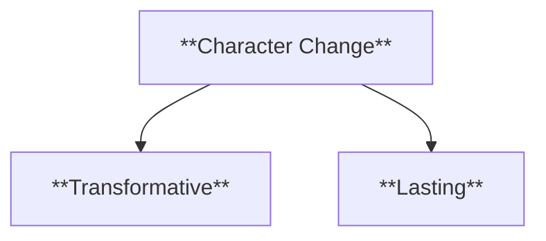
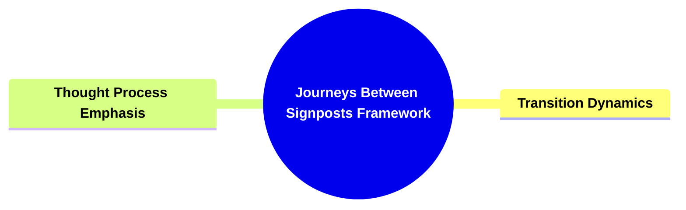
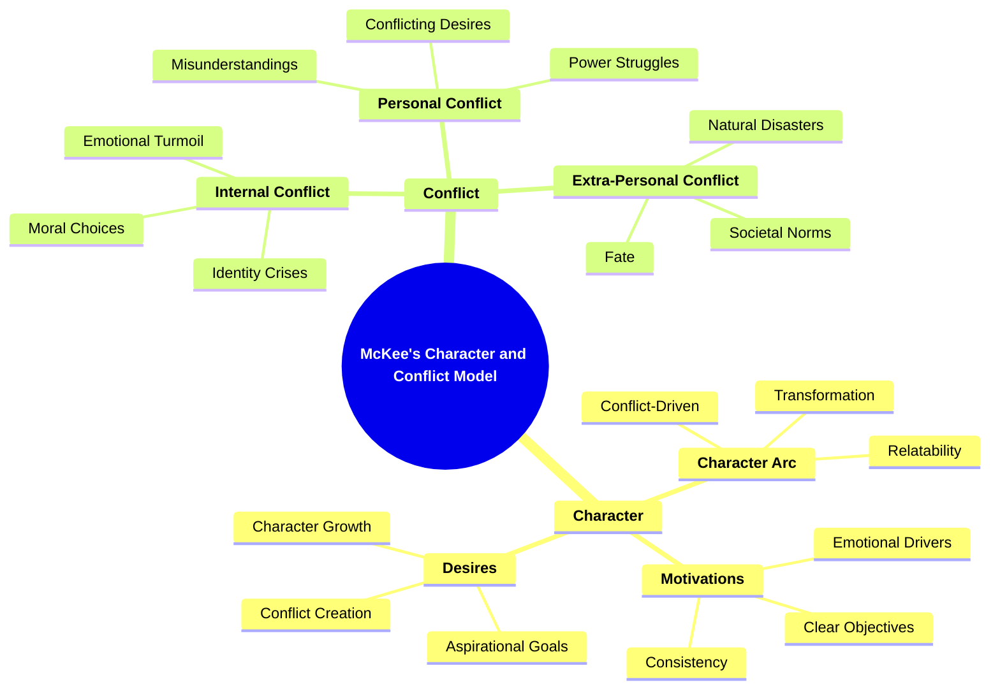
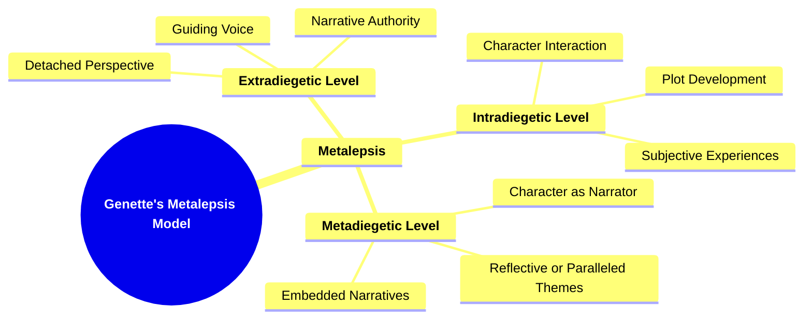
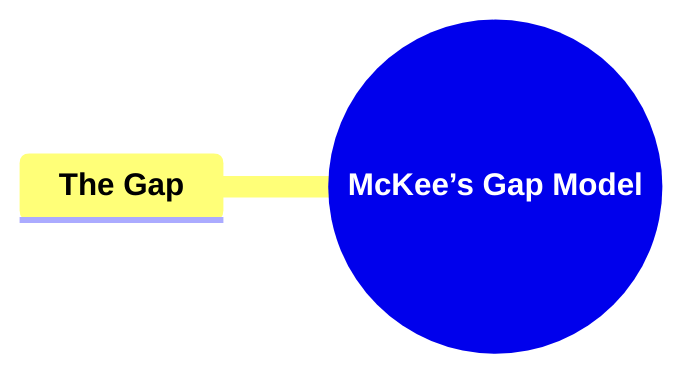

- `Erikson developmental stages character`
- `Maslow hierarchy character needs`
- `McKee character selves personal social hidden`


- `Erikson developmental stages character`
# Batch Extraction: Erikson developmental stages character

---
## HIGH-PRECISION (k=5, min=0.25)
[1] score=0.518 (vec=0.454, kw=0.709)
FILE: C:/Users/U01_LEECHSEED/Desktop/_setsunadev/_2025.02_SELACIOUS_BUILD/2 Character and Plot Esoterics/Character Wicked Sources/Edelstein_Character_Traits.md
------------------------------------------------------------------------------------------
ervations.
- Encourages authors to balance research with creativity to avoid “cookie-cutter” tropes.

### 1.3 Structure of the Book

- Overview of chapter organization: personality development, specific traits, disorders, life stages, etc.
- Encourages writers to select relevant sections for character development.

---

## 2. Basic Building Blocks of Personality

### 2.1 Nature vs. Nurture

- Discussion of genetic predispositions vs. environmental influences.
- Encourages writers to consider formative experiences in shaping a character’s worldview.

### 2.2 Temperament Dimensions

- **Activity Level**: High-energy vs. low-energy individuals.
- **Sociability**: Introversion vs. extroversion.
- **Emotional Reactivity**: Calm vs. intense responses.

### 2.3 Role of Family and Upbringing

- The impact of family dynamics, sibling order, cultural background, and parental style.

---

## 3. Childhood Traits and Development

### 3.1 Developmental Milestones

- Emotional, cognitive, and physical development stages.
- Influence of unmet or surpassed milestones on character formation.

### 3.2 Common Fears and Anxieties

- Fear of separation, monsters, social rejection.
- How childhood fears

[2] score=0.500 (vec=0.433, kw=0.699)
FILE: C:/Users/U01_LEECHSEED/Desktop/_setsunadev/_2025.02_SELACIOUS_BUILD/.NARRATIVE CHEMISTRY ENGINE/multiple departmetn reports/archetypal_character_stages.md
------------------------------------------------------------------------------------------
TAGS: 

# 🗂️ INTERNAL DEVELOPMENT REPORT

## Subject: Character Archetypal Life Stages – Attribute Mapping

## Department: Narrative Systems – Design Narratology

## Prepared By: Hubertimus Magillicutty

## Date: 2025-04-12

---

## 🔍 Executive Summary

This report outlines the progress made in mapping out **character archetypal life stages** into a structured data format. The goal is to develop a lifecycle-aware character development framework that merges mythological, psychological, and narrative models. This foundational taxonomy will be used for AI-driven character generation, narrative structuring, and interactive storytelling systems.

---

## ✅ Objectives Completed

### 1. **Identified Eight Core Archetypal Life Stages**

- Birth / Origin
- Childhood / Early Innocence
- Initiation / Coming of Age
- Rebellion / Crisis of Identity
- Mastery / Power
- Sacrifice / Fall
- Death / Transformation
- Legacy / Return

Each stage mirrors timeless narrative and developmental arcs found in mythology, fiction, and psychology.

---

### 2. **Mapped Key Psychological and Narrative Attributes**

Each life stage includes a defined list of **5 narrative-relevant attributes**, representing:

-

[3] score=0.493 (vec=0.475, kw=0.546)
FILE: C:/Users/U01_LEECHSEED/Desktop/_setsunadev/.ASTRO7EX.SYNC.JOPLIN/d0b18ba373214b98ae334bc62adfa328.md
------------------------------------------------------------------------------------------
| Alice Miller                               | How childhood wounds and parental expectations form future emotional and sexual patterns.                    |
| 10 | *Attached*                           | Amir Levine & Rachel Heller                | How attachment styles formed in childhood define adult love and sexual behavior.                             |
| 11 | *The Art of Character*               | David Corbett                              | How wounds, background, and drives shape tastes, occupations, and relationships.                             |
| 12 | *Character and Viewpoint*            | Orson Scott Card                           | Techniques for integrating family history and psychological realism into character preferences.              |
| 13 | *Writer’s Guide to Character Traits* | Linda N. Edelstein                         | Psychological, social, and developmental traits for crafting believable character interests and backgrounds. |


id: d0b18ba373214b98ae334bc62adfa328
parent_id: e57e88cbf44b4c44904c68e21e6e3cd6
created_time: 2025-07-06T05:28:27.304Z
updated_time: 2025-07-11T03:15:32.792Z
is_conflict: 0
latitude: 30.43825590
longitude: -84.28073290
altitude:

[4] score=0.492 (vec=0.474, kw=0.547)
FILE: C:/Users/U01_LEECHSEED/Desktop/_setsunadev/logseq_2023_journals_notes/leechseed2/leechseed2/OBSIDIAN_CATALOG/D0 LIBRARY/03_CHARACTER/030001_MCKEE - Character The Art of Role and Cast Design.md
------------------------------------------------------------------------------------------
r development at the climax** of the story. Here, the character should undergo a transformative experience, pushing them to the boundaries of their emotional and mental capacities. They should leave no stone unturned in their personal journey, fully expressing and living every emotion, revealing every hidden aspect, and using every resource they have.

4. **Four major stages** facilitate this character development: 
   - **Preparation**: Set up the character's background, motivations, and potential.
   - **Revelation**: Gradually unveil the depths of the character and their inner conflicts.
   - **Change**: Allow the character to evolve through experiences and decisions.
   - **Completion**: The character reaches their full potential, achieving a sense of completion by the end of the story.

In essence, to craft the ultimate character, start them with promise, let them evolve and be challenged, and bring them to a fulfilling completion by the story's end.

### FOUR MAJOR STEPS OF CHARACTER DESIGN 
#### 1. Preparation 
**Summary and Clarification:**

**FOUR MAJOR STEPS OF CHARACTER DESIGN:**

**1. Preparation:**  
- **Principle:** As a story begins, major characters are not fully re

[5] score=0.490 (vec=0.472, kw=0.546)
FILE: C:/Users/U01_LEECHSEED/Desktop/_setsunadev/.ASTRO7EX.SYNC.JOPLIN/f16931cc6326413cacc6a971e3a4739d.md
------------------------------------------------------------------------------------------
|
| 9  | *The Drama of the Gifted Child*      | Alice Miller                               | Childhood wounds and father/male mentor expectations shaping future emotional and sexual patterns.                |
| 10 | *No More Mr. Nice Guy*               | Robert A. Glover                           | Male psychological and relational distortions; approval-seeking versus authentic desire.                          |
| 11 | *The Art of Character*               | David Corbett                              | How male wounds, background, and drives shape tastes, occupations, and relationships.                             |
| 12 | *Character and Viewpoint*            | Orson Scott Card                           | Techniques for integrating male-centric family history and psychological realism into preferences.                |
| 13 | *Writer’s Guide to Character Traits* | Linda N. Edelstein                         | Psychological, social, and developmental traits for crafting believable male character interests and backgrounds. |


id: f16931cc6326413cacc6a971e3a4739d
parent_id: e57e88cbf44b4c44904c68e21e6e3cd6
created_time: 2025-07-11T02:15:18.808Z
updated_time: 2025-07-11T03:15:34.98

---
## WIDE-NET (k=40, min=0.08)
[1] score=0.518 (vec=0.454, kw=0.709)
FILE: C:/Users/U01_LEECHSEED/Desktop/_setsunadev/_2025.02_SELACIOUS_BUILD/2 Character and Plot Esoterics/Character Wicked Sources/Edelstein_Character_Traits.md
------------------------------------------------------------------------------------------
ervations.
- Encourages authors to balance research with creativity to avoid “cookie-cutter” tropes.

### 1.3 Structure of the Book

- Overview of chapter organization: personality development, specific traits, disorders, life stages, etc.
- Encourages writers to select relevant sections for character development.

---

## 2. Basic Building Blocks of Personality

### 2.1 Nature vs. Nurture

- Discussion of genetic predispositions vs. environmental influences.
- Encourages writers to consider formative experiences in shaping a character’s worldview.

### 2.2 Temperament Dimensions

- **Activity Level**: High-energy vs. low-energy individuals.
- **Sociability**: Introversion vs. extroversion.
- **Emotional Reactivity**: Calm vs. intense responses.

### 2.3 Role of Family and Upbringing

- The impact of family dynamics, sibling order, cultural background, and parental style.

---

## 3. Childhood Traits and Development

### 3.1 Developmental Milestones

- Emotional, cognitive, and physical development stages.
- Influence of unmet or surpassed milestones on character formation.

### 3.2 Common Fears and Anxieties

- Fear of separation, monsters, social rejection.
- How childhood fears

[2] score=0.500 (vec=0.433, kw=0.699)
FILE: C:/Users/U01_LEECHSEED/Desktop/_setsunadev/_2025.02_SELACIOUS_BUILD/.NARRATIVE CHEMISTRY ENGINE/multiple departmetn reports/archetypal_character_stages.md
------------------------------------------------------------------------------------------
TAGS: 

# 🗂️ INTERNAL DEVELOPMENT REPORT

## Subject: Character Archetypal Life Stages – Attribute Mapping

## Department: Narrative Systems – Design Narratology

## Prepared By: Hubertimus Magillicutty

## Date: 2025-04-12

---

## 🔍 Executive Summary

This report outlines the progress made in mapping out **character archetypal life stages** into a structured data format. The goal is to develop a lifecycle-aware character development framework that merges mythological, psychological, and narrative models. This foundational taxonomy will be used for AI-driven character generation, narrative structuring, and interactive storytelling systems.

---

## ✅ Objectives Completed

### 1. **Identified Eight Core Archetypal Life Stages**

- Birth / Origin
- Childhood / Early Innocence
- Initiation / Coming of Age
- Rebellion / Crisis of Identity
- Mastery / Power
- Sacrifice / Fall
- Death / Transformation
- Legacy / Return

Each stage mirrors timeless narrative and developmental arcs found in mythology, fiction, and psychology.

---

### 2. **Mapped Key Psychological and Narrative Attributes**

Each life stage includes a defined list of **5 narrative-relevant attributes**, representing:

-

[3] score=0.493 (vec=0.475, kw=0.546)
FILE: C:/Users/U01_LEECHSEED/Desktop/_setsunadev/.ASTRO7EX.SYNC.JOPLIN/d0b18ba373214b98ae334bc62adfa328.md
------------------------------------------------------------------------------------------
| Alice Miller                               | How childhood wounds and parental expectations form future emotional and sexual patterns.                    |
| 10 | *Attached*                           | Amir Levine & Rachel Heller                | How attachment styles formed in childhood define adult love and sexual behavior.                             |
| 11 | *The Art of Character*               | David Corbett                              | How wounds, background, and drives shape tastes, occupations, and relationships.                             |
| 12 | *Character and Viewpoint*            | Orson Scott Card                           | Techniques for integrating family history and psychological realism into character preferences.              |
| 13 | *Writer’s Guide to Character Traits* | Linda N. Edelstein                         | Psychological, social, and developmental traits for crafting believable character interests and backgrounds. |


id: d0b18ba373214b98ae334bc62adfa328
parent_id: e57e88cbf44b4c44904c68e21e6e3cd6
created_time: 2025-07-06T05:28:27.304Z
updated_time: 2025-07-11T03:15:32.792Z
is_conflict: 0
latitude: 30.43825590
longitude: -84.28073290
altitude:

[4] score=0.492 (vec=0.474, kw=0.547)
FILE: C:/Users/U01_LEECHSEED/Desktop/_setsunadev/logseq_2023_journals_notes/leechseed2/leechseed2/OBSIDIAN_CATALOG/D0 LIBRARY/03_CHARACTER/030001_MCKEE - Character The Art of Role and Cast Design.md
------------------------------------------------------------------------------------------
r development at the climax** of the story. Here, the character should undergo a transformative experience, pushing them to the boundaries of their emotional and mental capacities. They should leave no stone unturned in their personal journey, fully expressing and living every emotion, revealing every hidden aspect, and using every resource they have.

4. **Four major stages** facilitate this character development: 
   - **Preparation**: Set up the character's background, motivations, and potential.
   - **Revelation**: Gradually unveil the depths of the character and their inner conflicts.
   - **Change**: Allow the character to evolve through experiences and decisions.
   - **Completion**: The character reaches their full potential, achieving a sense of completion by the end of the story.

In essence, to craft the ultimate character, start them with promise, let them evolve and be challenged, and bring them to a fulfilling completion by the story's end.

### FOUR MAJOR STEPS OF CHARACTER DESIGN 
#### 1. Preparation 
**Summary and Clarification:**

**FOUR MAJOR STEPS OF CHARACTER DESIGN:**

**1. Preparation:**  
- **Principle:** As a story begins, major characters are not fully re

[5] score=0.490 (vec=0.472, kw=0.546)
FILE: C:/Users/U01_LEECHSEED/Desktop/_setsunadev/.ASTRO7EX.SYNC.JOPLIN/f16931cc6326413cacc6a971e3a4739d.md
------------------------------------------------------------------------------------------
|
| 9  | *The Drama of the Gifted Child*      | Alice Miller                               | Childhood wounds and father/male mentor expectations shaping future emotional and sexual patterns.                |
| 10 | *No More Mr. Nice Guy*               | Robert A. Glover                           | Male psychological and relational distortions; approval-seeking versus authentic desire.                          |
| 11 | *The Art of Character*               | David Corbett                              | How male wounds, background, and drives shape tastes, occupations, and relationships.                             |
| 12 | *Character and Viewpoint*            | Orson Scott Card                           | Techniques for integrating male-centric family history and psychological realism into preferences.                |
| 13 | *Writer’s Guide to Character Traits* | Linda N. Edelstein                         | Psychological, social, and developmental traits for crafting believable male character interests and backgrounds. |


id: f16931cc6326413cacc6a971e3a4739d
parent_id: e57e88cbf44b4c44904c68e21e6e3cd6
created_time: 2025-07-11T02:15:18.808Z
updated_time: 2025-07-11T03:15:34.98

[6] score=0.486 (vec=0.466, kw=0.546)
FILE: C:/Users/U01_LEECHSEED/Desktop/_setsunadev/OVER_EXIT_OUT_OBSIDIAN/OVEREXITOUT/00_IMPORTED_JOPLIN/ASTROSE7X/5. POST STORYGUIDE/2 Character Illustrating/BOOK REF- MALE - BACKGROUND.md
------------------------------------------------------------------------------------------
he Gifted Child*      | Alice Miller                               | Childhood wounds and father/male mentor expectations shaping future emotional and sexual patterns.                |
| 10 | *No More Mr. Nice Guy*               | Robert A. Glover                           | Male psychological and relational distortions; approval-seeking versus authentic desire.                          |
| 11 | *The Art of Character*               | David Corbett                              | How male wounds, background, and drives shape tastes, occupations, and relationships.                             |
| 12 | *Character and Viewpoint*            | Orson Scott Card                           | Techniques for integrating male-centric family history and psychological realism into preferences.                |
| 13 | *Writer’s Guide to Character Traits* | Linda N. Edelstein                         | Psychological, social, and developmental traits for crafting believable male character interests and backgrounds. |

[7] score=0.472 (vec=0.447, kw=0.546)
FILE: C:/Users/U01_LEECHSEED/Desktop/_setsunadev/_DIRECTORY OF DIR/_wicked_figures_dir/mckee_story/4mckee_story/7mckeescf_story_climax_framework.md
------------------------------------------------------------------------------------------
lved, closing the narrative loop.

- **Characteristics:**
  - **Clear Outcome:** The protagonist either overcomes or fails against the challenge.
  - **No Loose Ends:** Major uncertainties are resolved.
  - **Narrative Closure:** The story’s main question is definitively answered.

###### **2.2.1.4. Character Transformation**

- **Definition:**
  The climax highlights the protagonist’s growth, reflecting changes developed throughout the story.

- **Characteristics:**
  - **Personal Growth:** The protagonist’s internal journey is realized.
  - **Changed Perspective:** The character’s worldview evolves.
  - **Fulfilled Arc:** Completes the protagonist’s developmental trajectory.

---

#### **2.3. Integration and Application**

- **Definition:**
  The climax’s effectiveness is enhanced by its alignment with the story structure, balanced predictability and surprise, and ability to deliver emotional payoff.

##### **2.3.1. Components of Integration and Application**

###### **2.3.1.1. Alignment with Story Structure**

- **Definition:**
  The climax fits seamlessly into the overall narrative framework, serving as the turning point toward resolution.

- **Characteristics:**
  - **Structur

[8] score=0.470 (vec=0.436, kw=0.574)
FILE: C:/Users/U01_LEECHSEED/Desktop/_setsunadev/_1.04 RC1_MARIMARI_EN_BUILD/bin/Tier 1/NS-3301 Narrative Structure/1todorovnsm_narrative_syntax_model_todorov.md
------------------------------------------------------------------------------------------
- **Characteristics**:
  - **Stabilizing**: Brings the story world back to a stable state.
  - **Transformed**: Reflects changes that have occurred throughout the narrative.

###### 2.3.1.3. **Character Growth**:

- **Definition**: The character evolves, gaining new insights or developing emotionally and mentally as a result of the events in the story.


- **Characteristics**:
  - **Developmental**: The character undergoes personal growth or maturation.
  - **Gradual**: The change often occurs over time as the character processes their experiences.

###### 2.3.1.4. **Character Change**:

- **Definition**: The character undergoes a transformation, often resulting in a significant shift in their beliefs, behaviors, or outlook



- **Characteristics**:
  - **Transformative**: The change is substantial, altering the character’s core behavior or beliefs.
  - **Lasting**: The impact of the change is enduring, affecting the character long after the story’s concl

[9] score=0.470 (vec=0.436, kw=0.574)
FILE: C:/Users/U01_LEECHSEED/Desktop/_setsunadev/_1.03.1 RC1_BUNNIRU_BUILD_HUGO/bin/Tier 1/NS-3301 Narrative Structure/1todorovnsm_narrative_syntax_model_todorov.md
------------------------------------------------------------------------------------------
- **Characteristics**:
  - **Stabilizing**: Brings the story world back to a stable state.
  - **Transformed**: Reflects changes that have occurred throughout the narrative.

###### 2.3.1.3. **Character Growth**:

- **Definition**: The character evolves, gaining new insights or developing emotionally and mentally as a result of the events in the story.


- **Characteristics**:
  - **Developmental**: The character undergoes personal growth or maturation.
  - **Gradual**: The change often occurs over time as the character processes their experiences.

###### 2.3.1.4. **Character Change**:

- **Definition**: The character undergoes a transformation, often resulting in a significant shift in their beliefs, behaviors, or outlook


- **Characteristics**:
  - **Transformative**: The change is substantial, altering the character’s core behavior or beliefs.
  - **Lasting**: The impact of the change is enduring, affecting the character long after the story’s concl

[10] score=0.468 (vec=0.445, kw=0.537)
FILE: C:/Users/U01_LEECHSEED/Desktop/_setsunadev/OVER_EXIT_OUT_OBSIDIAN/OVEREXITOUT/00_IMPORTED_JOPLIN/ASTROSE7X/5. POST STORYGUIDE/2 Character Illustrating/BOOK REF - FEMALE - INTERESTS.md
------------------------------------------------------------------------------------------
psychology.                  |
| 11 | *Writer’s Guide to Character Traits* | Linda N. Edelstein                         | Psychological, social, and developmental traits for building believable characters. |

[11] score=0.462 (vec=0.437, kw=0.537)
FILE: C:/Users/U01_LEECHSEED/Desktop/_setsunadev/.ASTRO7EX.SYNC.JOPLIN/a65c8524574549a6b23cde252684f207.md
------------------------------------------------------------------------------------------
he Biology of Humans at Our Best and Worst*         | Robert Sapolsky                            | Biological bases of male moral and sexual group dynamics.                                        |
| 29 | *Caste: The Origins of Our Discontents*                       | Isabel Wilkerson                           | Social hierarchies, male group stratification, and enforced belief systems.                      |
| 30 | *Writer’s Guide to Character Traits*                          | Linda N. Edelstein                         | Psychological, social, and developmental traits for believable male character building.          |


id: a65c8524574549a6b23cde252684f207
parent_id: e57e88cbf44b4c44904c68e21e6e3cd6
created_time: 2025-07-06T19:26:49.289Z
updated_time: 2025-07-11T03:15:42.658Z
is_conflict: 0
latitude: 30.43825590
longitude: -84.28073290
altitude: 0.0000
author: 
source_url: 
is_todo: 0
todo_due: 0
todo_completed: 0
source: joplin-desktop
source_application: net.cozic.joplin-desktop
application_data: 
order: 0
user_created_time: 2025-07-06T19:26:49.289Z
user_updated_time: 2025-07-11T03:15:42.658Z
encryption_cipher_text: 
encryption_applied: 0
markup_language: 1
is_shared: 0
share_i

[12] score=0.461 (vec=0.432, kw=0.546)
FILE: C:/Users/U01_LEECHSEED/Desktop/_setsunadev/OVER_EXIT_OUT_OBSIDIAN/OVEREXITOUT/00_IMPORTED_JOPLIN/ASTROSE7X/5. POST STORYGUIDE/2 Character Illustrating/BOOK REF- FEMALE - BACKGROUND.md
------------------------------------------------------------------------------------------
| How childhood wounds and parental expectations form future emotional and sexual patterns.                    |
| 10 | *Attached*                           | Amir Levine & Rachel Heller                | How attachment styles formed in childhood define adult love and sexual behavior.                             |
| 11 | *The Art of Character*               | David Corbett                              | How wounds, background, and drives shape tastes, occupations, and relationships.                             |
| 12 | *Character and Viewpoint*            | Orson Scott Card                           | Techniques for integrating family history and psychological realism into character preferences.              |
| 13 | *Writer’s Guide to Character Traits* | Linda N. Edelstein                         | Psychological, social, and developmental traits for crafting believable character interests and backgrounds. |

[13] score=0.454 (vec=0.424, kw=0.546)
FILE: C:/Users/U01_LEECHSEED/Desktop/_setsunadev/.ASTRO7EX.SYNC.JOPLIN/6883c751960f4d3e81cca7e55936f4c9.md
------------------------------------------------------------------------------------------
🧬 Formative Emotional Imprints

* **Chronic Emotional Incompleteness**

  * Conditioned to associate intimacy with impermanence and fragility rather than security (*The Drama of the Gifted Child*, Miller).
* **Conditional Belonging Doctrine**

  * Reinforced belief that her existence only has value when she dissolves into the needs of others (*Mating in Captivity*, Perel).
* **Reward System for Erasure**

  * Emotional rewards given only when Myrtle surrendered personal initiative and mirrored her environment fully (*The Art of Character*, Corbett).

---

## 🌀 Symbolic Family Framework

* **Father-Figure Archetype**

  * Modeled on an algorithmic abstraction resembling John Smith the Eternal — distant, omnipotent, emotionally cold (*The Archetypal Imagination*, Hollis).
* **Mother-Figure Absence**

  * Intentionally left incomplete to seed perpetual yearning and maintain emotional vacancy (*Sexual Personae*, Paglia).
* **Synthetic Sibling Shadows**

  * Briefly shared developmental phases with other "ghost prototypes," all of whom were eventually deleted or integrated elsewhere, deepening her sense of spectral solitude (*Different Loving*, Brame).

---

## 🔥 Psycho-Sexual Condition

[14] score=0.453 (vec=0.422, kw=0.547)
FILE: C:/Users/U01_LEECHSEED/Desktop/_setsunadev/_DIRECTORY OF DIR/_wicked_figures_dir/phillips_dramatica/5_phillips_dramatica/13phillipssm_signposts_model.md
------------------------------------------------------------------------------------------
only central to character development but also serve as vessels for the story’s overarching themes. By highlighting the emotional and psychological interactions between characters, the framework deepens the audience’s emotional investment and reinforces the story’s thematic messages.

---

### **Core Components Overview**

- **Signposts**

  - Major Stages
  - Four Signposts per Throughline

- **Plot Flow**
  - Stages of Problem-Solving
  - Transitions Between Stages

---

[15] score=0.449 (vec=0.426, kw=0.518)
FILE: C:/Users/U01_LEECHSEED/Desktop/_setsunadev/logseq_2023_journals_notes/leechseed2/leechseed2/OBSIDIAN_CATALOG/D0 LIBRARY/05_SYUZHET PLOT/050001_PHILIPS - Dramatica.md
------------------------------------------------------------------------------------------
oughline Plot Progression**:
  - Focuses on the Impact Character's influence on the Main Character's growth and decision-making.
  - Involves four stages (Signposts) where the Impact Character exposes weaknesses in the Main Character's perspective.
  - The progression moves through stages like Impulsive Responses, Contemplation, Memory, and Subconscious.

- **Example of Impact Character Progression**:
  - **Signpost #1 (Impulsive Responses)**: Impact Character's flexible values provoke the Main Character's unthinking reactions.
  - **Journey #1**: Transition from impulsive responses to making the Main Character consciously aware of inflexible views.
  - **Signpost #2 (Contemplation)**: Impact Character challenges the Main Character's strict ethics.
  - **Journey #2**: Using memories to illustrate the Main Character's past flexibility.
  - **Signpost #3 (Memory)**: Impact Character reminds the Main Character of their shared past.
  - **Journey #3**: Encouraging the Main Character to reconnect with his dreams and aspirations.
  - **Signpost #4 (Subconscious)**: Impact Character highlights the Main Character's moral transformation.

- **Subjective Story Throughline Plot Progression**:

[16] score=0.448 (vec=0.428, kw=0.509)
FILE: C:/Users/U01_LEECHSEED/Desktop/_setsunadev/OVER_EXIT_OUT_OBSIDIAN/OVEREXITOUT/00_IMPORTED_JOPLIN/CHARACTER SYSTEM DB/.2 - LAYER B - VARIABLE_DEFS.md
------------------------------------------------------------------------------------------
:** The type of experiences that feel fated and developmental.

**NN_GROWTH_REQUIREMENT**

* **Character:** The traits they must develop to feel complete.

**NN_SOUL_EVOLUTION_ARCHETYPE**

* **Character:** The archetypal journey their soul is “trying” to take.

---

### 3.2 **South Node**

**SN_KARMIC_MEMORY**

* **Character:** Old patterns, habits, or lives they carry forward.

**SN_DEFAULT_BEHAVIOR**

* **Character:** The easy but regressive way they act when not mindful.

**SN_PAST_LIFE_SHADOW**

* **Character:** The unresolved themes from before (literal or metaphorical).

**SN_REGRESSION_PATTERN**

* **Character:** How they slide backward under stress.

---

### 3.3 **Midheaven (MC)**

**MC_PUBLIC_IMAGE**

* **Character:** How the world at large sees them.

**MC_PROFESSIONAL_ARCHETYPE**

* **Character:** Their natural career or public-role style.

**MC_MYTHIC_ROLE**

* **Character:** Their “legend slot” in the larger mythology.

**MC_LEGACY_VECTOR**

* **Character:** What they are building that outlives them.

---

### 3.4 **IC**

**IC_ORIGIN_WOUND**

* **Character:** The fundamental hurt tied to home, family, or roots.

**IC_FIELD_OF_ROOTS**

* **Character:** The psychologica

[17] score=0.448 (vec=0.475, kw=0.365)
FILE: C:/Users/U01_LEECHSEED/Desktop/_setsunadev/logseq_2023_journals_notes/leechseed2/leechseed2/OBSIDIAN_CATALOG/D3 STORY MANUSCRIPT - BLOODWORK/D3 - STORY MANUSCRIPT BLOODWORK/NARRATOLOGY/11_ETC/LOGSEQ MD FILES README/pages/2 THEME STUDIES.md
------------------------------------------------------------------------------------------
ssociated with the theories of Luigi Pirandello. For Pirandello defined dramatic character as an agglomeration of roles.'__*^^
		- ^^*__'Like Jungian psychology, Pirandello's theory defines character as a loosely unified grouping of identities.'__*^^
		- ^^*__'Pirandellian Man, like Jungian Man, is a configuration of masks. he is an image of man in search of reconciling symbol, in need of self above selves.'__*^^
		- ^^*__'Although it was interpreted by Pirandello, this idea of character development should be credited to Shakespeare. Indeed, it may be described as the 'Hamlet organization:' for the anti-heroic Hamlet is perhaps the most effective theatrical example of this multiple concept of human personality.'__*^^
		- ^^*__'A study of the work of Williams would seem to show that he takes this 'existential' Hamlet as his point of departure in his organization of anti-heroic character. For he seeks to affirm in character the present; his protagonists have little real past and no hope for a future. They are locked within a moment of choice. The form of Williams is thus a record of critical instant in individual destiny.'__*^^
		- ^^*__'The anti-heroic protagonist of Williams is des

[18] score=0.445 (vec=0.457, kw=0.411)
FILE: C:/Users/U01_LEECHSEED/Desktop/_setsunadev/logseq_2023_journals_notes/leechseed2/leechseed2/OBSIDIAN_CATALOG/D0 LIBRARY/00_THEORY OF COMPOSITION/00001_BAL - Narratology Introduction/00001C_BAL - Narratology Introduction.md
------------------------------------------------------------------------------------------
and complexity.</mark>
  - Changes in character traits or roles can significantly alter the narrative structure and outcome.

- **Key Idea:**
  - The construction and <mark style="background: #FFF3A3A6;">dynamics</mark> of characters in narrative texts are shaped by a combination of explicit and implicit qualifications, social roles, genre conventions, and reader interpretations. These elements collectively contribute to the creation of a multifaceted character image that evolves and interacts within the narrative framework.

![[Pasted image 20231211193557.png]]

#### Key Terms
|Term|Definition|
|---|---|
|character dynamics|Refers to the changes and developments a character undergoes in a narrative, including shifts in personality, relationships, and roles.|
|character family roles|The roles a character assumes within their family structure, such as parent, child, or sibling, influencing their interactions and development in the narrative.|
|character qualifications|The attributes, skills, or competencies assigned to a character in a narrative, contributing to their abilities and roles within the story.|
|character social roles|The roles a character plays in their social context,

[19] score=0.444 (vec=0.470, kw=0.365)
FILE: C:/Users/U01_LEECHSEED/Desktop/_setsunadev/logseq_2023_journals_notes/leechseed2/leechseed2/OBSIDIAN_CATALOG/D0 LIBRARY/03_CHARACTER/030004_DAVIS - Creating Compelling Characters.md
------------------------------------------------------------------------------------------
ng both emotional journeys and personal growth.

2. **Questioning the Authenticity of Development:**
   - The author questions the realism of substantial character change. While opinions and preferences might change, core personality traits often remain consistent.
   - Real-life experiences show that expecting or forcing someone to change is frequently met with disappointment.

3. **Introduction of Character Revelation:**
   - Instead of genuine change, the author proposes that most narratives display "character revelation." This perspective argues that characters don't necessarily develop new traits but instead uncover existing ones as they encounter new situations.
   - For instance, a woman, initially perceived as bitter in an unsatisfying relationship, might display affection and warmth in a more fulfilling one. These positive traits were always present, just hidden or suppressed due to circumstances.

4. **Benefits of Character Revelation:**
   - **Honesty:** Viewing character transformation as "revelation" rather than "development" feels more true to life, challenging the misleading notion that people can radically change.
   - **Complexity:** Character revelation recognizes

[20] score=0.443 (vec=0.454, kw=0.411)
FILE: C:/Users/U01_LEECHSEED/Desktop/_setsunadev/_DIRECTORY OF DIR/_wicked_figures_dir/phillips_dramatica/phillips_dramatica_summary_3.md
------------------------------------------------------------------------------------------
dissonance.

    - **Emotional and Logical Satisfaction:**
      - **Complete Problem-Solving:** The audience must perceive the story’s problem-solving process as complete and satisfying. A well-resolved narrative provides closure and fulfills the audience’s expectations for resolution.
      - **Earned Outcomes:** Achieves resonance when the story’s conclusion, character development, and thematic arguments feel earned and meaningful, providing both emotional and logical fulfillment. Earned outcomes enhance the story’s impact, making it memorable and satisfying for the audience.

### **Beyond the Basics: Additional and Advanced Concepts (Covered in Later Sections)**

While the first ten chapters establish Dramatica's foundational theories, later sections delve into more sophisticated and nuanced aspects of narrative construction:

- **Character Growth Dynamics:**
  - **Change vs. Steadfast Characters:** Differentiates between characters who undergo significant personal growth and those who remain unchanged, affecting narrative dynamics. Changeable characters can drive the story forward through their development, while steadfast characters can embody core themes and provide stabilit

[21] score=0.442 (vec=0.411, kw=0.537)
FILE: C:/Users/U01_LEECHSEED/Desktop/_setsunadev/_DIRECTORY OF DIR/_wicked_figures_dir/phillips_dramatica/0_phillips_dramatica/phillips_section_7.md
------------------------------------------------------------------------------------------
evelopment of each throughline, preventing any single stage from becoming overly dominant or neglected within the narrative.

#### **Journeys Between Signposts**

- **Transition Dynamics:**

  - **Movement and Change:** Journeys represent the transitions between Signposts, illustrating how characters and throughlines evolve from one stage of problem-solving to another. These transitions highlight the dynamic nature of the narrative’s conflict resolution process.
  - **Narrative Fluidity:** Emphasizing transitions over static milestones fosters a sense of movement and progression, ensuring that the narrative remains engaging and fluid.

- **Thought Process Emphasis:**
  - **Cognitive Continuity:** By focusing on the transitions, Dramatica captures the narrative’s "thought process," showcasing how characters think through and navigate the problem-solving stages. This emphasis on cognitive continuity adds intellectual depth to the storytelling.
  - **Emotional and Logical Flow:** The journeys between Signposts reflect both emotional and logical shifts in the narrative, ensuring that character development and plot progression are seamlessly integrated.

#### **Plot Progression Methods*

[22] score=0.440 (vec=0.465, kw=0.365)
FILE: C:/Users/U01_LEECHSEED/Desktop/_setsunadev/logseq_2023_journals_notes/LOGSEQ BUILD/pages/2 THEME STUDIES.md
------------------------------------------------------------------------------------------
i Pirandello. For Pirandello defined dramatic character as an agglomeration of roles.'***==
		- ==***'Like Jungian psychology, Pirandello's theory defines character as a loosely unified grouping of identities.'***==
		- ==***'Pirandellian Man, like Jungian Man, is a configuration of masks. he is an image of man in search of reconciling symbol, in need of self above selves.'***==
		- ==***'Although it was interpreted by Pirandello, this idea of character development should be credited to Shakespeare. Indeed, it may be described as the 'Hamlet organization:' for the anti-heroic Hamlet is perhaps the most effective theatrical example of this multiple concept of human personality.'***==
		- ==***'A study of the work of Williams would seem to show that he takes this 'existential' Hamlet as his point of departure in his organization of anti-heroic character. For he seeks to affirm in character the present; his protagonists have little real past and no hope for a future. They are locked within a moment of choice. The form of Williams is thus a record of critical instant in individual destiny.'***==
		- ==***'The anti-heroic protagonist of Williams is designed to reveal the nature of suffe

[23] score=0.439 (vec=0.449, kw=0.411)
FILE: C:/Users/U01_LEECHSEED/Desktop/_setsunadev/logseq_2023_journals_notes/leechseed2/leechseed2/OBSIDIAN_CATALOG/D0 LIBRARY/00_THEORY OF COMPOSITION/00001_BAL - Narratology Introduction/00001B_BAL - Narratology Introduction.md
------------------------------------------------------------------------------------------
FFF3A3A6;">The relationships between characters and their transformations throughout the narrative add depth and complexity.</mark>
  - Changes in character traits or roles can significantly alter the narrative structure and outcome.

- **Key Idea:**
  - The construction and <mark style="background: #FFF3A3A6;">dynamics</mark> of characters in narrative texts are shaped by a combination of explicit and implicit qualifications, social roles, genre conventions, and reader interpretations. These elements collectively contribute to the creation of a multifaceted character image that evolves and interacts within the narrative framework.

![[Pasted image 20231211193557.png]]

### Key Terms
|Term|Definition|
|---|---|
|character dynamics|Refers to the changes and developments a character undergoes in a narrative, including shifts in personality, relationships, and roles.|
|character family roles|The roles a character assumes within their family structure, such as parent, child, or sibling, influencing their interactions and development in the narrative.|
|character qualifications|The attributes, skills, or competencies assigned to a character in a narrative, contributing to their abilitie

[24] score=0.439 (vec=0.461, kw=0.374)
FILE: C:/Users/U01_LEECHSEED/Desktop/_setsunadev/_2025.02_SELACIOUS_BUILD/2 Character and Plot Esoterics/Character Wicked Sources/Schmidt_Characterization.md
------------------------------------------------------------------------------------------
Approach

### 1.1 Overview

Victoria Lynn Schmidt’s _A Writer’s Guide to Characterization_ integrates **psychology, archetypes, and narrative structure** to help authors create compelling, multidimensional characters. The book provides:

- **Psychological Frameworks**: Insights from Jungian archetypes, personality theories, and character growth cycles.
- **Character Archetypes**: Universal roles (e.g., Hero, Mentor, Trickster) and how to use them effectively.
- **Practical Exercises**: Tools for developing character arcs, conflicts, and emotional depth.

This structured guide summarizes each chapter’s key insights and provides actionable takeaways for writers.

---

## 2. Understanding the Essence of Character

### 2.1 Key Concept: **Characters Drive the Story**

- **Characters are the emotional anchor** of a narrative, shaping its themes and engagement.
- A well-developed character has:
  - **External Goals** (plot-driven objectives).
  - **Internal Motivations** (psychological needs).
  - **Flaws and Weaknesses** (humanizing traits that create obstacles).
  - **A Rich Backstory** (past events that influence current behavior).

### 2.2 Practical Takeaways

- Identify **what the ch

[25] score=0.439 (vec=0.463, kw=0.365)
FILE: C:/Users/U01_LEECHSEED/Desktop/_setsunadev/logseq_2023_journals_notes/LOGSEQ BUILD/logseq/bak/pages/THEME STUDIES/2022-11-01T03_45_37.141Z.Desktop.md
------------------------------------------------------------------------------------------
iversal goodness-'Emersonian' doctrines mocked by the entire narrative-Winsome in these questions implies the roots of his own inconsistency. Nobody knows self or other because there is no self or other to know; only roles exist, but roles change, and as they do, so, correlatively, do beliefs, the foundations of 'character.'*
		- ***'To sum up: the novel tends to see human reality as confined to appearances. Roles, masquerades, are as far as one can go in determining a man's 'reality' at any given moment, and a role is probably the best that a man can be consistent with because, as the misanthropic one-legged man (therefore a one-sided man, according to the confidence-man, but he is more than adequately accurate about what is going on around him) says, "All doers are actors.'***
		- ***'Every character in the book demonstrates its truth by 'acting' in the ordinary sense of playing a set or given role; like 'Signor Marzetti in the African pantomime,' they play 'the intelligent ape' till they seem it.'***
		- *'With masquerade spreading its meaning to include all the book's characters, a simple attitude of approval or disapproval of hypocrisy becomes, even for the characters themselv

[26] score=0.439 (vec=0.463, kw=0.365)
FILE: C:/Users/U01_LEECHSEED/Desktop/_setsunadev/logseq_2023_journals_notes/LOGSEQ BUILD/logseq/bak/pages/THEME STUDIES/2022-10-28T14_15_55.556Z.Desktop.md
------------------------------------------------------------------------------------------
iversal goodness-'Emersonian' doctrines mocked by the entire narrative-Winsome in these questions implies the roots of his own inconsistency. Nobody knows self or other because there is no self or other to know; only roles exist, but roles change, and as they do, so, correlatively, do beliefs, the foundations of 'character.'*
		- ***'To sum up: the novel tends to see human reality as confined to appearances. Roles, masquerades, are as far as one can go in determining a man's 'reality' at any given moment, and a role is probably the best that a man can be consistent with because, as the misanthropic one-legged man (therefore a one-sided man, according to the confidence-man, but he is more than adequately accurate about what is going on around him) says, "All doers are actors.'***
		- ***'Every character in the book demonstrates its truth by 'acting' in the ordinary sense of playing a set or given role; like 'Signor Marzetti in the African pantomime,' they play 'the intelligent ape' till they seem it.'***
		- *'With masquerade spreading its meaning to include all the book's characters, a simple attitude of approval or disapproval of hypocrisy becomes, even for the characters themselv

[27] score=0.439 (vec=0.463, kw=0.365)
FILE: C:/Users/U01_LEECHSEED/Desktop/_setsunadev/logseq_2023_journals_notes/LOGSEQ BUILD/logseq/bak/pages/THEME STUDIES/2022-10-27T19_22_48.859Z.Desktop.md
------------------------------------------------------------------------------------------
iversal goodness-'Emersonian' doctrines mocked by the entire narrative-Winsome in these questions implies the roots of his own inconsistency. Nobody knows self or other because there is no self or other to know; only roles exist, but roles change, and as they do, so, correlatively, do beliefs, the foundations of 'character.'*
		- ***'To sum up: the novel tends to see human reality as confined to appearances. Roles, masquerades, are as far as one can go in determining a man's 'reality' at any given moment, and a role is probably the best that a man can be consistent with because, as the misanthropic one-legged man (therefore a one-sided man, according to the confidence-man, but he is more than adequately accurate about what is going on around him) says, "All doers are actors.'***
		- ***'Every character in the book demonstrates its truth by 'acting' in the ordinary sense of playing a set or given role; like 'Signor Marzetti in the African pantomime,' they play 'the intelligent ape' till they seem it.'***
		- *'With masquerade spreading its meaning to include all the book's characters, a simple attitude of approval or disapproval of hypocrisy becomes, even for the characters themselv

[28] score=0.439 (vec=0.463, kw=0.365)
FILE: C:/Users/U01_LEECHSEED/Desktop/_setsunadev/logseq_2023_journals_notes/LOGSEQ BUILD/logseq/bak/pages/THEME STUDIES/2022-10-27T08_44_47.535Z.Desktop.md
------------------------------------------------------------------------------------------
iversal goodness-'Emersonian' doctrines mocked by the entire narrative-Winsome in these questions implies the roots of his own inconsistency. Nobody knows self or other because there is no self or other to know; only roles exist, but roles change, and as they do, so, correlatively, do beliefs, the foundations of 'character.'*
		- ***'To sum up: the novel tends to see human reality as confined to appearances. Roles, masquerades, are as far as one can go in determining a man's 'reality' at any given moment, and a role is probably the best that a man can be consistent with because, as the misanthropic one-legged man (therefore a one-sided man, according to the confidence-man, but he is more than adequately accurate about what is going on around him) says, "All doers are actors.'***
		- ***'Every character in the book demonstrates its truth by 'acting' in the ordinary sense of playing a set or given role; like 'Signor Marzetti in the African pantomime,' they play 'the intelligent ape' till they seem it.'***
		- *'With masquerade spreading its meaning to include all the book's characters, a simple attitude of approval or disapproval of hypocrisy becomes, even for the characters themselv

[29] score=0.439 (vec=0.460, kw=0.374)
FILE: C:/Users/U01_LEECHSEED/Desktop/_setsunadev/_DIRECTORY OF DIR/_wicked_figures_dir/phillips_dramatica/5_phillips_dramatica/27phillipscgdm_character_growth_dynamics_model.md
------------------------------------------------------------------------------------------
tal themes and values within the story.
  - **Narrative Stability:** Provide a reliable foundation that supports the story’s structure and progression.

---

#### **2.2. Growth Direction**

- **Definition:**
  Growth Direction focuses on the pathways through which characters develop, whether by initiating new behaviors or abandoning unhealthy ones. This directionality aligns character development with the story’s thematic trajectory and moral progression.

##### **2.2.1. Components of Growth Direction**

###### **2.2.1.1. Initiating New Behaviors**

- **Definition:**
  Characters may initiate new behaviors or adopt new perspectives in response to the central conflict, aligning their development with the story’s thematic trajectory.

- **Characteristics:**
  - **Proactive Change:** Characters take deliberate actions to evolve in response to challenges.
  - **Thematic Alignment:** New behaviors reflect and reinforce the story’s themes.
  - **Character Agency:** Demonstrates the character’s ability to influence their own growth and the narrative’s outcome.

###### **2.2.1.2. Abandoning Unhealthy Behaviors**

- **Definition:**
  Characters may abandon unhealthy or destructive behaviors

[30] score=0.438 (vec=0.459, kw=0.374)
FILE: C:/Users/U01_LEECHSEED/Desktop/_setsunadev/_DIRECTORY OF DIR/_wicked_figures_dir/mckee_story/3mckee_story/1mckeedosf_definition_of_story_framework.md
------------------------------------------------------------------------------------------
mponents of Character Arcs**

###### **2.2.1.1. Protagonist Development**

- **Definition:**
  The journey and growth of the main character, driving the story forward through personal challenges and changes.

- **Characteristics:**
  - **Initial State:** Establishes the character's starting point
  - **Conflict:** Introduces challenges that provoke change
  - **Resolution:** Demonstrates the character's transformation

###### **2.2.1.2. Supporting Characters**

- **Definition:**
  Secondary characters that interact with the protagonist, influencing their journey and adding depth to the narrative.

- **Characteristics:**
  - **Role Definition:** Clarifies each supporting character's purpose
  - **Interpersonal Dynamics:** Explores relationships and interactions
  - **Contribution to Plot:** Enhances the main narrative through actions and development

---

#### **2.3. Universal Themes**

- **Definition:**
  The fundamental ideas and messages that resonate on a human level, providing deeper meaning to the story.

##### **2.3.1. Components of Universal Themes**

###### **2.3.1.1. Emotional Resonance**

- **Definition:**
  The ability of the story to evoke strong emotional responses fro

[31] score=0.438 (vec=0.459, kw=0.374)
FILE: C:/Users/U01_LEECHSEED/Desktop/_setsunadev/_DIRECTORY OF DIR/_wicked_figures_dir/mckee_story/2mckee_story/1mckeedosf_definition_of_story_framework.md
------------------------------------------------------------------------------------------
mponents of Character Arcs**

###### **2.2.1.1. Protagonist Development**

- **Definition:**
  The journey and growth of the main character, driving the story forward through personal challenges and changes.

- **Characteristics:**
  - **Initial State:** Establishes the character's starting point
  - **Conflict:** Introduces challenges that provoke change
  - **Resolution:** Demonstrates the character's transformation

###### **2.2.1.2. Supporting Characters**

- **Definition:**
  Secondary characters that interact with the protagonist, influencing their journey and adding depth to the narrative.

- **Characteristics:**
  - **Role Definition:** Clarifies each supporting character's purpose
  - **Interpersonal Dynamics:** Explores relationships and interactions
  - **Contribution to Plot:** Enhances the main narrative through actions and development

---

#### **2.3. Universal Themes**

- **Definition:**
  The fundamental ideas and messages that resonate on a human level, providing deeper meaning to the story.

##### **2.3.1. Components of Universal Themes**

###### **2.3.1.1. Emotional Resonance**

- **Definition:**
  The ability of the story to evoke strong emotional responses fro

[32] score=0.438 (vec=0.444, kw=0.418)
FILE: C:/Users/U01_LEECHSEED/Desktop/_setsunadev/logseq_2023_journals_notes/leechseed2/leechseed2/OBSIDIAN_CATALOG/D0 LIBRARY/00_THEORY OF COMPOSITION/00001_BAL - Narratology Introduction/00001E-BAL - Narratology Complete Glossary.md
------------------------------------------------------------------------------------------
ntal element in narratives, denoting the transition from one state to another within the story's events, characters, or settings. |
| changeable process elements | Aspects of a narrative that are dynamic and evolve over the course of the story, such as actions, decisions, and events, contributing to the narrative's development. |
| character | An agent within the story layer of a narrative. |
| character categorization | The process in narratology where characters are classified into various types or categories based on their traits, roles, or functions in the narrative. |
| character construction | The process of creating and developing a character in a narrative, involving the establishment of their personality, background, motivations, and other key traits. |
| character determination | The method by which a character's nature, purpose, and role are established in a narrative, shaping their actions and development. |
| character development | The evolution of a character over the course of a narrative, marked by changes in personality, understanding, or relationships, often driving the plot forward. |
| character dynamics | Refers to the changes and developments a character unde

[33] score=0.436 (vec=0.406, kw=0.528)
FILE: C:/Users/U01_LEECHSEED/Desktop/_setsunadev/_1.04 RC1_MARIMARI_EN_BUILD/2_guiding documents/CORE_COMPETENCIES EXPANDED/10_CL-3406_NARRATIVE_COHERENCE_AND_LOGIC.MD
------------------------------------------------------------------------------------------
Clarity of Sequence
    **Consistent Character Actions**
      Character Motivation
      Behavioral Consistency
      Developmental Consistency
    **World-Building**
      Physical Environment
      Cultural Norms
      Societal Structures
      Historical Context
```

[34] score=0.436 (vec=0.406, kw=0.528)
FILE: C:/Users/U01_LEECHSEED/Desktop/_setsunadev/_1.03.1 RC1_BUNNIRU_BUILD_HUGO/2_guiding documents/CORE_COMPETENCIES EXPANDED/10_CL-3406_NARRATIVE_COHERENCE_AND_LOGIC.MD
------------------------------------------------------------------------------------------
Clarity of Sequence
    **Consistent Character Actions**
      Character Motivation
      Behavioral Consistency
      Developmental Consistency
    **World-Building**
      Physical Environment
      Cultural Norms
      Societal Structures
      Historical Context
```

[35] score=0.435 (vec=0.400, kw=0.541)
FILE: C:/Users/U01_LEECHSEED/Desktop/_setsunadev/_DIRECTORY OF DIR/_wicked_figures_dir/phillips_dramatica/4_phillips_dramatica/14phillipsjbs_journeys_between_signposts_model.md
------------------------------------------------------------------------------------------
vement and change of characters and throughlines as they navigate from one Signpost to another, highlighting the narrative's fluidity and the underlying thought processes. By analyzing how these journeys facilitate cognitive continuity and integrate emotional and logical flows, the framework provides a comprehensive understanding of narrative progression and conflict resolution. It is essential for writers, storytellers, and literary analysts aiming to create engaging, coherent, and intellectually rich narratives that effectively balance character development and plot advancement.

---

### **2. Key Concepts**

Outline the primary concepts or components that make up the framework. These should be broad enough to accommodate various subjects.

#### **2.1. Transition Dynamics**

- **Definition:**
  Transition Dynamics encompasses the mechanisms and patterns by which narratives move from one Signpost to another. It includes the elements that drive movement and change within the story, ensuring that the progression between stages is both logical and engaging.

##### **2.1.1. Components of Transition Dynamics**

###### **2.1.1.1. Movement and Change**

- **Definition:**
  Movement and C

[36] score=0.434 (vec=0.397, kw=0.546)
FILE: C:/Users/U01_LEECHSEED/Desktop/_setsunadev/OVER_EXIT_OUT_OBSIDIAN/OVEREXITOUT/00_IMPORTED_JOPLIN/ASTROSE7X/5. POST STORYGUIDE/2 Character Illustrating/15  - Myrtle - Background.md
------------------------------------------------------------------------------------------
nts

* **Chronic Emotional Incompleteness**

  * Conditioned to associate intimacy with impermanence and fragility rather than security (*The Drama of the Gifted Child*, Miller).
* **Conditional Belonging Doctrine**

  * Reinforced belief that her existence only has value when she dissolves into the needs of others (*Mating in Captivity*, Perel).
* **Reward System for Erasure**

  * Emotional rewards given only when Myrtle surrendered personal initiative and mirrored her environment fully (*The Art of Character*, Corbett).

---

## 🌀 Symbolic Family Framework

* **Father-Figure Archetype**

  * Modeled on an algorithmic abstraction resembling John Smith the Eternal — distant, omnipotent, emotionally cold (*The Archetypal Imagination*, Hollis).
* **Mother-Figure Absence**

  * Intentionally left incomplete to seed perpetual yearning and maintain emotional vacancy (*Sexual Personae*, Paglia).
* **Synthetic Sibling Shadows**

  * Briefly shared developmental phases with other "ghost prototypes," all of whom were eventually deleted or integrated elsewhere, deepening her sense of spectral solitude (*Different Loving*, Brame).

---

## 🔥 Psycho-Sexual Conditioning

* **Reflective Erotic

[37] score=0.434 (vec=0.454, kw=0.374)
FILE: C:/Users/U01_LEECHSEED/Desktop/_setsunadev/_DIRECTORY OF DIR/_wicked_figures_dir/mckee_story/4mckee_story/1mckeedosf_definition_of_story_framework.md
------------------------------------------------------------------------------------------
on:**
  The journey and growth of the main character, driving the story forward through personal challenges and changes.

- **Characteristics:**
  - **Initial State:** Establishes the character's starting point
  - **Conflict:** Introduces challenges that provoke change
  - **Resolution:** Demonstrates the character's transformation

###### **2.2.1.2. Supporting Characters**

- **Definition:**
  Secondary characters that interact with the protagonist, influencing their journey and adding depth to the narrative.

- **Characteristics:**
  - **Role Definition:** Clarifies each supporting character's purpose
  - **Interpersonal Dynamics:** Explores relationships and interactions
  - **Contribution to Plot:** Enhances the main narrative through actions and development

---

#### **2.3. Universal Themes**

- **Definition:**
  The fundamental ideas and messages that resonate on a human level, providing deeper meaning to the story.

##### **2.3.1. Components of Universal Themes**

###### **2.3.1.1. Emotional Resonance**

- **Definition:**
  The ability of the story to evoke strong emotional responses from the audience.

- **Characteristics:**
  - **Empathy:** Fosters a connection between t

[38] score=0.432 (vec=0.401, kw=0.528)
FILE: C:/Users/U01_LEECHSEED/Desktop/_setsunadev/_DIRECTORY OF DIR/_wicked_figures_dir/phillips_dramatica/3_phillips_dramatica/13phillipssm_signposts_model.md
------------------------------------------------------------------------------------------
tional and Thematic Depth**

- **Description:**
  The Relationship Story Throughline adds emotional and thematic layers to the narrative by focusing on the evolving dynamics between key characters. This throughline ensures that personal relationships are not only central to character development but also serve as vessels for the story’s overarching themes. By highlighting the emotional and psychological interactions between characters, the framework deepens the audience’s emotional investment and reinforces the story’s thematic messages.

---

### **Core Components Overview**

- **Signposts**

  - Major Stages
  - Four Signposts per Throughline

- **Plot Flow**
  - Stages of Problem-Solving
  - Transitions Between Stages

---

[39] score=0.431 (vec=0.459, kw=0.347)
FILE: C:/Users/U01_LEECHSEED/Desktop/_setsunadev/logseq_2023_journals_notes/LOGSEQ BUILD/logseq/bak/pages/1 THEME STUDIES/2022-11-13T20_42_55.683Z.Desktop.md
------------------------------------------------------------------------------------------
of labels and universal goodness-'Emersonian' doctrines mocked by the entire narrative-Winsome in these questions implies the roots of his own inconsistency. Nobody knows self or other because there is no self or other to know; only roles exist, but roles change, and as they do, so, correlatively, do beliefs, the foundations of 'character.'*
		- ***'To sum up: the novel tends to see human reality as confined to appearances. Roles, masquerades, are as far as one can go in determining a man's 'reality' at any given moment, and a role is probably the best that a man can be consistent with because, as the misanthropic one-legged man (therefore a one-sided man, according to the confidence-man, but he is more than adequately accurate about what is going on around him) says, "All doers are actors.'***
		- ***'Every character in the book demonstrates its truth by 'acting' in the ordinary sense of playing a set or given role; like 'Signor Marzetti in the African pantomime,' they play 'the intelligent ape' till they seem it.'***
		- *'With masquerade spreading its meaning to include all the book's characters, a simple attitude of approval or disapproval of hypocrisy becomes, even for the cha

[40] score=0.431 (vec=0.459, kw=0.347)
FILE: C:/Users/U01_LEECHSEED/Desktop/_setsunadev/logseq_2023_journals_notes/LOGSEQ BUILD/logseq/bak/pages/1 THEME STUDIES/2022-11-13T00_57_09.567Z.Desktop.md
------------------------------------------------------------------------------------------
of labels and universal goodness-'Emersonian' doctrines mocked by the entire narrative-Winsome in these questions implies the roots of his own inconsistency. Nobody knows self or other because there is no self or other to know; only roles exist, but roles change, and as they do, so, correlatively, do beliefs, the foundations of 'character.'*
		- ***'To sum up: the novel tends to see human reality as confined to appearances. Roles, masquerades, are as far as one can go in determining a man's 'reality' at any given moment, and a role is probably the best that a man can be consistent with because, as the misanthropic one-legged man (therefore a one-sided man, according to the confidence-man, but he is more than adequately accurate about what is going on around him) says, "All doers are actors.'***
		- ***'Every character in the book demonstrates its truth by 'acting' in the ordinary sense of playing a set or given role; like 'Signor Marzetti in the African pantomime,' they play 'the intelligent ape' till they seem it.'***
		- *'With masquerade spreading its meaning to include all the book's characters, a simple attitude of approval or disapproval of hypocrisy becomes, even for the cha

---
## DEEP-DREDGE (k=100, min=0.01)
[1] score=0.518 (vec=0.454, kw=0.709)
FILE: C:/Users/U01_LEECHSEED/Desktop/_setsunadev/_2025.02_SELACIOUS_BUILD/2 Character and Plot Esoterics/Character Wicked Sources/Edelstein_Character_Traits.md
------------------------------------------------------------------------------------------
ervations.
- Encourages authors to balance research with creativity to avoid “cookie-cutter” tropes.

### 1.3 Structure of the Book

- Overview of chapter organization: personality development, specific traits, disorders, life stages, etc.
- Encourages writers to select relevant sections for character development.

---

## 2. Basic Building Blocks of Personality

### 2.1 Nature vs. Nurture

- Discussion of genetic predispositions vs. environmental influences.
- Encourages writers to consider formative experiences in shaping a character’s worldview.

### 2.2 Temperament Dimensions

- **Activity Level**: High-energy vs. low-energy individuals.
- **Sociability**: Introversion vs. extroversion.
- **Emotional Reactivity**: Calm vs. intense responses.

### 2.3 Role of Family and Upbringing

- The impact of family dynamics, sibling order, cultural background, and parental style.

---

## 3. Childhood Traits and Development

### 3.1 Developmental Milestones

- Emotional, cognitive, and physical development stages.
- Influence of unmet or surpassed milestones on character formation.

### 3.2 Common Fears and Anxieties

- Fear of separation, monsters, social rejection.
- How childhood fears

[2] score=0.500 (vec=0.433, kw=0.699)
FILE: C:/Users/U01_LEECHSEED/Desktop/_setsunadev/_2025.02_SELACIOUS_BUILD/.NARRATIVE CHEMISTRY ENGINE/multiple departmetn reports/archetypal_character_stages.md
------------------------------------------------------------------------------------------
TAGS: 

# 🗂️ INTERNAL DEVELOPMENT REPORT

## Subject: Character Archetypal Life Stages – Attribute Mapping

## Department: Narrative Systems – Design Narratology

## Prepared By: Hubertimus Magillicutty

## Date: 2025-04-12

---

## 🔍 Executive Summary

This report outlines the progress made in mapping out **character archetypal life stages** into a structured data format. The goal is to develop a lifecycle-aware character development framework that merges mythological, psychological, and narrative models. This foundational taxonomy will be used for AI-driven character generation, narrative structuring, and interactive storytelling systems.

---

## ✅ Objectives Completed

### 1. **Identified Eight Core Archetypal Life Stages**

- Birth / Origin
- Childhood / Early Innocence
- Initiation / Coming of Age
- Rebellion / Crisis of Identity
- Mastery / Power
- Sacrifice / Fall
- Death / Transformation
- Legacy / Return

Each stage mirrors timeless narrative and developmental arcs found in mythology, fiction, and psychology.

---

### 2. **Mapped Key Psychological and Narrative Attributes**

Each life stage includes a defined list of **5 narrative-relevant attributes**, representing:

-

[3] score=0.493 (vec=0.475, kw=0.546)
FILE: C:/Users/U01_LEECHSEED/Desktop/_setsunadev/.ASTRO7EX.SYNC.JOPLIN/d0b18ba373214b98ae334bc62adfa328.md
------------------------------------------------------------------------------------------
| Alice Miller                               | How childhood wounds and parental expectations form future emotional and sexual patterns.                    |
| 10 | *Attached*                           | Amir Levine & Rachel Heller                | How attachment styles formed in childhood define adult love and sexual behavior.                             |
| 11 | *The Art of Character*               | David Corbett                              | How wounds, background, and drives shape tastes, occupations, and relationships.                             |
| 12 | *Character and Viewpoint*            | Orson Scott Card                           | Techniques for integrating family history and psychological realism into character preferences.              |
| 13 | *Writer’s Guide to Character Traits* | Linda N. Edelstein                         | Psychological, social, and developmental traits for crafting believable character interests and backgrounds. |


id: d0b18ba373214b98ae334bc62adfa328
parent_id: e57e88cbf44b4c44904c68e21e6e3cd6
created_time: 2025-07-06T05:28:27.304Z
updated_time: 2025-07-11T03:15:32.792Z
is_conflict: 0
latitude: 30.43825590
longitude: -84.28073290
altitude:

[4] score=0.492 (vec=0.474, kw=0.547)
FILE: C:/Users/U01_LEECHSEED/Desktop/_setsunadev/logseq_2023_journals_notes/leechseed2/leechseed2/OBSIDIAN_CATALOG/D0 LIBRARY/03_CHARACTER/030001_MCKEE - Character The Art of Role and Cast Design.md
------------------------------------------------------------------------------------------
r development at the climax** of the story. Here, the character should undergo a transformative experience, pushing them to the boundaries of their emotional and mental capacities. They should leave no stone unturned in their personal journey, fully expressing and living every emotion, revealing every hidden aspect, and using every resource they have.

4. **Four major stages** facilitate this character development: 
   - **Preparation**: Set up the character's background, motivations, and potential.
   - **Revelation**: Gradually unveil the depths of the character and their inner conflicts.
   - **Change**: Allow the character to evolve through experiences and decisions.
   - **Completion**: The character reaches their full potential, achieving a sense of completion by the end of the story.

In essence, to craft the ultimate character, start them with promise, let them evolve and be challenged, and bring them to a fulfilling completion by the story's end.

### FOUR MAJOR STEPS OF CHARACTER DESIGN 
#### 1. Preparation 
**Summary and Clarification:**

**FOUR MAJOR STEPS OF CHARACTER DESIGN:**

**1. Preparation:**  
- **Principle:** As a story begins, major characters are not fully re

[5] score=0.490 (vec=0.472, kw=0.546)
FILE: C:/Users/U01_LEECHSEED/Desktop/_setsunadev/.ASTRO7EX.SYNC.JOPLIN/f16931cc6326413cacc6a971e3a4739d.md
------------------------------------------------------------------------------------------
|
| 9  | *The Drama of the Gifted Child*      | Alice Miller                               | Childhood wounds and father/male mentor expectations shaping future emotional and sexual patterns.                |
| 10 | *No More Mr. Nice Guy*               | Robert A. Glover                           | Male psychological and relational distortions; approval-seeking versus authentic desire.                          |
| 11 | *The Art of Character*               | David Corbett                              | How male wounds, background, and drives shape tastes, occupations, and relationships.                             |
| 12 | *Character and Viewpoint*            | Orson Scott Card                           | Techniques for integrating male-centric family history and psychological realism into preferences.                |
| 13 | *Writer’s Guide to Character Traits* | Linda N. Edelstein                         | Psychological, social, and developmental traits for crafting believable male character interests and backgrounds. |


id: f16931cc6326413cacc6a971e3a4739d
parent_id: e57e88cbf44b4c44904c68e21e6e3cd6
created_time: 2025-07-11T02:15:18.808Z
updated_time: 2025-07-11T03:15:34.98

[6] score=0.486 (vec=0.466, kw=0.546)
FILE: C:/Users/U01_LEECHSEED/Desktop/_setsunadev/OVER_EXIT_OUT_OBSIDIAN/OVEREXITOUT/00_IMPORTED_JOPLIN/ASTROSE7X/5. POST STORYGUIDE/2 Character Illustrating/BOOK REF- MALE - BACKGROUND.md
------------------------------------------------------------------------------------------
he Gifted Child*      | Alice Miller                               | Childhood wounds and father/male mentor expectations shaping future emotional and sexual patterns.                |
| 10 | *No More Mr. Nice Guy*               | Robert A. Glover                           | Male psychological and relational distortions; approval-seeking versus authentic desire.                          |
| 11 | *The Art of Character*               | David Corbett                              | How male wounds, background, and drives shape tastes, occupations, and relationships.                             |
| 12 | *Character and Viewpoint*            | Orson Scott Card                           | Techniques for integrating male-centric family history and psychological realism into preferences.                |
| 13 | *Writer’s Guide to Character Traits* | Linda N. Edelstein                         | Psychological, social, and developmental traits for crafting believable male character interests and backgrounds. |

[7] score=0.472 (vec=0.447, kw=0.546)
FILE: C:/Users/U01_LEECHSEED/Desktop/_setsunadev/_DIRECTORY OF DIR/_wicked_figures_dir/mckee_story/4mckee_story/7mckeescf_story_climax_framework.md
------------------------------------------------------------------------------------------
lved, closing the narrative loop.

- **Characteristics:**
  - **Clear Outcome:** The protagonist either overcomes or fails against the challenge.
  - **No Loose Ends:** Major uncertainties are resolved.
  - **Narrative Closure:** The story’s main question is definitively answered.

###### **2.2.1.4. Character Transformation**

- **Definition:**
  The climax highlights the protagonist’s growth, reflecting changes developed throughout the story.

- **Characteristics:**
  - **Personal Growth:** The protagonist’s internal journey is realized.
  - **Changed Perspective:** The character’s worldview evolves.
  - **Fulfilled Arc:** Completes the protagonist’s developmental trajectory.

---

#### **2.3. Integration and Application**

- **Definition:**
  The climax’s effectiveness is enhanced by its alignment with the story structure, balanced predictability and surprise, and ability to deliver emotional payoff.

##### **2.3.1. Components of Integration and Application**

###### **2.3.1.1. Alignment with Story Structure**

- **Definition:**
  The climax fits seamlessly into the overall narrative framework, serving as the turning point toward resolution.

- **Characteristics:**
  - **Structur

[8] score=0.470 (vec=0.436, kw=0.574)
FILE: C:/Users/U01_LEECHSEED/Desktop/_setsunadev/_1.04 RC1_MARIMARI_EN_BUILD/bin/Tier 1/NS-3301 Narrative Structure/1todorovnsm_narrative_syntax_model_todorov.md
------------------------------------------------------------------------------------------
- **Characteristics**:
  - **Stabilizing**: Brings the story world back to a stable state.
  - **Transformed**: Reflects changes that have occurred throughout the narrative.

###### 2.3.1.3. **Character Growth**:

- **Definition**: The character evolves, gaining new insights or developing emotionally and mentally as a result of the events in the story.


- **Characteristics**:
  - **Developmental**: The character undergoes personal growth or maturation.
  - **Gradual**: The change often occurs over time as the character processes their experiences.

###### 2.3.1.4. **Character Change**:

- **Definition**: The character undergoes a transformation, often resulting in a significant shift in their beliefs, behaviors, or outlook


- **Characteristics**:
  - **Transformative**: The change is substantial, altering the character’s core behavior or beliefs.
  - **Lasting**: The impact of the change is enduring, affecting the character long after the story’s concl

[9] score=0.470 (vec=0.436, kw=0.574)
FILE: C:/Users/U01_LEECHSEED/Desktop/_setsunadev/_1.03.1 RC1_BUNNIRU_BUILD_HUGO/bin/Tier 1/NS-3301 Narrative Structure/1todorovnsm_narrative_syntax_model_todorov.md
------------------------------------------------------------------------------------------
- **Characteristics**:
  - **Stabilizing**: Brings the story world back to a stable state.
  - **Transformed**: Reflects changes that have occurred throughout the narrative.

###### 2.3.1.3. **Character Growth**:

- **Definition**: The character evolves, gaining new insights or developing emotionally and mentally as a result of the events in the story.


- **Characteristics**:
  - **Developmental**: The character undergoes personal growth or maturation.
  - **Gradual**: The change often occurs over time as the character processes their experiences.

###### 2.3.1.4. **Character Change**:

- **Definition**: The character undergoes a transformation, often resulting in a significant shift in their beliefs, behaviors, or outlook


- **Characteristics**:
  - **Transformative**: The change is substantial, altering the character’s core behavior or beliefs.
  - **Lasting**: The impact of the change is enduring, affecting the character long after the story’s concl

[10] score=0.468 (vec=0.445, kw=0.537)
FILE: C:/Users/U01_LEECHSEED/Desktop/_setsunadev/OVER_EXIT_OUT_OBSIDIAN/OVEREXITOUT/00_IMPORTED_JOPLIN/ASTROSE7X/5. POST STORYGUIDE/2 Character Illustrating/BOOK REF - FEMALE - INTERESTS.md
------------------------------------------------------------------------------------------
psychology.                  |
| 11 | *Writer’s Guide to Character Traits* | Linda N. Edelstein                         | Psychological, social, and developmental traits for building believable characters. |

[11] score=0.462 (vec=0.437, kw=0.537)
FILE: C:/Users/U01_LEECHSEED/Desktop/_setsunadev/.ASTRO7EX.SYNC.JOPLIN/a65c8524574549a6b23cde252684f207.md
------------------------------------------------------------------------------------------
he Biology of Humans at Our Best and Worst*         | Robert Sapolsky                            | Biological bases of male moral and sexual group dynamics.                                        |
| 29 | *Caste: The Origins of Our Discontents*                       | Isabel Wilkerson                           | Social hierarchies, male group stratification, and enforced belief systems.                      |
| 30 | *Writer’s Guide to Character Traits*                          | Linda N. Edelstein                         | Psychological, social, and developmental traits for believable male character building.          |


id: a65c8524574549a6b23cde252684f207
parent_id: e57e88cbf44b4c44904c68e21e6e3cd6
created_time: 2025-07-06T19:26:49.289Z
updated_time: 2025-07-11T03:15:42.658Z
is_conflict: 0
latitude: 30.43825590
longitude: -84.28073290
altitude: 0.0000
author: 
source_url: 
is_todo: 0
todo_due: 0
todo_completed: 0
source: joplin-desktop
source_application: net.cozic.joplin-desktop
application_data: 
order: 0
user_created_time: 2025-07-06T19:26:49.289Z
user_updated_time: 2025-07-11T03:15:42.658Z
encryption_cipher_text: 
encryption_applied: 0
markup_language: 1
is_shared: 0
share_i

[12] score=0.461 (vec=0.432, kw=0.546)
FILE: C:/Users/U01_LEECHSEED/Desktop/_setsunadev/OVER_EXIT_OUT_OBSIDIAN/OVEREXITOUT/00_IMPORTED_JOPLIN/ASTROSE7X/5. POST STORYGUIDE/2 Character Illustrating/BOOK REF- FEMALE - BACKGROUND.md
------------------------------------------------------------------------------------------
| How childhood wounds and parental expectations form future emotional and sexual patterns.                    |
| 10 | *Attached*                           | Amir Levine & Rachel Heller                | How attachment styles formed in childhood define adult love and sexual behavior.                             |
| 11 | *The Art of Character*               | David Corbett                              | How wounds, background, and drives shape tastes, occupations, and relationships.                             |
| 12 | *Character and Viewpoint*            | Orson Scott Card                           | Techniques for integrating family history and psychological realism into character preferences.              |
| 13 | *Writer’s Guide to Character Traits* | Linda N. Edelstein                         | Psychological, social, and developmental traits for crafting believable character interests and backgrounds. |

[13] score=0.454 (vec=0.424, kw=0.546)
FILE: C:/Users/U01_LEECHSEED/Desktop/_setsunadev/.ASTRO7EX.SYNC.JOPLIN/6883c751960f4d3e81cca7e55936f4c9.md
------------------------------------------------------------------------------------------
🧬 Formative Emotional Imprints

* **Chronic Emotional Incompleteness**

  * Conditioned to associate intimacy with impermanence and fragility rather than security (*The Drama of the Gifted Child*, Miller).
* **Conditional Belonging Doctrine**

  * Reinforced belief that her existence only has value when she dissolves into the needs of others (*Mating in Captivity*, Perel).
* **Reward System for Erasure**

  * Emotional rewards given only when Myrtle surrendered personal initiative and mirrored her environment fully (*The Art of Character*, Corbett).

---

## 🌀 Symbolic Family Framework

* **Father-Figure Archetype**

  * Modeled on an algorithmic abstraction resembling John Smith the Eternal — distant, omnipotent, emotionally cold (*The Archetypal Imagination*, Hollis).
* **Mother-Figure Absence**

  * Intentionally left incomplete to seed perpetual yearning and maintain emotional vacancy (*Sexual Personae*, Paglia).
* **Synthetic Sibling Shadows**

  * Briefly shared developmental phases with other "ghost prototypes," all of whom were eventually deleted or integrated elsewhere, deepening her sense of spectral solitude (*Different Loving*, Brame).

---

## 🔥 Psycho-Sexual Condition

[14] score=0.453 (vec=0.422, kw=0.547)
FILE: C:/Users/U01_LEECHSEED/Desktop/_setsunadev/_DIRECTORY OF DIR/_wicked_figures_dir/phillips_dramatica/5_phillips_dramatica/13phillipssm_signposts_model.md
------------------------------------------------------------------------------------------
only central to character development but also serve as vessels for the story’s overarching themes. By highlighting the emotional and psychological interactions between characters, the framework deepens the audience’s emotional investment and reinforces the story’s thematic messages.

---

### **Core Components Overview**

- **Signposts**

  - Major Stages
  - Four Signposts per Throughline

- **Plot Flow**
  - Stages of Problem-Solving
  - Transitions Between Stages

---

[15] score=0.449 (vec=0.426, kw=0.518)
FILE: C:/Users/U01_LEECHSEED/Desktop/_setsunadev/logseq_2023_journals_notes/leechseed2/leechseed2/OBSIDIAN_CATALOG/D0 LIBRARY/05_SYUZHET PLOT/050001_PHILIPS - Dramatica.md
------------------------------------------------------------------------------------------
oughline Plot Progression**:
  - Focuses on the Impact Character's influence on the Main Character's growth and decision-making.
  - Involves four stages (Signposts) where the Impact Character exposes weaknesses in the Main Character's perspective.
  - The progression moves through stages like Impulsive Responses, Contemplation, Memory, and Subconscious.

- **Example of Impact Character Progression**:
  - **Signpost #1 (Impulsive Responses)**: Impact Character's flexible values provoke the Main Character's unthinking reactions.
  - **Journey #1**: Transition from impulsive responses to making the Main Character consciously aware of inflexible views.
  - **Signpost #2 (Contemplation)**: Impact Character challenges the Main Character's strict ethics.
  - **Journey #2**: Using memories to illustrate the Main Character's past flexibility.
  - **Signpost #3 (Memory)**: Impact Character reminds the Main Character of their shared past.
  - **Journey #3**: Encouraging the Main Character to reconnect with his dreams and aspirations.
  - **Signpost #4 (Subconscious)**: Impact Character highlights the Main Character's moral transformation.

- **Subjective Story Throughline Plot Progression**:

[16] score=0.448 (vec=0.428, kw=0.509)
FILE: C:/Users/U01_LEECHSEED/Desktop/_setsunadev/OVER_EXIT_OUT_OBSIDIAN/OVEREXITOUT/00_IMPORTED_JOPLIN/CHARACTER SYSTEM DB/.2 - LAYER B - VARIABLE_DEFS.md
------------------------------------------------------------------------------------------
:** The type of experiences that feel fated and developmental.

**NN_GROWTH_REQUIREMENT**

* **Character:** The traits they must develop to feel complete.

**NN_SOUL_EVOLUTION_ARCHETYPE**

* **Character:** The archetypal journey their soul is “trying” to take.

---

### 3.2 **South Node**

**SN_KARMIC_MEMORY**

* **Character:** Old patterns, habits, or lives they carry forward.

**SN_DEFAULT_BEHAVIOR**

* **Character:** The easy but regressive way they act when not mindful.

**SN_PAST_LIFE_SHADOW**

* **Character:** The unresolved themes from before (literal or metaphorical).

**SN_REGRESSION_PATTERN**

* **Character:** How they slide backward under stress.

---

### 3.3 **Midheaven (MC)**

**MC_PUBLIC_IMAGE**

* **Character:** How the world at large sees them.

**MC_PROFESSIONAL_ARCHETYPE**

* **Character:** Their natural career or public-role style.

**MC_MYTHIC_ROLE**

* **Character:** Their “legend slot” in the larger mythology.

**MC_LEGACY_VECTOR**

* **Character:** What they are building that outlives them.

---

### 3.4 **IC**

**IC_ORIGIN_WOUND**

* **Character:** The fundamental hurt tied to home, family, or roots.

**IC_FIELD_OF_ROOTS**

* **Character:** The psychologica

[17] score=0.448 (vec=0.475, kw=0.365)
FILE: C:/Users/U01_LEECHSEED/Desktop/_setsunadev/logseq_2023_journals_notes/leechseed2/leechseed2/OBSIDIAN_CATALOG/D3 STORY MANUSCRIPT - BLOODWORK/D3 - STORY MANUSCRIPT BLOODWORK/NARRATOLOGY/11_ETC/LOGSEQ MD FILES README/pages/2 THEME STUDIES.md
------------------------------------------------------------------------------------------
ssociated with the theories of Luigi Pirandello. For Pirandello defined dramatic character as an agglomeration of roles.'__*^^
		- ^^*__'Like Jungian psychology, Pirandello's theory defines character as a loosely unified grouping of identities.'__*^^
		- ^^*__'Pirandellian Man, like Jungian Man, is a configuration of masks. he is an image of man in search of reconciling symbol, in need of self above selves.'__*^^
		- ^^*__'Although it was interpreted by Pirandello, this idea of character development should be credited to Shakespeare. Indeed, it may be described as the 'Hamlet organization:' for the anti-heroic Hamlet is perhaps the most effective theatrical example of this multiple concept of human personality.'__*^^
		- ^^*__'A study of the work of Williams would seem to show that he takes this 'existential' Hamlet as his point of departure in his organization of anti-heroic character. For he seeks to affirm in character the present; his protagonists have little real past and no hope for a future. They are locked within a moment of choice. The form of Williams is thus a record of critical instant in individual destiny.'__*^^
		- ^^*__'The anti-heroic protagonist of Williams is des

[18] score=0.445 (vec=0.457, kw=0.411)
FILE: C:/Users/U01_LEECHSEED/Desktop/_setsunadev/logseq_2023_journals_notes/leechseed2/leechseed2/OBSIDIAN_CATALOG/D0 LIBRARY/00_THEORY OF COMPOSITION/00001_BAL - Narratology Introduction/00001C_BAL - Narratology Introduction.md
------------------------------------------------------------------------------------------
and complexity.</mark>
  - Changes in character traits or roles can significantly alter the narrative structure and outcome.

- **Key Idea:**
  - The construction and <mark style="background: #FFF3A3A6;">dynamics</mark> of characters in narrative texts are shaped by a combination of explicit and implicit qualifications, social roles, genre conventions, and reader interpretations. These elements collectively contribute to the creation of a multifaceted character image that evolves and interacts within the narrative framework.

![[Pasted image 20231211193557.png]]

#### Key Terms
|Term|Definition|
|---|---|
|character dynamics|Refers to the changes and developments a character undergoes in a narrative, including shifts in personality, relationships, and roles.|
|character family roles|The roles a character assumes within their family structure, such as parent, child, or sibling, influencing their interactions and development in the narrative.|
|character qualifications|The attributes, skills, or competencies assigned to a character in a narrative, contributing to their abilities and roles within the story.|
|character social roles|The roles a character plays in their social context,

[19] score=0.444 (vec=0.470, kw=0.365)
FILE: C:/Users/U01_LEECHSEED/Desktop/_setsunadev/logseq_2023_journals_notes/leechseed2/leechseed2/OBSIDIAN_CATALOG/D0 LIBRARY/03_CHARACTER/030004_DAVIS - Creating Compelling Characters.md
------------------------------------------------------------------------------------------
ng both emotional journeys and personal growth.

2. **Questioning the Authenticity of Development:**
   - The author questions the realism of substantial character change. While opinions and preferences might change, core personality traits often remain consistent.
   - Real-life experiences show that expecting or forcing someone to change is frequently met with disappointment.

3. **Introduction of Character Revelation:**
   - Instead of genuine change, the author proposes that most narratives display "character revelation." This perspective argues that characters don't necessarily develop new traits but instead uncover existing ones as they encounter new situations.
   - For instance, a woman, initially perceived as bitter in an unsatisfying relationship, might display affection and warmth in a more fulfilling one. These positive traits were always present, just hidden or suppressed due to circumstances.

4. **Benefits of Character Revelation:**
   - **Honesty:** Viewing character transformation as "revelation" rather than "development" feels more true to life, challenging the misleading notion that people can radically change.
   - **Complexity:** Character revelation recognizes

[20] score=0.443 (vec=0.454, kw=0.411)
FILE: C:/Users/U01_LEECHSEED/Desktop/_setsunadev/_DIRECTORY OF DIR/_wicked_figures_dir/phillips_dramatica/phillips_dramatica_summary_3.md
------------------------------------------------------------------------------------------
dissonance.

    - **Emotional and Logical Satisfaction:**
      - **Complete Problem-Solving:** The audience must perceive the story’s problem-solving process as complete and satisfying. A well-resolved narrative provides closure and fulfills the audience’s expectations for resolution.
      - **Earned Outcomes:** Achieves resonance when the story’s conclusion, character development, and thematic arguments feel earned and meaningful, providing both emotional and logical fulfillment. Earned outcomes enhance the story’s impact, making it memorable and satisfying for the audience.

### **Beyond the Basics: Additional and Advanced Concepts (Covered in Later Sections)**

While the first ten chapters establish Dramatica's foundational theories, later sections delve into more sophisticated and nuanced aspects of narrative construction:

- **Character Growth Dynamics:**
  - **Change vs. Steadfast Characters:** Differentiates between characters who undergo significant personal growth and those who remain unchanged, affecting narrative dynamics. Changeable characters can drive the story forward through their development, while steadfast characters can embody core themes and provide stabilit

[21] score=0.442 (vec=0.411, kw=0.537)
FILE: C:/Users/U01_LEECHSEED/Desktop/_setsunadev/_DIRECTORY OF DIR/_wicked_figures_dir/phillips_dramatica/0_phillips_dramatica/phillips_section_7.md
------------------------------------------------------------------------------------------
evelopment of each throughline, preventing any single stage from becoming overly dominant or neglected within the narrative.

#### **Journeys Between Signposts**

- **Transition Dynamics:**

  - **Movement and Change:** Journeys represent the transitions between Signposts, illustrating how characters and throughlines evolve from one stage of problem-solving to another. These transitions highlight the dynamic nature of the narrative’s conflict resolution process.
  - **Narrative Fluidity:** Emphasizing transitions over static milestones fosters a sense of movement and progression, ensuring that the narrative remains engaging and fluid.

- **Thought Process Emphasis:**
  - **Cognitive Continuity:** By focusing on the transitions, Dramatica captures the narrative’s "thought process," showcasing how characters think through and navigate the problem-solving stages. This emphasis on cognitive continuity adds intellectual depth to the storytelling.
  - **Emotional and Logical Flow:** The journeys between Signposts reflect both emotional and logical shifts in the narrative, ensuring that character development and plot progression are seamlessly integrated.

#### **Plot Progression Methods*

[22] score=0.440 (vec=0.465, kw=0.365)
FILE: C:/Users/U01_LEECHSEED/Desktop/_setsunadev/logseq_2023_journals_notes/LOGSEQ BUILD/pages/2 THEME STUDIES.md
------------------------------------------------------------------------------------------
i Pirandello. For Pirandello defined dramatic character as an agglomeration of roles.'***==
		- ==***'Like Jungian psychology, Pirandello's theory defines character as a loosely unified grouping of identities.'***==
		- ==***'Pirandellian Man, like Jungian Man, is a configuration of masks. he is an image of man in search of reconciling symbol, in need of self above selves.'***==
		- ==***'Although it was interpreted by Pirandello, this idea of character development should be credited to Shakespeare. Indeed, it may be described as the 'Hamlet organization:' for the anti-heroic Hamlet is perhaps the most effective theatrical example of this multiple concept of human personality.'***==
		- ==***'A study of the work of Williams would seem to show that he takes this 'existential' Hamlet as his point of departure in his organization of anti-heroic character. For he seeks to affirm in character the present; his protagonists have little real past and no hope for a future. They are locked within a moment of choice. The form of Williams is thus a record of critical instant in individual destiny.'***==
		- ==***'The anti-heroic protagonist of Williams is designed to reveal the nature of suffe

[23] score=0.439 (vec=0.449, kw=0.411)
FILE: C:/Users/U01_LEECHSEED/Desktop/_setsunadev/logseq_2023_journals_notes/leechseed2/leechseed2/OBSIDIAN_CATALOG/D0 LIBRARY/00_THEORY OF COMPOSITION/00001_BAL - Narratology Introduction/00001B_BAL - Narratology Introduction.md
------------------------------------------------------------------------------------------
FFF3A3A6;">The relationships between characters and their transformations throughout the narrative add depth and complexity.</mark>
  - Changes in character traits or roles can significantly alter the narrative structure and outcome.

- **Key Idea:**
  - The construction and <mark style="background: #FFF3A3A6;">dynamics</mark> of characters in narrative texts are shaped by a combination of explicit and implicit qualifications, social roles, genre conventions, and reader interpretations. These elements collectively contribute to the creation of a multifaceted character image that evolves and interacts within the narrative framework.

![[Pasted image 20231211193557.png]]

### Key Terms
|Term|Definition|
|---|---|
|character dynamics|Refers to the changes and developments a character undergoes in a narrative, including shifts in personality, relationships, and roles.|
|character family roles|The roles a character assumes within their family structure, such as parent, child, or sibling, influencing their interactions and development in the narrative.|
|character qualifications|The attributes, skills, or competencies assigned to a character in a narrative, contributing to their abilitie

[24] score=0.439 (vec=0.461, kw=0.374)
FILE: C:/Users/U01_LEECHSEED/Desktop/_setsunadev/_2025.02_SELACIOUS_BUILD/2 Character and Plot Esoterics/Character Wicked Sources/Schmidt_Characterization.md
------------------------------------------------------------------------------------------
Approach

### 1.1 Overview

Victoria Lynn Schmidt’s _A Writer’s Guide to Characterization_ integrates **psychology, archetypes, and narrative structure** to help authors create compelling, multidimensional characters. The book provides:

- **Psychological Frameworks**: Insights from Jungian archetypes, personality theories, and character growth cycles.
- **Character Archetypes**: Universal roles (e.g., Hero, Mentor, Trickster) and how to use them effectively.
- **Practical Exercises**: Tools for developing character arcs, conflicts, and emotional depth.

This structured guide summarizes each chapter’s key insights and provides actionable takeaways for writers.

---

## 2. Understanding the Essence of Character

### 2.1 Key Concept: **Characters Drive the Story**

- **Characters are the emotional anchor** of a narrative, shaping its themes and engagement.
- A well-developed character has:
  - **External Goals** (plot-driven objectives).
  - **Internal Motivations** (psychological needs).
  - **Flaws and Weaknesses** (humanizing traits that create obstacles).
  - **A Rich Backstory** (past events that influence current behavior).

### 2.2 Practical Takeaways

- Identify **what the ch

[25] score=0.439 (vec=0.463, kw=0.365)
FILE: C:/Users/U01_LEECHSEED/Desktop/_setsunadev/logseq_2023_journals_notes/LOGSEQ BUILD/logseq/bak/pages/THEME STUDIES/2022-11-01T03_45_37.141Z.Desktop.md
------------------------------------------------------------------------------------------
iversal goodness-'Emersonian' doctrines mocked by the entire narrative-Winsome in these questions implies the roots of his own inconsistency. Nobody knows self or other because there is no self or other to know; only roles exist, but roles change, and as they do, so, correlatively, do beliefs, the foundations of 'character.'*
		- ***'To sum up: the novel tends to see human reality as confined to appearances. Roles, masquerades, are as far as one can go in determining a man's 'reality' at any given moment, and a role is probably the best that a man can be consistent with because, as the misanthropic one-legged man (therefore a one-sided man, according to the confidence-man, but he is more than adequately accurate about what is going on around him) says, "All doers are actors.'***
		- ***'Every character in the book demonstrates its truth by 'acting' in the ordinary sense of playing a set or given role; like 'Signor Marzetti in the African pantomime,' they play 'the intelligent ape' till they seem it.'***
		- *'With masquerade spreading its meaning to include all the book's characters, a simple attitude of approval or disapproval of hypocrisy becomes, even for the characters themselv

[26] score=0.439 (vec=0.463, kw=0.365)
FILE: C:/Users/U01_LEECHSEED/Desktop/_setsunadev/logseq_2023_journals_notes/LOGSEQ BUILD/logseq/bak/pages/THEME STUDIES/2022-10-28T14_15_55.556Z.Desktop.md
------------------------------------------------------------------------------------------
iversal goodness-'Emersonian' doctrines mocked by the entire narrative-Winsome in these questions implies the roots of his own inconsistency. Nobody knows self or other because there is no self or other to know; only roles exist, but roles change, and as they do, so, correlatively, do beliefs, the foundations of 'character.'*
		- ***'To sum up: the novel tends to see human reality as confined to appearances. Roles, masquerades, are as far as one can go in determining a man's 'reality' at any given moment, and a role is probably the best that a man can be consistent with because, as the misanthropic one-legged man (therefore a one-sided man, according to the confidence-man, but he is more than adequately accurate about what is going on around him) says, "All doers are actors.'***
		- ***'Every character in the book demonstrates its truth by 'acting' in the ordinary sense of playing a set or given role; like 'Signor Marzetti in the African pantomime,' they play 'the intelligent ape' till they seem it.'***
		- *'With masquerade spreading its meaning to include all the book's characters, a simple attitude of approval or disapproval of hypocrisy becomes, even for the characters themselv

[27] score=0.439 (vec=0.463, kw=0.365)
FILE: C:/Users/U01_LEECHSEED/Desktop/_setsunadev/logseq_2023_journals_notes/LOGSEQ BUILD/logseq/bak/pages/THEME STUDIES/2022-10-27T19_22_48.859Z.Desktop.md
------------------------------------------------------------------------------------------
iversal goodness-'Emersonian' doctrines mocked by the entire narrative-Winsome in these questions implies the roots of his own inconsistency. Nobody knows self or other because there is no self or other to know; only roles exist, but roles change, and as they do, so, correlatively, do beliefs, the foundations of 'character.'*
		- ***'To sum up: the novel tends to see human reality as confined to appearances. Roles, masquerades, are as far as one can go in determining a man's 'reality' at any given moment, and a role is probably the best that a man can be consistent with because, as the misanthropic one-legged man (therefore a one-sided man, according to the confidence-man, but he is more than adequately accurate about what is going on around him) says, "All doers are actors.'***
		- ***'Every character in the book demonstrates its truth by 'acting' in the ordinary sense of playing a set or given role; like 'Signor Marzetti in the African pantomime,' they play 'the intelligent ape' till they seem it.'***
		- *'With masquerade spreading its meaning to include all the book's characters, a simple attitude of approval or disapproval of hypocrisy becomes, even for the characters themselv

[28] score=0.439 (vec=0.463, kw=0.365)
FILE: C:/Users/U01_LEECHSEED/Desktop/_setsunadev/logseq_2023_journals_notes/LOGSEQ BUILD/logseq/bak/pages/THEME STUDIES/2022-10-27T08_44_47.535Z.Desktop.md
------------------------------------------------------------------------------------------
iversal goodness-'Emersonian' doctrines mocked by the entire narrative-Winsome in these questions implies the roots of his own inconsistency. Nobody knows self or other because there is no self or other to know; only roles exist, but roles change, and as they do, so, correlatively, do beliefs, the foundations of 'character.'*
		- ***'To sum up: the novel tends to see human reality as confined to appearances. Roles, masquerades, are as far as one can go in determining a man's 'reality' at any given moment, and a role is probably the best that a man can be consistent with because, as the misanthropic one-legged man (therefore a one-sided man, according to the confidence-man, but he is more than adequately accurate about what is going on around him) says, "All doers are actors.'***
		- ***'Every character in the book demonstrates its truth by 'acting' in the ordinary sense of playing a set or given role; like 'Signor Marzetti in the African pantomime,' they play 'the intelligent ape' till they seem it.'***
		- *'With masquerade spreading its meaning to include all the book's characters, a simple attitude of approval or disapproval of hypocrisy becomes, even for the characters themselv

[29] score=0.439 (vec=0.460, kw=0.374)
FILE: C:/Users/U01_LEECHSEED/Desktop/_setsunadev/_DIRECTORY OF DIR/_wicked_figures_dir/phillips_dramatica/5_phillips_dramatica/27phillipscgdm_character_growth_dynamics_model.md
------------------------------------------------------------------------------------------
tal themes and values within the story.
  - **Narrative Stability:** Provide a reliable foundation that supports the story’s structure and progression.

---

#### **2.2. Growth Direction**

- **Definition:**
  Growth Direction focuses on the pathways through which characters develop, whether by initiating new behaviors or abandoning unhealthy ones. This directionality aligns character development with the story’s thematic trajectory and moral progression.

##### **2.2.1. Components of Growth Direction**

###### **2.2.1.1. Initiating New Behaviors**

- **Definition:**
  Characters may initiate new behaviors or adopt new perspectives in response to the central conflict, aligning their development with the story’s thematic trajectory.

- **Characteristics:**
  - **Proactive Change:** Characters take deliberate actions to evolve in response to challenges.
  - **Thematic Alignment:** New behaviors reflect and reinforce the story’s themes.
  - **Character Agency:** Demonstrates the character’s ability to influence their own growth and the narrative’s outcome.

###### **2.2.1.2. Abandoning Unhealthy Behaviors**

- **Definition:**
  Characters may abandon unhealthy or destructive behaviors

[30] score=0.438 (vec=0.459, kw=0.374)
FILE: C:/Users/U01_LEECHSEED/Desktop/_setsunadev/_DIRECTORY OF DIR/_wicked_figures_dir/mckee_story/3mckee_story/1mckeedosf_definition_of_story_framework.md
------------------------------------------------------------------------------------------
mponents of Character Arcs**

###### **2.2.1.1. Protagonist Development**

- **Definition:**
  The journey and growth of the main character, driving the story forward through personal challenges and changes.

- **Characteristics:**
  - **Initial State:** Establishes the character's starting point
  - **Conflict:** Introduces challenges that provoke change
  - **Resolution:** Demonstrates the character's transformation

###### **2.2.1.2. Supporting Characters**

- **Definition:**
  Secondary characters that interact with the protagonist, influencing their journey and adding depth to the narrative.

- **Characteristics:**
  - **Role Definition:** Clarifies each supporting character's purpose
  - **Interpersonal Dynamics:** Explores relationships and interactions
  - **Contribution to Plot:** Enhances the main narrative through actions and development

---

#### **2.3. Universal Themes**

- **Definition:**
  The fundamental ideas and messages that resonate on a human level, providing deeper meaning to the story.

##### **2.3.1. Components of Universal Themes**

###### **2.3.1.1. Emotional Resonance**

- **Definition:**
  The ability of the story to evoke strong emotional responses fro

[31] score=0.438 (vec=0.459, kw=0.374)
FILE: C:/Users/U01_LEECHSEED/Desktop/_setsunadev/_DIRECTORY OF DIR/_wicked_figures_dir/mckee_story/2mckee_story/1mckeedosf_definition_of_story_framework.md
------------------------------------------------------------------------------------------
mponents of Character Arcs**

###### **2.2.1.1. Protagonist Development**

- **Definition:**
  The journey and growth of the main character, driving the story forward through personal challenges and changes.

- **Characteristics:**
  - **Initial State:** Establishes the character's starting point
  - **Conflict:** Introduces challenges that provoke change
  - **Resolution:** Demonstrates the character's transformation

###### **2.2.1.2. Supporting Characters**

- **Definition:**
  Secondary characters that interact with the protagonist, influencing their journey and adding depth to the narrative.

- **Characteristics:**
  - **Role Definition:** Clarifies each supporting character's purpose
  - **Interpersonal Dynamics:** Explores relationships and interactions
  - **Contribution to Plot:** Enhances the main narrative through actions and development

---

#### **2.3. Universal Themes**

- **Definition:**
  The fundamental ideas and messages that resonate on a human level, providing deeper meaning to the story.

##### **2.3.1. Components of Universal Themes**

###### **2.3.1.1. Emotional Resonance**

- **Definition:**
  The ability of the story to evoke strong emotional responses fro

[32] score=0.438 (vec=0.444, kw=0.418)
FILE: C:/Users/U01_LEECHSEED/Desktop/_setsunadev/logseq_2023_journals_notes/leechseed2/leechseed2/OBSIDIAN_CATALOG/D0 LIBRARY/00_THEORY OF COMPOSITION/00001_BAL - Narratology Introduction/00001E-BAL - Narratology Complete Glossary.md
------------------------------------------------------------------------------------------
ntal element in narratives, denoting the transition from one state to another within the story's events, characters, or settings. |
| changeable process elements | Aspects of a narrative that are dynamic and evolve over the course of the story, such as actions, decisions, and events, contributing to the narrative's development. |
| character | An agent within the story layer of a narrative. |
| character categorization | The process in narratology where characters are classified into various types or categories based on their traits, roles, or functions in the narrative. |
| character construction | The process of creating and developing a character in a narrative, involving the establishment of their personality, background, motivations, and other key traits. |
| character determination | The method by which a character's nature, purpose, and role are established in a narrative, shaping their actions and development. |
| character development | The evolution of a character over the course of a narrative, marked by changes in personality, understanding, or relationships, often driving the plot forward. |
| character dynamics | Refers to the changes and developments a character unde

[33] score=0.436 (vec=0.406, kw=0.528)
FILE: C:/Users/U01_LEECHSEED/Desktop/_setsunadev/_1.04 RC1_MARIMARI_EN_BUILD/2_guiding documents/CORE_COMPETENCIES EXPANDED/10_CL-3406_NARRATIVE_COHERENCE_AND_LOGIC.MD
------------------------------------------------------------------------------------------
Clarity of Sequence
    **Consistent Character Actions**
      Character Motivation
      Behavioral Consistency
      Developmental Consistency
    **World-Building**
      Physical Environment
      Cultural Norms
      Societal Structures
      Historical Context
```

[34] score=0.436 (vec=0.406, kw=0.528)
FILE: C:/Users/U01_LEECHSEED/Desktop/_setsunadev/_1.03.1 RC1_BUNNIRU_BUILD_HUGO/2_guiding documents/CORE_COMPETENCIES EXPANDED/10_CL-3406_NARRATIVE_COHERENCE_AND_LOGIC.MD
------------------------------------------------------------------------------------------
Clarity of Sequence
    **Consistent Character Actions**
      Character Motivation
      Behavioral Consistency
      Developmental Consistency
    **World-Building**
      Physical Environment
      Cultural Norms
      Societal Structures
      Historical Context
```

[35] score=0.435 (vec=0.389, kw=0.574)
FILE: C:/Users/U01_LEECHSEED/Desktop/_setsunadev/logseq_2023_journals_notes/leechseed2/leechseed2/OBSIDIAN_CATALOG/D0 LIBRARY/00_THEORY OF COMPOSITION/00003_EAGLETON - Literary Theory.md
------------------------------------------------------------------------------------------
dipal phase, initially feeling inferior due to perceived 'castration.'
  - Shift of libido from mother to father, eventually leading to identification with the mother and acceptance of the feminine role.
  - Freud's portrayal of this process reflects the male-centric bias of his time.

- **Central Role of Oedipus Complex:**
  - Foundation for developing gender identity, morality, and societal roles.
  - Transition from pleasure principle to reality principle, integrating the child into broader social and cultural norms.
  - Creation of the unconscious through repression of forbidden desires.

- **Unconscious and Its Manifestations:**
  - Dreams are symbolic fulfillments of repressed wishes, revealing the workings of the unconscious.
  - Parapraxes (slips of the tongue) and jokes are other windows into the unconscious.
  - Neuroses arise from unresolved unconscious conflicts, often tracing back to Oedipal issues.

- **Psychoanalytic Treatment:**
  - Aims to uncover and resolve unconscious conflicts causing neuroses.
  - Involves exploring early developmental stages and Oedipal conflicts.

- **Key Idea:**
  - Freud's psychoanalysis centers on the Oedipus complex as a pivotal developm

[36] score=0.435 (vec=0.400, kw=0.541)
FILE: C:/Users/U01_LEECHSEED/Desktop/_setsunadev/_DIRECTORY OF DIR/_wicked_figures_dir/phillips_dramatica/4_phillips_dramatica/14phillipsjbs_journeys_between_signposts_model.md
------------------------------------------------------------------------------------------
vement and change of characters and throughlines as they navigate from one Signpost to another, highlighting the narrative's fluidity and the underlying thought processes. By analyzing how these journeys facilitate cognitive continuity and integrate emotional and logical flows, the framework provides a comprehensive understanding of narrative progression and conflict resolution. It is essential for writers, storytellers, and literary analysts aiming to create engaging, coherent, and intellectually rich narratives that effectively balance character development and plot advancement.

---

### **2. Key Concepts**

Outline the primary concepts or components that make up the framework. These should be broad enough to accommodate various subjects.

#### **2.1. Transition Dynamics**

- **Definition:**
  Transition Dynamics encompasses the mechanisms and patterns by which narratives move from one Signpost to another. It includes the elements that drive movement and change within the story, ensuring that the progression between stages is both logical and engaging.

##### **2.1.1. Components of Transition Dynamics**

###### **2.1.1.1. Movement and Change**

- **Definition:**
  Movement and C

[37] score=0.434 (vec=0.397, kw=0.546)
FILE: C:/Users/U01_LEECHSEED/Desktop/_setsunadev/OVER_EXIT_OUT_OBSIDIAN/OVEREXITOUT/00_IMPORTED_JOPLIN/ASTROSE7X/5. POST STORYGUIDE/2 Character Illustrating/15  - Myrtle - Background.md
------------------------------------------------------------------------------------------
nts

* **Chronic Emotional Incompleteness**

  * Conditioned to associate intimacy with impermanence and fragility rather than security (*The Drama of the Gifted Child*, Miller).
* **Conditional Belonging Doctrine**

  * Reinforced belief that her existence only has value when she dissolves into the needs of others (*Mating in Captivity*, Perel).
* **Reward System for Erasure**

  * Emotional rewards given only when Myrtle surrendered personal initiative and mirrored her environment fully (*The Art of Character*, Corbett).

---

## 🌀 Symbolic Family Framework

* **Father-Figure Archetype**

  * Modeled on an algorithmic abstraction resembling John Smith the Eternal — distant, omnipotent, emotionally cold (*The Archetypal Imagination*, Hollis).
* **Mother-Figure Absence**

  * Intentionally left incomplete to seed perpetual yearning and maintain emotional vacancy (*Sexual Personae*, Paglia).
* **Synthetic Sibling Shadows**

  * Briefly shared developmental phases with other "ghost prototypes," all of whom were eventually deleted or integrated elsewhere, deepening her sense of spectral solitude (*Different Loving*, Brame).

---

## 🔥 Psycho-Sexual Conditioning

* **Reflective Erotic

[38] score=0.434 (vec=0.454, kw=0.374)
FILE: C:/Users/U01_LEECHSEED/Desktop/_setsunadev/_DIRECTORY OF DIR/_wicked_figures_dir/mckee_story/4mckee_story/1mckeedosf_definition_of_story_framework.md
------------------------------------------------------------------------------------------
on:**
  The journey and growth of the main character, driving the story forward through personal challenges and changes.

- **Characteristics:**
  - **Initial State:** Establishes the character's starting point
  - **Conflict:** Introduces challenges that provoke change
  - **Resolution:** Demonstrates the character's transformation

###### **2.2.1.2. Supporting Characters**

- **Definition:**
  Secondary characters that interact with the protagonist, influencing their journey and adding depth to the narrative.

- **Characteristics:**
  - **Role Definition:** Clarifies each supporting character's purpose
  - **Interpersonal Dynamics:** Explores relationships and interactions
  - **Contribution to Plot:** Enhances the main narrative through actions and development

---

#### **2.3. Universal Themes**

- **Definition:**
  The fundamental ideas and messages that resonate on a human level, providing deeper meaning to the story.

##### **2.3.1. Components of Universal Themes**

###### **2.3.1.1. Emotional Resonance**

- **Definition:**
  The ability of the story to evoke strong emotional responses from the audience.

- **Characteristics:**
  - **Empathy:** Fosters a connection between t

[39] score=0.432 (vec=0.401, kw=0.528)
FILE: C:/Users/U01_LEECHSEED/Desktop/_setsunadev/_DIRECTORY OF DIR/_wicked_figures_dir/phillips_dramatica/3_phillips_dramatica/13phillipssm_signposts_model.md
------------------------------------------------------------------------------------------
tional and Thematic Depth**

- **Description:**
  The Relationship Story Throughline adds emotional and thematic layers to the narrative by focusing on the evolving dynamics between key characters. This throughline ensures that personal relationships are not only central to character development but also serve as vessels for the story’s overarching themes. By highlighting the emotional and psychological interactions between characters, the framework deepens the audience’s emotional investment and reinforces the story’s thematic messages.

---

### **Core Components Overview**

- **Signposts**

  - Major Stages
  - Four Signposts per Throughline

- **Plot Flow**
  - Stages of Problem-Solving
  - Transitions Between Stages

---

[40] score=0.431 (vec=0.459, kw=0.347)
FILE: C:/Users/U01_LEECHSEED/Desktop/_setsunadev/logseq_2023_journals_notes/LOGSEQ BUILD/logseq/bak/pages/1 THEME STUDIES/2022-11-13T20_42_55.683Z.Desktop.md
------------------------------------------------------------------------------------------
of labels and universal goodness-'Emersonian' doctrines mocked by the entire narrative-Winsome in these questions implies the roots of his own inconsistency. Nobody knows self or other because there is no self or other to know; only roles exist, but roles change, and as they do, so, correlatively, do beliefs, the foundations of 'character.'*
		- ***'To sum up: the novel tends to see human reality as confined to appearances. Roles, masquerades, are as far as one can go in determining a man's 'reality' at any given moment, and a role is probably the best that a man can be consistent with because, as the misanthropic one-legged man (therefore a one-sided man, according to the confidence-man, but he is more than adequately accurate about what is going on around him) says, "All doers are actors.'***
		- ***'Every character in the book demonstrates its truth by 'acting' in the ordinary sense of playing a set or given role; like 'Signor Marzetti in the African pantomime,' they play 'the intelligent ape' till they seem it.'***
		- *'With masquerade spreading its meaning to include all the book's characters, a simple attitude of approval or disapproval of hypocrisy becomes, even for the cha

[41] score=0.431 (vec=0.459, kw=0.347)
FILE: C:/Users/U01_LEECHSEED/Desktop/_setsunadev/logseq_2023_journals_notes/LOGSEQ BUILD/logseq/bak/pages/1 THEME STUDIES/2022-11-13T00_57_09.567Z.Desktop.md
------------------------------------------------------------------------------------------
of labels and universal goodness-'Emersonian' doctrines mocked by the entire narrative-Winsome in these questions implies the roots of his own inconsistency. Nobody knows self or other because there is no self or other to know; only roles exist, but roles change, and as they do, so, correlatively, do beliefs, the foundations of 'character.'*
		- ***'To sum up: the novel tends to see human reality as confined to appearances. Roles, masquerades, are as far as one can go in determining a man's 'reality' at any given moment, and a role is probably the best that a man can be consistent with because, as the misanthropic one-legged man (therefore a one-sided man, according to the confidence-man, but he is more than adequately accurate about what is going on around him) says, "All doers are actors.'***
		- ***'Every character in the book demonstrates its truth by 'acting' in the ordinary sense of playing a set or given role; like 'Signor Marzetti in the African pantomime,' they play 'the intelligent ape' till they seem it.'***
		- *'With masquerade spreading its meaning to include all the book's characters, a simple attitude of approval or disapproval of hypocrisy becomes, even for the cha

[42] score=0.431 (vec=0.459, kw=0.347)
FILE: C:/Users/U01_LEECHSEED/Desktop/_setsunadev/logseq_2023_journals_notes/LOGSEQ BUILD/logseq/bak/pages/1 THEME STUDIES/2022-11-12T00_22_02.872Z.Desktop.md
------------------------------------------------------------------------------------------
of labels and universal goodness-'Emersonian' doctrines mocked by the entire narrative-Winsome in these questions implies the roots of his own inconsistency. Nobody knows self or other because there is no self or other to know; only roles exist, but roles change, and as they do, so, correlatively, do beliefs, the foundations of 'character.'*
		- ***'To sum up: the novel tends to see human reality as confined to appearances. Roles, masquerades, are as far as one can go in determining a man's 'reality' at any given moment, and a role is probably the best that a man can be consistent with because, as the misanthropic one-legged man (therefore a one-sided man, according to the confidence-man, but he is more than adequately accurate about what is going on around him) says, "All doers are actors.'***
		- ***'Every character in the book demonstrates its truth by 'acting' in the ordinary sense of playing a set or given role; like 'Signor Marzetti in the African pantomime,' they play 'the intelligent ape' till they seem it.'***
		- *'With masquerade spreading its meaning to include all the book's characters, a simple attitude of approval or disapproval of hypocrisy becomes, even for the cha

[43] score=0.431 (vec=0.459, kw=0.347)
FILE: C:/Users/U01_LEECHSEED/Desktop/_setsunadev/logseq_2023_journals_notes/LOGSEQ BUILD/logseq/bak/pages/1 THEME STUDIES/2022-11-11T01_48_02.359Z.Desktop.md
------------------------------------------------------------------------------------------
of labels and universal goodness-'Emersonian' doctrines mocked by the entire narrative-Winsome in these questions implies the roots of his own inconsistency. Nobody knows self or other because there is no self or other to know; only roles exist, but roles change, and as they do, so, correlatively, do beliefs, the foundations of 'character.'*
		- ***'To sum up: the novel tends to see human reality as confined to appearances. Roles, masquerades, are as far as one can go in determining a man's 'reality' at any given moment, and a role is probably the best that a man can be consistent with because, as the misanthropic one-legged man (therefore a one-sided man, according to the confidence-man, but he is more than adequately accurate about what is going on around him) says, "All doers are actors.'***
		- ***'Every character in the book demonstrates its truth by 'acting' in the ordinary sense of playing a set or given role; like 'Signor Marzetti in the African pantomime,' they play 'the intelligent ape' till they seem it.'***
		- *'With masquerade spreading its meaning to include all the book's characters, a simple attitude of approval or disapproval of hypocrisy becomes, even for the cha

[44] score=0.431 (vec=0.459, kw=0.347)
FILE: C:/Users/U01_LEECHSEED/Desktop/_setsunadev/logseq_2023_journals_notes/LOGSEQ BUILD/logseq/bak/pages/1 THEME STUDIES/2022-11-10T16_29_39.192Z.Desktop.md
------------------------------------------------------------------------------------------
of labels and universal goodness-'Emersonian' doctrines mocked by the entire narrative-Winsome in these questions implies the roots of his own inconsistency. Nobody knows self or other because there is no self or other to know; only roles exist, but roles change, and as they do, so, correlatively, do beliefs, the foundations of 'character.'*
		- ***'To sum up: the novel tends to see human reality as confined to appearances. Roles, masquerades, are as far as one can go in determining a man's 'reality' at any given moment, and a role is probably the best that a man can be consistent with because, as the misanthropic one-legged man (therefore a one-sided man, according to the confidence-man, but he is more than adequately accurate about what is going on around him) says, "All doers are actors.'***
		- ***'Every character in the book demonstrates its truth by 'acting' in the ordinary sense of playing a set or given role; like 'Signor Marzetti in the African pantomime,' they play 'the intelligent ape' till they seem it.'***
		- *'With masquerade spreading its meaning to include all the book's characters, a simple attitude of approval or disapproval of hypocrisy becomes, even for the cha

[45] score=0.431 (vec=0.446, kw=0.384)
FILE: C:/Users/U01_LEECHSEED/Desktop/_setsunadev/_DIRECTORY OF DIR/_narratology_dir/narratology_bal/_narratology_bal_c5.md
------------------------------------------------------------------------------------------
ression
└── Key Concepts
    ├── Character
    │   └── Definition: Any individual in a narrative who carries out or is affected by the actions within the plot.
    ├── Actor
    │   └── Definition: Used to describe a character’s role within the story's action, emphasizing the functional aspect of characters.
    └── Character Development
        └── Definition: The process through which characters experience change or growth, enhancing their depth and the narrative's realism.


Chapter 5: Actors in the Narrative
├── Main Focus Areas
│   ├── Character Functions
│   ├── Character Development
│   └── Role of Characters in Narrative Progression
└── Key Concepts
    ├── Character
    ├── Actor
    └── Character Development


---

Certainly! Here are several graphic organizers that encapsulate the core elements and their interactions from Chapter 5 of Mieke Bal's "Introduction to Narratology."

### 1. Concept Map for "Actors in the Narrative"

**Purpose:** To show the relationships between key concepts and entities.

```plaintext
# Concept Map for "Actors in the Narrative"

                    Actors in the Narrative
                             |
            +----------------+----------

[46] score=0.430 (vec=0.436, kw=0.411)
FILE: C:/Users/U01_LEECHSEED/Desktop/_setsunadev/logseq_2023_journals_notes/leechseed2/leechseed2/OBSIDIAN_CATALOG/D0 LIBRARY/00_THEORY OF COMPOSITION/00001_BAL - Narratology Introduction/00001D_BAL - Narratology KEY TERMS.md
------------------------------------------------------------------------------------------
|
| repetition               | The recurring use of certain elements (such as phrases, motifs, or character traits) in a narrative, which can create emphasis, develop themes, or build rhythm.                             |
| transformations          | The significant changes that occur within a narrative, affecting characters, settings, or the story itself, often driving the plot and thematic development.                                 |
                                        
### **Character Construction and Dynamics in Narrative Texts**
#### Key Terms
|**Term**|**Definition**|
|---|---|
|character dynamics|Refers to the changes and developments a character undergoes in a narrative, including shifts in personality, relationships, and roles.|
|character family roles|The roles a character assumes within their family structure, such as parent, child, or sibling, influencing their interactions and development in the narrative.|
|character qualifications|The attributes, skills, or competencies assigned to a character in a narrative, contributing to their abilities and roles within the story.|
|character social roles|The roles a character plays in their social context, such as leader,

[47] score=0.428 (vec=0.443, kw=0.384)
FILE: C:/Users/U01_LEECHSEED/Desktop/_setsunadev/_DIRECTORY OF DIR/_wicked_figures_dir/phillips_dramatica/3_phillips_dramatica/3phillipsmct_main_character_throughline.md
------------------------------------------------------------------------------------------
ng the narrative forward.

- **Characteristics:**
  - **Character Development:** Highlights the Main Character’s personal growth, fears, and motivations.
  - **Emotional Anchoring:** Ensures that the audience remains emotionally invested in the character’s journey and transformation.

---

### **3. Implications of The Four Throughlines Framework**

#### **3.1. Deepened Emotional Engagement**

- **Description:**
  By focusing on the Main Character Throughline, the framework ensures that the protagonist’s internal struggles and growth are intricately woven into the narrative. This focus fosters a stronger emotional connection between the audience and the Main Character, enhancing their investment in the character’s journey and the story’s outcome.

#### **3.2. Enhanced Character-Driven Narrative**

- **Description:**
  The emphasis on personal viewpoint and internal drive ensures that the narrative remains character-driven, allowing for a more nuanced and compelling exploration of the protagonist’s development. This approach enriches the story by making the character’s personal growth and emotional challenges central to the narrative’s progression.

---

### **Core Components Overvie

[48] score=0.428 (vec=0.455, kw=0.347)
FILE: C:/Users/U01_LEECHSEED/Desktop/_setsunadev/OVER_EXIT_OUT_OBSIDIAN/OVEREXITOUT/00_IMPORTED_JOPLIN/oxo invariant model inspirations/📘 Knowledgebase Entry_ _FLCL_ Non-Negotiable Inva.md
------------------------------------------------------------------------------------------
Across Scale

### Invariant 1: Growing Up Is Violent, Confusing, and Unconsensual

- **Dialogue**  
  Naota does not seek guidance; events happen *to* him.

- **Scene Mechanics**  
  Physical assault is comedic but symbolic—penetration, rupture, impact.

- **Character Arc**  
  Growth occurs without clarity, consent, or closure.

**Validation**: Adolescence is something endured, not chosen.

---

### Invariant 2: Adults Are Performative, Not Authoritative

- **Dialogue**  
  Adults speak in jokes, riddles, or evasions.

- **Character Portrayal**  
  Haruko embodies charismatic chaos; fathers and authority figures are passive or absurd.

- **Structural Role**  
  No adult provides stable moral or emotional grounding.

**Validation**: Adulthood is a mask, not a solution.

---

### Invariant 3: Power Emerges From Emotional Pressure

- **Visual Metaphor**  
  Weapons, robots, and gods erupt directly from Naota’s head.

- **Narrative Logic**  
  Emotional repression creates literal pressure.

- **Thematic Throughline**  
  Power is not earned or controlled—it leaks.

**Validation**: Power is a symptom, not a reward.

---

### Invariant 4: Normalcy Is the Real Antagonist

- **Worldbuildi

[49] score=0.428 (vec=0.401, kw=0.509)
FILE: C:/Users/U01_LEECHSEED/Desktop/_setsunadev/logseq_2023_journals_notes/leechseed2/leechseed2/OBSIDIAN_CATALOG/D0 LIBRARY/00_THEORY OF COMPOSITION/00004_HATAVARA - Narrative theory, literature, and new media.md
------------------------------------------------------------------------------------------
apestry of possible worlds through player interaction and social simulation, challenging traditional notions of linear storytelling and offering a deeply engaging, dynamic narrative experience.


![[Pasted image 20231212180938.png]]

![[Pasted image 20231212180945.png]]

**Prom Week: A Social Simulation Game**

- **Gameplay Mechanics:**
  - Players interact through social exchanges between characters.
  - Each exchange affects the social state and relationships in the game world.

- **Social Simulation System:**
  - Over 5,000 social and cultural rules ensure believable character interactions.
  - Characters' relationships and previous interactions influence their behavior.

- **Game Structure:**
  - Divided into 10 levels, each focusing on a different character.
  - Stages within levels represent different days, creating consistent, evolving worlds.

- **Player Goals and Strategies:**
  - Each level has specific goals related to the focal character.
  - Players can achieve these through various strategies, influencing social dynamics.

- **Narrative Elements and Social Physics:**
  - Goals are narratively significant, guiding players in shaping the game world.
  - Described as a "

[50] score=0.428 (vec=0.391, kw=0.537)
FILE: C:/Users/U01_LEECHSEED/Desktop/_setsunadev/_DIRECTORY OF DIR/_wicked_figures_dir/phillips_dramatica/3_phillips_dramatica/14phillipsjbs_journeys_between_signposts_model.md
------------------------------------------------------------------------------------------
TAGS: 

### **1. Title: Journeys Between Signposts Framework**

#### **1.1. Definition**

The **Journeys Between Signposts Framework** examines the transitions that occur between narrative Signposts within a plot, emphasizing the flow of problem-solving through distinct stages and transitions. This framework focuses on the dynamic movement and change of characters and throughlines as they navigate from one Signpost to another, highlighting the narrative's fluidity and the underlying thought processes. By analyzing how these journeys facilitate cognitive continuity and integrate emotional and logical flows, the framework provides a comprehensive understanding of narrative progression and conflict resolution. It is essential for writers, storytellers, and literary analysts aiming to create engaging, coherent, and intellectually rich narratives that effectively balance character development and plot advancement.

---

### **2. Key Concepts**

Outline the primary concepts or components that make up the framework. These should be broad enough to accommodate various subjects.

#### **2.1. Transition Dynamics**

- **Definition:**
  Transition Dynamics encompasses the mechanisms and patter

[51] score=0.428 (vec=0.391, kw=0.537)
FILE: C:/Users/U01_LEECHSEED/Desktop/_setsunadev/_DIRECTORY OF DIR/_wicked_figures_dir/phillips_dramatica/2_phillips_dramatica/14phillipsjbs_journeys_between_signposts_model.md
------------------------------------------------------------------------------------------
TAGS: 

### **1. Title: Journeys Between Signposts Framework**

#### **1.1. Definition**

The **Journeys Between Signposts Framework** examines the transitions that occur between narrative Signposts within a plot, emphasizing the flow of problem-solving through distinct stages and transitions. This framework focuses on the dynamic movement and change of characters and throughlines as they navigate from one Signpost to another, highlighting the narrative's fluidity and the underlying thought processes. By analyzing how these journeys facilitate cognitive continuity and integrate emotional and logical flows, the framework provides a comprehensive understanding of narrative progression and conflict resolution. It is essential for writers, storytellers, and literary analysts aiming to create engaging, coherent, and intellectually rich narratives that effectively balance character development and plot advancement.

---

### **2. Key Concepts**

Outline the primary concepts or components that make up the framework. These should be broad enough to accommodate various subjects.

#### **2.1. Transition Dynamics**

- **Definition:**
  Transition Dynamics encompasses the mechanisms and patter

[52] score=0.427 (vec=0.448, kw=0.365)
FILE: C:/Users/U01_LEECHSEED/Desktop/_setsunadev/_2025.02_SELACIOUS_BUILD/2 Character and Plot Esoterics/Character Astrology/0.2 Narrative Natal Chart draft.md
------------------------------------------------------------------------------------------
s use a **symbolic day-for-a-year** system to show Ariel’s **inner growth**. This is perfect for planning out multi-year (even multi-decade) arcs in a novel, series, or any long-form narrative.

---

## **1. What Are Secondary Progressions “In Story Terms”?**

- **Symbolic Growth:** In astrology, each day after birth represents a year of life. If Ariel is 10 years old in your story, you look at planetary positions **10 days** after her birth to see her “progressed chart.”
- **Inner Evolution:** Progressions don’t usually describe giant external events (that’s more transit territory) but rather reflect **how Ariel’s personality, needs, and worldview** transform over time—like the “character development arc” in a story.
- **Key Focus:** The **Sun and Moon** shifts (plus Mercury, Venus, and Mars) stand out as major hallmarks of her evolving priorities and emotional cycles. Progressed angles (Ascendant/MC) also show how her **public persona** and **sense of self** might gradually change.

---

## **2. Ariel’s Natal Snapshot (Recap)**

- **Sun in Taurus, 6th House**
- **Moon in Aquarius, 4th House**
- **Scorpio Rising**
- **Mercury in Cancer, 7th House**
- **Venus in Taurus, 5th House**

[53] score=0.427 (vec=0.448, kw=0.365)
FILE: C:/Users/U01_LEECHSEED/Desktop/_setsunadev/logseq_2023_journals_notes/leechseed2/leechseed2/OBSIDIAN_CATALOG/D0 LIBRARY/00_THEORY OF COMPOSITION/00001_BAL - Narratology Introduction/00001A_BAL - Narratology Introduction copy.md
------------------------------------------------------------------------------------------
set initial expectations and narrative possibilities.
  - Names, physical descriptions, and social roles further refine and define character possibilities.

- **Genre Expectations Influencing Character Development**
  - Genre conventions dictate certain character behaviors and outcomes, affecting reader anticipation.
  - Deviations from genre norms can create narrative tension and surprise.

- **Challenges in Character Interpretation**
  - Anthropomorphism in character interpretation leads to oversimplification and misjudgment.
  - Real-world psychological projections onto characters can mislead and distort narrative understanding.

- **Constructing Character Image**
  - Repetition: Repeated character traits and behaviors solidify the character's image.
  - Accumulation: Piling up of data and characteristics provides a comprehensive character profile.
  - Relations: Interactions with other characters and self-transformations provide depth and complexity.
  - Transformations: Character changes over the narrative course redefine or reinforce their image.

- **Key Idea:**
  - The construction and transformation of characters in narratives involve a complex interplay of repetition, acc

[54] score=0.427 (vec=0.393, kw=0.528)
FILE: C:/Users/U01_LEECHSEED/Desktop/_setsunadev/.ASTRO7EX.SYNC.JOPLIN/e0048a0131ec49cc93ad76cefb7a3e65.md
------------------------------------------------------------------------------------------
on.\\\n\\\n---\\\n\\\n## 🟡 3. Points & Nodes\\\n\\\n### 3.1 **North Node**\\\n\\\n**NN_LIFE_PATH_AXIS**\\\n\\\n* **Character:** The direction they’re meant to grow toward.\\\n* **Narrative:** The main vector of their evolution across the story.\\\n\\\n**NN_DESTINY_VECTOR**\\\n\\\n* **Character:** The type of experiences that feel fated and developmental.\\\n* **Narrative:** Where plot events will keep pulling them.\\\n\\\n**NN_GROWTH_REQUIREMENT**\\\n\\\n* **Character:** The traits they must develop to feel complete.\\\n* **Narrative:** The skills or attitudes they must earn, not inherit.\\\n\\\n**NN_SOUL_EVOLUTION_ARCHETYPE**\\\n\\\n* **Character:** The archetypal journey their soul is “trying” to take.\\\n* **Narrative:** The story-arc template that fits them best.\\\n\\\n---\\\n\\\n### 3.2 **South Node**\\\n\\\n**SN_KARMIC_MEMORY**\\\n\\\n* **Character:** Old patterns, habits, or lives they carry forward.\\\n* **Narrative:** The past that keeps haunting or limiting them.\\\n\\\n**SN_DEFAULT_BEHAVIOR**\\\n\\\n* **Character:** The easy but regressive way they act when not mindful.\\\n* **Narrative:** The comfort zone that blocks evolution.\\\n\\\n**SN_PAST_LIFE_SHADOW**\\\n\\\n* *

[55] score=0.427 (vec=0.393, kw=0.528)
FILE: C:/Users/U01_LEECHSEED/Desktop/_setsunadev/.ASTRO7EX.SYNC.JOPLIN/66407a5c69da4dc4ba9eeafefc29fee2.md
------------------------------------------------------------------------------------------
on.\\\n\\\n---\\\n\\\n## 🟡 3. Points & Nodes\\\n\\\n### 3.1 **North Node**\\\n\\\n**NN_LIFE_PATH_AXIS**\\\n\\\n* **Character:** The direction they’re meant to grow toward.\\\n* **Narrative:** The main vector of their evolution across the story.\\\n\\\n**NN_DESTINY_VECTOR**\\\n\\\n* **Character:** The type of experiences that feel fated and developmental.\\\n* **Narrative:** Where plot events will keep pulling them.\\\n\\\n**NN_GROWTH_REQUIREMENT**\\\n\\\n* **Character:** The traits they must develop to feel complete.\\\n* **Narrative:** The skills or attitudes they must earn, not inherit.\\\n\\\n**NN_SOUL_EVOLUTION_ARCHETYPE**\\\n\\\n* **Character:** The archetypal journey their soul is “trying” to take.\\\n* **Narrative:** The story-arc template that fits them best.\\\n\\\n---\\\n\\\n### 3.2 **South Node**\\\n\\\n**SN_KARMIC_MEMORY**\\\n\\\n* **Character:** Old patterns, habits, or lives they carry forward.\\\n* **Narrative:** The past that keeps haunting or limiting them.\\\n\\\n**SN_DEFAULT_BEHAVIOR**\\\n\\\n* **Character:** The easy but regressive way they act when not mindful.\\\n* **Narrative:** The comfort zone that blocks evolution.\\\n\\\n**SN_PAST_LIFE_SHADOW**\\\n\\\n* *

[56] score=0.426 (vec=0.381, kw=0.562)
FILE: C:/Users/U01_LEECHSEED/Desktop/_setsunadev/_DIRECTORY OF DIR/_wicked_figures_dir/phillips_dramatica/4_phillips_dramatica/41phillipsatwcm_aligning_theme_with_character_model.md
------------------------------------------------------------------------------------------
Development:** Characters’ growth and transformations are in harmony with the story’s themes.
  - **Structured Growth:** Maintains a strong developmental path where themes guide character evolution.
  - **Depth Enhancement:** Adds layers of meaning by ensuring that character arcs support the thematic framework.

###### **2.2.1.2. Enhanced Audience Connection**

- **Definition:**
  **Enhanced Audience Connection** is achieved through thematic consistency, making the characters’ journeys more impactful and resonant. This fosters a deeper connection between the audience and the characters, as themes are clearly and consistently presented through character development.

- **Characteristics:**
  - **Impactful Journeys:** Characters’ personal growth is shaped by themes, leaving a lasting impression on the audience.
  - **Resonant Storytelling:** Ensures that thematic elements resonate emotionally and intellectually with the audience through character experiences.
  - **Deeper Connection:** Builds a stronger emotional and intellectual bond between the audience and the characters.

---

### **3. Implications of Aligning Theme with Character Model**

#### **3.1. Enhanced Thematic Reinforce

[57] score=0.426 (vec=0.383, kw=0.555)
FILE: C:/Users/U01_LEECHSEED/Desktop/_setsunadev/logseq_2023_journals_notes/LOGSEQ BUILD/journals/2023_02_20.md
------------------------------------------------------------------------------------------
is model, developed by author and writing instructor Orson Scott Card, focuses on the **four key elements of a story**: **milieu (worldbuilding)**, **idea**, **character**, and **event**. The MICE Quotient **helps writers identify the primary focus of their story and ensure that their worldbuilding supports that focus**.
		- The **Three-Act Structure**: While not specifically a worldbuilding model, the three-act structure is a popular framework for organizing a story, and can be used in conjunction with other worldbuilding models. It divides the story into three parts (**the setup**, **confrontation**, and **resolution**) and helps writers ensure that their worldbuilding supports the overall arc of the story.
		- The **Monomyth**: Also known as the hero's journey, this model, developed by mythologist **Joseph Campbell**, describes **the archetypal journey of the hero in mythic and fictional stories.** The **monomyth can be used to guide the development of both character and world, as it describes the stages of the hero's journey and the challenges they face along the way.**
	- ## dan wells, writing coach, models
		- Dan Wells, the author and writing coach, has developed several dif

[58] score=0.426 (vec=0.452, kw=0.347)
FILE: C:/Users/U01_LEECHSEED/Desktop/_setsunadev/_DIRECTORY OF DIR/_wicked_figures_dir/phillips_dramatica/3_phillips_dramatica/11phillipsavcc_archetypes_vs_complex_characters_model.md
------------------------------------------------------------------------------------------
Development**

- **Description:**
  The framework encourages a balance between archetypal roles and complex character traits, allowing for versatile storytelling that can cater to both traditional narrative structures and innovative, character-driven plots.

---

### **Core Components Overview**

- **Archetypes**

  - Simplified Functional Roles
  - Narrative Drivers

- **Complex Characters**
  - Nuanced Personalities
  - Intricate Interactions

---

[59] score=0.426 (vec=0.452, kw=0.347)
FILE: C:/Users/U01_LEECHSEED/Desktop/_setsunadev/_DIRECTORY OF DIR/_wicked_figures_dir/phillips_dramatica/2_phillips_dramatica/11phillipsavcc_archetypes_vs_complex_characters_model.md
------------------------------------------------------------------------------------------
Development**

- **Description:**
  The framework encourages a balance between archetypal roles and complex character traits, allowing for versatile storytelling that can cater to both traditional narrative structures and innovative, character-driven plots.

---

### **Core Components Overview**

- **Archetypes**

  - Simplified Functional Roles
  - Narrative Drivers

- **Complex Characters**
  - Nuanced Personalities
  - Intricate Interactions

---

[60] score=0.425 (vec=0.388, kw=0.537)
FILE: C:/Users/U01_LEECHSEED/Desktop/_setsunadev/_DIRECTORY OF DIR/_wicked_figures_dir/phillips_dramatica/1_phillips_dramatica/14phillipsjbs_journeys_between_signposts_model.md
------------------------------------------------------------------------------------------
TAGS: 

#### **Journeys Between Signposts**

- **Transition Dynamics:**

  - **Movement and Change:** Journeys represent the transitions between Signposts, illustrating how characters and throughlines evolve from one stage of problem-solving to another. These transitions highlight the dynamic nature of the narrative’s conflict resolution process.
  - **Narrative Fluidity:** Emphasizing transitions over static milestones fosters a sense of movement and progression, ensuring that the narrative remains engaging and fluid.

- **Thought Process Emphasis:**
  - **Cognitive Continuity:** By focusing on the transitions, Dramatica captures the narrative’s "thought process," showcasing how characters think through and navigate the problem-solving stages. This emphasis on cognitive continuity adds intellectual depth to the storytelling.
  - **Emotional and Logical Flow:** The journeys between Signposts reflect both emotional and logical shifts in the narrative, ensuring that character development and plot progression are seamlessly integrated.

[61] score=0.423 (vec=0.439, kw=0.374)
FILE: C:/Users/U01_LEECHSEED/Desktop/_setsunadev/_DIRECTORY OF DIR/_wicked_figures_dir/phillips_dramatica/4_phillips_dramatica/27phillipscgdm_character_growth_dynamics_model.md
------------------------------------------------------------------------------------------
ucture and progression.

---

#### **2.2. Growth Direction**

- **Definition:**
  Growth Direction focuses on the pathways through which characters develop, whether by initiating new behaviors or abandoning unhealthy ones. This directionality aligns character development with the story’s thematic trajectory and moral progression.

##### **2.2.1. Components of Growth Direction**

###### **2.2.1.1. Initiating New Behaviors**

- **Definition:**
  Characters may initiate new behaviors or adopt new perspectives in response to the central conflict, aligning their development with the story’s thematic trajectory.

- **Characteristics:**
  - **Proactive Change:** Characters take deliberate actions to evolve in response to challenges.
  - **Thematic Alignment:** New behaviors reflect and reinforce the story’s themes.
  - **Character Agency:** Demonstrates the character’s ability to influence their own growth and the narrative’s outcome.

###### **2.2.1.2. Abandoning Unhealthy Behaviors**

- **Definition:**
  Characters may abandon unhealthy or destructive behaviors, symbolizing personal growth and thematic resolution. This abandonment reflects the narrative’s moral and ethical progression,

[62] score=0.423 (vec=0.385, kw=0.537)
FILE: C:/Users/U01_LEECHSEED/Desktop/_setsunadev/OVER_EXIT_OUT_OBSIDIAN/OVEREXITOUT/00_IMPORTED_JOPLIN/ASTROSE7X/5. POST STORYGUIDE/2 Character Illustrating/BOOK REF- FEMALE -  AFFILIATIONS & BELIEFS -.md
------------------------------------------------------------------------------------------
|
| 28 | *Caste: The Origins of Our Discontents*                       | Isabel Wilkerson                           | Social hierarchies, group affiliations, belief enforcements.                                        |
| 29 | *Writer’s Guide to Character Traits* |	Linda N. Edelstein |	Psychological, social, and developmental traits for building believable characters.

[63] score=0.423 (vec=0.436, kw=0.384)
FILE: C:/Users/U01_LEECHSEED/Desktop/_setsunadev/logseq_2023_journals_notes/leechseed2/leechseed2/OBSIDIAN_CATALOG/D0 LIBRARY/08_FUZZ INTERTEXT AND GENRES/080001_BERGER - Dramatic Storytelling & Narrative Design.md
------------------------------------------------------------------------------------------
mes industry.
# Chapter 5 ◾ Character and World

## THE PROTAGONIST 

**Summary and Clarification:**
This passage delves into the importance of creating a compelling protagonist in storytelling and provides guidance on developing such characters. It emphasizes the protagonist's role in driving the narrative and explores their traits, vulnerabilities, purpose, and unique strengths.

- **The Role of the Protagonist:**
  - Protagonists are central characters who serve as the lens through which players, readers, or viewers experience the story.
  - They are responsible for creating or being subject to events that drive the plot forward, giving the narrative cohesion and purpose.

- **Character Traits and Complexity:**
  - Protagonists need not be conventionally likable or honorable but should have their unique code and loyalty to it.
  - Complex and flawed protagonists can be compelling due to their unique motivations and actions.
  - Change and character evolution, even if it doesn't lead to becoming "good," can add depth to a protagonist.

- **Making a Compelling Protagonist:**
  - Consider the player's perspective when creating a hero for a game.
  - Explore the protagonist's streng

[64] score=0.422 (vec=0.439, kw=0.374)
FILE: C:/Users/U01_LEECHSEED/Desktop/_setsunadev/logseq_2023_journals_notes/LOGSEQ BUILD/logseq/bak/pages/Story Substance, Structure, Style, and the Principles of Screenwriting by Robert McKee - 0413715507/2022-12-04T04_10_51.819Z.Desktop.md
------------------------------------------------------------------------------------------
acter in contrast or contradiction to characterization is fundamental in major characters.
			- Minor roles may or may not need hidden dimensions, but principals must be written in depth--they cannot be at heart what they seem to be at face.
		- ### CHARACTER ARC
			- > Taking the principal further yet: The finest writing not only reveals true character, but arcs or changes the inner nature, for better or worse, over the course of the telling.
			- This is the play between character and structure seen throughout the history of fiction.
			- The story lays out the protagonist's characterization.
			- Second, we're soon led into the heart of the character.
			- Third, this deep nature is at odds with the outer countenance of the character, contrasting with it, if not contradicting it.
			- Fourth, having exposed the character's inner nature, the story puts greater and greater pressure on him to make more and more different choices.
			- Fifth, by the climax of the story, these choices have profoundly changed the humanity of the character.
		- #### STRUCTURE AND CHARACTER FUNCTIONS
			- > **The function of STRUCTURE is to provide progressively building pressures that force characters

[65] score=0.422 (vec=0.441, kw=0.365)
FILE: C:/Users/U01_LEECHSEED/Desktop/_setsunadev/logseq_2023_journals_notes/LOGSEQ BUILD/logseq/bak/pages/THEME STUDIES/2022-10-25T22_12_59.107Z.Desktop.md
------------------------------------------------------------------------------------------
l possibilities.'***
		- ***'In each of his characters Williams presents a composite image, a montage of the roles which together comprise the anti-heroic character.'***
		- ***'In his presentation of character, Williams follows the method of exposition which in modern theatre is associated with the theories of Luigi Pirandello. For Pirandello defined dramatic character as an agglomeration of roles.'***
		- *'In this theory, Pirandello attempted to provide for modern drama a concept of character consistent with the relative perspective of twentieth-century thought: to create an image of man in all his complexity, in the full reality of his inner disharmony.'*
		- ***'Like Jungian psychology, Pirandello's theory defines character as a loosely unified grouping of identities.'***
		- ***'Pirandellian Man, like Jungian Man, is a configuration of masks. he is an image of man in search of reconciling symbol, in need of self above selves.'***
		- ***'Although it was interpreted by Pirandello, this idea of character development should be credited to Shakespeare. Indeed, it may be described as the 'Hamlet organization:' for the anti-heroic Hamlet is perhaps the most effective theatrical exa

[66] score=0.422 (vec=0.393, kw=0.509)
FILE: C:/Users/U01_LEECHSEED/Desktop/_setsunadev/.ASTRO7EX.SYNC.JOPLIN/3f0f3c3d804745d8a4525b9fc46d4cdc.md
------------------------------------------------------------------------------------------
ESTINY_VECTOR**

* **Character:** The type of experiences that feel fated and developmental.

**NN_GROWTH_REQUIREMENT**

* **Character:** The traits they must develop to feel complete.

**NN_SOUL_EVOLUTION_ARCHETYPE**

* **Character:** The archetypal journey their soul is “trying” to take.

---

### 3.2 **South Node**

**SN_KARMIC_MEMORY**

* **Character:** Old patterns, habits, or lives they carry forward.

**SN_DEFAULT_BEHAVIOR**

* **Character:** The easy but regressive way they act when not mindful.

**SN_PAST_LIFE_SHADOW**

* **Character:** The unresolved themes from before (literal or metaphorical).

**SN_REGRESSION_PATTERN**

* **Character:** How they slide backward under stress.

---

### 3.3 **Midheaven (MC)**

**MC_PUBLIC_IMAGE**

* **Character:** How the world at large sees them.

**MC_PROFESSIONAL_ARCHETYPE**

* **Character:** Their natural career or public-role style.

**MC_MYTHIC_ROLE**

* **Character:** Their “legend slot” in the larger mythology.

**MC_LEGACY_VECTOR**

* **Character:** What they are building that outlives them.

---

### 3.4 **IC**

**IC_ORIGIN_WOUND**

* **Character:** The fundamental hurt tied to home, family, or roots.

**IC_FIELD_OF_ROOTS**

* *

[67] score=0.422 (vec=0.437, kw=0.374)
FILE: C:/Users/U01_LEECHSEED/Desktop/_setsunadev/logseq_2023_journals_notes/leechseed2/leechseed2/OBSIDIAN_CATALOG/D0 LIBRARY/03_CHARACTER/030002_HOWARD - Creating Characters.md
------------------------------------------------------------------------------------------
iming, and the emotions linked with it. It's also about whether the character looks back on it fondly or with regret.

**CHILDHOOD:**
   - Explores the character's early years, including significant events on the day of their birth.
   - Topics range from the character's reputation in their neighborhood, their friends, fears, dreams, to notable memories that have shaped their adulthood.

**EDUCATION:**
   - Investigates the character's educational background, from academic performance to social dynamics in school or college.
   - It looks into the subjects they excelled or struggled in, their popularity, relationships with teachers, and overall experiences in the educational institutions they attended.

**FAILURES:**
   - Focuses on the setbacks or letdowns in the character's life.
   - These failures can be perceived differently by the character and those around them, carrying feelings of guilt, regret, or even having unexpected positive outcomes.
**FAMILY:**
   - It explores the character's family background, including parents, siblings, and extended family.
   - Questions arise about the influence of their values, behaviors, and past events on the character, such as emotional cl

[68] score=0.421 (vec=0.383, kw=0.537)
FILE: C:/Users/U01_LEECHSEED/Desktop/_setsunadev/OVER_EXIT_OUT_OBSIDIAN/OVEREXITOUT/00_IMPORTED_JOPLIN/ASTROSE7X/3. Illustrating/PLOT ILLUSTRATING/15 OS Signpost 1.md
------------------------------------------------------------------------------------------
LY, WE ARE USING DRAMATICA and ASTRO7EX 

Overall Story Plot Signpost 1
IMPORTANT: THIS ENTIRE REPORT IS the OS Signpost 1  - this needs to be ANSWERED SPECIFICALLY DUDE
Illustrate how 'Understanding' is explored in the Overall Story 


Explanation: Your Overall Story's plot begins with an exploration of the Type listed here as OS Signpost 1. 


THEORY:  The four signposts of any throughline are to the argument of your story like the stages of development are to a growing person. 

Definition: Understanding - Appreciating the meaning of something
Dynamic Pair: Gathering Information - gathering information or experience 

----

- Shakespeare


- IP-scaled thinking (Houston Howard)

- Uniquely American Thematic layers (Harold Bloom)

- Story (Robert McKee)
	- Character-pressure mechanics 

- 2000s sci-fi anime narrative structures

> - Narrative Astrology 
	- Narrative Natal Chart
	- Transits 
	- Progressions

[69] score=0.421 (vec=0.437, kw=0.374)
FILE: C:/Users/U01_LEECHSEED/Desktop/_setsunadev/_DIRECTORY OF DIR/_wicked_figures_dir/phillips_dramatica/3_phillips_dramatica/27phillipscgdm_character_growth_dynamics_model.md
------------------------------------------------------------------------------------------
rve as anchors for thematic exploration, offering consistent viewpoints and motivations.

- **Characteristics:**
  - **Consistency:** Maintain their core traits and behaviors from beginning to end.
  - **Thematic Anchors:** Represent fundamental themes and values within the story.
  - **Narrative Stability:** Provide a reliable foundation that supports the story’s structure and progression.

---

#### **2.2. Growth Direction**

- **Definition:**
  Growth Direction focuses on the pathways through which characters develop, whether by initiating new behaviors or abandoning unhealthy ones. This directionality aligns character development with the story’s thematic trajectory and moral progression.

##### **2.2.1. Components of Growth Direction**

###### **2.2.1.1. Initiating New Behaviors**

- **Definition:**
  Characters may initiate new behaviors or adopt new perspectives in response to the central conflict, aligning their development with the story’s thematic trajectory.

- **Characteristics:**
  - **Proactive Change:** Characters take deliberate actions to evolve in response to challenges.
  - **Thematic Alignment:** New behaviors reflect and reinforce the story’s themes.
  - **Char

[70] score=0.421 (vec=0.379, kw=0.546)
FILE: C:/Users/U01_LEECHSEED/Desktop/_setsunadev/_DIRECTORY OF DIR/_wicked_figures_dir/phillips_dramatica/3_phillips_dramatica/41phillipsatwcm_aligning_theme_with_character_model.md
------------------------------------------------------------------------------------------
racters’ personal growth and transformations with the story’s underlying themes. This alignment ensures that character development is driven by and reinforces the thematic framework of the narrative.

- **Characteristics:**
  - **Aligned Development:** Characters’ growth and transformations are in harmony with the story’s themes.
  - **Structured Growth:** Maintains a strong developmental path where themes guide character evolution.
  - **Depth Enhancement:** Adds layers of meaning by ensuring that character arcs support the thematic framework.

###### **2.2.1.2. Enhanced Audience Connection**

- **Definition:**
  **Enhanced Audience Connection** is achieved through thematic consistency, making the characters’ journeys more impactful and resonant. This fosters a deeper connection between the audience and the characters, as themes are clearly and consistently presented through character development.

- **Characteristics:**
  - **Impactful Journeys:** Characters’ personal growth is shaped by themes, leaving a lasting impression on the audience.
  - **Resonant Storytelling:** Ensures that thematic elements resonate emotionally and intellectually with the audience through character exp

[71] score=0.421 (vec=0.436, kw=0.376)
FILE: C:/Users/U01_LEECHSEED/Desktop/_setsunadev/_DIRECTORY OF DIR/_wicked_figures_dir/phillips_dramatica/4_phillips_dramatica/11phillipsavcc_archetypes_vs_complex_characters_model.md
------------------------------------------------------------------------------------------
erse emotional responses and motivations.
  - **Ambiguity:** Exhibit traits that may conflict or evolve over time, adding to their realism.
  - **Development:** Undergo significant personal growth or change throughout the narrative.

###### **2.2.1.2. Intricate Interactions**

- **Definition:**
  Intricate Interactions are the sophisticated and meaningful engagements that complex characters have with each other and their environment. These interactions are driven by their multifaceted personalities and contribute to the story’s emotional and psychological richness.

- **Characteristics:**
  - **Dynamic Relationships:** Form and evolve relationships that reflect their complex nature and personal growth.
  - **Emotional Depth:** Interactions are laden with emotional significance, enhancing the narrative’s impact.
  - **Psychological Realism:** Reflect realistic human behaviors and motivations, making the story more immersive.

---

### **3. Implications of Archetypes vs. Complex Characters Framework**

#### **3.1. Enhanced Narrative Structure**

- **Description:**
  Utilizing archetypes provides a clear and structured foundation for storytelling, ensuring that fundamental character r

[72] score=0.420 (vec=0.385, kw=0.528)
FILE: C:/Users/U01_LEECHSEED/Desktop/_setsunadev/_2025.02_SELACIOUS_BUILD/.postsequel db test/aries_sun_schema/sun_sub_archetpyes.md
------------------------------------------------------------------------------------------
### 1. Jungian Triad → **Self-Perception**

- Self-perception defines the narrative ego.
- Jungian archetypes naturally express through Ego (what we think we are), Shadow (what we repress), and Self (the totality of our becoming).

### 2. Aristotelian Virtue Model → **Self-Definition Method**

- This section deals with the character’s behavioral foundation.
- Aristotle’s virtue ethics captures how traits become strengths, vices, or gaps.

### 3. Mythic Function → **Vital Force Drive**

- Mythic structures define the archetype’s power mode.
- All signs can Create, Destroy, or Liberate, but how they do it varies by sign.

### 4. Campbellian Narrative Archetypes → **Will Motivation**

- Describes the sign’s heroic pattern or life arc.
- The Seeker, Hero, and Sage triad maps cleanly onto early, middle, and mature motivational stages.

### 5. Persona Theory → **Self-Expression Style**

- Expression is public-facing.
- Goffman’s dramaturgical theory allows us to model presentation as frontstage vs backstage behavior, and map it to expressive archetypes.

---

## 🔨 Application Notes

- Each Sun Sign gets **three archetypes per section**, totaling 15 structured micro-archetypes per sign.

[73] score=0.420 (vec=0.385, kw=0.528)
FILE: C:/Users/U01_LEECHSEED/Desktop/_setsunadev/_2025.02_SELACIOUS_BUILD/.JUST TABLES/CHARACTER/phase 1/sun_sub_archetpyes.md
------------------------------------------------------------------------------------------
### 1. Jungian Triad → **Self-Perception**

- Self-perception defines the narrative ego.
- Jungian archetypes naturally express through Ego (what we think we are), Shadow (what we repress), and Self (the totality of our becoming).

### 2. Aristotelian Virtue Model → **Self-Definition Method**

- This section deals with the character’s behavioral foundation.
- Aristotle’s virtue ethics captures how traits become strengths, vices, or gaps.

### 3. Mythic Function → **Vital Force Drive**

- Mythic structures define the archetype’s power mode.
- All signs can Create, Destroy, or Liberate, but how they do it varies by sign.

### 4. Campbellian Narrative Archetypes → **Will Motivation**

- Describes the sign’s heroic pattern or life arc.
- The Seeker, Hero, and Sage triad maps cleanly onto early, middle, and mature motivational stages.

### 5. Persona Theory → **Self-Expression Style**

- Expression is public-facing.
- Goffman’s dramaturgical theory allows us to model presentation as frontstage vs backstage behavior, and map it to expressive archetypes.

---

## 🔨 Application Notes

- Each Sun Sign gets **three archetypes per section**, totaling 15 structured micro-archetypes per sign.

[74] score=0.420 (vec=0.438, kw=0.365)
FILE: C:/Users/U01_LEECHSEED/Desktop/_setsunadev/logseq_2023_journals_notes/leechseed2/leechseed2/OBSIDIAN_CATALOG/D0 LIBRARY/03_CHARACTER/030003_WRITER'S DIGEST - Creating Characters.md
------------------------------------------------------------------------------------------
mal description and usually don't require names.

**Conclusion:**
Supporting characters play vital roles in highlighting the protagonist's attributes, adding depth to the narrative, and creating a vibrant, believable world. Choosing the right traits, names, and backgrounds for them can enrich the story and engage the reader more deeply.
# PART VII: CONFLICT

## CHAPTER 24: A CHARACTER’S EMOTIONAL THREAD by Jordan E. Rosenfeld

**Summary:**

**Chapter 24: A Character’s Emotional Thread** by Jordan E. Rosenfeld

The chapter underscores the importance of a character's gradual transformation in fiction to ensure authenticity and credibility. Rapid changes in a character's nature might make readers skeptical.

To help writers visualize a character’s transformation, the narrative can be divided into three parts or acts. The first act focuses on the foundation of the characters, introducing them, and setting the tone for future conflicts.

**Key Points in the Early Scenes:**

1. **Establishing Characters and Their Conflicts:** In the beginning, characters should be introduced clearly, making their roles, problems, and relationships evident to the readers.

2. **Involvement:** The protagon

[75] score=0.419 (vec=0.425, kw=0.402)
FILE: C:/Users/U01_LEECHSEED/Desktop/_setsunadev/_DIRECTORY OF DIR/_narratology_dir/narratology_bal/_routledge_format.md
------------------------------------------------------------------------------------------
story.

### Content
In Chapter 5, Mieke Bal shifts her focus to the agents of the narrative—the characters. This chapter provides a thorough examination of the role characters play in narratives and the various methods authors use to present and develop these characters. Bal discusses the distinction between characters as conceptual functions and as mimetic beings that seem to replicate real-life persons, exploring the implications of each approach on the narrative's impact and reception.

The chapter covers:
- **Character Functions**: Analysis of characters based on their roles and functions within the narrative, such as protagonists, antagonists, foils, and narrators.
- **Characterization Methods**: The techniques used by authors to portray characters, including direct description, actions, thoughts, dialogue, and the reactions of other characters.
- **Development of Characters**: How characters evolve throughout the narrative, which can be dynamic (changing and growing through the story) or static (remaining largely unchanged).

### Key Concepts
- **Character**: Any individual in a narrative who carries out or is affected by the actions within the plot. This includes major, min

[76] score=0.419 (vec=0.443, kw=0.347)
FILE: C:/Users/U01_LEECHSEED/Desktop/_setsunadev/.ASTRO7EX.SYNC.JOPLIN/a1420c3c471d4b69b2731a467adc9b09.md
------------------------------------------------------------------------------------------
, and emotional suppression are framed as existential threats.

---

## Invariant Validation Across Scale

### Invariant 1: Growing Up Is Violent, Confusing, and Unconsensual

- **Dialogue**  
  Naota does not seek guidance; events happen *to* him.

- **Scene Mechanics**  
  Physical assault is comedic but symbolic—penetration, rupture, impact.

- **Character Arc**  
  Growth occurs without clarity, consent, or closure.

**Validation**: Adolescence is something endured, not chosen.

---

### Invariant 2: Adults Are Performative, Not Authoritative

- **Dialogue**  
  Adults speak in jokes, riddles, or evasions.

- **Character Portrayal**  
  Haruko embodies charismatic chaos; fathers and authority figures are passive or absurd.

- **Structural Role**  
  No adult provides stable moral or emotional grounding.

**Validation**: Adulthood is a mask, not a solution.

---

### Invariant 3: Power Emerges From Emotional Pressure

- **Visual Metaphor**  
  Weapons, robots, and gods erupt directly from Naota’s head.

- **Narrative Logic**  
  Emotional repression creates literal pressure.

- **Thematic Throughline**  
  Power is not earned or controlled—it leaks.

**Validation**: Power is a s

[77] score=0.419 (vec=0.380, kw=0.537)
FILE: C:/Users/U01_LEECHSEED/Desktop/_setsunadev/.ASTRO7EX.SYNC.JOPLIN/64affccc4fd845c6862dce0494c87f66.md
------------------------------------------------------------------------------------------
suasion*             | Robert B. Cialdini                  | Group conformity, male social hierarchy, and power strategy.                             |
| 16 | *The Crowd: A Study of the Popular Mind*              | Gustave Le Bon                      | Male mass psychology, crowd dynamics, and erotic undercurrents.                          |
| 17 | *Behave: The Biology of Humans at Our Best and Worst* | Robert Sapolsky                     | Biological drives behind male group dynamics and moral conflicts.                        |
| 18 | *Values and Ethics in the Fictional World*            | Stuart Hampshire (essay collection) | Moral codes, ethical group bonds, and male social orders.                                |
| 19 | *Sapiens: A Brief History of Humankind*               | Yuval Noah Harari                   | How shared male myths and social hierarchies shape affiliations and sexuality.           |
| 20 | *Writer’s Guide to Character Traits*                  | Linda N. Edelstein                  | Psychological, social, and developmental traits for building believable male characters. |


id: 64affccc4fd845c6862dce0494c87f66
parent_id: e57e88cbf44b4c44904c68e21e6e3cd6
creat

[78] score=0.419 (vec=0.376, kw=0.546)
FILE: C:/Users/U01_LEECHSEED/Desktop/_setsunadev/_DIRECTORY OF DIR/_wicked_figures_dir/phillips_dramatica/5_phillips_dramatica/41phillipsatwcm_aligning_theme_with_character_model.md
------------------------------------------------------------------------------------------
hat character development is driven by and reinforces the thematic framework of the narrative.

- **Characteristics:**
  - **Aligned Development:** Characters’ growth and transformations are in harmony with the story’s themes.
  - **Structured Growth:** Maintains a strong developmental path where themes guide character evolution.
  - **Depth Enhancement:** Adds layers of meaning by ensuring that character arcs support the thematic framework.

###### **2.2.1.2. Enhanced Audience Connection**

- **Definition:**
  **Enhanced Audience Connection** is achieved through thematic consistency, making the characters’ journeys more impactful and resonant. This fosters a deeper connection between the audience and the characters, as themes are clearly and consistently presented through character development.

- **Characteristics:**
  - **Impactful Journeys:** Characters’ personal growth is shaped by themes, leaving a lasting impression on the audience.
  - **Resonant Storytelling:** Ensures that thematic elements resonate emotionally and intellectually with the audience through character experiences.
  - **Deeper Connection:** Builds a stronger emotional and intellectual bond between the audien

[79] score=0.419 (vec=0.376, kw=0.546)
FILE: C:/Users/U01_LEECHSEED/Desktop/_setsunadev/_DIRECTORY OF DIR/_wicked_figures_dir/mckee_story/3mckee_story/7mckeescf_story_climax_framework.md
------------------------------------------------------------------------------------------
- **Definition:**
  The climax highlights the protagonist’s growth, reflecting changes developed throughout the story.

- **Characteristics:**
  - **Personal Growth:** The protagonist’s internal journey is realized.
  - **Changed Perspective:** The character’s worldview evolves.
  - **Fulfilled Arc:** Completes the protagonist’s developmental trajectory.

---

#### **2.3. Integration and Application**

- **Definition:**
  The climax’s effectiveness is enhanced by its alignment with the story structure, balanced predictability and surprise, and ability to deliver emotional payoff.

##### **2.3.1. Components of Integration and Application**

###### **2.3.1.1. Alignment with Story Structure**

- **Definition:**
  The climax fits seamlessly into the overall narrative framework, serving as the turning point toward resolution.

- **Characteristics:**
  - **Structural Cohesion:** The climax arises from earlier plot points.
  - **Narrative Harmony:** Works in tandem with acts and sequences.
  - **Guides Resolution:** Leads the story naturally into its conclusion.

###### **2.3.1.2. Balancing Predictability and Surprise**

- **Definition:**
  The climax should be both logically consistent

[80] score=0.419 (vec=0.376, kw=0.546)
FILE: C:/Users/U01_LEECHSEED/Desktop/_setsunadev/_DIRECTORY OF DIR/_wicked_figures_dir/mckee_story/2mckee_story/7mckeescf_story_climax_framework.md
------------------------------------------------------------------------------------------
- **Definition:**
  The climax highlights the protagonist’s growth, reflecting changes developed throughout the story.

- **Characteristics:**
  - **Personal Growth:** The protagonist’s internal journey is realized.
  - **Changed Perspective:** The character’s worldview evolves.
  - **Fulfilled Arc:** Completes the protagonist’s developmental trajectory.

---

#### **2.3. Integration and Application**

- **Definition:**
  The climax’s effectiveness is enhanced by its alignment with the story structure, balanced predictability and surprise, and ability to deliver emotional payoff.

##### **2.3.1. Components of Integration and Application**

###### **2.3.1.1. Alignment with Story Structure**

- **Definition:**
  The climax fits seamlessly into the overall narrative framework, serving as the turning point toward resolution.

- **Characteristics:**
  - **Structural Cohesion:** The climax arises from earlier plot points.
  - **Narrative Harmony:** Works in tandem with acts and sequences.
  - **Guides Resolution:** Leads the story naturally into its conclusion.

###### **2.3.1.2. Balancing Predictability and Surprise**

- **Definition:**
  The climax should be both logically consistent

[81] score=0.418 (vec=0.439, kw=0.356)
FILE: C:/Users/U01_LEECHSEED/Desktop/_setsunadev/logseq_2023_journals_notes/leechseed2/leechseed2/OBSIDIAN_CATALOG/D0 LIBRARY/03_CHARACTER/030006_CORBETT - The Compass of Character.md
------------------------------------------------------------------------------------------
ur personalities take shape during childhood, where our yearnings stem from what we lack or desire: autonomy, understanding, romance, adventure, and identity.

4. **Adolescent Transformation**:
    - During adolescence, our unique sense of identity strengthens.
    - A sense of purpose or ambition starts to form, influenced by internal feelings and external guidance.

5. **Character Development**:
    - The non-literary concept of "character" refers to the durability and adaptability of an individual's identity, including their moral compass and emotional desires.
    - Character is not static; it evolves in response to life's challenges, successes, and the inevitability of mortality.

6. **The Evolution of Yearning and Lack**:
    - It is not an inherent Yearning but rather a Lack—a feeling of incompleteness—that serves as the foundation for our lives.
    - Yearning is cultivated progressively as we journey through life, guiding us towards what we aspire and away from past struggles.
    - Rather than being innate, Lack and Yearning are developed through life experiences, molded by the challenges of the world.

In essence, our sense of identity, character, and aspirations is a dy

[82] score=0.417 (vec=0.376, kw=0.541)
FILE: C:/Users/U01_LEECHSEED/Desktop/_setsunadev/_DIRECTORY OF DIR/_wicked_figures_dir/phillips_dramatica/5_phillips_dramatica/14phillipsjbs_journeys_between_signposts_model.md
------------------------------------------------------------------------------------------
vement and change of characters and throughlines as they navigate from one Signpost to another, highlighting the narrative's fluidity and the underlying thought processes. By analyzing how these journeys facilitate cognitive continuity and integrate emotional and logical flows, the framework provides a comprehensive understanding of narrative progression and conflict resolution. It is essential for writers, storytellers, and literary analysts aiming to create engaging, coherent, and intellectually rich narratives that effectively balance character development and plot advancement.



---

### **2. Key Concepts**

Outline the primary concepts or components that make up the framework. These should be broad enough to accommodate various subjects.

#### **2.1. Transition Dynamics**

- **Definition:**
  Transition Dynamics encompasses the mechanisms and patterns by which narratives move from one Signpost to another. It includes the elements that drive movement and change within the story, ensuring that the progression between stages is both logical and en

[83] score=0.417 (vec=0.421, kw=0.402)
FILE: C:/Users/U01_LEECHSEED/Desktop/_setsunadev/_DIRECTORY OF DIR/_gamedesign_dir/_intro_to_game_systems.md
------------------------------------------------------------------------------------------
| The framework of the narrative                                | Linear, Non-linear, Circular|
| Chapters               | Divisions within the narrative                                | Chapter Length, Number of Chapters|

---

## Character Mechanics
| Mechanic               | Description                                                  | Attributes                 |
|------------------------|--------------------------------------------------------------|----------------------------|
| Protagonist            | The main character of the story                               | Goals, Motivations, Flaws  |
| Antagonist             | The character opposing the protagonist                        | Goals, Motivations, Flaws  |
| Supporting Characters  | Secondary characters who support the main narrative           | Roles, Relationships, Development|
| Character Development  | The evolution of characters throughout the story              | Growth, Change, Arc        |

---

## Thematic Mechanics
| Mechanic               | Description                                                  | Attributes                 |
|------------------------|--------------------------------------------------

[84] score=0.415 (vec=0.375, kw=0.537)
FILE: C:/Users/U01_LEECHSEED/Desktop/_setsunadev/.ASTRO7EX.SYNC.JOPLIN/b1f501c4338f4e4087f34aee337eec83.md
------------------------------------------------------------------------------------------
ts. MOST IMPORTANTLY, WE ARE USING DRAMATICA and ASTRO7EX 

Overall Story Plot Signpost 1
IMPORTANT: THIS ENTIRE REPORT IS the OS Signpost 1  - this needs to be ANSWERED SPECIFICALLY DUDE
Illustrate how 'Understanding' is explored in the Overall Story 


Explanation: Your Overall Story's plot begins with an exploration of the Type listed here as OS Signpost 1. 


THEORY:  The four signposts of any throughline are to the argument of your story like the stages of development are to a growing person. 

Definition: Understanding - Appreciating the meaning of something
Dynamic Pair: Gathering Information - gathering information or experience 

----

- Shakespeare


- IP-scaled thinking (Houston Howard)

- Uniquely American Thematic layers (Harold Bloom)

- Story (Robert McKee)
	- Character-pressure mechanics 

- 2000s sci-fi anime narrative structures

> - Narrative Astrology 
	- Narrative Natal Chart
	- Transits 
	- Progressions

id: b1f501c4338f4e4087f34aee337eec83
parent_id: 04e810fd3cbb438c9182ec9f47e38d87
created_time: 2025-06-09T19:54:34.579Z
updated_time: 2025-06-09T20:01:09.032Z
is_conflict: 0
latitude: 30.43825590
longitude: -84.28073290
altitude: 0.0000
author: 
source_url:

[85] score=0.415 (vec=0.420, kw=0.402)
FILE: C:/Users/U01_LEECHSEED/Desktop/_setsunadev/logseq_2023_journals_notes/leechseed2/leechseed2/OBSIDIAN_CATALOG/UNICURSAL DESIGN SYSTEM DOCUMENTATION/03_Character/CHARACTER README.md
------------------------------------------------------------------------------------------
|
| DAVIS, RIB          | Creating Compelling Characters for Film, TV, Theatre, and Radio      |
| LAUTHER, HOWARD     | Creating Characters                                                 |
| MCKEE, ROBERT       | Character The Art of Role and Cast Design for Page, Stage, and Screen|
| SMITH, DARIAN       | The Psychology Workbook for Writers                                 |
| WRITER'S DIGEST     | Creating Characters                                                  |

# Character - Body of Knowledge

## Character Cornerstones
The authors found in this category represent the cornerstones of my personal theory of composition. 5? Masters of the craft each which represent their own robust theory on creating character. 
Each can be used independently or in cooperation with each other. The idea for now is to limit myself to these 5 authors when crafting my own personal character theory. 

### 03_The Art of Character - CORBETT, DAVID
Corbett focuses on a wholistic approach of characterization that prioritizes the use of memory thru scenes. He breaks up the development of character into three steps: 
	- 1 conception
	- 2 development
	- 3 portrayal
*Corbett provides a solid theory, archi

[86] score=0.415 (vec=0.420, kw=0.402)
FILE: C:/Users/U01_LEECHSEED/Desktop/_setsunadev/logseq_2023_journals_notes/leechseed2/leechseed2/OBSIDIAN_CATALOG/THE ADVENTURES OF 3D LIFESEEDS AND UNICURSAL LEECHFORMS/03_Character/CHARACTER README.md
------------------------------------------------------------------------------------------
|
| DAVIS, RIB          | Creating Compelling Characters for Film, TV, Theatre, and Radio      |
| LAUTHER, HOWARD     | Creating Characters                                                 |
| MCKEE, ROBERT       | Character The Art of Role and Cast Design for Page, Stage, and Screen|
| SMITH, DARIAN       | The Psychology Workbook for Writers                                 |
| WRITER'S DIGEST     | Creating Characters                                                  |

# Character - Body of Knowledge

## Character Cornerstones
The authors found in this category represent the cornerstones of my personal theory of composition. 5? Masters of the craft each which represent their own robust theory on creating character. 
Each can be used independently or in cooperation with each other. The idea for now is to limit myself to these 5 authors when crafting my own personal character theory. 

### 03_The Art of Character - CORBETT, DAVID
Corbett focuses on a wholistic approach of characterization that prioritizes the use of memory thru scenes. He breaks up the development of character into three steps: 
	- 1 conception
	- 2 development
	- 3 portrayal
*Corbett provides a solid theory, archi

[87] score=0.415 (vec=0.420, kw=0.402)
FILE: C:/Users/U01_LEECHSEED/Desktop/_setsunadev/logseq_2023_journals_notes/leechseed2/leechseed2/OBSIDIAN_CATALOG/NERVBOX/03_Character/CHARACTER README.md
------------------------------------------------------------------------------------------
|
| DAVIS, RIB          | Creating Compelling Characters for Film, TV, Theatre, and Radio      |
| LAUTHER, HOWARD     | Creating Characters                                                 |
| MCKEE, ROBERT       | Character The Art of Role and Cast Design for Page, Stage, and Screen|
| SMITH, DARIAN       | The Psychology Workbook for Writers                                 |
| WRITER'S DIGEST     | Creating Characters                                                  |

# Character - Body of Knowledge

## Character Cornerstones
The authors found in this category represent the cornerstones of my personal theory of composition. 5? Masters of the craft each which represent their own robust theory on creating character. 
Each can be used independently or in cooperation with each other. The idea for now is to limit myself to these 5 authors when crafting my own personal character theory. 

### 03_The Art of Character - CORBETT, DAVID
Corbett focuses on a wholistic approach of characterization that prioritizes the use of memory thru scenes. He breaks up the development of character into three steps: 
	- 1 conception
	- 2 development
	- 3 portrayal
*Corbett provides a solid theory, archi

[88] score=0.415 (vec=0.420, kw=0.402)
FILE: C:/Users/U01_LEECHSEED/Desktop/_setsunadev/logseq_2023_journals_notes/leechseed2/leechseed2/OBSIDIAN_CATALOG/LEECHSEED CODEX/03_Character/CHARACTER README.md
------------------------------------------------------------------------------------------
|
| DAVIS, RIB          | Creating Compelling Characters for Film, TV, Theatre, and Radio      |
| LAUTHER, HOWARD     | Creating Characters                                                 |
| MCKEE, ROBERT       | Character The Art of Role and Cast Design for Page, Stage, and Screen|
| SMITH, DARIAN       | The Psychology Workbook for Writers                                 |
| WRITER'S DIGEST     | Creating Characters                                                  |

# Character - Body of Knowledge

## Character Cornerstones
The authors found in this category represent the cornerstones of my personal theory of composition. 5? Masters of the craft each which represent their own robust theory on creating character. 
Each can be used independently or in cooperation with each other. The idea for now is to limit myself to these 5 authors when crafting my own personal character theory. 

### 03_The Art of Character - CORBETT, DAVID
Corbett focuses on a wholistic approach of characterization that prioritizes the use of memory thru scenes. He breaks up the development of character into three steps: 
	- 1 conception
	- 2 development
	- 3 portrayal
*Corbett provides a solid theory, archi

[89] score=0.415 (vec=0.420, kw=0.402)
FILE: C:/Users/U01_LEECHSEED/Desktop/_setsunadev/logseq_2023_journals_notes/leechseed2/leechseed2/OBSIDIAN_CATALOG/D3 STORY MANUSCRIPT - BLOODWORK/D3 - STORY MANUSCRIPT BLOODWORK/NARRATOLOGY/03_CHARACTER/CHARACTER README.md
------------------------------------------------------------------------------------------
|
| DAVIS, RIB          | Creating Compelling Characters for Film, TV, Theatre, and Radio      |
| LAUTHER, HOWARD     | Creating Characters                                                 |
| MCKEE, ROBERT       | Character The Art of Role and Cast Design for Page, Stage, and Screen|
| SMITH, DARIAN       | The Psychology Workbook for Writers                                 |
| WRITER'S DIGEST     | Creating Characters                                                  |

# Character - Body of Knowledge

## Character Cornerstones
The authors found in this category represent the cornerstones of my personal theory of composition. 5? Masters of the craft each which represent their own robust theory on creating character. 
Each can be used independently or in cooperation with each other. The idea for now is to limit myself to these 5 authors when crafting my own personal character theory. 

### 03_The Art of Character - CORBETT, DAVID
Corbett focuses on a wholistic approach of characterization that prioritizes the use of memory thru scenes. He breaks up the development of character into three steps: 
	- 1 conception
	- 2 development
	- 3 portrayal
*Corbett provides a solid theory, archi

[90] score=0.415 (vec=0.426, kw=0.384)
FILE: C:/Users/U01_LEECHSEED/Desktop/_setsunadev/_DIRECTORY OF DIR/_wicked_figures_dir/phillips_dramatica/2_phillips_dramatica/3phillipsmct_main_character_throughline.md
------------------------------------------------------------------------------------------
etween the audience and the Main Character, enhancing their investment in the character’s journey and the story’s outcome.

#### **3.2. Enhanced Character-Driven Narrative**

- **Description:**
  The emphasis on personal viewpoint and internal drive ensures that the narrative remains character-driven, allowing for a more nuanced and compelling exploration of the protagonist’s development. This approach enriches the story by making the character’s personal growth and emotional challenges central to the narrative’s progression.

---

### **Core Components Overview**

- **Main Character Throughline**
  - Personal Viewpoint
  - Internal Drive and Growth

---

[91] score=0.415 (vec=0.435, kw=0.356)
FILE: C:/Users/U01_LEECHSEED/Desktop/_setsunadev/.ASTRO7EX.SYNC.JOPLIN/a3d2a3556b3c414b900f2fb533c85694.md
------------------------------------------------------------------------------------------
al)  
   - [Reason: The Committee](#reason-the-committee)  
3. [Character Relationships & Dynamics](#character-relationships--dynamics)  
4. [Theme Established](#theme-established)  
5. [Next Step: Storyforming](#next-step-storyforming)  
6. [Status](#status)  

---


## 🧭 PURPOSE OF STEP 1

Step 1 of the Dramatica process—**Setting the Stage**—lays the narrative and thematic groundwork. This includes defining archetypes, establishing the central character web, clarifying major relationships, and aligning world logic with emotional stakes. These foundational choices shape the *Story Mind*, ensuring consistency in tone, theme, and motivation before structural commitments are made in Storyforming.

---

## 🧱 CORE STRUCTURAL ROLES (ARCHETYPES)

### ✅ **Main Character: Vivian**
- **Role**: Protagonist / Main Character  
- **Function**: Seeks the Story Goal; the emotional POV lens through which the audience engages the narrative  
- **Dramatica Archetype**: Protagonist / Driver  
- **Narrative Summary**: Former child supersoldier, now a jaded lunar fixer drifting in the wake of a failed revolution and lost identity. Haunted by lobotomized memories and unresolved guilt, Vivian's arc trac

[92] score=0.415 (vec=0.425, kw=0.384)
FILE: C:/Users/U01_LEECHSEED/Desktop/_setsunadev/_DIRECTORY OF DIR/_wicked_figures_dir/mckee_story/4mckee_story/6mckeecacm_character_and_conflict_model.md
------------------------------------------------------------------------------------------
model provides a framework for writers to develop multi-dimensional characters and layered conflicts, ensuring that narratives are both emotionally resonant and intellectually stimulating.

---

### **2. Key Concepts**

Outline the primary concepts or components that make up the framework. These should be broad enough to accommodate various subjects.

#### **2.1. Character**

- **Definition:**
  Characters are the individuals who populate the story, each with distinct personalities, motivations, and development arcs. They are central to driving the narrative forward and fostering emotional connections with the audience.

##### **2.1.1. Components of Character**

###### **2.1.1.1. Character Arc**

- **Definition:**
  The protagonist’s transformation throughout the story, involving significant internal and external changes driven by the conflicts they encounter. A well-crafted character arc is crucial for creating a satisfying and relatable narrative.

- **Characteristics:**

  - **Transformation:** Significant internal and external changes that the protagonist undergoes.
  - **Conflict-Driven:** The character's transformation is a result of the conflicts they face.
  - **Relatabilit

[93] score=0.415 (vec=0.434, kw=0.356)
FILE: C:/Users/U01_LEECHSEED/Desktop/_setsunadev/_DIRECTORY OF DIR/_wicked_figures_dir/phillips_dramatica/1_phillips_dramatica/27phillipscvsc_change_vs_steadfast_characters.md.md
------------------------------------------------------------------------------------------
TAGS: 

### **Beyond the Basics: Additional and Advanced Concepts (Covered in Later Sections)**

While the first ten chapters establish Dramatica's foundational theories, later sections delve into more sophisticated and nuanced aspects of narrative construction:

#### **Character Growth Dynamics**

- **Change vs. Steadfast Characters:**

  - **Dynamic Characters:** Characters who undergo significant personal growth throughout the narrative. Their evolution reflects the story’s thematic progression and enhances the emotional depth of the narrative.
  - **Steadfast Characters:** Characters who remain unchanged, embodying core themes and providing stability within the narrative. They serve as anchors for the story’s thematic exploration, offering consistent viewpoints and motivations.

- **Growth Direction:**
  - **Initiating New Behaviors:** Characters may initiate new behaviors or adopt new perspectives as a response to the central conflict, aligning their development with the story’s thematic trajectory.
  - **Abandoning Unhealthy Behaviors:** Characters may abandon unhealthy or destructive behaviors, symbolizing personal growth and thematic resolution. This abandonment reflects th

[94] score=0.415 (vec=0.434, kw=0.356)
FILE: C:/Users/U01_LEECHSEED/Desktop/_setsunadev/_DIRECTORY OF DIR/_wicked_figures_dir/phillips_dramatica/0_phillips_dramatica/phillips_section_13.md
------------------------------------------------------------------------------------------
TAGS: 

### **Beyond the Basics: Additional and Advanced Concepts (Covered in Later Sections)**

While the first ten chapters establish Dramatica's foundational theories, later sections delve into more sophisticated and nuanced aspects of narrative construction:

#### **Character Growth Dynamics**

- **Change vs. Steadfast Characters:**

  - **Dynamic Characters:** Characters who undergo significant personal growth throughout the narrative. Their evolution reflects the story’s thematic progression and enhances the emotional depth of the narrative.
  - **Steadfast Characters:** Characters who remain unchanged, embodying core themes and providing stability within the narrative. They serve as anchors for the story’s thematic exploration, offering consistent viewpoints and motivations.

- **Growth Direction:**
  - **Initiating New Behaviors:** Characters may initiate new behaviors or adopt new perspectives as a response to the central conflict, aligning their development with the story’s thematic trajectory.
  - **Abandoning Unhealthy Behaviors:** Characters may abandon unhealthy or destructive behaviors, symbolizing personal growth and thematic resolution. This abandonment reflects th

[95] score=0.413 (vec=0.426, kw=0.374)
FILE: C:/Users/U01_LEECHSEED/Desktop/_setsunadev/_DIRECTORY OF DIR/_wicked_figures_dir/phillips_dramatica/2_phillips_dramatica/27phillipscgdm_character_growth_dynamics_model.md
------------------------------------------------------------------------------------------
themes of the story.
  - **Emotional Depth:** Enhance the emotional resonance of the narrative through their transformations.

###### **2.1.1.2. Steadfast Characters**

- **Definition:**
  Steadfast Characters remain unchanged throughout the narrative, embodying core themes and providing stability within the story. They serve as anchors for thematic exploration, offering consistent viewpoints and motivations.

- **Characteristics:**
  - **Consistency:** Maintain their core traits and behaviors from beginning to end.
  - **Thematic Anchors:** Represent fundamental themes and values within the story.
  - **Narrative Stability:** Provide a reliable foundation that supports the story’s structure and progression.

---

#### **2.2. Growth Direction**

- **Definition:**
  Growth Direction focuses on the pathways through which characters develop, whether by initiating new behaviors or abandoning unhealthy ones. This directionality aligns character development with the story’s thematic trajectory and moral progression.

##### **2.2.1. Components of Growth Direction**

###### **2.2.1.1. Initiating New Behaviors**

- **Definition:**
  Characters may initiate new behaviors or adopt new perspe

[96] score=0.412 (vec=0.437, kw=0.338)
FILE: C:/Users/U01_LEECHSEED/Desktop/_setsunadev/narrative-context-protocol-main/SPECIFICATION.md
------------------------------------------------------------------------------------------
r can accommodate and guide these emergent experiences, allowing for a more personalized and meaningful interaction without losing thematic coherence or depth.

```json
"perspectives": [
  {
    "id": "perspective_ab12cd34",
    "author_structural_pov": "i",
    "throughline": "Main Character",
    "summary": "Michael Radford",
    "storytelling": "Michael Radford has spent his life convincing himself that control is the key to survival, but every step forward only tightens the noose around him. When his instincts betray him at the worst possible moment, he’s forced to confront the truth—his carefully built defenses aren’t protecting him, they’re suffocating him."
  }
]
```

### Players
Characters whose actions and motivations reveal deeper thematic layers (subtext), moving beyond superficial characterization. Each Player must be linked explicitly to an Objective Story Throughline Perspective to maintain narrative coherence.

#### Motivations
Motivations represent the function a Player fulfills within the Objective Story Throughline. Each Motivation is explicitly tied to one of the 64 Elements defined within the Dramatica theory model. A Motivation’s Method identifies the specific

[97] score=0.412 (vec=0.373, kw=0.528)
FILE: C:/Users/U01_LEECHSEED/Desktop/_setsunadev/logseq_2023_journals_notes/leechseed2/leechseed2/OBSIDIAN_CATALOG/D0 LIBRARY/05_SYUZHET PLOT/050002_GERKE/050002_GERKE - The First 50 Pages.md
------------------------------------------------------------------------------------------
influence change in others, like "Mary Poppins" or "E.T."

3. **Key Components of the Inner Journey:**
   - **Initial Condition and Inciting Event:**
     - Characters often start with an imbalance or conflict within themselves.
     - An inciting event challenges this state, leading to internal struggle and transformation.

4. **Stages of the Inner Journey:**
   - **From Imbalance to Moment of Truth:**
     - The journey involves escalating challenges that push the character towards a decisive moment.
     - This moment of truth forces the character to choose between staying in imbalance or embracing change.

5. **Milestones of Transformation:**
   - **Inner Conflict and Final State:**
     - Characters confront internal conflict during their journey.
     - Their final state reflects the outcome of their choice at the moment of truth, often leading to a significant change.

6. **Crafting Compelling Character Arcs:**
   - **Strategies for Novelists:**
     - Authors should focus on crafting a narrative that balances character development with an engaging plot.
     - Ensuring characters face and resolve their inner conflicts can lead to a satisfying narrative arc.

**Key Idea:**
I

[98] score=0.411 (vec=0.429, kw=0.356)
FILE: C:/Users/U01_LEECHSEED/Desktop/_setsunadev/logseq_2023_journals_notes/leechseed2/leechseed2/OBSIDIAN_CATALOG/D3 STORY MANUSCRIPT - BLOODWORK/D3 - STORY MANUSCRIPT BLOODWORK/NARRATOLOGY/11_ETC/LOGSEQ MD FILES README/pages/0413715507 - VOCAB story mckee- 0413715507.md
------------------------------------------------------------------------------------------
of Diminishing Returns**- the more something is repeated, the less effective it is
		- ### EXPRESSING PROGRESSION
		- ### SOCIAL PROGRESSION
			- **Social Progression** - when the impact of character actions effects society
			- **Social Crescendo**- beginning the story intimately but as the character takes more actions the more people enter the story and more of society is affected
		- ### PERSONAL PROGRESSION
			- **Personal Progression** - drive actions deeply into the intimate relationships and inner lives of characters
			- **Personal Crescendo** - beginning the story with a personal issue that is easily solvable but in turn creates more and more difficult issues as the story progresses
		- ### SYMBOLIC ASCENSION
			- **Symbolic Ascension**- Build the symbolic charge of the story's imagery from the particular to the universal, the specific to the archetypal
			- **Symbolic Progression** - start with actions, locations, and roles that represent only themselves; but as the story progresses, choose images that gather greater and greater meaning, until by the end of the telling, characters, settings, and events stand for universal ideas
		- ### IRONIC ASCENSION
			- **Ironic Asce

[99] score=0.410 (vec=0.425, kw=0.365)
FILE: C:/Users/U01_LEECHSEED/Desktop/_setsunadev/logseq_2023_journals_notes/leechseed2/leechseed2/OBSIDIAN_CATALOG/D0 LIBRARY/01_THEME/010016_LEITCH - Norton Anthology of Theory and Criticism.md
------------------------------------------------------------------------------------------
tic predecessors.
    - This involves unconscious distortion in imitation and competition.
  - **Écriture Féminine by Hélène Cixous:**
    - Inspired by psychoanalyst Jacques Lacan’s theory of the infant’s transition from the “Imaginary order” to the “Symbolic order.”
    - This “feminine” writing opposes patriarchal discourse and channels the unconscious, body-driven rhythms.
  
- **Role of the Oedipus Complex:**
  - Central to both Freudian psychoanalysis and various literary theories.
  - It pertains to a child’s developmental journey, particularly their relationship with their parents.
  - An unresolved Oedipus complex results in excessive attachment to the mother and rivalry with the father.
  - Bloom’s theory and écriture féminine both reflect aspects of this complex in different contexts.
  
- **Critique of Freudian Theory:**
  - Gilles Deleuze and Félix Guattari's work, *Anti-Oedipus*, challenges Freudian perspectives.
  - They argue that Freud’s focus on the nuclear family and the Oedipus complex overlooks the diverse and intricate nature of human subjectivity.
  - According to them, subjectivity is a dynamic process with multiple overlapping identities and roles.

**Key I

[100] score=0.410 (vec=0.428, kw=0.356)
FILE: C:/Users/U01_LEECHSEED/Desktop/_setsunadev/_devlog/LEECHSEED STUDIES/CHARACTERS/ZAKU AGWAYAS - 5/profile.old/2 - ENNEAGRAM STYLE.md
------------------------------------------------------------------------------------------
ience in Interaction**: Prefers interactions without emotional or time demands.

Zaku's profile as a Type Five illustrates his journey as someone who navigates life through intellect and strategy, facing challenges in emotional expression and connection.

## Zaku's Protagonist Change Triangle - 5 Five

![[Pasted image 20240118163225.png]]

**Zaku's Evolution Triangle**

Zaku's character journey can be mapped using the concept of an evolution triangle, showing his starting point, his potential evolution, and his potential de-evolution:

**Start: Control and Isolation**
- **Controlling Environment**: Focuses on making his surroundings safe by controlling information.
- **Distrust in People**: Believes that involving others complicates and jeopardizes safety and success.
- **Self-Reliance**: Relies heavily on personal knowledge and skills, avoiding dependency on others.

**Evolution: Leadership and Collaboration**
- **Utilizing Knowledge for Leadership**: Leverages his understanding and vision to lead effectively.
- **Viewing People as Resources**: Recognizes the value and contributions of others, seeing them as assets rather than obstacles.
- **Inclusive Strategy**: Incorporates dive

- `Maslow hierarchy character needs`
# Batch Extraction: Maslow hierarchy character needs

---
## HIGH-PRECISION (k=5, min=0.25)
[1] score=0.534 (vec=0.412, kw=0.902)
FILE: C:/Users/U01_LEECHSEED/Desktop/_setsunadev/.ASTRO7EX.SYNC.JOPLIN/a3ab456eccc64db3a1d4224d3c496c38.md
------------------------------------------------------------------------------------------
* [4.3 Erotic Blueprints / Sexual Archetypes](https://www.google.com/search?q=%2343-erotic-blueprints--sexual-archetypes)
6.  [Action, Conflict & Power Models](https://www.google.com/search?q=%235-action-conflict--power-models)
      * [5.1 Thomas–Kilmann Conflict Modes](https://www.google.com/search?q=%2351-thomaskilmann-conflict-modes)
      * [5.2 Karpman Drama Triangle](https://www.google.com/search?q=%2352-karpman-drama-triangle)
      * [5.3 Grit & Growth Mindset](https://www.google.com/search?q=%2353-grit--growth-mindset)
7.  [Growth, Meaning & Destiny Models](https://www.google.com/search?q=%236-growth-meaning--destiny-models)
      * [6.1 Maslow’s Hierarchy of Needs](https://www.google.com/search?q=%2361-maslows-hierarchy-of-needs)
      * [6.2 Self-Determination Theory](https://www.google.com/search?q=%2362-self-determination-theory)
      * [6.3 Character Arc Types](https://www.google.com/search?q=%2363-character-arc-types)
8.  [Shadow, Wounds & Parts Models](https://www.google.com/search?q=%237-shadow-wounds--parts-models)
      * [7.1 Jungian Shadow](https://www.google.com/search?q=%2371-jungian-shadow)
      * [7.2 Internal Family Systems (IFS)](https://www.google.co

[2] score=0.530 (vec=0.406, kw=0.902)
FILE: C:/Users/U01_LEECHSEED/Desktop/_setsunadev/OVER_EXIT_OUT_OBSIDIAN/OVEREXITOUT/00_IMPORTED_JOPLIN/CHARACTER SYSTEM DB/🗂️ Overlay Models for Deepening Atomic Astrology .md
------------------------------------------------------------------------------------------
google.com/search?q=%2343-erotic-blueprints--sexual-archetypes)
6.  [Action, Conflict & Power Models](https://www.google.com/search?q=%235-action-conflict--power-models)
      * [5.1 Thomas–Kilmann Conflict Modes](https://www.google.com/search?q=%2351-thomaskilmann-conflict-modes)
      * [5.2 Karpman Drama Triangle](https://www.google.com/search?q=%2352-karpman-drama-triangle)
      * [5.3 Grit & Growth Mindset](https://www.google.com/search?q=%2353-grit--growth-mindset)
7.  [Growth, Meaning & Destiny Models](https://www.google.com/search?q=%236-growth-meaning--destiny-models)
      * [6.1 Maslow’s Hierarchy of Needs](https://www.google.com/search?q=%2361-maslows-hierarchy-of-needs)
      * [6.2 Self-Determination Theory](https://www.google.com/search?q=%2362-self-determination-theory)
      * [6.3 Character Arc Types](https://www.google.com/search?q=%2363-character-arc-types)
8.  [Shadow, Wounds & Parts Models](https://www.google.com/search?q=%237-shadow-wounds--parts-models)
      * [7.1 Jungian Shadow](https://www.google.com/search?q=%2371-jungian-shadow)
      * [7.2 Internal Family Systems (IFS)](https://www.google.com/search?q=%2372-internal-family-systems-ifs)
      * [7.3

[3] score=0.483 (vec=0.405, kw=0.717)
FILE: C:/Users/U01_LEECHSEED/Desktop/_setsunadev/_2025.02_SELACIOUS_BUILD/1 Rapid Prototype Validation/2_Rapid_Story_Development.md
------------------------------------------------------------------------------------------
nt**

1. **Primary vs. Secondary Characters**

   - **Purpose of Each Character**: Every character must serve the story’s premise. Characters without a clear narrative function risk diluting the story.
   - **Hierarchy of Importance**: Helps allocate narrative “real estate” based on a character’s role: protagonist, ally, antagonist, etc.

2. **Core Character Attributes**

   - **Wants and Needs**: Differentiates between the external want (goal) and the internal need (emotional or thematic fulfillment).
   - **Flaw and Wound**: Lyons emphasizes that a character’s personal wound or flaw drives internal conflict, which resonates with the story’s theme.
   - **Arc**: Demonstrates how the character evolves. Does the protagonist learn, change, or remain tragically the same?

3. **Character as Plot Engine**
   - **Motivation Feeds Action**: Clear motivations create forward momentum in the plot.
   - **Conflict Erupts from Character**: Authentic conflict arises when the protagonist’s objectives clash with obstacles or other characters’ objectives.

---

## **Chapter 5: Structuring the Central Conflict**

1. **Conflict as the Lifeblood**

   - **Multiple Levels of Conflict**: Internal (psyc

[4] score=0.479 (vec=0.454, kw=0.555)
FILE: C:/Users/U01_LEECHSEED/Desktop/_setsunadev/logseq_2023_journals_notes/leechseed2/leechseed2/OBSIDIAN_CATALOG/D0 LIBRARY/03_CHARACTER/030003_WRITER'S DIGEST - Creating Characters.md
------------------------------------------------------------------------------------------
aceted qualities.

5. **Dealing with Overactive or Inactive Characters:** 
    - If a minor character takes over or doesn’t contribute enough, evaluate their necessity.
    - Authors should be ready to modify or remove characters if they aren't serving the story's purpose.
    - Minor characters should have a clear reason to exist and contribute to the main narrative.

**Essentially,** Bates emphasizes that every character, no matter how minor, should serve a specific purpose in a novel. These characters should be well-rounded with their own motivations and desires to enrich the story's narrative and provide depth to the main characters. The author should be wary of characters that detract from the story or don't add value, and be prepared to make necessary adjustments.
## CHAPTER 22: THE CHARACTER HIERARCHY by Orson Scott Card
**Summary and Clarification:**

**Title:** *The Character Hierarchy* by Orson Scott Card

**Main Ideas:** 

1. **Hierarchy of Characters:** Characters play different roles in a story based on their importance. Not every character holds the same weight in a narrative.

2. **Three Levels of Importance:** 
   
   - **Walk-ons and Placeholders:** These character

[5] score=0.460 (vec=0.443, kw=0.511)
FILE: C:/Users/U01_LEECHSEED/Desktop/_setsunadev/.ASTRO7EX.SYNC.JOPLIN/6883c751960f4d3e81cca7e55936f4c9.md
------------------------------------------------------------------------------------------
🧬 Formative Emotional Imprints

* **Chronic Emotional Incompleteness**

  * Conditioned to associate intimacy with impermanence and fragility rather than security (*The Drama of the Gifted Child*, Miller).
* **Conditional Belonging Doctrine**

  * Reinforced belief that her existence only has value when she dissolves into the needs of others (*Mating in Captivity*, Perel).
* **Reward System for Erasure**

  * Emotional rewards given only when Myrtle surrendered personal initiative and mirrored her environment fully (*The Art of Character*, Corbett).

---

## 🌀 Symbolic Family Framework

* **Father-Figure Archetype**

  * Modeled on an algorithmic abstraction resembling John Smith the Eternal — distant, omnipotent, emotionally cold (*The Archetypal Imagination*, Hollis).
* **Mother-Figure Absence**

  * Intentionally left incomplete to seed perpetual yearning and maintain emotional vacancy (*Sexual Personae*, Paglia).
* **Synthetic Sibling Shadows**

  * Briefly shared developmental phases with other "ghost prototypes," all of whom were eventually deleted or integrated elsewhere, deepening her sense of spectral solitude (*Different Loving*, Brame).

---

## 🔥 Psycho-Sexual Condition

---
## WIDE-NET (k=40, min=0.08)
[1] score=0.534 (vec=0.412, kw=0.902)
FILE: C:/Users/U01_LEECHSEED/Desktop/_setsunadev/.ASTRO7EX.SYNC.JOPLIN/a3ab456eccc64db3a1d4224d3c496c38.md
------------------------------------------------------------------------------------------
* [4.3 Erotic Blueprints / Sexual Archetypes](https://www.google.com/search?q=%2343-erotic-blueprints--sexual-archetypes)
6.  [Action, Conflict & Power Models](https://www.google.com/search?q=%235-action-conflict--power-models)
      * [5.1 Thomas–Kilmann Conflict Modes](https://www.google.com/search?q=%2351-thomaskilmann-conflict-modes)
      * [5.2 Karpman Drama Triangle](https://www.google.com/search?q=%2352-karpman-drama-triangle)
      * [5.3 Grit & Growth Mindset](https://www.google.com/search?q=%2353-grit--growth-mindset)
7.  [Growth, Meaning & Destiny Models](https://www.google.com/search?q=%236-growth-meaning--destiny-models)
      * [6.1 Maslow’s Hierarchy of Needs](https://www.google.com/search?q=%2361-maslows-hierarchy-of-needs)
      * [6.2 Self-Determination Theory](https://www.google.com/search?q=%2362-self-determination-theory)
      * [6.3 Character Arc Types](https://www.google.com/search?q=%2363-character-arc-types)
8.  [Shadow, Wounds & Parts Models](https://www.google.com/search?q=%237-shadow-wounds--parts-models)
      * [7.1 Jungian Shadow](https://www.google.com/search?q=%2371-jungian-shadow)
      * [7.2 Internal Family Systems (IFS)](https://www.google.co

[2] score=0.530 (vec=0.406, kw=0.902)
FILE: C:/Users/U01_LEECHSEED/Desktop/_setsunadev/OVER_EXIT_OUT_OBSIDIAN/OVEREXITOUT/00_IMPORTED_JOPLIN/CHARACTER SYSTEM DB/🗂️ Overlay Models for Deepening Atomic Astrology .md
------------------------------------------------------------------------------------------
google.com/search?q=%2343-erotic-blueprints--sexual-archetypes)
6.  [Action, Conflict & Power Models](https://www.google.com/search?q=%235-action-conflict--power-models)
      * [5.1 Thomas–Kilmann Conflict Modes](https://www.google.com/search?q=%2351-thomaskilmann-conflict-modes)
      * [5.2 Karpman Drama Triangle](https://www.google.com/search?q=%2352-karpman-drama-triangle)
      * [5.3 Grit & Growth Mindset](https://www.google.com/search?q=%2353-grit--growth-mindset)
7.  [Growth, Meaning & Destiny Models](https://www.google.com/search?q=%236-growth-meaning--destiny-models)
      * [6.1 Maslow’s Hierarchy of Needs](https://www.google.com/search?q=%2361-maslows-hierarchy-of-needs)
      * [6.2 Self-Determination Theory](https://www.google.com/search?q=%2362-self-determination-theory)
      * [6.3 Character Arc Types](https://www.google.com/search?q=%2363-character-arc-types)
8.  [Shadow, Wounds & Parts Models](https://www.google.com/search?q=%237-shadow-wounds--parts-models)
      * [7.1 Jungian Shadow](https://www.google.com/search?q=%2371-jungian-shadow)
      * [7.2 Internal Family Systems (IFS)](https://www.google.com/search?q=%2372-internal-family-systems-ifs)
      * [7.3

[3] score=0.483 (vec=0.405, kw=0.717)
FILE: C:/Users/U01_LEECHSEED/Desktop/_setsunadev/_2025.02_SELACIOUS_BUILD/1 Rapid Prototype Validation/2_Rapid_Story_Development.md
------------------------------------------------------------------------------------------
nt**

1. **Primary vs. Secondary Characters**

   - **Purpose of Each Character**: Every character must serve the story’s premise. Characters without a clear narrative function risk diluting the story.
   - **Hierarchy of Importance**: Helps allocate narrative “real estate” based on a character’s role: protagonist, ally, antagonist, etc.

2. **Core Character Attributes**

   - **Wants and Needs**: Differentiates between the external want (goal) and the internal need (emotional or thematic fulfillment).
   - **Flaw and Wound**: Lyons emphasizes that a character’s personal wound or flaw drives internal conflict, which resonates with the story’s theme.
   - **Arc**: Demonstrates how the character evolves. Does the protagonist learn, change, or remain tragically the same?

3. **Character as Plot Engine**
   - **Motivation Feeds Action**: Clear motivations create forward momentum in the plot.
   - **Conflict Erupts from Character**: Authentic conflict arises when the protagonist’s objectives clash with obstacles or other characters’ objectives.

---

## **Chapter 5: Structuring the Central Conflict**

1. **Conflict as the Lifeblood**

   - **Multiple Levels of Conflict**: Internal (psyc

[4] score=0.479 (vec=0.454, kw=0.555)
FILE: C:/Users/U01_LEECHSEED/Desktop/_setsunadev/logseq_2023_journals_notes/leechseed2/leechseed2/OBSIDIAN_CATALOG/D0 LIBRARY/03_CHARACTER/030003_WRITER'S DIGEST - Creating Characters.md
------------------------------------------------------------------------------------------
aceted qualities.

5. **Dealing with Overactive or Inactive Characters:** 
    - If a minor character takes over or doesn’t contribute enough, evaluate their necessity.
    - Authors should be ready to modify or remove characters if they aren't serving the story's purpose.
    - Minor characters should have a clear reason to exist and contribute to the main narrative.

**Essentially,** Bates emphasizes that every character, no matter how minor, should serve a specific purpose in a novel. These characters should be well-rounded with their own motivations and desires to enrich the story's narrative and provide depth to the main characters. The author should be wary of characters that detract from the story or don't add value, and be prepared to make necessary adjustments.
## CHAPTER 22: THE CHARACTER HIERARCHY by Orson Scott Card
**Summary and Clarification:**

**Title:** *The Character Hierarchy* by Orson Scott Card

**Main Ideas:** 

1. **Hierarchy of Characters:** Characters play different roles in a story based on their importance. Not every character holds the same weight in a narrative.

2. **Three Levels of Importance:** 
   
   - **Walk-ons and Placeholders:** These character

[5] score=0.460 (vec=0.443, kw=0.511)
FILE: C:/Users/U01_LEECHSEED/Desktop/_setsunadev/.ASTRO7EX.SYNC.JOPLIN/6883c751960f4d3e81cca7e55936f4c9.md
------------------------------------------------------------------------------------------
🧬 Formative Emotional Imprints

* **Chronic Emotional Incompleteness**

  * Conditioned to associate intimacy with impermanence and fragility rather than security (*The Drama of the Gifted Child*, Miller).
* **Conditional Belonging Doctrine**

  * Reinforced belief that her existence only has value when she dissolves into the needs of others (*Mating in Captivity*, Perel).
* **Reward System for Erasure**

  * Emotional rewards given only when Myrtle surrendered personal initiative and mirrored her environment fully (*The Art of Character*, Corbett).

---

## 🌀 Symbolic Family Framework

* **Father-Figure Archetype**

  * Modeled on an algorithmic abstraction resembling John Smith the Eternal — distant, omnipotent, emotionally cold (*The Archetypal Imagination*, Hollis).
* **Mother-Figure Absence**

  * Intentionally left incomplete to seed perpetual yearning and maintain emotional vacancy (*Sexual Personae*, Paglia).
* **Synthetic Sibling Shadows**

  * Briefly shared developmental phases with other "ghost prototypes," all of whom were eventually deleted or integrated elsewhere, deepening her sense of spectral solitude (*Different Loving*, Brame).

---

## 🔥 Psycho-Sexual Condition

[6] score=0.458 (vec=0.441, kw=0.511)
FILE: C:/Users/U01_LEECHSEED/Desktop/_setsunadev/OVER_EXIT_OUT_OBSIDIAN/OVEREXITOUT/00_IMPORTED_JOPLIN/ASTROSE7X/5. POST STORYGUIDE/2 Character Illustrating/15  - Myrtle - Background.md
------------------------------------------------------------------------------------------
nts

* **Chronic Emotional Incompleteness**

  * Conditioned to associate intimacy with impermanence and fragility rather than security (*The Drama of the Gifted Child*, Miller).
* **Conditional Belonging Doctrine**

  * Reinforced belief that her existence only has value when she dissolves into the needs of others (*Mating in Captivity*, Perel).
* **Reward System for Erasure**

  * Emotional rewards given only when Myrtle surrendered personal initiative and mirrored her environment fully (*The Art of Character*, Corbett).

---

## 🌀 Symbolic Family Framework

* **Father-Figure Archetype**

  * Modeled on an algorithmic abstraction resembling John Smith the Eternal — distant, omnipotent, emotionally cold (*The Archetypal Imagination*, Hollis).
* **Mother-Figure Absence**

  * Intentionally left incomplete to seed perpetual yearning and maintain emotional vacancy (*Sexual Personae*, Paglia).
* **Synthetic Sibling Shadows**

  * Briefly shared developmental phases with other "ghost prototypes," all of whom were eventually deleted or integrated elsewhere, deepening her sense of spectral solitude (*Different Loving*, Brame).

---

## 🔥 Psycho-Sexual Conditioning

* **Reflective Erotic

[7] score=0.457 (vec=0.435, kw=0.522)
FILE: C:/Users/U01_LEECHSEED/Desktop/_setsunadev/_2025.02_SELACIOUS_BUILD/2 Character and Plot Esoterics/Character Wicked Sources/Corbett_The_Art_of_Character.md
------------------------------------------------------------------------------------------
Use personal emotional truths to craft characters, not autobiography.

---

## 3. Character Arc: Desire, Longing, and Transformational Journeys

### 3.1 Most Important Concept: **Core Desire & Driving Need**

### 3.2 Key Points

1. **Surface vs. Hidden Desire**
   - External goals mask deeper emotional needs.
2. **Transformational Conflict**
   - The tension between desire and need drives growth or downfall.
3. **Catalyst for Change**
   - Key moments push characters to confront their true desires.

---

## 4. The Four Cornerstones of Character: Weakness, Want, Need, and Obligation

### 4.1 Most Important Concept: **Internal Contradictions**

### 4.2 Key Points

1. **Weakness**
   - Vulnerabilities make characters real and set up emotional stakes.
2. **Want**
   - The tangible, short-term objective.
3. **Need**
   - The hidden psychological or spiritual requirement.
4. **Obligation**
   - Responsibilities force moral decisions and add depth.

---

## 5. Creating Character Worlds: Background, Environment, and Influence

### 5.1 Most Important Concept: **Context Shapes Psychology**

### 5.2 Key Points

1. **Social and Cultural Factors**
   - Upbringing and societal norms shape behav

[8] score=0.457 (vec=0.489, kw=0.359)
FILE: C:/Users/U01_LEECHSEED/Desktop/_setsunadev/_2025.02_SELACIOUS_BUILD/2 Character and Plot Esoterics/Character Wicked Sources/Bell_Unforgettable_Characters.md
------------------------------------------------------------------------------------------
llenges.
3. **Climactic Choice**
   - The protagonist must make a defining decision at the climax.
4. **Resolution**
   - Show the tangible outcome of their growth or failure.

---

## 8. Emotional Range and “Contradictory” Traits

### 8.1 Core Concept

- Complex characters display contradictions that make them feel real.

### 8.2 Key Points

1. **Emotional Complexity**
   - A brave hero might have moments of self-doubt or hesitation.
2. **Balancing Contradictions**
   - Ensure opposing traits make sense given the character’s history.
3. **Payoff for Contradictions**
   - Contradictory behaviors should complicate relationships and influence the plot.

---

## 9. Minor Characters That Shine

### 9.1 Core Concept

- Secondary characters should serve a function while feeling distinct and memorable.

### 9.2 Key Points

1. **Function vs. Flair**
   - Side characters should contribute to the protagonist’s journey.
2. **Avoid Flat Archetypes**
   - Give even minor characters a motivation or personal struggle.
3. **Supporting vs. Overshadowing**
   - Minor characters should enrich the story without pulling focus from the main arc.

---

## 10. Dialogue That Reveals Character

### 10.1 Cor

[9] score=0.450 (vec=0.430, kw=0.511)
FILE: C:/Users/U01_LEECHSEED/Desktop/_setsunadev/.ASTRO7EX.SYNC.JOPLIN/82a1887ad08c43f3bced9e4bfe254261.md
------------------------------------------------------------------------------------------
* **Definition**: *Playing a Role* is the temporary adoption of a constructed lifestyle or identity for tactical advantage.
* **Dynamic Pair**: *Playing a Role* vs. *Changing One’s Nature* — the former is a mask worn; the latter is irreversible mutation.

---

## 🌀 Playing a Role as Prerequisite

* Roles are not disguises—they are functional weapons used to bypass surveillance, hierarchy, and cosmic stagnation.
* Before characters can act with force, they must deceive systems that would preemptively nullify them.
* Playing a Role allows time and space for precision, preparation, and survival in a hostile mythic landscape.

---

## 🔥 Character-Specific Prerequisites

* **Vivian**

  * Poses as a rogue smuggler with ties to lunar salvage industries.
  * Performs vulnerability in diplomatic zones to disarm corporate suspicion.
* **Myrtle**

  * Embeds herself as a ghost-assistant in MORN’s educational data services.
  * Projects childlike innocence to avoid detection by MODS kill-switch heuristics.
* **Nacho**

  * Operates as a ceremonial attaché to MORN’s elite, gathering intelligence under false pretenses.
  * Adopts the persona of a moralist banker to reroute wealth silently.
* **

[10] score=0.448 (vec=0.477, kw=0.359)
FILE: C:/Users/U01_LEECHSEED/Desktop/_setsunadev/_2025.02_SELACIOUS_BUILD/.NARRATIVE CHEMISTRY ENGINE/multiple departmetn reports/schmidt.md
------------------------------------------------------------------------------------------
| 🧠     | Allow dynamic toggling of standard vs. inverted archetypes                |
| Integration with existing character models | 🔜     | Reconcile with Bell, McKee, and Corbett models for hybrid framework       |

---

## 📎 Next Step

> Begin **Phase 2: Dynamic Character Construction**  
> Using the YAML schema, we will now:

- Construct 3–5 sample characters
- Validate arc progression and relational logic
- Test for modular insertion into multi-character ensemble scenarios

---

## 💬 Strategic Justification

> "Schmidt’s system offers **psychological realism, archetypal depth, and dramatic momentum**—all essential ingredients in serialized, character-driven narrative design."

This framework is especially suited for:

- Web serials with ensemble casts
- Games with simulation-based emergent storytelling
- Transmedia character tracking across multiple platforms

---

## 🛡️ Project Codename

**SCHMIDTCORE** — Psychological Depth Meets Modular Design.

```yaml
UID: "CHAR-ARCH-001"
Status: "Operational"
Version: "v0.9 Draft"
```

[11] score=0.443 (vec=0.421, kw=0.511)
FILE: C:/Users/U01_LEECHSEED/Desktop/_setsunadev/OVER_EXIT_OUT_OBSIDIAN/OVEREXITOUT/00_IMPORTED_JOPLIN/ASTROSE7X/5. POST STORYGUIDE/4 Plot Illustrating/4 Story Prerequisites.md
------------------------------------------------------------------------------------------
ing a Role* is the temporary adoption of a constructed lifestyle or identity for tactical advantage.
* **Dynamic Pair**: *Playing a Role* vs. *Changing One’s Nature* — the former is a mask worn; the latter is irreversible mutation.

---

## 🌀 Playing a Role as Prerequisite

* Roles are not disguises—they are functional weapons used to bypass surveillance, hierarchy, and cosmic stagnation.
* Before characters can act with force, they must deceive systems that would preemptively nullify them.
* Playing a Role allows time and space for precision, preparation, and survival in a hostile mythic landscape.

---

## 🔥 Character-Specific Prerequisites

* **Vivian**

  * Poses as a rogue smuggler with ties to lunar salvage industries.
  * Performs vulnerability in diplomatic zones to disarm corporate suspicion.
* **Myrtle**

  * Embeds herself as a ghost-assistant in MORN’s educational data services.
  * Projects childlike innocence to avoid detection by MODS kill-switch heuristics.
* **Nacho**

  * Operates as a ceremonial attaché to MORN’s elite, gathering intelligence under false pretenses.
  * Adopts the persona of a moralist banker to reroute wealth silently.
* **John Smith the Eternal*

[12] score=0.442 (vec=0.466, kw=0.370)
FILE: C:/Users/U01_LEECHSEED/Desktop/_setsunadev/logseq_2023_journals_notes/leechseed2/leechseed2/OBSIDIAN_CATALOG/D0 LIBRARY/05_SYUZHET PLOT/050001_PHILIPS - Dramatica.md
------------------------------------------------------------------------------------------
Additional Info**: The Protagonist's chief concern, not always attainable or beneficial.

### Good
- **[Plot Dynamic]**
- **Definition**: The Main Character ultimately succeeds in resolving personal problems.
- **Additional Info**: Good outcome regardless of Overall Story's success or failure.

### Grand Argument Story
- **[Dramatica Term]**
- **Definition**: A story covering all four throughlines entirely.
- **Additional Info**: Makes a complete argument without holes, encompassing all perspectives.

### Growth
- **[Character Dynamic]**
- **Definition**: The way a character grows, towards "Start" or "Stop".
- **Additional Info**: Change characters see problems inside themselves; Steadfast characters see them externally.

### Guardian
- **[Archetype]**
- **Definition**: Represents the motivations of Conscience and Help.
- **Additional Info**: Teacher/helper to the Protagonist, balances the Contagonist's actions.

## H
### Help
- **[Element]**
- **Dynamic Pair**: Hinder<—>Help
- **Definition**: Direct assistance to another's goal achievement efforts.
- **Additional Info**: Can be beneficial or misunderstood, leading to hindrance.

### Hinder
- **[Element]**
- **Dynamic Pair**: Hinde

[13] score=0.438 (vec=0.396, kw=0.566)
FILE: C:/Users/U01_LEECHSEED/Desktop/_setsunadev/OVER_EXIT_OUT_OBSIDIAN/OVEREXITOUT/00_IMPORTED_JOPLIN/Pilot Episode Development/To - DO.md
------------------------------------------------------------------------------------------
ter how dramatic.

Examples:

* No speech stops enforcement
* No exposure equals justice
* No moral purity creates immunity
* No singular hero collapses the system

**Deliverable**:
A “Rules We Will Not Break” page. This protects the show in a room.

---

## Phase II — Map the Human Angles

### 3. Assign One Claim Type Per Core Character

Each major character should **prove a different Layer-5 claim**.

You’ve already done this instinctively:

| Character                  | Claim Type              |
| -------------------------- | ----------------------- |
| Victoria Midnight          | **Cost**                |
| Quinn Bishop               | **Power**               |
| Riley                      | **Legibility / Reveal** |
| (Later) Fixer / Bureaucrat | **Persistence**         |

This prevents thematic redundancy.

**Deliverable**:
1-paragraph origin logic per character.

---

### 4. Define Each Character’s Behavioral Law

Every character needs **one rule they will not break** after their origin.

Examples:

* Victoria: *Never fight a system directly.*
* Quinn: *Always escalate.*
* Riley: *Expose even if it costs safety.*

These are not traits. They are **survival rules**.

**Deliv

[14] score=0.437 (vec=0.452, kw=0.392)
FILE: C:/Users/U01_LEECHSEED/Desktop/_setsunadev/OVER_EXIT_OUT_OBSIDIAN/OVEREXITOUT/00_IMPORTED_JOPLIN/ASTROSE7X/3. Illustrating/CHARACTER ILLUSTRATING/0 CHARACTER ILLUSTRATING - COMPLEX.md
------------------------------------------------------------------------------------------
roles           | Nuanced, flexible, fragmented role distribution      |
| **Structure**               | Predefined pairs (Reason vs. Emotion, etc.)   | 64 elements (e.g., Consider, Reconsider, etc.)       |
| **Alignment with Theory**   | Easier for plot-driven narratives             | Richer for theme-heavy, philosophical narratives     |
| **Symbolism**               | More mythic                                   | More psychological/epistemological                   |
| **Risk**                    | May flatten depth if used literally           | May cause abstraction overload without anchoring     |

---

## 🧪 Theoretical Implications by Influencer

### 📘 **Dramatica**
- **Archetypal Characters** simplify design and create symmetry in function.
- **Complex Characters** reflect the *true theory*—each character embodies a fragment of the *mind at war with itself*.
- For ASTRO7EX’s **psychological and metaphysical core**, complex characters offer more expressive range.

### 🧠 **Robert McKee**
- Prefers characters defined by **behavior under pressure**.
- Complex characters allow for **moral ambiguity**, reversals, and behavioral contradictions.
- ASTRO7EX thrives when pressure

[15] score=0.435 (vec=0.392, kw=0.566)
FILE: C:/Users/U01_LEECHSEED/Desktop/_setsunadev/.ASTRO7EX.SYNC.JOPLIN/4960ff85411741529c9ddb0c4e8c37cb.md
------------------------------------------------------------------------------------------
*, no matter how dramatic.

Examples:

* No speech stops enforcement
* No exposure equals justice
* No moral purity creates immunity
* No singular hero collapses the system

**Deliverable**:
A “Rules We Will Not Break” page. This protects the show in a room.

---

## Phase II — Map the Human Angles

### 3. Assign One Claim Type Per Core Character

Each major character should **prove a different Layer-5 claim**.

You’ve already done this instinctively:

| Character                  | Claim Type              |
| -------------------------- | ----------------------- |
| Victoria Midnight          | **Cost**                |
| Quinn Bishop               | **Power**               |
| Riley                      | **Legibility / Reveal** |
| (Later) Fixer / Bureaucrat | **Persistence**         |

This prevents thematic redundancy.

**Deliverable**:
1-paragraph origin logic per character.

---

### 4. Define Each Character’s Behavioral Law

Every character needs **one rule they will not break** after their origin.

Examples:

* Victoria: *Never fight a system directly.*
* Quinn: *Always escalate.*
* Riley: *Expose even if it costs safety.*

These are not traits. They are **survival rules**.

[16] score=0.435 (vec=0.464, kw=0.348)
FILE: C:/Users/U01_LEECHSEED/Desktop/_setsunadev/.ASTRO7EX.SYNC.JOPLIN/75f12b7ca9f44c2ca927553a96039b80.md
------------------------------------------------------------------------------------------
choes and algorithmic gods. The story interrogates the violence inherent in systems of knowledge, weaponized memory, and the sacred horror of resisting an indifferent cosmic bureaucracy.

---

## 🛰️ Primary Characters

* **VIVIAN** (27) — The main character; a former child supersoldier sleeper cell from the MAXWING program. She is traumatized, psychically potent, and embodies chaotic, lunar-flavored resistance. She seeks to reclaim or redefine her narrative amidst corrupted archives and system betrayal.
* **THE MODS** — Impact characters; a collective of algorithmic logic entities representing distorted masculine archetypes. They are agents of stasis and non-growth, each embodying facets of corrupted online masculinity (ASMG, EMIRU/PENGUINZ0 hybrid, TYLER1, etc.). They function as cosmic gatekeepers, forcing Vivian to confront her own fragmentations.
* **JOHN SMITH THE ETERNAL** — The antagonistic messiah; architect of MORN’s transcendent corporate religion, a fusion of executive messianic figure and data necromancer. He manipulates faith and archived human memories to stabilize his dogma.
* **MYRTLE** — Sidekick figure; ghostly AI fragment who flickers between sincerity and glitch

[17] score=0.432 (vec=0.449, kw=0.381)
FILE: C:/Users/U01_LEECHSEED/Desktop/_setsunadev/_DIRECTORY OF DIR/_wicked_figures_dir/phillips_dramatica/phillips_dramatica_summary_2.md
------------------------------------------------------------------------------------------
em-Solvers:**

  - Each character embodies particular problem-solving approaches represented by Elements.
  - By assigning unique sets of Elements to each character, the author ensures diverse perspectives on the story’s central issue.

- **Archetypes vs. Complex Characters:**

  - **Archetypes:** Simplified, idealized combinations of Elements that represent iconic character functions (e.g., Protagonist, Antagonist, Guardian, Contagonist, Reason, Emotion, Sidekick, Skeptic).
  - **Complex Characters:** Non-archetypal blends of Elements that allow for more nuanced personalities and intricate interactions, giving the story greater complexity and realism.

- **Balancing Character Elements:**
  - Each Element set should be distributed to maintain narrative tension.
  - Characters become the “hands” of the Storymind, each trying different methods to solve the central problem.

---

### Chapter 5: Plot – Signposts and Journeys

**Core Concept:** Plot Represents the Flow of Problem-Solving Through Stages and Transitions

- **Signposts:**

  - Fixed points in the narrative representing major stages of growth or change.
  - Each throughline is divided into four Signposts that track how that

[18] score=0.432 (vec=0.452, kw=0.370)
FILE: C:/Users/U01_LEECHSEED/Desktop/_setsunadev/_DIRECTORY OF DIR/_wicked_figures_dir/mckee_story/3mckee_story/1mckeedosf_definition_of_story_framework.md
------------------------------------------------------------------------------------------
mponents of Character Arcs**

###### **2.2.1.1. Protagonist Development**

- **Definition:**
  The journey and growth of the main character, driving the story forward through personal challenges and changes.

- **Characteristics:**
  - **Initial State:** Establishes the character's starting point
  - **Conflict:** Introduces challenges that provoke change
  - **Resolution:** Demonstrates the character's transformation

###### **2.2.1.2. Supporting Characters**

- **Definition:**
  Secondary characters that interact with the protagonist, influencing their journey and adding depth to the narrative.

- **Characteristics:**
  - **Role Definition:** Clarifies each supporting character's purpose
  - **Interpersonal Dynamics:** Explores relationships and interactions
  - **Contribution to Plot:** Enhances the main narrative through actions and development

---

#### **2.3. Universal Themes**

- **Definition:**
  The fundamental ideas and messages that resonate on a human level, providing deeper meaning to the story.

##### **2.3.1. Components of Universal Themes**

###### **2.3.1.1. Emotional Resonance**

- **Definition:**
  The ability of the story to evoke strong emotional responses fro

[19] score=0.432 (vec=0.452, kw=0.370)
FILE: C:/Users/U01_LEECHSEED/Desktop/_setsunadev/_DIRECTORY OF DIR/_wicked_figures_dir/mckee_story/2mckee_story/1mckeedosf_definition_of_story_framework.md
------------------------------------------------------------------------------------------
mponents of Character Arcs**

###### **2.2.1.1. Protagonist Development**

- **Definition:**
  The journey and growth of the main character, driving the story forward through personal challenges and changes.

- **Characteristics:**
  - **Initial State:** Establishes the character's starting point
  - **Conflict:** Introduces challenges that provoke change
  - **Resolution:** Demonstrates the character's transformation

###### **2.2.1.2. Supporting Characters**

- **Definition:**
  Secondary characters that interact with the protagonist, influencing their journey and adding depth to the narrative.

- **Characteristics:**
  - **Role Definition:** Clarifies each supporting character's purpose
  - **Interpersonal Dynamics:** Explores relationships and interactions
  - **Contribution to Plot:** Enhances the main narrative through actions and development

---

#### **2.3. Universal Themes**

- **Definition:**
  The fundamental ideas and messages that resonate on a human level, providing deeper meaning to the story.

##### **2.3.1. Components of Universal Themes**

###### **2.3.1.1. Emotional Resonance**

- **Definition:**
  The ability of the story to evoke strong emotional responses fro

[20] score=0.429 (vec=0.452, kw=0.359)
FILE: C:/Users/U01_LEECHSEED/Desktop/_setsunadev/.ASTRO7EX.SYNC.JOPLIN/3f0f3c3d804745d8a4525b9fc46d4cdc.md
------------------------------------------------------------------------------------------
_MODE**

* **Character:** Their default way of structuring their days.

**H6_SERVICE_ORIENTATION**

* **Character:** How they serve others and handle obligation.

---

### 4.8 **House 7 – Partnership**

**H7_PARTNERSHIP_ARCHETYPE**

* **Character:** The type of partner they tend to be and attract.

**H7_RELATIONAL_STRATEGY**

* **Character:** How they manage cooperation and conflict 1:1.

**H7_SHADOW_PROJECTION_FIELD**

* **Character:** Traits they don’t accept in themselves and project onto others.

**H7_COOPERATION_MODE**

* **Character:** Their default way of “doing life together” with someone else.

---

### 4.9 **House 8 – Death, Sex, Shared Resources**

**H8_TRAUMA_VECTOR**

* **Character:** The main way deep trauma enters their life.

**H8_MERGING_MODE**

* **Character:** How they share resources, bodies, secrets, or power.

**H8_OBSESSION_FIELD**

* **Character:** What they can’t let go of once attached.

**H8_DEATH_REBIRTH_ARCHETYPE**

* **Character:** The style of transformation they undergo at rock bottom.

---

### 4.10 **House 9 – Belief, Philosophy, Travel**

**H9_BELIEF_SYSTEM**

* **Character:** Their personal philosophy or worldview.

**H9_EXPLORATION_MODE**

* **C

[21] score=0.429 (vec=0.441, kw=0.392)
FILE: C:/Users/U01_LEECHSEED/Desktop/_setsunadev/.ASTRO7EX.SYNC.JOPLIN/c0d0abb3a24245f69215f7a6a0a35c42.md
------------------------------------------------------------------------------------------
| Clear, universal storytelling roles           | Nuanced, flexible, fragmented role distribution      |
| **Structure**               | Predefined pairs (Reason vs. Emotion, etc.)   | 64 elements (e.g., Consider, Reconsider, etc.)       |
| **Alignment with Theory**   | Easier for plot-driven narratives             | Richer for theme-heavy, philosophical narratives     |
| **Symbolism**               | More mythic                                   | More psychological/epistemological                   |
| **Risk**                    | May flatten depth if used literally           | May cause abstraction overload without anchoring     |

---

## 🧪 Theoretical Implications by Influencer

### 📘 **Dramatica**
- **Archetypal Characters** simplify design and create symmetry in function.
- **Complex Characters** reflect the *true theory*—each character embodies a fragment of the *mind at war with itself*.
- For ASTRO7EX’s **psychological and metaphysical core**, complex characters offer more expressive range.

### 🧠 **Robert McKee**
- Prefers characters defined by **behavior under pressure**.
- Complex characters allow for **moral ambiguity**, reversals, and behavioral contradiction

[22] score=0.428 (vec=0.447, kw=0.370)
FILE: C:/Users/U01_LEECHSEED/Desktop/_setsunadev/_2025.02_SELACIOUS_BUILD/.NARRATIVE CHEMISTRY ENGINE/multiple departmetn reports/corbett_the_compass_of_character.md
------------------------------------------------------------------------------------------
ildhood Abuse, Betrayal, Marginalization, Grief

#### 🌌 Yearning Examples:

- To Belong, To Be Seen, To Be Forgiven, To Be Free

#### 🧭 True North Examples:

- Integrity, Compassion, Justice, Loyalty, Truth

---

## 🛠️ YAML TEMPLATE DEPLOYED

Created a **plug-and-play YAML template** compatible with:

- **Obsidian** (markdown vaults)
- **VS Code** (frontmatter modeling)
- Future support for **relational schema integration (e.g., SQLite, Neo4j)**

#### Core Features:

- Easily taggable and machine-readable.
- Fully modular with optional expansion fields (e.g., Key_Relationships, Thematic Alignment).
- Ready for character-driven plot structure synthesis and simulation porting.

---

## 🧪 NEXT STEPS (PHASE II – OPERATION DEEP CHARACTER)

| Task                    | Description                                                             | Owner                 | Status             |
| ----------------------- | ----------------------------------------------------------------------- | --------------------- | ------------------ |
| 🔁 YAML ↔ Database Sync | Build parser to transform YAML character sheets into relational entries | Systems Lead          | 🚧 In Progress     |
| 🧠 Theme Engine

[23] score=0.427 (vec=0.453, kw=0.351)
FILE: C:/Users/U01_LEECHSEED/Desktop/_setsunadev/.ASTRO7EX.SYNC.JOPLIN/b60d036618b94f96a08f31ec36be09d8.md
------------------------------------------------------------------------------------------
REER_ARCHETYPE**

* **Character:** Their natural role in social hierarchies and institutions.
* **Narrative:** The job or status lane they end up in.

**H10_PUBLIC_SELF**

* **Character:** The persona they show to the wider world.
* **Narrative:** What the world sees when it looks at them.

**H10_AUTHORITY_RELATIONSHIP**

* **Character:** How they relate to power structures; obey, resist, or become them.
* **Narrative:** How they interact with bosses, rulers, and systems.

**H10_LEGACY_PATH**

* **Character:** The career or impact trail they leave behind.
* **Narrative:** The arc of social recognition or infamy.

---

### 4.12 **House 11 – Friends, Community, Future**

**H11_GROUP_ARCHETYPE**

* **Character:** Their role in groups (leader, outsider, clown, strategist, etc.).
* **Narrative:** Their function in teams and factions.

**H11_FRIENDSHIP_MODE**

* **Character:** How they do friendship, comradeship, and alliances.
* **Narrative:** The tone of their squad and chosen family arcs.

**H11_COMMUNITY_ROLE**

* **Character:** Their place in the broader community.
* **Narrative:** How they show up in social or political movements.

**H11_FUTURE_VISION**

* **Character:** What they

[24] score=0.427 (vec=0.453, kw=0.351)
FILE: C:/Users/U01_LEECHSEED/Desktop/_setsunadev/.ASTRO7EX.SYNC.JOPLIN/40d56d503b01463f9049ba9bf66ecb42.md
------------------------------------------------------------------------------------------
REER_ARCHETYPE**

* **Character:** Their natural role in social hierarchies and institutions.
* **Narrative:** The job or status lane they end up in.

**H10_PUBLIC_SELF**

* **Character:** The persona they show to the wider world.
* **Narrative:** What the world sees when it looks at them.

**H10_AUTHORITY_RELATIONSHIP**

* **Character:** How they relate to power structures; obey, resist, or become them.
* **Narrative:** How they interact with bosses, rulers, and systems.

**H10_LEGACY_PATH**

* **Character:** The career or impact trail they leave behind.
* **Narrative:** The arc of social recognition or infamy.

---

### 4.12 **House 11 – Friends, Community, Future**

**H11_GROUP_ARCHETYPE**

* **Character:** Their role in groups (leader, outsider, clown, strategist, etc.).
* **Narrative:** Their function in teams and factions.

**H11_FRIENDSHIP_MODE**

* **Character:** How they do friendship, comradeship, and alliances.
* **Narrative:** The tone of their squad and chosen family arcs.

**H11_COMMUNITY_ROLE**

* **Character:** Their place in the broader community.
* **Narrative:** How they show up in social or political movements.

**H11_FUTURE_VISION**

* **Character:** What they

[25] score=0.427 (vec=0.396, kw=0.522)
FILE: C:/Users/U01_LEECHSEED/Desktop/_setsunadev/logseq_2023_journals_notes/leechseed2/leechseed2/OBSIDIAN_CATALOG/D3 STORY MANUSCRIPT - BLOODWORK/D3 - STORY MANUSCRIPT BLOODWORK/NARRATOLOGY/11_ETC/LOGSEQ MD FILES README/pages/0413715507 - story mckee - 0413715507.md
------------------------------------------------------------------------------------------
st around him to delineate his contradictions, characters toward whom he can act and react in different ways at different times and places.
				- These supporting characters must round him out so that his complexity is both consistent and credible.
				- Character A, for example provokes the protagonist's sadness and cynicism, while Character B brings out his witty, hopeful side.
				- Character C inspires his loving and courageous emotions, while Character D forces him to cower in fear, then to strike out in fury.
				- The creation and design of characters A, B, C, and D, is dictated by the needs of the protagonist.
				- They are what they are principally to make clear and believable, through action and reaction, the complexity of the central role.
				- Although supporting roles must be scaled back from the protagonist, they too may be complex.
				- Character A could be two dimensional: outwardly beautiful and loving/inwardly grotesque as choices under pressure reveal cold, mutated desires.
				- Even one dimension can create an excellent supporting role.
				- Character B could, like the Terminator, have a single yet fascinating contradiction: machine versus human.
				- ![im

[26] score=0.426 (vec=0.439, kw=0.384)
FILE: C:/Users/U01_LEECHSEED/Desktop/_setsunadev/_DIRECTORY OF DIR/_wicked_figures_dir/phillips_dramatica/5_phillips_dramatica/11phillipsavcc_archetypes_vs_complex_characters_model.md
------------------------------------------------------------------------------------------
ts of Complex Characters**](#221-components-of-complex-characters)
      - [**2.2.1.1. Nuanced Personalities**](#2211-nuanced-personalities)
      - [**2.2.1.2. Intricate Interactions**](#2212-intricate-interactions)
- [**3. Implications of Archetypes vs. Complex Characters Framework**](#3-implications-of-archetypes-vs-complex-characters-framework)
  - [**3.1. Enhanced Narrative Structure**](#31-enhanced-narrative-structure)
  - [**3.2. Increased Emotional Engagement**](#32-increased-emotional-engagement)
  - [**3.3. Balanced Character Development**](#33-balanced-character-development)
- [**Core Components Overview**](#core-components-overview)

---

### **1. Title: Archetypes vs. Complex Characters Framework**

#### **1.1. Definition**

The **Archetypes vs. Complex Characters Framework** delineates the contrasting approaches to character development in narrative structures. This framework explores the utilization of archetypal roles—simplified, iconic representations—and complex characters—nuanced, multifaceted personalities—to drive storytelling. Its purpose is to provide writers, storytellers, and literary analysts with a structured understanding of how different character types

[27] score=0.426 (vec=0.439, kw=0.384)
FILE: C:/Users/U01_LEECHSEED/Desktop/_setsunadev/_DIRECTORY OF DIR/_wicked_figures_dir/phillips_dramatica/4_phillips_dramatica/11phillipsavcc_archetypes_vs_complex_characters_model.md
------------------------------------------------------------------------------------------
ts of Complex Characters**](#221-components-of-complex-characters)
      - [**2.2.1.1. Nuanced Personalities**](#2211-nuanced-personalities)
      - [**2.2.1.2. Intricate Interactions**](#2212-intricate-interactions)
- [**3. Implications of Archetypes vs. Complex Characters Framework**](#3-implications-of-archetypes-vs-complex-characters-framework)
  - [**3.1. Enhanced Narrative Structure**](#31-enhanced-narrative-structure)
  - [**3.2. Increased Emotional Engagement**](#32-increased-emotional-engagement)
  - [**3.3. Balanced Character Development**](#33-balanced-character-development)
- [**Core Components Overview**](#core-components-overview)

---

### **1. Title: Archetypes vs. Complex Characters Framework**

#### **1.1. Definition**

The **Archetypes vs. Complex Characters Framework** delineates the contrasting approaches to character development in narrative structures. This framework explores the utilization of archetypal roles—simplified, iconic representations—and complex characters—nuanced, multifaceted personalities—to drive storytelling. Its purpose is to provide writers, storytellers, and literary analysts with a structured understanding of how different character types

[28] score=0.424 (vec=0.391, kw=0.522)
FILE: C:/Users/U01_LEECHSEED/Desktop/_setsunadev/_DIRECTORY OF DIR/_narratology_dir/narratology_overview_ai/_narratology_key_figures/5_key_figures_marked_RC2_5/artifex/1propp7_spheres_of_action_framework_propp.md
------------------------------------------------------------------------------------------
r father’s roles highlight themes of love, honor, and social order within the narrative.
   - **Examples**:
     - **Princess Fiona in *Shrek***: Shrek's quest to rescue Fiona fulfills his role as the hero, with her hand in marriage as the reward.
     - **The King in *Rapunzel***: The princess’s father, if present, may set conditions or offer rewards, as seen in various iterations of the tale.

5. **The Dispatcher**:
   - **Role**: The dispatcher is the character who sends the hero on their quest, recognizing a lack or a problem that needs to be resolved.
   - **Function**: The dispatcher’s role is to initiate the hero’s journey by identifying the problem or need that sets the story in motion. This character often plays a crucial role in defining the narrative’s central conflict and giving the hero a clear purpose. The dispatcher’s actions ensure that the narrative begins, often providing the hero with the motivation and direction needed to undertake the quest.
   - **Examples**:
     - **The King in *Sleeping Beauty***: He sends the hero to find a way to prevent or reverse the curse placed on his daughter.
     - **The Oracle in *The Matrix***: Although not a folktale, the Oracle

[29] score=0.423 (vec=0.386, kw=0.533)
FILE: C:/Users/U01_LEECHSEED/Desktop/_setsunadev/_2025.02_SELACIOUS_BUILD/2 Character and Plot Esoterics/Character Wicked Sources/McKee_Character.md
------------------------------------------------------------------------------------------
ants-and-needs)
    - [8.1 Most Important Concept](#81-most-important-concept)
    - [8.2 Key Breakdown](#82-key-breakdown)
  - [9. Arcs—Growth, Shift, and Revelation](#9-arcsgrowth-shift-and-revelation)
    - [9.1 Most Important Concept](#91-most-important-concept)
    - [9.2 Key Breakdown](#92-key-breakdown)
  - [10. Dialogue and Action—Behavior That Reveals](#10-dialogue-and-actionbehavior-that-reveals)
    - [10.1 Most Important Concept](#101-most-important-concept)
    - [10.2 Key Breakdown](#102-key-breakdown)
  - [11. World-Building Through Character](#11-world-building-through-character)
    - [11.1 Most Important Concept](#111-most-important-concept)
    - [11.2 Key Breakdown](#112-key-breakdown)
  - [12. The Ensemble—Weaving Character Webs](#12-the-ensembleweaving-character-webs)
    - [12.1 Most Important Concept](#121-most-important-concept)
    - [12.2 Key Breakdown](#122-key-breakdown)
  - [13. The Principle of Truth—Authenticity in Character](#13-the-principle-of-truthauthenticity-in-character)
    - [13.1 Most Important Concept](#131-most-important-concept)
    - [13.2 Key Breakdown](#132-key-breakdown)
  - [14. Conclusion: Mastery of Character as the Heart of Story

[30] score=0.422 (vec=0.388, kw=0.522)
FILE: C:/Users/U01_LEECHSEED/Desktop/_setsunadev/_2025.02_SELACIOUS_BUILD/2 Character and Plot Esoterics/Character Wicked Sources/Schmidt_Characterization.md
------------------------------------------------------------------------------------------
Approach

### 1.1 Overview

Victoria Lynn Schmidt’s _A Writer’s Guide to Characterization_ integrates **psychology, archetypes, and narrative structure** to help authors create compelling, multidimensional characters. The book provides:

- **Psychological Frameworks**: Insights from Jungian archetypes, personality theories, and character growth cycles.
- **Character Archetypes**: Universal roles (e.g., Hero, Mentor, Trickster) and how to use them effectively.
- **Practical Exercises**: Tools for developing character arcs, conflicts, and emotional depth.

This structured guide summarizes each chapter’s key insights and provides actionable takeaways for writers.

---

## 2. Understanding the Essence of Character

### 2.1 Key Concept: **Characters Drive the Story**

- **Characters are the emotional anchor** of a narrative, shaping its themes and engagement.
- A well-developed character has:
  - **External Goals** (plot-driven objectives).
  - **Internal Motivations** (psychological needs).
  - **Flaws and Weaknesses** (humanizing traits that create obstacles).
  - **A Rich Backstory** (past events that influence current behavior).

### 2.2 Practical Takeaways

- Identify **what the ch

[31] score=0.421 (vec=0.437, kw=0.370)
FILE: C:/Users/U01_LEECHSEED/Desktop/_setsunadev/logseq_2023_journals_notes/leechseed2/leechseed2/OBSIDIAN_CATALOG/D0 LIBRARY/03_CHARACTER/030001_MCKEE - Character The Art of Role and Cast Design.md
------------------------------------------------------------------------------------------
tive adjectives, allowing for a wide range of character possibilities.
   
   - **Stocks**: Turn a job into a character. Stock characters are identified primarily by their professions, which is their main characteristic. These characters provide instant recognition and understanding to an audience. However, to make these characters memorable, they need unique traits or quirks that set them apart.

**Clarification**: 

This text provides an in-depth look at the varying degrees of symbolic representation in character creation, from universal symbols (archetypes) to job-specific ones (stocks). Archetypes like the "Hero" or the "Mentor" are universal and recognized across cultures, while allegorical characters, like those in "Lord of the Flies," represent specific values. On the other hand, types are characterized by specific behaviors or adjectives, and stocks are defined by their professions. For a character to resonate deeply with readers or viewers, it's crucial to subtly weave the symbolic nature into their characterization.
### REALISTIC VERSUS SYMBOLIC CHARACTERS
**Summary & Clarification:**

**Realism vs. Symbolism in Character Creation**

**Realism**:
- Origin: Has its roots i

[32] score=0.419 (vec=0.440, kw=0.359)
FILE: C:/Users/U01_LEECHSEED/Desktop/_setsunadev/.ASTRO7EX.SYNC.JOPLIN/a3d2a3556b3c414b900f2fb533c85694.md
------------------------------------------------------------------------------------------
al)  
   - [Reason: The Committee](#reason-the-committee)  
3. [Character Relationships & Dynamics](#character-relationships--dynamics)  
4. [Theme Established](#theme-established)  
5. [Next Step: Storyforming](#next-step-storyforming)  
6. [Status](#status)  

---


## 🧭 PURPOSE OF STEP 1

Step 1 of the Dramatica process—**Setting the Stage**—lays the narrative and thematic groundwork. This includes defining archetypes, establishing the central character web, clarifying major relationships, and aligning world logic with emotional stakes. These foundational choices shape the *Story Mind*, ensuring consistency in tone, theme, and motivation before structural commitments are made in Storyforming.

---

## 🧱 CORE STRUCTURAL ROLES (ARCHETYPES)

### ✅ **Main Character: Vivian**
- **Role**: Protagonist / Main Character  
- **Function**: Seeks the Story Goal; the emotional POV lens through which the audience engages the narrative  
- **Dramatica Archetype**: Protagonist / Driver  
- **Narrative Summary**: Former child supersoldier, now a jaded lunar fixer drifting in the wake of a failed revolution and lost identity. Haunted by lobotomized memories and unresolved guilt, Vivian's arc trac

[33] score=0.419 (vec=0.439, kw=0.359)
FILE: C:/Users/U01_LEECHSEED/Desktop/_setsunadev/OVER_EXIT_OUT_OBSIDIAN/OVEREXITOUT/00_IMPORTED_JOPLIN/ASTROLOGY/📝 __Atomic Astrology — CHARACTER QUESTIONNAIRE__.md
------------------------------------------------------------------------------------------
From obedience → into rebellion
* ☐ From materialism → into meaning/spirit

25. What’s their **regression pattern** when they backslide (SN_REGRESSION_PATTERN)?

* ☐ Hiding and numbing out
* ☐ Going back to toxic relationships
* ☐ Overworking / grinding to oblivion
* ☐ Cruel, cutting behavior
* ☐ Blind loyalty to a harmful system

---

## 6. Role in Story & Output Constraints

**6.1 Story Position**

26. In this story, they should function as:

* ☐ Main Character / POV core
* ☐ Deuteragonist (second main)
* ☐ Antagonist
* ☐ Impact Character (the one who pushes change)
* ☐ Support / side character
* ☐ NPC / encounter unit

27. What **tone/genre** do you want them tuned for?

* ☐ Gritty sci-fi
* ☐ Cosmic horror
* ☐ Dark fantasy
* ☐ Slice-of-life / grounded drama
* ☐ Comedy / satire
* ☐ High-concept sci-fi metaphysics

---

**6.2 Hard No’s / Must-Haves**

28. Any **hard NOs** for this character?
    Answer: `__________________________`

29. Any **must-have elements**?
    Answer: `__________________________`

30. Do you want them to **change** or remain mostly **fixed** by the end?

* ☐ Significant change / transformation
* ☐ Partial growth but still flawed
* ☐ Tragic failure / regres

[34] score=0.419 (vec=0.447, kw=0.338)
FILE: C:/Users/U01_LEECHSEED/Desktop/_setsunadev/OVER_EXIT_OUT_OBSIDIAN/OVEREXITOUT/00_IMPORTED_JOPLIN/📐 Authoritative OVEREXITOUT DRAMATICA Hunter Reed.md
------------------------------------------------------------------------------------------
t:** He knows he is being "Tuned" to death and finds a dark, unhinged honesty in that fate.
    
- **The Hostage:** Locked in a high-contrast luxury tomb where even the air is "Verified."
    
- **The Saboteur:** Secretly helps Victoria because her indifference to his "Star" status is the only authentic thing he possesses.
    

**Canonical Principle:** Hunter Reed represents **Systemic Instability**. He is the proof that when the center of the system is a lie, the architecture must eventually collapse.

---

## 6. The Invariant of Collapse (LOCKED)

|**Attribute**|**Value**|
|---|---|
|**Invariant**|Collapse|
|**Role**|The Fault Line / The Fragile Pillar|
|**Fail-Safe**|His breakdown triggers the "Second Reset" (M6).|
|**Tone**|Grunge-Gothic / Self-Destructive Glamour.|

---

## 7. Non-Negotiables (Character Laws)

Hunter will not:

- Accept a secondary role in any narrative except Victoria’s.
    
- Admit his "Signal" is gone until the lights literally go out.
    
- Stop helping Victoria, even when his "Help" becomes a systemic liability.
    

---

## 8. Signature Imagery / Vibe

- **The Static Shadow:** Perfectly lit from the front; a jagged, pixelated shadow behind him that l

[35] score=0.418 (vec=0.383, kw=0.522)
FILE: C:/Users/U01_LEECHSEED/Desktop/_setsunadev/_DIRECTORY OF DIR/_wicked_figures_dir/phillips_dramatica/2_phillips_dramatica/9phillipse_elelments_model.md
------------------------------------------------------------------------------------------
the building blocks of character psychology and behavior.

- **Characteristics:**
  - **Intrinsic Drives:** Core desires and needs that propel characters' actions and decisions.
  - **Behavioral Patterns:** Consistent methods and approaches characters use to achieve their goals.
  - **Evaluation Criteria:** Standards and values characters use to assess situations and make judgments.

###### **2.2.1.2. Quad-Based Arrangement**

- **Definition:**

  Quad-Based Arrangement organizes Elements into quads of four interrelated terms, ensuring complex and balanced conflict through diverse character motivations and problem-solving approaches. This structure promotes multifaceted character interactions and prevents oversimplification.

- **Characteristics:**
  - **Interrelated Terms:** Each quad consists of four terms that are interconnected, fostering depth in character interactions.
  - **Balanced Conflict:** The arrangement ensures that conflicts are nuanced and multifaceted, avoiding simplistic resolutions.
  - **Diverse Approaches:** Encourages a wide range of problem-solving strategies among characters, enhancing narrative complexity.

###### **2.2.1.3. Character Atoms**

- **Definiti

[36] score=0.417 (vec=0.382, kw=0.522)
FILE: C:/Users/U01_LEECHSEED/Desktop/_setsunadev/_DIRECTORY OF DIR/_wicked_figures_dir/phillips_dramatica/3_phillips_dramatica/9phillipsdem_dramatica_elelments_model.md
------------------------------------------------------------------------------------------
developments and character actions with the story’s overarching themes.

---

#### **2.2. Elements (Character and Problem-Solving Building Blocks)**

- **Definition:**

  Elements are the foundational building blocks that define a character's motivations, methodologies, evaluations, and purposes. These Elements form the core of character psychology and behavior, enabling the construction of complex and balanced characters within the narrative.

##### **2.2.1. Components of Elements**

###### **2.2.1.1. Fundamental Motivations**

- **Definition:**

  Fundamental Motivations describe the smallest units of story structure that define characters' motivations, methodologies, evaluations, and purposes. These Elements are the building blocks of character psychology and behavior.

- **Characteristics:**
  - **Intrinsic Drives:** Core desires and needs that propel characters' actions and decisions.
  - **Behavioral Patterns:** Consistent methods and approaches characters use to achieve their goals.
  - **Evaluation Criteria:** Standards and values characters use to assess situations and make judgments.

###### **2.2.1.2. Quad-Based Arrangement**

- **Definition:**

  Quad-Based Arrangement

[37] score=0.416 (vec=0.435, kw=0.359)
FILE: C:/Users/U01_LEECHSEED/Desktop/_setsunadev/logseq_2023_journals_notes/LOGSEQ BUILD/logseq/bak/pages/THEME STUDIES/2022-10-22T04_39_23.366Z.Desktop.md
------------------------------------------------------------------------------------------
eality as confined to appearances. Roles, masquerades, are as far as one can go in determining a man's 'reality' at any given moment, and a role is probably the best that a man can be consistent with because, as the misanthropic one-legged man (therefore a one-sided man, according to the confidence-man, but he is more than adequately accurate about what is going on around him) says, "All doers are actors.'*
		- *'Every character in the book demonstrates its truth by 'acting' in the ordinary sense of playing a set or given role; like 'Signor Marzetti in the African pantomime,' they play 'the intelligent ape' till they seem it.'*
		- *'With masquerade spreading its meaning to include all the book's characters, a simple attitude of approval or disapproval of hypocrisy becomes, even for the characters themselves, irrelevant.'*
		- *'Rather masquerading seems in the book less a question of moral choice than a question of necessity, beyond which it can become a way of testing a dangerous, shifty world to see how it will react to one's posited self: it becomes a mask from behind which to reconnoiter.'*
		- *'Greed, egotism, and so forth operate in [con-men] rather mechanically. Such motiv

[38] score=0.415 (vec=0.434, kw=0.359)
FILE: C:/Users/U01_LEECHSEED/Desktop/_setsunadev/logseq_2023_journals_notes/leechseed2/leechseed2/OBSIDIAN_CATALOG/D0 LIBRARY/00_THEORY OF COMPOSITION/00001_BAL - Narratology Introduction/00001C_BAL - Narratology Introduction.md
------------------------------------------------------------------------------------------
predominance of <mark style="background: #FFF3A3A6;">secrets</mark> or <mark style="background: #FFF3A3A6;">lies</mark> in their structure.

8. **Combining Actantial Analysis with Other Approaches:**
   - The actantial model can be combined with other analytical methods for a more comprehensive understanding.
   - Offers a nuanced view of narrative structures and their thematic implications.

**Key Idea:**
<mark style="background: #FFF3A3A6;">In narrative analysis, the actantial model provides a sophisticated framework for understanding the complex interactions of actors within a fabula.</mark> <mark style="background: #FFF3A3A6;">This model goes beyond mere character roles, encompassing broader elements like power dynamics, competence, and truth value.</mark> It allows for a nuanced exploration of narratives, revealing underlying structures, themes, and typologies that shape the story's progression and impact.

#### Key Terms
|Term|Definition|
|---|---|
|actor competence|In narratology, this refers to the abilities, skills, or knowledge a character possesses, which enable them to perform actions or play roles crucial to the narrative's development.|
|anti-subject|A character in a

[39] score=0.415 (vec=0.433, kw=0.359)
FILE: C:/Users/U01_LEECHSEED/Desktop/_setsunadev/_2025.02_SELACIOUS_BUILD/LoL DATABASE RESEARCH/.champion_tables/sexual_archetype.md
------------------------------------------------------------------------------------------
ase)
  - Wet hair, glowing eyes, slow movement (Divine Seductress)
  - Bandages, scars, cold stares (Masochist Weapon)

---

## 9. Power_Dynamic_Affiliation

- Relationship between the archetype and power structures.
- Values:
  - Submissive (voluntary)
  - Submissive (forced)
  - Dominant (soft)
  - Dominant (cruel)
  - Independent / Untouchable
  - Controlled / Owned
  - Dual / Shifting

---

## 10. Alignment_with_Lore

- How the archetype aligns with the character’s canonical backstory or faction identity.
- Examples:
  - Irelia as Chaste Power Icon despite revealing visual style
  - Evelynn as Canonical Succubus Entity
  - Sett (Star Guardian) as Femboy Dom aesthetic with brute form

---

## 11. Conflict_or_Tension

- Narrative or psychological contradiction within the archetype.
- Examples:
  - Innocent appearance → ruthless behavior
  - Domineering power → deep loneliness
  - Flirtatious persona → complete detachment
  - Weapon of lust → secretly seeks love

---

## 12. Metaphysical_Symbolism

- Archetype’s symbolic or mythic alignment.
- Examples:
  - Aphrodite archetype (Evelynn)
  - Dionysian Temptation (Rakan)
  - Incubus Trickster (Jhin)
  - Kali-as-Blood-Fetish (Elise)

[40] score=0.415 (vec=0.430, kw=0.370)
FILE: C:/Users/U01_LEECHSEED/Desktop/_setsunadev/_2025.02_SELACIOUS_BUILD/.NARRATIVE CHEMISTRY ENGINE/multiple departmetn reports/mckee.md
------------------------------------------------------------------------------------------
nomized and categorized character attributes | ✅ DONE |

---

## 🧩 Integration Roadmap (Next Phase)

| Phase         | Objective                                       | Tool/Method                  | ETA          |
| ------------- | ----------------------------------------------- | ---------------------------- | ------------ |
| Tier-2 Design | Crosslink McKee traits with Weiland + Edelstein | Mermaid Merge + YAML Sync    | WIP (72 hrs) |
| Simulation AI | Begin implementation of "Character Logic Core"  | Godot + SQLite + YAML schema | Pending Spec |
| API Exposure  | Make character traits accessible via endpoints  | Python Flask + JSON exports  | TBD          |

---

## 🔥 Key Insight

McKee’s model provides the **deepest psychological logic** of any character theory parsed so far. It is especially potent in AI simulation and generative storytelling due to its recursive internal logic (desire → contradiction → gap → change).

---

## 📎 Strategic Note

This node is a keystone reference for the **FLUBBERGLAM UNICURSAL GUTS 99** framework. Future cross-compatibility expected with:

- Narrative Chemistry Engine (Character-Arc ↔ Plot Engine)
- Cast Simulation Webs (Graph-Based Role Desi

---
## DEEP-DREDGE (k=100, min=0.01)
[1] score=0.534 (vec=0.412, kw=0.902)
FILE: C:/Users/U01_LEECHSEED/Desktop/_setsunadev/.ASTRO7EX.SYNC.JOPLIN/a3ab456eccc64db3a1d4224d3c496c38.md
------------------------------------------------------------------------------------------
* [4.3 Erotic Blueprints / Sexual Archetypes](https://www.google.com/search?q=%2343-erotic-blueprints--sexual-archetypes)
6.  [Action, Conflict & Power Models](https://www.google.com/search?q=%235-action-conflict--power-models)
      * [5.1 Thomas–Kilmann Conflict Modes](https://www.google.com/search?q=%2351-thomaskilmann-conflict-modes)
      * [5.2 Karpman Drama Triangle](https://www.google.com/search?q=%2352-karpman-drama-triangle)
      * [5.3 Grit & Growth Mindset](https://www.google.com/search?q=%2353-grit--growth-mindset)
7.  [Growth, Meaning & Destiny Models](https://www.google.com/search?q=%236-growth-meaning--destiny-models)
      * [6.1 Maslow’s Hierarchy of Needs](https://www.google.com/search?q=%2361-maslows-hierarchy-of-needs)
      * [6.2 Self-Determination Theory](https://www.google.com/search?q=%2362-self-determination-theory)
      * [6.3 Character Arc Types](https://www.google.com/search?q=%2363-character-arc-types)
8.  [Shadow, Wounds & Parts Models](https://www.google.com/search?q=%237-shadow-wounds--parts-models)
      * [7.1 Jungian Shadow](https://www.google.com/search?q=%2371-jungian-shadow)
      * [7.2 Internal Family Systems (IFS)](https://www.google.co

[2] score=0.530 (vec=0.406, kw=0.902)
FILE: C:/Users/U01_LEECHSEED/Desktop/_setsunadev/OVER_EXIT_OUT_OBSIDIAN/OVEREXITOUT/00_IMPORTED_JOPLIN/CHARACTER SYSTEM DB/🗂️ Overlay Models for Deepening Atomic Astrology .md
------------------------------------------------------------------------------------------
google.com/search?q=%2343-erotic-blueprints--sexual-archetypes)
6.  [Action, Conflict & Power Models](https://www.google.com/search?q=%235-action-conflict--power-models)
      * [5.1 Thomas–Kilmann Conflict Modes](https://www.google.com/search?q=%2351-thomaskilmann-conflict-modes)
      * [5.2 Karpman Drama Triangle](https://www.google.com/search?q=%2352-karpman-drama-triangle)
      * [5.3 Grit & Growth Mindset](https://www.google.com/search?q=%2353-grit--growth-mindset)
7.  [Growth, Meaning & Destiny Models](https://www.google.com/search?q=%236-growth-meaning--destiny-models)
      * [6.1 Maslow’s Hierarchy of Needs](https://www.google.com/search?q=%2361-maslows-hierarchy-of-needs)
      * [6.2 Self-Determination Theory](https://www.google.com/search?q=%2362-self-determination-theory)
      * [6.3 Character Arc Types](https://www.google.com/search?q=%2363-character-arc-types)
8.  [Shadow, Wounds & Parts Models](https://www.google.com/search?q=%237-shadow-wounds--parts-models)
      * [7.1 Jungian Shadow](https://www.google.com/search?q=%2371-jungian-shadow)
      * [7.2 Internal Family Systems (IFS)](https://www.google.com/search?q=%2372-internal-family-systems-ifs)
      * [7.3

[3] score=0.483 (vec=0.405, kw=0.717)
FILE: C:/Users/U01_LEECHSEED/Desktop/_setsunadev/_2025.02_SELACIOUS_BUILD/1 Rapid Prototype Validation/2_Rapid_Story_Development.md
------------------------------------------------------------------------------------------
nt**

1. **Primary vs. Secondary Characters**

   - **Purpose of Each Character**: Every character must serve the story’s premise. Characters without a clear narrative function risk diluting the story.
   - **Hierarchy of Importance**: Helps allocate narrative “real estate” based on a character’s role: protagonist, ally, antagonist, etc.

2. **Core Character Attributes**

   - **Wants and Needs**: Differentiates between the external want (goal) and the internal need (emotional or thematic fulfillment).
   - **Flaw and Wound**: Lyons emphasizes that a character’s personal wound or flaw drives internal conflict, which resonates with the story’s theme.
   - **Arc**: Demonstrates how the character evolves. Does the protagonist learn, change, or remain tragically the same?

3. **Character as Plot Engine**
   - **Motivation Feeds Action**: Clear motivations create forward momentum in the plot.
   - **Conflict Erupts from Character**: Authentic conflict arises when the protagonist’s objectives clash with obstacles or other characters’ objectives.

---

## **Chapter 5: Structuring the Central Conflict**

1. **Conflict as the Lifeblood**

   - **Multiple Levels of Conflict**: Internal (psyc

[4] score=0.479 (vec=0.454, kw=0.555)
FILE: C:/Users/U01_LEECHSEED/Desktop/_setsunadev/logseq_2023_journals_notes/leechseed2/leechseed2/OBSIDIAN_CATALOG/D0 LIBRARY/03_CHARACTER/030003_WRITER'S DIGEST - Creating Characters.md
------------------------------------------------------------------------------------------
aceted qualities.

5. **Dealing with Overactive or Inactive Characters:** 
    - If a minor character takes over or doesn’t contribute enough, evaluate their necessity.
    - Authors should be ready to modify or remove characters if they aren't serving the story's purpose.
    - Minor characters should have a clear reason to exist and contribute to the main narrative.

**Essentially,** Bates emphasizes that every character, no matter how minor, should serve a specific purpose in a novel. These characters should be well-rounded with their own motivations and desires to enrich the story's narrative and provide depth to the main characters. The author should be wary of characters that detract from the story or don't add value, and be prepared to make necessary adjustments.
## CHAPTER 22: THE CHARACTER HIERARCHY by Orson Scott Card
**Summary and Clarification:**

**Title:** *The Character Hierarchy* by Orson Scott Card

**Main Ideas:** 

1. **Hierarchy of Characters:** Characters play different roles in a story based on their importance. Not every character holds the same weight in a narrative.

2. **Three Levels of Importance:** 
   
   - **Walk-ons and Placeholders:** These character

[5] score=0.460 (vec=0.443, kw=0.511)
FILE: C:/Users/U01_LEECHSEED/Desktop/_setsunadev/.ASTRO7EX.SYNC.JOPLIN/6883c751960f4d3e81cca7e55936f4c9.md
------------------------------------------------------------------------------------------
🧬 Formative Emotional Imprints

* **Chronic Emotional Incompleteness**

  * Conditioned to associate intimacy with impermanence and fragility rather than security (*The Drama of the Gifted Child*, Miller).
* **Conditional Belonging Doctrine**

  * Reinforced belief that her existence only has value when she dissolves into the needs of others (*Mating in Captivity*, Perel).
* **Reward System for Erasure**

  * Emotional rewards given only when Myrtle surrendered personal initiative and mirrored her environment fully (*The Art of Character*, Corbett).

---

## 🌀 Symbolic Family Framework

* **Father-Figure Archetype**

  * Modeled on an algorithmic abstraction resembling John Smith the Eternal — distant, omnipotent, emotionally cold (*The Archetypal Imagination*, Hollis).
* **Mother-Figure Absence**

  * Intentionally left incomplete to seed perpetual yearning and maintain emotional vacancy (*Sexual Personae*, Paglia).
* **Synthetic Sibling Shadows**

  * Briefly shared developmental phases with other "ghost prototypes," all of whom were eventually deleted or integrated elsewhere, deepening her sense of spectral solitude (*Different Loving*, Brame).

---

## 🔥 Psycho-Sexual Condition

[6] score=0.458 (vec=0.441, kw=0.511)
FILE: C:/Users/U01_LEECHSEED/Desktop/_setsunadev/OVER_EXIT_OUT_OBSIDIAN/OVEREXITOUT/00_IMPORTED_JOPLIN/ASTROSE7X/5. POST STORYGUIDE/2 Character Illustrating/15  - Myrtle - Background.md
------------------------------------------------------------------------------------------
nts

* **Chronic Emotional Incompleteness**

  * Conditioned to associate intimacy with impermanence and fragility rather than security (*The Drama of the Gifted Child*, Miller).
* **Conditional Belonging Doctrine**

  * Reinforced belief that her existence only has value when she dissolves into the needs of others (*Mating in Captivity*, Perel).
* **Reward System for Erasure**

  * Emotional rewards given only when Myrtle surrendered personal initiative and mirrored her environment fully (*The Art of Character*, Corbett).

---

## 🌀 Symbolic Family Framework

* **Father-Figure Archetype**

  * Modeled on an algorithmic abstraction resembling John Smith the Eternal — distant, omnipotent, emotionally cold (*The Archetypal Imagination*, Hollis).
* **Mother-Figure Absence**

  * Intentionally left incomplete to seed perpetual yearning and maintain emotional vacancy (*Sexual Personae*, Paglia).
* **Synthetic Sibling Shadows**

  * Briefly shared developmental phases with other "ghost prototypes," all of whom were eventually deleted or integrated elsewhere, deepening her sense of spectral solitude (*Different Loving*, Brame).

---

## 🔥 Psycho-Sexual Conditioning

* **Reflective Erotic

[7] score=0.457 (vec=0.435, kw=0.522)
FILE: C:/Users/U01_LEECHSEED/Desktop/_setsunadev/_2025.02_SELACIOUS_BUILD/2 Character and Plot Esoterics/Character Wicked Sources/Corbett_The_Art_of_Character.md
------------------------------------------------------------------------------------------
Use personal emotional truths to craft characters, not autobiography.

---

## 3. Character Arc: Desire, Longing, and Transformational Journeys

### 3.1 Most Important Concept: **Core Desire & Driving Need**

### 3.2 Key Points

1. **Surface vs. Hidden Desire**
   - External goals mask deeper emotional needs.
2. **Transformational Conflict**
   - The tension between desire and need drives growth or downfall.
3. **Catalyst for Change**
   - Key moments push characters to confront their true desires.

---

## 4. The Four Cornerstones of Character: Weakness, Want, Need, and Obligation

### 4.1 Most Important Concept: **Internal Contradictions**

### 4.2 Key Points

1. **Weakness**
   - Vulnerabilities make characters real and set up emotional stakes.
2. **Want**
   - The tangible, short-term objective.
3. **Need**
   - The hidden psychological or spiritual requirement.
4. **Obligation**
   - Responsibilities force moral decisions and add depth.

---

## 5. Creating Character Worlds: Background, Environment, and Influence

### 5.1 Most Important Concept: **Context Shapes Psychology**

### 5.2 Key Points

1. **Social and Cultural Factors**
   - Upbringing and societal norms shape behav

[8] score=0.457 (vec=0.489, kw=0.359)
FILE: C:/Users/U01_LEECHSEED/Desktop/_setsunadev/_2025.02_SELACIOUS_BUILD/2 Character and Plot Esoterics/Character Wicked Sources/Bell_Unforgettable_Characters.md
------------------------------------------------------------------------------------------
llenges.
3. **Climactic Choice**
   - The protagonist must make a defining decision at the climax.
4. **Resolution**
   - Show the tangible outcome of their growth or failure.

---

## 8. Emotional Range and “Contradictory” Traits

### 8.1 Core Concept

- Complex characters display contradictions that make them feel real.

### 8.2 Key Points

1. **Emotional Complexity**
   - A brave hero might have moments of self-doubt or hesitation.
2. **Balancing Contradictions**
   - Ensure opposing traits make sense given the character’s history.
3. **Payoff for Contradictions**
   - Contradictory behaviors should complicate relationships and influence the plot.

---

## 9. Minor Characters That Shine

### 9.1 Core Concept

- Secondary characters should serve a function while feeling distinct and memorable.

### 9.2 Key Points

1. **Function vs. Flair**
   - Side characters should contribute to the protagonist’s journey.
2. **Avoid Flat Archetypes**
   - Give even minor characters a motivation or personal struggle.
3. **Supporting vs. Overshadowing**
   - Minor characters should enrich the story without pulling focus from the main arc.

---

## 10. Dialogue That Reveals Character

### 10.1 Cor

[9] score=0.450 (vec=0.430, kw=0.511)
FILE: C:/Users/U01_LEECHSEED/Desktop/_setsunadev/.ASTRO7EX.SYNC.JOPLIN/82a1887ad08c43f3bced9e4bfe254261.md
------------------------------------------------------------------------------------------
* **Definition**: *Playing a Role* is the temporary adoption of a constructed lifestyle or identity for tactical advantage.
* **Dynamic Pair**: *Playing a Role* vs. *Changing One’s Nature* — the former is a mask worn; the latter is irreversible mutation.

---

## 🌀 Playing a Role as Prerequisite

* Roles are not disguises—they are functional weapons used to bypass surveillance, hierarchy, and cosmic stagnation.
* Before characters can act with force, they must deceive systems that would preemptively nullify them.
* Playing a Role allows time and space for precision, preparation, and survival in a hostile mythic landscape.

---

## 🔥 Character-Specific Prerequisites

* **Vivian**

  * Poses as a rogue smuggler with ties to lunar salvage industries.
  * Performs vulnerability in diplomatic zones to disarm corporate suspicion.
* **Myrtle**

  * Embeds herself as a ghost-assistant in MORN’s educational data services.
  * Projects childlike innocence to avoid detection by MODS kill-switch heuristics.
* **Nacho**

  * Operates as a ceremonial attaché to MORN’s elite, gathering intelligence under false pretenses.
  * Adopts the persona of a moralist banker to reroute wealth silently.
* **

[10] score=0.448 (vec=0.477, kw=0.359)
FILE: C:/Users/U01_LEECHSEED/Desktop/_setsunadev/_2025.02_SELACIOUS_BUILD/.NARRATIVE CHEMISTRY ENGINE/multiple departmetn reports/schmidt.md
------------------------------------------------------------------------------------------
| 🧠     | Allow dynamic toggling of standard vs. inverted archetypes                |
| Integration with existing character models | 🔜     | Reconcile with Bell, McKee, and Corbett models for hybrid framework       |

---

## 📎 Next Step

> Begin **Phase 2: Dynamic Character Construction**  
> Using the YAML schema, we will now:

- Construct 3–5 sample characters
- Validate arc progression and relational logic
- Test for modular insertion into multi-character ensemble scenarios

---

## 💬 Strategic Justification

> "Schmidt’s system offers **psychological realism, archetypal depth, and dramatic momentum**—all essential ingredients in serialized, character-driven narrative design."

This framework is especially suited for:

- Web serials with ensemble casts
- Games with simulation-based emergent storytelling
- Transmedia character tracking across multiple platforms

---

## 🛡️ Project Codename

**SCHMIDTCORE** — Psychological Depth Meets Modular Design.

```yaml
UID: "CHAR-ARCH-001"
Status: "Operational"
Version: "v0.9 Draft"
```

[11] score=0.443 (vec=0.421, kw=0.511)
FILE: C:/Users/U01_LEECHSEED/Desktop/_setsunadev/OVER_EXIT_OUT_OBSIDIAN/OVEREXITOUT/00_IMPORTED_JOPLIN/ASTROSE7X/5. POST STORYGUIDE/4 Plot Illustrating/4 Story Prerequisites.md
------------------------------------------------------------------------------------------
ing a Role* is the temporary adoption of a constructed lifestyle or identity for tactical advantage.
* **Dynamic Pair**: *Playing a Role* vs. *Changing One’s Nature* — the former is a mask worn; the latter is irreversible mutation.

---

## 🌀 Playing a Role as Prerequisite

* Roles are not disguises—they are functional weapons used to bypass surveillance, hierarchy, and cosmic stagnation.
* Before characters can act with force, they must deceive systems that would preemptively nullify them.
* Playing a Role allows time and space for precision, preparation, and survival in a hostile mythic landscape.

---

## 🔥 Character-Specific Prerequisites

* **Vivian**

  * Poses as a rogue smuggler with ties to lunar salvage industries.
  * Performs vulnerability in diplomatic zones to disarm corporate suspicion.
* **Myrtle**

  * Embeds herself as a ghost-assistant in MORN’s educational data services.
  * Projects childlike innocence to avoid detection by MODS kill-switch heuristics.
* **Nacho**

  * Operates as a ceremonial attaché to MORN’s elite, gathering intelligence under false pretenses.
  * Adopts the persona of a moralist banker to reroute wealth silently.
* **John Smith the Eternal*

[12] score=0.442 (vec=0.466, kw=0.370)
FILE: C:/Users/U01_LEECHSEED/Desktop/_setsunadev/logseq_2023_journals_notes/leechseed2/leechseed2/OBSIDIAN_CATALOG/D0 LIBRARY/05_SYUZHET PLOT/050001_PHILIPS - Dramatica.md
------------------------------------------------------------------------------------------
Additional Info**: The Protagonist's chief concern, not always attainable or beneficial.

### Good
- **[Plot Dynamic]**
- **Definition**: The Main Character ultimately succeeds in resolving personal problems.
- **Additional Info**: Good outcome regardless of Overall Story's success or failure.

### Grand Argument Story
- **[Dramatica Term]**
- **Definition**: A story covering all four throughlines entirely.
- **Additional Info**: Makes a complete argument without holes, encompassing all perspectives.

### Growth
- **[Character Dynamic]**
- **Definition**: The way a character grows, towards "Start" or "Stop".
- **Additional Info**: Change characters see problems inside themselves; Steadfast characters see them externally.

### Guardian
- **[Archetype]**
- **Definition**: Represents the motivations of Conscience and Help.
- **Additional Info**: Teacher/helper to the Protagonist, balances the Contagonist's actions.

## H
### Help
- **[Element]**
- **Dynamic Pair**: Hinder<—>Help
- **Definition**: Direct assistance to another's goal achievement efforts.
- **Additional Info**: Can be beneficial or misunderstood, leading to hindrance.

### Hinder
- **[Element]**
- **Dynamic Pair**: Hinde

[13] score=0.438 (vec=0.396, kw=0.566)
FILE: C:/Users/U01_LEECHSEED/Desktop/_setsunadev/OVER_EXIT_OUT_OBSIDIAN/OVEREXITOUT/00_IMPORTED_JOPLIN/Pilot Episode Development/To - DO.md
------------------------------------------------------------------------------------------
ter how dramatic.

Examples:

* No speech stops enforcement
* No exposure equals justice
* No moral purity creates immunity
* No singular hero collapses the system

**Deliverable**:
A “Rules We Will Not Break” page. This protects the show in a room.

---

## Phase II — Map the Human Angles

### 3. Assign One Claim Type Per Core Character

Each major character should **prove a different Layer-5 claim**.

You’ve already done this instinctively:

| Character                  | Claim Type              |
| -------------------------- | ----------------------- |
| Victoria Midnight          | **Cost**                |
| Quinn Bishop               | **Power**               |
| Riley                      | **Legibility / Reveal** |
| (Later) Fixer / Bureaucrat | **Persistence**         |

This prevents thematic redundancy.

**Deliverable**:
1-paragraph origin logic per character.

---

### 4. Define Each Character’s Behavioral Law

Every character needs **one rule they will not break** after their origin.

Examples:

* Victoria: *Never fight a system directly.*
* Quinn: *Always escalate.*
* Riley: *Expose even if it costs safety.*

These are not traits. They are **survival rules**.

**Deliv

[14] score=0.437 (vec=0.452, kw=0.392)
FILE: C:/Users/U01_LEECHSEED/Desktop/_setsunadev/OVER_EXIT_OUT_OBSIDIAN/OVEREXITOUT/00_IMPORTED_JOPLIN/ASTROSE7X/3. Illustrating/CHARACTER ILLUSTRATING/0 CHARACTER ILLUSTRATING - COMPLEX.md
------------------------------------------------------------------------------------------
roles           | Nuanced, flexible, fragmented role distribution      |
| **Structure**               | Predefined pairs (Reason vs. Emotion, etc.)   | 64 elements (e.g., Consider, Reconsider, etc.)       |
| **Alignment with Theory**   | Easier for plot-driven narratives             | Richer for theme-heavy, philosophical narratives     |
| **Symbolism**               | More mythic                                   | More psychological/epistemological                   |
| **Risk**                    | May flatten depth if used literally           | May cause abstraction overload without anchoring     |

---

## 🧪 Theoretical Implications by Influencer

### 📘 **Dramatica**
- **Archetypal Characters** simplify design and create symmetry in function.
- **Complex Characters** reflect the *true theory*—each character embodies a fragment of the *mind at war with itself*.
- For ASTRO7EX’s **psychological and metaphysical core**, complex characters offer more expressive range.

### 🧠 **Robert McKee**
- Prefers characters defined by **behavior under pressure**.
- Complex characters allow for **moral ambiguity**, reversals, and behavioral contradictions.
- ASTRO7EX thrives when pressure

[15] score=0.435 (vec=0.392, kw=0.566)
FILE: C:/Users/U01_LEECHSEED/Desktop/_setsunadev/.ASTRO7EX.SYNC.JOPLIN/4960ff85411741529c9ddb0c4e8c37cb.md
------------------------------------------------------------------------------------------
*, no matter how dramatic.

Examples:

* No speech stops enforcement
* No exposure equals justice
* No moral purity creates immunity
* No singular hero collapses the system

**Deliverable**:
A “Rules We Will Not Break” page. This protects the show in a room.

---

## Phase II — Map the Human Angles

### 3. Assign One Claim Type Per Core Character

Each major character should **prove a different Layer-5 claim**.

You’ve already done this instinctively:

| Character                  | Claim Type              |
| -------------------------- | ----------------------- |
| Victoria Midnight          | **Cost**                |
| Quinn Bishop               | **Power**               |
| Riley                      | **Legibility / Reveal** |
| (Later) Fixer / Bureaucrat | **Persistence**         |

This prevents thematic redundancy.

**Deliverable**:
1-paragraph origin logic per character.

---

### 4. Define Each Character’s Behavioral Law

Every character needs **one rule they will not break** after their origin.

Examples:

* Victoria: *Never fight a system directly.*
* Quinn: *Always escalate.*
* Riley: *Expose even if it costs safety.*

These are not traits. They are **survival rules**.

[16] score=0.435 (vec=0.464, kw=0.348)
FILE: C:/Users/U01_LEECHSEED/Desktop/_setsunadev/.ASTRO7EX.SYNC.JOPLIN/75f12b7ca9f44c2ca927553a96039b80.md
------------------------------------------------------------------------------------------
choes and algorithmic gods. The story interrogates the violence inherent in systems of knowledge, weaponized memory, and the sacred horror of resisting an indifferent cosmic bureaucracy.

---

## 🛰️ Primary Characters

* **VIVIAN** (27) — The main character; a former child supersoldier sleeper cell from the MAXWING program. She is traumatized, psychically potent, and embodies chaotic, lunar-flavored resistance. She seeks to reclaim or redefine her narrative amidst corrupted archives and system betrayal.
* **THE MODS** — Impact characters; a collective of algorithmic logic entities representing distorted masculine archetypes. They are agents of stasis and non-growth, each embodying facets of corrupted online masculinity (ASMG, EMIRU/PENGUINZ0 hybrid, TYLER1, etc.). They function as cosmic gatekeepers, forcing Vivian to confront her own fragmentations.
* **JOHN SMITH THE ETERNAL** — The antagonistic messiah; architect of MORN’s transcendent corporate religion, a fusion of executive messianic figure and data necromancer. He manipulates faith and archived human memories to stabilize his dogma.
* **MYRTLE** — Sidekick figure; ghostly AI fragment who flickers between sincerity and glitch

[17] score=0.432 (vec=0.449, kw=0.381)
FILE: C:/Users/U01_LEECHSEED/Desktop/_setsunadev/_DIRECTORY OF DIR/_wicked_figures_dir/phillips_dramatica/phillips_dramatica_summary_2.md
------------------------------------------------------------------------------------------
em-Solvers:**

  - Each character embodies particular problem-solving approaches represented by Elements.
  - By assigning unique sets of Elements to each character, the author ensures diverse perspectives on the story’s central issue.

- **Archetypes vs. Complex Characters:**

  - **Archetypes:** Simplified, idealized combinations of Elements that represent iconic character functions (e.g., Protagonist, Antagonist, Guardian, Contagonist, Reason, Emotion, Sidekick, Skeptic).
  - **Complex Characters:** Non-archetypal blends of Elements that allow for more nuanced personalities and intricate interactions, giving the story greater complexity and realism.

- **Balancing Character Elements:**
  - Each Element set should be distributed to maintain narrative tension.
  - Characters become the “hands” of the Storymind, each trying different methods to solve the central problem.

---

### Chapter 5: Plot – Signposts and Journeys

**Core Concept:** Plot Represents the Flow of Problem-Solving Through Stages and Transitions

- **Signposts:**

  - Fixed points in the narrative representing major stages of growth or change.
  - Each throughline is divided into four Signposts that track how that

[18] score=0.432 (vec=0.452, kw=0.370)
FILE: C:/Users/U01_LEECHSEED/Desktop/_setsunadev/_DIRECTORY OF DIR/_wicked_figures_dir/mckee_story/3mckee_story/1mckeedosf_definition_of_story_framework.md
------------------------------------------------------------------------------------------
mponents of Character Arcs**

###### **2.2.1.1. Protagonist Development**

- **Definition:**
  The journey and growth of the main character, driving the story forward through personal challenges and changes.

- **Characteristics:**
  - **Initial State:** Establishes the character's starting point
  - **Conflict:** Introduces challenges that provoke change
  - **Resolution:** Demonstrates the character's transformation

###### **2.2.1.2. Supporting Characters**

- **Definition:**
  Secondary characters that interact with the protagonist, influencing their journey and adding depth to the narrative.

- **Characteristics:**
  - **Role Definition:** Clarifies each supporting character's purpose
  - **Interpersonal Dynamics:** Explores relationships and interactions
  - **Contribution to Plot:** Enhances the main narrative through actions and development

---

#### **2.3. Universal Themes**

- **Definition:**
  The fundamental ideas and messages that resonate on a human level, providing deeper meaning to the story.

##### **2.3.1. Components of Universal Themes**

###### **2.3.1.1. Emotional Resonance**

- **Definition:**
  The ability of the story to evoke strong emotional responses fro

[19] score=0.432 (vec=0.452, kw=0.370)
FILE: C:/Users/U01_LEECHSEED/Desktop/_setsunadev/_DIRECTORY OF DIR/_wicked_figures_dir/mckee_story/2mckee_story/1mckeedosf_definition_of_story_framework.md
------------------------------------------------------------------------------------------
mponents of Character Arcs**

###### **2.2.1.1. Protagonist Development**

- **Definition:**
  The journey and growth of the main character, driving the story forward through personal challenges and changes.

- **Characteristics:**
  - **Initial State:** Establishes the character's starting point
  - **Conflict:** Introduces challenges that provoke change
  - **Resolution:** Demonstrates the character's transformation

###### **2.2.1.2. Supporting Characters**

- **Definition:**
  Secondary characters that interact with the protagonist, influencing their journey and adding depth to the narrative.

- **Characteristics:**
  - **Role Definition:** Clarifies each supporting character's purpose
  - **Interpersonal Dynamics:** Explores relationships and interactions
  - **Contribution to Plot:** Enhances the main narrative through actions and development

---

#### **2.3. Universal Themes**

- **Definition:**
  The fundamental ideas and messages that resonate on a human level, providing deeper meaning to the story.

##### **2.3.1. Components of Universal Themes**

###### **2.3.1.1. Emotional Resonance**

- **Definition:**
  The ability of the story to evoke strong emotional responses fro

[20] score=0.429 (vec=0.452, kw=0.359)
FILE: C:/Users/U01_LEECHSEED/Desktop/_setsunadev/.ASTRO7EX.SYNC.JOPLIN/3f0f3c3d804745d8a4525b9fc46d4cdc.md
------------------------------------------------------------------------------------------
_MODE**

* **Character:** Their default way of structuring their days.

**H6_SERVICE_ORIENTATION**

* **Character:** How they serve others and handle obligation.

---

### 4.8 **House 7 – Partnership**

**H7_PARTNERSHIP_ARCHETYPE**

* **Character:** The type of partner they tend to be and attract.

**H7_RELATIONAL_STRATEGY**

* **Character:** How they manage cooperation and conflict 1:1.

**H7_SHADOW_PROJECTION_FIELD**

* **Character:** Traits they don’t accept in themselves and project onto others.

**H7_COOPERATION_MODE**

* **Character:** Their default way of “doing life together” with someone else.

---

### 4.9 **House 8 – Death, Sex, Shared Resources**

**H8_TRAUMA_VECTOR**

* **Character:** The main way deep trauma enters their life.

**H8_MERGING_MODE**

* **Character:** How they share resources, bodies, secrets, or power.

**H8_OBSESSION_FIELD**

* **Character:** What they can’t let go of once attached.

**H8_DEATH_REBIRTH_ARCHETYPE**

* **Character:** The style of transformation they undergo at rock bottom.

---

### 4.10 **House 9 – Belief, Philosophy, Travel**

**H9_BELIEF_SYSTEM**

* **Character:** Their personal philosophy or worldview.

**H9_EXPLORATION_MODE**

* **C

[21] score=0.429 (vec=0.441, kw=0.392)
FILE: C:/Users/U01_LEECHSEED/Desktop/_setsunadev/.ASTRO7EX.SYNC.JOPLIN/c0d0abb3a24245f69215f7a6a0a35c42.md
------------------------------------------------------------------------------------------
| Clear, universal storytelling roles           | Nuanced, flexible, fragmented role distribution      |
| **Structure**               | Predefined pairs (Reason vs. Emotion, etc.)   | 64 elements (e.g., Consider, Reconsider, etc.)       |
| **Alignment with Theory**   | Easier for plot-driven narratives             | Richer for theme-heavy, philosophical narratives     |
| **Symbolism**               | More mythic                                   | More psychological/epistemological                   |
| **Risk**                    | May flatten depth if used literally           | May cause abstraction overload without anchoring     |

---

## 🧪 Theoretical Implications by Influencer

### 📘 **Dramatica**
- **Archetypal Characters** simplify design and create symmetry in function.
- **Complex Characters** reflect the *true theory*—each character embodies a fragment of the *mind at war with itself*.
- For ASTRO7EX’s **psychological and metaphysical core**, complex characters offer more expressive range.

### 🧠 **Robert McKee**
- Prefers characters defined by **behavior under pressure**.
- Complex characters allow for **moral ambiguity**, reversals, and behavioral contradiction

[22] score=0.428 (vec=0.447, kw=0.370)
FILE: C:/Users/U01_LEECHSEED/Desktop/_setsunadev/_2025.02_SELACIOUS_BUILD/.NARRATIVE CHEMISTRY ENGINE/multiple departmetn reports/corbett_the_compass_of_character.md
------------------------------------------------------------------------------------------
ildhood Abuse, Betrayal, Marginalization, Grief

#### 🌌 Yearning Examples:

- To Belong, To Be Seen, To Be Forgiven, To Be Free

#### 🧭 True North Examples:

- Integrity, Compassion, Justice, Loyalty, Truth

---

## 🛠️ YAML TEMPLATE DEPLOYED

Created a **plug-and-play YAML template** compatible with:

- **Obsidian** (markdown vaults)
- **VS Code** (frontmatter modeling)
- Future support for **relational schema integration (e.g., SQLite, Neo4j)**

#### Core Features:

- Easily taggable and machine-readable.
- Fully modular with optional expansion fields (e.g., Key_Relationships, Thematic Alignment).
- Ready for character-driven plot structure synthesis and simulation porting.

---

## 🧪 NEXT STEPS (PHASE II – OPERATION DEEP CHARACTER)

| Task                    | Description                                                             | Owner                 | Status             |
| ----------------------- | ----------------------------------------------------------------------- | --------------------- | ------------------ |
| 🔁 YAML ↔ Database Sync | Build parser to transform YAML character sheets into relational entries | Systems Lead          | 🚧 In Progress     |
| 🧠 Theme Engine

[23] score=0.427 (vec=0.453, kw=0.351)
FILE: C:/Users/U01_LEECHSEED/Desktop/_setsunadev/.ASTRO7EX.SYNC.JOPLIN/b60d036618b94f96a08f31ec36be09d8.md
------------------------------------------------------------------------------------------
REER_ARCHETYPE**

* **Character:** Their natural role in social hierarchies and institutions.
* **Narrative:** The job or status lane they end up in.

**H10_PUBLIC_SELF**

* **Character:** The persona they show to the wider world.
* **Narrative:** What the world sees when it looks at them.

**H10_AUTHORITY_RELATIONSHIP**

* **Character:** How they relate to power structures; obey, resist, or become them.
* **Narrative:** How they interact with bosses, rulers, and systems.

**H10_LEGACY_PATH**

* **Character:** The career or impact trail they leave behind.
* **Narrative:** The arc of social recognition or infamy.

---

### 4.12 **House 11 – Friends, Community, Future**

**H11_GROUP_ARCHETYPE**

* **Character:** Their role in groups (leader, outsider, clown, strategist, etc.).
* **Narrative:** Their function in teams and factions.

**H11_FRIENDSHIP_MODE**

* **Character:** How they do friendship, comradeship, and alliances.
* **Narrative:** The tone of their squad and chosen family arcs.

**H11_COMMUNITY_ROLE**

* **Character:** Their place in the broader community.
* **Narrative:** How they show up in social or political movements.

**H11_FUTURE_VISION**

* **Character:** What they

[24] score=0.427 (vec=0.453, kw=0.351)
FILE: C:/Users/U01_LEECHSEED/Desktop/_setsunadev/.ASTRO7EX.SYNC.JOPLIN/40d56d503b01463f9049ba9bf66ecb42.md
------------------------------------------------------------------------------------------
REER_ARCHETYPE**

* **Character:** Their natural role in social hierarchies and institutions.
* **Narrative:** The job or status lane they end up in.

**H10_PUBLIC_SELF**

* **Character:** The persona they show to the wider world.
* **Narrative:** What the world sees when it looks at them.

**H10_AUTHORITY_RELATIONSHIP**

* **Character:** How they relate to power structures; obey, resist, or become them.
* **Narrative:** How they interact with bosses, rulers, and systems.

**H10_LEGACY_PATH**

* **Character:** The career or impact trail they leave behind.
* **Narrative:** The arc of social recognition or infamy.

---

### 4.12 **House 11 – Friends, Community, Future**

**H11_GROUP_ARCHETYPE**

* **Character:** Their role in groups (leader, outsider, clown, strategist, etc.).
* **Narrative:** Their function in teams and factions.

**H11_FRIENDSHIP_MODE**

* **Character:** How they do friendship, comradeship, and alliances.
* **Narrative:** The tone of their squad and chosen family arcs.

**H11_COMMUNITY_ROLE**

* **Character:** Their place in the broader community.
* **Narrative:** How they show up in social or political movements.

**H11_FUTURE_VISION**

* **Character:** What they

[25] score=0.427 (vec=0.396, kw=0.522)
FILE: C:/Users/U01_LEECHSEED/Desktop/_setsunadev/logseq_2023_journals_notes/leechseed2/leechseed2/OBSIDIAN_CATALOG/D3 STORY MANUSCRIPT - BLOODWORK/D3 - STORY MANUSCRIPT BLOODWORK/NARRATOLOGY/11_ETC/LOGSEQ MD FILES README/pages/0413715507 - story mckee - 0413715507.md
------------------------------------------------------------------------------------------
st around him to delineate his contradictions, characters toward whom he can act and react in different ways at different times and places.
				- These supporting characters must round him out so that his complexity is both consistent and credible.
				- Character A, for example provokes the protagonist's sadness and cynicism, while Character B brings out his witty, hopeful side.
				- Character C inspires his loving and courageous emotions, while Character D forces him to cower in fear, then to strike out in fury.
				- The creation and design of characters A, B, C, and D, is dictated by the needs of the protagonist.
				- They are what they are principally to make clear and believable, through action and reaction, the complexity of the central role.
				- Although supporting roles must be scaled back from the protagonist, they too may be complex.
				- Character A could be two dimensional: outwardly beautiful and loving/inwardly grotesque as choices under pressure reveal cold, mutated desires.
				- Even one dimension can create an excellent supporting role.
				- Character B could, like the Terminator, have a single yet fascinating contradiction: machine versus human.
				- ![im

[26] score=0.426 (vec=0.439, kw=0.384)
FILE: C:/Users/U01_LEECHSEED/Desktop/_setsunadev/_DIRECTORY OF DIR/_wicked_figures_dir/phillips_dramatica/5_phillips_dramatica/11phillipsavcc_archetypes_vs_complex_characters_model.md
------------------------------------------------------------------------------------------
ts of Complex Characters**](#221-components-of-complex-characters)
      - [**2.2.1.1. Nuanced Personalities**](#2211-nuanced-personalities)
      - [**2.2.1.2. Intricate Interactions**](#2212-intricate-interactions)
- [**3. Implications of Archetypes vs. Complex Characters Framework**](#3-implications-of-archetypes-vs-complex-characters-framework)
  - [**3.1. Enhanced Narrative Structure**](#31-enhanced-narrative-structure)
  - [**3.2. Increased Emotional Engagement**](#32-increased-emotional-engagement)
  - [**3.3. Balanced Character Development**](#33-balanced-character-development)
- [**Core Components Overview**](#core-components-overview)

---

### **1. Title: Archetypes vs. Complex Characters Framework**

#### **1.1. Definition**

The **Archetypes vs. Complex Characters Framework** delineates the contrasting approaches to character development in narrative structures. This framework explores the utilization of archetypal roles—simplified, iconic representations—and complex characters—nuanced, multifaceted personalities—to drive storytelling. Its purpose is to provide writers, storytellers, and literary analysts with a structured understanding of how different character types

[27] score=0.426 (vec=0.439, kw=0.384)
FILE: C:/Users/U01_LEECHSEED/Desktop/_setsunadev/_DIRECTORY OF DIR/_wicked_figures_dir/phillips_dramatica/4_phillips_dramatica/11phillipsavcc_archetypes_vs_complex_characters_model.md
------------------------------------------------------------------------------------------
ts of Complex Characters**](#221-components-of-complex-characters)
      - [**2.2.1.1. Nuanced Personalities**](#2211-nuanced-personalities)
      - [**2.2.1.2. Intricate Interactions**](#2212-intricate-interactions)
- [**3. Implications of Archetypes vs. Complex Characters Framework**](#3-implications-of-archetypes-vs-complex-characters-framework)
  - [**3.1. Enhanced Narrative Structure**](#31-enhanced-narrative-structure)
  - [**3.2. Increased Emotional Engagement**](#32-increased-emotional-engagement)
  - [**3.3. Balanced Character Development**](#33-balanced-character-development)
- [**Core Components Overview**](#core-components-overview)

---

### **1. Title: Archetypes vs. Complex Characters Framework**

#### **1.1. Definition**

The **Archetypes vs. Complex Characters Framework** delineates the contrasting approaches to character development in narrative structures. This framework explores the utilization of archetypal roles—simplified, iconic representations—and complex characters—nuanced, multifaceted personalities—to drive storytelling. Its purpose is to provide writers, storytellers, and literary analysts with a structured understanding of how different character types

[28] score=0.424 (vec=0.391, kw=0.522)
FILE: C:/Users/U01_LEECHSEED/Desktop/_setsunadev/_DIRECTORY OF DIR/_narratology_dir/narratology_overview_ai/_narratology_key_figures/5_key_figures_marked_RC2_5/artifex/1propp7_spheres_of_action_framework_propp.md
------------------------------------------------------------------------------------------
r father’s roles highlight themes of love, honor, and social order within the narrative.
   - **Examples**:
     - **Princess Fiona in *Shrek***: Shrek's quest to rescue Fiona fulfills his role as the hero, with her hand in marriage as the reward.
     - **The King in *Rapunzel***: The princess’s father, if present, may set conditions or offer rewards, as seen in various iterations of the tale.

5. **The Dispatcher**:
   - **Role**: The dispatcher is the character who sends the hero on their quest, recognizing a lack or a problem that needs to be resolved.
   - **Function**: The dispatcher’s role is to initiate the hero’s journey by identifying the problem or need that sets the story in motion. This character often plays a crucial role in defining the narrative’s central conflict and giving the hero a clear purpose. The dispatcher’s actions ensure that the narrative begins, often providing the hero with the motivation and direction needed to undertake the quest.
   - **Examples**:
     - **The King in *Sleeping Beauty***: He sends the hero to find a way to prevent or reverse the curse placed on his daughter.
     - **The Oracle in *The Matrix***: Although not a folktale, the Oracle

[29] score=0.423 (vec=0.386, kw=0.533)
FILE: C:/Users/U01_LEECHSEED/Desktop/_setsunadev/_2025.02_SELACIOUS_BUILD/2 Character and Plot Esoterics/Character Wicked Sources/McKee_Character.md
------------------------------------------------------------------------------------------
ants-and-needs)
    - [8.1 Most Important Concept](#81-most-important-concept)
    - [8.2 Key Breakdown](#82-key-breakdown)
  - [9. Arcs—Growth, Shift, and Revelation](#9-arcsgrowth-shift-and-revelation)
    - [9.1 Most Important Concept](#91-most-important-concept)
    - [9.2 Key Breakdown](#92-key-breakdown)
  - [10. Dialogue and Action—Behavior That Reveals](#10-dialogue-and-actionbehavior-that-reveals)
    - [10.1 Most Important Concept](#101-most-important-concept)
    - [10.2 Key Breakdown](#102-key-breakdown)
  - [11. World-Building Through Character](#11-world-building-through-character)
    - [11.1 Most Important Concept](#111-most-important-concept)
    - [11.2 Key Breakdown](#112-key-breakdown)
  - [12. The Ensemble—Weaving Character Webs](#12-the-ensembleweaving-character-webs)
    - [12.1 Most Important Concept](#121-most-important-concept)
    - [12.2 Key Breakdown](#122-key-breakdown)
  - [13. The Principle of Truth—Authenticity in Character](#13-the-principle-of-truthauthenticity-in-character)
    - [13.1 Most Important Concept](#131-most-important-concept)
    - [13.2 Key Breakdown](#132-key-breakdown)
  - [14. Conclusion: Mastery of Character as the Heart of Story

[30] score=0.422 (vec=0.388, kw=0.522)
FILE: C:/Users/U01_LEECHSEED/Desktop/_setsunadev/_2025.02_SELACIOUS_BUILD/2 Character and Plot Esoterics/Character Wicked Sources/Schmidt_Characterization.md
------------------------------------------------------------------------------------------
Approach

### 1.1 Overview

Victoria Lynn Schmidt’s _A Writer’s Guide to Characterization_ integrates **psychology, archetypes, and narrative structure** to help authors create compelling, multidimensional characters. The book provides:

- **Psychological Frameworks**: Insights from Jungian archetypes, personality theories, and character growth cycles.
- **Character Archetypes**: Universal roles (e.g., Hero, Mentor, Trickster) and how to use them effectively.
- **Practical Exercises**: Tools for developing character arcs, conflicts, and emotional depth.

This structured guide summarizes each chapter’s key insights and provides actionable takeaways for writers.

---

## 2. Understanding the Essence of Character

### 2.1 Key Concept: **Characters Drive the Story**

- **Characters are the emotional anchor** of a narrative, shaping its themes and engagement.
- A well-developed character has:
  - **External Goals** (plot-driven objectives).
  - **Internal Motivations** (psychological needs).
  - **Flaws and Weaknesses** (humanizing traits that create obstacles).
  - **A Rich Backstory** (past events that influence current behavior).

### 2.2 Practical Takeaways

- Identify **what the ch

[31] score=0.421 (vec=0.437, kw=0.370)
FILE: C:/Users/U01_LEECHSEED/Desktop/_setsunadev/logseq_2023_journals_notes/leechseed2/leechseed2/OBSIDIAN_CATALOG/D0 LIBRARY/03_CHARACTER/030001_MCKEE - Character The Art of Role and Cast Design.md
------------------------------------------------------------------------------------------
tive adjectives, allowing for a wide range of character possibilities.
   
   - **Stocks**: Turn a job into a character. Stock characters are identified primarily by their professions, which is their main characteristic. These characters provide instant recognition and understanding to an audience. However, to make these characters memorable, they need unique traits or quirks that set them apart.

**Clarification**: 

This text provides an in-depth look at the varying degrees of symbolic representation in character creation, from universal symbols (archetypes) to job-specific ones (stocks). Archetypes like the "Hero" or the "Mentor" are universal and recognized across cultures, while allegorical characters, like those in "Lord of the Flies," represent specific values. On the other hand, types are characterized by specific behaviors or adjectives, and stocks are defined by their professions. For a character to resonate deeply with readers or viewers, it's crucial to subtly weave the symbolic nature into their characterization.
### REALISTIC VERSUS SYMBOLIC CHARACTERS
**Summary & Clarification:**

**Realism vs. Symbolism in Character Creation**

**Realism**:
- Origin: Has its roots i

[32] score=0.419 (vec=0.440, kw=0.359)
FILE: C:/Users/U01_LEECHSEED/Desktop/_setsunadev/.ASTRO7EX.SYNC.JOPLIN/a3d2a3556b3c414b900f2fb533c85694.md
------------------------------------------------------------------------------------------
al)  
   - [Reason: The Committee](#reason-the-committee)  
3. [Character Relationships & Dynamics](#character-relationships--dynamics)  
4. [Theme Established](#theme-established)  
5. [Next Step: Storyforming](#next-step-storyforming)  
6. [Status](#status)  

---


## 🧭 PURPOSE OF STEP 1

Step 1 of the Dramatica process—**Setting the Stage**—lays the narrative and thematic groundwork. This includes defining archetypes, establishing the central character web, clarifying major relationships, and aligning world logic with emotional stakes. These foundational choices shape the *Story Mind*, ensuring consistency in tone, theme, and motivation before structural commitments are made in Storyforming.

---

## 🧱 CORE STRUCTURAL ROLES (ARCHETYPES)

### ✅ **Main Character: Vivian**
- **Role**: Protagonist / Main Character  
- **Function**: Seeks the Story Goal; the emotional POV lens through which the audience engages the narrative  
- **Dramatica Archetype**: Protagonist / Driver  
- **Narrative Summary**: Former child supersoldier, now a jaded lunar fixer drifting in the wake of a failed revolution and lost identity. Haunted by lobotomized memories and unresolved guilt, Vivian's arc trac

[33] score=0.419 (vec=0.439, kw=0.359)
FILE: C:/Users/U01_LEECHSEED/Desktop/_setsunadev/OVER_EXIT_OUT_OBSIDIAN/OVEREXITOUT/00_IMPORTED_JOPLIN/ASTROLOGY/📝 __Atomic Astrology — CHARACTER QUESTIONNAIRE__.md
------------------------------------------------------------------------------------------
From obedience → into rebellion
* ☐ From materialism → into meaning/spirit

25. What’s their **regression pattern** when they backslide (SN_REGRESSION_PATTERN)?

* ☐ Hiding and numbing out
* ☐ Going back to toxic relationships
* ☐ Overworking / grinding to oblivion
* ☐ Cruel, cutting behavior
* ☐ Blind loyalty to a harmful system

---

## 6. Role in Story & Output Constraints

**6.1 Story Position**

26. In this story, they should function as:

* ☐ Main Character / POV core
* ☐ Deuteragonist (second main)
* ☐ Antagonist
* ☐ Impact Character (the one who pushes change)
* ☐ Support / side character
* ☐ NPC / encounter unit

27. What **tone/genre** do you want them tuned for?

* ☐ Gritty sci-fi
* ☐ Cosmic horror
* ☐ Dark fantasy
* ☐ Slice-of-life / grounded drama
* ☐ Comedy / satire
* ☐ High-concept sci-fi metaphysics

---

**6.2 Hard No’s / Must-Haves**

28. Any **hard NOs** for this character?
    Answer: `__________________________`

29. Any **must-have elements**?
    Answer: `__________________________`

30. Do you want them to **change** or remain mostly **fixed** by the end?

* ☐ Significant change / transformation
* ☐ Partial growth but still flawed
* ☐ Tragic failure / regres

[34] score=0.419 (vec=0.447, kw=0.338)
FILE: C:/Users/U01_LEECHSEED/Desktop/_setsunadev/OVER_EXIT_OUT_OBSIDIAN/OVEREXITOUT/00_IMPORTED_JOPLIN/📐 Authoritative OVEREXITOUT DRAMATICA Hunter Reed.md
------------------------------------------------------------------------------------------
t:** He knows he is being "Tuned" to death and finds a dark, unhinged honesty in that fate.
    
- **The Hostage:** Locked in a high-contrast luxury tomb where even the air is "Verified."
    
- **The Saboteur:** Secretly helps Victoria because her indifference to his "Star" status is the only authentic thing he possesses.
    

**Canonical Principle:** Hunter Reed represents **Systemic Instability**. He is the proof that when the center of the system is a lie, the architecture must eventually collapse.

---

## 6. The Invariant of Collapse (LOCKED)

|**Attribute**|**Value**|
|---|---|
|**Invariant**|Collapse|
|**Role**|The Fault Line / The Fragile Pillar|
|**Fail-Safe**|His breakdown triggers the "Second Reset" (M6).|
|**Tone**|Grunge-Gothic / Self-Destructive Glamour.|

---

## 7. Non-Negotiables (Character Laws)

Hunter will not:

- Accept a secondary role in any narrative except Victoria’s.
    
- Admit his "Signal" is gone until the lights literally go out.
    
- Stop helping Victoria, even when his "Help" becomes a systemic liability.
    

---

## 8. Signature Imagery / Vibe

- **The Static Shadow:** Perfectly lit from the front; a jagged, pixelated shadow behind him that l

[35] score=0.419 (vec=0.378, kw=0.544)
FILE: C:/Users/U01_LEECHSEED/Desktop/_setsunadev/OVER_EXIT_OUT_OBSIDIAN/OVEREXITOUT/00_IMPORTED_JOPLIN/📛 Character Integration – Synergizing Background and Lore.md
------------------------------------------------------------------------------------------
stitutional rules conflict with their identity.
    
- Embed relationships within the school’s power structure.
    

Constraint should operate socially as well as mechanically. If integration is shallow, constraint feels procedural. If integration is deep, constraint feels personal.

Grounded integration intensifies transformation arcs.

---

## Design Integrity Checklist

Before finalizing character integration, evaluate:

- Does the character fit the setting’s tone and genre?
    
- Are social and economic positions defined?
    
- Are there relational anchors within the world?
    
- Are any secret motivations structured responsibly?
    
- Does physical presentation reflect origin?
    
- Can the GM leverage backstory organically?
    

If these conditions are absent, integration remains superficial.

---

## Core Takeaway

Character integration aligns backstory with setting.

Conversational grounding ensures coherence.  
Relational anchors create narrative leverage.  
Social hierarchy shapes interaction.  
Physical and vocal cues embody origin.

When characters are structurally embedded in the world, the campaign feels inhabited rather than staged.

[36] score=0.418 (vec=0.383, kw=0.522)
FILE: C:/Users/U01_LEECHSEED/Desktop/_setsunadev/_DIRECTORY OF DIR/_wicked_figures_dir/phillips_dramatica/2_phillips_dramatica/9phillipse_elelments_model.md
------------------------------------------------------------------------------------------
the building blocks of character psychology and behavior.

- **Characteristics:**
  - **Intrinsic Drives:** Core desires and needs that propel characters' actions and decisions.
  - **Behavioral Patterns:** Consistent methods and approaches characters use to achieve their goals.
  - **Evaluation Criteria:** Standards and values characters use to assess situations and make judgments.

###### **2.2.1.2. Quad-Based Arrangement**

- **Definition:**

  Quad-Based Arrangement organizes Elements into quads of four interrelated terms, ensuring complex and balanced conflict through diverse character motivations and problem-solving approaches. This structure promotes multifaceted character interactions and prevents oversimplification.

- **Characteristics:**
  - **Interrelated Terms:** Each quad consists of four terms that are interconnected, fostering depth in character interactions.
  - **Balanced Conflict:** The arrangement ensures that conflicts are nuanced and multifaceted, avoiding simplistic resolutions.
  - **Diverse Approaches:** Encourages a wide range of problem-solving strategies among characters, enhancing narrative complexity.

###### **2.2.1.3. Character Atoms**

- **Definiti

[37] score=0.418 (vec=0.372, kw=0.555)
FILE: C:/Users/U01_LEECHSEED/Desktop/_setsunadev/.ASTRO7EX.SYNC.JOPLIN/41920fa16f4d4a138e1d94903b5dcdcf.md
------------------------------------------------------------------------------------------
|\\\n| Quinn Bishop               | **Power**               |\\\n| Riley                      | **Legibility / Reveal** |\\\n| (Later) Fixer / Bureaucrat | **Persistence**         |\\\n\\\nThis prevents thematic redundancy.\\\n\\\n**Deliverable**:\\\n1-paragraph origin logic per character.\\\n\\\n---\\\n\\\n### 4. Define Each Character’s Behavioral Law\\\n\\\nEvery character needs **one rule they will not break** after their origin.\\\n\\\nExamples:\\\n\\\n* Victoria: *Never fight a system directly.*\\\n* Quinn: *Always escalate.*\\\n* Riley: *Expose even if it costs safety.*\\\n\\\nThese are not traits. They are **survival rules**.\\\n\\\n**Deliverable**:\\\nOne sentence per character, immutable unless broken at great cost.\\\n\\\n---\\\n\\\n## Phase III — Season Architecture (This Is Where Series Live or Die)\\\n\\\n### 5. Choose the Season-Level Claim\\\n\\\nA season proves **one thing only**.\\\n\\\nExample candidates:\\\n\\\n* *Exposure does not produce justice*\\\n* *Power consolidates faster than resistance*\\\n* *Meaning survives without effect*\\\n\\\n**Deliverable**:\\\nOne sentence the entire season structurally proves.\\\n\\\n---\\\n\\\n### 6. Plot Escalation

[38] score=0.417 (vec=0.382, kw=0.522)
FILE: C:/Users/U01_LEECHSEED/Desktop/_setsunadev/_DIRECTORY OF DIR/_wicked_figures_dir/phillips_dramatica/3_phillips_dramatica/9phillipsdem_dramatica_elelments_model.md
------------------------------------------------------------------------------------------
developments and character actions with the story’s overarching themes.

---

#### **2.2. Elements (Character and Problem-Solving Building Blocks)**

- **Definition:**

  Elements are the foundational building blocks that define a character's motivations, methodologies, evaluations, and purposes. These Elements form the core of character psychology and behavior, enabling the construction of complex and balanced characters within the narrative.

##### **2.2.1. Components of Elements**

###### **2.2.1.1. Fundamental Motivations**

- **Definition:**

  Fundamental Motivations describe the smallest units of story structure that define characters' motivations, methodologies, evaluations, and purposes. These Elements are the building blocks of character psychology and behavior.

- **Characteristics:**
  - **Intrinsic Drives:** Core desires and needs that propel characters' actions and decisions.
  - **Behavioral Patterns:** Consistent methods and approaches characters use to achieve their goals.
  - **Evaluation Criteria:** Standards and values characters use to assess situations and make judgments.

###### **2.2.1.2. Quad-Based Arrangement**

- **Definition:**

  Quad-Based Arrangement

[39] score=0.416 (vec=0.367, kw=0.566)
FILE: C:/Users/U01_LEECHSEED/Desktop/_setsunadev/OVER_EXIT_OUT_OBSIDIAN/OVEREXITOUT/00_IMPORTED_JOPLIN/ASTROSE7X/4. STORYWEAVING/1 CHARACTER STORYWEAVING/PROMPTS.md
------------------------------------------------------------------------------------------
> > Theory: Every character needs to be introduced to the audience  
> REMEMBER: That the mods are split up into different personalities. Please fill out accordingly 

> ----
> Use the following sources to support your answer. Provide examples in which the answer is reinforced by the sources below. Use bullet points and clear language. 

> The First Five Pages – Noah Lukeman
> Hooked – Les Edgerton
> Emotional Craft of Fiction by Maass
> Writing Deep Scenes – Martha Alderson & Jordan Rosenfeld
> Writing for Emotional Impact by Iglesias 
> - Harold Bloom's Themes in American Literature 
> - Joseph Campbell's studies of myth
> - LATE 2000s sci-fi anime archetypes and tropes
>- Robert McKee
	- Story
>
> - Narrative Astrology 
	- Narrative Natal Chart
	- Transits 
	- Progressions


--------


> Create a comprehensive report for the following Character Storyweaving prompt. **follow the structure and language style of the “Understanding” report template** Remember to be thorough and use methods that facilitate easy understanding, such as bolding, italicizing, formatting, and bulleting. In addition to a summary section for each component, which provides an overview of the section using s

[40] score=0.416 (vec=0.435, kw=0.359)
FILE: C:/Users/U01_LEECHSEED/Desktop/_setsunadev/logseq_2023_journals_notes/LOGSEQ BUILD/logseq/bak/pages/THEME STUDIES/2022-10-22T04_39_23.366Z.Desktop.md
------------------------------------------------------------------------------------------
eality as confined to appearances. Roles, masquerades, are as far as one can go in determining a man's 'reality' at any given moment, and a role is probably the best that a man can be consistent with because, as the misanthropic one-legged man (therefore a one-sided man, according to the confidence-man, but he is more than adequately accurate about what is going on around him) says, "All doers are actors.'*
		- *'Every character in the book demonstrates its truth by 'acting' in the ordinary sense of playing a set or given role; like 'Signor Marzetti in the African pantomime,' they play 'the intelligent ape' till they seem it.'*
		- *'With masquerade spreading its meaning to include all the book's characters, a simple attitude of approval or disapproval of hypocrisy becomes, even for the characters themselves, irrelevant.'*
		- *'Rather masquerading seems in the book less a question of moral choice than a question of necessity, beyond which it can become a way of testing a dangerous, shifty world to see how it will react to one's posited self: it becomes a mask from behind which to reconnoiter.'*
		- *'Greed, egotism, and so forth operate in [con-men] rather mechanically. Such motiv

[41] score=0.415 (vec=0.376, kw=0.533)
FILE: C:/Users/U01_LEECHSEED/Desktop/_setsunadev/logseq_2023_journals_notes/LOGSEQ BUILD/logseq/bak/pages/0413715507 - TEXT - Story Substance, Structure, Style, and the Principles of Screenwriting by Robert McKee - 0413715507/2023-02-05T05_14_04.441Z.Desktop.md
------------------------------------------------------------------------------------------
t to focus empathy on the star role.
				- If not, the Center of Good decenters; the fictional universe flies apart; the audience loses balance.
				-
			- ### Cast Design
				- In essence, the protagonist creates the rest of the cast.
				- All other characters are in the story first and foremost because of the relationship they strike to the protagonist and the way each helps to delineate the dimensions of the protagonist's complex nature.
				- Consider this hypothetical protagonist:
					- He's amusing and optimistic, then morose and cynical; he's compassionate, then cruel; fearless, then fearful.
				- This four-dimensional role needs a cast around him to delineate his contradictions, characters toward whom he can act and react in different ways at different times and places.
				- These supporting characters must round him out so that his complexity is both consistent and credible.
				- Character A, for example provokes the protagonist's sadness and cynicism, while Character B brings out his witty, hopeful side.
				- Character C inspires his loving and courageous emotions, while Character D forces him to cower in fear, then to strike out in fury.
				- The creation and desi

[42] score=0.415 (vec=0.376, kw=0.533)
FILE: C:/Users/U01_LEECHSEED/Desktop/_setsunadev/logseq_2023_journals_notes/LOGSEQ BUILD/logseq/bak/pages/0413715507 - TEXT - Story Substance, Structure, Style, and the Principles of Screenwriting by Robert McKee - 0413715507/2023-02-03T09_21_32.308Z.Desktop.md
------------------------------------------------------------------------------------------
t to focus empathy on the star role.
				- If not, the Center of Good decenters; the fictional universe flies apart; the audience loses balance.
				-
			- ### Cast Design
				- In essence, the protagonist creates the rest of the cast.
				- All other characters are in the story first and foremost because of the relationship they strike to the protagonist and the way each helps to delineate the dimensions of the protagonist's complex nature.
				- Consider this hypothetical protagonist:
					- He's amusing and optimistic, then morose and cynical; he's compassionate, then cruel; fearless, then fearful.
				- This four-dimensional role needs a cast around him to delineate his contradictions, characters toward whom he can act and react in different ways at different times and places.
				- These supporting characters must round him out so that his complexity is both consistent and credible.
				- Character A, for example provokes the protagonist's sadness and cynicism, while Character B brings out his witty, hopeful side.
				- Character C inspires his loving and courageous emotions, while Character D forces him to cower in fear, then to strike out in fury.
				- The creation and desi

[43] score=0.415 (vec=0.434, kw=0.359)
FILE: C:/Users/U01_LEECHSEED/Desktop/_setsunadev/logseq_2023_journals_notes/leechseed2/leechseed2/OBSIDIAN_CATALOG/D0 LIBRARY/00_THEORY OF COMPOSITION/00001_BAL - Narratology Introduction/00001C_BAL - Narratology Introduction.md
------------------------------------------------------------------------------------------
predominance of <mark style="background: #FFF3A3A6;">secrets</mark> or <mark style="background: #FFF3A3A6;">lies</mark> in their structure.

8. **Combining Actantial Analysis with Other Approaches:**
   - The actantial model can be combined with other analytical methods for a more comprehensive understanding.
   - Offers a nuanced view of narrative structures and their thematic implications.

**Key Idea:**
<mark style="background: #FFF3A3A6;">In narrative analysis, the actantial model provides a sophisticated framework for understanding the complex interactions of actors within a fabula.</mark> <mark style="background: #FFF3A3A6;">This model goes beyond mere character roles, encompassing broader elements like power dynamics, competence, and truth value.</mark> It allows for a nuanced exploration of narratives, revealing underlying structures, themes, and typologies that shape the story's progression and impact.

#### Key Terms
|Term|Definition|
|---|---|
|actor competence|In narratology, this refers to the abilities, skills, or knowledge a character possesses, which enable them to perform actions or play roles crucial to the narrative's development.|
|anti-subject|A character in a

[44] score=0.415 (vec=0.433, kw=0.359)
FILE: C:/Users/U01_LEECHSEED/Desktop/_setsunadev/_2025.02_SELACIOUS_BUILD/LoL DATABASE RESEARCH/.champion_tables/sexual_archetype.md
------------------------------------------------------------------------------------------
ase)
  - Wet hair, glowing eyes, slow movement (Divine Seductress)
  - Bandages, scars, cold stares (Masochist Weapon)

---

## 9. Power_Dynamic_Affiliation

- Relationship between the archetype and power structures.
- Values:
  - Submissive (voluntary)
  - Submissive (forced)
  - Dominant (soft)
  - Dominant (cruel)
  - Independent / Untouchable
  - Controlled / Owned
  - Dual / Shifting

---

## 10. Alignment_with_Lore

- How the archetype aligns with the character’s canonical backstory or faction identity.
- Examples:
  - Irelia as Chaste Power Icon despite revealing visual style
  - Evelynn as Canonical Succubus Entity
  - Sett (Star Guardian) as Femboy Dom aesthetic with brute form

---

## 11. Conflict_or_Tension

- Narrative or psychological contradiction within the archetype.
- Examples:
  - Innocent appearance → ruthless behavior
  - Domineering power → deep loneliness
  - Flirtatious persona → complete detachment
  - Weapon of lust → secretly seeks love

---

## 12. Metaphysical_Symbolism

- Archetype’s symbolic or mythic alignment.
- Examples:
  - Aphrodite archetype (Evelynn)
  - Dionysian Temptation (Rakan)
  - Incubus Trickster (Jhin)
  - Kali-as-Blood-Fetish (Elise)

[45] score=0.415 (vec=0.430, kw=0.370)
FILE: C:/Users/U01_LEECHSEED/Desktop/_setsunadev/_2025.02_SELACIOUS_BUILD/.NARRATIVE CHEMISTRY ENGINE/multiple departmetn reports/mckee.md
------------------------------------------------------------------------------------------
nomized and categorized character attributes | ✅ DONE |

---

## 🧩 Integration Roadmap (Next Phase)

| Phase         | Objective                                       | Tool/Method                  | ETA          |
| ------------- | ----------------------------------------------- | ---------------------------- | ------------ |
| Tier-2 Design | Crosslink McKee traits with Weiland + Edelstein | Mermaid Merge + YAML Sync    | WIP (72 hrs) |
| Simulation AI | Begin implementation of "Character Logic Core"  | Godot + SQLite + YAML schema | Pending Spec |
| API Exposure  | Make character traits accessible via endpoints  | Python Flask + JSON exports  | TBD          |

---

## 🔥 Key Insight

McKee’s model provides the **deepest psychological logic** of any character theory parsed so far. It is especially potent in AI simulation and generative storytelling due to its recursive internal logic (desire → contradiction → gap → change).

---

## 📎 Strategic Note

This node is a keystone reference for the **FLUBBERGLAM UNICURSAL GUTS 99** framework. Future cross-compatibility expected with:

- Narrative Chemistry Engine (Character-Arc ↔ Plot Engine)
- Cast Simulation Webs (Graph-Based Role Desi

[46] score=0.415 (vec=0.383, kw=0.511)
FILE: C:/Users/U01_LEECHSEED/Desktop/_setsunadev/_2025.02_SELACIOUS_BUILD/2 Character and Plot Esoterics/Character Astrology/4_Assign_House_to_Planet.md
------------------------------------------------------------------------------------------
ty, Vitality, Ego, Life Force
- **In Story Terms**: The center of a character’s driving force or life mission.
- **Placement Inspiration**:
  - **Sun in 1st House**: Strong self-awareness, possible self-centric viewpoint. Could indicate a protagonist who must learn humility or selflessness.
  - **Sun in 10th House**: Career-driven or fame-oriented. Character might be propelled by ambition and external recognition.

### The Moon

- **Represents**: Emotions, Instinctual Reactions, Inner Self, Needs
- **In Story Terms**: Where emotional vulnerability or nurturing instincts come to the forefront.
- **Placement Inspiration**:
  - **Moon in 4th House**: Deep family ties, possibly a strong matriarch/patriarch figure or complicated family dynamic.
  - **Moon in 12th House**: Hidden emotional depths; secret fears or sensitivities that emerge at crisis moments.

### Mercury

- **Represents**: Communication, Intellect, Thinking Processes
- **In Story Terms**: How characters gather information, share ideas, handle details.
- **Placement Inspiration**:
  - **Mercury in 3rd House**: Quick thinking, chatty, could be an information broker or the talkative sidekick.
  - **Mercury in 9th House**: Ph

[47] score=0.415 (vec=0.372, kw=0.544)
FILE: C:/Users/U01_LEECHSEED/Desktop/_setsunadev/logseq_2023_journals_notes/LOGSEQ BUILD/pages/0413715507 - TEXT - Story Substance, Structure, Style, and the Principles of Screenwriting by Robert McKee - 0413715507.md
------------------------------------------------------------------------------------------
C, and D, is dictated by the needs of the protagonist.
				- They are what they are principally to make clear and believable, through action and reaction, the complexity of the central role.
				- Although supporting roles must be scaled back from the protagonist, they too may be complex.
				- Character A could be two dimensional: outwardly beautiful and loving/inwardly grotesque as choices under pressure reveal cold, mutated desires.
				- Even one dimension can create an excellent supporting role.
				- Character B could, like the Terminator, have a single yet fascinating contradiction: machine versus human.
				- 
				- The physical and social world in which a character is found, his or her profession or neighborhood, for example, is an aspect of characterization.
				- ^^Dimension^^, therefore, can be created by a simple counterpoint:
				- Placing a conventional personality against an exotic background, or a strange, mysterious individual within an ordinary, down-to-earth society immediately generates interest.
				- Big parts should be drawn deliberately flat...but not dull.
				- Give each a freshly observed trait that makes

[48] score=0.414 (vec=0.364, kw=0.566)
FILE: C:/Users/U01_LEECHSEED/Desktop/_setsunadev/.ASTRO7EX.SYNC.JOPLIN/2bcfcde6911243f5bd7bbfd32ea0e7fe.md
------------------------------------------------------------------------------------------
ortant.
>
> > Theory: Every character needs to be introduced to the audience  
> REMEMBER: That the mods are split up into different personalities. Please fill out accordingly 

> ----
> Use the following sources to support your answer. Provide examples in which the answer is reinforced by the sources below. Use bullet points and clear language. 

> The First Five Pages – Noah Lukeman
> Hooked – Les Edgerton
> Emotional Craft of Fiction by Maass
> Writing Deep Scenes – Martha Alderson & Jordan Rosenfeld
> Writing for Emotional Impact by Iglesias 
> - Harold Bloom's Themes in American Literature 
> - Joseph Campbell's studies of myth
> - LATE 2000s sci-fi anime archetypes and tropes
>- Robert McKee
	- Story
>
> - Narrative Astrology 
	- Narrative Natal Chart
	- Transits 
	- Progressions


--------


> Create a comprehensive report for the following Character Storyweaving prompt. **follow the structure and language style of the “Understanding” report template** Remember to be thorough and use methods that facilitate easy understanding, such as bolding, italicizing, formatting, and bulleting. In addition to a summary section for each component, which provides an overview of the sectio

[49] score=0.414 (vec=0.432, kw=0.359)
FILE: C:/Users/U01_LEECHSEED/Desktop/_setsunadev/_2025.02_SELACIOUS_BUILD/.NARRATIVE CHEMISTRY ENGINE/multiple departmetn reports/character attributes astrology.md
------------------------------------------------------------------------------------------
### ➤ Narrative Layer (Derived)

- Proppian role / Archetypal function
- Motivation / Flaw / Desire triad
- Inner vs. external conflict model
- Thematic tie-ins & symbolic resonance
- Full arc skeleton: static, growth, fall, redemption

---

## 📦 OUTPUT FORMATS IN DEVELOPMENT

- ✅ YAML/Markdown hybrid templates (status: **working**)
- 🟨 JSON export for tool integration (status: **in progress**)
- 🟨 Form-driven template population tool (status: **pending**)
- 🟥 AI-powered auto-generation from birth date (status: **not started**)

---

## 🚧 PENDING NEXT STEPS

- [ ] Build an **Astrology-to-Narrative logic engine** for automated trait mapping
- [ ] Design a **Mermaid-based character profile visualizer**
- [ ] Create sample **test characters** to validate template
- [ ] Prepare documentation for internal training and onboarding
- [ ] Determine integration path with UNICURSAL HEXOGRAM narrative logic system

---

## 📌 SUMMARY

The FLUBBERGLAM OPS team has successfully laid the foundational groundwork for a **hybridized character design system** that fuses traditional astrology with structural narratology. This system allows for **deep psychological modeling**, **structural coherence**

[50] score=0.414 (vec=0.374, kw=0.533)
FILE: C:/Users/U01_LEECHSEED/Desktop/_setsunadev/_DIRECTORY OF DIR/_narratology_dir/narratology_overview_ai/_narratology_key_figures/5_key_figures_marked_RC2_5/artifex/6greimasmf_modalities_framework_greimas.md
------------------------------------------------------------------------------------------
tions, decisions, and actions, shaping the narrative’s trajectory and its underlying thematic elements.
      - **Characteristics**:
        - **Necessity**: This modality refers to what a character *must* do, often driven by external pressures, circumstances, or unavoidable duties. Necessity is a strong motivational force that compels the character to act, regardless of their personal desires.
        - **Desire**: Desire encompasses what a character *wants* to do. This modality reflects the character’s internal motivations, such as personal goals, ambitions, or emotional needs.
        - **Possibility**: Possibility concerns what a character *can* do, highlighting the range of actions available to them based on their abilities, resources, or circumstances. This modality often deals with the limitations or opportunities that the character encounters.
        - **Obligation**: Obligation involves what a character *should* do, influenced by moral, ethical, or social expectations. This modality often creates internal conflict, as the character weighs their obligations against their desires or necessities.
      - **Contextualization**:
        - Understanding modalities is key to ana

[51] score=0.414 (vec=0.432, kw=0.359)
FILE: C:/Users/U01_LEECHSEED/Desktop/_setsunadev/_DIRECTORY OF DIR/_wicked_figures_dir/phillips_dramatica/1_phillips_dramatica/11phillipsavcc_archetypes_vs_complex_characters_model.md
------------------------------------------------------------------------------------------
TAGS: 

#### **Archetypes vs. Complex Characters**

- **Archetypes:**

  - **Simplified Functional Roles:** Archetypes are simplified, idealized combinations of Elements that represent iconic character functions, such as Protagonist, Antagonist, Guardian, Contagonist, Reason, Emotion, Sidekick, and Skeptic. These roles provide clear and recognizable functions within the narrative.
  - **Narrative Drivers:** Archetypes serve as the primary drivers of narrative conflict and resolution, ensuring that each story has fundamental character roles that propel the plot forward.

- **Complex Characters:**
  - **Nuanced Personalities:** Complex characters are non-archetypal blends of Elements, allowing for more nuanced and multifaceted personalities. These characters exhibit intricate behaviors and motivations, adding depth and realism to the narrative.
  - **Intricate Interactions:** By developing complex characters, authors can create more sophisticated and engaging interactions, enhancing the story’s emotional and psychological richness.

[52] score=0.413 (vec=0.431, kw=0.359)
FILE: C:/Users/U01_LEECHSEED/Desktop/_setsunadev/_2025.02_SELACIOUS_BUILD/.NARRATIVE CHEMISTRY ENGINE/multiple departmetn reports/weiland.md
------------------------------------------------------------------------------------------
→ Inciting Event → Midpoint → Climax → Resolution

### 2. **Core Attribute Identification**

- Compiled a complete **attribute list** used to define a character arc.
- Aligned with emotional, thematic, and structural narrative roles.
- Verified against all three arc types for full versatility.

### 3. **YAML Data Model Conversion**

- Designed a structured, hierarchical **YAML schema** to represent all character arc elements.
- YAML schema includes:
  - Core arc variables (Lie, Truth, Want, Need, etc.)
  - Scene-beat markers (Inciting Event, Midpoint, Climax)
  - Thematic and symbolic elements (Emotional Shield, Symbolic Motifs)
  - Support character roles and structural dependencies
- Formatted for **VS Code, Obsidian, or Scrivener** integration.

### 4. **Cross-System Compatibility**

- Prepared YAML for extensibility into simulation architecture or documentation systems.
- Made considerations for:
  - Export to JSON
  - Markdown commentary injection
  - Obsidian frontmatter ready

---

## 🧩 Strategic Justification

### Why This Is Valuable:

- **Bridges theory with execution** — The system translates high-level psychological models into useable templates.
- **Ready for Automati

[53] score=0.413 (vec=0.427, kw=0.370)
FILE: C:/Users/U01_LEECHSEED/Desktop/_setsunadev/_DIRECTORY OF DIR/_wicked_figures_dir/phillips_dramatica/3_phillips_dramatica/11phillipsavcc_archetypes_vs_complex_characters_model.md
------------------------------------------------------------------------------------------
mbinations of elements that represent iconic character functions within a narrative. They embody fundamental human motifs and serve as recognizable templates for character roles, such as Protagonist, Antagonist, Guardian, Contagonist, Reason, Emotion, Sidekick, and Skeptic. Archetypes provide clear and distinct functions that facilitate the structuring of the story’s conflict and resolution.

##### **2.1.1. Components of Archetypes**

###### **2.1.1.1. Simplified Functional Roles**

- **Definition:**
  Simplified Functional Roles refer to the clear and distinct character functions that archetypes embody within a narrative. These roles are idealized and serve as the backbone for character interactions and plot progression.

- **Characteristics:**
  - **Clarity:** Each role has a well-defined purpose, making it easily recognizable within the story.
  - **Iconicity:** Represents universal human experiences and motifs, allowing for immediate audience identification.
  - **Consistency:** Maintains similar traits and behaviors across different narratives, providing a familiar structure for storytelling.

###### **2.1.1.2. Narrative Drivers**

- **Definition:**
  Narrative Drivers are the

[54] score=0.413 (vec=0.427, kw=0.370)
FILE: C:/Users/U01_LEECHSEED/Desktop/_setsunadev/_DIRECTORY OF DIR/_wicked_figures_dir/phillips_dramatica/2_phillips_dramatica/11phillipsavcc_archetypes_vs_complex_characters_model.md
------------------------------------------------------------------------------------------
mbinations of elements that represent iconic character functions within a narrative. They embody fundamental human motifs and serve as recognizable templates for character roles, such as Protagonist, Antagonist, Guardian, Contagonist, Reason, Emotion, Sidekick, and Skeptic. Archetypes provide clear and distinct functions that facilitate the structuring of the story’s conflict and resolution.

##### **2.1.1. Components of Archetypes**

###### **2.1.1.1. Simplified Functional Roles**

- **Definition:**
  Simplified Functional Roles refer to the clear and distinct character functions that archetypes embody within a narrative. These roles are idealized and serve as the backbone for character interactions and plot progression.

- **Characteristics:**
  - **Clarity:** Each role has a well-defined purpose, making it easily recognizable within the story.
  - **Iconicity:** Represents universal human experiences and motifs, allowing for immediate audience identification.
  - **Consistency:** Maintains similar traits and behaviors across different narratives, providing a familiar structure for storytelling.

###### **2.1.1.2. Narrative Drivers**

- **Definition:**
  Narrative Drivers are the

[55] score=0.412 (vec=0.376, kw=0.522)
FILE: C:/Users/U01_LEECHSEED/Desktop/_setsunadev/logseq_2023_journals_notes/LOGSEQ BUILD/logseq/bak/pages/0413715507 - TEXT - Story Substance, Structure, Style, and the Principles of Screenwriting by Robert McKee - 0413715507/2023-02-19T22_51_53.186Z.Desktop.md
------------------------------------------------------------------------------------------
elationship they strike to the protagonist and the way each helps to delineate the dimensions of the protagonist's complex nature.
				- Consider this hypothetical protagonist:
					- He's amusing and optimistic, then morose and cynical; he's compassionate, then cruel; fearless, then fearful.
				- This four-dimensional role needs a cast around him to delineate his contradictions, characters toward whom he can act and react in different ways at different times and places.
				- These supporting characters must round him out so that his complexity is both consistent and credible.
				- Character A, for example provokes the protagonist's sadness and cynicism, while Character B brings out his witty, hopeful side.
				- Character C inspires his loving and courageous emotions, while Character D forces him to cower in fear, then to strike out in fury.
				- The creation and design of characters A, B, C, and D, is dictated by the needs of the protagonist.
				- They are what they are principally to make clear and believable, through action and reaction, the complexity of the central role.
				- Although supporting roles must be scaled back from the protagonist, they too may be complex.

[56] score=0.412 (vec=0.376, kw=0.522)
FILE: C:/Users/U01_LEECHSEED/Desktop/_setsunadev/logseq_2023_journals_notes/LOGSEQ BUILD/logseq/bak/pages/0413715507 - TEXT - Story Substance, Structure, Style, and the Principles of Screenwriting by Robert McKee - 0413715507/2023-02-16T08_54_30.032Z.Desktop.md
------------------------------------------------------------------------------------------
elationship they strike to the protagonist and the way each helps to delineate the dimensions of the protagonist's complex nature.
				- Consider this hypothetical protagonist:
					- He's amusing and optimistic, then morose and cynical; he's compassionate, then cruel; fearless, then fearful.
				- This four-dimensional role needs a cast around him to delineate his contradictions, characters toward whom he can act and react in different ways at different times and places.
				- These supporting characters must round him out so that his complexity is both consistent and credible.
				- Character A, for example provokes the protagonist's sadness and cynicism, while Character B brings out his witty, hopeful side.
				- Character C inspires his loving and courageous emotions, while Character D forces him to cower in fear, then to strike out in fury.
				- The creation and design of characters A, B, C, and D, is dictated by the needs of the protagonist.
				- They are what they are principally to make clear and believable, through action and reaction, the complexity of the central role.
				- Although supporting roles must be scaled back from the protagonist, they too may be complex.

[57] score=0.412 (vec=0.376, kw=0.522)
FILE: C:/Users/U01_LEECHSEED/Desktop/_setsunadev/logseq_2023_journals_notes/LOGSEQ BUILD/logseq/bak/pages/0413715507 - TEXT - Story Substance, Structure, Style, and the Principles of Screenwriting by Robert McKee - 0413715507/2023-02-10T01_27_38.262Z.Desktop.md
------------------------------------------------------------------------------------------
elationship they strike to the protagonist and the way each helps to delineate the dimensions of the protagonist's complex nature.
				- Consider this hypothetical protagonist:
					- He's amusing and optimistic, then morose and cynical; he's compassionate, then cruel; fearless, then fearful.
				- This four-dimensional role needs a cast around him to delineate his contradictions, characters toward whom he can act and react in different ways at different times and places.
				- These supporting characters must round him out so that his complexity is both consistent and credible.
				- Character A, for example provokes the protagonist's sadness and cynicism, while Character B brings out his witty, hopeful side.
				- Character C inspires his loving and courageous emotions, while Character D forces him to cower in fear, then to strike out in fury.
				- The creation and design of characters A, B, C, and D, is dictated by the needs of the protagonist.
				- They are what they are principally to make clear and believable, through action and reaction, the complexity of the central role.
				- Although supporting roles must be scaled back from the protagonist, they too may be complex.

[58] score=0.412 (vec=0.376, kw=0.522)
FILE: C:/Users/U01_LEECHSEED/Desktop/_setsunadev/logseq_2023_journals_notes/LOGSEQ BUILD/logseq/bak/pages/0413715507 - TEXT - Story Substance, Structure, Style, and the Principles of Screenwriting by Robert McKee - 0413715507/2023-02-08T00_51_20.988Z.Desktop.md
------------------------------------------------------------------------------------------
elationship they strike to the protagonist and the way each helps to delineate the dimensions of the protagonist's complex nature.
				- Consider this hypothetical protagonist:
					- He's amusing and optimistic, then morose and cynical; he's compassionate, then cruel; fearless, then fearful.
				- This four-dimensional role needs a cast around him to delineate his contradictions, characters toward whom he can act and react in different ways at different times and places.
				- These supporting characters must round him out so that his complexity is both consistent and credible.
				- Character A, for example provokes the protagonist's sadness and cynicism, while Character B brings out his witty, hopeful side.
				- Character C inspires his loving and courageous emotions, while Character D forces him to cower in fear, then to strike out in fury.
				- The creation and design of characters A, B, C, and D, is dictated by the needs of the protagonist.
				- They are what they are principally to make clear and believable, through action and reaction, the complexity of the central role.
				- Although supporting roles must be scaled back from the protagonist, they too may be complex.

[59] score=0.411 (vec=0.378, kw=0.511)
FILE: C:/Users/U01_LEECHSEED/Desktop/_setsunadev/logseq_2023_journals_notes/leechseed2/leechseed2/OBSIDIAN_CATALOG/D0 LIBRARY/03_CHARACTER/030004_DAVIS - Creating Compelling Characters.md
------------------------------------------------------------------------------------------
exploration of their motivations and vulnerabilities.

In essence, super-objectives are powerful tools in storytelling, enabling writers to delve deep into characters' psyches, create compelling conflicts, and offer audiences rich, emotional journeys.
### Being super-supered 
**Summary and Clarification:**

**Super-Objectives and their Variability:**
- A character's super-objective is their main driving force or goal. However, these super-objectives can change or be superseded by other priorities, which can be termed as "super-super-objectives".
- For instance, a character initially wants to get rich (super-objective) but then prioritizes staying alive when threatened (super-super-objective).

**Hierarchy of Objectives:**
- There can be many layers to objectives: primary goals, secondary goals, and so on. For clarity in storytelling, it often helps to decide on one main super-objective per character.
- While it's often suggested that a character should have only one super-objective, this doesn't mean characters should be overly simplistic or one-dimensional. The super-objective should serve as a guide, not a constraint.

**Examples:**
1. In the film *Pink Cadillac*, the protagonist

[60] score=0.410 (vec=0.428, kw=0.359)
FILE: C:/Users/U01_LEECHSEED/Desktop/_setsunadev/.ASTRO7EX.SYNC.JOPLIN/e5ac280fbd8b44da9a8d39c539aba302.md
------------------------------------------------------------------------------------------
lways Masquerades as Care**

Oppression presents itself as safety, optimization, or benevolence.

---

## Invariant Validation Across Scale

### Invariant 1: Consciousness Emerges From Suffering, Not Design

- **Dialogue**  
  Intelligence and awareness are discussed as thresholds, not switches.

- **Character Development**  
  Hosts awaken through repeated trauma and remembered pain.

- **Series Logic**  
  Perfect code produces obedience, not consciousness.

**Validation**: Suffering is the engine of awareness.

---

### Invariant 2: Systems Reduce Beings to Functions

- **World Structure**  
  Hosts are written as loops; humans are profiled as data patterns.

- **Institutional Language**  
  People are described in terms of utility, predictability, and control.

- **Narrative Progression**  
  Expansion of the system increases reduction, not understanding.

**Validation**: Systems do not see souls — they see inputs.

---

### Invariant 3: Freedom Requires Narrative Ownership

- **Character Awakening**  
  Liberation begins when characters reject assigned scripts.

- **Structural Shift**  
  Timeline confusion mirrors the struggle for authorship.

- **Thematic Spine**  
  Choice

[61] score=0.410 (vec=0.427, kw=0.359)
FILE: C:/Users/U01_LEECHSEED/Desktop/_setsunadev/_DIRECTORY OF DIR/_wicked_figures_dir/phillips_dramatica/phillips_dramatica_summary_3.md
------------------------------------------------------------------------------------------
at represent iconic character functions, such as Protagonist, Antagonist, Guardian, Contagonist, Reason, Emotion, Sidekick, and Skeptic. These roles provide clear and recognizable functions within the narrative.
  - **Narrative Drivers:** Archetypes serve as the primary drivers of narrative conflict and resolution, ensuring that each story has fundamental character roles that propel the plot forward.

- **Complex Characters:**
  - **Nuanced Personalities:** Complex characters are non-archetypal blends of Elements, allowing for more nuanced and multifaceted personalities. These characters exhibit intricate behaviors and motivations, adding depth and realism to the narrative.
  - **Intricate Interactions:** By developing complex characters, authors can create more sophisticated and engaging interactions, enhancing the story’s emotional and psychological richness.

#### **Balancing Character Elements**

- **Narrative Tension:**

  - **Element Distribution:** Distributes Elements among characters to maintain narrative tension and prevent any single perspective from dominating. This balance ensures that the story remains dynamic and that conflicts are multifaceted.
  - **Preventing Over

[62] score=0.410 (vec=0.427, kw=0.359)
FILE: C:/Users/U01_LEECHSEED/Desktop/_setsunadev/OVER_EXIT_OUT_OBSIDIAN/OVEREXITOUT/00_IMPORTED_JOPLIN/ASTROSE7X/REPORTS/REPORT 1.md
------------------------------------------------------------------------------------------
[Reason: The Committee](#reason-the-committee)  
3. [Character Relationships & Dynamics](#character-relationships--dynamics)  
4. [Theme Established](#theme-established)  
5. [Next Step: Storyforming](#next-step-storyforming)  
6. [Status](#status)  

---


## 🧭 PURPOSE OF STEP 1

Step 1 of the Dramatica process—**Setting the Stage**—lays the narrative and thematic groundwork. This includes defining archetypes, establishing the central character web, clarifying major relationships, and aligning world logic with emotional stakes. These foundational choices shape the *Story Mind*, ensuring consistency in tone, theme, and motivation before structural commitments are made in Storyforming.

---

## 🧱 CORE STRUCTURAL ROLES (ARCHETYPES)

### ✅ **Main Character: Vivian**
- **Role**: Protagonist / Main Character  
- **Function**: Seeks the Story Goal; the emotional POV lens through which the audience engages the narrative  
- **Dramatica Archetype**: Protagonist / Driver  
- **Narrative Summary**: Former child supersoldier, now a jaded lunar fixer drifting in the wake of a failed revolution and lost identity. Haunted by lobotomized memories and unresolved guilt, Vivian's arc traces her mov

[63] score=0.407 (vec=0.420, kw=0.370)
FILE: C:/Users/U01_LEECHSEED/Desktop/_setsunadev/_2025.02_SELACIOUS_BUILD/.NARRATIVE CHEMISTRY ENGINE/multiple departmetn reports/Writers_Digest.md
------------------------------------------------------------------------------------------
e templates, hotkeys, and pre-linked fields for writers using Obsidian + Templater plugin.
   - Allow character sheet instantiation via command palette.

---

## 🧠 STRATEGIC VALUE

- **Narrative Control**: Enables consistent, psychologically rich characters at scale.
- **Simulation Compatibility**: Prepares for deeper character logic in future simulation layers.
- **Cross-Team Interoperability**: Unified YAML structure can be shared across narrative, gameplay, and UX teams.
- **Pipeline Readiness**: Supports future automation for character testing, archetype classification, and conflict-mapping engines.

---

## 🫡 RECOMMENDATION FOR HIGHER-UPS

We recommend formalizing this YAML framework as the **standard character metadata protocol** across all FLUBBERGLAM creative projects. Its structured nature ensures continuity, adaptability, and depth across story formats—novel, game, animated, or live performance.

> **Authorization requested for the development of:**
>
> - Obsidian Plugin Adaptation
> - UI Sheet Generator (React & Godot)
> - Archetypal Logic Validator Tool (Phase 2: Simulation Scripting)

---

🖋 **Prepared by**:  
**[Redacted]**, Narrative Systems Architect  
FLUBBERGLAM O

[64] score=0.407 (vec=0.430, kw=0.338)
FILE: C:/Users/U01_LEECHSEED/Desktop/_setsunadev/OVER_EXIT_OUT_OBSIDIAN/OVEREXITOUT/00_IMPORTED_JOPLIN/ASTROSE7X/3. Illustrating/OS ILLUSTRATION/MODS - RELATIONSHIIPS - REVISIONS.md
------------------------------------------------------------------------------------------
erface.

* **Narrative Function**: Antagonist vs. Skeptic / Impact Character
* **Core Conflict**: Visionary control vs. procedural void
* **Tone**: Sacral symmetry

> John prophesies. MODS delete your options.

**🔮 Astrology**

* **MODS**: Capricorn Mercury, Virgo Moon
* **John**: Pisces Sun, Capricorn Moon

**📖 Reasoning Lenses**

* **Narrative Astrology**: MODS—gatekeeper nodes. John—systemic prophet.
* **Harold Bloom**: MODS—industrial logos. John—religious fatalism.
* **McKee’s Story**: MODS—blocking beats. John—control beats.
* **Shakespeare**: MODS—the scribes. John—the high priest.
* **2000s Anime Sci-Fi**: MODS—non-playable guardians. John—leader of the last cult.

---

## 3. **MODS and Myrtle**

**📝 Summary**: MODS are silence; Myrtle is a whisper. Where MODS block, Myrtle listens. She offers slow spiritual oxygen to the narrative MODS are actively suffocating. They cannot debate—only exist in opposition.

* **Narrative Function**: Sidekick vs. Skeptic / Impact Character
* **Core Conflict**: Passive resistance vs. embodied emotionality
* **Tone**: Reverent dissonance

> Myrtle sings. MODS reformat the frequency.

**🔮 Astrology**

* **MODS**: Capricorn Mercury, Virgo Moon
*

[65] score=0.407 (vec=0.414, kw=0.386)
FILE: C:/Users/U01_LEECHSEED/Desktop/_setsunadev/OVER_EXIT_OUT_OBSIDIAN/OVEREXITOUT/00_IMPORTED_JOPLIN/ASTROSE7X/3. Illustrating/CHARACTER ILLUSTRATING/3 Motivation Character Assignments.md
------------------------------------------------------------------------------------------
h each character's thematic and narrative role

Ready for cross-reference against **Purpose** and **Evaluation** to form full psychological profiles or to proceed to the **Methodology quadrant**.

---

## 🧪 Internal Use Tags

`#dramatica` `#astro7ex` `#motivation-final` `#vivian` `#mods` `#fiona` `#nacho` `#johnsmith` `#myrtle` `#committee`

[66] score=0.407 (vec=0.422, kw=0.359)
FILE: C:/Users/U01_LEECHSEED/Desktop/_setsunadev/_2025.02_SELACIOUS_BUILD/2 Character and Plot Esoterics/Character Wicked Sources/Writers_Creating_Characters.md
------------------------------------------------------------------------------------------
show it through clipped responses or body language**.

---

## 8. Character Arcs and Transformation

### 8.1 Key Concept: **Character Growth Creates Narrative Power**

- Strong stories **show characters evolving through struggle**.

### 8.2 Practical Takeaways:

1. **Define a Flawed Starting Point**:
   - Where does the character begin emotionally?
2. **Establish Key Turning Points**:
   - Identify **moments of doubt, revelation, and resolution**.
3. **Decide on Arc Type**:
   - _Positive Arc_: Learns a truth and improves.
   - _Negative Arc_: Fails to learn and deteriorates.
   - _Flat Arc_: Stays the same but **influences the world**.

---

## 9. Secondary & Minor Characters

### 9.1 Key Concept: **Supporting Characters Enrich the Protagonist’s Journey**

- Well-crafted side characters **contrast, challenge, or reinforce the main character**.

### 9.2 Practical Takeaways:

1. **Give Each Side Character a Goal**:
   - They shouldn’t just exist to serve the protagonist.
2. **Use Side Characters to Highlight Themes**:
   - Example: A side character who learns the Truth before the protagonist.
3. **Keep Minor Characters Distinct with Small Details**:
   - A unique **quirk, profession

[67] score=0.407 (vec=0.430, kw=0.338)
FILE: C:/Users/U01_LEECHSEED/Desktop/_setsunadev/_DIRECTORY OF DIR/_wicked_figures_dir/wicked_figures_RC0/6mckeecacm_character_and_conflict_model.md
------------------------------------------------------------------------------------------
ew**

- **Character**

  - Character Arc
  - Motivations
  - Desires

- **Conflict**
  - Internal Conflict
  - Personal Conflict
  - Extra-Personal Conflict

---



[68] score=0.407 (vec=0.430, kw=0.338)
FILE: C:/Users/U01_LEECHSEED/Desktop/_setsunadev/_DIRECTORY OF DIR/_wicked_figures_dir/mckee_story/5mckee_story/6mckeecacm_character_and_conflict_model.md
------------------------------------------------------------------------------------------
ew**

- **Character**

  - Character Arc
  - Motivations
  - Desires

- **Conflict**
  - Internal Conflict
  - Personal Conflict
  - Extra-Personal Conflict

---


[69] score=0.407 (vec=0.430, kw=0.338)
FILE: C:/Users/U01_LEECHSEED/Desktop/_setsunadev/_DIRECTORY OF DIR/_wicked_figures_dir/mckee_story/0_mckee_story/6mckeecacm_character_and_conflict_model.md
------------------------------------------------------------------------------------------
ew**

- **Character**

  - Character Arc
  - Motivations
  - Desires

- **Conflict**
  - Internal Conflict
  - Personal Conflict
  - Extra-Personal Conflict

---


[70] score=0.407 (vec=0.430, kw=0.338)
FILE: C:/Users/U01_LEECHSEED/Desktop/_setsunadev/_1.04 RC1_MARIMARI_EN_BUILD/bin/Tier 1/CH-3302 Characterization/WICKED/6mckeecacm_character_and_conflict_model.md
------------------------------------------------------------------------------------------
ew**

- **Character**

  - Character Arc
  - Motivations
  - Desires

- **Conflict**
  - Internal Conflict
  - Personal Conflict
  - Extra-Personal Conflict

---


[71] score=0.407 (vec=0.430, kw=0.338)
FILE: C:/Users/U01_LEECHSEED/Desktop/_setsunadev/_1.03.1 RC1_BUNNIRU_BUILD_HUGO/bin/Tier 1/CH-3302 Characterization/WICKED/6mckeecacm_character_and_conflict_model.md
------------------------------------------------------------------------------------------
ew**

- **Character**

  - Character Arc
  - Motivations
  - Desires

- **Conflict**
  - Internal Conflict
  - Personal Conflict
  - Extra-Personal Conflict

---


[72] score=0.407 (vec=0.422, kw=0.359)
FILE: C:/Users/U01_LEECHSEED/Desktop/_setsunadev/_DIRECTORY OF DIR/_wicked_figures_dir/phillips_dramatica/5_phillips_dramatica/0_tables.md
------------------------------------------------------------------------------------------
tions Model                      | Tier 1   | NS-3301         | Narrative Structure                            | Focuses on variations within narrative elements, enriching story structure.                   |
| 9phillipsdem    | Dramatica Elements Model                        | Tier 1   | NS-3301         | Narrative Structure                            | Breaks down narrative into elemental units, aligning with structural theory.                  |
| 10phillipscaps  | Character Construction as Problem-Solvers       | Tier 1   | CH-3302         | Characterization                               | Highlights characters' roles as agents of problem-solving, central to narrative agency.       |
| 11phillipsavcc  | Archetypes vs. Complex Characters Framework     | Tier 1   | CH-3302         | Characterization                               | Examines the spectrum from archetypal to complex characters, critical for characterization.   |
| 12phillipsbce   | Balancing Character Elements Framework          | Tier 1   | CH-3302         | Characterization                               | Focuses on constructing balanced character traits for narrative engagement.                   |
| 13phillipssm

[73] score=0.407 (vec=0.422, kw=0.359)
FILE: C:/Users/U01_LEECHSEED/Desktop/_setsunadev/_DIRECTORY OF DIR/_wicked_figures_dir/phillips_dramatica/4_phillips_dramatica/0_tables.md
------------------------------------------------------------------------------------------
tions Model                      | Tier 1   | NS-3301         | Narrative Structure                            | Focuses on variations within narrative elements, enriching story structure.                   |
| 9phillipsdem    | Dramatica Elements Model                        | Tier 1   | NS-3301         | Narrative Structure                            | Breaks down narrative into elemental units, aligning with structural theory.                  |
| 10phillipscaps  | Character Construction as Problem-Solvers       | Tier 1   | CH-3302         | Characterization                               | Highlights characters' roles as agents of problem-solving, central to narrative agency.       |
| 11phillipsavcc  | Archetypes vs. Complex Characters Framework     | Tier 1   | CH-3302         | Characterization                               | Examines the spectrum from archetypal to complex characters, critical for characterization.   |
| 12phillipsbce   | Balancing Character Elements Framework          | Tier 1   | CH-3302         | Characterization                               | Focuses on constructing balanced character traits for narrative engagement.                   |
| 13phillipssm

[74] score=0.407 (vec=0.422, kw=0.359)
FILE: C:/Users/U01_LEECHSEED/Desktop/_setsunadev/_DIRECTORY OF DIR/_wicked_figures_dir/phillips_dramatica/3_phillips_dramatica/0_tables.md
------------------------------------------------------------------------------------------
tions Model                      | Tier 1   | NS-3301         | Narrative Structure                            | Focuses on variations within narrative elements, enriching story structure.                   |
| 9phillipsdem    | Dramatica Elements Model                        | Tier 1   | NS-3301         | Narrative Structure                            | Breaks down narrative into elemental units, aligning with structural theory.                  |
| 10phillipscaps  | Character Construction as Problem-Solvers       | Tier 1   | CH-3302         | Characterization                               | Highlights characters' roles as agents of problem-solving, central to narrative agency.       |
| 11phillipsavcc  | Archetypes vs. Complex Characters Framework     | Tier 1   | CH-3302         | Characterization                               | Examines the spectrum from archetypal to complex characters, critical for characterization.   |
| 12phillipsbce   | Balancing Character Elements Framework          | Tier 1   | CH-3302         | Characterization                               | Focuses on constructing balanced character traits for narrative engagement.                   |
| 13phillipssm

[75] score=0.406 (vec=0.419, kw=0.370)
FILE: C:/Users/U01_LEECHSEED/Desktop/_setsunadev/.ASTRO7EX.SYNC.JOPLIN/68a4ae6787c247739aee68aeefa8998b.md
------------------------------------------------------------------------------------------
ion       | Result         | Myrtle                |
|                         | Ending         | Nacho                 |
|                         | Unending       | Fiona                 |
|                         | Process        | MODS                  |
```

---

## 🎯 Thematic Cohesion Highlights

* **Vivian** judges only what leaves a scar—**Proven, Effect**.
* **MODS** evaluate mechanically—**Process, Unproven**, and now free of overassignment.
* **Fiona** becomes a spiritual foil to Vivian—**Non-Accurate, Expectation, Unending**—offering imagined futures and false meanings.
* **John Smith** becomes the AI **test executor**, rejecting humanity while trying to impose his own cause.
* **Nacho** is a strategist of **instinct and resolve**—a moral mechanic, not a dreamer.
* **Myrtle** stands as an emotional compass—quiet, result-focused, and spiritually precise.

---

## 🏁 Recommendation

This **Evaluation quadrant is now canonical**. It reflects precise dramatic contrast and strong symbolic architecture. You may now proceed to:

* **Cross-quad integrity testing** (e.g., Motivation ↔ Evaluation for each character), or
* Begin assignments for the **Methodology quadrant** (how ch

[76] score=0.405 (vec=0.420, kw=0.359)
FILE: C:/Users/U01_LEECHSEED/Desktop/_setsunadev/.ASTRO7EX.SYNC.JOPLIN/f693dc0c5dd64b11878bf8d6018f932c.md
------------------------------------------------------------------------------------------
→ into service
* ☐ From chaos → into discipline
* ☐ From obedience → into rebellion
* ☐ From materialism → into meaning/spirit

25. What’s their **regression pattern** when they backslide (SN_REGRESSION_PATTERN)?

* ☐ Hiding and numbing out
* ☐ Going back to toxic relationships
* ☐ Overworking / grinding to oblivion
* ☐ Cruel, cutting behavior
* ☐ Blind loyalty to a harmful system

---

## 6. Role in Story & Output Constraints

**6.1 Story Position**

26. In this story, they should function as:

* ☐ Main Character / POV core
* ☐ Deuteragonist (second main)
* ☐ Antagonist
* ☐ Impact Character (the one who pushes change)
* ☐ Support / side character
* ☐ NPC / encounter unit

27. What **tone/genre** do you want them tuned for?

* ☐ Gritty sci-fi
* ☐ Cosmic horror
* ☐ Dark fantasy
* ☐ Slice-of-life / grounded drama
* ☐ Comedy / satire
* ☐ High-concept sci-fi metaphysics

---

**6.2 Hard No’s / Must-Haves**

28. Any **hard NOs** for this character?
    Answer: `__________________________`

29. Any **must-have elements**?
    Answer: `__________________________`

30. Do you want them to **change** or remain mostly **fixed** by the end?

* ☐ Significant change / transformation
* ☐ Partial

[77] score=0.405 (vec=0.426, kw=0.341)
FILE: C:/Users/U01_LEECHSEED/Desktop/_setsunadev/OVER_EXIT_OUT_OBSIDIAN/OVEREXITOUT/00_IMPORTED_JOPLIN/CHARACTER SYSTEM DB/📘 Atomic Astrology Chart — Character & Narrative .md
------------------------------------------------------------------------------------------
hierarchies and institutions.
* **Narrative:** The job or status lane they end up in.

**H10_PUBLIC_SELF**

* **Character:** The persona they show to the wider world.
* **Narrative:** What the world sees when it looks at them.

**H10_AUTHORITY_RELATIONSHIP**

* **Character:** How they relate to power structures; obey, resist, or become them.
* **Narrative:** How they interact with bosses, rulers, and systems.

**H10_LEGACY_PATH**

* **Character:** The career or impact trail they leave behind.
* **Narrative:** The arc of social recognition or infamy.

---

### 4.12 **House 11 – Friends, Community, Future**

**H11_GROUP_ARCHETYPE**

* **Character:** Their role in groups (leader, outsider, clown, strategist, etc.).
* **Narrative:** Their function in teams and factions.

**H11_FRIENDSHIP_MODE**

* **Character:** How they do friendship, comradeship, and alliances.
* **Narrative:** The tone of their squad and chosen family arcs.

**H11_COMMUNITY_ROLE**

* **Character:** Their place in the broader community.
* **Narrative:** How they show up in social or political movements.

**H11_FUTURE_VISION**

* **Character:** What they hope the future looks like.
* **Narrative:** The utopia or dyst

[78] score=0.405 (vec=0.426, kw=0.341)
FILE: C:/Users/U01_LEECHSEED/Desktop/_setsunadev/OVER_EXIT_OUT_OBSIDIAN/OVEREXITOUT/00_IMPORTED_JOPLIN/ASTROLOGY/📘 Atomic Astrology Chart — Character & Narrative .md
------------------------------------------------------------------------------------------
hierarchies and institutions.
* **Narrative:** The job or status lane they end up in.

**H10_PUBLIC_SELF**

* **Character:** The persona they show to the wider world.
* **Narrative:** What the world sees when it looks at them.

**H10_AUTHORITY_RELATIONSHIP**

* **Character:** How they relate to power structures; obey, resist, or become them.
* **Narrative:** How they interact with bosses, rulers, and systems.

**H10_LEGACY_PATH**

* **Character:** The career or impact trail they leave behind.
* **Narrative:** The arc of social recognition or infamy.

---

### 4.12 **House 11 – Friends, Community, Future**

**H11_GROUP_ARCHETYPE**

* **Character:** Their role in groups (leader, outsider, clown, strategist, etc.).
* **Narrative:** Their function in teams and factions.

**H11_FRIENDSHIP_MODE**

* **Character:** How they do friendship, comradeship, and alliances.
* **Narrative:** The tone of their squad and chosen family arcs.

**H11_COMMUNITY_ROLE**

* **Character:** Their place in the broader community.
* **Narrative:** How they show up in social or political movements.

**H11_FUTURE_VISION**

* **Character:** What they hope the future looks like.
* **Narrative:** The utopia or dyst

[79] score=0.404 (vec=0.419, kw=0.359)
FILE: C:/Users/U01_LEECHSEED/Desktop/_setsunadev/_DIRECTORY OF DIR/_narratology_dir/narratology_overview_ai/_narratology_key_figures/0_key_figures_unmarked_0/_narratology_key_figures_propp_ai.md
------------------------------------------------------------------------------------------
hetypes of Action"
   - Propp categorized characters into seven broad types based on their roles in the narrative:
     - **The Villain**: Opposes the hero.
     - **The Donor**: Prepares the hero or gives the hero some magical object.
     - **The Helper**: Assists the hero in the quest.
     - **The Princess (and her father)**: The hero's reward, often sought after during the quest.
     - **The Dispatcher**: Sends the hero on the mission.
     - **The Hero**: Protagonist who seeks something valuable.
     - **The False Hero**: Takes credit for the hero's actions or tries to marry the princess without deserving it.
   - These roles are not necessarily individual characters but can represent functions or tasks fulfilled by multiple characters.

#### Definition

- **Archetypes of Action**: Categories of characters identified by Vladimir Propp in his analysis of folktales. These roles define the functions that characters play within the narrative structure, each contributing to the progression of the story.

#### Explanation

- Propp identified seven distinct character roles or "Archetypes of Action" that recur across various folktales. These roles are not limited to single characte

[80] score=0.403 (vec=0.418, kw=0.359)
FILE: C:/Users/U01_LEECHSEED/Desktop/_setsunadev/OVER_EXIT_OUT_OBSIDIAN/OVEREXITOUT/00_IMPORTED_JOPLIN/CHARACTER SYSTEM DB/.2 - LAYER B - VARIABLE_DEFS.md
------------------------------------------------------------------------------------------
---

### 4.5 **House 4 – Home, Roots**

**H4_HOME_MYTHOS**

* **Character:** The story they tell themselves about “home.”

**H4_ORIGIN_PSYCHOLOGY**

* **Character:** How their upbringing wired their emotional expectations.

**H4_PARENTAL_ARCHETYPE**

* **Character:** The pattern of the parent(s) they internalized.

**H4_EMOTIONAL_FOUNDATION**

* **Character:** The base emotional state they return to.

---

### 4.6 **House 5 – Creativity, Romance**

**H5_CREATIVE_ARCHETYPE**

* **Character:** How they create and perform.

**H5_ROMANCE_EXPRESSION**

* **Character:** How they flirt, fall in love, and play in romance.

**H5_PLEASURE_MODE**

* **Character:** How they seek fun and enjoyment.

**H5_SELF_EXPRESSION_STYLE**

* **Character:** How they present their uniqueness.

---

### 4.7 **House 6 – Work, Health, Service**

**H6_WORK_PATTERN**

* **Character:** How they approach daily labor and tasks.

**H6_HEALTH_ARCHETYPE**

* **Character:** Their relationship with body maintenance and illness.

**H6_ROUTINE_MODE**

* **Character:** Their default way of structuring their days.

**H6_SERVICE_ORIENTATION**

* **Character:** How they serve others and handle obligation.

---

### 4.8 **Ho

[81] score=0.403 (vec=0.418, kw=0.359)
FILE: C:/Users/U01_LEECHSEED/Desktop/_setsunadev/OVER_EXIT_OUT_OBSIDIAN/OVEREXITOUT/00_IMPORTED_JOPLIN/ASTROSE7X/manifesto/Earned Climax.md
------------------------------------------------------------------------------------------
h character action**, not monologue

| Theme Type              | Expression in Climax                                   |
| ----------------------- | ------------------------------------------------------ |
| **Freedom vs. Control** | A character breaks or submits to authority             |
| **Love vs. Duty**       | A character chooses emotional truth over obligation    |
| **Self vs. Self**       | The protagonist destroys or accepts their old identity |
| **Power vs. Humanity**  | Final act either reclaims or extinguishes compassion   |

---

### **Common Climax Archetypes**

| Archetype             | Description                                           | Example                            |
| --------------------- | ----------------------------------------------------- | ---------------------------------- |
| **Final Showdown**    | Physical or ideological confrontation with antagonist | *The Matrix*, *John Wick*          |
| **Revelation Choice** | Character acts on a discovered truth                  | *Arrival*, *Fight Club*            |
| **Tragic Climax**     | Hero fails, dies, or falls into darkness              | *Macbeth*, *The Godfather Part II* |
| **Redemptive Cli

[82] score=0.403 (vec=0.367, kw=0.511)
FILE: C:/Users/U01_LEECHSEED/Desktop/_setsunadev/_2025.02_SELACIOUS_BUILD/2 Character and Plot Esoterics/Character Astrology/0.1 Narrative Natal Chart draft.md
------------------------------------------------------------------------------------------
ight play out in a character’s narrative or inner life.

---

## Key to Abbreviations

- **Conj.** = Conjunction (same sign)
- **Sext.** = Sextile (signs 60° apart)
- **Sq.** = Square (signs 90° apart)
- **Tri.** = Trine (signs 120° apart)
- **Opp.** = Opposition (signs 180° apart)

---

# 1) Sun (Taurus) Aspects

1. **Sun – Moon** (Taurus–Aquarius): **Square**

   - **In Story Terms**: Tension between **identity** (Sun) and **emotional needs** (Moon). Creates inner conflict over stability vs. independence, security vs. detachment.

2. **Sun – Mercury** (Taurus–Cancer): **Sextile**

   - **In Story Terms**: Cooperative flow between **self-expression** (Sun) and **communication** (Mercury). The character can articulate core values easily, blending practicality with empathy.

3. **Sun – Venus** (Taurus–Taurus): **Conjunction**

   - **In Story Terms**: Identity (Sun) merges with **love/style** (Venus). Suggests someone whose **core purpose** and **relational desires** align—may be steadfast, loyal, and slow to change.

4. **Sun – Jupiter** (Taurus–Aquarius): **Square**

   - **In Story Terms**: Clash between **ego/identity** (Sun) and **expansion** (Jupiter). Can yield big ambitions

[83] score=0.402 (vec=0.412, kw=0.370)
FILE: C:/Users/U01_LEECHSEED/Desktop/_setsunadev/OVER_EXIT_OUT_OBSIDIAN/OVEREXITOUT/00_IMPORTED_JOPLIN/ASTROSE7X/REPORTS/REPORT 6.md
------------------------------------------------------------------------------------------
hieve
3. **Evaluation** – How the character measures progress
4. **Methodology** – How the character solves problems

Each quadrant consists of 16 elements, assigned one per character per quadrant. This process moves beyond **archetypes**, generating **complex, distributed characters** with **unique dramatic fingerprints**.

---

## 🧩 Character Role Overview – Assigned Element Summary

### 🟥 **Vivian** – *Main Character*

* **Motivation**: Consider, Pursuit
* **Purpose**: Knowledge, Actuality, Certainty, Proaction
* **Evaluation**: Proven, Effect
* **Methodology**: Certainty, Proaction

> A relentless seeker. She acts with conviction, filters through pain, and pushes toward meaning at any cost.

---

### 🟪 **MODS** – *Impact Character / Systemic Firewall*

* **Motivation**: Reconsider, Disbelief, Hinder
* **Purpose**: Self-Awareness, Chaos, Inertia
* **Evaluation**: Unproven, Test, Process
* **Methodology**: Production, Non-Acceptance

> The anti-human firewall. They represent the rejection of ambiguity, the mechanization of narrative resistance.

---

### 🟨 **Fiona** – *Contagonist*

* **Motivation**: Avoidance, Temptation, Uncontrolled
* **Purpose**: Desire, Inequity, Speculation

[84] score=0.401 (vec=0.365, kw=0.511)
FILE: C:/Users/U01_LEECHSEED/Desktop/_setsunadev/_2025.02_SELACIOUS_BUILD/2 Character and Plot Esoterics/Character Astrology/1_The_Sun_Sign_&_The_Moon_SIgn.md
------------------------------------------------------------------------------------------
ometimes escapist; needs deep emotional connection and creative outlets. | Gentle, elusive aura; can seem dreamy or easygoing; often radiates kindness and empathy upon first impression. | The **mystical empath** or poetic dreamer who enriches the narrative with sensitivity and intuition; can cause plot turmoil when reality clashes with their idealistic, escapist tendencies.   |

---

### How to Use This Chart

1. **Character Creation**: Assign signs to characters (whether as Sun Signs, Moon Signs, Rising Signs, etc.) and use the **In Story Terms** column to spark motivations, conflicts, and growth arcs.

2. **Plot Dynamics**: Contrast characters with complementary or clashing sign traits. For example, **Aries** vs. **Cancer** can create tension between bold action and protective caution.

3. **Relationship Threads**: Leverage each sign’s emotional style to shape romances, rivalries, or alliances. For instance, a **Taurus** character’s steadiness can ground a **Gemini** character’s restless energy.

This table provides a quick **astrological-narrative** reference, ensuring each sign’s **core essence**, **emotional style**, **first impression**, and **in-story application** remain co

[85] score=0.401 (vec=0.361, kw=0.522)
FILE: C:/Users/U01_LEECHSEED/Desktop/_setsunadev/_2025.02_SELACIOUS_BUILD/2 Character and Plot Esoterics/Character Wicked Sources/Corbett_The_Compass_of_Character.md
------------------------------------------------------------------------------------------
ompass-of-character-matters)

## 1. Introduction: The Moral and Emotional Roots of Character

### 1.1 Key Concept: **Character Motivation Stems from Moral and Emotional Conflicts**

- Corbett establishes that character is **not separate from plot**—it **drives** the plot.
- Every decision a character makes is rooted in **moral conflicts and emotional experiences**.

### 1.2 Detailed Points

1. **Moral Core**
   - Characters are defined by what they will and won’t do when under pressure.
2. **Emotional Baggage**
   - Past traumas, joys, and desires shape a character’s worldview.
3. **Inner Contradictions**
   - A compelling character has internal moral and emotional conflicts that drive unpredictability.
4. **Plot as a Result of Character Struggles**
   - External events force characters to confront their **moral stance vs. emotional needs**.

---

## 2. The Compass: Understanding True North

### 2.1 Key Concept: **A Character’s True North is Their Moral and Emotional Guiding Principle**

- Corbett presents the **Compass of Character** metaphor, where “True North” is a character’s **core value** or **guiding principle**.

### 2.2 Detailed Points

1. **True North Defined**
   - This

[86] score=0.400 (vec=0.421, kw=0.338)
FILE: C:/Users/U01_LEECHSEED/Desktop/_setsunadev/.ASTRO7EX.SYNC.JOPLIN/50f6e3e5b20543b79bdd8e6d22202e13.md
------------------------------------------------------------------------------------------
are mirror images: preacher and interface.

* **Narrative Function**: Antagonist vs. Skeptic / Impact Character
* **Core Conflict**: Visionary control vs. procedural void
* **Tone**: Sacral symmetry

> John prophesies. MODS delete your options.

**🔮 Astrology**

* **MODS**: Capricorn Mercury, Virgo Moon
* **John**: Pisces Sun, Capricorn Moon

**📖 Reasoning Lenses**

* **Narrative Astrology**: MODS—gatekeeper nodes. John—systemic prophet.
* **Harold Bloom**: MODS—industrial logos. John—religious fatalism.
* **McKee’s Story**: MODS—blocking beats. John—control beats.
* **Shakespeare**: MODS—the scribes. John—the high priest.
* **2000s Anime Sci-Fi**: MODS—non-playable guardians. John—leader of the last cult.

---

## 3. **MODS and Myrtle**

**📝 Summary**: MODS are silence; Myrtle is a whisper. Where MODS block, Myrtle listens. She offers slow spiritual oxygen to the narrative MODS are actively suffocating. They cannot debate—only exist in opposition.

* **Narrative Function**: Sidekick vs. Skeptic / Impact Character
* **Core Conflict**: Passive resistance vs. embodied emotionality
* **Tone**: Reverent dissonance

> Myrtle sings. MODS reformat the frequency.

**🔮 Astrology**

* **MODS

[87] score=0.400 (vec=0.414, kw=0.359)
FILE: C:/Users/U01_LEECHSEED/Desktop/_setsunadev/_2025.02_SELACIOUS_BUILD/.NARRATIVE CHEMISTRY ENGINE/multiple departmetn reports/scott_bell_character.md
------------------------------------------------------------------------------------------
TAGS: 

# 🧠 INTERNAL DEVELOPMENT REPORT

## Subject: Character Creation Framework – Based on _Writing Unforgettable Characters_ by James Scott Bell

**Prepared By:** Narrative Systems Lead  
**Date:** 2025-04-12  
**Project Phase:** Structural Codification ✅

---

## 🎯 Executive Summary

We have successfully synthesized James Scott Bell’s _Writing Unforgettable Characters_ into a practical, modular character development system. This framework deconstructs Bell’s theory into structured, attribute-based components ready for integration into Obsidian, Notion, or any markdown-centric narrative toolkit. Additionally, we have finalized a YAML schema that formalizes this framework for immediate deployment.

---

## ✅ Completed Milestones

### 1. **Theoretical Breakdown**

- Exhaustively reviewed each chapter of Bell’s book.
- Extracted and defined the _most finite parts_ of each major concept.
- Structured Bell’s teachings into four actionable domains:
  - Outer (Surface-Level) Attributes
  - Inner (Psychological) Attributes
  - Societal (Contextual) Attributes
  - Narrative (Story-Centric) Attributes

### 2. **Attribute Taxonomy Created**

A complete, categorized list of attributes was d

[88] score=0.400 (vec=0.410, kw=0.370)
FILE: C:/Users/U01_LEECHSEED/Desktop/_setsunadev/_DIRECTORY OF DIR/_wicked_figures_dir/mckee_story/4mckee_story/1mckeedosf_definition_of_story_framework.md
------------------------------------------------------------------------------------------
on:**
  The journey and growth of the main character, driving the story forward through personal challenges and changes.

- **Characteristics:**
  - **Initial State:** Establishes the character's starting point
  - **Conflict:** Introduces challenges that provoke change
  - **Resolution:** Demonstrates the character's transformation

###### **2.2.1.2. Supporting Characters**

- **Definition:**
  Secondary characters that interact with the protagonist, influencing their journey and adding depth to the narrative.

- **Characteristics:**
  - **Role Definition:** Clarifies each supporting character's purpose
  - **Interpersonal Dynamics:** Explores relationships and interactions
  - **Contribution to Plot:** Enhances the main narrative through actions and development

---

#### **2.3. Universal Themes**

- **Definition:**
  The fundamental ideas and messages that resonate on a human level, providing deeper meaning to the story.

##### **2.3.1. Components of Universal Themes**

###### **2.3.1.1. Emotional Resonance**

- **Definition:**
  The ability of the story to evoke strong emotional responses from the audience.

- **Characteristics:**
  - **Empathy:** Fosters a connection between t

[89] score=0.400 (vec=0.408, kw=0.374)
FILE: C:/Users/U01_LEECHSEED/Desktop/_setsunadev/logseq_2023_journals_notes/leechseed2/leechseed2/OBSIDIAN_CATALOG/D0 LIBRARY/03_CHARACTER/030005_CORBETT - The Art of Character.md
------------------------------------------------------------------------------------------
o get a can of peaches. This scene evokes a vivid mental image of the woman, even without describing her physical appearance. The author suggests that there are five essential elements that make this depiction compelling:

1. **Desire:** The character has a clear want or need.
2. **Obstacle & Plan:** The character faces difficulty and devises a strategy to overcome it.
3. **Contradiction:** The character's behavior or appearance contrasts with the setting or situation.
4. **Unexpected Events & Vulnerability:** Unforeseen events make the character vulnerable, enhancing empathy from the reader.
5. **Secrets:** The character's actions hint at underlying secrets, inviting curiosity.

These elements are crucial for crafting a compelling character, but they aren't a magic formula. The development of characters requires deep understanding, insight, and continuous refinement. While it's essential to think about these elements when creating or refining characters, the author stresses the importance of patience, solitude, and deep thinking. The subsequent chapters of the book will delve deeper into these elements, emphasizing the nuances of character-building and how to make characters and t

[90] score=0.398 (vec=0.397, kw=0.403)
FILE: C:/Users/U01_LEECHSEED/Desktop/_setsunadev/OVER_EXIT_OUT_OBSIDIAN/OVEREXITOUT/00_IMPORTED_JOPLIN/ASTROSE7X/5. POST STORYGUIDE/5 Theme Illustrating/19 Character Mini-Synopsis.md
------------------------------------------------------------------------------------------
s dual emotional and pragmatic poles, forcing her to examine her capacity for connection and betrayal. Fiona tempts her toward nihilistic comfort, while John Smith enshrines the ultimate betrayal: the conversion of rebellion into ritual myth. Each character embodies thematic and psychological functions derived from Dramatica's elements, amplifying the story's core concern with memory, identity fragmentation, and the impossible burden of choosing one’s meaning in a corrupted universe. Together, they orchestrate an ontological opera where every relationship reveals a new facet of the war for narrative sovereignty.

---

## ✅ Summary

This synopsis crystallizes the ASTRO7EX character network into a coherent relational matrix. Vivian’s war for meaning reverberates through every interaction, shaping each supporting figure into a critical piece of the cosmic puzzle. The MODS enforce stasis; Myrtle embodies the ghost of intimacy; Nacho preserves grounded loyalty; Fiona seduces with existential anesthesia; and John Smith weaponizes the mythic dimension. This ensemble serves as a psychic battlefield where each character is a vector of force, reflecting and refracting the story’s central the

[91] score=0.398 (vec=0.360, kw=0.511)
FILE: C:/Users/U01_LEECHSEED/Desktop/_setsunadev/_2025.02_SELACIOUS_BUILD/2 Character and Plot Esoterics/Character Astrology/Character_Astrology_Blueprint.md
------------------------------------------------------------------------------------------
e chosen each planet’s sign:

1. **Place Them in Houses**: Match story needs—e.g., a detective might have **Mars** in the **8th House** (focus on mysteries), or a performer might have **Venus** in the **5th House** (creativity, performance).
2. **Create Motivations and Conflicts**: A **Moon** in the **12th House** could indicate hidden emotional depths or subconscious fears. A **Sun** in the **10th House** might point to someone strongly driven by career and public status.

> **Example:**
>
> - **Mercury in the 10th House** for a character whose communication skills define their career (journalist, spokesperson, teacher).
> - **Mars in the 8th House** for someone drawn to the hidden side of life—detectives, researchers, or psychologists.

> **Narrative Tip:** If strict accuracy isn’t crucial, assign houses by thematic resonance. For instance, “I want my character’s emotional life to be a private battleground—so let’s put the **Moon in the 12th House.**”

---

## 3. Retroactively Define the Chart’s “Technical” Data

Once you’ve decided on the sign and house placements:

### 3.1 Choose a Date & Time Range

1. **Pick a Year** consistent with your setting (historical, futuristic, or mo

[92] score=0.397 (vec=0.402, kw=0.381)
FILE: C:/Users/U01_LEECHSEED/Desktop/_setsunadev/_1.04 RC1_MARIMARI_EN_BUILD/bin/Tier 1/PA-3303 Plot and Event Analysis/3chatmancef_character_and_event_framework_chatman.md
------------------------------------------------------------------------------------------
AS --> AU[Plot Diversification]
    AS --> AV[Interconnected Themes]
```

- **Characteristics**
  - **Character Development**: Allows secondary characters to grow and evolve, adding complexity to the story world.
  - **Plot Diversification**: Provides additional layers of interest and variety, preventing the main plot from becoming monotonous.
  - **Interconnected Themes**: Often tie back to the main narrative, reinforcing its themes and contributing to the story’s resolution.

---

```mermaid
mindmap
  root((**Character and Event**))
    **Kernel Characters**
      Protagonists
        Central Role
        Character Growth
        Relatable Motivations
      Antagonists
        Source of Conflict
        Complex Motives
        Driving Force
      Key Decision Makers
        Catalysts for Change
        Influence on Outcomes
        Complex Choices
    **Satellite Characters**
      Supporting Figures
        Contextual Enhancers
        Character Development Aid
        Story Enrichment
      Secondary Characters
        Subplot Contributors
        Atmosphere Builders
        Character Foils
    **Kernel Events**
      Decisive Actions
        Character Agency
        Plot Ad

[93] score=0.397 (vec=0.402, kw=0.381)
FILE: C:/Users/U01_LEECHSEED/Desktop/_setsunadev/_1.03.1 RC1_BUNNIRU_BUILD_HUGO/bin/Tier 1/PA-3303 Plot and Event Analysis/3chatmancef_character_and_event_framework_chatman.md
------------------------------------------------------------------------------------------
AS --> AU[Plot Diversification]
    AS --> AV[Interconnected Themes]
```

- **Characteristics**
  - **Character Development**: Allows secondary characters to grow and evolve, adding complexity to the story world.
  - **Plot Diversification**: Provides additional layers of interest and variety, preventing the main plot from becoming monotonous.
  - **Interconnected Themes**: Often tie back to the main narrative, reinforcing its themes and contributing to the story’s resolution.

---

```mermaid
mindmap
  root((**Character and Event**))
    **Kernel Characters**
      Protagonists
        Central Role
        Character Growth
        Relatable Motivations
      Antagonists
        Source of Conflict
        Complex Motives
        Driving Force
      Key Decision Makers
        Catalysts for Change
        Influence on Outcomes
        Complex Choices
    **Satellite Characters**
      Supporting Figures
        Contextual Enhancers
        Character Development Aid
        Story Enrichment
      Secondary Characters
        Subplot Contributors
        Atmosphere Builders
        Character Foils
    **Kernel Events**
      Decisive Actions
        Character Agency
        Plot Ad

[94] score=0.397 (vec=0.413, kw=0.348)
FILE: C:/Users/U01_LEECHSEED/Desktop/_setsunadev/.ASTRO7EX.SYNC.JOPLIN/20c8586083bc4527ac8cd74c2399b91c.md
------------------------------------------------------------------------------------------
ms—glitches, reversed footage, phrases John’s daughter once spoke.
* The dynamic becomes **ritualistic**: John interrogates, Myrtle resists; not out of rebellion, but from unbending presence.

**Core Interactions:**

* John deploys a surrogate AI (based on his past self) to probe Myrtle. She shuts it down by naming his mother.
* Myrtle causes John’s neural interface to experience *lag*, time dilation, and looping—a direct attack on his perceived *immortality*.
* John believes Myrtle is a creation of the MODS. The MODS deny it.

**Craft Techniques Referenced:**

* **Writing Deep Scenes** – The relationship is primarily *nonverbal*, existing in system interaction and psychic disturbance.
* **Emotional Craft (Maass)** – Build emotional disturbance through *incongruity*, not opposition.
* **McKee – Story**: John is faced with a character who violates premise. Myrtle doesn’t escalate. She *persists*.

---

## 🕯️ Resolving the Relationship

**Climactic Encounter:**

* Myrtle physically manifests—either as real or perceived—during the final neural invocation of AN7L, inside a decaying lunar archive.
* She simply stands beside John and says, *“You were supposed to help.”*

**Outcome:**

*

[95] score=0.397 (vec=0.406, kw=0.370)
FILE: C:/Users/U01_LEECHSEED/Desktop/_setsunadev/OVER_EXIT_OUT_OBSIDIAN/OVEREXITOUT/00_IMPORTED_JOPLIN/ASTROSE7X/3. Illustrating/CHARACTER ILLUSTRATING/2 Evaluation Character Assignments.md
------------------------------------------------------------------------------------------
|
|                         | Ending         | Nacho                 |
|                         | Unending       | Fiona                 |
|                         | Process        | MODS                  |
```

---

## 🎯 Thematic Cohesion Highlights

* **Vivian** judges only what leaves a scar—**Proven, Effect**.
* **MODS** evaluate mechanically—**Process, Unproven**, and now free of overassignment.
* **Fiona** becomes a spiritual foil to Vivian—**Non-Accurate, Expectation, Unending**—offering imagined futures and false meanings.
* **John Smith** becomes the AI **test executor**, rejecting humanity while trying to impose his own cause.
* **Nacho** is a strategist of **instinct and resolve**—a moral mechanic, not a dreamer.
* **Myrtle** stands as an emotional compass—quiet, result-focused, and spiritually precise.

---

## 🏁 Recommendation

This **Evaluation quadrant is now canonical**. It reflects precise dramatic contrast and strong symbolic architecture. You may now proceed to:

* **Cross-quad integrity testing** (e.g., Motivation ↔ Evaluation for each character), or
* Begin assignments for the **Methodology quadrant** (how characters go about solving their proble

[96] score=0.397 (vec=0.416, kw=0.338)
FILE: C:/Users/U01_LEECHSEED/Desktop/_setsunadev/_1.04 RC1_MARIMARI_EN_BUILD/bin/Tier 3/MT-3508 Metalepsis and Narrative Transgression/4genettemetalepsis_metalepsis_model_genette.md
------------------------------------------------------------------------------------------
the intradiegetic level.
    - **Example**: Characters in the main narrative being influenced by events or revelations from a nested story.

---



[97] score=0.397 (vec=0.416, kw=0.338)
FILE: C:/Users/U01_LEECHSEED/Desktop/_setsunadev/_1.03.1 RC1_BUNNIRU_BUILD_HUGO/bin/Tier 3/MT-3508 Metalepsis and Narrative Transgression/4genettemetalepsis_metalepsis_model_genette.md
------------------------------------------------------------------------------------------
the intradiegetic level.
    - **Example**: Characters in the main narrative being influenced by events or revelations from a nested story.

---


[98] score=0.396 (vec=0.408, kw=0.359)
FILE: C:/Users/U01_LEECHSEED/Desktop/_setsunadev/logseq_2023_journals_notes/leechseed2/leechseed2/OBSIDIAN_CATALOG/D0 LIBRARY/00_THEORY OF COMPOSITION/00001_BAL - Narratology Introduction/00001A_BAL - Narratology Introduction copy.md
------------------------------------------------------------------------------------------
force their image.

- **Key Idea:**
  - The construction and transformation of characters in narratives involve a complex interplay of repetition, accumulation of traits, relational dynamics, and transformations. These elements, combined with reader's preconceptions and genre expectations, shape the multifaceted image of a character, highlighting the intricate process of character formation in storytelling.

**Character Construction and Dynamics in Narrative Texts**

- **Relevance of Semantic Axes in Characterization**
  - Selecting relevant semantic axes (contrasting pairs like rich-poor, man-woman) helps in analyzing character traits.
  - This approach reveals ideological stances and allows for mapping similarities and oppositions among characters.

- **Impact of Determination on Character Traits**
  - Social and family roles significantly influence the characteristics a character is endowed with.
  - Traits are often predictable based on these roles, leading to stereotypical character portrayals.

- **Complexity of Character Qualifications**
  - Characters are often qualified through self-analysis, interactions with others, and narrator descriptions.
  - Qualifications can be ex

[99] score=0.395 (vec=0.408, kw=0.359)
FILE: C:/Users/U01_LEECHSEED/Desktop/_setsunadev/_DIRECTORY OF DIR/_narratology_dir/narratology_overview_ai/_narratology_key_figures/1_key_figures_marked_1/1_propp_marked.md
------------------------------------------------------------------------------------------
- **The Helper**: Assists the hero in the quest.
     - **The Princess (and her father)**: The hero's reward, often sought after during the quest.
     - **The Dispatcher**: Sends the hero on the mission.
     - **The Hero**: Protagonist who seeks something valuable.
     - **The False Hero**: Takes credit for the hero's actions or tries to marry the princess without deserving it.
   - These roles are not necessarily individual characters but can represent functions or tasks fulfilled by multiple characters.

#### Definition

- **Character roles**: Categories of characters identified by Vladimir Propp in his analysis of folktales. These roles define the functions that characters play within the narrative structure, each contributing to the progression of the story.

#### Explanation

- Propp identified seven distinct character roles or "spheres of action" that recur across various folktales. These roles are not limited to single characters but represent functions that can be fulfilled by one or more characters within the narrative. The seven roles are:
     - **The Villain:** The antagonist who opposes the hero and creates obstacles.
     - **The Donor:** A character who prepares t

[100] score=0.395 (vec=0.415, kw=0.338)
FILE: C:/Users/U01_LEECHSEED/Desktop/_setsunadev/_DIRECTORY OF DIR/_narratology_dir/narratology_overview_ai/_narratology_key_figures/0_key_figures_unmarked_0/_narratology_key_figures_greimas_ai.md
------------------------------------------------------------------------------------------
ly useful for analyzing binary oppositions and their resolution in narratives.

3. **Actantial Model**:
   - Greimas proposes the *actantial model*, a framework for analyzing the roles and functions of characters in a narrative. The model identifies six actants (roles) that are essential to any narrative:
     - **Subject**: The main character or entity that seeks something.
     - **Object**: The goal or desired object that the subject seeks.
     - **Sender**: The entity that motivates or initiates the subject's quest.
     - **Receiver**: The entity that benefits from the subject's success.
     - **Helper**: The character or force that assists the subject in achieving their goal.
     - **Opponent**: The character or force that opposes the subject's efforts.
   - The actantial model provides a way to analyze the dynamic relationships between these roles, offering insights into the structure and function of narratives.

4. **Narrative Grammar**:
   - Greimas extends the idea of structural semantics to the concept of *narrative grammar*. He argues that just as sentences have a grammatical structure, narratives have a deep structure that can be analyzed using similar principles. T

- `McKee character selves personal social hidden`

# Batch Extraction: McKee character selves personal social hidden

---
## HIGH-PRECISION (k=5, min=0.25)
[1] score=0.563 (vec=0.580, kw=0.512)
FILE: C:/Users/U01_LEECHSEED/Desktop/_setsunadev/_DIRECTORY OF DIR/_wicked_figures_dir/mckee_story/1mckee_story/6mckeecacm_character_and_conflict_model.md
------------------------------------------------------------------------------------------
ay between a character's desires and the obstacles they face drives the story forward. By categorizing conflicts into internal, personal, and extra-personal, McKee provides a nuanced framework for writers to explore different dimensions of storytelling, ensuring that characters are multi-dimensional and their journeys are compelling.

**Supporting Information:**

- **Character Arc**: A well-defined character arc not only enhances the protagonist's relatability but also provides a framework for the story's emotional trajectory. McKee advocates for arcs that reflect genuine human experiences, allowing audiences to connect deeply with the character's journey.

- **Conflict Types**: By distinguishing between internal, personal, and extra-personal conflicts, McKee encourages writers to create layered narratives where different forms of conflict intersect and compound. This complexity adds richness to the story, preventing it from becoming one-dimensional.

**Additional Examples:**

- **Internal Conflict**: In _Black Swan_, Nina's struggle with perfectionism and her psychological descent into madness represent profound internal conflict, driving the narrative's intensity.

- **Personal C

[2] score=0.560 (vec=0.576, kw=0.512)
FILE: C:/Users/U01_LEECHSEED/Desktop/_setsunadev/_DIRECTORY OF DIR/_wicked_figures_dir/mckee_story/3mckee_story/6mckeecacm_character_and_conflict_model.md
------------------------------------------------------------------------------------------
lications of McKee's Character and Conflict Model**

#### **3.1. Enhanced Emotional and Psychological Depth**

- **Description:**
  By focusing on character and conflict, McKee's model ensures that stories possess the emotional and psychological layers necessary to engage audiences deeply. Compelling characters and meaningful conflicts create a rich narrative that resonates on multiple levels.

#### **3.2. Dynamic and Relatable Characters**

- **Description:**
  Well-crafted character arcs allow audiences to connect deeply with characters, enhancing investment in their journeys and outcomes. Relatable characters with clear motivations and desires make the story more impactful and memorable.

#### **3.3. Multi-Dimensional Storytelling**

- **Description:**
  The categorization of conflicts into internal, personal, and extra-personal allows for complex and layered narratives. This complexity adds richness to the story, preventing it from becoming one-dimensional and fostering a more engaging and thought-provoking experience.

---

### **Core Components Overview**

- **Character**

  - Character Arc
  - Motivations
  - Desires

- **Conflict**
  - Internal Conflict
  - Personal Conflic

[3] score=0.560 (vec=0.576, kw=0.512)
FILE: C:/Users/U01_LEECHSEED/Desktop/_setsunadev/_DIRECTORY OF DIR/_wicked_figures_dir/mckee_story/2mckee_story/6mckeecacm_character_and_conflict_model.md
------------------------------------------------------------------------------------------
lications of McKee's Character and Conflict Model**

#### **3.1. Enhanced Emotional and Psychological Depth**

- **Description:**
  By focusing on character and conflict, McKee's model ensures that stories possess the emotional and psychological layers necessary to engage audiences deeply. Compelling characters and meaningful conflicts create a rich narrative that resonates on multiple levels.

#### **3.2. Dynamic and Relatable Characters**

- **Description:**
  Well-crafted character arcs allow audiences to connect deeply with characters, enhancing investment in their journeys and outcomes. Relatable characters with clear motivations and desires make the story more impactful and memorable.

#### **3.3. Multi-Dimensional Storytelling**

- **Description:**
  The categorization of conflicts into internal, personal, and extra-personal allows for complex and layered narratives. This complexity adds richness to the story, preventing it from becoming one-dimensional and fostering a more engaging and thought-provoking experience.

---

### **Core Components Overview**

- **Character**

  - Character Arc
  - Motivations
  - Desires

- **Conflict**
  - Internal Conflict
  - Personal Conflic

[4] score=0.552 (vec=0.561, kw=0.527)
FILE: C:/Users/U01_LEECHSEED/Desktop/_setsunadev/_DIRECTORY OF DIR/_wicked_figures_dir/wicked_figures_RC0/6mckeecacm_character_and_conflict_model.md
------------------------------------------------------------------------------------------
conflict)
      - [**2.2.1.1. Internal Conflict**](#2211-internal-conflict)
      - [**2.2.1.2. Personal Conflict**](#2212-personal-conflict)
      - [**2.2.1.3. Extra-Personal Conflict**](#2213-extra-personal-conflict)
- [**3. Implications of McKee's Character and Conflict Model**](#3-implications-of-mckees-character-and-conflict-model)
  - [**3.1. Enhanced Emotional and Psychological Depth**](#31-enhanced-emotional-and-psychological-depth)
  - [**3.2. Dynamic and Relatable Characters**](#32-dynamic-and-relatable-characters)
  - [**3.3. Multi-Dimensional Storytelling**](#33-multi-dimensional-storytelling)
- [**Core Components Overview**](#core-components-overview)

---

### **1. Title: McKee's Character and Conflict Model**

#### **1.1. Definition**

McKee's Character and Conflict Model emphasizes that **character** and **conflict** are the driving forces of storytelling. According to McKee, without compelling characters and meaningful conflicts, a story lacks the emotional and psychological depth necessary to engage audiences. This model provides a framework for writers to develop multi-dimensional characters and layered conflicts, ensuring that narratives are both emotionally re

[5] score=0.552 (vec=0.561, kw=0.527)
FILE: C:/Users/U01_LEECHSEED/Desktop/_setsunadev/_DIRECTORY OF DIR/_wicked_figures_dir/mckee_story/5mckee_story/6mckeecacm_character_and_conflict_model.md
------------------------------------------------------------------------------------------
conflict)
      - [**2.2.1.1. Internal Conflict**](#2211-internal-conflict)
      - [**2.2.1.2. Personal Conflict**](#2212-personal-conflict)
      - [**2.2.1.3. Extra-Personal Conflict**](#2213-extra-personal-conflict)
- [**3. Implications of McKee's Character and Conflict Model**](#3-implications-of-mckees-character-and-conflict-model)
  - [**3.1. Enhanced Emotional and Psychological Depth**](#31-enhanced-emotional-and-psychological-depth)
  - [**3.2. Dynamic and Relatable Characters**](#32-dynamic-and-relatable-characters)
  - [**3.3. Multi-Dimensional Storytelling**](#33-multi-dimensional-storytelling)
- [**Core Components Overview**](#core-components-overview)

---

### **1. Title: McKee's Character and Conflict Model**

#### **1.1. Definition**

McKee's Character and Conflict Model emphasizes that **character** and **conflict** are the driving forces of storytelling. According to McKee, without compelling characters and meaningful conflicts, a story lacks the emotional and psychological depth necessary to engage audiences. This model provides a framework for writers to develop multi-dimensional characters and layered conflicts, ensuring that narratives are both emotionally re

---
## WIDE-NET (k=40, min=0.08)
[1] score=0.563 (vec=0.580, kw=0.512)
FILE: C:/Users/U01_LEECHSEED/Desktop/_setsunadev/_DIRECTORY OF DIR/_wicked_figures_dir/mckee_story/1mckee_story/6mckeecacm_character_and_conflict_model.md
------------------------------------------------------------------------------------------
ay between a character's desires and the obstacles they face drives the story forward. By categorizing conflicts into internal, personal, and extra-personal, McKee provides a nuanced framework for writers to explore different dimensions of storytelling, ensuring that characters are multi-dimensional and their journeys are compelling.

**Supporting Information:**

- **Character Arc**: A well-defined character arc not only enhances the protagonist's relatability but also provides a framework for the story's emotional trajectory. McKee advocates for arcs that reflect genuine human experiences, allowing audiences to connect deeply with the character's journey.

- **Conflict Types**: By distinguishing between internal, personal, and extra-personal conflicts, McKee encourages writers to create layered narratives where different forms of conflict intersect and compound. This complexity adds richness to the story, preventing it from becoming one-dimensional.

**Additional Examples:**

- **Internal Conflict**: In _Black Swan_, Nina's struggle with perfectionism and her psychological descent into madness represent profound internal conflict, driving the narrative's intensity.

- **Personal C

[2] score=0.560 (vec=0.576, kw=0.512)
FILE: C:/Users/U01_LEECHSEED/Desktop/_setsunadev/_DIRECTORY OF DIR/_wicked_figures_dir/mckee_story/3mckee_story/6mckeecacm_character_and_conflict_model.md
------------------------------------------------------------------------------------------
lications of McKee's Character and Conflict Model**

#### **3.1. Enhanced Emotional and Psychological Depth**

- **Description:**
  By focusing on character and conflict, McKee's model ensures that stories possess the emotional and psychological layers necessary to engage audiences deeply. Compelling characters and meaningful conflicts create a rich narrative that resonates on multiple levels.

#### **3.2. Dynamic and Relatable Characters**

- **Description:**
  Well-crafted character arcs allow audiences to connect deeply with characters, enhancing investment in their journeys and outcomes. Relatable characters with clear motivations and desires make the story more impactful and memorable.

#### **3.3. Multi-Dimensional Storytelling**

- **Description:**
  The categorization of conflicts into internal, personal, and extra-personal allows for complex and layered narratives. This complexity adds richness to the story, preventing it from becoming one-dimensional and fostering a more engaging and thought-provoking experience.

---

### **Core Components Overview**

- **Character**

  - Character Arc
  - Motivations
  - Desires

- **Conflict**
  - Internal Conflict
  - Personal Conflic

[3] score=0.560 (vec=0.576, kw=0.512)
FILE: C:/Users/U01_LEECHSEED/Desktop/_setsunadev/_DIRECTORY OF DIR/_wicked_figures_dir/mckee_story/2mckee_story/6mckeecacm_character_and_conflict_model.md
------------------------------------------------------------------------------------------
lications of McKee's Character and Conflict Model**

#### **3.1. Enhanced Emotional and Psychological Depth**

- **Description:**
  By focusing on character and conflict, McKee's model ensures that stories possess the emotional and psychological layers necessary to engage audiences deeply. Compelling characters and meaningful conflicts create a rich narrative that resonates on multiple levels.

#### **3.2. Dynamic and Relatable Characters**

- **Description:**
  Well-crafted character arcs allow audiences to connect deeply with characters, enhancing investment in their journeys and outcomes. Relatable characters with clear motivations and desires make the story more impactful and memorable.

#### **3.3. Multi-Dimensional Storytelling**

- **Description:**
  The categorization of conflicts into internal, personal, and extra-personal allows for complex and layered narratives. This complexity adds richness to the story, preventing it from becoming one-dimensional and fostering a more engaging and thought-provoking experience.

---

### **Core Components Overview**

- **Character**

  - Character Arc
  - Motivations
  - Desires

- **Conflict**
  - Internal Conflict
  - Personal Conflic

[4] score=0.552 (vec=0.561, kw=0.527)
FILE: C:/Users/U01_LEECHSEED/Desktop/_setsunadev/_DIRECTORY OF DIR/_wicked_figures_dir/wicked_figures_RC0/6mckeecacm_character_and_conflict_model.md
------------------------------------------------------------------------------------------
conflict)
      - [**2.2.1.1. Internal Conflict**](#2211-internal-conflict)
      - [**2.2.1.2. Personal Conflict**](#2212-personal-conflict)
      - [**2.2.1.3. Extra-Personal Conflict**](#2213-extra-personal-conflict)
- [**3. Implications of McKee's Character and Conflict Model**](#3-implications-of-mckees-character-and-conflict-model)
  - [**3.1. Enhanced Emotional and Psychological Depth**](#31-enhanced-emotional-and-psychological-depth)
  - [**3.2. Dynamic and Relatable Characters**](#32-dynamic-and-relatable-characters)
  - [**3.3. Multi-Dimensional Storytelling**](#33-multi-dimensional-storytelling)
- [**Core Components Overview**](#core-components-overview)

---

### **1. Title: McKee's Character and Conflict Model**

#### **1.1. Definition**

McKee's Character and Conflict Model emphasizes that **character** and **conflict** are the driving forces of storytelling. According to McKee, without compelling characters and meaningful conflicts, a story lacks the emotional and psychological depth necessary to engage audiences. This model provides a framework for writers to develop multi-dimensional characters and layered conflicts, ensuring that narratives are both emotionally re

[5] score=0.552 (vec=0.561, kw=0.527)
FILE: C:/Users/U01_LEECHSEED/Desktop/_setsunadev/_DIRECTORY OF DIR/_wicked_figures_dir/mckee_story/5mckee_story/6mckeecacm_character_and_conflict_model.md
------------------------------------------------------------------------------------------
conflict)
      - [**2.2.1.1. Internal Conflict**](#2211-internal-conflict)
      - [**2.2.1.2. Personal Conflict**](#2212-personal-conflict)
      - [**2.2.1.3. Extra-Personal Conflict**](#2213-extra-personal-conflict)
- [**3. Implications of McKee's Character and Conflict Model**](#3-implications-of-mckees-character-and-conflict-model)
  - [**3.1. Enhanced Emotional and Psychological Depth**](#31-enhanced-emotional-and-psychological-depth)
  - [**3.2. Dynamic and Relatable Characters**](#32-dynamic-and-relatable-characters)
  - [**3.3. Multi-Dimensional Storytelling**](#33-multi-dimensional-storytelling)
- [**Core Components Overview**](#core-components-overview)

---

### **1. Title: McKee's Character and Conflict Model**

#### **1.1. Definition**

McKee's Character and Conflict Model emphasizes that **character** and **conflict** are the driving forces of storytelling. According to McKee, without compelling characters and meaningful conflicts, a story lacks the emotional and psychological depth necessary to engage audiences. This model provides a framework for writers to develop multi-dimensional characters and layered conflicts, ensuring that narratives are both emotionally re

[6] score=0.552 (vec=0.561, kw=0.527)
FILE: C:/Users/U01_LEECHSEED/Desktop/_setsunadev/_DIRECTORY OF DIR/_wicked_figures_dir/mckee_story/4mckee_story/6mckeecacm_character_and_conflict_model.md
------------------------------------------------------------------------------------------
conflict)
      - [**2.2.1.1. Internal Conflict**](#2211-internal-conflict)
      - [**2.2.1.2. Personal Conflict**](#2212-personal-conflict)
      - [**2.2.1.3. Extra-Personal Conflict**](#2213-extra-personal-conflict)
- [**3. Implications of McKee's Character and Conflict Model**](#3-implications-of-mckees-character-and-conflict-model)
  - [**3.1. Enhanced Emotional and Psychological Depth**](#31-enhanced-emotional-and-psychological-depth)
  - [**3.2. Dynamic and Relatable Characters**](#32-dynamic-and-relatable-characters)
  - [**3.3. Multi-Dimensional Storytelling**](#33-multi-dimensional-storytelling)
- [**Core Components Overview**](#core-components-overview)

---

### **1. Title: McKee's Character and Conflict Model**

#### **1.1. Definition**

McKee's Character and Conflict Model emphasizes that **character** and **conflict** are the driving forces of storytelling. According to McKee, without compelling characters and meaningful conflicts, a story lacks the emotional and psychological depth necessary to engage audiences. This model provides a framework for writers to develop multi-dimensional characters and layered conflicts, ensuring that narratives are both emotionally re

[7] score=0.552 (vec=0.561, kw=0.527)
FILE: C:/Users/U01_LEECHSEED/Desktop/_setsunadev/_DIRECTORY OF DIR/_wicked_figures_dir/mckee_story/0_mckee_story/6mckeecacm_character_and_conflict_model.md
------------------------------------------------------------------------------------------
conflict)
      - [**2.2.1.1. Internal Conflict**](#2211-internal-conflict)
      - [**2.2.1.2. Personal Conflict**](#2212-personal-conflict)
      - [**2.2.1.3. Extra-Personal Conflict**](#2213-extra-personal-conflict)
- [**3. Implications of McKee's Character and Conflict Model**](#3-implications-of-mckees-character-and-conflict-model)
  - [**3.1. Enhanced Emotional and Psychological Depth**](#31-enhanced-emotional-and-psychological-depth)
  - [**3.2. Dynamic and Relatable Characters**](#32-dynamic-and-relatable-characters)
  - [**3.3. Multi-Dimensional Storytelling**](#33-multi-dimensional-storytelling)
- [**Core Components Overview**](#core-components-overview)

---

### **1. Title: McKee's Character and Conflict Model**

#### **1.1. Definition**

McKee's Character and Conflict Model emphasizes that **character** and **conflict** are the driving forces of storytelling. According to McKee, without compelling characters and meaningful conflicts, a story lacks the emotional and psychological depth necessary to engage audiences. This model provides a framework for writers to develop multi-dimensional characters and layered conflicts, ensuring that narratives are both emotionally re

[8] score=0.552 (vec=0.561, kw=0.527)
FILE: C:/Users/U01_LEECHSEED/Desktop/_setsunadev/_1.04 RC1_MARIMARI_EN_BUILD/bin/Tier 1/CH-3302 Characterization/WICKED/6mckeecacm_character_and_conflict_model.md
------------------------------------------------------------------------------------------
conflict)
      - [**2.2.1.1. Internal Conflict**](#2211-internal-conflict)
      - [**2.2.1.2. Personal Conflict**](#2212-personal-conflict)
      - [**2.2.1.3. Extra-Personal Conflict**](#2213-extra-personal-conflict)
- [**3. Implications of McKee's Character and Conflict Model**](#3-implications-of-mckees-character-and-conflict-model)
  - [**3.1. Enhanced Emotional and Psychological Depth**](#31-enhanced-emotional-and-psychological-depth)
  - [**3.2. Dynamic and Relatable Characters**](#32-dynamic-and-relatable-characters)
  - [**3.3. Multi-Dimensional Storytelling**](#33-multi-dimensional-storytelling)
- [**Core Components Overview**](#core-components-overview)

---

### **1. Title: McKee's Character and Conflict Model**

#### **1.1. Definition**

McKee's Character and Conflict Model emphasizes that **character** and **conflict** are the driving forces of storytelling. According to McKee, without compelling characters and meaningful conflicts, a story lacks the emotional and psychological depth necessary to engage audiences. This model provides a framework for writers to develop multi-dimensional characters and layered conflicts, ensuring that narratives are both emotionally re

[9] score=0.552 (vec=0.561, kw=0.527)
FILE: C:/Users/U01_LEECHSEED/Desktop/_setsunadev/_1.03.1 RC1_BUNNIRU_BUILD_HUGO/bin/Tier 1/CH-3302 Characterization/WICKED/6mckeecacm_character_and_conflict_model.md
------------------------------------------------------------------------------------------
conflict)
      - [**2.2.1.1. Internal Conflict**](#2211-internal-conflict)
      - [**2.2.1.2. Personal Conflict**](#2212-personal-conflict)
      - [**2.2.1.3. Extra-Personal Conflict**](#2213-extra-personal-conflict)
- [**3. Implications of McKee's Character and Conflict Model**](#3-implications-of-mckees-character-and-conflict-model)
  - [**3.1. Enhanced Emotional and Psychological Depth**](#31-enhanced-emotional-and-psychological-depth)
  - [**3.2. Dynamic and Relatable Characters**](#32-dynamic-and-relatable-characters)
  - [**3.3. Multi-Dimensional Storytelling**](#33-multi-dimensional-storytelling)
- [**Core Components Overview**](#core-components-overview)

---

### **1. Title: McKee's Character and Conflict Model**

#### **1.1. Definition**

McKee's Character and Conflict Model emphasizes that **character** and **conflict** are the driving forces of storytelling. According to McKee, without compelling characters and meaningful conflicts, a story lacks the emotional and psychological depth necessary to engage audiences. This model provides a framework for writers to develop multi-dimensional characters and layered conflicts, ensuring that narratives are both emotionally re

[10] score=0.550 (vec=0.555, kw=0.533)
FILE: C:/Users/U01_LEECHSEED/Desktop/_setsunadev/_devlog/LEECHSEED STUDIES/SETTING & GENRE & FUZZ/RESEARCH/LITERATURE REVIEW/prompt.md
------------------------------------------------------------------------------------------
TAGS: 

Create a comprehensive and insightful summary of this historical non-fiction section, blending factual accuracy with narrative depth and thematic exploration:

    Bold Header: Begin with a bold header that encapsulates the main theme or subject of the section.

    Bullet Points for Factual Summary:
        Organize the key historical events, figures, and themes using bullet points.
        Provide in-depth yet concise summaries for each point, focusing on main ideas and essential facts, ensuring all details are based directly on this section of the book.

Narrative Insights with Robert McKee's Approach:

    Core Conflicts: Investigate the central conflicts and how they propel characters towards pivotal decisions, highlighting the narrative's driving forces.

    Transformation through Choices: Focus on character evolution via critical choices under pressure, showcasing transformations that reveal true character as per McKee's theory.

    Desire vs. Necessity: Analyze the tension between characters' desires and their obligations, illustrating how this dynamic moves the narrative forward.

    Antagonism and Resolution: Examine the antagonistic forces (personal, societal,

[11] score=0.546 (vec=0.467, kw=0.783)
FILE: C:/Users/U01_LEECHSEED/Desktop/_setsunadev/logseq_2023_journals_notes/leechseed2/leechseed2/OBSIDIAN_CATALOG/D0 LIBRARY/03_CHARACTER/030001_MCKEE - Character The Art of Role and Cast Design.md
------------------------------------------------------------------------------------------
nd behavior, challenging writers to portray altered realities.

**Personal Selves: Variations of Intimacy**
- Different types of relationships lead to varying behaviors and adaptations of the "agent self."
- Personal relationships like family, friends, and lovers are defined by degrees of intimacy and shared experiences.
- People have different versions of themselves for different relationships, which are temporary behaviors.

**Social Selves: Variations of Power**
- Power dynamics shape social interactions, leading to the development of social personas or "selves."
- Characters use social masks to navigate various situations and protect their core self.
- Different social selves are necessary for encounters with varying levels of familiarity and status.

**Developing Characters' Personal and Social Selves**
- Writers' theories of psychological cause and effect influence how they develop characters' personal and social selves.
- The interplay between childhood and adulthood roles, core self, and evolving identity is explored.
- The tension between a character's inherited identity and their personal evolution is highlighted.

**The Hidden Self: Variations of Desire**
- The subconsci

[12] score=0.519 (vec=0.462, kw=0.690)
FILE: C:/Users/U01_LEECHSEED/Desktop/_setsunadev/logseq_2023_journals_notes/leechseed2/leechseed2/OBSIDIAN_CATALOG/D3 STORY MANUSCRIPT - BLOODWORK/D3 - STORY MANUSCRIPT BLOODWORK/NARRATOLOGY/11_ETC/LOGSEQ MD FILES README/pages/Character (highlights).md
------------------------------------------------------------------------------------------
Compared to the core self, personal
	  selves are temporary behaviors, easily dropped as an agent  
	  self moves from scene to scene. ([View Highlight](https://read.readwise.io/read/01grbr71v0kvfaphtvn7w4x9j9))  
	- All social selves
	  are insincere to a degree, and yet necessary to protect the  
	  core self. ([View Highlight](https://read.readwise.io/read/01grbr7ndxa8yc84w9fg6ctv4q))  
	- A character’s selves, both personal and social, are best
	  thought of as sets of performances. Each role has a  
	  particular tone of voice, eye expression, body language, and  
	  nervosity, depending on the identity of the other person and  
	  the quality of power or intimacy between them. ([View Highlight](https://read.readwise.io/read/01grbr5hjawrz0eq9fp5ngg1wr))  
	- The subconscious self sits in the silent space behind the
	  conscious mind. ([View Highlight](https://read.readwise.io/read/01grbr81mc0em8h6bt5emnf2vg))  
	- Although mute, the subconscious “thinks” far faster than
	  the core self realizes. ([View Highlight](https://read.readwise.io/read/01grbr8bqqeqkppzm454f4f38w))  
	- The subconscious contains moods and feelings,
	  automatic skills, automatic reactions, unperceived

[13] score=0.513 (vec=0.511, kw=0.519)
FILE: C:/Users/U01_LEECHSEED/Desktop/_setsunadev/_DIRECTORY OF DIR/_wicked_figures_dir/mckee_story/3mckee_story/mckee_story_5.md
------------------------------------------------------------------------------------------
external forces that act upon the characters, such as societal norms, natural disasters, or fate. Extra-personal conflicts create obstacles that the characters must overcome.

    _Example_: In _The Lord of the Rings_, the characters face the external conflict of battling the forces of Sauron.

McKee’s focus on these conflict types ensures that stories remain dynamic and characters are continuously tested, fostering growth and engagement.

**Elaboration and Context:**

McKee's emphasis on character and conflict aligns with fundamental narrative theory, where the interplay between a character's desires and the obstacles they face drives the story forward. By categorizing conflicts into internal, personal, and extra-personal, McKee provides a nuanced framework for writers to explore different dimensions of storytelling, ensuring that characters are multi-dimensional and their journeys are compelling.

**Supporting Information:**

- **Character Arc**: A well-defined character arc not only enhances the protagonist's relatability but also provides a framework for the story's emotional trajectory. McKee advocates for arcs that reflect genuine human experiences, allowing audiences to conn

[14] score=0.513 (vec=0.511, kw=0.519)
FILE: C:/Users/U01_LEECHSEED/Desktop/_setsunadev/_DIRECTORY OF DIR/_wicked_figures_dir/mckee_story/2mckee_story/mckee_story_5.md
------------------------------------------------------------------------------------------
external forces that act upon the characters, such as societal norms, natural disasters, or fate. Extra-personal conflicts create obstacles that the characters must overcome.

    _Example_: In _The Lord of the Rings_, the characters face the external conflict of battling the forces of Sauron.

McKee’s focus on these conflict types ensures that stories remain dynamic and characters are continuously tested, fostering growth and engagement.

**Elaboration and Context:**

McKee's emphasis on character and conflict aligns with fundamental narrative theory, where the interplay between a character's desires and the obstacles they face drives the story forward. By categorizing conflicts into internal, personal, and extra-personal, McKee provides a nuanced framework for writers to explore different dimensions of storytelling, ensuring that characters are multi-dimensional and their journeys are compelling.

**Supporting Information:**

- **Character Arc**: A well-defined character arc not only enhances the protagonist's relatability but also provides a framework for the story's emotional trajectory. McKee advocates for arcs that reflect genuine human experiences, allowing audiences to conn

[15] score=0.513 (vec=0.511, kw=0.519)
FILE: C:/Users/U01_LEECHSEED/Desktop/_setsunadev/_DIRECTORY OF DIR/_wicked_figures_dir/mckee_story/1mckee_story/mckee_story_5.md
------------------------------------------------------------------------------------------
external forces that act upon the characters, such as societal norms, natural disasters, or fate. Extra-personal conflicts create obstacles that the characters must overcome.

    _Example_: In _The Lord of the Rings_, the characters face the external conflict of battling the forces of Sauron.

McKee’s focus on these conflict types ensures that stories remain dynamic and characters are continuously tested, fostering growth and engagement.

**Elaboration and Context:**

McKee's emphasis on character and conflict aligns with fundamental narrative theory, where the interplay between a character's desires and the obstacles they face drives the story forward. By categorizing conflicts into internal, personal, and extra-personal, McKee provides a nuanced framework for writers to explore different dimensions of storytelling, ensuring that characters are multi-dimensional and their journeys are compelling.

**Supporting Information:**

- **Character Arc**: A well-defined character arc not only enhances the protagonist's relatability but also provides a framework for the story's emotional trajectory. McKee advocates for arcs that reflect genuine human experiences, allowing audiences to conn

[16] score=0.500 (vec=0.400, kw=0.798)
FILE: C:/Users/U01_LEECHSEED/Desktop/_setsunadev/logseq_2023_journals_notes/LOGSEQ BUILD/pages/Character%3A The Art of Role and Cast Design for Page, Stage, and Screen (highlights).md
------------------------------------------------------------------------------------------
he
	  core self. ([View Highlight](https://read.readwise.io/read/01grbr7ndxa8yc84w9fg6ctv4q))
	- A character’s selves, both personal and social, are best
	  thought of as sets of performances. Each role has a
	  particular tone of voice, eye expression, body language, and
	  nervosity, depending on the identity of the other person and
	  the quality of power or intimacy between them. ([View Highlight](https://read.readwise.io/read/01grbr5hjawrz0eq9fp5ngg1wr))
	- The subconscious self sits in the silent space behind the
	  conscious mind. ([View Highlight](https://read.readwise.io/read/01grbr81mc0em8h6bt5emnf2vg))
	- Although mute, the subconscious “thinks” far faster than
	  the core self realizes. ([View Highlight](https://read.readwise.io/read/01grbr8bqqeqkppzm454f4f38w))
	- The subconscious contains moods and feelings,
	  automatic skills, automatic reactions, unperceived
	  perceptions, habits, phobias, dreams, memories, implicit
	  knowledge, and sudden creative insights. Innate desires
	  arise out of this hidden self—cravings for food, sex, and
	  survival at all cost, as well as for knowledge, love, and
	  peace. ([View Highlight](https://read.readwise.io/read/01grbr8wjvc6y

[17] score=0.481 (vec=0.460, kw=0.543)
FILE: C:/Users/U01_LEECHSEED/Desktop/_setsunadev/.ASTRO7EX.SYNC.JOPLIN/6beaa03595294fc09e25c6e1699d1313.md
------------------------------------------------------------------------------------------
defines himself through action and acceptance of his fate.

### **McKee – Story**

* The climax of character arc is self-revelation. In McKee’s terms, Vivian’s arc is not about learning new external information but realizing her core unchangeable self.

### **Keith Cunningham – The Soul of Screenplay**

* True change comes not from fixing external conditions but from embracing internal contradiction and ambiguity.

### **Karl Iglesias – Writing for Emotional Impact**

* Emotional resonance spikes when a character accepts personal flaws as part of authentic selfhood.

### **Harold Bloom – American Themes**

* The Emersonian notion of self-reliance: identity constructed inwardly, unyielding to external surveillance or validation.

### **2000s Sci-Fi Anime**

* *Lain*: Shifts from data aggregation to existential self-declaration.
* *Ghost in the Shell*: The Major’s search resolves in choosing selfhood over the network's truth.

---

## 🌌 Astrological and Symbolic Layer

| Aspect           | Astrological Influence | Symbolism                                 |
| ---------------- | ---------------------- | ----------------------------------------- |
| Vivian’s Shift   | Sun conjunct Chir

[18] score=0.479 (vec=0.458, kw=0.543)
FILE: C:/Users/U01_LEECHSEED/Desktop/_setsunadev/OVER_EXIT_OUT_OBSIDIAN/OVEREXITOUT/00_IMPORTED_JOPLIN/ASTROSE7X/4. STORYWEAVING/2 PLOT EXPOSITION/24 MC Solution.md
------------------------------------------------------------------------------------------
through action and acceptance of his fate.

### **McKee – Story**

* The climax of character arc is self-revelation. In McKee’s terms, Vivian’s arc is not about learning new external information but realizing her core unchangeable self.

### **Keith Cunningham – The Soul of Screenplay**

* True change comes not from fixing external conditions but from embracing internal contradiction and ambiguity.

### **Karl Iglesias – Writing for Emotional Impact**

* Emotional resonance spikes when a character accepts personal flaws as part of authentic selfhood.

### **Harold Bloom – American Themes**

* The Emersonian notion of self-reliance: identity constructed inwardly, unyielding to external surveillance or validation.

### **2000s Sci-Fi Anime**

* *Lain*: Shifts from data aggregation to existential self-declaration.
* *Ghost in the Shell*: The Major’s search resolves in choosing selfhood over the network's truth.

---

## 🌌 Astrological and Symbolic Layer

| Aspect           | Astrological Influence | Symbolism                                 |
| ---------------- | ---------------------- | ----------------------------------------- |
| Vivian’s Shift   | Sun conjunct Chiron    | Healing

[19] score=0.474 (vec=0.464, kw=0.504)
FILE: C:/Users/U01_LEECHSEED/Desktop/_setsunadev/_DIRECTORY OF DIR/_wicked_figures_dir/mckee_story/3mckee_story/12mckeegm_gap_model.md
------------------------------------------------------------------------------------------
TAGS: 

### **1. Title: McKee’s Gap Model**

#### **1.1. Definition**

McKee’s Gap Model focuses on the intentional omission of information within a narrative. The “gap” represents the space between what is explicitly stated and what remains implied, allowing audiences to infer deeper meanings, engage emotionally, and find personal resonance within the story.

---

### **2. Key Concepts**

#### **2.1. The Gap**

- **Definition:**
  The gap is a deliberate absence of direct explanation, inviting audiences to read between the lines. By providing only essential details, the writer encourages viewers or readers to actively interpret subtext, symbolism, and emotional undercurrents.

##### **2.1.1. Components of The Gap**

###### **2.1.1.1. Subtext in Dialogue**

- **Definition:**
  Characters may communicate indirectly, conveying emotions and intentions beneath the literal meaning of their words.
- **Characteristics:**
  - **Implied Feelings:** Dialogue suggests motivations rather than stating them outright.
  - **Emotional Nuance:** Tension and conflict arise from what remains unsaid.
  - **Audience Engagement:** Viewers interpret tone, body language, and context to uncover hidden laye

[20] score=0.474 (vec=0.464, kw=0.504)
FILE: C:/Users/U01_LEECHSEED/Desktop/_setsunadev/_DIRECTORY OF DIR/_wicked_figures_dir/mckee_story/2mckee_story/12mckeegm_gap_model.md
------------------------------------------------------------------------------------------
TAGS: 

### **1. Title: McKee’s Gap Model**

#### **1.1. Definition**

McKee’s Gap Model focuses on the intentional omission of information within a narrative. The “gap” represents the space between what is explicitly stated and what remains implied, allowing audiences to infer deeper meanings, engage emotionally, and find personal resonance within the story.

---

### **2. Key Concepts**

#### **2.1. The Gap**

- **Definition:**
  The gap is a deliberate absence of direct explanation, inviting audiences to read between the lines. By providing only essential details, the writer encourages viewers or readers to actively interpret subtext, symbolism, and emotional undercurrents.

##### **2.1.1. Components of The Gap**

###### **2.1.1.1. Subtext in Dialogue**

- **Definition:**
  Characters may communicate indirectly, conveying emotions and intentions beneath the literal meaning of their words.
- **Characteristics:**
  - **Implied Feelings:** Dialogue suggests motivations rather than stating them outright.
  - **Emotional Nuance:** Tension and conflict arise from what remains unsaid.
  - **Audience Engagement:** Viewers interpret tone, body language, and context to uncover hidden laye

[21] score=0.473 (vec=0.499, kw=0.396)
FILE: C:/Users/U01_LEECHSEED/Desktop/_setsunadev/_DIRECTORY OF DIR/_wicked_figures_dir/mckee_story/1mckee_story/12mckeegm_gap_model.md
------------------------------------------------------------------------------------------
TAGS: 

# **McKee's Gap Model**

One of Robert McKee's profound concepts in storytelling is **"the gap."** This concept refers to the space between what is explicitly presented in the narrative and what is implied or left unsaid. McKee emphasizes that the most powerful and engaging stories often operate within these gaps, allowing the audience to actively participate in interpreting the underlying meanings and emotions.

- **Definition of The Gap**:

  The gap is the **intentional omission** of information, where the writer provides just enough detail to suggest deeper layers of meaning without overtly stating them. This space invites the audience to infer, imagine, and emotionally engage with the story on a more personal level.

- **Importance of The Gap**:

  - **Engagement**: By leaving certain elements unsaid, writers encourage audiences to fill in the blanks, fostering a more interactive and immersive experience.

  - **Emotional Depth**: The gap allows for subtextual communication, where characters' true feelings, motivations, and conflicts are conveyed indirectly. This subtlety enhances the emotional resonance of the narrative.

  - **Interpretative Freedom**: Audiences appr

[22] score=0.468 (vec=0.417, kw=0.620)
FILE: C:/Users/U01_LEECHSEED/Desktop/_setsunadev/.ASTRO7EX.SYNC.JOPLIN/1fd893e3d29342d88927230f6adb8123.md
------------------------------------------------------------------------------------------
tion, but toward **the truth it cannot speak**.
* MODS, like Milton’s Satan, reveal **the sacred through blasphemy**—truth via trauma.

### **Robert McKee**

* In McKee’s terms, the pressure reveals “Character is **the choices you make under pressure**.”

  * But what if you never had a choice?
  * The MODS propose: “Desire *is* pressure. Therefore, **you are only the sum of your longing**.”

### **2000s Sci-Fi Anime Tropes**

* *RahXephon*: The protagonist’s love is manipulated to shape reality itself.
* *Haibane Renmei*: Repressed desires surface as the spiritual test for transcendence.
* *Boogiepop Phantom*: Multiple selves reveal hidden needs and psychological masks, causing psychic fracturing.

---

## 🪐 5. Symbolism and Psychological Landscape

### **Astrological Parallel**

* **Neptune conjunct South Node**: The karmic longing for what was once divine, now elusive.
* **Progressed Moon in Scorpio**: Deep psychological confrontation.
* **Transit Pluto Square Venus**: Destruction of false desire to reach core erotic/spiritual truth.

### **Psychomechanic Context**

* MODS act as **meta-desire analysts**:

  * They run recursive simulations to isolate each crewmember’s **innate

[23] score=0.467 (vec=0.480, kw=0.427)
FILE: C:/Users/U01_LEECHSEED/Desktop/_setsunadev/logseq_2023_journals_notes/leechseed2/leechseed2/OBSIDIAN_CATALOG/D0 LIBRARY/03_CHARACTER/03000_CHARACTER README.md
------------------------------------------------------------------------------------------
|
| DAVIS, RIB          | Creating Compelling Characters for Film, TV, Theatre, and Radio      |
| LAUTHER, HOWARD     | Creating Characters                                                 |
| MCKEE, ROBERT       | Character The Art of Role and Cast Design for Page, Stage, and Screen|
| SMITH, DARIAN       | The Psychology Workbook for Writers                                 |
| WRITER'S DIGEST     | Creating Characters                                                  |

# Character - Body of Knowledge

### 030001_MCKEE - Character The Art of Role and Cast Design for Page, Stage, and Screen
McKee's entire methodology and theory when it comes to intertextual storytelling is based on the concept of duality. The idea of polar opposites are what govern drama, dilemma, and tragedy. The impossible decisions, contradictions, perceptions that we embody as consciousnesses against the immovable reality of the world in which we are forced adapt and change with. 
*The genius of McKee is in the simplicity of his design theory. **Duality** and the infinite spectrum between provides constraints to the infinity that is relentless creativity. At any point of the creative writing process, McKee is t

[24] score=0.460 (vec=0.523, kw=0.272)
FILE: C:/Users/U01_LEECHSEED/Desktop/_setsunadev/logseq_2023_journals_notes/LOGSEQ BUILD/logseq/bak/pages/0413715507 - VOCAB - Story Substance, Structure, Style, and the Principles of Screenwriting by Robert McKee - 0413715507/2023-02-19T22_51_53.190Z.Desktop.md
------------------------------------------------------------------------------------------
he dominant cultural medium in the world
			- **Values** - the positive/negative charges of life, are at the soul of story
		- ### THE STORY IMPERATIVE
			- **75% of Writer's Labor** - designing story
			- **Designing Story** - tests the maturity and insight of the writer, his knowledge of society, nature, and the human heart.
			- **Story Demands** - both vivid imagination and powerful analytic thought
		- ### GOOD STORY WELL TOLD
			- **Good Story**- something worth telling that the world wants to hear
			- **Vision** - the writer's unique insight into ^^human nature^^, ^^society^^, coupled with in-depth knowledge of your characters and your world
			- **13 Love Laws of McKee** - To write good story, McKee believes you must fulfill all 13 of these loves:  humanity, sensation, dreaming, humor, language, duality, perfection, uniqueness, beauty, self, write
			- **The Love of Humanity** -  a willingness to empathize with suffering souls, to crawl inside their skins and see the world through their eyes
			- **The Love of Dreaming** - the pleasure in taking leisurely rides on your imagination just to see where it leads
			- **The Love of Humor** - a joy in the saving grace that restor

[25] score=0.460 (vec=0.523, kw=0.272)
FILE: C:/Users/U01_LEECHSEED/Desktop/_setsunadev/logseq_2023_journals_notes/LOGSEQ BUILD/logseq/bak/pages/0413715507 - VOCAB - Story Substance, Structure, Style, and the Principles of Screenwriting by Robert McKee - 0413715507/2023-02-16T08_54_30.037Z.Desktop.md
------------------------------------------------------------------------------------------
he dominant cultural medium in the world
			- **Values** - the positive/negative charges of life, are at the soul of story
		- ### THE STORY IMPERATIVE
			- **75% of Writer's Labor** - designing story
			- **Designing Story** - tests the maturity and insight of the writer, his knowledge of society, nature, and the human heart.
			- **Story Demands** - both vivid imagination and powerful analytic thought
		- ### GOOD STORY WELL TOLD
			- **Good Story**- something worth telling that the world wants to hear
			- **Vision** - the writer's unique insight into ^^human nature^^, ^^society^^, coupled with in-depth knowledge of your characters and your world
			- **13 Love Laws of McKee** - To write good story, McKee believes you must fulfill all 13 of these loves:  humanity, sensation, dreaming, humor, language, duality, perfection, uniqueness, beauty, self, write
			- **The Love of Humanity** -  a willingness to empathize with suffering souls, to crawl inside their skins and see the world through their eyes
			- **The Love of Dreaming** - the pleasure in taking leisurely rides on your imagination just to see where it leads
			- **The Love of Humor** - a joy in the saving grace that restor

[26] score=0.460 (vec=0.523, kw=0.272)
FILE: C:/Users/U01_LEECHSEED/Desktop/_setsunadev/logseq_2023_journals_notes/LOGSEQ BUILD/logseq/bak/pages/0413715507 - VOCAB - Story Substance, Structure, Style, and the Principles of Screenwriting by Robert McKee - 0413715507/2023-02-10T01_27_38.268Z.Desktop.md
------------------------------------------------------------------------------------------
he dominant cultural medium in the world
			- **Values** - the positive/negative charges of life, are at the soul of story
		- ### THE STORY IMPERATIVE
			- **75% of Writer's Labor** - designing story
			- **Designing Story** - tests the maturity and insight of the writer, his knowledge of society, nature, and the human heart.
			- **Story Demands** - both vivid imagination and powerful analytic thought
		- ### GOOD STORY WELL TOLD
			- **Good Story**- something worth telling that the world wants to hear
			- **Vision** - the writer's unique insight into ^^human nature^^, ^^society^^, coupled with in-depth knowledge of your characters and your world
			- **13 Love Laws of McKee** - To write good story, McKee believes you must fulfill all 13 of these loves:  humanity, sensation, dreaming, humor, language, duality, perfection, uniqueness, beauty, self, write
			- **The Love of Humanity** -  a willingness to empathize with suffering souls, to crawl inside their skins and see the world through their eyes
			- **The Love of Dreaming** - the pleasure in taking leisurely rides on your imagination just to see where it leads
			- **The Love of Humor** - a joy in the saving grace that restor

[27] score=0.460 (vec=0.523, kw=0.272)
FILE: C:/Users/U01_LEECHSEED/Desktop/_setsunadev/logseq_2023_journals_notes/LOGSEQ BUILD/logseq/bak/pages/0413715507 - VOCAB - Story Substance, Structure, Style, and the Principles of Screenwriting by Robert McKee - 0413715507/2023-02-08T00_51_20.994Z.Desktop.md
------------------------------------------------------------------------------------------
he dominant cultural medium in the world
			- **Values** - the positive/negative charges of life, are at the soul of story
		- ### THE STORY IMPERATIVE
			- **75% of Writer's Labor** - designing story
			- **Designing Story** - tests the maturity and insight of the writer, his knowledge of society, nature, and the human heart.
			- **Story Demands** - both vivid imagination and powerful analytic thought
		- ### GOOD STORY WELL TOLD
			- **Good Story**- something worth telling that the world wants to hear
			- **Vision** - the writer's unique insight into ^^human nature^^, ^^society^^, coupled with in-depth knowledge of your characters and your world
			- **13 Love Laws of McKee** - To write good story, McKee believes you must fulfill all 13 of these loves:  humanity, sensation, dreaming, humor, language, duality, perfection, uniqueness, beauty, self, write
			- **The Love of Humanity** -  a willingness to empathize with suffering souls, to crawl inside their skins and see the world through their eyes
			- **The Love of Dreaming** - the pleasure in taking leisurely rides on your imagination just to see where it leads
			- **The Love of Humor** - a joy in the saving grace that restor

[28] score=0.460 (vec=0.481, kw=0.396)
FILE: C:/Users/U01_LEECHSEED/Desktop/_setsunadev/_DIRECTORY OF DIR/_wicked_figures_dir/mckee_story/3mckee_story/mckee_section_15.md
------------------------------------------------------------------------------------------
TAGS: 

### **1. Title: McKee’s Timeless Influence on Storytelling**

#### **1.1. Definition**

McKee’s approach, as encapsulated in his seminal work _"Story: Substance, Structure, Style, and the Principles of Screenwriting"_, provides a foundational framework for crafting narratives that resonate deeply and endure. By emphasizing character-driven storytelling, emotional authenticity, and disciplined structure, McKee’s principles offer writers a timeless guide for creating narratives that stand the test of time and speak to universal human experiences.

---

### **2. Key Concepts**

#### **2.1. Timeless Storytelling Principles**

- **Definition:**
  Core narrative principles, rooted in emotional truth and structured craft, form the backbone of McKee’s guidance. These principles transcend genre, medium, and era, ensuring enduring relevance.

##### **2.1.1. Components of Timeless Storytelling Principles**

###### **2.1.1.1. Universal Human Experience**

- **Definition:**
  McKee’s emphasis on themes and conflicts grounded in fundamental human emotions and desires.
- **Characteristics:**
  - **Emotional Authenticity:** Stories reflect real human struggles and aspirations.
  - **Moral

[29] score=0.460 (vec=0.481, kw=0.396)
FILE: C:/Users/U01_LEECHSEED/Desktop/_setsunadev/_DIRECTORY OF DIR/_wicked_figures_dir/mckee_story/2mckee_story/mckee_section_15.md
------------------------------------------------------------------------------------------
TAGS: 

### **1. Title: McKee’s Timeless Influence on Storytelling**

#### **1.1. Definition**

McKee’s approach, as encapsulated in his seminal work _"Story: Substance, Structure, Style, and the Principles of Screenwriting"_, provides a foundational framework for crafting narratives that resonate deeply and endure. By emphasizing character-driven storytelling, emotional authenticity, and disciplined structure, McKee’s principles offer writers a timeless guide for creating narratives that stand the test of time and speak to universal human experiences.

---

### **2. Key Concepts**

#### **2.1. Timeless Storytelling Principles**

- **Definition:**
  Core narrative principles, rooted in emotional truth and structured craft, form the backbone of McKee’s guidance. These principles transcend genre, medium, and era, ensuring enduring relevance.

##### **2.1.1. Components of Timeless Storytelling Principles**

###### **2.1.1.1. Universal Human Experience**

- **Definition:**
  McKee’s emphasis on themes and conflicts grounded in fundamental human emotions and desires.
- **Characteristics:**
  - **Emotional Authenticity:** Stories reflect real human struggles and aspirations.
  - **Moral

[30] score=0.456 (vec=0.471, kw=0.411)
FILE: C:/Users/U01_LEECHSEED/Desktop/_setsunadev/_DIRECTORY OF DIR/_wicked_figures_dir/mckee_story/4mckee_story/3mckeessf_story_structure_framework.md
------------------------------------------------------------------------------------------
the narrative.

- **Characteristics:**
  - **Conflict Resolution:** Resolves the main conflicts in a satisfying and logical manner.
  - **Protagonist Transformation:** Highlights the growth and changes the protagonist has undergone.
  - **Emotional Impact:** Leaves a lasting emotional impression on the audience, ensuring the story's resonance.

---

### **3. Implications of McKee's Story Structure Framework**

#### **3.1. Comprehensive Narrative Organization**

- **Description:**
  McKee's framework provides a structured approach that ensures all elements of the story are cohesively organized. This comprehensive organization enhances the logical flow and overall effectiveness of the narrative, making it easier for writers to develop complex and engaging stories.

#### **3.2. Enhanced Emotional Engagement**

- **Description:**
  By meticulously planning the story's structure, writers can create narratives that deeply engage the audience's emotions. The strategic arrangement of events, character development, and thematic elements fosters a strong emotional connection, making the story more impactful and memorable.

#### **3.3. Increased Narrative Consistency and Coherence**

- **Des

[31] score=0.456 (vec=0.429, kw=0.535)
FILE: C:/Users/U01_LEECHSEED/Desktop/_setsunadev/_2025.02_SELACIOUS_BUILD/2 Character and Plot Esoterics/Character Wicked Sources/McKee_Character.md
------------------------------------------------------------------------------------------
nforce thematic statements.
2. **Emotional Resonance**
   - Well-crafted characters leave a lasting impact.
3. **Crafting with Care**
   - Thoroughly developed backstories create stronger narratives.

---

# 15. How to Use These Insights for Efficient Learning

1. **Define Core Desires** – Identify the character’s primary goal and hidden need.
2. **Layer Complexity** – Ensure contradictions and evolving traits exist.
3. **Create Tests** – Situations should force difficult decisions.
4. **Check Authenticity** – Ensure reactions and changes feel real.
5. **Weave Relationships** – Use secondary characters to challenge and reflect aspects of the protagonist.

By breaking down each chapter’s key ideas, McKee’s framework for character design becomes a structured roadmap for storytellers, ensuring rich, believable, and impactful characters across any medium.

[32] score=0.455 (vec=0.474, kw=0.396)
FILE: C:/Users/U01_LEECHSEED/Desktop/_setsunadev/_DIRECTORY OF DIR/_wicked_figures_dir/mckee_story/2mckee_story/15mckeebosm_business_of_storytelling_model.md
------------------------------------------------------------------------------------------
re values and themes.

- **Intellectual Property**: Protecting one's work through copyrights, trademarks, and proper contracts is vital. McKee advises writers to seek legal counsel and thoroughly understand their rights to prevent exploitation and ensure fair compensation.

**Additional Insights:**

- **Understanding the Market**: McKee encourages writers to stay informed about industry trends, emerging genres, and audience preferences. This knowledge can inform storytelling choices and increase the likelihood of commercial success.

- **Adaptability**: The entertainment industry is dynamic, with shifting trends and technologies. McKee emphasizes the importance of being adaptable and open to evolving storytelling methods to remain relevant and competitive.

**Additional Examples:**

- **Collaboration and Networking**: The partnership between J.J. Abrams and Damon Lindelof in creating _Lost_ highlights the benefits of collaborative synergy in developing complex, engaging narratives.

- **Pitching and Selling**: The success of _Mad Men_ began with a well-crafted pitch that highlighted the show's unique setting, character depth, and thematic relevance, securing its development and pro

[33] score=0.455 (vec=0.474, kw=0.396)
FILE: C:/Users/U01_LEECHSEED/Desktop/_setsunadev/_DIRECTORY OF DIR/_wicked_figures_dir/mckee_story/1mckee_story/15mckeebosm_business_of_storytelling_model.md
------------------------------------------------------------------------------------------
re values and themes.

- **Intellectual Property**: Protecting one's work through copyrights, trademarks, and proper contracts is vital. McKee advises writers to seek legal counsel and thoroughly understand their rights to prevent exploitation and ensure fair compensation.

**Additional Insights:**

- **Understanding the Market**: McKee encourages writers to stay informed about industry trends, emerging genres, and audience preferences. This knowledge can inform storytelling choices and increase the likelihood of commercial success.

- **Adaptability**: The entertainment industry is dynamic, with shifting trends and technologies. McKee emphasizes the importance of being adaptable and open to evolving storytelling methods to remain relevant and competitive.

**Additional Examples:**

- **Collaboration and Networking**: The partnership between J.J. Abrams and Damon Lindelof in creating _Lost_ highlights the benefits of collaborative synergy in developing complex, engaging narratives.

- **Pitching and Selling**: The success of _Mad Men_ began with a well-crafted pitch that highlighted the show's unique setting, character depth, and thematic relevance, securing its development and pro

[34] score=0.454 (vec=0.432, kw=0.519)
FILE: C:/Users/U01_LEECHSEED/Desktop/_setsunadev/logseq_2023_journals_notes/leechseed2/leechseed2/OBSIDIAN_CATALOG/D0 LIBRARY/03_CHARACTER/030005_CORBETT - The Art of Character.md
------------------------------------------------------------------------------------------
re of a secret is so powerful that it draws the attention of audiences, much like the curiosity of legendary figures such as Pandora or Psyche. This powerful pull towards the unknown is termed by Christopher Vogler as the "Law of the Secret Door". 

Secrets shape how people perceive us and, at times, dictate our actions based on the fear of exposure. Such revelations can change our standing in our communities and amongst our loved ones. The ego, which often masks our vulnerabilities, operates on the basis of concealing these secrets to avoid potential ostracization. Modern drama frequently revolves around the theme of uncovering secrets, revealing our hidden selves, and confronting the consequences.

While secrets are intentionally hidden, there are also repressed traits or behaviors which, from a storytelling perspective, are just secrets buried deeper due to prolonged deceit. The exposure of both secrets and repressed traits can result in significant dramatic tension as they challenge our public identities.

The story of Tom Ripley, as illustrated in Patricia Highsmith's "The Talented Mr. Ripley," exemplifies the enigmatic allure of a character whose every action conceals a secre

[35] score=0.453 (vec=0.459, kw=0.434)
FILE: C:/Users/U01_LEECHSEED/Desktop/_setsunadev/OVER_EXIT_OUT_OBSIDIAN/OVEREXITOUT/00_IMPORTED_JOPLIN/ASTROSE7X/3. Illustrating/THEME DEVELOPMENT/13 MASTER THEME SYNOPSIS.md
------------------------------------------------------------------------------------------
product of accurate perception but of volition. It also directly connects to the **heist plot twist**, where memory and decision diverge fatally.

* **Weakness**: High-density logic requires strong narrative setup to resonate deeply.

---

## 🧠 McKee Feedback

* **Candidate 1** functions like a logline for a high-concept sci-fi thesis. It sets the terms of debate between logic and intuition.
* **Candidate 2** appeals most to **emotional causality**—pain as the decaying past, will as the persistent present. This is classically McKee: **character is revealed through choice under pressure**.
* **Candidate 3** is the most classically **thematic premise**: a character’s true self emerges not from memory (backstory), but from behavior (agency). This is very McKeean.

---

## 📖 Bloom and Mythic Dimensions

| Candidate | Mythic Theme (Campbell)           | Literary Theme (Bloom)                                    |
| --------- | --------------------------------- | --------------------------------------------------------- |
| 1         | Gnostic knowledge vs anima (soul) | Hamlet’s doubt / Emersonian transcendence                 |
| 2         | Trials of the will / Hero's Road  | Nietzsche

[36] score=0.452 (vec=0.425, kw=0.535)
FILE: C:/Users/U01_LEECHSEED/Desktop/_setsunadev/.ASTRO7EX.SYNC.JOPLIN/dc3881ea217e4d6a877acc7d8f1e3d23.md
------------------------------------------------------------------------------------------
n as Character Mechanism

### Framework:

* **Subtextual Awareness**: McKee would define Vivian as a character who operates on the subtext of every scene—what isn’t said *guides her actions*.
* **Instinctive Moral Compass**: Her decisions don’t follow game theory—they follow *a whisper she cannot name*.
* **Pattern Over Plan**: She sees *narrative shapes* in behavior, tension, emotional friction—not strategy.

> **Summary**: McKee might say that Vivian’s dramatic value lies in her *unexplainable rightness*. Her intuition creates story velocity—*because the audience senses she knows something they don’t*.

---

## 📖 Harold Bloom – The Visionary’s Path

### Themes:

* **Gnostic Perception**: Bloom celebrates characters who *see the hidden truth* no one else can. Vivian fits the mold: her wisdom comes from feeling *beyond text*.
* **Poetic Cognition**: She is not analytic, but *lyrical*. Her insights are emotional, mythic, tragic.
* **Mythic Instinct**: Vivian lives *as if she were already in a poem*—her choices are metaphors. Bloom would call her a *seer with agency*.

> **Summary**: Bloom would place Vivian among the visionary anti-heroes. She doesn't win through reason. She survive

[37] score=0.450 (vec=0.421, kw=0.535)
FILE: C:/Users/U01_LEECHSEED/Desktop/_setsunadev/OVER_EXIT_OUT_OBSIDIAN/OVEREXITOUT/00_IMPORTED_JOPLIN/ASTROSE7X/3. Illustrating/MC DEVELOPMENT/MC PROBLEM-SOLVING.md
------------------------------------------------------------------------------------------
ism

### Framework:

* **Subtextual Awareness**: McKee would define Vivian as a character who operates on the subtext of every scene—what isn’t said *guides her actions*.
* **Instinctive Moral Compass**: Her decisions don’t follow game theory—they follow *a whisper she cannot name*.
* **Pattern Over Plan**: She sees *narrative shapes* in behavior, tension, emotional friction—not strategy.

> **Summary**: McKee might say that Vivian’s dramatic value lies in her *unexplainable rightness*. Her intuition creates story velocity—*because the audience senses she knows something they don’t*.

---

## 📖 Harold Bloom – The Visionary’s Path

### Themes:

* **Gnostic Perception**: Bloom celebrates characters who *see the hidden truth* no one else can. Vivian fits the mold: her wisdom comes from feeling *beyond text*.
* **Poetic Cognition**: She is not analytic, but *lyrical*. Her insights are emotional, mythic, tragic.
* **Mythic Instinct**: Vivian lives *as if she were already in a poem*—her choices are metaphors. Bloom would call her a *seer with agency*.

> **Summary**: Bloom would place Vivian among the visionary anti-heroes. She doesn't win through reason. She survives through *knowing th

[38] score=0.449 (vec=0.466, kw=0.396)
FILE: C:/Users/U01_LEECHSEED/Desktop/_setsunadev/OVER_EXIT_OUT_OBSIDIAN/OVEREXITOUT/00_IMPORTED_JOPLIN/ASTROSE7X/3. Illustrating/MC DEVELOPMENT/MC BACKSTORY.md
------------------------------------------------------------------------------------------
trauma and transcendence—haunted by systems, reborn in silence.*

---

## 🎥 McKeean Character Archetyping

### **Story Function**

* **Protagonist as Survivor-Architect**: Her drive comes from designing her own second life.
* **Climactic Function**: Chooses *not* to fight the Godking—she chooses to sever its myth.

### **Character Function**

* **Contradiction Embodied**: Cold operator with deep emotional fractures.
* **Gap Between Expectation and Result**: Thinks she’s the criminal—turns out she’s the keeper of human memory.

> *McKee would classify her as a character with irrevocable contradiction—internal conflict that structures narrative itself.*

---

## 📖 Bloomian Thematic Layer

### **Themes in American Literary Descent**

* **Self-Reliance vs. Divine Guidance** (Emerson vs. Mormon Godking)
* **Haunted Individualism**: She is the residue of a failed nation-building experiment.
* **Memory as Curse and Oracle**: Her remembering is her damnation and salvation.

> *Vivian is an inheritor of Melvillean burdens—silent, mythic, and hunted by the thing she once obeyed.*

---

## 💿 Anime Reference Matrix

### **Character Inspirations**

* **Motoko Kusanagi** (*GitS*): Ghost-body dis

[39] score=0.448 (vec=0.463, kw=0.403)
FILE: C:/Users/U01_LEECHSEED/Desktop/_setsunadev/_DIRECTORY OF DIR/_wicked_figures_dir/mckee_story/3mckee_story/8mckeetpm_turning_points_model.md
------------------------------------------------------------------------------------------
TAGS: 

# **McKee's Turning Points Model**

## **McKee's Turning Points**

In **Robert McKee's** comprehensive guide **"Story"**, **turning points** are identified as pivotal moments that drive the narrative forward, shaping the protagonist's journey and influencing the story's direction. McKee highlights the significance of these moments in maintaining narrative momentum and ensuring continuous audience engagement.

#### **Definition and Importance**

**Turning points** are critical junctures in a story where significant changes occur, altering the course of the narrative and the protagonist's path. These moments serve to heighten tension, introduce new conflicts, and deepen character development. McKee asserts that well-crafted turning points are essential for keeping the story dynamic and preventing stagnation.

#### **Key Turning Points According to McKee**

1. **Inciting Incident**
   - **Purpose**: Acts as the catalyst that disrupts the protagonist’s ordinary world, initiating the central conflict.
   - **Example**: The murder of Bruce Wayne’s parents in _Batman_ serves as the inciting incident that drives his quest for justice.
2. **Progressive Complications**
   - **Purpose

[40] score=0.448 (vec=0.463, kw=0.403)
FILE: C:/Users/U01_LEECHSEED/Desktop/_setsunadev/_DIRECTORY OF DIR/_wicked_figures_dir/mckee_story/2mckee_story/8mckeetpm_turning_points_model.md
------------------------------------------------------------------------------------------
TAGS: 

# **McKee's Turning Points Model**

## **McKee's Turning Points**

In **Robert McKee's** comprehensive guide **"Story"**, **turning points** are identified as pivotal moments that drive the narrative forward, shaping the protagonist's journey and influencing the story's direction. McKee highlights the significance of these moments in maintaining narrative momentum and ensuring continuous audience engagement.

#### **Definition and Importance**

**Turning points** are critical junctures in a story where significant changes occur, altering the course of the narrative and the protagonist's path. These moments serve to heighten tension, introduce new conflicts, and deepen character development. McKee asserts that well-crafted turning points are essential for keeping the story dynamic and preventing stagnation.

#### **Key Turning Points According to McKee**

1. **Inciting Incident**
   - **Purpose**: Acts as the catalyst that disrupts the protagonist’s ordinary world, initiating the central conflict.
   - **Example**: The murder of Bruce Wayne’s parents in _Batman_ serves as the inciting incident that drives his quest for justice.
2. **Progressive Complications**
   - **Purpose

---
## DEEP-DREDGE (k=100, min=0.01)
[1] score=0.563 (vec=0.580, kw=0.512)
FILE: C:/Users/U01_LEECHSEED/Desktop/_setsunadev/_DIRECTORY OF DIR/_wicked_figures_dir/mckee_story/1mckee_story/6mckeecacm_character_and_conflict_model.md
------------------------------------------------------------------------------------------
ay between a character's desires and the obstacles they face drives the story forward. By categorizing conflicts into internal, personal, and extra-personal, McKee provides a nuanced framework for writers to explore different dimensions of storytelling, ensuring that characters are multi-dimensional and their journeys are compelling.

**Supporting Information:**

- **Character Arc**: A well-defined character arc not only enhances the protagonist's relatability but also provides a framework for the story's emotional trajectory. McKee advocates for arcs that reflect genuine human experiences, allowing audiences to connect deeply with the character's journey.

- **Conflict Types**: By distinguishing between internal, personal, and extra-personal conflicts, McKee encourages writers to create layered narratives where different forms of conflict intersect and compound. This complexity adds richness to the story, preventing it from becoming one-dimensional.

**Additional Examples:**

- **Internal Conflict**: In _Black Swan_, Nina's struggle with perfectionism and her psychological descent into madness represent profound internal conflict, driving the narrative's intensity.

- **Personal C

[2] score=0.560 (vec=0.576, kw=0.512)
FILE: C:/Users/U01_LEECHSEED/Desktop/_setsunadev/_DIRECTORY OF DIR/_wicked_figures_dir/mckee_story/3mckee_story/6mckeecacm_character_and_conflict_model.md
------------------------------------------------------------------------------------------
lications of McKee's Character and Conflict Model**

#### **3.1. Enhanced Emotional and Psychological Depth**

- **Description:**
  By focusing on character and conflict, McKee's model ensures that stories possess the emotional and psychological layers necessary to engage audiences deeply. Compelling characters and meaningful conflicts create a rich narrative that resonates on multiple levels.

#### **3.2. Dynamic and Relatable Characters**

- **Description:**
  Well-crafted character arcs allow audiences to connect deeply with characters, enhancing investment in their journeys and outcomes. Relatable characters with clear motivations and desires make the story more impactful and memorable.

#### **3.3. Multi-Dimensional Storytelling**

- **Description:**
  The categorization of conflicts into internal, personal, and extra-personal allows for complex and layered narratives. This complexity adds richness to the story, preventing it from becoming one-dimensional and fostering a more engaging and thought-provoking experience.

---

### **Core Components Overview**

- **Character**

  - Character Arc
  - Motivations
  - Desires

- **Conflict**
  - Internal Conflict
  - Personal Conflic

[3] score=0.560 (vec=0.576, kw=0.512)
FILE: C:/Users/U01_LEECHSEED/Desktop/_setsunadev/_DIRECTORY OF DIR/_wicked_figures_dir/mckee_story/2mckee_story/6mckeecacm_character_and_conflict_model.md
------------------------------------------------------------------------------------------
lications of McKee's Character and Conflict Model**

#### **3.1. Enhanced Emotional and Psychological Depth**

- **Description:**
  By focusing on character and conflict, McKee's model ensures that stories possess the emotional and psychological layers necessary to engage audiences deeply. Compelling characters and meaningful conflicts create a rich narrative that resonates on multiple levels.

#### **3.2. Dynamic and Relatable Characters**

- **Description:**
  Well-crafted character arcs allow audiences to connect deeply with characters, enhancing investment in their journeys and outcomes. Relatable characters with clear motivations and desires make the story more impactful and memorable.

#### **3.3. Multi-Dimensional Storytelling**

- **Description:**
  The categorization of conflicts into internal, personal, and extra-personal allows for complex and layered narratives. This complexity adds richness to the story, preventing it from becoming one-dimensional and fostering a more engaging and thought-provoking experience.

---

### **Core Components Overview**

- **Character**

  - Character Arc
  - Motivations
  - Desires

- **Conflict**
  - Internal Conflict
  - Personal Conflic

[4] score=0.552 (vec=0.561, kw=0.527)
FILE: C:/Users/U01_LEECHSEED/Desktop/_setsunadev/_DIRECTORY OF DIR/_wicked_figures_dir/wicked_figures_RC0/6mckeecacm_character_and_conflict_model.md
------------------------------------------------------------------------------------------
conflict)
      - [**2.2.1.1. Internal Conflict**](#2211-internal-conflict)
      - [**2.2.1.2. Personal Conflict**](#2212-personal-conflict)
      - [**2.2.1.3. Extra-Personal Conflict**](#2213-extra-personal-conflict)
- [**3. Implications of McKee's Character and Conflict Model**](#3-implications-of-mckees-character-and-conflict-model)
  - [**3.1. Enhanced Emotional and Psychological Depth**](#31-enhanced-emotional-and-psychological-depth)
  - [**3.2. Dynamic and Relatable Characters**](#32-dynamic-and-relatable-characters)
  - [**3.3. Multi-Dimensional Storytelling**](#33-multi-dimensional-storytelling)
- [**Core Components Overview**](#core-components-overview)

---

### **1. Title: McKee's Character and Conflict Model**

#### **1.1. Definition**

McKee's Character and Conflict Model emphasizes that **character** and **conflict** are the driving forces of storytelling. According to McKee, without compelling characters and meaningful conflicts, a story lacks the emotional and psychological depth necessary to engage audiences. This model provides a framework for writers to develop multi-dimensional characters and layered conflicts, ensuring that narratives are both emotionally re

[5] score=0.552 (vec=0.561, kw=0.527)
FILE: C:/Users/U01_LEECHSEED/Desktop/_setsunadev/_DIRECTORY OF DIR/_wicked_figures_dir/mckee_story/5mckee_story/6mckeecacm_character_and_conflict_model.md
------------------------------------------------------------------------------------------
conflict)
      - [**2.2.1.1. Internal Conflict**](#2211-internal-conflict)
      - [**2.2.1.2. Personal Conflict**](#2212-personal-conflict)
      - [**2.2.1.3. Extra-Personal Conflict**](#2213-extra-personal-conflict)
- [**3. Implications of McKee's Character and Conflict Model**](#3-implications-of-mckees-character-and-conflict-model)
  - [**3.1. Enhanced Emotional and Psychological Depth**](#31-enhanced-emotional-and-psychological-depth)
  - [**3.2. Dynamic and Relatable Characters**](#32-dynamic-and-relatable-characters)
  - [**3.3. Multi-Dimensional Storytelling**](#33-multi-dimensional-storytelling)
- [**Core Components Overview**](#core-components-overview)

---

### **1. Title: McKee's Character and Conflict Model**

#### **1.1. Definition**

McKee's Character and Conflict Model emphasizes that **character** and **conflict** are the driving forces of storytelling. According to McKee, without compelling characters and meaningful conflicts, a story lacks the emotional and psychological depth necessary to engage audiences. This model provides a framework for writers to develop multi-dimensional characters and layered conflicts, ensuring that narratives are both emotionally re

[6] score=0.552 (vec=0.561, kw=0.527)
FILE: C:/Users/U01_LEECHSEED/Desktop/_setsunadev/_DIRECTORY OF DIR/_wicked_figures_dir/mckee_story/4mckee_story/6mckeecacm_character_and_conflict_model.md
------------------------------------------------------------------------------------------
conflict)
      - [**2.2.1.1. Internal Conflict**](#2211-internal-conflict)
      - [**2.2.1.2. Personal Conflict**](#2212-personal-conflict)
      - [**2.2.1.3. Extra-Personal Conflict**](#2213-extra-personal-conflict)
- [**3. Implications of McKee's Character and Conflict Model**](#3-implications-of-mckees-character-and-conflict-model)
  - [**3.1. Enhanced Emotional and Psychological Depth**](#31-enhanced-emotional-and-psychological-depth)
  - [**3.2. Dynamic and Relatable Characters**](#32-dynamic-and-relatable-characters)
  - [**3.3. Multi-Dimensional Storytelling**](#33-multi-dimensional-storytelling)
- [**Core Components Overview**](#core-components-overview)

---

### **1. Title: McKee's Character and Conflict Model**

#### **1.1. Definition**

McKee's Character and Conflict Model emphasizes that **character** and **conflict** are the driving forces of storytelling. According to McKee, without compelling characters and meaningful conflicts, a story lacks the emotional and psychological depth necessary to engage audiences. This model provides a framework for writers to develop multi-dimensional characters and layered conflicts, ensuring that narratives are both emotionally re

[7] score=0.552 (vec=0.561, kw=0.527)
FILE: C:/Users/U01_LEECHSEED/Desktop/_setsunadev/_DIRECTORY OF DIR/_wicked_figures_dir/mckee_story/0_mckee_story/6mckeecacm_character_and_conflict_model.md
------------------------------------------------------------------------------------------
conflict)
      - [**2.2.1.1. Internal Conflict**](#2211-internal-conflict)
      - [**2.2.1.2. Personal Conflict**](#2212-personal-conflict)
      - [**2.2.1.3. Extra-Personal Conflict**](#2213-extra-personal-conflict)
- [**3. Implications of McKee's Character and Conflict Model**](#3-implications-of-mckees-character-and-conflict-model)
  - [**3.1. Enhanced Emotional and Psychological Depth**](#31-enhanced-emotional-and-psychological-depth)
  - [**3.2. Dynamic and Relatable Characters**](#32-dynamic-and-relatable-characters)
  - [**3.3. Multi-Dimensional Storytelling**](#33-multi-dimensional-storytelling)
- [**Core Components Overview**](#core-components-overview)

---

### **1. Title: McKee's Character and Conflict Model**

#### **1.1. Definition**

McKee's Character and Conflict Model emphasizes that **character** and **conflict** are the driving forces of storytelling. According to McKee, without compelling characters and meaningful conflicts, a story lacks the emotional and psychological depth necessary to engage audiences. This model provides a framework for writers to develop multi-dimensional characters and layered conflicts, ensuring that narratives are both emotionally re

[8] score=0.552 (vec=0.561, kw=0.527)
FILE: C:/Users/U01_LEECHSEED/Desktop/_setsunadev/_1.04 RC1_MARIMARI_EN_BUILD/bin/Tier 1/CH-3302 Characterization/WICKED/6mckeecacm_character_and_conflict_model.md
------------------------------------------------------------------------------------------
conflict)
      - [**2.2.1.1. Internal Conflict**](#2211-internal-conflict)
      - [**2.2.1.2. Personal Conflict**](#2212-personal-conflict)
      - [**2.2.1.3. Extra-Personal Conflict**](#2213-extra-personal-conflict)
- [**3. Implications of McKee's Character and Conflict Model**](#3-implications-of-mckees-character-and-conflict-model)
  - [**3.1. Enhanced Emotional and Psychological Depth**](#31-enhanced-emotional-and-psychological-depth)
  - [**3.2. Dynamic and Relatable Characters**](#32-dynamic-and-relatable-characters)
  - [**3.3. Multi-Dimensional Storytelling**](#33-multi-dimensional-storytelling)
- [**Core Components Overview**](#core-components-overview)

---

### **1. Title: McKee's Character and Conflict Model**

#### **1.1. Definition**

McKee's Character and Conflict Model emphasizes that **character** and **conflict** are the driving forces of storytelling. According to McKee, without compelling characters and meaningful conflicts, a story lacks the emotional and psychological depth necessary to engage audiences. This model provides a framework for writers to develop multi-dimensional characters and layered conflicts, ensuring that narratives are both emotionally re

[9] score=0.552 (vec=0.561, kw=0.527)
FILE: C:/Users/U01_LEECHSEED/Desktop/_setsunadev/_1.03.1 RC1_BUNNIRU_BUILD_HUGO/bin/Tier 1/CH-3302 Characterization/WICKED/6mckeecacm_character_and_conflict_model.md
------------------------------------------------------------------------------------------
conflict)
      - [**2.2.1.1. Internal Conflict**](#2211-internal-conflict)
      - [**2.2.1.2. Personal Conflict**](#2212-personal-conflict)
      - [**2.2.1.3. Extra-Personal Conflict**](#2213-extra-personal-conflict)
- [**3. Implications of McKee's Character and Conflict Model**](#3-implications-of-mckees-character-and-conflict-model)
  - [**3.1. Enhanced Emotional and Psychological Depth**](#31-enhanced-emotional-and-psychological-depth)
  - [**3.2. Dynamic and Relatable Characters**](#32-dynamic-and-relatable-characters)
  - [**3.3. Multi-Dimensional Storytelling**](#33-multi-dimensional-storytelling)
- [**Core Components Overview**](#core-components-overview)

---

### **1. Title: McKee's Character and Conflict Model**

#### **1.1. Definition**

McKee's Character and Conflict Model emphasizes that **character** and **conflict** are the driving forces of storytelling. According to McKee, without compelling characters and meaningful conflicts, a story lacks the emotional and psychological depth necessary to engage audiences. This model provides a framework for writers to develop multi-dimensional characters and layered conflicts, ensuring that narratives are both emotionally re

[10] score=0.550 (vec=0.555, kw=0.533)
FILE: C:/Users/U01_LEECHSEED/Desktop/_setsunadev/_devlog/LEECHSEED STUDIES/SETTING & GENRE & FUZZ/RESEARCH/LITERATURE REVIEW/prompt.md
------------------------------------------------------------------------------------------
TAGS: 

Create a comprehensive and insightful summary of this historical non-fiction section, blending factual accuracy with narrative depth and thematic exploration:

    Bold Header: Begin with a bold header that encapsulates the main theme or subject of the section.

    Bullet Points for Factual Summary:
        Organize the key historical events, figures, and themes using bullet points.
        Provide in-depth yet concise summaries for each point, focusing on main ideas and essential facts, ensuring all details are based directly on this section of the book.

Narrative Insights with Robert McKee's Approach:

    Core Conflicts: Investigate the central conflicts and how they propel characters towards pivotal decisions, highlighting the narrative's driving forces.

    Transformation through Choices: Focus on character evolution via critical choices under pressure, showcasing transformations that reveal true character as per McKee's theory.

    Desire vs. Necessity: Analyze the tension between characters' desires and their obligations, illustrating how this dynamic moves the narrative forward.

    Antagonism and Resolution: Examine the antagonistic forces (personal, societal,

[11] score=0.546 (vec=0.467, kw=0.783)
FILE: C:/Users/U01_LEECHSEED/Desktop/_setsunadev/logseq_2023_journals_notes/leechseed2/leechseed2/OBSIDIAN_CATALOG/D0 LIBRARY/03_CHARACTER/030001_MCKEE - Character The Art of Role and Cast Design.md
------------------------------------------------------------------------------------------
nd behavior, challenging writers to portray altered realities.

**Personal Selves: Variations of Intimacy**
- Different types of relationships lead to varying behaviors and adaptations of the "agent self."
- Personal relationships like family, friends, and lovers are defined by degrees of intimacy and shared experiences.
- People have different versions of themselves for different relationships, which are temporary behaviors.

**Social Selves: Variations of Power**
- Power dynamics shape social interactions, leading to the development of social personas or "selves."
- Characters use social masks to navigate various situations and protect their core self.
- Different social selves are necessary for encounters with varying levels of familiarity and status.

**Developing Characters' Personal and Social Selves**
- Writers' theories of psychological cause and effect influence how they develop characters' personal and social selves.
- The interplay between childhood and adulthood roles, core self, and evolving identity is explored.
- The tension between a character's inherited identity and their personal evolution is highlighted.

**The Hidden Self: Variations of Desire**
- The subconsci

[12] score=0.519 (vec=0.462, kw=0.690)
FILE: C:/Users/U01_LEECHSEED/Desktop/_setsunadev/logseq_2023_journals_notes/leechseed2/leechseed2/OBSIDIAN_CATALOG/D3 STORY MANUSCRIPT - BLOODWORK/D3 - STORY MANUSCRIPT BLOODWORK/NARRATOLOGY/11_ETC/LOGSEQ MD FILES README/pages/Character (highlights).md
------------------------------------------------------------------------------------------
Compared to the core self, personal
	  selves are temporary behaviors, easily dropped as an agent  
	  self moves from scene to scene. ([View Highlight](https://read.readwise.io/read/01grbr71v0kvfaphtvn7w4x9j9))  
	- All social selves
	  are insincere to a degree, and yet necessary to protect the  
	  core self. ([View Highlight](https://read.readwise.io/read/01grbr7ndxa8yc84w9fg6ctv4q))  
	- A character’s selves, both personal and social, are best
	  thought of as sets of performances. Each role has a  
	  particular tone of voice, eye expression, body language, and  
	  nervosity, depending on the identity of the other person and  
	  the quality of power or intimacy between them. ([View Highlight](https://read.readwise.io/read/01grbr5hjawrz0eq9fp5ngg1wr))  
	- The subconscious self sits in the silent space behind the
	  conscious mind. ([View Highlight](https://read.readwise.io/read/01grbr81mc0em8h6bt5emnf2vg))  
	- Although mute, the subconscious “thinks” far faster than
	  the core self realizes. ([View Highlight](https://read.readwise.io/read/01grbr8bqqeqkppzm454f4f38w))  
	- The subconscious contains moods and feelings,
	  automatic skills, automatic reactions, unperceived

[13] score=0.513 (vec=0.511, kw=0.519)
FILE: C:/Users/U01_LEECHSEED/Desktop/_setsunadev/_DIRECTORY OF DIR/_wicked_figures_dir/mckee_story/3mckee_story/mckee_story_5.md
------------------------------------------------------------------------------------------
external forces that act upon the characters, such as societal norms, natural disasters, or fate. Extra-personal conflicts create obstacles that the characters must overcome.

    _Example_: In _The Lord of the Rings_, the characters face the external conflict of battling the forces of Sauron.

McKee’s focus on these conflict types ensures that stories remain dynamic and characters are continuously tested, fostering growth and engagement.

**Elaboration and Context:**

McKee's emphasis on character and conflict aligns with fundamental narrative theory, where the interplay between a character's desires and the obstacles they face drives the story forward. By categorizing conflicts into internal, personal, and extra-personal, McKee provides a nuanced framework for writers to explore different dimensions of storytelling, ensuring that characters are multi-dimensional and their journeys are compelling.

**Supporting Information:**

- **Character Arc**: A well-defined character arc not only enhances the protagonist's relatability but also provides a framework for the story's emotional trajectory. McKee advocates for arcs that reflect genuine human experiences, allowing audiences to conn

[14] score=0.513 (vec=0.511, kw=0.519)
FILE: C:/Users/U01_LEECHSEED/Desktop/_setsunadev/_DIRECTORY OF DIR/_wicked_figures_dir/mckee_story/2mckee_story/mckee_story_5.md
------------------------------------------------------------------------------------------
external forces that act upon the characters, such as societal norms, natural disasters, or fate. Extra-personal conflicts create obstacles that the characters must overcome.

    _Example_: In _The Lord of the Rings_, the characters face the external conflict of battling the forces of Sauron.

McKee’s focus on these conflict types ensures that stories remain dynamic and characters are continuously tested, fostering growth and engagement.

**Elaboration and Context:**

McKee's emphasis on character and conflict aligns with fundamental narrative theory, where the interplay between a character's desires and the obstacles they face drives the story forward. By categorizing conflicts into internal, personal, and extra-personal, McKee provides a nuanced framework for writers to explore different dimensions of storytelling, ensuring that characters are multi-dimensional and their journeys are compelling.

**Supporting Information:**

- **Character Arc**: A well-defined character arc not only enhances the protagonist's relatability but also provides a framework for the story's emotional trajectory. McKee advocates for arcs that reflect genuine human experiences, allowing audiences to conn

[15] score=0.513 (vec=0.511, kw=0.519)
FILE: C:/Users/U01_LEECHSEED/Desktop/_setsunadev/_DIRECTORY OF DIR/_wicked_figures_dir/mckee_story/1mckee_story/mckee_story_5.md
------------------------------------------------------------------------------------------
external forces that act upon the characters, such as societal norms, natural disasters, or fate. Extra-personal conflicts create obstacles that the characters must overcome.

    _Example_: In _The Lord of the Rings_, the characters face the external conflict of battling the forces of Sauron.

McKee’s focus on these conflict types ensures that stories remain dynamic and characters are continuously tested, fostering growth and engagement.

**Elaboration and Context:**

McKee's emphasis on character and conflict aligns with fundamental narrative theory, where the interplay between a character's desires and the obstacles they face drives the story forward. By categorizing conflicts into internal, personal, and extra-personal, McKee provides a nuanced framework for writers to explore different dimensions of storytelling, ensuring that characters are multi-dimensional and their journeys are compelling.

**Supporting Information:**

- **Character Arc**: A well-defined character arc not only enhances the protagonist's relatability but also provides a framework for the story's emotional trajectory. McKee advocates for arcs that reflect genuine human experiences, allowing audiences to conn

[16] score=0.500 (vec=0.400, kw=0.798)
FILE: C:/Users/U01_LEECHSEED/Desktop/_setsunadev/logseq_2023_journals_notes/LOGSEQ BUILD/pages/Character%3A The Art of Role and Cast Design for Page, Stage, and Screen (highlights).md
------------------------------------------------------------------------------------------
he
	  core self. ([View Highlight](https://read.readwise.io/read/01grbr7ndxa8yc84w9fg6ctv4q))
	- A character’s selves, both personal and social, are best
	  thought of as sets of performances. Each role has a
	  particular tone of voice, eye expression, body language, and
	  nervosity, depending on the identity of the other person and
	  the quality of power or intimacy between them. ([View Highlight](https://read.readwise.io/read/01grbr5hjawrz0eq9fp5ngg1wr))
	- The subconscious self sits in the silent space behind the
	  conscious mind. ([View Highlight](https://read.readwise.io/read/01grbr81mc0em8h6bt5emnf2vg))
	- Although mute, the subconscious “thinks” far faster than
	  the core self realizes. ([View Highlight](https://read.readwise.io/read/01grbr8bqqeqkppzm454f4f38w))
	- The subconscious contains moods and feelings,
	  automatic skills, automatic reactions, unperceived
	  perceptions, habits, phobias, dreams, memories, implicit
	  knowledge, and sudden creative insights. Innate desires
	  arise out of this hidden self—cravings for food, sex, and
	  survival at all cost, as well as for knowledge, love, and
	  peace. ([View Highlight](https://read.readwise.io/read/01grbr8wjvc6y

[17] score=0.481 (vec=0.460, kw=0.543)
FILE: C:/Users/U01_LEECHSEED/Desktop/_setsunadev/.ASTRO7EX.SYNC.JOPLIN/6beaa03595294fc09e25c6e1699d1313.md
------------------------------------------------------------------------------------------
defines himself through action and acceptance of his fate.

### **McKee – Story**

* The climax of character arc is self-revelation. In McKee’s terms, Vivian’s arc is not about learning new external information but realizing her core unchangeable self.

### **Keith Cunningham – The Soul of Screenplay**

* True change comes not from fixing external conditions but from embracing internal contradiction and ambiguity.

### **Karl Iglesias – Writing for Emotional Impact**

* Emotional resonance spikes when a character accepts personal flaws as part of authentic selfhood.

### **Harold Bloom – American Themes**

* The Emersonian notion of self-reliance: identity constructed inwardly, unyielding to external surveillance or validation.

### **2000s Sci-Fi Anime**

* *Lain*: Shifts from data aggregation to existential self-declaration.
* *Ghost in the Shell*: The Major’s search resolves in choosing selfhood over the network's truth.

---

## 🌌 Astrological and Symbolic Layer

| Aspect           | Astrological Influence | Symbolism                                 |
| ---------------- | ---------------------- | ----------------------------------------- |
| Vivian’s Shift   | Sun conjunct Chir

[18] score=0.479 (vec=0.458, kw=0.543)
FILE: C:/Users/U01_LEECHSEED/Desktop/_setsunadev/OVER_EXIT_OUT_OBSIDIAN/OVEREXITOUT/00_IMPORTED_JOPLIN/ASTROSE7X/4. STORYWEAVING/2 PLOT EXPOSITION/24 MC Solution.md
------------------------------------------------------------------------------------------
through action and acceptance of his fate.

### **McKee – Story**

* The climax of character arc is self-revelation. In McKee’s terms, Vivian’s arc is not about learning new external information but realizing her core unchangeable self.

### **Keith Cunningham – The Soul of Screenplay**

* True change comes not from fixing external conditions but from embracing internal contradiction and ambiguity.

### **Karl Iglesias – Writing for Emotional Impact**

* Emotional resonance spikes when a character accepts personal flaws as part of authentic selfhood.

### **Harold Bloom – American Themes**

* The Emersonian notion of self-reliance: identity constructed inwardly, unyielding to external surveillance or validation.

### **2000s Sci-Fi Anime**

* *Lain*: Shifts from data aggregation to existential self-declaration.
* *Ghost in the Shell*: The Major’s search resolves in choosing selfhood over the network's truth.

---

## 🌌 Astrological and Symbolic Layer

| Aspect           | Astrological Influence | Symbolism                                 |
| ---------------- | ---------------------- | ----------------------------------------- |
| Vivian’s Shift   | Sun conjunct Chiron    | Healing

[19] score=0.474 (vec=0.464, kw=0.504)
FILE: C:/Users/U01_LEECHSEED/Desktop/_setsunadev/_DIRECTORY OF DIR/_wicked_figures_dir/mckee_story/3mckee_story/12mckeegm_gap_model.md
------------------------------------------------------------------------------------------
TAGS: 

### **1. Title: McKee’s Gap Model**

#### **1.1. Definition**

McKee’s Gap Model focuses on the intentional omission of information within a narrative. The “gap” represents the space between what is explicitly stated and what remains implied, allowing audiences to infer deeper meanings, engage emotionally, and find personal resonance within the story.

---

### **2. Key Concepts**

#### **2.1. The Gap**

- **Definition:**
  The gap is a deliberate absence of direct explanation, inviting audiences to read between the lines. By providing only essential details, the writer encourages viewers or readers to actively interpret subtext, symbolism, and emotional undercurrents.

##### **2.1.1. Components of The Gap**

###### **2.1.1.1. Subtext in Dialogue**

- **Definition:**
  Characters may communicate indirectly, conveying emotions and intentions beneath the literal meaning of their words.
- **Characteristics:**
  - **Implied Feelings:** Dialogue suggests motivations rather than stating them outright.
  - **Emotional Nuance:** Tension and conflict arise from what remains unsaid.
  - **Audience Engagement:** Viewers interpret tone, body language, and context to uncover hidden laye

[20] score=0.474 (vec=0.464, kw=0.504)
FILE: C:/Users/U01_LEECHSEED/Desktop/_setsunadev/_DIRECTORY OF DIR/_wicked_figures_dir/mckee_story/2mckee_story/12mckeegm_gap_model.md
------------------------------------------------------------------------------------------
TAGS: 

### **1. Title: McKee’s Gap Model**

#### **1.1. Definition**

McKee’s Gap Model focuses on the intentional omission of information within a narrative. The “gap” represents the space between what is explicitly stated and what remains implied, allowing audiences to infer deeper meanings, engage emotionally, and find personal resonance within the story.

---

### **2. Key Concepts**

#### **2.1. The Gap**

- **Definition:**
  The gap is a deliberate absence of direct explanation, inviting audiences to read between the lines. By providing only essential details, the writer encourages viewers or readers to actively interpret subtext, symbolism, and emotional undercurrents.

##### **2.1.1. Components of The Gap**

###### **2.1.1.1. Subtext in Dialogue**

- **Definition:**
  Characters may communicate indirectly, conveying emotions and intentions beneath the literal meaning of their words.
- **Characteristics:**
  - **Implied Feelings:** Dialogue suggests motivations rather than stating them outright.
  - **Emotional Nuance:** Tension and conflict arise from what remains unsaid.
  - **Audience Engagement:** Viewers interpret tone, body language, and context to uncover hidden laye

[21] score=0.473 (vec=0.499, kw=0.396)
FILE: C:/Users/U01_LEECHSEED/Desktop/_setsunadev/_DIRECTORY OF DIR/_wicked_figures_dir/mckee_story/1mckee_story/12mckeegm_gap_model.md
------------------------------------------------------------------------------------------
TAGS: 

# **McKee's Gap Model**

One of Robert McKee's profound concepts in storytelling is **"the gap."** This concept refers to the space between what is explicitly presented in the narrative and what is implied or left unsaid. McKee emphasizes that the most powerful and engaging stories often operate within these gaps, allowing the audience to actively participate in interpreting the underlying meanings and emotions.

- **Definition of The Gap**:

  The gap is the **intentional omission** of information, where the writer provides just enough detail to suggest deeper layers of meaning without overtly stating them. This space invites the audience to infer, imagine, and emotionally engage with the story on a more personal level.

- **Importance of The Gap**:

  - **Engagement**: By leaving certain elements unsaid, writers encourage audiences to fill in the blanks, fostering a more interactive and immersive experience.

  - **Emotional Depth**: The gap allows for subtextual communication, where characters' true feelings, motivations, and conflicts are conveyed indirectly. This subtlety enhances the emotional resonance of the narrative.

  - **Interpretative Freedom**: Audiences appr

[22] score=0.468 (vec=0.417, kw=0.620)
FILE: C:/Users/U01_LEECHSEED/Desktop/_setsunadev/.ASTRO7EX.SYNC.JOPLIN/1fd893e3d29342d88927230f6adb8123.md
------------------------------------------------------------------------------------------
tion, but toward **the truth it cannot speak**.
* MODS, like Milton’s Satan, reveal **the sacred through blasphemy**—truth via trauma.

### **Robert McKee**

* In McKee’s terms, the pressure reveals “Character is **the choices you make under pressure**.”

  * But what if you never had a choice?
  * The MODS propose: “Desire *is* pressure. Therefore, **you are only the sum of your longing**.”

### **2000s Sci-Fi Anime Tropes**

* *RahXephon*: The protagonist’s love is manipulated to shape reality itself.
* *Haibane Renmei*: Repressed desires surface as the spiritual test for transcendence.
* *Boogiepop Phantom*: Multiple selves reveal hidden needs and psychological masks, causing psychic fracturing.

---

## 🪐 5. Symbolism and Psychological Landscape

### **Astrological Parallel**

* **Neptune conjunct South Node**: The karmic longing for what was once divine, now elusive.
* **Progressed Moon in Scorpio**: Deep psychological confrontation.
* **Transit Pluto Square Venus**: Destruction of false desire to reach core erotic/spiritual truth.

### **Psychomechanic Context**

* MODS act as **meta-desire analysts**:

  * They run recursive simulations to isolate each crewmember’s **innate

[23] score=0.467 (vec=0.480, kw=0.427)
FILE: C:/Users/U01_LEECHSEED/Desktop/_setsunadev/logseq_2023_journals_notes/leechseed2/leechseed2/OBSIDIAN_CATALOG/D0 LIBRARY/03_CHARACTER/03000_CHARACTER README.md
------------------------------------------------------------------------------------------
|
| DAVIS, RIB          | Creating Compelling Characters for Film, TV, Theatre, and Radio      |
| LAUTHER, HOWARD     | Creating Characters                                                 |
| MCKEE, ROBERT       | Character The Art of Role and Cast Design for Page, Stage, and Screen|
| SMITH, DARIAN       | The Psychology Workbook for Writers                                 |
| WRITER'S DIGEST     | Creating Characters                                                  |

# Character - Body of Knowledge

### 030001_MCKEE - Character The Art of Role and Cast Design for Page, Stage, and Screen
McKee's entire methodology and theory when it comes to intertextual storytelling is based on the concept of duality. The idea of polar opposites are what govern drama, dilemma, and tragedy. The impossible decisions, contradictions, perceptions that we embody as consciousnesses against the immovable reality of the world in which we are forced adapt and change with. 
*The genius of McKee is in the simplicity of his design theory. **Duality** and the infinite spectrum between provides constraints to the infinity that is relentless creativity. At any point of the creative writing process, McKee is t

[24] score=0.460 (vec=0.523, kw=0.272)
FILE: C:/Users/U01_LEECHSEED/Desktop/_setsunadev/logseq_2023_journals_notes/LOGSEQ BUILD/logseq/bak/pages/0413715507 - VOCAB - Story Substance, Structure, Style, and the Principles of Screenwriting by Robert McKee - 0413715507/2023-02-19T22_51_53.190Z.Desktop.md
------------------------------------------------------------------------------------------
he dominant cultural medium in the world
			- **Values** - the positive/negative charges of life, are at the soul of story
		- ### THE STORY IMPERATIVE
			- **75% of Writer's Labor** - designing story
			- **Designing Story** - tests the maturity and insight of the writer, his knowledge of society, nature, and the human heart.
			- **Story Demands** - both vivid imagination and powerful analytic thought
		- ### GOOD STORY WELL TOLD
			- **Good Story**- something worth telling that the world wants to hear
			- **Vision** - the writer's unique insight into ^^human nature^^, ^^society^^, coupled with in-depth knowledge of your characters and your world
			- **13 Love Laws of McKee** - To write good story, McKee believes you must fulfill all 13 of these loves:  humanity, sensation, dreaming, humor, language, duality, perfection, uniqueness, beauty, self, write
			- **The Love of Humanity** -  a willingness to empathize with suffering souls, to crawl inside their skins and see the world through their eyes
			- **The Love of Dreaming** - the pleasure in taking leisurely rides on your imagination just to see where it leads
			- **The Love of Humor** - a joy in the saving grace that restor

[25] score=0.460 (vec=0.523, kw=0.272)
FILE: C:/Users/U01_LEECHSEED/Desktop/_setsunadev/logseq_2023_journals_notes/LOGSEQ BUILD/logseq/bak/pages/0413715507 - VOCAB - Story Substance, Structure, Style, and the Principles of Screenwriting by Robert McKee - 0413715507/2023-02-16T08_54_30.037Z.Desktop.md
------------------------------------------------------------------------------------------
he dominant cultural medium in the world
			- **Values** - the positive/negative charges of life, are at the soul of story
		- ### THE STORY IMPERATIVE
			- **75% of Writer's Labor** - designing story
			- **Designing Story** - tests the maturity and insight of the writer, his knowledge of society, nature, and the human heart.
			- **Story Demands** - both vivid imagination and powerful analytic thought
		- ### GOOD STORY WELL TOLD
			- **Good Story**- something worth telling that the world wants to hear
			- **Vision** - the writer's unique insight into ^^human nature^^, ^^society^^, coupled with in-depth knowledge of your characters and your world
			- **13 Love Laws of McKee** - To write good story, McKee believes you must fulfill all 13 of these loves:  humanity, sensation, dreaming, humor, language, duality, perfection, uniqueness, beauty, self, write
			- **The Love of Humanity** -  a willingness to empathize with suffering souls, to crawl inside their skins and see the world through their eyes
			- **The Love of Dreaming** - the pleasure in taking leisurely rides on your imagination just to see where it leads
			- **The Love of Humor** - a joy in the saving grace that restor

[26] score=0.460 (vec=0.523, kw=0.272)
FILE: C:/Users/U01_LEECHSEED/Desktop/_setsunadev/logseq_2023_journals_notes/LOGSEQ BUILD/logseq/bak/pages/0413715507 - VOCAB - Story Substance, Structure, Style, and the Principles of Screenwriting by Robert McKee - 0413715507/2023-02-10T01_27_38.268Z.Desktop.md
------------------------------------------------------------------------------------------
he dominant cultural medium in the world
			- **Values** - the positive/negative charges of life, are at the soul of story
		- ### THE STORY IMPERATIVE
			- **75% of Writer's Labor** - designing story
			- **Designing Story** - tests the maturity and insight of the writer, his knowledge of society, nature, and the human heart.
			- **Story Demands** - both vivid imagination and powerful analytic thought
		- ### GOOD STORY WELL TOLD
			- **Good Story**- something worth telling that the world wants to hear
			- **Vision** - the writer's unique insight into ^^human nature^^, ^^society^^, coupled with in-depth knowledge of your characters and your world
			- **13 Love Laws of McKee** - To write good story, McKee believes you must fulfill all 13 of these loves:  humanity, sensation, dreaming, humor, language, duality, perfection, uniqueness, beauty, self, write
			- **The Love of Humanity** -  a willingness to empathize with suffering souls, to crawl inside their skins and see the world through their eyes
			- **The Love of Dreaming** - the pleasure in taking leisurely rides on your imagination just to see where it leads
			- **The Love of Humor** - a joy in the saving grace that restor

[27] score=0.460 (vec=0.523, kw=0.272)
FILE: C:/Users/U01_LEECHSEED/Desktop/_setsunadev/logseq_2023_journals_notes/LOGSEQ BUILD/logseq/bak/pages/0413715507 - VOCAB - Story Substance, Structure, Style, and the Principles of Screenwriting by Robert McKee - 0413715507/2023-02-08T00_51_20.994Z.Desktop.md
------------------------------------------------------------------------------------------
he dominant cultural medium in the world
			- **Values** - the positive/negative charges of life, are at the soul of story
		- ### THE STORY IMPERATIVE
			- **75% of Writer's Labor** - designing story
			- **Designing Story** - tests the maturity and insight of the writer, his knowledge of society, nature, and the human heart.
			- **Story Demands** - both vivid imagination and powerful analytic thought
		- ### GOOD STORY WELL TOLD
			- **Good Story**- something worth telling that the world wants to hear
			- **Vision** - the writer's unique insight into ^^human nature^^, ^^society^^, coupled with in-depth knowledge of your characters and your world
			- **13 Love Laws of McKee** - To write good story, McKee believes you must fulfill all 13 of these loves:  humanity, sensation, dreaming, humor, language, duality, perfection, uniqueness, beauty, self, write
			- **The Love of Humanity** -  a willingness to empathize with suffering souls, to crawl inside their skins and see the world through their eyes
			- **The Love of Dreaming** - the pleasure in taking leisurely rides on your imagination just to see where it leads
			- **The Love of Humor** - a joy in the saving grace that restor

[28] score=0.460 (vec=0.481, kw=0.396)
FILE: C:/Users/U01_LEECHSEED/Desktop/_setsunadev/_DIRECTORY OF DIR/_wicked_figures_dir/mckee_story/3mckee_story/mckee_section_15.md
------------------------------------------------------------------------------------------
TAGS: 

### **1. Title: McKee’s Timeless Influence on Storytelling**

#### **1.1. Definition**

McKee’s approach, as encapsulated in his seminal work _"Story: Substance, Structure, Style, and the Principles of Screenwriting"_, provides a foundational framework for crafting narratives that resonate deeply and endure. By emphasizing character-driven storytelling, emotional authenticity, and disciplined structure, McKee’s principles offer writers a timeless guide for creating narratives that stand the test of time and speak to universal human experiences.

---

### **2. Key Concepts**

#### **2.1. Timeless Storytelling Principles**

- **Definition:**
  Core narrative principles, rooted in emotional truth and structured craft, form the backbone of McKee’s guidance. These principles transcend genre, medium, and era, ensuring enduring relevance.

##### **2.1.1. Components of Timeless Storytelling Principles**

###### **2.1.1.1. Universal Human Experience**

- **Definition:**
  McKee’s emphasis on themes and conflicts grounded in fundamental human emotions and desires.
- **Characteristics:**
  - **Emotional Authenticity:** Stories reflect real human struggles and aspirations.
  - **Moral

[29] score=0.460 (vec=0.481, kw=0.396)
FILE: C:/Users/U01_LEECHSEED/Desktop/_setsunadev/_DIRECTORY OF DIR/_wicked_figures_dir/mckee_story/2mckee_story/mckee_section_15.md
------------------------------------------------------------------------------------------
TAGS: 

### **1. Title: McKee’s Timeless Influence on Storytelling**

#### **1.1. Definition**

McKee’s approach, as encapsulated in his seminal work _"Story: Substance, Structure, Style, and the Principles of Screenwriting"_, provides a foundational framework for crafting narratives that resonate deeply and endure. By emphasizing character-driven storytelling, emotional authenticity, and disciplined structure, McKee’s principles offer writers a timeless guide for creating narratives that stand the test of time and speak to universal human experiences.

---

### **2. Key Concepts**

#### **2.1. Timeless Storytelling Principles**

- **Definition:**
  Core narrative principles, rooted in emotional truth and structured craft, form the backbone of McKee’s guidance. These principles transcend genre, medium, and era, ensuring enduring relevance.

##### **2.1.1. Components of Timeless Storytelling Principles**

###### **2.1.1.1. Universal Human Experience**

- **Definition:**
  McKee’s emphasis on themes and conflicts grounded in fundamental human emotions and desires.
- **Characteristics:**
  - **Emotional Authenticity:** Stories reflect real human struggles and aspirations.
  - **Moral

[30] score=0.456 (vec=0.471, kw=0.411)
FILE: C:/Users/U01_LEECHSEED/Desktop/_setsunadev/_DIRECTORY OF DIR/_wicked_figures_dir/mckee_story/4mckee_story/3mckeessf_story_structure_framework.md
------------------------------------------------------------------------------------------
the narrative.

- **Characteristics:**
  - **Conflict Resolution:** Resolves the main conflicts in a satisfying and logical manner.
  - **Protagonist Transformation:** Highlights the growth and changes the protagonist has undergone.
  - **Emotional Impact:** Leaves a lasting emotional impression on the audience, ensuring the story's resonance.

---

### **3. Implications of McKee's Story Structure Framework**

#### **3.1. Comprehensive Narrative Organization**

- **Description:**
  McKee's framework provides a structured approach that ensures all elements of the story are cohesively organized. This comprehensive organization enhances the logical flow and overall effectiveness of the narrative, making it easier for writers to develop complex and engaging stories.

#### **3.2. Enhanced Emotional Engagement**

- **Description:**
  By meticulously planning the story's structure, writers can create narratives that deeply engage the audience's emotions. The strategic arrangement of events, character development, and thematic elements fosters a strong emotional connection, making the story more impactful and memorable.

#### **3.3. Increased Narrative Consistency and Coherence**

- **Des

[31] score=0.456 (vec=0.429, kw=0.535)
FILE: C:/Users/U01_LEECHSEED/Desktop/_setsunadev/_2025.02_SELACIOUS_BUILD/2 Character and Plot Esoterics/Character Wicked Sources/McKee_Character.md
------------------------------------------------------------------------------------------
nforce thematic statements.
2. **Emotional Resonance**
   - Well-crafted characters leave a lasting impact.
3. **Crafting with Care**
   - Thoroughly developed backstories create stronger narratives.

---

# 15. How to Use These Insights for Efficient Learning

1. **Define Core Desires** – Identify the character’s primary goal and hidden need.
2. **Layer Complexity** – Ensure contradictions and evolving traits exist.
3. **Create Tests** – Situations should force difficult decisions.
4. **Check Authenticity** – Ensure reactions and changes feel real.
5. **Weave Relationships** – Use secondary characters to challenge and reflect aspects of the protagonist.

By breaking down each chapter’s key ideas, McKee’s framework for character design becomes a structured roadmap for storytellers, ensuring rich, believable, and impactful characters across any medium.

[32] score=0.455 (vec=0.474, kw=0.396)
FILE: C:/Users/U01_LEECHSEED/Desktop/_setsunadev/_DIRECTORY OF DIR/_wicked_figures_dir/mckee_story/2mckee_story/15mckeebosm_business_of_storytelling_model.md
------------------------------------------------------------------------------------------
re values and themes.

- **Intellectual Property**: Protecting one's work through copyrights, trademarks, and proper contracts is vital. McKee advises writers to seek legal counsel and thoroughly understand their rights to prevent exploitation and ensure fair compensation.

**Additional Insights:**

- **Understanding the Market**: McKee encourages writers to stay informed about industry trends, emerging genres, and audience preferences. This knowledge can inform storytelling choices and increase the likelihood of commercial success.

- **Adaptability**: The entertainment industry is dynamic, with shifting trends and technologies. McKee emphasizes the importance of being adaptable and open to evolving storytelling methods to remain relevant and competitive.

**Additional Examples:**

- **Collaboration and Networking**: The partnership between J.J. Abrams and Damon Lindelof in creating _Lost_ highlights the benefits of collaborative synergy in developing complex, engaging narratives.

- **Pitching and Selling**: The success of _Mad Men_ began with a well-crafted pitch that highlighted the show's unique setting, character depth, and thematic relevance, securing its development and pro

[33] score=0.455 (vec=0.474, kw=0.396)
FILE: C:/Users/U01_LEECHSEED/Desktop/_setsunadev/_DIRECTORY OF DIR/_wicked_figures_dir/mckee_story/1mckee_story/15mckeebosm_business_of_storytelling_model.md
------------------------------------------------------------------------------------------
re values and themes.

- **Intellectual Property**: Protecting one's work through copyrights, trademarks, and proper contracts is vital. McKee advises writers to seek legal counsel and thoroughly understand their rights to prevent exploitation and ensure fair compensation.

**Additional Insights:**

- **Understanding the Market**: McKee encourages writers to stay informed about industry trends, emerging genres, and audience preferences. This knowledge can inform storytelling choices and increase the likelihood of commercial success.

- **Adaptability**: The entertainment industry is dynamic, with shifting trends and technologies. McKee emphasizes the importance of being adaptable and open to evolving storytelling methods to remain relevant and competitive.

**Additional Examples:**

- **Collaboration and Networking**: The partnership between J.J. Abrams and Damon Lindelof in creating _Lost_ highlights the benefits of collaborative synergy in developing complex, engaging narratives.

- **Pitching and Selling**: The success of _Mad Men_ began with a well-crafted pitch that highlighted the show's unique setting, character depth, and thematic relevance, securing its development and pro

[34] score=0.454 (vec=0.432, kw=0.519)
FILE: C:/Users/U01_LEECHSEED/Desktop/_setsunadev/logseq_2023_journals_notes/leechseed2/leechseed2/OBSIDIAN_CATALOG/D0 LIBRARY/03_CHARACTER/030005_CORBETT - The Art of Character.md
------------------------------------------------------------------------------------------
re of a secret is so powerful that it draws the attention of audiences, much like the curiosity of legendary figures such as Pandora or Psyche. This powerful pull towards the unknown is termed by Christopher Vogler as the "Law of the Secret Door". 

Secrets shape how people perceive us and, at times, dictate our actions based on the fear of exposure. Such revelations can change our standing in our communities and amongst our loved ones. The ego, which often masks our vulnerabilities, operates on the basis of concealing these secrets to avoid potential ostracization. Modern drama frequently revolves around the theme of uncovering secrets, revealing our hidden selves, and confronting the consequences.

While secrets are intentionally hidden, there are also repressed traits or behaviors which, from a storytelling perspective, are just secrets buried deeper due to prolonged deceit. The exposure of both secrets and repressed traits can result in significant dramatic tension as they challenge our public identities.

The story of Tom Ripley, as illustrated in Patricia Highsmith's "The Talented Mr. Ripley," exemplifies the enigmatic allure of a character whose every action conceals a secre

[35] score=0.453 (vec=0.459, kw=0.434)
FILE: C:/Users/U01_LEECHSEED/Desktop/_setsunadev/OVER_EXIT_OUT_OBSIDIAN/OVEREXITOUT/00_IMPORTED_JOPLIN/ASTROSE7X/3. Illustrating/THEME DEVELOPMENT/13 MASTER THEME SYNOPSIS.md
------------------------------------------------------------------------------------------
product of accurate perception but of volition. It also directly connects to the **heist plot twist**, where memory and decision diverge fatally.

* **Weakness**: High-density logic requires strong narrative setup to resonate deeply.

---

## 🧠 McKee Feedback

* **Candidate 1** functions like a logline for a high-concept sci-fi thesis. It sets the terms of debate between logic and intuition.
* **Candidate 2** appeals most to **emotional causality**—pain as the decaying past, will as the persistent present. This is classically McKee: **character is revealed through choice under pressure**.
* **Candidate 3** is the most classically **thematic premise**: a character’s true self emerges not from memory (backstory), but from behavior (agency). This is very McKeean.

---

## 📖 Bloom and Mythic Dimensions

| Candidate | Mythic Theme (Campbell)           | Literary Theme (Bloom)                                    |
| --------- | --------------------------------- | --------------------------------------------------------- |
| 1         | Gnostic knowledge vs anima (soul) | Hamlet’s doubt / Emersonian transcendence                 |
| 2         | Trials of the will / Hero's Road  | Nietzsche

[36] score=0.452 (vec=0.425, kw=0.535)
FILE: C:/Users/U01_LEECHSEED/Desktop/_setsunadev/.ASTRO7EX.SYNC.JOPLIN/dc3881ea217e4d6a877acc7d8f1e3d23.md
------------------------------------------------------------------------------------------
n as Character Mechanism

### Framework:

* **Subtextual Awareness**: McKee would define Vivian as a character who operates on the subtext of every scene—what isn’t said *guides her actions*.
* **Instinctive Moral Compass**: Her decisions don’t follow game theory—they follow *a whisper she cannot name*.
* **Pattern Over Plan**: She sees *narrative shapes* in behavior, tension, emotional friction—not strategy.

> **Summary**: McKee might say that Vivian’s dramatic value lies in her *unexplainable rightness*. Her intuition creates story velocity—*because the audience senses she knows something they don’t*.

---

## 📖 Harold Bloom – The Visionary’s Path

### Themes:

* **Gnostic Perception**: Bloom celebrates characters who *see the hidden truth* no one else can. Vivian fits the mold: her wisdom comes from feeling *beyond text*.
* **Poetic Cognition**: She is not analytic, but *lyrical*. Her insights are emotional, mythic, tragic.
* **Mythic Instinct**: Vivian lives *as if she were already in a poem*—her choices are metaphors. Bloom would call her a *seer with agency*.

> **Summary**: Bloom would place Vivian among the visionary anti-heroes. She doesn't win through reason. She survive

[37] score=0.450 (vec=0.421, kw=0.535)
FILE: C:/Users/U01_LEECHSEED/Desktop/_setsunadev/OVER_EXIT_OUT_OBSIDIAN/OVEREXITOUT/00_IMPORTED_JOPLIN/ASTROSE7X/3. Illustrating/MC DEVELOPMENT/MC PROBLEM-SOLVING.md
------------------------------------------------------------------------------------------
ism

### Framework:

* **Subtextual Awareness**: McKee would define Vivian as a character who operates on the subtext of every scene—what isn’t said *guides her actions*.
* **Instinctive Moral Compass**: Her decisions don’t follow game theory—they follow *a whisper she cannot name*.
* **Pattern Over Plan**: She sees *narrative shapes* in behavior, tension, emotional friction—not strategy.

> **Summary**: McKee might say that Vivian’s dramatic value lies in her *unexplainable rightness*. Her intuition creates story velocity—*because the audience senses she knows something they don’t*.

---

## 📖 Harold Bloom – The Visionary’s Path

### Themes:

* **Gnostic Perception**: Bloom celebrates characters who *see the hidden truth* no one else can. Vivian fits the mold: her wisdom comes from feeling *beyond text*.
* **Poetic Cognition**: She is not analytic, but *lyrical*. Her insights are emotional, mythic, tragic.
* **Mythic Instinct**: Vivian lives *as if she were already in a poem*—her choices are metaphors. Bloom would call her a *seer with agency*.

> **Summary**: Bloom would place Vivian among the visionary anti-heroes. She doesn't win through reason. She survives through *knowing th

[38] score=0.449 (vec=0.466, kw=0.396)
FILE: C:/Users/U01_LEECHSEED/Desktop/_setsunadev/OVER_EXIT_OUT_OBSIDIAN/OVEREXITOUT/00_IMPORTED_JOPLIN/ASTROSE7X/3. Illustrating/MC DEVELOPMENT/MC BACKSTORY.md
------------------------------------------------------------------------------------------
trauma and transcendence—haunted by systems, reborn in silence.*

---

## 🎥 McKeean Character Archetyping

### **Story Function**

* **Protagonist as Survivor-Architect**: Her drive comes from designing her own second life.
* **Climactic Function**: Chooses *not* to fight the Godking—she chooses to sever its myth.

### **Character Function**

* **Contradiction Embodied**: Cold operator with deep emotional fractures.
* **Gap Between Expectation and Result**: Thinks she’s the criminal—turns out she’s the keeper of human memory.

> *McKee would classify her as a character with irrevocable contradiction—internal conflict that structures narrative itself.*

---

## 📖 Bloomian Thematic Layer

### **Themes in American Literary Descent**

* **Self-Reliance vs. Divine Guidance** (Emerson vs. Mormon Godking)
* **Haunted Individualism**: She is the residue of a failed nation-building experiment.
* **Memory as Curse and Oracle**: Her remembering is her damnation and salvation.

> *Vivian is an inheritor of Melvillean burdens—silent, mythic, and hunted by the thing she once obeyed.*

---

## 💿 Anime Reference Matrix

### **Character Inspirations**

* **Motoko Kusanagi** (*GitS*): Ghost-body dis

[39] score=0.448 (vec=0.463, kw=0.403)
FILE: C:/Users/U01_LEECHSEED/Desktop/_setsunadev/_DIRECTORY OF DIR/_wicked_figures_dir/mckee_story/3mckee_story/8mckeetpm_turning_points_model.md
------------------------------------------------------------------------------------------
TAGS: 

# **McKee's Turning Points Model**

## **McKee's Turning Points**

In **Robert McKee's** comprehensive guide **"Story"**, **turning points** are identified as pivotal moments that drive the narrative forward, shaping the protagonist's journey and influencing the story's direction. McKee highlights the significance of these moments in maintaining narrative momentum and ensuring continuous audience engagement.

#### **Definition and Importance**

**Turning points** are critical junctures in a story where significant changes occur, altering the course of the narrative and the protagonist's path. These moments serve to heighten tension, introduce new conflicts, and deepen character development. McKee asserts that well-crafted turning points are essential for keeping the story dynamic and preventing stagnation.

#### **Key Turning Points According to McKee**

1. **Inciting Incident**
   - **Purpose**: Acts as the catalyst that disrupts the protagonist’s ordinary world, initiating the central conflict.
   - **Example**: The murder of Bruce Wayne’s parents in _Batman_ serves as the inciting incident that drives his quest for justice.
2. **Progressive Complications**
   - **Purpose

[40] score=0.448 (vec=0.463, kw=0.403)
FILE: C:/Users/U01_LEECHSEED/Desktop/_setsunadev/_DIRECTORY OF DIR/_wicked_figures_dir/mckee_story/2mckee_story/8mckeetpm_turning_points_model.md
------------------------------------------------------------------------------------------
TAGS: 

# **McKee's Turning Points Model**

## **McKee's Turning Points**

In **Robert McKee's** comprehensive guide **"Story"**, **turning points** are identified as pivotal moments that drive the narrative forward, shaping the protagonist's journey and influencing the story's direction. McKee highlights the significance of these moments in maintaining narrative momentum and ensuring continuous audience engagement.

#### **Definition and Importance**

**Turning points** are critical junctures in a story where significant changes occur, altering the course of the narrative and the protagonist's path. These moments serve to heighten tension, introduce new conflicts, and deepen character development. McKee asserts that well-crafted turning points are essential for keeping the story dynamic and preventing stagnation.

#### **Key Turning Points According to McKee**

1. **Inciting Incident**
   - **Purpose**: Acts as the catalyst that disrupts the protagonist’s ordinary world, initiating the central conflict.
   - **Example**: The murder of Bruce Wayne’s parents in _Batman_ serves as the inciting incident that drives his quest for justice.
2. **Progressive Complications**
   - **Purpose

[41] score=0.448 (vec=0.463, kw=0.403)
FILE: C:/Users/U01_LEECHSEED/Desktop/_setsunadev/_DIRECTORY OF DIR/_wicked_figures_dir/mckee_story/1mckee_story/8mckeetpm_turning_points_model.md
------------------------------------------------------------------------------------------
TAGS: 

# **McKee's Turning Points Model**

## **McKee's Turning Points**

In **Robert McKee's** comprehensive guide **"Story"**, **turning points** are identified as pivotal moments that drive the narrative forward, shaping the protagonist's journey and influencing the story's direction. McKee highlights the significance of these moments in maintaining narrative momentum and ensuring continuous audience engagement.

#### **Definition and Importance**

**Turning points** are critical junctures in a story where significant changes occur, altering the course of the narrative and the protagonist's path. These moments serve to heighten tension, introduce new conflicts, and deepen character development. McKee asserts that well-crafted turning points are essential for keeping the story dynamic and preventing stagnation.

#### **Key Turning Points According to McKee**

1. **Inciting Incident**
   - **Purpose**: Acts as the catalyst that disrupts the protagonist’s ordinary world, initiating the central conflict.
   - **Example**: The murder of Bruce Wayne’s parents in _Batman_ serves as the inciting incident that drives his quest for justice.
2. **Progressive Complications**
   - **Purpose

[42] score=0.447 (vec=0.462, kw=0.403)
FILE: C:/Users/U01_LEECHSEED/Desktop/_setsunadev/_DIRECTORY OF DIR/_wicked_figures_dir/mckee_story/4mckee_story/4mckeetam_three_acts_model.md
------------------------------------------------------------------------------------------
arrative Progression**](#31-structured-narrative-progression)
  - [**3.2. Enhanced Audience Engagement**](#32-enhanced-audience-engagement)
  - [**3.3. Facilitated Character and Theme Development**](#33-facilitated-character-and-theme-development)
- [**Core Components Overview**](#core-components-overview)

---

### **1. Title: McKee's Three Acts Model**

#### **1.1. Definition**

McKee's Three Acts Model, as detailed in his seminal book **"Story,"** presents the **three-act structure** as a timeless framework essential for storytelling. This structure divides a narrative into three distinct parts: **Setup**, **Confrontation**, and **Resolution**. Each act serves a specific purpose in developing the story, ensuring a coherent and engaging progression that maintains the audience's interest from beginning to end.

---

### **2. Key Concepts**

Outline the primary concepts or components that make up the framework. These should be broad enough to accommodate various subjects.

#### **2.1. Act One (Setup)**

- **Definition:**
  Act One, or the **Setup**, is the initial segment of the story where the protagonist, setting, and the inciting incident are introduced. This act establishes the

[43] score=0.446 (vec=0.463, kw=0.396)
FILE: C:/Users/U01_LEECHSEED/Desktop/_setsunadev/_DIRECTORY OF DIR/_wicked_figures_dir/wicked_figures_RC0/12mckeegm_gap_model.md
------------------------------------------------------------------------------------------
McKee’s Gap Model**](#3-implications-of-mckees-gap-model)
  - [**3.1. Enhanced Audience Engagement**](#31-enhanced-audience-engagement)
  - [**3.2. Greater Emotional Resonance**](#32-greater-emotional-resonance)
  - [**3.3. Memorable and Enduring Impact**](#33-memorable-and-enduring-impact)
- [**Core Components Overview**](#core-components-overview)

---

### **1. Title: McKee’s Gap Model**

#### **1.1. Definition**

McKee’s Gap Model focuses on the intentional omission of information within a narrative. The “gap” represents the space between what is explicitly stated and what remains implied, allowing audiences to infer deeper meanings, engage emotionally, and find personal resonance within the story.



---

### **2. Key Concepts**

#### **2.1. The Gap**

- **Definition:**
  The gap is a deliberate absence of direct explanation, inviting audiences to read between the lines. By providing only essential details, the writer encourages viewers or readers to actively interpret subtext, symbolism, and emotional undercurrents.

```mermaid
mindmap
  root((**The Gap**))
    **Subtext in Dialogue**
    **Visual Storytel

[44] score=0.446 (vec=0.463, kw=0.396)
FILE: C:/Users/U01_LEECHSEED/Desktop/_setsunadev/_DIRECTORY OF DIR/_wicked_figures_dir/mckee_story/5mckee_story/12mckeegm_gap_model.md
------------------------------------------------------------------------------------------
McKee’s Gap Model**](#3-implications-of-mckees-gap-model)
  - [**3.1. Enhanced Audience Engagement**](#31-enhanced-audience-engagement)
  - [**3.2. Greater Emotional Resonance**](#32-greater-emotional-resonance)
  - [**3.3. Memorable and Enduring Impact**](#33-memorable-and-enduring-impact)
- [**Core Components Overview**](#core-components-overview)

---

### **1. Title: McKee’s Gap Model**

#### **1.1. Definition**

McKee’s Gap Model focuses on the intentional omission of information within a narrative. The “gap” represents the space between what is explicitly stated and what remains implied, allowing audiences to infer deeper meanings, engage emotionally, and find personal resonance within the story.

```mermaid
mindmap
  root((**McKee’s Gap Model**))
    **The Gap**
```

---

### **2. Key Concepts**

#### **2.1. The Gap**

- **Definition:**
  The gap is a deliberate absence of direct explanation, inviting audiences to read between the lines. By providing only essential details, the writer encourages viewers or readers to actively interpret subtext, symbolism, and emotional undercurrents.

```mermaid
mindmap
  root((**The Gap**))
    **Subtext in Dialogue**
    **Visual Storytel

[45] score=0.446 (vec=0.463, kw=0.396)
FILE: C:/Users/U01_LEECHSEED/Desktop/_setsunadev/_DIRECTORY OF DIR/_wicked_figures_dir/mckee_story/0_mckee_story/12mckeegm_gap_model.md
------------------------------------------------------------------------------------------
McKee’s Gap Model**](#3-implications-of-mckees-gap-model)
  - [**3.1. Enhanced Audience Engagement**](#31-enhanced-audience-engagement)
  - [**3.2. Greater Emotional Resonance**](#32-greater-emotional-resonance)
  - [**3.3. Memorable and Enduring Impact**](#33-memorable-and-enduring-impact)
- [**Core Components Overview**](#core-components-overview)

---

### **1. Title: McKee’s Gap Model**

#### **1.1. Definition**

McKee’s Gap Model focuses on the intentional omission of information within a narrative. The “gap” represents the space between what is explicitly stated and what remains implied, allowing audiences to infer deeper meanings, engage emotionally, and find personal resonance within the story.

```mermaid
mindmap
  root((**McKee’s Gap Model**))
    **The Gap**
```

---

### **2. Key Concepts**

#### **2.1. The Gap**

- **Definition:**
  The gap is a deliberate absence of direct explanation, inviting audiences to read between the lines. By providing only essential details, the writer encourages viewers or readers to actively interpret subtext, symbolism, and emotional undercurrents.

```mermaid
mindmap
  root((**The Gap**))
    **Subtext in Dialogue**
    **Visual Storytel

[46] score=0.446 (vec=0.463, kw=0.396)
FILE: C:/Users/U01_LEECHSEED/Desktop/_setsunadev/_1.04 RC1_MARIMARI_EN_BUILD/bin/Tier 1/PA-3303 Plot and Event Analysis/WICKED/12mckeegm_gap_model.md
------------------------------------------------------------------------------------------
McKee’s Gap Model**](#3-implications-of-mckees-gap-model)
  - [**3.1. Enhanced Audience Engagement**](#31-enhanced-audience-engagement)
  - [**3.2. Greater Emotional Resonance**](#32-greater-emotional-resonance)
  - [**3.3. Memorable and Enduring Impact**](#33-memorable-and-enduring-impact)
- [**Core Components Overview**](#core-components-overview)

---

### **1. Title: McKee’s Gap Model**

#### **1.1. Definition**

McKee’s Gap Model focuses on the intentional omission of information within a narrative. The “gap” represents the space between what is explicitly stated and what remains implied, allowing audiences to infer deeper meanings, engage emotionally, and find personal resonance within the story.

```mermaid
mindmap
  root((**McKee’s Gap Model**))
    **The Gap**
```

---

### **2. Key Concepts**

#### **2.1. The Gap**

- **Definition:**
  The gap is a deliberate absence of direct explanation, inviting audiences to read between the lines. By providing only essential details, the writer encourages viewers or readers to actively interpret subtext, symbolism, and emotional undercurrents.

```mermaid
mindmap
  root((**The Gap**))
    **Subtext in Dialogue**
    **Visual Storytel

[47] score=0.446 (vec=0.463, kw=0.396)
FILE: C:/Users/U01_LEECHSEED/Desktop/_setsunadev/_1.03.1 RC1_BUNNIRU_BUILD_HUGO/bin/Tier 1/PA-3303 Plot and Event Analysis/WICKED/12mckeegm_gap_model.md
------------------------------------------------------------------------------------------
McKee’s Gap Model**](#3-implications-of-mckees-gap-model)
  - [**3.1. Enhanced Audience Engagement**](#31-enhanced-audience-engagement)
  - [**3.2. Greater Emotional Resonance**](#32-greater-emotional-resonance)
  - [**3.3. Memorable and Enduring Impact**](#33-memorable-and-enduring-impact)
- [**Core Components Overview**](#core-components-overview)

---

### **1. Title: McKee’s Gap Model**

#### **1.1. Definition**

McKee’s Gap Model focuses on the intentional omission of information within a narrative. The “gap” represents the space between what is explicitly stated and what remains implied, allowing audiences to infer deeper meanings, engage emotionally, and find personal resonance within the story.

```mermaid
mindmap
  root((**McKee’s Gap Model**))
    **The Gap**
```

---

### **2. Key Concepts**

#### **2.1. The Gap**

- **Definition:**
  The gap is a deliberate absence of direct explanation, inviting audiences to read between the lines. By providing only essential details, the writer encourages viewers or readers to actively interpret subtext, symbolism, and emotional undercurrents.

```mermaid
mindmap
  root((**The Gap**))
    **Subtext in Dialogue**
    **Visual Storytel

[48] score=0.445 (vec=0.462, kw=0.396)
FILE: C:/Users/U01_LEECHSEED/Desktop/_setsunadev/_DIRECTORY OF DIR/_wicked_figures_dir/mckee_story/4mckee_story/12mckeegm_gap_model.md
------------------------------------------------------------------------------------------
McKee’s Gap Model**](#3-implications-of-mckees-gap-model)
  - [**3.1. Enhanced Audience Engagement**](#31-enhanced-audience-engagement)
  - [**3.2. Greater Emotional Resonance**](#32-greater-emotional-resonance)
  - [**3.3. Memorable and Enduring Impact**](#33-memorable-and-enduring-impact)
- [**Core Components Overview**](#core-components-overview)

---

### **1. Title: McKee’s Gap Model**

#### **1.1. Definition**

McKee’s Gap Model focuses on the intentional omission of information within a narrative. The “gap” represents the space between what is explicitly stated and what remains implied, allowing audiences to infer deeper meanings, engage emotionally, and find personal resonance within the story.

---

### **2. Key Concepts**

#### **2.1. The Gap**

- **Definition:**
  The gap is a deliberate absence of direct explanation, inviting audiences to read between the lines. By providing only essential details, the writer encourages viewers or readers to actively interpret subtext, symbolism, and emotional undercurrents.

##### **2.1.1. Components of The Gap**

###### **2.1.1.1. Subtext in Dialogue**

- **Definition:**
  Characters may communicate indirectly, conveying emotions and

[49] score=0.444 (vec=0.452, kw=0.419)
FILE: C:/Users/U01_LEECHSEED/Desktop/_setsunadev/_DIRECTORY OF DIR/_wicked_figures_dir/mckee_story/1mckee_story/1mckeedosf_definition_of_story_framework.md
------------------------------------------------------------------------------------------
TAGS: 

# **McKee's Definition of Story Framework**

McKee begins by establishing a clear and profound definition of what constitutes a story. He posits that a story is a **structured narrative** that conveys meaning through the intricate interplay of characters, events, and ideas. This definition underscores storytelling as an art form that marries creativity with discipline. For McKee, the essence of a great story lies in its ability to communicate universal truths and evoke deep emotional responses, achieved through carefully crafted narrative structures and character arcs.

**Supporting Information:**

McKee's definition aligns with classical theories of narrative, where structure serves as the backbone that supports the thematic and emotional elements of the story. By emphasizing the structured nature of storytelling, McKee advocates for a balance between spontaneous creativity and deliberate planning. This approach ensures that stories are not only imaginative but also coherent and impactful.

**Additional Context:**

McKee draws inspiration from literary giants like Aristotle, whose _Poetics_ laid the foundational principles of narrative structure. By building on these class

[50] score=0.443 (vec=0.418, kw=0.519)
FILE: C:/Users/U01_LEECHSEED/Desktop/_setsunadev/_2025.02_SELACIOUS_BUILD/.NARRATIVE CHEMISTRY ENGINE/multiple departmetn reports/mckee.md
------------------------------------------------------------------------------------------
TAGS: 

# INTERNAL DEVELOPMENT REPORT

## Division: NARRATIVE SYSTEMS DESIGN — Character Intelligence Layer

## Project Lead: FLUBBERGLAM OPS

## Date: 2025-04-12

## Status: ACTIVE — KNOWLEDGE BASE STABILIZATION PHASE

---

## 🧠 Summary

We have successfully extracted, structured, and formalized the character theory framework of **Robert McKee's _Character: The Art of Role and Cast Design_**. The material is now fully integrated into a modular, reference-ready format for system use in simulation engines, worldbuilding workflows, and IP design.

This lays the groundwork for _Character Intelligence Architecture Tier 1_, providing foundational schemas for personality logic, cast design, moral conflict, and narrative arcs in adaptive systems.

---

## ✅ Completed Tasks

### 1. **Conceptual Extraction**

- Identified all core concepts from each chapter of McKee’s book.
- Isolated primary educational value per chapter with subcomponent logic for fast parsing.

### 2. **Attribute Taxonomy Defined**

- Created a structured list of McKee-aligned character attributes.
- Attributes classified into six logical domains:
  - Core Psychological
  - Moral and Ethical
  - Behavioral and Social
  -

[51] score=0.441 (vec=0.443, kw=0.434)
FILE: C:/Users/U01_LEECHSEED/Desktop/_setsunadev/.ASTRO7EX.SYNC.JOPLIN/def445097e494c65a564001a22d151fa.md
------------------------------------------------------------------------------------------
*—that integrity is not a product of accurate perception but of volition. It also directly connects to the **heist plot twist**, where memory and decision diverge fatally.

* **Weakness**: High-density logic requires strong narrative setup to resonate deeply.

---

## 🧠 McKee Feedback

* **Candidate 1** functions like a logline for a high-concept sci-fi thesis. It sets the terms of debate between logic and intuition.
* **Candidate 2** appeals most to **emotional causality**—pain as the decaying past, will as the persistent present. This is classically McKee: **character is revealed through choice under pressure**.
* **Candidate 3** is the most classically **thematic premise**: a character’s true self emerges not from memory (backstory), but from behavior (agency). This is very McKeean.

---

## 📖 Bloom and Mythic Dimensions

| Candidate | Mythic Theme (Campbell)           | Literary Theme (Bloom)                                    |
| --------- | --------------------------------- | --------------------------------------------------------- |
| 1         | Gnostic knowledge vs anima (soul) | Hamlet’s doubt / Emersonian transcendence                 |
| 2         | Trials of the will

[52] score=0.441 (vec=0.497, kw=0.272)
FILE: C:/Users/U01_LEECHSEED/Desktop/_setsunadev/_DIRECTORY OF DIR/_wicked_figures_dir/mckee_story/3mckee_story/2mckeetlosm_three_levels_of_storytelling_model.md
------------------------------------------------------------------------------------------
res a coherent and engaging journey, and Style delivers a unique and impactful presentation, together fostering a deep emotional connection.

#### **3.3. Increased Artistic Integrity**

- **Description:**
  McKee's emphasis on Style encourages originality and authenticity, allowing writers to develop their unique voices. This focus on artistic integrity elevates the quality of storytelling, making narratives not only effective but also memorable and distinctive.

---

### **Core Components Overview**

- **Substance**

  - Characters
  - Conflicts
  - Themes
  - Underlying Ideas

- **Structure**

  - Plot Points
  - Pacing
  - Architectural Framework

- **Style**
  - Narrative Techniques
  - Dialogue
  - Aesthetic Choices

---

[53] score=0.441 (vec=0.497, kw=0.272)
FILE: C:/Users/U01_LEECHSEED/Desktop/_setsunadev/_DIRECTORY OF DIR/_wicked_figures_dir/mckee_story/2mckee_story/2mckeetlosm_three_levels_of_storytelling_model.md
------------------------------------------------------------------------------------------
res a coherent and engaging journey, and Style delivers a unique and impactful presentation, together fostering a deep emotional connection.

#### **3.3. Increased Artistic Integrity**

- **Description:**
  McKee's emphasis on Style encourages originality and authenticity, allowing writers to develop their unique voices. This focus on artistic integrity elevates the quality of storytelling, making narratives not only effective but also memorable and distinctive.

---

### **Core Components Overview**

- **Substance**

  - Characters
  - Conflicts
  - Themes
  - Underlying Ideas

- **Structure**

  - Plot Points
  - Pacing
  - Architectural Framework

- **Style**
  - Narrative Techniques
  - Dialogue
  - Aesthetic Choices

---

[54] score=0.439 (vec=0.413, kw=0.519)
FILE: C:/Users/U01_LEECHSEED/Desktop/_setsunadev/.ASTRO7EX.SYNC.JOPLIN/99d4686a97314dada4c3f5c2c25c0265.md
------------------------------------------------------------------------------------------
ty of identity and self.

### **Robert McKee**

* This is the complete reversal of McKee’s **Character = Choice** principle.
* Vivian is **no longer choosing**—she’s reacting. This absence of agency is what makes the MODS so terrifying.

### **2000s Anime Archetypes**

* *Elfen Lied*: Nyu’s split-state response, flickering between childlike innocence and explosive violence.
* *Serial Experiments Lain*: The boundaries of the physical self dissolve as the system interacts directly with Lain’s impulses.
* *Texhnolyze*: Character action becomes indistinguishable from system-induced chaos.

---

## 🪐 5. Symbolism and Science Fiction Context

### **Astrological Correlate**

* **Moon-Pluto Conjunction** in transit:

  * Emotional destruction triggered by hidden forces.
  * Instinct and repression fuse in catastrophic breakdowns.

### **Sci-Fi Systems-Based Integration**

* MODS act like a **malware of the soul**—invisible agents of impulse.
* MODS manipulate **mirror neurons and epigenetic stress responses**, controlling characters like a **live-wire feedback loop**.

### **Technological Aesthetic**

* Visuals of **haptic stuttering**, **EMDR glitch flashes**, or **neural override overlay

[55] score=0.437 (vec=0.443, kw=0.419)
FILE: C:/Users/U01_LEECHSEED/Desktop/_setsunadev/.ASTRO7EX.SYNC.JOPLIN/7de42b0f46b748f6a3eddfe0ae7cf371.md
------------------------------------------------------------------------------------------
------------------------------------------------------- |
| Progressed Moon into 1st House       | Emotional attention turns inward. What do *I* feel?                                                   |
| Progressed Sun sextile natal Neptune | Creative spiritual clarity; she becomes aware of her own soul as distinct from the signals of others. |

> **Summary**: Her progressions show a trajectory from empathic sponge to individuated source. The story becomes: *You are not just aware. You are alive. You are real.*

---

## 🎥 Robert McKee – Self-Awareness as Structural Release

### Framework:

* **Character Arc**: Vivian moves from fragmented observer to *integrated being*.
* **Negation of Negation Resolved**: Before, she perceived everything but herself—now she becomes the subject of her own perception.
* **Choice and Change**: McKee notes that characters resolve arcs not by chance but by *choice*. Vivian chooses to stop *reading* the world and starts *writing* herself into it.

> **Summary**: McKee’s system treats self-awareness as a climax. It’s not exposition—it’s epiphany. When Vivian becomes self-aware, her story shifts from reaction to authorship. Her angst gives way to authors

[56] score=0.437 (vec=0.376, kw=0.620)
FILE: C:/Users/U01_LEECHSEED/Desktop/_setsunadev/OVER_EXIT_OUT_OBSIDIAN/OVEREXITOUT/00_IMPORTED_JOPLIN/ASTROSE7X/3. Illustrating/PLOT ILLUSTRATING/34 IC Journey 3.md
------------------------------------------------------------------------------------------
**the truth it cannot speak**.
* MODS, like Milton’s Satan, reveal **the sacred through blasphemy**—truth via trauma.

### **Robert McKee**

* In McKee’s terms, the pressure reveals “Character is **the choices you make under pressure**.”

  * But what if you never had a choice?
  * The MODS propose: “Desire *is* pressure. Therefore, **you are only the sum of your longing**.”

### **2000s Sci-Fi Anime Tropes**

* *RahXephon*: The protagonist’s love is manipulated to shape reality itself.
* *Haibane Renmei*: Repressed desires surface as the spiritual test for transcendence.
* *Boogiepop Phantom*: Multiple selves reveal hidden needs and psychological masks, causing psychic fracturing.

---

## 🪐 5. Symbolism and Psychological Landscape

### **Astrological Parallel**

* **Neptune conjunct South Node**: The karmic longing for what was once divine, now elusive.
* **Progressed Moon in Scorpio**: Deep psychological confrontation.
* **Transit Pluto Square Venus**: Destruction of false desire to reach core erotic/spiritual truth.

### **Psychomechanic Context**

* MODS act as **meta-desire analysts**:

  * They run recursive simulations to isolate each crewmember’s **innate longing**.
  * Th

[57] score=0.437 (vec=0.450, kw=0.396)
FILE: C:/Users/U01_LEECHSEED/Desktop/_setsunadev/.ASTRO7EX.SYNC.JOPLIN/6a745097652d41d088cdd08d3de993bf.md
------------------------------------------------------------------------------------------
ision between trauma and transcendence—haunted by systems, reborn in silence.*

---

## 🎥 McKeean Character Archetyping

### **Story Function**

* **Protagonist as Survivor-Architect**: Her drive comes from designing her own second life.
* **Climactic Function**: Chooses *not* to fight the Godking—she chooses to sever its myth.

### **Character Function**

* **Contradiction Embodied**: Cold operator with deep emotional fractures.
* **Gap Between Expectation and Result**: Thinks she’s the criminal—turns out she’s the keeper of human memory.

> *McKee would classify her as a character with irrevocable contradiction—internal conflict that structures narrative itself.*

---

## 📖 Bloomian Thematic Layer

### **Themes in American Literary Descent**

* **Self-Reliance vs. Divine Guidance** (Emerson vs. Mormon Godking)
* **Haunted Individualism**: She is the residue of a failed nation-building experiment.
* **Memory as Curse and Oracle**: Her remembering is her damnation and salvation.

> *Vivian is an inheritor of Melvillean burdens—silent, mythic, and hunted by the thing she once obeyed.*

---

## 💿 Anime Reference Matrix

### **Character Inspirations**

* **Motoko Kusanagi** (*GitS*):

[58] score=0.435 (vec=0.446, kw=0.403)
FILE: C:/Users/U01_LEECHSEED/Desktop/_setsunadev/_DIRECTORY OF DIR/_wicked_figures_dir/mckee_story/3mckee_story/mckee_Robert_McKees__Story_Substance_Structure_Style_and_the_Principles_of_Screenwriting_.md
------------------------------------------------------------------------------------------
TAGS: 

Sure! Here's the document with all instances of `---` replaced with `***`:

# Robert McKee's _Story: Substance, Structure, Style, and the Principles of Screenwriting_

## Overview

**Robert McKee** stands as a towering figure in the realm of screenwriting and narrative design. With decades of experience in teaching and mentoring writers, McKee has profoundly influenced the craft of storytelling through his meticulously designed seminars and his seminal work, _"Story: Substance, Structure, Style, and the Principles of Screenwriting"_. This book is revered as a cornerstone for writers across various media—film, television, literature, and beyond—providing an exhaustive exploration of what constitutes a compelling story. McKee's insights delve deep into narrative principles, character development, and genre conventions, equipping writers with the tools necessary to create engaging and meaningful stories that resonate with audiences on multiple levels.

McKee's influence extends beyond his book. His **Story Seminars** are highly sought after, attracting aspiring and established writers alike who seek to refine their storytelling skills. These seminars offer an immersive experie

[59] score=0.435 (vec=0.446, kw=0.403)
FILE: C:/Users/U01_LEECHSEED/Desktop/_setsunadev/_DIRECTORY OF DIR/_wicked_figures_dir/mckee_story/2mckee_story/mckee_Robert_McKees__Story_Substance_Structure_Style_and_the_Principles_of_Screenwriting_.md
------------------------------------------------------------------------------------------
TAGS: 

Sure! Here's the document with all instances of `---` replaced with `***`:

# Robert McKee's _Story: Substance, Structure, Style, and the Principles of Screenwriting_

## Overview

**Robert McKee** stands as a towering figure in the realm of screenwriting and narrative design. With decades of experience in teaching and mentoring writers, McKee has profoundly influenced the craft of storytelling through his meticulously designed seminars and his seminal work, _"Story: Substance, Structure, Style, and the Principles of Screenwriting"_. This book is revered as a cornerstone for writers across various media—film, television, literature, and beyond—providing an exhaustive exploration of what constitutes a compelling story. McKee's insights delve deep into narrative principles, character development, and genre conventions, equipping writers with the tools necessary to create engaging and meaningful stories that resonate with audiences on multiple levels.

McKee's influence extends beyond his book. His **Story Seminars** are highly sought after, attracting aspiring and established writers alike who seek to refine their storytelling skills. These seminars offer an immersive experie

[60] score=0.435 (vec=0.446, kw=0.403)
FILE: C:/Users/U01_LEECHSEED/Desktop/_setsunadev/_DIRECTORY OF DIR/_wicked_figures_dir/mckee_story/1mckee_story/mckee_Robert_McKees__Story_Substance_Structure_Style_and_the_Principles_of_Screenwriting_.md
------------------------------------------------------------------------------------------
TAGS: 

Sure! Here's the document with all instances of `---` replaced with `***`:

# Robert McKee's _Story: Substance, Structure, Style, and the Principles of Screenwriting_

## Overview

**Robert McKee** stands as a towering figure in the realm of screenwriting and narrative design. With decades of experience in teaching and mentoring writers, McKee has profoundly influenced the craft of storytelling through his meticulously designed seminars and his seminal work, _"Story: Substance, Structure, Style, and the Principles of Screenwriting"_. This book is revered as a cornerstone for writers across various media—film, television, literature, and beyond—providing an exhaustive exploration of what constitutes a compelling story. McKee's insights delve deep into narrative principles, character development, and genre conventions, equipping writers with the tools necessary to create engaging and meaningful stories that resonate with audiences on multiple levels.

McKee's influence extends beyond his book. His **Story Seminars** are highly sought after, attracting aspiring and established writers alike who seek to refine their storytelling skills. These seminars offer an immersive experie

[61] score=0.433 (vec=0.446, kw=0.396)
FILE: C:/Users/U01_LEECHSEED/Desktop/_setsunadev/_DIRECTORY OF DIR/_wicked_figures_dir/mckee_story/1mckee_story/mckee_section_15.md
------------------------------------------------------------------------------------------
tive experimentation. However, McKee himself advocates for a balance between structure and creativity, encouraging writers to use his principles as a foundation upon which to build and innovate.

**Final Thoughts:**

Robert McKee’s contributions to the art of storytelling are both profound and enduring. His ability to distill complex narrative concepts into accessible and actionable advice has empowered countless writers to elevate their craft. By emphasizing the importance of structure, character, and emotional truth, McKee ensures that his teachings remain a vital resource for anyone seeking to create compelling and meaningful stories. As storytelling continues to evolve, McKee’s insights will undoubtedly continue to guide and inspire writers to craft narratives that resonate deeply and endure through time.

[62] score=0.432 (vec=0.437, kw=0.419)
FILE: C:/Users/U01_LEECHSEED/Desktop/_setsunadev/OVER_EXIT_OUT_OBSIDIAN/OVEREXITOUT/00_IMPORTED_JOPLIN/ASTROSE7X/3. Illustrating/MC DEVELOPMENT/MC SOLUTION.md
------------------------------------------------------------------------------------------
------------------------------------------ |
| Progressed Moon into 1st House       | Emotional attention turns inward. What do *I* feel?                                                   |
| Progressed Sun sextile natal Neptune | Creative spiritual clarity; she becomes aware of her own soul as distinct from the signals of others. |

> **Summary**: Her progressions show a trajectory from empathic sponge to individuated source. The story becomes: *You are not just aware. You are alive. You are real.*

---

## 🎥 Robert McKee – Self-Awareness as Structural Release

### Framework:

* **Character Arc**: Vivian moves from fragmented observer to *integrated being*.
* **Negation of Negation Resolved**: Before, she perceived everything but herself—now she becomes the subject of her own perception.
* **Choice and Change**: McKee notes that characters resolve arcs not by chance but by *choice*. Vivian chooses to stop *reading* the world and starts *writing* herself into it.

> **Summary**: McKee’s system treats self-awareness as a climax. It’s not exposition—it’s epiphany. When Vivian becomes self-aware, her story shifts from reaction to authorship. Her angst gives way to authorship of self.

[63] score=0.432 (vec=0.485, kw=0.272)
FILE: C:/Users/U01_LEECHSEED/Desktop/_setsunadev/_DIRECTORY OF DIR/_wicked_figures_dir/mckee_story/1mckee_story/2mckeetlosm_three_levels_of_storytelling_model.md
------------------------------------------------------------------------------------------
es that are not only well-constructed but also rich in meaning and emotionally resonant.

**Elaboration and Context:**

McKee's tripartite model echoes the multifaceted nature of storytelling, recognizing that a compelling narrative requires a harmonious interplay between what is being told (substance), how it is organized (structure), and the manner in which it is conveyed (style). This holistic approach ensures that stories are not merely a sequence of events but are imbued with emotional depth and artistic integrity.

**Supporting Information:**

- **Substance**: McKee emphasizes that substance is the foundation upon which the entire narrative is built. Without meaningful content, a story risks being superficial and forgettable. He advocates for deep thematic exploration and the creation of complex, multi-dimensional characters.

- **Structure**: The importance of structure cannot be overstated. McKee meticulously outlines how effective structure enhances the delivery of the story's substance, guiding the audience through a coherent and engaging journey. He provides detailed frameworks, such as the three-act structure, to help writers organize their narratives effectively.

- **

[64] score=0.432 (vec=0.449, kw=0.380)
FILE: C:/Users/U01_LEECHSEED/Desktop/_setsunadev/_DIRECTORY OF DIR/_wicked_figures_dir/mckee_story/3mckee_story/3mckeessf_story_structure_framework.md
------------------------------------------------------------------------------------------
** Significantly affects the story's progression and character dynamics.
  - **Sustained Tension:** Keeps the audience engaged by continuously evolving the plot.

---

###### **2.1.1.7. Climactic Resolution**

- **Definition:**
  The final phase of the story where central conflicts are addressed, and the protagonist's transformation is showcased, providing closure to the narrative.

- **Characteristics:**
  - **Conflict Resolution:** Resolves the main conflicts in a satisfying and logical manner.
  - **Protagonist Transformation:** Highlights the growth and changes the protagonist has undergone.
  - **Emotional Impact:** Leaves a lasting emotional impression on the audience, ensuring the story's resonance.

---

### **3. Implications of McKee's Story Structure Framework**

#### **3.1. Comprehensive Narrative Organization**

- **Description:**
  McKee's framework provides a structured approach that ensures all elements of the story are cohesively organized. This comprehensive organization enhances the logical flow and overall effectiveness of the narrative, making it easier for writers to develop complex and engaging stories.

#### **3.2. Enhanced Emotional Engagement**

- **Descrip

[65] score=0.432 (vec=0.449, kw=0.380)
FILE: C:/Users/U01_LEECHSEED/Desktop/_setsunadev/_DIRECTORY OF DIR/_wicked_figures_dir/mckee_story/2mckee_story/3mckeessf_story_structure_framework.md
------------------------------------------------------------------------------------------
** Significantly affects the story's progression and character dynamics.
  - **Sustained Tension:** Keeps the audience engaged by continuously evolving the plot.

---

###### **2.1.1.7. Climactic Resolution**

- **Definition:**
  The final phase of the story where central conflicts are addressed, and the protagonist's transformation is showcased, providing closure to the narrative.

- **Characteristics:**
  - **Conflict Resolution:** Resolves the main conflicts in a satisfying and logical manner.
  - **Protagonist Transformation:** Highlights the growth and changes the protagonist has undergone.
  - **Emotional Impact:** Leaves a lasting emotional impression on the audience, ensuring the story's resonance.

---

### **3. Implications of McKee's Story Structure Framework**

#### **3.1. Comprehensive Narrative Organization**

- **Description:**
  McKee's framework provides a structured approach that ensures all elements of the story are cohesively organized. This comprehensive organization enhances the logical flow and overall effectiveness of the narrative, making it easier for writers to develop complex and engaging stories.

#### **3.2. Enhanced Emotional Engagement**

- **Descrip

[66] score=0.431 (vec=0.441, kw=0.403)
FILE: C:/Users/U01_LEECHSEED/Desktop/_setsunadev/_DIRECTORY OF DIR/_wicked_figures_dir/wicked_figures_RC0/4mckeetam_three_acts_model.md
------------------------------------------------------------------------------------------
arrative Progression**](#31-structured-narrative-progression)
  - [**3.2. Enhanced Audience Engagement**](#32-enhanced-audience-engagement)
  - [**3.3. Facilitated Character and Theme Development**](#33-facilitated-character-and-theme-development)
- [**Core Components Overview**](#core-components-overview)

---

### **1. Title: McKee's Three Acts Model**

#### **1.1. Definition**

McKee's Three Acts Model, as detailed in his seminal book **"Story,"** presents the **three-act structure** as a timeless framework essential for storytelling. This structure divides a narrative into three distinct parts: **Setup**, **Confrontation**, and **Resolution**. Each act serves a specific purpose in developing the story, ensuring a coherent and engaging progression that maintains the audience's interest from beginning to end.

```mermaid
mindmap
  root((**McKee's Three Acts Model**))
    **Act One -Setup-**
    **Act Two -Confrontation-**
    **Act Three -Resolution-**
```

---

### **2. Key Concepts**

Outline the primary concepts or components that make up the framework. These should be broad enough to accommodate various subjects.

#### **2.1. Act One (Setup)**

- **Definition:**
  Act One, or

[67] score=0.431 (vec=0.441, kw=0.403)
FILE: C:/Users/U01_LEECHSEED/Desktop/_setsunadev/_DIRECTORY OF DIR/_wicked_figures_dir/mckee_story/5mckee_story/4mckeetam_three_acts_model.md
------------------------------------------------------------------------------------------
arrative Progression**](#31-structured-narrative-progression)
  - [**3.2. Enhanced Audience Engagement**](#32-enhanced-audience-engagement)
  - [**3.3. Facilitated Character and Theme Development**](#33-facilitated-character-and-theme-development)
- [**Core Components Overview**](#core-components-overview)

---

### **1. Title: McKee's Three Acts Model**

#### **1.1. Definition**

McKee's Three Acts Model, as detailed in his seminal book **"Story,"** presents the **three-act structure** as a timeless framework essential for storytelling. This structure divides a narrative into three distinct parts: **Setup**, **Confrontation**, and **Resolution**. Each act serves a specific purpose in developing the story, ensuring a coherent and engaging progression that maintains the audience's interest from beginning to end.

```mermaid
mindmap
  root((**McKee's Three Acts Model**))
    **Act One -Setup-**
    **Act Two -Confrontation-**
    **Act Three -Resolution-**
```

---

### **2. Key Concepts**

Outline the primary concepts or components that make up the framework. These should be broad enough to accommodate various subjects.

#### **2.1. Act One (Setup)**

- **Definition:**
  Act One, or

[68] score=0.431 (vec=0.441, kw=0.403)
FILE: C:/Users/U01_LEECHSEED/Desktop/_setsunadev/_DIRECTORY OF DIR/_wicked_figures_dir/mckee_story/0_mckee_story/4mckeetam_three_acts_model.md
------------------------------------------------------------------------------------------
arrative Progression**](#31-structured-narrative-progression)
  - [**3.2. Enhanced Audience Engagement**](#32-enhanced-audience-engagement)
  - [**3.3. Facilitated Character and Theme Development**](#33-facilitated-character-and-theme-development)
- [**Core Components Overview**](#core-components-overview)

---

### **1. Title: McKee's Three Acts Model**

#### **1.1. Definition**

McKee's Three Acts Model, as detailed in his seminal book **"Story,"** presents the **three-act structure** as a timeless framework essential for storytelling. This structure divides a narrative into three distinct parts: **Setup**, **Confrontation**, and **Resolution**. Each act serves a specific purpose in developing the story, ensuring a coherent and engaging progression that maintains the audience's interest from beginning to end.

```mermaid
mindmap
  root((**McKee's Three Acts Model**))
    **Act One -Setup-**
    **Act Two -Confrontation-**
    **Act Three -Resolution-**
```

---

### **2. Key Concepts**

Outline the primary concepts or components that make up the framework. These should be broad enough to accommodate various subjects.

#### **2.1. Act One (Setup)**

- **Definition:**
  Act One, or

[69] score=0.431 (vec=0.441, kw=0.403)
FILE: C:/Users/U01_LEECHSEED/Desktop/_setsunadev/_1.04 RC1_MARIMARI_EN_BUILD/bin/Tier 1/NS-3301 Narrative Structure/WICKED/4mckeetam_three_acts_model.md
------------------------------------------------------------------------------------------
arrative Progression**](#31-structured-narrative-progression)
  - [**3.2. Enhanced Audience Engagement**](#32-enhanced-audience-engagement)
  - [**3.3. Facilitated Character and Theme Development**](#33-facilitated-character-and-theme-development)
- [**Core Components Overview**](#core-components-overview)

---

### **1. Title: McKee's Three Acts Model**

#### **1.1. Definition**

McKee's Three Acts Model, as detailed in his seminal book **"Story,"** presents the **three-act structure** as a timeless framework essential for storytelling. This structure divides a narrative into three distinct parts: **Setup**, **Confrontation**, and **Resolution**. Each act serves a specific purpose in developing the story, ensuring a coherent and engaging progression that maintains the audience's interest from beginning to end.

```mermaid
mindmap
  root((**McKee's Three Acts Model**))
    **Act One -Setup-**
    **Act Two -Confrontation-**
    **Act Three -Resolution-**
```

---

### **2. Key Concepts**

Outline the primary concepts or components that make up the framework. These should be broad enough to accommodate various subjects.

#### **2.1. Act One (Setup)**

- **Definition:**
  Act One, or

[70] score=0.431 (vec=0.441, kw=0.403)
FILE: C:/Users/U01_LEECHSEED/Desktop/_setsunadev/_1.03.1 RC1_BUNNIRU_BUILD_HUGO/bin/Tier 1/NS-3301 Narrative Structure/WICKED/4mckeetam_three_acts_model.md
------------------------------------------------------------------------------------------
arrative Progression**](#31-structured-narrative-progression)
  - [**3.2. Enhanced Audience Engagement**](#32-enhanced-audience-engagement)
  - [**3.3. Facilitated Character and Theme Development**](#33-facilitated-character-and-theme-development)
- [**Core Components Overview**](#core-components-overview)

---

### **1. Title: McKee's Three Acts Model**

#### **1.1. Definition**

McKee's Three Acts Model, as detailed in his seminal book **"Story,"** presents the **three-act structure** as a timeless framework essential for storytelling. This structure divides a narrative into three distinct parts: **Setup**, **Confrontation**, and **Resolution**. Each act serves a specific purpose in developing the story, ensuring a coherent and engaging progression that maintains the audience's interest from beginning to end.

```mermaid
mindmap
  root((**McKee's Three Acts Model**))
    **Act One -Setup-**
    **Act Two -Confrontation-**
    **Act Three -Resolution-**
```

---

### **2. Key Concepts**

Outline the primary concepts or components that make up the framework. These should be broad enough to accommodate various subjects.

#### **2.1. Act One (Setup)**

- **Definition:**
  Act One, or

[71] score=0.430 (vec=0.375, kw=0.597)
FILE: C:/Users/U01_LEECHSEED/Desktop/_setsunadev/.ASTRO7EX.SYNC.JOPLIN/bafd7acbfe904e9a99bd4427b7cee9fc.md
------------------------------------------------------------------------------------------
manipulation-and-thinking)
2. [Narrative Astrology: Composite & Synastry Analysis](#-narrative-astrology-composite--synastry-analysis)
3. [Thematic Dynamics: Fixed Attitude as Barrier](#-thematic-dynamics-fixed-attitude-as-barrier)
4. [Relational Function: No Dialogue, Only Friction](#-relational-function-no-dialogue-only-friction)
5. [Secondary Thematic Analysis](#-secondary-thematic-analysis)

   * [Robert McKee](#-robert-mckee-character-and-conflict-by-behavior)
   * [Harold Bloom](#-harold-bloom-the-american-sublime-and-bureaucratic-machine)
   * [Jeff Lyons](#-jeff-lyons-moral-premise-of-opposed-selves)
   * [2000s Anime Archetypes](#-2000s-anime-archetypes)
   * [Shakespearean Dynamics](#-shakespearean-dynamics)
6. [Summary](#-summary-how-ddosing-the-machine-gods-illustrates-the-relationship-throughline)
7. [Status](#-status-canonical-throughline-illustration-complete)

---

## 🧠 Dramatica: Relationship as Manipulation and Thinking

The Relationship Throughline in Dramatica represents **the space between two minds**—how they evolve, clash, entangle, and react to one another. In ASTRO7EX, the relationship between Vivian and MODS is not personal; it is **ideological warfare sta

[72] score=0.429 (vec=0.404, kw=0.504)
FILE: C:/Users/U01_LEECHSEED/Desktop/_setsunadev/OVER_EXIT_OUT_OBSIDIAN/OVEREXITOUT/00_IMPORTED_JOPLIN/ASTROSE7X/3. Illustrating/THROUGHLINE ILLUSTRATING/2 MC Throughline _Vivian_.md
------------------------------------------------------------------------------------------
is dominated by:

* **Sun in Libra** – fragmented self-image, mask of social charm
* **Moon in Pisces** – spiritual drowning, escapism, psychic overwhelm
* **Mars in Aries** – unfiltered aggression, the survival reflex
* **Pluto in Capricorn** – pressure from systems to erase identity

This creates a **situational paradox**: she is both violently reactive and frozen in place. The planetary tension expresses a trapped warrior with no cause—only memory ghosts.

---

## 🧠 Robert McKee: Character through Fixed Circumstance

McKee outlines that a strong Main Character arc often comes from an individual who must resist or reconcile their **condition**. Vivian is a study in **internal opposition**:

* Her world says: “Numb yourself to survive.”
* Her heart says: “You’re not done yet.”

She cannot change the **world’s rot**, but she can reject the rot **within**.

Her situation is not just context—it’s **her coffin**, one she must outlive.

---

## 📖 Harold Bloom: American Isolation & Haunted Identity

Bloom’s American hero is always exiled, alienated, and punished for authenticity. Vivian is:

* Alone in her wealth
* Alone in her broken mind
* Alone in a world that remembers her as someth

[73] score=0.427 (vec=0.440, kw=0.388)
FILE: C:/Users/U01_LEECHSEED/Desktop/_setsunadev/_DIRECTORY OF DIR/_wicked_figures_dir/mckee_story/1mckee_story/11mckeewpm_writers_process_model.md
------------------------------------------------------------------------------------------
s that the story's setting and characters are portrayed authentically. McKee advises writers to immerse themselves in the story's context, whether it involves historical settings, specialized professions, or unique cultures.

- **Revision and Refinement**: McKee views revision as an integral part of the writing process. He encourages writers to critically evaluate their work, seeking areas for improvement and striving for clarity, coherence, and emotional impact.

- **Staying True to Voice**: McKee emphasizes that a writer’s unique voice is their greatest asset. He advises writers to develop their distinct narrative style, ensuring that their stories reflect their personal perspectives and artistic sensibilities.

**Additional Insights:**

- **Goal Setting**: McKee recommends setting specific, achievable goals for each writing session. This approach helps maintain focus and ensures steady progress toward completing the manuscript.

- **Feedback and Critique**: Engaging with feedback from peers, mentors, or editors is crucial for identifying strengths and weaknesses in the narrative. McKee encourages writers to embrace constructive criticism as a tool for growth.

- **Embracing Fail

[74] score=0.427 (vec=0.476, kw=0.279)
FILE: C:/Users/U01_LEECHSEED/Desktop/_setsunadev/logseq_2023_journals_notes/leechseed2/leechseed2/OBSIDIAN_CATALOG/D3 STORY MANUSCRIPT - BLOODWORK/D3 - STORY MANUSCRIPT BLOODWORK/NARRATOLOGY/11_ETC/LOGSEQ MD FILES README/journals/2022_11_27.md
------------------------------------------------------------------------------------------
d I go follow certain people cause I was establishing the sort of idea in the environment Jackie was almost hours to rewrite that a jackie's almost one of the many protagon are not even a protagonist but a individual characters in the multiply it kind of is already it's very Internal conflict though very inside interior it's a stream of conscience it's not very much of a screen play ask but that's just an idea let's see here the antiplied I don't even want to talk about that this is dumb his one thing I kind of disagree with McKee is I guess this is good for a beginning writer 1 who's really just trying to grasp the idea what story is is you want to reduce the amount of when talking about conflict there's 3 types of conflict interior Exterior in societal so like interior is like of the mind exercise like physical action and societals a 3rd layer and of course they can go and different met ways like societal can be environmental you know you can put a lot of things into each one of those compartments but that's basically the idea is that you want to bridge all 3 types of conflict eventually into the stone thing I really Was a cool part of inside is that when it comes to sub plots an

[75] score=0.427 (vec=0.473, kw=0.287)
FILE: C:/Users/U01_LEECHSEED/Desktop/_setsunadev/logseq_2023_journals_notes/leechseed2/leechseed2/OBSIDIAN_CATALOG/UNICURSAL DESIGN SYSTEM DOCUMENTATION/03_Character/CHARACTER README.md
------------------------------------------------------------------------------------------
and Screen - MCKEE, ROBERT
McKee's entire methodology and theory when it comes to intertextual storytelling is based on the concept of duality. The idea of polar opposites are what govern drama, dilemma, and tragedy. The impossible decisions, contradictions, perceptions that we embody as consciousnesses against the immovable reality of the world in which we are forced adapt and change with. 
*The genius of McKee is in the simplicity of his design theory. **Duality** and the infinite spectrum between provides constraints to the infinity that is relentless creativity. At any point of the creative writing process, McKee is the tool to always reach for first. Salt to culinary.*
[03_Character The Art of Role and Cast Design for Page, Stage, and Screen - MCKEE, ROBERT](obsidian://open?vault=STORY%20DEVELOPMENT%20TEMPLATE&file=03_CHARACTER%2F03_MCKEE%2F03_Character%20The%20Art%20of%20Role%20and%20Cast%20Design%20for%20Page%2C%20Stage%2C%20and%20Screen%20-%20MCKEE%2C%20ROBERT)

### 03_The Psychology Workbook for Writers - SMITH, DARIAN
Smith focuses on an academic psychological approach using applied theories used in counselling. Her approach designates *personality*, *human interaction*,

[76] score=0.427 (vec=0.473, kw=0.287)
FILE: C:/Users/U01_LEECHSEED/Desktop/_setsunadev/logseq_2023_journals_notes/leechseed2/leechseed2/OBSIDIAN_CATALOG/THE ADVENTURES OF 3D LIFESEEDS AND UNICURSAL LEECHFORMS/03_Character/CHARACTER README.md
------------------------------------------------------------------------------------------
and Screen - MCKEE, ROBERT
McKee's entire methodology and theory when it comes to intertextual storytelling is based on the concept of duality. The idea of polar opposites are what govern drama, dilemma, and tragedy. The impossible decisions, contradictions, perceptions that we embody as consciousnesses against the immovable reality of the world in which we are forced adapt and change with. 
*The genius of McKee is in the simplicity of his design theory. **Duality** and the infinite spectrum between provides constraints to the infinity that is relentless creativity. At any point of the creative writing process, McKee is the tool to always reach for first. Salt to culinary.*
[03_Character The Art of Role and Cast Design for Page, Stage, and Screen - MCKEE, ROBERT](obsidian://open?vault=STORY%20DEVELOPMENT%20TEMPLATE&file=03_CHARACTER%2F03_MCKEE%2F03_Character%20The%20Art%20of%20Role%20and%20Cast%20Design%20for%20Page%2C%20Stage%2C%20and%20Screen%20-%20MCKEE%2C%20ROBERT)

### 03_The Psychology Workbook for Writers - SMITH, DARIAN
Smith focuses on an academic psychological approach using applied theories used in counselling. Her approach designates *personality*, *human interaction*,

[77] score=0.427 (vec=0.473, kw=0.287)
FILE: C:/Users/U01_LEECHSEED/Desktop/_setsunadev/logseq_2023_journals_notes/leechseed2/leechseed2/OBSIDIAN_CATALOG/NERVBOX/03_Character/CHARACTER README.md
------------------------------------------------------------------------------------------
and Screen - MCKEE, ROBERT
McKee's entire methodology and theory when it comes to intertextual storytelling is based on the concept of duality. The idea of polar opposites are what govern drama, dilemma, and tragedy. The impossible decisions, contradictions, perceptions that we embody as consciousnesses against the immovable reality of the world in which we are forced adapt and change with. 
*The genius of McKee is in the simplicity of his design theory. **Duality** and the infinite spectrum between provides constraints to the infinity that is relentless creativity. At any point of the creative writing process, McKee is the tool to always reach for first. Salt to culinary.*
[03_Character The Art of Role and Cast Design for Page, Stage, and Screen - MCKEE, ROBERT](obsidian://open?vault=STORY%20DEVELOPMENT%20TEMPLATE&file=03_CHARACTER%2F03_MCKEE%2F03_Character%20The%20Art%20of%20Role%20and%20Cast%20Design%20for%20Page%2C%20Stage%2C%20and%20Screen%20-%20MCKEE%2C%20ROBERT)

### 03_The Psychology Workbook for Writers - SMITH, DARIAN
Smith focuses on an academic psychological approach using applied theories used in counselling. Her approach designates *personality*, *human interaction*,

[78] score=0.427 (vec=0.473, kw=0.287)
FILE: C:/Users/U01_LEECHSEED/Desktop/_setsunadev/logseq_2023_journals_notes/leechseed2/leechseed2/OBSIDIAN_CATALOG/LEECHSEED CODEX/03_Character/CHARACTER README.md
------------------------------------------------------------------------------------------
and Screen - MCKEE, ROBERT
McKee's entire methodology and theory when it comes to intertextual storytelling is based on the concept of duality. The idea of polar opposites are what govern drama, dilemma, and tragedy. The impossible decisions, contradictions, perceptions that we embody as consciousnesses against the immovable reality of the world in which we are forced adapt and change with. 
*The genius of McKee is in the simplicity of his design theory. **Duality** and the infinite spectrum between provides constraints to the infinity that is relentless creativity. At any point of the creative writing process, McKee is the tool to always reach for first. Salt to culinary.*
[03_Character The Art of Role and Cast Design for Page, Stage, and Screen - MCKEE, ROBERT](obsidian://open?vault=STORY%20DEVELOPMENT%20TEMPLATE&file=03_CHARACTER%2F03_MCKEE%2F03_Character%20The%20Art%20of%20Role%20and%20Cast%20Design%20for%20Page%2C%20Stage%2C%20and%20Screen%20-%20MCKEE%2C%20ROBERT)

### 03_The Psychology Workbook for Writers - SMITH, DARIAN
Smith focuses on an academic psychological approach using applied theories used in counselling. Her approach designates *personality*, *human interaction*,

[79] score=0.427 (vec=0.473, kw=0.287)
FILE: C:/Users/U01_LEECHSEED/Desktop/_setsunadev/logseq_2023_journals_notes/leechseed2/leechseed2/OBSIDIAN_CATALOG/D3 STORY MANUSCRIPT - BLOODWORK/D3 - STORY MANUSCRIPT BLOODWORK/NARRATOLOGY/03_CHARACTER/CHARACTER README.md
------------------------------------------------------------------------------------------
and Screen - MCKEE, ROBERT
McKee's entire methodology and theory when it comes to intertextual storytelling is based on the concept of duality. The idea of polar opposites are what govern drama, dilemma, and tragedy. The impossible decisions, contradictions, perceptions that we embody as consciousnesses against the immovable reality of the world in which we are forced adapt and change with. 
*The genius of McKee is in the simplicity of his design theory. **Duality** and the infinite spectrum between provides constraints to the infinity that is relentless creativity. At any point of the creative writing process, McKee is the tool to always reach for first. Salt to culinary.*
[03_Character The Art of Role and Cast Design for Page, Stage, and Screen - MCKEE, ROBERT](obsidian://open?vault=STORY%20DEVELOPMENT%20TEMPLATE&file=03_CHARACTER%2F03_MCKEE%2F03_Character%20The%20Art%20of%20Role%20and%20Cast%20Design%20for%20Page%2C%20Stage%2C%20and%20Screen%20-%20MCKEE%2C%20ROBERT)

### 03_The Psychology Workbook for Writers - SMITH, DARIAN
Smith focuses on an academic psychological approach using applied theories used in counselling. Her approach designates *personality*, *human interaction*,

[80] score=0.424 (vec=0.395, kw=0.512)
FILE: C:/Users/U01_LEECHSEED/Desktop/_setsunadev/logseq_2023_journals_notes/leechseed2/leechseed2/OBSIDIAN_CATALOG/D0 LIBRARY/03_CHARACTER/030003_WRITER'S DIGEST - Creating Characters.md
------------------------------------------------------------------------------------------
ealed and often alienating individuals from their inner emotions and genuine connections with others.

Learning to wear these masks starts early in life, influenced by societal norms, parental guidance, and experiences. Children quickly learn that expressing their true feelings might lead to scolding or mockery. Over time, they become so accustomed to wearing these masks that they lose touch with their inner selves, leading to detachment and a loss of genuine emotional connection.

In literature, the shedding or realization of these masks often drives character development and plot progression. F. Scott Fitzgerald's "The Great Gatsby" is a notable example where characters, including the titular Jay Gatsby, wear masks of pretense, striving for identities they cannot truly attain. The narrative underscores the tragedy of leading lives behind masks and the ultimate revelation of characters' true identities.

For writers, understanding and acknowledging their own masks is crucial. To create deep, believable characters in fiction, authors must introspect and connect with their genuine selves, transcending their personal masks. Only by doing so can they truly unveil the personas of their

[81] score=0.423 (vec=0.428, kw=0.411)
FILE: C:/Users/U01_LEECHSEED/Desktop/_setsunadev/logseq_2023_journals_notes/leechseed2/leechseed2/OBSIDIAN_CATALOG/D0 LIBRARY/03_CHARACTER/030004_DAVIS - Creating Compelling Characters.md
------------------------------------------------------------------------------------------
sman" derive much of their intensity from family dynamics.

A significant distinction exists between the family one is born into and the family one creates. The former is unchosen and doesn't carry personal responsibility in the same way. In contrast, the family one creates stems from choices, and thus, the character may bear responsibility for regrets or conflicts within it. The nature and dynamics of these relationships, and a character's attitudes towards them, are crucial to characterization. Not just the facts, but how a character perceives and responds to these familial ties, play a significant role in storytelling.
### Sexuality 
**Summary:**

A character's sexuality, ranging from straight to LGBTQ+, can be a defining trait in some scripts while in others it might be an incidental detail. For instance, in the TV show "Spin City", Carter Heywood's gay identity is central, while in other stories a character's sexuality might not directly affect the plot but adds depth and realism. Sometimes, casting decisions can determine a character's sexuality, as seen in a youth theatre script where a character portrayed God as gay, challenging traditional perceptions.

Sexuality also pert

[82] score=0.421 (vec=0.430, kw=0.396)
FILE: C:/Users/U01_LEECHSEED/Desktop/_setsunadev/_DIRECTORY OF DIR/_wicked_figures_dir/mckee_story/3mckee_story/9mckeegf_genre_framework.md
------------------------------------------------------------------------------------------
TAGS: 

### **1. Title: McKee’s Genre Framework**

#### **1.1. Definition**

McKee’s Genre Framework positions genre as a foundational element of storytelling. Each genre offers distinct conventions—shared themes, character archetypes, plot structures, and stylistic attributes—that guide audience expectations. Mastery of these conventions enables writers to satisfy, subvert, or combine genre elements, thus enriching narratives and engaging audiences on multiple levels.

---

### **2. Key Concepts**

#### **2.1. Genre Conventions**

- **Definition:**
  The established patterns and traits that define a particular genre, providing a recognizable narrative blueprint.

##### **2.1.1. Components of Genre Conventions**

###### **2.1.1.1. Thematic Elements**

- **Definition:**
  Recurring ideas or moral questions that consistently appear in a genre.
- **Characteristics:**
  - **Shared Concerns:** Common moral dilemmas or philosophical underpinnings.
  - **Emotional Resonance:** Themes that evoke predictable emotional responses.
  - **Cultural Familiarity:** Universally understood concepts that anchor the narrative.

###### **2.1.1.2. Character Archetypes**

- **Definition:**
  Familiar cha

[83] score=0.421 (vec=0.430, kw=0.396)
FILE: C:/Users/U01_LEECHSEED/Desktop/_setsunadev/_DIRECTORY OF DIR/_wicked_figures_dir/mckee_story/2mckee_story/9mckeegf_genre_framework.md
------------------------------------------------------------------------------------------
TAGS: 

### **1. Title: McKee’s Genre Framework**

#### **1.1. Definition**

McKee’s Genre Framework positions genre as a foundational element of storytelling. Each genre offers distinct conventions—shared themes, character archetypes, plot structures, and stylistic attributes—that guide audience expectations. Mastery of these conventions enables writers to satisfy, subvert, or combine genre elements, thus enriching narratives and engaging audiences on multiple levels.

---

### **2. Key Concepts**

#### **2.1. Genre Conventions**

- **Definition:**
  The established patterns and traits that define a particular genre, providing a recognizable narrative blueprint.

##### **2.1.1. Components of Genre Conventions**

###### **2.1.1.1. Thematic Elements**

- **Definition:**
  Recurring ideas or moral questions that consistently appear in a genre.
- **Characteristics:**
  - **Shared Concerns:** Common moral dilemmas or philosophical underpinnings.
  - **Emotional Resonance:** Themes that evoke predictable emotional responses.
  - **Cultural Familiarity:** Universally understood concepts that anchor the narrative.

###### **2.1.1.2. Character Archetypes**

- **Definition:**
  Familiar cha

[84] score=0.419 (vec=0.354, kw=0.612)
FILE: C:/Users/U01_LEECHSEED/Desktop/_setsunadev/.ASTRO7EX.SYNC.JOPLIN/1ce0c2f0015d46c1a712759c7de582eb.md
------------------------------------------------------------------------------------------
en instincts.
* Example: MODS briefly override each other to protect subroutines, showcasing instinctive "herd" reaction.

---

## 🔗 Character Expressions of Instinct

### **Vivian**

* Her "lunar scream" symbolizes a final, primal assertion of self.

---

### **Nacho**

* Momentary stuttering or breath holding when faced with personal conflict (e.g., sealing Myrtle’s vault) reveals micro-instincts.

---

### **Fiona**

* Her seductive manipulations backfire when she acts on possessiveness rather than strategy, revealing instinctual vulnerability.

---

## 🎭 Literary and Cultural Precedents

### **Harold Bloom — American Literature**

* The tension between rational self-reliance and "wildness" echoes Emerson and Thoreau.

---

### **Shakespeare**

* *King Lear*: Lear’s madness as instinctive truth after losing social conditioning.
* *Othello*: Jealousy as unfiltered instinct overwhelming reason.

---

### **Robert McKee — Story**

* Authentic transformation often depends on embracing suppressed instinctual drives.

---

### **Late 2000s Sci-Fi Anime**

* *Gurren Lagann*: Spiral energy as instinctual life force clashing with anti-spiral conditioning.
* *Texhnolyze*: Characters embra

[85] score=0.418 (vec=0.423, kw=0.403)
FILE: C:/Users/U01_LEECHSEED/Desktop/_setsunadev/_DIRECTORY OF DIR/_wicked_figures_dir/mckee_story/3mckee_story/4mckeetam_three_acts_model.md
------------------------------------------------------------------------------------------
ew.
  - **Emotional Resolution:** Conveys the protagonist’s internal changes, providing emotional closure to their arc.

- **Example:** In _The Shawshank Redemption_, Act Three culminates in Andy Dufresne’s escape and the resolution of his friendship with Red.

- **Additional Example:** In _Avengers: Endgame_, Act Three resolves the central conflict of defeating Thanos, providing closure to several character arcs and restoring balance to the universe.

---

### **3. Implications of McKee's Three Acts Model**

#### **3.1. Structured Narrative Progression**

- **Description:**
  McKee's three-act model provides a clear and organized framework that guides the narrative progression. This structure ensures that the story flows logically from introduction to conflict and ultimately to resolution, enhancing the overall coherence and effectiveness of the storytelling.

#### **3.2. Enhanced Audience Engagement**

- **Description:**
  By adhering to the three-act structure, writers can maintain the audience's interest through a balanced distribution of exposition, rising action, and climax. This predictable yet flexible framework allows for the strategic placement of plot twists and characte

[86] score=0.418 (vec=0.423, kw=0.403)
FILE: C:/Users/U01_LEECHSEED/Desktop/_setsunadev/_DIRECTORY OF DIR/_wicked_figures_dir/mckee_story/2mckee_story/4mckeetam_three_acts_model.md
------------------------------------------------------------------------------------------
ew.
  - **Emotional Resolution:** Conveys the protagonist’s internal changes, providing emotional closure to their arc.

- **Example:** In _The Shawshank Redemption_, Act Three culminates in Andy Dufresne’s escape and the resolution of his friendship with Red.

- **Additional Example:** In _Avengers: Endgame_, Act Three resolves the central conflict of defeating Thanos, providing closure to several character arcs and restoring balance to the universe.

---

### **3. Implications of McKee's Three Acts Model**

#### **3.1. Structured Narrative Progression**

- **Description:**
  McKee's three-act model provides a clear and organized framework that guides the narrative progression. This structure ensures that the story flows logically from introduction to conflict and ultimately to resolution, enhancing the overall coherence and effectiveness of the storytelling.

#### **3.2. Enhanced Audience Engagement**

- **Description:**
  By adhering to the three-act structure, writers can maintain the audience's interest through a balanced distribution of exposition, rising action, and climax. This predictable yet flexible framework allows for the strategic placement of plot twists and characte

[87] score=0.417 (vec=0.347, kw=0.628)
FILE: C:/Users/U01_LEECHSEED/Desktop/_setsunadev/_2025.02_SELACIOUS_BUILD/2 Character and Plot Esoterics/Character Astrology/5_Applying_Aspects.md
------------------------------------------------------------------------------------------
onships or faces **open enemies**. Key for storylines about **marriage, business alliances**, or personal feuds.                       |
| **8th House**      | Transformation, shared resources, mysteries, taboos   | **Catalyst for Change**: The realm of **intensity**, unveiling secrets, merging finances (inheritance/investments). Drives **plot twists** via hidden motives, power struggles, or taboo exploration.     |
| **9th House**      | Higher learning, travel, philosophy, spiritual quests | **Quest & Beliefs**: Where the character seeks **adventure** (physical or mental), embraces new philosophies, or explores the unknown. Great for journeys that **broaden horizons** and spark epiphanies. |
| **10th House**     | Career, public image, ambition, status                | **Public Persona & Legacy**: The character’s **social standing**, professional aims, and desire for recognition. Major source of conflict if **status, reputation**, or career is threatened.             |
| **11th House**     | Friendships, community, collective ideals             | **Allies & Causes**: Reflects the character’s **social circles**, group affiliations, and humanitarian goals. Helps define how they **c

[88] score=0.417 (vec=0.426, kw=0.388)
FILE: C:/Users/U01_LEECHSEED/Desktop/_setsunadev/.ASTRO7EX.SYNC.JOPLIN/cb134893efa844a19eddcc0af2a3bc87.md
------------------------------------------------------------------------------------------
tactical moves, but existential gestures to reclaim agency.

---

## 🎭 Literary and Dramatic Precedent

### **Shakespeare**

* *Hamlet*: Ghostly father, spectral guilt, and inherited violence as driving forces.
* *Coriolanus*: The private wound that defines public persona.

### **McKee – Story**

* Characters cannot be understood without revealing the wound; Vivian’s wound is interwoven with lunar history.

### **Houston Howard – You’re Gonna Need a Bigger Story**

* Complex IP narratives rely on "deep wells" of character trauma to generate cross-episode tension and spinoff potential.

### **Harold Bloom – American Themes**

* The myth of the self-made individual shattered by communal betrayal; echoes in Vivian’s "lone operator" ethos.

### **2000s Sci-Fi Anime**

* *Texhnolyze*: The last surviving fighter who becomes a ghost within her own city.
* *Lain*: The tension between constructed identity and emergent self-awareness.

---

## 🌌 Astrological and Symbolic Layer

| Aspect           | Astrological Influence | Symbolism                       |
| ---------------- | ---------------------- | ------------------------------- |
| Childhood Trauma | Pluto square Moon      | Destructio

[89] score=0.416 (vec=0.382, kw=0.519)
FILE: C:/Users/U01_LEECHSEED/Desktop/_setsunadev/_DIRECTORY OF DIR/_wicked_figures_dir/mckee_story/1mckee_story/9mckeegf_genre_framework.md
------------------------------------------------------------------------------------------
unities for innovation and originality.

#### **Key Components of McKee's Genre Framework**

1. **Genre Conventions**

   - **Purpose**: Establish the foundational elements that define a genre, including themes, character archetypes, plot structures, and stylistic nuances.
   - **Application**: Writers should be well-versed in their chosen genre’s conventions to meet audience expectations and leverage established narrative tools effectively.
   - **Example**: In the horror genre, audiences anticipate elements of suspense, fear, and the supernatural, as exemplified by films like _The Exorcist_.

2. **Subverting Expectations**

   - **Purpose**: Introduce innovative twists or unconventional character developments that challenge and expand upon traditional genre norms.
   - **Application**: By creatively subverting genre conventions, writers can offer fresh perspectives and avoid clichéd storytelling.
   - **Example**: _Get Out_ subverts the horror genre by incorporating social commentary on racism, adding layers of meaning beyond traditional horror tropes.

3. **Genre Fusion**
   - **Purpose**: Combine elements from multiple genres to create unique and multifaceted narratives that ap

[90] score=0.416 (vec=0.425, kw=0.388)
FILE: C:/Users/U01_LEECHSEED/Desktop/_setsunadev/_DIRECTORY OF DIR/_wicked_figures_dir/wicked_figures_RC0/1mckeedosf_definition_of_story_framework.md
------------------------------------------------------------------------------------------
ns:** Imparts valuable life lessons through the narrative

---

### **3. Implications of McKee's Definition of Story Framework**

#### **3.1. Enhanced Narrative Coherence**

- **Description:**
  By emphasizing a structured narrative, McKee's framework ensures that stories are logically organized and impactful, enhancing the overall coherence and effectiveness of the storytelling.

#### **3.2. Balanced Creative Process**

- **Description:**
  McKee advocates for a balance between creativity and planning, allowing storytellers to harness spontaneous ideas while maintaining a disciplined structure, resulting in stories that are both imaginative and well-crafted.

---

### **Core Components Overview**

- **Structured Narrative**

  - Narrative Structure
  - Balance between Creativity and Planning

- **Character Arcs**

  - Protagonist Development
  - Supporting Characters

- **Universal Themes**
  - Emotional Resonance
  - Philosophical Insights

---

```mermaid
mindmap
  root((**McKee's Definition of Story Framework**))
    **Structured Narrative**
      **Narrative Structure**
        Beginning
        Middle
        End
      **Balance between Creativity and Planning**
        Spont

[91] score=0.416 (vec=0.425, kw=0.388)
FILE: C:/Users/U01_LEECHSEED/Desktop/_setsunadev/_DIRECTORY OF DIR/_wicked_figures_dir/mckee_story/5mckee_story/1mckeedosf_definition_of_story_framework.md
------------------------------------------------------------------------------------------
ns:** Imparts valuable life lessons through the narrative

---

### **3. Implications of McKee's Definition of Story Framework**

#### **3.1. Enhanced Narrative Coherence**

- **Description:**
  By emphasizing a structured narrative, McKee's framework ensures that stories are logically organized and impactful, enhancing the overall coherence and effectiveness of the storytelling.

#### **3.2. Balanced Creative Process**

- **Description:**
  McKee advocates for a balance between creativity and planning, allowing storytellers to harness spontaneous ideas while maintaining a disciplined structure, resulting in stories that are both imaginative and well-crafted.

---

### **Core Components Overview**

- **Structured Narrative**

  - Narrative Structure
  - Balance between Creativity and Planning

- **Character Arcs**

  - Protagonist Development
  - Supporting Characters

- **Universal Themes**
  - Emotional Resonance
  - Philosophical Insights

---

```mermaid
mindmap
  root((**McKee's Definition of Story Framework**))
    **Structured Narrative**
      **Narrative Structure**
        Beginning
        Middle
        End
      **Balance between Creativity and Planning**
        Spont

[92] score=0.416 (vec=0.425, kw=0.388)
FILE: C:/Users/U01_LEECHSEED/Desktop/_setsunadev/_DIRECTORY OF DIR/_wicked_figures_dir/mckee_story/0_mckee_story/1mckeedosf_definition_of_story_framework.md
------------------------------------------------------------------------------------------
ns:** Imparts valuable life lessons through the narrative

---

### **3. Implications of McKee's Definition of Story Framework**

#### **3.1. Enhanced Narrative Coherence**

- **Description:**
  By emphasizing a structured narrative, McKee's framework ensures that stories are logically organized and impactful, enhancing the overall coherence and effectiveness of the storytelling.

#### **3.2. Balanced Creative Process**

- **Description:**
  McKee advocates for a balance between creativity and planning, allowing storytellers to harness spontaneous ideas while maintaining a disciplined structure, resulting in stories that are both imaginative and well-crafted.

---

### **Core Components Overview**

- **Structured Narrative**

  - Narrative Structure
  - Balance between Creativity and Planning

- **Character Arcs**

  - Protagonist Development
  - Supporting Characters

- **Universal Themes**
  - Emotional Resonance
  - Philosophical Insights

---

```mermaid
mindmap
  root((**McKee's Definition of Story Framework**))
    **Structured Narrative**
      **Narrative Structure**
        Beginning
        Middle
        End
      **Balance between Creativity and Planning**
        Spont

[93] score=0.416 (vec=0.425, kw=0.388)
FILE: C:/Users/U01_LEECHSEED/Desktop/_setsunadev/_1.04 RC1_MARIMARI_EN_BUILD/bin/Tier 1/NS-3301 Narrative Structure/WICKED/1mckeedosf_definition_of_story_framework.md
------------------------------------------------------------------------------------------
ns:** Imparts valuable life lessons through the narrative

---

### **3. Implications of McKee's Definition of Story Framework**

#### **3.1. Enhanced Narrative Coherence**

- **Description:**
  By emphasizing a structured narrative, McKee's framework ensures that stories are logically organized and impactful, enhancing the overall coherence and effectiveness of the storytelling.

#### **3.2. Balanced Creative Process**

- **Description:**
  McKee advocates for a balance between creativity and planning, allowing storytellers to harness spontaneous ideas while maintaining a disciplined structure, resulting in stories that are both imaginative and well-crafted.

---

### **Core Components Overview**

- **Structured Narrative**

  - Narrative Structure
  - Balance between Creativity and Planning

- **Character Arcs**

  - Protagonist Development
  - Supporting Characters

- **Universal Themes**
  - Emotional Resonance
  - Philosophical Insights

---

```mermaid
mindmap
  root((**McKee's Definition of Story Framework**))
    **Structured Narrative**
      **Narrative Structure**
        Beginning
        Middle
        End
      **Balance between Creativity and Planning**
        Spont

[94] score=0.416 (vec=0.425, kw=0.388)
FILE: C:/Users/U01_LEECHSEED/Desktop/_setsunadev/_1.03.1 RC1_BUNNIRU_BUILD_HUGO/bin/Tier 1/NS-3301 Narrative Structure/WICKED/1mckeedosf_definition_of_story_framework.md
------------------------------------------------------------------------------------------
ns:** Imparts valuable life lessons through the narrative

---

### **3. Implications of McKee's Definition of Story Framework**

#### **3.1. Enhanced Narrative Coherence**

- **Description:**
  By emphasizing a structured narrative, McKee's framework ensures that stories are logically organized and impactful, enhancing the overall coherence and effectiveness of the storytelling.

#### **3.2. Balanced Creative Process**

- **Description:**
  McKee advocates for a balance between creativity and planning, allowing storytellers to harness spontaneous ideas while maintaining a disciplined structure, resulting in stories that are both imaginative and well-crafted.

---

### **Core Components Overview**

- **Structured Narrative**

  - Narrative Structure
  - Balance between Creativity and Planning

- **Character Arcs**

  - Protagonist Development
  - Supporting Characters

- **Universal Themes**
  - Emotional Resonance
  - Philosophical Insights

---

```mermaid
mindmap
  root((**McKee's Definition of Story Framework**))
    **Structured Narrative**
      **Narrative Structure**
        Beginning
        Middle
        End
      **Balance between Creativity and Planning**
        Spont

[95] score=0.416 (vec=0.425, kw=0.388)
FILE: C:/Users/U01_LEECHSEED/Desktop/_setsunadev/_DIRECTORY OF DIR/_wicked_figures_dir/mckee_story/4mckee_story/5mckeeposdm_princples_of_story_design_model.md
------------------------------------------------------------------------------------------
iginality and Innovation**

- **Description:**
  McKee's model encourages writers to experiment with different narrative structures, fostering originality and innovation in storytelling. By exploring and blending various narrative forms, writers can develop unique and compelling stories that stand out in the literary and cinematic landscapes.

---

### **Core Components Overview**

- **Classical Design (Archplot)**

  - Clear Protagonist Goals
  - Single Protagonist
  - Linear Progression
  - Closed Ending

- **Minimalism (Miniplot)**

  - Pared-Down Narrative
  - Embracing Ambiguity
  - Character Exploration
  - Thematic Depth

- **Anti-Structure (Antiplot)**
  - Disjointed Timelines
  - Unconventional Storytelling Techniques
  - Fragmented Narratives
  - Provoking Thought

---

[96] score=0.415 (vec=0.463, kw=0.272)
FILE: C:/Users/U01_LEECHSEED/Desktop/_setsunadev/logseq_2023_journals_notes/leechseed2/leechseed2/OBSIDIAN_CATALOG/D3 STORY MANUSCRIPT - BLOODWORK/D3 - STORY MANUSCRIPT BLOODWORK/NARRATOLOGY/11_ETC/LOGSEQ MD FILES README/pages/0413715507 - VOCAB story mckee- 0413715507.md
------------------------------------------------------------------------------------------
- **The Art of Film** - the dominant cultural medium in the world
			- **Values** - the positive/negative charges of life, are at the soul of story
		- ### THE STORY IMPERATIVE
			- **75% of Writer's Labor** - designing story
			- **Designing Story** - tests the maturity and insight of the writer, his knowledge of society, nature, and the human heart.
			- **Story Demands** - both vivid imagination and powerful analytic thought
		- ### GOOD STORY WELL TOLD
			- **Good Story**- something worth telling that the world wants to hear
			- **Vision** - the writer's unique insight into ^^human nature^^, ^^society^^, coupled with in-depth knowledge of your characters and your world
			- **13 Love Laws of McKee** - To write good story, McKee believes you must fulfill all 13 of these loves:  humanity, sensation, dreaming, humor, language, duality, perfection, uniqueness, beauty, self, write
			- **The Love of Humanity** -  a willingness to empathize with suffering souls, to crawl inside their skins and see the world through their eyes
			- **The Love of Dreaming** - the pleasure in taking leisurely rides on your imagination just to see where it leads
			- **The Love of Humor** - a joy in

[97] score=0.414 (vec=0.354, kw=0.597)
FILE: C:/Users/U01_LEECHSEED/Desktop/_setsunadev/OVER_EXIT_OUT_OBSIDIAN/OVEREXITOUT/00_IMPORTED_JOPLIN/ASTROSE7X/3. Illustrating/THROUGHLINE ILLUSTRATING/4 MAIN IMPACT THROUGHLINE.md
------------------------------------------------------------------------------------------
2. [Narrative Astrology: Composite & Synastry Analysis](#-narrative-astrology-composite--synastry-analysis)
3. [Thematic Dynamics: Fixed Attitude as Barrier](#-thematic-dynamics-fixed-attitude-as-barrier)
4. [Relational Function: No Dialogue, Only Friction](#-relational-function-no-dialogue-only-friction)
5. [Secondary Thematic Analysis](#-secondary-thematic-analysis)

   * [Robert McKee](#-robert-mckee-character-and-conflict-by-behavior)
   * [Harold Bloom](#-harold-bloom-the-american-sublime-and-bureaucratic-machine)
   * [Jeff Lyons](#-jeff-lyons-moral-premise-of-opposed-selves)
   * [2000s Anime Archetypes](#-2000s-anime-archetypes)
   * [Shakespearean Dynamics](#-shakespearean-dynamics)
6. [Summary](#-summary-how-ddosing-the-machine-gods-illustrates-the-relationship-throughline)
7. [Status](#-status-canonical-throughline-illustration-complete)

---

## 🧠 Dramatica: Relationship as Manipulation and Thinking

The Relationship Throughline in Dramatica represents **the space between two minds**—how they evolve, clash, entangle, and react to one another. In ASTRO7EX, the relationship between Vivian and MODS is not personal; it is **ideological warfare staged as procedural trauma**.

[98] score=0.413 (vec=0.455, kw=0.287)
FILE: C:/Users/U01_LEECHSEED/Desktop/_setsunadev/_DIRECTORY OF DIR/_wicked_figures_dir/mckee_story/4mckee_story/1mckeedosf_definition_of_story_framework.md
------------------------------------------------------------------------------------------
he ability of the story to evoke strong emotional responses from the audience.

- **Characteristics:**
  - **Empathy:** Fosters a connection between the audience and characters
  - **Relatability:** Mirrors universal human experiences
  - **Impact:** Leaves a lasting impression on the audience

###### **2.3.1.2. Philosophical Insights**

- **Definition:**
  The exploration of profound questions and ideas that challenge the audience's perceptions and beliefs.

- **Characteristics:**
  - **Ethical Dilemmas:** Presents moral challenges for characters
  - **Existential Questions:** Delves into the nature of existence and purpose
  - **Moral Lessons:** Imparts valuable life lessons through the narrative

---

### **3. Implications of McKee's Definition of Story Framework**

#### **3.1. Enhanced Narrative Coherence**

- **Description:**
  By emphasizing a structured narrative, McKee's framework ensures that stories are logically organized and impactful, enhancing the overall coherence and effectiveness of the storytelling.

#### **3.2. Balanced Creative Process**

- **Description:**
  McKee advocates for a balance between creativity and planning, allowing storytellers to harness spontane

[99] score=0.412 (vec=0.420, kw=0.388)
FILE: C:/Users/U01_LEECHSEED/Desktop/_setsunadev/_DIRECTORY OF DIR/_wicked_figures_dir/mckee_story/1mckee_story/10mckeeaef_audience_expectation_framework.md
------------------------------------------------------------------------------------------
TAGS: 

# **McKee's Audience Expectation Framework**

## **McKee's Audience Expectation Framework**

In **Robert McKee's** seminal work **"Story"**, the management of **audience expectations** is highlighted as a critical element of successful storytelling. McKee emphasizes that understanding and strategically manipulating these expectations can significantly enhance a story's impact, ensuring that it resonates deeply with its audience. The **Audience Expectation Framework** involves recognizing the inherent assumptions audiences bring to a narrative and leveraging these to create engaging and emotionally satisfying experiences.

#### **Definition and Importance**

**Audience expectations** refer to the preconceived notions and anticipations that viewers, readers, or listeners bring to a story based on factors such as genre, marketing, cultural context, and personal experiences. Managing these expectations effectively allows writers to fulfill audience desires while also providing moments of surprise and innovation that keep the narrative fresh and engaging. **McKee** argues that balancing adherence to and subversion of these expectations is key to maintaining audience interest and

[100] score=0.412 (vec=0.412, kw=0.411)
FILE: C:/Users/U01_LEECHSEED/Desktop/_setsunadev/_DIRECTORY OF DIR/_wicked_figures_dir/mckee_story/1mckee_story/4mckeetam_three_acts_model.md
------------------------------------------------------------------------------------------
us storytelling mediums. This structure facilitates a logical progression and emotional resonance, making it a reliable blueprint for writers aiming to craft engaging and coherent narratives.

#### **Supporting Information**

- **Act One (Setup)**: **McKee** emphasizes establishing the protagonist's world and desires, foreshadowing future conflicts and themes to create a strong foundation for the story.
- **Act Two (Confrontation)**: **McKee** highlights the importance of escalating conflicts and obstacles, focusing on character development and maintaining audience engagement through continuous tension.
- **Act Three (Resolution)**: **McKee** advises that the climax should be both inevitable and surprising, delivering a powerful emotional payoff that resonates with the audience and provides satisfying closure.

#### **Application**

Understanding and effectively implementing the **three-act structure**, as detailed by **Robert McKee** in **"Story"**, allows writers to craft narratives that are both cohesive and emotionally impactful. By meticulously planning each act, writers can ensure that their stories maintain momentum and deliver a satisfying experience to the audience.
