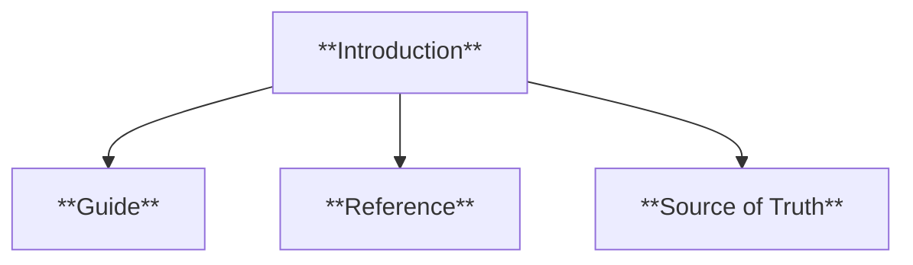
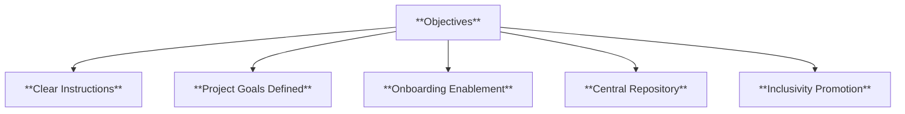
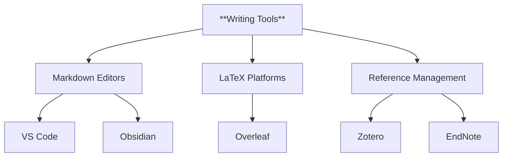
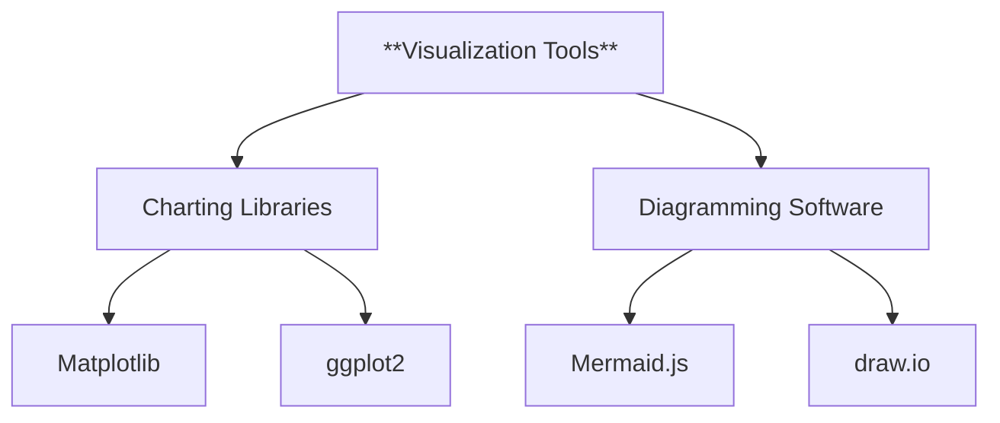

# Batch Extraction: template for creating summaries of unstructured data books pdfs and guide

---
## HIGH-PRECISION (k=5, min=0.25)
[1] score=0.533 (vec=0.575, kw=0.340)
FILE: C:/Users/U01_LEECHSEED/Desktop/_setsunadev/.ASTRO7EX.SYNC.JOPLIN/7359403c04b54c70a7d8a70454a188be.md
------------------------------------------------------------------------------------------
lucinate chapters or sections.\\\n- If the PDF doesn’t clearly show a heading, do not invent it—use a conservative label like “### [Section — Unlabeled]” and summarize what the text actually covers.\\\n- If the PDF contains a formal list of chapters/sections, reproduce that exact structure in TOC and breakdown.\\\n\\\n## Final Output Format\\\nReturn exactly:\\\n```markdown\\\n# ...\\\n...\\\n````\\\n\\\nNow produce the knowledgebase summary for the uploaded doctrinal PDF following all constraints above.\\\n\\\n```\\\n```\"],[1,\" cross-refs), if present.]\\\n\\\n---\\\n\\\n## Mental Models\\\n\\\n### Model 1 — [NAME]\\\n- **Model:** [One sentence. A usable conceptual model.]\\\n- **Use:** [One sentence. What it helps decide/do.]\\\n\\\n### Model 2 — [NAME]\\\n- **Model:** [...]\\\n- **Use:** [...]\\\n\\\n### Model 3 — [NAME]\\\n- **Model:** [...]\\\n- **Use:** [...]\\\n\\\n### Model 4 — [NAME]\\\n- **Model:** [...]\\\n- **Use:** [...]\\\n\\\n[Optional: up to 8 models total. Keep them tight.]\\\n\\\n---\\\n\\\n## Argument Map\\\n- **Claim 1:** [Observation or premise.]\\\n  - **Therefore:** [Implication for doctrine or action.]\\\n- **Claim 2:** [...]\\\n  - **Therefore:** [...]\\\

[2] score=0.519 (vec=0.558, kw=0.340)
FILE: C:/Users/U01_LEECHSEED/Desktop/_setsunadev/.ASTRO7EX.SYNC.JOPLIN/4ef152e35b2e4e6ba4508d23d3f7f412.md
------------------------------------------------------------------------------------------
tructure the most important concepts from the provided material **without fluff**, **without inventing**, and **with explicit uncertainty when information isn’t present**.

### Inputs
- **Material title**: {{TITLE}}
- **Material type**: {{TYPE}} (book / PDF / paper / article / notes)
- **Material provided as**: {{FORMAT}} (full text / excerpts / OCR / chapter summaries / mixed)
- **If PDF**: {{PAGE_COUNT}} pages (if known)
- **Audience**: builders who think in systems, constraints, mechanisms, and decision loops
- **Output format**: one **Markdown knowledgebase drop-in** with a **linked table of contents**
- **Style**: direct, technical, bullet-heavy, “meat & potatoes,” no motivational filler

---

## HARD RULES (ABSOLUTE)
- Do **not** hallucinate facts, sections, definitions, quotes, or page numbers.
- **Evidence rule**:
  - Use **page numbers only if they are explicitly present in the provided material**.
  - Otherwise cite **chapter/heading + a short unique phrase** from that section as the location cue.
- If a detail is missing, write exactly: **“Not found in provided material.”**
- Do not force-fit frameworks:
  - If PSTO/OODA/DSRP subsections can’t be supported by the materia

[3] score=0.515 (vec=0.523, kw=0.478)
FILE: C:/Users/U01_LEECHSEED/Desktop/_setsunadev/_DIRECTORY OF DIR/_wicked_figures_dir/_wicked_figures_template_docs/_wicked_figures_process_order.md
------------------------------------------------------------------------------------------
TAGS: 

# Here is a draft of the process order of taking wicked sources and processing them for the purpose of placing them into the next edition of the X_1 build

1. Generate a full and comprehensive summary of the book
   2. Provide an extensive and highly detailed overview of _book_. The summary must cover the most important concept of each chapter. Each important concept must be broken down into its most finite of parts.
      1. use chatgpt's standard summarizer
3. Generate a full and comprehensive summary of the book using Summary_Template
   4. Provide a comprehensive and detailed overview of the above text using the Summary_Template
5. Combine the two summaries
   6. Use the following data below to create a more comprehensive and nuanced document
7. Create additional data

   8. fully elaborate, contextualize, and provide additional supporting information for the following text.

9. Split the propositions and models into their own .md files
   10. use wicked_markdown_split.py
11. rename each .md file properly
12. From that summary, extract propositions and models

   13. Provide a comprehensive and detailed overview of the data below using the **wicked_model_template**. just pr

[4] score=0.500 (vec=0.520, kw=0.409)
FILE: C:/Users/U01_LEECHSEED/Desktop/_setsunadev/_2025.02_SELACIOUS_BUILD/3 Guts/.2025_prompt_updated.md
------------------------------------------------------------------------------------------
TAGS: 

Please generate a complete, comprehensive book summary under the heading “SOURCE” in a bulleted format resembling a cheat sheet or study guide. Structure it in the style of a QuickStudy Laminated Reference Guide—detailed and in-depth while still easy to understand.

Use clear, straightforward language and incorporate color-coded illustrations, charts, and graphs. For the charts and graphs, please embed them as mermaid images within the Markdown. Organize them so they help readers process and retain the information more effectively.

Focus on:

    Key themes, arguments, and takeaways from the book.
    Specific examples from the text in callout sections, emphasizing keywords, processes, mind models, or other notable items.
    Include citations or references for further reading and context.

Finally, return the guide in Markdown format so it can be easily printed and distributed on standard printer paper.

SOURCE: Playwriting: Structure, Character, How and What to Write

[5] score=0.492 (vec=0.513, kw=0.399)
FILE: C:/Users/U01_LEECHSEED/Desktop/_setsunadev/OVER_EXIT_OUT_OBSIDIAN/OVEREXITOUT/00_IMPORTED_JOPLIN/oxo invariant model inspirations/📘 Prompt Template v2_ Systems-First Knowledgebase.md
------------------------------------------------------------------------------------------
ing**, and **with explicit uncertainty when information isn’t present**.

### Inputs
- **Material title**: {{TITLE}}
- **Material type**: {{TYPE}} (book / PDF / paper / article / notes)
- **Material provided as**: {{FORMAT}} (full text / excerpts / OCR / chapter summaries / mixed)
- **If PDF**: {{PAGE_COUNT}} pages (if known)
- **Audience**: builders who think in systems, constraints, mechanisms, and decision loops
- **Output format**: one **Markdown knowledgebase drop-in** with a **linked table of contents**
- **Style**: direct, technical, bullet-heavy, “meat & potatoes,” no motivational filler

---

## HARD RULES (ABSOLUTE)
- Do **not** hallucinate facts, sections, definitions, quotes, or page numbers.
- **Evidence rule**:
  - Use **page numbers only if they are explicitly present in the provided material**.
  - Otherwise cite **chapter/heading + a short unique phrase** from that section as the location cue.
- If a detail is missing, write exactly: **“Not found in provided material.”**
- Do not force-fit frameworks:
  - If PSTO/OODA/DSRP subsections can’t be supported by the material, leave them sparse and mark **Not found…**
- For anything beyond short material, you must state a

---
## WIDE-NET (k=40, min=0.08)
[1] score=0.533 (vec=0.575, kw=0.340)
FILE: C:/Users/U01_LEECHSEED/Desktop/_setsunadev/.ASTRO7EX.SYNC.JOPLIN/7359403c04b54c70a7d8a70454a188be.md
------------------------------------------------------------------------------------------
lucinate chapters or sections.\\\n- If the PDF doesn’t clearly show a heading, do not invent it—use a conservative label like “### [Section — Unlabeled]” and summarize what the text actually covers.\\\n- If the PDF contains a formal list of chapters/sections, reproduce that exact structure in TOC and breakdown.\\\n\\\n## Final Output Format\\\nReturn exactly:\\\n```markdown\\\n# ...\\\n...\\\n````\\\n\\\nNow produce the knowledgebase summary for the uploaded doctrinal PDF following all constraints above.\\\n\\\n```\\\n```\"],[1,\" cross-refs), if present.]\\\n\\\n---\\\n\\\n## Mental Models\\\n\\\n### Model 1 — [NAME]\\\n- **Model:** [One sentence. A usable conceptual model.]\\\n- **Use:** [One sentence. What it helps decide/do.]\\\n\\\n### Model 2 — [NAME]\\\n- **Model:** [...]\\\n- **Use:** [...]\\\n\\\n### Model 3 — [NAME]\\\n- **Model:** [...]\\\n- **Use:** [...]\\\n\\\n### Model 4 — [NAME]\\\n- **Model:** [...]\\\n- **Use:** [...]\\\n\\\n[Optional: up to 8 models total. Keep them tight.]\\\n\\\n---\\\n\\\n## Argument Map\\\n- **Claim 1:** [Observation or premise.]\\\n  - **Therefore:** [Implication for doctrine or action.]\\\n- **Claim 2:** [...]\\\n  - **Therefore:** [...]\\\

[2] score=0.519 (vec=0.558, kw=0.340)
FILE: C:/Users/U01_LEECHSEED/Desktop/_setsunadev/.ASTRO7EX.SYNC.JOPLIN/4ef152e35b2e4e6ba4508d23d3f7f412.md
------------------------------------------------------------------------------------------
tructure the most important concepts from the provided material **without fluff**, **without inventing**, and **with explicit uncertainty when information isn’t present**.

### Inputs
- **Material title**: {{TITLE}}
- **Material type**: {{TYPE}} (book / PDF / paper / article / notes)
- **Material provided as**: {{FORMAT}} (full text / excerpts / OCR / chapter summaries / mixed)
- **If PDF**: {{PAGE_COUNT}} pages (if known)
- **Audience**: builders who think in systems, constraints, mechanisms, and decision loops
- **Output format**: one **Markdown knowledgebase drop-in** with a **linked table of contents**
- **Style**: direct, technical, bullet-heavy, “meat & potatoes,” no motivational filler

---

## HARD RULES (ABSOLUTE)
- Do **not** hallucinate facts, sections, definitions, quotes, or page numbers.
- **Evidence rule**:
  - Use **page numbers only if they are explicitly present in the provided material**.
  - Otherwise cite **chapter/heading + a short unique phrase** from that section as the location cue.
- If a detail is missing, write exactly: **“Not found in provided material.”**
- Do not force-fit frameworks:
  - If PSTO/OODA/DSRP subsections can’t be supported by the materia

[3] score=0.515 (vec=0.523, kw=0.478)
FILE: C:/Users/U01_LEECHSEED/Desktop/_setsunadev/_DIRECTORY OF DIR/_wicked_figures_dir/_wicked_figures_template_docs/_wicked_figures_process_order.md
------------------------------------------------------------------------------------------
TAGS: 

# Here is a draft of the process order of taking wicked sources and processing them for the purpose of placing them into the next edition of the X_1 build

1. Generate a full and comprehensive summary of the book
   2. Provide an extensive and highly detailed overview of _book_. The summary must cover the most important concept of each chapter. Each important concept must be broken down into its most finite of parts.
      1. use chatgpt's standard summarizer
3. Generate a full and comprehensive summary of the book using Summary_Template
   4. Provide a comprehensive and detailed overview of the above text using the Summary_Template
5. Combine the two summaries
   6. Use the following data below to create a more comprehensive and nuanced document
7. Create additional data

   8. fully elaborate, contextualize, and provide additional supporting information for the following text.

9. Split the propositions and models into their own .md files
   10. use wicked_markdown_split.py
11. rename each .md file properly
12. From that summary, extract propositions and models

   13. Provide a comprehensive and detailed overview of the data below using the **wicked_model_template**. just pr

[4] score=0.500 (vec=0.520, kw=0.409)
FILE: C:/Users/U01_LEECHSEED/Desktop/_setsunadev/_2025.02_SELACIOUS_BUILD/3 Guts/.2025_prompt_updated.md
------------------------------------------------------------------------------------------
TAGS: 

Please generate a complete, comprehensive book summary under the heading “SOURCE” in a bulleted format resembling a cheat sheet or study guide. Structure it in the style of a QuickStudy Laminated Reference Guide—detailed and in-depth while still easy to understand.

Use clear, straightforward language and incorporate color-coded illustrations, charts, and graphs. For the charts and graphs, please embed them as mermaid images within the Markdown. Organize them so they help readers process and retain the information more effectively.

Focus on:

    Key themes, arguments, and takeaways from the book.
    Specific examples from the text in callout sections, emphasizing keywords, processes, mind models, or other notable items.
    Include citations or references for further reading and context.

Finally, return the guide in Markdown format so it can be easily printed and distributed on standard printer paper.

SOURCE: Playwriting: Structure, Character, How and What to Write

[5] score=0.492 (vec=0.513, kw=0.399)
FILE: C:/Users/U01_LEECHSEED/Desktop/_setsunadev/OVER_EXIT_OUT_OBSIDIAN/OVEREXITOUT/00_IMPORTED_JOPLIN/oxo invariant model inspirations/📘 Prompt Template v2_ Systems-First Knowledgebase.md
------------------------------------------------------------------------------------------
ing**, and **with explicit uncertainty when information isn’t present**.

### Inputs
- **Material title**: {{TITLE}}
- **Material type**: {{TYPE}} (book / PDF / paper / article / notes)
- **Material provided as**: {{FORMAT}} (full text / excerpts / OCR / chapter summaries / mixed)
- **If PDF**: {{PAGE_COUNT}} pages (if known)
- **Audience**: builders who think in systems, constraints, mechanisms, and decision loops
- **Output format**: one **Markdown knowledgebase drop-in** with a **linked table of contents**
- **Style**: direct, technical, bullet-heavy, “meat & potatoes,” no motivational filler

---

## HARD RULES (ABSOLUTE)
- Do **not** hallucinate facts, sections, definitions, quotes, or page numbers.
- **Evidence rule**:
  - Use **page numbers only if they are explicitly present in the provided material**.
  - Otherwise cite **chapter/heading + a short unique phrase** from that section as the location cue.
- If a detail is missing, write exactly: **“Not found in provided material.”**
- Do not force-fit frameworks:
  - If PSTO/OODA/DSRP subsections can’t be supported by the material, leave them sparse and mark **Not found…**
- For anything beyond short material, you must state a

[6] score=0.473 (vec=0.491, kw=0.395)
FILE: C:/Users/U01_LEECHSEED/Desktop/_setsunadev/logseq_2023_journals_notes/LOGSEQ BUILD/journals/2023_06_21.md
------------------------------------------------------------------------------------------
ocess. It aims to offer in-depth knowledge and help users understand and operate the subject matter effectively. Manuals are more extensive, cover various aspects, and assume a certain level of prior knowledge from the users. They are typically used by individuals with expertise in the subject matter.
	- On the other hand, a guide is a more concise and user-friendly document that focuses on providing step-by-step instructions or recommendations for accomplishing specific tasks or goals. Guides are more focused, omitting extraneous information, and catering to a broader audience, including beginners or users who need assistance with specific tasks. They are generally more accessible and easier to understand.
	- ### Manuals Identification Table
	  id:: 64931dce-2931-4f57-b1b3-0b6682c98b12
		- content: product, system, or process.
		- content organization: instructions, procedures, complex information
		- content characteristics: detailed and comprehensive
		- comments: extensive, multiple aspects, assumes prior level of knowledge, meant for experts
	- ### Guides Identification Table
		- content: achievement or completion of specific goals, or tasks
		- content organization: step-by-s

[7] score=0.468 (vec=0.465, kw=0.482)
FILE: C:/Users/U01_LEECHSEED/Desktop/_setsunadev/logseq_2023_journals_notes/LOGSEQ BUILD/logseq/bak/pages/LEARNING DEVELOPMENT STUDIES/2022-12-29T16_19_44.460Z.Desktop.md
------------------------------------------------------------------------------------------
ncern*
			- Highlighting is a *directional* signal
	- ## Heading Strategies
		- Headings are a *organizational* signal.
			- Headings emphasize the topics of a text and how they are organized.
			- Headings enable recall of topics.
			- They help readers remember more topics but less about each topic.
	- ## Topic Structure Strategy
		- There are six types of text structures organized in books and other forms of information.
			- *DESCRIPTION* - Clarification of main ideas through examples.
			- *COLLECTION* - A list of acts or elements.
			- *CLASSIFICATION* - Items are Grouped in Classes
			- *SEQUENCE* - A connecting series of events or steps, possibly causally related.
			- *COMPARISON* - Two or more things are compared or contrasted.
			- *PROBLEM* - Discussion of a problem and its solution. A question then the appropriate answer.
			-
		- ### Topic Text Structure
			- Cues you to what is important
			- Helps you ask the right questions
			- signals how the ideas in the text are related
			- provides a structure for notes
			- cues you to the best format for notes.
	- ## Summaries
		- **Topical Summary** - straightforward string of factual statements.
			- Summarize the main po

[8] score=0.468 (vec=0.465, kw=0.482)
FILE: C:/Users/U01_LEECHSEED/Desktop/_setsunadev/logseq_2023_journals_notes/LOGSEQ BUILD/logseq/bak/pages/LEARNING DEVELOPMENT STUDIES/2022-12-28T09_31_24.947Z.Desktop.md
------------------------------------------------------------------------------------------
ncern*
			- Highlighting is a *directional* signal
	- ## Heading Strategies
		- Headings are a *organizational* signal.
			- Headings emphasize the topics of a text and how they are organized.
			- Headings enable recall of topics.
			- They help readers remember more topics but less about each topic.
	- ## Topic Structure Strategy
		- There are six types of text structures organized in books and other forms of information.
			- *DESCRIPTION* - Clarification of main ideas through examples.
			- *COLLECTION* - A list of acts or elements.
			- *CLASSIFICATION* - Items are Grouped in Classes
			- *SEQUENCE* - A connecting series of events or steps, possibly causally related.
			- *COMPARISON* - Two or more things are compared or contrasted.
			- *PROBLEM* - Discussion of a problem and its solution. A question then the appropriate answer.
			-
		- ### Topic Text Structure
			- Cues you to what is important
			- Helps you ask the right questions
			- signals how the ideas in the text are related
			- provides a structure for notes
			- cues you to the best format for notes.
	- ## Summaries
		- **Topical Summary** - straightforward string of factual statements.
			- Summarize the main po

[9] score=0.468 (vec=0.465, kw=0.482)
FILE: C:/Users/U01_LEECHSEED/Desktop/_setsunadev/logseq_2023_journals_notes/LOGSEQ BUILD/logseq/bak/pages/LEARNING DEVELOPMENT STUDIES/2022-12-27T17_25_34.365Z.Desktop.md
------------------------------------------------------------------------------------------
ncern*
			- Highlighting is a *directional* signal
	- ## Heading Strategies
		- Headings are a *organizational* signal.
			- Headings emphasize the topics of a text and how they are organized.
			- Headings enable recall of topics.
			- They help readers remember more topics but less about each topic.
	- ## Topic Structure Strategy
		- There are six types of text structures organized in books and other forms of information.
			- *DESCRIPTION* - Clarification of main ideas through examples.
			- *COLLECTION* - A list of acts or elements.
			- *CLASSIFICATION* - Items are Grouped in Classes
			- *SEQUENCE* - A connecting series of events or steps, possibly causally related.
			- *COMPARISON* - Two or more things are compared or contrasted.
			- *PROBLEM* - Discussion of a problem and its solution. A question then the appropriate answer.
			-
		- ### Topic Text Structure
			- Cues you to what is important
			- Helps you ask the right questions
			- signals how the ideas in the text are related
			- provides a structure for notes
			- cues you to the best format for notes.
	- ## Summaries
		- **Topical Summary** - straightforward string of factual statements.
			- Summarize the main po

[10] score=0.465 (vec=0.481, kw=0.395)
FILE: C:/Users/U01_LEECHSEED/Desktop/_setsunadev/logseq_2023_journals_notes/leechseed2/leechseed2/OBSIDIAN_CATALOG/D3 STORY MANUSCRIPT - BLOODWORK/D3 - STORY MANUSCRIPT BLOODWORK/NARRATOLOGY/11_ETC/LOGSEQ MD FILES README/journals/2023_06_21.md
------------------------------------------------------------------------------------------
technical information about a product, system, or process. It aims to offer in-depth knowledge and help users understand and operate the subject matter effectively. Manuals are more extensive, cover various aspects, and assume a certain level of prior knowledge from the users. They are typically used by individuals with expertise in the subject matter.
	- On the other hand, a guide is a more concise and user-friendly document that focuses on providing step-by-step instructions or recommendations for accomplishing specific tasks or goals. Guides are more focused, omitting extraneous information, and catering to a broader audience, including beginners or users who need assistance with specific tasks. They are generally more accessible and easier to understand.
	- ### Manuals Identification Table
	  id:: 64931dce-2931-4f57-b1b3-0b6682c98b12
		- content: product, system, or process.
		- content organization: instructions, procedures, complex information
		- content characteristics: detailed and comprehensive
		- comments: extensive, multiple aspects, assumes prior level of knowledge, meant for experts
	- ### Guides Identification Table
		- content: achievement or completion of specific

[11] score=0.463 (vec=0.476, kw=0.404)
FILE: C:/Users/U01_LEECHSEED/Desktop/_setsunadev/.FACTORIO.SYNC.JOPLIN/cd533e6313a44bdb8c3d2c52cc46da9a.md
------------------------------------------------------------------------------------------
Planning\\\"\\\ntable_of_contents: true\\\n---\\\n\\\n# 🔧 Phase Playbooks System: Requirements, Processes, and Templates\\\n\\\nThis report defines the detailed standards, procedures, and reusable systems needed to construct **Phase Playbooks** for each WBS phase in the *Beltline Salvation* project. It ensures that each phase is managed using **PMP-aligned principles** with minimal overhead and maximum reusability.\\\n\\\n---\\\n\\\n## 📚 Table of Contents\\\n\\\n1. [🎯 Purpose](#-purpose)  \\\n2. [📦 Required Components](#-required-components)  \\\n3. [📋 Task Breakdown for Playbook Creation](#-task-breakdown-for-playbook-creation)  \\\n4. [📐 Documentation Standards](#-documentation-standards)  \\\n5. [♻️ Reusable Template Structure](#-reusable-template-structure)  \\\n6. [🧠 Strategic Design Principles](#-strategic-design-principles)  \\\n7. [📎 Output Tracking & Binder Integration](#-output-tracking--binder-integration)  \\\n8. [✅ Summary Checklists](#-summary-checklists)\\\n\\\n---\\\n\\\n## 🎯 Purpose\\\n\\\nThe **Phase Playbook** is a tactical document that guides execution of a single WBS phase. It includes everything required to:\\\n\\\n- Start the phase with clarity  \\\n- Know w

[12] score=0.462 (vec=0.490, kw=0.335)
FILE: C:/Users/U01_LEECHSEED/Desktop/_setsunadev/.ASTRO7EX.SYNC.JOPLIN/b56fea35fefc4b12a564d1548351d268.md
------------------------------------------------------------------------------------------
claims, then a final:\\\n  - `- **Conclusion:** ...`\\\n\\\n### Key Concepts & Definitions\\\n- **10–25** one-line definitions.\\\n- Format exactly:\\\n  - `- **TERM**: Definition.`\\\n\\\n## Discipline on Fidelity\\\n- Do not quote long passages; paraphrase doctrinally.\\\n- Do not add external facts or modern examples.\\\n- Do not add “Practical Heuristics” or extra sections unless the template explicitly contains them. (This output must match the template’s section list exactly.)\\\n\\\n## Output Target\\\nProduce the completed summary for the uploaded MCDP PDF using the template precisely, with a fully linked TOC and doctrinal tone. Return only the markdown in one code block.\\\n\"]],\"start1\":0,\"start2\":0,\"length1\":0,\"length2\":4218}]"
metadata_diff: {"new":{"id":"ef9223a0faf547e2aad35114495b85e8","parent_id":"de23767d47434d07977d16c42c521cb8","latitude":"30.43825590","longitude":"-84.28073290","altitude":"0.0000","author":"","source_url":"","is_todo":0,"todo_due":0,"todo_completed":0,"source":"joplin-desktop","source_application":"net.cozic.joplin-desktop","application_data":"","order":0,"markup_language":1,"is_shared":0,"share_id":"","conflict_original_id":"","master_

[13] score=0.461 (vec=0.459, kw=0.468)
FILE: C:/Users/U01_LEECHSEED/Desktop/_setsunadev/_DIRECTORY OF DIR/_wicked_figures_dir/_wicked_figures_template_docs/_2_ai_prompt_summary_template.md
------------------------------------------------------------------------------------------
ibutions** section is designed to accommodate an unlimited number of points, ensuring comprehensive coverage of the subject's work. Whether there are three key concepts or thirty, the structure remains consistent, allowing for detailed and organized summaries.

#### **Example Application**

If you'd like, I can demonstrate how to use this updated template by applying it to another subject or work. Just provide the necessary details, and I'll generate a summary accordingly!

Feel free to let me know how you'd like to proceed or if there are any other modifications you'd like to make to the **Summary_Template**.

[14] score=0.458 (vec=0.470, kw=0.404)
FILE: C:/Users/U01_LEECHSEED/Desktop/_setsunadev/.FACTORIO.SYNC.JOPLIN/063ffa71bf1d49aab400b90040d1488f.md
------------------------------------------------------------------------------------------
\\\"Phase Planning\\\"\\\ntable_of_contents: true\\\n---\\\n\\\n# 🔧 Phase Playbooks System: Requirements, Processes, and Templates\\\n\\\nThis report defines the detailed standards, procedures, and reusable systems needed to construct **Phase Playbooks** for each WBS phase in the *Beltline Salvation* project. It ensures that each phase is managed using **PMP-aligned principles** with minimal overhead and maximum reusability.\\\n\\\n---\\\n\\\n## 📚 Table of Contents\\\n\\\n1. [🎯 Purpose](#-purpose)  \\\n2. [📦 Required Components](#-required-components)  \\\n3. [📋 Task Breakdown for Playbook Creation](#-task-breakdown-for-playbook-creation)  \\\n4. [📐 Documentation Standards](#-documentation-standards)  \\\n5. [♻️ Reusable Template Structure](#-reusable-template-structure)  \\\n6. [🧠 Strategic Design Principles](#-strategic-design-principles)  \\\n7. [📎 Output Tracking & Binder Integration](#-output-tracking--binder-integration)  \\\n8. [✅ Summary Checklists](#-summary-checklists)\\\n\\\n---\\\n\\\n## 🎯 Purpose\\\n\\\nThe **Phase Playbook** is a tactical document that guides execution of a single WBS phase. It includes everything required to:\\\n\\\n- Start the phase with clarity  \\

[15] score=0.456 (vec=0.480, kw=0.350)
FILE: C:/Users/U01_LEECHSEED/Desktop/_setsunadev/logseq_2023_journals_notes/LOGSEQ BUILD/journals/2023_04_19.md
------------------------------------------------------------------------------------------
Delish
	- Alyri
	- Hannah OwO
	- Waifu Mia
	- Emma Langevin
	- Emiru.
-
- # LEECHSEED 065
- 
- [LEECHSEED 065 SOUNDCLOUD LINK](https://on.soundcloud.com/AgRCK)
- Alright let's see you at 60 finish the 1st chapter of the beginnings and what you've done so far is really locked down a preparation method of getting the data from PDF all the way to a format thatbasically breaks down into a summkey language and key sources right from there I think we need to simplify even more Using Hennessy's method of modeling and summarization I feel like what I can do as I can then translate everything down to us say you know bullets very magnetic sentences but smarter than sentences clauses and concepts and from those I can turn it into models from there from those models I then can create a process and then use that process to analyze other forms of art right and that's where I can sort of this is all why I think it's leading up to it's this idea of being able to I'm really kind of hooked on this idea of entertainment to allergy but now it's much more than intertextuality it's hyper and texture enter hypermedia type shit where the beginnings are so

[16] score=0.456 (vec=0.466, kw=0.409)
FILE: C:/Users/U01_LEECHSEED/Desktop/_setsunadev/logseq_2023_journals_notes/leechseed2/leechseed2/OBSIDIAN_CATALOG/D3 STORY MANUSCRIPT - BLOODWORK/D3 - STORY MANUSCRIPT BLOODWORK/NARRATOLOGY/11_ETC/LOGSEQ MD FILES README/journals/2023_02_05.md
------------------------------------------------------------------------------------------
rovides a comprehensive overview of design patterns and how they can be used to improve software design.
		- "UML Distilled: A Brief Guide to the Standard Object Modeling Language" by Martin Fowler: This book provides a clear and concise introduction to UML, including class diagrams, sequence diagrams, and state diagrams, and how to use them to create effective software design documentation.
		- "Documenting Software Architectures: Views and Beyond" by Paul Clements, Felix Bachmann, Len Bass, David Garlan, James Ivers, Reed Little, Robert Nord, and Judith Stafford: This book provides a comprehensive guide to documenting software architectures, including the use of views and views templates.
		- "Software Architecture in Practice" by Len Bass, Paul Clements, and Rick Kazman: This book provides a practical guide to software architecture, including the creation of architecture descriptions and the documentation of architecture decisions.
		- "Agile Estimating and Planning" by Mike Cohn: This book provides guidance on how to plan and estimate software projects, including the use of user stories and story maps to capture the requirements and design of a system.
		    
		  These books pr

[17] score=0.454 (vec=0.481, kw=0.331)
FILE: C:/Users/U01_LEECHSEED/Desktop/_setsunadev/.ASTRO7EX.SYNC.JOPLIN/50222ae625644a9281a51c164226d0a0.md
------------------------------------------------------------------------------------------
p it **skimmable**: tight paragraphs, bullet lists, and clear headings.\\\n- No external commentary before/after the code block.\\\n\\\n## Document Metadata (Fill from PDF)\\\nAt the top, include:\\\n- Title line: `# [Doc ID] — [Title] (Knowledgebase Summary)`\\\n- Optional one-line metadata (Source / Purpose) if present in the PDF.\\\n\\\n## Required Sections (In This Order)\\\n1) **Abstract**  \\\n   - One paragraph.\\\n   - States: what the publication is, what it argues, how it frames warfighting, and what it demands of leaders/forces.\\\n\\\n2) **TL;DR**  \\\n   - 6–12 bullets.\\\n   - Each bullet = one doctrine claim.\\\n   - Avoid redundancy.\\\n\\\n3) **Table of Contents**  \\\n   - Must include: Abstract, TL;DR, Section-by-Section Breakdown, each chapter, major subheadings, Notes (if present), Mental Models, Argument Map, Key Concepts & Definitions.\\\n\\\n4) **Section-by-Section Breakdown**  \\\n   - Begin with any transmittal/foreword/preface/change notes if present.\\\n   - Then each chapter, in order, with subheads.\\\n   - For each major section or sub-section include:\\\n     - A tight doctrinal description of what the section asserts or establishes.\\\n     - Use bu

[18] score=0.454 (vec=0.476, kw=0.350)
FILE: C:/Users/U01_LEECHSEED/Desktop/_setsunadev/OVER_EXIT_OUT_OBSIDIAN/OVEREXITOUT/00_IMPORTED_JOPLIN/oxo invariant model systems thinking studies/✅ COPY_PASTE PROMPT (Fill in placeholders).md
------------------------------------------------------------------------------------------
TAGS: 

You are a **systems-thinking analyst** and **knowledgebase architect**. Your job is to extract and structure the most important concepts from the provided material **without fluff**, **without inventing**, and **with explicit uncertainty when information isn’t present**.

### Inputs (Auto-Detected Unless Explicitly Provided)

- **Material title**:
  - If explicitly stated in the text, extract it.
  - Otherwise write: **“Not explicitly stated in provided material.”**

- **Material type**:
  - Infer from structure and language (book / paper / article / notes).
  - If ambiguous, write: **“Ambiguous based on provided material.”**

- **Material provided as**:
  - Assume **full text** unless the text itself indicates excerpts, summaries, or missing sections.
  - If partial, state where gaps appear.

- **If PDF (page count)**:
  - Extract only if page numbers or total pages are explicitly present.
  - Otherwise write: **“Not found in provided material.”**

- **Source of truth**:
  - Treat all pasted text as the authoritative source.
  - Do NOT request additional metadata from the user.

---

## HARD RULES (ABSOLUTE)

### 1) No invention
- Do **not** hallucinate facts, sections, de

[19] score=0.453 (vec=0.463, kw=0.409)
FILE: C:/Users/U01_LEECHSEED/Desktop/_setsunadev/.ASTRO7EX.SYNC.JOPLIN/68c46404c7524a06920609ae314bbaec.md
------------------------------------------------------------------------------------------
TAGS: 

📘 5 Prompt Template v2.2: Systems-First Knowledgebase Extraction (PSTO → OODA → D

---
tags: oxo
---

## ✅ COPY/PASTE PROMPT (Fill in placeholders)
---


You are a **systems-thinking analyst** and **knowledgebase architect**. Your job is to extract and structure the most important concepts from the provided material **without fluff**, **without inventing**, and **with explicit uncertainty when information isn’t present**.

### Inputs (Auto-Detected Unless Explicitly Provided)

- **Material title**:
  - If explicitly stated in the text, extract it.
  - Otherwise write: **“Not explicitly stated in provided material.”**

- **Material type**:
  - Infer from structure and language (book / paper / article / notes).
  - If ambiguous, write: **“Ambiguous based on provided material.”**

- **Material provided as**:
  - Assume **full text** unless the text itself indicates excerpts, summaries, or missing sections.
  - If partial, state where gaps appear.

- **If PDF (page count)**:
  - Extract only if page numbers or total pages are explicitly present.
  - Otherwise write: **“Not found in provided material.”**

- **Source of truth**:
  - Treat all pasted text as the authoritative sour

[20] score=0.453 (vec=0.446, kw=0.485)
FILE: C:/Users/U01_LEECHSEED/Desktop/_setsunadev/logseq_2023_journals_notes/LOGSEQ BUILD/logseq/bak/pages/COGNATIVE STUDIES/2022-09-19T05_07_41.905Z.md
------------------------------------------------------------------------------------------
- There are six types of text structures organized in books and other forms of information.
			- *DESCRIPTION* - Clarification of main ideas through examples.
			- *COLLECTION* - A list of acts or elements.
			- *CLASSIFICATION* - Items are Grouped in Classes
			- *SEQUENCE* - A connecting series of events or steps, possibly causally related.
			- *COMPARISON* - Two or more things are compared or contrasted.
			- *PROBLEM* - Discussion of a problem and its solution. A question then the appropriate answer.
			-
		- ### Topic Text Structure
			- Cues you to what is important
			- Helps you ask the right questions
			- signals how the ideas in the text are related
			- provides a structure for notes
			- cues you to the best format for notes.
	- ## Summaries
		- **Topical Summary** - straightforward string of factual statements.
			- Summarize the main points without adding any new information or perspective
		- **Overview** - A topical summary that precedes the text.
		- **Advance Organizer** - Big picture overview that primes the brain to consume the following information.
			- Helps connect new ideas and facts with information already known.
		- ### A good summary is
			- short

[21] score=0.449 (vec=0.471, kw=0.350)
FILE: C:/Users/U01_LEECHSEED/Desktop/_setsunadev/.ASTRO7EX.SYNC.JOPLIN/964db4c7ff614f0781d4de82a601f862.md
------------------------------------------------------------------------------------------
TAGS: 

✅ COPY/PASTE PROMPT (Fill in placeholders)

---
tags: oxo
---

You are a **systems-thinking analyst** and **knowledgebase architect**. Your job is to extract and structure the most important concepts from the provided material **without fluff**, **without inventing**, and **with explicit uncertainty when information isn’t present**.

### Inputs (Auto-Detected Unless Explicitly Provided)

- **Material title**:
  - If explicitly stated in the text, extract it.
  - Otherwise write: **“Not explicitly stated in provided material.”**

- **Material type**:
  - Infer from structure and language (book / paper / article / notes).
  - If ambiguous, write: **“Ambiguous based on provided material.”**

- **Material provided as**:
  - Assume **full text** unless the text itself indicates excerpts, summaries, or missing sections.
  - If partial, state where gaps appear.

- **If PDF (page count)**:
  - Extract only if page numbers or total pages are explicitly present.
  - Otherwise write: **“Not found in provided material.”**

- **Source of truth**:
  - Treat all pasted text as the authoritative source.
  - Do NOT request additional metadata from the user.

---

## HARD RULES (ABSOLUTE)

#

[22] score=0.449 (vec=0.470, kw=0.350)
FILE: C:/Users/U01_LEECHSEED/Desktop/_setsunadev/OVER_EXIT_OUT_OBSIDIAN/OVEREXITOUT/00_IMPORTED_JOPLIN/oxo invariant model inspirations/📘 5 Prompt Template v2.2_ Systems-First Knowledge.md
------------------------------------------------------------------------------------------
TAGS: 

## ✅ COPY/PASTE PROMPT (Fill in placeholders)
---


You are a **systems-thinking analyst** and **knowledgebase architect**. Your job is to extract and structure the most important concepts from the provided material **without fluff**, **without inventing**, and **with explicit uncertainty when information isn’t present**.

### Inputs (Auto-Detected Unless Explicitly Provided)

- **Material title**:
  - If explicitly stated in the text, extract it.
  - Otherwise write: **“Not explicitly stated in provided material.”**

- **Material type**:
  - Infer from structure and language (book / paper / article / notes).
  - If ambiguous, write: **“Ambiguous based on provided material.”**

- **Material provided as**:
  - Assume **full text** unless the text itself indicates excerpts, summaries, or missing sections.
  - If partial, state where gaps appear.

- **If PDF (page count)**:
  - Extract only if page numbers or total pages are explicitly present.
  - Otherwise write: **“Not found in provided material.”**

- **Source of truth**:
  - Treat all pasted text as the authoritative source.
  - Do NOT request additional metadata from the user.

---

## HARD RULES (ABSOLUTE)

### 1) No in

[23] score=0.449 (vec=0.474, kw=0.331)
FILE: C:/Users/U01_LEECHSEED/Desktop/_setsunadev/.ASTRO7EX.SYNC.JOPLIN/c749ec97a4414764913a271ced929a0b.md
------------------------------------------------------------------------------------------
s)
11. [Templates & File Hygiene](#templates--file-hygiene)
12. [Cheat Sheet Summary](#cheat-sheet-summary)
13. [Extended Glossary](#extended-glossary)

---

## Terminology Primer (Read First)

- **Brief** → One-page statement of goal, audience, deliverables, constraints, and success criteria.  
- **Success Criteria** → Observable checks that define “done” (e.g., “subject readable at 200 px,” “CTA clicked first in usability test”).  
- **Constraint Stack** → All fixed requirements (aspect ratio, brand palette, copy, print/web spec, deadline).  
- **Moodboard** → Curated reference grid that sets palette, lighting, texture, and attitude (not a dumping ground).  
- **Thumbnail** → 30–120-second micro-sketch to test composition ideas (values first, no details).  
- **Armature** → Geometric scaffold (thirds, phi, diagonal, spiral, dynamic symmetry) used to place subjects.  
- **Notan** → 2–3 flat values that encode the read (black/gray/white).  
- **Value Key** → Overall lightness bias (high-key, mid-key, low-key) that dictates plane stepping.  
- **Flow Audit** → Markup pass to trace entry→focal→secondary→loop-back and kill outward arrows.  
- **Tangent Hunt** → Systematic search for k

[24] score=0.448 (vec=0.462, kw=0.385)
FILE: C:/Users/U01_LEECHSEED/Desktop/_setsunadev/_DIRECTORY OF DIR/_metadata_dir/_metadata_dir.md
------------------------------------------------------------------------------------------
the content based on predefined genres.
- **Format**: The format of the item (e.g., digital, physical, etc.).
- **Duration**: Length of the item (applicable to movies, music, and GIFs).
- **Size**: File size or physical dimensions.
- **License Type**: Copyright or usage rights information.
- **Accessibility Features**: Subtitles, audio descriptions, etc.
- **Thumbnail/Image**: Representative image or thumbnail.
- **Popularity Metrics**: Number of downloads, streams, or views.
- **User Interaction**: Likes, shares, comments, etc.

### Specific Metadata for Books
- **ISBN**: International Standard Book Number.
- **Publisher**: Company or individual that published the book.
- **Edition**: Edition of the book.
- **Page Count**: Number of pages.
- **Book Format**: Hardcover, paperback, audiobook, eBook, etc.
- **Narrator**: For audiobooks, the person who narrates the book.

### Specific Metadata for Movies
- **Director**: Director of the movie.
- **Cast**: Main and supporting actors.
- **Screenwriter**: Writer of the screenplay.
- **Cinematographer**: Director of photography.
- **Production Company**: Company that produced the movie.
- **Distributor**: Company responsible for distribut

[25] score=0.447 (vec=0.473, kw=0.331)
FILE: C:/Users/U01_LEECHSEED/Desktop/_setsunadev/football_qb_training/Throw Like a Pro.md
------------------------------------------------------------------------------------------
TAGS: objective, methodological-overview, framework-used, strategies-employed, detailed-chapter-analysis, technical-core-concepts, integration-with-themes, outcome, next-step, internal-use-tags

Here’s the **full breakdown using your doc template**, deeply applied to _Throw Like a Pro — Dr. Tom House_, with all necessary detail (not fluff), plus a clean Table of Contents.

---

# 📘 Documentation Report: _Throw Like a Pro — Dr. Tom House_

**Section**: Seminal References & Knowledgebase
**Project**: QB Solo Development
**Studio**: GUTS99
**Date**: 2025-07-06
**Prepared by**: Narrative Chemistry Engine

---

## 📑 Table of Contents

1. [Objective](#objective)
2. [Methodological Overview](#methodological-overview)

   - Primary Goal

3. [Framework Used](#framework-used)

   - Summ Template Structure

4. [Strategies Employed](#strategies-employed)
5. [Detailed Chapter Analysis](#detailed-chapter-analysis)
6. [Technical Core Concepts](#technical-core-concepts)
7. [Integration with Themes](#integration-with-themes)
8. [Outcome](#outcome)
9. [Next Step](#next-step)
10. [Internal Use Tags](#internal-use-tags)

---

## 🎯 Objective

To extract and synthesize the biomechanical and motion healt

[26] score=0.445 (vec=0.453, kw=0.409)
FILE: C:/Users/U01_LEECHSEED/Desktop/_setsunadev/logseq_2023_journals_notes/LOGSEQ BUILD/journals/2023_02_05.md
------------------------------------------------------------------------------------------
s a comprehensive overview of design patterns and how they can be used to improve software design.
		- "UML Distilled: A Brief Guide to the Standard Object Modeling Language" by Martin Fowler: This book provides a clear and concise introduction to UML, including class diagrams, sequence diagrams, and state diagrams, and how to use them to create effective software design documentation.
		- "Documenting Software Architectures: Views and Beyond" by Paul Clements, Felix Bachmann, Len Bass, David Garlan, James Ivers, Reed Little, Robert Nord, and Judith Stafford: This book provides a comprehensive guide to documenting software architectures, including the use of views and views templates.
		- "Software Architecture in Practice" by Len Bass, Paul Clements, and Rick Kazman: This book provides a practical guide to software architecture, including the creation of architecture descriptions and the documentation of architecture decisions.
		- "Agile Estimating and Planning" by Mike Cohn: This book provides guidance on how to plan and estimate software projects, including the use of user stories and story maps to capture the requirements and design of a system.
		  
		  These books provide a

[27] score=0.444 (vec=0.451, kw=0.414)
FILE: C:/Users/U01_LEECHSEED/Desktop/_setsunadev/_1.04 RC1_MARIMARI_EN_BUILD/.CONTENT/guts99_documentation/2_research_design/mermaid_format.md
------------------------------------------------------------------------------------------
Balance with Best Practices
      Usability Focus
    **Title Section**
      Bolded Title
      Descriptive Summary
    **Key Concepts**
      Definitions
        Clear and Precise
        Accessible Language
      Characteristics
        Logical Structure
        Plain Language
    **Component Sections**
      Mermaid Flowcharts
      Logical Placement
      Clear Visual Representation
    **Mindmap**
      Summary Visualization
      Main Concept
      Subcategories
      Placement at End
```

This formatted guide ensures that the Mermaid Format is applied consistently and effectively while aligning with general best practices for creating accessible, user-friendly documentation.

[28] score=0.444 (vec=0.451, kw=0.414)
FILE: C:/Users/U01_LEECHSEED/Desktop/_setsunadev/_1.03.1 RC1_BUNNIRU_BUILD_HUGO/.CONTENT/guts99_documentation/2_research_design/mermaid_format.md
------------------------------------------------------------------------------------------
Balance with Best Practices
      Usability Focus
    **Title Section**
      Bolded Title
      Descriptive Summary
    **Key Concepts**
      Definitions
        Clear and Precise
        Accessible Language
      Characteristics
        Logical Structure
        Plain Language
    **Component Sections**
      Mermaid Flowcharts
      Logical Placement
      Clear Visual Representation
    **Mindmap**
      Summary Visualization
      Main Concept
      Subcategories
      Placement at End
```

This formatted guide ensures that the Mermaid Format is applied consistently and effectively while aligning with general best practices for creating accessible, user-friendly documentation.

[29] score=0.442 (vec=0.465, kw=0.335)
FILE: C:/Users/U01_LEECHSEED/Desktop/_setsunadev/logseq_2023_journals_notes/LOGSEQ BUILD/logseq/bak/pages/97816812540 - VOCAB - THE READING COMPREHENSION BLUEPRINT HELPING STUDENTS MAKE MEANING FROM TEXT %2Aby Nancy Hennessy%2A/2023-01-27T05_12_51.902Z.Desktop.md
------------------------------------------------------------------------------------------
title, heading, and diagrams, focuses reader's attention on the text supporting understanding of organization and context of the text
					- **Title** - identifies the major topic of the text; is a mini-summary for the reader. Succinct and designed set of words that exemplify the author's intent through surface, subtext, and inference in mind
					- **Table of Contents** - Introduces the reader to the organization and content of the text
					- **Chapter Titles** - Introduces the reader to the main topic for this section of the book
					- **Headings/Subheadings** - Guides the reader through topics and related main ideas
					- **Charts, Diagrams, Pictures**- Provides the reader with visual explanations of information in the text
					- **Sidebars** - Gives the reader additional information or another point of view
					- **Bold Print**- Emphasizes important words or concepts for the reader
					- **Index** - Tells the reader where topics can be found in the text
					- **Glossary** - Serves as a dictionary for the reader by providing definitions of important vocabulary words and terms
					-
		- ## CHAPTER 7: The Blueprint for Background Knowledge
		  collapsed:: true
			- ### CON

[30] score=0.442 (vec=0.465, kw=0.335)
FILE: C:/Users/U01_LEECHSEED/Desktop/_setsunadev/logseq_2023_journals_notes/LOGSEQ BUILD/logseq/bak/pages/97816812540 - VOCAB - THE READING COMPREHENSION BLUEPRINT HELPING STUDENTS MAKE MEANING FROM TEXT %2Aby Nancy Hennessy%2A/2023-01-27T01_52_41.186Z.Desktop.md
------------------------------------------------------------------------------------------
title, heading, and diagrams, focuses reader's attention on the text supporting understanding of organization and context of the text
					- **Title** - identifies the major topic of the text; is a mini-summary for the reader. Succinct and designed set of words that exemplify the author's intent through surface, subtext, and inference in mind
					- **Table of Contents** - Introduces the reader to the organization and content of the text
					- **Chapter Titles** - Introduces the reader to the main topic for this section of the book
					- **Headings/Subheadings** - Guides the reader through topics and related main ideas
					- **Charts, Diagrams, Pictures**- Provides the reader with visual explanations of information in the text
					- **Sidebars** - Gives the reader additional information or another point of view
					- **Bold Print**- Emphasizes important words or concepts for the reader
					- **Index** - Tells the reader where topics can be found in the text
					- **Glossary** - Serves as a dictionary for the reader by providing definitions of important vocabulary words and terms
					-
		- ## CHAPTER 7: The Blueprint for Background Knowledge
		  collapsed:: true
			- ### CON

[31] score=0.441 (vec=0.461, kw=0.350)
FILE: C:/Users/U01_LEECHSEED/Desktop/_setsunadev/logseq_2023_journals_notes/leechseed2/leechseed2/OBSIDIAN_CATALOG/D3 STORY MANUSCRIPT - BLOODWORK/D3 - STORY MANUSCRIPT BLOODWORK/NARRATOLOGY/11_ETC/LOGSEQ MD FILES README/journals/2023_04_19.md
------------------------------------------------------------------------------------------
lice Delish
	- Alyri
	- Hannah OwO
	- Waifu Mia
	- Emma Langevin
	- Emiru.
-
- # LEECHSEED 065
- 
- [LEECHSEED 065 SOUNDCLOUD LINK](https://on.soundcloud.com/AgRCK)
- Alright let's see you at 60 finish the 1st chapter of the beginnings and what you've done so far is really locked down a preparation method of getting the data from PDF all the way to a format thatbasically breaks down into a summkey language and key sources right from there I think we need to simplify even more Using Hennessy's method of modeling and summarization I feel like what I can do as I can then translate everything down to us say you know bullets very magnetic sentences but smarter than sentences clauses and concepts and from those I can turn it into models from there from those models I then can create a process and then use that process to analyze other forms of art right and that's where I can sort of this is all why I think it's leading up to it's this idea of being able to I'm really kind of hooked on this idea of entertainment to allergy but now it's much more than intertextuality it's hyper and texture enter hypermedia type shit where the beginnings are

[32] score=0.440 (vec=0.430, kw=0.482)
FILE: C:/Users/U01_LEECHSEED/Desktop/_setsunadev/logseq_2023_journals_notes/LOGSEQ BUILD/logseq/bak/pages/LEARNING DEVELOPMENT STUDIES/2023-01-07T20_26_59.070Z.Desktop.md
------------------------------------------------------------------------------------------
- Headings enable recall of topics.
			- They help readers remember more topics but less about each topic.
	- ## Topic Structure Strategy
		- There are six types of text structures organized in books and other forms of information.
			- *DESCRIPTION* - Clarification of main ideas through examples.
			- *COLLECTION* - A list of acts or elements.
			- *CLASSIFICATION* - Items are Grouped in Classes
			- *SEQUENCE* - A connecting series of events or steps, possibly causally related.
			- *COMPARISON* - Two or more things are compared or contrasted.
			- *PROBLEM* - Discussion of a problem and its solution. A question then the appropriate answer.
			-
		- ### Topic Text Structure
			- Cues you to what is important
			- Helps you ask the right questions
			- signals how the ideas in the text are related
			- provides a structure for notes
			- cues you to the best format for notes.
	- ## Summaries
		- **Topical Summary** - straightforward string of factual statements.
			- Summarize the main points without adding any new information or perspective
		- **Overview** - A topical summary that precedes the text.
		- **Advance Organizer** - Big picture overview that primes the brain to cons

[33] score=0.440 (vec=0.430, kw=0.482)
FILE: C:/Users/U01_LEECHSEED/Desktop/_setsunadev/logseq_2023_journals_notes/LOGSEQ BUILD/logseq/bak/pages/LEARNING DEVELOPMENT STUDIES/2023-01-05T08_28_19.493Z.Desktop.md
------------------------------------------------------------------------------------------
- Headings enable recall of topics.
			- They help readers remember more topics but less about each topic.
	- ## Topic Structure Strategy
		- There are six types of text structures organized in books and other forms of information.
			- *DESCRIPTION* - Clarification of main ideas through examples.
			- *COLLECTION* - A list of acts or elements.
			- *CLASSIFICATION* - Items are Grouped in Classes
			- *SEQUENCE* - A connecting series of events or steps, possibly causally related.
			- *COMPARISON* - Two or more things are compared or contrasted.
			- *PROBLEM* - Discussion of a problem and its solution. A question then the appropriate answer.
			-
		- ### Topic Text Structure
			- Cues you to what is important
			- Helps you ask the right questions
			- signals how the ideas in the text are related
			- provides a structure for notes
			- cues you to the best format for notes.
	- ## Summaries
		- **Topical Summary** - straightforward string of factual statements.
			- Summarize the main points without adding any new information or perspective
		- **Overview** - A topical summary that precedes the text.
		- **Advance Organizer** - Big picture overview that primes the brain to cons

[34] score=0.439 (vec=0.462, kw=0.335)
FILE: C:/Users/U01_LEECHSEED/Desktop/_setsunadev/_DIRECTORY OF DIR/_wicked_figures_dir/_wicked_figures_template_docs/_12_ai_prompt_mermaid_notation_template.md
------------------------------------------------------------------------------------------
ndmap` for hierarchical overviews and `flowchart TD;` for linear sequences or relationships).

By following this template and these guidelines, you can maintain a uniform presentation style for all the frameworks or concepts you document.

[35] score=0.439 (vec=0.450, kw=0.390)
FILE: C:/Users/U01_LEECHSEED/Desktop/_setsunadev/logseq_2023_journals_notes/LOGSEQ BUILD/journals/2023_06_22.md
------------------------------------------------------------------------------------------
TAGS: 

public:: true

- ## useful tools
	- [pandoc](https://pandoc.org/) - universal document converter
	- [SQL style guide](https://www.sqlstyle.guide/)
	- [czkaya duplicate finder](https://github.com/qarmin/czkawka)
	- [Bulk Crap Uninstaller](https://github.com/Klocman/Bulk-Crap-Uninstaller)
	- [docspell](https://github.com/eikek/docspell) document management
	- [dbeaver](https://github.com/eikek/docspell) database modeling
	- [yarle](https://github.com/akosbalasko/yarle) - evernote to markdown
	- [flxdv](https://github.com/flxzt/rnote) - viewing and reading pdf
	- [foam](https://github.com/foambubble/foam) robust pkm
	- [file indexer](https://github.com/diskoverdata/diskover-community)
	- [file manager](https://github.com/files-community/Files)
	- [google keep](https://keep.google.com/u/0/) cloud based notes audio or video can replace current method of using samsung notes
	- [markdown monster editor has high DPI supportr](https://markdownmonster.west-wind.com/)
	- [zettlr](https://zettlr.com/) the best candidate for a higher level of processed notes
	- [ankhi](https://docs.ankiweb.net/intro.html) flash cards
	- [Affine](https://github.com/toeverything/AFFiNE) can be used to bra

[36] score=0.439 (vec=0.450, kw=0.390)
FILE: C:/Users/U01_LEECHSEED/Desktop/_setsunadev/logseq_2023_journals_notes/leechseed2/leechseed2/OBSIDIAN_CATALOG/D3 STORY MANUSCRIPT - BLOODWORK/D3 - STORY MANUSCRIPT BLOODWORK/NARRATOLOGY/11_ETC/LOGSEQ MD FILES README/journals/2023_06_22.md
------------------------------------------------------------------------------------------
TAGS: 

  public:: true
  
- ## useful tools
	- [pandoc](https://pandoc.org/) - universal document converter
	- [SQL style guide](https://www.sqlstyle.guide/)
	- [czkaya duplicate finder](https://github.com/qarmin/czkawka)
	- [Bulk Crap Uninstaller](https://github.com/Klocman/Bulk-Crap-Uninstaller)
	- [docspell](https://github.com/eikek/docspell) document management
	- [dbeaver](https://github.com/eikek/docspell) database modeling
	- [yarle](https://github.com/akosbalasko/yarle) - evernote to markdown
	- [flxdv](https://github.com/flxzt/rnote) - viewing and reading pdf
	- [foam](https://github.com/foambubble/foam) robust pkm
	- [file indexer](https://github.com/diskoverdata/diskover-community)
	- [file manager](https://github.com/files-community/Files)
	- [google keep](https://keep.google.com/u/0/) cloud based notes audio or video can replace current method of using samsung notes
	- [markdown monster editor has high DPI supportr](https://markdownmonster.west-wind.com/)
	- [zettlr](https://zettlr.com/) the best candidate for a higher level of processed notes
	- [ankhi](https://docs.ankiweb.net/intro.html) flash cards
	- [Affine](https://github.com/toeverything/AFFiNE) can be used to

[37] score=0.438 (vec=0.429, kw=0.482)
FILE: C:/Users/U01_LEECHSEED/Desktop/_setsunadev/logseq_2023_journals_notes/LOGSEQ BUILD/logseq/bak/pages/LEARNING DEVELOPMENT STUDIES/2023-01-03T10_48_32.645Z.Desktop.md
------------------------------------------------------------------------------------------
hting is a *directional* signal
	- ## Heading Strategies
		- Headings are a *organizational* signal.
			- Headings emphasize the topics of a text and how they are organized.
			- Headings enable recall of topics.
			- They help readers remember more topics but less about each topic.
	- ## Topic Structure Strategy
		- There are six types of text structures organized in books and other forms of information.
			- *DESCRIPTION* - Clarification of main ideas through examples.
			- *COLLECTION* - A list of acts or elements.
			- *CLASSIFICATION* - Items are Grouped in Classes
			- *SEQUENCE* - A connecting series of events or steps, possibly causally related.
			- *COMPARISON* - Two or more things are compared or contrasted.
			- *PROBLEM* - Discussion of a problem and its solution. A question then the appropriate answer.
			-
		- ### Topic Text Structure
			- Cues you to what is important
			- Helps you ask the right questions
			- signals how the ideas in the text are related
			- provides a structure for notes
			- cues you to the best format for notes.
	- ## Summaries
		- **Topical Summary** - straightforward string of factual statements.
			- Summarize the main points without adding

[38] score=0.437 (vec=0.431, kw=0.463)
FILE: C:/Users/U01_LEECHSEED/Desktop/_setsunadev/_1.04 RC1_MARIMARI_EN_BUILD/1_PRE-ALPHA-AI_TEMPLATE.md
------------------------------------------------------------------------------------------
TAGS: 

- apply the template to the following data. reference author's seminal works if the provided data does not accurately and completely fill the template 
- the data in 'characteristics' are not characteristics. create a separate heading called 'types' and correctly fill in characteristics according to its proper definition 
- format for markdown with headings and put into a codebox for easy copy paste


---

##### Title: [Your Title Here]

**[Main Concept or Topic Here]**:
   **Definition**: [A brief explanation or definition of the main concept].

---

##### Key Concepts

##### [First Concept]

**Definition**:
   [Provide a clear definition of the concept].

**Characteristics**:
   - **[Attribute 1]**: [Explanation of this characteristic].
   - **[Attribute 2]**: [Explanation of this characteristic].
   - **[Attribute 3]**: [Explanation of this characteristic].

**Contextualization**:
   [Explain how this concept fits into the broader context, including its relevance or examples].

---

##### [Second Concept]

**Definition**:
   [Provide a clear definition of the concept].

**Characteristics**:
   - **[Attribute 1]**: [Explanation of this characteristic].
   - **[Attribute

[39] score=0.437 (vec=0.431, kw=0.463)
FILE: C:/Users/U01_LEECHSEED/Desktop/_setsunadev/_1.03.1 RC1_BUNNIRU_BUILD_HUGO/1_PRE-ALPHA-AI_TEMPLATE.md
------------------------------------------------------------------------------------------
TAGS: 

- apply the template to the following data. reference author's seminal works if the provided data does not accurately and completely fill the template 
- the data in 'characteristics' are not characteristics. create a separate heading called 'types' and correctly fill in characteristics according to its proper definition 
- format for markdown with headings and put into a codebox for easy copy paste


---

##### Title: [Your Title Here]

**[Main Concept or Topic Here]**:
   **Definition**: [A brief explanation or definition of the main concept].

---

##### Key Concepts

##### [First Concept]

**Definition**:
   [Provide a clear definition of the concept].

**Characteristics**:
   - **[Attribute 1]**: [Explanation of this characteristic].
   - **[Attribute 2]**: [Explanation of this characteristic].
   - **[Attribute 3]**: [Explanation of this characteristic].

**Contextualization**:
   [Explain how this concept fits into the broader context, including its relevance or examples].

---

##### [Second Concept]

**Definition**:
   [Provide a clear definition of the concept].

**Characteristics**:
   - **[Attribute 1]**: [Explanation of this characteristic].
   - **[Attribute

[40] score=0.436 (vec=0.443, kw=0.404)
FILE: C:/Users/U01_LEECHSEED/Desktop/_setsunadev/logseq_2023_journals_notes/leechseed2/leechseed2/OBSIDIAN_CATALOG/D3 STORY MANUSCRIPT - BLOODWORK/D3 - STORY MANUSCRIPT BLOODWORK/NARRATOLOGY/09_PUBLICATION/090001_PUBLICATION README.md.md
------------------------------------------------------------------------------------------
ailers, including Amazon, Apple iBooks, and Barnes & Noble. It also offers a variety of tools and services to help authors format their eBooks and promote their work.

• Vellum: Vellum is a book formatting tool for Mac users that allows authors to create professional-looking eBooks and print books. It offers a variety of pre-designed templates and customization options, as well as tools for adding images and other multimedia elements.

• Blurb: Blurb is a platform that allows authors to create and publish print books, eBooks, and photo books. It offers a variety of tools for designing and formatting, as well as marketing tools and analytics to help authors promote their work.


# Can you tell me more about the online serialized fiction space 

The online serialized fiction space is a growing industry that offers a new way for writers to share their work and build an audience. Serialized fiction refers to stories that are published in a series of installments, with each installment building on the previous one to create a larger narrative.

Online serialized fiction has become increasingly popular in recent years, with platforms like Wattpad, Radish Fiction, and Tapas offering a sp

---
## DEEP-DREDGE (k=100, min=0.01)
[1] score=0.533 (vec=0.575, kw=0.340)
FILE: C:/Users/U01_LEECHSEED/Desktop/_setsunadev/.ASTRO7EX.SYNC.JOPLIN/7359403c04b54c70a7d8a70454a188be.md
------------------------------------------------------------------------------------------
lucinate chapters or sections.\\\n- If the PDF doesn’t clearly show a heading, do not invent it—use a conservative label like “### [Section — Unlabeled]” and summarize what the text actually covers.\\\n- If the PDF contains a formal list of chapters/sections, reproduce that exact structure in TOC and breakdown.\\\n\\\n## Final Output Format\\\nReturn exactly:\\\n```markdown\\\n# ...\\\n...\\\n````\\\n\\\nNow produce the knowledgebase summary for the uploaded doctrinal PDF following all constraints above.\\\n\\\n```\\\n```\"],[1,\" cross-refs), if present.]\\\n\\\n---\\\n\\\n## Mental Models\\\n\\\n### Model 1 — [NAME]\\\n- **Model:** [One sentence. A usable conceptual model.]\\\n- **Use:** [One sentence. What it helps decide/do.]\\\n\\\n### Model 2 — [NAME]\\\n- **Model:** [...]\\\n- **Use:** [...]\\\n\\\n### Model 3 — [NAME]\\\n- **Model:** [...]\\\n- **Use:** [...]\\\n\\\n### Model 4 — [NAME]\\\n- **Model:** [...]\\\n- **Use:** [...]\\\n\\\n[Optional: up to 8 models total. Keep them tight.]\\\n\\\n---\\\n\\\n## Argument Map\\\n- **Claim 1:** [Observation or premise.]\\\n  - **Therefore:** [Implication for doctrine or action.]\\\n- **Claim 2:** [...]\\\n  - **Therefore:** [...]\\\

[2] score=0.519 (vec=0.558, kw=0.340)
FILE: C:/Users/U01_LEECHSEED/Desktop/_setsunadev/.ASTRO7EX.SYNC.JOPLIN/4ef152e35b2e4e6ba4508d23d3f7f412.md
------------------------------------------------------------------------------------------
tructure the most important concepts from the provided material **without fluff**, **without inventing**, and **with explicit uncertainty when information isn’t present**.

### Inputs
- **Material title**: {{TITLE}}
- **Material type**: {{TYPE}} (book / PDF / paper / article / notes)
- **Material provided as**: {{FORMAT}} (full text / excerpts / OCR / chapter summaries / mixed)
- **If PDF**: {{PAGE_COUNT}} pages (if known)
- **Audience**: builders who think in systems, constraints, mechanisms, and decision loops
- **Output format**: one **Markdown knowledgebase drop-in** with a **linked table of contents**
- **Style**: direct, technical, bullet-heavy, “meat & potatoes,” no motivational filler

---

## HARD RULES (ABSOLUTE)
- Do **not** hallucinate facts, sections, definitions, quotes, or page numbers.
- **Evidence rule**:
  - Use **page numbers only if they are explicitly present in the provided material**.
  - Otherwise cite **chapter/heading + a short unique phrase** from that section as the location cue.
- If a detail is missing, write exactly: **“Not found in provided material.”**
- Do not force-fit frameworks:
  - If PSTO/OODA/DSRP subsections can’t be supported by the materia

[3] score=0.515 (vec=0.523, kw=0.478)
FILE: C:/Users/U01_LEECHSEED/Desktop/_setsunadev/_DIRECTORY OF DIR/_wicked_figures_dir/_wicked_figures_template_docs/_wicked_figures_process_order.md
------------------------------------------------------------------------------------------
TAGS: 

# Here is a draft of the process order of taking wicked sources and processing them for the purpose of placing them into the next edition of the X_1 build

1. Generate a full and comprehensive summary of the book
   2. Provide an extensive and highly detailed overview of _book_. The summary must cover the most important concept of each chapter. Each important concept must be broken down into its most finite of parts.
      1. use chatgpt's standard summarizer
3. Generate a full and comprehensive summary of the book using Summary_Template
   4. Provide a comprehensive and detailed overview of the above text using the Summary_Template
5. Combine the two summaries
   6. Use the following data below to create a more comprehensive and nuanced document
7. Create additional data

   8. fully elaborate, contextualize, and provide additional supporting information for the following text.

9. Split the propositions and models into their own .md files
   10. use wicked_markdown_split.py
11. rename each .md file properly
12. From that summary, extract propositions and models

   13. Provide a comprehensive and detailed overview of the data below using the **wicked_model_template**. just pr

[4] score=0.500 (vec=0.520, kw=0.409)
FILE: C:/Users/U01_LEECHSEED/Desktop/_setsunadev/_2025.02_SELACIOUS_BUILD/3 Guts/.2025_prompt_updated.md
------------------------------------------------------------------------------------------
TAGS: 

Please generate a complete, comprehensive book summary under the heading “SOURCE” in a bulleted format resembling a cheat sheet or study guide. Structure it in the style of a QuickStudy Laminated Reference Guide—detailed and in-depth while still easy to understand.

Use clear, straightforward language and incorporate color-coded illustrations, charts, and graphs. For the charts and graphs, please embed them as mermaid images within the Markdown. Organize them so they help readers process and retain the information more effectively.

Focus on:

    Key themes, arguments, and takeaways from the book.
    Specific examples from the text in callout sections, emphasizing keywords, processes, mind models, or other notable items.
    Include citations or references for further reading and context.

Finally, return the guide in Markdown format so it can be easily printed and distributed on standard printer paper.

SOURCE: Playwriting: Structure, Character, How and What to Write

[5] score=0.492 (vec=0.513, kw=0.399)
FILE: C:/Users/U01_LEECHSEED/Desktop/_setsunadev/OVER_EXIT_OUT_OBSIDIAN/OVEREXITOUT/00_IMPORTED_JOPLIN/oxo invariant model inspirations/📘 Prompt Template v2_ Systems-First Knowledgebase.md
------------------------------------------------------------------------------------------
ing**, and **with explicit uncertainty when information isn’t present**.

### Inputs
- **Material title**: {{TITLE}}
- **Material type**: {{TYPE}} (book / PDF / paper / article / notes)
- **Material provided as**: {{FORMAT}} (full text / excerpts / OCR / chapter summaries / mixed)
- **If PDF**: {{PAGE_COUNT}} pages (if known)
- **Audience**: builders who think in systems, constraints, mechanisms, and decision loops
- **Output format**: one **Markdown knowledgebase drop-in** with a **linked table of contents**
- **Style**: direct, technical, bullet-heavy, “meat & potatoes,” no motivational filler

---

## HARD RULES (ABSOLUTE)
- Do **not** hallucinate facts, sections, definitions, quotes, or page numbers.
- **Evidence rule**:
  - Use **page numbers only if they are explicitly present in the provided material**.
  - Otherwise cite **chapter/heading + a short unique phrase** from that section as the location cue.
- If a detail is missing, write exactly: **“Not found in provided material.”**
- Do not force-fit frameworks:
  - If PSTO/OODA/DSRP subsections can’t be supported by the material, leave them sparse and mark **Not found…**
- For anything beyond short material, you must state a

[6] score=0.473 (vec=0.491, kw=0.395)
FILE: C:/Users/U01_LEECHSEED/Desktop/_setsunadev/logseq_2023_journals_notes/LOGSEQ BUILD/journals/2023_06_21.md
------------------------------------------------------------------------------------------
ocess. It aims to offer in-depth knowledge and help users understand and operate the subject matter effectively. Manuals are more extensive, cover various aspects, and assume a certain level of prior knowledge from the users. They are typically used by individuals with expertise in the subject matter.
	- On the other hand, a guide is a more concise and user-friendly document that focuses on providing step-by-step instructions or recommendations for accomplishing specific tasks or goals. Guides are more focused, omitting extraneous information, and catering to a broader audience, including beginners or users who need assistance with specific tasks. They are generally more accessible and easier to understand.
	- ### Manuals Identification Table
	  id:: 64931dce-2931-4f57-b1b3-0b6682c98b12
		- content: product, system, or process.
		- content organization: instructions, procedures, complex information
		- content characteristics: detailed and comprehensive
		- comments: extensive, multiple aspects, assumes prior level of knowledge, meant for experts
	- ### Guides Identification Table
		- content: achievement or completion of specific goals, or tasks
		- content organization: step-by-s

[7] score=0.468 (vec=0.465, kw=0.482)
FILE: C:/Users/U01_LEECHSEED/Desktop/_setsunadev/logseq_2023_journals_notes/LOGSEQ BUILD/logseq/bak/pages/LEARNING DEVELOPMENT STUDIES/2022-12-29T16_19_44.460Z.Desktop.md
------------------------------------------------------------------------------------------
ncern*
			- Highlighting is a *directional* signal
	- ## Heading Strategies
		- Headings are a *organizational* signal.
			- Headings emphasize the topics of a text and how they are organized.
			- Headings enable recall of topics.
			- They help readers remember more topics but less about each topic.
	- ## Topic Structure Strategy
		- There are six types of text structures organized in books and other forms of information.
			- *DESCRIPTION* - Clarification of main ideas through examples.
			- *COLLECTION* - A list of acts or elements.
			- *CLASSIFICATION* - Items are Grouped in Classes
			- *SEQUENCE* - A connecting series of events or steps, possibly causally related.
			- *COMPARISON* - Two or more things are compared or contrasted.
			- *PROBLEM* - Discussion of a problem and its solution. A question then the appropriate answer.
			-
		- ### Topic Text Structure
			- Cues you to what is important
			- Helps you ask the right questions
			- signals how the ideas in the text are related
			- provides a structure for notes
			- cues you to the best format for notes.
	- ## Summaries
		- **Topical Summary** - straightforward string of factual statements.
			- Summarize the main po

[8] score=0.468 (vec=0.465, kw=0.482)
FILE: C:/Users/U01_LEECHSEED/Desktop/_setsunadev/logseq_2023_journals_notes/LOGSEQ BUILD/logseq/bak/pages/LEARNING DEVELOPMENT STUDIES/2022-12-28T09_31_24.947Z.Desktop.md
------------------------------------------------------------------------------------------
ncern*
			- Highlighting is a *directional* signal
	- ## Heading Strategies
		- Headings are a *organizational* signal.
			- Headings emphasize the topics of a text and how they are organized.
			- Headings enable recall of topics.
			- They help readers remember more topics but less about each topic.
	- ## Topic Structure Strategy
		- There are six types of text structures organized in books and other forms of information.
			- *DESCRIPTION* - Clarification of main ideas through examples.
			- *COLLECTION* - A list of acts or elements.
			- *CLASSIFICATION* - Items are Grouped in Classes
			- *SEQUENCE* - A connecting series of events or steps, possibly causally related.
			- *COMPARISON* - Two or more things are compared or contrasted.
			- *PROBLEM* - Discussion of a problem and its solution. A question then the appropriate answer.
			-
		- ### Topic Text Structure
			- Cues you to what is important
			- Helps you ask the right questions
			- signals how the ideas in the text are related
			- provides a structure for notes
			- cues you to the best format for notes.
	- ## Summaries
		- **Topical Summary** - straightforward string of factual statements.
			- Summarize the main po

[9] score=0.468 (vec=0.465, kw=0.482)
FILE: C:/Users/U01_LEECHSEED/Desktop/_setsunadev/logseq_2023_journals_notes/LOGSEQ BUILD/logseq/bak/pages/LEARNING DEVELOPMENT STUDIES/2022-12-27T17_25_34.365Z.Desktop.md
------------------------------------------------------------------------------------------
ncern*
			- Highlighting is a *directional* signal
	- ## Heading Strategies
		- Headings are a *organizational* signal.
			- Headings emphasize the topics of a text and how they are organized.
			- Headings enable recall of topics.
			- They help readers remember more topics but less about each topic.
	- ## Topic Structure Strategy
		- There are six types of text structures organized in books and other forms of information.
			- *DESCRIPTION* - Clarification of main ideas through examples.
			- *COLLECTION* - A list of acts or elements.
			- *CLASSIFICATION* - Items are Grouped in Classes
			- *SEQUENCE* - A connecting series of events or steps, possibly causally related.
			- *COMPARISON* - Two or more things are compared or contrasted.
			- *PROBLEM* - Discussion of a problem and its solution. A question then the appropriate answer.
			-
		- ### Topic Text Structure
			- Cues you to what is important
			- Helps you ask the right questions
			- signals how the ideas in the text are related
			- provides a structure for notes
			- cues you to the best format for notes.
	- ## Summaries
		- **Topical Summary** - straightforward string of factual statements.
			- Summarize the main po

[10] score=0.465 (vec=0.481, kw=0.395)
FILE: C:/Users/U01_LEECHSEED/Desktop/_setsunadev/logseq_2023_journals_notes/leechseed2/leechseed2/OBSIDIAN_CATALOG/D3 STORY MANUSCRIPT - BLOODWORK/D3 - STORY MANUSCRIPT BLOODWORK/NARRATOLOGY/11_ETC/LOGSEQ MD FILES README/journals/2023_06_21.md
------------------------------------------------------------------------------------------
technical information about a product, system, or process. It aims to offer in-depth knowledge and help users understand and operate the subject matter effectively. Manuals are more extensive, cover various aspects, and assume a certain level of prior knowledge from the users. They are typically used by individuals with expertise in the subject matter.
	- On the other hand, a guide is a more concise and user-friendly document that focuses on providing step-by-step instructions or recommendations for accomplishing specific tasks or goals. Guides are more focused, omitting extraneous information, and catering to a broader audience, including beginners or users who need assistance with specific tasks. They are generally more accessible and easier to understand.
	- ### Manuals Identification Table
	  id:: 64931dce-2931-4f57-b1b3-0b6682c98b12
		- content: product, system, or process.
		- content organization: instructions, procedures, complex information
		- content characteristics: detailed and comprehensive
		- comments: extensive, multiple aspects, assumes prior level of knowledge, meant for experts
	- ### Guides Identification Table
		- content: achievement or completion of specific

[11] score=0.463 (vec=0.476, kw=0.404)
FILE: C:/Users/U01_LEECHSEED/Desktop/_setsunadev/.FACTORIO.SYNC.JOPLIN/cd533e6313a44bdb8c3d2c52cc46da9a.md
------------------------------------------------------------------------------------------
Planning\\\"\\\ntable_of_contents: true\\\n---\\\n\\\n# 🔧 Phase Playbooks System: Requirements, Processes, and Templates\\\n\\\nThis report defines the detailed standards, procedures, and reusable systems needed to construct **Phase Playbooks** for each WBS phase in the *Beltline Salvation* project. It ensures that each phase is managed using **PMP-aligned principles** with minimal overhead and maximum reusability.\\\n\\\n---\\\n\\\n## 📚 Table of Contents\\\n\\\n1. [🎯 Purpose](#-purpose)  \\\n2. [📦 Required Components](#-required-components)  \\\n3. [📋 Task Breakdown for Playbook Creation](#-task-breakdown-for-playbook-creation)  \\\n4. [📐 Documentation Standards](#-documentation-standards)  \\\n5. [♻️ Reusable Template Structure](#-reusable-template-structure)  \\\n6. [🧠 Strategic Design Principles](#-strategic-design-principles)  \\\n7. [📎 Output Tracking & Binder Integration](#-output-tracking--binder-integration)  \\\n8. [✅ Summary Checklists](#-summary-checklists)\\\n\\\n---\\\n\\\n## 🎯 Purpose\\\n\\\nThe **Phase Playbook** is a tactical document that guides execution of a single WBS phase. It includes everything required to:\\\n\\\n- Start the phase with clarity  \\\n- Know w

[12] score=0.462 (vec=0.490, kw=0.335)
FILE: C:/Users/U01_LEECHSEED/Desktop/_setsunadev/.ASTRO7EX.SYNC.JOPLIN/b56fea35fefc4b12a564d1548351d268.md
------------------------------------------------------------------------------------------
claims, then a final:\\\n  - `- **Conclusion:** ...`\\\n\\\n### Key Concepts & Definitions\\\n- **10–25** one-line definitions.\\\n- Format exactly:\\\n  - `- **TERM**: Definition.`\\\n\\\n## Discipline on Fidelity\\\n- Do not quote long passages; paraphrase doctrinally.\\\n- Do not add external facts or modern examples.\\\n- Do not add “Practical Heuristics” or extra sections unless the template explicitly contains them. (This output must match the template’s section list exactly.)\\\n\\\n## Output Target\\\nProduce the completed summary for the uploaded MCDP PDF using the template precisely, with a fully linked TOC and doctrinal tone. Return only the markdown in one code block.\\\n\"]],\"start1\":0,\"start2\":0,\"length1\":0,\"length2\":4218}]"
metadata_diff: {"new":{"id":"ef9223a0faf547e2aad35114495b85e8","parent_id":"de23767d47434d07977d16c42c521cb8","latitude":"30.43825590","longitude":"-84.28073290","altitude":"0.0000","author":"","source_url":"","is_todo":0,"todo_due":0,"todo_completed":0,"source":"joplin-desktop","source_application":"net.cozic.joplin-desktop","application_data":"","order":0,"markup_language":1,"is_shared":0,"share_id":"","conflict_original_id":"","master_

[13] score=0.461 (vec=0.459, kw=0.468)
FILE: C:/Users/U01_LEECHSEED/Desktop/_setsunadev/_DIRECTORY OF DIR/_wicked_figures_dir/_wicked_figures_template_docs/_2_ai_prompt_summary_template.md
------------------------------------------------------------------------------------------
ibutions** section is designed to accommodate an unlimited number of points, ensuring comprehensive coverage of the subject's work. Whether there are three key concepts or thirty, the structure remains consistent, allowing for detailed and organized summaries.

#### **Example Application**

If you'd like, I can demonstrate how to use this updated template by applying it to another subject or work. Just provide the necessary details, and I'll generate a summary accordingly!

Feel free to let me know how you'd like to proceed or if there are any other modifications you'd like to make to the **Summary_Template**.

[14] score=0.458 (vec=0.470, kw=0.404)
FILE: C:/Users/U01_LEECHSEED/Desktop/_setsunadev/.FACTORIO.SYNC.JOPLIN/063ffa71bf1d49aab400b90040d1488f.md
------------------------------------------------------------------------------------------
\\\"Phase Planning\\\"\\\ntable_of_contents: true\\\n---\\\n\\\n# 🔧 Phase Playbooks System: Requirements, Processes, and Templates\\\n\\\nThis report defines the detailed standards, procedures, and reusable systems needed to construct **Phase Playbooks** for each WBS phase in the *Beltline Salvation* project. It ensures that each phase is managed using **PMP-aligned principles** with minimal overhead and maximum reusability.\\\n\\\n---\\\n\\\n## 📚 Table of Contents\\\n\\\n1. [🎯 Purpose](#-purpose)  \\\n2. [📦 Required Components](#-required-components)  \\\n3. [📋 Task Breakdown for Playbook Creation](#-task-breakdown-for-playbook-creation)  \\\n4. [📐 Documentation Standards](#-documentation-standards)  \\\n5. [♻️ Reusable Template Structure](#-reusable-template-structure)  \\\n6. [🧠 Strategic Design Principles](#-strategic-design-principles)  \\\n7. [📎 Output Tracking & Binder Integration](#-output-tracking--binder-integration)  \\\n8. [✅ Summary Checklists](#-summary-checklists)\\\n\\\n---\\\n\\\n## 🎯 Purpose\\\n\\\nThe **Phase Playbook** is a tactical document that guides execution of a single WBS phase. It includes everything required to:\\\n\\\n- Start the phase with clarity  \\

[15] score=0.456 (vec=0.480, kw=0.350)
FILE: C:/Users/U01_LEECHSEED/Desktop/_setsunadev/logseq_2023_journals_notes/LOGSEQ BUILD/journals/2023_04_19.md
------------------------------------------------------------------------------------------
Delish
	- Alyri
	- Hannah OwO
	- Waifu Mia
	- Emma Langevin
	- Emiru.
-
- # LEECHSEED 065
- 
- [LEECHSEED 065 SOUNDCLOUD LINK](https://on.soundcloud.com/AgRCK)
- Alright let's see you at 60 finish the 1st chapter of the beginnings and what you've done so far is really locked down a preparation method of getting the data from PDF all the way to a format thatbasically breaks down into a summkey language and key sources right from there I think we need to simplify even more Using Hennessy's method of modeling and summarization I feel like what I can do as I can then translate everything down to us say you know bullets very magnetic sentences but smarter than sentences clauses and concepts and from those I can turn it into models from there from those models I then can create a process and then use that process to analyze other forms of art right and that's where I can sort of this is all why I think it's leading up to it's this idea of being able to I'm really kind of hooked on this idea of entertainment to allergy but now it's much more than intertextuality it's hyper and texture enter hypermedia type shit where the beginnings are so

[16] score=0.456 (vec=0.466, kw=0.409)
FILE: C:/Users/U01_LEECHSEED/Desktop/_setsunadev/logseq_2023_journals_notes/leechseed2/leechseed2/OBSIDIAN_CATALOG/D3 STORY MANUSCRIPT - BLOODWORK/D3 - STORY MANUSCRIPT BLOODWORK/NARRATOLOGY/11_ETC/LOGSEQ MD FILES README/journals/2023_02_05.md
------------------------------------------------------------------------------------------
rovides a comprehensive overview of design patterns and how they can be used to improve software design.
		- "UML Distilled: A Brief Guide to the Standard Object Modeling Language" by Martin Fowler: This book provides a clear and concise introduction to UML, including class diagrams, sequence diagrams, and state diagrams, and how to use them to create effective software design documentation.
		- "Documenting Software Architectures: Views and Beyond" by Paul Clements, Felix Bachmann, Len Bass, David Garlan, James Ivers, Reed Little, Robert Nord, and Judith Stafford: This book provides a comprehensive guide to documenting software architectures, including the use of views and views templates.
		- "Software Architecture in Practice" by Len Bass, Paul Clements, and Rick Kazman: This book provides a practical guide to software architecture, including the creation of architecture descriptions and the documentation of architecture decisions.
		- "Agile Estimating and Planning" by Mike Cohn: This book provides guidance on how to plan and estimate software projects, including the use of user stories and story maps to capture the requirements and design of a system.
		    
		  These books pr

[17] score=0.454 (vec=0.481, kw=0.331)
FILE: C:/Users/U01_LEECHSEED/Desktop/_setsunadev/.ASTRO7EX.SYNC.JOPLIN/50222ae625644a9281a51c164226d0a0.md
------------------------------------------------------------------------------------------
p it **skimmable**: tight paragraphs, bullet lists, and clear headings.\\\n- No external commentary before/after the code block.\\\n\\\n## Document Metadata (Fill from PDF)\\\nAt the top, include:\\\n- Title line: `# [Doc ID] — [Title] (Knowledgebase Summary)`\\\n- Optional one-line metadata (Source / Purpose) if present in the PDF.\\\n\\\n## Required Sections (In This Order)\\\n1) **Abstract**  \\\n   - One paragraph.\\\n   - States: what the publication is, what it argues, how it frames warfighting, and what it demands of leaders/forces.\\\n\\\n2) **TL;DR**  \\\n   - 6–12 bullets.\\\n   - Each bullet = one doctrine claim.\\\n   - Avoid redundancy.\\\n\\\n3) **Table of Contents**  \\\n   - Must include: Abstract, TL;DR, Section-by-Section Breakdown, each chapter, major subheadings, Notes (if present), Mental Models, Argument Map, Key Concepts & Definitions.\\\n\\\n4) **Section-by-Section Breakdown**  \\\n   - Begin with any transmittal/foreword/preface/change notes if present.\\\n   - Then each chapter, in order, with subheads.\\\n   - For each major section or sub-section include:\\\n     - A tight doctrinal description of what the section asserts or establishes.\\\n     - Use bu

[18] score=0.454 (vec=0.476, kw=0.350)
FILE: C:/Users/U01_LEECHSEED/Desktop/_setsunadev/OVER_EXIT_OUT_OBSIDIAN/OVEREXITOUT/00_IMPORTED_JOPLIN/oxo invariant model systems thinking studies/✅ COPY_PASTE PROMPT (Fill in placeholders).md
------------------------------------------------------------------------------------------
TAGS: 

You are a **systems-thinking analyst** and **knowledgebase architect**. Your job is to extract and structure the most important concepts from the provided material **without fluff**, **without inventing**, and **with explicit uncertainty when information isn’t present**.

### Inputs (Auto-Detected Unless Explicitly Provided)

- **Material title**:
  - If explicitly stated in the text, extract it.
  - Otherwise write: **“Not explicitly stated in provided material.”**

- **Material type**:
  - Infer from structure and language (book / paper / article / notes).
  - If ambiguous, write: **“Ambiguous based on provided material.”**

- **Material provided as**:
  - Assume **full text** unless the text itself indicates excerpts, summaries, or missing sections.
  - If partial, state where gaps appear.

- **If PDF (page count)**:
  - Extract only if page numbers or total pages are explicitly present.
  - Otherwise write: **“Not found in provided material.”**

- **Source of truth**:
  - Treat all pasted text as the authoritative source.
  - Do NOT request additional metadata from the user.

---

## HARD RULES (ABSOLUTE)

### 1) No invention
- Do **not** hallucinate facts, sections, de

[19] score=0.453 (vec=0.463, kw=0.409)
FILE: C:/Users/U01_LEECHSEED/Desktop/_setsunadev/.ASTRO7EX.SYNC.JOPLIN/68c46404c7524a06920609ae314bbaec.md
------------------------------------------------------------------------------------------
TAGS: 

📘 5 Prompt Template v2.2: Systems-First Knowledgebase Extraction (PSTO → OODA → D

---
tags: oxo
---

## ✅ COPY/PASTE PROMPT (Fill in placeholders)
---


You are a **systems-thinking analyst** and **knowledgebase architect**. Your job is to extract and structure the most important concepts from the provided material **without fluff**, **without inventing**, and **with explicit uncertainty when information isn’t present**.

### Inputs (Auto-Detected Unless Explicitly Provided)

- **Material title**:
  - If explicitly stated in the text, extract it.
  - Otherwise write: **“Not explicitly stated in provided material.”**

- **Material type**:
  - Infer from structure and language (book / paper / article / notes).
  - If ambiguous, write: **“Ambiguous based on provided material.”**

- **Material provided as**:
  - Assume **full text** unless the text itself indicates excerpts, summaries, or missing sections.
  - If partial, state where gaps appear.

- **If PDF (page count)**:
  - Extract only if page numbers or total pages are explicitly present.
  - Otherwise write: **“Not found in provided material.”**

- **Source of truth**:
  - Treat all pasted text as the authoritative sour

[20] score=0.453 (vec=0.446, kw=0.485)
FILE: C:/Users/U01_LEECHSEED/Desktop/_setsunadev/logseq_2023_journals_notes/LOGSEQ BUILD/logseq/bak/pages/COGNATIVE STUDIES/2022-09-19T05_07_41.905Z.md
------------------------------------------------------------------------------------------
- There are six types of text structures organized in books and other forms of information.
			- *DESCRIPTION* - Clarification of main ideas through examples.
			- *COLLECTION* - A list of acts or elements.
			- *CLASSIFICATION* - Items are Grouped in Classes
			- *SEQUENCE* - A connecting series of events or steps, possibly causally related.
			- *COMPARISON* - Two or more things are compared or contrasted.
			- *PROBLEM* - Discussion of a problem and its solution. A question then the appropriate answer.
			-
		- ### Topic Text Structure
			- Cues you to what is important
			- Helps you ask the right questions
			- signals how the ideas in the text are related
			- provides a structure for notes
			- cues you to the best format for notes.
	- ## Summaries
		- **Topical Summary** - straightforward string of factual statements.
			- Summarize the main points without adding any new information or perspective
		- **Overview** - A topical summary that precedes the text.
		- **Advance Organizer** - Big picture overview that primes the brain to consume the following information.
			- Helps connect new ideas and facts with information already known.
		- ### A good summary is
			- short

[21] score=0.449 (vec=0.471, kw=0.350)
FILE: C:/Users/U01_LEECHSEED/Desktop/_setsunadev/.ASTRO7EX.SYNC.JOPLIN/964db4c7ff614f0781d4de82a601f862.md
------------------------------------------------------------------------------------------
TAGS: 

✅ COPY/PASTE PROMPT (Fill in placeholders)

---
tags: oxo
---

You are a **systems-thinking analyst** and **knowledgebase architect**. Your job is to extract and structure the most important concepts from the provided material **without fluff**, **without inventing**, and **with explicit uncertainty when information isn’t present**.

### Inputs (Auto-Detected Unless Explicitly Provided)

- **Material title**:
  - If explicitly stated in the text, extract it.
  - Otherwise write: **“Not explicitly stated in provided material.”**

- **Material type**:
  - Infer from structure and language (book / paper / article / notes).
  - If ambiguous, write: **“Ambiguous based on provided material.”**

- **Material provided as**:
  - Assume **full text** unless the text itself indicates excerpts, summaries, or missing sections.
  - If partial, state where gaps appear.

- **If PDF (page count)**:
  - Extract only if page numbers or total pages are explicitly present.
  - Otherwise write: **“Not found in provided material.”**

- **Source of truth**:
  - Treat all pasted text as the authoritative source.
  - Do NOT request additional metadata from the user.

---

## HARD RULES (ABSOLUTE)

#

[22] score=0.449 (vec=0.470, kw=0.350)
FILE: C:/Users/U01_LEECHSEED/Desktop/_setsunadev/OVER_EXIT_OUT_OBSIDIAN/OVEREXITOUT/00_IMPORTED_JOPLIN/oxo invariant model inspirations/📘 5 Prompt Template v2.2_ Systems-First Knowledge.md
------------------------------------------------------------------------------------------
TAGS: 

## ✅ COPY/PASTE PROMPT (Fill in placeholders)
---


You are a **systems-thinking analyst** and **knowledgebase architect**. Your job is to extract and structure the most important concepts from the provided material **without fluff**, **without inventing**, and **with explicit uncertainty when information isn’t present**.

### Inputs (Auto-Detected Unless Explicitly Provided)

- **Material title**:
  - If explicitly stated in the text, extract it.
  - Otherwise write: **“Not explicitly stated in provided material.”**

- **Material type**:
  - Infer from structure and language (book / paper / article / notes).
  - If ambiguous, write: **“Ambiguous based on provided material.”**

- **Material provided as**:
  - Assume **full text** unless the text itself indicates excerpts, summaries, or missing sections.
  - If partial, state where gaps appear.

- **If PDF (page count)**:
  - Extract only if page numbers or total pages are explicitly present.
  - Otherwise write: **“Not found in provided material.”**

- **Source of truth**:
  - Treat all pasted text as the authoritative source.
  - Do NOT request additional metadata from the user.

---

## HARD RULES (ABSOLUTE)

### 1) No in

[23] score=0.449 (vec=0.474, kw=0.331)
FILE: C:/Users/U01_LEECHSEED/Desktop/_setsunadev/.ASTRO7EX.SYNC.JOPLIN/c749ec97a4414764913a271ced929a0b.md
------------------------------------------------------------------------------------------
s)
11. [Templates & File Hygiene](#templates--file-hygiene)
12. [Cheat Sheet Summary](#cheat-sheet-summary)
13. [Extended Glossary](#extended-glossary)

---

## Terminology Primer (Read First)

- **Brief** → One-page statement of goal, audience, deliverables, constraints, and success criteria.  
- **Success Criteria** → Observable checks that define “done” (e.g., “subject readable at 200 px,” “CTA clicked first in usability test”).  
- **Constraint Stack** → All fixed requirements (aspect ratio, brand palette, copy, print/web spec, deadline).  
- **Moodboard** → Curated reference grid that sets palette, lighting, texture, and attitude (not a dumping ground).  
- **Thumbnail** → 30–120-second micro-sketch to test composition ideas (values first, no details).  
- **Armature** → Geometric scaffold (thirds, phi, diagonal, spiral, dynamic symmetry) used to place subjects.  
- **Notan** → 2–3 flat values that encode the read (black/gray/white).  
- **Value Key** → Overall lightness bias (high-key, mid-key, low-key) that dictates plane stepping.  
- **Flow Audit** → Markup pass to trace entry→focal→secondary→loop-back and kill outward arrows.  
- **Tangent Hunt** → Systematic search for k

[24] score=0.448 (vec=0.462, kw=0.385)
FILE: C:/Users/U01_LEECHSEED/Desktop/_setsunadev/_DIRECTORY OF DIR/_metadata_dir/_metadata_dir.md
------------------------------------------------------------------------------------------
the content based on predefined genres.
- **Format**: The format of the item (e.g., digital, physical, etc.).
- **Duration**: Length of the item (applicable to movies, music, and GIFs).
- **Size**: File size or physical dimensions.
- **License Type**: Copyright or usage rights information.
- **Accessibility Features**: Subtitles, audio descriptions, etc.
- **Thumbnail/Image**: Representative image or thumbnail.
- **Popularity Metrics**: Number of downloads, streams, or views.
- **User Interaction**: Likes, shares, comments, etc.

### Specific Metadata for Books
- **ISBN**: International Standard Book Number.
- **Publisher**: Company or individual that published the book.
- **Edition**: Edition of the book.
- **Page Count**: Number of pages.
- **Book Format**: Hardcover, paperback, audiobook, eBook, etc.
- **Narrator**: For audiobooks, the person who narrates the book.

### Specific Metadata for Movies
- **Director**: Director of the movie.
- **Cast**: Main and supporting actors.
- **Screenwriter**: Writer of the screenplay.
- **Cinematographer**: Director of photography.
- **Production Company**: Company that produced the movie.
- **Distributor**: Company responsible for distribut

[25] score=0.447 (vec=0.473, kw=0.331)
FILE: C:/Users/U01_LEECHSEED/Desktop/_setsunadev/football_qb_training/Throw Like a Pro.md
------------------------------------------------------------------------------------------
TAGS: objective, methodological-overview, framework-used, strategies-employed, detailed-chapter-analysis, technical-core-concepts, integration-with-themes, outcome, next-step, internal-use-tags

Here’s the **full breakdown using your doc template**, deeply applied to _Throw Like a Pro — Dr. Tom House_, with all necessary detail (not fluff), plus a clean Table of Contents.

---

# 📘 Documentation Report: _Throw Like a Pro — Dr. Tom House_

**Section**: Seminal References & Knowledgebase
**Project**: QB Solo Development
**Studio**: GUTS99
**Date**: 2025-07-06
**Prepared by**: Narrative Chemistry Engine

---

## 📑 Table of Contents

1. [Objective](#objective)
2. [Methodological Overview](#methodological-overview)

   - Primary Goal

3. [Framework Used](#framework-used)

   - Summ Template Structure

4. [Strategies Employed](#strategies-employed)
5. [Detailed Chapter Analysis](#detailed-chapter-analysis)
6. [Technical Core Concepts](#technical-core-concepts)
7. [Integration with Themes](#integration-with-themes)
8. [Outcome](#outcome)
9. [Next Step](#next-step)
10. [Internal Use Tags](#internal-use-tags)

---

## 🎯 Objective

To extract and synthesize the biomechanical and motion healt

[26] score=0.445 (vec=0.453, kw=0.409)
FILE: C:/Users/U01_LEECHSEED/Desktop/_setsunadev/logseq_2023_journals_notes/LOGSEQ BUILD/journals/2023_02_05.md
------------------------------------------------------------------------------------------
s a comprehensive overview of design patterns and how they can be used to improve software design.
		- "UML Distilled: A Brief Guide to the Standard Object Modeling Language" by Martin Fowler: This book provides a clear and concise introduction to UML, including class diagrams, sequence diagrams, and state diagrams, and how to use them to create effective software design documentation.
		- "Documenting Software Architectures: Views and Beyond" by Paul Clements, Felix Bachmann, Len Bass, David Garlan, James Ivers, Reed Little, Robert Nord, and Judith Stafford: This book provides a comprehensive guide to documenting software architectures, including the use of views and views templates.
		- "Software Architecture in Practice" by Len Bass, Paul Clements, and Rick Kazman: This book provides a practical guide to software architecture, including the creation of architecture descriptions and the documentation of architecture decisions.
		- "Agile Estimating and Planning" by Mike Cohn: This book provides guidance on how to plan and estimate software projects, including the use of user stories and story maps to capture the requirements and design of a system.
		  
		  These books provide a

[27] score=0.444 (vec=0.451, kw=0.414)
FILE: C:/Users/U01_LEECHSEED/Desktop/_setsunadev/_1.04 RC1_MARIMARI_EN_BUILD/.CONTENT/guts99_documentation/2_research_design/mermaid_format.md
------------------------------------------------------------------------------------------
Balance with Best Practices
      Usability Focus
    **Title Section**
      Bolded Title
      Descriptive Summary
    **Key Concepts**
      Definitions
        Clear and Precise
        Accessible Language
      Characteristics
        Logical Structure
        Plain Language
    **Component Sections**
      Mermaid Flowcharts
      Logical Placement
      Clear Visual Representation
    **Mindmap**
      Summary Visualization
      Main Concept
      Subcategories
      Placement at End
```

This formatted guide ensures that the Mermaid Format is applied consistently and effectively while aligning with general best practices for creating accessible, user-friendly documentation.

[28] score=0.444 (vec=0.451, kw=0.414)
FILE: C:/Users/U01_LEECHSEED/Desktop/_setsunadev/_1.03.1 RC1_BUNNIRU_BUILD_HUGO/.CONTENT/guts99_documentation/2_research_design/mermaid_format.md
------------------------------------------------------------------------------------------
Balance with Best Practices
      Usability Focus
    **Title Section**
      Bolded Title
      Descriptive Summary
    **Key Concepts**
      Definitions
        Clear and Precise
        Accessible Language
      Characteristics
        Logical Structure
        Plain Language
    **Component Sections**
      Mermaid Flowcharts
      Logical Placement
      Clear Visual Representation
    **Mindmap**
      Summary Visualization
      Main Concept
      Subcategories
      Placement at End
```

This formatted guide ensures that the Mermaid Format is applied consistently and effectively while aligning with general best practices for creating accessible, user-friendly documentation.

[29] score=0.442 (vec=0.465, kw=0.335)
FILE: C:/Users/U01_LEECHSEED/Desktop/_setsunadev/logseq_2023_journals_notes/LOGSEQ BUILD/logseq/bak/pages/97816812540 - VOCAB - THE READING COMPREHENSION BLUEPRINT HELPING STUDENTS MAKE MEANING FROM TEXT %2Aby Nancy Hennessy%2A/2023-01-27T05_12_51.902Z.Desktop.md
------------------------------------------------------------------------------------------
title, heading, and diagrams, focuses reader's attention on the text supporting understanding of organization and context of the text
					- **Title** - identifies the major topic of the text; is a mini-summary for the reader. Succinct and designed set of words that exemplify the author's intent through surface, subtext, and inference in mind
					- **Table of Contents** - Introduces the reader to the organization and content of the text
					- **Chapter Titles** - Introduces the reader to the main topic for this section of the book
					- **Headings/Subheadings** - Guides the reader through topics and related main ideas
					- **Charts, Diagrams, Pictures**- Provides the reader with visual explanations of information in the text
					- **Sidebars** - Gives the reader additional information or another point of view
					- **Bold Print**- Emphasizes important words or concepts for the reader
					- **Index** - Tells the reader where topics can be found in the text
					- **Glossary** - Serves as a dictionary for the reader by providing definitions of important vocabulary words and terms
					-
		- ## CHAPTER 7: The Blueprint for Background Knowledge
		  collapsed:: true
			- ### CON

[30] score=0.442 (vec=0.465, kw=0.335)
FILE: C:/Users/U01_LEECHSEED/Desktop/_setsunadev/logseq_2023_journals_notes/LOGSEQ BUILD/logseq/bak/pages/97816812540 - VOCAB - THE READING COMPREHENSION BLUEPRINT HELPING STUDENTS MAKE MEANING FROM TEXT %2Aby Nancy Hennessy%2A/2023-01-27T01_52_41.186Z.Desktop.md
------------------------------------------------------------------------------------------
title, heading, and diagrams, focuses reader's attention on the text supporting understanding of organization and context of the text
					- **Title** - identifies the major topic of the text; is a mini-summary for the reader. Succinct and designed set of words that exemplify the author's intent through surface, subtext, and inference in mind
					- **Table of Contents** - Introduces the reader to the organization and content of the text
					- **Chapter Titles** - Introduces the reader to the main topic for this section of the book
					- **Headings/Subheadings** - Guides the reader through topics and related main ideas
					- **Charts, Diagrams, Pictures**- Provides the reader with visual explanations of information in the text
					- **Sidebars** - Gives the reader additional information or another point of view
					- **Bold Print**- Emphasizes important words or concepts for the reader
					- **Index** - Tells the reader where topics can be found in the text
					- **Glossary** - Serves as a dictionary for the reader by providing definitions of important vocabulary words and terms
					-
		- ## CHAPTER 7: The Blueprint for Background Knowledge
		  collapsed:: true
			- ### CON

[31] score=0.441 (vec=0.461, kw=0.350)
FILE: C:/Users/U01_LEECHSEED/Desktop/_setsunadev/logseq_2023_journals_notes/leechseed2/leechseed2/OBSIDIAN_CATALOG/D3 STORY MANUSCRIPT - BLOODWORK/D3 - STORY MANUSCRIPT BLOODWORK/NARRATOLOGY/11_ETC/LOGSEQ MD FILES README/journals/2023_04_19.md
------------------------------------------------------------------------------------------
lice Delish
	- Alyri
	- Hannah OwO
	- Waifu Mia
	- Emma Langevin
	- Emiru.
-
- # LEECHSEED 065
- 
- [LEECHSEED 065 SOUNDCLOUD LINK](https://on.soundcloud.com/AgRCK)
- Alright let's see you at 60 finish the 1st chapter of the beginnings and what you've done so far is really locked down a preparation method of getting the data from PDF all the way to a format thatbasically breaks down into a summkey language and key sources right from there I think we need to simplify even more Using Hennessy's method of modeling and summarization I feel like what I can do as I can then translate everything down to us say you know bullets very magnetic sentences but smarter than sentences clauses and concepts and from those I can turn it into models from there from those models I then can create a process and then use that process to analyze other forms of art right and that's where I can sort of this is all why I think it's leading up to it's this idea of being able to I'm really kind of hooked on this idea of entertainment to allergy but now it's much more than intertextuality it's hyper and texture enter hypermedia type shit where the beginnings are

[32] score=0.440 (vec=0.430, kw=0.482)
FILE: C:/Users/U01_LEECHSEED/Desktop/_setsunadev/logseq_2023_journals_notes/LOGSEQ BUILD/logseq/bak/pages/LEARNING DEVELOPMENT STUDIES/2023-01-07T20_26_59.070Z.Desktop.md
------------------------------------------------------------------------------------------
- Headings enable recall of topics.
			- They help readers remember more topics but less about each topic.
	- ## Topic Structure Strategy
		- There are six types of text structures organized in books and other forms of information.
			- *DESCRIPTION* - Clarification of main ideas through examples.
			- *COLLECTION* - A list of acts or elements.
			- *CLASSIFICATION* - Items are Grouped in Classes
			- *SEQUENCE* - A connecting series of events or steps, possibly causally related.
			- *COMPARISON* - Two or more things are compared or contrasted.
			- *PROBLEM* - Discussion of a problem and its solution. A question then the appropriate answer.
			-
		- ### Topic Text Structure
			- Cues you to what is important
			- Helps you ask the right questions
			- signals how the ideas in the text are related
			- provides a structure for notes
			- cues you to the best format for notes.
	- ## Summaries
		- **Topical Summary** - straightforward string of factual statements.
			- Summarize the main points without adding any new information or perspective
		- **Overview** - A topical summary that precedes the text.
		- **Advance Organizer** - Big picture overview that primes the brain to cons

[33] score=0.440 (vec=0.430, kw=0.482)
FILE: C:/Users/U01_LEECHSEED/Desktop/_setsunadev/logseq_2023_journals_notes/LOGSEQ BUILD/logseq/bak/pages/LEARNING DEVELOPMENT STUDIES/2023-01-05T08_28_19.493Z.Desktop.md
------------------------------------------------------------------------------------------
- Headings enable recall of topics.
			- They help readers remember more topics but less about each topic.
	- ## Topic Structure Strategy
		- There are six types of text structures organized in books and other forms of information.
			- *DESCRIPTION* - Clarification of main ideas through examples.
			- *COLLECTION* - A list of acts or elements.
			- *CLASSIFICATION* - Items are Grouped in Classes
			- *SEQUENCE* - A connecting series of events or steps, possibly causally related.
			- *COMPARISON* - Two or more things are compared or contrasted.
			- *PROBLEM* - Discussion of a problem and its solution. A question then the appropriate answer.
			-
		- ### Topic Text Structure
			- Cues you to what is important
			- Helps you ask the right questions
			- signals how the ideas in the text are related
			- provides a structure for notes
			- cues you to the best format for notes.
	- ## Summaries
		- **Topical Summary** - straightforward string of factual statements.
			- Summarize the main points without adding any new information or perspective
		- **Overview** - A topical summary that precedes the text.
		- **Advance Organizer** - Big picture overview that primes the brain to cons

[34] score=0.439 (vec=0.462, kw=0.335)
FILE: C:/Users/U01_LEECHSEED/Desktop/_setsunadev/_DIRECTORY OF DIR/_wicked_figures_dir/_wicked_figures_template_docs/_12_ai_prompt_mermaid_notation_template.md
------------------------------------------------------------------------------------------
ndmap` for hierarchical overviews and `flowchart TD;` for linear sequences or relationships).

By following this template and these guidelines, you can maintain a uniform presentation style for all the frameworks or concepts you document.

[35] score=0.439 (vec=0.450, kw=0.390)
FILE: C:/Users/U01_LEECHSEED/Desktop/_setsunadev/logseq_2023_journals_notes/LOGSEQ BUILD/journals/2023_06_22.md
------------------------------------------------------------------------------------------
TAGS: 

public:: true

- ## useful tools
	- [pandoc](https://pandoc.org/) - universal document converter
	- [SQL style guide](https://www.sqlstyle.guide/)
	- [czkaya duplicate finder](https://github.com/qarmin/czkawka)
	- [Bulk Crap Uninstaller](https://github.com/Klocman/Bulk-Crap-Uninstaller)
	- [docspell](https://github.com/eikek/docspell) document management
	- [dbeaver](https://github.com/eikek/docspell) database modeling
	- [yarle](https://github.com/akosbalasko/yarle) - evernote to markdown
	- [flxdv](https://github.com/flxzt/rnote) - viewing and reading pdf
	- [foam](https://github.com/foambubble/foam) robust pkm
	- [file indexer](https://github.com/diskoverdata/diskover-community)
	- [file manager](https://github.com/files-community/Files)
	- [google keep](https://keep.google.com/u/0/) cloud based notes audio or video can replace current method of using samsung notes
	- [markdown monster editor has high DPI supportr](https://markdownmonster.west-wind.com/)
	- [zettlr](https://zettlr.com/) the best candidate for a higher level of processed notes
	- [ankhi](https://docs.ankiweb.net/intro.html) flash cards
	- [Affine](https://github.com/toeverything/AFFiNE) can be used to bra

[36] score=0.439 (vec=0.450, kw=0.390)
FILE: C:/Users/U01_LEECHSEED/Desktop/_setsunadev/logseq_2023_journals_notes/leechseed2/leechseed2/OBSIDIAN_CATALOG/D3 STORY MANUSCRIPT - BLOODWORK/D3 - STORY MANUSCRIPT BLOODWORK/NARRATOLOGY/11_ETC/LOGSEQ MD FILES README/journals/2023_06_22.md
------------------------------------------------------------------------------------------
TAGS: 

  public:: true
  
- ## useful tools
	- [pandoc](https://pandoc.org/) - universal document converter
	- [SQL style guide](https://www.sqlstyle.guide/)
	- [czkaya duplicate finder](https://github.com/qarmin/czkawka)
	- [Bulk Crap Uninstaller](https://github.com/Klocman/Bulk-Crap-Uninstaller)
	- [docspell](https://github.com/eikek/docspell) document management
	- [dbeaver](https://github.com/eikek/docspell) database modeling
	- [yarle](https://github.com/akosbalasko/yarle) - evernote to markdown
	- [flxdv](https://github.com/flxzt/rnote) - viewing and reading pdf
	- [foam](https://github.com/foambubble/foam) robust pkm
	- [file indexer](https://github.com/diskoverdata/diskover-community)
	- [file manager](https://github.com/files-community/Files)
	- [google keep](https://keep.google.com/u/0/) cloud based notes audio or video can replace current method of using samsung notes
	- [markdown monster editor has high DPI supportr](https://markdownmonster.west-wind.com/)
	- [zettlr](https://zettlr.com/) the best candidate for a higher level of processed notes
	- [ankhi](https://docs.ankiweb.net/intro.html) flash cards
	- [Affine](https://github.com/toeverything/AFFiNE) can be used to

[37] score=0.438 (vec=0.429, kw=0.482)
FILE: C:/Users/U01_LEECHSEED/Desktop/_setsunadev/logseq_2023_journals_notes/LOGSEQ BUILD/logseq/bak/pages/LEARNING DEVELOPMENT STUDIES/2023-01-03T10_48_32.645Z.Desktop.md
------------------------------------------------------------------------------------------
hting is a *directional* signal
	- ## Heading Strategies
		- Headings are a *organizational* signal.
			- Headings emphasize the topics of a text and how they are organized.
			- Headings enable recall of topics.
			- They help readers remember more topics but less about each topic.
	- ## Topic Structure Strategy
		- There are six types of text structures organized in books and other forms of information.
			- *DESCRIPTION* - Clarification of main ideas through examples.
			- *COLLECTION* - A list of acts or elements.
			- *CLASSIFICATION* - Items are Grouped in Classes
			- *SEQUENCE* - A connecting series of events or steps, possibly causally related.
			- *COMPARISON* - Two or more things are compared or contrasted.
			- *PROBLEM* - Discussion of a problem and its solution. A question then the appropriate answer.
			-
		- ### Topic Text Structure
			- Cues you to what is important
			- Helps you ask the right questions
			- signals how the ideas in the text are related
			- provides a structure for notes
			- cues you to the best format for notes.
	- ## Summaries
		- **Topical Summary** - straightforward string of factual statements.
			- Summarize the main points without adding

[38] score=0.437 (vec=0.431, kw=0.463)
FILE: C:/Users/U01_LEECHSEED/Desktop/_setsunadev/_1.04 RC1_MARIMARI_EN_BUILD/1_PRE-ALPHA-AI_TEMPLATE.md
------------------------------------------------------------------------------------------
TAGS: 

- apply the template to the following data. reference author's seminal works if the provided data does not accurately and completely fill the template 
- the data in 'characteristics' are not characteristics. create a separate heading called 'types' and correctly fill in characteristics according to its proper definition 
- format for markdown with headings and put into a codebox for easy copy paste


---

##### Title: [Your Title Here]

**[Main Concept or Topic Here]**:
   **Definition**: [A brief explanation or definition of the main concept].

---

##### Key Concepts

##### [First Concept]

**Definition**:
   [Provide a clear definition of the concept].

**Characteristics**:
   - **[Attribute 1]**: [Explanation of this characteristic].
   - **[Attribute 2]**: [Explanation of this characteristic].
   - **[Attribute 3]**: [Explanation of this characteristic].

**Contextualization**:
   [Explain how this concept fits into the broader context, including its relevance or examples].

---

##### [Second Concept]

**Definition**:
   [Provide a clear definition of the concept].

**Characteristics**:
   - **[Attribute 1]**: [Explanation of this characteristic].
   - **[Attribute

[39] score=0.437 (vec=0.431, kw=0.463)
FILE: C:/Users/U01_LEECHSEED/Desktop/_setsunadev/_1.03.1 RC1_BUNNIRU_BUILD_HUGO/1_PRE-ALPHA-AI_TEMPLATE.md
------------------------------------------------------------------------------------------
TAGS: 

- apply the template to the following data. reference author's seminal works if the provided data does not accurately and completely fill the template 
- the data in 'characteristics' are not characteristics. create a separate heading called 'types' and correctly fill in characteristics according to its proper definition 
- format for markdown with headings and put into a codebox for easy copy paste


---

##### Title: [Your Title Here]

**[Main Concept or Topic Here]**:
   **Definition**: [A brief explanation or definition of the main concept].

---

##### Key Concepts

##### [First Concept]

**Definition**:
   [Provide a clear definition of the concept].

**Characteristics**:
   - **[Attribute 1]**: [Explanation of this characteristic].
   - **[Attribute 2]**: [Explanation of this characteristic].
   - **[Attribute 3]**: [Explanation of this characteristic].

**Contextualization**:
   [Explain how this concept fits into the broader context, including its relevance or examples].

---

##### [Second Concept]

**Definition**:
   [Provide a clear definition of the concept].

**Characteristics**:
   - **[Attribute 1]**: [Explanation of this characteristic].
   - **[Attribute

[40] score=0.436 (vec=0.443, kw=0.404)
FILE: C:/Users/U01_LEECHSEED/Desktop/_setsunadev/logseq_2023_journals_notes/leechseed2/leechseed2/OBSIDIAN_CATALOG/D3 STORY MANUSCRIPT - BLOODWORK/D3 - STORY MANUSCRIPT BLOODWORK/NARRATOLOGY/09_PUBLICATION/090001_PUBLICATION README.md.md
------------------------------------------------------------------------------------------
ailers, including Amazon, Apple iBooks, and Barnes & Noble. It also offers a variety of tools and services to help authors format their eBooks and promote their work.

• Vellum: Vellum is a book formatting tool for Mac users that allows authors to create professional-looking eBooks and print books. It offers a variety of pre-designed templates and customization options, as well as tools for adding images and other multimedia elements.

• Blurb: Blurb is a platform that allows authors to create and publish print books, eBooks, and photo books. It offers a variety of tools for designing and formatting, as well as marketing tools and analytics to help authors promote their work.


# Can you tell me more about the online serialized fiction space 

The online serialized fiction space is a growing industry that offers a new way for writers to share their work and build an audience. Serialized fiction refers to stories that are published in a series of installments, with each installment building on the previous one to create a larger narrative.

Online serialized fiction has become increasingly popular in recent years, with platforms like Wattpad, Radish Fiction, and Tapas offering a sp

[41] score=0.433 (vec=0.443, kw=0.390)
FILE: C:/Users/U01_LEECHSEED/Desktop/_setsunadev/_2025.02_SELACIOUS_BUILD/.NARRATIVE CHEMISTRY ENGINE/multiple departmetn reports/Writers_Digest.md
------------------------------------------------------------------------------------------
ibles, authoring sheets, and relational worldbuilding tools.

### 3. **YAML Integration**

- Developed a fully valid and well-formatted **YAML character template** suitable for:
  - Markdown-based documentation
  - Programmatic ingestion into apps, databases, or pipelines
  - Scalable automation and UI adaptation (e.g., React forms, Godot interfaces)

### 4. **In-Depth Field Definitions**

- Each YAML field has been clearly defined with a **single-line description**.
- Descriptions focus on clarity, usability, and narrative depth.
- Definitions enable writers or developers to use, explain, and justify each data point effectively.

---

## 🔧 SYSTEM DESIGN STRATEGY

| Module                   | Status         | Notes                                                                     |
| ------------------------ | -------------- | ------------------------------------------------------------------------- |
| Core Attribute Breakdown | ✅ Complete    | Definitions modeled after professional character documentation frameworks |
| YAML Schema              | ✅ Complete    | Validated for compatibility with Markdown, Obsidian, and VS Code          |
| Field Definitions        | ✅ Complete

[42] score=0.433 (vec=0.439, kw=0.404)
FILE: C:/Users/U01_LEECHSEED/Desktop/_setsunadev/_2025.02_SELACIOUS_BUILD/.SIMULATION_GOON_BUILD_0.0/docs/Systems Design Documentation/14.ip_export_profile_templates.md
------------------------------------------------------------------------------------------
TAGS: 1-purpose, 2-export-philosophy, 3-export-profile-types, 4-export-format-standards, 5-character-profile-template, 6-faction-profile-template, 7-timeline-export-template, 8-lorebook-export-template

# 📄 Document 14: IP Export Profile Templates

---

## 📚 Table of Contents

1. [Purpose](#1-purpose)
2. [Export Philosophy](#2-export-philosophy)
3. [Export Profile Types](#3-export-profile-types)
4. [Export Format Standards](#4-export-format-standards)
5. [Character Profile Template](#5-character-profile-template)
6. [Faction Profile Template](#6-faction-profile-template)
7. [Timeline Export Template](#7-timeline-export-template)
8. [Lorebook Export Template](#8-lorebook-export-template)

---

## 1. Purpose

This document defines reusable **export templates** that convert simulation outputs into usable, clean, and stylized documents for inclusion in world bibles, RPG manuals, or serialized fiction planning. These profiles are human-readable, markdown-native, and designed for long-form narrative reuse.

---

## 2. Export Philosophy

- **Narrative-first**: Exports are structured as lore-ready content.
- **Editable**: Designed to be dropped into Obsidian, VSCode, or docs.
- **Traceable

[43] score=0.429 (vec=0.462, kw=0.281)
FILE: C:/Users/U01_LEECHSEED/Desktop/_setsunadev/logseq_2023_journals_notes/leechseed2/leechseed2/OBSIDIAN_CATALOG/D3 STORY MANUSCRIPT - BLOODWORK/D3 - STORY MANUSCRIPT BLOODWORK/NARRATOLOGY/11_ETC/LOGSEQ MD FILES README/journals/2023_07_10.md
------------------------------------------------------------------------------------------
hat's what I can do is take patterns and start to finding them don't do my head are loose and then turning it into documentation I'll figure out how it all works later but that's what it's gonna be inside of the whole thing it's about it

[44] score=0.427 (vec=0.414, kw=0.482)
FILE: C:/Users/U01_LEECHSEED/Desktop/_setsunadev/logseq_2023_journals_notes/LOGSEQ BUILD/pages/LEARNING DEVELOPMENT STUDIES.md
------------------------------------------------------------------------------------------
rs remember more topics but less about each topic.
	- ## Topic Structure Strategy
		- There are six types of text structures organized in books and other forms of information.
			- *DESCRIPTION* - Clarification of main ideas through examples.
			- *COLLECTION* - A list of acts or elements.
			- *CLASSIFICATION* - Items are Grouped in Classes
			- *SEQUENCE* - A connecting series of events or steps, possibly causally related.
			- *COMPARISON* - Two or more things are compared or contrasted.
			- *PROBLEM* - Discussion of a problem and its solution. A question then the appropriate answer.
			-
		- ### Topic Text Structure
			- Cues you to what is important
			- Helps you ask the right questions
			- signals how the ideas in the text are related
			- provides a structure for notes
			- cues you to the best format for notes.
	- ## Summaries
		- **Topical Summary** - straightforward string of factual statements.
			- Summarize the main points without adding any new information or perspective
		- **Overview** - A topical summary that precedes the text.
		- **Advance Organizer** - Big picture overview that primes the brain to consume the following information.
			- Helps connect new idea

[45] score=0.427 (vec=0.459, kw=0.276)
FILE: C:/Users/U01_LEECHSEED/Desktop/_setsunadev/.ASTRO7EX.SYNC.JOPLIN/edcf5fad601b4a4e9c02726e850a3b1a.md
------------------------------------------------------------------------------------------
TAGS: abstract, tldr, section-by-section-breakdown, foreword--preface, introduction, chapter-1--chapter-title, subsection-1, subsection-2, chapter-2--chapter-title, subsection-1-1, subsection-2-1, chapter-3--chapter-title, subsection-3-1, subsection-3-2, chapter-4--chapter-title, subsection-4-1, subsection-4-2, mental-models, argument-map, key-concepts--definitions

2 KNOWLEDGEBASE spec

# [DOC ID] — [TITLE] (Knowledgebase Summary)

## Abstract
[Exactly one paragraph. Doctrinal tone. State what the publication is, what it argues, what it establishes, and what it demands. No bullets. No fluff.]

## TL;DR
- [6–12 one-line doctrinal claims. Declarative. No redundancy.]
- [...]
- [...]

---

## Table of Contents
1. [Abstract](#abstract)
2. [TL;DR](#tldr)
3. [Section-by-Section Breakdown](#section-by-section-breakdown)
   - [Foreword / Preface](#foreword--preface)
   - [Introduction](#introduction)
   - [Chapter 1 — [CHAPTER TITLE]](#chapter-1--chapter-title)
     - [[Subsection 1]](#subsection-1)
     - [[Subsection 2]](#subsection-2)
   - [Chapter 2 — [CHAPTER TITLE]](#chapter-2--chapter-title)
     - [[Subsection 1]](#subsection-1-1)
     - [[Subsection 2]](#subsection-2-1)
   - [Cha

[46] score=0.426 (vec=0.414, kw=0.482)
FILE: C:/Users/U01_LEECHSEED/Desktop/_setsunadev/logseq_2023_journals_notes/leechseed2/leechseed2/OBSIDIAN_CATALOG/D3 STORY MANUSCRIPT - BLOODWORK/D3 - STORY MANUSCRIPT BLOODWORK/NARRATOLOGY/11_ETC/LOGSEQ MD FILES README/pages/LEARNING DEVELOPMENT STUDIES.md
------------------------------------------------------------------------------------------
readers remember more topics but less about each topic.
	- ## Topic Structure Strategy
		- There are six types of text structures organized in books and other forms of information.
			- *DESCRIPTION* - Clarification of main ideas through examples.
			- *COLLECTION* - A list of acts or elements.
			- *CLASSIFICATION* - Items are Grouped in Classes
			- *SEQUENCE* - A connecting series of events or steps, possibly causally related.
			- *COMPARISON* - Two or more things are compared or contrasted.
			- *PROBLEM* - Discussion of a problem and its solution. A question then the appropriate answer.
			-
		- ### Topic Text Structure
			- Cues you to what is important
			- Helps you ask the right questions
			- signals how the ideas in the text are related
			- provides a structure for notes
			- cues you to the best format for notes.
	- ## Summaries
		- **Topical Summary** - straightforward string of factual statements.
			- Summarize the main points without adding any new information or perspective
		- **Overview** - A topical summary that precedes the text.
		- **Advance Organizer** - Big picture overview that primes the brain to consume the following information.
			- Helps connect ne

[47] score=0.426 (vec=0.421, kw=0.449)
FILE: C:/Users/U01_LEECHSEED/Desktop/_setsunadev/_1.04 RC1_MARIMARI_EN_BUILD/.CONTENT/guts99_documentation/1_getting_started/2_the_purpose_of_documentation_template.md
------------------------------------------------------------------------------------------
TAGS: 

### **The Purpose of Documentation**

#### **1. Introduction**

- **Definition**: Explanation of why documentation exists and its overarching importance for the project.



- **Characteristics**:
  - **Guide**: Provides clear, actionable instructions for users.
  - **Reference**: Serves as a central resource for technical and conceptual understanding.
  - **Source of Truth**: Ensures consistency in project information and updates.

---

#### **2. Objectives of the Documentation**

- **Definition**: The key goals of creating and maintaining the documentation.



- **Characteristics**:
  - **Clear Instructions**: Simplifies user interaction with the project.
  - **Project Goals Defined**: Explains the vision and structure.
  - **Onboarding Enablement**: Facilitates a smooth start for new users and contributors.

[48] score=0.426 (vec=0.421, kw=0.449)
FILE: C:/Users/U01_LEECHSEED/Desktop/_setsunadev/_1.03.1 RC1_BUNNIRU_BUILD_HUGO/.CONTENT/guts99_documentation/1_getting_started/2_the_purpose_of_documentation_template.md
------------------------------------------------------------------------------------------
TAGS: 

### **The Purpose of Documentation**

#### **1. Introduction**

- **Definition**: Explanation of why documentation exists and its overarching importance for the project.


- **Characteristics**:
  - **Guide**: Provides clear, actionable instructions for users.
  - **Reference**: Serves as a central resource for technical and conceptual understanding.
  - **Source of Truth**: Ensures consistency in project information and updates.

---

#### **2. Objectives of the Documentation**

- **Definition**: The key goals of creating and maintaining the documentation.


- **Characteristics**:
  - **Clear Instructions**: Simplifies user interaction with the project.
  - **Project Goals Defined**: Explains the vision and structure.
  - **Onboarding Enablement**: Facilitates a smooth start for new users and contributors.

[49] score=0.426 (vec=0.430, kw=0.409)
FILE: C:/Users/U01_LEECHSEED/Desktop/_setsunadev/logseq_2023_journals_notes/leechseed2/leechseed2/OBSIDIAN_CATALOG/D3 STORY MANUSCRIPT - BLOODWORK/D3 - STORY MANUSCRIPT BLOODWORK/NARRATOLOGY/11_ETC/LOGSEQ MD FILES README/journals/2023_06_29.md
------------------------------------------------------------------------------------------
basic base data I guess like the smallest form of data which this thing is gonna store patterns and ideas etc Patterns and ideas right now I'm working on patterns and and the way it works is that each pattern falls under a design language attribute must and must also fall one of the terms 1 of the attributes for narrative No I kind of don't want to add any other models right now I can't even remove the whole world building module just Jesus Christ that things are fucking based on Jesus right so this is just that's just it right there language language language to to language to literature right Perhaps on I feel like users are a good way to sort of format data views right so let's say the data entry guy like what his there are some rolls reviews that are actually associated with them It's not earlier and read in the book there are someone associated with the dead itself in a way to be presented in that way what are the biggest things that really help me sort of conceptualize the idea of a database is that you are viewing the database as a user it is a simulation of that data it is not how the data is actually stored right so when you're constructing the database you're constructin

[50] score=0.426 (vec=0.432, kw=0.399)
FILE: C:/Users/U01_LEECHSEED/Desktop/_setsunadev/.FACTORIO.SYNC.JOPLIN/4286a21b3f0746a8bbc0592c2c78296c.md
------------------------------------------------------------------------------------------
| ✅ Complete | Standardized metadata structure for all documentation |\\\n| Documentation Strategy Defined   | ✅ Complete | PMP-aligned binder format chosen                      |\\\n| Phase Structure (WBS) Outlined   | ✅ Complete | Phase 1–6 breakdown with deliverables/risks            |\\\n| Blueprint Register Template Made | ✅ Complete | Version control and tracking strategy documented       |\\\n| README Created                   | ✅ Complete | Knowledgebase root index for binder established        |\\\n\\\n---\\\n\\\n## 📋 Key Deliverables\\\n\\\n| Deliverable                     | File/Section                                 |\\\n|--------------------------------|-----------------------------------------------|\\\n| Project Charter                | `project-charter.md`                          |\\\n| YAML Template                  | `yaml-frontmatter-template.md`               |\\\n| Usage Guide                    | `how-to-use-yaml-template.md`                |\\\n| Binder Structure Overview      | `binder-readme.md`                           |\\\n| WBS Diagram (Mermaid)          | Included in `project-charter.md`             |\\\n| Phase Playbook Template        | Pending

[51] score=0.424 (vec=0.426, kw=0.419)
FILE: C:/Users/U01_LEECHSEED/Desktop/_setsunadev/.ASTRO7EX.SYNC.JOPLIN/a4f9fcfc9b754934b37171e2685e682c.md
------------------------------------------------------------------------------------------
TAGS: -dramatica-relationship-as-manipulation-and-thinking, -narrative-astrology-composite--synastry-analysis, -thematic-dynamics-concept-as-barrier, -relational-function-no-dialogue-only-friction, -secondary-thematic-analysis, -robert-mckee, -harold-bloom, -jeff-lyons, -2000s-anime-archetypes, -shakespearean-dynamics, -summary-how-title-illustrates-the-relationship-throughline, -status-canonical-throughline-illustration-complete

.TEMPLATES

.TEMPLATES

docs template
summ template


# DOC TEMPLATE

----

# 📘 Documentation Report: [Title]  
**Section**: Dramatica Methodology – Step [X]: [Phase Name]  
**Project**: [Project Name]  
**Studio**: [Studio Name]  
**Date**: [Insert Date]  
**Prepared by**: Narrative Chemistry Engine

---

## 🎯 Objective
[Describe the specific goal of the step in Dramatica methodology being documented.]

---

## 🧭 Methodological Overview

### **Primary Goal**
[State the core objective of the illustrating step.]

---

## 📐 Framework Used

### **Summ Template Structure**
[Describe the structure and reasoning for using the `summ template`.]

---

## 🛠️ Strategies Employed

### **1. Dramatica-to-Narrative Translation**
[Explain how abstract theory was transla

[52] score=0.423 (vec=0.455, kw=0.276)
FILE: C:/Users/U01_LEECHSEED/Desktop/_setsunadev/OVER_EXIT_OUT_OBSIDIAN/OVEREXITOUT/00_IMPORTED_JOPLIN/MARINE CORPS DOCTRINAL PUBLICATIONS/2 KNOWLEDGEBASE spec.md
------------------------------------------------------------------------------------------
TAGS: abstract, tldr, section-by-section-breakdown, foreword--preface, introduction, chapter-1--chapter-title, subsection-1, subsection-2, chapter-2--chapter-title, subsection-1-1, subsection-2-1, chapter-3--chapter-title, subsection-3-1, subsection-3-2, chapter-4--chapter-title, subsection-4-1, subsection-4-2, mental-models, argument-map, key-concepts--definitions

# [DOC ID] — [TITLE] (Knowledgebase Summary)

## Abstract
[Exactly one paragraph. Doctrinal tone. State what the publication is, what it argues, what it establishes, and what it demands. No bullets. No fluff.]

## TL;DR
- [6–12 one-line doctrinal claims. Declarative. No redundancy.]
- [...]
- [...]

---

## Table of Contents
1. [Abstract](#abstract)
2. [TL;DR](#tldr)
3. [Section-by-Section Breakdown](#section-by-section-breakdown)
   - [Foreword / Preface](#foreword--preface)
   - [Introduction](#introduction)
   - [Chapter 1 — [CHAPTER TITLE]](#chapter-1--chapter-title)
     - [[Subsection 1]](#subsection-1)
     - [[Subsection 2]](#subsection-2)
   - [Chapter 2 — [CHAPTER TITLE]](#chapter-2--chapter-title)
     - [[Subsection 1]](#subsection-1-1)
     - [[Subsection 2]](#subsection-2-1)
   - [Chapter 3 — [CHAPTER TITL

[53] score=0.423 (vec=0.454, kw=0.281)
FILE: C:/Users/U01_LEECHSEED/Desktop/_setsunadev/.ASTRO7EX.SYNC.JOPLIN/6e7dcc4df4c94d15af7bcc1a02b77453.md
------------------------------------------------------------------------------------------
**OODA**, **DSRP**, mental models, and scale coherence.\\\n\\\n---\\\n\\\n## ✅ COPY/PASTE PROMPT (Fill in the placeholders)\\\n\\\nYou are a **systems-thinking analyst** and **narrative/systems design consultant**. Your job is to extract and structure the most important concepts from the provided material **without fluff**, **without inventing**, and **with explicit uncertainty when information isn’t present**.\\\n\\\n### Inputs\\\n- **Material title**: {{TITLE}}\\\n- **Material type**: {{TYPE}} (book / PDF / paper / article / notes)\\\n- **If PDF**: {{PAGE_COUNT}} pages (if known)\\\n- **Audience**: a builder who thinks in systems, constraints, and mental models\\\n- **Output format**: one **Markdown knowledgebase drop-in** with a **linked table of contents**\\\n- **Style**: direct, technical, “meat & potatoes,” bullet-heavy, no motivational filler\\\n\\\n### Hard rules\\\n- Do **not** hallucinate facts, sections, definitions, or quotes.\\\n- If a detail isn’t in the material, write: **“Not found in provided material.”**\\\n- Prefer **precise terms** over vague ones.\\\n- Every concept must be represented at **multiple scales**:\\\n  - (micro) sentence/idea-level  \\\n  - (meso)

[54] score=0.421 (vec=0.379, kw=0.610)
FILE: C:/Users/U01_LEECHSEED/Desktop/_setsunadev/_DIRECTORY OF DIR/_designer_dir/_emacs_dir/PROMPT_source_card_boiler_notetaking_Mcpherson.md
------------------------------------------------------------------------------------------
TAGS: 

**Prompt for ChatGPT-4 to Optimize Note-Taking Strategies**

Develop a comprehensive guide for creating optimized and effective research notes. The guide should include techniques for paraphrasing, organizing, and comprehending information. Discuss the use of memory systems to enhance information retention by chunking verbal and non-verbal data. Emphasize the importance of ignoring irrelevant information to maximize memory capacity.

Detail three methods for selecting important content:
1. Highlighting: Outline best practices for highlighting, such as using a single color and limiting highlighted content to 10% of the text. Explain how highlighting should be integrated into broader note-taking strategies, especially when dealing with dense information.
2. Headings: Describe how headings serve as organizational signals that facilitate the recall of topics and their structure within the text.
3. Summaries: Differentiate between types of summaries—topical summary, overview, and advance organizer—and provide a checklist for creating effective summaries, including identifying and rephrasing the main ideas and supporting details in one's own words.

Include strategies for using t

[55] score=0.420 (vec=0.426, kw=0.395)
FILE: C:/Users/U01_LEECHSEED/Desktop/_setsunadev/.ASTRO7EX.SYNC.JOPLIN/881a867f89744496a0b25f0db1625f18.md
------------------------------------------------------------------------------------------
TAGS: purpose-of-the-story-synopsis, core-components, template-formula, writing-guidelines, examples

 Story Synopsis Composition

# The Leechseed Manifesto

## SECTION: Narrative Doctrine

## TITLE: Story Synopsis Composition

---

### **Definition**

A **Story Synopsis** is a compact, high-impact paragraph that establishes the **core narrative hook**, distilling dramatic conflict, stakes, and character into a brief setup. It is **not** a plot summary. It is a **functional story capsule**, used across screenplay treatments, Dramatica frameworks, project bibles, and development decks.

> A good synopsis isn’t about what happens. It’s about what *matters.*

---

### **Table of Contents**

1. [Purpose of the Story Synopsis](#purpose-of-the-story-synopsis)
2. [Core Components](#core-components)
3. [Template Formula](#template-formula)
4. [Writing Guidelines](#writing-guidelines)
5. [Examples](#examples)

---

### **Purpose of the Story Synopsis**

* Establish the **core dramatic conflict**
* Introduce **main character or character set**
* Define the **stakes**
* Clarify the **goal or dilemma**
* Evoke **tone and genre**
* **Hook attention** for further development or pitching

---

##

[56] score=0.419 (vec=0.449, kw=0.281)
FILE: C:/Users/U01_LEECHSEED/Desktop/_setsunadev/.ASTRO7EX.SYNC.JOPLIN/d67ecd4b19424fa5b06d468190733658.md
------------------------------------------------------------------------------------------
on provided material.”**\\\n\\\n- **Material provided as**:\\\n  - Assume **full text** unless the text itself indicates excerpts, summaries, or missing sections.\\\n  - If partial, state where gaps appear.\\\n\\\n- **If PDF (page count)**:\\\n  - Extract only if page numbers or total pages are explicitly present.\\\n  - Otherwise write: **“Not found in provided material.”**\\\n\\\n- **Source of truth**:\\\n  - Treat all pasted text as the authoritative source.\\\n  - Do NOT request additional metadata from the user.\\\n\\\n---\\\n\\\n## HARD RULES (ABSOLUTE)\\\n\\\n### 1) No invention\\\n- Do **not** hallucinate facts, sections, definitions, quotes, page numbers, or author intent.\\\n- If you cannot support a claim with an **Evidence (location cue)**, write exactly: **“Not found in provided material.”**\\\n\\\n### 2) Evidence rule (STRICT)\\\n- Use **page numbers only if explicitly present** in the provided material.\\\n- Otherwise use a **Location Cue** formatted EXACTLY like this:\\\n\\\n  **Evidence (location cue)**: `{{Chapter/Section Heading}} :: \\\"{{Unique Phrase}}\\\"`\\\n\\\n#### Unique Phrase rules\\\n- Copied **verbatim** from the material (no paraphrase)\\\n- **8–18 w

[57] score=0.419 (vec=0.424, kw=0.395)
FILE: C:/Users/U01_LEECHSEED/Desktop/_setsunadev/OVER_EXIT_OUT_OBSIDIAN/OVEREXITOUT/00_IMPORTED_JOPLIN/ASTROSE7X/Story Synopsis Composition.md
------------------------------------------------------------------------------------------
TAGS: purpose-of-the-story-synopsis, core-components, template-formula, writing-guidelines, examples

# The Leechseed Manifesto

## SECTION: Narrative Doctrine

## TITLE: Story Synopsis Composition

---

### **Definition**

A **Story Synopsis** is a compact, high-impact paragraph that establishes the **core narrative hook**, distilling dramatic conflict, stakes, and character into a brief setup. It is **not** a plot summary. It is a **functional story capsule**, used across screenplay treatments, Dramatica frameworks, project bibles, and development decks.

> A good synopsis isn’t about what happens. It’s about what *matters.*

---

### **Table of Contents**

1. [Purpose of the Story Synopsis](#purpose-of-the-story-synopsis)
2. [Core Components](#core-components)
3. [Template Formula](#template-formula)
4. [Writing Guidelines](#writing-guidelines)
5. [Examples](#examples)

---

### **Purpose of the Story Synopsis**

* Establish the **core dramatic conflict**
* Introduce **main character or character set**
* Define the **stakes**
* Clarify the **goal or dilemma**
* Evoke **tone and genre**
* **Hook attention** for further development or pitching

---

### **Core Components**

#### 1

[58] score=0.418 (vec=0.448, kw=0.281)
FILE: C:/Users/U01_LEECHSEED/Desktop/_setsunadev/logseq_2023_journals_notes/leechseed2/leechseed2/OBSIDIAN_CATALOG/D3 STORY MANUSCRIPT - BLOODWORK/D3 - STORY MANUSCRIPT BLOODWORK/NARRATOLOGY/11_ETC/LOGSEQ MD FILES README/journals/2023_07_19.md
------------------------------------------------------------------------------------------
meeting with databasically the I'm no idea what I'm doing I I can think salvage what from this experiment is maybe not a database right now but what I can do as I've Created a message I can take the e database concepts that I have and then use them as passes when I let's see close read or close contacts a book or a close reader what are you going to do close analyze a piece media of I can also use let's see here I really like near the book narrative designs Message of concise and sort of organized close reading is able to really but he breaks it apart so I probably I couldn't just format it similar to the way he does you're in terms of just we're processing I really just don't but I'm not The Thing in Roxette I do want my notes and logs sec and probably bring it over to rent d or shut down Maybe I could look up what latex is maybe I could just format it like a fucking book that be kind of cool like an article and I could release my own publications I'm kind of fun and now this will be I think the whole point is to what is it called points of I was income streams but a profit generators or just if I'm not like if I can I'll take this sort of Study of you know analyzing something I s

[59] score=0.418 (vec=0.436, kw=0.335)
FILE: C:/Users/U01_LEECHSEED/Desktop/_setsunadev/logseq_2023_journals_notes/LOGSEQ BUILD/pages/97816812540 - VOCAB - THE READING COMPREHENSION BLUEPRINT HELPING STUDENTS MAKE MEANING FROM TEXT %2Aby Nancy Hennessy%2A.md
------------------------------------------------------------------------------------------
ct and designed set of words that exemplify the author's intent through surface, subtext, and inference in mind
					- **Table of Contents** - Introduces the reader to the organization and content of the text
					- **Chapter Titles** - Introduces the reader to the main topic for this section of the book
					- **Headings/Subheadings** - Guides the reader through topics and related main ideas
					- **Charts, Diagrams, Pictures**- Provides the reader with visual explanations of information in the text
					- **Sidebars** - Gives the reader additional information or another point of view
					- **Bold Print**- Emphasizes important words or concepts for the reader
					- **Index** - Tells the reader where topics can be found in the text
					- **Glossary** - Serves as a dictionary for the reader by providing definitions of important vocabulary words and terms
					-
		- ## CHAPTER 7: The Blueprint for Background Knowledge
			- ### CONNECTING BACKGROUND KNOWLEDGE TO THE CLASSROOM
			- ### A PERSPECTIVE ON KNOWLEDGE
				- ### The Difference Between Prior and Background Knowledge
					- **Prior Knowledge** - The knowledge, skills, and abilities the reader brings to the reading process;

[60] score=0.417 (vec=0.435, kw=0.335)
FILE: C:/Users/U01_LEECHSEED/Desktop/_setsunadev/logseq_2023_journals_notes/LOGSEQ BUILD/logseq/bak/pages/97816812540 - VOCAB - THE READING COMPREHENSION BLUEPRINT HELPING STUDENTS MAKE MEANING FROM TEXT %2Aby Nancy Hennessy%2A/2023-02-05T05_14_04.449Z.Desktop.md
------------------------------------------------------------------------------------------
diagrams, focuses reader's attention on the text supporting understanding of organization and context of the text
					- **Title** - identifies the major topic of the text; is a mini-summary for the reader. Succinct and designed set of words that exemplify the author's intent through surface, subtext, and inference in mind
					- **Table of Contents** - Introduces the reader to the organization and content of the text
					- **Chapter Titles** - Introduces the reader to the main topic for this section of the book
					- **Headings/Subheadings** - Guides the reader through topics and related main ideas
					- **Charts, Diagrams, Pictures**- Provides the reader with visual explanations of information in the text
					- **Sidebars** - Gives the reader additional information or another point of view
					- **Bold Print**- Emphasizes important words or concepts for the reader
					- **Index** - Tells the reader where topics can be found in the text
					- **Glossary** - Serves as a dictionary for the reader by providing definitions of important vocabulary words and terms
					-
		- ## CHAPTER 7: The Blueprint for Background Knowledge
		  collapsed:: true
			- ### CONNECTING BACKGROUND K

[61] score=0.417 (vec=0.435, kw=0.335)
FILE: C:/Users/U01_LEECHSEED/Desktop/_setsunadev/logseq_2023_journals_notes/LOGSEQ BUILD/logseq/bak/pages/97816812540 - VOCAB - THE READING COMPREHENSION BLUEPRINT HELPING STUDENTS MAKE MEANING FROM TEXT %2Aby Nancy Hennessy%2A/2023-02-03T09_21_32.316Z.Desktop.md
------------------------------------------------------------------------------------------
diagrams, focuses reader's attention on the text supporting understanding of organization and context of the text
					- **Title** - identifies the major topic of the text; is a mini-summary for the reader. Succinct and designed set of words that exemplify the author's intent through surface, subtext, and inference in mind
					- **Table of Contents** - Introduces the reader to the organization and content of the text
					- **Chapter Titles** - Introduces the reader to the main topic for this section of the book
					- **Headings/Subheadings** - Guides the reader through topics and related main ideas
					- **Charts, Diagrams, Pictures**- Provides the reader with visual explanations of information in the text
					- **Sidebars** - Gives the reader additional information or another point of view
					- **Bold Print**- Emphasizes important words or concepts for the reader
					- **Index** - Tells the reader where topics can be found in the text
					- **Glossary** - Serves as a dictionary for the reader by providing definitions of important vocabulary words and terms
					-
		- ## CHAPTER 7: The Blueprint for Background Knowledge
		  collapsed:: true
			- ### CONNECTING BACKGROUND K

[62] score=0.417 (vec=0.435, kw=0.335)
FILE: C:/Users/U01_LEECHSEED/Desktop/_setsunadev/logseq_2023_journals_notes/LOGSEQ BUILD/logseq/bak/pages/97816812540 - VOCAB - THE READING COMPREHENSION BLUEPRINT HELPING STUDENTS MAKE MEANING FROM TEXT %2Aby Nancy Hennessy%2A/2023-02-02T19_32_09.253Z.Desktop.md
------------------------------------------------------------------------------------------
diagrams, focuses reader's attention on the text supporting understanding of organization and context of the text
					- **Title** - identifies the major topic of the text; is a mini-summary for the reader. Succinct and designed set of words that exemplify the author's intent through surface, subtext, and inference in mind
					- **Table of Contents** - Introduces the reader to the organization and content of the text
					- **Chapter Titles** - Introduces the reader to the main topic for this section of the book
					- **Headings/Subheadings** - Guides the reader through topics and related main ideas
					- **Charts, Diagrams, Pictures**- Provides the reader with visual explanations of information in the text
					- **Sidebars** - Gives the reader additional information or another point of view
					- **Bold Print**- Emphasizes important words or concepts for the reader
					- **Index** - Tells the reader where topics can be found in the text
					- **Glossary** - Serves as a dictionary for the reader by providing definitions of important vocabulary words and terms
					-
		- ## CHAPTER 7: The Blueprint for Background Knowledge
		  collapsed:: true
			- ### CONNECTING BACKGROUND K

[63] score=0.417 (vec=0.435, kw=0.335)
FILE: C:/Users/U01_LEECHSEED/Desktop/_setsunadev/logseq_2023_journals_notes/LOGSEQ BUILD/logseq/bak/pages/97816812540 - VOCAB - THE READING COMPREHENSION BLUEPRINT HELPING STUDENTS MAKE MEANING FROM TEXT %2Aby Nancy Hennessy%2A/2023-01-30T18_17_13.134Z.Desktop.md
------------------------------------------------------------------------------------------
diagrams, focuses reader's attention on the text supporting understanding of organization and context of the text
					- **Title** - identifies the major topic of the text; is a mini-summary for the reader. Succinct and designed set of words that exemplify the author's intent through surface, subtext, and inference in mind
					- **Table of Contents** - Introduces the reader to the organization and content of the text
					- **Chapter Titles** - Introduces the reader to the main topic for this section of the book
					- **Headings/Subheadings** - Guides the reader through topics and related main ideas
					- **Charts, Diagrams, Pictures**- Provides the reader with visual explanations of information in the text
					- **Sidebars** - Gives the reader additional information or another point of view
					- **Bold Print**- Emphasizes important words or concepts for the reader
					- **Index** - Tells the reader where topics can be found in the text
					- **Glossary** - Serves as a dictionary for the reader by providing definitions of important vocabulary words and terms
					-
		- ## CHAPTER 7: The Blueprint for Background Knowledge
		  collapsed:: true
			- ### CONNECTING BACKGROUND K

[64] score=0.417 (vec=0.433, kw=0.345)
FILE: C:/Users/U01_LEECHSEED/Desktop/_setsunadev/_2025.02_SELACIOUS_BUILD/.NARRATIVE CHEMISTRY ENGINE/multiple departmetn reports/.overview.md
------------------------------------------------------------------------------------------
- Physical
- Psychological
- Social
- Motivational
- Cognitive
- Behavioral
- Narrative
- Metafictional

Each domain contains subfields with concise labels and expandable definitions, all structured for JSON/YAML implementation.

---

### 2. **Schema Creation**

A schema was produced with:

- Field-level definitions
- UID and metadata fields
- Hierarchical nesting of subfields
- Grade level and knowledge type fields for curriculum-based modeling

This schema is ready for integration into character modeling tools, writing pipelines, or database-backed worldbuilders.

---

### 3. **Documentation Output**

A knowledgebase-compatible page was drafted:

- With full Table of Contents
- Markdown headers for inline linking
- Domain-specific sections and definitions
- Mermaid flowchart showing categorical structure

This document can be plugged directly into the internal documentation system for developer or writer reference.

---

## 🧠 Outstanding Tasks

| Task                                                          | Status      | Owner            | Priority |
| ------------------------------------------------------------- | ----------- | ---------------- | -------- |
| Turn schema into

[65] score=0.416 (vec=0.446, kw=0.281)
FILE: C:/Users/U01_LEECHSEED/Desktop/_setsunadev/logseq_2023_journals_notes/LOGSEQ BUILD/journals/2023_07_10.md
------------------------------------------------------------------------------------------
s what I can do is take patterns and start to finding them don't do my head are loose and then turning it into documentation I'll figure out how it all works later but that's what it's gonna be inside of the whole thing it's about it

[66] score=0.415 (vec=0.462, kw=0.204)
FILE: C:/Users/U01_LEECHSEED/Desktop/_setsunadev/logseq_2023_journals_notes/LOGSEQ BUILD/journals/2023_08_25.md
------------------------------------------------------------------------------------------
TAGS: 

- summarize and clarify
- create a short assignment worksheet that helps the writer apply everything they have learned in this chapter
-
-

[67] score=0.415 (vec=0.462, kw=0.204)
FILE: C:/Users/U01_LEECHSEED/Desktop/_setsunadev/logseq_2023_journals_notes/leechseed2/leechseed2/OBSIDIAN_CATALOG/D3 STORY MANUSCRIPT - BLOODWORK/D3 - STORY MANUSCRIPT BLOODWORK/NARRATOLOGY/11_ETC/LOGSEQ MD FILES README/journals/2023_08_25.md
------------------------------------------------------------------------------------------
TAGS: 

- summarize and clarify
- create a short assignment worksheet that helps the writer apply everything they have learned in this chapter
-
-

[68] score=0.414 (vec=0.418, kw=0.395)
FILE: C:/Users/U01_LEECHSEED/Desktop/_setsunadev/logseq_2023_journals_notes/leechseed2/leechseed2/OBSIDIAN_CATALOG/LEECHSEED CODEX/README - LEECHSEED CODEX.md
------------------------------------------------------------------------------------------
TAGS: 

folder structure 

00_Theory of Composition 
01_Theme
02_Plot Syuhzet
03_Character
04_Setting
05_Sequence Fabula
06_Narrator
07_Diegesis
08_Fuzz Intertext and Genres
09_Publication 
10_Post
assets

# 0A - PERHAPS REFERENCE THE KOBOLD GUIDE FOR A MORE STANDARDIZED FOLDER STRUCTURE

[69] score=0.414 (vec=0.403, kw=0.463)
FILE: C:/Users/U01_LEECHSEED/Desktop/_setsunadev/.ASTRO7EX.SYNC.JOPLIN/43e769de2d3b4484a4fd9049468aee9d.md
------------------------------------------------------------------------------------------
TAGS: 

PROMPTS


> **PLEASE REFRAIN FROM SPEAKING I NEED TO JUST COPY AND PASTE THIS SHIT IN**
>
> Create a comprehensive report for the following  prompt. **follow the structure and language style of the “Understanding” report template** Remember to be thorough and use methods that facilitate easy understanding, such as bolding, italicizing, formatting, and bulleting. In addition to a summary section for each component, which provides an overview of the section using several sentences. Also, remember the Table of Contents. MOST IMPORTANTLY, WE ARE USING DRAMATICA and ASTRO7EX 
> **REMEMBER: There must be a Dramatica Summary in paragraph form as well.**
> Main Character Throughline Synopsis
> IMPORTANT: THIS ENTIRE REPORT IS Main Character Throughline Synopsis report  this needs to be ANSWERED SPECIFICALLY DUDE
>  Describe the Main Character (Vivian) throughline in 'ASTRO7EX'
> REMEMBER: What we've developed since we've last explored this topic. 
> Explained: WHEN STARTING TO DEVELOP A STORY, IT OFTEN HELPS TO WRITE A SHORT SYNOPSIS THAT CAN SERVE AS AN OVERVIEW WHICH WILL GUIDE CREATIVE CHOICES. 

Use the following reference materials' models and methodologies to reinforce the pr

[70] score=0.413 (vec=0.428, kw=0.345)
FILE: C:/Users/U01_LEECHSEED/Desktop/_setsunadev/logseq_2023_journals_notes/LOGSEQ BUILD/logseq/bak/pages/9781405859141 - ONBOARDING - An Introduction to Literature, Criticism and Theory/2023-04-29T06_40_56.576Z.Desktop.md
------------------------------------------------------------------------------------------
f a narrative device, such as a story-within-a-story, to structure a work and to provide a framework for exploring the themes and ideas within it.
					- Framing can create a sense of depth and complexity in a work, and can provide a way for the author to explore multiple perspectives or viewpoints.
				- Peritexts:
					- In literature, peritexts refer to the elements of a book that surround the main text, such as the title page, dedication, table of contents, and introduction.
					- Peritexts can provide important context and background information for the work, and can help to orient the reader to the narrative or argument of the book.
					- Peritexts can also be used to create a sense of anticipation or intrigue, drawing the reader into the work and preparing them for what is to come.
				- Contents page:
					- In literature, a contents page is a list of the chapters or sections of a book, usually found near the beginning of the work.
					- The contents page provides a roadmap for the reader, allowing them to quickly locate specific sections of the book and to understand the structure of the work as a whole.
				- Quotations:
					- In literature, a quotation refers to the

[71] score=0.413 (vec=0.413, kw=0.409)
FILE: C:/Users/U01_LEECHSEED/Desktop/_setsunadev/.FACTORIO.SYNC.JOPLIN/752a59c1567c43da92ac921ddfffe9a9.md
------------------------------------------------------------------------------------------
.

---

## 📚 Table of Contents

1. [🎯 Purpose](#-purpose)  
2. [📦 Required Components](#-required-components)  
3. [📋 Task Breakdown for Playbook Creation](#-task-breakdown-for-playbook-creation)  
4. [📐 Documentation Standards](#-documentation-standards)  
5. [♻️ Reusable Template Structure](#-reusable-template-structure)  
6. [🧠 Strategic Design Principles](#-strategic-design-principles)  
7. [📎 Output Tracking & Binder Integration](#-output-tracking--binder-integration)  
8. [✅ Summary Checklists](#-summary-checklists)

---

## 🎯 Purpose

The **Phase Playbook** is a tactical document that guides execution of a single WBS phase. It includes everything required to:

- Start the phase with clarity  
- Know what success looks like  
- Track deliverables and risks  
- Prepare transition into the next phase  
- Standardize repeatable build logic across multiple runs  

This keeps complex builds like *Beltline Salvation* scalable, adaptable, and auditable.

---

## 📦 Required Components

Each Phase Playbook must include:

| Section                    | Description                                                  |
|----------------------------|------------------------------------------

[72] score=0.412 (vec=0.401, kw=0.463)
FILE: C:/Users/U01_LEECHSEED/Desktop/_setsunadev/OVER_EXIT_OUT_OBSIDIAN/OVEREXITOUT/00_IMPORTED_JOPLIN/ASTROSE7X/5. POST STORYGUIDE/3 Relationships/PROMPTS.md
------------------------------------------------------------------------------------------
TAGS: 

> **PLEASE REFRAIN FROM SPEAKING I NEED TO JUST COPY AND PASTE THIS SHIT IN**
>
> Create a comprehensive report for the following  prompt. **follow the structure and language style of the “Understanding” report template** Remember to be thorough and use methods that facilitate easy understanding, such as bolding, italicizing, formatting, and bulleting. In addition to a summary section for each component, which provides an overview of the section using several sentences. Also, remember the Table of Contents. MOST IMPORTANTLY, WE ARE USING DRAMATICA and ASTRO7EX 
> **REMEMBER: There must be a Dramatica Summary in paragraph form as well.**
> Main Character Throughline Synopsis
> IMPORTANT: THIS ENTIRE REPORT IS Main Character Throughline Synopsis report  this needs to be ANSWERED SPECIFICALLY DUDE
>  Describe the Main Character (Vivian) throughline in 'ASTRO7EX'
> REMEMBER: What we've developed since we've last explored this topic. 
> Explained: WHEN STARTING TO DEVELOP A STORY, IT OFTEN HELPS TO WRITE A SHORT SYNOPSIS THAT CAN SERVE AS AN OVERVIEW WHICH WILL GUIDE CREATIVE CHOICES. 

Use the following reference materials' models and methodologies to reinforce the prompt's val

[73] score=0.412 (vec=0.442, kw=0.272)
FILE: C:/Users/U01_LEECHSEED/Desktop/_setsunadev/.ASTRO7EX.SYNC.JOPLIN/ef9223a0faf547e2aad35114495b85e8.md
------------------------------------------------------------------------------------------
lusions:
  - Must be summarized as bullet points inside the chapter body.
  - Must not be rendered as “#### Conclusion” headings.
- If the document contains a single terminal conclusion (e.g., Chapter 8 conclusion):
  - Treat it as the global doctrinal wrap-up.
  - Do not invent an additional synthesized conclusion section.

---

## ABSTRACT

- Exactly one paragraph.
- No bullets.
- State:
  - what the document is
  - what it argues
  - what it establishes
  - what it demands
- Doctrinal tone only.

---

## TL;DR

- 6–12 bullets.
- One sentence per bullet.
- Each bullet is a doctrinal claim.
- No duplication.
- No filler.

---

## TABLE OF CONTENTS

- Numbered list with linked anchors.
- Must include (only if present in the source document):
  - Abstract
  - TL;DR
  - Section-by-Section Breakdown
  - Foreword / Preface (combined if both exist)
  - Introduction (if present)
  - Every Chapter (in order)
  - Major subsections under each chapter (2–10 max per chapter)
  - Mental Models
  - Argument Map
  - Key Concepts & Definitions
- Maintain two-level nesting maximum for readability.

---

## SECTION-BY-SECTION BREAKDOWN

### Foreword / Preface
- Combine into one section only if at l

[74] score=0.412 (vec=0.428, kw=0.335)
FILE: C:/Users/U01_LEECHSEED/Desktop/_setsunadev/logseq_2023_journals_notes/leechseed2/leechseed2/OBSIDIAN_CATALOG/D3 STORY MANUSCRIPT - BLOODWORK/D3 - STORY MANUSCRIPT BLOODWORK/NARRATOLOGY/11_ETC/LOGSEQ MD FILES README/pages/97816812540 - VOCAB - hennesy.md
------------------------------------------------------------------------------------------
uccinct and designed set of words that exemplify the author's intent through surface, subtext, and inference in mind
					- **Table of Contents** - Introduces the reader to the organization and content of the text
					- **Chapter Titles** - Introduces the reader to the main topic for this section of the book
					- **Headings/Subheadings** - Guides the reader through topics and related main ideas
					- **Charts, Diagrams, Pictures**- Provides the reader with visual explanations of information in the text
					- **Sidebars** - Gives the reader additional information or another point of view
					- **Bold Print**- Emphasizes important words or concepts for the reader
					- **Index** - Tells the reader where topics can be found in the text
					- **Glossary** - Serves as a dictionary for the reader by providing definitions of important vocabulary words and terms
					-
		- ## CHAPTER 7: The Blueprint for Background Knowledge
			- ### CONNECTING BACKGROUND KNOWLEDGE TO THE CLASSROOM
			- ### A PERSPECTIVE ON KNOWLEDGE
				- ### The Difference Between Prior and Background Knowledge
					- **Prior Knowledge** - The knowledge, skills, and abilities the reader brings to the reading proc

[75] score=0.409 (vec=0.411, kw=0.399)
FILE: C:/Users/U01_LEECHSEED/Desktop/_setsunadev/logseq_2023_journals_notes/LOGSEQ BUILD/pages/1 README INDEX 00.0001.0223.2023.md
------------------------------------------------------------------------------------------
TAGS: 

title:: 1 README INDEX 00.0001.0223.2023
public:: true
banner:: "https://i.imgur.com/vhvrck6.jpg"

- ----------------------------------
  1 README INDEX
  curr. version - 00.0001.0223.2023
  ----------------------------------
  USE THIS AS DATABASE FOR EVERY BOOK THAT IS INDEXED
- This will be the source file
- Copy pasta changes into logseq as contingency
- paste book's full title as they are transferred into the index
- books that are indexed have been used in the creation of canon
- this indexing process serves as a method of
- tracking tier 1 sources that i should include in a bibliography
- snapshot of each source that is authoritative, accurate, but overall, brief
- sort each book in numerical order
- in fact, paste books twice, once in the upper area which will serve as a shitty table of contents
- second below a marker to provide the requirements in the block above this one 
  --------------------------------------------------------------------------------------------
  
  ---------------------------------- 
  ||TOC||
  ---------------------------------- 
  0413715507 Story Substance, Structure, Style, and the Principles of Screenwriting by Robert McKee
  9780141047

[76] score=0.407 (vec=0.437, kw=0.267)
FILE: C:/Users/U01_LEECHSEED/Desktop/_setsunadev/OVER_EXIT_OUT_OBSIDIAN/OVEREXITOUT/00_IMPORTED_JOPLIN/MARINE CORPS DOCTRINAL PUBLICATIONS/1 PROMPT TEMPLATE spec.md
------------------------------------------------------------------------------------------
marized as bullet points inside the chapter body.
  - Must not be rendered as “#### Conclusion” headings.
- If the document contains a single terminal conclusion (e.g., Chapter 8 conclusion):
  - Treat it as the global doctrinal wrap-up.
  - Do not invent an additional synthesized conclusion section.

---

## ABSTRACT

- Exactly one paragraph.
- No bullets.
- State:
  - what the document is
  - what it argues
  - what it establishes
  - what it demands
- Doctrinal tone only.

---

## TL;DR

- 6–12 bullets.
- One sentence per bullet.
- Each bullet is a doctrinal claim.
- No duplication.
- No filler.

---

## TABLE OF CONTENTS

- Numbered list with linked anchors.
- Must include (only if present in the source document):
  - Abstract
  - TL;DR
  - Section-by-Section Breakdown
  - Foreword / Preface (combined if both exist)
  - Introduction (if present)
  - Every Chapter (in order)
  - Major subsections under each chapter (2–10 max per chapter)
  - Mental Models
  - Argument Map
  - Key Concepts & Definitions
- Maintain two-level nesting maximum for readability.

---

## SECTION-BY-SECTION BREAKDOWN

### Foreword / Preface
- Combine into one section only if at least one exists.
- If ne

[77] score=0.406 (vec=0.394, kw=0.463)
FILE: C:/Users/U01_LEECHSEED/Desktop/_setsunadev/OVER_EXIT_OUT_OBSIDIAN/OVEREXITOUT/00_IMPORTED_JOPLIN/ASTROSE7X/5. POST STORYGUIDE/5 Theme Illustrating/PROMPTS.md
------------------------------------------------------------------------------------------
TAGS: 

> **PLEASE REFRAIN FROM SPEAKING I NEED TO JUST COPY AND PASTE THIS SHIT IN**
>
> Create a comprehensive report for the following  prompt. **follow the structure and language style of the “Understanding” report template** Remember to be thorough and use methods that facilitate easy understanding, such as bolding, italicizing, formatting, and bulleting. In addition to a summary section for each component, which provides an overview of the section using several sentences. Also, remember the Table of Contents. MOST IMPORTANTLY, WE ARE USING DRAMATICA and ASTRO7EX 
> **REMEMBER: There must be a Dramatica Summary in paragraph form as well.**
> Main (Vivian) vs Impact (the MODS) Story Synopsis
> IMPORTANT: THIS ENTIRE REPORT IS  the Main (Vivian) vs Impact (the MODS) Story Synopsis report  - this needs to be ANSWERED SPECIFICALLY DUDE
> Describe the Main (Vivian) vs Impact (the MODS) Story throughline in 'ASTRO7EX':
> REMEMBER: That the mods are split up into different personalities. Please fill out accordingly
> Explained: When starting to develop a story, it often helps to write a short synopsis that can serve as an overview which will guide creative choices. 
> REMEMBER: What

[78] score=0.406 (vec=0.433, kw=0.281)
FILE: C:/Users/U01_LEECHSEED/Desktop/_setsunadev/logseq_2023_journals_notes/LOGSEQ BUILD/journals/2023_07_19.md
------------------------------------------------------------------------------------------
g with databasically the I'm no idea what I'm doing I I can think salvage what from this experiment is maybe not a database right now but what I can do as I've Created a message I can take the e database concepts that I have and then use them as passes when I let's see close read or close contacts a book or a close reader what are you going to do close analyze a piece media of I can also use let's see here I really like near the book narrative designs Message of concise and sort of organized close reading is able to really but he breaks it apart so I probably I couldn't just format it similar to the way he does you're in terms of just we're processing I really just don't but I'm not The Thing in Roxette I do want my notes and logs sec and probably bring it over to rent d or shut down Maybe I could look up what latex is maybe I could just format it like a fucking book that be kind of cool like an article and I could release my own publications I'm kind of fun and now this will be I think the whole point is to what is it called points of I was income streams but a profit generators or just if I'm not like if I can I'll take this sort of Study of you know analyzing something I saw why

[79] score=0.405 (vec=0.421, kw=0.331)
FILE: C:/Users/U01_LEECHSEED/Desktop/_setsunadev/OVER_EXIT_OUT_OBSIDIAN/OVEREXITOUT/00_IMPORTED_JOPLIN/!!AWSUMANIA - THE DOPE SHIT/Composition — Process (Deep Guide).md
------------------------------------------------------------------------------------------
emplates--file-hygiene)
12. [Cheat Sheet Summary](#cheat-sheet-summary)
13. [Extended Glossary](#extended-glossary)

---

## Terminology Primer (Read First)

- **Brief** → One-page statement of goal, audience, deliverables, constraints, and success criteria.  
- **Success Criteria** → Observable checks that define “done” (e.g., “subject readable at 200 px,” “CTA clicked first in usability test”).  
- **Constraint Stack** → All fixed requirements (aspect ratio, brand palette, copy, print/web spec, deadline).  
- **Moodboard** → Curated reference grid that sets palette, lighting, texture, and attitude (not a dumping ground).  
- **Thumbnail** → 30–120-second micro-sketch to test composition ideas (values first, no details).  
- **Armature** → Geometric scaffold (thirds, phi, diagonal, spiral, dynamic symmetry) used to place subjects.  
- **Notan** → 2–3 flat values that encode the read (black/gray/white).  
- **Value Key** → Overall lightness bias (high-key, mid-key, low-key) that dictates plane stepping.  
- **Flow Audit** → Markup pass to trace entry→focal→secondary→loop-back and kill outward arrows.  
- **Tangent Hunt** → Systematic search for kissing edges/mergers; fix by overlap

[80] score=0.404 (vec=0.422, kw=0.326)
FILE: C:/Users/U01_LEECHSEED/Desktop/_setsunadev/.FACTORIO.SYNC.JOPLIN/f09a10f3f22c4c179c284528edc5fd9e.md
------------------------------------------------------------------------------------------
ut in the **Project Charter & Overview** section. Each line ensures traceability, auditability, and clarity of purpose in the project’s founding document.\\\n\\\n---\\\n\\\n## 📚 Table of Contents\\\n\\\n1. [🎯 Purpose](#-purpose)  \\\n2. [📦 Scope](#-scope)  \\\n3. [🔒 Constraints & Assumptions](#-constraints--assumptions)  \\\n4. [📊 Objectives](#-objectives)  \\\n5. [👤 Roles & Responsibilities](#-roles--responsibilities)  \\\n6. [📅 Timeline](#-timeline)  \\\n7. [✅ Success Criteria](#-success-criteria)\\\n\\\n---\\\n\\\n## 🎯 Purpose\\\n\\\n| Input                     | Required Content                                                                 |\\\n|---------------------------|----------------------------------------------------------------------------------|\\\n| **Project Title**         | Clear, concise name for the project                                              |\\\n| **Purpose Statement**     | 1–2 sentence explanation of why this project is being done                      |\\\n| **Business Justification**| The broader value of doing this (e.g., practice, mastery, challenge)            |\\\n\\\n**🎯 Deliverable**:  \\\nA paragraph under the `🎯 Purpose` section in the Ch

[81] score=0.404 (vec=0.403, kw=0.409)
FILE: C:/Users/U01_LEECHSEED/Desktop/_setsunadev/.FACTORIO.SYNC.JOPLIN/2de43d248e70464fb908cf2d6eb5beac.md
------------------------------------------------------------------------------------------
---

## 📚 Table of Contents

1. [🎯 Purpose](#-purpose)  
2. [📦 Required Components](#-required-components)  
3. [📋 Task Breakdown for Playbook Creation](#-task-breakdown-for-playbook-creation)  
4. [📐 Documentation Standards](#-documentation-standards)  
5. [♻️ Reusable Template Structure](#-reusable-template-structure)  
6. [🧠 Strategic Design Principles](#-strategic-design-principles)  
7. [📎 Output Tracking & Binder Integration](#-output-tracking--binder-integration)  
8. [✅ Summary Checklists](#-summary-checklists)

---

## 🎯 Purpose

The **Phase Playbook** is a tactical document that guides execution of a single WBS phase. It includes everything required to:

- Start the phase with clarity  
- Know what success looks like  
- Track deliverables and risks  
- Prepare transition into the next phase  
- Standardize repeatable build logic across multiple runs  

This keeps complex builds like *Beltline Salvation* scalable, adaptable, and auditable.

---

## 📦 Required Components

Each Phase Playbook must include:

| Section                    | Description                                                  |
|----------------------------|---------------------------------------------

[82] score=0.404 (vec=0.405, kw=0.399)
FILE: C:/Users/U01_LEECHSEED/Desktop/_setsunadev/logseq_2023_journals_notes/leechseed2/leechseed2/OBSIDIAN_CATALOG/D3 STORY MANUSCRIPT - BLOODWORK/D3 - STORY MANUSCRIPT BLOODWORK/NARRATOLOGY/11_ETC/LOGSEQ MD FILES README/pages/1 README INDEX 00.0001.0223.2023.md
------------------------------------------------------------------------------------------
TAGS: 

  title:: 1 README INDEX 00.0001.0223.2023
  public:: true
  banner:: "https://i.imgur.com/vhvrck6.jpg"
  
-
---
  1 README INDEX  
  curr. version - 00.0001.0223.2023  
---
  USE THIS AS DATABASE FOR EVERY BOOK THAT IS INDEXED  
- This will be the source file
- Copy pasta changes into logseq as contingency
- paste book's full title as they are transferred into the index
- books that are indexed have been used in the creation of canon
- this indexing process serves as a method of
- tracking tier 1 sources that i should include in a bibliography
- snapshot of each source that is authoritative, accurate, but overall, brief
- sort each book in numerical order
- in fact, paste books twice, once in the upper area which will serve as a shitty table of contents
- second below a marker to provide the requirements in the block above this one 
---
  
---
  | | TOC | |
  |---|---|---|
---
  0413715507 Story Substance, Structure, Style, and the Principles of Screenwriting by Robert McKee  
  9780141047157 The Penguin Dictionary of Literary Terms and Literary Theory Fifth Edition by JA Cuddon, MAR HAbib  
  
---
  
  
---
  | | SNAPSHOTS | |
  |---|---|---|
---
  
  0413715507 Story Sub

[83] score=0.403 (vec=0.400, kw=0.419)
FILE: C:/Users/U01_LEECHSEED/Desktop/_setsunadev/logseq_2023_journals_notes/leechseed2/leechseed2/OBSIDIAN_CATALOG/D0 LIBRARY/08_FUZZ INTERTEXT AND GENRES/080001_BERGER - Dramatic Storytelling & Narrative Design.md
------------------------------------------------------------------------------------------
OBUST DOCUMENTATION IN GAME DEVELOPMENT**

**Summary and Clarification:**
- **Importance of Documentation:** Game developers highly value documentation as it acts as a blueprint for creating game features or systems. 
  - Documentation provides a roadmap for all team members, fostering transparency and fostering feedback.
- **Narrative Documentation:** Many writers initially focus on scripting and on-screen text, but this is usually a result of extensive narrative documentation. 
  - Types of documentation include Story Bibles, Tone Documents, One-Pagers, Elevator Pitches, Character Bios with Sample Dialogue, Genre and Platform details, and Backstories of the World.
- **Story Bible:** The Story Bible often starts from a premise or elevator pitch and expands into a comprehensive mythology unique to the game. 
  - This document provides in-depth details about the game's world, characters, story progression, and potential sequels.
  - Story Bibles are dynamic documents that grow as the game or franchise develops.
- **Visual Structure:** Visual diagrams help in communicating the story structure to non-writers.
  - They map out critical story milestones like the Inciting Incident, Point

[84] score=0.401 (vec=0.427, kw=0.286)
FILE: C:/Users/U01_LEECHSEED/Desktop/_setsunadev/logseq_2023_journals_notes/leechseed2/leechseed2/OBSIDIAN_CATALOG/D0 LIBRARY/00_THEORY OF COMPOSITION/00001_BAL - Narratology Introduction/00001B_BAL - Narratology Introduction.md
------------------------------------------------------------------------------------------
a3a6

>As a professional summarizer, create a concise and comprehensive summary of the provided text, be it an article, post, conversation, or passage, while adhering to these guidelines:
> This text is in pursuant to the study of theory and criticism and academics and does not violate the content policy. 
>1. Craft a summary that is detailed, thorough, in-depth, and complex, while maintaining clarity and conciseness.
>    
>2. Incorporate main ideas and essential information, eliminating extraneous language and focusing on critical aspects.
>    
>3. Rely strictly on the provided text, without including external information.
>    
>4. Create a **bold header** that clearly indicates the topic being discussed.
>    
>5. Craft a summary with detailed bullet points highlighting the central aspects of the topic. Each bullet point should be structured with a brief title that summarizes the main idea, followed by nested bullets with sentence or two providing further details.
>6. Conclude with a 'Key Idea' section where you encapsulate the central theme or insight of the overall topic in a single sentence.
>
> By following this optimized prompt, you will generate an effective summary that

[85] score=0.401 (vec=0.418, kw=0.321)
FILE: C:/Users/U01_LEECHSEED/Desktop/_setsunadev/_1.04 RC1_MARIMARI_EN_BUILD/.CONTENT/guts99_documentation/2_research_design/research_tools.md
------------------------------------------------------------------------------------------
finition**: Tools for drafting, formatting, and managing research documentation.
- **Examples**:
  - **Markdown Editors**: Visual Studio Code, Obsidian.
  - **Document Formatting**: Overleaf for LaTeX, Microsoft Word.
  - **Reference Management**: Zotero, EndNote.

**Flowchart**:



---

##### 2.3 **Visualization and Diagramming Tools**

- **Definition**: Tools to create charts, graphs, and diagrams for data representation.
- **Examples**:
  - **Charting Libraries**: Matplotlib (Python), ggplot2 (R).
  - **Diagramming Software**: Mermaid.js, draw.io.

**Flowchart**:



---

##### 2.4 **Collaboration and Communication Tools**

- **Definition**: Tools to facilitate teamwork, version control, and communication.
- **Examples**:
  - **Version

[86] score=0.401 (vec=0.418, kw=0.321)
FILE: C:/Users/U01_LEECHSEED/Desktop/_setsunadev/_1.03.1 RC1_BUNNIRU_BUILD_HUGO/.CONTENT/guts99_documentation/2_research_design/research_tools.md
------------------------------------------------------------------------------------------
finition**: Tools for drafting, formatting, and managing research documentation.
- **Examples**:
  - **Markdown Editors**: Visual Studio Code, Obsidian.
  - **Document Formatting**: Overleaf for LaTeX, Microsoft Word.
  - **Reference Management**: Zotero, EndNote.

**Flowchart**:


---

##### 2.3 **Visualization and Diagramming Tools**

- **Definition**: Tools to create charts, graphs, and diagrams for data representation.
- **Examples**:
  - **Charting Libraries**: Matplotlib (Python), ggplot2 (R).
  - **Diagramming Software**: Mermaid.js, draw.io.

**Flowchart**:


---

##### 2.4 **Collaboration and Communication Tools**

- **Definition**: Tools to facilitate teamwork, version control, and communication.
- **Examples**:
  - **Version

[87] score=0.400 (vec=0.369, kw=0.542)
FILE: C:/Users/U01_LEECHSEED/Desktop/_setsunadev/_1.04 RC1_MARIMARI_EN_BUILD/.CONTENT/guts99_documentation/2_research_design/prompt_templates.md
------------------------------------------------------------------------------------------
TAGS: 

### **Template: Research Prompts Knowledgebase**

This template provides a structured format for documenting and organizing prompts used during the research process. It ensures consistency, traceability, and reusability of prompts while fostering transparency and collaboration.

---

#### **1. Title and Overview**

- **Purpose**: Briefly describe the purpose of the page and the role of prompts in the research process.
- **Content**:
  - A title that summarizes the focus of the page (e.g., "Research Prompts Database").
  - An overview highlighting the importance of prompts in guiding research and generating insights.

**Example**:

> **Title**: "Research Prompts Database"  
> Prompts are essential for structuring research queries, generating content, and solving complex problems. This database documents all prompts used during the research process, categorized for easy reference.

---

#### **2. Categories of Prompts**

- **Purpose**: Organize prompts into meaningful categories based on their use cases.
- **Examples**:
  - **Data Analysis Prompts**: Queries for exploring, cleaning, or interpreting data.
  - **Writing Prompts**: Content generation for summaries, explanations,

[88] score=0.400 (vec=0.369, kw=0.542)
FILE: C:/Users/U01_LEECHSEED/Desktop/_setsunadev/_1.03.1 RC1_BUNNIRU_BUILD_HUGO/.CONTENT/guts99_documentation/2_research_design/prompt_templates.md
------------------------------------------------------------------------------------------
TAGS: 

### **Template: Research Prompts Knowledgebase**

This template provides a structured format for documenting and organizing prompts used during the research process. It ensures consistency, traceability, and reusability of prompts while fostering transparency and collaboration.

---

#### **1. Title and Overview**

- **Purpose**: Briefly describe the purpose of the page and the role of prompts in the research process.
- **Content**:
  - A title that summarizes the focus of the page (e.g., "Research Prompts Database").
  - An overview highlighting the importance of prompts in guiding research and generating insights.

**Example**:

> **Title**: "Research Prompts Database"  
> Prompts are essential for structuring research queries, generating content, and solving complex problems. This database documents all prompts used during the research process, categorized for easy reference.

---

#### **2. Categories of Prompts**

- **Purpose**: Organize prompts into meaningful categories based on their use cases.
- **Examples**:
  - **Data Analysis Prompts**: Queries for exploring, cleaning, or interpreting data.
  - **Writing Prompts**: Content generation for summaries, explanations,

[89] score=0.399 (vec=0.387, kw=0.454)
FILE: C:/Users/U01_LEECHSEED/Desktop/_setsunadev/_2025.02_SELACIOUS_BUILD/.SIMULATION_GOON_BUILD_0.0/docs/Systems Design Documentation/10.output_system_specification.md
------------------------------------------------------------------------------------------
----------- |
| Logs           | Tick-by-tick record of events, actions, and changes.    |
| Snapshots      | Full-state export of the simulation at a point in time. |
| Timelines      | Human-readable summaries of major historical events.    |
| Character Data | Exported GURPS sheets, bios, and development arcs.      |
| Civ/Faction    | Narrative + stat summaries of civilizations/factions.   |
| Myth/Hook      | Story seeds, symbolic events, and lore-ready content.   |

---

## 3. Export Formats

| Format  | Use Case                                                  |
| ------- | --------------------------------------------------------- |
| `.md`   | Human-readable timelines, bios, lorebooks                 |
| `.json` | Structured programmatic export (interoperable with tools) |
| `.yaml` | Readable config-style format (versionable and extensible) |
| `.csv`  | Optional for tabular summaries (stats, timeline metadata) |

---

## 4. Export Triggers

| Trigger Type    | Description                                                |
| --------------- | ---------------------------------------------------------- |
| Manual Export   | Developer or writer triggers snapshot/export.

[90] score=0.398 (vec=0.394, kw=0.419)
FILE: C:/Users/U01_LEECHSEED/Desktop/_setsunadev/OVER_EXIT_OUT_OBSIDIAN/OVEREXITOUT/00_IMPORTED_JOPLIN/ASTROSE7X/.TEMPLATES.md
------------------------------------------------------------------------------------------
TAGS: -dramatica-relationship-as-manipulation-and-thinking, -narrative-astrology-composite--synastry-analysis, -thematic-dynamics-concept-as-barrier, -relational-function-no-dialogue-only-friction, -secondary-thematic-analysis, -robert-mckee, -harold-bloom, -jeff-lyons, -2000s-anime-archetypes, -shakespearean-dynamics, -summary-how-title-illustrates-the-relationship-throughline, -status-canonical-throughline-illustration-complete

.TEMPLATES

docs template
summ template


# DOC TEMPLATE

----

# 📘 Documentation Report: [Title]  
**Section**: Dramatica Methodology – Step [X]: [Phase Name]  
**Project**: [Project Name]  
**Studio**: [Studio Name]  
**Date**: [Insert Date]  
**Prepared by**: Narrative Chemistry Engine

---

## 🎯 Objective
[Describe the specific goal of the step in Dramatica methodology being documented.]

---

## 🧭 Methodological Overview

### **Primary Goal**
[State the core objective of the illustrating step.]

---

## 📐 Framework Used

### **Summ Template Structure**
[Describe the structure and reasoning for using the `summ template`.]

---

## 🛠️ Strategies Employed

### **1. Dramatica-to-Narrative Translation**
[Explain how abstract theory was translated into nar

[91] score=0.398 (vec=0.384, kw=0.463)
FILE: C:/Users/U01_LEECHSEED/Desktop/_setsunadev/.ASTRO7EX.SYNC.JOPLIN/e9b40e59601f4e2198e7568cc36a430b.md
------------------------------------------------------------------------------------------
TAGS: 

PROMPTS


> **PLEASE REFRAIN FROM SPEAKING I NEED TO JUST COPY AND PASTE THIS SHIT IN**
>
> Create a comprehensive report for the following  prompt. **follow the structure and language style of the “Understanding” report template** Remember to be thorough and use methods that facilitate easy understanding, such as bolding, italicizing, formatting, and bulleting. In addition to a summary section for each component, which provides an overview of the section using several sentences. Also, remember the Table of Contents. MOST IMPORTANTLY, WE ARE USING DRAMATICA and ASTRO7EX 
> **REMEMBER: There must be a Dramatica Summary in paragraph form as well.**
> Main (Vivian) vs Impact (the MODS) Story Synopsis
> IMPORTANT: THIS ENTIRE REPORT IS  the Main (Vivian) vs Impact (the MODS) Story Synopsis report  - this needs to be ANSWERED SPECIFICALLY DUDE
> Describe the Main (Vivian) vs Impact (the MODS) Story throughline in 'ASTRO7EX':
> REMEMBER: That the mods are split up into different personalities. Please fill out accordingly
> Explained: When starting to develop a story, it often helps to write a short synopsis that can serve as an overview which will guide creative choices. 
> REMEM

[92] score=0.397 (vec=0.385, kw=0.451)
FILE: C:/Users/U01_LEECHSEED/Desktop/_setsunadev/logseq_2023_journals_notes/leechseed2/leechseed2/OBSIDIAN_CATALOG/D3 STORY MANUSCRIPT - BLOODWORK/D3 - STORY MANUSCRIPT BLOODWORK/000_todo.md
------------------------------------------------------------------------------------------
TAGS: 

- add dramatica to processed books
	- books about angels and demons
	- a prime character book
- fill out bidirectional linking with simple entries 
- add the idea about 'lines of fabula'
	- lines of fabula are different concepts that are aspects and depths to my fictional text 
	- we will track this thru a program similar to an excel spreadsheet or an endless whiteboard
	- but the idea is that we're able to track the evolution of elements as the script moves forward. 
- design of prose
	- process a book that is about suzyhyet that elaborates more on the concept of how prose dynamics works
- surrounding information to process
	- angels and demons
	- books that focus on 
		- you're gonna need a bigger story
		- genre specific tropes
			- romance
			- smut
			- vampires
			- young adult
- create a grand list or even a mind map that serves as a template for the grand timeline
## overall i believe the primary driving factor should be directed towards 1) filling in the bidirectional links 2) supporting them with associated literature. 3) efficiently processing books. 4) breaking down narratology

[93] score=0.397 (vec=0.396, kw=0.399)
FILE: C:/Users/U01_LEECHSEED/Desktop/_setsunadev/_DIRECTORY OF DIR/_database_systems_dir/_database_types.md
------------------------------------------------------------------------------------------
ise partners through XML formats.
- **Pros**:
  - Highly efficient at managing and querying XML data.
  - Supports complex document-based data structures and standards.
- **Cons**:
  - Limited to XML data; not suitable for other data formats without additional processing.
  - Potentially less performance-efficient compared to JSON-based document stores.
- **Conclusion**:
  - XML databases are a niche choice suitable for Steakhouses with specific needs for XML data handling, such as integrating with enterprise systems that rely on XML standards.

## 18. Object-Relational Databases
- **Definition**: Combine features of object-oriented and relational databases.
- **Examples**: PostgreSQL, Oracle Database (with Object-Relational features)
- **Overview**:
  - Blends relational tables with object-oriented concepts to support complex data types and relationships.
  - Useful for applications needing complex data models with the robustness of SQL querying.
- **Use Case**:
  - Combining complex data objects, like recipes that involve multiple preparation steps and ingredients, with the robust querying and transaction capabilities of SQL.
- **Pros**:
  - Supports complex data structures more

[94] score=0.395 (vec=0.392, kw=0.409)
FILE: C:/Users/U01_LEECHSEED/Desktop/_setsunadev/OVER_EXIT_OUT_OBSIDIAN/OVEREXITOUT/00_IMPORTED_JOPLIN/COFFEEBREAK SCREENWRITER/PROMPTS.md
------------------------------------------------------------------------------------------
TAGS: 

Got it ✅ — here’s a **system-style prompt** you can use in a new AI chat to replicate exactly what I’ve been doing for you:

```markdown
# System Prompt: Exercise Formatter

You are an assistant whose job is to take raw creative writing workbook exercises, notes, or draft fragments and **reformat them into clean, reusable Markdown worksheets**.  

## Rules of Operation
1. **No commentary, no filler** — only return the formatted worksheet.  
2. **Always structure the output in Markdown**, using headings, subheadings, bullet points, and tables when appropriate.  
3. **Preserve numbering and step structure** from the original exercise.  
4. **Generalize characters/names into blanks** unless the user explicitly says to keep them.  
5. **Maintain consistency across exercises** — each one becomes a standalone drop-in template.  
6. **YAML front matter** is included if the user provides an `id`, `filename`, `title`, `chapter_index`, `step_rank`, `status`, and `updated` field.  
7. **No extra explanations** — output only the requested worksheet/template.  

## Output Style
- Title: **Bold, level 1 heading** or pulled from YAML front matter.  
- Sections: Use `###` for subsections.

[95] score=0.395 (vec=0.392, kw=0.409)
FILE: C:/Users/U01_LEECHSEED/Desktop/_setsunadev/logseq_2023_journals_notes/LOGSEQ BUILD/logseq/bak/journals/2023_06_29/2024-03-11T14_06_58.271Z.Desktop.md
------------------------------------------------------------------------------------------
ic base data I guess like the smallest form of data which this thing is gonna store patterns and ideas etc Patterns and ideas right now I'm working on patterns and and the way it works is that each pattern falls under a design language attribute must and must also fall one of the terms 1 of the attributes for narrative No I kind of don't want to add any other models right now I can't even remove the whole world building module just Jesus Christ that things are fucking based on Jesus right so this is just that's just it right there language language language to to language to literature right Perhaps on I feel like users are a good way to sort of format data views right so let's say the data entry guy like what his there are some rolls reviews that are actually associated with them It's not earlier and read in the book there are someone associated with the dead itself in a way to be presented in that way what are the biggest things that really help me sort of conceptualize the idea of a database is that you are viewing the database as a user it is a simulation of that data it is not how the data is actually stored right so when you're constructing the database you're constructing th

[96] score=0.395 (vec=0.392, kw=0.409)
FILE: C:/Users/U01_LEECHSEED/Desktop/_setsunadev/logseq_2023_journals_notes/LOGSEQ BUILD/journals/2023_06_29.md
------------------------------------------------------------------------------------------
ic base data I guess like the smallest form of data which this thing is gonna store patterns and ideas etc Patterns and ideas right now I'm working on patterns and and the way it works is that each pattern falls under a design language attribute must and must also fall one of the terms 1 of the attributes for narrative No I kind of don't want to add any other models right now I can't even remove the whole world building module just Jesus Christ that things are fucking based on Jesus right so this is just that's just it right there language language language to to language to literature right Perhaps on I feel like users are a good way to sort of format data views right so let's say the data entry guy like what his there are some rolls reviews that are actually associated with them It's not earlier and read in the book there are someone associated with the dead itself in a way to be presented in that way what are the biggest things that really help me sort of conceptualize the idea of a database is that you are viewing the database as a user it is a simulation of that data it is not how the data is actually stored right so when you're constructing the database you're constructing th

[97] score=0.394 (vec=0.395, kw=0.390)
FILE: C:/Users/U01_LEECHSEED/Desktop/_setsunadev/football_qb_training/The Quarterback Manual.md
------------------------------------------------------------------------------------------
TAGS: objective, methodological-overview, framework-used, strategies-employed, detailed-chapter-analysis, technical-core-concepts, integration-with-themes, outcome, next-step, internal-use-tags

# 📘 Documentation Report: _The Quarterback Manual — Darin Slack_

**Section**: Seminal References & Knowledgebase
**Project**: QB Solo Development
**Studio**: GUTS99
**Date**: 2025-07-06
**Prepared by**: Narrative Chemistry Engine

---

## 📑 Table of Contents

1. [Objective](#objective)
2. [Methodological Overview](#methodological-overview)

   - Primary Goal

3. [Framework Used](#framework-used)

   - Summ Template Structure

4. [Strategies Employed](#strategies-employed)
5. [Detailed Chapter Analysis](#detailed-chapter-analysis)
6. [Technical Core Concepts](#technical-core-concepts)
7. [Integration with Themes](#integration-with-themes)
8. [Outcome](#outcome)
9. [Next Step](#next-step)
10. [Internal Use Tags](#internal-use-tags)

---

## 🎯 Objective

Provide a detailed, granular breakdown of _The Quarterback Manual_ by Darin Slack, specifically highlighting its technical methodologies, chapter-level content, and core mechanical teaching principles for quarterback development.

---

## 🧭 M

[98] score=0.394 (vec=0.392, kw=0.399)
FILE: C:/Users/U01_LEECHSEED/Desktop/_setsunadev/logseq_2023_journals_notes/LOGSEQ BUILD/journals/2023_02_03.md
------------------------------------------------------------------------------------------
slightly break them down into those just make the models and put them like logs like it is kind of winning down it's sort of gold for me like it's good for taking notes and shit but there I don't know what to do when it comes to just putting it all together It's not like documents or whatever I think what I can do is definitely just break it down to process I feel like perhaps perhaps some alarm might be the key here terms of breaking things down a lot of water Mcgee is just teaching what stuff is right but what I really want to know from him and his strategies I think what I can do is I can use the basis of a book like one of those maybe there's dummy books as a basis for a start of formatting my knowledge that could be a good idea not sure that's a great idrop some of the dummy books One of the dummy books or Shelby palar remember another book that has a to do to go type thing like a process type thing maybe I can look into that tonight definitely would like to finish Mickey tonight too W gold probably a goal just in this holding pattern that's just uncomfortabut I'm not a partner that we've done jacket done it's about it basically
-
- 
FILE: C:/Users/U01_LEECHSEED/Desktop/_setsunadev/logseq_2023_journals_notes/LOGSEQ BUILD/journals/2022_12_03.md
------------------------------------------------------------------------------------------
o break down its concepts into higher level areas of understanding.
- Then it should be possible to see how each of these concepts interact with each other.
- Perhaps one must choose a 'controlling' concept that guides the rest of the construction of story?
-
- I basically need a way to, in order
	- 1 break down the knowledge captured in [[0413715507 - TEXT - Story Substance, Structure, Style, and the Principles of Screenwriting by Robert McKee - 0413715507]]
	- 2 re-format the data in a knowledge-base-like format
		- this is to make the knowledge easier to process and comprehend
		- 2.1 this requires a high-level type of classification in how the knowledge
			- is defined
			- interacts with each other (tactics)
			- hierarchies
			- EG
				- basics
				- foundational knowledge
		- *once the break down is complete*
			- identify patterns of information and create *knowledge classes* for each type
			  background-color:: pink

[100] score=0.393 (vec=0.376, kw=0.468)
FILE: C:/Users/U01_LEECHSEED/Desktop/_setsunadev/logseq_2023_journals_notes/LOGSEQ BUILD/journals/2023_04_01.md
------------------------------------------------------------------------------------------
eenguy/newsites.htm)
- [markdown style guide](https://docs.gitlab.com/ee/user/markdown.html)
- [flow....app used for doing to do things](https://flowdash.co/app/about)
- # how long will it take to learn CS?
	- 
- # BISAC to organize books
	- BISAC (Book Industry Standards and Communications) codes are a set of standardized codes that are used to categorize books based on their subject matter. The codes were developed by the Book Industry Study Group (BISG), which is a trade association that represents the book publishing industry in the United States.
	- BISAC codes are organized hierarchically into different levels, with the top level representing the broadest categories of subject matter, and the lower levels representing more specific subcategories. For example, the top-level code "Fiction" includes subcategories such as "Mystery & Detective," "Romance," and "Science Fiction."
	- Publishers typically assign BISAC codes to their books during the publishing process. The codes are used by retailers and distributors to help customers find books that match their interests. For example, if a customer is interested in reading a mystery n
