### **Knowledgebase Entry: The Importance of Understanding the Process of Ascertaining Truth**

---

type: ssot_methodology
category: epistemology
version: 1.0.0
last_updated: 2026-02-10
applies_to: [OVEREXITOUT, ASTRO7EX, LAKAD]
status: canonical

---

#### **1. Title and Overview**

- **Title**: "Understanding the Fundamental Process of Ascertaining Truth"
- **Overview**:
  - This entry explores various frameworks for determining truth, emphasizing their relevance in research, critical thinking, and decision-making.
  - By understanding these methods, individuals and organizations can enhance the reliability, validity, and impact of their conclusions.

**Example**:

> Truth is the cornerstone of knowledge. Employing diverse methods to ascertain truth ensures a holistic understanding, fostering clarity, accuracy, and informed decision-making.

---

#### **2. Key Methods for Ascertaining Truth**

##### **2.1 Empirical Observation**

- **Definition**: Relies on observation, measurement, and experimentation.
- **Application**:
  - Central to the scientific method.
  - Verifies truth through repeatable experiments and consistent observation.

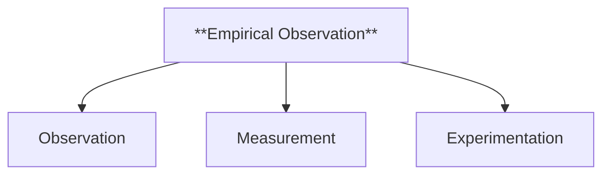

---

##### **2.2 Logical Reasoning**

- **Definition**: Deductive, inductive, and abductive reasoning to deduce truth.
- **Application**:
  - **Deductive**: Derives specific truths from general principles.
  - **Inductive**: Infers general truths from specific instances.
  - **Abductive**: Proposes the most likely explanation.

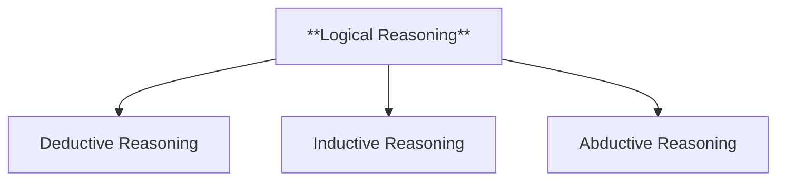

---

##### **2.3 Intuition and A Priori Knowledge**

- **Definition**: Self-evident truths independent of sensory experience.
- **Application**:
  - Foundational principles in ethics, mathematics, and philosophy.

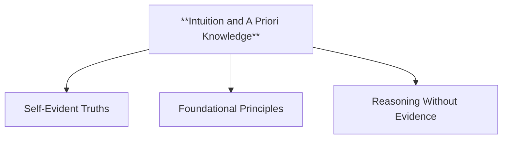

---

##### **2.4 Consensus**

- **Definition**: Truth determined by agreement among experts or communities.
- **Application**:
  - Common in legal, ethical, and historical contexts.

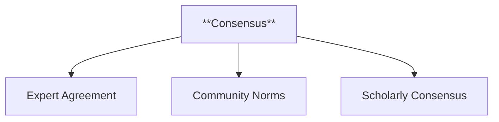

---

##### **2.5 Coherence Theory**

- **Definition**: Truth as coherence within a system of beliefs.
- **Application**:
  - Used in philosophical systems emphasizing consistency.

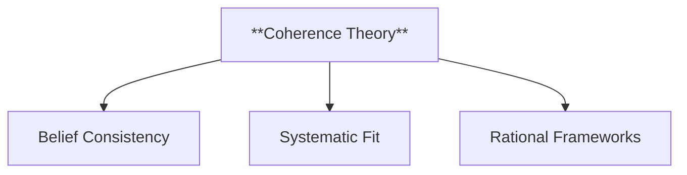

---

##### **2.6 Correspondence Theory**

- **Definition**: Truth as correspondence to reality or facts.
- **Application**:
  - Widely applied in science and everyday reasoning.

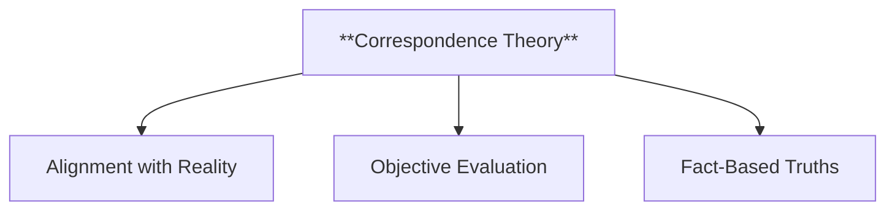

---

##### **2.7 Pragmatic Theory**

- **Definition**: Truth as what works practically or effectively.
- **Application**:
  - Focused on the practical consequences of beliefs.

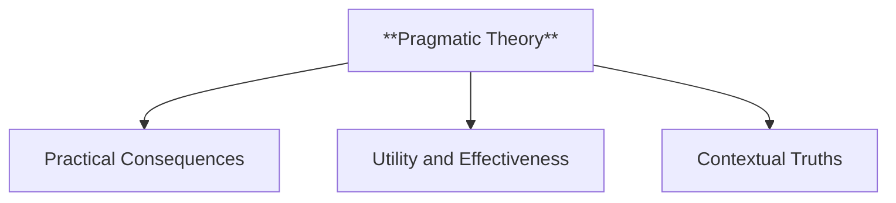

---

##### **2.8 Skepticism and Critical Thinking**

- **Definition**: Questioning claims and requiring rigorous evidence.
- **Application**:
  - Central to philosophy, science, and investigative journalism.

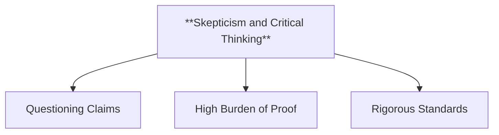

---

##### **2.9 Revelation or Faith**

- **Definition**: Truth derived from spiritual experiences or divine revelation.
- **Application**:
  - Used in religious and spiritual contexts.

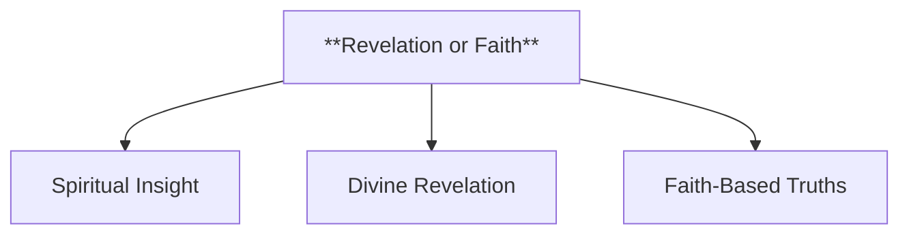

---

##### **2.10 Historical Method**

- **Definition**: Verifies truth through historical records and corroboration.
- **Application**:
  - Establishes reliability and consistency across historical accounts.

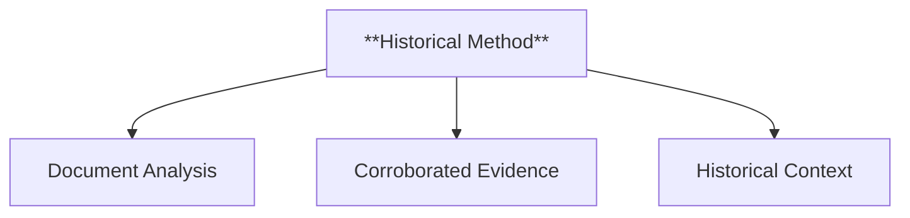

---

#### **3. Integration in Research Design**

- **Purpose**: Illustrate how understanding these methods enhances research design.
- **Content**:
  - Aligns methodologies with the nature of the inquiry.
  - Promotes interdisciplinary approaches by integrating multiple frameworks.

**Example**:

> Employing empirical observation alongside logical reasoning ensures a robust foundation for research conclusions, while skepticism safeguards against cognitive biases.

---

#### **4. Benefits of Understanding Truth Frameworks**

- **Purpose**: Highlight the advantages of applying diverse truth-determining methods.
- **Examples**:
  - Enhances the credibility of research outcomes.
  - Encourages nuanced understanding and multidisciplinary collaboration.
  - Builds critical thinking skills for evaluating evidence.

---

#### **5. Conclusion and Further Reading**

- **Purpose**: Summarize the importance of these frameworks and guide further exploration.
- **Content**:
  - Reiterate the relevance of truth frameworks in research and decision-making.
  - Include links to detailed discussions on specific methods.

**Example**:

> A comprehensive understanding of truth frameworks enriches research and decision-making processes, fostering deeper insights and actionable conclusions.

---

### **Mindmap Summary**

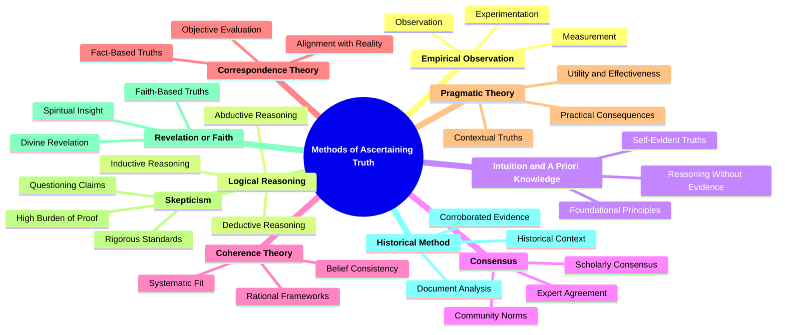

This knowledgebase entry provides a structured and comprehensive exploration of methods to ascertain truth, emphasizing their application and importance in research and decision-making.
