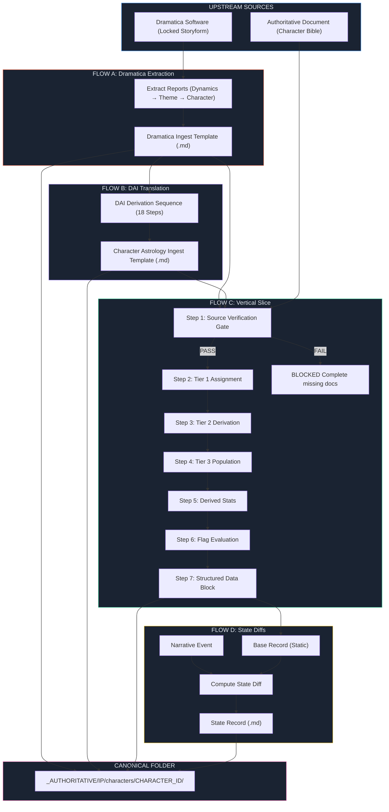
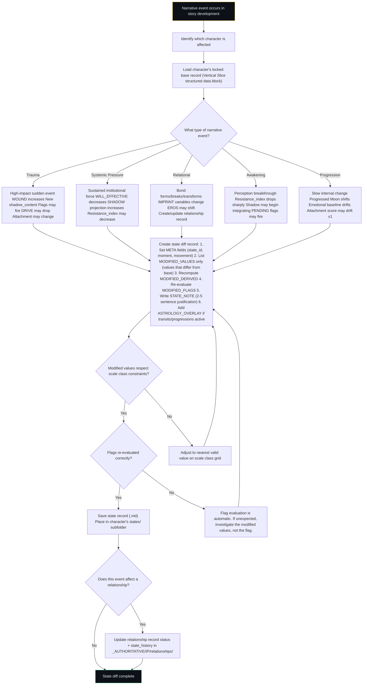
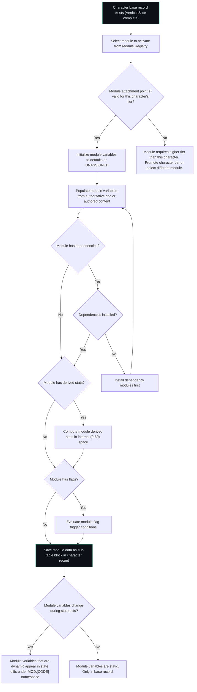

```mermaid
flowchart TD
    START["Open Dramatica Software Load storyform for IP"] --> CHECK{"Is storyform status LOCKED?"}
    CHECK --> |No| LOCK["Lock storyform first. No extraction from draft storyforms."]
    CHECK --> |Yes| COPY["Copy blank Dramatica Ingest Template into character folder"]

    COPY --> S1["EXTRACT 1: Story Dynamics Report → Fill Section 1 (outcome, judgement, driver, limit, goal, consequence, cost, dividend, forewarnings, prerequisites, preconditions, requirements)"]

    S1 --> S2["EXTRACT 2: Story Dynamics Report → Fill Section 2 (structural_role, archetype, resolve, growth, approach, mental_sex)"]

    S2 --> S3["EXTRACT 3: Character Report → Fill Section 3 (motivation, methodology, evaluation, purpose quads)"]

    S3 --> ROLE{"What structural role does this character hold?"}

    ROLE --> |MC| S4MC["EXTRACT 4: Theme Report (MC) → Fill Section 4 (domain, concern, issue, problem, solution, symptom, response, UA, CF, benchmark, focus, direction, signposts)"]

    ROLE --> |IC| S5IC["EXTRACT 5: Theme Report (IC) → Fill Section 5"]

    ROLE --> |OS Only| S6OS["Skip to Section 6"]

    S4MC --> S5{"Does character also hold IC role?"}
    S5 --> |Yes| S5IC
    S5 --> |No| S6OS

    S5IC --> S6OS["EXTRACT 6: Theme Report (OS) → Fill Section 6 (all OS throughline variables)"]

    S6OS --> S7{"Is character a RS principal?"}
    S7 --> |Yes| S7RS["EXTRACT 7: Theme Report (RS) → Fill Section 7"]
    S7 --> |No| S8

    S7RS --> S8["EXTRACT 8: Character Relationships Report → Fill Section 8"]

    S8 --> S9["AUTHOR: Section 9 Narrative Invariants (derive from storyform data, minimum 1 invariant)"]

    S9 --> S10["AUTO-GENERATE: Section 10 L12 Core Block (pull from Sections 1-3)"]

    S10 --> S11["RUN: Section 11 Handoff Checklist"]

    S11 --> DONE{"All checks pass?"}
    DONE --> |Yes| LOCKDOC["Set template_status: locked Place in canonical folder"]
    DONE --> |No| GAP["Identify gaps. Return to relevant extraction step."]

    style START fill:#0d1117,stroke:#ff6b4a,color:#e2e8f0
    style LOCKDOC fill:#0d1117,stroke:#34d399,color:#e2e8f0
    style GAP fill:#0d1117,stroke:#ff6b4a,color:#e2e8f0
```

```mermaid
flowchart TD
    START["Load locked Dramatica Ingest Template"] --> COPY["Copy blank Character Astrology Ingest Template"]

    COPY --> P1["STEP 1: Sun Sign Domain → Element Concern → Modality Grid → Sign"]

    P1 --> V1{"Validation: Does sign encode identity axis?"}
    V1 --> |Yes| P2
    V1 --> |No| P1R["Re-examine modality assignment. Concern-to-Modality has most flex."]
    P1R --> P1

    P2["STEP 2: Moon Sign Problem → planetary resonance Response → stress collapse Select sign"] --> V2{"Does sign encode stress-collapse pattern?"}
    V2 --> |Yes| P3
    V2 --> |No| P2R["Moon must feel instinctual, not rational. Reselect."]
    P2R --> P2

    P3["STEP 3: Ascendant Approach → Cardinal/Fire or Fixed/Water Critical Flaw → exploit vector"] --> P4

    P4["STEP 4: Mercury Unique Ability + Methodology → processing style sign"] --> P5

    P5["STEP 5: Venus Concern + Purpose → desire quality sign"] --> P6

    P6["STEP 6: Mars Approach + Motivation → action style sign"] --> P7

    P7["STEP 7: Saturn Critical Flaw + Inhibitor → limit sign"] --> MVC{"Minimum Viable Chart complete? (Steps 1-7 done)"}

    MVC --> |Proceed to full| P8
    MVC --> |Skip to aspects| ASP

    P8["STEP 8: Jupiter Unique Ability → expansion sign"] --> P9

    P9["STEP 9: Uranus Solution → disruption sign"] --> P10

    P10["STEP 10: Neptune Symptom → illusion sign"] --> P11

    P11["STEP 11: Pluto Outcome + Judgement → terminal sign"] --> P12

    P12["STEP 12: Midheaven Goal + OS Role → legacy sign"] --> P13

    P13["STEP 13: Descendant Direction → opposite of ASC"] --> P14

    P14["STEP 14: IC Benchmark → opposite of MC"] --> ASP

    ASP["STEP 15: Aspects Analyze Dramatica tensions → assign logic gates (min 3, target 5-7)"] --> HSE

    HSE["STEP 16: Houses Domain → emphasis pattern Assign each planet to house"] --> DIG

    DIG["STEP 17: Dignities Check each planet's sign against traditional dignities Apply narrative-first override if needed"] --> VOID

    VOID["STEP 18: 12th House Assign submerged functions Identify Hauntology trigger"] --> SUM

    SUM["Write Section 8: Chart Summary (6-10 sentences)"] --> FEED

    FEED["Fill Section 9: 12-Layer Feed Map Validate each layer feed"] --> CHECK

    CHECK["Run Section 10: Handoff Checklist"] --> DONE{"All checks pass?"}

    DONE --> |Yes| LOCKAST["Set status: locked or minimum_viable Place in canonical folder"]
    DONE --> |No| GAPB["Identify gaps. Return to relevant step."]

    style START fill:#0d1117,stroke:#a78bfa,color:#e2e8f0
    style LOCKAST fill:#0d1117,stroke:#34d399,color:#e2e8f0
    style MVC fill:#0d1117,stroke:#fbbf24,color:#e2e8f0
```

```mermaid
flowchart TD
    subgraph GATE["STEP 1: SOURCE VERIFICATION"]
        C1["Component 1: Authoritative Doc (7 checks)"]
        C2["Component 2: Dramatica Ingest (9 checks)"]
        C3["Component 3: Astrology Ingest (8 checks)"]
        C1 --> GR{"Gate Result?"}
        C2 --> GR
        C3 --> GR
    end

    GR --> |GREEN| S2
    GR --> |YELLOW| S2Y["Proceed with ASTROLOGY_PENDING tags on L7-L11"]
    GR --> |RED| BLOCKED["BLOCKED. See failure diagnostic in Step 1 Protocol."]

    S2Y --> S2

    S2["STEP 2: TIER 1 ASSIGNMENT Assign T1.CORE, T1.VITAL, T1.SOCIAL"] --> V_T1{"Tier 1 alone suggests the character?"}

    V_T1 --> |Yes| S3
    V_T1 --> |No| S2FIX["Primary values are wrong. The three numbers must produce a recognizable outline without any other layer."]
    S2FIX --> S2

    S3["STEP 3: TIER 2 DERIVATION"] --> S3A

    S3A["3A: Derive T2.WILL from T1.CORE Buy up/down based on documented resolve"] --> S3B

    S3B["3B: Assign T2.WOUND from character history (even values only, SC-12) This is a RECORD, not a choice."] --> S3C

    S3C["3C: Derive T2.DRIVE from T1.VITAL Ambition-driven: DRIVE = VITAL Meaning-driven: DRIVE < VITAL"] --> S4

    S4["STEP 4: TIER 3 POPULATION L7-L12 variable stacks"] --> S4A

    S4A["4A: L7 ORIGIN (from authoritative doc + AST.ANGLE.ic_sign)"] --> S4B

    S4B["4B: L8 IMPRINT (from authoritative doc + AST.PERSONAL.moon_sign)"] --> S4C

    S4C["4C: L9 EROS (from authoritative doc + AST Venus/Mars data) Mark INFERRED if needed"] --> S4D

    S4D["4D: L10 SHADOW (from authoritative doc + AST 12th House + debilities) shadow_density: even only projection_tendency: mult of 3"] --> S4E

    S4E["4E: L11 DESTINY (from authoritative doc + AST Jupiter/Uranus/MC) resistance_index: even only"] --> S4F

    S4F["4F: L12 FUNCTION (direct from Dramatica Ingest Core block + Extended sub-table)"] --> S5

    S5["STEP 5: DERIVED STATS Compute all 6 in internal (0-60) space"] --> S5A

    S5A["DRV.stress_threshold = WILL_i - WOUND_i (may be negative)"] --> S5B

    S5B["DRV.truth_exposure_index = SOCIAL_i + (12 - shame_d) × 5 (uncapped)"] --> S5C

    S5C["Read TEI and Collapse Risk first — these diagnose numeric coherence"] --> S5V{"Stats feel right for this character?"}

    S5V --> |Yes| S6
    S5V --> |No| S5FIX["Investigate contributing layer values. The stats are computed correctly; the inputs are wrong."]
    S5FIX --> S2

    S6["STEP 6: FLAG EVALUATION Evaluate each trigger against computed values"] --> S6V{"Any flags fire unexpectedly?"}

    S6V --> |No| S7
    S6V --> |Yes| S6FIX["Unexpected flag = schema inconsistency. Investigate contributing values before proceeding."]
    S6FIX --> S4

    S7["STEP 7: STRUCTURED DATA BLOCK Generate machine-readable YAML block with all values, derived stats, flag states"] --> VALIDATE

    VALIDATE["Run Feed Validation Checklist (15 items from Astrology ↔ 12-Layer Mapping)"] --> FINAL{"All items pass?"}

    FINAL --> |Yes| LOCKSLICE["Lock Vertical Slice Place in canonical folder"]
    FINAL --> |No| FIXFEED["Resolve inconsistency between chart and layer values per Conflict Resolution Protocol"]

    style GATE fill:#0d1117,stroke:#34d399,color:#e2e8f0
    style BLOCKED fill:#0d1117,stroke:#ff6b4a,color:#e2e8f0
    style LOCKSLICE fill:#0d1117,stroke:#34d399,color:#e2e8f0
```

# 📐 SSOT: Process Illustration

## Table of Contents

1. [Purpose](#purpose)
2. [The Four Flows](#the-four-flows)
3. [Master Pipeline Overview](#master-pipeline-overview)
4. [Flow A: Dramatica → Dramatica Ingest Template](#flow-a)
5. [Flow B: Dramatica Ingest → Character Astrology Ingest (via DAI)](#flow-b)
6. [Flow C: Both Ingests → 12-Layer Vertical Slice](#flow-c)
7. [Flow D: Vertical Slice → State Diffs](#flow-d)
8. [Cross-Flow: Module Attachment](#cross-flow-module-attachment)
9. [Version History](#version-history)

---

## Purpose

This document shows how data moves through the LEECHSEED character pipeline. Each flow describes what goes in, what decisions are made, what comes out, and where the output lands. Mermaid diagrams render natively in Obsidian. Annotated prose explains every decision point.

Read this document when you need to answer: "What do I do next?" at any point in the character development process.

---

## The Four Flows

| Flow | Name | Input | Output | When |
|---|---|---|---|---|
| **A** | Dramatica Extraction | Locked storyform in Dramatica software | Dramatica Ingest Template (.md) | Once per character per storyform |
| **B** | DAI Translation | Locked Dramatica Ingest Template | Character Astrology Ingest Template (.md) | Once per Tier 3 character |
| **C** | Vertical Slice | Both locked ingest templates + authoritative document | 12-Layer Vertical Slice (.md) with structured data block | Once per character (base record) |
| **D** | State Diffing | Locked base record + narrative event | State diff record (.md) | Per narrative moment per character |

Flows A → B → C execute sequentially for each new Tier 3 character. Flow D executes repeatedly during story development.

---

## Master Pipeline Overview



---

## Flow A: Dramatica → Dramatica Ingest Template

### Overview

Extract structural data from the locked Dramatica storyform and populate the Dramatica Ingest Template. This is a data transfer operation with sequenced extraction priorities.

### Flow Diagram



### Decision Point Annotations

**DP-A1: "Is storyform LOCKED?"** — A draft storyform can change. Extracting from a draft means the ingest template may become invalid when the storyform is revised. Never extract from a draft. Lock the storyform first. This is a hard gate.

**DP-A2: "What structural role?"** — Determines which throughline sections apply. MC fills Section 4. IC fills Section 5. RS principals fill Section 7. Every character fills Section 6 (OS). A character who is both MC and IC fills Sections 4, 5, 6, and 7.

**DP-A3: "All checks pass?"** — The handoff checklist (Section 11) validates completeness. If checks fail, the gap is in upstream extraction, not in the template itself. Return to the relevant Dramatica report and extract the missing data.

---

## Flow B: Dramatica Ingest → Character Astrology Ingest (via DAI)

### Overview

Translate locked Dramatica data into astrological notation using the 18-step DAI derivation sequence. Each step produces one or more chart assignments.

### Flow Diagram



### Decision Point Annotations

**DP-B1: "Does sign encode identity axis?"** — The Sun sign validation gate. Read the sign's elemental and modal qualities. Compare against the character's MC Domain + Concern. If the sign describes a fundamentally different kind of person than the Dramatica data defines, the sign is wrong. The most common error is misidentifying the Concern's modality. Concern-to-Modality mapping has the most interpretive flexibility — revisit that step first.

**DP-B2: "Does sign encode stress-collapse pattern?"** — The Moon sign validation gate. The Moon is where the character goes when their Sun-level processing fails. If the Moon sign feels too comfortable, too rational, or too similar to the Sun sign, it is wrong. The Moon should feel like a regression — older, more instinctual, less sophisticated than the Sun.

**DP-B3: "Minimum Viable Chart complete?"** — After Step 7 (Saturn), the core chart is sufficient for the Vertical Slice to proceed. Steps 8-14 (outer planets + angles) complete the full chart. If time is limited, mark the template as `minimum_viable` and proceed. Return to complete the outer planets before the final Vertical Slice lock.

---

## Flow C: Both Ingests → 12-Layer Vertical Slice

### Overview

The main production flow. Consumes both locked ingest templates plus the authoritative document to produce the complete 12-layer character record with derived statistics, flags, and structured data block.

### Flow Diagram



### Decision Point Annotations

**DP-C1: "Gate Result?"** — The three-component source verification from the Step 1 Protocol SSOT. Green = all pass. Yellow = Dramatica and Authoritative pass, Astrology at minimum_viable. Red = any component fails. Red is a hard block — do not proceed. Complete the missing upstream document.

**DP-C2: "Tier 1 alone suggests the character?"** — The critical validation. Three numbers (CORE, VITAL, SOCIAL) must produce a recognizable human outline without reference to any other layer. If you read CORE=13, VITAL=14, SOCIAL=10 and cannot intuitively guess "smart, physically elite, socially unfiltered," the numbers are wrong. This gate prevents downstream waste — every subsequent layer builds on Tier 1.

**DP-C3: "Stats feel right?"** — Derived statistics are diagnostic instruments. If Stress Threshold is positive for a character who should be operating past their limit, something is wrong upstream. If Truth Exposure Index is low for a character defined as maximally legible, something is wrong. The stats do not lie — they expose numeric assignment errors.

**DP-C4: "Any flags fire unexpectedly?"** — A flag that fires when it should not (or fails to fire when it should) indicates a schema inconsistency between the flag's trigger condition and the contributing layer values. Do not adjust the flag — investigate the layer values. The flag is correctly evaluating the numbers you gave it.

---

## Flow D: Vertical Slice → State Diffs

### Overview

Produces state records that describe how a character differs from their base record at specific narrative moments. State diffs do not modify the base record — they overlay on it.

### Flow Diagram



### Decision Point Annotations

**DP-D1: "What type of narrative event?"** — The five event categories from the Character State Architecture SSOT. Each category has a characteristic signature in the diff. Identifying the type first tells you which variables are most likely to change and what the diff should look like. If you are producing a trauma diff and no WOUND change appears, something is missing.

**DP-D2: "Modified values respect scale class constraints?"** — Every modified value must land on a valid point within its scale class. WOUND must be even on SC-12. projection_tendency must be a multiple of 3 on SC-12. resistance_index must be even. If a narrative event would logically place a value on an invalid grid point, round to the nearest valid value and document the rounding direction.

**DP-D3: "Does this event affect a relationship?"** — State diffs and relationship records are separate data structures, but they often change at the same narrative moment. When a trauma event severs an attachment (Victoria's crash killing Jebb), the character state diff records the WOUND increase and attachment object change, AND the relationship record records the status change from `active` to `severed`. Both must be updated at the same moment.

---

## Cross-Flow: Module Attachment

Modules attach at any point after the base record exists. They do not participate in Flows A-C. They activate during or after Flow C and persist through Flow D.

### Module Activation Flow



### Module Data in State Diffs

When a narrative event changes a module's variables, the state diff includes the module namespace:

```yaml
MODIFIED_VALUES:
  T2.WOUND.wound_score: 10
  MOD.COPING.effectiveness: 4
  MOD.DECOMP.visibility: 8

MODIFIED_MOD_FLAGS:
  MOD.COPING.FLG.coping_failure: ACTIVE
  MOD.DECOMP.FLG.decompensation_risk: ACTIVE
```

Module flags are re-evaluated alongside core flags during state diff creation.

---

## Appendix: Quick Reference — "What Do I Do Next?"

| You Have | You Need | Execute |
|---|---|---|
| Locked storyform, no ingest | Dramatica Ingest Template | Flow A |
| Locked Dramatica Ingest, no chart | Character Astrology Ingest | Flow B |
| Both ingests locked, no Vertical Slice | 12-Layer base record | Flow C |
| Locked base record, narrative event occurred | State diff for that moment | Flow D |
| Locked base record, want to add walking style | Module activation | Cross-Flow |
| Nothing locked | Character authoritative document | Write the character bible first. Everything starts there. |
| Authoritative doc exists but Dramatica storyform does not | Storyform | Open Dramatica. Build the storyform. Lock it. Then Flow A. |
| Vertical Slice complete but derived stats feel wrong | Corrected layer values | Re-enter Flow C at Step 2 or Step 4. Stats are diagnostic. Fix the inputs, not the outputs. |
| Flag fires unexpectedly | Corrected layer values | Re-enter Flow C at Step 4. The flag is right. The inputs are wrong. |
| Character needs to exist at two narrative moments | Two state diffs | Execute Flow D twice, once per moment. Each diff is independent of the other. Both diff against the base record, not against each other. |

---

## Version History

| Version | Date | Changes |
|---|---|---|
| 1.0.0 | 2026-03-08 | Initial process illustration. Four flows (A-D) plus module cross-flow. Mermaid diagrams for all flows. Decision point annotations. Quick reference table. |
