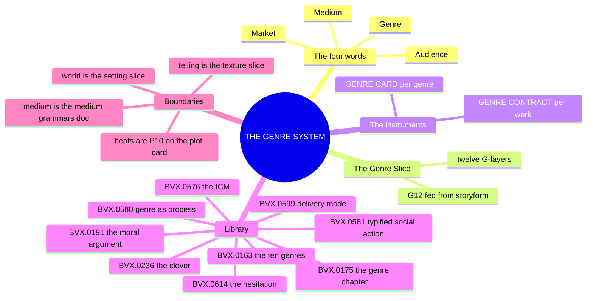
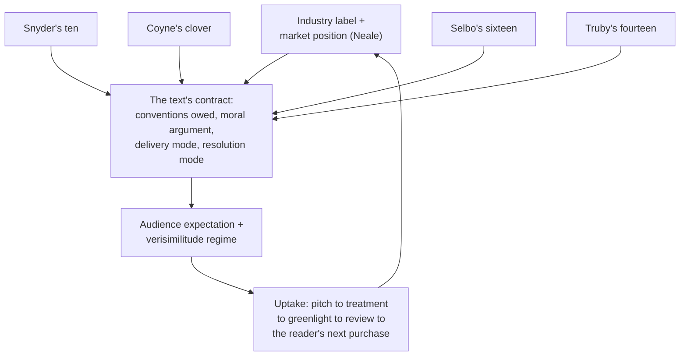
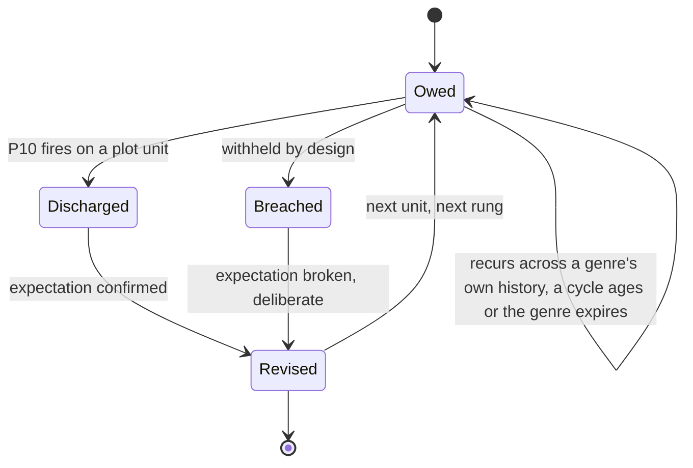

# 📐 SSOT · THE GENRE SYSTEM · the contract at character grade

**What this is:** genre promoted from the spine's outermost ring, L7, genre, medium, audience, market, the model's thinnest holding, to a system with a slice, an instrument, and an instance, the fifth top-layer model in the lattice beside 02 (character), 03 (setting), 04 (plot), and 01 (the texture system). It is written from the L7 shelf of the library, which now holds nine distills: the wave's six, [[BVX.0191]] (Truby, *The Anatomy of Genres*), [[BVX.0576]] (Selbo), [[BVX.0580]] (Neale), [[BVX.0581]] (Bawarshi & Reiff), [[BVX.0614]] (Todorov), [[BVX.0599]] (Mendlesohn), plus three older sources already carrying an L7 key, [[BVX.0236]] (Coyne), [[BVX.0163]] (Snyder), [[BVX.0175]] (McKee). This document closes the last shelf of BOLO 18's stage 2, the run that opened with setting, then plot, then texture.

**What the genre system owns:** the contract between a work and its public, the label a work is sold under, the family it belongs to, the conventions it owes the reader, the moral argument its structure proves, the reader's epistemic stance toward it, the delivery mode by which the strange enters it, the verisimilitude regime it is judged against, the world it promises to build, the uptake chain that carries its promise from pitch to purchase, the audience model it assumes, the market position it occupies, and the storyform it binds to. Two instruments carry this: the GENRE CARD, one per genre, the trade's fixed philosophy and schema; the GENRE CONTRACT, one per work, the specific mix a given IP owes its reader.

**What it does not own:** medium belongs to the medium grammars doc, named here only at the two seams where a genre touches it, never re-specified. A genre's owed beats are discharged one by one on the PLOT CARD's P10 GENRE OBLIGATION line, not restated here. The world a genre promises is built inside the setting slice; the telling a genre entails, its distance, its register, is set on the texture slice's Telling Profile. The genre system names the obligation; the other four systems, medium, plot, setting, texture, are what actually discharge it.

**Root claim:** a genre is a contract, but the Command's own contract reading is one tradition of three, not the neutral default. Bawarshi and Reiff trace it to the literary-structuralist branch, Jameson's genres as social contracts between a writer and a public, not to Miller's rhetorical tradition, genre as typified social action, which the field now treats as its dominant position. The shelf's six new distills show that contract reading has at least four independent clauses no trade convention list carries on its own: the moral argument a genre's whole structure exists to prove, the core binary underneath it (Truby), a reader position with its own resolution mode (Todorov), a delivery mode governing how the strange enters and is explained (Mendlesohn), and an industrial life as label, cycle, and risk that can precede or outlive any stable textual pattern (Neale). The trade's own genre lists, Snyder's ten, Coyne's five-leaf clover, Selbo's roughly sixteen, Truby's fourteen genres, are the four vocabularies for that one contract, never one vocabulary merely spelled four ways; none maps onto another without remainder, and a genre model built by borrowing one list wholesale loses what the other three see.

---

## MIND MODELS

**Diagram 1, the whole system on one screen.**



**Diagram 2, the central mechanism: Neale's process loop, the four vocabularies feeding one node.**



**Diagram 3, the recurring engine: the contract discharged per unit.**



*A GENRE CARD's obligations owed are discharged one by one against P10 GENRE OBLIGATION, and a breach reads as design against the five-leaf clover's obligatory scene, never as an error; the loop recurs at every rung of a work and across a genre's own history, Neale's cycles, Todorov's account of a genre's death.*

---

## PART B · THE TAXONOMY, the four words and the four vocabularies

| Word | What it decides | Owned by |
|---|---|---|
| **Genre** | the label, family, and conventions a work is sold and read under | this document, fed hardest by [[BVX.0191]] (the moral argument) and [[BVX.0236]] (obligatory scenes) |
| **Medium** | which channel's grammar re-instruments the telling, M1 through M10 | [📐 ssot_01_medium_grammars.md](📐%20ssot_01_medium_grammars.md), linked at G1 and G8, never re-specified here |
| **Audience** | the cognitive model a genre builds in a reader before a scene is drafted | [[BVX.0576]] (the ICM), [[BVX.0581]] (uptake) |
| **Market** | the industrial cycle, budget tier, and risk position a genre label carries | [[BVX.0580]] |

The four vocabularies below, Snyder's ten, Coyne's clover, Selbo's sixteen, Truby's fourteen genres, all claim the same reader-contract territory at different resolutions, and none substitutes for the others.

| Vocabulary | Count | Basis | Aligns with the others at | Names the others do not carry |
|---|---|---|---|---|
| Snyder's ten ([[BVX.0163]]) | 10 | commercial, page-keyed | Horror/Monster in the House, Coming-of-Age/Rites of Passage and Institutionalized, Love/Buddy Love | Golden Fleece and Whydunit have no clean Truby or Coyne name |
| Coyne's clover ([[BVX.0236]]) | 5 axes, Content splits to roughly 9 external and 3 internal kinds | theoretical, five independent axes | Horror, Action, Crime, Detective, Love, Western at Content | Comedy sits on the Style leaf, never the Content leaf, so it never aligns with Truby's Comedy as a content genre |
| Selbo's sixteen ([[BVX.0576]]) | roughly 16 chaptered, plus a 30-term overview | industry marketing category | names Coming-of-Age and Fish-Out-of-Water as full genres neither Snyder nor Coyne name separately | splits Action from Adventure and Disaster from War where Snyder folds comparable material together |
| Truby's fourteen genres ([[BVX.0191]]) | 14 | moral-argument tradition, a fixed chapter schema | Horror, Love, and Coming-of-Age line up across all three other lists | Myth, Science Fiction, Fantasy, and Gangster have no Coyne content-genre name at all |

Bawarshi and Reiff trace three incompatible traditions for what a genre even is: literary (a structuralist contract, or a Cultural Studies reading of ideology), linguistic (a staged social purpose, Systemic Functional Linguistics' register or English for Specific Purposes' communicative aim), and rhetorical (Miller's typified social action, the field's current dominant position). The Command's own genre-as-contract language, obligatory conventions owed, traces to the literary-structuralist branch specifically, not to Miller's rhetorical tradition, which is why uptake and a genre system in their sense, the entire apparatus for how one genre's obligation gets discharged into another's across a production-to-reception pipeline, have had no home at L7 until this document [[BVX.0581]].

Neale's law is that a genre is a process, not a corpus: industrial, marketing, critical, and audience uses of one label routinely diverge at the same historical moment, and no single definition serves all four at once. A critic-coined category like film noir can be a legitimate object of study with no contemporary industry name at all, so long as it is studied by explicit criteria over a full corpus, never assembled backward from an already-canonized core [[BVX.0580]]. The genre system inherits that discipline directly: G1 LABEL below carries industry, marketing, and critical labels as three separate fields, not one slot standing in for all three.

---

## PART A · THE GENRE SLICE, twelve layers, mirror of the character, setting, plot and texture stacks

Same architecture as the 12-Layer Character Database, the SETTING SLICE, the PLOT SLICE, and the TEXTURE SLICE: surface to depth to structural function, G12 fed independently from the storyform exactly as L12, S12, P12, and T12 are. **Layer names are house coinage, provisional, awaiting Papi's ruling**, same status as every other stack's layer names.

| Layer | Name | Question it answers | Source | Field it writes |
|---|---|---|---|---|
| **G1** | **G1 LABEL ⧗** | What is this work called, by the industry, by marketing, and by critics, and do those three agree? | [[BVX.0580]] | `industry_label`, `marketing_label`, `critical_label` |
| **G2** | **G2 FAMILY ⧗** | Which family does this genre belong to, and what is its polar opposite? | [[BVX.0191]], [[BVX.0236]] | `family`, `polar_opposite` |
| **G3** | **G3 CONTRACT ⧗** | What conventions does this genre owe the reader: component list, criteria steps, obligatory scenes? | [[BVX.0576]], [[BVX.0236]], [[BVX.0163]] | `basic_elements`, `criteria_steps`, `obligatory_scenes` |
| **G4** | **G4 ARGUMENT ⧗** | What moral argument, what core binary, does this genre's whole structure exist to prove? | [[BVX.0191]] | `core_binary`, `mind_action_view`, `thematic_recipe` |
| **G5** | **G5 STANCE ⧗** | What epistemic position does the reader hold, and how does the hesitation resolve? | [[BVX.0614]] | `resolution_mode` |
| **G6** | **G6 DELIVERY ⧗** | How does the strange enter the text, and is it explained, and to whom? | [[BVX.0599]] | `delivery_mode` |
| **G7** | **G7 VERISIMILITUDE ⧗** | Against which two verisimilitudes, generic and cultural, is this genre judged plausible? | [[BVX.0580]] | `verisimilitude_regime` |
| **G8** | **G8 WORLD ⧗** | What story-world does this genre promise to build, the genre-setting contract? | [[BVX.0191]] | `world_build` |
| **G9** | **G9 UPTAKE ⧗** | What does this genre call forth, and which genre answers it next in the chain? | [[BVX.0581]] | `uptake_chain` |
| **G10** | **G10 AUDIENCE ⧗** | What cognitive model, the ICM, does this genre build in an audience before a scene is drafted? | [[BVX.0576]], [[BVX.0089]] | `icm` |
| **G11** | **G11 MARKET ⧗** | What cycle, budget tier, and risk position does this genre's label carry industrially? | [[BVX.0580]] | `cycle`, `budget_tier`, `risk_position` |
| **G12** | **G12 FUNCTION ⧗** | What does this genre do for the Grand Argument, the storyform's own appreciations? | [[BVX.0089]] | `story_point`, `storyform_id` |

A few of these layers compress a lot, and are worth unpacking once. G5 STANCE carries Todorov's spectrum: the hesitation, sustained or resolved, and the resolution mode it settles into, uncanny, marvelous, or the pure fantastic held at the median. G6 DELIVERY carries Mendlesohn's four delivery modes, portal-quest, immersive fantasy, intrusion, liminal, none interchangeable with another; a technique native to one reads as leaden or overcontrived in the next. G7 VERISIMILITUDE carries the two verisimilitudes (Neale), the generic regime a genre licenses internally and the cultural regime everyday belief still measures it against. G1 LABEL keeps Neale's own finding that industry label, marketing label, and critical label are three fields, never one, because the inter-textual relay, posters, trailers, reviews, is often the only place a genre's real definition ever gets tested against actual use.

**Binding rule (mirror of the character, setting, plot, and texture bindings):** G12 is fed independently from the storyform, exactly as L12, S12, P12, and T12 FUNCTION are, keyed by `storyform_id`. A genre entry with G12 empty is a shelf label, a set of owed conventions with no argument to serve; a genre entry with G12 filled is the argument's contract, the way a specific work's chosen genres are doing structural work for a throughline's signpost, not merely decorating it. Whether the count should hold at twelve or run to fewer, matching the shelf's actual convergence, is OPEN call 1; the twelve names are OPEN call 2. Medium is deliberately not a G-layer: it belongs to the medium grammars doc, linked here at G1 (a work's label can be medium-specific, a mini-series label reads differently from a novel's) and G8 (a genre's world promise re-instruments per M1 through M10), never re-derived on this slice.

---

## THE INSTRUMENTS · the GENRE CARD and the GENRE CONTRACT

**The GENRE CARD**, one per genre in the Command's register, merges Truby's chapter schema with Selbo's field list:

```
GENRE CARD
name & labels:    industry / marketing / critical labels               (G1)
family:           family placement, polar opposite                     (G2)
basic elements:   criteria steps, obligatory scenes                     (G3)
core binary:      Mind-Action philosophy, thematic recipe               (G4)
resolution mode:  sustained hesitation | resolves natural |
                  resolves supernatural | normalized from the start     (G5)
delivery modes:   portal-quest | immersive | intrusion | liminal        (G6)
verisimilitude:   generic regime · cultural regime                      (G7)
world build:      the story-world this genre promises                  (G8)
calls forth:      what this genre's uptake chain answers next           (G9)
audience ICM:     schematic + specific + relevant knowledge             (G10)
market notes:     cycle, budget tier, risk position                     (G11)
transcending:     named hybrid variants
```

**The GENRE CONTRACT**, one per work, the instance format:

```
GENRE CONTRACT
primary genre:     the overriding genre
mix:               overriding + supporting genres,
                   percentage balance (Selbo)
delivery mode:     portal-quest | immersive | intrusion | liminal
resolution mode:   per the genre card's G5
register:          the sensorium promise (links texture T6, setting S3)
obligations owed:  a list, each discharged one by one on the
                   plot card's P10 line
storyform binding: storyform_id
```

Selbo's overriding genre must clear its own criteria in full; a supporting genre only counts toward the mix if its own criteria are substantially met too, never merely gestured at by setting or iconography. The plot card's P10 line is the per-unit discharge of the GENRE CONTRACT's obligations owed, exactly as the scene card's telling line is texture's per-unit override of the Telling Profile: neither card restates the whole instrument, each fires the one field the unit actually needs.

---

## THE INSTANCE · OXO, a proposed genre contract (bench, not a ruling)

| Layer | OXO (proposed ⧗) |
|---|---|
| **G1** | A prestige-school drama, a YA-adjacent institutional dystopia by industry label, versus coming-of-age by critical label ⧗ |
| **G2** | Truby's Coming-of-Age primary, individual-focus family; polar opposite the Gangster/Crime society-focus family ⧗ |
| **G3** | The weakness-need/self-revelation frame, system-as-opponent, an apparent-choice-versus-restriction world build (Truby), Coyne's obligatory scenes for the internal Worldview genre and the external Society genre, if the clover fits ⧗ |
| **G4** | Merit does not earn freedom; visibility invites ownership, read off the DCUS S9 ALLURE entry and Tori's Growth: Stop arc ⧗ |
| **G5** | The generalized fantastic, the abnormal given as norm from page one, an adaptation-curve payoff rather than an unmasking scene (Todorov) ⧗ |
| **G6** | Immersive: natives, not visitors; Sync is used, never explained (Mendlesohn) ⧗ |
| **G7** | Cultural regime of the American prestige school, generic regime of the institutional dystopia ⧗ |
| **G8** | The Southern Gothic register ruling, the DCUS slice, the descent clean to NEON-ROT to hunt read as the genre's own entropy trajectory (Mendlesohn's immersive diagnostic) ⧗ |
| **G9** | Series, six movements, seriality's own poetics (the spine's L7 branch) ⧗ |
| **G10** | Selbo's ICM for coming-of-age and institutional dystopia, stacked; the Vicarious V dominant ⧗ |
| **G11** | Mid-budget serial, YA-adjacent shelf; marked unknown where the distills say nothing ⧗ |
| **G12** | `storyform_id: oxo_primary_v1`; appreciations arena, style, and feel carried from the spine ⧗ |

This table is a decision menu with defaults, not a ruling: every line above is marked ⧗, grounded only in what the six new distills' inferences and the DCUS setting instance already say, and nothing here is canon until Papi strikes or keeps it, line by line.

---

## GENRE × LIBRARY

| ID | Book | Feeds hardest | What it gives the system |
|---|---|---|---|
| [[BVX.0191]] | Truby, *The Anatomy of Genres* | G2 FAMILY, G3 CONTRACT, G4 ARGUMENT | the fourteen genres as moral-argument traditions, the fixed chapter schema, the apparent-choice-over-restriction dystopia mechanism |
| [[BVX.0576]] | Selbo, *Film Genre for the Screenwriter* | G3 CONTRACT, G10 AUDIENCE | the ICM (schematic, specific, relevant knowledge), overriding and supporting genre, the percentage-balance audit |
| [[BVX.0580]] | Neale, *Genre and Hollywood* | G1 LABEL, G11 MARKET | the inter-textual relay, the two verisimilitudes, industry, marketing, and critical labels as three fields, genre as process not corpus |
| [[BVX.0581]] | Bawarshi & Reiff, *Genre* | G9 UPTAKE | typified social action, uptake, a genre system and meta-genre in their sense, the three traditions |
| [[BVX.0614]] | Todorov, *The Fantastic* | G5 STANCE | genre defined by reader position, the hesitation, the resolution-mode spectrum, a genre's own expiry |
| [[BVX.0599]] | Mendlesohn, *Rhetorics of Fantasy* | G6 DELIVERY | the four delivery modes, portal-quest, immersive fantasy, intrusion, liminal, delivery as a rhetoric distinct from focalization |
| [[BVX.0236]] | Coyne, *The Story Grid* | G3 CONTRACT | the five-leaf clover, obligatory scenes, the Content genre split |
| [[BVX.0163]] | Snyder, *Save the Cat!* | G1 LABEL, G3 CONTRACT | the ten commercial genres, the page-timed beat sheet as a genre-checklist instance |
| [[BVX.0175]] | McKee, *Story* | G3 CONTRACT | genre as an audience contract of obligatory conventions, the convention-and-prop-list method |
| [[BVX.1125]] | Brody, *Save the Cat! Writes a Novel* | G3 CONTRACT | her ten alias onto the register unchanged from Snyder's; [[the-ingredient-triad|the ingredient triad]], exactly three required elements per genre |
| [[BVX.1126]] | Aristotle, *Poetics* | G4 ARGUMENT | [[hamartia|hamartia]] read as an action-level error, not a fit for G4's binary; [[catharsis|catharsis]] maps onto the texture system's mood curve instead; "[[wonder-telos|wonder]]" as tragedy's telos; theoretical genre defined by the reader's affect |

The L7 shelf holds 174 items keyed 9/16 (BOLO 18), nine distilled to date, this document's nine sources. Next candidates by name: Carroll's *The Philosophy of Horror* (BVX.0840), Grant's *Film Genre* (BVX.0577), Horsley's *The Noir Thriller* (BVX.0620), Black's *The Anatomy of a Best Seller* (BVX.0190) for market, Storr (BVX.0232) and Cron (BVX.0257) for the reader's neuroscience, Dunleavy's *Complex Serial Drama* (BVX.0564) for seriality, and Bould's *Routledge Companion to Science Fiction* (BVX.0642). Acquisitions: none new this wave. The orphan finding stands as it did for the plot shelf: Truby's two Anatomy books, [[BVX.0193]] and [[BVX.0191]], have no Zotero record between them, both filed from disk in the same storage folder, an orphan pair rather than one-off noise.

---

## OPEN

Built from the six wave distills' "For the genre system" bullets. **RULED 2026-09-16 (Papi: "genre calls go"): all thirteen as recommended.** Twelve layers hold; the names and the OXO contract bench stay provisional; Truby's fourteen become the spine of the GENRE CARD register with the other three vocabularies as aliases; the four clauses become required card fields; the rest apply at the next bump or pass to their home docs as recommended. Provisional a week like every ruling.

1. **Twelve G-layers or fewer.** The mirror against the character, setting, plot, and texture stacks all lands at twelve; a genre model could in principle collapse to fewer axes, but no distill's fill needed less this wave. *Ruled 9/16, as recommended:* twelve, the mirror holds.
2. **The twelve names.** House coinage, the same provisional status as every other stack's layer names, awaiting Papi's ruling. *Ruled 9/16, as recommended:* bench on request, no ruling forced this wave.
3. **Four vocabularies, one register.** Build the Command's GENRE CARD register from Truby's fourteen genres, carrying Selbo's, Coyne's, and Snyder's names as aliases rather than picking one list and losing the others' coverage. *Ruled 9/16, as recommended:* yes, Truby as the spine of the register.
4. **The contract's four clauses beyond the convention list.** Argument, stance, delivery, and industrial life as required GENRE CARD fields, not optional color, since each of the six new distills supplies a clause the trade's convention lists never named. *Ruled 9/16, as recommended:* yes.
5. **A per-scene genre-load metric and Selbo's percentage balance on the plot card.** Selbo's scene-count percentage audit is a ready QA pass distinct from Coyne's value-turn tracking; a full per-scene metric is a heavier build than this wave needs. *Ruled 9/16, as recommended:* hold the metric, adopt the balance on the contract.
6. **Bordwell's mode vs genre: where mode lives.** Selbo fences mode, animation, documentary, mini-series, off from genre entirely; the medium grammars doc documents medium but not mode-within-medium. *Ruled 9/16, as recommended:* the medium grammars doc gains a mode row, OPEN there.
7. **Genre-contract state track: a contract that changes mid-work.** Mendlesohn's mode shift, an intrusion fantasy transmuting into a portal-quest, has no notation; a contract fixed once per work cannot record it. *Ruled 9/16, as recommended:* a state track parallel to Axis 4 TIME, at the next bump.
8. **Neale's rule for critic-coined genres in library keying.** A term like film noir, never used by the contemporary industry, is still a legitimate object of study when criteria are explicit and the corpus is not assembled backward from an already-canonized core. *Ruled 9/16, as recommended:* adopt as a keying rule in the zotero README.
9. **Meta-genre, kairotic coordination and typification.** Bawarshi and Reiff's apparatus for a genre's social life beyond the contract; a style bible or a showrunner's tone memo is exactly a meta-genre, while the other two terms describe timing and cognition, not yet used anywhere in the Command. *Ruled 9/16, as recommended:* meta-genre as the style-bible's home, the other two noted.
10. **Todorov's expiry: a historicity note on a genre card.** A rival vocabulary can fully absorb a genre's content and end it, per Todorov's account of the fantastic's death; no field currently tracks when a convention set stops doing work a text cannot do without it. *Ruled 9/16, as recommended:* a field, provisional.
11. **Truby's dystopia mechanism as a setting-touchpoint candidate.** No current field names the structural claim a genre's world makes about freedom and restriction, apparent choice over hidden restriction; P10 records which obligatory beat fires, not this claim itself. *Ruled 9/16, as recommended:* pass to the setting doc's OPEN.
12. **The OXO genre contract.** The bench filled above, twelve proposed lines against a work with no ruled genre contract at all. *Ruled 9/16, as recommended:* Papi strikes or keeps line by line.
13. **Neale on labels: industry, marketing, and critical labels as three fields, not one.** The L7 ring's genre word has treated "genre" as one slot; Neale's own case, melodrama's opposite trade and critical meanings, shows the collapse breaks on a real example every time. *Ruled 9/16, as recommended:* yes, that is G1.

14. **[[the-ingredient-triad|The ingredient triad]] as a G3 sub-field with fixed cardinality 3.** [[BVX.1125]]'s three required elements per genre, always exactly three, is a portable completeness test G3 CONTRACT does not yet enforce as a rule; the closest existing field holds Coyne's obligatory-scene lists and Selbo's component lists but no fixed-cardinality rule. *Recommendation:* adopt at the next bump.

15. **[[catharsis|Catharsis]] and [[wonder-telos|wonder]]: where an affective telos lives.** [[BVX.1126]]: G4 ARGUMENT holds arguments, a propositional core binary; catharsis and wonder are affect, not argument, Sachs explicit that "it does not follow that the poet has taught us anything." *Recommendation:* a note on G4 pointing to T7 (the texture system's mood curve), no new field.

## Version history

- **0.1.2, 2026-09-16.** The drop-folder intake folded in (Brody, Aristotle): two new GENRE × LIBRARY rows; sources gained BVX.1125, BVX.1126; two OPEN calls added (14-15), unruled. Slice unchanged.
- **0.1.1, 2026-09-16.** The thirteen OPEN calls ruled as recommended ("genre calls go"): twelve layers hold; Truby's fourteen as the register's spine with three alias vocabularies; the four contract clauses as required card fields; the balance adopted, the load metric held; mode to the medium grammars doc; the contract state track at the next bump; Neale's keying rule adopted; the dystopia mechanism passed to the setting doc; the OXO contract stays a bench. No slice or instrument change tonight.
- **0.1.0, 2026-09-16.** First genre_system document, written on Papi's order ("genre wave go", BOLO 18) from the L7 shelf's nine distills: the four words and four vocabularies taxonomy, twelve-layer GENRE SLICE mirroring the character, setting, plot, and texture stacks, the GENRE CARD and GENRE CONTRACT instruments, OXO benched as a proposed genre contract, not a ruling. Layer names, count, and every OXO value provisional pending Papi's ruling.
