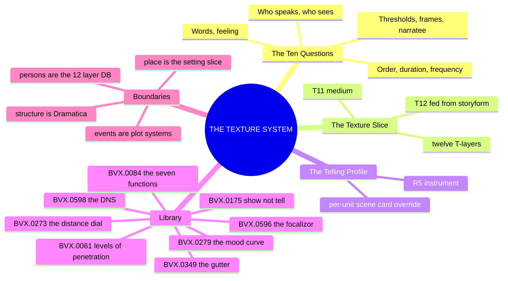
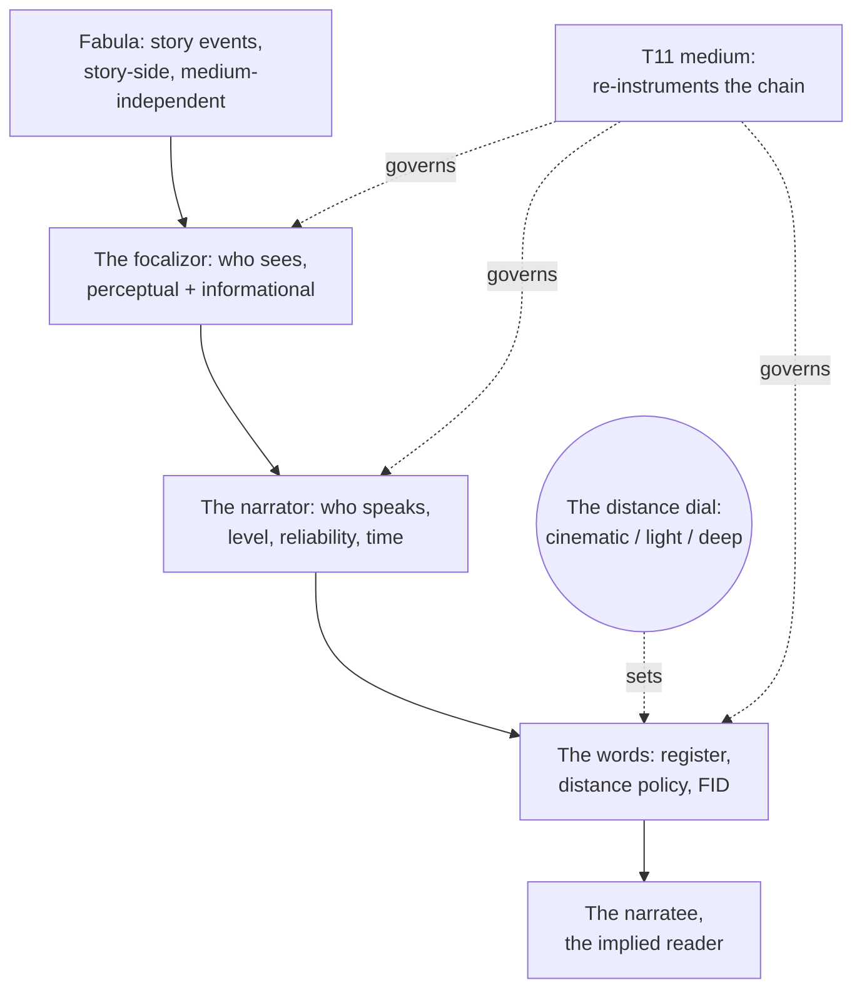
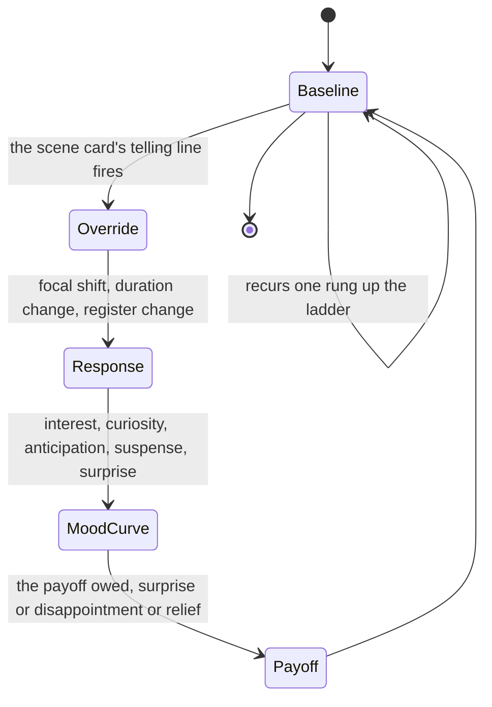

# 📐 SSOT · THE TEXTURE SYSTEM · the telling at character grade

**What this is:** texture promoted from a taxonomy, the Ten Questions of the Telling, to a system with a slice, an instrument, and an instance, the fourth top-layer model in the lattice beside 02 (character), 03 (setting), and 04 (plot). It is written from the TEXTURE shelf of the library, which now holds eight distills: the wave's five, [[BVX.0598]] (Hühn, Schmid & Schönert), [[BVX.0596]] (Bal), [[BVX.0273]] (Hall), [[BVX.0084]] (Kempton), [[BVX.0279]] (Iglesias), plus three older sources carrying a TEXTURE key, [[BVX.0061]] (Card), [[BVX.0175]] (McKee), [[BVX.0349]] (Kennedy). The texture layer doc at version 1.0.0 remains the taxonomy source this document is written from; it is not superseded, and PART B below restates its Ten Questions rather than replacing them.

**What the texture system owns:** the discourse side of the telling, who speaks, who sees, in what order, at what speed, how often, in what words, with what feeling, through what thresholds, breaking which frames, and to whom; the TELLING PROFILE as the work's fixed configuration of those answers; the SCENE CARD's `telling:` line as the per-unit override; and the medium's re-instrumenting of all of it, since a storyform survives adaptation but a Telling Profile does not.

**What it does not own:** everything story-side. Structure belongs to Dramatica's storyform, events belong to plot_systems' twelve-layer PLOT SLICE, place belongs to the setting system's twelve-layer SETTING SLICE, and who a character is belongs to the 12-Layer Character Database, never to how that character is told. Per Card, viewpoint mechanics, person, tense, levels of penetration, map onto none of the twelve character layers and are declared out of scope for the stack ([[BVX.0061]]); per Hühn, Schmid & Schönert, the volume's own working assumption is the positive theoretical case for that same exclusion, mediation is a property of the telling and never of the person told about ([[BVX.0598]]). The exclusion runs both ways: the texture system claims no story-spine content, no event structure, and no character psychology, exactly as those systems claim no telling.

**Root claim:** every telling is one configuration of a fixed set of answers, and eight independent sources, a reference-shelf volume, a single-author theory book, three craft manuals, and three older texture-keyed distills, converge on the same load-bearing law without having read one another: who speaks and who sees are two decisions, never one. Hühn, Schmid & Schönert spend fourteen essays proving the collapse breaks on a real example every time it is attempted, in prose, drama, film, or games; Bal calls the collapse "nonsensical," as absurd as claiming a third-person-narrated character narrates her own sentence; Card names the same split, cinematic, light, deep, as a dial inside limited third person a working novelist turns scene by scene. The trade's craft vocabulary, deep POV, third limited, show don't tell, register, is a set of compressed settings on that same fixed answer set, and the distance between reader and focal character is the dial the craft books are really turning, whatever name each one gives it: Hall's barrier-word removal, Kempton's viewpoint silence, Iglesias's reader-emotion taxonomy all aim at the same knob from three different trades.

---

## MIND MODELS

**Diagram 1, the whole system on one screen.**



**Diagram 2, the central mechanism: the mediation chain and the distance dial.**



**Diagram 3, the recurring engine: the telling per unit.**



*The TELLING PROFILE holds as baseline until a SCENE CARD's telling line fires an override; T2 FOCALIZATION and T6 WORDS carry most of the mood curve's weight, and the cycle recurs at every rung from beat to movement, exactly as the plot engine's value-in-turn-value-out cycle does one system over.*

---

## PART B · THE TAXONOMY, the Ten Questions restated as axes

The layer doc's Ten Questions, T1 through T10, restated here as a compact table rather than reproduced in full; the layer doc itself remains the taxonomy source, and its own TRANSLATION GRID (craft vocabulary as compressed configurations) is not reproduced below, only linked: [📐 ssot_01_texture_layer.md](📐%20ssot_01_texture_layer.md).

| Question | What it decides | The law or the dial | Source |
|---|---|---|---|
| T1 WHO SPEAKS | person, level, reliability, time of narration | voice is a speech act, never a vision; a narratorless text, drama or screenplay, still carries a structural, impersonal narrating agency | [[BVX.0598]], [[BVX.0596]] |
| T2 WHO SEES | focalization mode, focal character, perceptual scope, informational denial | who speaks is not who sees; EF/CF plus perceptible or non-perceptible marking of both narrator and focalizor | [[BVX.0598]], [[BVX.0596]], [[BVX.0273]] |
| T3 IN WHAT ORDER | story-time versus discourse-time, anachronies, reach and extent | the telling's rearrangement of a story sequence the ladder's R4 signposts already fix | [[BVX.0596]] |
| T4 AT WHAT SPEED | the five speeds, scene through ellipsis | dialogue is the default accelerator of a scene, narrative the default brake | [[BVX.0084]], [[BVX.0596]] |
| T5 HOW OFTEN | singulative, repetitive, iterative | repetitive is trauma's signature, iterative is habit's, mirroring S8 HABIT | [[BVX.0596]] |
| T6 IN WHAT WORDS | diction, syntax, register, distance policy, free indirect discourse | the distance dial, cinematic, light, deep, named identically by two independent craft sources decades apart | [[BVX.0273]], [[BVX.0061]], [[BVX.0084]] |
| T7 WITH WHAT FEELING | tone, mood, the target mood curve | interest is the master emotion; curiosity, anticipation, suspense, and surprise are its specialized forms, not separate systems | [[BVX.0279]] |
| T8 THROUGH WHAT THRESHOLDS | paratext apparatus, titles, epigraphs, in-world documents | a detail earns its place by pointing at theme or distinctiveness; the rest is plumbing, not appeal | [[BVX.0349]] |
| T9 BREAKING WHICH FRAMES | metalepsis policy, permitted or never | direct address is normalized metalepsis in some mediums and a violation of the contract in others | [[BVX.0596]] |
| T10 TO WHOM | narratee construction, implied reader | the three V's, voyeuristic, vicarious, visceral, describe how an implied reader gets built into a text | [[BVX.0279]], [[BVX.0596]] |

**The law:** who speaks is not who sees. Hühn, Schmid & Schönert's DNS model splits mediation into three simultaneous dimensions, perception, reflection, and mediation proper, and argues that Genette's single word "focalization" silently covers two different operations, an epistemic position and an information-regulation decision ([[BVX.0598]]). Bal names the same split as EF versus CF, external focalizer or character-focalizer, each independently markable perceptible or non-perceptible, and argues the narrator never touches the focalized object directly, only through the focalizor ([[BVX.0596]]). Both sources argue the current single `focalization_mode` value on T2 is really two bundled decisions, a perceptual one and an informational one, which PART A below carries as separate fields.

**The dial:** distance, cinematic, light, or deep. Card names the three settings inside limited third person in a single page, cinematic (camera only, no thoughts), light (the narrator dips in and out), and deep (no thought tags needed, the character's judgment colors every clause) ([[BVX.0061]]). Hall spends an entire book operationalizing the deep end of that same dial into a checkable technique inventory, barrier words removed, body language gated by awareness, emotion rendered as physical sensation instead of named ([[BVX.0273]]). Two craft sources, twenty-six years apart, converge on the identical three-point scale without citing each other; T6's distance policy field carries that scale as house vocabulary from this version forward.

---

## PART A · THE TEXTURE SLICE, twelve layers, mirror of the character, setting and plot stacks

Same architecture as the 12-Layer Character Database, the SETTING SLICE, and the PLOT SLICE: surface to depth to structural function, T12 fed independently from the storyform exactly as L12, S12, and P12 are. **Layer names are house coinage, provisional, awaiting Chief's ruling**, same status as the P-layer and S-layer names.

| Layer | Name | Question it answers | Source | Field it writes |
|---|---|---|---|---|
| **T1** | **VOICE ⧗** | Who speaks, at what level, with what reliability, and when relative to the events? | [[BVX.0596]], [[BVX.0598]] | `voice_person` (homo \| hetero), `voice_level`, `reliability`, `narration_time` |
| **T2** | **FOCALIZATION ⧗** | Who sees, and what is the reader denied? | [[BVX.0598]], [[BVX.0596]], [[BVX.0273]] | `focalization_mode`, `focal_character`, `perceptual_scope`, `informational_denial` |
| **T3** | **ORDER ⧗** | In what order is the story told against the order it happened? | [[BVX.0596]] | `order_baseline`, `licensed_anachronies` |
| **T4** | **DURATION ⧗** | At what speed does the telling move, scene through ellipsis? | [[BVX.0596]], [[BVX.0084]] | `duration_mode`, `signature_moves` |
| **T5** | **FREQUENCY ⧗** | How often is an event told relative to how often it happened? | [[BVX.0596]] | `frequency_mode` (singulative \| repetitive \| iterative) |
| **T6** | **WORDS ⧗** | In what words, register, and distance from mimesis? | [[BVX.0273]], [[BVX.0061]], [[BVX.0084]] | `register`, `distance_policy` (cinematic \| light \| deep), `fid` |
| **T7** | **FEELING ⧗** | With what feeling, whose tone, and what is the reader meant to feel? | [[BVX.0279]] | `mood_curve` entries, each emotion + technique + payoff owed |
| **T8** | **THRESHOLDS ⧗** | Through what thresholds does the reader cross into and around the text? | [[BVX.0349]] | `paratext_apparatus` |
| **T9** | **FRAMES ⧗** | Breaking which frames, and is the violation licensed? | [[BVX.0596]] | `metalepsis_policy` |
| **T10** | **NARRATEE ⧗** | To whom is the telling aimed, inside and outside the text? | [[BVX.0279]], [[BVX.0596]] | `narratee_construction` |
| **T11** | **MEDIUM ⧗** | Which channel's grammar re-instruments the telling, M1 through M10? | [📐 ssot_01_medium_grammars.md](📐%20ssot_01_medium_grammars.md) | `medium`, `grammar_overrides` |
| **T12** | **FUNCTION ⧗** | What does this telling do for the Grand Argument, independent of T1 through T11? | [[BVX.0089]] | `story_point`, `storyform_id` |

**Binding rule (mirror of the character, setting, and plot bindings):** T12 is fed independently from the storyform, exactly as L12 FUNCTION, S12 FUNCTION, and P12 FUNCTION are, keyed by `storyform_id`. A telling with T12 empty is a style, an author's habitual voice running with no argument to serve; a telling with T12 filled is an argument's instrument, the way this scene's voice and distance choices are doing work for a specific throughline's signpost. Whether the count should hold at ten, matching the layer doc exactly, or run to twelve with T11 and T12 as house additions, is OPEN call 1.

---

## THE INSTRUMENT · the TELLING PROFILE and the telling line

No new card. The TELLING PROFILE, the layer doc's own instrument, recorded per ladder address, usually R5, is the slice's instance format; nothing above requires a second notation. The SCENE CARD's `telling:` line remains the per-unit override, unchanged in position, extended in content.

```
TELLING PROFILE
scope:         OXO.primary                          (ladder address)
T1 voice:      hetero/homo · level · reliability · narration time
T2 sees:       focalization mode + focal character(s) · perceptual scope · informational denial
T3 order:      baseline + licensed anachronies
T4 speed:      default gait + signature moves
T5 frequency:  signature uses (iterative? repetitive?)
T6 words:      register · distance policy (cinematic/light/deep) · FID yes/no
T7 feeling:    tone · target mood curve (emotion + technique + payoff owed)
T8 thresholds: paratext apparatus (titles, epigraphs, in-world docs)
T9 frames:     metalepsis policy (permitted? never?)
T10 aimed at:  narratee construction
T11 medium:    channel + grammar overrides
T12 function:  story point discharged · storyform_id
```

The `telling:` line's proposed content stays lean by design, T1 plus T2 plus T4 plus a register slot at T6, per scene, rather than all twelve fields restated every time:

```
telling:  voice/level + focal character (T1+T2) · speed (T4) · register (T6)
```

Kempton's seven genre registers are the readiest source for that register slot, a ready-made, non-academic vocabulary that could seed the TRANSLATION GRID's craft-term column and let a scene card flag a mismatch, a literary scene running a breathless register, the way `duration:` already flags pace ([[BVX.0084]]). Hall's deep-PoV checklist is the readiest source for what T1 plus T2 plus T6 look like at their strictest setting: heterodiegetic or homodiegetic voice, internal fixed focalization, one mind per scene, and distance dialed to deep ([[BVX.0273]]).

---

## THE INSTANCE · OXO, a proposed telling profile (bench, not a ruling)

| Layer | OXO (proposed ⧗) |
|---|---|
| **T1** | Heterodiegetic, subsequent narration, reliable narrator with a reliability gap reserved for the Administration's documents |
| **T2** | Internal fixed on Tori by default, variable per movement by design |
| **T3** | Order told matches order happened as baseline; a licensed analepsis at each movement threshold recovers the buried name, Red Stick Creek, as forensic mode in Movement 3 |
| **T4** | Scene-gait default with stretch reserved for the crash |
| **T5** | Iterative for the Star-Rating's ritual life and the Sync mechanics; repetitive reserved for the rename lattice's recurring legibility violation |
| **T6** | Deep distance, FID yes, Southern Gothic register |
| **T7** | Tone tracks the six-movement descent, clean to NEON-ROT to hunt; the mood curve keys curiosity and dread across Movements 1 and 2, suspense and thrill across 3 through 5, with poetic-justice-adjacent relief withheld to match Outcome Failure, Judgment Good |
| **T8** | In-world documents, the Star-Rating, Administration memos, as paratext |
| **T9** | Metalepsis withheld by default; the Administration's Feed-linked legibility apparatus is the nearest analogue to direct address, never crossed into second person |
| **T10** | Implied reader stands where Tori's meritocratic belief, S9 ALLURE, has not yet broken; no in-text narratee construction beyond the Administration's own institutional address to "students" |
| **T11** | M1 prose with an M3 serial grammar |
| **T12** | The MC throughline, `storyform_id: oxo_primary_v1`, discharging DCUS's S12 record, the OS Domain Situation, the Past |

Every value above is marked ⧗ and grounded in what the canon docs already say: Tori as MC and the Driver ruled Action ([📐 ssot_01_story_spine_comparative_tree.md](📐%20ssot_01_story_spine_comparative_tree.md)), the six-movement descent and Southern Gothic register ruled on the DCUS instance, the rename lattice, Red Stick Creek to Red Hills to DCUS, as S5 SCAR paratext ([../03_SETTING_SYSTEMS/📐 ssot_03_setting_system.md](../03_SETTING_SYSTEMS/📐%20ssot_03_setting_system.md)). The layer doc's house finding stands without qualification: OXO has no ruled Telling Profile, no prose exists, and the whole discourse configuration is an unmade decision set. This table is that decision menu, filled with defaults for Chief to strike or keep line by line, not a ruling in itself.

---

## TEXTURE × LIBRARY

| ID | Book | Feeds hardest | What it gives the system |
|---|---|---|---|
| [[BVX.0598]] | Hühn, Schmid & Schönert | T2 FOCALIZATION | the DNS three-dimension model and the reflection axis as an OPEN candidate |
| [[BVX.0596]] | Bal | T2 FOCALIZATION | EF/CF, perceptible marking, narrator/focalizer discrepancy as a manipulation diagnostic |
| [[BVX.0273]] | Hall | T6 WORDS | barrier words as a countable instrument, the distance dial named cinematic/light/deep |
| [[BVX.0084]] | Kempton | T6 WORDS | the seven-function test for a line of dialogue, viewpoint silence |
| [[BVX.0279]] | Iglesias | T7 FEELING | the mood curve's seven-emotion taxonomy, the three V's, the payoff owed |
| [[BVX.0061]] | Card | T6 WORDS | levels of penetration, cinematic/light/deep, and the house finding that viewpoint is out of scope for the twelve character layers |
| [[BVX.0175]] | McKee | T6 WORDS | show, don't tell as a distance dial, not a commandment; text versus subtext |
| [[BVX.0349]] | Kennedy | T8 THRESHOLDS | the gutter of implication, apophatic detail, a caution against over-filling paratext with dates |

**The shelf:** 105 items keyed 9/16 (BOLO 18), eight distilled to date, this document's eight sources. Next candidates by name: Bell's *VOICE* (BVX.0256), Block's *The Visual Story* (BVX.1103), the Routledge handbook of stylistics (BVX.0647), the *Handbook of Narratology* (BVX.0584), Thomas and Turner's *Clear and Simple as the Truth*, Landon's *Building Great Sentences*. The layer doc's own queued acquisitions still stand, Genette's *Narrative Discourse* and Booth's *The Rhetoric of Fiction*, alongside Bal's theory volume, *Narratology: Introduction to the Theory of Narrative* (BVX.0591), not yet distilled though her *Narratology in Practice* (BVX.0596) is.

---

## OPEN

Built from the five wave distills' "For the texture system" bullets. **RULED 2026-09-16 (Chief: "texture calls go"): all thirteen as recommended.** The count is twelve; the names stay house coinage and the OXO profile stays a bench until OXO prose opens, exactly as the recommendations say. Each call below now reads as an order, not a proposal. Provisional a week like every ruling.

1. **Ten or twelve layers.** T11 MEDIUM and T12 FUNCTION are house additions beyond the layer doc's original ten questions. *Ruled 9/16, as recommended:* twelve, the mirror holds against the character, setting, and plot stacks.
2. **The twelve names.** House coinage, same status as the P-layer and S-layer names, awaiting Chief's ruling. *Ruled 9/16, as recommended:* bench on request, no ruling forced this wave.
3. **Split T2 into perceptual and informational sub-fields.** Bal's EF/CF and the perceptible marker argue the single `focalization_mode` value hides two decisions, whose subjective view and what the reader is denied ([[BVX.0598]], [[BVX.0596]]). *Ruled 9/16, as recommended:* yes, carry both sub-fields on the profile.
4. **The reflection axis.** The DNS's third dimension, the narrator's or character's cognitive, emotive, and normative mark-up of what is perceived, has no clean home among the ten questions ([[BVX.0598]]). *Ruled 9/16, as recommended:* T7 absorbs it, provisionally.
5. **T6 distance policy as a named three-point scale, plus a countable instrument.** Cinematic, light, deep, named by two independent sources, and barrier-word density as the measurable proxy ([[BVX.0273]], [[BVX.0061]]). *Ruled 9/16, as recommended:* adopt the scale now, the instrument later.
6. **A register slot on the telling line.** Kempton's seven genre registers could seed the TRANSLATION GRID's craft column and flag a mismatched scene ([[BVX.0084]]). *Ruled 9/16, as recommended:* yes, add it.
7. **A per-scene dialogue function count.** Kempton's seven-function test audits a line by removal; the telling line has no field for the tally ([[BVX.0084]]). *Ruled 9/16, as recommended:* hold, it is a revision check, not a schema field.
8. **Viewpoint silence as a named focalization move.** Neither zero, internal, nor external, a focalized character's deliberate non-report of her own thought ([[BVX.0084]]). *Ruled 9/16, as recommended:* a T2 sub-value.
9. **Narrator/focalizer discrepancy as a notation.** Bal's manipulation diagnostic, the gap between a T1 reading and a T2 reading of the same passage, has no flag on the profile ([[BVX.0596]]). *Ruled 9/16, as recommended:* a flag on the profile.
10. **Memory as a focalization mode, and description's motivation test at Pause.** Bal argues memory is retrospective, unreliable, sense-based, and itself narrativized, and that description needs a threefold motivation check, delimitation, motivation, rhetorical binding, wherever a scene marks the Pause duration ([[BVX.0596]]). *Ruled 9/16, as recommended:* a T2 sub-value, a T4 note.
11. **The mood curve's entry format, and the reader-response ledger.** Iglesias supplies emotion plus technique plus the payoff owed as the entry format; Pelican ([[BVX.0233]]) argued the same running ledger of paid versus unpaid anticipation from the character side ([[BVX.0279]]). *Ruled 9/16, as recommended:* the entry format now, the ledger as a stack-external reader model shared with the character system's OPEN 9.
12. **The OXO telling profile.** The bench filled above, twelve proposed lines against a work with no ruled Telling Profile at all. *Ruled 9/16, as recommended:* Chief strikes or keeps line by line when OXO prose opens.
13. **Acquisitions.** Genette's *Narrative Discourse*, Booth's *The Rhetoric of Fiction*, and Bal's own theory volume, BVX.0591, still not distilled. *Ruled 9/16, as recommended:* queue all three, deepen T1, T2, and T9 next.

## Version history

- **0.1.1, 2026-09-16.** The thirteen OPEN calls ruled as recommended ("texture calls go"): twelve layers hold; T2 splits into perceptual and informational sub-fields at the next bump; the three-point distance scale adopted; the register slot added to the telling line; the reflection axis absorbed by T7 provisionally; the OXO profile stays a bench. No slice or instrument change tonight.
- **0.1.0, 2026-09-16.** First texture_system document, written on Chief's order ("texture wave go", BOLO 18) from the TEXTURE shelf's eight distills: the Ten Questions restated as axes, twelve-layer TEXTURE SLICE mirroring the character, setting, and plot stacks, the TELLING PROFILE and telling line as the instance format, OXO benched as a proposed profile, not a ruling. Layer names, count, and every OXO value provisional pending Chief's ruling.
