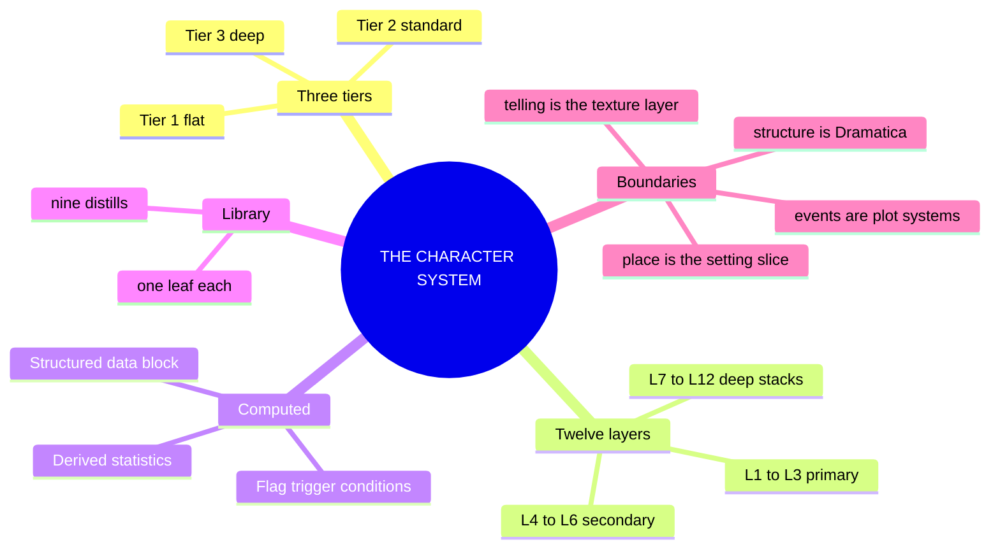
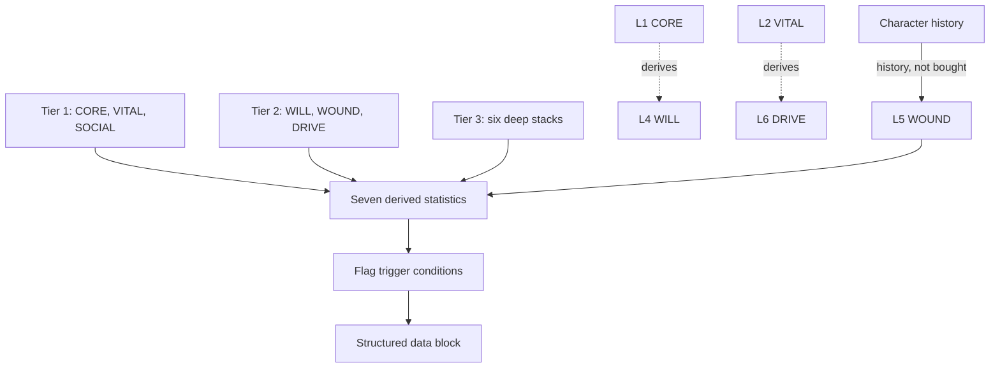
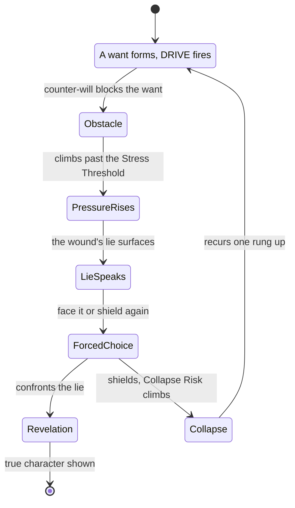

# 📐 SSOT · THE CHARACTER SYSTEM · the 12-layer vertical slice

**What this is:** the 12-Layer Character Database promoted from a numbering scheme to a system, the second top-layer model in the lattice beside 03 (setting) and 04 (plot). Three tiers, twelve layers, seven derived statistics, and a set of flag trigger conditions, all terminating in one machine-readable structured data block. The **vertical slice**, one character walked through all twelve layers, is both the validation instrument (do the numbers produce the character canon already says exists) and the seed record for eventual database ingestion. Written first against a single locked example, Victoria Midnight; now with nine distills of the character shelf underneath it.

**What the character system owns:** who a character *is*. The twelve domain declarations (CORE through FUNCTION), the derived statistics computed from them, the flag states those statistics trip, and the structured data block that makes all of it queryable.

**What it does not own:** structure is Dramatica's ([[BVX.0089]]), the storyform, the four throughlines, the eight archetypes that key L12 FUNCTION are consumed here, not authored here. Events are plot_systems' (04), the turn, the value-in/value-out engine, the twelve P-layers a character's choices fire into. Place is the setting slice's (03), S1 through S12. Viewpoint, person, and tense are the telling, not the person, per Card's explicit exclusion ([[BVX.0061]]): the texture layer, never one of the twelve. The chart feed, the twelve-house astrological mapping onto these same twelve layers, is `ssot_02_character_astrology`'s own document, cited here, not repeated.

**Root claim:** a character is not a trait list, it is a wound-shaped want revealed under pressure. Every model on the shelf, however it names its parts, converges on this one engine. Davis's want meets its counter-will ([[BVX.0075]]); McKee's true character is the choice made under pressure when it costs something ([[BVX.0064]]); Corbett's ghost anchors the failure the tyranny of motive forbids explaining away ([[BVX.0196]]); the wound thesaurus's wound-lie-fear-shielding chain is the same mechanism given a severity dial and a field list ([[BVX.0209]]); Pelican's Big Five profile runs an evolutionary motivation that a dated event converts from external to internal, revealing the personality underneath rather than replacing it ([[BVX.0233]]). The twelve layers store the person; the derived statistics and flags compute what pressure does to them. WOUND, DRIVE, WILL, and SHADOW acting on CORE, VITAL, and SOCIAL is not one reading of the library among several, it is the one engine the stack already implements.

---

## MIND MODELS

**Diagram 1, the whole system on one screen.**



**Diagram 2, the central mechanism.**



**Diagram 3, the recurring engine.**



*The same want, obstacle, pressure, forced-choice cycle recurs at every rung: L5 WOUND sets the lie's content, L4 WILL sets how hard it resists, and Stress Threshold is the number where the choice stops being optional.*

---

## PART A · THE CHARACTER SLICE, twelve layers, the stack the setting and plot slices mirror

One table, twelve layers, the same architecture the SETTING SLICE and the PLOT SLICE mirror: surface to depth to structural function, L12 fed independently from the storyform exactly as S12 and P12 are.

| Layer | Name | Question it answers | Source | Field it writes | Tier |
|---|---|---|---|---|---|
| **L1** | **CORE** | How much cognitive and ideological mass does the mind carry? | [[BVX.0075]], [[BVX.0233]] the Big Five | `CORE` | Tier 1 |
| **L2** | **VITAL** | How much physical and energetic presence does the body carry? | [[BVX.0075]], [[BVX.0233]] the stress-response cascade | `VITAL` | Tier 1 |
| **L3** | **SOCIAL** | How does the character project into and read the social world? | [[BVX.0233]] the interpersonal circumplex, [[BVX.0061]] reputation | `SOCIAL` | Tier 1 |
| **L4** | **WILL** | How much resistance to coercion holds, and where does it bend? | [[BVX.0075]] counter-will, [[BVX.0045]] coping strategy | `WILL` | Tier 2 |
| **L5** | **WOUND** | What accumulated damage failed to resolve, and how severe is it? | [[BVX.0209]] the wound card, [[BVX.0196]] the ghost, [[BVX.0075]] back-story placement | `WOUND` | Tier 2 |
| **L6** | **DRIVE** | What fuels the active goal-pursuit, and from what source? | [[BVX.0075]] super-objective, [[BVX.0233]] the fifteen motivations, [[BVX.0045]] cares-about/motivates | `DRIVE` | Tier 2 |
| **L7** | **ORIGIN** | What birth context and formation set the starting conditions? | [[BVX.0075]] birth marks, [[BVX.0061]] justification | `origin_class`, `origin_stability`, `family_coherence`, `origin_wound_seed`, `tech_level`, `system_exposure` | Tier 3 |
| **L8** | **IMPRINT** | What formative conditioning locked in before the story began? | [[BVX.0075]], [[BVX.0233]] life-stage emotional concerns | `attachment_style`, `attachment_style_score`, `emotional_range`, `conditional_patterns`, `imprint_flexibility`, `primary_attachment_object` | Tier 3 |
| **L9** | **EROS** | How is desire structured, armored, and made safe? | [[BVX.0075]] sexuality as attitude, and the L9 v2 doc, [victoria-midnight-L9-eros.md](../../../../_CANON_NODES/victoria-midnight-L9-eros.md) | `erotic_blueprint_type`, `desire_vector`, `shame_index`, `armor_index`, `satisfaction_cycle_truncation`, `erotic_safety_precondition`, `intimacy_mode` | Tier 3 |
| **L10** | **SHADOW** | What is repressed, projected, or denied, and what does it generate? | [[BVX.0064]] true character vs characterization, [[BVX.0196]] secrets and the adaptation hierarchy, [[BVX.0045]] the shadow face, [[BVX.0233]] the Dark Triad | `shadow_density`, `projection_tendency`, `regression_pattern`, `shadow_content` | Tier 3 |
| **L11** | **DESTINY** | What is the character building toward, not where they stand? | [[BVX.0045]] the two journeys, [[BVX.0196]] growth vs transformation, [[BVX.0061]] the four causes of change | `growth_axis`, `resistance_index`, `soul_evolution_archetype`, `karmic_memory`, `growth_requirement` | Tier 3 |
| **L12** | **FUNCTION** | What narrative role and mechanical function does the character discharge? | [[BVX.0089]] the eight archetypes, [[BVX.0061]] the hierarchy, [[BVX.0064]] the cast map | `dramatica_archetype`, `mc_problem_element`, `methodology_element`, `evaluation_element`, `purpose_element`, `narrative_invariant`, `story_outcome`, `story_judgement`, `limit_type`, `resolve` | Tier 3 |

**Binding rule (mirror of the plot and setting bindings):** L12 FUNCTION is fed independently from the storyform, keyed by `storyform_id`, exactly as P12 FUNCTION and S12 FUNCTION are. A character with no storyform link may run L1 through L11 only; L12 filled is what makes a character load-bearing to the argument, not merely present.

---

## Core Methodology

### The Three-Tier Structure

The 12-Layer system is modular. Tier depth determines character complexity and database weight.

|Tier|Layers|Character Class|Point Budget|
|---|---|---|---|
|**Tier 1**|L1–L3|Flat|~75 pts|
|**Tier 2**|L4–L6|Standard|~140 pts|
|**Tier 3**|L7–L12|Deep|Uncapped|

Tier 1 is sufficient for background characters. Tier 2 is sufficient for recurring supporting characters. Tier 3 is mandatory for all protagonists and antagonists.

---

### The 12 Layers: Domain Declarations

Each layer governs one and only one domain. Overlap between layers constitutes a schema error, not a character note.

**L1 — CORE:** Cognitive and psychological mass. Governs all mental skill defaults, ideological frameworks, and problem-solving capacity. Default value: 10. Point cost: 20 pts per level above 10 (IQ equivalent).

**L2 — VITAL:** Physical and energetic presence. Governs body precision, endurance, reaction capacity, and physical expressiveness. Default value: 10. Point cost: 20 pts per level above 10 (DX equivalent).

**L3 — SOCIAL:** Relational interface. Governs projection into the world, reception of others, social legibility, and reaction modifier math. Default value: 10. Point cost: 10 pts per level above 10 (HT equivalent).

**L4 — WILL:** Psychological resistance to coercion, manipulation, and systemic pressure. Derives from CORE by default (`WILL = CORE`). Buyable up or down at 5 pts per level.

**L5 — WOUND:** Accumulated psychological damage that failed to resolve. Assigned during character history entry. High WOUND reduces effective WILL and SOCIAL under trigger conditions. Scale: 0 (undamaged) to 10 (functional collapse threshold).

**L6 — DRIVE:** Narrative motivation fuel. Derives from VITAL by default (`DRIVE = VITAL`). Spent on active goal-pursuit; recovered through narrative resolution. Buyable at 3 pts per level.

**L7 — ORIGIN:** Birth context, socioeconomic class, family architecture, environmental formation, and system exposure timing. Numeric variables feed WOUND base and SOCIAL defaults.

**L8 — IMPRINT:** Formative emotional conditioning. Attachment architecture, emotional range, and operational belief patterns established prior to story entry.

**L9 — EROS:** Psycho-sexual conditioning. Desire structure, erotic patterning, shame architecture, body armor, satisfaction-cycle integrity, safety preconditions, and intimacy mode.

**L10 — SHADOW:** Repressed, projected, and denied content. High SHADOW values generate active disadvantage clusters and modify stress-state behavior.

**L11 — DESTINY:** Directional growth vector. The MC Solution element, growth requirement, resistance index, and soul evolution archetype. Describes what the character is building toward, not where they currently stand.

**L12 — FUNCTION:** Dramatica narrative role, objective story function, throughline assignment, and mechanical purpose in the story engine. Bridges psychological construction to narrative mechanics.

---

### Derived Statistics

Derived statistics are computed columns. They are not entered — they are calculated from primary layer values. All fractions round down.

|Derived Stat|Formula|
|---|---|
|Basic Damage Resistance|`WILL - (WOUND / 2)`|
|Social Legibility|`SOCIAL - (SHADOW.projection_tendency / 3)`|
|Narrative Momentum|`DRIVE + (DESTINY.resistance_index / 2)`|
|Stress Threshold|`WILL - WOUND`|
|Collapse Risk|`(WOUND + SHADOW.shadow_density) / 2`|
|Truth Exposure Index|`SOCIAL + (10 - EROS.shame_index)`|
|Expressive Range|`10 - EROS.armor_index`|

**Truth Exposure Index** is the primary systemic legibility metric. A score above 15 indicates a character who cannot effectively manage their own signal visibility. This metric directly feeds antagonist targeting logic and systemic response escalation.

**Expressive Range** (added 2026-08-24, L9 v2 propagation) is the deliberate-signal metric. TEI measures what leaks; Expressive Range measures what the character can intentionally send. Low Expressive Range with high TEI is the armored-but-readable paradox: the system gets everything and the character gets nothing out.

---

### Flag Trigger Conditions

**Status Flags** are boolean conditions that fire automatically when numeric thresholds are satisfied. Flags represent derived character states — they are not assigned, they are computed. Each flag is a valid SQL WHERE clause against the character record.

Four flag states exist:

- **ACTIVE** — Condition is currently met. Behavior consequences are in force.
- **PENDING** — Condition will be met at a defined narrative event. Used for climax-dependent flags.
- **FIRED_PRE_STORY** — Condition was met before story entry. Documents the character's pre-existing state.
- **INACTIVE** — Condition is not met. Flag is dormant.

---

### The Structured Data Block

Every Vertical Slice terminates in a machine-readable structured data block. This block is the database seed record. It contains all primary values, derived statistics, and flag states in a queryable format. When the system transitions from AI generation to hard-coded database infrastructure, the structured data block is the ingestion artifact.

---

## Implementation

### Step 1 — Source Verification

Before assigning any values, confirm that canonical documentation for the character exists and is locked. Do not run a Vertical Slice against a character whose narrative role, Dramatica function, or origin is still in development. Numeric instability in the source produces unstable values.

### Step 2 — Tier 1 Assignment

Assign CORE, VITAL, and SOCIAL. Read the Tier 1 values first and verify they produce a recognizable character outline without reference to any other layer. If Tier 1 alone does not suggest the character, the primary values are wrong.

### Step 3 — Tier 2 Derivation

Derive WILL from CORE, then adjust up or down based on documented resolve behavior. Assign WOUND from the character's history — this is the only value that is not a choice or a buy, it is a record of what happened. Derive DRIVE from VITAL, then adjust based on documented motivation source (ambition-driven characters maintain DRIVE = VITAL; meaning-driven characters reduce DRIVE below VITAL ceiling).

### Step 4 — Tier 3 Variable Population

Populate L7 through L12 variable stacks from canonical source documentation. Each variable requires a documented source. If the source does not exist, mark the variable as `[INFERRED]` and note the basis for inference. Inferred values require a follow-up extraction query before the layer is considered complete.

### Step 5 — Derived Statistic Computation

Compute all six derived statistics. Read the Truth Exposure Index and Collapse Risk values first — these two stats most reliably indicate whether the numeric assignments are coherent.

### Step 6 — Flag Evaluation

Evaluate each flag trigger condition against the computed values. Document flag state and narrative timing. Flags that fire unexpectedly indicate a schema inconsistency — investigate the contributing layer values before proceeding.

### Step 7 — Structured Data Block Generation

Produce the structured data block in the format defined in the Examples section. This block is the output artifact. All preceding documentation is human-readable justification for the values in this block.

---

## THE INSTANCE · Victoria Midnight, the full slice

| Layer | Victoria Midnight |
|---|---|
| **L1** | CORE 13, merit earns freedom, a sound architecture on a wrong premise |
| **L2** | VITAL 14, motion under pressure, never ornamental |
| **L3** | SOCIAL 10, accurate in a world that cannot process accuracy |
| **L4** | WILL 14 (CORE+1), resolve is change, bends only at maximum pressure |
| **L5** | WOUND 8/10, the pace-notes, the choice not to listen that killed him |
| **L6** | DRIVE 12 (VITAL-2), meaning-driven, the tank is dented not destroyed |
| **L7** | ORIGIN working_criminal_adjacent, the salvage economy before system awareness |
| **L8** | IMPRINT secure_anxious, brother as navigator, attachment lost pre-story |
| **L9** | EROS kinesthetic, low shame, high armor, control as the safety precondition |
| **L10** | SHADOW density 7, the choice not the grief, control escalation under stress |
| **L11** | DESTINY inequity axis, resistance 8, certainty toward accepted asymmetry |
| **L12** | FUNCTION Protagonist, mc_problem Equity, Optionlock, resolves via Change |

**IP:** OVEREXITOUT (The Outliers) **Character Status:** Canonical / Locked **Slice Version:** 1.0.0

---

### Tier 1 — Primary Layers

**L1 CORE: 13**

Victoria Midnight operates a sophisticated causal model (merit earns freedom), applies it consistently across conditions, and updates it only under catastrophic contradictory evidence. Her MC Problem is Equity — a philosophical framework error, not an intellectual failure. The cognitive architecture is sound; the premise is wrong. Score above average but not maximum. Point cost: 60 pts.

**L2 VITAL: 14**

Racing driver. Reaction time, spatial processing, mechanical intuition, and physical courage are primary operational tools pre-crash. Post-crash hardware requires a VITAL ceiling high enough to carry the manifestation load. "Motion under pressure, never ornamental" is a 14. Point cost: 80 pts.

**L3 SOCIAL: 10**

Her MC Critical Flaw is Truth — when she speaks truth, it desyncs her hardware and triggers Noise. Her social interface is not weak. It is accurate in a world that cannot process accuracy. She does not lack social intelligence; she lacks the capacity for social dishonesty. Average SOCIAL with a specific catastrophic exploit vector is more precise than a modified score. Point cost: 0 pts.

**Tier 1 Total: 140 pts**

---

### Tier 2 — Secondary Layers

**L4 WILL: 14 (CORE + 1)**

Resolve is Change — she bends eventually. The story arc requires maximum systemic pressure to achieve that change. She survives the crash, the brother's death, the academy intake, and the Ban before breaking. WILL sits one point above CORE: she is slightly more stubborn than she is intelligent. Buy-up cost: 5 pts.

**L5 WOUND: 8 / 10**

The wound is the pace-notes. She ignored her brother's guidance during the rally. The car exploded. He died. She survived. The wound is not grief — it is the knowledge that she chose not to listen. That choice killed him. Score 8 because the story requires her to continue functioning as protagonist. Score 9 or 10 produces behavioral collapse incompatible with protagonist load-bearing.

Active wound triggers: mechanical failure events; guidance she is inclined to refuse; her brother's name; scenes where listening would prevent harm and she does not.

**L6 DRIVE: 12 (VITAL - 2)**

Meaning-driven characters burn below their physical ceiling because their fuel source is already damaged at story entry. The crash did not destroy her DRIVE — it dented the tank. Reduction reflects the compromised fuel source, not reduced physical capacity. Buy-down return: 6 pts.

**Tier 2 Total (net): 139 pts**

---

### Tier 3 — Deep Variable Stacks

**L7 ORIGIN**

|Variable|Value|
|---|---|
|`origin_class`|working_criminal_adjacent|
|`origin_stability`|4|
|`family_coherence`|7|
|`origin_wound_seed`|6|
|`tech_level`|6|
|`system_exposure`|early_pre_awareness|

Her origin is outside institutional legibility. The salvage economy phase (M1A) precedes system awareness. The Delta Coast racing scene is the first context in which her output becomes visible at scale. The system's attention during M1B is acquisition, not admiration. She does not know the difference until the Ban is already in motion.

---

**L8 IMPRINT**

|Variable|Value|
|---|---|
|`attachment_style`|secure_anxious|
|`attachment_style_score`|6|
|`emotional_range`|9|
|`conditional_patterns`|[merit_earns_freedom, loyalty_to_kinship, distrust_of_institution]|
|`imprint_flexibility`|3|
|`primary_attachment_object`|brother_deceased|

Her primary attachment object was her brother. He functioned as navigator to her driver — the pace-notes were not technical data, they were the communication system of two people in complete mutual trust. When she overrode them, she did not commit a driving error. She violated the founding logic of her attachment architecture. WOUND at L5 is the damage. IMPRINT at L8 is why the damage is catastrophic rather than survivable.

---

**L9 EROS** — v2, AUTHORED 2026-08-15 · propagated 2026-08-24

|Variable|Value|
|---|---|
|`erotic_blueprint_type`|kinesthetic|
|`desire_vector`|3|
|`shame_index`|2|
|`armor_index`|8|
|`satisfaction_cycle_truncation`|reach|
|`erotic_safety_precondition`|control|
|`intimacy_mode`|parallel_presence|

Source: AUTHORED against catalogued sources (PSY.01 Walker · MSX.17 Perel · PSY.04 Rehor & Schiffman) — full derivation in [victoria-midnight-L9-eros.md](../../../../_CANON_NODES/victoria-midnight-L9-eros.md), which supersedes the v1 INFERRED block. The load-bearing distinction: low shame with high armor. She cannot be shamed into compliance, so the system reads her instead.

---

**L10 SHADOW**

|Variable|Value|
|---|---|
|`shadow_density`|7|
|`projection_tendency`|6|
|`regression_pattern`|control_escalation|
|`shadow_content`|[culpability_for_brother, distrust_of_own_judgment, fear_of_being_right_and_wrong_simultaneously]|

The shadow is the choice, not the grief. She heard the pace-notes and decided she knew better. Processing that choice fully requires accepting that she is capable of catastrophic error while certain she is correct. Her MC Problem (Equity) is the conscious-layer version of this recognition failure. Under stress, she doubles down on control behaviors rather than accepting input — the shadow content is the precise mechanism that makes the Optionlock activate.

---

**L11 DESTINY**

|Variable|Value|
|---|---|
|`growth_axis`|inequity|
|`resistance_index`|8|
|`soul_evolution_archetype`|tactical_disruptor|
|`karmic_memory`|meritocratic_certainty|
|`growth_requirement`|accept_asymmetry|

Her Destiny vector points toward a specific disillusionment that becomes precision rather than cynicism. The arc moves: "Merit earns freedom" → "Visibility invites ownership" → "Control is the only form of safety left" → [story climax] "Rigged is not the same as wrong." Resistance index 8 is why the arc requires the full story duration. She is constitutionally opposed to her own solution.

---

**L12 FUNCTION**

|Variable|Value|
|---|---|
|`dramatica_archetype`|Protagonist|
|`mc_problem_element`|Equity|
|`methodology_element`|Proaction|
|`evaluation_element`|Result|
|`purpose_element`|Actuality|
|`narrative_invariant`|cost_and_meaning|
|`story_outcome`|Failure|
|`story_judgement`|Good|
|`limit_type`|Optionlock|
|`resolve`|Change|

*Renamed 2026-08-24 (STATE #4 ruling): `motivation_element` → `mc_problem_element`, holding the MC Problem. The Motivation-quad primary (`Consider`) relocates to `L12_DRAMATICA_EXTENDED.motivation_quad`.*

The Optionlock fires because her wound and resistance index combination systematically eliminates exits. The Truth-is-Enough Veto, the Heroic Recognition Veto, and the Reset Veto are narrative invariants that correspond directly to flag logic — each veto closes one option class permanently.

---

### Derived Statistics

|Stat|Formula|Result|
|---|---|---|
|Basic Damage Resistance|`14 - (8 / 2)`|**10**|
|Social Legibility|`10 - (6 / 3)`|**8**|
|Narrative Momentum|`12 + (8 / 2)`|**16**|
|Stress Threshold|`14 - 8`|**6**|
|Collapse Risk|`(8 + 7) / 2`|**8**|
|Truth Exposure Index|`10 + (10 - 2)`|**18**|
|Expressive Range|`10 - 8`|**2**|

Truth Exposure Index 18 is the primary diagnostic value. It quantifies why the Ban activates against her and not against other characters with equivalent capability profiles. She is maximally legible to the system because she carries low shame and average social masking. The system cannot categorize a signal it can read completely and that refuses to self-regulate.

---

### Active Flags

**FLAG: SHADOW_DENIAL — ACTIVE**

Trigger: `WOUND > 6 AND SHADOW.projection_tendency >= 5 AND IMPRINT.conditional_patterns contains "merit_earns_freedom"`

She routes causal responsibility for the crash toward systemic injustice. "The institution is unfair" is factually correct. It also functions as a shield against "I chose not to listen and he died." Both propositions are simultaneously true. Her arc is the collapse of the shield — the moment she holds both at once is the Judgement: Good inflection point.

---

**FLAG: TRUTH_VULNERABILITY — ACTIVE**

Trigger: `SOCIAL < 12 AND FUNCTION.mc_problem_element = "Equity" AND SHADOW.shadow_density > 6`

When she speaks truth, wound content surfaces through her social interface. She does not code-switch, does not manage her signal, does not perform legibility. The Ban is the system's response to this flag firing in a public context. Truth is not her virtue — it is her exploit vector.

---

**FLAG: OPTIONLOCK_PROGRESSION — ACTIVE**

Trigger: `WOUND > 7 AND DESTINY.resistance_index > 7 AND FUNCTION.limit_type = "Optionlock"`

Exits close because of who she is, not because a clock runs out. Each Veto Rule in the canonical documentation corresponds to one option class closing permanently. This flag confirms the Optionlock structure by numeric derivation independent of the narrative documentation.

---

**FLAG: EARNED_JUDGEMENT — PENDING**

Trigger: `FUNCTION.dramatica_archetype = "Protagonist" AND FUNCTION.story_outcome = "Failure" AND WILL > 10`

Fires at story climax. WILL 14 provides sufficient internal structure to assign meaning to total systemic defeat. She finds Meaning in the wreckage because the architecture to do so remains intact even after everything external is stripped.

---

**FLAG: KINSHIP_COLLAPSE — FIRED_PRE_STORY**

Trigger: `IMPRINT.attachment_style_score > 5 AND primary_attachment_object = "deceased" AND WOUND > 7`

This flag fired at the crash. The character enters the story in a post-collapse attachment state. No primary attachment object is currently active. All relational behavior post-crash operates without a secure base.

---

### Structured Data Block

```
CHARACTER_ID: victoria_midnight
IP: overexitout
STATUS: locked
VERSION: 1.0.0

TIER_1:
  CORE: 13
  VITAL: 14
  SOCIAL: 10

TIER_2:
  WILL: 14
  WOUND: 8
  DRIVE: 12

L7_ORIGIN:
  origin_class: working_criminal_adjacent
  origin_stability: 4
  family_coherence: 7
  origin_wound_seed: 6
  tech_level: 6
  system_exposure: early_pre_awareness

L8_IMPRINT:
  attachment_style: secure_anxious
  attachment_style_score: 6
  emotional_range: 9
  conditional_patterns: [merit_earns_freedom, loyalty_to_kinship, distrust_of_institution]
  imprint_flexibility: 3
  primary_attachment_object: brother_deceased

L9_EROS:
  erotic_blueprint_type: kinesthetic
  desire_vector: 3
  shame_index: 2
  armor_index: 8
  satisfaction_cycle_truncation: reach
  erotic_safety_precondition: control
  intimacy_mode: parallel_presence
  source_confidence: canonical   # AUTHORED 2026-08-15 — victoria-midnight-L9-eros v2

L10_SHADOW:
  shadow_density: 7
  projection_tendency: 6
  regression_pattern: control_escalation
  shadow_content: [culpability_for_brother, distrust_of_own_judgment, fear_of_being_right_and_wrong]

L11_DESTINY:
  growth_axis: inequity
  resistance_index: 8
  soul_evolution_archetype: tactical_disruptor
  karmic_memory: meritocratic_certainty
  growth_requirement: accept_asymmetry

L12_FUNCTION:
  dramatica_archetype: Protagonist
  mc_problem_element: Equity      # renamed from motivation_element 2026-08-24 (STATE #4)
  methodology_element: Proaction
  evaluation_element: Result
  purpose_element: Actuality
  narrative_invariant: cost_and_meaning
  story_outcome: Failure
  story_judgement: Good
  limit_type: Optionlock
  resolve: Change

L12_DRAMATICA_EXTENDED:
  motivation_quad: [Consider, Pursuit]   # quad primary relocated here 2026-08-24 (STATE #4)

DERIVED:
  basic_damage_resistance: 10
  social_legibility: 8
  narrative_momentum: 16
  stress_threshold: 6
  collapse_risk: 8
  truth_exposure_index: 18
  expressive_range: 2

FLAGS:
  SHADOW_DENIAL: ACTIVE
  TRUTH_VULNERABILITY: ACTIVE
  OPTIONLOCK_PROGRESSION: ACTIVE
  EARNED_JUDGEMENT: PENDING
  KINSHIP_COLLAPSE: FIRED_PRE_STORY
```

---

## CHARACTER × LIBRARY

`feeds:` for this limb, the nine distills read in full for this document:

| ID | Book | Feeds hardest | What it gives the stack |
|---|---|---|---|
| [[BVX.0064]] | McKee, *Character* | L12 FUNCTION, L10 SHADOW | the cast map's concentric-circle characterization budget and the true character / characterization / subconscious split |
| [[BVX.0075]] | Davis, *Creating Compelling Characters* | L6 DRIVE, L4 WILL | the super-objective and counter-will, the want-versus-opposition engine |
| [[BVX.0193]] | Truby, *The Anatomy of Story* | L4 WILL, L5 WOUND | the 22 steps as a WILL-layer plan/battle/reveal sequence, and the ghost as WOUND's structural name |
| [[BVX.0089]] | Dramatica | L12 FUNCTION | the eight archetypes and the storyform binding that keys L12 independently, exactly as P12 and S12 are keyed |
| [[BVX.0196]] | Corbett, *The Art of Character* | L10 SHADOW, L5 WOUND | the adaptation hierarchy, the ghost/revenant pairing, and the tyranny of motive as a cross-cutting narration rule |
| [[BVX.0061]] | Card, *Characters and Viewpoint* | L12 FUNCTION, L6 DRIVE | the hierarchy's characterization budget, elaboration of motive, and viewpoint declared out of scope |
| [[BVX.0209]] | Puglisi & Ackerman, *The Emotional Wound Thesaurus* | L5 WOUND, L6 DRIVE | the wound-lie-fear-shielding chain and a nine-factor severity dial for WOUND's 0–10 scale |
| [[BVX.0233]] | Pelican, *The Science of Writing Characters* | L6 DRIVE, L1 CORE, L3 SOCIAL | the fifteen evolutionary motivations, the Big Five as CORE's substrate, and the interpersonal circumplex |
| [[BVX.0045]] | Schmidt, *45 Master Characters* | L10 SHADOW, L11 DESTINY | the light face / shadow face pairing and the two nine-stage soul-evolution journeys |
| [[BVX.1123]] | Egri, *The Art of Dramatic Writing* | L4 WILL, Tier 1 (via [[the-bone-structure|the bone structure]]) | the 27-field descriptive ancestor of the stack, [[strength-of-will|strength of will]] as L4's definition, [[the-premise|the premise]] as L6's single proposition |
| [[BVX.1127]] | Levine & Heller, *Attached* | L8 IMPRINT | the attachment-style enum, the two-dimension score, [[protest-behaviors|protest behaviors]] and [[deactivating-strategies|deactivating strategies]] |
| [[BVX.1124]] | Vogler, *The Writer's Journey* | L12 FUNCTION, L10 SHADOW | [[archetypes-as-masks|archetypes as masks]] beside Dramatica's eight, the Shadow as a mask any character wears |

The L5 shelf holds 82 items keyed 9/16 (BOLO 18), twelve distilled to date, this document's twelve sources. The next wave's top candidates: BVX.0202 (Corbett, *The Compass of Character*), BVX.0271 (Weiland, *Archetypal Arcs*), BVX.0135 (Jorstad, *Character Arcs*), BVX.0207 (Dunne, *Dramatic Writer's Companion*), BVX.0229 (Smith, *Psychology Workbook*).

---

## OPEN

Numbered calls surfaced by the five new distills' own "For the character system" sections. **RULED 2026-09-16 (Chief: "character calls go"): all eleven as recommended, applying at the next schema bump.** Nothing in the schema changes until that bump; each call below now reads as an order for it, not a proposal. Provisional a week like every ruling.

1. **Ghost and revenant cross-links on L5.** [[BVX.0196]]'s ghost and revenant are pointers to other characters, not attributes of one, and WOUND and DRIVE currently resolve against them with no named field. *Ruled 9/16, as recommended:* add `ghost_ref` and `revenant_ref` as relational sub-fields on L5 at the next bump, not now.

2. **A typed arc field on L11.** Corbett's growth vs transformation ([[BVX.0196]]) and Card's four causes of change ([[BVX.0061]]) both force a choice DESTINY currently leaves implicit. *Ruled 9/16, as recommended:* add `arc_type` and `change_cause` as L11 sub-fields at the next bump.

3. **The tyranny of motive as a narration rule, not schema.** [[BVX.0196]] names a cross-cutting authoring constraint: no single layer's value should read as *the* stated cause of an action. *Ruled 9/16, as recommended:* adopt as a house writing rule for narrating character queries, not a new field on any layer.

4. **The hierarchy as an allocation rule over all twelve layers.** Card's hierarchy ([[BVX.0061]]) and McKee's cast map ([[BVX.0064]]) both say characterization effort should track narrative rank; tier depth already encodes this loosely. *Ruled 9/16, as recommended:* state the rule explicitly in Core Methodology at the next bump, no new field needed.

5. **Viewpoint declared out of scope, the texture layer's.** Card ([[BVX.0061]]) shows person, tense, and penetration map onto none of the twelve layers. *Ruled 9/16, as recommended:* the exclusion is now stated above in "What it does not own"; no further schema action.

6. **The wound card as L5's field list, plus a severity dial.** [[BVX.0209]]'s eleven-field entry and severity dial are close to a drop-in for L5, alongside a trigger list and a reveal strategy the schema doesn't currently name. *Ruled 9/16, as recommended:* adopt the severity dial and trigger list as L5 sub-fields at the next bump.

7. **The villain-arc fork, why an L5-to-L8 pipeline stalls.** [[BVX.0209]] names a fork, self-blame, a failed prior healing attempt, preference for the dysfunction, that L12 FUNCTION records the outcome of but never the mechanism of. *Ruled 9/16, as recommended:* hold for now, revisit once a second antagonist instance is carded.

8. **The interpersonal circumplex and the Dark/Light Triad as dials.** [[BVX.0233]] offers two continuous SOCIAL dials and six scored SHADOW inventories; the fifteen motivations sit beside Maslow under DRIVE. *Ruled 9/16, as recommended:* concrete enough to pilot on one character at the next bump, not retrofitted onto Victoria now.

9. **The audience trust ledger as a stack-external reader model.** Pelican's moral-emotion bookkeeping ([[BVX.0233]]) tracks the audience's judgement, not the character's own interface. *Ruled 9/16, as recommended:* hold outside the twelve layers entirely, a future reader-model document.

10. **Growth-pairing and a coping-strategy field.** [[BVX.0045]]'s growth-pairing (a catalyst archetype) and five coping strategies suggest sub-fields under L11 and L4/L8. *Ruled 9/16, as recommended:* candidate `catalyst_archetype` (L11) and `coping_strategy` (L4 or L8) at the next bump.

11. **Attachment theory absent from the shelf.** L8 IMPRINT already claims attachment architecture, but [[BVX.0233]] notes the shelf has never distilled attachment theory itself, staying at the need-to-belong level. *Ruled 9/16, as recommended:* an acquisition target for the next wave, or a pull from the PSY shelf, not a schema change.

12. **[[the-bone-structure|The bone structure]] as Tier 1's text stack.** [[BVX.1123]]'s CORE, VITAL, and SOCIAL should carry Egri's descriptive sub-fields beneath the number, auditable against his own checklist rather than freestanding; heredity is the one field genuinely homeless, sitting in neither ORIGIN nor VITAL. *Recommendation:* adopt the text stack at the next bump, plus a `hereditary_predisposition` sub-field on L7 or L2, whichever proves load-bearing on a second character.

13. **[[strength-of-will|Strength of will]] and [[the-pivotal-character|the pivotal character]].** [[BVX.1123]] defines L4 WILL as the capacity to decide, not toughness, which reframes Stress Threshold as decision-capacity under load rather than raw hardness; the pivotal character, forced into the role by necessity, argues L12 FUNCTION's Protagonist archetype should require a documented necessity, not just a storyform assignment. *Recommendation:* the L4 definition now as a gloss, the L12 rule at the next bump.

14. **The L8 IMPRINT field list from *Attached*.** [[BVX.1127]] proposes `attachment_style` as an enum of secure, anxious, avoidant, plus the rare fearful-avoidant; a two-dimension `attachment_style_score` (anxiety, avoidance) beside the single scalar; new list-typed fields `protest_behaviors` and `deactivating_strategies`; and `secure_base_object` as a clearer name for `primary_attachment_object`. [[the-secure-base|The secure base]]'s buffering effect, one character's presence measurably lowering another's stress response, is a dyadic variable with no home on either side; Victoria Midnight's `KINSHIP_COLLAPSE` flag reads as the same claim under a different name, consistent rather than redundant wiring. *Recommendation:* the field list at the next bump, Cassidy & Shaver or Bowlby as the research-base acquisition.

15. **Masks, the Shapeshifter, and the Mentor.** [[BVX.1124]]'s [[archetypes-as-masks|archetypes as masks]] confirms Schmidt's non-collision with Dramatica's eight from a second source, since Vogler's eight are situational functions any character can trade mid-scene rather than fixed Story Mind bundles. The Shapeshifter's relational uncertainty has no single-layer home, sitting closer to L9 EROS or L3 SOCIAL than to L12 FUNCTION. The Mentor is a relational pointer, not a portable attribute, joining call 1's ghost/revenant cross-link as another meaning keyed to another character's WOUND that the schema still can't natively express. *Recommendation:* fold into call 1's sub-field at the next bump.

## Version history

|Version|Date|Changes|
|:--|:--|:--|
|1.0.0|2026-02-17|Initial vertical slice protocol with Victoria Midnight as canonical example.|
|1.1.0|2026-08-24|STATE #3 executed: L9 v2 propagation (`armor_index` · `satisfaction_cycle_truncation` · `erotic_safety_precondition`; L9 AUTHORED via victoria-midnight-L9-eros). Expressive Range derived stat added. L12 rename `motivation_element` → `mc_problem_element` (STATE #4 ruling); `motivation_quad` → L12_DRAMATICA_EXTENDED. TRUTH_VULNERABILITY trigger updated.|
|2.0.0|2026-09-16|BOLO 18 character wave: proper YAML frontmatter (was a malformed single-line block); intro block (What this is / owns / does not own / Root claim); MIND MODELS (three diagrams); PART A slice table (twelve layers, Question/Source/Field/Tier columns) sourced against five new distills (Corbett, Card, Puglisi & Ackerman, Pelican, Schmidt) plus the four already in the library (McKee, Davis, Truby, Dramatica); THE INSTANCE gained a Victoria Midnight summary table ahead of the existing full slice; CHARACTER × LIBRARY table and shelf note; eleven OPEN calls. Schema, formulas, and every value in the Victoria Midnight instance are unchanged.|
|2.0.1|2026-09-16|The eleven OPEN calls ruled as recommended, applying at the next schema bump ("character calls go"). No schema change.|
|2.0.2|2026-09-16|The drop-folder intake folded in: three new CHARACTER × LIBRARY rows (Egri, Levine & Heller, Vogler); sources gained BVX.1123, BVX.1124, BVX.1127; four OPEN calls added (12-15), unruled. Schema, formulas, and the Victoria Midnight instance unchanged.|
