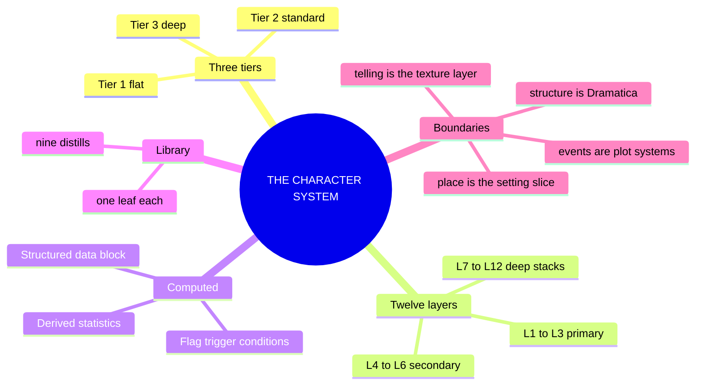
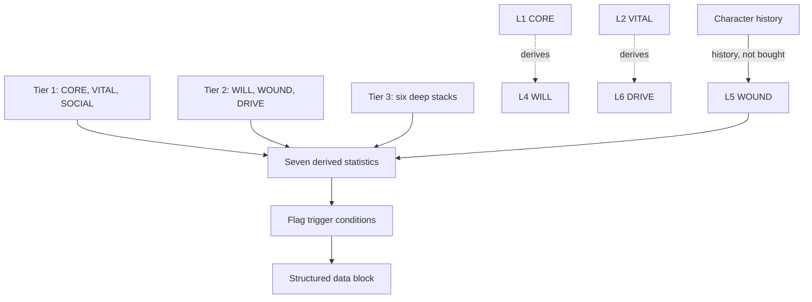
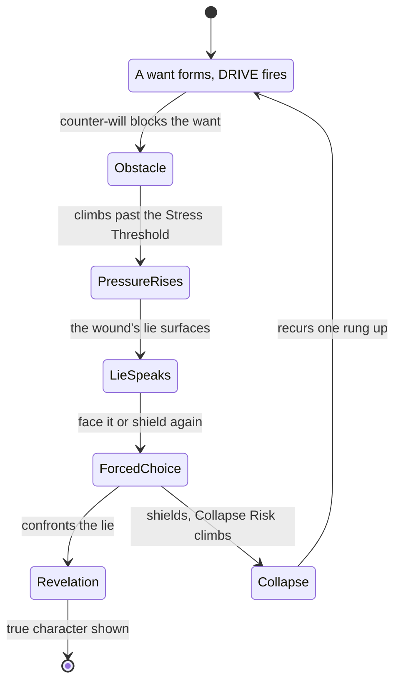

# 📐 SSOT · THE CHARACTER SYSTEM · the 12-layer vertical slice

**What this is:** the 12-Layer Character Database promoted from a numbering scheme to a system, the second top-layer model in the lattice beside 03 (setting) and 04 (plot). Three tiers, twelve layers, seven derived statistics, and a set of flag trigger conditions, all terminating in one machine-readable structured data block. The **vertical slice**, one character walked through all twelve layers, is both the validation instrument (do the numbers produce the character canon already says exists) and the seed record for eventual database ingestion. Written first against a single locked example, Victoria Midnight; now with nine distills of the character shelf underneath it.

**What the character system owns:** who a character *is*. The twelve domain declarations (CORE through FUNCTION), the derived statistics computed from them, the flag states those statistics trip, and the structured data block that makes all of it queryable.

**What it does not own:** structure is Dramatica's ([[BVX.0089]]), the storyform, the four throughlines, the eight archetypes that key L12 FUNCTION are consumed here, not authored here. Events are plot_systems' (04), the turn, the value-in/value-out engine, the twelve P-layers a character's choices fire into. Place is the setting slice's (03), S1 through S12. Viewpoint, person, and tense are the telling, not the person, per Card's explicit exclusion ([[BVX.0061]]): the texture layer, never one of the twelve. The chart feed, the twelve-house astrological mapping onto these same twelve layers, is `ssot_02_character_astrology`'s own document, cited here, not repeated.

**Root claim:** a character is not a trait list, it is a wound-shaped want revealed under pressure. Every model on the shelf, however it names its parts, converges on this one engine. Davis's want meets its counter-will ([[BVX.0075]]); McKee's true character is the choice made under pressure when it costs something ([[BVX.0064]]); Corbett's ghost anchors the failure the tyranny of motive forbids explaining away ([[BVX.0196]]); the wound thesaurus's wound-lie-fear-shielding chain is the same mechanism given a severity dial and a field list ([[BVX.0209]]); Pelican's Big Five profile runs an evolutionary motivation that a dated event converts from external to internal, revealing the personality underneath rather than replacing it ([[BVX.0233]]). The twelve layers store the person; the derived statistics and flags compute what pressure does to them. WOUND, DRIVE, WILL, and SHADOW acting on CORE, VITAL, and SOCIAL is not one reading of the library among several, it is the one engine the stack already implements.

---

## MIND MODELS

**Diagram 1, the whole system on one screen.**


```mermaid
mindmap
  root((THE CHARACTER SYSTEM))
    Three tiers
      Tier 1 flat
      Tier 2 standard
      Tier 3 deep
    Twelve layers
      L1 to L3 primary
      L4 to L6 secondary
      L7 to L12 deep stacks
    Computed
      Derived statistics
      Flag trigger conditions
      Structured data block
    Library
      nine distills
      one leaf each
    Boundaries
      structure is Dramatica
      events are plot systems
      place is the setting slice
      telling is the texture layer
```

**Diagram 2, the central mechanism.**


```mermaid
flowchart TD
    T1["Tier 1: CORE, VITAL, SOCIAL"] --> DS[Seven derived statistics]
    T2["Tier 2: WILL, WOUND, DRIVE"] --> DS
    T3["Tier 3: six deep stacks"] --> DS
    CORE[L1 CORE] -.derives.-> WILL[L4 WILL]
    VITAL[L2 VITAL] -.derives.-> DRIVE[L6 DRIVE]
    HIST[Character history] -->|history, not bought| WOUND[L5 WOUND]
    WOUND --> DS
    DS --> FLAGS[Flag trigger conditions]
    FLAGS --> BLOCK[Structured data block]
```

**Diagram 3, the recurring engine.**


```mermaid
stateDiagram-v2
    [*] --> WantForms
    WantForms: A want forms, DRIVE fires
    WantForms --> Obstacle: counter-will blocks the want
    Obstacle --> PressureRises: climbs past the Stress Threshold
    PressureRises --> LieSpeaks: the wound's lie surfaces
    LieSpeaks --> ForcedChoice: face it or shield again
    ForcedChoice --> Revelation: confronts the lie
    ForcedChoice --> Collapse: shields, Collapse Risk climbs
    Revelation --> [*]: true character shown
    Collapse --> WantForms: recurs one rung up
```

*The same want, obstacle, pressure, forced-choice cycle recurs at every rung: L5 WOUND sets the lie's content, L4 WILL sets how hard it resists, and Stress Threshold is the number where the choice stops being optional.*

---

## PART A · THE CHARACTER SLICE, twelve layers, the stack the setting and plot slices mirror

One table, twelve layers, the same architecture the SETTING SLICE and the PLOT SLICE mirror: surface to depth to structural function, L12 fed independently from the storyform exactly as S12 and P12 are.

| Layer | Name | Question it answers | Source | Field it writes | Tier |
|---|---|---|---|---|---|
| **L1** | **CORE** | How much cognitive and ideological mass does the mind carry? | [[BVX.0075]], [[BVX.0233]] the Big Five, [[BVX.1123]] Egri's psychology dimension | `CORE`, `psychology_stack` | Tier 1 |
| **L2** | **VITAL** | How much physical and energetic presence does the body carry? | [[BVX.0075]], [[BVX.0233]] the stress-response cascade, [[BVX.1123]] Egri's physiology dimension | `VITAL`, `physiology_stack` | Tier 1 |
| **L3** | **SOCIAL** | How does the character project into and read the social world? | [[BVX.0233]] the interpersonal circumplex (pilot dial), [[BVX.0061]] reputation, [[BVX.1123]] Egri's sociology dimension | `SOCIAL`, `sociology_stack` | Tier 1 |
| **L4** | **WILL** | How much resistance holds under pressure, and where does the capacity to decide bend? | [[BVX.0075]] counter-will, [[BVX.0045]] coping strategy, [[BVX.1123]] strength of will | `WILL`, `coping_strategy` | Tier 2 |
| **L5** | **WOUND** | What accumulated damage failed to resolve, and how severe is it? | [[BVX.0209]] the wound card, [[BVX.0196]] the ghost, [[BVX.0075]] back-story placement | `WOUND`, `severity`, `triggers`, `relational_refs` | Tier 2 |
| **L6** | **DRIVE** | What fuels the active goal-pursuit, and from what source? | [[BVX.0075]] super-objective, [[BVX.0233]] the fifteen motivations, [[BVX.0045]] cares-about/motivates | `DRIVE` | Tier 2 |
| **L7** | **ORIGIN** | What birth context and formation set the starting conditions? | [[BVX.0075]] birth marks, [[BVX.0061]] justification, [[BVX.1123]] heredity (provisional) | `origin_class`, `origin_stability`, `family_coherence`, `origin_wound_seed`, `tech_level`, `system_exposure`, `hereditary_predisposition` | Tier 3 |
| **L8** | **IMPRINT** | What formative conditioning locked in before the story began? | [[BVX.0075]], [[BVX.0233]] life-stage emotional concerns, [[BVX.1127]] attachment theory | `attachment_style`, `attachment_style_score`, `attachment_dimensions`, `protest_behaviors`, `deactivating_strategies`, `emotional_range`, `conditional_patterns`, `imprint_flexibility`, `secure_base_object` (was `primary_attachment_object`, kept as a read alias) | Tier 3 |
| **L9** | **EROS** | How is desire structured, armored, and made safe? | [[BVX.0075]] sexuality as attitude, the L9 v2 doc, [victoria-midnight-L9-eros.md](../../../../_CANON_NODES/victoria-midnight-L9-eros.md), and the L9 EROS synthesis (RULED 2026-09-29, MSX.18–MSX.36, PSY.08–PSY.13), [ssot_02_l9_eros_synthesis.md](📐%20ssot_02_l9_eros_synthesis.md) | `erotic_blueprint_type` (+ `arousal_curve`), `desire_vector` (+ `resolution_type`), `consent_posture`, `client_script`, `signal_fluency`, `shame_index` (+ `exposure_shame`, `role_shame`), `armor_index`, `satisfaction_cycle_truncation`, `erotic_safety_precondition` (+ `erotic_safety_precondition_scope`), `intimacy_mode`, `disclosure_posture`, `template_origin` | Tier 3 |
| **L10** | **SHADOW** | What is repressed, projected, or denied, and what does it generate? | [[BVX.0064]] true character vs characterization, [[BVX.0196]] secrets and the adaptation hierarchy, [[BVX.0045]] the shadow face, [[BVX.0233]] the Dark Triad (pilot dial) | `shadow_density`, `projection_tendency`, `regression_pattern`, `shadow_content` | Tier 3 |
| **L11** | **DESTINY** | What is the character building toward, not where they stand? | [[BVX.0045]] the two journeys, [[BVX.0196]] growth vs transformation, [[BVX.0061]] the four causes of change | `growth_axis`, `resistance_index`, `soul_evolution_archetype`, `karmic_memory`, `growth_requirement`, `arc_type`, `change_cause`, `catalyst_archetype` | Tier 3 |
| **L12** | **FUNCTION** | What narrative role and mechanical function does the character discharge? | [[BVX.0089]] the eight archetypes, [[BVX.0061]] the hierarchy, [[BVX.0064]] the cast map, [[BVX.1123]] the pivotal character | `dramatica_archetype`, `mc_problem_element`, `methodology_element`, `evaluation_element`, `purpose_element`, `narrative_invariant`, `story_outcome`, `story_judgement`, `limit_type`, `resolve` | Tier 3 |

**Binding rule (mirror of the plot and setting bindings):** L12 FUNCTION is fed independently from the storyform, keyed by `storyform_id`, exactly as P12 FUNCTION and S12 FUNCTION are. A character with no storyform link may run L1 through L11 only; L12 filled is what makes a character load-bearing to the argument, not merely present.

---

## Core Methodology

### The Three-Tier Structure

The 12-Layer system is modular. Tier depth determines character complexity and database weight.

|Tier|Layers|Character Class|Point Budget|
|---|---|---|---|
|**Tier 1**|L1–L3|Flat|~75 pts|
|**Tier 2**|L4–L6|Standard|~140 pts|
|**Tier 3**|L7–L12|Deep|Uncapped|

Tier 1 is sufficient for background characters. Tier 2 is sufficient for recurring supporting characters. Tier 3 is mandatory for all protagonists and antagonists.

---

### The Hierarchy Rule

*(call 4, [[BVX.0061]] Card's hierarchy, [[BVX.0064]] McKee's cast map — APPLIED 2.1.0, RULED 2026-09-29)*

Characterization effort tracks narrative rank. Tier depth already encodes this loosely — Tier 1 for background, Tier 2 for recurring support, Tier 3 mandatory for protagonists and antagonists — and this states it as a rule rather than a convention: a character earns deeper tiers and denser Tier 3 sub-field population in proportion to how much load-bearing weight the story places on them, not by default completeness. Filling every field on a background character is not thoroughness, it is a schema error in the other direction.

---

### Erotic Pacing

*(the L9 EROS synthesis, RULED 2026-09-29, Chief: "Rex" — [[MSX.26]] Maes ed., [[MSX.33]] Waldrep — APPLIED 2.2.0, no new field)*

A four-device toolkit — withhold, fragment, bound, interrupt — governs how any L9-driven scene is narrated, parallel to how the 9/16 wave resolved the tyranny of motive as a house writing rule rather than schema (OPEN call 3). The devices are craft, not character data: they describe how the prose paces a scene the twelve-layer values already justify, not a new value assigned to a character.

---

### The 12 Layers: Domain Declarations

Each layer governs one and only one domain. Overlap between layers constitutes a schema error, not a character note.

**L1 — CORE:** Cognitive and psychological mass. Governs all mental skill defaults, ideological frameworks, and problem-solving capacity. Default value: 10. Point cost: 20 pts per level above 10 (IQ equivalent). Carries `psychology_stack` (call 12, [[BVX.1123]] Egri — APPLIED 2.1.0): the psychology third of Egri's bone structure (moral standards, ambition, frustrations, temperament, attitude toward life, complexes, extrovert/introvert, abilities, qualities, IQ) as an auditable text checklist beneath the number, not replacing it.

**L2 — VITAL:** Physical and energetic presence. Governs body precision, endurance, reaction capacity, and physical expressiveness. Default value: 10. Point cost: 20 pts per level above 10 (DX equivalent). Carries `physiology_stack` (call 12, [[BVX.1123]] Egri — APPLIED 2.1.0): the physiology third of the bone structure (heredity, appearance, defects, posture, health) as the same kind of text checklist. Heredity itself resolved to L7's `hereditary_predisposition`, not here — see L7.

**L3 — SOCIAL:** Relational interface. Governs projection into the world, reception of others, social legibility, and reaction modifier math. Default value: 10. Point cost: 10 pts per level above 10 (HT equivalent). Carries `sociology_stack` (call 12, [[BVX.1123]] Egri — APPLIED 2.1.0): the sociology third of the bone structure (class, occupation, education, home life, political affiliation) as text. The interpersonal circumplex ([[BVX.0233]], call 8) is noted here as a pilot dial only — RULED 2026-09-29 concrete enough to pilot on one character, not retrofitted onto Victoria now, and not yet a scored field.

**L4 — WILL:** Redefined 2026-09-29 (call 13, [[BVX.1123]] strength of will): the capacity to decide under pressure, not raw toughness. Psychological resistance to coercion, manipulation, and systemic pressure is still what it governs, but the number measures whether a choice can be made at all, not how much punishment the character can absorb before bending. Derives from CORE by default (`WILL = CORE`). Buyable up or down at 5 pts per level. Carries `coping_strategy` (call 10, [[BVX.0045]] Schmidt's five strategies — APPLIED 2.1.0, sited on L4 rather than L8 per the 2026-09-29 ruling).

**L5 — WOUND:** Accumulated psychological damage that failed to resolve. Assigned during character history entry. High WOUND reduces effective WILL and SOCIAL under trigger conditions. Scale: 0 (undamaged) to 10 (functional collapse threshold) — this scale is now named `severity` (call 6, [[BVX.0209]] the wound card's severity dial — APPLIED 2.1.0), the same number under Puglisi & Ackerman's name for it, not a second value. Carries `triggers` (call 6, a list of the conditions that fire the wound) and `relational_refs` (call 1 folded into call 15, [[BVX.0196]] ghost/revenant — APPLIED 2.1.0): a list of `{kind: ghost|revenant|mentor|shapeshifter, character_id, note}` entries, one relational field for every meaning this layer keys to another character, superseding the separate `ghost_ref`/`revenant_ref` fields originally proposed.

**L6 — DRIVE:** Narrative motivation fuel. Derives from VITAL by default (`DRIVE = VITAL`). Spent on active goal-pursuit; recovered through narrative resolution. Buyable at 3 pts per level.

**L7 — ORIGIN:** Birth context, socioeconomic class, family architecture, environmental formation, and system exposure timing. Numeric variables feed WOUND base and SOCIAL defaults. Carries `hereditary_predisposition` (call 12, [[BVX.1123]] Egri's one homeless field — APPLIED 2.1.0, provisional until a second character tests it): the trait or tendency inherited rather than formed, the field that fit neither ORIGIN nor VITAL cleanly and is parked here on the origin side of that seam.

**L8 — IMPRINT:** Formative emotional conditioning. Attachment architecture, emotional range, and operational belief patterns established prior to story entry. The field list is now [[BVX.1127]] Levine & Heller, *Attached* (call 14, APPLIED 2.1.0): `attachment_style` as a four-way enum (secure · anxious · avoidant · fearful_avoidant), a two-dimension `attachment_dimensions` {anxiety, avoidance} beside the existing scalar `attachment_style_score`, and new list fields `protest_behaviors` and `deactivating_strategies`. `primary_attachment_object` is renamed `secure_base_object`; the old name is kept as a read alias, the only rename in this bump.

**L9 — EROS:** Psycho-sexual conditioning. Desire structure, erotic patterning, shame architecture, body armor, satisfaction-cycle integrity, safety preconditions, and intimacy mode. Nine sub-fields added 2026-09-29 (the L9 EROS synthesis, RULED 2026-09-29, Chief: "Rex" — APPLIED 2.2.0), read against the 9/29 sexuality distill shelf (MSX.18–MSX.36, PSY.08–PSY.13), full derivation in [ssot_02_l9_eros_synthesis.md](📐%20ssot_02_l9_eros_synthesis.md): `consent_posture` alongside `desire_vector`, distinct from `erotic_safety_precondition` — a "yes" and a want are different facts (cites MSX.18, MSX.22, MSX.27, PSY.11); `client_script` — scripted↔spontaneous, revisable mid-scene, for staged or paid intimacy (cites MSX.18, MSX.19, MSX.27); `signal_fluency` — fluent / functional / illiterate, nonverbal desire-and-consent literacy independent of desire's content (cites MSX.21, MSX.22, MSX.29); `resolution_type` under `desire_vector` — terminating / additive, for desire that accumulates without a finish line (cites MSX.24, MSX.32, PSY.13); `exposure_shame` and `role_shame` splitting `shame_index`, both 0–10, same convention — `shame_index` kept as a read alias for `exposure_shame`, the same pattern as L8's `secure_base_object` rename (cites MSX.23, MSX.25, MSX.34); `arousal_curve` under `erotic_blueprint_type` — spike / plateau / current (cites MSX.23, MSX.30, MSX.32); `erotic_safety_precondition_scope` on `erotic_safety_precondition` — internal / external, for a chemical or structural precondition invisible to the scene itself, e.g. PrEP, U=U (cites MSX.18, MSX.24, MSX.29); `disclosure_posture` on L9 — the sexual-health disclosure register, cross-linked to but distinct from L3's own `disclosure_posture` (cites MSX.28, MSX.29, MSX.31, MSX.35); and `template_origin`, a relational pointer from L9 to the L8 imprint event a character's adult desire is downstream of, echoing L5's `relational_refs` pattern (cites PSY.08, PSY.13, MSX.23). `erotic_pacing` (MSX.26, MSX.33) is adopted as a Core Methodology writing rule above, not a field.

**L10 — SHADOW:** Repressed, projected, and denied content. High SHADOW values generate active disadvantage clusters and modify stress-state behavior. [[BVX.0233]]'s Dark Triad (call 8) is noted here as the same pilot-only dial as L3's circumplex — RULED 2026-09-29 available to pilot on one character, not scored on Victoria, not yet a schema field.

**L11 — DESTINY:** Directional growth vector. The MC Solution element, growth requirement, resistance index, and soul evolution archetype. Describes what the character is building toward, not where they currently stand. Carries `arc_type` and `change_cause` (call 2, [[BVX.0196]] growth vs transformation, [[BVX.0061]] the four causes of change — APPLIED 2.1.0) and `catalyst_archetype` (call 10, [[BVX.0045]] growth-pairing — APPLIED 2.1.0).

**L12 — FUNCTION:** Dramatica narrative role, objective story function, throughline assignment, and mechanical purpose in the story engine. Bridges psychological construction to narrative mechanics. Rule (call 13, [[BVX.1123]] the pivotal character — APPLIED 2.1.0): a Protagonist assignment requires a documented necessity, not just a storyform assignment — the character must be shown forced into the role, not merely placed there.

---

### Derived Statistics

Derived statistics are computed columns. They are not entered — they are calculated from primary layer values. All fractions round down.

|Derived Stat|Formula|
|---|---|
|Basic Damage Resistance|`WILL - (WOUND / 2)`|
|Social Legibility|`SOCIAL - (SHADOW.projection_tendency / 3)`|
|Narrative Momentum|`DRIVE + (DESTINY.resistance_index / 2)`|
|Stress Threshold|`WILL - WOUND`|
|Collapse Risk|`(WOUND + SHADOW.shadow_density) / 2`|
|Truth Exposure Index|`SOCIAL + (10 - EROS.shame_index)`|
|Expressive Range|`10 - EROS.armor_index`|

**Truth Exposure Index** is the primary systemic legibility metric. A score above 15 indicates a character who cannot effectively manage their own signal visibility. This metric directly feeds antagonist targeting logic and systemic response escalation.

**Expressive Range** (added 2026-08-24, L9 v2 propagation) is the deliberate-signal metric. TEI measures what leaks; Expressive Range measures what the character can intentionally send. Low Expressive Range with high TEI is the armored-but-readable paradox: the system gets everything and the character gets nothing out.

**Stress Threshold** (redefined 2026-09-29, call 13, [[BVX.1123]]) reads as decision-capacity under load now that L4 WILL is the capacity to decide rather than raw toughness: the number is where the choice stops being avoidable, not where the character physically breaks. The formula is unchanged (`WILL - WOUND`); only the reading changes.

---

### Flag Trigger Conditions

**Status Flags** are boolean conditions that fire automatically when numeric thresholds are satisfied. Flags represent derived character states — they are not assigned, they are computed. Each flag is a valid SQL WHERE clause against the character record.

Four flag states exist:

- **ACTIVE** — Condition is currently met. Behavior consequences are in force.
- **PENDING** — Condition will be met at a defined narrative event. Used for climax-dependent flags.
- **FIRED_PRE_STORY** — Condition was met before story entry. Documents the character's pre-existing state.
- **INACTIVE** — Condition is not met. Flag is dormant.

---

### The Structured Data Block

Every Vertical Slice terminates in a machine-readable structured data block. This block is the database seed record. It contains all primary values, derived statistics, and flag states in a queryable format. When the system transitions from AI generation to hard-coded database infrastructure, the structured data block is the ingestion artifact.

---

## Implementation

### Step 1 — Source Verification

Before assigning any values, confirm that canonical documentation for the character exists and is locked. Do not run a Vertical Slice against a character whose narrative role, Dramatica function, or origin is still in development. Numeric instability in the source produces unstable values.

### Step 2 — Tier 1 Assignment

Assign CORE, VITAL, and SOCIAL. Read the Tier 1 values first and verify they produce a recognizable character outline without reference to any other layer. If Tier 1 alone does not suggest the character, the primary values are wrong.

### Step 3 — Tier 2 Derivation

Derive WILL from CORE, then adjust up or down based on documented resolve behavior. Assign WOUND from the character's history — this is the only value that is not a choice or a buy, it is a record of what happened. Derive DRIVE from VITAL, then adjust based on documented motivation source (ambition-driven characters maintain DRIVE = VITAL; meaning-driven characters reduce DRIVE below VITAL ceiling).

### Step 4 — Tier 3 Variable Population

Populate L7 through L12 variable stacks from canonical source documentation. Each variable requires a documented source. If the source does not exist, mark the variable as `[INFERRED]` and note the basis for inference. Inferred values require a follow-up extraction query before the layer is considered complete.

### Step 5 — Derived Statistic Computation

Compute all six derived statistics. Read the Truth Exposure Index and Collapse Risk values first — these two stats most reliably indicate whether the numeric assignments are coherent.

### Step 6 — Flag Evaluation

Evaluate each flag trigger condition against the computed values. Document flag state and narrative timing. Flags that fire unexpectedly indicate a schema inconsistency — investigate the contributing layer values before proceeding.

### Step 7 — Structured Data Block Generation

Produce the structured data block in the format defined in the Examples section. This block is the output artifact. All preceding documentation is human-readable justification for the values in this block.

---

## THE INSTANCE · Victoria Midnight, the full slice

| Layer | Victoria Midnight |
|---|---|
| **L1** | CORE 13, merit earns freedom, a sound architecture on a wrong premise |
| **L2** | VITAL 14, motion under pressure, never ornamental |
| **L3** | SOCIAL 10, accurate in a world that cannot process accuracy |
| **L4** | WILL 14 (CORE+1), resolve is change, bends only at maximum pressure |
| **L5** | WOUND 8/10, the pace-notes, the choice not to listen that killed him |
| **L6** | DRIVE 12 (VITAL-2), meaning-driven, the tank is dented not destroyed |
| **L7** | ORIGIN working_criminal_adjacent, the salvage economy before system awareness |
| **L8** | IMPRINT secure_anxious, brother as navigator, attachment lost pre-story |
| **L9** | EROS kinesthetic, low shame, high armor, control as the safety precondition |
| **L10** | SHADOW density 7, the choice not the grief, control escalation under stress |
| **L11** | DESTINY inequity axis, resistance 8, certainty toward accepted asymmetry |
| **L12** | FUNCTION Protagonist, mc_problem Equity, Optionlock, resolves via Change |

**IP:** OVEREXITOUT (The Outliers) **Character Status:** Canonical / Locked **Slice Version:** 1.0.0

---

### Tier 1 — Primary Layers

**L1 CORE: 13**

Victoria Midnight operates a sophisticated causal model (merit earns freedom), applies it consistently across conditions, and updates it only under catastrophic contradictory evidence. Her MC Problem is Equity — a philosophical framework error, not an intellectual failure. The cognitive architecture is sound; the premise is wrong. Score above average but not maximum. Point cost: 60 pts.

`psychology_stack`: ⧗ — the Egri checklist has not been run against her yet; the paragraph above covers the ground informally.

**L2 VITAL: 14**

Racing driver. Reaction time, spatial processing, mechanical intuition, and physical courage are primary operational tools pre-crash. Post-crash hardware requires a VITAL ceiling high enough to carry the manifestation load. "Motion under pressure, never ornamental" is a 14. Point cost: 80 pts.

`physiology_stack`: ⧗ — not yet run.

**L3 SOCIAL: 10**

Her MC Critical Flaw is Truth — when she speaks truth, it desyncs her hardware and triggers Noise. Her social interface is not weak. It is accurate in a world that cannot process accuracy. She does not lack social intelligence; she lacks the capacity for social dishonesty. Average SOCIAL with a specific catastrophic exploit vector is more precise than a modified score. Point cost: 0 pts.

`sociology_stack`: ⧗ — not yet run. Circumplex dial (call 8): not scored, pilot note only.

**Tier 1 Total: 140 pts**

---

### Tier 2 — Secondary Layers

**L4 WILL: 14 (CORE + 1)**

Resolve is Change — she bends eventually. The story arc requires maximum systemic pressure to achieve that change. She survives the crash, the brother's death, the academy intake, and the Ban before breaking. WILL sits one point above CORE: she is slightly more stubborn than she is intelligent. Buy-up cost: 5 pts. Read under the 2026-09-29 definition (call 13), this is decision-capacity, not hardness — 14 is how much pressure she can absorb before a choice becomes unavoidable, not how much damage she can take.

`coping_strategy`: ⧗ — no documented match to one of Schmidt's five named strategies yet.

**L5 WOUND: 8 / 10**

The wound is the pace-notes. She ignored her brother's guidance during the rally. The car exploded. He died. She survived. The wound is not grief — it is the knowledge that she chose not to listen. That choice killed him. Score 8 because the story requires her to continue functioning as protagonist. Score 9 or 10 produces behavioral collapse incompatible with protagonist load-bearing. `severity`: 8 — the same number, the call-6 name for this scale.

Active wound triggers: mechanical failure events; guidance she is inclined to refuse; her brother's name; scenes where listening would prevent harm and she does not. Formalized as `triggers`: [mechanical_failure_events, guidance_she_is_inclined_to_refuse, brothers_name, scenes_where_listening_would_prevent_harm].

`relational_refs`: ⧗ — the brother (`brother_deceased`, L8) reads as the ghost this wound orbits, but he carries no formal `character_id` of his own yet in this slice; not populated until that card exists, to avoid inventing one here.

**L6 DRIVE: 12 (VITAL - 2)**

Meaning-driven characters burn below their physical ceiling because their fuel source is already damaged at story entry. The crash did not destroy her DRIVE — it dented the tank. Reduction reflects the compromised fuel source, not reduced physical capacity. Buy-down return: 6 pts.

**Tier 2 Total (net): 139 pts**

---

### Tier 3 — Deep Variable Stacks

**L7 ORIGIN**

|Variable|Value|
|---|---|
|`origin_class`|working_criminal_adjacent|
|`origin_stability`|4|
|`family_coherence`|7|
|`origin_wound_seed`|6|
|`tech_level`|6|
|`system_exposure`|early_pre_awareness|
|`hereditary_predisposition`|⧗ provisional field, not yet populated|

Her origin is outside institutional legibility. The salvage economy phase (M1A) precedes system awareness. The Delta Coast racing scene is the first context in which her output becomes visible at scale. The system's attention during M1B is acquisition, not admiration. She does not know the difference until the Ban is already in motion.

---

**L8 IMPRINT**

|Variable|Value|
|---|---|
|`attachment_style`|secure_anxious — predates the four-way enum (call 14), locked value retained, not reclassified|
|`attachment_style_score`|6|
|`attachment_dimensions`|⧗ {anxiety, avoidance} not yet scored|
|`protest_behaviors`|⧗ not yet documented|
|`deactivating_strategies`|⧗ not yet documented|
|`emotional_range`|9|
|`conditional_patterns`|[merit_earns_freedom, loyalty_to_kinship, distrust_of_institution]|
|`imprint_flexibility`|3|
|`secure_base_object`|brother_deceased|

*Renamed 2026-09-29 (call 14, RULED "Rex"): `primary_attachment_object` → `secure_base_object`; the old name is kept as a read alias, the value unchanged.*

Her secure base object was her brother. He functioned as navigator to her driver — the pace-notes were not technical data, they were the communication system of two people in complete mutual trust. When she overrode them, she did not commit a driving error. She violated the founding logic of her attachment architecture. WOUND at L5 is the damage. IMPRINT at L8 is why the damage is catastrophic rather than survivable.

---

**L9 EROS** — v2, AUTHORED 2026-08-15 · propagated 2026-08-24 · widened 2026-09-29 (L9 EROS synthesis, RULED 2026-09-29, Chief: "Rex")

|Variable|Value|
|---|---|
|`erotic_blueprint_type`|kinesthetic|
|`arousal_curve` (under `erotic_blueprint_type`)|⧗ — not named in the sources that authored her; `satisfaction_cycle_truncation` is a related but distinct taxonomy, not spike/plateau/current|
|`desire_vector`|3|
|`resolution_type` (under `desire_vector`)|⧗ — the sources read her chase of Desire as a foreclosed signal (victoria-midnight-L9-eros §4), not documented as terminating or additive|
|`consent_posture`|⧗ — not documented|
|`shame_index`|2 (kept, read alias for `exposure_shame`)|
|`exposure_shame`|2 — same value and text as the held `shame_index`: the Administration's primary weapon is public Desyncs and legibility, and she is immune to it (§1)|
|`role_shame`|⧗ — not documented|
|`armor_index`|8|
|`satisfaction_cycle_truncation`|reach|
|`erotic_safety_precondition`|control|
|`erotic_safety_precondition_scope`|internal — "control... internal to her" (victoria-midnight-L9-eros §4)|
|`intimacy_mode`|parallel_presence|
|`client_script`|⧗ — not documented, no staged/paid-intimacy register in her canon|
|`signal_fluency`|⧗ — not documented|
|`disclosure_posture`|⧗ — not documented|
|`template_origin`|L8 `secure_base_object` (brother_deceased) — her erotic template, the pace notes / `parallel_presence`, is explicitly sourced to the brother/navigator bond (§3)|

Source: AUTHORED against catalogued sources (PSY.01 Walker · MSX.17 Perel · PSY.04 Rehor & Schiffman) — full derivation in [victoria-midnight-L9-eros.md](../../../../_CANON_NODES/victoria-midnight-L9-eros.md), which supersedes the v1 INFERRED block. The load-bearing distinction: low shame with high armor. She cannot be shamed into compliance, so the system reads her instead. Widened 2026-09-29 against the sexuality distill shelf (MSX.18–MSX.36, PSY.08–PSY.13) — full derivation in [ssot_02_l9_eros_synthesis.md](📐%20ssot_02_l9_eros_synthesis.md); three of the nine new sub-fields backfill from text already on record (`exposure_shame`, `erotic_safety_precondition_scope`, `template_origin`), the rest hold ⧗ pending documentation, no canon invented.

---

**L10 SHADOW**

|Variable|Value|
|---|---|
|`shadow_density`|7|
|`projection_tendency`|6|
|`regression_pattern`|control_escalation|
|`shadow_content`|[culpability_for_brother, distrust_of_own_judgment, fear_of_being_right_and_wrong_simultaneously]|

The shadow is the choice, not the grief. She heard the pace-notes and decided she knew better. Processing that choice fully requires accepting that she is capable of catastrophic error while certain she is correct. Her MC Problem (Equity) is the conscious-layer version of this recognition failure. Under stress, she doubles down on control behaviors rather than accepting input — the shadow content is the precise mechanism that makes the Optionlock activate.

---

**L11 DESTINY**

|Variable|Value|
|---|---|
|`growth_axis`|inequity|
|`resistance_index`|8|
|`soul_evolution_archetype`|tactical_disruptor|
|`karmic_memory`|meritocratic_certainty|
|`growth_requirement`|accept_asymmetry|
|`arc_type`|⧗ transformation reads likely (a premise reversal, not incremental growth) but not formally classified against [[BVX.0196]]'s pair yet|
|`change_cause`|⧗ not yet mapped to [[BVX.0061]]'s four causes|
|`catalyst_archetype`|⧗ not yet mapped to Schmidt's growth-pairing|

Her Destiny vector points toward a specific disillusionment that becomes precision rather than cynicism. The arc moves: "Merit earns freedom" → "Visibility invites ownership" → "Control is the only form of safety left" → [story climax] "Rigged is not the same as wrong." Resistance index 8 is why the arc requires the full story duration. She is constitutionally opposed to her own solution.

---

**L12 FUNCTION**

|Variable|Value|
|---|---|
|`dramatica_archetype`|Protagonist|
|`mc_problem_element`|Equity|
|`methodology_element`|Proaction|
|`evaluation_element`|Result|
|`purpose_element`|Actuality|
|`narrative_invariant`|cost_and_meaning|
|`story_outcome`|Failure|
|`story_judgement`|Good|
|`limit_type`|Optionlock|
|`resolve`|Change|

*Renamed 2026-08-24 (STATE #4 ruling): `motivation_element` → `mc_problem_element`, holding the MC Problem. The Motivation-quad primary (`Consider`) relocates to `L12_DRAMATICA_EXTENDED.motivation_quad`.*

**Necessity (call 13 rule, RULED 2026-09-29):** satisfied. She is the storyform's sole MC anchor — the Protagonist assignment is load-bearing to the Optionlock and the Equity throughline, not an unforced narrative placement; the wound-and-resistance combination in L5/L11 is what forces her into the role.

The Optionlock fires because her wound and resistance index combination systematically eliminates exits. The Truth-is-Enough Veto, the Heroic Recognition Veto, and the Reset Veto are narrative invariants that correspond directly to flag logic — each veto closes one option class permanently.

---

### Derived Statistics

|Stat|Formula|Result|
|---|---|---|
|Basic Damage Resistance|`14 - (8 / 2)`|**10**|
|Social Legibility|`10 - (6 / 3)`|**8**|
|Narrative Momentum|`12 + (8 / 2)`|**16**|
|Stress Threshold|`14 - 8`|**6**|
|Collapse Risk|`(8 + 7) / 2`|**8**|
|Truth Exposure Index|`10 + (10 - 2)`|**18**|
|Expressive Range|`10 - 8`|**2**|

Truth Exposure Index 18 is the primary diagnostic value. It quantifies why the Ban activates against her and not against other characters with equivalent capability profiles. She is maximally legible to the system because she carries low shame and average social masking. The system cannot categorize a signal it can read completely and that refuses to self-regulate.

---

### Active Flags

**FLAG: SHADOW_DENIAL — ACTIVE**

Trigger: `WOUND > 6 AND SHADOW.projection_tendency >= 5 AND IMPRINT.conditional_patterns contains "merit_earns_freedom"`

She routes causal responsibility for the crash toward systemic injustice. "The institution is unfair" is factually correct. It also functions as a shield against "I chose not to listen and he died." Both propositions are simultaneously true. Her arc is the collapse of the shield — the moment she holds both at once is the Judgement: Good inflection point.

---

**FLAG: TRUTH_VULNERABILITY — ACTIVE**

Trigger: `SOCIAL < 12 AND FUNCTION.mc_problem_element = "Equity" AND SHADOW.shadow_density > 6`

When she speaks truth, wound content surfaces through her social interface. She does not code-switch, does not manage her signal, does not perform legibility. The Ban is the system's response to this flag firing in a public context. Truth is not her virtue — it is her exploit vector.

---

**FLAG: OPTIONLOCK_PROGRESSION — ACTIVE**

Trigger: `WOUND > 7 AND DESTINY.resistance_index > 7 AND FUNCTION.limit_type = "Optionlock"`

Exits close because of who she is, not because a clock runs out. Each Veto Rule in the canonical documentation corresponds to one option class closing permanently. This flag confirms the Optionlock structure by numeric derivation independent of the narrative documentation.

---

**FLAG: EARNED_JUDGEMENT — PENDING**

Trigger: `FUNCTION.dramatica_archetype = "Protagonist" AND FUNCTION.story_outcome = "Failure" AND WILL > 10`

Fires at story climax. WILL 14 provides sufficient internal structure to assign meaning to total systemic defeat. She finds Meaning in the wreckage because the architecture to do so remains intact even after everything external is stripped.

---

**FLAG: KINSHIP_COLLAPSE — FIRED_PRE_STORY**

Trigger: `IMPRINT.attachment_style_score > 5 AND secure_base_object = "deceased" AND WOUND > 7` *(field renamed 2026-09-29, call 14; was `primary_attachment_object`, kept as a read alias)*

This flag fired at the crash. The character enters the story in a post-collapse attachment state. No secure base object is currently active. All relational behavior post-crash operates without a secure base.

---

### Structured Data Block

```
CHARACTER_ID: victoria_midnight
IP: overexitout
STATUS: locked
VERSION: 1.0.0

TIER_1:
  CORE: 13
  psychology_stack: null   # ⧗ Egri checklist not yet run
  VITAL: 14
  physiology_stack: null   # ⧗ not yet run
  SOCIAL: 10
  sociology_stack: null    # ⧗ not yet run; circumplex dial not scored (pilot note only)

TIER_2:
  WILL: 14
  coping_strategy: null    # ⧗ no documented match to Schmidt's five strategies
  WOUND: 8
  DRIVE: 12

L5_WOUND:
  severity: 8              # same scale as TIER_2.WOUND, named per Puglisi & Ackerman (call 6)
  triggers: [mechanical_failure_events, guidance_she_is_inclined_to_refuse, brothers_name, scenes_where_listening_would_prevent_harm]
  relational_refs: []      # ⧗ brother_deceased (L8) is the likely ghost, no character_id carded yet

L7_ORIGIN:
  origin_class: working_criminal_adjacent
  origin_stability: 4
  family_coherence: 7
  origin_wound_seed: 6
  tech_level: 6
  system_exposure: early_pre_awareness
  hereditary_predisposition: null   # ⧗ provisional field (call 12), not yet populated

L8_IMPRINT:
  attachment_style: secure_anxious   # predates the four-way enum (call 14); locked value retained, not reclassified
  attachment_style_score: 6
  attachment_dimensions: null        # ⧗ {anxiety, avoidance} not yet scored
  protest_behaviors: []              # ⧗ not yet documented
  deactivating_strategies: []        # ⧗ not yet documented
  emotional_range: 9
  conditional_patterns: [merit_earns_freedom, loyalty_to_kinship, distrust_of_institution]
  imprint_flexibility: 3
  secure_base_object: brother_deceased   # renamed 2026-09-29 from primary_attachment_object (read alias kept)

L9_EROS:
  erotic_blueprint_type: kinesthetic
  arousal_curve: null            # ⧗ not named in Tori's sources; satisfaction_cycle_truncation is a related, distinct taxonomy
  desire_vector: 3
  resolution_type: null          # ⧗ not documented as terminating or additive
  consent_posture: null          # ⧗ not documented
  shame_index: 2                 # kept as read alias for exposure_shame (same pattern as L8 secure_base_object)
  exposure_shame: 2              # same value/text as shame_index -- immunity to public Desync/legibility shaming
  role_shame: null               # ⧗ not documented
  armor_index: 8
  satisfaction_cycle_truncation: reach
  erotic_safety_precondition: control
  erotic_safety_precondition_scope: internal   # "control... internal to her" (victoria-midnight-L9-eros §4)
  intimacy_mode: parallel_presence
  client_script: null            # ⧗ no staged/paid-intimacy register in her canon
  signal_fluency: null           # ⧗ not documented
  disclosure_posture: null       # ⧗ not documented
  template_origin: "L8.secure_base_object=brother_deceased"   # erotic template traces to the brother/navigator bond (§3)
  source_confidence: canonical   # AUTHORED 2026-08-15 — victoria-midnight-L9-eros v2; widened 2026-09-29, L9 EROS synthesis

L10_SHADOW:
  shadow_density: 7
  projection_tendency: 6
  regression_pattern: control_escalation
  shadow_content: [culpability_for_brother, distrust_of_own_judgment, fear_of_being_right_and_wrong]

L11_DESTINY:
  growth_axis: inequity
  resistance_index: 8
  soul_evolution_archetype: tactical_disruptor
  karmic_memory: meritocratic_certainty
  growth_requirement: accept_asymmetry
  arc_type: null            # ⧗ not yet formally classified (call 2)
  change_cause: null        # ⧗ not yet mapped to the four causes (call 2)
  catalyst_archetype: null  # ⧗ not yet mapped to Schmidt's growth-pairing (call 10)

L12_FUNCTION:
  dramatica_archetype: Protagonist
  mc_problem_element: Equity      # renamed from motivation_element 2026-08-24 (STATE #4)
  methodology_element: Proaction
  evaluation_element: Result
  purpose_element: Actuality
  narrative_invariant: cost_and_meaning
  story_outcome: Failure
  story_judgement: Good
  limit_type: Optionlock
  resolve: Change
  necessity: satisfied      # call 13 rule (RULED 2026-09-29): sole MC anchor, load-bearing to the Optionlock

L12_DRAMATICA_EXTENDED:
  motivation_quad: [Consider, Pursuit]   # quad primary relocated here 2026-08-24 (STATE #4)

DERIVED:
  basic_damage_resistance: 10
  social_legibility: 8
  narrative_momentum: 16
  stress_threshold: 6
  collapse_risk: 8
  truth_exposure_index: 18
  expressive_range: 2

FLAGS:
  SHADOW_DENIAL: ACTIVE
  TRUTH_VULNERABILITY: ACTIVE
  OPTIONLOCK_PROGRESSION: ACTIVE
  EARNED_JUDGEMENT: PENDING
  KINSHIP_COLLAPSE: FIRED_PRE_STORY
```

---

## CHARACTER × LIBRARY

`feeds:` for this limb, the nine distills read in full for this document:

| ID | Book | Feeds hardest | What it gives the stack |
|---|---|---|---|
| [[BVX.0064]] | McKee, *Character* | L12 FUNCTION, L10 SHADOW | the cast map's concentric-circle characterization budget and the true character / characterization / subconscious split |
| [[BVX.0075]] | Davis, *Creating Compelling Characters* | L6 DRIVE, L4 WILL | the super-objective and counter-will, the want-versus-opposition engine |
| [[BVX.0193]] | Truby, *The Anatomy of Story* | L4 WILL, L5 WOUND | the 22 steps as a WILL-layer plan/battle/reveal sequence, and the ghost as WOUND's structural name |
| [[BVX.0089]] | Dramatica | L12 FUNCTION | the eight archetypes and the storyform binding that keys L12 independently, exactly as P12 and S12 are keyed |
| [[BVX.0196]] | Corbett, *The Art of Character* | L10 SHADOW, L5 WOUND | the adaptation hierarchy, the ghost/revenant pairing, and the tyranny of motive as a cross-cutting narration rule |
| [[BVX.0061]] | Card, *Characters and Viewpoint* | L12 FUNCTION, L6 DRIVE | the hierarchy's characterization budget, elaboration of motive, and viewpoint declared out of scope |
| [[BVX.0209]] | Puglisi & Ackerman, *The Emotional Wound Thesaurus* | L5 WOUND, L6 DRIVE | the wound-lie-fear-shielding chain and a nine-factor severity dial for WOUND's 0–10 scale |
| [[BVX.0233]] | Pelican, *The Science of Writing Characters* | L6 DRIVE, L1 CORE, L3 SOCIAL | the fifteen evolutionary motivations, the Big Five as CORE's substrate, and the interpersonal circumplex |
| [[BVX.0045]] | Schmidt, *45 Master Characters* | L10 SHADOW, L11 DESTINY | the light face / shadow face pairing and the two nine-stage soul-evolution journeys |
| [[BVX.1123]] | Egri, *The Art of Dramatic Writing* | L4 WILL, Tier 1 (via [[the-bone-structure|the bone structure]]) | the 27-field descriptive ancestor of the stack, [[strength-of-will|strength of will]] as L4's definition, [[the-premise|the premise]] as L6's single proposition |
| [[BVX.1127]] | Levine & Heller, *Attached* | L8 IMPRINT | the attachment-style enum, the two-dimension score, [[protest-behaviors|protest behaviors]] and [[deactivating-strategies|deactivating strategies]] |
| [[BVX.1124]] | Vogler, *The Writer's Journey* | L12 FUNCTION, L10 SHADOW | [[archetypes-as-masks|archetypes as masks]] beside Dramatica's eight, the Shadow as a mask any character wears |

The L5 shelf holds 82 items keyed 9/16 (BOLO 18), twelve distilled to date, this document's twelve sources. The next wave's top candidates: BVX.0202 (Corbett, *The Compass of Character*), BVX.0271 (Weiland, *Archetypal Arcs*), BVX.0135 (Jorstad, *Character Arcs*), BVX.0207 (Dunne, *Dramatic Writer's Companion*), BVX.0229 (Smith, *Psychology Workbook*).

---

## TROPES

Added 2026-09-29 (BOLO 89). Every TV Tropes trope in the **character** domain is keyed to L1–L12 in the [trope register](../01_NARRATIVE_FRAMEWORKS/📐%20ssot_01_trope_register.md). The pull list, every layer with every trope keyed to it, is [LAYERS.md](../../../../_tools/tropes/data/domains/LAYERS.md) under **character**. A layer that needs a known pattern pulls from its list; the register holds each trope's one-line definition. Sexuality tropes key onto these same layers (mostly L9 EROS) and are listed under **sexuality** in the pull list.

## OPEN

Numbered calls surfaced by the five new distills' own "For the character system" sections, RULED 2026-09-16 (Chief: "character calls go") as recommended, at the next schema bump. **RULED 2026-09-29 (Chief: "Rex" — recs): that bump is this version.** Calls 1, 2, 4, 6, 8, 10, 12, 13, 14, 15 APPLIED at 2.1.0 as below; calls 3, 5, 7, 9 HELD exactly as ruled 9/16; call 11 CLOSED. Provisional a week like every ruling.

1. **Ghost and revenant cross-links on L5.** APPLIED 2.1.0 — folded into call 15's `relational_refs` (list of `{kind, character_id, note}`) rather than standalone `ghost_ref`/`revenant_ref` fields.

2. **A typed arc field on L11.** APPLIED 2.1.0 — `arc_type` and `change_cause` added as L11 sub-fields.

3. **The tyranny of motive as a narration rule, not schema.** HELD, as ruled 9/16 — a house writing rule for narrating character queries, not a field on any layer. Unchanged.

4. **The hierarchy as an allocation rule over all twelve layers.** APPLIED 2.1.0 — stated explicitly in Core Methodology as "The Hierarchy Rule," no new field.

5. **Viewpoint declared out of scope, the texture layer's.** HELD, as ruled 9/16 — already stated above in "What it does not own." No further action.

6. **The wound card as L5's field list, plus a severity dial.** APPLIED 2.1.0 — `severity` (the existing 0–10 WOUND scale, now named per Puglisi & Ackerman) and `triggers` (a list) added as L5 sub-fields.

7. **The villain-arc fork, why an L5-to-L8 pipeline stalls.** HELD, as ruled 9/16 — revisit once a second antagonist instance is carded.

8. **The interpersonal circumplex and the Dark/Light Triad as dials.** APPLIED 2.1.0 as a pilot note only — documented in Core Methodology under L3 SOCIAL and L10 SHADOW as available dials, concrete enough to pilot on a future character; not scored, not retrofitted onto Victoria, no new field in the structured data block.

9. **The audience trust ledger as a stack-external reader model.** HELD, as ruled 9/16 — outside the twelve layers entirely, a future reader-model document.

10. **Growth-pairing and a coping-strategy field.** APPLIED 2.1.0 — `catalyst_archetype` added on L11; `coping_strategy` added on L4 (RULED 2026-09-29, not L8).

11. **Attachment theory absent from the shelf.** CLOSED — distilled: [[BVX.1127]], Levine & Heller, *Attached*, now folds in directly at call 14. No longer an acquisition target.

12. **[[the-bone-structure|The bone structure]] as Tier 1's text stack.** APPLIED 2.1.0 — Egri's descriptive checklist added as `psychology_stack` (L1), `physiology_stack` (L2), and `sociology_stack` (L3); `hereditary_predisposition` added on L7 ORIGIN, provisional until a second character tests it.

13. **[[strength-of-will|Strength of will]] and [[the-pivotal-character|the pivotal character]].** APPLIED 2.1.0 — L4 WILL redefined as the capacity to decide, not toughness (Stress Threshold now reads as decision-capacity under load, formula unchanged); L12 rule added: a Protagonist assignment requires a documented necessity, not just a storyform assignment.

14. **The L8 IMPRINT field list from *Attached*.** APPLIED 2.1.0 — `attachment_style` as a four-way enum (secure · anxious · avoidant · fearful_avoidant); a two-dimension `attachment_dimensions` {anxiety, avoidance} beside the existing scalar `attachment_style_score`; new list fields `protest_behaviors` and `deactivating_strategies`; `primary_attachment_object` renamed `secure_base_object`, old name kept as a read alias — the only rename in this bump.

15. **Masks, the Shapeshifter, and the Mentor.** APPLIED 2.1.0 — folded into one relational field, `relational_refs` (list of `{kind: ghost|revenant|mentor|shapeshifter, character_id, note}`), sited on L5, superseding call 1's separate `ghost_ref`/`revenant_ref` proposal and absorbing the Mentor and Shapeshifter pointers this call raised.

16. **L9 synthesis ruled and applied 2.2.0.** RULED 2026-09-29 (Chief: "Rex") — all ten PROPOSED CHANGES in the L9 EROS synthesis ([ssot_02_l9_eros_synthesis.md](📐%20ssot_02_l9_eros_synthesis.md)) applied: `consent_posture`, `client_script`, `signal_fluency`, `resolution_type` (under `desire_vector`), `exposure_shame`/`role_shame` (splitting `shame_index`, kept as a read alias), `arousal_curve` (under `erotic_blueprint_type`), `erotic_pacing` (Core Methodology rule, no field), `erotic_safety_precondition_scope`, `disclosure_posture` (on L9, cross-linked to L3's), and `template_origin` (an L9→L8 pointer). The shelf's WLW/lesbian desire-architecture gap (synthesis §6 Open questions — no source in the 9/29 wave addresses lesbian or WLW-specific desire architecture) is logged to the acquisition list; the whole-spectrum sexuality library sweep already running covers it.

## Version history

|Version|Date|Changes|
|:--|:--|:--|
|1.0.0|2026-02-17|Initial vertical slice protocol with Victoria Midnight as canonical example.|
|1.1.0|2026-08-24|STATE #3 executed: L9 v2 propagation (`armor_index` · `satisfaction_cycle_truncation` · `erotic_safety_precondition`; L9 AUTHORED via victoria-midnight-L9-eros). Expressive Range derived stat added. L12 rename `motivation_element` → `mc_problem_element` (STATE #4 ruling); `motivation_quad` → L12_DRAMATICA_EXTENDED. TRUTH_VULNERABILITY trigger updated.|
|2.0.0|2026-09-16|BOLO 18 character wave: proper YAML frontmatter (was a malformed single-line block); intro block (What this is / owns / does not own / Root claim); MIND MODELS (three diagrams); PART A slice table (twelve layers, Question/Source/Field/Tier columns) sourced against five new distills (Corbett, Card, Puglisi & Ackerman, Pelican, Schmidt) plus the four already in the library (McKee, Davis, Truby, Dramatica); THE INSTANCE gained a Victoria Midnight summary table ahead of the existing full slice; CHARACTER × LIBRARY table and shelf note; eleven OPEN calls. Schema, formulas, and every value in the Victoria Midnight instance are unchanged.|
|2.0.1|2026-09-16|The eleven OPEN calls ruled as recommended, applying at the next schema bump ("character calls go"). No schema change.|
|2.0.2|2026-09-16|The drop-folder intake folded in: three new CHARACTER × LIBRARY rows (Egri, Levine & Heller, Vogler); sources gained BVX.1123, BVX.1124, BVX.1127; four OPEN calls added (12-15), unruled. Schema, formulas, and the Victoria Midnight instance unchanged.|
|2.1.0|2026-09-29|RULED 2026-09-29, Chief: "Rex" (recs) — the schema bump the 9/16 calls were held for. Calls 1, 2, 4, 6, 8 (pilot note only), 10, 12, 13, 14, 15 applied; calls 3, 5, 7, 9 held exactly as ruled 9/16; call 11 closed (attachment theory distilled, BVX.1127). Schema additions: L1/L2/L3 gain an Egri text stack (`psychology_stack`, `physiology_stack`, `sociology_stack`); the Hierarchy Rule stated in Core Methodology; L4 WILL redefined as decision-capacity not toughness, gains `coping_strategy`; L5 WOUND gains `severity` (formalizing the existing 0–10 scale), `triggers`, and `relational_refs` (list of {kind: ghost\|revenant\|mentor\|shapeshifter, character_id, note}, superseding the separate `ghost_ref`/`revenant_ref` proposal and folding in calls 1 and 15); L7 ORIGIN gains provisional `hereditary_predisposition`; L8 IMPRINT gains `attachment_style` as a four-way enum, two-dimension `attachment_dimensions` {anxiety, avoidance} beside the scalar `attachment_style_score`, list fields `protest_behaviors` and `deactivating_strategies`, and the rename `primary_attachment_object` → `secure_base_object` (old name kept as a read alias, the only rename this bump); L11 DESTINY gains `arc_type`, `change_cause`, `catalyst_archetype`; L12 FUNCTION gains the Protagonist-necessity rule; the circumplex and Dark/Light Triad dials (call 8) documented as pilot-only under L3 and L10, not scored. Victoria Midnight instance kept valid throughout: every new field either carries an existing documented value (severity, triggers) or is marked ⧗/null with no canon invented; her locked scalar values (CORE 13, VITAL 14, SOCIAL 10, WILL 14, WOUND 8, DRIVE 12) and every Tier 3 value present before this bump are unchanged.|
|2.2.0|2026-09-29|RULED 2026-09-29, Chief: "Rex" — the L9 EROS synthesis (`ssot_02_l9_eros_synthesis.md`) applied in full, all ten PROPOSED CHANGES: L9 EROS gains `consent_posture` (distinct from `erotic_safety_precondition`, alongside `desire_vector`); `client_script` (the scripted↔spontaneous axis, revisable mid-scene); `signal_fluency` (fluent/functional/illiterate); `resolution_type` under `desire_vector` (terminating/additive); `exposure_shame` and `role_shame` splitting `shame_index` (both 0–10, `shame_index` kept as a read alias for `exposure_shame`); `arousal_curve` under `erotic_blueprint_type` (spike/plateau/current); `erotic_safety_precondition_scope` on `erotic_safety_precondition` (internal/external); `disclosure_posture` on L9 (cross-linked to, not replacing, L3's own field); and `template_origin`, a relational pointer from L9 to the L8 imprint event, echoing L5's `relational_refs` pattern. `erotic_pacing` (the withhold/fragment/bound/interrupt toolkit) adopted as a Core Methodology writing rule, not a field. All nine field additions are additive — no field removed, `shame_index` and `erotic_safety_precondition` both kept at their pre-bump values. Victoria Midnight instance kept valid: `exposure_shame` (2, same text as the held `shame_index`), `erotic_safety_precondition_scope` (internal), and `template_origin` (L8 `secure_base_object`=brother_deceased) backfilled from text already on record in this slice and in `victoria-midnight-L9-eros.md`; `consent_posture`, `client_script`, `signal_fluency`, `resolution_type`, `role_shame`, and `arousal_curve` marked ⧗/null, no canon invented; her locked L9 scalars (`erotic_blueprint_type` kinesthetic, `desire_vector` 3, `shame_index`/`exposure_shame` 2, `armor_index` 8, `satisfaction_cycle_truncation` reach, `erotic_safety_precondition` control, `intimacy_mode` parallel_presence) unchanged. The shelf's WLW/lesbian desire-architecture gap logged to the acquisition list. `## TROPES` untouched.|
