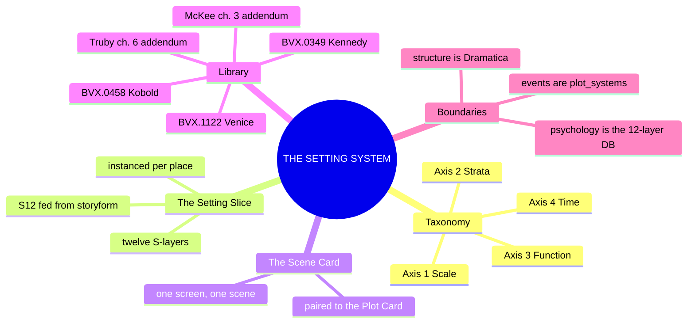
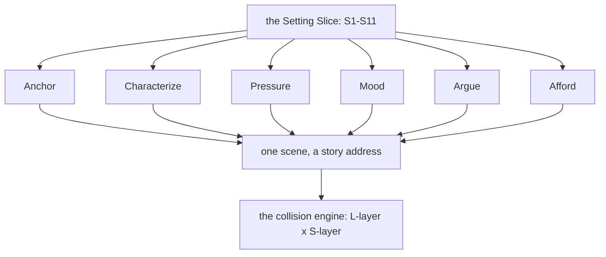
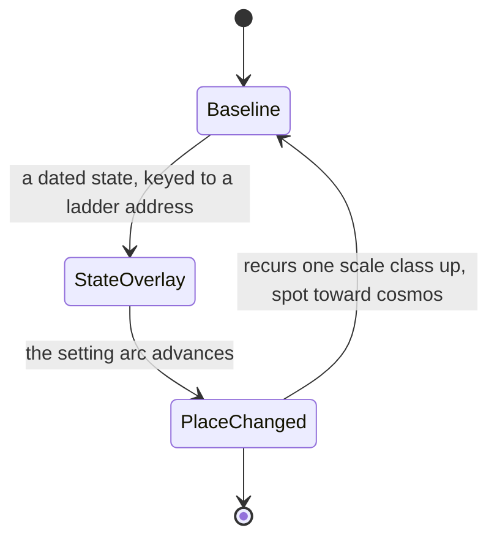

# 📐 SSOT: THE SETTING SYSTEM — place at character grade

**What this is:** setting promoted from backdrop to system — built B→A→instance per Chief's ruling: the **taxonomy** (what setting is), the **SETTING SLICE** (a 12-layer schema instanced per place, the architectural twin of the 12-Layer Character Database), the **SCENE CARD** (the notation slot reserved at ladder R2), and **DCUS instanced** as the proof of rig.

**Root claim:** setting is the **pressure field** — the total state of the world at a story address, exerting force on every unit of the ladder. In spine terms: setting is where the argument becomes matter — a Domain embodied. A place that pressures nothing is scenery, not setting.

---

## MIND MODELS

**Diagram 1, the whole system on one screen.**



**Diagram 2, the central mechanism: the pressure field.**



**Diagram 3, the recurring engine: the setting arc.**



*Diagram 3 draws the setting arc (Axis 4), not the fill rule: the doc gives the arc a live instance (DCUS[M1] → DCUS[M4]) to diagram, while the fill rule is a policy note about depth, not a mechanism. The SETTING SLICE stays the same schema across every state; only its S12 FUNCTION record moves.*

---

## PART B · THE TAXONOMY — four axes

### Axis 1 · SCALE — places nest (rhymes with the ladder's 8 rungs)

spot → room → site → locale → settlement → region → world → cosmos

Every slice declares its scale class and its parent/child places. Address form: `DCUS.campus.hall3.room12`. A scene (ladder R2) plays on some span of setting scale exactly as it sits at some ladder address.

### Axis 2 · STRATA — what a place is made of

The twelve layers of the slice (Part A). Derived from the holdings: Buckham's active-setting functions, the worldbuilding shelf's category sets (Kobold/GURPS gazetteer structure — the TTRPG scaffolding Chief called), narratology's space/description theory (Bal, Chatman).

### Axis 3 · FUNCTION — what setting DOES (Buckham-derived deployment modes)

| Mode | The setting is... |
|---|---|
| **Anchor** | orienting — reader knows where/when they stand |
| **Characterize** | revealing — the room tells who lives in it |
| **Pressure** | opposing — obstacle, constraint, danger |
| **Mood** | emotional weather — valence before a word of dialogue |
| **Argue** | thematic — the place makes the story's argument in matter |
| **Afford** | action surface — what the space permits/forbids (fight, chase, hide; games call it level design) |

A scene deploys one or two modes deliberately; all six at once is noise. The SCENE CARD records which.

### Axis 4 · TIME — baseline and states (the setting arc)

A slice is the **baseline**; **states** are dated overlays keyed to ladder addresses. The *setting arc* (thread, Module 1) is the sequence of states: `DCUS[M1] → DCUS[M4]`. Mirrors the character state architecture in 02. This is how a place "evolves over the plot."

---

## PART A · THE SETTING SLICE — twelve layers, mirror of the character stack

Same architecture as the 12-Layer Character Database: surface → depth → structural function, S12 fed independently from the storyform exactly as L12 FUNCTION is fed from the Dramatica ingest. **Layer names RULED 2026-09-29 as they stand** (Chief, "I'll recommend"; house coinage, held through two waves and 42 distills).

| Layer | Name | Holds | Mirrors |
|---|---|---|---|
| **S1** | **BODY** | physical fabric: geography, terrain, architecture, dimensions, materials, layout; **border/seam sub-field** — a rated permeability between adjacent zones, the mechanism that lets incompatible terrain, genre, or era share one setting; **seam type `passageway`** — Truby's liminal threshold between subworlds, crossing it changes which rules bind (a rules change on crossing, noted on the SCENE CARD when a scene crosses one) [[BVX.1181]] [[BVX.0630]] [[BVX.1177]] [[BVX.1179]] | L1 CORE |
| **S2** | **WEATHER** | climate, seasons, light, temperature, atmosphere; the place's rhythms (day/night, tides, terms) | L2 VITAL |
| **S3** | **SENSORIUM** | how it meets the senses: soundscape, smellscape, texture, palette — the presentation surface | L3 SOCIAL |
| **S4** | **LAW** | the rules that bind: governance, institutional mechanics, permission/forbiddance systems | L4 WILL |
| **S5** | **SCAR** | damage in the fabric: ruins, erasures, renames, sanded-off strata, what was demolished; **cross-ref S9** — one rupture can generate both the wound and the promise in a single causal move [[BVX.0575]] [[BVX.0822]] | L5 WOUND |
| **S6** | **ECONOMY** | what fuels it: resources, money, flows, traffic, who feeds and powers it | L6 DRIVE |
| **S7** | **FOUNDING** | origin: who built it, why, the founding stack, the deep history; **present-tense-bite test** — a founding line counts as active canon only if it still bites *now*, checked with the grammar test of a car racing now versus a car that had already raced [[BVX.1190]] | L7 ORIGIN |
| **S8** | **HABIT** | attachment architecture: the patterned life — rituals, routines, belonging gradients, insider/outsider | L8 IMPRINT |
| **S9** | **ALLURE** | the place's erotics: what it promises, what draws people in, its glamour and seduction; **cross-ref S5** — the same rupture that wounds a place can be the source of its promise [[BVX.0575]] [[BVX.0822]] | L9 EROS |
| **S10** | **UNDERSIDE** | what it represses: hidden zones, the unspoken, basements literal and social, what surfaces under pressure; **three tiers** — public (stated) / folk (known informally, unstated) / secret (buried, recoverable under pressure), sharper than the old binary public/personal split [[BVX.1184]] | L10 SHADOW |
| **S11** | **VECTOR** | trajectory: where the place is going — bloom, rot, collapse, redemption; feeds the setting arc; **optional forward-ledger sub-field** — dated future states fixed before they land (a dissolution date, a damage-status field) [[BVX.0362]] [[BVX.1176]] [[BVX.0387]] [[BVX.1184]] | L11 DESTINY |
| **S12** | **FUNCTION** | storyform binding, fed from the spine, independent of S1–S11: which throughline Domain the place embodies, its argument role, its charge; **conflict level** — McKee's altitude (subconscious · personal · institutional · environmental), read here as how high the place's pressure reaches, not a fifth axis (SCALE nests space, this reads force); **tone → mechanic sub-note** — a tone claim counts only once converted to a checkable mechanic, beside `commandments` on the SCENE CARD [[BVX.1184]] [[BVX.1170]] [[BVX.1185]] — **and its `narrative_invariant` set** (place-scoped invariants, e.g. Ecclesial Laws; mirrors L12's `narrative_invariant` field) | L12 FUNCTION |

**Slice header (machinery, not a layer):** `place_id` · names/aliases (the rename lattice) · scale class · parent/child places · canon node link · state track (dated overlays per Axis 4).

**Binding rule (mirror of the character-storyform binding):** a place that embodies a throughline Domain gets an S12 record per storyform, keyed by `storyform_id`. Places without argument roles (mere locations) may run S1–S11 only — S12 empty is legal; S12 filled is what makes a setting *load-bearing*.

**Fill rule (answers Kennedy, BVX.0349; RULED 1.4.0):** every place starts thin. Fill a layer only when a scene's pressure needs it; the header plus S12 (or the header alone, for a mere location) is a complete slice. A full twelve-layer fill is the encyclopaedic trap, not the goal.

**S12 working rule (TAW/TRW discipline):** only what's actually narrated is canon for a place's binding clause — a fact stays out of the S12 record until a scene puts it onstage [[BVX.0538]].

---

## THE SCENE CARD — the R2 notation (slot reserved in the ladder, delivered here)

One card per scene. Ten fields, one screen:

```
SCENE CARD
address:        OXO.primary.M2.q3.s12        (ladder address)
setting:        DCUS.campus.hall3 @ state M2  (slice + state)
active strata:  S3 SENSORIUM · S4 LAW         (which layers are working)
function mode:  Pressure + Mood               (Axis 3, max two)
sensorium:      3 details max                 (Buckham's telling-detail discipline)
commandments:   II / TP / CR / CL / RES       (Coyne's five, one line each)
value turn:     safety + → −                  (McKee; no turn, no scene)
duration:       scene | summary | stretch | pause | ellipsis   (Genette)
telling:        voice + focalization for this scene            (per-scene override of the Telling Profile — Module 3)
threads:        tori.arc · rs.rivalry         (what advances through this container)
invariants:     in-scope set, checked          (a breach means the scene is wrong, not the invariant)
collision:      seeding row(s), e.g. L9×S9     (a scene seeded by no row should justify itself — Module 5)
exit state:     what is now true that wasn't  (feeds the next card)
```

The card is the working notation for plot_systems when it opens; until then it documents any scene worth pinning.

---

## THE FACTION / NATION CARD — companion notation to the SCENE CARD

Added 2026-09-29 (synthesis change 1, RULED): nine sources independently converge on the same bounded stat block [[BVX.0343]] [[BVX.1170]] [[BVX.1171]] [[BVX.1177]] [[BVX.1179]] [[BVX.1181]] [[BVX.1174]] [[BVX.0483]] [[BVX.1168]]. One card per faction, nation, or bounded institution — a stub is legal, depth is reserved for whatever the story actually visits:

```
FACTION / NATION CARD
name:                 the entity's working name
founding sentence:    one line — who built it, why                   [[BVX.0343]] [[BVX.1174]]
binding principle:    the one rule that holds it together             [[BVX.1170]] [[BVX.0483]]
government:           form + who actually holds it                    [[BVX.1171]] [[BVX.1168]]
economy tier:         one rung on a lifestyle-expense ladder          [[BVX.1174]]
border/seam rating:   how porous its edge is to an adjacent zone      [[BVX.1181]] [[BVX.1177]] [[BVX.1179]]
one secret:           the single thing not on the public face         [[BVX.1177]]
```

Fed mainly by S4 LAW, S6 ECONOMY, S7 FOUNDING. Depth call: a stub — founding sentence + binding principle + one secret — for any place the story doesn't center; the full six-field card is warranted only where the story actually visits, per the synthesis's read of the tension between BVX.0343's eight-field NATION block and BVX.1177/BVX.1179's stub argument.

---

## THE INSTANCE — DCUS starter slice (proof of rig)

Filled entirely from existing canon ([delta-coast-ultra-school.md](../../../../_CANON_NODES/delta-coast-ultra-school.md) + storyform §9 + handoff bundle). Starter depth — full instance lives with the canon node when Movements 2–4 open.

**Header:** `dcus` · names: Delta Coast Ultra School / "DCUS" / the Ultra School / *Red Hills Academy* (legacy) / *Skeeter Creek* (founding, buried) / *Inner Spiral Academy* (pre-ruling) · scale: **site (campus)** · parent: the Middle Bands, Delta Coast, tri-state Spiral (FL/AL/GA) · role: Setting / Institutional Antagonist Vessel, Movements 2–4.

| Layer | DCUS |
|---|---|
| S1 BODY | century-old Southern prestige campus, Delta Coast; Middle-Bands address ("Inner Spiral" reverting to geography per provisional tissue) |
| S2 WEATHER | Gulf-South: heat, humidity, hurricane season; Southern Gothic light. ⚠️ **canon-thin — authorable gap** |
| S3 SENSORIUM | Southern Gothic register (ruled) — old brick and moss carrying a retrofit: Feed-linked clothing glow; the six-movement palette descent **clean → NEON-ROT** |
| S4 LAW | the Administration as depersonalized OS · Star-Rating · Sync Cult mechanics · Feed-linked clothing as enforced legibility |
| S5 SCAR | the rename lattice — **Skeeter Creek → Red Hills → DCUS**: erasure done twice; legacy students saying "Red Hills" commit a small legibility violation every time they speak |
| S6 ECONOMY | Bishop acquisition capital; prestige converted to product; the ownership war (grandfather vs son — sold for spoils *to the Bishops*) |
| S7 FOUNDING | 100+ years of private prestige; the founding name sanded to "Red Hills" a century before the Bishops arrived |
| S8 HABIT | alumni-legacy bloc vs Sync-era students; split faculty loyalties; the ritual life of the Star-Rating |
| S9 ALLURE | **the meritocratic promise** — the exact premise Tori must stop believing (Growth: Stop); flagship-Ultra prestige; the Feed's glamour |
| S10 UNDERSIDE | the first name under the second (Movement 3's forensic mode); what the rebrand-as-Boot-Sequence overwrote; the disruption→collapse skeleton |
| S11 VECTOR | the six-movement descent: clean → NEON-ROT → hunt; collapse trajectory |
| S12 FUNCTION | `storyform_id: oxo_primary_v1` — **the OS Domain embodied: Situation / The Past.** Goal = The Past, story_cost = Memories: the campus IS personal history deleted for programming space, done to a place. The rebrand is the world's Boot Sequence at institutional scale. **Invariant set: the Institutional Invariants (Ecclesial Laws)** — `THE_ADMINISTRATION.md`, place-scoped |

**The proof reads:** every layer filled from canon on the first try, one authorable gap surfaced (S2), and S12 snapped onto the storyform without force — the schema fits the house.

---

## SETTING × LIBRARY

`feeds:` for this limb: Buckham 0268/0269/0270 (Active Setting 1–3) + 0267/0056 → Axis 3 + S3 · Rozelle 0081, Hall 0288 → S3 craft · Alderson 0274 → scene card · Kobold 0458/0541, GURPS 0447, Collaborative Worldbuilding 0067 → Axis 2 strata + R7/R8 scale · Against Worldbuilding 0349 → the counter-argument (worldbuilding serves pressure, not inventory — the doc's own root claim) · Bal 0591/0596, Chatman 0167 → space/description theory (deepens in Module 3) · Once Upon a Pixel 0144, narrative-design shelf → Afford mode (environmental storytelling).

**Synthesis, 2026-09-29:** 42 further setting-shelf distills were folded against this system on 9/29 — [ssot_03_setting_synthesis.md](📐%20ssot_03_setting_synthesis.md) v0.2.0 has the full per-layer register, nine cross-book recurring methods, ten proposed changes to the taxonomy and slice (changes 1, 2, 3, 4, 6, 7, 8, 9 RULED and applied in this version; change 5 benched; change 10 reaffirmed), the DCUS application, and four read contradictions. Headline: ten of twelve S-layers move from adequate to deep; S3 SENSORIUM clears its flagged-thin status; S2 WEATHER's method gap closes but the DCUS instance itself stays unwritten; S12 FUNCTION gets its first non-DCUS worked instance.

**Genre-contract tool, 2026-09-29 (synthesis change 8, RULED):** Ryan's nine-axis ontological scoring [[BVX.0630]] is the primary L7 genre-contract tool; Baur's five-lineage taxonomy (Kobold, [[BVX.0458]]) stays as shorthand only — BVX.0630's own frontmatter states it supersedes the five-lineage tool, a sharpening, not a new concept.

## OPEN

**From the setting wave, 2026-09-16 (BOLO 18; distills BVX.0458 · 0349 · 1122 + the Truby/McKee addenda):**
- **What the trade cannot supply** (BVX.1122): a professional gazetteer fills BODY · LAW · ECONOMY · FOUNDING · HABIT · VECTOR richly, leaves WEATHER · SENSORIUM · SCAR · ALLURE · UNDERSIDE thin, and cannot fill FUNCTION at all. The Command's slice asks for exactly the layers the trade leaves out; that is the differentiation, and the cost.


**RULED 1.4.0, 2026-09-29:** passageway (→ S1 seam type) · McKee's conflict level (→ S12 reading) · Kennedy's fill rule (→ PART A) · tone-to-mechanic, change 5 (→ S12 sub-note) · the twelve layer names (ruled as they stand) · `03_SETTING_SYSTEMS/` placement (kept) — all closed.

**Still open (authoring, not calls):**
- **S2 WEATHER for DCUS** — authorable gap, first writing target when Movements 2–4 open.
- **Setting state architecture** — dated-overlay format specced at Axis 4; full doc mirrors `ssot_02_character_state_architecture` when first needed.
- **Scene card field trial** — first real scene of OXO should run one card end-to-end.

## Version history

- **1.4.0 — 2026-09-29.** RULED by Chief ("I'll recommend"): the six OPEN calls closed as recommended. S1 border/seam gains the `passageway` seam type (Truby). S12 gains McKee's conflict level as a reading and the tone-to-mechanic sub-note (synthesis change 5, unbenched). PART A gains the fill rule (Kennedy): thin by default. The twelve layer names ruled as they stand; `03_SETTING_SYSTEMS/` placement kept.
- **1.3.0 — 2026-09-29.** RULED by Chief ("go on all those recs"): synthesis changes 1, 2, 3, 4, 6, 7, 8, 9 applied. THE FACTION / NATION CARD added as a companion notation to the SCENE CARD (change 1). S1 BODY gets a border/seam sub-field (change 3). S7 FOUNDING gets the present-tense-bite grammar test (change 2). S5 SCAR and S9 ALLURE cross-reference each other (change 4). S12 FUNCTION gets the TAW/TRW binding-clause working rule (change 6). S10 UNDERSIDE upgraded from binary to three-tier public/folk/secret (change 7). Ryan's nine-axis ontological scoring named the primary L7 genre-contract tool, Baur's five-lineage taxonomy kept as shorthand (change 8). S11 VECTOR gets an optional forward-ledger sub-field (change 9). Change 5 (tone-to-mechanic conversion step) BENCHED, moved to OPEN. Change 10 reaffirmed — thin-by-default stays the rule, no structural change.
- **1.2.0 — 2026-09-29.** Synthesis of 42 setting distills linked; proposed changes pending ruling. SETTING × LIBRARY section gets an additive paragraph pointing to ssot_03_setting_synthesis.md v0.1.0. No taxonomy or slice change.
- **1.1.0 — 2026-09-16.** MIND MODELS section added (three diagrams: the system, the pressure field, the setting arc) so TM 03 renders; `sources:` declared. No taxonomy or slice change.
- **1.0.0 — 2026-08-25.** Module 2 of the lattice, B→A→instance per ruling: four-axis taxonomy, 12-layer slice mirroring the character stack layer-for-layer, scene card delivered to its reserved R2 slot, DCUS instanced as proof.
