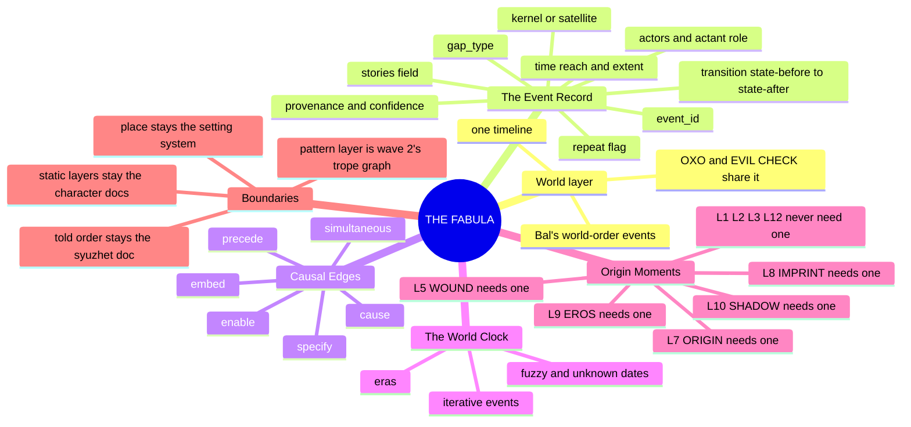
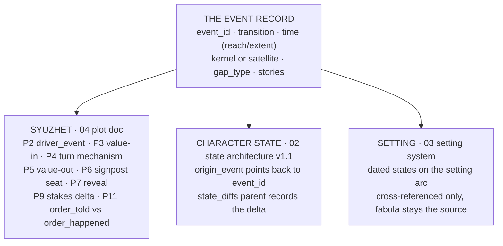

# 📐 SSOT · THE FABULA · world time

**What this is:** the fourth top-layer model's world-order half, split out from the told-order half that already lives in [📐 ssot_04_plot_system.md](📐%20ssot_04_plot_system.md). One fabula, one world timeline, sits under both stories in the shared universe: OXO (OVEREXITOUT) and EVIL CHECK, a second story in the same world. Bal's three-layer stack names the seam directly: "A narrative text is a text in which an agent or subject conveys to an addressee... a story in a medium... A story is the content of that text and produces a particular manifestation, inflection, and 'colouring' of a fabula. A fabula is a series of logically and chronologically related events that are caused or experienced by actors." ([[BVX.0591]], Bal 2017: 5) The syuzhet doc is the told order; this doc is the world order the syuzhet doc reads from.

**What it owns:** world time (events in their own logical and chronological sequence, independent of how any one story tells them); the EVENT RECORD schema; typed CAUSAL EDGES between events; THE WORLD CLOCK (eras, reach and extent, fuzzy and unknown dates, iterative events); the character ORIGIN MOMENTS rule, which of the twelve layers need a dated fabula event and which do not.

**What it does not own:** the told order (04's syuzhet doc owns P11 TIME, order_told vs order_happened, and reads this doc for order_happened); the pattern layer across events (wave 2's trope graph owns that, walking inside the storyform's signposts, Propp's functions "understood as an act of a character, defined from the point of view of its significance for the course of the action" (Propp 1968, ch.II) are that layer's job, not this one's); place itself (03, the setting system, owns where; this doc cross-references the setting doc's dated states rather than re-authoring them); the static character layers (02 owns CORE, VITAL, SOCIAL, FUNCTION; this doc supplies only the origin event for the layers that need one).

**Root claim:** a shared universe needs exactly one fabula, not one per story. Wolf's internarrative theory gives the direct warrant: "Imaginary worlds... are often transnarrative in scope, and have multiple stories occurring in them; not just nested stories, but separate stories that take place within the same world... In one sense, all the stories set in the same world can be seen as being nested within the overarching narrative of the history of the world itself." ([[BVX.0562]], Wolf 2012, ch.4) Wolf's mechanics note follows directly: "if a world's consistency is to be maintained, each additional story to be added to a world must take into account all of the narrative material already present in a world... stories are related chronologically to each other and can be arranged in a sequence, fitting together the stories' events on the timelines of the world" ([[BVX.0562]], same section). OXO and EVIL CHECK are two tellings that must fit one timeline of events, not two timelines that happen to resemble each other.

---

## MIND MODELS

**Diagram 1, the whole system on one screen.**



**Diagram 2, the handshake: fabula feeds the syuzhet, the character layers, and the setting.**



---

## THE EVENT RECORD

**What an event is.** Bal's definition, verbatim: "An event is the transition from one state to another state, caused or experienced by actors." ([[BVX.0591]], Bal 2017: 5, 155) A state on its own is not an event; a change is (Bal 2017: 155-156). That single line is the schema's first rule: one record, one transition, never a scene or a summary label bundling several transitions.

**Kernel or satellite.** Bal narrows which transitions matter to fabula structure by two criteria beyond mere change: Choice (after Barthes, a functional event opens, realizes, or reveals the result of a choice between alternatives) and Confrontation (a functional event needs "two actors and one action... two arguments and one predicate," subject-predicate-object, both slots filled) ([[BVX.0591]], Bal 2017: 156-159). Chatman's parallel cut is kernel vs satellite: "Kernels are narrative moments that give rise to cruxes in the direction taken by events... Kernels cannot be deleted without destroying the narrative logic." A satellite "can be deleted without disturbing the logic of the plot... Satellites entail no choice, but are solely the workings-out of the choices made at the kernels." ([[BVX.0167]], Chatman 1980: 53-55) Bal's functional/non-functional split and Chatman's kernel/satellite split are the one clear cross-school agreement on what counts; every event record carries a `kernel_satellite` flag on that agreement, not on either school alone.

**Ids.** The state architecture's own gap section names the requirement directly: "the fabula must assign each event a unique `event_id`. A state record must carry the corresponding ID in `origin_event`" (state_architecture.md v1.1 gap, per PS2 wave 1 handshake). The one worked example in canon: `event_id: "m1b_crash_jebb_death"` paired to state diff `vm_m1b_post_crash`. This doc adopts `<movement>_<slug>` as the working grammar (OPEN call 3) until a formal one is ruled.

**Time, reach, and extent.** Bal: "Events have been defined as processes. A process is a change, a development, and presupposes therefore a succession in time" (Bal 2017: ch.3 §4). Genette's pair gives the two numbers a fabula record needs per event even when only fuzzily known: reach (distance from the narrating present) and extent (span covered) (Genette 1980: 48) — both can be ranges rather than points.

**Gaps and iteration.** Bal: a linked series is "sometimes interrupted by a span of time in which nothing occurs — at least nothing that is narrated" (Bal 2017: 164) — silence in the telling is not the same as a gap in the world, so `gap_type` distinguishes `logged` (an event is on record) from `unknown` (nothing recorded, not the same claim as "nothing happened"). Genette's frequency axis covers iterative events, one record standing for a repeated class rather than one row per occurrence (Genette 1980: ch.3 "Frequency," p.113; Genette 1980: 53) — the `repeat` flag.

**Provenance.** Rimmon-Kenan is explicit that a story is a reconstruction, never the text itself: "Story… is not directly available to the reader… the text is the only observable and object-like aspect" (Rimmon-Kenan 2002: 3-6). When OXO and EVIL CHECK give conflicting glimpses of the same event, this doc is the adjudicated version, so every record carries a `provenance` block naming its source and a confidence level rather than silently picking one telling.

**Shared universe.** Wolf's mechanics note is the warrant for the `stories:` field: each event marks which telling(s) it is visible in — OXO, EVIL CHECK, or backstory-only — so both syuzhet docs can query the same table ([[BVX.0562]], Wolf 2012, ch.4).

**The template:**

```yaml
event_id: "<movement>_<slug>"                 # e.g. m1b_crash_jebb_death
transition: "<state-before> -> <state-after>" # Bal 2017: 155-156
actors:
  - actor: "<name>"
    actant_role: subject | object | helper | opponent  # Bal 2017: 5, 166-167
kernel_satellite: kernel | satellite          # Bal 2017: 156-159; Chatman 1980: 53-55
time:
  movement: "<Mn or Mn stage>"
  reach: "<distance from story-present, a range if fuzzy>"   # Genette 1980: 48
  extent: "<span covered, point or duration>"                # Genette 1980: 48
gap_type: logged | unknown                    # Bal 2017: 164
repeat: true | false                          # Genette 1980: ch.3 "Frequency"
location: "<place, an S-doc address if known>"  # Bal 2017: ch.3 §5
stories: [OXO, EVIL_CHECK, backstory_only]    # Wolf 2012, ch.4 — reserved field
provenance:
  source: "<node file, section>"
  confidence: direct_quote | inferred | uncertain   # Rimmon-Kenan 2002: 3-6
causal_edges:
  - type: precede | cause | enable | embed | specify | simultaneous
    to: "<event_id>"
```

---

## CAUSAL EDGES

Bal's warning is the section's spine: precedence is necessary but not sufficient for causality (Bal 2017: 159). A flat "next event" chain would collapse that distinction, so every edge in the registry carries a type.

| Edge | Definition | Cite |
|---|---|---|
| **precede** | Chronological order only, no causal claim — A happened before B, nothing more | Bal 2017: 176-177; Genette's "order" |
| **cause** | A's realization produces B's occurrence — "effect succeeds cause; thus, the hero dies after the bullet strikes him" | [[BVX.0591]], Bal 2017: 159 |
| **enable** | A opens the possibility B later realizes, Bremond's virtuality phase before the event that acts on it | Bal 2017: 160 |
| **embed** | A's realization opens a second process's own possibility phase, nested rather than sequential | Bal 2017: 161 |
| **specify** | An embedded series specifies the primary series rather than causing it | Bal 2017: 162 |
| **simultaneous** | A and B occur at the same time; "some events can occur at the same time, others succeed one another" | Bal 2017: 164 |

Bal's process model behind `cause`, `enable`, `embed`, and `specify`: three phases per process, possibility/virtuality to event/realization to result/conclusion, any of which can fail to occur (Bal 2017: 159-163). An edge marked `cause` asserts all three phases fired and produced the target event; an edge marked `enable` asserts only that the possibility phase opened, not that the target event was forced.

---

## THE WORLD CLOCK

**Eras.** The setting doc's own DCUS proof gives a naming lattice with three stages, stated as a chronology, not merely a scar: "100+ years of private prestige; the founding name sanded to 'Red Hills' a century before the Bishops arrived" (S7 FOUNDING); "the rename lattice — Red Stick Creek → Red Hills → DCUS: erasure done twice" (S5 SCAR) ([📐 ssot_03_setting_system.md](../03_SETTING_SYSTEMS/📐%20ssot_03_setting_system.md)). Read as world-clock eras: **Red Stick Creek** (founding, buried, no date given), **Red Hills** (the first rename, reach roughly a century before the Bishop acquisition, extent unstated), **DCUS** (the current era, tied to the Bishop acquisition, "prestige converted to product; the ownership war — grandfather vs son — sold for spoils to the Bishops," S6 ECONOMY). No calendar date exists in these sources for any of the three transitions; this doc records reach and extent as ranges (OPEN call 5) and does not invent a year. Per OPEN call 4, the world clock cross-references these eras rather than re-authoring them as its own filled event records — the setting doc stays the one authoring surface.

**Fuzzy and unknown dates.** None of the core narratology sources gives a formal null-value convention for an unknown date (a gap in the theory canon itself, not just this search); this doc's working answer is movement-relative dating — `M1`, `M2`, `M3`… with no calendar layer under it yet — carried in each event's `time.movement` field, reach and extent filled as ranges or marked unknown rather than left blank.

**Iterative events.** Genette's iterative note models a class of fabula record that is not one occurrence: "not... a single portion of elapsed time but... several portions taken as if they were alike and to some extent repetitive" (Genette 1980: 53). The `repeat` flag marks these; THE INSTANCE below carries a worked example (Tori's M2 outbursts).

**Gaps.** A `gap_type: unknown` event window is not a claim that nothing happened in the world during that span, only that nothing is on record for it (Bal 2017: 164) — distinct from a span this doc has deliberately not filled because the wave-1 instance is Tori-only (see THE INSTANCE, scope note).

---

## ORIGIN MOMENTS

PS2's wave-1 extraction reads all twelve character layers against "What Is Static vs What Is Dynamic" (the state architecture doc, §3) and sorts them by whether the layer's baseline needs a dated fabula event to have formed, or whether it is static, storyform-fed, or trajectory rather than a single origin.

| Layer | Name | Needs an origin moment? | Rule |
|---|---|---|---|
| L1 | CORE | No | Static trait; "does not change within a single story arc" |
| L2 | VITAL | No | Static trait; injuries are state diffs, not a re-origin |
| L3 | SOCIAL | No | Static trait; reputation shifts are state diffs, not a re-origin |
| L4 | WILL | Optional | Derives from CORE; an origin event is needed only if WILL changes durably post-story |
| L5 | WOUND | **Yes** | "Assigned during character history entry. This is a record of what happened, not a choice" — needs a dated trigger |
| L6 | DRIVE | Optional | Derives from VITAL; origin is the character's base fuel type, not a single event |
| L7 | ORIGIN | **Yes** | Birth context and formation set starting conditions; authored from documented backstory |
| L8 | IMPRINT | **Yes** | Formative conditioning locks in through early relational events with datable antecedents |
| L9 | EROS | **Yes** | Authored from documented intimate history with datable antecedents |
| L10 | SHADOW | **Yes** | Shadow content forms from wounded events that feed `shadow_content` entries |
| L11 | DESTINY | Optional | Trajectory, not a single event; `resistance_index` may respond to transformative events as state diffs |
| L12 | FUNCTION | No | Fed entirely from the Dramatica ingest template; no feed relationship with Character Astrology |

**The rule:** a layer needs an origin moment when its baseline crystallizes from one datable (even if fuzzily dated) fabula event, rather than from an ongoing trajectory, a derived state, or a storyform binding. L5, L7, L8, L9, and L10 fail this test the same way each time: they name a specific formation point in their own definitions (a wound's trigger, a birth context, a locked-in attachment pattern, a documented intimate history, a debilitated domain). L4, L6, and L11 pass because they describe a rate or a direction, not a point; L1, L2, L3, and L12 pass because they never move within a story arc or come from character work at all.

---

## THE HANDSHAKE

**To the syuzhet doc.** The plot card's fabula-facing fields read this doc's event registry directly:

| Plot card field | Reads from the fabula |
|---|---|
| P2 `driver_event` | An event's `event_id` and `transition` — the event that precipitates the unit's turn |
| P3 `value`, `polarity_in` | The referenced event's state-before half of `transition` |
| P4 `turn_mechanism` | The `cause` or `enable` edge linking the value-in event to the value-out event |
| P5 `polarity_out`, `irony_flag` | The referenced event's state-after half of `transition` |
| P6 `throughline`, `signpost_or_journey`, `act` | The event's position on THE WORLD CLOCK, read against the ladder's structural containers |
| P7 `reveal_content`, `reveal_type` | An event whose `gap_type` was `logged`-but-untold surfaces here as the syuzhet's reveal |
| P9 `stakes_delta` | The chain of `cause`/`enable` edges back to the prior fabula event in sequence — this is the fix for the plot doc's own flagged gap, "P9 needs a prior unit to compare against... nothing upstream carded yet" |
| P11 `order_told`, `order_happened`, `duration_mode` | `order_happened` is this doc's `time` field on the referenced event; `order_told` stays the syuzhet doc's own field; the gap between them is classified as an anachrony (external, internal, or mixed analepsis; prolepsis) so the trope graph can reason about foreshadowing and reveal structure ([[BVX.0562]] does not cover this; Genette 1980: 48-53) |

**To the state architecture.** The v1.1 gap PS2 flagged becomes a patch spec, **landed in `ssot_02_character_state_architecture.md` v1.1.0 on 2026-09-24** (OPEN call 6, ruled). As applied:

1. **`origin_event` field** — a structured reference, `origin_event: "<event_id>"`, added beside the freeform `narrative_moment` text (kept as a readable tag) as the state record's structured link into this doc's registry.
2. **`state_diffs` as a named parent field** — consolidating the current separate `MODIFIED_VALUES`, `MODIFIED_DERIVED`, and `MODIFIED_FLAGS` blocks under one `state_diffs:` parent, so a state change reads explicitly as a diff caused by an event rather than three loose blocks.
3. **Event ID standardization** — the fabula assigns each event one `event_id` (this doc's `<movement>_<slug>` grammar); every state record that traces to it carries the same string in `origin_event`. Worked example: `event_id: "m1b_crash_jebb_death"` pairs to state diff `vm_m1b_post_crash`.

**To the setting.** The setting doc's Axis 4 TIME states — "a slice is the baseline; states are dated overlays keyed to ladder addresses" — read this doc's world-clock eras for their dating rather than the setting doc re-deriving its own; S7 FOUNDING, S11 VECTOR, and S5 SCAR stay the authoring surface for what happened to the place, this doc stays the authoring surface for when.

---

## THE INSTANCE

**Scope note:** per the ruled default on DOPE SHEET 77 (Chief's silence read as "all recs"), this wave's instance fills Tori (Victoria Midnight) only. Anna Colson carries zero dated past events in current canon — her own node marks L7 ORIGIN, L8 IMPRINT, and the Jebb Midnight relation as author-pending (Open Questions #3, #4, #9) — so no event record is filled for her this wave; that gap is OPEN call 1 (77-C), not an omission.

Facts below trace only to what PS2 quotes from `victoria-midnight.md`. No birth date, no age at the crash, and no calendar date exist in that node for any of these events; every `time.reach` below is fuzzy or movement-relative only, never a fabricated point.

```yaml
event_id: "m1b_crash_jebb_death"
transition: "Tori overrides the pace notes, calculating she knows better -> Jebb dies"
actors:
  - actor: "Victoria Midnight (Tori)"
    actant_role: subject
  - actor: "Jebb Midnight"
    actant_role: object
kernel_satellite: kernel   # branches WOUND, KINSHIP_COLLAPSE, and every downstream state
time:
  movement: "M1B"
  reach: "pre-story; distance from story-present unspecified in canon"
  extent: "point (a single crash)"
gap_type: logged
repeat: false
location: "unspecified in canon"
stories: [OXO]
provenance:
  source: "victoria-midnight.md, REORIENT; §11 vertical slice instance"
  confidence: direct_quote
causal_edges:
  - type: cause
    to: "m1b_untouchable_resolve"
```

```yaml
event_id: "m1b_untouchable_resolve"
transition: "reactive grief -> the closed resolve 'I will become untouchable'"
actors:
  - actor: "Victoria Midnight (Tori)"
    actant_role: subject
kernel_satellite: kernel   # a choice point, Bal's Choice criterion — opens a new behavioral regime
time:
  movement: "M1B, immediately post-crash"
  reach: "pre-story; unspecified"
  extent: "point"
gap_type: logged
repeat: false
location: "unspecified in canon"
stories: [OXO]
provenance:
  source: "victoria-midnight.md, REORIENT"
  confidence: direct_quote
causal_edges:
  - type: precede
    to: "m2_recruited"
```

```yaml
event_id: "m2_recruited"
transition: "outside the Academy -> recruited to the Academy"
actors:
  - actor: "Victoria Midnight (Tori)"
    actant_role: object
kernel_satellite: kernel   # opens the school throughline
time:
  movement: "M2 entry"
  reach: "unspecified relative to M1B beyond sequence"
  extent: "point"
gap_type: logged
repeat: false
location: "unspecified in canon"
stories: [OXO]
provenance:
  source: "victoria-midnight.md, Where she appears"
  confidence: direct_quote
causal_edges: []   # no stated causal link to M1B beyond precedence; precedence alone is not causality (Bal 2017: 159)
```

```yaml
event_id: "m2_grief_outbursts"
transition: "grief held -> grief surfacing as surreal outbursts, dismissed in-world as 'Digital Puberty'"
actors:
  - actor: "Victoria Midnight (Tori)"
    actant_role: subject
kernel_satellite: satellite   # characterizes the ongoing state, does not itself branch the fabula
time:
  movement: "M2"
  reach: "unspecified"
  extent: "repeated across M2"
gap_type: logged
repeat: true   # Genette's iterative — one record standing for a repeated class (Genette 1980: 53)
location: "the Academy / DCUS"
stories: [OXO]
provenance:
  source: "victoria-midnight.md, Where she appears"
  confidence: direct_quote
causal_edges:
  - type: precede
    to: "m3_underground_search"
```

```yaml
event_id: "m3_underground_search"
transition: "Jebb's data unrecovered -> Tori works the transgressive underground seeking the deleted data of his death"
actors:
  - actor: "Victoria Midnight (Tori)"
    actant_role: subject
kernel_satellite: satellite   # an ongoing pursuit, no stated single-choice branch point in canon
time:
  movement: "M3"
  reach: "unspecified"
  extent: "ongoing across M3"
gap_type: logged
repeat: true
location: "the transgressive underground, unspecified further in canon"
stories: [OXO]
provenance:
  source: "victoria-midnight.md, Where she appears"
  confidence: direct_quote
causal_edges: []   # no stated causal edge to the crash's data-deletion mechanism; flagged uncertain, not invented
```

**A note on what is left out.** Tori's pre-M1B racing career (working/criminal-adjacent origin, "salvage economy phase," feeding L7 ORIGIN) is not filled as an event record: PS2 gives it as a background condition, not a dated transition, and Bal's own definition rules a state that never changes on record out of the event schema (Bal 2017: 155-156). It stays as context for L7 ORIGIN, not a fabula event.

---

## FABULA × LIBRARY

| Source | What it gives the fabula | Cite |
|---|---|---|
| Bal, *Narratology* | The event definition (transition, Choice, Confrontation), kernel/satellite's functional test, Bremond's causal phases, the gap/silence distinction | [[BVX.0591]] |
| Chatman, *Story and Discourse* | The kernel/satellite terms themselves; the surprise-in-story/suspense-in-discourse cut that keeps suspense a syuzhet-layer query, not a fabula field | [[BVX.0167]] |
| Genette, *Narrative Discourse* | Order, duration, frequency as the three discourse axes; reach and extent as the two numbers an event carries; the anachrony taxonomy (analepsis, prolepsis) THE HANDSHAKE hands to P11 | Genette 1980 (drop; no catalog id) |
| Rimmon-Kenan, *Narrative Fiction* | The warrant for `provenance`/`confidence`: story is a reconstruction, never the text itself, so a shared-universe fabula must adjudicate rather than transcribe | Rimmon-Kenan 2002 (drop; no catalog id) |
| Wolf, *Building Imaginary Worlds* | Internarrative theory — the direct warrant for one fabula under two syuzhets; the `stories:` field | [[BVX.0562]] |
| Sternberg, "Expositional Modes and Temporal Ordering in Fiction" | Curiosity/suspense/surprise as *payoffs* of misaligning syuzhet order against fabula order, confirming these are queries against this doc, not stored fields on it | Sternberg 1978 (drop; no catalog id) |
| Propp, *Morphology of the Folktale* | The boundary case: functions are a pattern-layer above events, the trope graph's job (wave 2), explicitly not a field this doc owns | Propp 1968 (drop; no catalog id) |

---

## OPEN
**All six ruled 2026-09-24, Chief: "go on all recommendations."** Each rec below is now the rule, provisional a week like every ruling.

1. **RULED 2026-09-24 (rec taken) · 77-C — Tori-only instance** — does wave 1's filled instance stay Tori-only, leaving Anna Colson's layer origins open per her own node's Open Questions? Rec: yes, matches Chief's silence-ruling on DOPE SHEET 77 and Anna Colson's own node marks L7 and L8 as author-pending.
2. **RULED 2026-09-24 (rec taken) · 77-D — EVIL CHECK wave 2** — when does EVIL CHECK's own event set enter this registry, given the `stories:` field is reserved but empty for it now? Rec: wave 2, once an EVIL CHECK-side extraction exists to source-check its events the way PS2 did for Tori.
3. **RULED 2026-09-24 (rec taken) · Event ID scheme** — the digests give one worked example, `m1b_crash_jebb_death`, but no formal grammar for `event_id`; what characters and length does the state doc's v1.1 field expect? Rec: adopt `<movement>_<slug>` as the working grammar until the state doc's owner rules otherwise.
4. **RULED 2026-09-24 (rec taken) · DCUS eras vs setting arc** — should THE WORLD CLOCK re-author the Red Stick Creek to Red Hills to DCUS lattice as its own filled event rows, or only cross-reference S5, S7, and S11? Rec: cross-reference only; the setting doc stays the one authoring surface for those dated states.
5. **RULED 2026-09-24 (rec taken) · Fuzzy-date convention** — none of the theory sources gives a formal null-value convention for an unknown date; is movement-relative dating, Mn with no calendar, the Command's working answer for this wave? Rec: yes for now, revisit once a calendar exists for the world.
6. **RULED 2026-09-24 (rec taken) · State architecture v1.1 ownership** — this doc specifies the `origin_event`, `state_diffs`, and event-id patch; does `ssot_02_character_state_architecture.md` take the version bump in the same pass or a separate FRAGO? Rec: separate FRAGO to that file; this doc's HANDSHAKE section is the spec source of truth until it lands.

---

## Version history

- **v0.1.0 (2026-09-24):** first draft, BOLO 77 wave 1, "go 77" ruled 2026-09-24. Built from three disjoint extractions: PS1 (syuzhet-side hooks, DCUS setting facts), PS2 (the twelve-layer origin-moment rule, the state architecture v1.0 gap, Tori's dated backstory), MS-T (the fabula/syuzhet/trope-graph theory digest, Bal/Chatman/Genette/Rimmon-Kenan/Wolf/Sternberg/Propp). Instance scoped to Tori only per the ruled default; EVIL CHECK's events reserved for wave 2; the state architecture v1.1 patch spec ships inside THE HANDSHAKE rather than in the state doc itself, pending OPEN call 6.
- **v0.1.1 (2026-09-24):** all six OPEN calls ruled as recommended (Tori-only instance · EVIL CHECK in wave 2 · `<movement>_<slug>` ids · DCUS eras cross-referenced · date by movement · the v1.1 patch shipped now). The patch landed in the state architecture v1.1.0: `origin_event` field, `state_diffs` parent, additive, `narrative_moment` kept.
