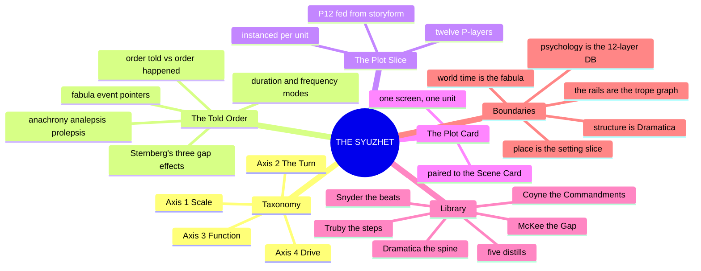
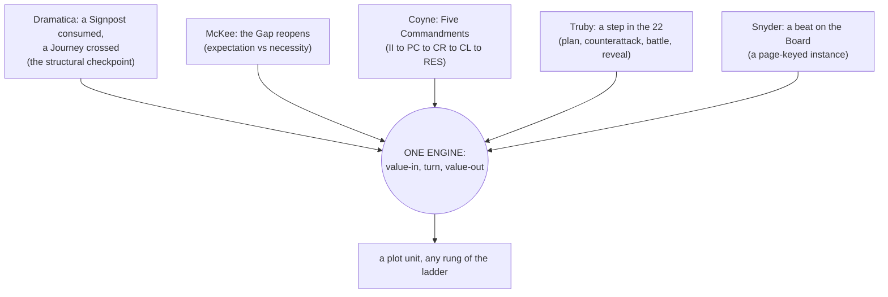
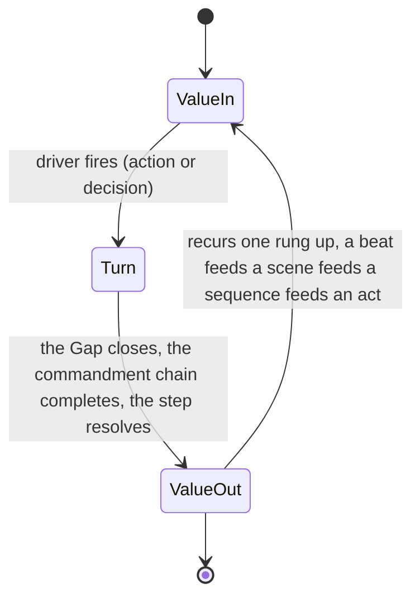

# 📐 SSOT · THE PLOT SYSTEM · the argument dramatized in time

**What this is:** plot promoted from a list of beats to a system, the third top-layer model in the lattice beside 02 (character) and 03 (setting), written from the plot shelf of the library, which now holds five distills: [[BVX.0089]] (Dramatica), [[BVX.0175]] (McKee), [[BVX.0236]] (Coyne), [[BVX.0193]] (Truby), [[BVX.0163]] (Snyder). Plot is the argument dramatized in time: what happens, in what order, and what changes because it happened.

**Ruled 2026-09-23 (Chief, "all recs"): the plot system is three docs, not one.** [📐 ssot_04_fabula.md](📐%20ssot_04_fabula.md) owns world time — the events in their own order, independent of any telling. [📐 ssot_04_trope_graph.md](📐%20ssot_04_trope_graph.md) owns the rails — which moves are legal where, Dramatica's fixed sixteen-signpost order walked against 135 book-derived nodes. This document is the third: **the syuzhet**, Bal's word for the told order, quoted in the fabula doc's own opening: "A story is the content of that text and produces a particular manifestation, inflection, and 'colouring' of a fabula" (ssot_04_fabula.md, quoting Bal 2017: 5). What the audience sees, when, how long a beat runs on the page, how often a class of event repeats. A plot card below no longer invents its value-in and value-out from scratch; it points at a fabula event and reads them.

**What the syuzhet owns:** the told order — how a plot unit points at a fabula event and reorders, compresses, stretches, elides, or repeats it (THE TOLD ORDER, below); turns, escalation, the scene's value change; a twelve-layer **PLOT SLICE** schema instanced per unit; the **PLOT CARD** notation.

**What it does not own:** world time (the fabula owns when an event happened in its own order, independent of any telling; this doc reads that doc's EVENT RECORD registry rather than re-deriving it), which moves are legal where (the trope graph owns the rail, Dramatica's fixed signpost order walked against the 135 book nodes; this doc reads P6's seat from that walk rather than re-deriving it), structure (Dramatica owns the storyform: the Grand Argument, the four throughlines, the fixed signpost and journey order, the eight dynamics; this doc fills those checkpoints with events, it does not set them), psychology (the 12-Layer Character Database and Character Astrology own who a character is), place (03, the setting slice, owns where). Per the spine's own division of labor: "Dramatica = the narrative structure engine... It does not produce plot events... those belong to plot_systems" ([📐 ssot_01_story_spine_comparative_tree.md](../01_NARRATIVE_FRAMEWORKS/📐%20ssot_01_story_spine_comparative_tree.md)).

**Root claim:** plot is the mechanism that converts the storyform's static checkpoints into felt experience. A value enters a unit charged one way, a turn forces it to a different charge, and the unit closes changed. Every plot model in the library, however it names its parts, is one instance of this same value-in, turn, value-out engine, running at whatever rung of the scale ladder the unit occupies: beat, scene, sequence, act. Dramatica supplies the fixed order the turns must honor (sixteen signposts across a form); McKee, Coyne, Truby, and Snyder supply four compatible descriptions of how a single turn is built and staged. A plot unit that does not turn is not plot, it is exposition, description, or scenery wearing plot's clothes.

---

## MIND MODELS

**Diagram 1, the whole system on one screen.**



**Diagram 2, the central mechanism: five sources, one engine.**



**Diagram 3, the plot unit recurring up the ladder.**



*The same three-beat engine runs at R1 BEAT, R2 SCENE, R3 SEQUENCE, and R4 ACT (Coyne's "fractal" claim, BVX.0236, invariant 1), each rung's value-out becoming the next rung's value-in.*

---

## PART B · THE TAXONOMY, four axes

### Axis 1 · SCALE, plot units on the existing ladder

Plot units do not invent a second hierarchy: they occupy the containers already ruled in [📐 ssot_01_scale_ladder.md](../01_NARRATIVE_FRAMEWORKS/📐%20ssot_01_scale_ladder.md). plot_systems' only addition is what happens inside a container, never a new size class.

| Rung | Plot container | Completion test (restated) |
|---|---|---|
| R1 BEAT | one exchange, action met by reaction | something tried, something answered, something now slightly different |
| R2 SCENE | the smallest container that turns | a value turn (McKee) **and** all five commandments present (Coyne) |
| R3 SEQUENCE | a chain of scenes answering one dramatic question | the sequence question is answered, usually replaced by a worse one |
| R4 ACT/MOVEMENT | one throughline's signpost, turned by a driver | all four throughlines have advanced one signpost; a driver has turned the story |
| R5 STORY | the whole storyform | all four throughlines complete; Outcome and Judgment delivered |

### Axis 2 · THE TURN, what changes inside a unit

Three vocabularies for the same event:

- **McKee's value turn:** a value-charged condition flips polarity, plus to minus or the reverse. No turn, no scene ([[BVX.0175]]).
- **Coyne's polarity,** the same claim from the editor's chair: "a scene must turn: a clear shift from one value state to its opposite (or its double)" ([[BVX.0236]], invariant 2).
- **McKee's Gap,** the mechanism that forces the turn: a character's minimal action provokes a world reaction bigger than expected, and the gap between what was expected and what was necessary is where the turn lives ([[BVX.0175]]).

**The scene-level minimum (R2 floor):** a value turn **and** Coyne's five commandments present, inciting incident, complication, crisis, climax, resolution. Below R2, at R1 BEAT, only the value micro-shift is required; the full five commandments do not apply until the unit is a scene.

### Axis 3 · FUNCTION, what a plot unit does for the argument

| Function | What the unit does | Instance vocabulary |
|---|---|---|
| **Signpost** | consumes a fixed structural checkpoint, one per throughline, four per form | Dramatica's Signpost ([[BVX.0089]]) |
| **Journey** | carries a throughline between two signposts | Dramatica's Journey ([[BVX.0089]]) |
| **Setup/Payoff** | plants knowledge, then closes the gap by delivering it | McKee ([[BVX.0175]]) |
| **Reveal** | changes what the audience or a character knows, building in intensity toward a reversal | Truby's revelations sequence ([[BVX.0193]]); Coyne's turning-point taxonomy, action or revelation ([[BVX.0236]]) |
| **Reversal** | a turning point that surprises and redirects | McKee ([[BVX.0175]]); Truby's climax double reversal ([[BVX.0193]]) |
| **Escalation** | each unit's risk or cost must exceed the last | McKee's progressive complications ([[BVX.0175]]); Coyne, invariant 5 ([[BVX.0236]]) |

### Axis 4 · DRIVE, drivers and act turns

| Vocabulary | What precipitates the turn | Source |
|---|---|---|
| **Dramatica Driver** | Action or Decision, a story-level dynamic; bookends the inciting and resolving event with the same kind | [[BVX.0089]] |
| **McKee's Inciting Incident/Crisis** | radically upsets life's balance / the Obligatory Scene, an irreconcilable-goods decision at maximum pressure | [[BVX.0175]] |
| **Coyne's Inciting Incident/Crisis/Climax** | recurs fractally at every unit, beat through global story | [[BVX.0236]] |
| **Snyder's page-keyed beats** | a fixed, ordered instance of act turns for the commercial screenplay case: Catalyst p.12, Break Into Two p.25, Midpoint p.55, All Is Lost p.75, Break Into Three p.85 | [[BVX.0163]] |

OXO's ruled story-level Driver is Action (spine L3). A unit's local driver, this scene's crisis, say, can still be a Decision even inside an Action-driven story: the dynamic operates at whatever rung is in view, and any rollup to R5 must agree with the ruling that closes the story (see OPEN call 5).

---

## PART A · THE PLOT SLICE, twelve layers, mirror of the character and setting stacks

Same architecture as the 12-Layer Character Database and the SETTING SLICE: surface to depth to structural function, P12 fed independently from the storyform exactly as L12 FUNCTION and S12 FUNCTION are. **Layer names are house coinage, provisional, awaiting Chief's ruling.**

| Layer | Name | Question it answers | Source | Field it writes |
|---|---|---|---|---|
| **P1** | **ADDRESS ⧗** | Where does this unit sit on the ladder? | scale ladder | `address` (IP.form.act.sequence.scene.beat) |
| **P2** | **DRIVER ⧗** | What precipitates the turn, an action or a decision? | Dramatica driver dynamic ([[BVX.0089]]); McKee's inciting incident / crisis decision ([[BVX.0175]]) | `driver_type` (action \| decision), `driver_event` |
| **P3** | **VALUE-IN ⧗** | What value is charged, at what polarity, entering the unit? | McKee's value-charged condition ([[BVX.0175]]); Coyne's Inciting Incident ([[BVX.0236]]) | `value`, `polarity_in` |
| **P4** | **TURN ⧗** | What mechanism flips the value, the Gap, the commandment chain, the step? | McKee's Gap ([[BVX.0175]]); Coyne's Five Commandments ([[BVX.0236]]); Truby's plan/battle ([[BVX.0193]]) | `turn_mechanism` |
| **P5** | **VALUE-OUT ⧗** | What is the value's polarity on exit, and is the charge ironic? | McKee ([[BVX.0175]]) | `polarity_out`, `irony_flag` |
| **P6** | **SIGNPOST/JOURNEY SEAT ⧗** | Which throughline's signpost or journey does this unit serve, in which act? | Dramatica signposts and journeys ([[BVX.0089]]); ladder R4 | `throughline`, `signpost_or_journey`, `act` |
| **P7** | **REVEAL ⧗** | What does the audience or a character learn here, and does it reverse expectation? | Truby's revelations sequence ([[BVX.0193]]); Coyne's turning-point taxonomy ([[BVX.0236]]) | `reveal_content`, `reveal_type` (action \| revelation) |
| **P8** | **COLLISION ⧗** | Which character × setting (or character × character) row fires to produce this unit's friction? | collision engine | `collision_row` (e.g. L9×S9) |
| **P9** | **STAKES/ESCALATION ⧗** | How does this unit's risk or cost compare to the last one, does it trend up? | McKee's progressive complications ([[BVX.0175]]); Coyne, invariant 5 ([[BVX.0236]]) | `stakes_delta` |
| **P10** | **GENRE OBLIGATION ⧗** | Which reader-contract obligation does this unit discharge, if any? | Coyne's obligatory scenes ([[BVX.0236]]); Snyder's 15 beats and 10 genres ([[BVX.0163]]) | `genre_obligation` |
| **P11** | **TIME ⧗** | What is the order told versus the order happened, what is the discourse texture? | Genette's order/duration/frequency; `order_happened` read from the fabula (ssot_04_fabula.md THE HANDSHAKE); see THE TOLD ORDER, below | `order_told`, `order_happened`, `duration_mode`, `frequency_mode`, `anachrony` |
| **P12** | **FUNCTION ⧗** | What does this unit do for the Grand Argument, independent of P1 to P11? | Dramatica's eight static appreciations ([[BVX.0089]]); storyform binding, mirrors L12/S12 | `story_point`, `storyform_id` |

**Binding rule (mirror of the character and setting bindings):** P12 is fed independently from the storyform, exactly as L12 FUNCTION and S12 FUNCTION are, keyed by `storyform_id`. A plot unit with no storyform link, a placeholder beat, an unforced bit of business, may run P1 through P11 only; P12 filled is what makes a plot unit load-bearing to the argument, not merely eventful.

---

## THE PLOT CARD, the notation slot for one plot unit

Compatible with the setting system's SCENE CARD: the scene card carries setting and state, place, sensorium, duration; the plot card carries the turn, value, mechanism, stakes, function. Row 9's scene card already fields four lines that anticipate this card (`commandments`, `value turn`, `collision`, part of `threads`) because that card was written before this document existed and the fields were reserved in place. This card formalizes what those lines were already doing under plot vocabulary.

```
PLOT CARD
address:        shared key with the scene card                (P1)
driver:         action | decision, the precipitating event; reads a fabula event_id + transition  (P2)
value-in:       value @ polarity; reads the fabula event's transition, before half  (P3)
turn:           mechanism in one line: Gap / commandment chain / step; reads the fabula's cause|enable edge  (P4)
value-out:      value @ polarity, irony flag if audience-read differs; reads the fabula event's transition, after half  (P5)
signpost seat:  throughline.signpost_or_journey, act; seated by the trope graph's walk               (P6)
reveal:         what's learned · action | revelation; a logged-but-untold fabula event surfacing here  (P7)
collision:      row(s) firing, shared field with the scene card  (P8)
stakes delta:   vs the previous unit in sequence, must trend up; reads the fabula's cause|enable chain back  (P9)
genre oblig:    obligatory scene / beat discharged                (P10)
time:           order told (this doc) vs order happened (the fabula); the gap is an anachrony  (P11)
function:       story point discharged · storyform_id             (P12)
```

Four fields already live on the SCENE CARD (`address`, the value-turn line spanning P3 to P5, `collision`, and part of `threads`). The plot card does not delete them, it is the fuller P1 to P12 record those compressed lines point to. Whether the two cards should merge into one notation, or stay siblings sharing one `address` key, is OPEN call 3.

**What each field reads, now that the fabula and the trope graph exist.** [ssot_04_fabula.md](📐%20ssot_04_fabula.md)'s own HANDSHAKE table and [ssot_04_trope_graph.md](📐%20ssot_04_trope_graph.md)'s own HANDSHAKE table already state this read direction; this card does not restate their content, it points at it. Where the two disagree on who owns P6, see OPEN call 15.

| Field | Reads from |
|---|---|
| P2 driver | the fabula event's `event_id` and `transition` (ssot_04_fabula.md THE HANDSHAKE, P2 row) |
| P3 value-in | the fabula event's `transition` state-before half (ssot_04_fabula.md THE HANDSHAKE, P3 row) |
| P4 turn | the `cause` or `enable` causal edge linking the value-in event to the value-out event (ssot_04_fabula.md THE HANDSHAKE, P4 row) |
| P5 value-out | the fabula event's `transition` state-after half, irony flag if the audience read differs (ssot_04_fabula.md THE HANDSHAKE, P5 row) |
| P6 signpost seat | the trope graph's walk: a node's `phase` and its place in the walk fix the seat directly, never guessed per scene (ssot_04_trope_graph.md THE HANDSHAKE, P6 row: "the anchor") |
| P7 reveal | a fabula event whose `gap_type` was `logged`-but-untold, surfacing here as the syuzhet's reveal (ssot_04_fabula.md THE HANDSHAKE, P7 row) |
| P9 stakes delta | the chain of `cause`/`enable` edges back to the prior fabula event in sequence — the fabula doc's own fix for this doc's flagged gap (ssot_04_fabula.md THE HANDSHAKE, P9 row) |
| P11 time | `order_happened` is the fabula's `time` field on the referenced event; `order_told` stays this doc's own field; the gap between them is classified as an anachrony, see THE TOLD ORDER below (ssot_04_fabula.md THE HANDSHAKE, P11 row) |

P1, P8, P10, and P12 are unchanged by the split: P1 ADDRESS stays the ladder tie, P8 COLLISION stays the collision engine row, P10 GENRE OBLIGATION stays Coyne/Snyder, P12 FUNCTION stays fed independently from the storyform.

**Side by side, one scene, M2 row 9:**

| | SCENE CARD (03, existing) | PLOT CARD (04, this document) |
|---|---|---|
| carries | setting + state | the turn |
| address | `OXO.primary.M2.q1.s3` ⧗ | same key |
| shared fields | `commandments`, `value turn`, `collision`, `threads` | `turn`, `value-in/out`, `collision`, `signpost seat` |
| unique to this card | `sensorium`, `active strata`, `function mode`, `telling` | `driver`, `stakes delta`, `genre oblig`, `function` |

---

## THE TOLD ORDER

This is the syuzhet's own record: not the event (the fabula owns that) and not the rail (the trope graph owns that), but the act of telling it — where in the telling a fabula event surfaces, how long the telling dwells on it, and how often the telling repeats a class of it.

**Pointing at the fabula.** A plot unit does not invent its own value-in and value-out from scratch; it points at one or more fabula `event_id`s and reads their `transition` for the raw material P3 through P5 dramatize. [ssot_04_fabula.md](📐%20ssot_04_fabula.md)'s own HANDSHAKE table states the read direction: P2 `driver_event` is "an event's `event_id` and `transition`," P3 and P5 read the transition's before/after halves, P9 `stakes_delta` reads "the chain of `cause`/`enable` edges back to the prior fabula event." This doc does not re-derive those readings, it consumes them.

**order_told vs order_happened.** `order_happened` is not this doc's field: it is the fabula's own `time` block on the referenced event (`movement`, `reach`, `extent`). `order_told` is this doc's field, the unit's position in the telling — P11's own line, unchanged in name from v0.1. The gap between the two is what the rest of this section classifies.

**Anachrony.** Genette's umbrella term for a mismatch between order_told and order_happened (MS-T.theory.md §4; Genette 1980: 48-53). Two core types:

- **Analepsis** — the telling narrates something earlier than the telling's own present position. Splits three ways: **external** (entirely before the first narrative's own start, no interference with what is already told), **internal** (falls inside the first narrative's own span, risks redundancy or collision with it), **mixed** (straddles the start). Internal analepsis further splits **heterodiegetic** (a different story-line or character) from **homodiegetic** (the same line — a "completing" analepsis filling an earlier ellipsis, or a **paralipsis**, a lateral omission of one strand rather than a temporal skip).
- **Prolepsis** — the telling narrates something later than the telling's own present position; reach and extent apply the same way (Genette 1980: 48).

**Duration.** How long the telling dwells on a fabula event relative to the event's own extent, five modes: **scene** (told time runs roughly 1:1 with happened time — the M2 row-9 instance's `duration: scene` line, below), **summary** (told time compresses happened time), **ellipsis** (told time is zero, the event is skipped over — the world-side twin of the fabula's `gap_type: logged`, an event on record that the telling never surfaces), **pause** (told time continues while happened time holds still, description carrying no fabula transition under it), **stretch** (told time runs longer than happened time, a slow-down). (Genette 1980, ch.2 "Duration," the axis MS-T.theory.md §1 names alongside order and frequency.)

**Frequency.** How many times the telling narrates an event class relative to how many times it happened in the fabula, three modes: **singulative** (told once, happened once — the default), **repetitive** (told more than once, happened once), **iterative** (told once, happened many times — the fabula's own `repeat: true` flag, worked in `m2_grief_outbursts`, is this doc's raw material for an iterative unit). (Genette 1980, ch.3 "Frequency," p.113 — the same citation ssot_04_fabula.md uses for its own `repeat` flag.)

**Why reorder at all: Sternberg's three gap effects.** A syuzhet does not misalign order_told against order_happened for its own sake; MS-T.theory.md §4 gives the payoff structure directly. **Curiosity** — the telling opens with an effect and withholds the already-past cause (Sternberg 1978: ~51-52). **Suspense** — the telling withholds a suspected future outcome (Chatman 1980: 61, "suspense in the discourse, surprise in the story"). **Surprise** — the reordering is unforeshadowed even to a rereader (Chatman 1980: 61). All three are queries against the fabula, not stored fabula fields (ssot_04_fabula.md, FABULA × LIBRARY, Sternberg row) — they live here, on the syuzhet's own record, as the reason a given unit's `anachrony.type` is not `none`.

**The template:**

```yaml
plot_unit_id: "<address, shared key with the plot card and scene card>"          # P1
event_id: "<fabula event_id this unit tells>"                                    # ssot_04_fabula.md EVENT RECORD
order_told: "<this unit's position in the telling>"                              # this doc's own field
order_happened: "<read from the fabula event's time.reach / time.extent>"        # ssot_04_fabula.md THE HANDSHAKE, P11
anachrony:
  type: none | analepsis_external | analepsis_internal | analepsis_mixed | prolepsis   # Genette 1980: 48-53
  reach: "<distance from the telling's present, a range if fuzzy>"               # Genette 1980: 48
  extent: "<span the anachrony covers>"                                          # Genette 1980: 48
duration_mode: scene | summary | ellipsis | pause | stretch                      # Genette 1980, ch.2 "Duration"
frequency_mode: singulative | repetitive | iterative                             # Genette 1980, ch.3 "Frequency", p.113
gap_effect: curiosity | suspense | surprise | none                               # Sternberg 1978: ~51-54; Chatman 1980: 61
```

---

## THE INSTANCE, M2 row 9 filled into the plot slice

Filled from [oxo-scene-card-M2-row9.md](../../../../_CANON_NODES/oxo-scene-card-M2-row9.md), the lattice's first scene card (collision engine row 9, L9 EROS × S9 ALLURE, trine-as-trap). The scene card already exists; this is the same unit read through the plot slice for the first time. Every field below traces to a line already on that card unless marked ⧗ new-inference.

| Layer | Row 9, filled | Traced from |
|---|---|---|
| **P1 ADDRESS** | `OXO.primary.M2.q1.s3` ⧗ (the card's own address, itself marked ⧗) | scene card `address` |
| **P2 DRIVER** | Decision, local to the CR beat: reach vs pull out ⧗ (does not override the story-level ruled Driver = Action, spine L3; this is the unit's own local driver) | scene card `commandments: CR` |
| **P3 VALUE-IN** | whole, polarity minus (grey, unranked, control-as-safety) | scene card `value turn`, opening state |
| **P4 TURN** | the Gap: her minimal action, saying "breathe," draws a bigger-than-expected institutional response, the rating climbs; staged through all five commandments (II/TP/CR/CL/RES, all present) — fabula pointer: `event_id: m2_grief_outbursts` ⧗ | scene card `commandments` block |
| **P5 VALUE-OUT** | whole minus to plus for Tori, her read; owned plus to minus underneath, the audience's read; ironic charge | scene card `value turn` line, verbatim |
| **P6 SIGNPOST/JOURNEY SEAT** | MC throughline, **signpost 1, The Past**, Movement 2 — re-seated 2026-09-24 under the ruled movements map (Act 1 = M1+M2); the earlier "signpost 2, Understanding: Sense of Self" was a pre-rotation label (`_tools/bolostatus/work/77/movements/MAP.md` §2, call 1 ruled) | scene card `threads: tori.arc[M2]` |
| **P7 REVEAL** | to the audience: the hook is a trap, dramatic irony; to Tori: nothing yet, she reads it as a win. Mixed type, action (the Digital Puberty glitch) plus revelation ("Verified") — fabula pointer: `event_id: m2_grief_outbursts` ⧗ | scene card commandments TP/CL, card's own value-turn framing |
| **P8 COLLISION** | L9×S9 (seed), echoes row 6 and row 3, seeds row 8 | scene card `collision` line, verbatim |
| **P9 STAKES/ESCALATION** | first tuning in its sequence, a baseline, not yet comparable to a prior unit ⧗ (the card is M2.q1.s3, early in its sequence, no earlier card exists to measure against) | inferred; the instance surfaces the gap itself |
| **P10 GENRE OBLIGATION** | Snyder's Institutionalized genre, the newcomer-induction obligatory scene ⧗ (not asserted on the card, new read) | new inference from [[BVX.0163]] |
| **P11 TIME** | order told = order happened, no reordering (`anachrony.type: none`); duration = scene (1:1), one licensed stretch at the sync; frequency = singulative for this unit's own telling, though the fabula event it points at is itself iterative ⧗ | scene card `duration` line, verbatim |
| **P12 FUNCTION** | discharges a Requirement toward the OS Goal, Equity ⧗, seeds M3's V-Sync (row 8); `storyform_id: oxo_primary_v1` | scene card `collision` (seeds row 8), DCUS S12 record |

**The proof reads:** ten of twelve layers fill directly from a card written before this document existed, no force applied. Two gaps surfaced on first use, both flagged ⧗ above. P9 STAKES needs a prior unit in its own sequence to measure escalation against, a scope gap, not a schema failure. P10 GENRE OBLIGATION is a genuinely new read, the plot slice's first original contribution to a card the setting system's proof had already closed.

**The fabula pointer.** [ssot_04_fabula.md](📐%20ssot_04_fabula.md)'s Tori-only wave-1 instance carries five dated events: `m1b_crash_jebb_death`, `m1b_untouchable_resolve`, `m2_recruited`, `m2_grief_outbursts`, `m3_underground_search`. One of the five covers this scene's moment: `m2_grief_outbursts` — "grief surfacing as surreal outbursts, dismissed in-world as 'Digital Puberty'" (`movement: M2`, `repeat: true`) — names the same in-world dismissal, "Digital Puberty," that P4 TURN and P7 REVEAL already carried from the scene card before this doc existed. P4 TURN and P7 REVEAL above now read `event_id: m2_grief_outbursts`. That fabula record is itself iterative ("repeated across M2"); this plot unit dramatizes one occurrence of that class at scene duration (P11, `duration = scene`), a singulative telling of one member drawn from an iterative fabula record — not a contradiction of the `repeat` flag, a zoom-in on one instance of it. The other four Tori events do not cover this scene's own value-in, value-out, or driver: none of the five fabula records names a rating system, a "Verified" mechanic, or a reach-vs-pull-out choice, so P2 DRIVER, P3 VALUE-IN, P5 VALUE-OUT, and P9 STAKES stay unlinked to a fabula event this wave. That is a scope gap in the Tori-only instance, not an omission — see OPEN call 12.

---

## PLOT × LIBRARY

`feeds:` for this limb, the five distills read in full for this document:

- **[[BVX.0089]] (Dramatica)** feeds P1 ADDRESS (the ladder tie via signposts), P2 DRIVER, P6 SIGNPOST/JOURNEY SEAT, P12 FUNCTION (the eight static appreciations: Goal, Consequence, Cost, Dividend, Requirement, Prerequisite, Precondition, Forewarning).
- **[[BVX.0175]] (McKee)** feeds P3 VALUE-IN, P4 TURN (the Gap), P5 VALUE-OUT, P9 STAKES/ESCALATION.
- **[[BVX.0236]] (Coyne)** feeds P4 TURN (the Five Commandments, already the SCENE CARD's `commandments` line), P9 STAKES/ESCALATION (invariant 5), P10 GENRE OBLIGATION (obligatory scenes).
- **[[BVX.0193]] (Truby)** feeds P4 TURN (the step, plan/battle), P7 REVEAL (the revelations sequence: logic, intensity, pace, reversal).
- **[[BVX.0163]] (Snyder)** feeds P10 GENRE OBLIGATION (the 10 genres, the 15 beats as a page-keyed instance), P11 TIME (the Board as a portable scene-inventory, page marks as an order-happened baseline).
- **[[BVX.1124]] (Vogler)** feeds P6 SIGNPOST/JOURNEY SEAT ([[the-twelve-stages|the twelve stages]] as a second act-seam vocabulary), P4 TURN ([[the-ordeal|the Ordeal]] as its highest-stakes instance; Resurrection as [[the-repeat-turn|a repeat turn]]).
- **[[BVX.1125]] (Brody)** feeds P1 ADDRESS (percentage-keyed beats as a baseline), P6 SIGNPOST/JOURNEY SEAT (the A Story/B Story split), and the [[multi-pov|multi-POV]] allowance.
- **[[BVX.1126]] (Aristotle)** feeds P4 TURN ([[peripeteia|peripeteia]]) and P7 REVEAL ([[anagnorisis|anagnorisis]], Ch.16's ranked discovery taxonomy as a reveal-quality ladder); the primary text is now held.

**Templates as instances, not rivals:** Snyder's 15 beats, Truby's 22 steps, and Coyne's Foolscap are not competing plot systems, they are pre-filled P-layer sequences for specific genre or medium cases. Snyder's beat sheet is one fixed, page-timed way to populate P6 and P10 across a roughly 110-page screenplay form. Truby's 22 steps are the most granular ordered P4/P7 sequence in the library, plan, counterattack, drive, battle, reveal, laid out as one organic chain. Coyne's Foolscap is a six-question intake form that front-loads P10 GENRE OBLIGATION and P12 FUNCTION before a single scene is carded. None of the three is authoritative over the spine's sixteen ruled signposts; each is a lens the plot slice can wear.

**The shelf:** 162 items keyed 9/16 (BOLO 18), five distilled to date, this document's five sources. The acquisition queue named in the spine's OPEN (Egri, Vogler, Field, Aristotle) will deepen L4/L6/L7 further but does not block this v0.1.

---

## OPEN

**Calls 12–15 ruled 2026-09-24, Chief: "all recommendations."** Call 15 is done: the fabula doc's HANDSHAKE now routes P6 to the trope graph's walk. Calls 12–14 are queued work (a sixth fabula event for row 9 · a second plot unit that compresses or skips time · the first flashback or flash-forward scene).

**RULED 2026-09-16 (Chief: "plot go"): all seven as recommended.** Kept below as the record; each item's *Recommendation* is now the ruling. Open work that survives the ruling: the Movement↔Signpost table (4) · carding row 9's earlier scenes (6) · OXO's genre ruling against the clover (7).

1. **The twelve P-layer names** (ADDRESS through FUNCTION), house coinage, awaiting Chief's ruling, same status as the S-layer names. *Recommendation:* keep, each pairs one-to-one with a question a working writer actually asks.
2. **The layer count (12)**, chosen to match the character and setting stacks exactly; the shelf could justify as few as eight, collapsing P2/P3/P5 into one VALUE layer, folding P9 into P4 and P11 into P12. *Recommendation:* hold at 12 for now, the row-9 proof used all twelve without forcing; revisit only if a second instance strains the schema.
3. **Whether the PLOT CARD merges into the SCENE CARD.** Row 9's existing scene card already carries `commandments`, `value turn`, `collision`, and part of `threads`, which overlap four plot-slice fields. *Recommendation:* keep them siblings sharing one `address` key rather than merge; a merged card would mix setting-state fields with turn fields on one screen and break the ten-second scan test.
4. **The Movement↔Signpost mapping table** (OXO: six movements × four signposts × four throughlines), flagged in the spine's L4 branch and the scale ladder's OPEN list, is plot_systems work and still not built. *Recommendation:* build it next, the natural second deliverable once P6 SIGNPOST/JOURNEY SEAT is ruled; row 9 already needs it, its own address carries a ⧗ series-overlay guess ("S1E02 · act 2").
5. **P2 DRIVER at the unit level versus the story level.** This document reads a local, scene-level driver independently of OXO's ruled story-level Driver = Action (spine L3), which the row-9 instance needed to do to fill P2 at all. *Recommendation:* keep both readings live, address by ladder rung (P2 at R2 is local, P2 rolled up to R5 must agree with the ruled story Driver), flag any contradiction found later as a breach per the ladder's constraint check.
6. **P9 STAKES/ESCALATION needs a prior unit to compare against.** The row-9 proof hit this directly, it sits early in its own sequence with nothing upstream carded yet. *Recommendation:* card the sequence's earlier scenes (q1.s1, s2) before trusting any `stakes_delta` value on s3.
7. **P10 GENRE OBLIGATION for OXO.** Snyder's Institutionalized genre reading (newcomer vs. group) is this document's own inference, not yet canon. *Recommendation:* rule OXO's primary genre or genre blend against Coyne's clover and Snyder's ten before P10 gets used on a second card, so obligations are checked against a fixed contract rather than guessed per scene.

8. **[[the-repeat-turn|The repeat turn]].** [[BVX.1124]]'s Resurrection forces a second full value-in/turn/value-out pass before Return, a harder death-and-rebirth than the Ordeal's first; P9's single "trend up" rule does not name this repeat requirement. *Recommendation:* a P9 note at the next bump.

9. **[[multi-pov|Multi-POV]] stacking.** [[BVX.1125]]'s Institutionalized/Help worked example runs three parallel fifteen-beat instances under one manuscript; P6 SIGNPOST/JOURNEY SEAT has no documented method for stacking more than one throughline-bearing hero's beats. *Recommendation:* a P6 rule at the next bump.

10. **Percentage addressing.** [[BVX.1125]]'s percent-of-manuscript beats are immediately portable to P1 ADDRESS for any unit not already fixed to a known total length, unlike Snyder's page marks. *Recommendation:* adopt as a P1 convention now.

11. **The discovery ladder.** [[BVX.1126]] Ch.16's ranked [[anagnorisis|recognitions]], least artful (a scar) to best (from the actions themselves), reads as P7 REVEAL's own reveal-quality scale. *Recommendation:* a P7 sub-field at the next bump.

12. **RULED 2026-09-24 (rec taken) · M2 row 9's remaining P-layers unlinked to a fabula event** — P2 DRIVER, P3 VALUE-IN, P5 VALUE-OUT, and P9 STAKES have no fabula `event_id` among Tori's five wave-1 events; none names a rating system, a "Verified" mechanic, or a reach-vs-pull-out choice. Rec: task a sixth fabula event for this exact moment before P9 STAKES gets used on a second card, matching the fabula doc's own OPEN call 6 ask for an upstream unit.

13. **RULED 2026-09-24 (rec taken) · Duration and frequency modes need a second proof case** — THE TOLD ORDER's five duration modes and three frequency modes are only proven against row 9's `scene`/(borrowed) `iterative` pair; `summary`, `ellipsis`, `pause`, `stretch`, `singulative`, and `repetitive` have no worked instance yet. Rec: card a second plot unit that actually compresses or skips fabula time before trusting the full mode set.

14. **RULED 2026-09-24 (rec taken) · No worked anachrony yet** — every current instance (row 9) reads `anachrony.type: none`, order_told equals order_happened; the analepsis/prolepsis taxonomy is untested against a real reordered OXO scene. Rec: card the first flashback or flash-forward scene against this schema at the next bump, rather than leave the taxonomy theoretical.

15. **RULED 2026-09-24 (rec taken) · P6's fabula HANDSHAKE row now disagrees with the trope graph's anchor claim** — ssot_04_fabula.md's own HANDSHAKE table still routes P6 to "the event's position on THE WORLD CLOCK"; this document and ssot_04_trope_graph.md now route P6 to the trope graph's walk instead. Rec: FRAGO ssot_04_fabula.md's HANDSHAKE table to drop or re-point its P6 row, so only one doc claims the anchor.

## Version history

- **0.2.0 · 2026-09-24** — BOLO 77 wave 3: this document becomes the syuzhet, the told-order third of the three-doc plot system (ssot_04_fabula = world time, ssot_04_trope_graph = the rails), ruled 2026-09-23 ("all recs"). New THE TOLD ORDER section: the syuzhet record, order_told vs order_happened, Genette's anachrony taxonomy (analepsis external/internal/mixed, prolepsis), duration modes, frequency modes, Sternberg's three gap effects. The PLOT CARD's P2/P3/P4/P5/P7/P9/P11 now read the fabula's own HANDSHAKE table; P6 reads the trope graph's walk instead of the fabula's world clock (a cross-doc disagreement, flagged as OPEN call 15). M2 row 9 linked to fabula event `m2_grief_outbursts` for P4 TURN and P7 REVEAL; P2/P3/P5/P9 stay unlinked, no fabula event covers that granularity yet (OPEN call 12). Four new OPEN calls (12-15), unruled. `dependencies:` gained ssot_04_fabula and ssot_04_trope_graph.

- **0.1.2 · 2026-09-16** — the drop-folder intake folded in (Vogler, Brody, Aristotle): three new PLOT × LIBRARY lines; sources gained BVX.1124, BVX.1125, BVX.1126; four OPEN calls added (8-11), unruled. Slice unchanged.

- **0.1.1 · 2026-09-16** — the seven OPEN calls ruled as recommended ("plot go"); status provisional a week.

- **0.1.0, 2026-09-16.** First plot_systems document, written on Chief's order (BOLO 18) from the L4 shelf's five distills: four-axis taxonomy, twelve-layer PLOT SLICE mirroring the character and setting stacks, PLOT CARD notation paired to the SCENE CARD, M2 row-9 instanced as proof. Layer names and count provisional pending Chief's ruling.
- **v0.2.1 (2026-09-24):** calls 12–15 ruled as recommended; call 15 executed in the fabula doc.
