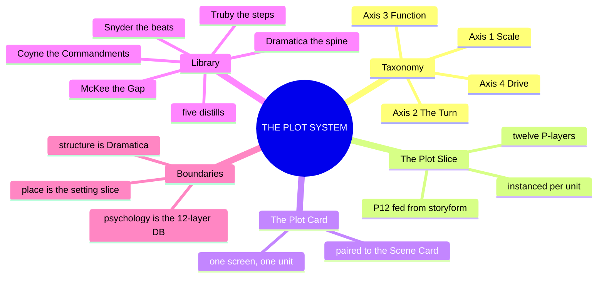
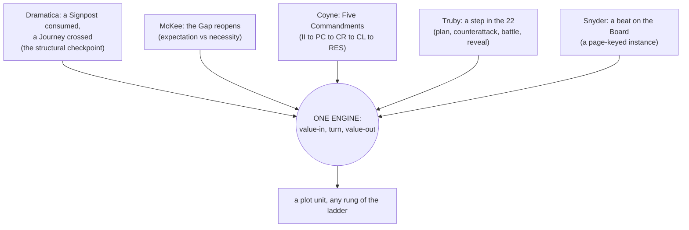
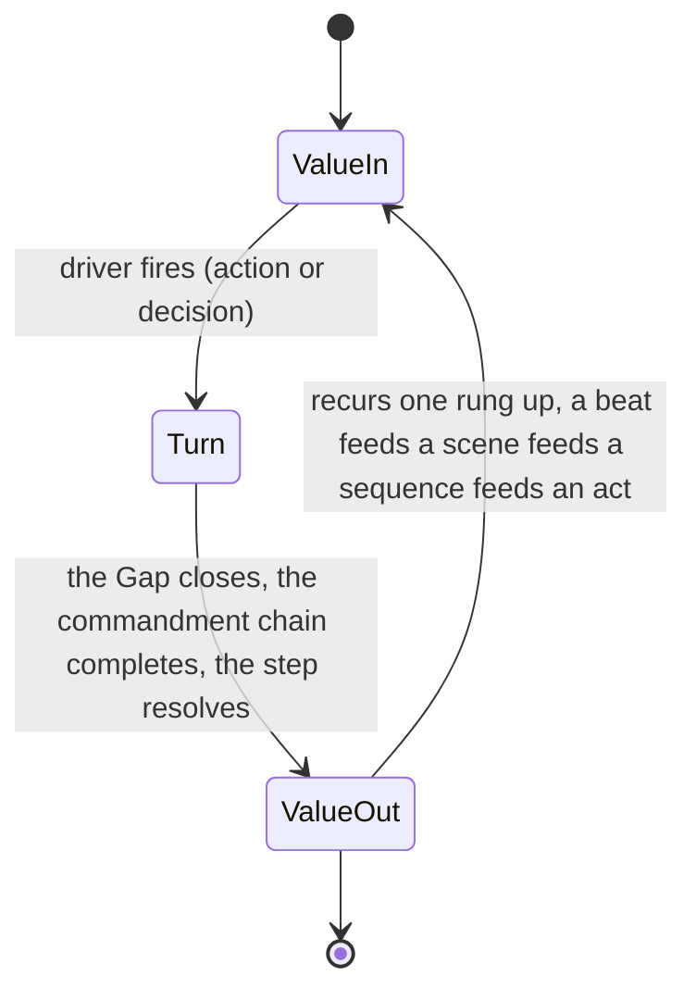

# 📐 SSOT · THE PLOT SYSTEM · the argument dramatized in time

**What this is:** plot promoted from a list of beats to a system, the third top-layer model in the lattice beside 02 (character) and 03 (setting), written from the plot shelf of the library, which now holds five distills: [[BVX.0089]] (Dramatica), [[BVX.0175]] (McKee), [[BVX.0236]] (Coyne), [[BVX.0193]] (Truby), [[BVX.0163]] (Snyder). Plot is the argument dramatized in time: what happens, in what order, and what changes because it happened.

**What plot_systems owns:** events, turns, escalation, the scene's value change, a twelve-layer **PLOT SLICE** schema instanced per unit, and the **PLOT CARD** notation.

**What it does not own:** structure (Dramatica owns the storyform: the Grand Argument, the four throughlines, the fixed signpost and journey order, the eight dynamics; plot_systems fills those checkpoints with events, it does not set them), psychology (the 12-Layer Character Database and Character Astrology own who a character is), place (03, the setting slice, owns where). Per the spine's own division of labor: "Dramatica = the narrative structure engine... It does not produce plot events... those belong to plot_systems" ([📐 ssot_01_story_spine_comparative_tree.md](../01_NARRATIVE_FRAMEWORKS/📐%20ssot_01_story_spine_comparative_tree.md)).

**Root claim:** plot is the mechanism that converts the storyform's static checkpoints into felt experience. A value enters a unit charged one way, a turn forces it to a different charge, and the unit closes changed. Every plot model in the library, however it names its parts, is one instance of this same value-in, turn, value-out engine, running at whatever rung of the scale ladder the unit occupies: beat, scene, sequence, act. Dramatica supplies the fixed order the turns must honor (sixteen signposts across a form); McKee, Coyne, Truby, and Snyder supply four compatible descriptions of how a single turn is built and staged. A plot unit that does not turn is not plot, it is exposition, description, or scenery wearing plot's clothes.

---

## MIND MODELS

**Diagram 1, the whole system on one screen.**



**Diagram 2, the central mechanism: five sources, one engine.**



**Diagram 3, the plot unit recurring up the ladder.**



*The same three-beat engine runs at R1 BEAT, R2 SCENE, R3 SEQUENCE, and R4 ACT (Coyne's "fractal" claim, BVX.0236, invariant 1), each rung's value-out becoming the next rung's value-in.*

---

## PART B · THE TAXONOMY, four axes

### Axis 1 · SCALE, plot units on the existing ladder

Plot units do not invent a second hierarchy: they occupy the containers already ruled in [📐 ssot_01_scale_ladder.md](../01_NARRATIVE_FRAMEWORKS/📐%20ssot_01_scale_ladder.md). plot_systems' only addition is what happens inside a container, never a new size class.

| Rung | Plot container | Completion test (restated) |
|---|---|---|
| R1 BEAT | one exchange, action met by reaction | something tried, something answered, something now slightly different |
| R2 SCENE | the smallest container that turns | a value turn (McKee) **and** all five commandments present (Coyne) |
| R3 SEQUENCE | a chain of scenes answering one dramatic question | the sequence question is answered, usually replaced by a worse one |
| R4 ACT/MOVEMENT | one throughline's signpost, turned by a driver | all four throughlines have advanced one signpost; a driver has turned the story |
| R5 STORY | the whole storyform | all four throughlines complete; Outcome and Judgment delivered |

### Axis 2 · THE TURN, what changes inside a unit

Three vocabularies for the same event:

- **McKee's value turn:** a value-charged condition flips polarity, plus to minus or the reverse. No turn, no scene ([[BVX.0175]]).
- **Coyne's polarity,** the same claim from the editor's chair: "a scene must turn: a clear shift from one value state to its opposite (or its double)" ([[BVX.0236]], invariant 2).
- **McKee's Gap,** the mechanism that forces the turn: a character's minimal action provokes a world reaction bigger than expected, and the gap between what was expected and what was necessary is where the turn lives ([[BVX.0175]]).

**The scene-level minimum (R2 floor):** a value turn **and** Coyne's five commandments present, inciting incident, complication, crisis, climax, resolution. Below R2, at R1 BEAT, only the value micro-shift is required; the full five commandments do not apply until the unit is a scene.

### Axis 3 · FUNCTION, what a plot unit does for the argument

| Function | What the unit does | Instance vocabulary |
|---|---|---|
| **Signpost** | consumes a fixed structural checkpoint, one per throughline, four per form | Dramatica's Signpost ([[BVX.0089]]) |
| **Journey** | carries a throughline between two signposts | Dramatica's Journey ([[BVX.0089]]) |
| **Setup/Payoff** | plants knowledge, then closes the gap by delivering it | McKee ([[BVX.0175]]) |
| **Reveal** | changes what the audience or a character knows, building in intensity toward a reversal | Truby's revelations sequence ([[BVX.0193]]); Coyne's turning-point taxonomy, action or revelation ([[BVX.0236]]) |
| **Reversal** | a turning point that surprises and redirects | McKee ([[BVX.0175]]); Truby's climax double reversal ([[BVX.0193]]) |
| **Escalation** | each unit's risk or cost must exceed the last | McKee's progressive complications ([[BVX.0175]]); Coyne, invariant 5 ([[BVX.0236]]) |

### Axis 4 · DRIVE, drivers and act turns

| Vocabulary | What precipitates the turn | Source |
|---|---|---|
| **Dramatica Driver** | Action or Decision, a story-level dynamic; bookends the inciting and resolving event with the same kind | [[BVX.0089]] |
| **McKee's Inciting Incident/Crisis** | radically upsets life's balance / the Obligatory Scene, an irreconcilable-goods decision at maximum pressure | [[BVX.0175]] |
| **Coyne's Inciting Incident/Crisis/Climax** | recurs fractally at every unit, beat through global story | [[BVX.0236]] |
| **Snyder's page-keyed beats** | a fixed, ordered instance of act turns for the commercial screenplay case: Catalyst p.12, Break Into Two p.25, Midpoint p.55, All Is Lost p.75, Break Into Three p.85 | [[BVX.0163]] |

OXO's ruled story-level Driver is Action (spine L3). A unit's local driver, this scene's crisis, say, can still be a Decision even inside an Action-driven story: the dynamic operates at whatever rung is in view, and any rollup to R5 must agree with the ruling that closes the story (see OPEN call 5).

---

## PART A · THE PLOT SLICE, twelve layers, mirror of the character and setting stacks

Same architecture as the 12-Layer Character Database and the SETTING SLICE: surface to depth to structural function, P12 fed independently from the storyform exactly as L12 FUNCTION and S12 FUNCTION are. **Layer names are house coinage, provisional, awaiting Chief's ruling.**

| Layer | Name | Question it answers | Source | Field it writes |
|---|---|---|---|---|
| **P1** | **ADDRESS ⧗** | Where does this unit sit on the ladder? | scale ladder | `address` (IP.form.act.sequence.scene.beat) |
| **P2** | **DRIVER ⧗** | What precipitates the turn, an action or a decision? | Dramatica driver dynamic ([[BVX.0089]]); McKee's inciting incident / crisis decision ([[BVX.0175]]) | `driver_type` (action \| decision), `driver_event` |
| **P3** | **VALUE-IN ⧗** | What value is charged, at what polarity, entering the unit? | McKee's value-charged condition ([[BVX.0175]]); Coyne's Inciting Incident ([[BVX.0236]]) | `value`, `polarity_in` |
| **P4** | **TURN ⧗** | What mechanism flips the value, the Gap, the commandment chain, the step? | McKee's Gap ([[BVX.0175]]); Coyne's Five Commandments ([[BVX.0236]]); Truby's plan/battle ([[BVX.0193]]) | `turn_mechanism` |
| **P5** | **VALUE-OUT ⧗** | What is the value's polarity on exit, and is the charge ironic? | McKee ([[BVX.0175]]) | `polarity_out`, `irony_flag` |
| **P6** | **SIGNPOST/JOURNEY SEAT ⧗** | Which throughline's signpost or journey does this unit serve, in which act? | Dramatica signposts and journeys ([[BVX.0089]]); ladder R4 | `throughline`, `signpost_or_journey`, `act` |
| **P7** | **REVEAL ⧗** | What does the audience or a character learn here, and does it reverse expectation? | Truby's revelations sequence ([[BVX.0193]]); Coyne's turning-point taxonomy ([[BVX.0236]]) | `reveal_content`, `reveal_type` (action \| revelation) |
| **P8** | **COLLISION ⧗** | Which character × setting (or character × character) row fires to produce this unit's friction? | collision engine | `collision_row` (e.g. L9×S9) |
| **P9** | **STAKES/ESCALATION ⧗** | How does this unit's risk or cost compare to the last one, does it trend up? | McKee's progressive complications ([[BVX.0175]]); Coyne, invariant 5 ([[BVX.0236]]) | `stakes_delta` |
| **P10** | **GENRE OBLIGATION ⧗** | Which reader-contract obligation does this unit discharge, if any? | Coyne's obligatory scenes ([[BVX.0236]]); Snyder's 15 beats and 10 genres ([[BVX.0163]]) | `genre_obligation` |
| **P11** | **TIME ⧗** | What is the order told versus the order happened, what is the discourse texture? | Genette's duration, carried in the SCENE CARD; the texture layer | `order_told`, `order_happened`, `duration_mode` |
| **P12** | **FUNCTION ⧗** | What does this unit do for the Grand Argument, independent of P1 to P11? | Dramatica's eight static appreciations ([[BVX.0089]]); storyform binding, mirrors L12/S12 | `story_point`, `storyform_id` |

**Binding rule (mirror of the character and setting bindings):** P12 is fed independently from the storyform, exactly as L12 FUNCTION and S12 FUNCTION are, keyed by `storyform_id`. A plot unit with no storyform link, a placeholder beat, an unforced bit of business, may run P1 through P11 only; P12 filled is what makes a plot unit load-bearing to the argument, not merely eventful.

---

## THE PLOT CARD, the notation slot for one plot unit

Compatible with the setting system's SCENE CARD: the scene card carries setting and state, place, sensorium, duration; the plot card carries the turn, value, mechanism, stakes, function. Row 9's scene card already fields four lines that anticipate this card (`commandments`, `value turn`, `collision`, part of `threads`) because that card was written before this document existed and the fields were reserved in place. This card formalizes what those lines were already doing under plot vocabulary.

```
PLOT CARD
address:        shared key with the scene card                (P1)
driver:         action | decision, the precipitating event     (P2)
value-in:       value @ polarity                                (P3)
turn:           mechanism in one line: Gap / commandment chain / step  (P4)
value-out:      value @ polarity, irony flag if audience-read differs  (P5)
signpost seat:  throughline.signpost_or_journey, act             (P6)
reveal:         what's learned · action | revelation             (P7)
collision:      row(s) firing, shared field with the scene card  (P8)
stakes delta:   vs the previous unit in sequence, must trend up  (P9)
genre oblig:    obligatory scene / beat discharged                (P10)
time:           order told vs order happened                     (P11)
function:       story point discharged · storyform_id             (P12)
```

Four fields already live on the SCENE CARD (`address`, the value-turn line spanning P3 to P5, `collision`, and part of `threads`). The plot card does not delete them, it is the fuller P1 to P12 record those compressed lines point to. Whether the two cards should merge into one notation, or stay siblings sharing one `address` key, is OPEN call 3.

**Side by side, one scene, M2 row 9:**

| | SCENE CARD (03, existing) | PLOT CARD (04, this document) |
|---|---|---|
| carries | setting + state | the turn |
| address | `OXO.primary.M2.q1.s3` ⧗ | same key |
| shared fields | `commandments`, `value turn`, `collision`, `threads` | `turn`, `value-in/out`, `collision`, `signpost seat` |
| unique to this card | `sensorium`, `active strata`, `function mode`, `telling` | `driver`, `stakes delta`, `genre oblig`, `function` |

---

## THE INSTANCE, M2 row 9 filled into the plot slice

Filled from [oxo-scene-card-M2-row9.md](../../../../_CANON_NODES/oxo-scene-card-M2-row9.md), the lattice's first scene card (collision engine row 9, L9 EROS × S9 ALLURE, trine-as-trap). The scene card already exists; this is the same unit read through the plot slice for the first time. Every field below traces to a line already on that card unless marked ⧗ new-inference.

| Layer | Row 9, filled | Traced from |
|---|---|---|
| **P1 ADDRESS** | `OXO.primary.M2.q1.s3` ⧗ (the card's own address, itself marked ⧗) | scene card `address` |
| **P2 DRIVER** | Decision, local to the CR beat: reach vs pull out ⧗ (does not override the story-level ruled Driver = Action, spine L3; this is the unit's own local driver) | scene card `commandments: CR` |
| **P3 VALUE-IN** | whole, polarity minus (grey, unranked, control-as-safety) | scene card `value turn`, opening state |
| **P4 TURN** | the Gap: her minimal action, saying "breathe," draws a bigger-than-expected institutional response, the rating climbs; staged through all five commandments (II/TP/CR/CL/RES, all present) | scene card `commandments` block |
| **P5 VALUE-OUT** | whole minus to plus for Tori, her read; owned plus to minus underneath, the audience's read; ironic charge | scene card `value turn` line, verbatim |
| **P6 SIGNPOST/JOURNEY SEAT** | MC throughline, signpost 2, Understanding: Sense of Self, Movement 2 | scene card `threads: tori.arc[M2]` |
| **P7 REVEAL** | to the audience: the hook is a trap, dramatic irony; to Tori: nothing yet, she reads it as a win. Mixed type, action (the Digital Puberty glitch) plus revelation ("Verified") | scene card commandments TP/CL, card's own value-turn framing |
| **P8 COLLISION** | L9×S9 (seed), echoes row 6 and row 3, seeds row 8 | scene card `collision` line, verbatim |
| **P9 STAKES/ESCALATION** | first tuning in its sequence, a baseline, not yet comparable to a prior unit ⧗ (the card is M2.q1.s3, early in its sequence, no earlier card exists to measure against) | inferred; the instance surfaces the gap itself |
| **P10 GENRE OBLIGATION** | Snyder's Institutionalized genre, the newcomer-induction obligatory scene ⧗ (not asserted on the card, new read) | new inference from [[BVX.0163]] |
| **P11 TIME** | order told = order happened, no reordering; duration = scene (1:1), one licensed stretch at the sync | scene card `duration` line, verbatim |
| **P12 FUNCTION** | discharges a Requirement toward the OS Goal, Equity ⧗, seeds M3's V-Sync (row 8); `storyform_id: oxo_primary_v1` | scene card `collision` (seeds row 8), DCUS S12 record |

**The proof reads:** ten of twelve layers fill directly from a card written before this document existed, no force applied. Two gaps surfaced on first use, both flagged ⧗ above. P9 STAKES needs a prior unit in its own sequence to measure escalation against, a scope gap, not a schema failure. P10 GENRE OBLIGATION is a genuinely new read, the plot slice's first original contribution to a card the setting system's proof had already closed.

---

## PLOT × LIBRARY

`feeds:` for this limb, the five distills read in full for this document:

- **[[BVX.0089]] (Dramatica)** feeds P1 ADDRESS (the ladder tie via signposts), P2 DRIVER, P6 SIGNPOST/JOURNEY SEAT, P12 FUNCTION (the eight static appreciations: Goal, Consequence, Cost, Dividend, Requirement, Prerequisite, Precondition, Forewarning).
- **[[BVX.0175]] (McKee)** feeds P3 VALUE-IN, P4 TURN (the Gap), P5 VALUE-OUT, P9 STAKES/ESCALATION.
- **[[BVX.0236]] (Coyne)** feeds P4 TURN (the Five Commandments, already the SCENE CARD's `commandments` line), P9 STAKES/ESCALATION (invariant 5), P10 GENRE OBLIGATION (obligatory scenes).
- **[[BVX.0193]] (Truby)** feeds P4 TURN (the step, plan/battle), P7 REVEAL (the revelations sequence: logic, intensity, pace, reversal).
- **[[BVX.0163]] (Snyder)** feeds P10 GENRE OBLIGATION (the 10 genres, the 15 beats as a page-keyed instance), P11 TIME (the Board as a portable scene-inventory, page marks as an order-happened baseline).
- **[[BVX.1124]] (Vogler)** feeds P6 SIGNPOST/JOURNEY SEAT ([[the-twelve-stages|the twelve stages]] as a second act-seam vocabulary), P4 TURN ([[the-ordeal|the Ordeal]] as its highest-stakes instance; Resurrection as [[the-repeat-turn|a repeat turn]]).
- **[[BVX.1125]] (Brody)** feeds P1 ADDRESS (percentage-keyed beats as a baseline), P6 SIGNPOST/JOURNEY SEAT (the A Story/B Story split), and the [[multi-pov|multi-POV]] allowance.
- **[[BVX.1126]] (Aristotle)** feeds P4 TURN ([[peripeteia|peripeteia]]) and P7 REVEAL ([[anagnorisis|anagnorisis]], Ch.16's ranked discovery taxonomy as a reveal-quality ladder); the primary text is now held.

**Templates as instances, not rivals:** Snyder's 15 beats, Truby's 22 steps, and Coyne's Foolscap are not competing plot systems, they are pre-filled P-layer sequences for specific genre or medium cases. Snyder's beat sheet is one fixed, page-timed way to populate P6 and P10 across a roughly 110-page screenplay form. Truby's 22 steps are the most granular ordered P4/P7 sequence in the library, plan, counterattack, drive, battle, reveal, laid out as one organic chain. Coyne's Foolscap is a six-question intake form that front-loads P10 GENRE OBLIGATION and P12 FUNCTION before a single scene is carded. None of the three is authoritative over the spine's sixteen ruled signposts; each is a lens the plot slice can wear.

**The shelf:** 162 items keyed 9/16 (BOLO 18), five distilled to date, this document's five sources. The acquisition queue named in the spine's OPEN (Egri, Vogler, Field, Aristotle) will deepen L4/L6/L7 further but does not block this v0.1.

---

## OPEN

**RULED 2026-09-16 (Chief: "plot go"): all seven as recommended.** Kept below as the record; each item's *Recommendation* is now the ruling. Open work that survives the ruling: the Movement↔Signpost table (4) · carding row 9's earlier scenes (6) · OXO's genre ruling against the clover (7).

1. **The twelve P-layer names** (ADDRESS through FUNCTION), house coinage, awaiting Chief's ruling, same status as the S-layer names. *Recommendation:* keep, each pairs one-to-one with a question a working writer actually asks.
2. **The layer count (12)**, chosen to match the character and setting stacks exactly; the shelf could justify as few as eight, collapsing P2/P3/P5 into one VALUE layer, folding P9 into P4 and P11 into P12. *Recommendation:* hold at 12 for now, the row-9 proof used all twelve without forcing; revisit only if a second instance strains the schema.
3. **Whether the PLOT CARD merges into the SCENE CARD.** Row 9's existing scene card already carries `commandments`, `value turn`, `collision`, and part of `threads`, which overlap four plot-slice fields. *Recommendation:* keep them siblings sharing one `address` key rather than merge; a merged card would mix setting-state fields with turn fields on one screen and break the ten-second scan test.
4. **The Movement↔Signpost mapping table** (OXO: six movements × four signposts × four throughlines), flagged in the spine's L4 branch and the scale ladder's OPEN list, is plot_systems work and still not built. *Recommendation:* build it next, the natural second deliverable once P6 SIGNPOST/JOURNEY SEAT is ruled; row 9 already needs it, its own address carries a ⧗ series-overlay guess ("S1E02 · act 2").
5. **P2 DRIVER at the unit level versus the story level.** This document reads a local, scene-level driver independently of OXO's ruled story-level Driver = Action (spine L3), which the row-9 instance needed to do to fill P2 at all. *Recommendation:* keep both readings live, address by ladder rung (P2 at R2 is local, P2 rolled up to R5 must agree with the ruled story Driver), flag any contradiction found later as a breach per the ladder's constraint check.
6. **P9 STAKES/ESCALATION needs a prior unit to compare against.** The row-9 proof hit this directly, it sits early in its own sequence with nothing upstream carded yet. *Recommendation:* card the sequence's earlier scenes (q1.s1, s2) before trusting any `stakes_delta` value on s3.
7. **P10 GENRE OBLIGATION for OXO.** Snyder's Institutionalized genre reading (newcomer vs. group) is this document's own inference, not yet canon. *Recommendation:* rule OXO's primary genre or genre blend against Coyne's clover and Snyder's ten before P10 gets used on a second card, so obligations are checked against a fixed contract rather than guessed per scene.

8. **[[the-repeat-turn|The repeat turn]].** [[BVX.1124]]'s Resurrection forces a second full value-in/turn/value-out pass before Return, a harder death-and-rebirth than the Ordeal's first; P9's single "trend up" rule does not name this repeat requirement. *Recommendation:* a P9 note at the next bump.

9. **[[multi-pov|Multi-POV]] stacking.** [[BVX.1125]]'s Institutionalized/Help worked example runs three parallel fifteen-beat instances under one manuscript; P6 SIGNPOST/JOURNEY SEAT has no documented method for stacking more than one throughline-bearing hero's beats. *Recommendation:* a P6 rule at the next bump.

10. **Percentage addressing.** [[BVX.1125]]'s percent-of-manuscript beats are immediately portable to P1 ADDRESS for any unit not already fixed to a known total length, unlike Snyder's page marks. *Recommendation:* adopt as a P1 convention now.

11. **The discovery ladder.** [[BVX.1126]] Ch.16's ranked [[anagnorisis|recognitions]], least artful (a scar) to best (from the actions themselves), reads as P7 REVEAL's own reveal-quality scale. *Recommendation:* a P7 sub-field at the next bump.

## Version history

- **0.1.2 · 2026-09-16** — the drop-folder intake folded in (Vogler, Brody, Aristotle): three new PLOT × LIBRARY lines; sources gained BVX.1124, BVX.1125, BVX.1126; four OPEN calls added (8-11), unruled. Slice unchanged.

- **0.1.1 · 2026-09-16** — the seven OPEN calls ruled as recommended ("plot go"); status provisional a week.

- **0.1.0, 2026-09-16.** First plot_systems document, written on Chief's order (BOLO 18) from the L4 shelf's five distills: four-axis taxonomy, twelve-layer PLOT SLICE mirroring the character and setting stacks, PLOT CARD notation paired to the SCENE CARD, M2 row-9 instanced as proof. Layer names and count provisional pending Chief's ruling.
