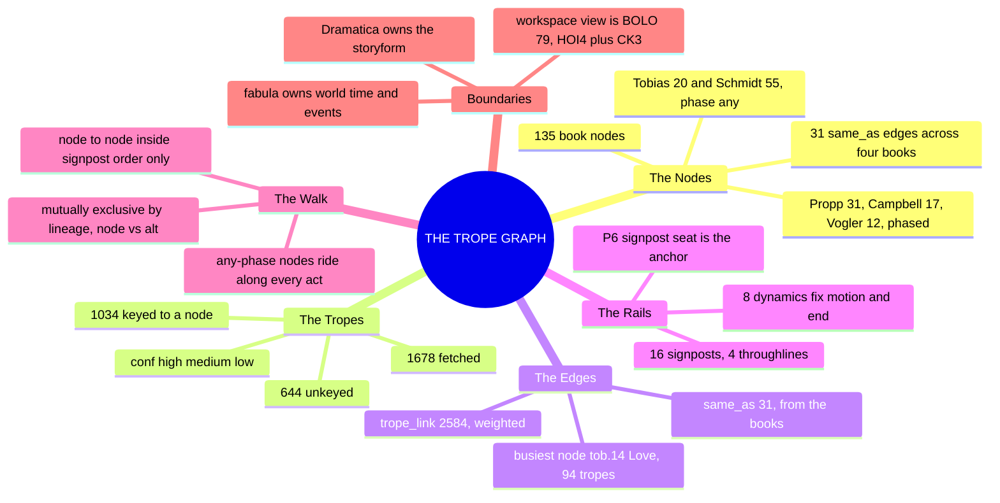
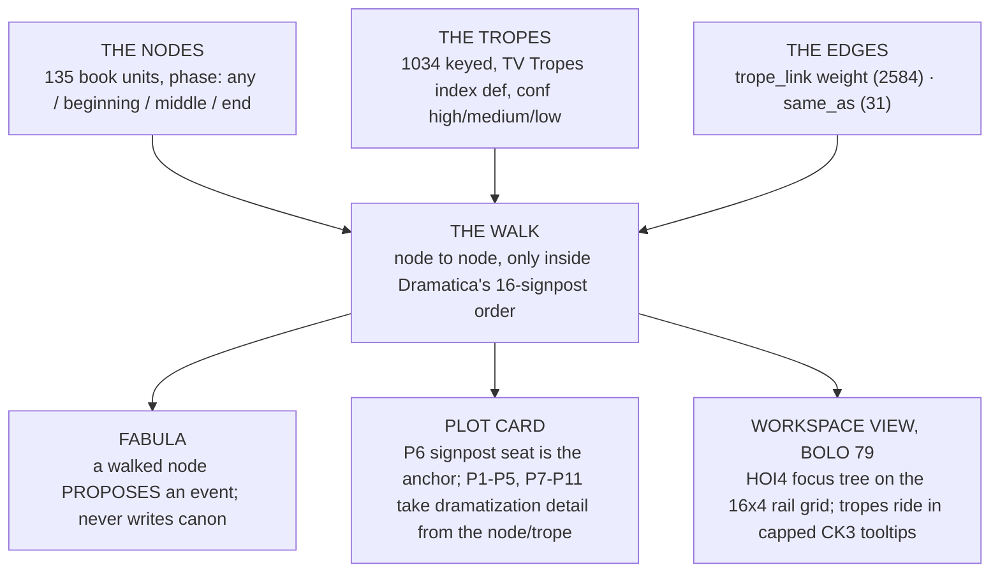

# 📐 SSOT · THE TROPE GRAPH · the rails and what rides them

**What this is:** the pattern layer the fabula doc reserved and the plot doc pointed at but did not build — "wave 2's trope graph owns that, walking inside the storyform's signposts, Propp's functions... are that layer's job, not this one's" (ssot_04_fabula.md, What it does not own). A trope names a recurring pattern; a node is a named unit from one of five structure books; an edge is a measured relationship between two nodes, counted from how often real TV Tropes articles link a trope keyed to one node into a trope keyed to another. This doc is the graph those three things make together, plus the rule for walking it.

**What it owns:** the 135 nodes and their same_as equivalence clusters; the trope keying (1,034 tropes matched to a node, 644 left unkeyed); the node-to-node edges (trope_link weight, same_as); the rail the walk must respect (Dramatica's 16 signposts across 4 throughlines, fixed order, no author-placement); the handshake spec to the fabula, the plot card, and the HOI4-style workspace view.

**What it does not own:** the storyform itself (Dramatica owns the Grand Argument, the four throughlines, the eight dynamics, the fixed signpost and journey order — this doc reads PS-R's extraction of it and never re-derives it); world time (the fabula owns events, causal edges, the world clock — a walked node proposes an event, it does not write one); the told order (04's syuzhet doc owns P11); psychology, place, and the static character layers (02 and 03 own those); the workspace view's own rendering code (BOLO 79's H-rules govern how this graph draws as a focus tree, this doc only supplies the graph the view reads).

**Root claim:** a trope is not free-floating. Every trope that means anything to this Command's plot work sits on top of one of 135 fixed structural units drawn from five books, and every one of those units sits on a fixed rail Dramatica already locked. TV Tropes supplies volume and cross-reference; it supplies none of the order. A tool or a writer may walk trope to trope, node to node, only along the rail — never off it, never out of sequence — because the rail is the one thing here that is not a pattern, it is the storyform.

---

## MIND MODELS

**Diagram 1, the whole system on one screen.**



**Diagram 2, the handshake: the graph feeds the fabula, the plot card, and the workspace view.**



---

## THE NODES

**135 nodes, five families, no invented items** (MS-N's count, matching the order): Schmidt 55 · Propp 31 · Tobias 20 · Campbell 17 · Vogler 12.

| Family | Count | Phase | What kind of unit |
|---|---|---|---|
| **Tobias** (`tob.*`) | 20 | any | whole master plots — "protagonist, subplot, or incident," can sit anywhere in a story |
| **Schmidt** (`sch.*`) | 55 | any | whole dramatic situations, including the 55th, the Blank Situation Template, a worksheet not a real situation |
| **Propp** (`prp.*`) | 31 | beginning 8 · middle 12 · end 11 | folktale functions, a real fixed sequence |
| **Vogler** (`vog.*`) | 12 | beginning 5 · middle 5 · end 2 | the hero's journey stages, mapped onto a three-act seam |
| **Campbell** (`cam.*`) | 17 | beginning 5 · middle 6 · end 6 | monomyth stages: Departure, Initiation, Return |

Tobias and Schmidt are whole-plot or whole-situation inventories, so MS-N ruled their `phase` field `any` — they can occupy any signpost, not one fixed point. Propp, Vogler, and Campbell have their own internal sequence, so their `phase` is `beginning`, `middle`, or `end`.

**Equivalence clusters (`same_as`):** MS-N found 10 clear, text-confirmed clusters across the four books that use real sequence plus Schmidt/Tobias, producing 31 pairwise `same_as` edges once every node's list is expanded (a three-way cluster, like the Threshold trio, contributes three edges, not one). The clearest journey-book clusters: the Call (`vog.02` = `cam.01` = `prp.09`), the Threshold (`vog.05` = `cam.04` = `prp.11`), the Mentor/Donor (`vog.04` = `cam.03` = `prp.12` + `prp.14`), the Ordeal (`vog.08` = `cam.05` = `prp.16` + `prp.18`), the Trials block (`cam.06` = `vog.06` + `vog.07`), the Boon (`vog.09` = `cam.11` = `prp.19`), the Flight home (`vog.10` = `cam.13` = `prp.20`), the second death (`vog.11` = `cam.15`), the final state (`vog.12` = `cam.17`). Tobias/Schmidt clusters, text-confirmed against Schmidt's own wording: `tob.06_revenge` = `sch.05_vengeance_for_a_crime`; `tob.16_sacrifice` = `sch.39_self_sacrifice`; `tob.01_quest` = `sch.17_daring_enterprise` (Schmidt's own text calls it "similar to a Quest"); `tob.03_pursuit` = `sch.09_flight` + `sch.10_pursuit`; `tob.04_rescue` = `sch.52_rescue_of_a_loved_one`.

**The node record:**

```json
{
 "id": "prp.11_departure",
 "family": "propp",
 "n": 11,
 "name": "Departure",
 "def": "The hero leaves home to begin the search or the journey proper.",
 "cite": "Propp 1968: p.39",
 "bvx": null,
 "phase": "middle",
 "same_as": ["cam.04_crossing_of_the_first_threshold", "vog.05_crossing_the_first_threshold"]
}
```

`bvx` is `null` on every Propp node: Propp has no catalog id yet — the PDF is a 9/24 acquisition and `catalog.json` has not re-run since (MS-N.notes.md). This is a data gap, not an authoring gap; every other family carries its BVX id (Tobias BVX.0043, Schmidt BVX.0238, Campbell BVX.0616, Vogler BVX.1124).

---

## THE TROPES

**How keyed:** eight Payload Specialist batches read the 1,678 fetched TV Tropes entries against the 135 nodes and wrote a keying decision per trope — `node` (the best-fit node id, or `null`), `alt` (a second plausible node, or `null`), and `conf` (`high`, `medium`, or `low`). Every batch was RANGE-checked before the join. `build_graph.py` then joined those keys against the fetched index definitions and the node list.

**Keyed vs unkeyed:** of 1,678 fetched tropes, **1,034 keyed** to one of the 135 nodes and **644 stayed unkeyed** — a trope the batches judged did not fit any node. Unkeyed tropes split 352 high-confidence "this genuinely does not belong to the taxonomy" (meta, production, or audience-reaction tropes with no structural referent) against 292 low-confidence "marginal, might fit with a finer node" — no unkeyed trope was marked medium confidence, only the keyed set uses all three bands.

**Confidence mix (keyed tropes only):** high 479 · medium 368 · low 187, out of 1,034.

**The `alt` field:** 269 of the 1,034 keyed tropes carry a second plausible node — 178 crossing to a different book family, 91 staying inside the same family. An `alt` is not a second edge; it is a flag that the trope's placement is contested, read alongside `conf` before the walk treats a node's trope count as settled.

**What "unkeyed" means:** a trope TV Tropes indexes under the Plot index or one of its category indexes, but that names a pattern no book-derived structural unit covers — a production trope ("Throw It In"), a pure audience-reaction trope, or a pattern this wave's 135-node taxonomy is simply too coarse to place. Unkeyed is not "wrong," it is "outside this graph's 135 addresses as built." See OPEN call 3.

**The trope record:**

```json
{
 "slug": "ConsequenceCombo",
 "name": "Consequence Combo",
 "def": "The Call comes. If the Chosen One says \"yes\", they get a prize. If they say \"no\", something horrible will happen.",
 "indexes": ["CallToAdventure"],
 "node": "vog.02_call_to_adventure",
 "alt": "vog.03_refusal_of_the_call",
 "conf": "high"
}
```

`def` is the TV Tropes index's one-line definition only, never page body text (fetch.py's own rule — the repo is public). `indexes` names which TV Tropes plot indexes list the trope, the raw material a node was keyed against.

---

## THE EDGES

Two edge types, both weighted differently:

- **`trope_link`** (2,584 edges): counted from the tropes' own `Main/` links inside their TV Tropes articles — every time a trope keyed to node A links to a trope keyed to node B, node A and node B's edge weight goes up by one. This is TV Tropes' own cross-reference behavior read as a signal of which structural units co-occur in practice.
- **`same_as`** (31 edges): the books' own equivalence, from MS-N's node clusters — not a count, a flag that two nodes from different books name the same structural unit.

**The 10 strongest node-node pairs (`trope_link`):**

| Weight | Node A | Node B |
|---|---|---|
| 85 | `tob.08_rivalry` (Rivalry) | `tob.14_love` (Love) |
| 63 | `tob.12_transformation` (Transformation) | `tob.14_love` (Love) |
| 54 | `tob.12_transformation` (Transformation) | `tob.20_descension` (Descension) |
| 53 | `sch.23_obtaining` (Obtaining) | `tob.14_love` (Love) |
| 50 | `tob.14_love` (Love) | `vog.12_return_with_the_elixir` (Return with the Elixir) |
| 45 | `tob.20_descension` (Descension) | `vog.12_return_with_the_elixir` (Return with the Elixir) |
| 43 | `prp.31_wedding` (Wedding) | `tob.14_love` (Love) |
| 42 | `vog.02_call_to_adventure` (Call to Adventure) | `vog.03_refusal_of_the_call` (Refusal of the Call) |
| 40 | `tob.06_revenge` (Revenge) | `tob.20_descension` (Descension) |
| 40 | `tob.14_love` (Love) | `vog.05_crossing_the_first_threshold` (Crossing the First Threshold) |

`tob.14_love` is the busiest node in the whole graph, 94 tropes keyed to it and present in seven of these ten strongest pairs — Love is the node every other family's strongest content gravitates toward, from Wedding (Propp's ending) to Return with the Elixir (Vogler's ending) to Rivalry and Transformation (Tobias's own family).

---

## THE RAILS

Quoted from PS-R.rails.md, which extracted these verbatim from canonical SSOT.

**The four throughlines and the fixed order rule:**

| Throughline | Perspective | Role |
|---|---|---|
| **OS** (Overall Story) | THEY | the external genre, "the A-plot" |
| **MC** (Main Character) | I | the hero's journey, the problem from inside one skin |
| **IC** (Influence Character) | YOU | pressures the MC toward or away from change |
| **RS** (Relationship Story) | WE | the argument between MC and IC, "the B-story" |

Each throughline runs **4 Signposts + 3 Journeys**, a fixed 4-act order; **16 signposts across the form.** "Signposts govern structural placement" — the type sets that fill them come from the storyform's nested Domain → Concern → Issue → Problem structure and the eight dynamics, not from author choice of order.

**The eight dynamics, and OXO's locked values:**

| Dynamic | Values | OXO's ruling |
|---|---|---|
| Resolve | Change / Steadfast | **Change** |
| Growth | Start / Stop | **Stop** |
| Approach | Do-er / Be-er | **Do-er** |
| Problem-Solving Style | Linear / Holistic | **Linear** |
| Driver | Action / Decision | **Action** |
| Limit | Optionlock / Timelock | **Optionlock** |
| Outcome | Success / Failure | **Failure** |
| Judgment | Good / Bad | **Good** |

OXO's shape from the Outcome × Judgment matrix: **Failure/Good, personal triumph** — the attempt to solve the Overall Story's problem fails, but the ruling is still favorable, the shape of a story that wins on a different axis than the one it set out on.

**Which node families sit early, middle, or late, by their own `phase`:**

| Family | beginning | middle | end | any |
|---|---|---|---|---|
| Tobias | | | | 20 |
| Schmidt | | | | 55 |
| Propp | 8 | 12 | 11 | |
| Vogler | 5 | 5 | 2 | |
| Campbell | 5 | 6 | 6 | |

Propp, Vogler, and Campbell weight toward the middle (their combined "middle" count, 23, is the largest single phase bucket among the three sequenced families) — the trials-and-ordeal stretch of the journey is where these three books pile up detail, and where the busiest same_as clusters (Ordeal, Trials block) already sit. Tobias and Schmidt's 75 any-phase nodes are available at every signpost, beginning through end, in every throughline.

**P6 is the anchor.** From ssot_04_plot_system.md's twelve P-layers: P6 SIGNPOST/JOURNEY SEAT is the one layer a trope **must** anchor to — "which throughline's signpost or journey does this unit serve, in which act" — the rail itself. Every other P-layer (P1 ADDRESS, P2 DRIVER, P3 VALUE-IN, P4 TURN, P5 VALUE-OUT, P7 REVEAL, P8 COLLISION, P9 STAKES, P10 GENRE OBLIGATION, P11 TIME, P12 FUNCTION) supplies dramatization detail around whatever P6 already fixed.

---

### The movements map (ruled 2026-09-24, BOLO 77 call 77-L)

Chief: "I like the Bourne method … and the rest all recs." OXO's six movements fold into the four signpost acts at the Bourne pivot. All four throughlines turn at the same boundary. Source and the rejected options: `_tools/bolostatus/work/77/movements/MAP.md`.

| Act | Movements | MC (Tori) | OS (the Factions) | IC (Anna Colson) | RS (Tori ↔ Anna Colson) |
|---|---|---|---|---|---|
| 1 | M1 (M1A + M1B as two journey beats) + M2 | The Past | Conceiving an Idea | Impulsive Responses | Obtaining |
| 2 | M3 | The Present | Developing a Plan | Innermost Desires | Understanding |
| 3 | M4 (Bourne) + M5 | How Things are Changing | Playing a Role | Contemplation | Doing |
| 4 | M6 | The Future | Changing One's Nature | Memories | Gathering Information |

Signpost values are `oxo-storyform.md` §9 after the 8/24 rotation (MAP.md §2). M2 row 9 re-seats to MC signpost 1, The Past.

### The node seating (call 77-I, seated 2026-09-24)

Every node now carries an `act` and a `throughline` (`_tools/bolostatus/work/77/tropes/seats.json`, reasons and confidence per node; summary in `SEATS.md`). The sequenced families (Propp 31 · Vogler 12 · Campbell 17) sit in Acts 1–4, never running backwards within a family: Act 1 holds 14, Act 2 holds 11, Act 3 holds 14, Act 4 holds 21. Hero-journey stages sit on MC; Propp's functions sit on OS, except Beginning Counteraction and The Hero's Reaction, which are the hero's own turn (MC). The whole-plot families (Tobias 20 · Schmidt 55) ride any act, as THE WALK rules, each with a throughline affinity: RS 31 · MC 24 · OS 15 · IC 4 · any 1. One same_as pair differs by an act: Campbell's Road of Trials (Act 3) spans Vogler's Tests, Allies, Enemies (Act 2) and Approach to the Inmost Cave (Act 3). That is a one-to-many match, and it stays.

## THE WALK

**The rule:** a writer or a tool moves from node to node only inside the signpost order the storyform already fixed. Within one throughline, signpost N cannot be reached before signpost N-1 in that same throughline — the order is the AND chain, not an author's drawing. Tobias and Schmidt's any-phase nodes are not exempt from the rail; they ride along inside it, available to attach at whichever signpost the walk currently occupies, because their own books never claimed a fixed position to begin with.

**Mutually exclusive branches:** at one signpost, two nodes (or a node and a trope's `alt` node) that are alternate embodiments of the same beat do not both fire. A trope's own `node` versus `alt` field is this exact competition in miniature — `ConsequenceCombo` keyed to `vog.02_call_to_adventure` with `alt: vog.03_refusal_of_the_call` names two readings of the same TV Tropes article; the walk commits to one node at that signpost, not both, the same cascading-lock logic the workspace view's H4 rule states for lineage branches.

**Worked example, real nodes only, MC throughline (I — the hero's journey from inside):**

1. **RULED 2026-09-24 (rec taken) · Beginning — `vog.01_ordinary_world`.** The baseline before any call.
2. **RULED 2026-09-24 (rec taken) · Beginning — `vog.02_call_to_adventure`** (same_as `cam.01_call_to_adventure`, `prp.09_mediation`). At this signpost, an any-phase Tobias/Schmidt node can attach as the *type* of call riding the structural beat — `tob.01_quest` (same_as `sch.17_daring_enterprise`, Schmidt's own text: "similar to a Quest") is a legitimate attachment here, because Quest is a whole-plot pattern, not a fixed-position one.
3. **RULED 2026-09-24 (rec taken) · Middle — `vog.08_the_ordeal`** (same_as `cam.05_the_belly_of_the_whale`, `prp.16_struggle` + `prp.18_victory`). The walk cannot reach this signpost before signpost 2 resolved in the same throughline. `prp.16_struggle`'s own kept tropes (`BigBadassBattleSequence`, `CataclysmClimax`) are real dramatization content the walk can pull here.
4. **RULED 2026-09-24 (rec taken) · End — `vog.12_return_with_the_elixir`** (same_as `cam.17_freedom_to_live`). The graph's own strongest pairs (above) show `tob.14_love` and `tob.20_descension` both link heavily into this node — a walk that carried a Love or Descension pattern earlier in the throughline has real cross-reference support for resolving it here, not an invented connection.

Four real signposts, one throughline, four acts — the fixed order the rail requires, with any-phase book content riding inside it rather than replacing it.

---

## THE HANDSHAKE

**To the fabula.** A walked node **proposes** an event; it never writes canon. When the walk lands on `vog.02_call_to_adventure` for a given character, it proposes a candidate transition — the fabula's EVENT RECORD schema (`event_id`, `transition`, `actors`, `kernel_satellite`, `time`, `causal_edges`) is where that proposal becomes a dated, sourced fact, or does not. The graph supplies pattern; the fabula supplies world time and adjudication. This mirrors the fabula's own stated boundary: "the pattern layer across events (wave 2's trope graph owns that)... explicitly not a field this doc owns" (ssot_04_fabula.md).

**To the plot card.** P6 SIGNPOST/JOURNEY SEAT is the anchor: a node's `phase` and its place in the walk fix P6 directly. From there:

| P-layer | What a node/trope fills |
|---|---|
| P1 ADDRESS | which rung (beat/scene/sequence/act) the node's trope instances tend to occupy |
| P2 DRIVER | a trope's own action-vs-decision character, where its definition states one |
| P3/P5 VALUE-IN/OUT | the node's `def` names the entering and exiting condition (e.g. Vengeance's Avenger enters wronged, exits punished-or-not) |
| **P6** | **the anchor — the node's signpost/journey seat, fixed by the walk, never guessed per scene** |
| P7 REVEAL | a trope whose TV Tropes index definition names a reversal or discovery |
| P8 COLLISION | which node-pair edge (trope_link weight) is firing between two characters' structural roles |
| P9 STAKES | edge weight as a rough proxy for how escalated a pairing reads across the corpus, never a substitute for a carded prior unit |
| P10 GENRE OBLIGATION | a node from Schmidt or Tobias may itself BE the genre's obligatory scene |
| P12 FUNCTION | fed independently from the storyform, per the plot doc's own binding rule — a node never overrides it |

**To the workspace view (BOLO 79).** In brief, from the HOI4 study's §6 H-rules: the 16 signposts are the x-axis, the 4 throughlines are fixed swim-lanes (H1); only the ~135 nodes draw as grid cells, the ~1,700 tropes live inside each node's capped tooltip, six shown plus "× more," CK3-style nested hover past that (H7, H8, H10); signpost order is the fixed AND chain, author-drawn logic only applies to which node wins a contested cell (H3, H4); a rail-required cell with no confirmed node yet renders bypassed-empty, not a blocking wall, so the walk stays end-to-end walkable even where research has gaps (H9); the free trope network is an opt-in "explore" toggle, never the default view (H11).

---

## TROPE GRAPH × LIBRARY

| Source | What it gives the graph | Cite |
|---|---|---|
| Tobias, *20 Master Plots* | 20 any-phase nodes, whole-plot inventory | [[BVX.0043]] |
| Schmidt, *Story Structure Architect* | 55 any-phase nodes, the largest single family, including the Blank Situation Template | [[BVX.0238]] |
| Propp, *Morphology of the Folktale* | 31 sequenced nodes, the only family with no catalog id yet | Propp 1968 (no BVX id; 9/24 acquisition) |
| Campbell, *Hero With a Thousand Faces* | 17 sequenced nodes, Departure/Initiation/Return | [[BVX.0616]] |
| Vogler, *The Writer's Journey* | 12 sequenced nodes mapped onto the three-act seam | [[BVX.1124]] |
| TV Tropes (fetch.py) | 1,678 trope names, one-line index definitions, and the raw `Main/` link graph between them | external index; names and one-line defs only, no page bodies |
| PS-R.rails.md | The storyform's fixed signpost order, OXO's eight dynamics, the twelve P-layers, six blocking gaps | quotes ssot_01_story_spine_comparative_tree, ssot_02_dramatica_integration_protocol, ssot_04_plot_system, verbatim |
| HOI4-FOCUS-TREE-STUDY.md §6 | The H-rules the workspace view (BOLO 79) renders this graph by | internal study, no BVX id |

---

## OPEN

**Calls 1–6 ruled 2026-09-24, Chief: "all recommendations."** Call 5 is done: Propp is minted **BVX.1136** and all 31 Propp nodes carry it. Call 3: the 352 high-confidence unkeyed tropes are out of scope for good; the 292 low-confidence ones wait for a second pass. Call 4 (OXO movements ↔ acts) is the next task on BOLO 77.

1. **Seating each node on a signpost** — `phase` only carries `beginning`/`middle`/`end` (or `any`), not which of the 16 signposts (four per throughline) a node fills, so P6 cannot be set from the node record alone yet. Rec: once PS-R's gap-1 Movement↔Signpost table exists, layer it onto `phase` so every sequenced node resolves to one throughline-signpost address, not just a third of the story.
2. **The 23 empty nodes** — ten Schmidt, five Propp, eight Campbell nodes have zero keyed tropes (Campbell is hit hardest, nearly half its 17 stages empty), leaving those cells in the workspace view without tooltip content. Rec: leave them bypassed-empty per H9 rather than force a low-confidence keying pass, and flag them for the next TV Tropes fetch round once the index grows.
3. **The 644 unkeyed tropes** — 352 high-confidence "does not fit," 292 low-confidence "might fit a finer node," and neither group has a home in this wave's 135-node taxonomy. Rec: park the high-confidence 352 as out-of-scope permanently, hold the low-confidence 292 for a second keying pass once the graph's node set is proven stable, rather than re-running all 644 now.
4. **OXO's movements-to-acts map** — PS-R's gap 1: OXO is told in six movements but the storyform has four signpost acts, and the plot doc's own M2 row-9 instance only guesses at the mapping, flagged as new inference. Rec: this is the single most load-bearing gap for THE WALK's worked examples to become OXO-specific rather than generic-journey; task it before any node is walked against an actual OXO scene.
5. **RULED 2026-09-24 (rec taken) · Propp's missing BVX id** — every Propp node carries `bvx: null` because `catalog.json` has not re-run since the book's 9/24 acquisition into `_PDF_DROP`. Rec: re-run the catalog ingest and patch all 31 Propp node records with the resulting id in the next FRAGO to this doc, a mechanical fix once the ingest runs.
6. **RULED 2026-09-24 (rec taken) · The 269 alt-carrying tropes** — a fifth of all keyed tropes flag a second plausible node, and this doc currently treats `alt` as a same-cell competition flag rather than a second graph edge. Rec: keep `alt` out of the edge count as built (it already is — build_graph.py only counts `node`, never `alt`), but surface it in the workspace view's tooltip as a visible "or:" line so a writer sees the contest, not just the winner.

---

## Version history

- **v0.1.0 (2026-09-24):** first draft, BOLO 77 wave 2. Built from MS-N's 135 book nodes (Tobias 20 · Schmidt 55 · Propp 31 · Campbell 17 · Vogler 12, 31 same_as edges), PS-R's rails extraction (16 signposts × 4 throughlines, OXO's eight dynamics, the twelve P-layers, six blocking gaps), and the fetch.py/build_graph.py pipeline (1,678 tropes fetched, 1,034 keyed, 644 unkeyed, 2,584 trope_link edges). Six OPEN calls, none yet ruled. Workspace-view handshake written against HOI4-FOCUS-TREE-STUDY.md §6 per BOLO 79's ruling that the graph draws as a focus tree, not a free network, by default.
- **v0.1.1 (2026-09-24):** all six OPEN calls ruled as recommended; Propp minted BVX.1136 and patched onto its 31 nodes; the graph rebuilt (counts unchanged).
- **v0.1.2 (2026-09-24):** the movements map ruled (the Bourne pivot) and seated in THE RAILS with all 16 signpost values.
- **v0.1.3 (2026-09-24):** all 135 nodes seated by act and throughline (call 77-I done).
