# 01 NS-3301 NARRATIVE STRUCTURE

## **NS001 Narrative Structure**

- **Understanding how a story is organized, including its beginning, middle, and end. This involves analyzing the framework that holds the narrative together.**

---

### **Key Concepts**

---

#### **Structural Elements**

- **Definition**:
  - The fundamental components that form the backbone of a narrative, ensuring coherence and a logical flow from inception to conclusion.

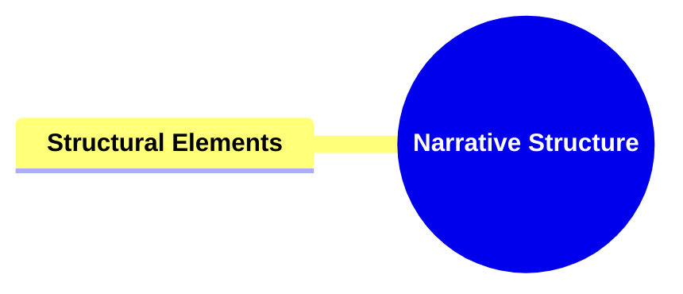

##### **Components of Structural Elements**

###### **Exposition**

- **Definition**:
  - The initial segment of the narrative where essential elements such as characters, setting, and the primary conflict are introduced.

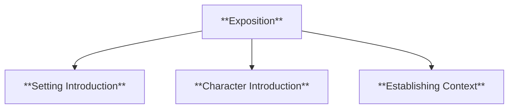

- **Characteristics**:
  - **Setting Introduction**: Establishes the time and place where the story unfolds.
  - **Character Introduction**: Introduces the main and supporting characters, providing insight into their backgrounds and motivations.
  - **Establishing Context**: Provides necessary background information that sets the stage for the ensuing narrative.

###### **Rising Action**

- **Definition**:
  - The series of events that escalate the central conflict, build tension, and develop characters, leading up to the climax.

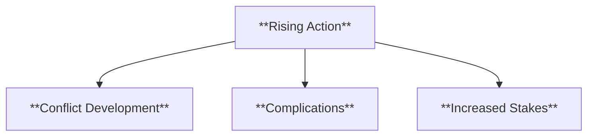

- **Characteristics**:
  - **Conflict Development**: Deepens the primary conflict, making it more complex and engaging.
  - **Complications**: Introduces obstacles and challenges that the protagonist must navigate.
  - **Increased Stakes**: Heightens the importance and consequences of the characters' actions, enhancing emotional investment.

###### **Climax**

- **Definition**:
  - The most intense and pivotal moment in the narrative where the main conflict reaches its peak, leading to a turning point in the story.

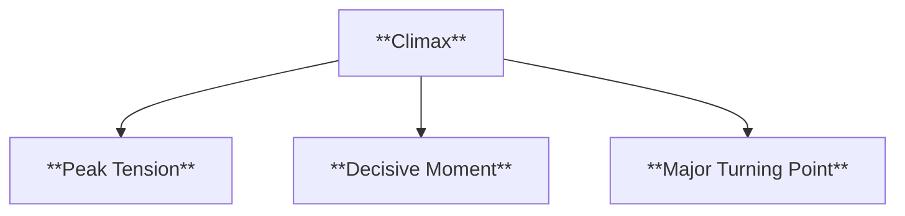

- **Characteristics**:
  - **Peak Tension**: The highest point of emotional intensity in the narrative.
  - **Decisive Moment**: A critical decision or action by the protagonist that influences the outcome of the story.
  - **Major Turning Point**: Marks a significant change in the direction of the narrative, often leading to resolution.

###### **Falling Action**

- **Definition**:
  - The events that follow the climax, leading towards the resolution by addressing the consequences of the climax and beginning to resolve the story's tensions.

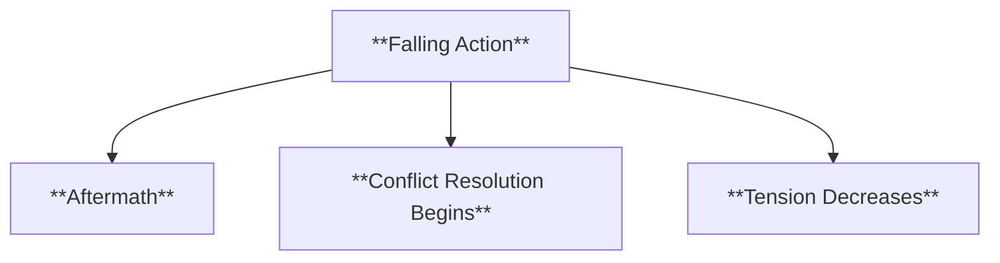

- **Characteristics**:
  - **Aftermath**: Explores the results and repercussions of the climax.
  - **Conflict Resolution Begins**: Initiates the process of resolving the main conflict and any subplots.
  - **Tension Decreases**: Gradually reduces the narrative tension as the story moves towards its conclusion.

###### **Resolution**

- **Definition**:
  - The concluding part of the narrative where all conflicts are resolved, and the story reaches a satisfying end.

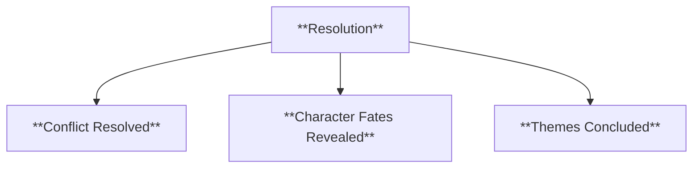

- **Characteristics**:
  - **Conflict Resolved**: Finalizes the resolution of the main and secondary conflicts.
  - **Character Fates Revealed**: Shows the outcomes and future paths of the characters.
  - **Themes Concluded**: Reinforces and concludes the central themes and messages of the narrative.

---

#### **Narrative Frameworks**

- **Definition**:
  - The overarching structures or models that guide the organization and progression of a narrative, providing a blueprint for storytelling.

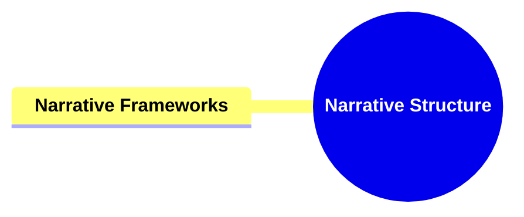

##### **Components of Narrative Frameworks**

###### **Linear Narrative**

- **Definition**:
  - A straightforward storytelling approach where events are presented in chronological order, following a clear beginning, middle, and end.

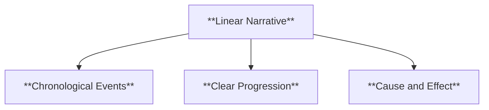

- **Characteristics**:
  - **Chronological Events**: Events unfold in the order they occur in time.
  - **Clear Progression**: The story moves logically from one event to the next, making it easy to follow.
  - **Cause and Effect**: Each event is a direct result of preceding events, establishing a clear relationship between actions and outcomes.

###### **Non-Linear Narrative**

- **Definition**:
  - A storytelling technique where events are depicted out of chronological order, often using flashbacks, flash-forwards, or parallel timelines to enhance the narrative.

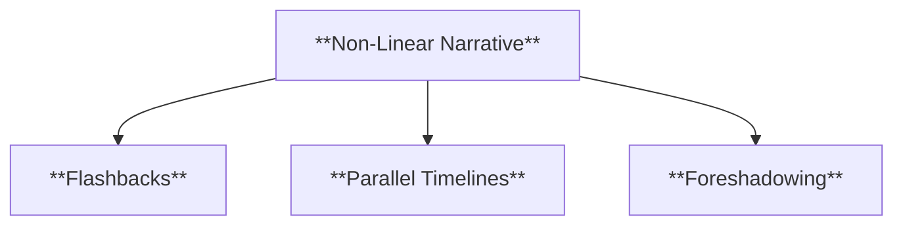

- **Characteristics**:
  - **Flashbacks**: Scenes set in a time earlier than the main story, providing background or context.
  - **Parallel Timelines**: Multiple storylines that run concurrently, intersecting at key points.
  - **Foreshadowing**: Hints or clues about events that will occur later in the narrative.

###### **Circular Narrative**

- **Definition**:
  - A narrative structure where the story ends where it began, creating a sense of closure and completeness by looping back to the starting point.

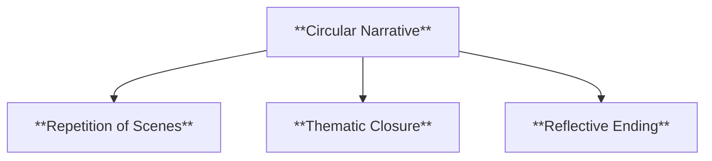

- **Characteristics**:
  - **Repetition of Scenes**: The beginning and end of the story mirror each other, reinforcing key themes or motifs.
  - **Thematic Closure**: The central themes are fully explored and resolved by the story's conclusion.
  - **Reflective Ending**: Encourages the audience to reflect on the narrative's journey and its underlying messages.

---

### **Theoretical Significance**

- **Importance of Narrative Structure**:
  - In the field of narratology, understanding narrative structure is pivotal for dissecting how stories are constructed and how they function to convey meaning. It provides a systematic approach to analyzing the components and frameworks that make narratives effective and engaging.
  - **Application in Narratological Analysis**: Scholars utilize narrative structures to examine the mechanics of storytelling, exploring how different elements and frameworks influence the audience's perception and interpretation of the narrative.
  - **Enhancing Narrative Comprehension**: A well-defined narrative structure aids in comprehending the progression and development of a story, facilitating a deeper appreciation of its artistic and thematic qualities.

---

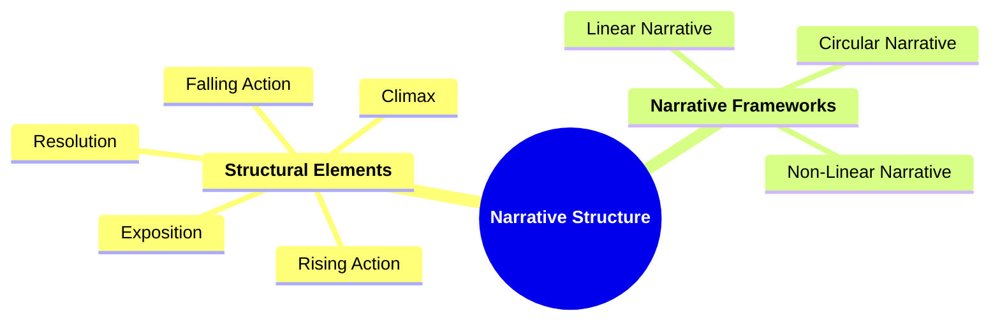

---
