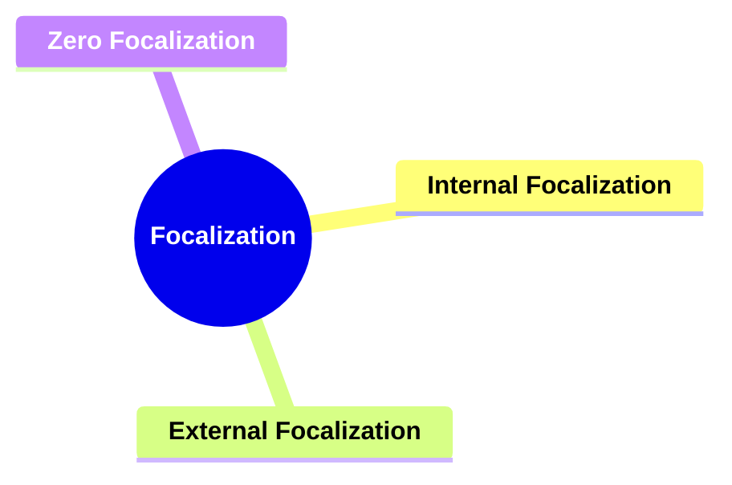
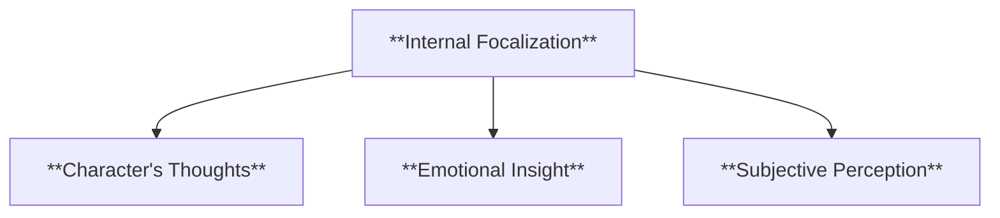
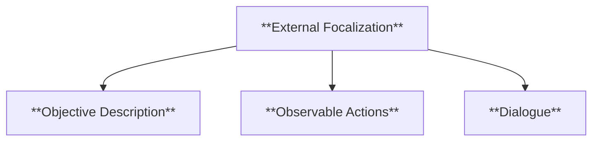
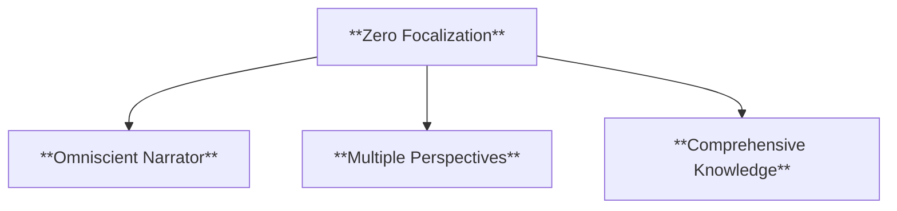
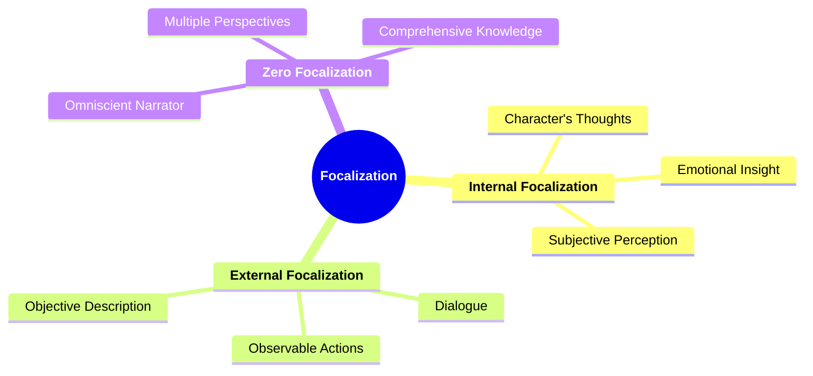

# 07 FO-3403 FOCALIZATION

### **Focalization**

- **Understanding through whose perspective the story is perceived.**
  - **Types**:
    - **Internal Focalization**
    - **External Focalization**
    - **Zero Focalization**
  - **Importance**: Analyzing the point of view and its influence on reader perception.

---

### **Key Concepts**

---

#### **Focalization**

- **Definition**:
  - In narratology, focalization refers to the perspective through which the events of a narrative are perceived and presented to the reader. It determines the amount of information available and influences the reader's understanding and interpretation of the story.

##### **Components of Focalization**

###### **Internal Focalization**

- **Definition**:
  - A focalization where the narrative perspective is confined to the thoughts, feelings, and perceptions of a particular character within the story. The reader experiences the narrative through this character's internal state.

- **Characteristics**:
  - **Character's Thoughts**: Provides direct access to the internal monologue of the focal character.
  - **Emotional Insight**: Reveals the emotional states and motivations driving the character's actions.
  - **Subjective Perception**: Presents events and other characters from the focal character's biased or limited viewpoint.

###### **External Focalization**

- **Definition**:
  - A focalization where the narrative perspective is limited to external observations without access to any character's inner thoughts or feelings. The reader perceives the story solely through actions, dialogues, and descriptions.

- **Characteristics**:
  - **Objective Description**: Narrator describes events and characters without interpreting their internal states.
  - **Observable Actions**: Focuses on what characters do rather than what they think or feel.
  - **Dialogue**: Relies on spoken interactions to convey information and character dynamics.

###### **Zero Focalization**

- **Definition**:
  - Also known as "omniscient focalization," zero focalization involves an all-knowing narrator who has access to the thoughts and feelings of all characters, as well as knowledge of events beyond the characters' awareness.

- **Characteristics**:
  - **Omniscient Narrator**: Possesses complete knowledge of the narrative world and its characters.
  - **Multiple Perspectives**: Can shift focus between different characters' viewpoints seamlessly.
  - **Comprehensive Knowledge**: Includes information about past, present, and future events, as well as unseen occurrences.

---

### **Theoretical Significance**

- **Analyzing Point of View**:

  - Focalization is essential in understanding how the point of view shapes the narrative. It determines the reliability of the information presented and influences the reader's alignment with characters.

- **Influence on Reader Perception**:

  - The type of focalization affects how readers perceive characters and events. Internal focalization can create empathy and a deep connection with a character, while external focalization maintains objectivity and allows for multiple interpretations.

- **Narrative Control**:

  - By choosing a specific focalization type, authors control the flow of information, create suspense, and guide the reader's emotional responses. Zero focalization offers a broad overview, whereas internal focalization provides intimate insights.

- **Enhancing Storytelling Techniques**:
  - Understanding focalization allows writers to experiment with different perspectives, enriching the narrative complexity and depth. It enables the exploration of themes from various angles and fosters a more engaging storytelling experience.

---

