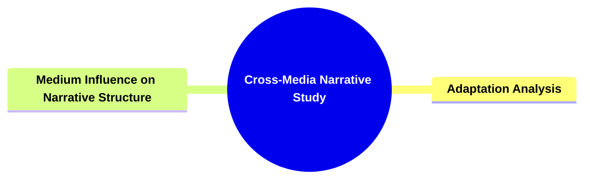
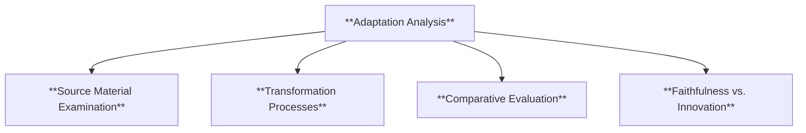
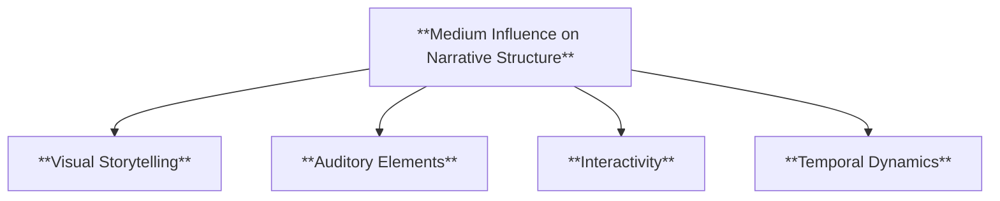
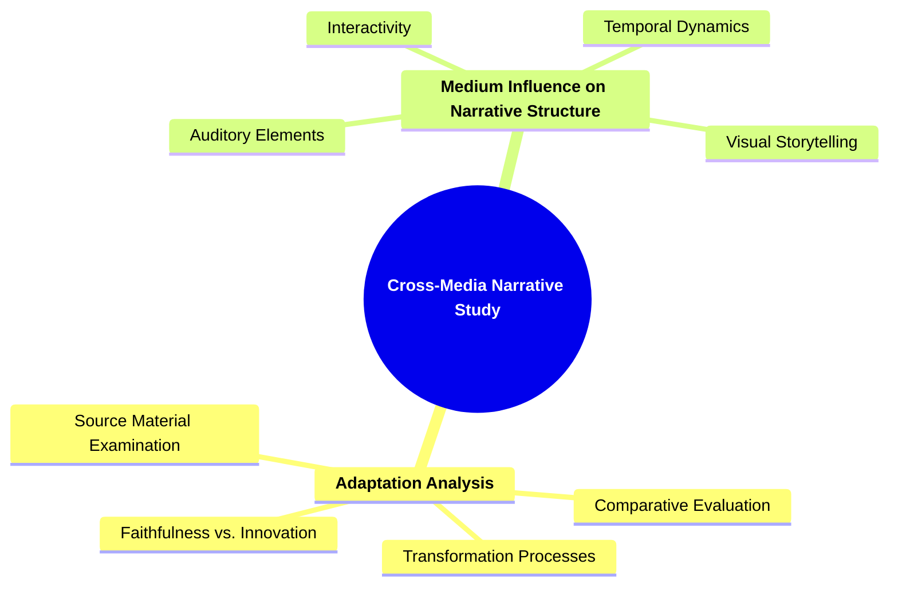

# 25 CMS-3703 CROSS-MEDIA NARRATIVE STUDY

### **Cross-Media Narrative Study**

- **Applying narratological concepts to narratives across different media.**
  - **Focus**:
    - **Adaptation Analysis**
    - **Medium Influence on Narrative Structure**
  - **Outcome**: Enhances understanding of medium-specific narrative techniques.

---

### **Key Concepts**

---

#### **Cross-Media Narrative Study**

- **Definition**:
  - In narratology, **cross-media narrative study** examines how narratives are adapted and transformed across various media platforms. This involves analyzing how different media forms—such as literature, film, television, video games, and digital media—impact the structure, presentation, and reception of stories. Cross-media narrative study seeks to understand the unique narrative techniques each medium offers and how these techniques influence the storytelling process and audience engagement.



````

##### **Components of Cross-Media Narrative Study**

###### **Adaptation Analysis**

- **Definition**:
  - **Adaptation analysis** involves studying how a narrative is transformed when it moves from one medium to another. This includes examining the changes in plot, character development, thematic emphasis, and stylistic elements that occur during the adaptation process. The goal is to understand how different media constraints and possibilities shape the storytelling and what remains consistent or altered across adaptations.



- **Characteristics**:
  - **Source Material Examination**: Analyzing the original narrative's elements, themes, and structure before adaptation.
  - **Transformation Processes**: Identifying the methods and changes applied to adapt the story to a different medium.
  - **Comparative Evaluation**: Comparing the original and adapted versions to assess differences and similarities.
  - **Faithfulness vs. Innovation**: Balancing fidelity to the source material with creative innovations introduced in the adaptation.

###### **Medium Influence on Narrative Structure**

- **Definition**:
  - **Medium influence on narrative structure** explores how the inherent properties and limitations of different media affect the organization and delivery of a narrative. This includes how visual, auditory, interactive, and temporal aspects of each medium shape storytelling techniques, pacing, and audience engagement.



- **Characteristics**:
  - **Visual Storytelling**: Utilization of imagery, cinematography, and visual effects to convey narrative elements.
  - **Auditory Elements**: Use of sound effects, music, and dialogue to enhance emotional and atmospheric aspects.
  - **Interactivity**: Incorporation of user participation and decision-making that influence the story's progression.
  - **Temporal Dynamics**: Management of time within the narrative, including pacing and the handling of flashbacks or real-time storytelling.

---

### **Theoretical Significance**

- **Enhancing Medium-Specific Understanding**:

  - Cross-media narrative study deepens the comprehension of how different media forms uniquely contribute to storytelling. By analyzing adaptations and medium-specific techniques, scholars can appreciate the diverse ways narratives are constructed and experienced.

- **Influence on Narrative Techniques**:

  - Understanding the impact of medium on narrative structure informs the development of innovative storytelling methods. It highlights how narrative techniques must adapt to leverage the strengths of each medium, fostering creativity and experimentation in narrative forms.

- **Facilitating Comprehensive Analysis**:

  - Cross-media narrative study allows for a more holistic analysis of narratives by considering multiple adaptations and media influences. This comprehensive approach uncovers patterns and variations in storytelling across different platforms, enriching narratological research.

- **Supporting Adaptation Practices**:

  - Insights from adaptation analysis guide creators in effectively translating stories across media. Understanding what elements are essential and how they can be transformed ensures that adaptations maintain the narrative's integrity while taking advantage of new media opportunities.

- **Promoting Audience Engagement**:

  - By exploring how different media influence narrative structure and delivery, cross-media narrative study contributes to enhancing audience engagement. It identifies effective strategies for captivating audiences across various platforms, ensuring that narratives resonate and remain impactful.

- **Encouraging Interdisciplinary Approaches**:
  - Cross-media narrative study bridges narratology with other disciplines such as media studies, cultural studies, and technology. This interdisciplinary approach fosters a richer and more nuanced understanding of how narratives operate within broader societal and technological contexts.

---


````
