- [1. **Tomashevsky's Plot vs. Story Framework**](#1-tomashevskys-plot-vs-story-framework)
- [2. **Key Concepts**](#2-key-concepts)
  - [2.1. **Fabula**](#21-fabula)
    - [2.1.1. **Components of Fabula**](#211-components-of-fabula)
      - [2.1.1.1. **Chronological Events**:](#2111-chronological-events)
      - [2.1.1.2. **Causality**:](#2112-causality)
      - [2.1.1.3. **Continuity**:](#2113-continuity)
      - [2.1.1.4. **Independence from Presentation**:](#2114-independence-from-presentation)
  - [2.2. **Sjuzhet**](#22-sjuzhet)
    - [2.2.1. **Components of Sjuzhet**](#221-components-of-sjuzhet)
      - [2.2.1.1. **Narrative Order**:](#2211-narrative-order)
      - [2.2.1.2. **Flashbacks (Analepsis)**:](#2212-flashbacks-analepsis)
      - [2.2.1.3. **Flashforwards (Prolepsis)**:](#2213-flashforwards-prolepsis)
      - [2.2.1.4. **In Media Res**:](#2214-in-media-res)
  - [2.3. **Pacing**](#23-pacing)
    - [2.3.1. **Components of Pacing**](#231-components-of-pacing)
      - [2.3.1.1. **Scene Length**:](#2311-scene-length)
      - [2.3.1.2. **Sentence Structure**:](#2312-sentence-structure)
  - [2.4. **Selective Information Disclosure**](#24-selective-information-disclosure)
    - [2.4.1. **Components of Selective Information Disclosure**](#241-components-of-selective-information-disclosure)
      - [2.4.1.1. **Withholding Information**:](#2411-withholding-information)
      - [2.4.1.2. **Dramatic Irony**:](#2412-dramatic-irony)
- [3. **Theoretical Significance**](#3-theoretical-significance)

---

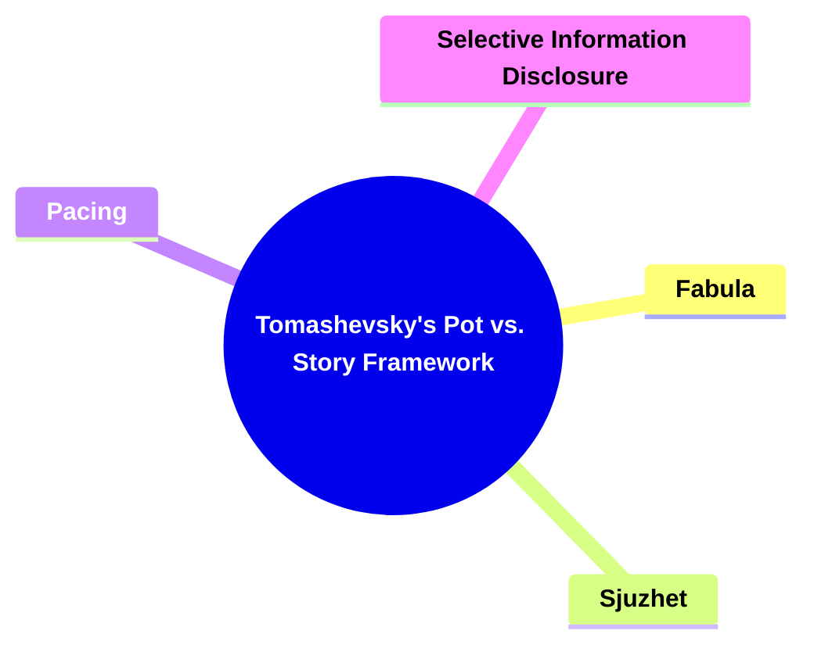

---

### 1. **Tomashevsky's Plot vs. Story Framework**

- **Plot vs. Story**:
  - **Definition**: Building on Formalist approaches, particularly those of Vladimir Propp, Boris Tomashevsky distinguishes between _fabula_ (story) and _sjuzhet_ (plot). Each term serves different functions within narrative analysis, with _fabula_ representing the raw chronological sequence of events and _sjuzhet_ referring to how those events are presented or arranged artistically.

---

### 2. **Key Concepts**

#### 2.1. **Fabula**

- **Definition**:
  - _Fabula_ refers to the chronological, logical sequence of events as they unfold in the narrative world. It is the story in its most basic, unmanipulated form, detailing events in the order in which they would happen in real time.

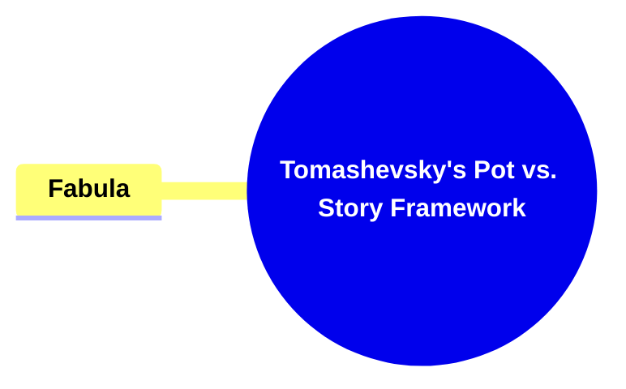

##### 2.1.1. **Components of Fabula**

###### 2.1.1.1. **Chronological Events**:

- **Definition**: The sequence of events presented in the order they actually occur in the story’s timeline.

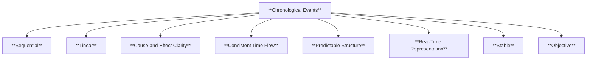

- **Characteristics**:
  - **Sequential**: The events follow a strict temporal order.
  - **Linear**: Events proceed in a logical, unaltered sequence from beginning to end.
  - **Cause-and-Effect Clarity**: The relationship between events is easy to follow, with each action leading clearly to the next.
  - **Consistent Time Flow**: Time progresses at a steady pace without jumps, flashbacks, or interruptions.
  - **Predictable Structure**: The audience can anticipate the sequence of events as they occur in a straightforward manner.
  - **Real-Time Representation**: Events unfold as they would naturally in real time, preserving the actual chronology of the story's world.
  - **Stable**: There are no narrative disruptions or manipulations of time, allowing for a continuous and coherent timeline.
  - **Objective**: The narrative doesn't play with the audience's perception of time, sticking strictly to the order of events.

###### 2.1.1.2. **Causality**:

- **Definition**: Causality refers to the logical relationship between events in a narrative, where one event directly leads to another through cause and effect.

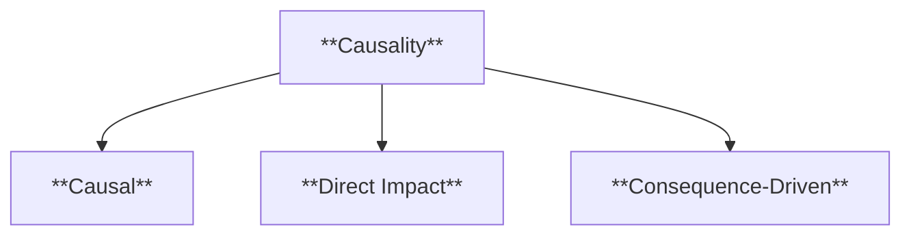

- **Characteristics**:
  - **Causal**: Events are connected by clear cause-and-effect relationships.
  - **Direct Impact**: One event directly influences the occurrence of the next.
  - **Consequence-Driven**: Each action or decision in the narrative has tangible consequences for future events.

###### 2.1.1.3. **Continuity**:

- **Definition**: Continuity refers to the unbroken flow of events within a narrative, ensuring that each event naturally follows from the previous one without disruption.

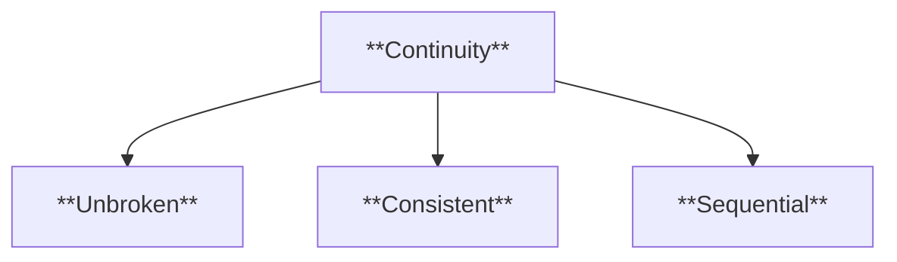

- **Characteristics**:
  - **Unbroken**: Each event naturally follows from the one before it, maintaining a seamless progression.
  - **Consistent**: Ensures that the narrative remains coherent and logical throughout its progression.
  - **Sequential**: Events are presented in a logical sequence that preserves the integrity of the story.

###### 2.1.1.4. **Independence from Presentation**:

- **Definition**: The _fabula_ exists independently of how it is told, remaining constant regardless of the order or style in which it is narrated.

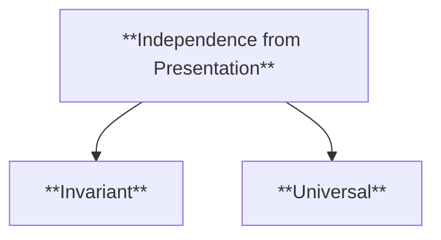

- **Characteristics**:
  - **Invariant**: The underlying sequence remains unchanged no matter how the story is told.
  - **Universal**: The same fabula can be used across multiple adaptations or retellings.

---

#### 2.2. **Sjuzhet**

- **Definition**:
  - _Sjuzhet_ refers to the way the fabula is presented, often manipulating the chronological order for artistic, thematic, or emotional effects. It shapes how the audience experiences the story.


##### 2.2.1. **Components of Sjuzhet**

###### 2.2.1.1. **Narrative Order**:

- **Definition**: The arrangement of events in the narrative, which may not match their chronological sequence.

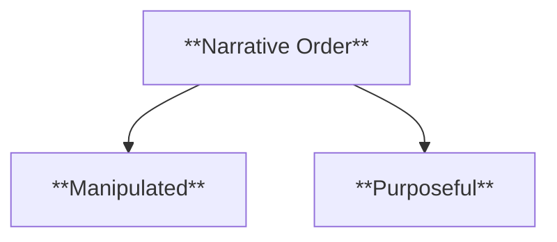

- **Characteristics**:
  - **Manipulated**: Events are deliberately re-ordered for specific effects.
  - **Purposeful**: The presentation enhances themes, character development, or audience engagement.

###### 2.2.1.2. **Flashbacks (Analepsis)**:

- **Definition**: A technique where the narrative shifts backward in time to reveal past events that provide context or deepen the story.

```mermaid
flowchart TD
    A[**Flashbacks (Analepsis)**]
    A --> B[**Retrospective**]
    A --> C[**Explanatory**]
```

- **Characteristics**:
  - **Retrospective**: Provides insight into past events that impact the present.
  - **Explanatory**: Fills in gaps in the audience’s understanding of characters or plot.

###### 2.2.1.3. **Flashforwards (Prolepsis)**:

- **Definition**: The projection of the narrative into the future, revealing events that occur after the present timeline.

```mermaid
flowchart TD
    A[**Flashforwards (Prolepsis)**]
    A --> B[**Anticipatory**]
    A --> C[**Thematic**]
```

- **Characteristics**:
  - **Anticipatory**: Reveals future events that shape the current narrative.
  - **Thematic**: Often used to underscore larger thematic messages about fate or inevitability.

###### 2.2.1.4. **In Media Res**:

- **Definition**: Beginning the narrative in the middle of the action, with context and background filled in later.

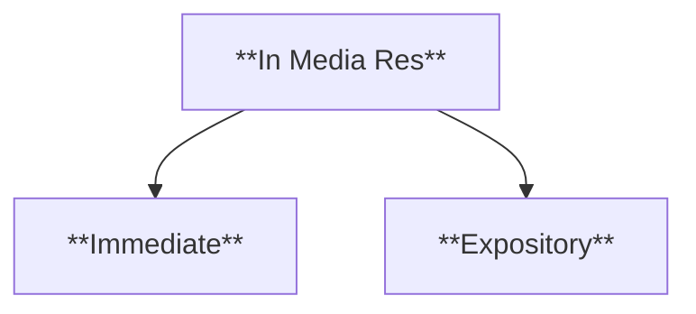

- **Characteristics**:
  - **Immediate**: Thrusts the audience directly into the middle of the conflict.
  - **Expository**: Background information is gradually revealed as the story progresses.

---

#### 2.3. **Pacing**

- **Definition**:
  - The speed at which events are presented within the _sjuzhet_, influencing how quickly or slowly the audience experiences the narrative.


##### 2.3.1. **Components of Pacing**

###### 2.3.1.1. **Scene Length**:

- **Definition**: The duration of specific scenes or sequences, which can either quicken or slow the narrative flow.

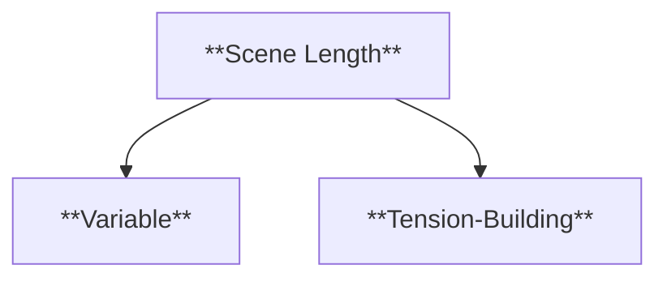

- **Characteristics**:
  - **Variable**: Scene lengths can fluctuate, depending on the intended emotional impact.
  - **Tension-Building**: Longer scenes often create suspense or introspection.

###### 2.3.1.2. **Sentence Structure**:

- **Definition**: The use of different sentence lengths and patterns to control the pace at which the audience reads or absorbs information.

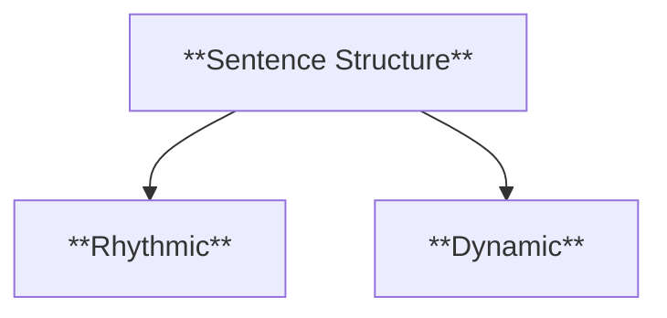

- **Characteristics**:
  - **Rhythmic**: Sentence structures establish the narrative’s tempo.
  - **Dynamic**: Varying sentence lengths enhance the emotional and intellectual engagement of the reader.

---

#### 2.4. **Selective Information Disclosure**

- **Definition**:
  - The intentional release or withholding of information within the _sjuzhet_, designed to influence how the audience perceives the narrative at different stages.

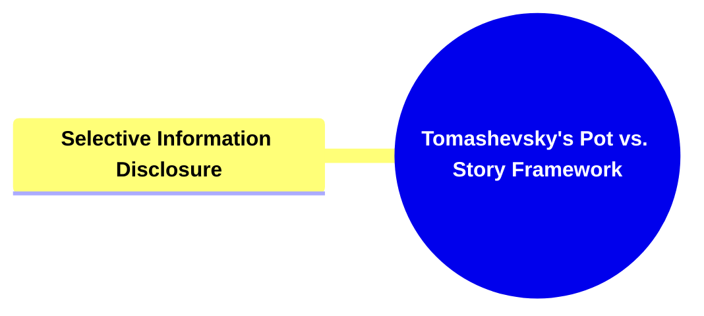

##### 2.4.1. **Components of Selective Information Disclosure**

###### 2.4.1.1. **Withholding Information**:

- **Definition**: The delay in revealing certain details or truths, creating suspense or mystery.

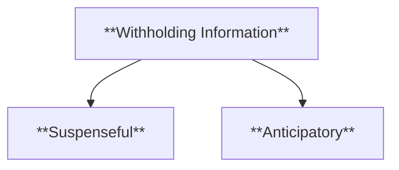

- **Characteristics**:
  - **Suspenseful**: Holds back key information to maintain audience engagement.
  - **Anticipatory**: Builds the audience’s expectations for a later reveal.

###### 2.4.1.2. **Dramatic Irony**:

- **Definition**: A situation where the audience knows more about the events of the narrative than the characters, creating tension and emotional depth.

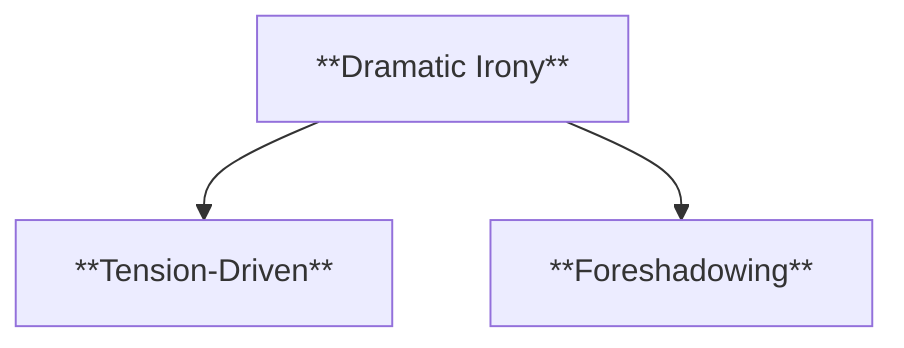

- **Characteristics**:
  - **Tension-Driven**: The gap between character knowledge and audience awareness intensifies emotions.
  - **Foreshadowing**: Often used to hint at inevitable future events or consequences.

### 3. **Theoretical Significance**

- **Impact on Narrative Theory**:

  - Tomashevsky’s framework provides a vital distinction between the raw material of a story (_fabula_) and the artistic construction of the plot (_sjuzhet_). This separation allows scholars to analyze not only what happens in a story but also how its presentation influences meaning, engagement, and emotional impact.

- **Application in Literary and Media Studies**:
  - Tomashevsky’s ideas have broad applications across literary criticism, film studies, and even game design. Understanding how the _fabula_ is transformed into a _sjuzhet_ is crucial for analyzing complex narratives where chronology is manipulated or fragmented for artistic purposes.

---

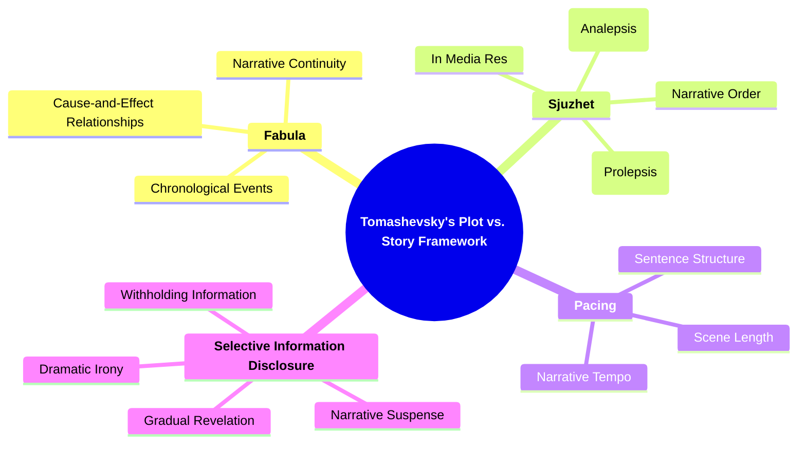
