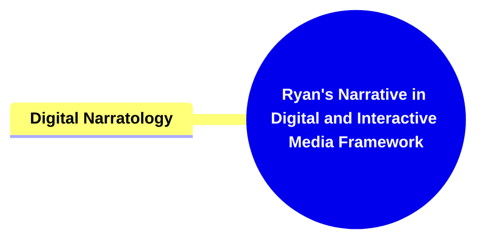
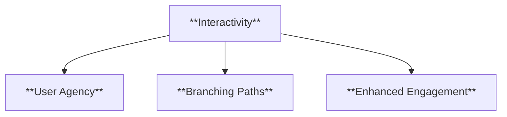
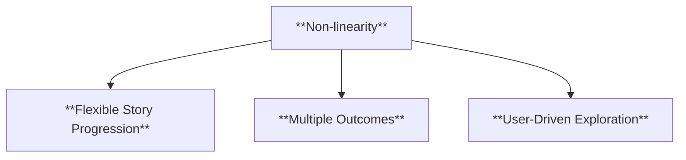
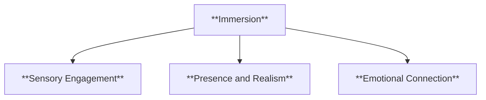
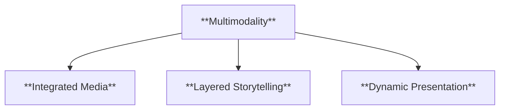
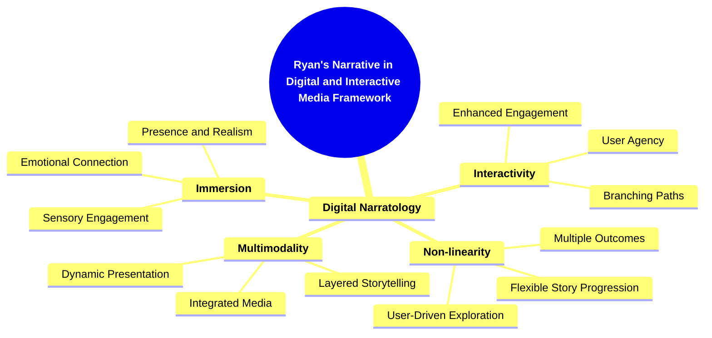

- [1. Title: **Ryan's Narrative in Digital and Interactive Media Framework**](#1-title-ryans-narrative-in-digital-and-interactive-media-framework)
- [2. Key Concepts](#2-key-concepts)
  - [2.1. Digital Narratology](#21-digital-narratology)
    - [2.1.1. **Components of Digital Narratology**](#211-components-of-digital-narratology)
      - [2.1.1.1. **Interactivity**](#2111-interactivity)
      - [2.1.1.2. **Non-linearity**](#2112-non-linearity)
      - [2.1.1.3. **Immersion**](#2113-immersion)
      - [2.1.1.4. **Multimodality**](#2114-multimodality)
- [3. Implications of Narrative in Digital and Interactive Media](#3-implications-of-narrative-in-digital-and-interactive-media)

---

---

### 1. Title: **Ryan's Narrative in Digital and Interactive Media Framework**

**Narrative in Digital and Interactive Media**:
**Definition**: Marie-Laure Ryan has been a pioneering figure in the study of narrative as it evolves within digital and interactive media. Her work contributes significantly to the development of frameworks for analyzing how narratives operate in contexts such as video games, hypertexts, and other digital environments. Ryan’s framework examines how these new forms of media challenge traditional narrative structures and introduce innovative possibilities for storytelling. She explores the unique ways in which digital narratives engage audiences, adapt to user interactions, and expand the boundaries of what constitutes a narrative.

---

### 2. Key Concepts

#### 2.1. Digital Narratology

**Definition**:
Digital narratology, as shaped by Ryan’s work, is a field that explores how narrative forms are adapted and transformed in digital media. This includes the study of interactive narratives, where the audience's choices influence the story's progression, as well as non-linear narratives that defy traditional storytelling conventions. Digital narratology seeks to understand the specific mechanisms through which digital environments create and convey narratives, and how these mechanisms differ from those in print or traditional media.

##### 2.1.1. **Components of Digital Narratology**

###### 2.1.1.1. **Interactivity**

- **Definition**: Digital narratives often allow the audience to make choices that affect the narrative outcome, leading to a personalized and dynamic experience.

- **Characteristics**
  - **User Agency**: Empowers the audience to influence the direction and outcome of the story.
  - **Branching Paths**: Offers multiple storylines or endings based on user decisions, making each experience unique.
  - **Enhanced Engagement**: Keeps users invested as they actively participate in shaping the narrative.

###### 2.1.1.2. **Non-linearity**

- **Definition**: Many digital narratives break away from the linear storytelling structure, allowing multiple paths or endings based on user decisions.

- **Characteristics**
  - **Flexible Story Progression**: Allows users to explore different parts of the narrative in various orders.
  - **Multiple Outcomes**: Provides diverse story conclusions, increasing replayability and depth.
  - **User-Driven Exploration**: Encourages audiences to navigate the story at their own pace, discovering plot points as they choose.

###### 2.1.1.3. **Immersion**

- **Definition**: Advanced digital narratives aim to fully immerse the audience in the narrative, particularly through technologies like virtual reality.

- **Characteristics**
  - **Sensory Engagement**: Utilizes sound, visuals, and interactive elements to draw the audience into the story world.
  - **Presence and Realism**: Creates a feeling of being inside the narrative, enhancing the experience through realistic simulations.
  - **Emotional Connection**: Deepens the audience’s emotional investment by making the narrative more lifelike and interactive.

###### 2.1.1.4. **Multimodality**

- **Definition**: These narratives often combine text, audio, video, and interactive elements to create a rich, multifaceted experience.

- **Characteristics**
  - **Integrated Media**: Blends different forms of media to convey the story, offering a comprehensive sensory experience.
  - **Layered Storytelling**: Uses various modalities to provide depth and context, enriching the narrative.
  - **Dynamic Presentation**: Keeps the audience engaged by varying how the story is delivered and interacted with.

### 3. Implications of Narrative in Digital and Interactive Media

**Redefining Narrative Forms**:
Ryan’s framework is instrumental in redefining what constitutes a narrative in digital contexts. It expands traditional narrative theory by introducing concepts such as interactivity, immersion, and multimodality, which are essential for understanding storytelling in digital environments.

**Collaborative or Future-Oriented Insight**:
Her insights have significant implications across various fields, including media studies, game studies, and virtual reality development. Future research can continue to explore how digital narratives innovate storytelling and challenge existing paradigms, opening up new possibilities for interactive and immersive storytelling experiences.

---

