- [1. **Title: Abbott's Narrative Perspective Framework**](#1-title-abbotts-narrative-perspective-framework)
- [2. **Key Concepts**](#2-key-concepts)
  - [2.1. **Focalization (Who Sees)**](#21-focalization-who-sees)
    - [2.1.1. **Components of Focalization**:](#211-components-of-focalization)
      - [2.1.1.1. **Internal Focalization**](#2111-internal-focalization)
      - [2.1.1.2. **External Focalization**](#2112-external-focalization)
      - [2.1.1.3. **Variable Focalization**](#2113-variable-focalization)
  - [2.2. **Narrative Voice (Who Speaks)**](#22-narrative-voice-who-speaks)
    - [2.2.1. **Components of Narrative Voice (Who Speaks)**:](#221-components-of-narrative-voice-who-speaks)
      - [2.2.1.1. **First-Person Narration**](#2211-first-person-narration)
      - [2.2.1.2. **Third-Person Narration**](#2212-third-person-narration)
      - [2.2.1.3. **Omniscient Narration**](#2213-omniscient-narration)
      - [2.2.1.4. **Unreliable Narration**](#2214-unreliable-narration)
- [3. **Implications of Narrative Perspective**](#3-implications-of-narrative-perspective)

---

### 1. **Title: Abbott's Narrative Perspective Framework**

**Narrative Perspective**:
   **Definition**: H. Porter Abbott’s *Narrative Perspective Framework* explores the critical aspects of storytelling, focusing on *focalization* (who sees) and *narrative voice* (who speaks). These elements guide how stories are constructed and influence the reader’s experience and interpretation. Abbott’s framework provides tools to analyze narrative techniques that shape the perspective from which a story is told and the impact of that perspective on the narrative's meaning.

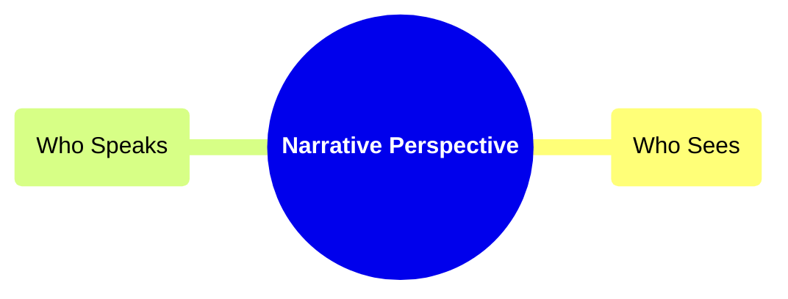

---

### 2. **Key Concepts**

#### 2.1. **Focalization (Who Sees)**

**Definition**:
   Focalization refers to the lens through which the events of a narrative are perceived, determining who sees or experiences the events. It shapes the reader’s understanding by controlling what is seen, known, and experienced in the story.

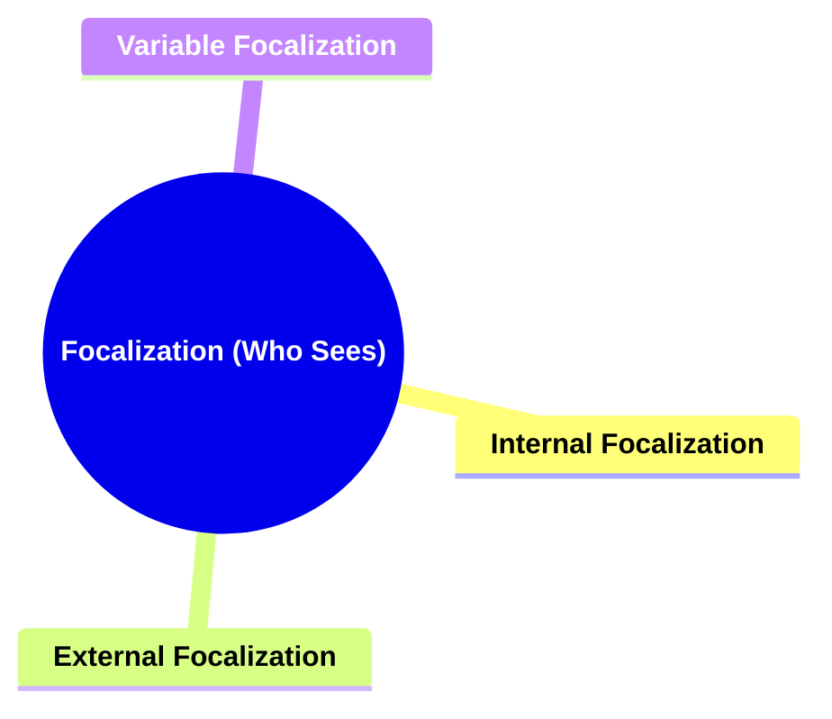

##### 2.1.1. **Components of Focalization**:

###### 2.1.1.1. **Internal Focalization**
  - **Definition**: The narrative is presented through the eyes of a character, providing direct access to their thoughts, feelings, and perceptions.

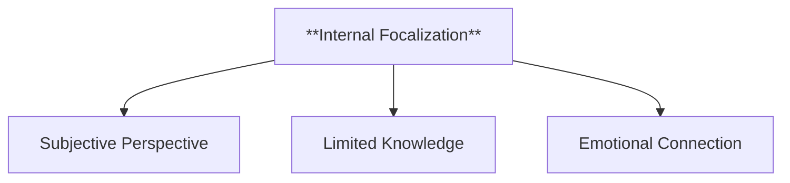

  - **Characteristics**:
    - **Subjective Perspective**: The story is filtered through the internal experiences of the focal character, giving readers insight into their emotions, desires, and motivations.
    - **Limited Knowledge**: Readers are restricted to what the focal character knows or perceives, which can create tension or uncertainty as the character navigates the plot.
    - **Emotional Connection**: Internal focalization fosters a deeper emotional bond between the reader and the character, as the reader is privy to their internal struggles and thoughts.

---

###### 2.1.1.2. **External Focalization**
  - **Definition**: The narrative is observed from an outside perspective without access to the inner thoughts or emotions of the characters.

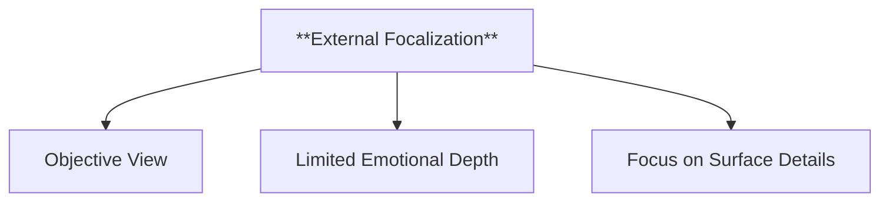

  - **Characteristics**:
    - **Objective View**: The narrator provides a detached, external view of events, describing what is observable without offering insight into the characters’ inner worlds.
    - **Limited Emotional Depth**: Since the characters' internal thoughts and feelings are not revealed, the narrative remains emotionally distant, relying on dialogue and actions to convey meaning.
    - **Focus on Surface Details**: External focalization emphasizes observable details—such as actions, settings, and interactions—giving readers a clear picture of the external world of the narrative.

---

###### 2.1.1.3. **Variable Focalization**
  - **Definition**: The perspective shifts between different characters or entities throughout the story, providing a broader view of the narrative.

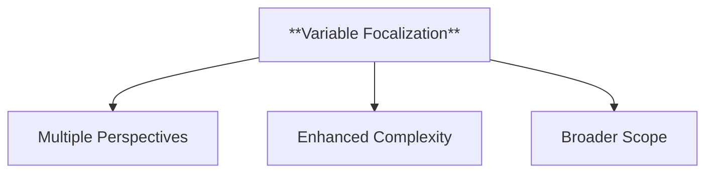

  - **Characteristics**:
    - **Multiple Perspectives**: The narrative alternates between different characters, allowing the reader to gain insight into various experiences, thoughts, and emotions.
    - **Enhanced Complexity**: By shifting focalization, the narrative can reveal contradictions, conflicts, or differing interpretations of the same event.
    - **Broader Scope**: Variable focalization offers a more expansive view of the narrative world, as the reader is not limited to a single character's perspective.

---

#### 2.2. **Narrative Voice (Who Speaks)**

**Definition**:
   Narrative voice refers to the persona or entity narrating the story, determining the perspective from which it is told.

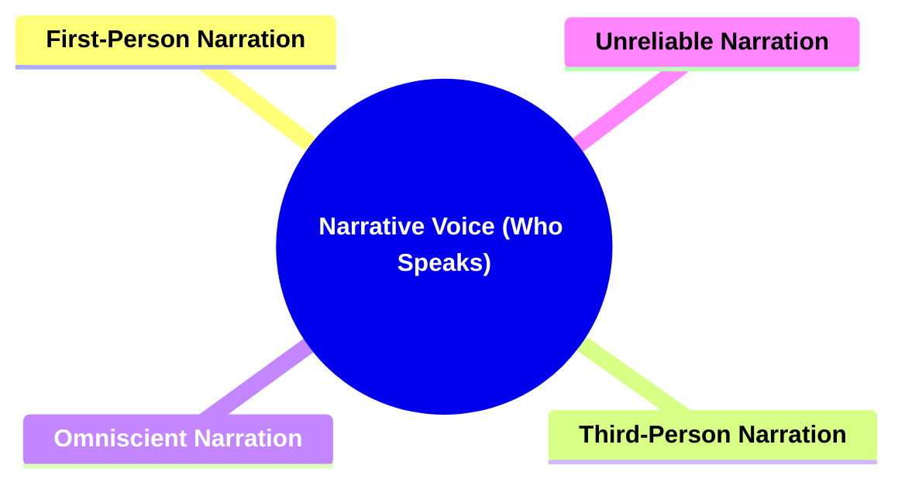

##### 2.2.1. **Components of Narrative Voice (Who Speaks)**:

###### 2.2.1.1. **First-Person Narration**
  - **Definition**: A character within the story narrates, offering a subjective account of events.

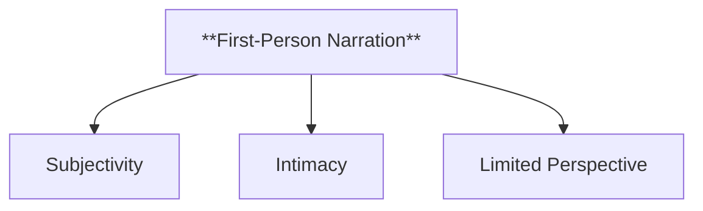

  - **Characteristics**:
    - **Subjectivity**: The narrative is filtered through the personal emotions, thoughts, and perceptions of the narrator.
    - **Intimacy**: First-person narration fosters a close bond between the reader and the narrator.
    - **Limited Perspective**: The story is confined to what the narrator knows and experiences, which may lead to a narrower, biased, or incomplete understanding of the events.

---

###### 2.2.1.2. **Third-Person Narration**
  - **Definition**: An external narrator provides a detached perspective.

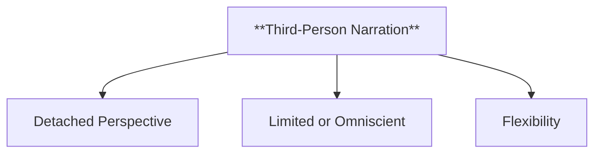

  - **Characteristics**:
    - **Detached Perspective**: The narrator exists outside the story, observing and recounting events without direct involvement.
    - **Limited or Omniscient**: Third-person narration can either be limited to the thoughts and experiences of one character or omniscient.
    - **Flexibility**: This narrative can focus on a single character or shift across multiple characters and settings.

---

###### 2.2.1.3. **Omniscient Narration**
  - **Definition**: The narrator has access to all characters’ thoughts, motivations, and experiences.

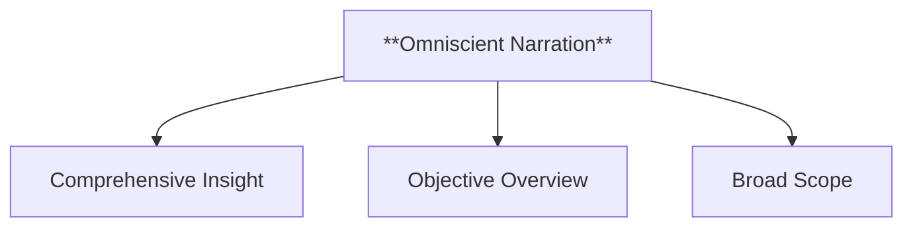

  - **Characteristics**:
    - **Comprehensive Insight**: The narrator knows everything about all the characters, including their thoughts, emotions, and motivations.
    - **Objective Overview**: Omniscient narration can offer an unbiased, all-encompassing view of events.
    - **Broad Scope**: This narrative style can cover multiple characters and subplots.

---

###### 2.2.1.4. **Unreliable Narration**
  - **Definition**: A narrator whose account may be biased, misleading, or incomplete.

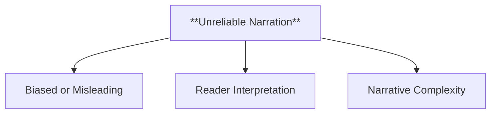

  - **Characteristics**:
    - **Biased or Misleading**: The narrator may intentionally or unintentionally distort events.
    - **Reader Interpretation**: Unreliable narration requires readers to engage critically with the text.
    - **Narrative Complexity**: This type of narration adds layers of complexity to the story.

---

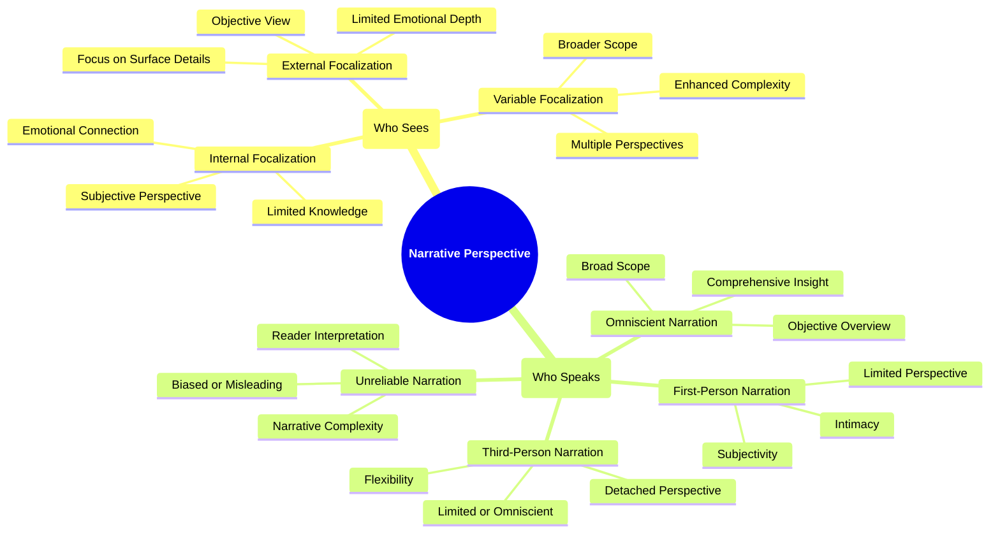

---

### 3. **Implications of Narrative Perspective**

**Impact on Narrative Theory**:
   Abbott’s *Narrative Perspective Framework* has made significant contributions to narrative theory by offering a structured approach to understanding the interplay between focalization and narrative voice. This framework reveals how stories are shaped by the relationship between who sees and who speaks, influencing readers' emotional engagement and intellectual interpretation.

**Application Across Genres and Media**:
   While initially developed for literary analysis, Abbott’s concepts apply across various narrative forms, including film, television, and digital media. Techniques such as camera angles and voice-over narration in film parallel focalization and narrative voice in literature, providing valuable tools for understanding perspective across media.

**Supporting Information**:
   - **Interdisciplinary Influence**: Abbott’s framework has influenced film studies, psychology, and communication, where perspective and voice are central to how narratives are constructed and interpreted.
   - **Critiques and Further Development**: Some critics argue that focalization and voice can blur in complex narratives. However, Abbott’s framework remains foundational for studying how stories guide reader interpretation and experience.

---
