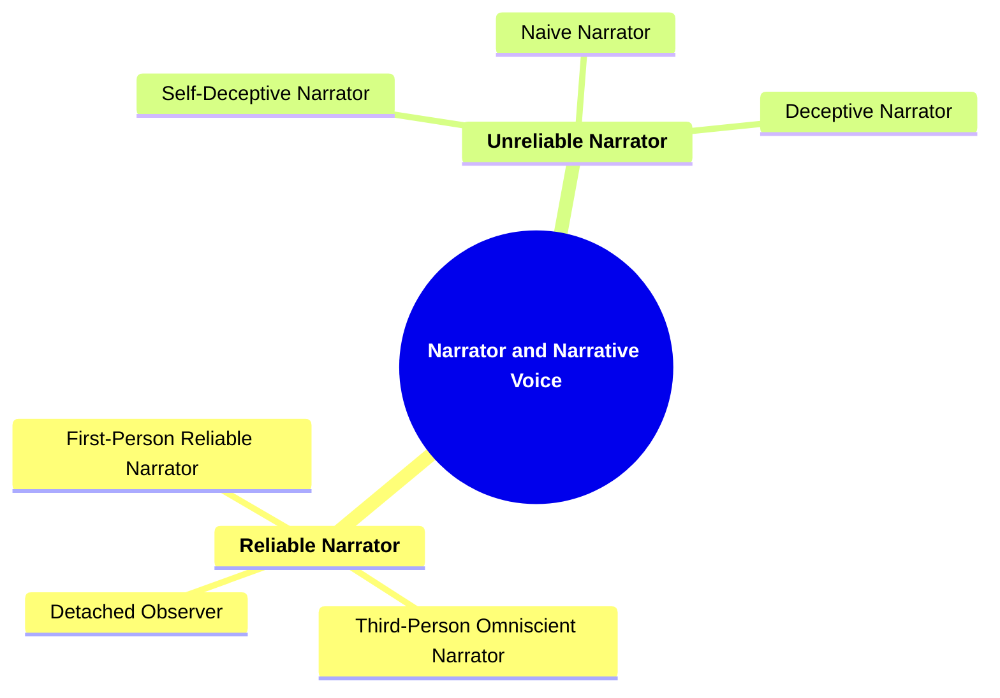
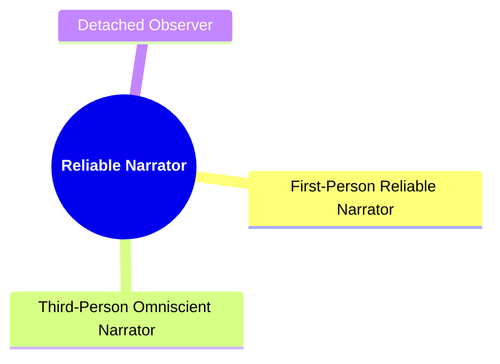
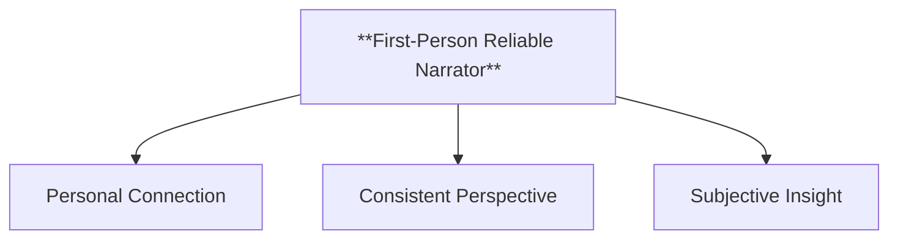
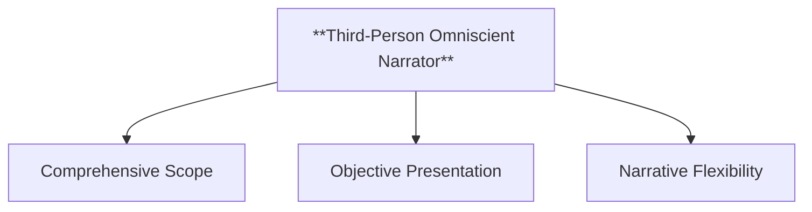
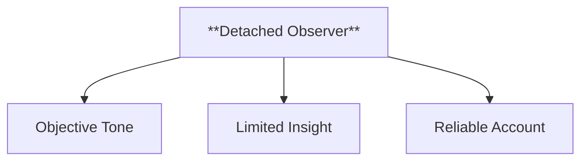
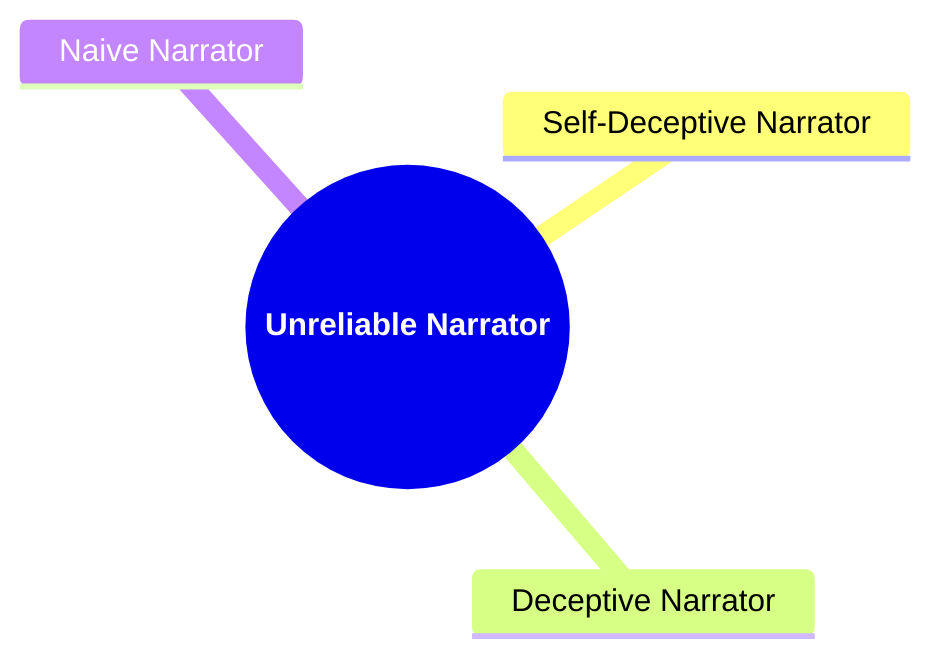
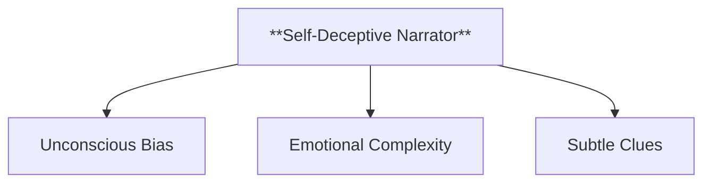
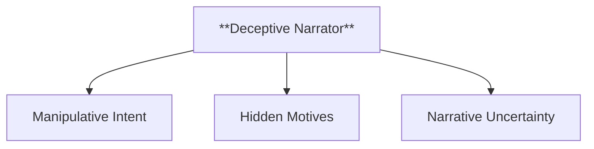
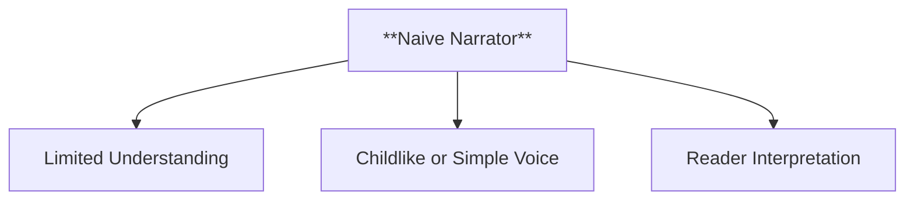
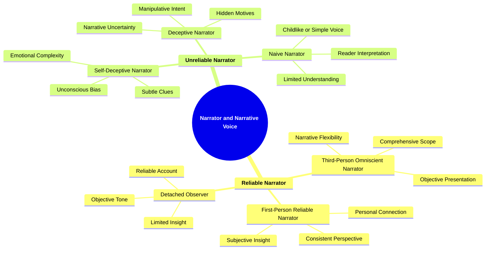

- [1. **Title: Booth's Narrator and Narrative Voice Framework**](#1-title-booths-narrator-and-narrative-voice-framework)
- [2. **Key Concepts**](#2-key-concepts)
  - [2.1. **Reliable Narrator**](#21-reliable-narrator)
    - [2.1.1. **Components of Reliable Narrator**](#211-components-of-reliable-narrator)
      - [2.1.1.1. **First-Person Reliable Narrator**](#2111-first-person-reliable-narrator)
      - [2.1.1.2. **Third-Person Omniscient Narrator**](#2112-third-person-omniscient-narrator)
      - [2.1.1.3. **Detached Observer**](#2113-detached-observer)
  - [2.2. **Unreliable Narrator**](#22-unreliable-narrator)
    - [2.2.1. **Components of Unreliable Narrator**](#221-components-of-unreliable-narrator)
      - [2.2.1.1. **Self-Deceptive Narrator**](#2211-self-deceptive-narrator)
      - [2.2.1.2. **Deceptive Narrator**](#2212-deceptive-narrator)
      - [2.2.1.3. **Naive Narrator**](#2213-naive-narrator)
- [3. Implications of **Narrator and Narrative Voice**](#3-implications-of-narrator-and-narrative-voice)

---
### 1. **Title: Booth's Narrator and Narrative Voice Framework**

**Narrator and Narrative Voice**:
   **Definition**: Wayne C. Booth’s analysis of narrative voice is a foundational contribution to the field of narratology, particularly in understanding how different types of narrators influence a reader's interpretation of a story. Booth distinguishes between *reliable* and *unreliable narrators*, offering a framework for analyzing how these narrators affect the credibility of the narrative and the reader’s engagement with the text. His work sheds light on the role of the narrator in shaping the narrative’s moral and thematic direction, and how the reader interacts with and interprets the story based on the narrator’s reliability.

---

### 2. **Key Concepts**

#### 2.1. **Reliable Narrator**

**Definition**:
   A reliable narrator is one whose account of events is trustworthy, coherent, and generally aligns with the values or intentions of the implied author—the version of the author inferred by the reader from the text. The reader can accept the reliable narrator’s perspective as accurate and truthful, without needing to question the validity of the information presented.

##### 2.1.1. **Components of Reliable Narrator**

###### 2.1.1.1. **First-Person Reliable Narrator**
- **Definition**: Presents events subjectively but consistently aligned with the moral tone of the narrative.

  - **Characteristics**
    - **Personal Connection**: Engages readers with an intimate and empathetic view.
    - **Consistent Perspective**: Maintains dependable alignment with story's moral framework.
    - **Subjective Insight**: Gives an honest, story-contextual representation.

---

###### 2.1.1.2. **Third-Person Omniscient Narrator**
- **Definition**: Offers a complete, objective view of events and characters.

  - **Characteristics**
    - **Comprehensive Scope**: Covers thoughts and motives of multiple characters.
    - **Objective Presentation**: Presents facts impartially.
    - **Narrative Flexibility**: Moves fluidly across characters and scenes.

---

###### 2.1.1.3. **Detached Observer**
- **Definition**: Presents facts and events from a distance, remaining neutral but reliable.

  - **Characteristics**
    - **Objective Tone**: Offers a neutral account.
    - **Limited Insight**: Observes only externally visible events, adding mystery.
    - **Reliable Account**: Provides straightforward, unbiased information.

---

#### 2.2. **Unreliable Narrator**

**Definition**:
   An unreliable narrator is one who provides a biased, misleading, or distorted account of events. This type of narrator may intentionally deceive the reader, be self-deceptive, or lack the necessary knowledge to provide a truthful account. The reader must critically evaluate the narrative, often questioning the truthfulness and accuracy of the narrator’s version of the story.

##### 2.2.1. **Components of Unreliable Narrator**

###### 2.2.1.1. **Self-Deceptive Narrator**
- **Definition**: Believes in their own misrepresentation of the truth.

  - **Characteristics**
    - **Unconscious Bias**: Reflects distorted self-perception unknowingly.
    - **Emotional Complexity**: Adds depth by showing internal struggles.
    - **Subtle Clues**: Hints reveal inconsistencies in their account.

---

###### 2.2.1.2. **Deceptive Narrator**
- **Definition**: Intentionally manipulates the truth to deceive the reader.

  - **Characteristics**
    - **Manipulative Intent**: Distorts information to mislead.
    - **Hidden Motives**: Driven by personal or secret agendas.
    - **Narrative Uncertainty**: Creates suspense as the true story unfolds.

---

###### 2.2.1.3. **Naive Narrator**
- **Definition**: Lacks awareness or understanding, leading to an incomplete or incorrect portrayal of events.

  - **Characteristics**
    - **Limited Understanding**: Shows innocent or simplistic views due to inexperience.
    - **Childlike or Simple Voice**: Reflects lack of awareness, adding charm or poignancy.
    - **Reader Interpretation**: Requires readers to infer the full story.

---

---

### 3. Implications of **Narrator and Narrative Voice**

**Impact on Narrative Theory**:
   Booth’s Narrator and Narrative Voice Framework has had a profound impact on narrative theory, particularly in understanding how the reliability of the narrator influences the reader’s interpretation of a text. By distinguishing between reliable and unreliable narrators, Booth provides a tool for analyzing how narratives control the flow of information and shape the reader’s perception of events, characters, and themes. His work underscores the importance of the narrator’s role in guiding the reader’s moral and thematic engagement with the story, making it a central consideration in the study of narrative voice.

**Application Across Media**:
   While Booth’s concepts were developed in the context of literary analysis, they are widely applicable across various narrative forms, including film, theater, and digital media. The distinction between reliable and unreliable narrators is particularly relevant in cinematic storytelling, where visual and auditory elements can further complicate or reinforce the narrator’s reliability. In digital media, where interactive storytelling allows for multiple narrative paths, the concept of narrator reliability takes on new dimensions, influencing how players or users engage with the story.

---

