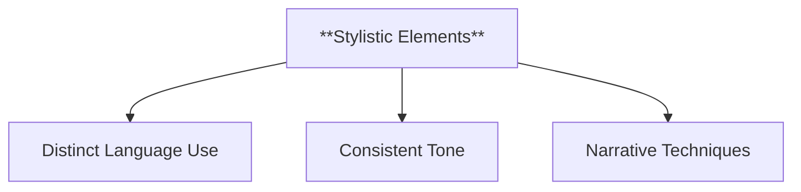
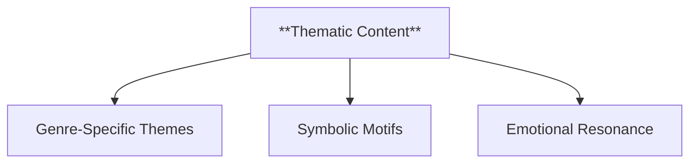
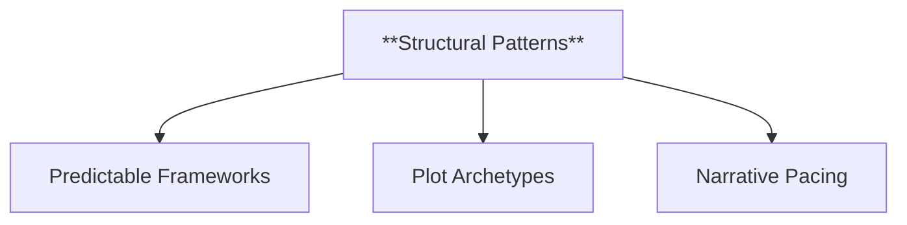
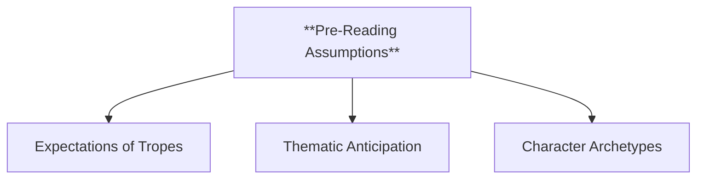
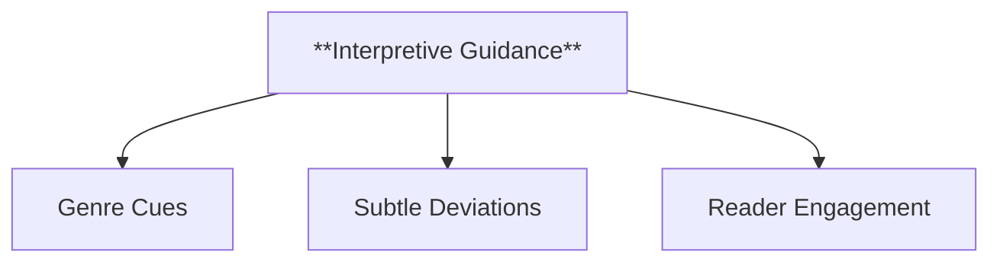
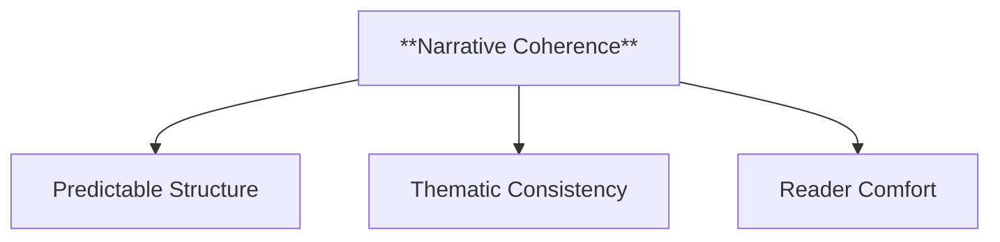
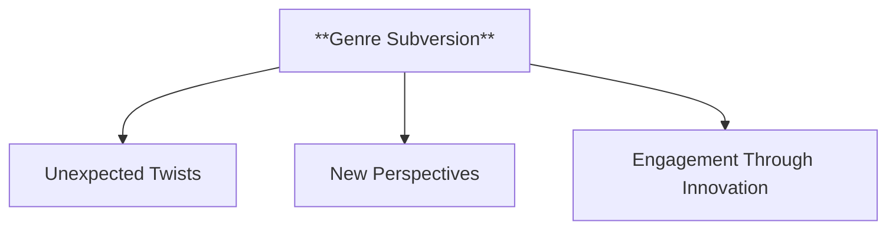
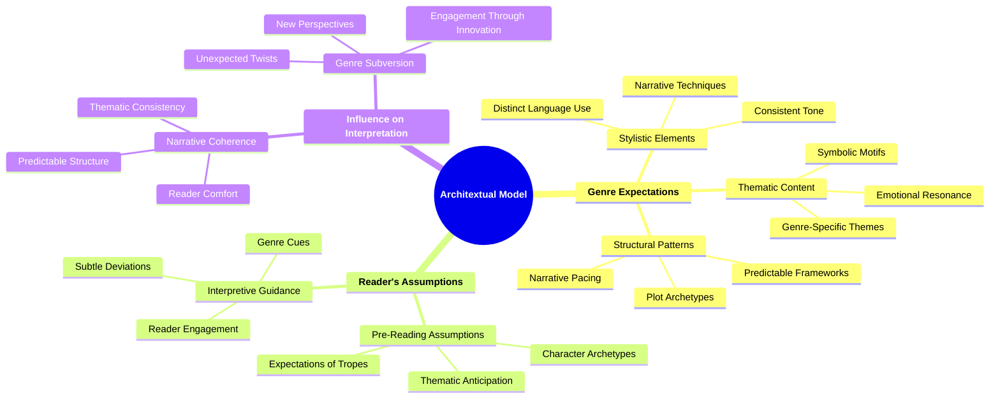

- [1. **Title: Genette's Architextual Model**](#1-title-genettes-architextual-model)
- [2. **Key Concepts**](#2-key-concepts)
  - [2.1. **Genre Expectations**](#21-genre-expectations)
    - [2.1.1. **Components of Genre Expectations**](#211-components-of-genre-expectations)
      - [2.1.1.1. **Stylistic Elements**](#2111-stylistic-elements)
      - [2.1.1.2. **Thematic Content**](#2112-thematic-content)
      - [2.1.1.3. **Structural Patterns**](#2113-structural-patterns)
  - [2.2. **Reader's Assumptions**](#22-readers-assumptions)
    - [2.2.1. **Components of Reader's Assumptions**](#221-components-of-readers-assumptions)
      - [2.2.1.1. **Pre-Reading Assumptions**](#2211-pre-reading-assumptions)
      - [2.2.1.2. **Interpretive Guidance**](#2212-interpretive-guidance)
  - [2.3. **Influence on Interpretation**](#23-influence-on-interpretation)
    - [2.3.1. **Components of Influence on Interpretation**](#231-components-of-influence-on-interpretation)
      - [2.3.1.1. **Narrative Coherence**](#2311-narrative-coherence)
      - [2.3.1.2. **Genre Subversion**](#2312-genre-subversion)
- [3. Theoretical Significance](#3-theoretical-significance)
- [4. Implications of **Genette's Architextual Model**](#4-implications-of-genettes-architextual-model)

---
### 1. **Title: Genette's Architextual Model**

**The Concept of "Architext"**:
   **Definition**: Gérard Genette’s *Architextual Model* examines the genre-based conventions and expectations that shape how readers approach and interpret a narrative. Genette’s concept of the “architext” refers to the overarching set of genre cues that influence a text’s reception. Rather than focusing solely on categorizing texts, the architextual model delves into how genre conventions structure the reading process and inform narrative interpretation.

---

### 2. **Key Concepts**

#### 2.1. **Genre Expectations**

**Definition**:
   Architext refers to the implicit or explicit genre cues that guide a reader’s understanding of the text. These cues influence the reader’s expectations and approach to the narrative.

##### 2.1.1. **Components of Genre Expectations**

###### 2.1.1.1. **Stylistic Elements**
- **Definition**: Language, tone, and narrative style that align a text with a specific genre.

  - **Characteristics**
    - **Distinct Language Use**: Employs specific vocabulary and expressions that resonate with the genre’s tone (e.g., formal language in historical fiction, colloquial language in contemporary fiction).
    - **Consistent Tone**: Maintains a mood or atmosphere characteristic of the genre, such as suspense in thrillers or light-heartedness in comedies.
    - **Narrative Techniques**: Uses genre-specific narrative structures, such as unreliable narration in psychological thrillers or first-person accounts in detective stories.

###### 2.1.1.2. **Thematic Content**
- **Definition**: Recurring themes or motifs that are typical of a genre, such as love in romance or fear in horror.

  - **Characteristics**
    - **Genre-Specific Themes**: Incorporates familiar themes that resonate with readers, like justice in crime fiction or adventure in fantasy.
    - **Symbolic Motifs**: Features common symbols or recurring motifs that enhance the genre’s thematic depth (e.g., haunted houses in horror, quests in fantasy).
    - **Emotional Resonance**: Aligns thematic content with the emotional experiences expected in the genre, such as passion in romance or dread in horror.

###### 2.1.1.3. **Structural Patterns**
- **Definition**: Plot elements and organization that signal a genre, such as the detective structure in mystery novels.

  - **Characteristics**
    - **Predictable Frameworks**: Follows familiar story structures, such as the hero’s journey in adventure stories or whodunit setups in mysteries.
    - **Plot Archetypes**: Uses archetypal plotlines that are recognizable within the genre, facilitating reader expectations (e.g., forbidden love in romance, the showdown in westerns).
    - **Narrative Pacing**: Structures the plot with pacing that suits the genre, like fast-paced action in thrillers or slow-building suspense in horror.

---

#### 2.2. **Reader's Assumptions**

**Definition**:
   The architextual framework highlights how readers bring preconceived genre expectations to a text. These assumptions shape how readers engage with and interpret the narrative.

##### 2.2.1. **Components of Reader's Assumptions**

###### 2.2.1.1. **Pre-Reading Assumptions**
- **Definition**: Readers arrive with genre-specific expectations that influence their interpretation of characters, plot, and theme.

  - **Characteristics**
    - **Expectations of Tropes**: Readers anticipate certain tropes or conventions based on the genre, such as a happy ending in romantic comedies or plot twists in mysteries.
    - **Thematic Anticipation**: Readers are predisposed to look for themes typical of the genre, guiding their engagement with the narrative.
    - **Character Archetypes**: Assumptions about character roles, such as heroes and villains, are shaped by genre familiarity.

###### 2.2.1.2. **Interpretive Guidance**
- **Definition**: The narrative provides cues that align with or challenge the reader’s genre assumptions, guiding their interpretation.

  - **Characteristics**
    - **Genre Cues**: Incorporates elements like setting, dialogue, and tone that signal the genre and help align the reader’s expectations.
    - **Subtle Deviations**: Uses twists or unexpected elements to either meet or defy genre conventions, altering the reader’s perception.
    - **Reader Engagement**: Actively interacts with the reader’s assumptions, inviting them to anticipate or question genre outcomes.

---

#### 2.3. **Influence on Interpretation**

**Definition**:
   Genre conventions play a significant role in how readers interpret narratives, influencing their understanding of plot, characters, and themes.

##### 2.3.1. **Components of Influence on Interpretation**

###### 2.3.1.1. **Narrative Coherence**
- **Definition**: Genre conventions help create a sense of narrative coherence, providing a familiar framework for readers to follow.

  - **Characteristics**
    - **Predictable Structure**: Offers a recognizable plot structure that makes the narrative easy to follow and understand.
    - **Thematic Consistency**: Reinforces themes that align with the genre, ensuring that the story resonates with genre-specific expectations.
    - **Reader Comfort**: Provides a reliable framework that readers can trust, making it easier to stay engaged with the narrative.

###### 2.3.1.2. **Genre Subversion**
- **Definition**: When a text subverts genre expectations, it can lead readers to rethink their assumptions and explore alternative interpretations.

  - **Characteristics**
    - **Unexpected Twists**: Introduces plot elements or character actions that defy typical genre patterns, creating surprise and intrigue.
    - **New Perspectives**: Challenges readers to reconsider themes or outcomes, offering fresh insights or critical commentary on genre conventions.
    - **Engagement Through Innovation**: Keeps readers intrigued by deviating from predictable patterns, prompting deeper analysis and reflection.

---

---

### 3. Theoretical Significance

**Impact on Genre Theory**:
   Genette’s *Architextual Model* transforms genre from a static classification to a dynamic framework that shapes reader engagement. His concept suggests that genre is an active participant in the narrative process, influencing how stories are told, understood, and interpreted.

**Development in "The Architext: An Introduction"**:
   In his work *"The Architext: An Introduction"*, Genette explores how genre operates as a contract between author and reader. This contract shapes the reader’s expectations and interpretation of the text, making genre an essential part of the reading process.

**Influence on Literary Studies**:
   The architextual model bridges formalist genre theory and reader-response criticism. By understanding genre as a flexible and evolving framework, scholars can explore how texts engage with, challenge, or reinforce genre conventions.

**Application Across Media**:
   The architextual model applies not only to literature but also to film, television, and other media where genre blending or subversion is common. It provides a tool for analyzing how different genres interact and influence viewer or reader expectations.

**Examples**:
   - **Hybrid Genres**: A novel that blends fantasy and historical fiction might use architextual cues to navigate the conventions of both genres, guiding how readers interpret the narrative.
   - **Genre-Bending in Film**: Films that cross genres, such as a horror-comedy, rely on the architextual model to manage audience expectations and subvert traditional narrative forms.

---

### 4. Implications of **Genette's Architextual Model**

**Genre as a Dynamic Framework**:
   Genre is not a static category but an evolving set of conventions that shape the narrative experience. Understanding the architext helps readers navigate genre expectations and interpret a text’s deeper meanings.

**Reader’s Active Role**:
   The reader’s assumptions and genre-based expectations are crucial to the interpretive process. By recognizing the influence of genre, readers become more aware of how texts manipulate conventions to create unique narrative experiences.

---
