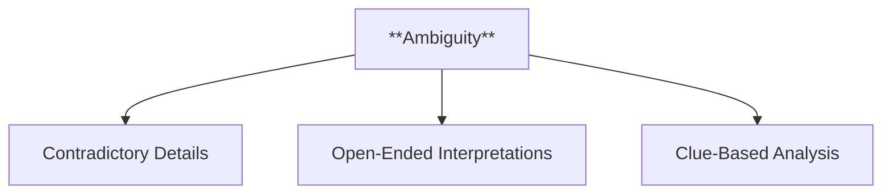
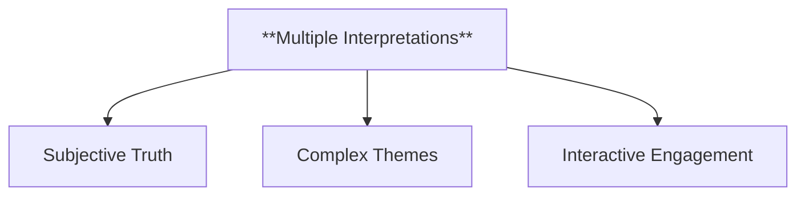
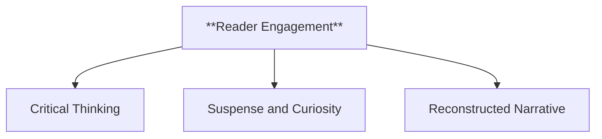
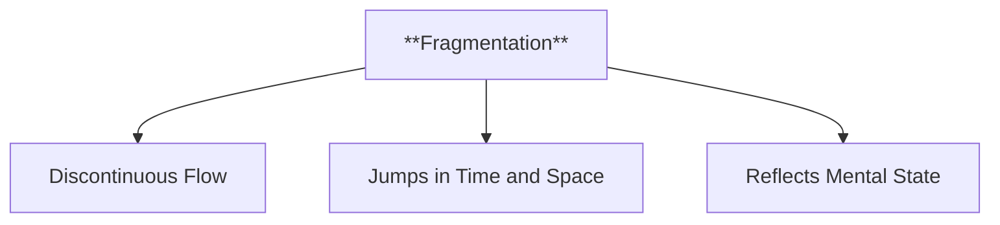
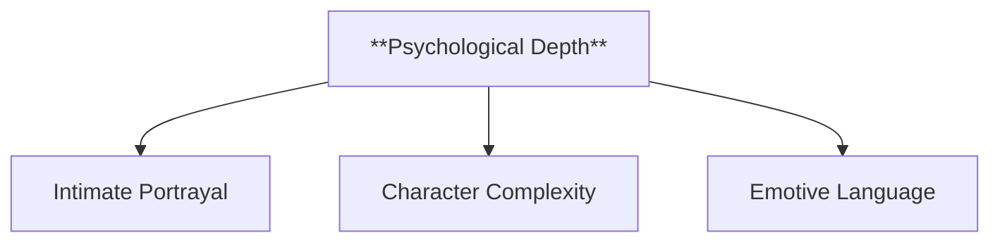
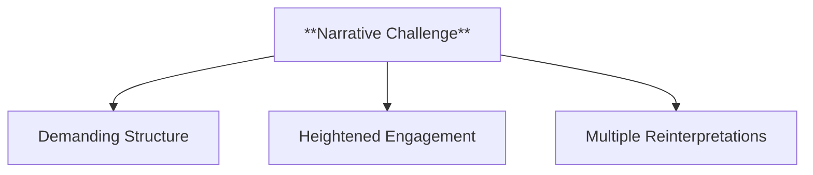
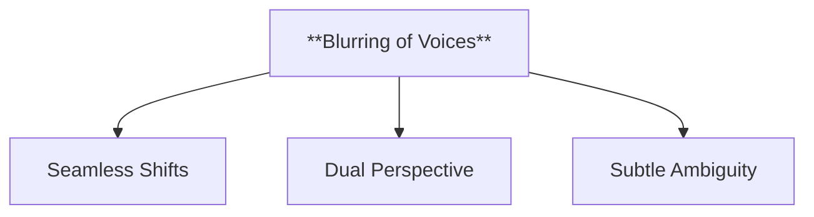
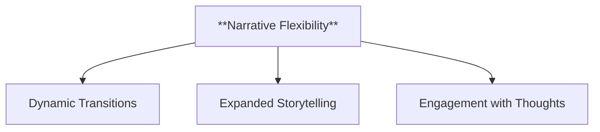
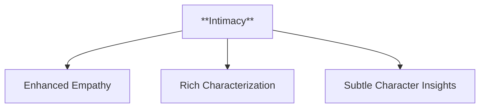
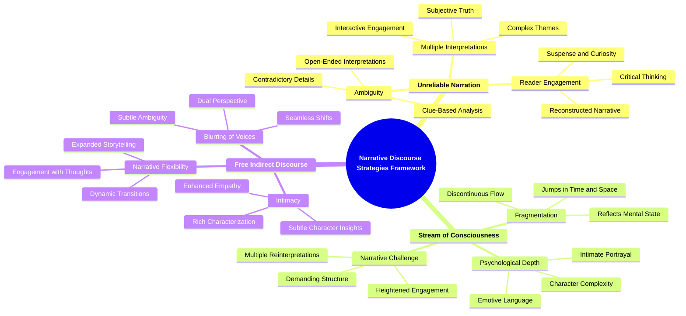

- [1. **Title: Rimmon-Kenan's Narrative Discourse Strategies Framework**](#1-title-rimmon-kenans-narrative-discourse-strategies-framework)
  - [1.1. **Narrative Discourse Strategies**](#11-narrative-discourse-strategies)
- [2. **Key Concepts**](#2-key-concepts)
  - [2.1. **Unreliable Narration**](#21-unreliable-narration)
    - [2.1.1. **Components of Unreliable Narration**](#211-components-of-unreliable-narration)
      - [2.1.1.1. **Ambiguity**](#2111-ambiguity)
      - [2.1.1.2. **Multiple Interpretations**](#2112-multiple-interpretations)
      - [2.1.1.3. **Reader Engagement**](#2113-reader-engagement)
  - [2.2. **Stream of Consciousness**](#22-stream-of-consciousness)
    - [2.2.1. **Components of Stream of Consciousness**](#221-components-of-stream-of-consciousness)
      - [2.2.1.1. **Fragmentation**](#2211-fragmentation)
      - [2.2.1.2. **Psychological Depth**](#2212-psychological-depth)
      - [2.2.1.3. **Narrative Challenge**](#2213-narrative-challenge)
  - [2.3. **Free Indirect Discourse**](#23-free-indirect-discourse)
    - [2.3.1. **Components of Free Indirect Discourse**](#231-components-of-free-indirect-discourse)
      - [2.3.1.1. **Blurring of Voices**](#2311-blurring-of-voices)
      - [2.3.1.2. **Narrative Flexibility**](#2312-narrative-flexibility)
      - [2.3.1.3. **Intimacy**](#2313-intimacy)
- [3. Theoretical Significance](#3-theoretical-significance)

---
### 1. **Title: Rimmon-Kenan's Narrative Discourse Strategies Framework**

---

#### 1.1. **Narrative Discourse Strategies**

**Definition**: 
Shlomith Rimmon-Kenan’s *Narrative Discourse Strategies Framework* examines the techniques authors use to shape readers' understanding and emotional engagement with a narrative. These strategies, such as unreliable narration, stream of consciousness, and free indirect discourse, are fundamental in constructing how a narrative communicates its themes, develops its characters, and involves its audience. Rimmon-Kenan’s work highlights the complexity and depth of narrative voice in shaping the reader’s interaction with the text.

---

### 2. **Key Concepts**

---

#### 2.1. **Unreliable Narration**

**Definition**: 
Unreliable narration involves a narrator whose credibility is compromised, leading the reader to question the truth or accuracy of the story being told. The narrator’s unreliability might arise from dishonesty, bias, or psychological instability, creating ambiguity in the narrative.

##### 2.1.1. **Components of Unreliable Narration**

###### 2.1.1.1. **Ambiguity**
- **Definition**: Readers must critically interpret the narrator's account, often recognizing conflicting or misleading information.

  - **Characteristics**
    - **Contradictory Details**: Presents conflicting versions of events or subtle inconsistencies, prompting readers to question the narrator’s reliability.
    - **Open-Ended Interpretations**: Leaves room for multiple readings and interpretations, making the narrative complex and thought-provoking.
    - **Clue-Based Analysis**: Encourages readers to search for hidden meanings and piece together hints to form a more accurate understanding of the story.

###### 2.1.1.2. **Multiple Interpretations**
- **Definition**: The unreliable narration invites various readings of the story, challenging readers to uncover the truth.

  - **Characteristics**
    - **Subjective Truth**: Different readers may come to different conclusions about what is true based on their analysis of the narrative.
    - **Complex Themes**: The potential for various interpretations can highlight the story’s thematic richness, encouraging deeper thought.
    - **Interactive Engagement**: Requires readers to actively engage with the text, moving beyond surface-level understanding to explore potential meanings.

###### 2.1.1.3. **Reader Engagement**
- **Definition**: The narrative requires active reader participation, as the reader must piece together the underlying reality from the unreliable account.

  - **Characteristics**
    - **Critical Thinking**: Demands that readers evaluate and question the information presented, forming their own conclusions about the story.
    - **Suspense and Curiosity**: Maintains reader interest as they seek to uncover the truth hidden behind the unreliable narrative.
    - **Reconstructed Narrative**: Challenges readers to piece together a coherent story from disjointed or unreliable fragments provided by the narrator.

---

#### 2.2. **Stream of Consciousness**

**Definition**: 
Stream of consciousness is a narrative technique that presents the continuous, often chaotic flow of a character’s thoughts, emotions, and memories. It depicts the non-linear, fragmented nature of human consciousness, giving readers an intimate look into the character’s psyche.

##### 2.2.1. **Components of Stream of Consciousness**

###### 2.2.1.1. **Fragmentation**
- **Definition**: The technique reflects the disordered nature of thought, often lacking clear structure or logic.

  - **Characteristics**
    - **Discontinuous Flow**: Presents scenes or thoughts in a fragmented manner, mirroring the randomness of memory or consciousness.
    - **Jumps in Time and Space**: Frequently shifts between different moments or ideas, creating a non-linear narrative.
    - **Reflects Mental State**: Can represent a character’s psychological state, such as confusion, trauma, or stream of consciousness.

###### 2.2.1.2. **Psychological Depth**
- **Definition**: Provides insight into the character's inner world, revealing emotions, fears, and desires.

  - **Characteristics**
    - **Intimate Portrayal**: Dives into the character’s deepest thoughts, offering readers a window into their mental and emotional landscape.
    - **Character Complexity**: Adds layers to the character by revealing hidden aspects of their personality and motivations.
    - **Emotive Language**: Utilizes expressive and introspective language to convey the character’s internal experiences.

###### 2.2.1.3. **Narrative Challenge**
- **Definition**: The non-linear, fragmented nature of the narrative can make it difficult for readers to piece together the character’s experience within the broader context.

  - **Characteristics**
    - **Demanding Structure**: Requires readers to actively piece together disparate elements to form a cohesive understanding.
    - **Heightened Engagement**: Keeps readers involved as they try to make sense of the disordered narrative.
    - **Multiple Reinterpretations**: Allows for new insights with each reading, as readers piece together and reinterpret the character’s story.

---

#### 2.3. **Free Indirect Discourse**

**Definition**: 
Free indirect discourse blends a character’s internal thoughts and speech with the narrator's voice, creating a fluid transition between the character’s perspective and the external narrative without clear markers. This allows the narrative to move between the subjective and objective seamlessly.

##### 2.3.1. **Components of Free Indirect Discourse**

###### 2.3.1.1. **Blurring of Voices**
- **Definition**: Free indirect discourse merges the character’s thoughts with the narrator’s perspective, creating ambiguity between subjective and objective views.

  - **Characteristics**
    - **Seamless Shifts**: Transitions fluidly between the narrator’s observations and the character’s inner thoughts without clear markers.
    - **Dual Perspective**: Combines external narrative insight with the subjective mind of the character, adding depth to both viewpoints.
    - **Subtle Ambiguity**: Creates moments where it is unclear whether the thoughts belong to the narrator or the character, enriching the narrative complexity.

###### 2.3.1.2. **Narrative Flexibility**
- **Definition**: The technique enables a seamless shift between the narrator’s external account and the character’s internal thoughts.

  - **Characteristics**
    - **Dynamic Transitions**: Moves easily between descriptive narrative and intimate character insights, keeping the story fluid.
    - **Expanded Storytelling**: Offers both an objective overview and subjective interpretation without changing narrative mode.
    - **Engagement with Thoughts**: Allows readers to enter the character’s mind without breaking from the overall narrative flow.

###### 2.3.1.3. **Intimacy**
- **Definition**: It creates a deeper connection between readers and characters by integrating the character’s internal perspective with the broader narrative.

  - **Characteristics**
    - **Enhanced Empathy**: Fosters a closer bond with the character, as readers experience both external events and internal reactions simultaneously.
    - **Rich Characterization**: Deepens the portrayal of characters by blending their internal reflections with their actions and speech.
    - **Subtle Character Insights**: Provides glimpses into characters’ true emotions and thoughts without overt exposition, creating a more immersive experience.

---

---

### 3. Theoretical Significance

---

**Impact on Narrative Theory**:
Rimmon-Kenan’s framework has significantly influenced narrative theory by offering a comprehensive understanding of how narrative strategies shape the reader’s interpretation and emotional response. By analyzing unreliable narration, stream of consciousness, and free indirect discourse, her work expands the tools available for studying narrative voice and structure. These strategies allow for multi-layered, complex storytelling that engages readers on multiple levels.

---

**Application Across Genres and Media**:
Rimmon-Kenan’s concepts apply not only to literary narratives but also to film, television, and digital media. In film, unreliable narration and stream of consciousness can be visualized through voiceovers, subjective camera angles, or non-linear editing. Understanding these techniques enhances the analysis of narrative forms across media, revealing how storytelling devices engage audiences and convey meaning.

---

**Interdisciplinary Influence**:
Rimmon-Kenan’s exploration of narrative strategies has influenced various fields, including psychology and cognitive science. In psychology, her work informs the study of consciousness and the reliability of personal narratives. In media studies, her framework helps analyze how narrative strategies function across different platforms to shape audience engagement and interpretation.

---

**Critiques and Further Development**:
While Rimmon-Kenan’s focus on narrative techniques is widely influential, some critics argue that it can prioritize technical aspects of storytelling over thematic content. However, her work continues to be integrated with broader narrative theories, providing valuable insights into how narrative techniques create meaning and affect the reader’s experience.

---
