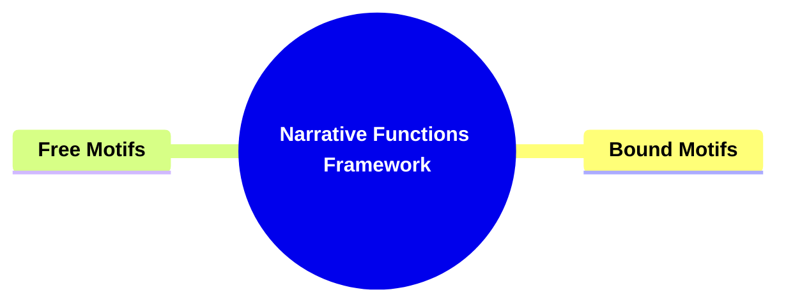
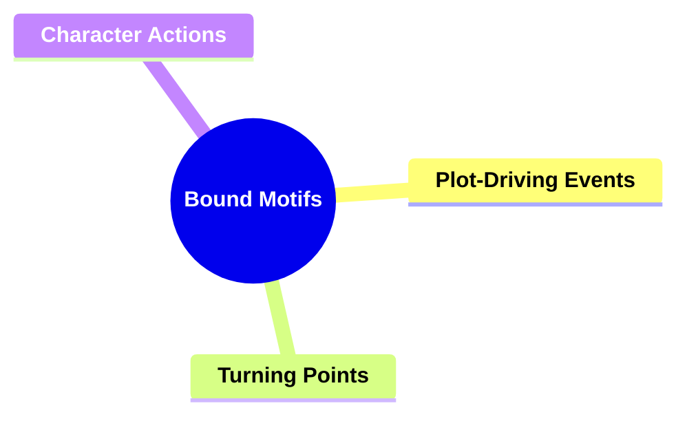
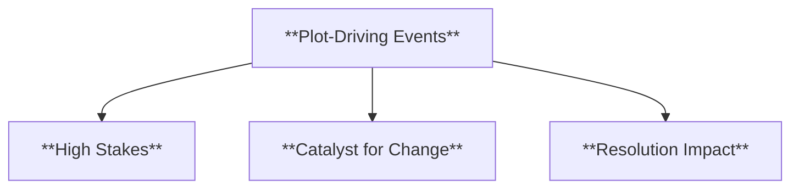
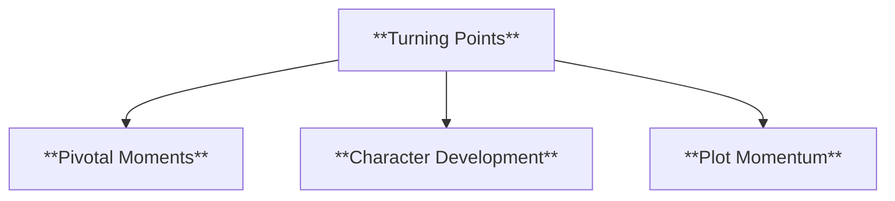
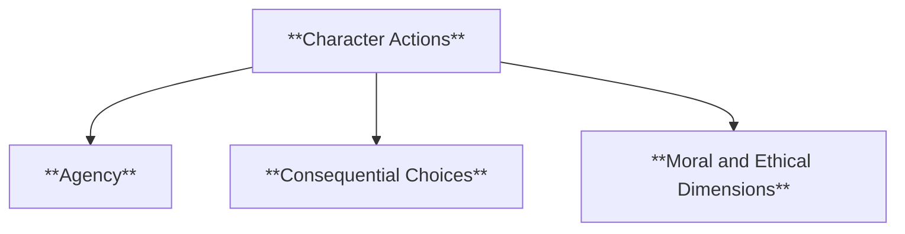
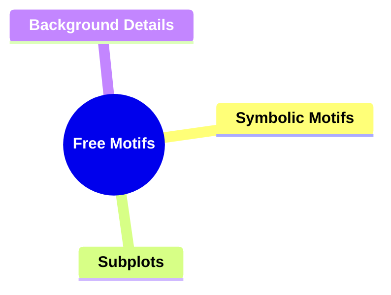
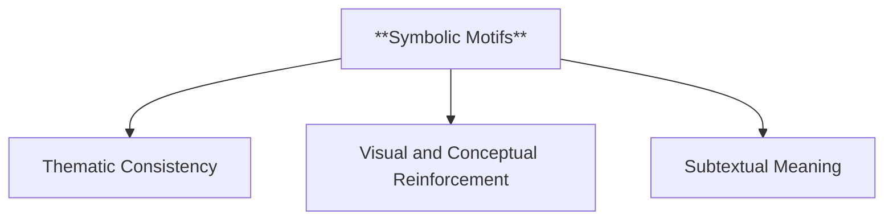
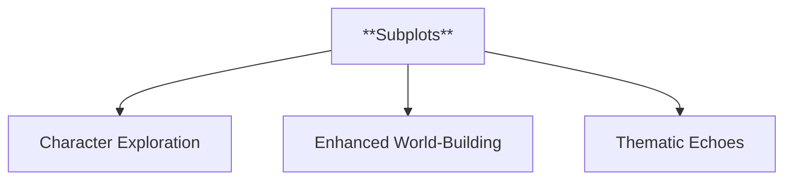
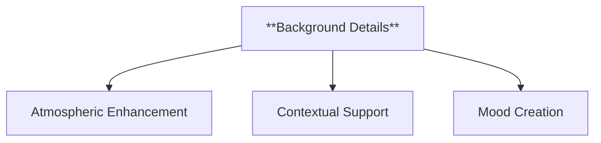
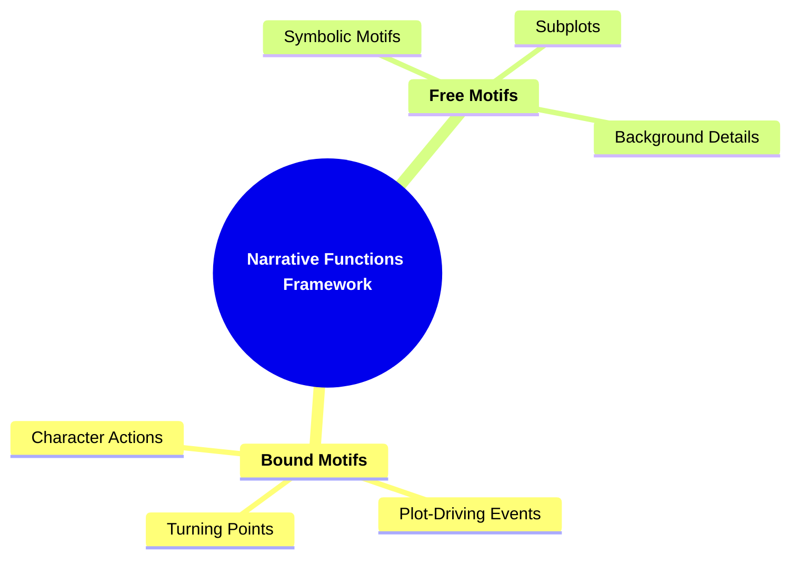

- [1. Title: **Tomashevsky's Narrative Functions Framework**](#1-title-tomashevskys-narrative-functions-framework)
- [2. Key Concepts](#2-key-concepts)
  - [2.1. Bound Motifs](#21-bound-motifs)
    - [2.1.1. **Components of Bound Motifs**](#211-components-of-bound-motifs)
      - [2.1.1.1. **Plot-Driving Events**](#2111-plot-driving-events)
      - [2.1.1.2. **Turning Points**](#2112-turning-points)
      - [2.1.1.3. **Character Actions**](#2113-character-actions)
  - [2.2. Free Motifs](#22-free-motifs)
    - [2.2.1. **Components of Free Motifs**](#221-components-of-free-motifs)
      - [2.2.1.1. **Symbolic Motifs**](#2211-symbolic-motifs)
      - [2.2.1.2. **Subplots**](#2212-subplots)
      - [2.2.1.3. **Background Details**](#2213-background-details)
    - [2.2.2. Implications of Narrative Functions](#222-implications-of-narrative-functions)

---

---

### 1. Title: **Tomashevsky's Narrative Functions Framework**

**Narrative Functions**:
   **Definition**: Tomashevsky’s framework categorizes narrative elements into two main types: *bound motifs* and *free motifs*. These motifs serve distinct purposes within a narrative: bound motifs are crucial for advancing the plot, while free motifs enhance the thematic and emotional layers of the story without being essential to its progression.

---

### 2. Key Concepts

#### 2.1. Bound Motifs

**Definition**:
   Bound motifs are narrative elements essential for the progression of the plot. These motifs are necessary for advancing the storyline and maintaining its core structure.

##### 2.1.1. **Components of Bound Motifs**

###### 2.1.1.1. **Plot-Driving Events**
  - **Definition**: Key events or actions that significantly affect the outcome of the story.

  - **Characteristics**
    - **High Stakes**: Involves events that dramatically change the course of the narrative or set up major conflicts.
    - **Catalyst for Change**: Acts as a trigger that propels the plot forward and influences character decisions.
    - **Resolution Impact**: Directly contributes to how the story concludes, shaping the ultimate outcome.

###### 2.1.1.2. **Turning Points**
  - **Definition**: Critical moments that shift the direction of the narrative.

  - **Characteristics**
    - **Pivotal Moments**: Represents a significant change in the story, altering its trajectory and reader expectations.
    - **Character Development**: Often leads to important growth or change in characters as they respond to new challenges.
    - **Plot Momentum**: Transitions the narrative from one phase to another, maintaining reader engagement and interest.

###### 2.1.1.3. **Character Actions**
  - **Definition**: Essential actions taken by main characters that influence the narrative’s resolution.

  - **Characteristics**
    - **Agency**: Demonstrates characters taking control of their fate, impacting the story’s progression.
    - **Consequential Choices**: The decisions made by main characters carry significant weight and affect the outcome.
    - **Moral and Ethical Dimensions**: Reflects the values and inner struggles of the characters, adding depth to the narrative.

---

#### 2.2. Free Motifs

**Definition**:
   Free motifs are narrative elements that are not essential for plot development but enrich the narrative by contributing to its atmosphere, themes, or characterization.

##### 2.2.1. **Components of Free Motifs**

###### 2.2.1.1. **Symbolic Motifs**
  - **Definition**: Recurring symbols or images that reinforce the story's themes.

  - **Characteristics**
    - **Thematic Consistency**: Supports and highlights the central themes, weaving them throughout the narrative.
    - **Visual and Conceptual Reinforcement**: Uses symbols to create a layered and cohesive story that resonates with readers.
    - **Subtextual Meaning**: Adds depth by prompting readers to look beyond the literal to understand the broader implications.

###### 2.2.1.2. **Subplots**
  - **Definition**: Minor narrative arcs that add depth without affecting the main storyline.

  - **Characteristics**
    - **Character Exploration**: Provides opportunities to explore secondary characters and their development.
    - **Enhanced World-Building**: Expands on the story’s universe, giving context and richness to the main plot.
    - **Thematic Echoes**: Often reflects or contrasts with the main plot, enhancing the overall narrative complexity.

###### 2.2.1.3. **Background Details**
  - **Definition**: Descriptions or elements that contribute to the setting or mood, without directly influencing the plot.

  - **Characteristics**
    - **Atmospheric Enhancement**: Builds a vivid world that draws readers into the story through sensory details.
    - **Contextual Support**: Frames the main narrative, providing a sense of realism and depth without altering the plot.
    - **Mood Creation**: Shapes the emotional tone of the story, setting the stage for how scenes are perceived.

---

---

---

##### 2.2.2. Implications of Narrative Functions

**Understanding Story Structure**:
   Tomashevsky’s framework helps distinguish between elements that are structurally essential to the plot and those that enhance the thematic and emotional layers of the narrative. By recognizing bound and free motifs, readers gain insight into the mechanics of storytelling and can better appreciate the craftsmanship involved in narrative construction.

**Applications in Literary Analysis**:
   This framework is valuable for identifying which elements drive the plot and which serve to enrich the narrative’s meaning and atmosphere. Analyzing both bound and free motifs allows for a deeper understanding of how authors create complex, multi-layered stories that balance essential events with symbolic or thematic details.

---
