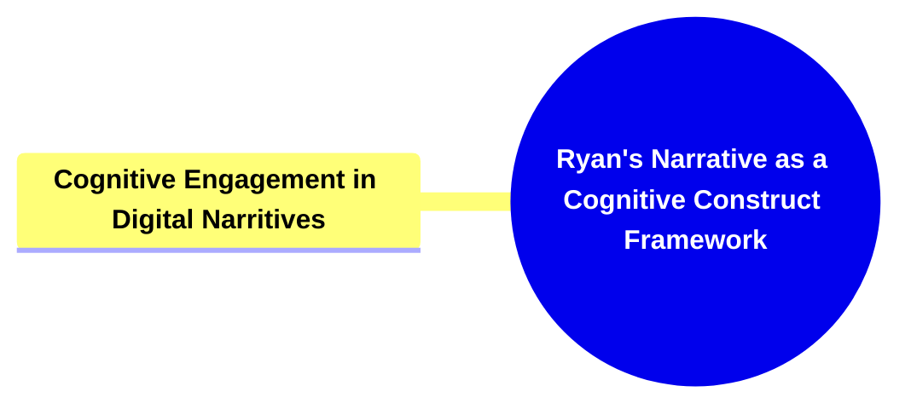
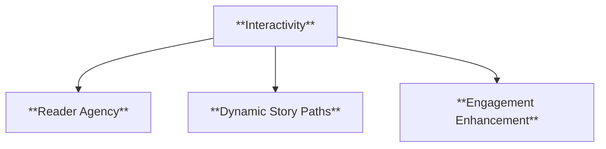
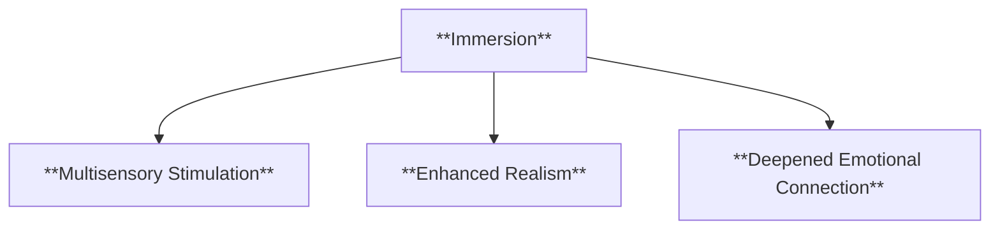
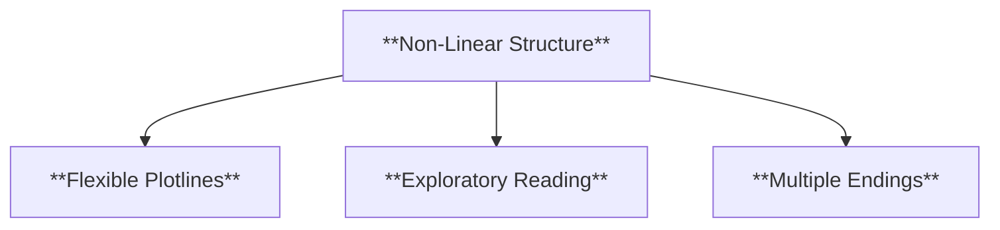
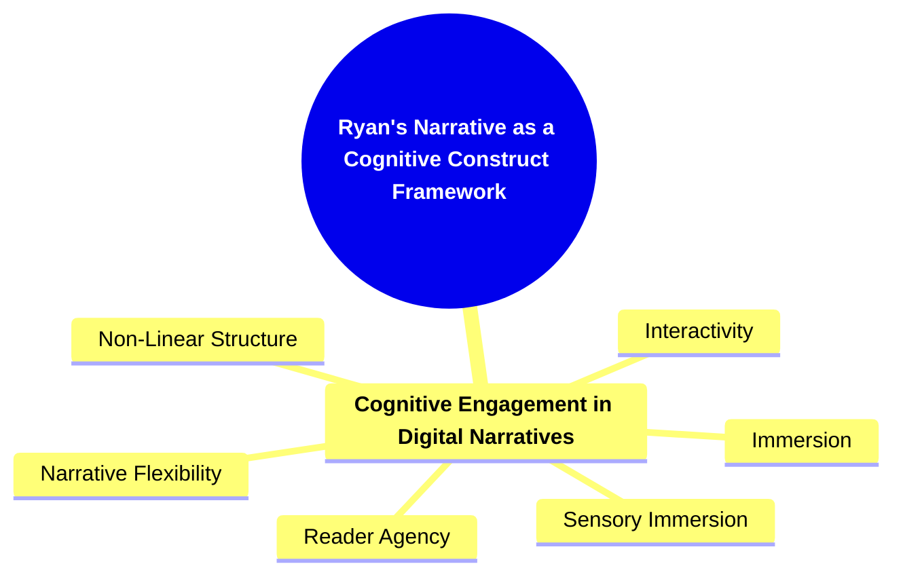

- [1. Title: **Ryan's Narrative as a Cognitive Construct Framework**](#1-title-ryans-narrative-as-a-cognitive-construct-framework)
- [2. Key Concepts](#2-key-concepts)
  - [2.1. Cognitive Engagement in Digital Narratives](#21-cognitive-engagement-in-digital-narratives)
    - [2.1.1. **Components of Cognitive Engagement in Digital Narritives**](#211-components-of-cognitive-engagement-in-digital-narritives)
      - [2.1.1.1. **Interactivity**](#2111-interactivity)
      - [2.1.1.2. **Immersion**](#2112-immersion)
      - [2.1.1.3. **Non-Linear Structure**](#2113-non-linear-structure)
- [3. Theoretical Significance](#3-theoretical-significance)
- [4. Implications of Narrative as a Cognitive Construct](#4-implications-of-narrative-as-a-cognitive-construct)

---

---

### 1. Title: **Ryan's Narrative as a Cognitive Construct Framework**

**Narrative as a Cognitive Construct**:
**Definition**: Marie-Laure Ryan proposes that narrative is fundamentally a cognitive construct, meaning that it is not just a text but also a mental model formed in the reader’s mind. This model is shaped by the interaction between the narrative's structure and the reader’s cognitive processes, including perception, memory, and imagination. According to Ryan, the act of reading or experiencing a narrative involves the construction of a mental simulation or world, where the reader actively participates in the creation of meaning.

---

### 2. Key Concepts

#### 2.1. Cognitive Engagement in Digital Narratives

**Definition**:
Ryan explores how digital narratives, with their interactive and immersive features, engage the reader’s cognitive faculties in new ways. Unlike traditional linear narratives, digital narratives often allow readers to influence the direction of the story, thus creating a more dynamic and participatory relationship between the narrative and its audience.

##### 2.1.1. **Components of Cognitive Engagement in Digital Narritives**

###### 2.1.1.1. **Interactivity**

- **Definition**: Digital narratives often require the reader to make choices that influence the story's outcome, making the reading experience more engaging and personalized.

- **Characteristics**
  - **Reader Agency**: Empowers the reader to direct the story, influencing plot development and character actions.
  - **Dynamic Story Paths**: Multiple paths and outcomes are created based on reader input, enhancing replayability.
  - **Engagement Enhancement**: Increases reader investment by making them an active participant in the narrative.

###### 2.1.1.2. **Immersion**

- **Definition**: The use of multimedia elements, such as visuals, sound, and hypertext, can create a more immersive experience, drawing the reader deeper into the narrative world.

- **Characteristics**
  - **Multisensory Stimulation**: Combines visual, auditory, and sometimes interactive elements to create a rich narrative atmosphere.
  - **Enhanced Realism**: Multimedia details contribute to a believable world that feels more tangible.
  - **Deepened Emotional Connection**: Sensory cues reinforce emotional scenes, intensifying reader involvement.

###### 2.1.1.3. **Non-Linear Structure**

- **Definition**: Many digital narratives feature non-linear structures, where the sequence of events can vary based on the reader's decisions, leading to multiple possible storylines or endings.

- **Characteristics**
  - **Flexible Plotlines**: Readers experience the story in different ways based on the paths they choose, creating unique story arcs.
  - **Exploratory Reading**: Encourages readers to navigate through the narrative in a non-sequential manner.
  - **Multiple Endings**: Offers various conclusions that depend on the reader’s choices, fostering curiosity and exploration.

---

---

### 3. Theoretical Significance

**Definition**:
Ryan’s model emphasizes the active role of the reader in the creation of narrative meaning. It challenges traditional views of narrative as a fixed structure that the reader passively consumes, instead proposing that narrative is an interactive and dynamic process shaped by the reader's cognitive engagement.

**Characteristics**:

- **Reader-Text Interaction**: Ryan’s model suggests that readers actively construct meaning by engaging with the narrative structure, involving decision-making, problem-solving, and the use of imagination.
- **Impact on Digital Narrative Studies**: The framework demonstrates how digital narratives transform the reader's role, allowing for participatory and personalized experiences.
- **Cognitive Science and Narrative**: The framework bridges narrative theory and cognitive science, positing that understanding narratives involves analyzing both textual structures and how they are processed by the reader’s mind.

**Contextualization**:
Ryan's approach is particularly influential in the study of digital narratives, where the boundaries between author, text, and reader are often blurred. Her work helps explain how digital media transform the reader's role, making narrative a more participatory and personalized experience. By framing narrative as a cognitive construct, Ryan bridges the gap between narrative theory and cognitive science, suggesting that understanding narratives requires analyzing how they are processed and constructed in the reader's mind.

**Examples**:

- **Interactive Fiction**: In interactive fiction, such as _Choose Your Own Adventure_ books or digital games like _The Walking Dead_ series, the reader/player makes decisions that directly impact the narrative's direction and outcome. These choices require the reader to anticipate possible consequences and actively shape their understanding of the story.
- **Hypertext Fiction**: In hypertext fiction, like Michael Joyce's _afternoon, a story_, the reader navigates the narrative through hyperlinks, creating a unique path through the text that can differ with each reading.

---

### 4. Implications of Narrative as a Cognitive Construct

**Key Insight or Implication**:
Ryan's framework offers crucial insights into how narratives are shaped by cognitive processes, showing that narrative meaning is constructed through an interaction between the text and the reader's perception, memory, and imagination. This concept applies strongly in digital contexts, where readers actively co-create meaning.

**Collaborative or Future-Oriented Insight**:
The framework opens avenues for cross-disciplinary research, particularly in understanding how interactive and digital narratives engage cognitive faculties. It highlights the importance of considering both social and technological factors in the future study of narratives, making it a foundational aspect of contemporary narrative theory.

---
