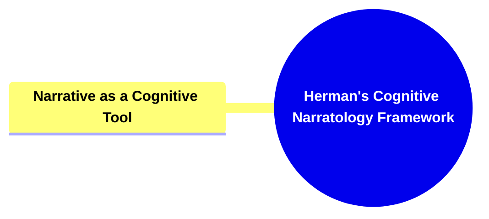

- [1. Title: **Herman's Cognitive Narratology Framework**](#1-title-hermans-cognitive-narratology-framework)
- [2. **Key Concepts**:](#2-key-concepts)
  - [2.1. **Narrative as a Cognitive Tool**:](#21-narrative-as-a-cognitive-tool)
    - [2.1.1. **Components of Narrative as a Cognitive Tool**](#211-components-of-narrative-as-a-cognitive-tool)
      - [2.1.1.1. **Organizing Experiences**](#2111-organizing-experiences)
      - [2.1.1.2. **Constructing Identities**](#2112-constructing-identities)
      - [2.1.1.3. **Navigating Social Realities**](#2113-navigating-social-realities)
- [3. **Theoretical Significance**:](#3-theoretical-significance)
- [4. **Supporting Information**:](#4-supporting-information)

---

---

### 1. Title: **Herman's Cognitive Narratology Framework**

- **Cognitive Narratology**:
  - **Definition**: David Herman is a pioneering figure in the field of _cognitive narratology_, which investigates how narratives are processed, understood, and produced by the human mind. Cognitive narratology represents an interdisciplinary approach that bridges narrative theory and cognitive science, focusing on the ways in which narrative structures align with cognitive processes. This framework seeks to understand how storytelling interacts with mental functions such as memory, perception, imagination, and problem-solving, providing a deeper insight into the cognitive mechanisms that underlie narrative comprehension and production.

### 2. **Key Concepts**:

#### 2.1. **Narrative as a Cognitive Tool**:

- **Definition**: In his influential work _"Story Logic,"_ Herman posits that narrative is a fundamental cognitive tool that humans use to make sense of the world around them. Narratives are not just a form of entertainment or cultural expression; they are essential mechanisms through which individuals organize their experiences, construct their identities, and navigate the complexities of social life. This view positions narrative as integral to cognitive processes, functioning as a way to process information, solve problems, and communicate complex ideas.

##### 2.1.1. **Components of Narrative as a Cognitive Tool**

###### 2.1.1.1. **Organizing Experiences**

- **Definition**: Narratives allow individuals to structure their experiences into coherent sequences, helping them to understand cause-and-effect relationships and the passage of time.
- **Characteristics**
  - **Temporal Sequencing**: Stories help individuals arrange events chronologically, aiding in understanding how past actions influence present and future outcomes.
  - **Memory Framework**: Provides a structure for memory storage and retrieval, making it easier to recall and reflect on experiences.
  - **Causal Understanding**: Enhances comprehension of how events are interconnected, reinforcing the logic behind actions and consequences.

###### 2.1.1.2. **Constructing Identities**

- **Definition**: Through narrative, individuals construct and negotiate their identities, reflecting on personal experiences and defining their place in the world.
- **Characteristics**
  - **Self-Reflection**: Enables individuals to think about their actions, decisions, and values, fostering self-awareness.
  - **Personal Justification**: Allows people to create stories that rationalize their choices and behavior, contributing to their self-conception.
  - **Identity Shaping**: Narratives influence how individuals present themselves to others, helping them construct and communicate their identities.

###### 2.1.1.3. **Navigating Social Realities**

- **Definition**: Narratives serve as cognitive maps that help individuals navigate social environments and understand societal norms and values.
- **Characteristics**
  - **Social Learning**: Through stories, individuals gain insights into social norms and cultural values, aiding in social adaptation and understanding.
  - **Empathy Development**: Engaging with diverse narratives fosters empathy by exposing individuals to different perspectives and experiences.
  - **Exploring Hypotheticals**: Narratives allow individuals to consider "what-if" scenarios, helping them anticipate outcomes and make informed decisions.

### 3. **Theoretical Significance**:

- **Impact on Narrative Theory**: Herman’s Cognitive Narratology Framework has significantly impacted the study of narrative by integrating insights from cognitive science into narrative theory. This interdisciplinary approach has opened up new avenues for understanding how narratives function not only as literary constructs but also as cognitive processes. By linking narrative structures to mental processes, Herman’s framework provides a more comprehensive understanding of how stories are created, understood, and remembered, offering valuable tools for analyzing narrative across different mediums and genres.
- **Application Across Disciplines**: While Herman’s concepts were developed within the context of narrative theory, their implications extend far beyond literary studies. In psychology, cognitive narratology informs research on memory, identity, and social cognition, providing a framework for studying how people use narratives in their everyday lives. In education, understanding narrative as a cognitive tool can enhance teaching strategies by leveraging storytelling to improve comprehension and retention. In media studies, cognitive narratology offers insights into how narratives in film, television, and digital media engage audiences and influence perception and behavior.

### 4. **Supporting Information**:

- **Interdisciplinary Influence**: The Cognitive Narratology Framework has influenced a range of disciplines, including cognitive psychology, linguistics, and anthropology. In cognitive psychology, for instance, research on how narratives structure memory and identity draws directly from the principles outlined in Herman’s work. In linguistics, cognitive narratology has contributed to the understanding of how language and narrative interact to shape thought processes. In anthropology, the framework is used to explore how cultural narratives influence collective identity and social organization.
- **Critiques and Further Development**: While cognitive narratology has been widely influential, some critics argue that it may overemphasize the role of cognitive processes at the expense of cultural and historical factors in narrative production and reception. Additionally, the complexity of linking narrative structures to specific cognitive functions presents challenges in empirical research. However, ongoing developments in cognitive science and narrative theory continue to refine and expand the Cognitive Narratology Framework, making it a dynamic and evolving field of study that remains at the forefront of interdisciplinary research on narrative.
