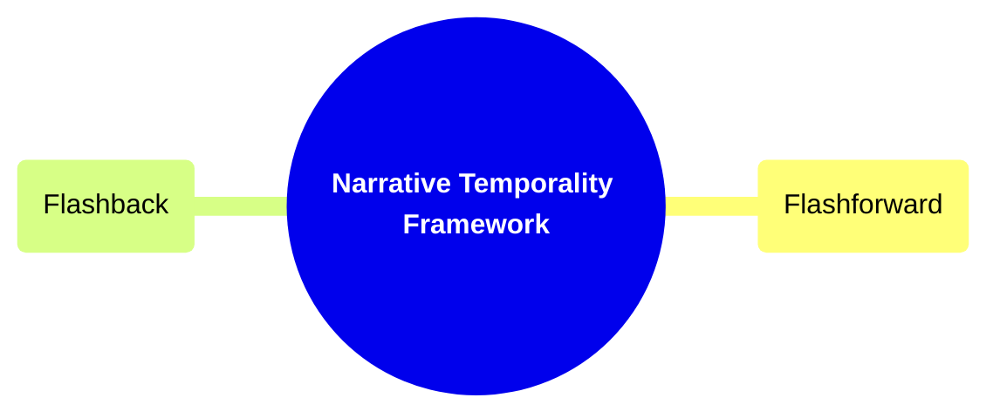
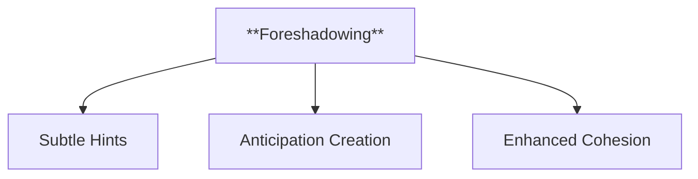
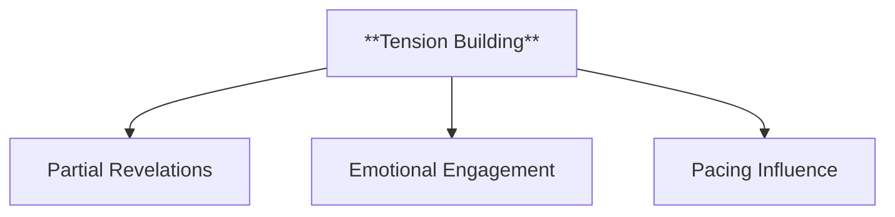
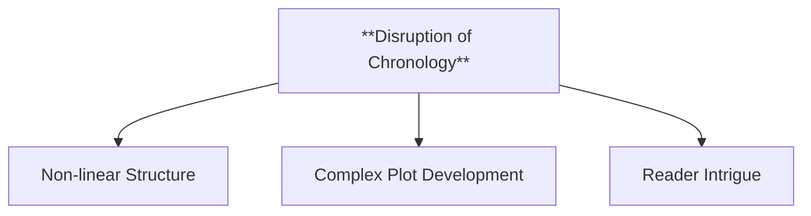
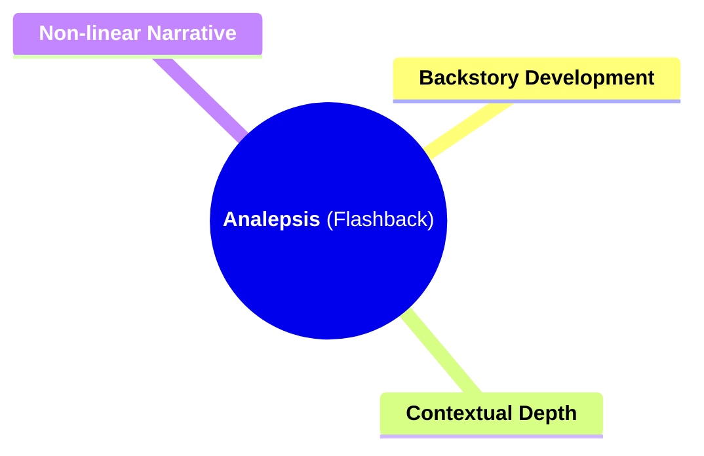
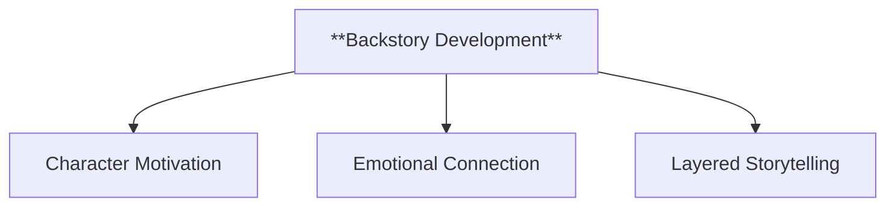
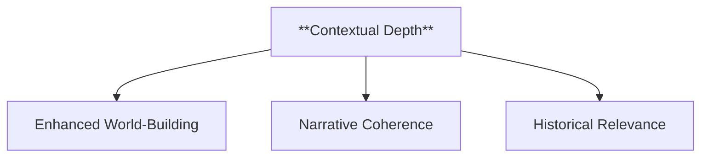
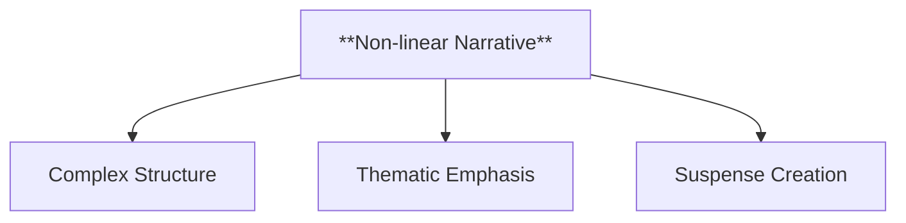
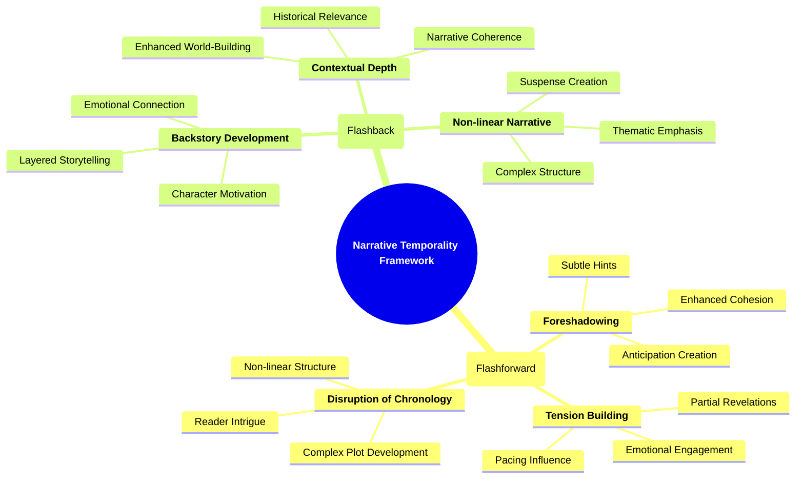

- [1. **Title: Brooks's Narrative Temporality Framework**](#1-title-brookss-narrative-temporality-framework)
- [2. **Key Concepts**](#2-key-concepts)
  - [2.1. **Prolepsis (Flashforward)**](#21-prolepsis-flashforward)
    - [2.1.1. **Components of Prolepsis (Flashforward)**](#211-components-of-prolepsis-flashforward)
      - [2.1.1.1. **Foreshadowing**](#2111-foreshadowing)
      - [2.1.1.2. **Tension Building**](#2112-tension-building)
      - [2.1.1.3. **Disruption of Chronology**](#2113-disruption-of-chronology)
  - [2.2. **Analepsis (Flashback)**](#22-analepsis-flashback)
    - [2.2.1. **Components of Analepsis (Flashback)**](#221-components-of-analepsis-flashback)
      - [2.2.1.1. **Backstory Development**](#2211-backstory-development)
      - [2.2.1.2. **Contextual Depth**](#2212-contextual-depth)
      - [2.2.1.3. **Non-linear Narrative**](#2213-non-linear-narrative)
- [3. **Implications of Brooks's Narrative Temporality Framework**](#3-implications-of-brookss-narrative-temporality-framework)

---
---

### 1. **Title: Brooks's Narrative Temporality Framework**

**Narrative Temporality**:
   **Definition**: Peter Brooks’s framework on narrative temporality examines how narratives manipulate time to create suspense and delay resolution. Through techniques like *prolepsis* (flashforward) and *analepsis* (flashback), Brooks reveals how narrative time shapes a story's structure and the reader’s experience.



---

### 2. **Key Concepts**

#### 2.1. **Prolepsis (Flashforward)**

**Definition**:
   Prolepsis is a narrative technique that involves anticipating or foreshadowing future events within the story, creating a sense of anticipation and suspense.

```mermaid
mindmap
  root((**Prolepsis (Flashforward)**))
    **Foreshadowing**
    **Tension Building**
    **Disruption of Chronology**
```

##### 2.1.1. **Components of Prolepsis (Flashforward)**

###### 2.1.1.1. **Foreshadowing**
  - **Definition**: Hints at future events, creating suspense.



  - **Characteristics**
    - **Subtle Hints**: Uses indirect or symbolic clues to suggest upcoming events, adding depth to the narrative without immediate revelation.
    - **Anticipation Creation**: Engages readers by making them anticipate future developments, maintaining their interest and involvement in the story.
    - **Enhanced Cohesion**: Connects various parts of the story, making later events feel well-integrated and planned.

---

###### 2.1.1.2. **Tension Building**
  - **Definition**: Revealing parts of the future builds tension.



  - **Characteristics**
    - **Partial Revelations**: Provides fragments of future outcomes, generating curiosity and making readers eager to see how events unfold.
    - **Emotional Engagement**: Heightens the emotional stakes by creating a sense of impending consequence or conflict.
    - **Pacing Influence**: Modifies the pace of the story, quickening or slowing it to align with the suspenseful build-up.

---

###### 2.1.1.3. **Disruption of Chronology**
  - **Definition**: Challenges the linear narrative by interspersing future events.



  - **Characteristics**
    - **Non-linear Structure**: Rearranges the sequence of events to break traditional narrative flow, compelling readers to piece the timeline together.
    - **Complex Plot Development**: Allows for intricate storytelling that reflects on past and future simultaneously, adding narrative layers.
    - **Reader Intrigue**: Engages readers by prompting them to analyze and infer the significance of these out-of-sequence glimpses.

---

#### 2.2. **Analepsis (Flashback)**

**Definition**:
   Analepsis, or flashback, recounts past events in the narrative to provide background information, develop characters, or explain present events.



##### 2.2.1. **Components of Analepsis (Flashback)**

###### 2.2.1.1. **Backstory Development**
  - **Definition**: Offers insights into a character’s past and their present actions.



  - **Characteristics**
    - **Character Motivation**: Explains why characters behave in certain ways by revealing formative experiences or pivotal moments from their past.
    - **Emotional Connection**: Builds empathy and understanding by allowing readers to relate to characters through their history.
    - **Layered Storytelling**: Adds complexity to the narrative by integrating past events that enrich current storylines.

---

###### 2.2.1.2. **Contextual Depth**
  - **Definition**: Deepens the narrative by providing background context.



  - **Characteristics**
    - **Enhanced World-Building**: Gives substance to the setting and circumstances, making the story's environment more believable and immersive.
    - **Narrative Coherence**: Helps link events and characters, providing clarity and understanding of the plot’s intricacies.
    - **Historical Relevance**: Incorporates elements that ground the story in a broader context, lending authenticity and realism.

---

###### 2.2.1.3. **Non-linear Narrative**
  - **Definition**: Moves between past and present, disrupting the chronological flow.



  - **Characteristics**
    - **Complex Structure**: Engages readers by shifting between different timelines, which encourages active interpretation and connection.
    - **Thematic Emphasis**: Highlights themes by juxtaposing past and present events, drawing attention to how the two inform each other.
    - **Suspense Creation**: Builds intrigue as readers must piece together the story from different points in time, maintaining their interest.

---



--- 

### 3. **Implications of Brooks's Narrative Temporality Framework**

- **Impact on Narrative Theory**:
   Brooks’s framework has significantly shaped narrative theory by emphasizing the role of time manipulation in enhancing suspense and tension. His focus on prolepsis and analepsis demonstrates how temporal structures are central to storytelling and reader engagement.

- **Collaborative or Future-Oriented Insight**:
   Brooks’s ideas apply across various media like film, TV, and video games, offering a versatile toolset for analyzing how time influences narrative experiences in different formats. His work is also influential in interdisciplinary studies, particularly in film and cognitive sciences.

---