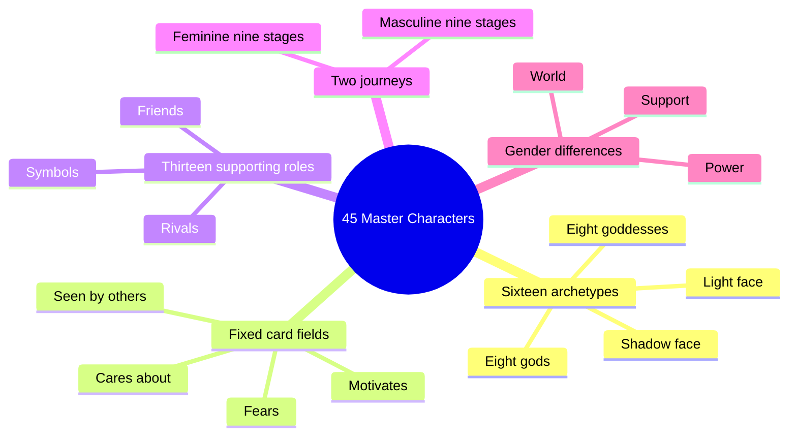
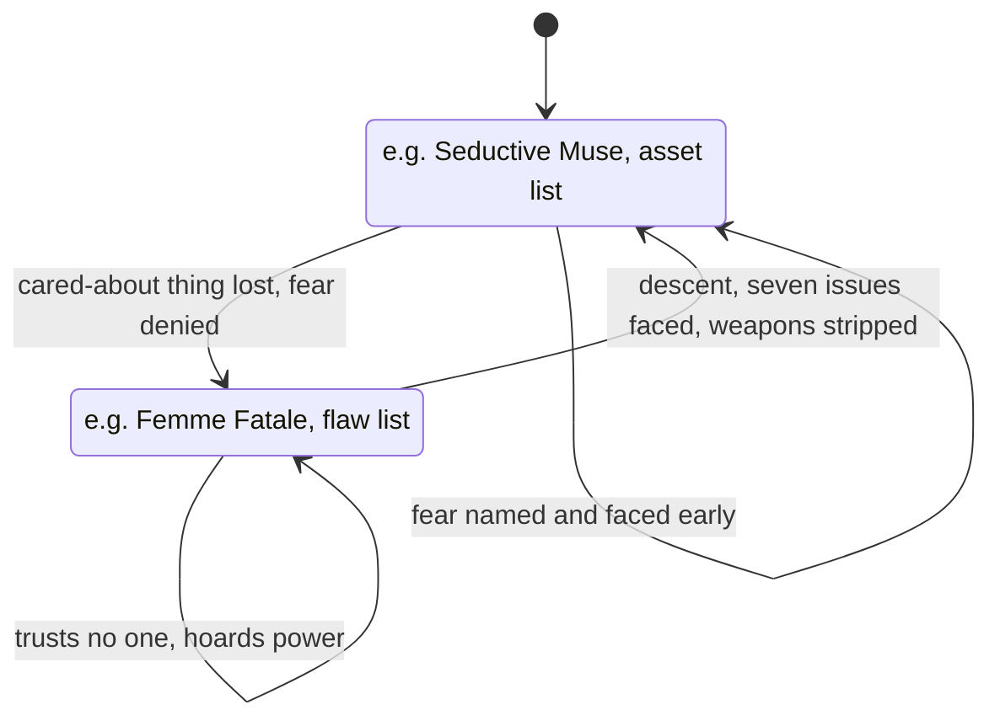
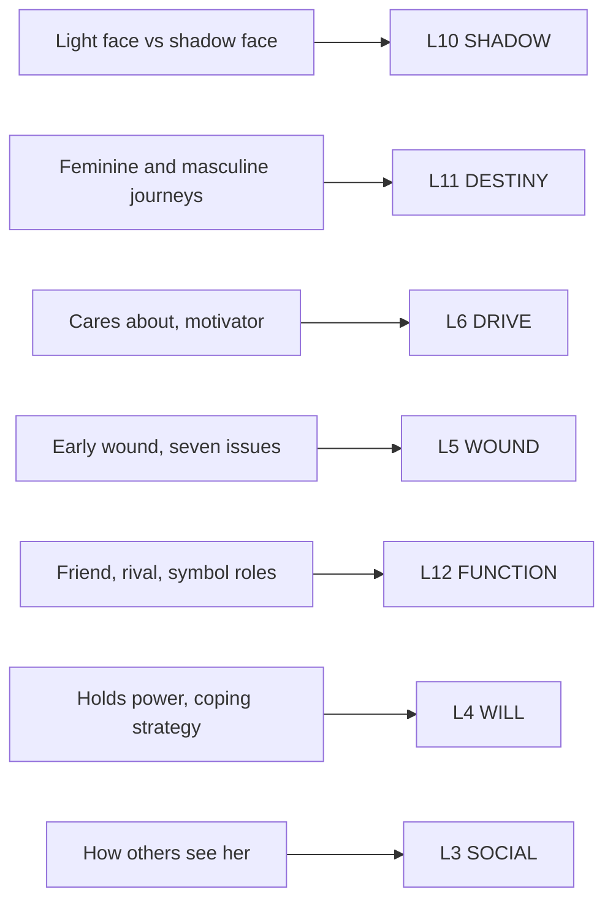

# BVX.0045 — 45 Master Characters: Mythic Models for Creating Original Characters — Victoria Lynn Schmidt (2012)
### Knowledge Entry — Distill

A pop-Jungian catalog for writers: sixteen god/goddess archetypes each split into a light face and a shadow face, thirteen supporting-character functions, and two nine-stage mythic journeys (feminine and masculine) that give any archetype a growth arc.

## TABLE OF CONTENTS
- [Core Thesis](#1-core-thesis)
- [Mind Models](#2-mind-models)
- [Framework](#3-framework--structure)
- [Key Concepts](#4-key-concepts)
- [Heuristics](#5-heuristics--decision-rules)
- [Invariants](#6-invariants)
- [Pitfalls](#7-pitfalls--myths)
- [Application](#8-application)
- [Cross-References](#9-cross-references)
- [Provenance](#10-provenance--confidence)

---

## 1 · CORE THESIS

A character is one of sixteen mythic archetypes, each carrying a light face and a shadow face it curdles into when its cared-about thing is threatened and its fear denied. Two nine-stage journeys, feminine (gaining power) and masculine (surrendering it), give any archetype a growth arc across three acts.

---

## 2 · MIND MODELS

*Required. Minimum two diagrams, maximum five. See template §C for the rules.*

**Diagram 1 — the whole argument.**
Caption: *sixteen archetypes share one fixed card, thirteen supporting roles ride alongside them, and two journeys turn either into a plot.*

**Diagram 2 — the central mechanism.**
Caption: *the shadow is not a different archetype, it is the same one under an unmet fear; the descent (Stage 4/6) is the only path back.*

**Diagram 3 — the feminine journey beside the masculine journey.**
Caption: *both run three acts and nine stages, but she moves from illusion toward power while he moves from power toward surrender.*

**Diagram 4 — mapped onto the Command's 12-layer character stack.**
Caption: *the book's real weight sits on two layers, SHADOW and DESTINY; the rest is contextual seasoning around them.*

---

## 3 · FRAMEWORK / STRUCTURE

Five parts, twenty-five chapters, one appendix.

| Part | Chapters | Content |
|---|---|---|
| **I · Getting Started** | 1-2 | What archetypes are and aren't (vs. stereotypes); how to read a character to find her archetype |
| **II · Female Heroes and Villains** | 3-10 | Eight goddess archetypes: Aphrodite (Seductive Muse/Femme Fatale), Artemis (Amazon/Gorgon), Athena (Father's Daughter/Backstabber), Demeter (Nurturer/Overcontrolling Mother), Hera (Matriarch/Scorned Woman), Hestia (Mystic/Betrayer), Isis (Female Messiah/Destroyer), Persephone (Maiden/Troubled Teen) |
| **III · Male Heroes and Villains** | 11-18 | Eight god archetypes: Apollo (Businessman/Traitor), Ares (Protector/Gladiator), Hades (Recluse/Warlock), Hermes (Fool/Derelict), Dionysus (Woman's Man/Seducer), Osiris (Male Messiah/Punisher), Poseidon (Artist/Abuser), Zeus (King/Dictator) |
| **IV · Supporting Characters** | 19-22 | Friends (Magi, Mentor, Best Friend, Lover); Rivals (Joker, Jester, Nemesis, Investigator, Pessimist, Psychic); Symbols (Shadow, Lost Soul, Double) |
| **V · The Feminine and Masculine Journeys** | 23-25 | Introduction to archetypal journeys (gender differences in power, support, world); the feminine journey (nine stages); the masculine journey (nine stages) |
| **Appendix** | — | Worksheets for both journeys; a Journey Differences table; a Societal/Gender Differences table |

Jungian psychology names seven master archetypes; Schmidt keeps them, splits each into a female and male face where the myth allows it, and adds an eighth pairing of her own — the Messiah (Isis/Osiris) — because Jung's system has no slot for "powerful enlightened being," a gap she says *The Matrix* proved commercially real.

---

## 4 · KEY CONCEPTS

| Concept | What it is | Why it matters |
|---|---|---|
| **The fixed archetype card** | Four questions asked of every archetype: what she cares about, what she fears, what motivates her, how other characters see her | The schema every one of the sixteen entries repeats verbatim — the book's real unit of reuse, not the myths themselves |
| **Light face / shadow face** | Each archetype's healthy expression and its curdled opposite (Amazon/Gorgon, King/Dictator), given separately with its own asset list and flaw list | The book's version of dramatic range within one archetype rather than across several |
| **Assets and Flaws lists** | A bulleted inventory closing each face — e.g. the Seductive Muse "loves herself in a healthy way," the Femme Fatale "trusts no one" | The fastest-scanning part of each entry; a checklist for consistency, not a personality in itself |
| **Segar's seven motivators** | Survival, Safety and Security, Love and Belonging, Esteem and Self-Respect, Need to Know and Understand, the Aesthetic, Self-Actualization | Each archetype resonates with one dominant motivator; this is the book's borrowed (Linda Segar) motivation taxonomy, not Schmidt's own invention |
| **Growth pairing** | Each archetype entry names two or three other archetypes that could teach it to grow (the Seductive Muse pairs with the Woman's Man, the Messiah, the Recluse, the Amazon) | A built-in cast-design heuristic: put the hero's growth-teacher archetype into the story as a second character |
| **The origin-event question** | "What happened at an early age to cultivate this archetype in your character?" asked of every entry | Fixes which archetype dominates under stress; an adaptation, not a birth trait |
| **Five coping strategies (feminine Stage 1)** | Naive, Cinderella, Exceptional, Pleasing, Disappointed — five ways a heroine keeps her "perfect world" illusion running | Lets any archetype enter the feminine journey through a different flavor of denial |
| **The Seven Issues (feminine Stage 4, the Descent)** | Fear/safety, guilt/desire, shame/identity, grief/relationship, lies/expression, illusion/intuition, attachment/self-awareness — modeled on Inanna's seven gates | A menu for what a heroine loses at each gate; not sequential requirements, a pick-list |
| **The Three Ps (masculine world)** | Perform, Provide, Protect — the demands society puts on the masculine-journey hero before Act I even opens | The male-side equivalent of the five coping strategies; sets up what Act III's surrender costs him |
| **Thirteen supporting-character types** | Friends: Magi, Mentor, Best Friend, Lover. Rivals: Joker, Jester, Nemesis, Investigator, Pessimist, Psychic. Symbols: Shadow, Lost Soul, Double | Cast-filling functions, each with its own "creates conflict for the hero by..." list, independent of the sixteen lead archetypes |
| **Gender differences: power, support, world** | Women gain power to awaken; men surrender it. Society genuinely supports a male hero's departure, not a female one's. Women navigate a dangerous/demanding world, men a world of expectation (the Three Ps) | The stated engine-difference between the two journeys, argued before either journey's stage list is given |

---

## 5 · HEURISTICS & DECISION RULES

| Situation | Do this | Not this |
|---|---|---|
| Picking an archetype for a lead | Write a one-page outline for three different archetypes in the same story, see which grows the most from the obstacles you already have | Pick the archetype that requires the least change from your current draft |
| A character reads as a stereotype | Ask the four fixed-card questions (cares about, fears, motivates, seen by others) | Add physical quirks without touching motivation |
| Need a growth partner for the lead | Cast one of the archetype's named growth pairings (King needs Artist or Businessman) as a second major character | Invent an unrelated mentor figure from scratch |
| A woman lead won't leave her "perfect world" | Assign her one of the five coping strategies and use its specific betrayal (job loss, male abandonment, being passed over) to break it | Have the plot force her out with no internal coping mechanism shown first |
| A male lead's arc feels flat | Check whether he ever reaches Stage 5 (Invitations) and says "no" to the feminine path before Act III's fork | Give him a change of heart with no prior refusal to set it against |
| Choosing what a heroine loses in the Descent | Pick two or three of the Seven Issues deliberately, not all seven | Treat all seven as a mandatory checklist |
| A subplot needs friction, not another archetype | Pull from the thirteen supporting types (a Nemesis, a Pessimist, a Double) instead of adding a second lead-scale archetype | Duplicate an existing archetype's function in a smaller role |
| Deciding whether a character is "still" her archetype under new behavior | Check what she does in her major scenes under stress, not what she claims to believe | Trust stated values over stress-tested action |

---

## 6 · INVARIANTS

1. Every archetype has both a light face and a shadow face; neither exists without the other in the book's own structure.
2. The four fixed-card fields (cares about, fears, motivates, seen by others) are asked of all sixteen archetypes without exception.
3. An archetype is fixed by an early-life adaptive event, not by innate nature — "what happened at an early age" is asked every time.
4. Under stress, the dominant archetype always surfaces, regardless of a character's stated beliefs.
5. The feminine journey moves the hero toward gaining power; the masculine journey moves the hero toward surrendering it. Gender of the character and gender of the journey are explicitly decoupled ("Gender-Bending" sections exist for both).
6. Both journeys run nine stages across three acts; neither collapses to fewer without losing a named beat.
7. Archetypes are not stereotypes: the book insists archetypes come from the whole human record while stereotypes come from one person's prejudice.

---

## 7 · PITFALLS / MYTHS

- Treating an archetype as a stereotype — the book's own opening distinction, easy to blur under deadline.
- Letting the archetype dictate the plotline (a King doesn't require a story about control; the desire filters into subtext, not premise).
- Modeling a character too tightly on one real person, including the writer.
- Assuming a female character must take the feminine journey or a male character the masculine one — the book explicitly builds gender-bent worked examples (American Beauty on the feminine journey, presumably a female hero on the masculine one) to block this assumption.
- Forcing all Seven Issues of the Descent into one character's arc instead of selecting a few.
- Reading Change (the masculine journey's Awaken path) as automatically "better" than Rebellion — the book frames Rebellion as a real, failure-bound outcome, not a lesser draft.
- Confusing an archetype's shadow face with a different archetype entirely, rather than the same archetype's curdled state.

---

## 8 · APPLICATION

- **Spine level:** L5 (Character) and L4 (the journeys as plot shape, per the task's own framing) — Schmidt operates in the persons register the SSOT keys as downstream of the spine, never as the spine's own structural claims.
- **12-layer character stack:** primary on **L10 SHADOW** (the light/shadow face pair) and **L11 DESTINY** (the two nine-stage soul-evolution journeys); supporting on **L6 DRIVE**, **L5 WOUND**, **L12 FUNCTION**; contextual on **L4 WILL**, **L3 SOCIAL** — see Diagram 4.
- **plot_systems:** the nine-stage journeys are act-level plot shapes keyed to an internal state (illusion, betrayal, descent, death, rebirth for her; false security, small success, refusal, death, awaken-or-rebel for him) — a third independent vocabulary alongside Dramatica's Signposts/Journeys and McKee's beat grammar, all describing the same territory at different resolutions.
- **Setting:** not applicable — no dedicated setting chapter; "world" appears only as the gendered social pressure-field (dangerous/demanding for women, opportunity/expectation for men) surrounding the character, not a physical model.

**For the character system:**
- **What this book adds:** a ready-made light/shadow pairing for sixteen archetypes with named assets and flaws, plus two complete nine-stage plot-shape templates (feminine, masculine) that convert any archetype's arc into an act structure without further invention.
- **Which layer it feeds hardest:** L10 SHADOW and L11 DESTINY carry the book's full weight; every other layer touch (L6, L5, L12, L4, L3) is a byproduct of the fixed card's four questions, not a separate system.
- **Archetype-card fields vs. the twelve layers:** the four fixed fields (cares about, fears, motivates, seen by others) each land on one existing layer — cares-about/motivates on L6 DRIVE, fears on L5 WOUND, seen-by-others on L3 SOCIAL — so the card is a compressed four-question interview across three layers, not a thirteenth one.
- **Schmidt's sixteen vs. Dramatica's eight (L12):** no collision. Dramatica's 8 Archetypal Characters (Protagonist/Antagonist/Guardian/Contagonist/Reason/Emotion/Sidekick/Skeptic) are *cast-relative functions* bundling Story Mind Elements — a character is one of these only in relation to the plot's structure. Schmidt's 16 (+13 supporting) are *persons* with a mythic content and a shadow face, portable across any Dramatica function; a Femme Fatale can occupy the Antagonist function in one story and the Contagonist in another without changing archetype. Her thirteen supporting types (Mentor, Nemesis, Shadow, Double, etc.) sit closer to Dramatica's Archetypal Characters in shape (relational, cast-filling) but are named by relationship-to-hero rather than by Element-bundle — a second, non-competing supporting-cast vocabulary.
- **What she argues a character model needs that the twelve layers do not name:** an explicit **growth-pairing** field (which other archetype teaches this one to grow, stated per-entry) and an explicit **coping-strategy** typology at the start of a plot (the five feminine-journey strategies; the Three Ps for the masculine world) — both are OPEN candidates: growth-pairing could live as an L11 DESTINY sub-field ("catalyst archetype"), and coping-strategy as an L4 WILL or L8 IMPRINT sub-field ("default denial pattern"), but neither has a named home in the current twelve-layer stack.

---

## 9 · CROSS-REFERENCES

| Related entry | Relation |
|---|---|
| [[BVX.0089]] | Dramatica — see §8 for the full non-collision argument: Dramatica's 8 Archetypal Characters are cast-relative functions (L12), Schmidt's 16+13 are portable persons (L10/L11) |
| [[BVX.0064]] | McKee, *Character* — McKee's true-character/subconscious split and Schmidt's light/shadow face are two independent routes to the same claim, that a character's real self surfaces under pressure rather than being announced |
| [[BVX.0075]] | Davis — Davis's self-belief/audience-belief gap (L10, supporting) and Schmidt's shadow face are both dramatic-irony mechanisms built into characterization; Davis's will/counter-will (L4) is a finer-grained version of Schmidt's "resistance to change" |
| [[BVX.0193]] | Truby, *The Anatomy of Story* — Truby's organic, single-growth-line character model is a natural comparison point for Schmidt's two fixed nine-stage journeys as alternative growth-shape templates |

---

## 10 · PROVENANCE & CONFIDENCE

Full text, pdftotext extraction (331 pages, ~66,000 words). Read in full: the Introduction (confirms this is the revised edition — "when I wrote this book ten years ago," a new 46th downloadable character, first edition c. 2001); Part I in full (Chapters 1-2, archetypes vs. stereotypes, the fixed-card method, combining archetypes); Part V in full (Chapters 23-25: gender differences in power/support/world, both nine-stage journeys stage-by-stage with worked film/literary examples and craft tips); the Appendix worksheets and both differences tables in full. Sampled at full-entry depth to confirm the fixed schema: Aphrodite (Ch.3, complete, light and shadow face both read in full) and the King/Zeus shadow-face heading (Ch.18) confirmed the same section order repeats for male archetypes. Sampled at heading/skim level to confirm coverage and naming only (not read narrative-by-narrative): the remaining fourteen archetype chapters (4-9, 11-17) and the supporting-character chapters (19-22, one full entry — the Magi — read to confirm the friends/rivals/symbols schema).

**Edition note:** the text itself, not external metadata, confirms this is the Writer's Digest revised edition (the Introduction's "ten years ago" plus the 46th-character download offer), consistent with the task brief's first ed. 2001 / revised ed. 2012. No discrepancy found between the Zotero record's apparent identity and the source text; the year given here (2012) follows the revised-edition Introduction rather than the original 2001 publication.

## META
- Template: BVX-LEARN-v4.0
- Source classification: full-text book, pdftotext extraction; framing chapters (1-2, 23-25) and appendix read in full, sixteen archetype chapters sampled (one full entry plus systematic heading pass), supporting-character chapters sampled (one full entry plus heading pass)
- Created / Updated: 2026-09-16
