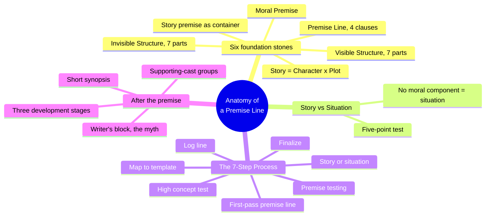
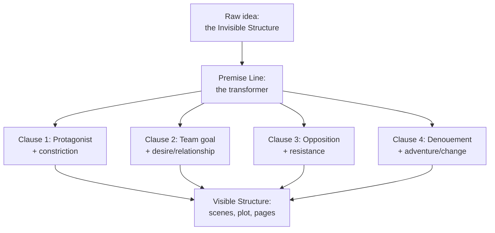
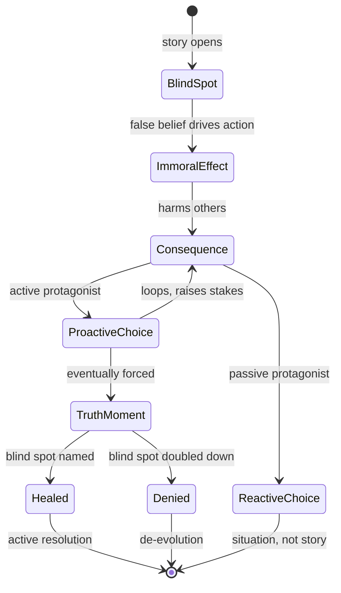
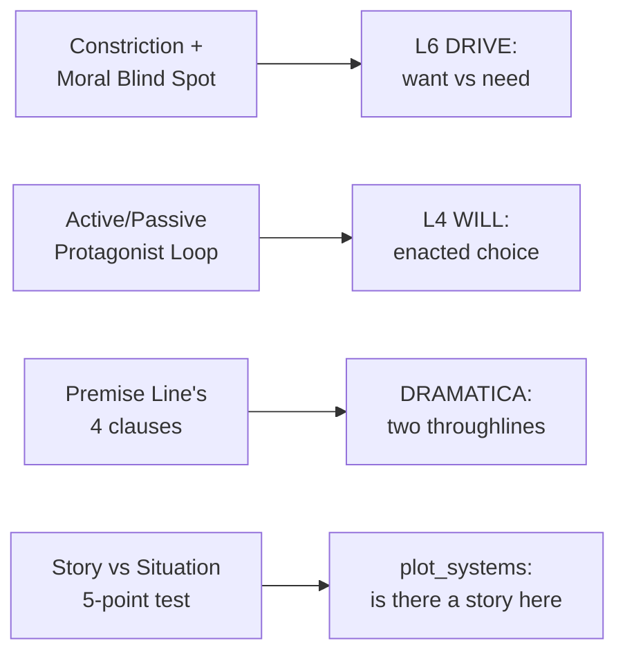

# BVX.0054 — Anatomy of a Premise Line — Jeff Lyons (2015)
### Knowledge Entry — Distill

A screenwriting-craft manual built around one claim: a story fails or succeeds at the premise stage, before a page is written, and premise can be developed with a repeatable process rather than waited for as inspiration.

## TABLE OF CONTENTS
- [Core Thesis](#1-core-thesis)
- [Mind Models](#2-mind-models)
- [Framework](#3-framework--structure)
- [Key Concepts](#4-key-concepts)
- [Heuristics](#5-heuristics--decision-rules)
- [Invariants](#6-invariants)
- [Pitfalls](#7-pitfalls--myths)
- [Application](#8-application)
- [Cross-References](#9-cross-references)
- [Provenance](#10-provenance--confidence)

---

## 1 · CORE THESIS

A story premise is a container, not a logline: it holds the story's Invisible Structure (character, constriction, desire, relationship, resistance, adventure, change) until a Premise Line converts it into the Visible Structure that plays on the page. The engine driving both is the protagonist's moral blind spot, a false belief they can't see.

---

## 2 · MIND MODELS

*Required. Minimum two diagrams, maximum five.*

**Diagram 1 — the whole argument.**
Caption: *six foundation stones build one tool (the premise line), which a seven-step process applies, then tests, before a page gets written.*

**Diagram 2 — the central mechanism (a transformation, in the order it runs).**
Caption: *the premise line is a step-down transformer — it takes the raw, overcharged idea and steps it down into four clauses a page can actually run on.*

**Diagram 3 — the moral engine (a state change, active vs. passive).**
Caption: *the same blind spot produces two different stories: named and healed, it resolves; denied, it de-evolves; never engaged at all, it was only ever a situation.*

**Diagram 4 — mapped onto the Command's spine.**
Caption: *Lyons's own vocabulary lands cleanly on L4 and L6 without ever naming either, and independently re-derives Dramatica's two-throughline requirement from craft observation alone.*

---

## 3 · FRAMEWORK / STRUCTURE

Three parts, each building on the last:

| Part | Content | Governing question |
|---|---|---|
| Part 1 — Premise and Story: Building the Foundation | The six foundation stones: story premise, Invisible Structure, Visible Structure, premise line, story/character/plot, moral premise | What are the pieces every premise is made of? |
| Part 2 — The 7-Step Premise Development Process | Story-vs-situation test, mapping to the premise-line template, high concept, log line, finalizing, premise testing | How do I turn an idea into a tested, working premise line? |
| Part 3 — Development: A Few Remaining Nuts and Bolts | Short synopsis, the three stages of development (business, script, story), supporting-cast groups, the writer's-block myth | What comes after the premise line is done? |

The book's own architecture mirrors its central claim: it moves from the abstract (Part 1's foundation stones, stated as impressions and feelings) to the concrete (Part 2's step-by-step template work) to the practical (Part 3's synopsis and cast mechanics) — the same abstract-to-concrete path it says every story must travel.

---

## 4 · KEY CONCEPTS

| Concept | What it is | Why it matters |
|---|---|---|
| **Invisible Structure** | The seven components that "drop in" together as one undifferentiated idea: character, constriction, desire, relationship, resistance, adventure, change | The raw material every story premise is made of, before any craft work separates the parts |
| **Visible Structure** | The one-to-one concrete mirror of the Invisible Structure: protagonist, moral component, chain of desire, focal relationship, opposition, plot & momentum, evolution/de-evolution | Names the target: what each invisible impulse must become on the page |
| **Premise Line (four clauses)** | Protagonist Clause -> Team Goal Clause -> Opposition Clause -> Denouement Clause, one sentence mapping all fourteen invisible/visible components | The single tool that bridges Invisible and Visible Structure; Lyons calls it a step-down transformer for an "overcharged" idea |
| **Magic Formula** | Character = Plot = Story (not additive — equivalent, interdependent) | Kills the instinct to treat plot and character as separable problems; neither can develop without the other |
| **Story vs. Situation** | A situation has an obvious solvable problem, doesn't reveal character, and begins and ends in the same emotional space; a story requires change and a moral component | The load-bearing diagnostic: most failed scripts are situations mistaken for stories |
| **Moral Component (3 parts)** | Moral blind spot (a false core belief) -> immoral effect (the blind spot in action, harming others) -> dynamic moral tension (the engine of forced choice) | The controlling-idea machinery: this is what makes a premise more than a plot outline |
| **Active vs. Passive Protagonist Loop** | Active: every event sources from the protagonist's moral component and feeds forward. Passive: events are external, the protagonist only reacts | Names exactly why "mushy middles" and episodic writing happen — a passive loop generates no causal chain |
| **High concept vs. soft-generic** | High concept: premise pops on its own, sells itself in one line; soft: needs execution to be felt | A market-facing filter, not a craft judgment — Lyons is explicit neither type is "better" |
| **Premise Testing Checklist** | A seven-step, third-party-scored worksheet (soft/high-concept, story/situation, log line, tagline, revision, unit test) | Converts "I have a feeling this works" into an objective, repeatable check before drafting begins |
| **Three supporting-cast groups** | Messenger/Helper (delivers information, then vanishes) · Complication/Red Herring (creates chaos or false leads) · Reflection/Cautionary Tale (mirrors the protagonist's moral component) | Only the third group is thematically load-bearing; the other two exist to serve plot mechanics, not theme |
| **Backing into the story** | Writing pages before the premise is developed, getting lost, then retracing every step back to the original idea | The single most common and costly failure mode the whole process is built to prevent |
| **The writer's-block myth** | So-called "block" is not a special neurosis; it is choice-paralysis from having too many ideas and not trusting which one to pick | Reframes the fix as a craft problem (fall back on structure) rather than a therapy problem |

---

## 5 · HEURISTICS & DECISION RULES

| Situation | Do this | Not this |
|---|---|---|
| An idea excites you and you want to start drafting | Write the premise line first; develop story before writing pages | Start pages and hope the story reveals itself as you go |
| Choosing the inciting incident / constriction | Tie it directly to the protagonist's moral blind spot | Use any random event that just "gets the plot moving" |
| Writing the ending of a premise line | State exactly how it resolves, in full | Trail off with hype ("...and learns a life-changing lesson") |
| Defining what the protagonist wants | Make the desire tangible and achievable on screen/page | Choose an ethereal goal (inner peace, world harmony) that can't be dramatized |
| Deciding if you have a story or a situation | Check: does it end in a different emotional place, and is there a moral component? | Assume any entertaining, well-plotted idea is automatically a story |
| Building the middle of the draft | Route every scene-level choice back through the protagonist's moral component | Let the middle run on external incident after external incident |
| Populating the supporting cast | Reserve at least one character as a reflection/cautionary-tale mirror of the theme | Fill every supporting role with messengers and complications only |
| Feeling blocked mid-draft | Diagnose: is this a life problem or a craft-choice problem? Fall back on structure | Treat all blockage as one undifferentiated crisis needing inspiration or therapy |
| Testing a finished premise line | Hand the checklist to objective third parties, not friends and family who'll flatter you | Trust your own read alone before committing months to drafting |

---

## 6 · INVARIANTS

1. **Every story runs two structures, not one.** An Invisible Structure (raw, felt, seven parts) and a Visible Structure (concrete, seven parts) are both present in any working story, in a fixed one-to-one correspondence.
2. **Character and plot are equivalent, not additive.** Neither develops independently; the Magic Formula (Character = Plot = Story) holds regardless of genre.
3. **A constriction with no tie to the protagonist's moral blind spot reads as false.** Audiences detect this even without the vocabulary to name it.
4. **A situation is not a story.** Lacking a moral component and ending in the same emotional space it began, a situation can still be entertaining, but it is a different craft object with different rules.
5. **An active protagonist sources events from within; a passive one only reacts.** This single variable determines whether a middle builds or goes episodic.
6. **The premise line's four clauses always carry all seven Invisible Structure components between them.** Nothing in the raw idea is optional; it is only ever redistributed across the clauses.
7. **Writer's block, as popularly defined, is not a distinct phenomenon.** What is called block is either a life problem bleeding into writing, or choice-paralysis from too many viable ideas — never a separate creative pathology.

---

## 7 · PITFALLS / MYTHS

- Believing "story development" and "writing pages" are the same activity — they are two different skills, and conflating them is the single most common cause of failed drafts.
- Treating a non-human subject (a sport, an object, an abstract idea) as if it could be a protagonist; the Invisible Structure requires a human center.
- Writing a premise line that vagues out at the ending instead of stating the resolution plainly.
- Choosing an ethereal, undramatizable desire (inner balance, world peace) as the protagonist's goal.
- Mistaking a well-produced, well-marketed situation (a disaster movie, a procedural) for a story with a moral component, simply because it is engaging.
- Populating every supporting role with plot-mechanical characters (messengers, red herrings) and leaving no reflection/cautionary-tale character to carry the theme.
- Accepting "writer's block" as an unavoidable neurosis rather than diagnosing whether the real problem is a life issue or an unresolved craft choice.
- Skipping the premise-testing step because it "isn't creative," then discovering the structural gap only after months of drafting.

---

## 8 · APPLICATION

- **Spine level:** L4 and L6 — the active/passive protagonist loop is a will-enactment mechanism (L4), and the moral blind spot / immoral effect / dynamic moral tension triad is the controlling idea's engine (L6, the want-vs-need split specifically)
- **12-layer character stack:** L6 DRIVE (moral blind spot as the lie beneath the want, truth moment as where need surfaces) primary; L4 WILL (the loop's forced choices) primary; contextual overlap with L11 (the truth moment is a revelation-or-earned-change event, though Lyons never frames it that way)
- **plot_systems:** strong candidate feed for `04_PLOT_SYSTEMS/` (currently empty per the spine SSOT) — the four-clause premise line is a ready ordering check (protagonist -> team goal -> opposition -> denouement), and the story-vs-situation five-point test is a fast pre-flight diagnostic for any drafted scene sequence: does this stretch of plot still carry a moral component, or has it drifted into situation
- **Setting:** none — this is a pure premise/theme/plot-development source with no worldbuilding content

Lyons's real contribution to a theme system is making the controlling idea mechanical rather than mystical: the moral blind spot is a specific, nameable, testable belief, and the active/passive loop gives a binary diagnostic (does action source from the belief, or just happen to the protagonist) for whether a draft's theme is actually operating or merely stated. Where BVX.0089 (Dramatica) holds theme as structural position (Issue/Counterpoint) and BVX.0175 (McKee) holds it as the Controlling Idea proven through the Gap, Lyons supplies the clinical vocabulary for diagnosing a theme that isn't working: name the blind spot, trace whether the immoral effect is dramatized on the page, and check whether the loop is active or passive. The premise-testing checklist is a directly portable pre-draft gate: run any story idea's premise line through the story-vs-situation test and the blind-spot check before committing chapters to it.

---

## 9 · CROSS-REFERENCES

| Related entry | Relation |
|---|---|
| [[BVX.0089]] | Dramatica — holds L6 as theme-via-structural-position (Issue/Counterpoint, Problem/Solution); this entry supplies a craft-level diagnostic (the blind spot) for the same territory from a wholly independent, non-Dramatica tradition |
| [[BVX.0175]] | McKee, *Story* — the library's deepest existing L4/L6 holding; McKee's Gap (minimal action, outsized reaction) and Lyons's moral blind spot / immoral effect are two names for the same escalation engine |
| [[BVX.0163]] | Snyder, *Save the Cat!* — "Theme Stated" (want vs. need) is a commercial-template instance of the same want/need split Lyons builds a full three-part mechanism around |
| [[BVX.0236]] | Coyne, *The Story Grid* — the story-vs-situation test and Coyne's Five Commandments both function as diagnostic instruments run against a manuscript, rather than generative templates |
| [[BVX.1123]] | Egri, *The Art of Dramatic Writing* — Lyons explicitly traces the premise line's lineage to Egri's three-part premise (character, conflict, ending) as the direct historical ancestor of the Moral Component |

---

## 10 · PROVENANCE & CONFIDENCE

Full text, extracted from PDF, clean text layer with a machine-readable TOC. Read in full: front matter and Introduction (audience, book structure, six foundation stones); Chapter 1 (Your First Book in Story Development, the 7-Step Process named); Chapter 2 (historical definitions of story premise, including the Aristotle/Freytag/Egri lineage); Chapter 3 (The Invisible Structure, all seven components); Chapter 4 (The Visible Structure — Protagonist, Moral Component, Chain of Desire, Focal Relationship, Opposition, Plot & Momentum, in full; Evolution-De-Evolution sampled via heading only); Chapter 5 (Anatomy of a Premise Line, all four clauses, the Jaws test case); Chapter 6 (A Story vs. a Situation — the Magic Formula, definitions of character and plot, the five components of a situation, in full); Chapter 7 (The Moral Premise — moral blind spot, immoral effect, dynamic moral tension, the active and passive protagonist loops, worked fully with the Joe-the-bank-robber example and four literary/film case studies); the Part 2 introduction (why a process, not a list); the premise-testing chapter's "How to Use the Premise Testing Checklist" section; the Part 3 introduction; Chapter 10 (Character Development — the three supporting-cast groups, in full); Chapter 11 (The Myth of Writer's Block, in full through the first step of the busting process).

Sampled (heading-level, not deep-extracted): the High-Concept 7-components detail, the Log Line and Tagline worksheets, the Short Synopsis Worksheet, the Three Stages of Development (business/script/story) detail, and Appendices A-D (worksheets, examples, e-resources, writer resources).

The spine keying (`[L4, L6]`) and `feeds:` entries are this distill's synthesis, made under this session's explicit redirect from BOLO 87's setting-shelf template toward BOLO 80 (the theme system) and the plot system: heuristics and mind models here are aimed at premise, controlling idea, and story development, not worldbuilding, per that instruction.

## META
- Template: BVX-LEARN-v4.0
- Source classification: full-text book, deep extraction on 8 of 11 chapters plus front matter, sampled on 3
- Created / Updated: 2026-09-29
