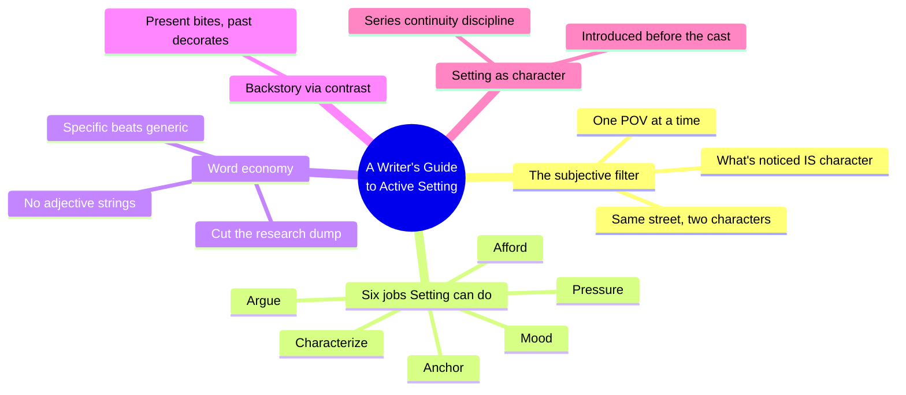
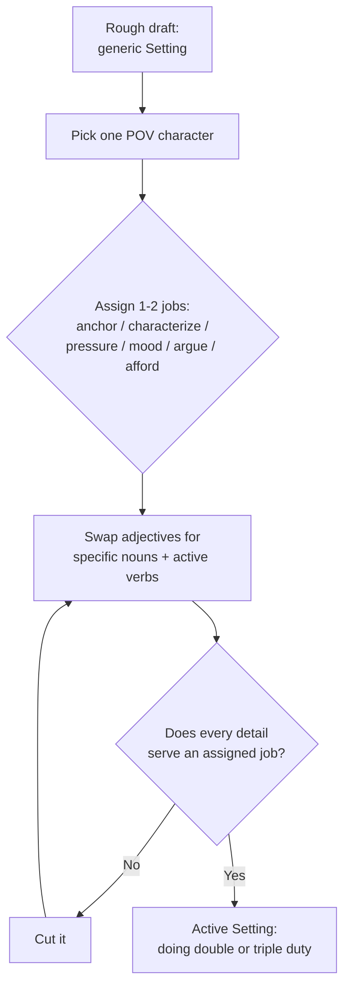
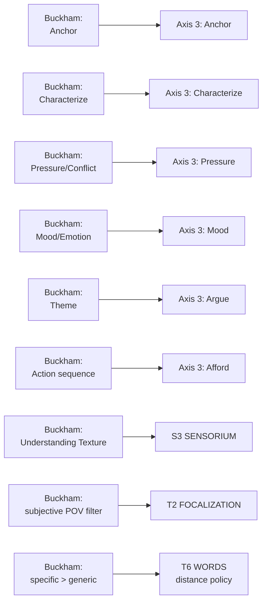

# BVX.0056 — A Writer's Guide to Active Setting — Mary Buckham (2015)
### Knowledge Entry — Distill

The Writer's Digest omnibus of Buckham's self-published Active Setting trilogy: a workshop-tested craft manual that turns "describe the room" into a six-job deployment discipline, filtered always through one character's subjective attention.

## TABLE OF CONTENTS
- [Core Thesis](#1-core-thesis)
- [Mind Models](#2-mind-models)
- [Framework](#3-framework--structure)
- [Key Concepts](#4-key-concepts)
- [Heuristics](#5-heuristics--decision-rules)
- [Invariants](#6-invariants)
- [Pitfalls](#7-pitfalls--myths)
- [Application](#8-application)
- [Cross-References](#9-cross-references)
- [Provenance](#10-provenance--confidence)

---

## 1 · CORE THESIS

Setting only earns its words when filtered through one specific character's subjective attention and assigned one of six jobs — anchor, characterize, pressure, mood, argue, or afford — never described for its own sake. Three exact, contrast-loaded details beat ten generic ones; an invented world needs this discipline more than a real one, not less.

---

## 2 · MIND MODELS

*Required. Minimum two diagrams, maximum five.*

**Diagram 1 — the whole argument.**
Caption: *ten workshop chapters sort into one filter (whose eyes) crossed with six jobs (what for) — the book is a drill, not a reference shelf.*

**Diagram 2 — the central mechanism (a process, run identically on nearly every page).**
Caption: *the book teaches by teardown — generic draft to annotated final — and that teardown is itself the technique: filter, assign, specify, test, cut.*

**Diagram 3 — mapped onto the Command's SETTING and TEXTURE systems.**
Caption: *this book is where Axis 3's six mode-names come from, word for word; it also operationalizes two TEXTURE questions the current T-wave hasn't cited yet.*

---

## 3 · FRAMEWORK / STRUCTURE

Ten workshop chapters in three parts, each ending in a Recap and a hands-on Assignment — this is a taught course, not a reference text, built from "hundreds and hundreds of writing students" per the acknowledgments.

| Part | Chapters | Governing move |
|---|---|---|
| **One — Characterization & Sensory Detail** | Ch.1 Getting Started (Anchoring, Subtext, Pacing) · Ch.2 Subjective Setting Reveals Character · Ch.3 Sensory Detail / Texture | Establish the filter: Setting exists only through one character's attention |
| **Two — Emotion, Conflict & Backstory** | Ch.4 Setting Shows Emotion · Ch.5 Setting Creates Complication (incl. Conflict & World Building) · Ch.6 Setting Shows Backstory | Assign Setting a job that drives the scene forward, never decorates it |
| **Three — Anchoring, Action, Setting as Character & More** | Ch.7 Anchor the Reader (deep POV, transitions) · Ch.8 Setting in Action Sequences · Ch.9 Setting as a Character (incl. series) · Ch.10 The Devil in the Details (pitfalls, wrap-up) | Scale the discipline: single scenes, chases, whole series |

Every chapter uses the same teaching move: a bland hypothetical first draft, then a published passage from a working genre novelist (Evanovich, Gilman, Collins, Child, Lehane, Hamilton, Penny, Ford, McCarthy, Welty, Conroy, Maron, Stabenow, and dozens more), clause-by-clause annotated to show exactly which words are doing the job and which are dead weight.

---

## 4 · KEY CONCEPTS

| Concept | What it is | Why it matters |
|---|---|---|
| **The subjective filter** | Setting exists on the page only through one POV character's specific attention at a given moment; change POV, change what's "in" the room | This is the mechanism, not a decoration — an ex-Special-Forces character on a street sees choke points and escape routes; a character who loves children sees chalk drawings and mini-vans. Same street, two worlds, zero exposition |
| **The six jobs** | A menu Setting can be assigned to — Anchor, Characterize, Pressure, Mood, Argue, Afford — one or two at a time, never all six in one passage | Deploying every job at once is noise; the book's discipline is choosing, which is the same rule the Command's own SCENE CARD already enforces on Axis 3 (max two modes) |
| **Anchoring** | A quick orientation — where, when, quality of light, quiet or noisy — owed in the first few paragraphs of any new scene, chapter, or location/POV shift | Once anchored, stop describing; let characters move through the space already established. Re-describing a known place stalls pacing |
| **Present-tense-bites backstory** | Backstory earns page space only in contrast with the *current* scene, delivered in 2–4 sentence nuggets through Setting, never a paragraph of pure history | A car racing toward her now raises a story question; a car that raced toward her at age seven, survived, does not — the reader already knows the outcome |
| **Setting as character** | A place introduced before or alongside the cast, described in more depth than usual, that the story cannot survive losing (Parker's Orange County, Conroy's Charleston, Welty's Delta) | Requires series-length continuity discipline: a drugstore that moves streets, or gains a story in height, between books breaks trust with returning readers |
| **Word economy** | "A Ming vase" beats "a pretty vase"; adjective strings (*plush red chair, pushed against the wide, polished wall*) are a tell for underdeveloped Setting | Swap piled adjectives for one exact noun or one active verb; specificity does the characterizing work generic description can't |
| **The draft-then-strip teardown** | The book's own teaching method: show a plausible rough draft, then the published sentence, annotated clause by clause | Models revision as the actual craft skill, not "know the technique" as an abstract rule |
| **Conflict and world-building** | A wholly invented setting (SF, fantasy, steampunk, dystopia) needs the *same* anchoring discipline as a real one — arguably more, since the reader has no default image to fall back on | Vagueness in an invented world doesn't read as mysterious, it reads as confusing; unique worldbuilding without a quick, concrete anchor casts the reader adrift with "no reference points to see where the characters are interacting" |
| **Texture** | The felt/tactile register (temperature, humidity, moving air) rendered as a character-specific metaphor, not a weather report | The same cornfield "nurtures" one character and "suck[s] the life out of" another — texture is where S3 SENSORIUM and the subjective filter fuse |

---

## 5 · HEURISTICS & DECISION RULES

| Situation | Do this | Not this |
|---|---|---|
| Opening a new scene, chapter, or location | Anchor in the first few paragraphs: where, when, light, noise level | Wait until "it's too late" and leave the reader guessing where the character is |
| Character re-enters an already-described place | Let them move through it without re-describing | Rehash the Setting a second time and stall pacing |
| Writing an invented SF/fantasy/steampunk world | Anchor it *at least* as fast and concretely as a real place | Assume "the reader should already know by now" and skip the anchor |
| Deciding what Setting detail to include | Ask which of the six jobs it serves (anchor / characterize / pressure / mood / argue / afford) | Include it because it was in your research notes |
| Revealing character via Setting | Filter the same location through this specific character's attention and background | Describe the room neutrally, then tell the reader what the character thinks of it |
| Working in backstory | Deliver it in a 2–4 sentence nugget that contrasts with the present scene | Front-load a paragraph of pure history in the opening chapters |
| Choosing description length | Match it to genre pace — mysteries/thrillers get a tight anchor, historicals/SF/literary can slow more, but never past two paragraphs before "something had better happen" | Default to the same Setting density regardless of genre or pacing needs |
| Writing a series | Repeat a few familiar "landmark" details per book, add one fresh contrasting detail per book | Either re-explain everything every book, or assume returning-reader knowledge and skip anchoring for new readers |
| Choosing word-level detail | One exact noun (Ming vase, live oak) or one active verb | A string of adjectives in front of a generic noun |

---

## 6 · INVARIANTS

1. **Setting is filtered through exactly one POV character at a time.** What that character notices, and what they ignore, *is* the characterization — there is no neutral description.
2. **A new scene, chapter, or location change needs anchoring in its first few paragraphs.** Once anchored, further description of the same place is dead weight until something changes.
3. **Every Setting detail must serve at least one of six jobs** — anchor, characterize, pressure, mood, argue, afford. Unowned detail is decoration, and decoration slows the reader down.
4. **Specific nouns and active verbs beat piled adjectives.** Three named, contrast-loaded things beat ten generic ones every time.
5. **Backstory delivered through Setting earns its space only by contrasting with, or biting, the present scene.** Depth of the past is not itself a virtue — direct parallel to the Kobold Guide's present-tense-history rule ([[BVX.0458]]), arrived at independently from the craft-technique side.
6. **In a series, repeat only landmark details across books; add exactly one fresh, contrasting detail per book.** Setting-as-character demands the same continuity discipline as any other recurring cast member.
7. **An invented world needs concrete, fast anchoring *more* than a real one, not less** — the reader has no default image to substitute, so vagueness in original worldbuilding reads as confusion, never as mystery.

---

## 7 · PITFALLS / MYTHS

- Dumping every sensory or historical detail gathered in research onto the page — that information is for the writer, sparingly, not the reader in full.
- Vague placeholder nouns ("a blue tract home," "tall evergreen") that force every reader to invent a different, possibly wrong, image.
- Backstory infodumps in the opening chapters, told rather than shown through contrast with the present.
- Series continuity errors: a location that changes shape, street, or height between books without in-story explanation.
- Adjective strings standing in for one well-chosen specific noun or verb.
- Treating Setting as scenery to be described once and forgotten, instead of assigning it ongoing narrative work.
- Assuming a wholly invented world is exempt from the anchoring discipline because "it's imaginary, so anything goes" — it is exactly backward; imaginary worlds need the anchor most.
- Overwriting a Setting so thoroughly (piling in every adjective and historical fact) that the reader's focus shifts away from the one detail that actually mattered.

---

## 8 · APPLICATION

- **Spine level:** SETTING (primary) and TEXTURE (supporting) — per the v4 template's binding rule, Setting is an entity beside the L0–L7 spine, never a level on it; this source also carries craft-of-telling weight that the TEXTURE shelf keys separately.
- **12-layer character stack:** none directly. The subjective-filter method is structurally the same move as focalization (T2) applied specifically to place — but it remains a setting/texture-side source, not itself a character-layer feed.
- **plot_systems:** contextual candidate once `04_PLOT_SYSTEMS/` opens — the Pressure job (Ch.5, "Conflict and World Building") is a ready-made scene-hook generator, the same shape as the Kobold Guide's conflict-first filter ([[BVX.0458]] Diagram 2): run any drafted location through "whose eyes, what job, what's opposed" before trusting it playable or publishable.
- **Setting:** primary. This book, together with its original three-volume self-published split (BVX.0268/0269/0270), is the named source of Axis 3 FUNCTION's six deployment modes (`ssot_03_setting_system.md` line 99) and a primary contributor to S3 SENSORIUM's method.

Tested against the DCUS starter instance already in `ssot_03`: the series-continuity invariant (don't let the mill move streets between books) is the same discipline the DCUS rename lattice (Skeeter Creek → Red Hills → DCUS, S5 SCAR) already has to hold — a setting bible's job, story to story, is exactly what Buckham's "Setting in a Series" chapter is teaching a genre novelist to do by feel.

**Where this is a TTRPG tool a writer can steal, even though it's not a game book:** the six-job filter is the exact discipline a GM's boxed text or a sourcebook's location write-up needs and usually lacks — before publishing a place description, ask whose eyes it's filtered through, which one or two jobs it's doing (never all six), and cut anything that isn't earning its line. This maps onto the Command's own SCENE CARD `function mode` field (max two, Buckham's own rule already built in) and gives it a concrete drafting method: write the info-dump first draft, then strip it exactly as Buckham strips hers, keeping only the nouns and verbs that carry the assigned job.

---

## 9 · CROSS-REFERENCES

| Related entry | Relation |
|---|---|
| [[BVX.0268]] | *Writing Active Setting, Book 1: Characterization and Sensory Detail* — the original self-published edition of this omnibus's Part One (Ch.1–3); undistilled, same source |
| [[BVX.0269]] | *Writing Active Setting, Book 2: Emotion, Conflict & Back Story* — original edition of Part Two (Ch.4–6); undistilled, same source |
| [[BVX.0270]] | *Writing Active Setting, Book 3: Anchoring, Action, as a Character and More* — original edition of Part Three (Ch.7–10); undistilled, same source |
| [[BVX.0267]] | *Writing Active Hooks, Book 2* — Buckham's sibling series extending the same evocative-description discipline to story openings and hooks |
| [[BVX.0458]] | Kobold Guide to Worldbuilding — counterpart SETTING-shelf distill: Kobold supplies Axis 2 STRATA (what a setting *is*, S1–S11); this book supplies Axis 3 FUNCTION (what a setting *does*) — read together for the full SETTING SLICE picture |
| [[BVX.1122]] | GURPS Hot Spots: Renaissance Venice — a worked SETTING-SLICE instance; Buckham's six-job filter is the missing FUNCTION layer a trade gazetteer like this one cannot supply on its own |
| [[BVX.0349]] | Against Worldbuilding, and Other Provocations — counter-argument sibling; its root claim (worldbuilding should serve pressure, not inventory) is this book's "if the details don't add to the story, leave them out" stated as a polemic rather than a workshop rule |

---

## 10 · PROVENANCE & CONFIDENCE

Full text, pdftotext extraction, ~463,000 characters, clean text layer with a machine-readable table of contents and readable chapter/subsection breaks.

Read in full: front matter (dedication, acknowledgments, Foreword, Introduction, Overview); Ch.1 *Getting Started with Active Setting* complete (Anchoring the Reader, Subtext in Setting, Setting the Stage, Pacing and Setting, What Not to Do, Recap); the opening worked examples of Ch.2 (the subjective-filter demonstration, Joe vs. Fran); the "Understanding Texture" section and its worked examples opening Ch.3; the "Reinforcing Story Themes" section of Ch.4 (Argue mode, Gerritsen example); the "Foreshadowing Trouble or Conflict via Setting," "Internal and Emotional Conflict," "Conflict and World Building," and "Orientation and Conflict" sections of Ch.5; the "Defining Backstory" and "Using Contrast" sections of Ch.6; Ch.9 *Setting as a Character* complete (When Place Matters, Evocative Detailed Setting, Setting in a Series, Orienting New Readers via Setting in a Series); Ch.10 *The Devil in the Setting Details* complete (Your Story Your Setting Is Unique, Pay Attention to Setting in What You Read and Write, Other Details to Remember, Additional Setting Pitfalls, Wrap Up); the Bibliography.

Sampled via table of contents and subheadings, not deep-extracted: the remainder of Ch.2 (Revealing Character Through Setting), the remainder of Ch.3 (Layering POV and Sensory Details, Ways to Bring Out Sensory Details), the remainder of Ch.4 (Creating an Emotional Experience, Using Concrete Descriptions, Foreshadowing), the remainder of Ch.5 (Conflict via Contrast), the remainder of Ch.6 (Tying It All Together), Ch.7 *Using Setting to Anchor the Reader* (POV/deeper-POV anchoring, transitioning via Setting, transitioning in large-worldbuilding stories, chapter and scene beginnings), and Ch.8 *Using Setting in an Action Sequence* (short cues, movement through space, word allocation, showing versus telling, character in action). The Assignment sections throughout were skimmed, not extracted — they are workshop exercises, not craft content.

The Axis 3 FUNCTION and S3 SENSORIUM keying in frontmatter `feeds:` confirms and extends `ssot_03_setting_system.md`'s own existing attribution (line 99, "Buckham-derived deployment modes"; line 195, "Buckham 0268/0269/0270 + 0267/0056 → Axis 3 + S3"). The TEXTURE-side T2/T6 keying is this distill's own synthesis against `ssot_01_texture_system.md` PART A and is **not yet** part of the texture_system's cited eight-source wave — flagged here as a candidate ninth source, not asserted as ruled. `spine: [TEXTURE, SETTING]` follows the source library's existing tag keying (`inventory-live.json`, spine_src: tag).

## META
- Template: BVX-LEARN-v4.0
- Source classification: full-text single-source craft manual, deep extraction on 6 of 10 chapters plus complete front/back matter, sampled on 4
- Created / Updated: 2026-09-29
