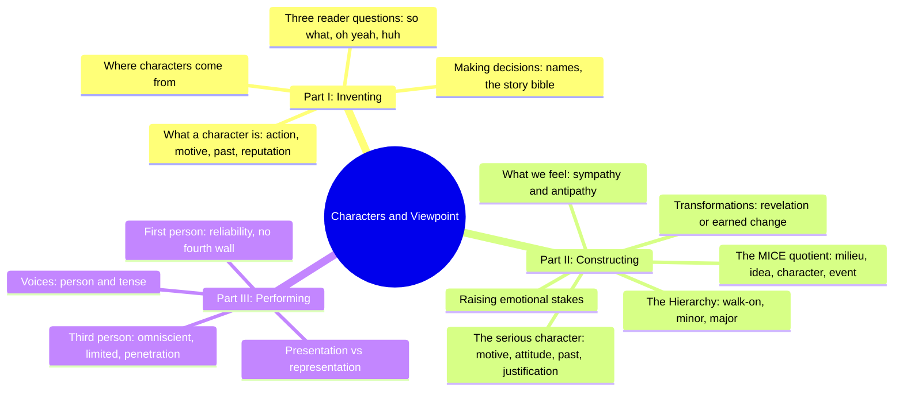
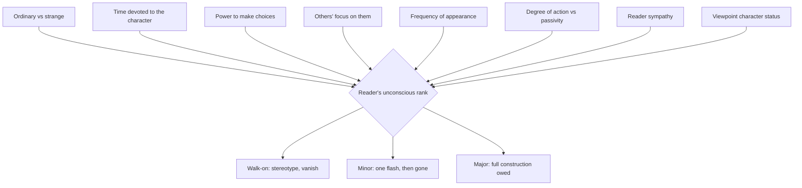
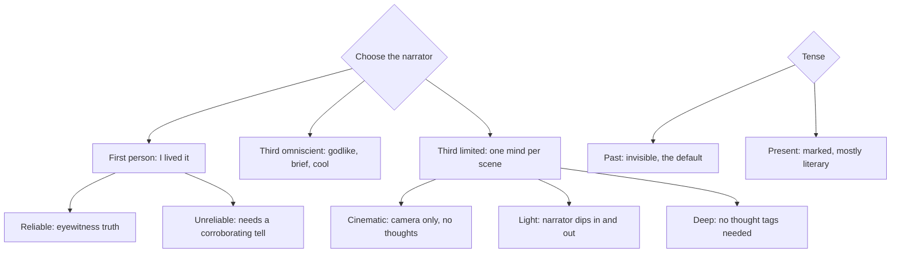
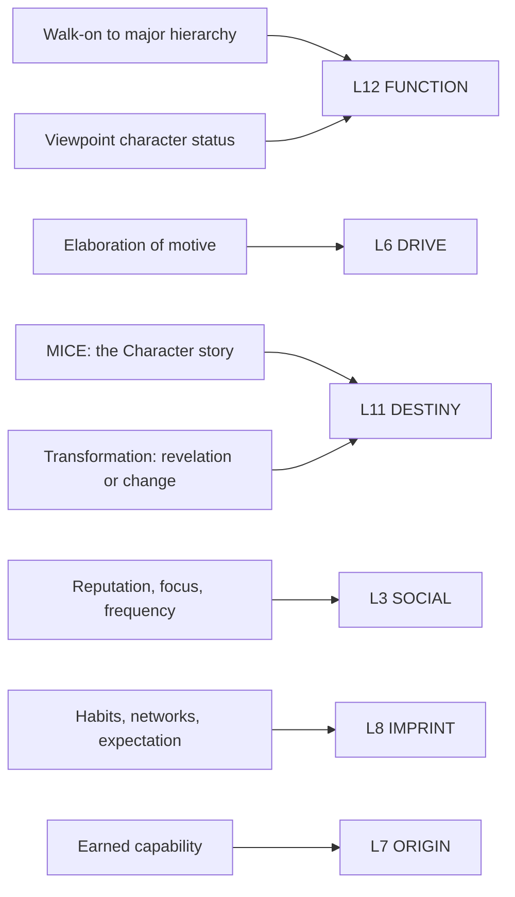

# BVX.0061 — Characters and Viewpoint — Orson Scott Card (2010)
### Knowledge Entry — Distill

A working novelist's field manual with two halves: how much characterization a story needs and which characters earn it, then how close the reader stands to that character once the page is being written.

## TABLE OF CONTENTS
- [Core Thesis](#1-core-thesis)
- [Mind Models](#2-mind-models)
- [Framework](#3-framework--structure)
- [Key Concepts](#4-key-concepts)
- [Heuristics](#5-heuristics--decision-rules)
- [Invariants](#6-invariants)
- [Pitfalls](#7-pitfalls--myths)
- [Application](#8-application)
- [Cross-References](#9-cross-references)
- [Provenance](#10-provenance--confidence)

---

## 1 · CORE THESIS

A story's structure (MICE) decides how much characterization it needs, and a character's position in the hierarchy decides how much it's owed. Within that budget, belief comes from elaborated motive and earned justification, not raw detail; change is either revelation of what was latent or an explained transformation. Viewpoint then decides how close the reader stands to all of this.

---

## 2 · MIND MODELS

*Required. Minimum two diagrams, maximum five. See template §C for the rules.*

**Diagram 1 — the whole argument.**
Caption: *three parts, one throughline: decide how much a character deserves, earn belief inside that budget, then choose how close the reader gets to stand.*

**Diagram 2 — the central mechanism (the Hierarchy).**
Caption: *the writer never sets a character's importance directly; eight controllable levers accumulate into the reader's unconscious rank, and that rank alone decides how much construction the character is owed.*

**Diagram 3 — the viewpoint decision tree.**
Caption: *person and penetration are two separate dials; tense is a third, almost always left at its invisible default.*

**Diagram 4 — mapped onto the Command's 12-layer character stack.**
Caption: *Card's craft toolkit clusters on three layers (function, drive, destiny) and lightly touches three more; viewpoint itself lands on none of the twelve, see §8.*

---

## 3 · FRAMEWORK / STRUCTURE

Three parts, eighteen chapters, one throughline: invention decides who exists, construction decides how much each one gets, performance decides how the reader experiences it.

| Part | Chapters | Governing question |
|---|---|---|
| **I · Inventing Characters** | 1 What is a character? · 2 What makes a good fictional character? · 3 Where do characters come from? · 4 Making decisions | Who is this person, and will the reader care, believe, and understand? |
| **II · Constructing Characters** | 5 What kind of story are you telling? (MICE) · 6 The hierarchy · 7 Raising the emotional stakes · 8 What should we feel about the character? · 9 The hero and the common man · 10 The comic character · 11 The serious character (make us believe) · 12 Transformations | Given this story's structure and this character's rank, how much characterization does the page owe them, and how is that belief earned? |
| **III · Performing Characters** | 13 Voices · 14 Presentation vs. representation · 15 Dramatic vs. narrative · 16 First-person narrative · 17 Third person · 18 A private population explosion | Whose voice tells it, in what tense, and how deep into whose mind? |

Part II's own spine is a budget system: MICE (Ch5) sets the story's overall appetite for characterization, the Hierarchy (Ch6) allocates that appetite across individual characters, and Chapters 7 through 12 are the toolkit for spending the allocation once it's been granted, ending with Transformations, the most expensive purchase a major character can make.

---

## 4 · KEY CONCEPTS

| Concept | What it is | Why it matters |
|---|---|---|
| **The MICE quotient** | Four factors present in every story (milieu, idea, character, event); whichever dominates sets the story's shape and its appetite for characterization | Tells the writer how much full characterization a given story can bear before it becomes the wrong kind of story; a milieu story over-characterized is a character story wearing a costume |
| **The contract with the reader** | Readers expect a story to end when its first major source of structural tension resolves, and expect anything the story spends time on to amount to something | The MICE type chosen in the opening pages is a promise; breaking it (solving the mystery but not the marriage) reads as cheating, not surprise |
| **The Hierarchy** | Three shading levels, walk-on, minor, major, set not by a rule but by eight controllable levers (time, choices, focus, frequency, action, sympathy, viewpoint, ordinariness vs strangeness) | Determines exactly how much construction a character has earned; over-building a walk-on or under-building a major character both break the reader's expectations |
| **Elaboration of motive** | Naming a character's purpose or intent behind an action, then complicating and revising that motive as the story proceeds | Card's single densest belief-making tool (Ch11); "every revision of motive is a revision of the story," since motive is the story's causal connective tissue |
| **Attitude** | The character's reaction to outside events, as distinct from motive (which explains the character's own actions) | Attitude is what colors description and dialogue with personality; a viewpoint character with no attitude toward events is the surest sign of amateur prose |
| **Implied past** | Giving a character a felt history through expectation, habit, and network of relationships, without a flashback | Adds depth "without subtracting momentum"; flashback stops the story, implication doesn't |
| **Justification** | Any bizarre, extreme, or otherwise unbelievable act can be made believable, but the amount of setup owed is proportional to how bizarre the act is and how important it is to the story | The core craft answer to "Oh yeah?" (the reader's second challenge question, Ch2); undersupply the setup and the act reads as authorial cheating |
| **Revelation vs. development** | Card's four fictional stances on change: you can't change (unmasking), other things change you (external cause), you change yourself (an act of will), or change is uncaused (absurdism) | Whichever stance a story takes, it must be consistent and, except in absurdism, must show a cause; the amount of justification owed scales with the size of the change and the importance of the character |
| **Voice** | The specific vocabulary, syntax, and diction pattern of a narrator or viewpoint character; distinct from the author's own habitual style | Card writes "in character" even in third person, meaning the narrative prose itself should color toward the viewpoint character, not just the dialogue |
| **Levels of penetration** | Within limited third person, how deeply the prose enters the viewpoint character's mind: cinematic (camera only), light (narrator dips in and out), or deep (no thought tags, the character's judgment colors every clause) | The most granular and most frequently mismanaged control a writer has; most stories need all three levels at different moments, not one held rigidly throughout |

---

## 5 · HEURISTICS & DECISION RULES

| Situation | Do this | Not this |
|---|---|---|
| Deciding how much to characterize a story's cast | Identify which MICE factor dominates, then scale characterization to what that factor can bear | Apply full characterization uniformly regardless of story type |
| A background character is getting too vivid | Cut the character, or admit you're interested and promote them to minor | Let an over-built walk-on linger and confuse the reader about their importance |
| Making a minor character memorable without over-promising | Use eccentricity, exaggeration, or obsessiveness, once, briefly | Give the minor character a continuing arc or repeated deep scenes |
| Wanting the audience to believe an extreme act | Plant the capability or trait early, in proportion to how bizarre and how important the act is | Reveal the enabling trait in the same sentence as the act itself |
| A character needs to change | Choose one of the four causes (unmasking, external force, will, uncaused) and commit to it for that story | Mix causes inconsistently, or change a character with no signaled cause at all |
| Choosing first vs. third person | Use first person for eyewitness truth-feel; use limited third when you need scenes the narrator can't attend, or the viewpoint character can't articulate | Default to first person because it "feels more personal" without checking scene coverage |
| Choosing penetration depth for a scene | Go deep when the scene needs intensity and identification; go cinematic or light when the scene needs distance, comedy, or objectivity | Hold one penetration level rigidly for an entire manuscript |
| Wanting brevity across many characters or a long span | Use omniscient narration | Force limited third-person scene-by-scene coverage onto a story that needs to compress decades or dozens of characters |
| Writing dialect or accent in first person | Reflect it through syntax, word choice, and implied education level | Spell out phonetic accent with heavy apostrophes; a narrator does not hear their own accent |
| Wanting the reader to catch dramatic irony neither character has | Use omniscient, or a limited-third scene from each side across a chapter break | Stay in one first-person account and hope the reader infers what neither character knows |

---

## 6 · INVARIANTS

1. Characterization is a technique, not a virtue; the right amount for a given story can be very little.
2. A story's dominant MICE factor (milieu, idea, character, event) sets its structural shape and ends when that factor's central tension resolves.
3. A character's hierarchy rank is never assigned directly; it accumulates from controllable levers (time, choices, focus, frequency, action, sympathy, viewpoint, strangeness).
4. Motive assigns moral value to action; the same act means something different under a different motive, and every revision of motive revises the whole story.
5. The more bizarre or important a character's behavior, the earlier and more thoroughly it must be justified.
6. Readers hold the writer to an implicit contract: what the story spends time on will amount to something, and the story will end when its opening tension resolves.
7. Any character can change for any reason, but the story must show or clearly imply a cause, except in a story that has established absurdism as its own rule from the start.
8. Narrative person, tense, and level of penetration are three independent choices; conventional defaults (past tense, one consistent person, mixed penetration) are invisible, and invisibility is usually the goal.

---

## 7 · PITFALLS / MYTHS

- Believing full characterization is an absolute virtue rather than a technique to be rationed by story type.
- Letting a walk-on become "creative" until it distracts from the main action, without either cutting it or promoting it.
- Introducing a bizarre or extreme act late, with no earlier plant, then expecting the reader to accept it.
- Using flashback on page one or two, which gives the reader only the flashback and no present to anchor it in.
- Believing an unbelievable event is excused because "it really happened once"; fiction runs on plausibility, not fact.
- Writing dialect through phonetic misspelling and stray apostrophes instead of syntax and diction.
- Changing a character's behavior or nature with no cause shown, in a story that has not established randomness as its own rule.
- Holding a single level of penetration for an entire manuscript regardless of what each scene needs.
- Mistaking strangeness in narrative voice (odd tense, odd person) for sophistication; unnoticed convention is usually the more effective choice.
- Writing a viewpoint character with no attitude toward events, the surest sign of amateur prose.

---

## 8 · APPLICATION

- **Spine level:** L4 and L5, with a TEXTURE component. The MICE quotient (Ch5) operates at the story-spine's structural weighting level (candidate L4); the Hierarchy, motive, justification, and transformation material (Ch6, Ch11, Ch12) sit squarely in L5, story-spine Character; the Voices/person/tense/penetration material (Part III) is TEXTURE, the telling rather than the told, and is flagged as such rather than forced into a story-spine slot.
- **12-layer character stack:** primary on **L12 FUNCTION** (hierarchy and viewpoint-character status are both role decisions) and **L6 DRIVE** (elaboration of motive) and **L11 DESTINY** (revelation vs. earned change, and the MICE "Character" story's role-change arc); supporting on **L3 SOCIAL** (reputation, focus, frequency) and **L8 IMPRINT** (implied past, habits, networks); contextual on **L7 ORIGIN** (earned capability behind a justified act). See Diagram 4.
- **plot_systems:** the Hierarchy's characterization budget is functionally the same allocation problem McKee's Cast Map (BVX.0064) solves with concentric circles and dimensional cost, and that Davis (BVX.0075) approaches through want and counter-will; all three converge on "not every character earns the same construction," from three independent vocabularies.
- **Setting:** touched only through the MICE milieu factor; Card treats milieu as a rival structural claimant to character rather than as a character input, which is a genuinely different framing from Davis's birth-marks approach.

**For the character system:**
- Card's Hierarchy (Ch6) is the cleanest existing statement of a rule the 12-layer stack currently assumes but never states: characterization effort should be proportional to narrative rank, not applied uniformly. This belongs as a cross-cutting allocation rule over all twelve layers, not inside any single one.
- The MICE quotient feeds the system at a level above any single character: it is a per-story dial that says how much character work the whole cast can bear, upstream of L5 WOUND and L6 DRIVE assignment. Worth a note at the spine level (candidate L4) rather than inside the character stack.
- Card's four-way taxonomy of change (unmasking, external force, willed change, uncaused) is a decision the current L11 DESTINY definition does not force a writer to make explicit; adding "cause of change" as a required sub-field under L11 would catch stories that drift between the four modes without meaning to.
- **OPEN candidate:** viewpoint mechanics (person, tense, levels of penetration) do not map onto any of the twelve layers; they are a property of the telling, not the character. This distill treats them as TEXTURE on the story-spine axis and recommends the character system explicitly declare viewpoint out of scope for the 12 layers, rather than leaving the gap silent.
- Justification's proportionality rule ("the more bizarre and more important, the earlier and more you must set it up") is a useful general-purpose check for any layer that licenses an extreme character action, most directly L1 CORE and L2 VITAL capability claims and L10 SHADOW eruptions.

---

## 9 · CROSS-REFERENCES

| Related entry | Relation |
|---|---|
| [[BVX.0075]] | Davis, *Creating Compelling Characters*: Davis's want/counter-will engine and Card's elaboration-of-motive are the same claim (motive drives belief and action) from two working novelists; compare Davis's birth-marks approach to Card's implied past |
| [[BVX.0064]] | McKee, *Character*: McKee's Cast Map (concentric circles, dimensional cost) and Card's Hierarchy (walk-on/minor/major, controllable levers) are independently derived versions of the same characterization-budget problem |
| [[BVX.0089]] | Dramatica: Card's MICE "Character" story (changing one's role in life) and Card's justification/transformation material both bear on Dramatica's Solution element and MC growth requirement; a candidate route into L11 DESTINY alongside McKee's IC derivation |

---

## 10 · PROVENANCE & CONFIDENCE

Distilled from a full-text pdftotext extraction (184pp). Closely read: Introduction; Ch1 (What Is a Character?) and Ch2 (What Makes a Good Fictional Character?, Part I framing); Ch5 (the MICE quotient, in full); Ch6 (the Hierarchy, in full); Ch11 (the serious character: elaboration of motive, attitude, implied past, justification, in full); Ch12 (Transformations, in full); Ch13 (Voices: person and tense, in full); Ch16 (First-Person Narrative, in part: which person is first, unreliable narrators); Ch17 (Third Person: omniscient vs. limited, changing viewpoint characters, levels of penetration, in full). Chapters 3, 4, 7, 8, 9, 10, 14, 15, and 18 were read only via table of contents and chapter headers, not extracted in depth; a deeper pass on Ch7 (raising emotional stakes) and Ch9-10 (hero, common man, comic character) would sharpen the L2/L9/L10 mappings if those layers become load-bearing for a specific character.

**Catalog note:** the PDF's own front matter states copyright 1988, first paperback edition 1999, with no revision date printed anywhere in the text; it does not carry the "revised edition 2010" framing given in this task's brief. If the Zotero record for key 472V8E2T lists a 2010 revised edition, that may be catalog metadata not reflected in the actual scanned text, worth a quick verification pass against the physical or listed edition.

## META
- Template: BVX-LEARN-v4.0
- Source classification: full-text pdftotext extraction, load-bearing chapters read closely, remainder sampled via TOC and headers
- Created / Updated: 2026-09-16
