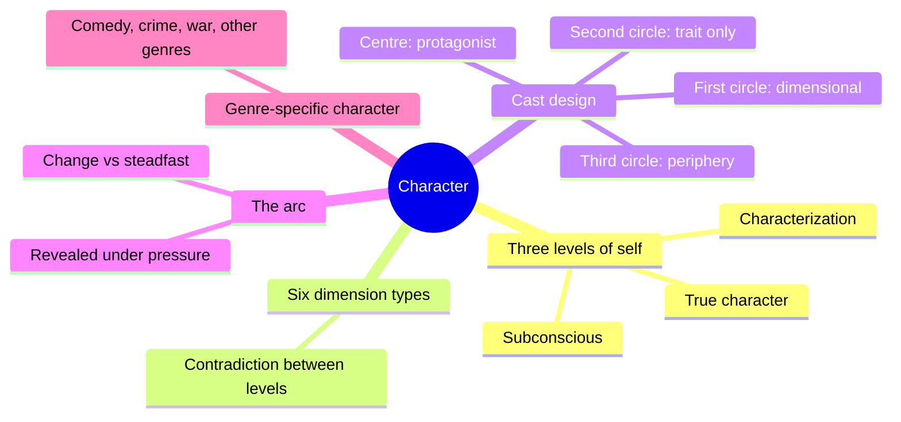
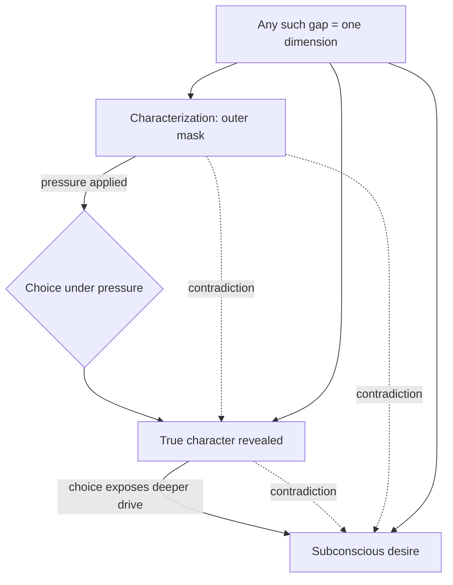
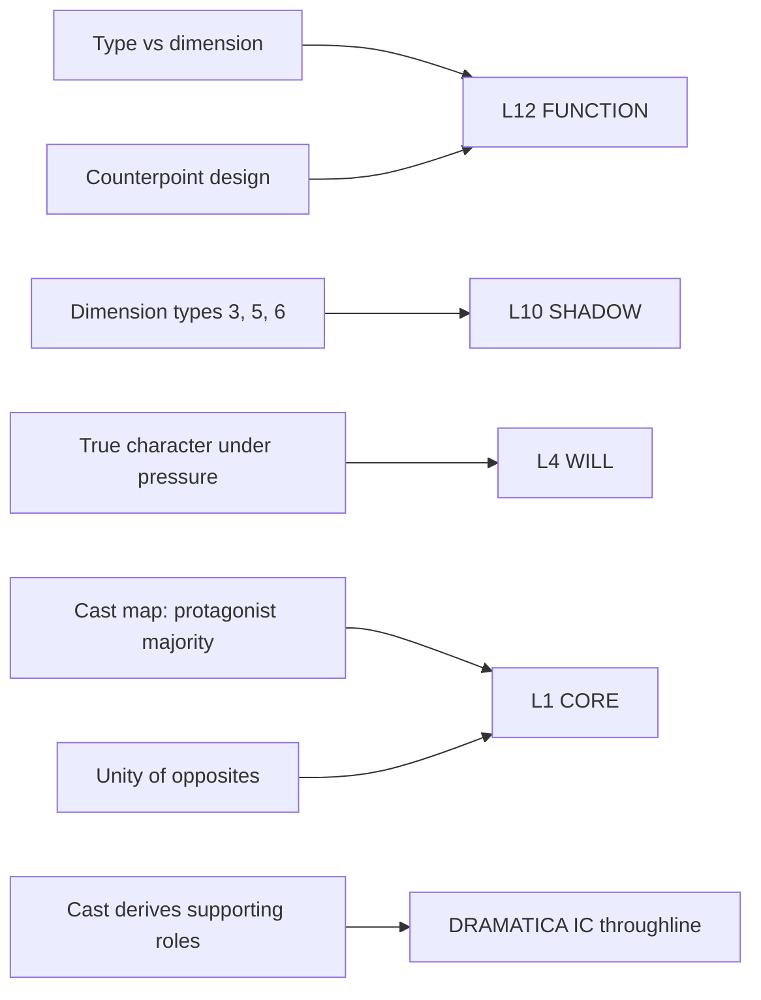

# BVX.0064 — Character — McKee (2021)
### Knowledge Entry — Study Guide

The cast-design methodology. Where Dramatica gives you structural *roles*, McKee gives you the method for deciding **who fills them and why** — by deriving the cast from the protagonist's contradictions.

## TABLE OF CONTENTS
- [Core Thesis](#1-core-thesis)
- [Mind Models](#2-mind-models)
- [Framework](#3-framework--structure)
- [Key Concepts](#4-key-concepts)
- [Heuristics](#5-heuristics--decision-rules)
- [Invariants](#6-invariants)
- [Pitfalls](#7-pitfalls--myths)
- [Application](#8-application)
- [Cross-References](#9-cross-references)
- [Provenance](#10-provenance--confidence)

---

## 1 · CORE THESIS

A character is not a person — it is a metaphor for humanity, and its complexity is made entirely of **contradiction**. What holds outer, inner, and hidden selves together into one coherent role is not consistency but a *unity of opposites*. A cast is therefore not a collection of people who happen to be in a story; it is an arrangement of contradictions positioned so that each role reveals the others by contrast.

---

## 2 · MIND MODELS

*Required. Minimum two diagrams, maximum five. See `_0.1_BVX_LEARN/_meta/TEMPLATE.distill.v4.md` §C for the rules. Cross-reference: BVX.0075 (Davis) covers the complementary dynamic want/counter-will mechanism — see §9 below.*

**Diagram 1 — the whole argument.**
Caption: *the whole book collapses to one method — locate the contradiction between two of the three levels of self, cast it across concentric rings by weight, then let it hold up under an arc or a genre's own rules.*

**Diagram 2 — the central mechanism.**
Caption: *true character only surfaces under pressure, and every gap between the three levels — not personality alone — is what McKee counts as a dimension.*

**Diagram 3 — mapped onto the Command's 12-layer character stack.**
Caption: *every McKee tool this distill actually uses already lands on an existing `feeds:` entry — dimension work sits on L10 SHADOW and L12 FUNCTION, cast structure sits on L1 CORE and the Dramatica IC throughline.*

---

## 3 · FRAMEWORK / STRUCTURE

**Three levels of self:** outer *characterization* (what's visible) → inner *true character* (revealed under pressure) → *hidden subconscious* (visible only through choice under pressure).

**Six kinds of dimension** — a dimension is a contradiction, and it can sit between any two of those levels:

| # | Contradiction between | Example |
|---|---|---|
| 1 | Two aspects of characterization | Perfect makeup, unbrushed teeth |
| 2 | Characterization and true character | The dozing woman with the ever-young dream |
| 3 | Characterization and subconscious desire | Hyperactive on the surface, dead calm under threat |
| 4 | Two conscious desires | The adulterer's dilemma |
| 5 | Conscious and subconscious desire | Passion for the fiancée vs. fear of commitment |
| 6 | Two subconscious motivations | Sacrifice for family vs. sacrifice family for ambition |

**The Cast Map** — three concentric circles:

- **Centre:** protagonist, holding the *majority* of the cast's dimensions
- **First circle:** major supporting roles, each dimensional, each counterpointing one protagonist dimension
- **Second circle:** distinctive *traits only*, no dimensions — dimensions cost screen time
- **Third circle:** periphery — servants, villagers, the nameless

---

## 4 · KEY CONCEPTS

**1. Unity of Opposites (Heraclitus).** Hot/cold make temperature; birth/death make life. Contradiction is not a flaw in a character, it is the thing that makes the character cohere. *"The unity of opposites is the founding principle of character complexity."*

**2. Type vs. Dimension.** *"When a character's inner and outer natures fuse into a single function, the role congeals into a type: Nurse, Cop, Superhero, Sidekick."* Contradiction is what converts a type into a character. A type has no gap; a dimension is the gap.

**3. Dimension as engine of unpredictability.** Dimensions make the reader wonder which side shows up next. Predictability is the death of interest — *"the more generalized, more consistent, more predictable, the less real and more cartoonish she seems."*

**4. Counterpoint design.** Each first-circle character's flat trait exists to illuminate *one specific dimension* of the protagonist. Austen's four Bennet sisters are each undimensional on purpose — each one lights up one of Elizabeth's four contradictions.

**5. The single-axle failure.** *"If characters are opposed on just one axle — good versus evil, or courageous versus cowardly — they trivialize each other, and interest in them wanes."*

**6. Dimensions cost time.** Every contradiction needs performance time to reveal itself. This is the hard budget constraint that forces the three-circle discipline.

**7. Splitting as symbolisation.** An internal contradiction can be externalised as two characters — Jekyll/Hyde, White Swan/Black Swan, the noble father vs. the dastardly uncle in *Hamlet*. Useful diagnostic: **a doubled character often means an unresolved internal dimension.**

---

## 5 · HEURISTICS & DECISION RULES

| Situation | Do this | Not this |
|---|---|---|
| A character feels flat | Find the contradiction — between levels, not within one | Add more traits, backstory, or quirks |
| A new character appears in your imagination | Ask what dimension of the protagonist they exist to illuminate; if none, cut them | Keep them because they're interesting on their own |
| Designing a supporting cast | Give first-circle roles dimensions, second-circle roles a single distinctive trait | Dimensionalise everyone — it costs time and dilutes the centre |
| Two characters feel redundant | Check whether they oppose the protagonist on the same axle; collapse or re-axle one | Differentiate them cosmetically |
| The protagonist feels less interesting than a side character | Count dimensions — the protagonist must hold the majority | Reduce the side character |
| You can't find a character's subconscious | Look for where they say one thing and do another under pressure | Ask them directly in dialogue |
| A cast feels schematic | Cross the dimensions across all four levels (social, personal, private, hidden) rather than one | Add subplots |

---

## 6 · INVARIANTS

1. **Contradiction is the founding principle of complexity.** No contradiction, no dimension, no character — only a type.
2. **Characters express everything they experience; people experience more than they express.** A character is not a realistic person and should not be built like one.
3. **A protagonist must hold the majority of the cast's dimensions**, or the centre does not hold.
4. **Every role must earn its place** by serving the storytelling strategy — appearing in the imagination is not sufficient.
5. **Opposition on a single axle trivialises both parties.** Complexity of opposition, not intensity, sustains interest.
6. **Subconscious dimensions are perceptible only through choice under pressure** — never through statement.
7. **Dimensions consume storytelling time.** Dimensionality is a budget, not a free good.

---

## 7 · PITFALLS / MYTHS

Building characters as realistic people rather than as metaphors · adding traits when a contradiction is what's missing · dimensionalising the whole cast and starving the protagonist of contrast · opposing characters on one axle · mistaking a character's stated desire for their subconscious one · keeping a vivid character who illuminates nothing · treating consistency as a virtue · resolving a contradiction early (it is the engine, not a problem to fix).

---

## 8 · APPLICATION

*How this maps to OXO.*

### Tori's dimensions, in McKee's terms

Existing canon already documents six contradictions, though never named as dimensions:

| # | Dimension | McKee type | Source |
|---|---|---|---|
| 1 | Merit-believer / System-knower | 2 | *"Begins as merit believer… learns the system functions as filter, not judge"* |
| 2 | Certainty / Paralysis | 5 | Mercury☌Mars (acts on certainty) vs Moon□Mars (freezes into equity calculus) |
| 3 | **Truth-teller / Untouchable** | 3 | Critical Flaw is Truth — which demands exposure — while her governing strategy is armour |
| 4 | Fairness / Inequity | 4 | Problem→Solution: Equity→Inequity |
| 5 | **Shameless / Armoured** | 6 | `shame_index 2` with `armor_index 8` — see [[victoria-midnight-L9-eros]] |
| 6 | Control-seeker / Desire-chaser | 5 | MC Focus Desire, buried in 12th-house Neptune, foreclosed by control |

Six dimensions puts her above Elizabeth Bennet's four. **She is built correctly** — the complexity is already there and load-bearing.

Dimension 3 is the sharpest and is currently unexploited: *truth requires exposure; untouchability requires concealment.* She cannot satisfy her critical flaw and her survival strategy at the same time. That is a scene engine, not a background note.

### ⚠️ The Impact Character — a derived answer

The IC throughline is empty (17 fields). McKee's method resolves it without inventing anything: **the IC must embody, as a lived and successful premise, the thing the MC must accept.**

Tori's Solution is **Inequity** — accepting that the system was never fair and that fairness was never the correct operating premise.

So the IC is whoever *already lives that*, visibly and successfully, in front of her.

| Candidate | Fit |
|---|---|
| **Anna Colson Conway** | **Strongest.** "The Engine — Power/Escalation." Ascends *through* institutional power with no fairness premise at all — and succeeds. Movement 3 is explicitly "Anna Colson's ascent begins," the same movement Tori rots. Two women, same institution, opposite premises, simultaneous trajectories. That is a textbook IC counterpoint. |
| Riley Moss | The Witness / Propagandist. Sits on the **Truth** axis, not the Equity axis — counterpoints dimension 3, not the Solution. Better as first-circle than IC. |
| Quinn Bishop | "The Reason Instrument," and a Bishop. Embodies Legibility rather than Inequity. Strong first-circle, wrong axle for IC. |
| Jebb Midnight | Believed in the system *more* than she did — he counterpoints dimension 1, and he is dead pre-story. Structurally weak as IC across six movements. |

**Recommendation: Anna Colson Conway as Impact Character.** Not asserted as canon — derived from McKee's method against existing documentation, and offered for your call.

Note this also resolves a loose end: the fusion brief flags Colson's Student Body President initiation as one of three disruption vectors in the legacy Red Hills diagram *and* names her M3 ascent in current canon. **Same beat, two vocabularies** — and if she's the IC, that's why she keeps surfacing at structural hinge points.

---

## 9 · CROSS-REFERENCES

| Related entry | Relation |
|---|---|
| [[BVX.0075]] | Davis *Creating Compelling Characters* — Davis's dynamic want/counter-will (single-character-level) complements McKee's static cross-level dimension (cast-level); see BVX.0075 §8 for the full comparison |
| [[BVX.0175]] | McKee *Story* — McKee's earlier plot-structure text; *Character* applies the same contradiction-driven method to cast design specifically |
| [[BVX.0193]] | Truby *The Anatomy of Story* — the character-web / moral-argument approach; compare against McKee's Cast Map for deriving supporting roles from a protagonist |
| [[BVX.0089]] | Dramatica — the archetypes and the 64 story-form elements; McKee's Cast Map derivation (Impact Character) is a route into Dramatica's IC throughline, see Diagram 3 above |

---

## 10 · PROVENANCE & CONFIDENCE

Full text, 579pp, clean text layer, complete outline. Distilled from the Introduction, Ch.9 (The Dimensional Character), and Ch.17 (Cast Design). Chapters 1–8 and 10–16 sampled, not fully extracted — **a deeper pass on Ch.10 (Complex Character), Ch.12 (Symbolic Character) and Ch.14 (Character in Genre) would likely yield more.** Status `complete` reflects the load-bearing extraction; upgrade with `"Upgrade BVX.0064"` if the remaining chapters are wanted.

The OXO application section is **my synthesis**, not McKee's — he never mentions Dramatica. The mapping of his dimension types onto documented Tori contradictions, and the IC derivation, are inference from his method. Flagged as proposal throughout.

## META
- Template: BVX-LEARN-v3.0 · Source: full-text book · Created 2026-08-15
- Retrofit to v4 2026-09-16: mind models + spine key added; all v2 content kept.
