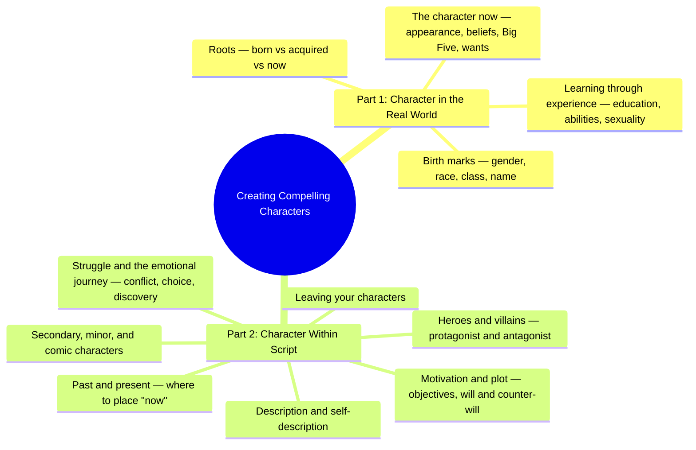
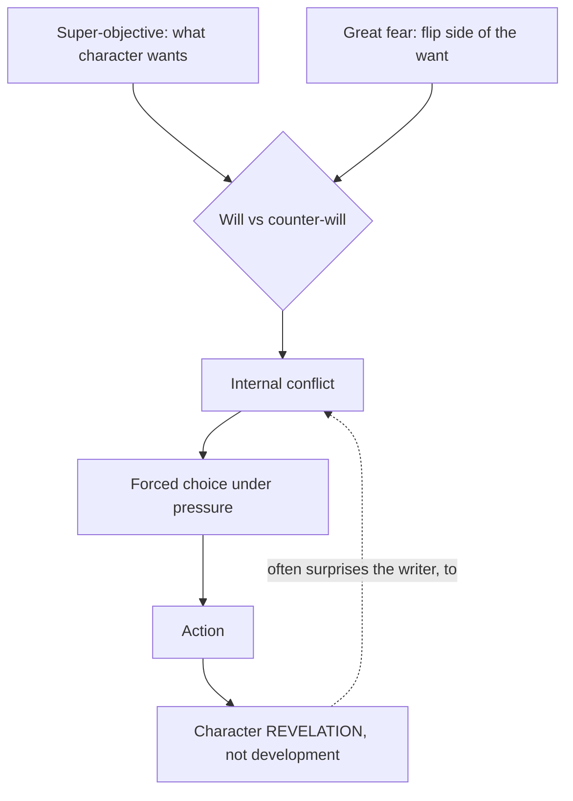
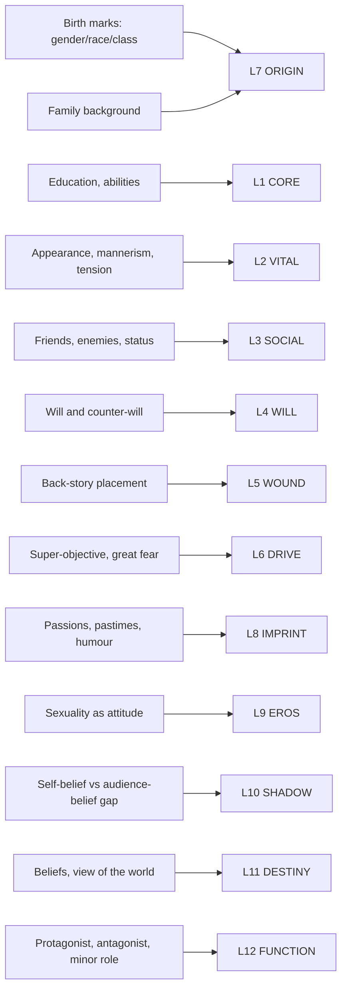

# BVX.0075 — Creating Compelling Characters for Film, TV, Theatre and Radio — Rib Davis (2016)
### Knowledge Entry — Distill

The owner's most-read craft book (363 highlights). A working scriptwriter's field manual for building a character from raw circumstance, then wiring that character into plot through want and its opposite.

## TABLE OF CONTENTS
- [Core Thesis](#1-core-thesis)
- [Mind Models](#2-mind-models)
- [Framework](#3-framework--structure)
- [Key Concepts](#4-key-concepts)
- [Heuristics](#5-heuristics--decision-rules)
- [Invariants](#6-invariants)
- [Pitfalls](#7-pitfalls--myths)
- [Application](#8-application)
- [Cross-References](#9-cross-references)
- [Provenance](#10-provenance--confidence)

---

## 1 · CORE THESIS

A character is not a fixed trait-set but a bundle of birth circumstance and acquired experience, activated by what it wants. Davis's method reduces to: build the person from nature-plus-nurture, then find the want (super-objective) and its counter-will — because the conflict between the two, forced into choice, **reveals** rather than develops character.

---

## 2 · MIND MODELS

*Required. Minimum two diagrams, maximum five. See template §C for the rules.*

**Diagram 1 — the whole argument.**
Caption: *Part 1 builds the person from circumstance; Part 2 wires that person into plot through want — the book is a factory line, not a checklist.*

**Diagram 2 — the central mechanism.**
Caption: *the engine is not the trait list — it's want meeting its own opposite under pressure, which reveals what was already there rather than growing something new.*

**Diagram 3 — mapped onto the Command's 12-layer character stack.**
Caption: *Davis's toolkit touches all twelve layers, but only two carry the book's real weight — L6 DRIVE and L4 WILL are where the owner's highlights cluster.*

---

## 3 · FRAMEWORK / STRUCTURE

Two parts, thirteen chapters, one hinge between them.

| Part | Chapters | Governing question |
|---|---|---|
| **1 · Character in the Real World** | 1 Roots · 2 Birth marks · 3 Learning through experience · 4 The character now | Who is this person, independent of any plot? |
| **2 · Character Within Script** | 5 Motivation and plot · 6 Past and present · 7 Struggle and the emotional journey · 8 Case study: *Crash* · 9 Description and self-description · 10 Heroes and villains · 11 Secondary and minor characters · 12 The comic character · 13 Leaving your characters | What does this person *do* once want meets obstacle? |

Part 1's own spine is three categories, repeated at every sub-topic: **(1) born as/into · (2) acquired through experience · (3) the character now** — roughly nature, nurture, and present state. Part 2 pivots on a single move: once you know who the character is, ask what they *want* (§5), then track how getting or not getting it forces choices that reveal them (§7-8), how others perceive that revelation (§9), how it reads against a protagonist/antagonist frame (§10), how it radiates to secondary and comic roles (§11-12), and how it should end (§13).

---

## 4 · KEY CONCEPTS

| Concept | What it is | Why it matters |
|---|---|---|
| **Born / acquired / now** | Davis's three-way split of every trait category — inherited circumstance, experience-shaped traits, present-tense state | The organizing spine of Part 1; every sub-topic (gender, class, education, appearance) gets sorted into one of the three |
| **Super-objective** (Stanislavski) | The character's longer-term, overall aim — often their major life objective compressed into the script's timeframe | "The motor for the plot" — objectives govern individual scenes, but the super-objective governs the whole shape |
| **The great fear** | The flip side of the super-objective — what the character is driving *away from* | Either can be the driving force; naming both together sharpens motivation faster than either alone |
| **Will and counter-will** (Boal) | "We want and we don't want" — every want has an opposing want, not just an opposing obstacle | *"There must always be an element of conflict within the character, quite apart from the struggles between characters"* — this is Davis's internal-conflict primitive |
| **Character revelation, not development** | Under stress, a character doesn't so much change as discover elements of themselves that were "always there but only now brought to the fore" | Reframes the writer's job: don't invent new traits mid-script, expose latent ones under new pressure |
| **The Big Five** | Extraversion, Openness, Neuroticism, Agreeableness, Conscientiousness, each a full spectrum, not a binary | A checklist for enriching an existing character with "complexity and apparent contradiction," not a character-generator on its own |
| **Delusions / the self-belief gap** | The gap between what a character believes about themselves and what the audience comes to believe about them | *"The gap that we delight in filling"* — Davis's version of dramatic irony, built directly into characterization rather than plot |
| **Protagonist strength ≠ morality** | The protagonist must be the strongest character in terms of *audience interest* — arresting struggles, pressing choices, strongest needs — not goodness | Frees "anti-hero" writing: badness is compatible with protagonist strength as long as interest holds |
| **Antagonist: fascination, not empathy** | The villain doesn't need to be liked, but needs motivation as clear as the protagonist's, governed by a private moral code they "thoroughly believe" | Evil must be as internally coherent as good, or the audience disengages |
| **Placing the "now"** | Back-story is simply *the story before wherever you decide to start* | The decision of where to place "now" is authorial, not given — it reshapes what counts as back-story vs. plot |

---

## 5 · HEURISTICS & DECISION RULES

| Situation | Do this | Not this |
|---|---|---|
| Building a character from scratch | Sew together traits from many people you've known | Model tightly on one real person (self, friend, family) — it stunts organic development |
| Choosing a character's race or gender | Leave it open unless there's a good specific reason to fix it | Force demographic patterns to make a point — the audience feels the preacher |
| Naming a character | Let the name follow naturally from class, race, and period | Reach for an openly symbolic name outside a stylized genre, or decide the name first |
| Noting a character's ability | Pair it with attitude and use ("perceptive at reading the market, but fails to act on it") | Settle for a generic label like "intelligent" |
| Finding a character's central motivation | Identify the super-objective *and* the great fear together | Leave motivation implicit or single-stranded |
| Building internal conflict | Give the character a counter-will opposing their own want | Rely only on external obstacles from other characters |
| Wanting the audience to lean in | Open a gap between what the character believes of themselves and what the audience believes | Make everything exactly what it seems to be |
| A mid-script scene sags | Open or reveal a different live area of internal conflict | Let every struggle resolve at once |
| Writing a villain | Give them a private moral code they thoroughly believe | Make the evil arbitrary or unexplained |
| A character isn't working after a full draft | Diagnose the specific problem, then make wholesale changes | Tinker at the edges |

---

## 6 · INVARIANTS

1. Every character is a mix of what they're born into and what they acquire — never purely one or the other.
2. Wants, not traits, carry the action forward; a character without a want is static.
3. Will always pairs with counter-will — *"no emotion is pure or constant in quantity or quality."*
4. None of us changes very much: apparent development is the revelation, under new pressure, of what was already there.
5. Protagonist strength is measured by narrative interest, not moral virtue.
6. An antagonist needs motivation as legible as the protagonist's, anchored in a private moral code.
7. Every character, however minor, needs distinctive colouring — because real people have it.
8. Back-story is a placement decision (where "now" sits), not a fixed inventory of prior events.

---

## 7 · PITFALLS / MYTHS

- Modelling a character too tightly on one real person — stunts the organic development the writing process should provide.
- Over-correcting demographic representation until the script reads as a message rather than a world.
- Forcing a symbolic name into a naturalistic genre.
- Settling for generic trait words ("intelligent," "demanding") instead of specific, situational ones.
- Constraining a character so tightly to their super-objective that every line telegraphs it — the road to flatness Davis warns against directly.
- Treating "plot-driven" and "character-driven" as opposites — in strong writing, character forces plot turns and plot reveals new character.
- Resolving every internal conflict at once, which is what produces a sagging middle.
- Treating back-story as chronological filler rather than an authorial placement choice.
- Writing minor comic characters as pure plot function and forgetting they still need their own colour.
- Believing comic characters must intend to be funny — the best ones are funny *despite* themselves.

---

## 8 · APPLICATION

- **Spine level:** L5 (story-spine's Character level — functions before persons; Davis operates entirely in the "persons" register the SSOT flags as downstream of the spine, never in it).
- **12-layer character stack:** primary on **L6 DRIVE** (super-objective / great fear) and **L4 WILL** (counter-will); supporting on **L7 ORIGIN**, **L10 SHADOW**, **L12 FUNCTION**; contextual on **L1 CORE**, **L2 VITAL**, **L3 SOCIAL**, **L5 WOUND**, **L8 IMPRINT**, **L9 EROS**, **L11 DESTINY** — see Diagram 3 for the full map.
- **plot_systems:** the will/counter-will engine is Davis's version of McKee's contradiction-dimension (BVX.0064) and Dramatica's Problem/Solution pairing — three independent vocabularies converging on the same mechanism: internal opposition, forced into choice, is what a script actually dramatizes.
- **Setting:** touched lightly — birth marks (class, race, geography) shade setting but Davis treats them as character inputs, not world-building.

Where Davis and McKee (BVX.0064) **agree**: both reject the flat "type," both insist contradiction/opposition is the engine of interest rather than a flaw to resolve, both treat the protagonist as needing to be the *most* — dimensional for McKee, most-wanting-and-most-watched for Davis — rather than the most virtuous. Both flag single-axis opposition (McKee's "single-axle failure," Davis's warning against motivation so pure it becomes predictable) as the same trap from two directions.

Where they **differ**: McKee's unit is the **dimension** — a static contradiction *between levels of self* (characterization/true character/subconscious), diagnosed and then cast across a map of roles. Davis's unit is the **want** — a dynamic contradiction *within a single desiring self* (will vs. counter-will), diagnosed and then tracked through a single character's choices over time. McKee builds a cast; Davis builds a person's motor. They are complementary passes on the same problem, not competing theories: McKee tells you *who else* the cast needs to counterpoint a dimension; Davis tells you *what drives* any one of them once cast. Davis also gives more real estate than McKee to the pre-plot, real-world assembly of a character (birth marks, education, back-story placement) — McKee's book assumes that groundwork is largely done and starts from dimension and role.

---

## 9 · CROSS-REFERENCES

| Related entry | Relation |
|---|---|
| [[BVX.0064]] | McKee *Character* — contradiction-as-dimension (static, cast-level) vs. Davis's will/counter-will (dynamic, single-character-level); see §8 for the full comparison |
| [[BVX.0202]] | Corbett *The Compass of Character* — another motivation-first method; compare its compass axes against Davis's super-objective/great fear pairing |
| [[BVX.0071]] | Weiland *Creating Character Arcs* — arc-as-change model stands in direct tension with Davis's "revelation, not development" invariant (§6.4) |

---

## 10 · PROVENANCE & CONFIDENCE

Distilled from the owner's 363 highlights (pp.3-148, the full body of the book, front matter and index excluded) plus the book's table of contents for chapter structure and page ranges. All quotations above are drawn verbatim from the highlighted passages with page references; the book's own text (pdftotext extraction) was consulted for the front matter/contents only, not read cover-to-cover for this pass.

**Highlight density, by chapter (highlights per page):** densest in **Ch13 "Leaving your characters"** (5.0/pg, only 2 pages but near-total coverage), **Ch12 "The comic character"** (4.7/pg), **Ch3 "Learning through experience"** (4.4/pg), **Ch5 "Character motivation and the plot"** — the objectives/will-and-counter-will chapter — (3.3/pg), and **Ch4 "The character now"**, especially the Big Five sub-section pp.51-53 (~4.7/pg locally within an overall 3.0/pg chapter). Sparsest: **Ch6 "Past and present"** (0.4/pg) and **Ch8, the *Crash* case study** (0.9/pg) — both read as connective tissue rather than load-bearing argument to the owner. This weighting is why Diagram 2 and the feeds block foreground **L6 DRIVE** and **L4 WILL** over the other ten layers the book technically touches.

## META
- Template: BVX-LEARN-v4.0
- Source classification: full-text highlights (363, owner-authored) + pdftotext front matter/TOC; chapters not covered by a highlight were not separately re-read
- Created / Updated: 2026-09-16
