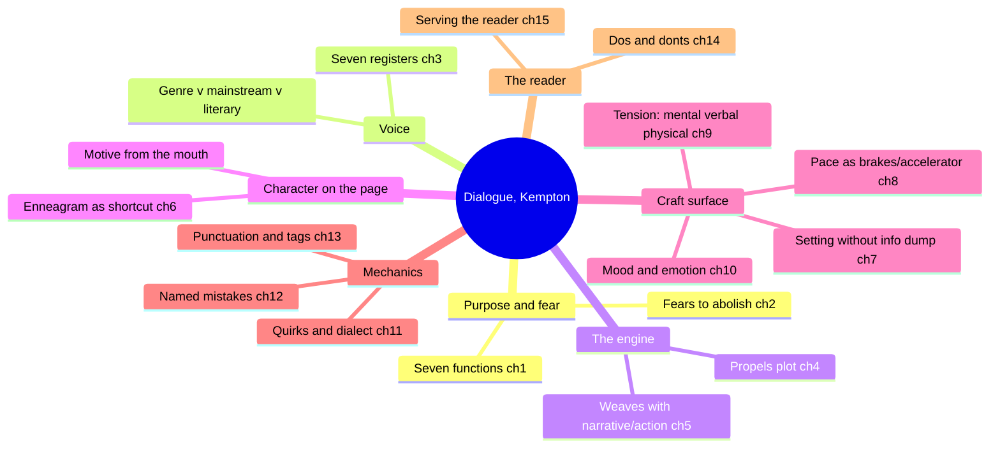
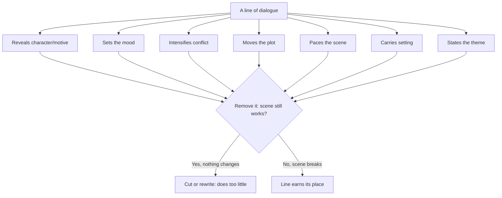
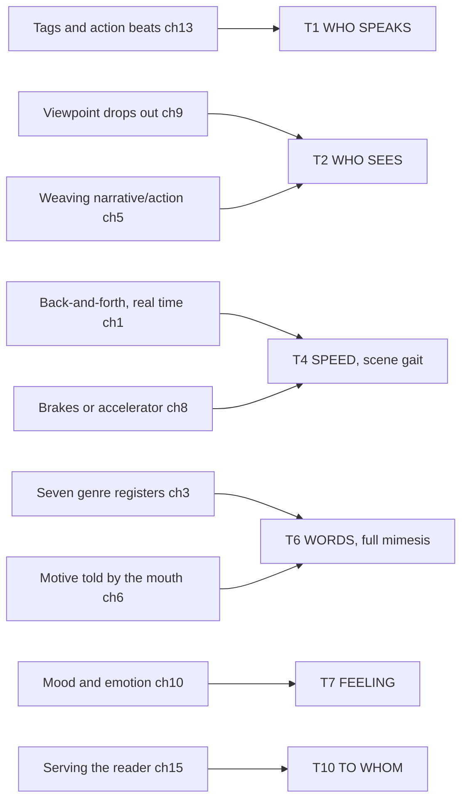

# BVX.0084 — Write Great Fiction: Dialogue — Gloria Kempton (2004)
### Knowledge Entry — Distill

A working writing-coach's craft manual: dialogue as a single tool that does seven jobs at once, taught chapter by chapter from voice, through function, through mechanics, to the reader on the other end of the page.

## TABLE OF CONTENTS
- [Core Thesis](#1-core-thesis)
- [Mind Models](#2-mind-models)
- [Framework](#3-framework--structure)
- [Key Concepts](#4-key-concepts)
- [Heuristics](#5-heuristics--decision-rules)
- [Invariants](#6-invariants)
- [Pitfalls](#7-pitfalls--myths)
- [Application](#8-application)
- [Cross-References](#9-cross-references)
- [Provenance](#10-provenance--confidence)

---

## 1 · CORE THESIS

A line of dialogue is never doing only one job: it can characterize, set mood, raise conflict, move plot, pace the scene, carry setting, and state theme at once. Kempton's method is to relax into the character's authentic voice rather than engineer effects, then test every line against how many of those jobs it actually does.

---

## 2 · MIND MODELS

*Required. Minimum two diagrams, maximum five. See template §C for the rules.*

**Diagram 1 — the whole argument.**
Caption: *the book runs voice, then function, then mechanics, then the reader — in that order, each stage assuming the last is settled.*

**Diagram 2 — the central mechanism.**
Caption: *a line is tested by removal, not by inspection — cut whatever the scene survives losing.*

**Diagram 3 — mapped onto the Ten Questions of the Telling.**
Caption: *dialogue's two strong claims are T4 (it is the scene-speed default) and T6 (it is full mimesis); the rest are real but thinner.*

---

## 3 · FRAMEWORK / STRUCTURE

Fifteen chapters in four unmarked movements, each assuming the last is settled.

| Movement | Chapters | Governing question |
|---|---|---|
| **Voice and permission** | 1 Purpose · 2 Fears · 3 Genre/mainstream/literary | What is dialogue for, and whose voice is it? |
| **Function** | 4 Plot · 5 Weaving · 6 Character/motivation · 7 Setting · 8 Pacing · 9 Tension · 10 Mood | What jobs does a scene of dialogue do? |
| **Mechanics** | 11 Quirks/dialect · 12 Common mistakes · 13 Punctuation/tags | What does dialogue look like on the page? |
| **Craft and reader** | 14 Dos and don'ts · 15 Connecting with readers | What does this cost the reader if it's wrong? |

The book's own checklist (Appendix) is a fifteen-item audit, one item per chapter — the clearest signal that Kempton considers each chapter a single testable function, not background reading.

---

## 4 · KEY CONCEPTS

| Concept | What it is | Why it matters |
|---|---|---|
| **The seven functions (ch1)** | Characterizes/reveals motive, sets mood, intensifies conflict, propels plot, paces the scene, adds setting, communicates theme | The book's master list; nearly every later chapter is one function expanded to full length |
| **Seven genre registers (ch3)** | Magical, cryptic, descriptive, shadowy, breathless, provocative, uncensored — one lexicon and rhythm per story category | Voice is assigned by the *story's* category, not the writer's personal style; "May the Force be with you" fails outside its register |
| **Weaving (ch5)** | Dialogue (words), action (movement), narrative (thought/observation) braided so no scene runs on one element alone | Names the three-part unit the rest of the book manipulates; a scene of only dialogue or only narrative is the exception, not the craft |
| **Motive from the mouth (ch6)** | Characters give away what they want by talking, even unconsciously; Kempton pairs this with the Enneagram as a nine-type shortcut to a character's want | "What does my character want, a lot?" (quoting an acting coach) — motive precedes and drives every line |
| **Info dump (ch7)** | Setting delivered as a block of description disguised as dialogue, agenda-driven rather than character-driven | The negative case for T6: detail must arrive through what the *character* would notice, not what the *author* needs told |
| **Pacing as brakes/accelerator (ch8)** | Dialogue defaults to speeding a scene up (quick back-and-forth); narrative defaults to slowing it down | A slow-talking character cannot be sped up by the writer; pace is a property of who is speaking, not just of sentence length |
| **Three kinds of conflict (ch9)** | Mental (unspoken hostility), verbal (words as weapons), physical (violence/sex) — any one or all three at once | Verbal is the chapter's main subject because it's the one dialogue directly stages |
| **Tension techniques: silence, anxiety, strategic tagging (ch9)** | Letting the viewpoint character drop out of the exchange; tracking a character's voice as anxiety climbs; splitting a tag mid-sentence to stretch it | These are the book's closest approach to subtext without ever naming it — withheld speech reads as withheld motive |
| **Named mistakes (ch12)** | The John-Marsha syndrome (name-overuse), adjective/adverb/tag addiction ("expostulated," "ragingly"), the disconnect (a reply that doesn't answer the prior line), the as-you-know-Bob tendency (dialogue used to dump backstory two people would never actually say aloud) | Each is given a memorable name so a writer can self-diagnose; action beats are the fix for the second, flow-checking for the third |
| **Tag vs. beat (ch13)** | A tag ("she said") names the speaker; a beat is an action sentence that identifies the speaker without a tag at all (Anne Tyler example) | Kempton's preference: beats over tags, tags over adverbs, adverbs almost never |

---

## 5 · HEURISTICS & DECISION RULES

| Situation | Do this | Not this |
|---|---|---|
| Identifying a speaker | Use an action beat, or a plain "said" | Reach for "expostulated," "harkened," or an adverb like "ragingly" |
| A character can't nod/cough/laugh a line | Put the action in its own sentence or attach it to a tag | Write `"I'm out of here," he nodded` |
| Delivering setting or backstory | Let the viewpoint character notice it mid-action, one or two details at a time | Info-dump it in one unbroken speech, or have characters tell each other what they both already know |
| Wanting the reader to feel tension | Let the viewpoint character go silent while others keep talking or moving | Have every character say exactly what they're thinking, all the time |
| Writing a fast or slow talker | Decide the character's native speed once, then let it hold | Try to speed up a slow character or slow down a fast one mid-scene for plot convenience |
| Choosing a story's dialogue voice | Match one of the seven genre registers to the story's category | Import a register wholesale from a different genre ("magical" lines in a literary novel) |
| A scene of dialogue feels flat | Check it against the seven functions; if it does none, cut or rewrite it | Assume more dialogue, or louder dialogue, fixes flatness |
| Two characters keep using each other's first names | Delete all but the rare, motivated exception (a power play, as in *The Chamber*) | Leave them in "for clarity" |
| A character won't admit their real motive | Have another character say it about them | Have the character state it outright, killing the mystery |
| Revising a finished draft | Run the fifteen-item checklist (Appendix) chapter by chapter | Trust that dialogue "sounds fine" without checking function, pace, and mechanics separately |

---

## 6 · INVARIANTS

1. A line of dialogue must do at least one of the seven jobs (characterize, mood, conflict, plot, pace, setting, theme), or it doesn't belong in the scene.
2. Genre determines register before personal voice does — the story's category sets the dialogue's vocabulary and rhythm, not the author's habitual style.
3. Dialogue is the default speed-up mechanism of a scene; narrative is the default slow-down mechanism. Both exist to produce a rhythm across the whole story, not a constant pace.
4. Punctuation (commas, periods, ellipses, dashes, question and exclamation marks) sits inside the closing quotation mark; colons and semicolons don't belong inside dialogue at all.
5. Every speaking character gets a distinct voice; the tool for finding it (Enneagram, or any equivalent) is optional, the distinctness is not.
6. Motive is revealed through speech even when the character doesn't consciously know his own motive — the mouth tells the truth the character himself may be hiding from.
7. A speech impediment or verbal tic needs a story-level reason, not just a characterization flourish, or it becomes noise the reader tunes past.

---

## 7 · PITFALLS / MYTHS

- **The John-Marsha syndrome** — characters overusing each other's first names until the exchange sounds like a script direction rather than real speech.
- **Adjective/adverb/inappropriate-tag addiction** — "he said ragingly," invented verbs ("expostulated," "harkened"), or physical-action verbs standing in for speech verbs ("he nodded" a sentence).
- **The disconnect** — a reply that answers a much earlier line instead of the one just spoken, breaking the pool-table flow a real exchange needs.
- **The as-you-know-Bob tendency** — dialogue used to tell each other things both characters already know, purely so the reader overhears it.
- **The info dump** — setting or backstory delivered as an unbroken descriptive speech instead of surfacing through what the viewpoint character notices mid-action.
- **Trying too hard** — dialogue that reads as contrived because the writer is managing effects instead of relaxing into the character's voice.
- **Melodrama and its opposite, underplaying** — characters sobbing over a stubbed toe, or characters accepting a devastating loss with no charge at all; both fail the emotion the scene actually calls for.
- **Mismatched register** — magical or breathless dialogue voice imported into a literary or mainstream story where it reads as absurd (the "May the Force be with you" test).

---

## 8 · APPLICATION

- **Spine level:** TEXTURE — Kempton is entirely discourse-side; she never touches story-spine structure (goals, obstacles as plot architecture) except as the thing dialogue must *serve*.
- **12-layer character stack:** primary on **L3 SOCIAL** (the seven registers, quirks, dialect, and the named mistakes are all a character's social signature succeeding or failing on the page); supporting on **L1 CORE** (theme/belief surfaces through what a character argues) and **L10 SHADOW** (silence and other-characters-name-the-motive are subtext's mechanism, unnamed as a term but fully present as technique).
- **plot_systems:** dialogue is presented as a delivery *vehicle* for plot (ch4's "wheels of motion") rather than a plot mechanism itself — it moves information, obstacles, and turning points into scenes plot_systems already schedules, but doesn't generate them.
- **Setting:** touched directly in ch7 — the book's clearest craft rule against info-dumping setting through dialogue, i.e., a specific failure mode for the setting slice's exposition problem.

Kempton's seven functions are a flat, practitioner-level restatement of what the texture layer formalizes as separate questions: T4 (speed) and T6 (words/mimesis) do almost all of the real work, with T1, T2, T7, and T10 present but thin. The book never distinguishes "who speaks" from "who sees" the way Chatman's frame does — Kempton's "viewpoint character" collapses both, which is exactly the collapse the texture layer's T1/T2 split exists to catch. Where Kempton is most useful to the Command is precisely at that gap: she gives concrete scene-level tactics (silence, strategic tagging, beats over tags) for problems the Ten Questions name abstractly.

**For the texture system:**
- Adds a page-level test to T4/T6 that the SSOT states only structurally: a line of dialogue can be audited against seven named functions, and a line surviving on zero of them is a cut, not a style choice.
- Feeds T6 (WORDS) hardest — the seven genre registers are a ready-made, non-academic vocabulary for the "distance dial toward mimesis" the SSOT already names, and could seed the TRANSLATION GRID's craft-term column.
- Dialogue likely deserves its own field on the scene card's `telling:` line beyond T1+T2+T4 — a **register** slot (which of the seven voices, or "none/mixed") would let a scene card flag a mismatch (literary scene running a breathless register) the way `duration:` already flags pace.
- OPEN candidate: the SSOT has no field for a scene's **function count** (how many of dialogue's jobs a given exchange is doing) — Kempton's implicit audit suggests the telling needs a lightweight per-scene tally the Ten Questions don't currently hold.
- OPEN candidate: T2's "who sees" and dialogue's "viewpoint silence" technique (a character visibly not saying what he's thinking) is a texture move the SSOT's focalization vocabulary doesn't yet have a name for — it's neither zero, internal, nor external focalization, but a focalized character's deliberate non-report.

---

## 9 · CROSS-REFERENCES

| Related entry | Relation |
|---|---|
| [[BVX.0075]] | Davis, *Creating Compelling Characters* — Davis's super-objective/counter-will (L6 DRIVE, L4 WILL) is the want-engine Kempton's "motive from the mouth" and Enneagram shortcut deliver on the page; Davis builds the want, Kempton stages it in speech |
| [[BVX.0175]] | McKee, on dialogue and subtext — McKee names subtext directly; Kempton never uses the word but arrives at the same mechanism through silence (ch9) and other-characters-naming-the-motive (ch1); compare once BVX.0175 is distilled for the vocabulary gap |
| [[BVX.0279]] | Iglesias, distilled in the same BOLO 18 texture wave — both are craft-practitioner passes feeding TEXTURE; cross-check mechanics-chapter overlap (tags, beats, pacing) once both entries are complete |

---

## 10 · PROVENANCE & CONFIDENCE

Sourced from a full pdftotext extraction (239 pages, ~89k words), read closely: the introduction and all fifteen chapter openings and closings; the whole of chapters 1 (functions), 3 (genre voices), 6 (character/Enneagram), 8 (pacing), 9 (tension), 12 (mistakes), and 13 (punctuation/tags) in detail; chapters 2, 4, 5, 7, 10, 11, 14, and 15 read at full length in their opening and closing thirds plus targeted middle sections; exercises read at heading/prompt level throughout, not transcribed; the appendix checklist and index scanned in full. Notable catalog fact: the word "subtext" does not appear anywhere in this book — the mechanism is present (ch1, ch9) but Kempton never names it, unlike McKee (BVX.0175), which is why the feeds block marks L10 SHADOW as supporting rather than primary.

## META
- Template: BVX-LEARN-v4.0
- Source classification: full-text pdftotext extraction, close read of the functional chapters and mechanics chapters, sampled read of the remainder
- Created / Updated: 2026-09-16
