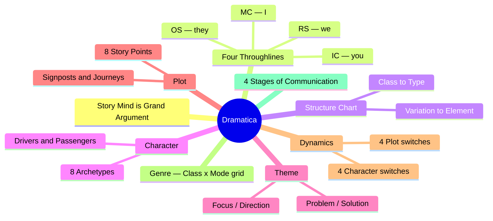
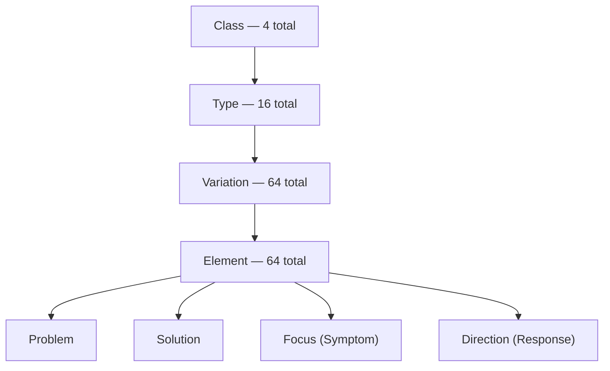
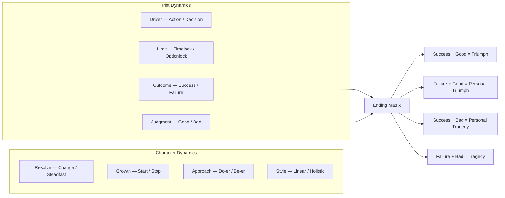
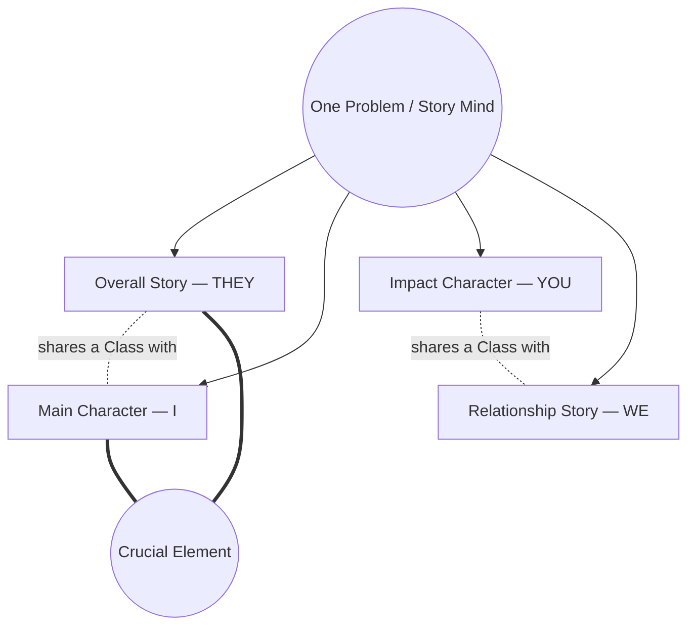
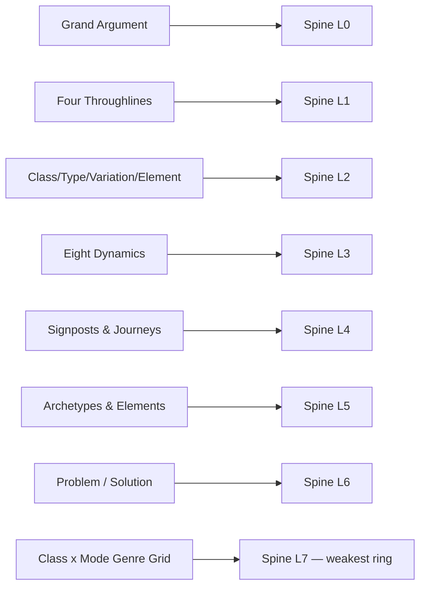

# BVX.0089 — Dramatica: A New Theory of Story — Melanie Anne Phillips & Chris Huntley (1993)
### Knowledge Entry — Distill

The Command's RULED story spine in its original form: the only narrative model built as a complete tree rather than a list of craft advice, and the source every rival model in the library gets mapped onto as a lens (see the spine SSOT). This entry is the reference card the spine doc cites.

## TABLE OF CONTENTS
- [Core Thesis](#1-core-thesis)
- [Mind Models](#2-mind-models)
- [Framework](#3-framework--structure)
- [Key Concepts](#4-key-concepts)
- [Heuristics](#5-heuristics--decision-rules)
- [Invariants](#6-invariants)
- [Pitfalls](#7-pitfalls--myths)
- [Application](#8-application)
- [Cross-References](#9-cross-references)
- [Provenance](#10-provenance--confidence)

---

## 1 · CORE THESIS

A story is a model of one problem-solving Story Mind: a complete Grand Argument examines a single problem from four irreducible perspectives — Overall Story, Main Character, Impact Character, Relationship Story — until every approach is tried and one is proven best. A nested Class→Type→Variation→Element chart locates the problem; eight dynamics govern how the story moves and ends.

---

## 2 · MIND MODELS

**Diagram 1 — the whole argument.**
Caption: *nine families of machinery, one Story Mind — everything below exists to make the argument airtight from every angle.*

**Diagram 2 — the central mechanism (the structural nesting).**
Caption: *four narrowings, one chess set — every problem in every story bottoms out on the same 64-cell grid, whether you're naming its Class or its atomic Element.*

**Diagram 3 — the eight story dynamics.**
Caption: *four switches decide the Main Character's shape, four decide the plot's shape — Outcome and Judgment then combine independently into one of four possible endings.*

**Diagram 4 — the four throughlines around one problem.**
Caption: *the same Story Mind's problem, seen from four seats that never repeat a Class — this is what no rival model has all four of.*

**Diagram 5 — mapped onto the Command's story spine.**
Caption: *the book's own vocabulary reads straight down the spine — this is why Dramatica is the trunk and every rival is a branch.*

---

## 3 · FRAMEWORK / STRUCTURE

**Seven central concepts open the book** (Foundations, p.20): the Story Mind, the Four Throughlines, and the Overall Story / Main Character / Impact Character / Subjective (Relationship) Story Throughlines individually, culminating in the Grand Argument Story itself.

**Two principal sections carry the whole theory:**
- **Section 1, The Elements of Structure** — Character, Theme, Plot, Genre: the static skeleton every complete story must build, organized as the Class→Type→Variation→Element chart plus the Plot Story Points.
- **Section 2, The Art of Storytelling** — the Four Stages of Communication (Storyforming → Storyencoding → Storyweaving → Reception): how the static skeleton gets turned into a specific, told story for a specific audience.

**The Storyform is the pivot between the two sections.** It is the complete, locked set of answers to every structural and dynamic question — a blueprint, not a plot. Two surface-different stories (the book's own example: *West Side Story* / *Romeo and Juliet*; *Cyrano de Bergerac* / *Roxanne*) can share the same Storyform while sharing almost no incident.

**Character splits into two families, not one:** Overall Story Characters (dramatic functions — Protagonist, Antagonist, etc., judged by how WE see them affect the story) and Subjective Characters (points of view — Main and Impact, judged from the inside). A "hero" is simply what happens when the Main Character point of view is attached to the Protagonist function — one popular combination among many possible.

---

## 4 · KEY CONCEPTS

| Concept | What it is | Why it matters |
|---|---|---|
| **Story Mind** | The premise that every complete story is a model of a single mind's problem-solving process, holistic not sequential | The generative claim everything else derives from (Foundations, p.20) |
| **Grand Argument Story** | A story that is conceptually complete, covering all the ways a mind could consider its problem and showing one approach is appropriate | The book's deliberately narrow scope — not every story is one, and that's fine (p.14) |
| **Storyform** | The complete, locked blueprint of structural and dynamic answers, independent of the specific events that dramatize it | Lets two unrelated plots (*West Side Story* / *Romeo and Juliet*) share one argument |
| **Player vs. Character** | A player is the person/place/thing on the page; a character is a bundled set of dramatic functions placed into a player | Explains multi-personality players (Jekyll & Hyde) and why "hero" is a bundle, not a given |
| **Crucial Element** | The single Element (of 64) held in common by the Main Character and the Overall Story — the hinge between the objective and subjective arguments | Makes a character "Main"; not plot position, structural position (p.75) |
| **Justification vs. Problem Solving** | Justification is a reasoned path the author has ruled non-optimal; Problem Solving is the path proven correct by the story's own Outcome/Judgment | The author, not audience consensus, decides which path is "right" inside the story (p.77–80) |
| **Unique Ability / Critical Flaw** | A trait that could resolve the MC/IC's Problem, undermined by a trait that blocks its use | The lever and the lock on Main/Impact Character growth (p.121) |
| **Catalyst / Inhibitor** | The OS/RS-level equivalent of Unique Ability/Critical Flaw — accelerator and brake on a throughline's pacing | Pacing that comes from structure, not authorial fiat |
| **Focus (Symptom) / Direction (Response)** | The other two Elements in the Problem/Solution quad — what characters fixate on, and what they do about it, instead of the root Problem | Explains why fixing the symptom doesn't cure the story (p.120) |
| **Benchmark** | A Type-level story point that measures a throughline's progress toward its Concern | The ruler each throughline's growth is read against |
| **8 Archetypal Characters** | Protagonist/Antagonist, Reason/Emotion, Sidekick/Skeptic, Guardian/Contagonist — four Dynamic Pairs bundling all 64 Elements | Storytelling shorthand; each pair maps to a Story Mind conflict (drive vs. undermine, logic vs. feeling, faith vs. doubt, conscience vs. temptation) |
| **Drivers vs. Passengers** | Protagonist/Antagonist/Guardian/Contagonist force the plot; Reason/Emotion/Sidekick/Skeptic ride along and modulate it | A second quad grouping, orthogonal to the Dynamic Pairs (p.34) |
| **Complex Characters** | Any non-Archetypal redistribution of the same 64 Elements across a cast | Realism = internal inconsistency the Archetypes structurally lack |
| **8 Plot Story Points** | Goal, Requirements, Consequences, Forewarnings (Drivers) + Dividends, Costs, Prerequisites, Preconditions (Passengers) | The thematic machinery of plot, independent of any single throughline (p.125) |
| **Signposts & Journeys** | 4 fixed checkpoints (Types) per throughline, 3 Journeys (transitions) between them — 16 signposts across a complete form | The act structure the spine SSOT keys as L4 (p.215) |
| **8 Story Dynamics** | Resolve, Growth, Approach, Style (character) + Driver, Limit, Outcome, Judgment (plot) | The switches that decide *how* the story moves and *how* it ends (p.155–166) |
| **Outcome × Judgment matrix** | Success/Good, Failure/Good ("personal triumph"), Success/Bad ("personal tragedy"), Failure/Bad — two independent axes, four endings | Objective result ≠ subjective fulfillment; OXO is ruled Failure/Good |
| **Modes of Expression × Class = Genre** | Information/Drama/Comedy/Entertainment crossed with the 4 Classes = a 16-cell genre grid | Dramatica's own weakest holding (audience appreciations, thin per the spine SSOT) but a precise machine for tone |
| **Four Stages of Communication** | Storyforming (design) → Storyencoding (symbolize) → Storyweaving (order/emphasis) → Reception (audience decodes) | Diagnostic: a story problem can live in any one stage, or bridge several (p.149) |

---

## 5 · HEURISTICS & DECISION RULES

| Situation | Do this | Not this |
|---|---|---|
| Main Character feels like a placeholder | Check whether the Crucial Element is actually theirs — an Overall Story Character's Element, not a plot convenience | Assume "Main Character" is just "the one the camera follows" |
| Impact Character reads as generic (mentor/love interest/shadow) | Derive them structurally: the Class/Element diagonally opposed to the MC's Crucial Element | Cast a stock relational role and call it done |
| A subplot feels disposable | Check it is carrying the Relationship Story (WE) throughline, not filler | Treat it as a "B-story" bolted on for texture |
| Antagonist and Contagonist blur together | Separate by function — Antagonist stops the Protagonist, Contagonist deflects/delays | Merge them into one "bad guy who gets in the way" |
| The ending feels arbitrary | Lock Outcome × Judgment first (one of four endings), then write backward | Decide the ending scene-by-scene "by feel" |
| Choosing the 4th Character Dynamic | Use Linear/Holistic — the book's own later vocabulary (Problem-Solving Style), matching the spine SSOT | Use the book's original "Mental Sex" (Male/Female) label unglossed |
| Story sags or repeats mid-act | Check whether Timelock or Optionlock is actually driving the scene's tension | Inject an arbitrary countdown clock for false urgency |
| A character's flaw "doesn't land" | Check it's a genuine Critical Flaw paired to a specific Unique Ability, not a generic weakness | Bolt on a flaw unconnected to what the character needs to do |
| Cast feels bloated or redundant | Check whether two characters hold overlapping Elements from the same quad | Differentiate them cosmetically instead of structurally |

---

## 6 · INVARIANTS

1. Every complete Grand Argument Story develops all four Classes across all four throughlines — none is optional; only their assignment to OS/MC/IC/RS varies per story.
2. Problem and Solution are always a dynamic pair (diagonal in the same quad); an author never selects one without implying the other.
3. Protagonist ≠ Main Character, Antagonist ≠ Impact Character — function and point-of-view are independent axes. A "hero" results from combining them, not from their default state.
4. The Crucial Element is the single Element the Main Character shares with the Overall Story — this, not plot centrality, is what makes a character "Main."
5. Outcome (Success/Failure) is objective; Judgment (Good/Bad) is subjective. They combine independently into one of four possible endings.
6. Justification is not lesser reasoning — it is reasoning from a path the author has structurally ruled non-optimal; only the story's own proof, not audience sympathy, marks which path is "problem solving."
7. A story's Driver (Action or Decision) matches at both the inciting event and the resolving event — the two bookend each other.
8. Every Variation-level Issue pairs with a Counterpoint, and every Element-level Problem pairs with a Solution, a Focus (symptom), and a Direction (response) in the same quad.
9. Signposts (4 per throughline, 16 across a complete form) are fixed checkpoints; Journeys (3 per throughline) are what happens between them — both are required, neither substitutes for the other.

---

## 7 · PITFALLS / MYTHS

- Treating "hero" as one indivisible role — the book splits Main Character (I) from Protagonist (drives the plot) from its first chapter ("Hero Is a Four Letter Word," p.26).
- Casting the Impact Character as a static cast role (mentor / love interest / shadow) instead of deriving it structurally from the Class opposite the MC's.
- Confusing Antagonist (stops the Protagonist) with Contagonist (deflects/delays the Protagonist) — different Story Mind functions, easily merged by accident.
- Reading the book's dated dynamic label "Mental Sex" (Male/Female) as being about gender or sexual preference — the book itself disclaims this (p.161); it is a linear-vs-holistic problem-solving preference, later renamed Problem-Solving Style.
- Assuming Change is "correct" and Steadfast is "settling" — either Resolve can end in Success or Failure; Resolve says nothing about rightness (p.156).
- Treating Genre as a marketing bucket — in the book it is the Class × Mode grid, the audience's outermost, most dispassionate relationship to the Story Mind, and its own weakest ring per the spine SSOT.
- Picking a Story Goal from "what feels dramatic" instead of from the Type already shared by the Concern of whichever throughline anchors it.
- Assuming a bigger cast means a deeper argument — Complex Characters redistribute the same 64 Elements; they never add new ones.
- Believing Dramatica prescribes plot events — it prescribes the storyform's constraints; the specific scenes are authored downstream, in plot_systems, out of Dramatica's scope entirely.

---

## 8 · APPLICATION

- **Spine level:** L0 through L6, per the spine SSOT's own framing — Dramatica *is* the spine, not a rival mapped onto it. L0 = the Grand Argument as the root claim of what a story is. L1 = the Four Throughlines, unmatched by any rival (most collapse MC+OS and treat IC/RS as subplot). L2 = the Class→Type→Variation→Element nesting, held in full detail by the sibling entry BVX.0091. L3 = the eight dynamics and the Outcome×Judgment ending matrix. L4 = Signposts/Journeys/Drivers, the plot floor beneath which plot_systems (McKee's and Truby's scene grammar) takes over. L5 = the 64 Elements and 8 Archetypes, functions before persons. L6 = theme as structural position (Issue/Counterpoint, Problem/Solution, Outcome+Judgment), not a bolted-on message. L7 (Genre) is explicitly the model's weakest ring — the spine SSOT gives that strength to Coyne and Truby instead.
- **12-layer character stack:** the DRAMATICA layer (this entry's full `feeds:` list) supplies every field in L12_DRAMATICA_EXTENDED — mc_domain through rs_concern, mc_problem/solution/symptom/response, mc_unique_ability, mc_critical_flaw, mc_benchmark, the four motivation/methodology/evaluation/purpose quads. L12 FUNCTION core draws dramatica_archetype, mc_problem_element, resolve, story_outcome, story_judgement, and limit_type directly from a locked storyform, per the integration protocol's Tier 3 rule: no deep character enters the Vertical Slice without a locked Dramatica ingest.
- **plot_systems:** the Story Points (Goal/Requirements/Consequences/Forewarnings/Dividends/Costs/Prerequisites/Preconditions) and the Signpost/Journey grammar set what plot must accomplish; the events, scenes, and beats that dramatize them are explicitly out of scope here (per the integration protocol) and fall to `04_PLOT_SYSTEMS/`, seeded by BVX.0175 (McKee) and BVX.0193 (Truby).
- **Setting:** not applicable — the book has no dedicated Setting chapter; Situation (Universe) is a thematic Class, not a physical-world model.

For OXO specifically: the storyform's ruled dynamics (Outcome=Failure, Judgment=Good — "personal triumph," per spine L3) are a direct instance of this book's own worked example ("If we choose a Failure/Good story, we can imagine a Main Character who realizes he had been fooled into trying to achieve an unworthy Goal... or discovers something more important to him personally," p.166). Victoria Midnight's existing L12_DRAMATICA_EXTENDED record (mc_issue: Interdiction, mc_problem: Equity/mc_solution: Inequity, mc_unique_ability: Destiny, mc_critical_flaw: Truth) is a populated instance of exactly the fields this entry's `feeds:` enumerates — this distill is the reference card for reading that record, not a proposal to change it.

---

## 9 · CROSS-REFERENCES

| Related entry | Relation |
|---|---|
| [[BVX.0091]] | The Dramatica structure chart proper — the full Class/Type/Variation/Element grid this entry summarizes at reference-card depth |
| [[BVX.0175]] | McKee, *Story* — occupies this entry's L4/L6 territory below the signpost floor; his beat→scene→sequence→act grammar is exactly what Dramatica does not specify |
| [[BVX.0193]] | Truby, *The Anatomy of Story* — the organic-growth rival to this book's structural-tree model; both are named as L4/L5/L6 lenses on the same spine in the SSOT |
| [[BVX.0064]] | McKee, *Character* — already consumed by the house for Impact Character derivation; a downstream persons-layer complement to this entry's functions-first Archetypes |

---

## 10 · PROVENANCE & CONFIDENCE

Full text, pdftotext extraction (~145,000 words, 14,514 lines, 342 pages per the source's own page markers). No page-break-clean OCR; citations above are by book page number (the extraction retains the original page footers) rather than PDF page. Read in full: Foreword; Foundations — Central Concepts, The Story Mind, The Four Throughlines (with the *Star Wars* and *To Kill a Mockingbird* worked examples), Summary; the Archetypal Characters chapter in full (Protagonist through Guardian & Contagonist, Drivers and Passengers, Dynamic Pairs); The Crucial Element; Problem Solving and Justification (What are Justifications?, What is Problem Solving?); the full Theme structural chart — What Exactly Is Theme?, Describing the Story's Problem, the Class/Type/Variation/Element charts verbatim, Matching Points of View to the Chart; Additional Story Points — Unique Ability/Critical Flaw, Catalyst/Inhibitor, Benchmark, Focus/Direction; Plot Story Points (all eight, in full); Signposts and Journeys (with the worked diamond-heist example) and the opening of Main Character Throughline Plot Progression; Character Dynamics in full (Resolve, Growth, Approach, Mental Sex) and Plot Dynamics in full (Driver, Limit, Outcome, Judgment); Modes of Expression and the Grid of Dramatica Genres in full, with worked example; The Four Stages of Communication (overview) in full.

**Sampled at heading level only (not read in depth this pass):** the extended per-Type Star Wars/Oz/Jaws archetype breakdowns (p.44–68); Storyforming Structural Story Points beyond the throughline-selection opening (p.167–193); Storyencoding chapters (p.194–226); Storyweaving (p.227–247); Story Reception, propaganda, and adaptation (p.248–265); the Epilogue's *Jurassic Park* constructive-criticism case study (p.268+); the Reference Material vocabulary/synonym/semantic-item appendix (p.275–342, sampled only to confirm the 64-element grid and total page count). A deeper pass on Storyweaving and the *Jurassic Park* critique would strengthen L4/L7 material specifically — flag with **"Upgrade BVX.0089"** if wanted.

All quotes verbatim from the pdftotext extraction. The extraction is clean of `fi`/`fl` ligature drops (unlike some other sources in this wave); no silent corrections were needed. The OXO/L12 application in §8 draws on the integration protocol doc (`ssot_02_dramatica_integration_protocol.md`) and Victoria Midnight's example record cited there — this entry does not invent new OXO storyform content, only demonstrates the mapping.

## META
- Template: BVX-LEARN-v4.0
- Source classification: full-text book, pdftotext extraction
- Created / Updated: 2026-09-16
