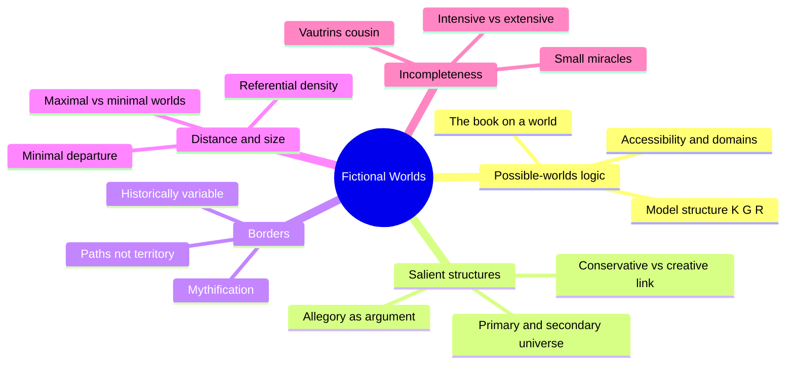
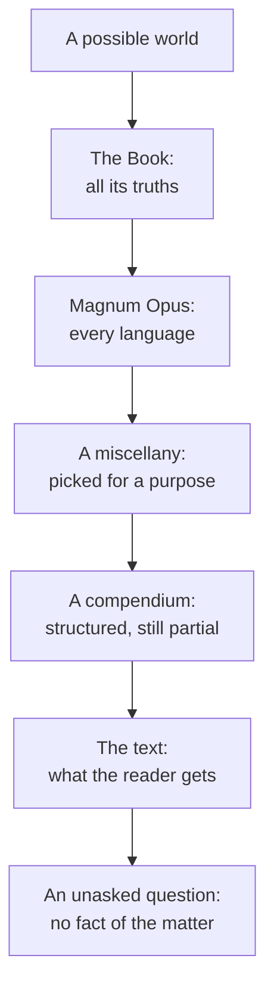
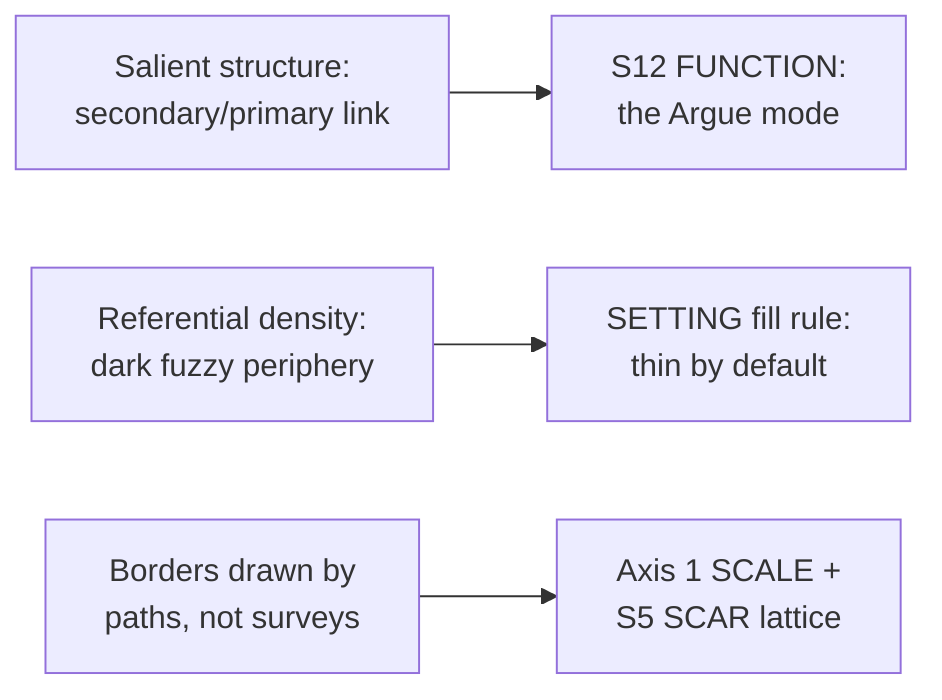

# BVX.0100 — Fictional Worlds — Thomas G. Pavel (1986)
### Knowledge Entry — Distill

A philosopher's short book that treats a fictional world as a logical object first and a story second: what makes something part of a world, where the world stops, how big it is, and why it can never be finished. The theory behind the SETTING shelf's "thin by default" instinct.

## TABLE OF CONTENTS
- [Core Thesis](#1-core-thesis)
- [Mind Models](#2-mind-models)
- [Framework](#3-framework--structure)
- [Key Concepts](#4-key-concepts)
- [Heuristics](#5-heuristics--decision-rules)
- [Invariants](#6-invariants)
- [Pitfalls](#7-pitfalls--myths)
- [Application](#8-application)
- [Cross-References](#9-cross-references)
- [Provenance](#10-provenance--confidence)

---

## 1 · CORE THESIS

A fictional world is a secondary universe built by correspondence onto a primary one, filled only as far as a text's inferences reach and thinning into unwritten darkness beyond. What fails to correspond, the salient surplus, is where a world argues; borders, distance, and size are craft choices about how much of that darkness a story can afford to leave standing.

---

## 2 · MIND MODELS

*Required. Minimum two diagrams, maximum five.*

**Diagram 1 — the whole argument.**
Caption: *five moves, one throughline — a world is a logical object, its fictional instance is a correspondence, and every downstream question (borders, size, gaps) is really a question about how much of that correspondence a text can carry.*

**Diagram 2 — the central mechanism (a process: world to text).**
Caption: *every step between a world and its text throws information away on purpose; a finished text is necessarily a small, selected fragment, so incompleteness is the mechanism, not a bug in the craft.*

**Diagram 3 — mapped onto the Command's SETTING system.**
Caption: *Pavel supplies the formal argument behind three things ssot_03 had only asserted by ruling — why S12 binds by correspondence, why thin-by-default is correct rather than merely convenient, and why a place's borders can move without the place stopping being itself.*

---

## 3 · FRAMEWORK / STRUCTURE

Six chapters, building one argument in sequence rather than eighteen essays on separate topics (contrast BVX.0458). This distill concentrates on the three chapters the brief names; the other three are noted for completeness.

| Chapter | Governing question | Depth here |
|---|---|---|
| 1. Beyond Structuralism | Why did structuralist and segregationist accounts of fiction fail to explain how readers actually use it? | sampled |
| 2. Fictional Beings | Do sentences about Mr. Pickwick or Sherlock Holmes refer to anything, and does it matter? | read in full |
| 3. Salient Worlds | What does it mean, formally, for a story to posit a "world," and how does that world relate to the real one? | read in full — the book's hinge |
| 4. Border, Distance, Size, Incompleteness | Where does a fictional world stop, how far is it from ours, how big is it, and what happens where the text runs out? | read in full — the brief's focus |
| 5. Conventions | How do genre and period supply the rules a text expects its reader already to know? | sampled |
| 6. The Economy of the Imaginary | How does fiction circulate as a cultural resource, imported, exported, hoarded? | sampled |

The throughline: Chapter 2 clears away the idea that a fictional sentence is simply true, false, or meaningless (the segregationist/Meinongian dispute). Chapter 3 replaces that dead end with **salient structures** — a formal model for a world built on top of another world by correspondence. Chapter 4 then asks the four questions any built world actually needs answered: where it ends, how far it sits from home, how big it is, and what to do when the text stops talking.

---

## 4 · KEY CONCEPTS

| Concept | What it is | Why it matters |
|---|---|---|
| **Model structure (K, G, R)** | Kripke's possible-worlds machine: a set of worlds K, a privileged actual world G, and an accessibility relation R linking G to its alternatives | The formal skeleton under every later claim about what "counts as" part of a world — a world is defined by what is accessible from it, not by an inventory list |
| **Salient structure** | A dual structure (primary universe + secondary universe) linked by a correspondence relation ("will be taken as"), where the secondary universe contains elements that lack a match in the primary one | The single load-bearing idea of the book: fiction, ritual, and theater all run on this two-level machine, and the mismatch is where meaning lives |
| **Existentially conservative vs. creative** | A conservative dual structure has no element in the secondary world without a real-world correspondent (children pretending mud is pie); a creative one adds things the primary world doesn't have (a dragon in a game of pretend) | Distinguishes decoration (skinning the real world) from genuine invention (adding what has no real counterpart) |
| **The genie fable (World → Book → Magnum Opus → Miscellany → Compendium → Text)** | Pavel's extended allegory for how an unwritable total world gets cut down, book by book, into the finite text a reader actually holds | Explains why every setting document is necessarily a lossy excerpt, and why that is not a failure of research |
| **Principle of minimal departure** | (Imported from Ryan/Lewis) we read a fictional or counterfactual world as identical to the actual one except where the text forces a change | The default assumption a reader brings before your text overrides it; you only have to state the departures, not the whole world |
| **Referential density** | The ratio between how much a text says and how much world it implies; a text can be short and dense (imply a huge world) or long and diluted (imply a small one) | Explains why a seven-page story (Borges) can outsize a thousand-page novel in world scope — length tracks telling, not territory |
| **Narrative/dramatic orchestration** | The number of active domains (groups of characters sharing moves) versus the number of characters in each | A tight cast in few domains (Racine) reads as controlled; many domains with fluid membership (Balzac) reads as sprawling — a dial, not an accident |
| **Homogeneous vs. heterogeneous systems; opacity to inference** | Most fiction mixes categorial structures, so a world must resist inference spreading everywhere (thermodynamics need not apply in a Balzac novel); Pavel likens this to "a highly structured central area surrounded by increasingly dark, fuzzy spaces" | The formal name for the intuition every GM already has: the town is detailed, the horizon is not, and that boundary is a feature |
| **Borders of fiction (sacred, actuality, representational)** | Three distinct kinds of boundary separate fiction from myth, from reality, and from its audience; none of them are fixed, and all were historically drawn late (real national borders are an 18th–19th-century invention) | Borders are institutional conventions, mobile and asymmetric, not metaphysical walls — a setting's edge is a choice, not a discovery |
| **Fictional expansion as "road empire"** | Fiction often grows the way trade empires grow: along commercial/narrative arteries, without securing the territorial hinterland | The practical shape of how a story's world actually gets built: detail follows the paths the plot travels, not a surveyed map |
| **Small miracles** | A local, bounded departure from the actual world's laws (Notre Dame painted blue; a child born of a god) that leaves everything else intact | The formal license for a single reasonable ruling on the spot, instead of a system-wide retcon, when a text or scene needs one exception |
| **Incompleteness (Vautrin's cousin)** | Some propositions about a fictional world ("Vautrin has a cousin") have no true or false answer, ever, because the text never entails one | Not a defect to be engineered away; it is what makes a world finite enough to write |
| **Ontological founders and condensed symbols** | Certain characters (Tamburlaine, Don Quixote) carry a rival "basic text" of their own and reorganize the world around it; their followers convert not on evidence but on a single resonant, cosmic-feeling symbol | A model for how a faction's founding myth or a cult's charisma works inside a setting: persuasion by condensed symbol, not by proof |

---

## 5 · HEURISTICS & DECISION RULES

| Situation | Do this | Not this |
|---|---|---|
| Deciding how much of the setting to write up | Match detail to referential density: write only what the story's inferences actually need | Build a maximal encyclopedia nobody, including you, will ever read at the table |
| Drawing your world's edge | Treat the border as historically variable and fuzzy, drawn by the trade routes and journeys your story actually uses | Draw a surveyed political map before you know which roads the plot travels |
| A player or reader asks something the setting never answered | Name it a genuine gap and rule a "small miracle" on the spot, consistent with everything already established | Retcon the whole setting, or refuse to answer, to avoid admitting the gap exists |
| Building a place meant to carry theme | Give it one element with no real-world correspondent; that surplus is what argues | Skin a real location and call the resemblance itself an argument |
| Choosing between a sprawling setting and a tight one | Treat size as a dial tied to how much impersonation effort you want from the reader or players | Equate "bigger" with "better" or "more serious" |
| Introducing something impossible or supernatural | Keep it local and bounded unless the whole premise is a maximal departure | Scatter unbounded exceptions everywhere and call the mess worldbuilding |
| Feeling obligated to fill every layer for every location | Light the center, leave the periphery dark and fuzzy on purpose | Chase completeness across every layer for every place, burning prep time for no play payoff |
| A faction or cult needs a founding myth | Give it one condensed, resonant symbol its members convert on, not a dossier of proof | Over-explain the faction's belief system until the mystery evaporates |

---

## 6 · INVARIANTS

1. **A world is never given whole.** Every text is a selected, lossy fragment of an unwritable total; the loss happens at every stage from world to book to text, not just at the writer's desk.
2. **Incompleteness is structural, not a mistake.** Some questions about a setting have no fact of the matter and never will; this is what makes a world finite enough to finish.
3. **A border is an institutional convention, not a metaphysical wall.** Borders move, thin, and vary in permeability, and most were drawn late and along paths of use, not by survey.
4. **Salience, not resemblance, is where a setting argues.** What corresponds to the real world is scenery; what fails to correspond carries the theme.
5. **Size and distance are dials tied to reader effort, not measures of worth.** A small, dense world can outweigh a sprawling, thin one.
6. **Every world has a lit center and a dark periphery.** Treating the periphery as equally solid produces kitchen-sink bloat, not depth.

---

## 7 · PITFALLS / MYTHS

- Treating a fictional world as if it must be logically complete, where every proposition is true or false — even philosophers' models of the *actual* world struggle with this; fiction is structurally worse, on purpose.
- Confusing textual length with world size: a seven-page story can imply a bigger world than a thousand-page novel; length tracks telling and orchestration, not scope.
- Assuming a setting "argues" or carries theme merely because it resembles a real place. Resemblance is not correspondence; the argument lives in the salient surplus, what does not match.
- Drawing hard political borders before knowing which roads the story travels. Most historical borders, like most story borders, are drawn late, by use, not by survey.
- Believing incompleteness is a modern defect to be cured with more detail. Some periods deliberately maximize it, others minimize it; both are legitimate strategies, not error states.

---

## 8 · APPLICATION

- **Spine level:** SETTING, L6 — a setting-side source whose theory of correspondence also lands on L6 Theme's touchpoint (ssot_01: "the Argue function mode — the place makes the argument in matter")
- **12-layer character stack:** none directly; the salient-structure correspondence logic is formally analogous to how L12 FUNCTION binds an invariant to a character, but this source stays setting-side
- **plot_systems:** contextual — a "small miracle" is a ready-made scene-hook the instant a story's information runs past what the setting has answered: rule on the spot, consistent with everything upstream, rather than freezing play to fix it in advance
- **Setting:** primary — answers two open questions already on record in `ssot_03_setting_system.md`: Kennedy's kitchen-sink challenge (this book supplies the *reason* thin-by-default works, not just the recommendation) and the formal shape of S12's binding rule (correspondence, not resemblance)

Read against the DCUS starter instance, the theory holds up directly. DCUS's rename lattice (Skeeter Creek → Red Hills → DCUS, S5 SCAR) is exactly Pavel's border-as-historical-convention claim at institutional scale: the school's edge was never surveyed, it was drawn and redrawn by who got to use the name. And the campus's S9 ALLURE (the meritocratic promise Tori must stop believing) is a salient element with no correspondent in any real institution's brochure — it is precisely the surplus the setting's theme argues through, per Pavel's allegory analysis of Everyman and Danto's "This actor is Lear." The one place the book stays silent, deliberately: it offers no method for *building* a setting (no mapmaking order, no economy checklist), only the logic that tells you when you have built enough of one. That is the gap BVX.0458 (Kobold) fills, and why the two entries are read as a pair.

---

## 9 · CROSS-REFERENCES

| Related entry | Relation |
|---|---|
| [[BVX.0458]] | *The Kobold Guide to Worldbuilding* — the practical TTRPG counterpart; Pavel supplies the formal reason behind Kobold's "thin by default" and present-tense-history rules, Kobold supplies the method Pavel never offers |
| [[BVX.0349]] | *Against Worldbuilding, and Other Provocations* — Kennedy's kitchen-sink pitfall, independently arrived at from the opposite (anti-theory) direction; both texts land on the same dark-periphery conclusion |
| Doležel, *Heterocosmica: Fiction and Possible Worlds* (1998) | **BOLO 80 theme hook** — TO GET, tagged `invariants`; sorts fictional-world rules into physical/moral/evaluative types, the natural sequel to Pavel's modal-logic opening in Ch.2–3 |
| Ryan, *Possible Worlds, Artificial Intelligence, and Narrative Theory* (1991) | **BOLO 80 theme hook** — HELD in the Zotero library, not yet spine-keyed; the source of the "principle of minimal departure" Pavel imports directly into Ch.4 |
| Ronen, *Possible Worlds in Literary Theory* (1994) | **BOLO 80 theme hook** — TO GET, tagged `invariants`; explicitly pushes back on how far possible-worlds logic transfers to fiction, the exact pushback Pavel's own Ch.3 anticipates and partially concedes |
| `ssot_03_setting_system.md` | The house SETTING SSOT this distill feeds: S12 FUNCTION's binding rule, Axis 1 SCALE's borders, and the open fill-rule question (Kennedy's challenge) |

---

## 10 · PROVENANCE & CONFIDENCE

Full text via pdftotext extraction, 178pp; OCR quality is uneven, with several passages (notably the modal-logic exposition mid–Chapter 3 and the back-of-book index) column-interleaved and garbled, though recoverable by context and cross-checked against the index. Read in full: the Preface; Chapter 2, "Fictional Beings" (the segregationist/Meinongian/speech-act debate); Chapter 3, "Salient Worlds" (possible-worlds logic, the model structure, dual and salient structures, the genie/Magnum Opus fable — the book's hinge chapter); Chapter 4, "Border, Distance, Size, Incompleteness" in full (mythification and fictional expansion, minimal departure, referential density and orchestration, small miracles, incompleteness, ontological founders). The back-of-book index was consulted directly to cross-check concept-to-page mapping. Sampled only, via table of contents and index (not deep-extracted, per the brief's focus on possible-worlds theory, salience, and borders/size): Chapter 1, "Beyond Structuralism"; Chapter 5, "Conventions"; Chapter 6, "The Economy of the Imaginary." These three are candidates for a follow-up pass if the Command later needs Pavel's material on genre convention or fiction's cultural economy specifically.

The `feeds:` keying and Diagram 3 mapping are this distill's own synthesis against `ssot_03_setting_system.md` and against BOLO 80's merged reading list; asserted here, not separately ruled by Chief.

## META
- Template: BVX-LEARN-v4.0
- Source classification: full-text book, deep extraction on Chapters 2–4, sampled (TOC/index only) on Chapters 1, 5, 6
- Created / Updated: 2026-09-29
