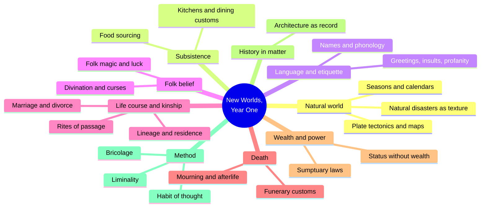
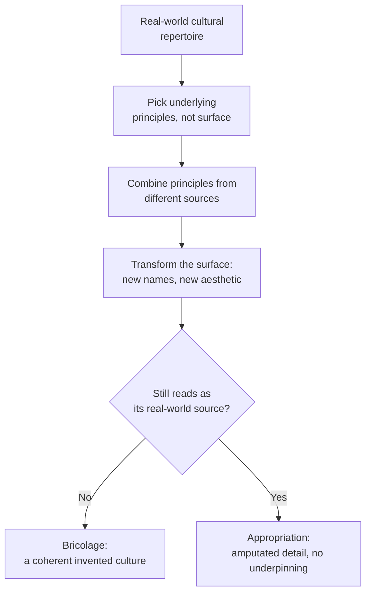
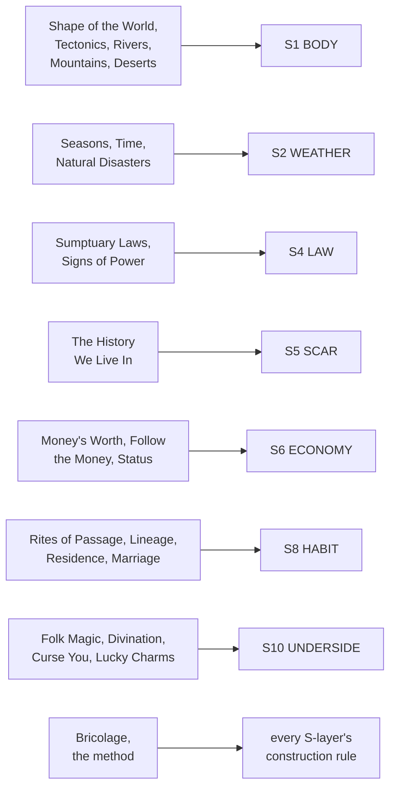

# BVX.0141 — New Worlds, Year One: A Writer's Guide to the Art of Worldbuilding — Marie Brennan (2018)
### Knowledge Entry — Distill

A former anthropologist's monthly craft-essay collection (Patreon, March 2017 to February 2018, reordered for the book): thirty-nine short pieces running worldbuilding through real cultural anthropology, plus three closing essays on method. The SETTING shelf's anthropology-of-culture counterpart to the Kobold Guide's TTRPG-designer toolkit.

## TABLE OF CONTENTS
- [Core Thesis](#1-core-thesis)
- [Mind Models](#2-mind-models)
- [Framework](#3-framework--structure)
- [Key Concepts](#4-key-concepts)
- [Heuristics](#5-heuristics--decision-rules)
- [Invariants](#6-invariants)
- [Pitfalls](#7-pitfalls--myths)
- [Application](#8-application)
- [Cross-References](#9-cross-references)
- [Provenance](#10-provenance--confidence)

---

## 1 · CORE THESIS

A setting is a culture, not a magic system with rules, and culture is fractal: pull one thread (marriage, money, a funeral) and every other thread moves. Build it by bricolage: combine real underlying principles, then transform their surface trappings. Let detail in only when it bites: conflict, belief, or felt texture.

---

## 2 · MIND MODELS

*Required. Minimum two diagrams, maximum five.*

**Diagram 1 — the whole argument.**
Caption: *thirty-nine essays sort into nine cultural clusters plus a three-essay capstone on method; the book teaches a habit of noticing, not a checklist to complete.*

**Diagram 2 — the central mechanism (bricolage vs. appropriation, a process with a fork).**
Caption: *the same four-step process produces either a setting that hangs together or a costume with no culture under it; the fork is whether the surface gets transformed.*

**Diagram 3 — mapped onto the Command's SETTING SLICE (S1-S12).**
Caption: *nine clusters land on seven of twelve slice layers, five at primary strength; the method itself (bricolage) feeds every layer's construction, not just one.*

---

## 3 · FRAMEWORK / STRUCTURE

Thirty-nine essays, no chapter numbers, reordered by Brennan from the natural world toward abstraction: physical world, food, language and names, etiquette, folk magic, stages of life, kinship and marriage, funerary practice, money and power, history, then three theory essays naming the method the rest were practicing.

| Cluster | Essays | Governing question |
|---|---|---|
| Natural world | Shape of the World, Plate Tectonics, Rivers, Mountains, Deserts, Natural Disasters, How Many Seasons?, Measuring Time | What physical logic makes the setting hang together, and what happens when you deliberately break it? |
| Subsistence | Where Does the Food Come From?, Local and Imported Food, Kitchens, Dining Customs | What do people eat, where does it come from, what ritual surrounds eating it? |
| Language & etiquette | Phonology the Easy Way, the two Names essays, Etiquette of Names, Greetings and Respect, Gestures of Contempt, Insults, Profanity, Idioms and Slang | How does speech itself carry the culture's values and hierarchies? |
| Folk belief | Folk Magic, Lucky Charms, Curse You!, Divination | What do ordinary people believe and practice outside official doctrine? |
| Life course & kinship | Birthdays, Childhood, Respect Your Elders, Rites of Passage, Lineage, Third Cousin Twice Removed, Fictive Kinship, Residence Patterns, the three marriage essays, Divorce | Who counts as kin, and how does a person move through stages of belonging? |
| Death | Funerary Customs, Cannibalism, Mourning, The Afterlife | What happens to the body, and what relationship do the living keep with the dead? |
| Wealth & power | Your Money's Worth, Follow the Money, All That Glitters Is Not Gold, Signs of Power, Sumptuary Laws, Status Without Wealth | How is rank displayed, policed, and paid for? |
| History in matter | The History We Live In | How does a place carry its own past without a narrated backstory? |
| Method (capstone) | Worldbuilding as a Habit of Thought, Bricolage, Liminality | How do you do all of the above without winging it or drowning in it? |

The three capstone essays are the spine: Habit of Thought explains why the other thirty-six exist (trained reflex, not homework), Bricolage explains how invented cultures get assembled without becoming costumes, and Liminality names the one recurring charge (threshold states) that surfaces across the kinship, folk-magic, and history essays alike.

---

## 4 · KEY CONCEPTS

| Concept | What it is | Why it matters |
|---|---|---|
| **Habit of thought** | Worldbuilding trained as a reflex, like prose style, not answered as an exhaustive questionnaire before writing | Warns against completionist pre-planning as procrastination; the checklist is a training tool, not a gate to clear |
| **Bricolage** | Assembling a setting from real underlying principles (deification, caste, meritocratic exam), picked from multiple sources, combined, given a transformed surface | The central method: an original culture versus a "fun bits" costume is decided by whether the surface got transformed |
| **Appropriation vs. transformation** | Lifting a real culture's recognizable surface markers without the underlying logic that supports them at home | The craft-ethics fork of bricolage; new name, new aesthetic, new ideological weight is what keeps borrowing from becoming amputation |
| **Liminality** | The charged quality of thresholds: states, times, or places that sit on or transgress a boundary (dusk, a doorway, a wedding, an eclipse) | A free narrative amplifier; staging a plot turn at a liminal moment borrows folkloric power at no extra invention cost |
| **Rite of passage (van Gennep)** | Three-stage structure: separation from an old status, a liminal in-between state, incorporation into the new one | The middle stage is where the charge concentrates; interrupting reincorporation is a ready-made plot hook |
| **History-in-matter** | Conveying historical depth through what a building has become (repurposed, looted, rebuilt in a new style) instead of narrated backstory | The single most transferable technique here: one throwaway line does the work of a paragraph of exposition |
| **Sumptuary law** | Regulations restricting luxury (fabric, food, entourage, house style) to the "right" people | Status is always policed, not just held, and the policing is constantly, unevenly broken: a built-in friction source |
| **Status without wealth** | Rank whose expected display costs more than its income supports | A ready-made story engine (romance, tragedy, intrigue) needing no invented magic or plot device |
| **Lineage vs. residence** | Descent (patrilineal, matrilineal, ambilineal: who counts as kin) is a separate axis from residence (patrilocal, matrilocal, neolocal: who you live near) | Matrilineal does not mean matriarchal; conflating the two is a named fiction-writing error |
| **Folk magic** | The unofficial belief and ritual layer beneath orthodox religion, defined by intent and felt control rather than verified efficacy | Fantasy tends to skip straight to codified magic systems, losing the texture that makes common people feel real |
| **Throwaway detail** | A small, consistent choice (what characters call the moons, how a house is oriented) included without being load-bearing to plot | Speech and behavior reflect world-shape and belief even off-plot; consistency here produces the "another world" feeling |
| **Plate-tectonic logic** | The three plate-boundary types (divergent, convergent, transform) that determine where mountains, coasts, and trenches sit | Gives an invented world non-arbitrary geography, and makes it legible when a story deliberately breaks it |

---

## 5 · HEURISTICS & DECISION RULES

| Situation | Do this | Not this |
|---|---|---|
| Marking a character's greed or status | Root it in a restriction they're violating (a sumptuary law, a forbidden dye) | Fall back on a stock image ("the fat, greasy merchant") |
| Placing a superstition or folk ritual | Give it intent and psychological function: hope, control, belonging | Make it "really work" by default just because the world has magic |
| Putting ruins or old buildings on the page | Show repurposing, looted stone, a fashion shift, in one throwaway line | Infodump who built it, when, and why |
| Signaling deep history without exposition | One line about tearing down an unfashionable old manor for the new style | A paragraph of researched dynastic backstory |
| Inventing a magic or tech departure from real life | Trace its folk-level, everyday consequences too, not just the elite ones | Show only wizards and kings using it |
| Timing a plot turn | Stage it at a liminal moment or place (dusk, a threshold, a wedding, a border) | Pick an arbitrary time and lose the amplification |
| Deciding how deep to build a culture before drafting | Treat the checklist as a habit-of-thought trainer, dip in when stuck | Answer every worldbuilding question first (the named procrastination trap) |
| Borrowing from a real-world culture | Extract the underlying principle, combine it with others, transform the surface | Lift the recognizable "fun bits" wholesale |
| Establishing who counts as family in a scene | Decide the binding logic (blood, residence, marriage type) before writing kinship dialogue | Default to an unexamined patrilineal nuclear-family assumption |
| Showing someone as high-status | Give status a cost and a failure mode too (an honor that can bankrupt the host) | Present status as an unlimited, costless benefit |
| Setting a scene's climate or hazard | Let it shape architecture and reflexive behavior as background, not plot | Bring in weather or disaster only when the plot needs a crisis |

---

## 6 · INVARIANTS

1. **Culture is fractal.** Pull any single thread (marriage, money, a funeral) and lineage, residence, property, and religion all move with it; no cultural detail is genuinely isolated.
2. **History only worldbuilds a place when something present carries it**: a building, a law, a grudge, a name, never narration alone.
3. **Status is always policed, and the policing is always imperfectly enforced.** Sumptuary law exists precisely because people keep breaking it.
4. **Liminal states carry disproportionate narrative and folkloric charge**, independent of genre; the effect is psychological as much as supernatural.
5. **Folk belief runs beneath, not instead of, orthodox religion and law** in every complex society, and is defined by intent and felt control, not by verifiable results.
6. **A lineage's binding rule determines insider or outsider status independently of a society's gender politics.** Matrilineal does not imply matriarchal.
7. **Bricolage is unavoidable.** No invented setting is built from nothing; the only real choice is whether borrowed material gets transformed or left recognizably amputated.

---

## 7 · PITFALLS / MYTHS

- Treating a codified magic system as the whole of "magic," skipping the folk layer (curses, luck, protective ritual) ordinary people actually live inside.
- Writing exhaustive deep history, or answering every worldbuilding questionnaire item, as a substitute for writing the story: diligence functioning as procrastination.
- Conflating matrilineal descent with matriarchal rule.
- Lifting a real culture's recognizable surface markers without the underlying logic that supports them at home: the line into appropriation.
- Ignoring known real-world hazard logic (tornado safety, earthquake-proof décor) and breaking a knowledgeable reader's trust.
- Assuming status is a costless, unlimited benefit and missing its burdens, like the honored guest whose visit can ruin the host.
- Treating world-shape (moon count, disc versus globe, gravity's direction) as irrelevant off-plot; it still leaches into speech, architecture, and belief.

---

## 8 · APPLICATION

- **Spine level:** SETTING (non-story-spine source; keys beside the L0-L7 spine per ssot_03's binding rule that setting is a Domain embodied, never a level)
- **12-layer character stack:** none directly, setting-side source; but Bricolage's principle-not-surface method is the same move as BVX.0458's magic-consequence checklist, and transfers cleanly to character design generally
- **plot_systems:** contextual candidate once `04_PLOT_SYSTEMS/` opens; Liminality is a ready-made scene-timing tool, staging a turn at dusk, a solstice, a doorway, a border, a wedding, for a folkloric charge at no extra invention cost
- **Setting:** primary; five S-layers get primary-strength feed (S2 WEATHER, S5 SCAR, S6 ECONOMY, S8 HABIT, S10 UNDERSIDE), two get supporting (S1 BODY, S4 LAW), one contextual (S9 ALLURE). The strongest export is `method_bricolage`: a general construction rule under every layer, not content for one

Tested against the DCUS starter instance in `ssot_03`: the flagged S2 WEATHER gap is exactly what Natural Disasters and How Many Seasons? fill, Gulf-South heat and hurricane season read through architecture and reflexive behavior rather than a weather report. The S5 SCAR rename lattice (Skeeter Creek to Red Hills to DCUS) is a textbook case for The History We Live In's method: a gatehouse still called by its old name, a plaque painted over rather than removed, show the erasure in the fabric, never narrate it. DCUS's S8 HABIT split (alumni-legacy bloc versus Sync-era students), read through Lineage and Residence Patterns, is a binding-principle question dressed as a school rivalry, and the Star-Rating ceremonies read as literal rites of passage staged with van Gennep's real structure instead of generic pageantry. DCUS's S10 UNDERSIDE ("the first name under the second") is Folk Magic's public/unofficial split: whatever legacy students still do that the Administration's official doctrine doesn't sanction and can't fully stamp out.

---

## 9 · CROSS-REFERENCES

| Related entry | Relation |
|---|---|
| [[BVX.0458]] | Sibling SETTING-shelf source; Kobold Guide supplies the TTRPG-designer mechanism, this book supplies the anthropological content under most of the same S-layers |
| [[BVX.0349]] | *Against Worldbuilding*'s kitchen-sink warning is the exact caution Brennan gives directly in Worldbuilding as a Habit of Thought |
| [[BVX.1122]] | GURPS Hot Spots: Renaissance Venice, the worked gazetteer instance; where the trade gazetteer leaves WEATHER, SENSORIUM, SCAR, ALLURE, UNDERSIDE thin, this book fills close to those same layers |
| [[BVX.0562]] | *Building Imaginary Worlds* (Wolf) is the theory register for the same subject; this book is its applied-craft, essay-format counterpart |

---

## 10 · PROVENANCE & CONFIDENCE

Full text, pdftotext extraction, clean text layer, machine-readable table of contents and per-essay date stamps, roughly 59,500 words, matching the author's own "sixty-thousand-word" claim in the introduction. Read in full: the Introduction; The Shape of the World; Plate Tectonics; Natural Disasters; Rites of Passage; Residence Patterns; Folk Magic; Sumptuary Laws; Status Without Wealth; Funerary Customs through the burial section; The History We Live In; Worldbuilding as a Habit of Thought; Bricolage; Liminality; the Afterword. Sampled via table of contents and section skim, not deep-extracted: Rivers, Mountains, Deserts, How Many Seasons?, Measuring Time; the four food essays; the language and etiquette cluster; Lucky Charms, Curse You!, Divination; Birthdays, Childhood, Respect Your Elders; Lineage (opening read in full, remainder sampled), Third Cousin Twice Removed, Fictive Kinship; the three marriage essays and Divorce; Cannibalism, Mourning, The Afterlife; the remaining wealth essays.

The S-layer keying in `feeds:` is this distill's synthesis against `ssot_03_setting_system.md` (PART A, the twelve-layer SETTING SLICE), matching each essay cluster to a layer definition; strength ratings reflect how much material was read in full versus sampled. `pdf_pages` is estimated from word count, no paginated source was available in the working text.

## META
- Template: BVX-LEARN-v4.0
- Source classification: full-text essay collection, deep extraction on 15 of 39 essays plus front/back matter, sampled on the remainder
- Created / Updated: 2026-09-29
