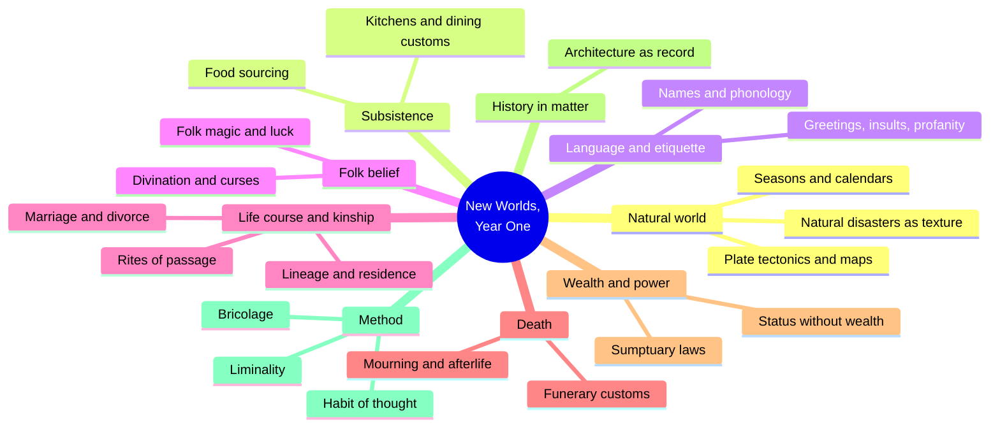
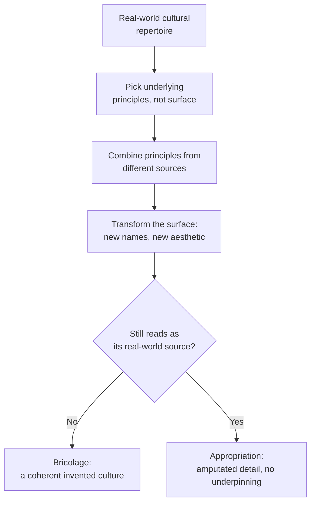
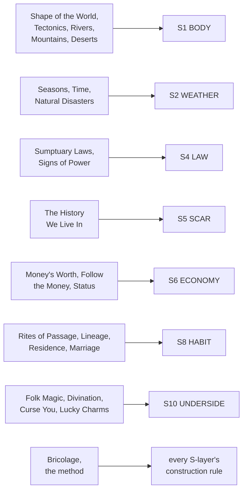

# BVX.0141 — New Worlds, Year One: A Writer's Guide to the Art of Worldbuilding — Marie Brennan (2018)
### Knowledge Entry — Distill

A former anthropologist's monthly craft-essay collection (Patreon, March 2017 to February 2018, reordered for the book): thirty-nine short pieces running worldbuilding through real cultural anthropology — geography, food, language, folk belief, kinship, death, wealth, power, history — plus three closing essays on method. The SETTING shelf's anthropology-of-culture counterpart to the Kobold Guide's TTRPG-designer toolkit.

## TABLE OF CONTENTS
- [Core Thesis](#1-core-thesis)
- [Mind Models](#2-mind-models)
- [Framework](#3-framework--structure)
- [Key Concepts](#4-key-concepts)
- [Heuristics](#5-heuristics--decision-rules)
- [Invariants](#6-invariants)
- [Pitfalls](#7-pitfalls--myths)
- [Application](#8-application)
- [Cross-References](#9-cross-references)
- [Provenance](#10-provenance--confidence)

---

## 1 · CORE THESIS

A setting is a culture, not a magic system with rules, and culture is fractal: pull on one thread (marriage, money, a funeral) and every other thread moves. Build it by bricolage — combine real underlying principles, then transform their surface trappings — and let a detail in only when it bites: conflict, belief, or texture the reader feels.

---

## 2 · MIND MODELS

*Required. Minimum two diagrams, maximum five.*

**Diagram 1 — the whole argument.**
Caption: *thirty-nine essays sort into nine cultural clusters plus a three-essay capstone on method — the book teaches a habit of noticing, not a checklist to complete.*

**Diagram 2 — the central mechanism (bricolage vs. appropriation, a process with a fork).**
Caption: *the same four-step process either produces a setting that hangs together or a costume with no culture under it — the fork is whether the surface gets transformed.*

**Diagram 3 — mapped onto the Command's SETTING SLICE (S1-S12).**
Caption: *nine clusters land on seven of twelve slice layers, five at primary strength — and the method itself (bricolage) feeds every layer's construction, not just one.*

---

## 3 · FRAMEWORK / STRUCTURE

Thirty-nine essays, no chapter numbers, reordered by Brennan from natural world toward abstraction: the physical world first, then food, then language and names, then etiquette, then folk magic, then stages of life, then kinship and marriage, then funerary practice, then money and power, then history, and finally three theory essays that step back and name the method the other thirty-six were all practicing.

| Cluster | Essays | Governing question |
|---|---|---|
| Natural world | Shape of the World, Plate Tectonics, Rivers, Mountains, Deserts, Natural Disasters, How Many Seasons?, Measuring Time | What physical logic makes the setting hang together, and what happens when you deliberately break it? |
| Subsistence | Where Does the Food Come From?, Local and Imported Food, Kitchens, Dining Customs | What do people eat, where does it come from, and what rituals surround eating it? |
| Language & etiquette | Phonology the Easy Way, What's in a Name?, Names and Their Meaning, The Etiquette of Names, Greetings and Respect, Gestures of Contempt, Insults, Profanity, Idioms and Slang | How does speech itself carry the culture's values and hierarchies? |
| Folk belief | Folk Magic, Lucky Charms, Curse You!, Divination | What do ordinary people believe and practice outside official doctrine? |
| Life course & kinship | Birthdays, Childhood, Respect Your Elders, Rites of Passage, Lineage, Third Cousin Twice Removed, Fictive Kinship, Residence Patterns, Marriage, Structures of Marriage, Buying and Selling Spouses, Divorce | Who counts as kin, and how does a person move through the stages of belonging to a group? |
| Death | Funerary Customs, Cannibalism, Mourning, The Afterlife | What happens to the body, and what relationship do the living keep with the dead? |
| Wealth & power | Your Money's Worth, Follow the Money, All That Glitters Is Not Gold, Signs of Power, Sumptuary Laws, Status Without Wealth | How is rank displayed, policed, and paid for? |
| History in matter | The History We Live In | How does a place carry its own past without a narrated backstory? |
| Method (capstone) | Worldbuilding as a Habit of Thought, Bricolage, Liminality | How do you actually do all of the above without either winging it or drowning in it? |

The three capstone essays are the book's spine: Habit of Thought explains why the other thirty-six exist (to train reflexes, not to be completed as homework), Bricolage explains how invented cultures get assembled without becoming costumes, and Liminality names the one recurring narrative charge (threshold states) that keeps surfacing across the kinship, folk-magic, and history essays alike.

---

## 4 · KEY CONCEPTS

| Concept | What it is | Why it matters |
|---|---|---|
| **Habit of thought** | Worldbuilding trained as a reflex (like prose style), not answered as an exhaustive questionnaire before writing | Directly warns against completionist pre-planning as procrastination; the checklist (Wrede's, or this book) is a training tool, not a gate to clear |
| **Bricolage** | Assembling a setting from real underlying principles (deification, caste, meritocratic examination) picked from multiple sources, combined, then given a transformed surface | The book's central method: the difference between an original invented culture and a "fun bits" costume is whether the surface got transformed, not whether real sources were used |
| **Appropriation vs. transformation** | Lifting a real culture's recognizable surface markers (a katana, a specific rite, a named garment) without the underlying logic that supports them at home | The craft-ethics fork of bricolage; transformation (new name, new aesthetic, new ideological weight) is what keeps borrowing from becoming amputation |
| **Liminality** | The charged quality of thresholds — states, times, or places that sit on or transgress a boundary (dusk, a doorway, a wedding, an eclipse) | A free narrative amplifier: staging a plot turn at a liminal moment or place borrows folkloric power without extra invention |
| **Rite of passage (van Gennep)** | Three-stage structure: separation from an old status, a liminal in-between state, incorporation into the new status | The middle (liminal) stage is where the folkloric and narrative charge concentrates; interrupting reincorporation is a ready-made plot hook |
| **History-in-matter** | Conveying historical depth through what a building has become (repurposed, looted for stone, rebuilt in a new fashion) instead of narrated backstory | The single most transferable craft technique in the book: one throwaway line about an unfashionable old manor does the work of a paragraph of exposition |
| **Sumptuary law** | Regulations restricting luxury (fabric, food, entourage size, house style) to the "right" people, covering more than clothing | Status is always policed, not just held; and the policing is constantly, unevenly broken — a built-in source of friction |
| **Status without wealth** | Rank whose expected display costs more than its income supports, running an "aristocrat-bankruptcy engine" over time | A ready-made story engine (romance, tragedy, intrigue) that needs no invented magic or plot device, only economic history |
| **Lineage vs. residence** | Descent (patrilineal/matrilineal/ambilineal — who you count as kin) is a separate axis from residence (patrilocal/matrilocal/neolocal — who you live near) | Matrilineal is not matriarchal; a society can trace descent through women while remaining patriarchal in power. Conflating the two is the book's named fiction-writing error |
| **Folk magic** | The unofficial, often unexamined layer of belief and ritual (a horseshoe over a door, blowing out candles) that runs beneath orthodox religion, defined by intent and the feeling of control rather than verified efficacy | Fantasy worldbuilding tends to jump straight to codified magic systems and skip this layer entirely, losing the texture that makes common people feel real |
| **Throwaway detail** | A small, consistent worldbuilding choice (what characters call the moons, how a house is oriented) included without being load-bearing to plot | Speech and behavior reflect world-shape and belief even when the plot never touches it; consistency here is what produces the "transported to another world" feeling |
| **Plate-tectonic logic** | The three plate-boundary types (divergent, convergent, transform) that determine where mountains, coasts, and trenches sit | Gives even an invented world a non-arbitrary geography, and — precisely because the logic is knowable — makes it visible and meaningful when a story deliberately breaks it (square mountains, a bound god's earthquakes) |

---

## 5 · HEURISTICS & DECISION RULES

| Situation | Do this | Not this |
|---|---|---|
| Marking a character's greed or status | Root it in a restriction they're violating (a sumptuary law, a forbidden dye) | Fall back on a stock image ("the fat, greasy merchant") |
| Placing a superstition or folk ritual in a scene | Give it intent and psychological function — hope, control, belonging | Make it "really work" by default just because the world has magic |
| Putting ruins or old buildings on the page | Show repurposing, looted stone, a fashion shift, in one throwaway line | Infodump who built it, when, and why |
| Signaling deep history without exposition | One line about tearing down an unfashionable old manor to build in the new style | A paragraph of researched dynastic backstory |
| Inventing a magic or technology departure from the real world | Trace its folk-level, everyday consequences too, not just the elite/plot-level ones | Show only wizards and kings using it |
| Timing a plot turn | Stage it at a liminal moment or place (dusk, a threshold, a wedding, a border) for a free charge | Pick an arbitrary time and lose the amplification |
| Deciding how deep to build a culture before drafting | Treat the checklist as a habit-of-thought trainer; dip in when stuck, not before you're allowed to start | Answer every worldbuilding question first (the procrastination trap, named directly) |
| Borrowing from a real-world culture | Extract the underlying principle, combine it with others, transform the surface | Lift the recognizable "fun bits" (a specific blade, a specific rite) wholesale |
| Establishing who counts as family in a scene | Decide the binding logic (blood line, residence rule, marriage type) before writing kinship dialogue | Default to an unexamined patrilineal nuclear-family assumption |
| Showing someone as high-status | Give status a cost and a failure mode too (an honor that can bankrupt the host) | Present status as an unlimited, costless benefit |
| Setting a scene's climate or hazard | Let it shape architecture and reflexive behavior (steep roofs, storm cellars, where people build) as background, not plot | Bring in weather or disaster only when the plot needs a crisis |

---

## 6 · INVARIANTS

1. **Culture is fractal.** Pull on any single thread — marriage, money, a funeral — and lineage, residence, property, and religion all move with it; no cultural detail is genuinely isolated.
2. **History only worldbuilds a place when something present carries it** — a building, a law, a grudge, a name — never when it's only narrated on its own.
3. **Status is always policed, and the policing is always imperfectly enforced.** Sumptuary law exists precisely because people keep breaking it.
4. **Liminal states carry disproportionate narrative and folkloric charge**, independent of genre — the effect is psychological as much as supernatural.
5. **Folk belief runs beneath, not instead of, orthodox religion and law in every complex society**, and is defined by intent and the sense of control, not by verifiable results.
6. **A lineage's binding rule (blood, residence, marriage) determines insider/outsider status independently of the society's gender politics** — matrilineal does not imply matriarchal.
7. **Bricolage is unavoidable.** No invented setting is built from nothing; the only real choice is whether borrowed material gets transformed or left recognizably amputated.

---

## 7 · PITFALLS / MYTHS

- Treating a codified magic system as the whole of "magic" in a world, and skipping the folk layer (curses, luck, protective ritual) ordinary people actually live inside.
- Writing exhaustive deep history, or answering every worldbuilding questionnaire item, as a substitute for writing the story — diligence functioning as procrastination.
- Conflating matrilineal descent with matriarchal rule; a society can trace kinship through women while remaining thoroughly patriarchal.
- Lifting a real culture's recognizable surface markers (a specific blade, a named rite, a particular garment) without the underlying logic that supports them at home — the line into appropriation.
- Ignoring known real-world hazard logic (how tornadoes are survived, what an earthquake does to décor) and breaking a knowledgeable reader's trust.
- Assuming status is a costless, unlimited benefit, and missing its burdens — sumptuary obligation, the honored guest whose visit can ruin the host.
- Treating world-shape (how many moons, disc versus globe, direction of gravity) as irrelevant just because it isn't plot-central; it still leaches into speech, architecture, and belief.

---

## 8 · APPLICATION

- **Spine level:** SETTING (non-story-spine source; keys beside the L0-L7 spine per ssot_03's binding rule that setting is a Domain embodied, never a level)
- **12-layer character stack:** none directly — setting-side source; but Bricolage's principle-not-surface method is the same move as BVX.0458's magic-consequence checklist, and transfers cleanly to character design generally: steal the logic under a trope, never its costume
- **plot_systems:** contextual candidate once `04_PLOT_SYSTEMS/` opens — Liminality is a ready-made scene-timing and scene-location tool: stage a plot turn at dusk, a solstice, a doorway, a border, a wedding, for a folkloric charge that costs nothing extra to invent
- **Setting:** primary — five S-layers get primary-strength feed (S2 WEATHER, S5 SCAR, S6 ECONOMY, S8 HABIT, S10 UNDERSIDE), two get supporting (S1 BODY, S4 LAW), one contextual (S9 ALLURE); the strongest export is the `method_bricolage` feed, a general construction rule underneath every layer rather than content for one

Tested directly against the DCUS starter instance already in `ssot_03`: the flagged S2 WEATHER gap ("canon-thin — authorable gap") is exactly what Natural Disasters and How Many Seasons? are built to fill — Gulf-South heat, humidity, and hurricane season read through architecture and reflexive behavior (steep roofs, storm shelters, what people stop doing when the sky turns green) rather than a weather report. The S5 SCAR rename lattice (Skeeter Creek -> Red Hills -> DCUS) is a textbook case for The History We Live In's method: a repurposed gatehouse still called by its old name, a cornerstone plaque painted over rather than removed, a fashion shift in campus architecture marking each rebrand — show the erasure in the fabric, never narrate it. DCUS's S8 HABIT split (alumni-legacy bloc versus Sync-era students) is, read through Lineage and Residence Patterns, a binding-principle question dressed as a school rivalry: who counts as an insider by blood-tie to the old name versus who arrived through the new system, with the Star-Rating ceremonies themselves readable as literal rites of passage (separation, liminal ordeal, incorporation) that can be staged with van Gennep's actual structure instead of generic pageantry. And DCUS's S10 UNDERSIDE ("the first name under the second") is precisely Folk Magic's public/unofficial split: whatever legacy students still do — a luck ritual, a half-remembered prayer to the old campus's patron, a superstition about which building to avoid — that the Administration's official Sync doctrine doesn't sanction and can't fully stamp out.

---

## 9 · CROSS-REFERENCES

| Related entry | Relation |
|---|---|
| [[BVX.0458]] | Sibling SETTING-shelf source; Kobold Guide supplies the TTRPG-designer mechanism (the conflict-first filter run per subsystem), this book supplies the anthropological content underneath most of the same S-layers |
| [[BVX.0349]] | *Against Worldbuilding*'s kitchen-sink warning is the exact caution Brennan gives directly in Worldbuilding as a Habit of Thought — treating Wrede's exhaustive questionnaire as a procrastination trap, not a prerequisite |
| [[BVX.1122]] | GURPS Hot Spots: Renaissance Venice, the worked gazetteer instance; where a professional gazetteer fills BODY/LAW/ECONOMY/FOUNDING/HABIT/VECTOR richly and leaves WEATHER/SENSORIUM/SCAR/ALLURE/UNDERSIDE thin, this book fills close to those exact culturally-thin layers |
| [[BVX.0562]] | *Building Imaginary Worlds* (Wolf) is the theory register for the same subject; this book is its applied-craft, essay-format counterpart |

---

## 10 · PROVENANCE & CONFIDENCE

Full text, pdftotext extraction, clean text layer, machine-readable table of contents and per-essay date stamps, ~59,500 words (matching the author's own "sixty-thousand-word" claim in the introduction). Read in full: the Introduction; The Shape of the World; Plate Tectonics; Natural Disasters; Rites of Passage; Residence Patterns; Folk Magic; Sumptuary Laws; Status Without Wealth; Funerary Customs (through the burial section); The History We Live In; Worldbuilding as a Habit of Thought; Bricolage; Liminality; the Afterword. Sampled via table of contents and section skim, not deep-extracted: Rivers, Mountains, Deserts, How Many Seasons?, Measuring Time; the four food essays; the language/etiquette cluster (Phonology, both Names essays, Greetings, Gestures, Insults, Profanity, Idioms); Lucky Charms, Curse You!, Divination; Birthdays, Childhood, Respect Your Elders; Lineage (opening read in full, remainder sampled), Third Cousin Twice Removed, Fictive Kinship; the three marriage essays and Divorce; Cannibalism, Mourning, The Afterlife; Your Money's Worth, Follow the Money, All That Glitters Is Not Gold, Signs of Power.

The S-layer keying in frontmatter `feeds:` is this distill's synthesis against `ssot_03_setting_system.md` (PART A, the twelve-layer SETTING SLICE), matching each essay cluster to a layer definition; strength ratings reflect how much of the underlying material was read in full versus sampled, and how directly a cluster's content maps onto a layer's stated scope. `pdf_pages` is estimated from word count (no paginated source was available in the working text), not counted from a physical or PDF page layout.

## META
- Template: BVX-LEARN-v4.0
- Source classification: full-text essay collection, deep extraction on 15 of 39 essays plus front/back matter, sampled on the remainder
- Created / Updated: 2026-09-29
