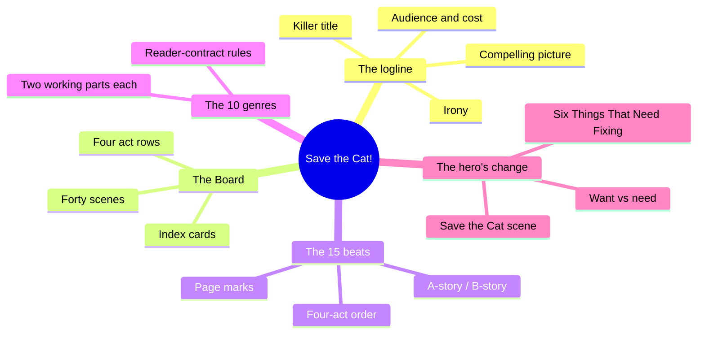
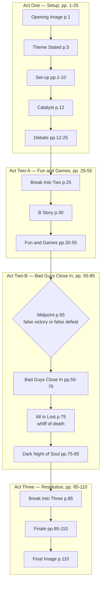
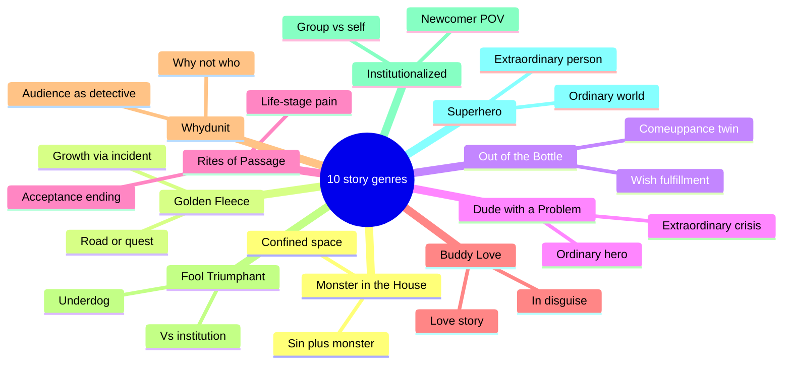
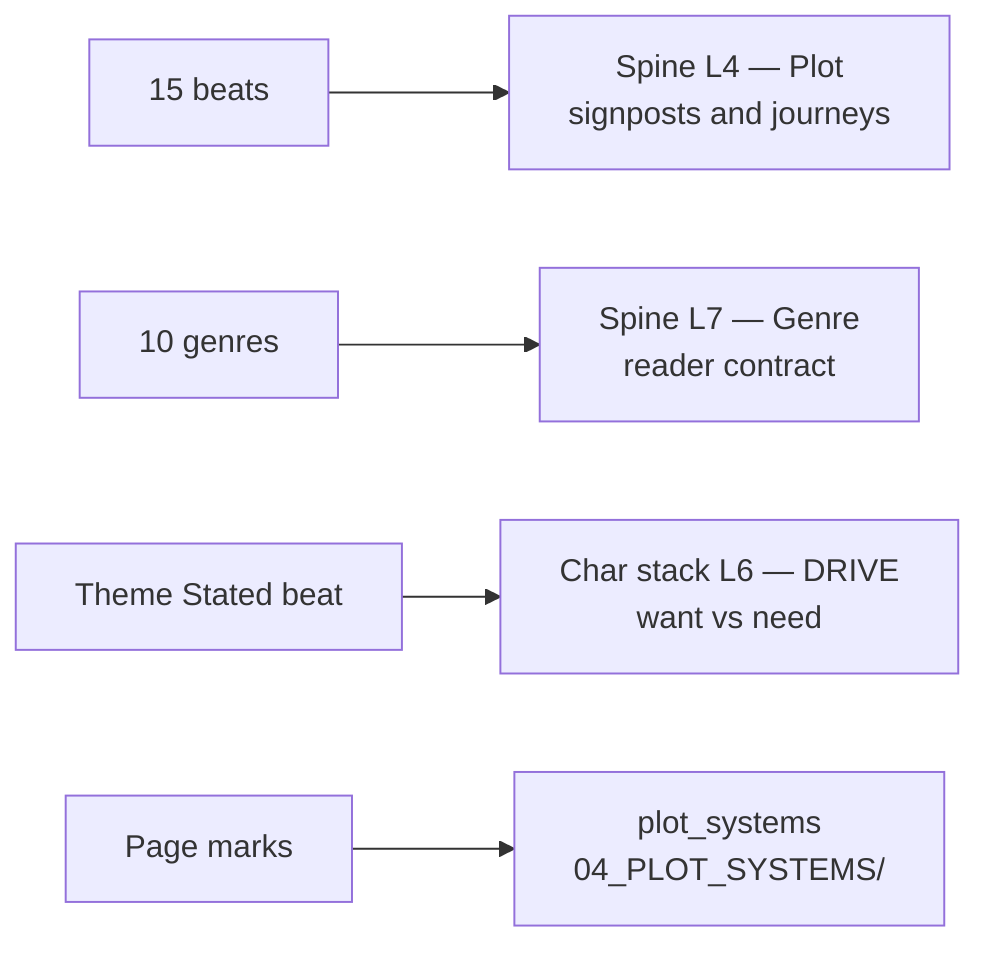

# BVX.0163 — Save the Cat! The Last Book on Screenwriting You'll Ever Need — Blake Snyder (2005)
### Knowledge Entry — Distill

The originating text: the Blake Snyder Beat Sheet (the "BS2"), the 10 primal story genres, and the logline test that between them define the commercial-screenplay beat template every later "beat sheet" book — Coyne's, Brody's — answers to or ports from.

## TABLE OF CONTENTS
- [Core Thesis](#1-core-thesis)
- [Mind Models](#2-mind-models)
- [Framework](#3-framework--structure)
- [Key Concepts](#4-key-concepts)
- [Heuristics](#5-heuristics--decision-rules)
- [Invariants](#6-invariants)
- [Pitfalls](#7-pitfalls--myths)
- [Application](#8-application)
- [Cross-References](#9-cross-references)
- [Provenance](#10-provenance--confidence)

---

## 1 · CORE THESIS

A screenplay is a 15-beat checklist pinned to specific pages of a ~110-page script, each beat a scene the reader's contract requires, in order. Beat 2 (page 5) states the theme as a want/need argument the rest of the script proves or disproves. Genre is one of ten primal, mechanism-defined patterns — chosen by "what happens," never by a marketing label.

---

## 2 · MIND MODELS

*Required. Minimum two diagrams, maximum five.*

**Diagram 1 — the whole argument.**
Four tools, one machine: nail the one-line pitch, pick the genre's rulebook, lay the beats on the Board, hit the 15 page-numbered checkpoints in order, and the want/need setup pays off as a changed hero.

**Diagram 2 — the central mechanism (the 15-beat sheet, grouped by act).**
Every beat is a script page number out of ~110, not a proportion — Snyder nails these pages exactly — and the midpoint/All-Is-Lost pair (pages 55 and 75) is a matched opposite: whichever way the midpoint charges, All Is Lost charges the other way.

**Diagram 3 — the ten story genres.**
Classify by the two working parts and the rules they impose, never by shelf category — "romantic comedy" tells you nothing; "Buddy Love" tells you the rules to follow.

**Diagram 4 — mapped onto the Command's systems.**
The beat sheet is an instance sitting *under* spine L4, not the spine's plot layer itself, and Theme Stated is the first place the want/need split (DRIVE, L6 of the character stack) gets said out loud.

---

## 3 · FRAMEWORK / STRUCTURE

**Four tools in sequence, front to back:**

1. **The logline** — one or two sentences, tested against four criteria, written *before* the script. Fail the test, rewrite the line, not the screenplay.
2. **The genre pick** — one of 10 primal patterns (never a marketing category), each with its own two working parts and non-negotiable must-hit scenes.
3. **The Board** — a corkboard, blackboard, or notebook divided into four rows (Act One / Act Two-A / Act Two-B / Act Three), index cards for scenes, roughly 40 cards by the time it's full. A pre-writing planning tool, explicitly not writing itself.
4. **The Blake Snyder Beat Sheet (the "BS2")** — 15 beats, each pinned to a specific page of a ~110-page script ("as long as a good jockey weighs"), filling the Board's four rows in fixed order. Underneath the beats runs the want/need engine: the Set-up plants "Six Things That Need Fixing," Theme Stated (page 5) voices the argument, and the beats from Break Into Three to Final Image pay it off. A likability device (the "Save the Cat" scene) is the price of admission for the audience to make the trip at all.

---

## 4 · KEY CONCEPTS

| Concept | What it is | Why it matters |
|---|---|---|
| **The logline's four elements** | Irony (the hook) · a compelling mental picture (you can see the whole movie from one line) · a sense of audience and cost · a "killer," on-the-nose title | "If you can't tell me what it's about... don't bother with the story" — the logline is written before the script, not extracted after |
| **Six Things That Need Fixing** | The laundry list of flaws/lacks shown, not told, in the Set-up (pp. 1-10) — "these character tics and flaws will be exploded later... turned on their heads and cured" | Every payoff in Act Three needs a planted set-up; unplanted payoffs read as unearned |
| **The Save the Cat scene** | An early beat where the protagonist does something — often small — that makes the audience like them, independent of how "cool" they are | Coined against the "Lara Croft problem": a character can be impressive and still unlikable; likability is a designed beat, not a trait |
| **The Board** | Four-row corkboard/blackboard/notebook (one row per act-quarter: pp. 1-25, 25-55, 55-85, 85-110), index cards per scene, ~40 cards total | Makes structure tactile and revisable before a word of the script is drafted; also the diagnostic tool for a stalled screenplay — lay the cards out and find the gap |
| **A-story / B-story split** | A-story = the external plot (the plan, the goal); B-story = usually the love story, starting page 30, and the place the theme gets discussed directly | The B-story's new cast provides the "booster rocket" cutaway from the A-story and carries the thematic argument in dialogue |
| **Midpoint / All Is Lost pairing** | Matched opposites at pages 55 and 75: whichever way the midpoint charges (false victory or false defeat), All Is Lost charges the other way | "It's never as good as it seems... and never as bad as it seems" — a diagnostic pair, not two independent beats |
| **Whiff of death** | Something dies, literally or symbolically, at the All Is Lost beat (p.75) — a mentor, a pet, a piece of news | Marks the death of the old self so the new self (post-transformation) can be born; present even where nothing "plot-required" needs to die |
| **Booster rocket** | A new character or subplot injected right where momentum flags (post–Break Into Two, end of Act Two-B) | Prevents the sagging middle without adding new plot — injects energy, not events |
| **High concept** | A premise that states itself in one sentence and needs no further explanation to sell | Contrasted with page-count-proof "literary" ambition — genre obligations apply to both |
| **Four-quadrant picture** | A movie built to draw all four demographic quadrants (over/under 25, male/female) | A commercial-viability lens Snyder applies upstream of craft — audience and cost are logline inputs, not afterthoughts |

---

## 5 · HEURISTICS & DECISION RULES

| Situation | Do this | Not this |
|---|---|---|
| Can't explain the movie in one line | Stop drafting; fix the logline first — irony, picture, audience+cost, title | Write the script and extract the logline afterward |
| Unsure where a beat belongs | Place it by the BS2's page number (out of ~110), not by gut feel | Eyeball "about a third of the way through" without checking the page |
| The middle sags | Insert a booster-rocket character/subplot right after Break Into Two or late Act Two-B | Add more plot events to the A-story to compensate |
| Choosing the All Is Lost content | Stage a literal or symbolic death — a person, a pet, a piece of news | Skip it because "nothing needs to die" in this particular plot |
| Deciding what happens at the act break (p.25) | The hero must choose to cross into Act Two | Let circumstance sweep the hero in passively |
| Worried a hero reads as unlikable | Design an early Save the Cat beat, independent of how competent/cool they already are | Assume competence or "coolness" substitutes for likability |
| Drafting the genre's obligatory scenes | Write the cliché version first, on purpose, then push past it | Freeze up chasing originality on a first pass |
| Script feels shapeless mid-draft | Lay the whole thing out on the Board, one card per scene, and look for gaps | Push forward from the last page written, hoping it resolves |
| Naming the story's category | Pick from the 10 mechanism-based genres by "what happens" | Default to a marketing label like "romantic comedy" or "epic" |

---

## 6 · INVARIANTS

1. **Opening Image (p.1) and Final Image (p.110) are bookends and must be opposites** — proof, in one image each, that change occurred.
2. **The theme must be stated on or near page 5**, as an offhand line the hero doesn't yet understand.
3. **The Break Into Two (p.25) must be a chosen act**, never a drift or an accident the hero is swept into.
4. **Midpoint (p.55) and All Is Lost (p.75) are always a matched, opposite-charge pair** — a false victory pairs with a false defeat and vice versa, never two independent highs or lows.
5. **All Is Lost always carries a whiff of death**, literal or symbolic, regardless of genre.
6. **Genre sets obligatory scenes the writer does not get to skip** by claiming literary exemption — miss them and "you haven't written a [genre] movie."
7. **One genre per movie.** Fusing more than one primal pattern muddies which rulebook the script owes the audience.
8. **The Board and the beat sheet are pre-writing tools** — planning instruments, not a substitute for drafting; the plan can be abandoned once writing begins, but skipping the plan is not recommended.

---

## 7 · PITFALLS / MYTHS

- Treating "coolness" (competence, a cool car, a cool line) as a substitute for likability — the Lara Croft problem; likability is a designed beat, not a byproduct of capability.
- Skipping the logline test and discovering, deep into a draft, that the script has no clear "what is it."
- Letting the hero be lured or accidentally swept into Act Two instead of choosing to cross — reads as a passive, inactive hero.
- Mistaking a story's marketing category (romantic comedy, epic, biography) for its structural genre — the ten genres classify by mechanism, not by shelf.
- Assuming "gravitas" or literary ambition exempts a script from its genre's obligatory scenes.
- Padding the sagging middle with more A-story plot events instead of a booster-rocket character or subplot.
- Confusing the Board/beat sheet (a planning tool) with the script itself — over-mapping every beat before drafting a page ("paralysis by analysis").
- Forgetting the whiff of death at All Is Lost because "nothing needs to die" in this plot — it still needs staging, even symbolically.

---

## 8 · APPLICATION

- **Spine level:** L4 (plot: signposts and journeys — the 15-beat sheet is a *timed commercial instance* sitting over the signpost layer, not the spine's plot layer itself) and L7 (genre: the 10-genre wheel is the commercial compression of the reader-contract ring)
- **12-layer character stack:** L6 (DRIVE) supporting — Theme Stated is the beat where want (A-story, conscious) and need (B-story, subconscious) first get named as an argument; Break Into Three is where they fuse
- **plot_systems:** Candidate feed. `04_PLOT_SYSTEMS/` is empty today; the page-keyed 15-beat checklist is a ready-made per-script QA pass (place a marker at each beat's target page and check what's actually there), and the Board's index-card method is a portable scene-inventory tool for any OXO draft
- **Setting:** n/a

Where Coyne (BVX.0236) diagnoses, Snyder prescribes. Coyne's Five Commandments are a fractal instrument for X-raying a manuscript at any scale — a tool that finds where a story fails without dictating what must happen at what page. Snyder's 15 beats are the opposite move: a fixed, ordered, page-timed template that a script is checked *against*, beat by beat, in sequence. Both books sell "a beat template," but Coyne's Five Commandments recur at every unit (beat through global Story) with no fixed position, while Snyder's 15 beats each own one fixed page slot and never recur. The spine SSOT already keys Save the Cat as "a timed commercial template over the signpost layer" (L4) — this distill is the load-bearing text for that claim: the 15 beats are an *instance* filling L4's signpost/journey slots for the commercial-screenplay case, not a rival to the spine's four-throughline argument. Practically, when `plot_systems` gets built out, the page-beat checklist is a directly portable draft-QA pass for OXO chapters (mark each beat's target position against the actual manuscript and flag drift), and the 10-genre wheel is a clean, coarser cross-check against the spine's L7 genre ring — a compressed, commercial-facing companion to Coyne's and Truby's stronger genre-theory holdings there, not a replacement for them.

---

## 9 · CROSS-REFERENCES

| Related entry | Relation |
|---|---|
| [[BVX.0236]] | Coyne, *The Story Grid* — the other beat-template book; Coyne diagnoses (a fractal X-ray instrument), Snyder prescribes (a fixed page-timed checklist); both keyed to spine L4/L7 |
| [[BVX.0091]] | Dramatica structure chart — the spine's L4 signpost/journey layer the 15-beat sheet fills as one commercial instance among several rival plot models |
| BVX.0164 (retired) | The id this entry originally shipped under, misattributed to Jessica Brody's *Save the Cat! Writes a Novel* (2018) — the same PDF was re-catalogued to BVX.0163 once the Zotero mismatch was confirmed (see Provenance). Brody's 2018 novel-side port of this beat sheet — page marks re-keyed to percentage-of-manuscript, plus her own "Transformation Machine" framing — is not yet held in the library; a future entry should source it directly rather than infer it from this one. |

---

## 10 · PROVENANCE & CONFIDENCE

**Zotero mis-cataloguing, resolved:** the PDF behind this entry was originally filed in the library under a Zotero record (key `3T7PKFVI`) titled *Save the Cat! Writes a Novel*, Jessica Brody, 2018 — and the entry was first drafted under id `BVX.0164` on that basis. Full-text reading showed the PDF is actually Blake Snyder's original 2005 screenwriting book: the foreword is by Sheila Hanahan Taylor of Zide/Perry Entertainment, the beat sheet is keyed to screenplay page numbers on a ~110-page script ("Opening Image (1)"..."Final Image (110)"), the Board chapter describes a 110-page/index-card corkboard method, and a full-text search for "Brody," "Writes a Novel," and "Transformation Machine" (Brody's own coined term) returned zero hits. The catalog separately reserves `BVX.0163` for this PDF under its correct Zotero record (key `Q83G3MGC`, titled *Save the Cat! The Last Book on Screenwriting You'll Ever Need*, an orphan entry not yet linked to a distill) — this entry has been re-targeted to that id and citation, and the earlier `BVX.0164.md` draft has been deleted. `zotero_key` above (`Q83G3MGC`) is the corrected record; `3T7PKFVI` was the mis-titled one that originally pointed at this same file.

**What changed from the first draft:** the earlier pass, written before the mismatch was confirmed, supplied several claims from general knowledge of Brody's 2018 book rather than from this PDF — specifically, percentage-of-manuscript beat marks (in place of Snyder's page numbers), the "Transformation Machine" framing for the want/need engine, and novel-specific framing language throughout. All of that has been removed or re-attributed in this version: the beat sheet now carries Snyder's own page numbers (pp. 1-110), the want/need mechanism is described in Snyder's own terms (Six Things That Need Fixing, the Save the Cat scene, Theme Stated), and the one remaining reference to Brody's novel-side port is confined to §9 Cross-References as a pointer to unsourced future work, not a claim this entry stands behind.

**Read in full or near-full:** the introduction/"logline from hell" chapter (irony, compelling picture, audience and cost, killer title); the full Blake Snyder Beat Sheet chapter, all 15 beats, plus the worked *Miss Congeniality* beat-by-beat example; all ten genre chapters' openings and rule statements (Monster in the House through Superhero); "Chairman of the Board" (the corkboard/index-card method); the glossary (Board, Booster Rocket, Callback, Four-Quadrant Picture, High Concept, Hook, Logline, Major Turns). **Not read in depth:** the book's later troubleshooting-checklist chapters and extended worked examples beyond *Miss Congeniality* — demonstration chapters unlikely to change the framework already extracted. `confidence: high` reflects that every beat, page number, genre, and glossary term above is now a verified quote or paraphrase from the correct, full text — no Brody-sourced inference remains in the body.

Quotes are verbatim from the pdftotext scratchpad file, cited by chapter/section name in-line; page numbers for beats are Snyder's own script-page citations from the BS2 itself, not pdftotext page numbers (the OCR'd scratchpad has no reliable pagination).

## META
- Template: BVX-LEARN-v4.0
- Source classification: full-text book, targeted-chapter extraction; Zotero record corrected from key 3T7PKFVI (mis-titled, Brody 2018) to key Q83G3MGC (correct, Snyder 2005) — see Provenance
- Created / Updated: 2026-09-16
