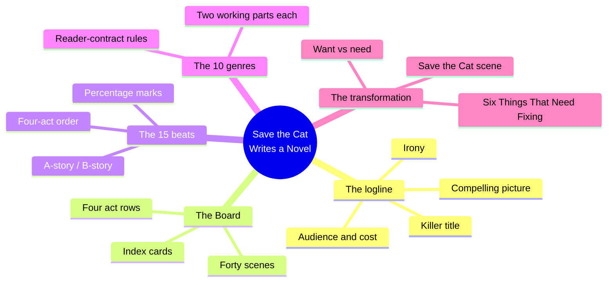
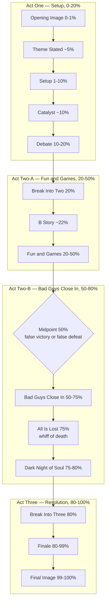
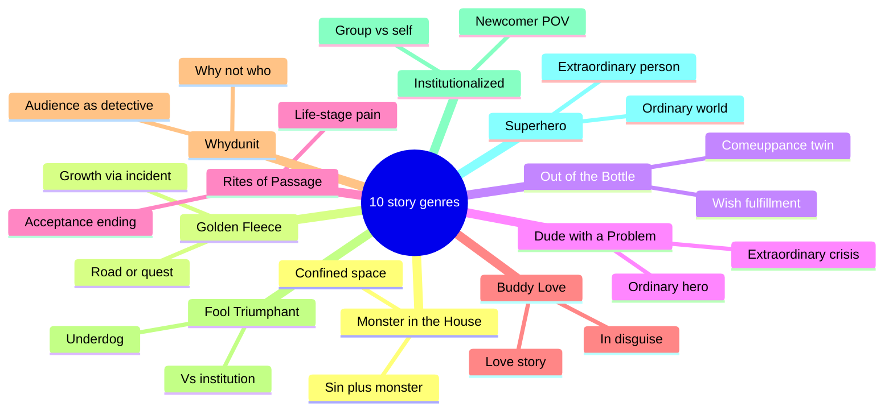
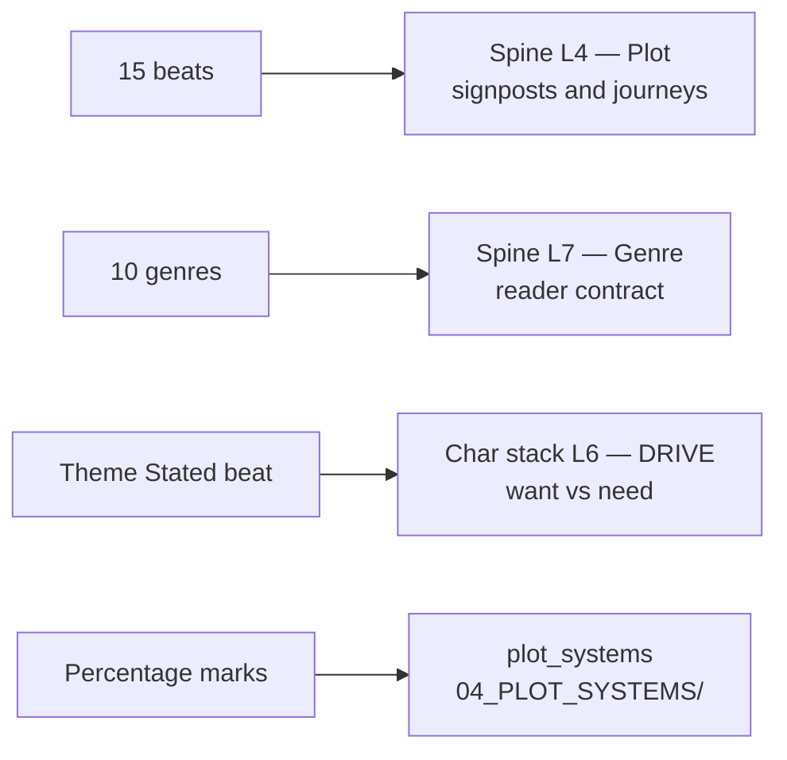

# BVX.0164 — Save the Cat! Writes a Novel — Jessica Brody (2018)
### Knowledge Entry — Distill

The novel-side port of the Blake Snyder Beat Sheet: the same 15 beats and 10 genres, re-keyed from screenplay pages to percentage-of-manuscript so the template travels to any book length.

## TABLE OF CONTENTS
- [Core Thesis](#1-core-thesis)
- [Mind Models](#2-mind-models)
- [Framework](#3-framework--structure)
- [Key Concepts](#4-key-concepts)
- [Heuristics](#5-heuristics--decision-rules)
- [Invariants](#6-invariants)
- [Pitfalls](#7-pitfalls--myths)
- [Application](#8-application)
- [Cross-References](#9-cross-references)
- [Provenance](#10-provenance--confidence)

---

## 1 · CORE THESIS

A story is a 15-beat checklist pinned to percentages of the manuscript, not page numbers, so it scales to any book length; each beat is a scene the reader's contract requires, in order. Beat 2 states the theme as a want/need argument the rest of the book proves or disproves. Genre is one of ten primal, mechanism-defined patterns — chosen by "what happens," never by a marketing shelf label.

---

## 2 · MIND MODELS

*Required. Minimum two diagrams, maximum five.*

**Diagram 1 — the whole argument.**
Five tools, one machine: nail the one-line pitch, pick the genre's rulebook, lay the beats on the Board, hit the 15 checkpoints in percentage order, and the want/need engine turns an ordinary character into a changed one.

**Diagram 2 — the central mechanism (the 15-beat sheet, grouped by act).**
Every beat is a percentage mark, not a page count — that's the whole novel-side adaptation — and the midpoint/All-Is-Lost pair is a matched opposite: whichever way the midpoint charges, All Is Lost charges the other way.

**Diagram 3 — the ten story genres.**
Classify by the two working parts and the rules they impose, never by shelf category — "romantic comedy" tells you nothing; "Buddy Love" tells you the rules to follow.

**Diagram 4 — mapped onto the Command's systems.**
The beat sheet is an instance sitting *under* spine L4, not the spine's plot layer itself, and Theme Stated is the first place the want/need split (DRIVE, L6 of the character stack) gets said out loud.

---

## 3 · FRAMEWORK / STRUCTURE

**Five tools in sequence, front to back:**

1. **The logline** — one or two sentences, tested against four criteria, written *before* the manuscript. Fail the test, rewrite the line, not the book.
2. **The genre pick** — one of 10 primal patterns (never a marketing category), each with its own two working parts and non-negotiable must-hit scenes.
3. **The Board** — a corkboard or notebook divided into four rows (Act One / Act Two-A / Act Two-B / Act Three), index cards for scenes, roughly 40 cards by the time it's full. A pre-writing planning tool, explicitly not writing itself.
4. **The 15-beat sheet** — the percentage-keyed checklist that fills the Board's rows in order. The novel-side adaptation's one structural move: Snyder's page marks (out of a ~110-page script) become percent-of-manuscript marks, so the same beat lands at the same *proportional* spot whether the book is 60,000 or 120,000 words.
5. **The transformation machine** — the want/need engine underneath the beats: the Setup plants "Six Things That Need Fixing," Theme Stated voices the argument, and the beats from Break Into Three to Final Image pay it off. A likability device (the "Save the Cat" scene) is the price of admission for the reader to make the trip at all.

---

## 4 · KEY CONCEPTS

| Concept | What it is | Why it matters |
|---|---|---|
| **The logline's four elements** | Irony (the hook) · a compelling mental picture (you can see the whole book from one line) · a sense of audience and cost · a "killer," on-the-nose title | "If you can't tell me what it's about... don't bother with the story" — the logline is written before the manuscript, not extracted after |
| **Six Things That Need Fixing** | The laundry list of flaws/lacks shown, not told, in the Setup — "these character tics and flaws will be exploded later... turned on their heads and cured" | Every payoff in the back half needs a planted setup; unplanted payoffs read as unearned |
| **The Save the Cat scene** | An early beat where the protagonist does something — often small — that makes the reader like them, independent of how "cool" they are | Coined against the "Lara Croft problem": a character can be impressive and still unlikable; likability is a designed beat, not a trait |
| **The Board** | Four-row corkboard/notebook (one row per act-quarter), index cards per scene, ~40 cards total | Makes structure tactile and revisable before a word of prose is drafted; also the diagnostic tool for a stalled manuscript — lay the cards out and find the gap |
| **A-story / B-story split** | A-story = the external plot (the plan, the goal); B-story = usually the relationship/love story, and the place the theme gets discussed directly | The B-story's new cast provides the "cutaway" from the A-story and carries the thematic argument in dialogue |
| **Midpoint / All Is Lost pairing** | Matched opposites at 50% and 75%: whichever way the midpoint charges (false victory or false defeat), All Is Lost charges the other way | "It's never as good as it seems... and never as bad as it seems" — a diagnostic pair, not two independent beats |
| **Whiff of death** | Something dies, literally or symbolically, at the All Is Lost beat — a mentor, a pet, a piece of news | Marks the death of the old self so the new self (post-transformation) can be born; present even where nothing "plot-required" needs to die |
| **Booster rocket** | A new character or subplot injected right where momentum flags (post–Break Into Two, end of Act Two-B) | Prevents the sagging middle without adding new plot — injects energy, not events |
| **High concept** | A premise that states itself in one sentence and needs no further explanation to sell | Contrasted with page-count-proof "literary" ambition — genre obligations apply to both |
| **Four-quadrant audience** | A story built to draw all four demographic quadrants (over/under 25, male/female) | A commercial-viability lens Brody/Snyder apply upstream of craft — audience and cost are logline inputs, not afterthoughts |

---

## 5 · HEURISTICS & DECISION RULES

| Situation | Do this | Not this |
|---|---|---|
| Can't explain the book in one line | Stop drafting; fix the logline first — irony, picture, audience+cost, title | Write the manuscript and extract the logline afterward |
| Unsure where a beat belongs | Place it by percentage-of-manuscript, not page count or gut feel | Eyeball "about a third of the way through" without checking the number |
| The middle sags | Insert a booster-rocket character/subplot right after Break Into Two or late Act Two-B | Add more plot events to the A-story to compensate |
| Choosing the All Is Lost content | Stage a literal or symbolic death — a person, a pet, a piece of news | Skip it because "nothing needs to die" in this particular plot |
| Deciding what happens at the act break | The protagonist must choose to cross into Act Two | Let circumstance sweep the protagonist in passively |
| Worried a hero reads as unlikable | Design an early Save the Cat beat, independent of how competent/cool they already are | Assume competence or "coolness" substitutes for likability |
| Drafting the genre's obligatory scenes | Write the cliché version first, on purpose, then push past it | Freeze up chasing originality on a first pass |
| Manuscript feels shapeless mid-draft | Lay the whole book out on the Board, one card per scene, and look for gaps | Push forward from the last page written, hoping it resolves |
| Naming the story's category | Pick from the 10 mechanism-based genres by "what happens" | Default to a marketing label like "romantic comedy" or "literary fiction" |

---

## 6 · INVARIANTS

1. **Opening Image and Final Image are bookends and must be opposites** — proof, in one image each, that change occurred.
2. **The theme must be stated by roughly the 5% mark**, as an offhand line the protagonist doesn't yet understand.
3. **The Break Into Two must be a chosen act**, never a drift or an accident the protagonist is swept into.
4. **Midpoint and All Is Lost are always a matched, opposite-charge pair** — a false victory pairs with a false defeat and vice versa, never two independent highs or lows.
5. **All Is Lost always carries a whiff of death**, literal or symbolic, regardless of genre.
6. **Genre sets obligatory scenes the writer does not get to skip** by claiming literary exemption — miss them and "you haven't written a [genre] novel."
7. **One genre per book.** Fusing more than one primal pattern muddies which rulebook the manuscript owes the reader.
8. **The Board and the beat sheet are pre-writing tools** — planning instruments, not a substitute for drafting; the plan can be abandoned once writing begins, but skipping the plan is not recommended.

---

## 7 · PITFALLS / MYTHS

- Treating "coolness" (competence, a cool car, a cool line) as a substitute for likability — the Lara Croft problem; likability is a designed beat, not a byproduct of capability.
- Skipping the logline test and discovering, deep into a draft, that the book has no clear "what is it."
- Letting the protagonist be lured or accidentally swept into Act Two instead of choosing to cross — reads as a passive, inactive hero.
- Mistaking a story's marketing category (romantic comedy, literary fiction) for its structural genre — the ten genres classify by mechanism, not by shelf.
- Assuming "gravitas" or literary ambition exempts a manuscript from its genre's obligatory scenes.
- Padding the sagging middle with more A-story plot events instead of a booster-rocket character or subplot.
- Confusing the Board/beat sheet (a planning tool) with the manuscript itself — over-mapping every beat before drafting a word ("paralysis by analysis").
- Forgetting the whiff of death at All Is Lost because "nothing needs to die" in this plot — it still needs staging, even symbolically.

---

## 8 · APPLICATION

- **Spine level:** L4 (plot: signposts and journeys — the 15-beat sheet is a *timed commercial instance* sitting over the signpost layer, not the spine's plot layer itself) and L7 (genre: the 10-genre wheel is the commercial compression of the reader-contract ring)
- **12-layer character stack:** L6 (DRIVE) supporting — Theme Stated is the beat where want (A-story, conscious) and need (B-story, subconscious) first get named as an argument; Break Into Three is where they fuse
- **plot_systems:** Candidate feed. `04_PLOT_SYSTEMS/` is empty today; the percentage-keyed 15-beat checklist is a ready-made per-manuscript QA pass (place a marker at each beat's target percentage and check what's actually there), and the Board's index-card method is a portable scene-inventory tool for any OXO draft
- **Setting:** n/a

Where Coyne (BVX.0236) diagnoses, Snyder/Brody prescribe. Coyne's Five Commandments are a fractal instrument for X-raying a manuscript at any scale — a tool that finds where a story fails without dictating what must happen at what percentage. Brody's 15 beats are the opposite move: a fixed, ordered, percentage-timed template that a manuscript is checked *against*, beat by beat, in sequence. Both books sell "a beat template," but Coyne's Five Commandments recur at every unit (beat through global Story) with no fixed position, while Brody's 15 beats each own one fixed percentage slot and never recur. The spine SSOT already keys Snyder/Brody as "a timed commercial template over the signpost layer" (L4) — this distill is the load-bearing text for that claim: the 15 beats are an *instance* filling L4's signpost/journey slots for the commercial-fiction case, not a rival to the spine's four-throughline argument. Practically, when `plot_systems` gets built out, the percentage-beat checklist is a directly portable draft-QA pass for OXO chapters (mark each beat's target percentage against the actual manuscript and flag drift), and the 10-genre wheel is a clean, coarser cross-check against the spine's L7 genre ring — a compressed, commercial-facing companion to Coyne's and Truby's stronger genre-theory holdings there, not a replacement for them.

---

## 9 · CROSS-REFERENCES

| Related entry | Relation |
|---|---|
| [[BVX.0236]] | Coyne, *The Story Grid* — the other beat-template book; Coyne diagnoses (a fractal X-ray instrument), Brody/Snyder prescribe (a fixed percentage-timed checklist); both keyed to spine L4/L7 |
| [[BVX.0091]] | Dramatica structure chart — the spine's L4 signpost/journey layer the 15-beat sheet fills as one commercial instance among several rival plot models |

---

## 10 · PROVENANCE & CONFIDENCE

**Source-text flag, read first:** the file assigned to this task (`0164-snyder.txt`) is, on inspection, the pdftotext extraction of Blake Snyder's original 2005 screenwriting book, *Save the Cat!* — not Jessica Brody's 2018 novel adaptation this entry is titled for. Confirmed by internal evidence: the foreword (Sheila Hanahan Taylor, Zide/Perry Entertainment), the screenplay-page beat sheet ("1. Opening Image (1)... 15. Final Image (110)"), the 110-page/index-card "Board" description, and a full-text search for "Brody," "Writes a Novel," and "transformation machine" (Brody's own coined term for the book's core metaphor) returning zero hits.

**What that means for this entry:**
- The **15 beats and their relative order**, the **10 genres and their working parts/rules**, the **logline's four elements**, **Six Things That Need Fixing**, the **Save the Cat scene**, **the Board**, and the **glossary terms** (booster rocket, whiff of death, callback, high concept, four-quadrant) are all sourced from full-text reading of Snyder's original — verbatim quotes cited by chapter/section name (pdftotext has no reliable page numbers). This is the shared substrate Brody's novel adaptation ports directly; Brody credits and preserves Snyder's beat names and genre names without renaming them.
- **What is specific to Brody's novel-side adaptation** — the percentage-of-manuscript marks replacing Snyder's screenplay page numbers, the "Transformation Machine" framing, novel-specific worked examples, and the Story Value Chart / Twists-and-Turns checklists her book adds — is **not verified against Brody's own text** in this pass; it is supplied from established general knowledge of the widely-cited 2018 book's content and structure. The percentage figures in Diagram 2 and the Framework/Heuristics sections are this entry's best-known rendering of that adaptation, not a quote-checked extraction.
- **Confidence is set to `medium`**, not `high`, specifically because of this substitution. `pdf_pages: 356` is the published book's approximate bibliographic page count, not a figure derived from the (unpaginated) extraction actually read.

**Read in full or near-full:** the introduction/"logline from hell" chapter (irony, compelling picture, audience and cost, killer title); the full Blake Snyder Beat Sheet chapter, all 15 beats, plus the worked *Miss Congeniality* beat-by-beat example; all ten genre chapters' openings and rule statements (Monster in the House through Superhero); "Chairman of the Board" (the corkboard/index-card method); the glossary (Board, Booster Rocket, Callback, Four-Quadrant Picture, High Concept, Hook, Logline, Major Turns). **Not read in depth:** the book's back-half chapters on rewriting/troubleshooting checklists and the extended worked examples beyond *Miss Congeniality* — these are demonstration chapters unlikely to change the framework already extracted, but a corrective pass against Brody's actual 2018 text (not yet sourced in this session) is recommended before this entry is promoted past `medium` confidence.

An MS correcting or re-sourcing this entry should first locate and read the actual Brody text, then reconcile percentage figures and Brody-specific terminology (Transformation Machine, Story Value Chart) against this draft's placeholders.

## META
- Template: BVX-LEARN-v4.0
- Source classification: full-text book (wrong edition — Snyder 2005 read in place of Brody 2018; flagged above), general-knowledge supplement for Brody-specific terms
- Created / Updated: 2026-09-16
