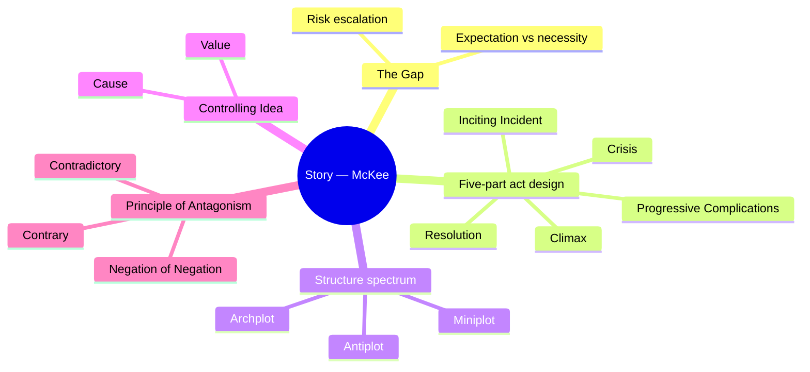
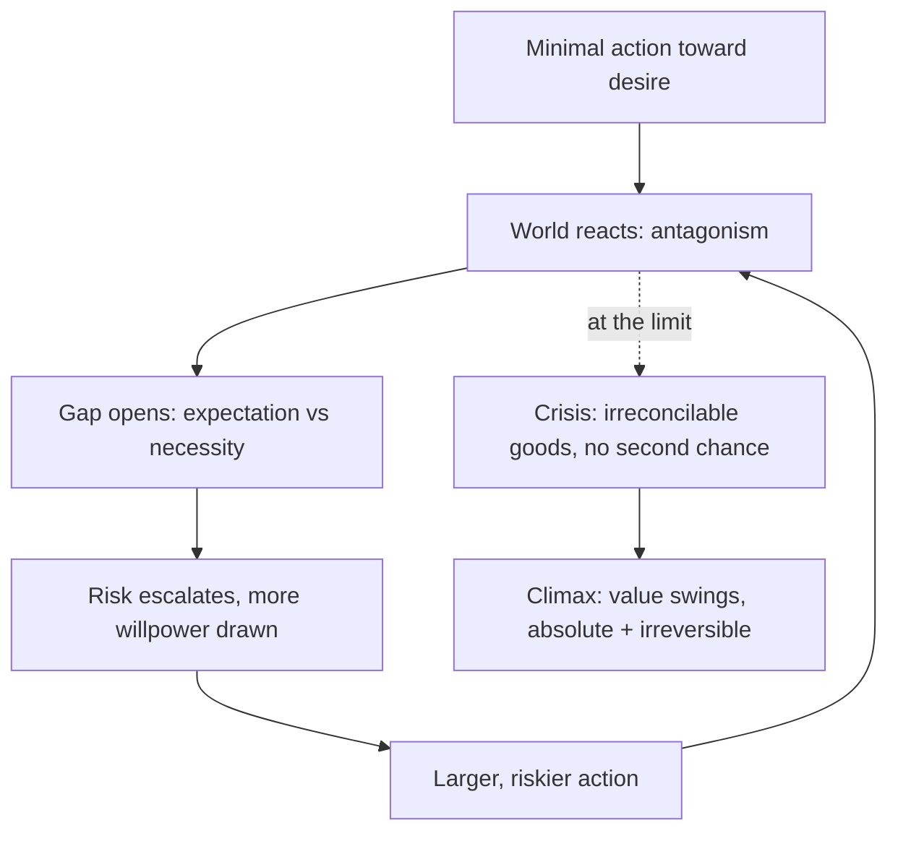
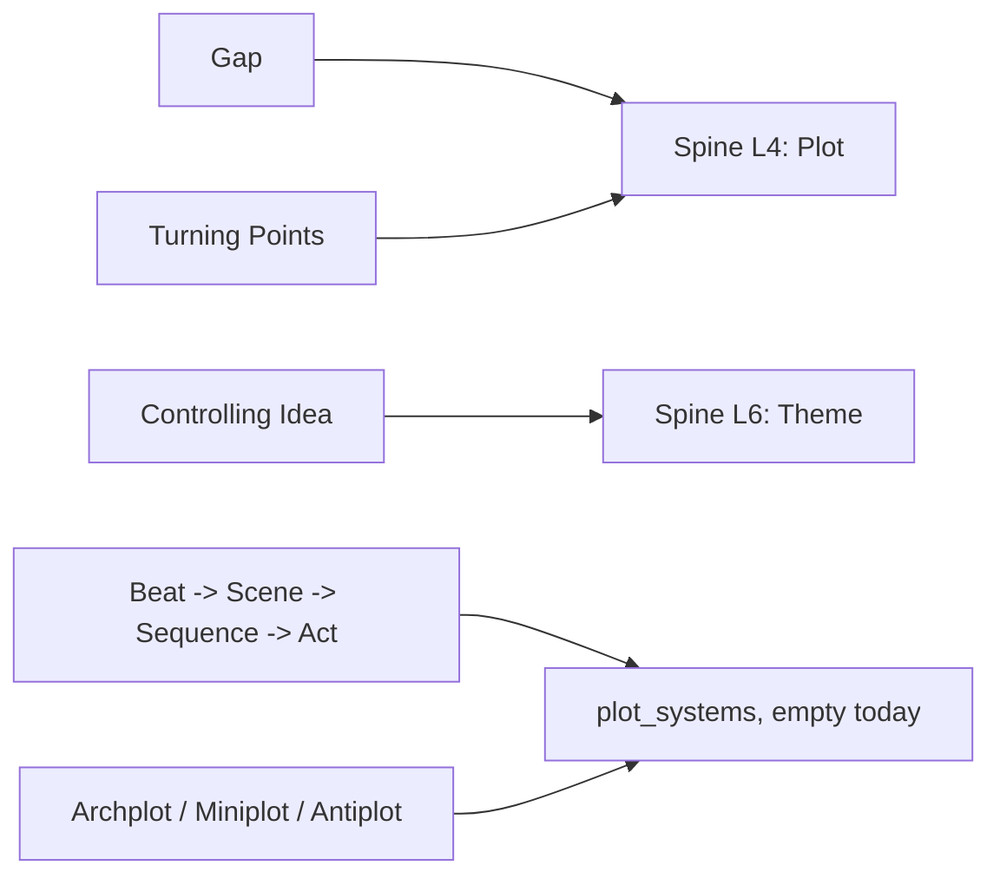
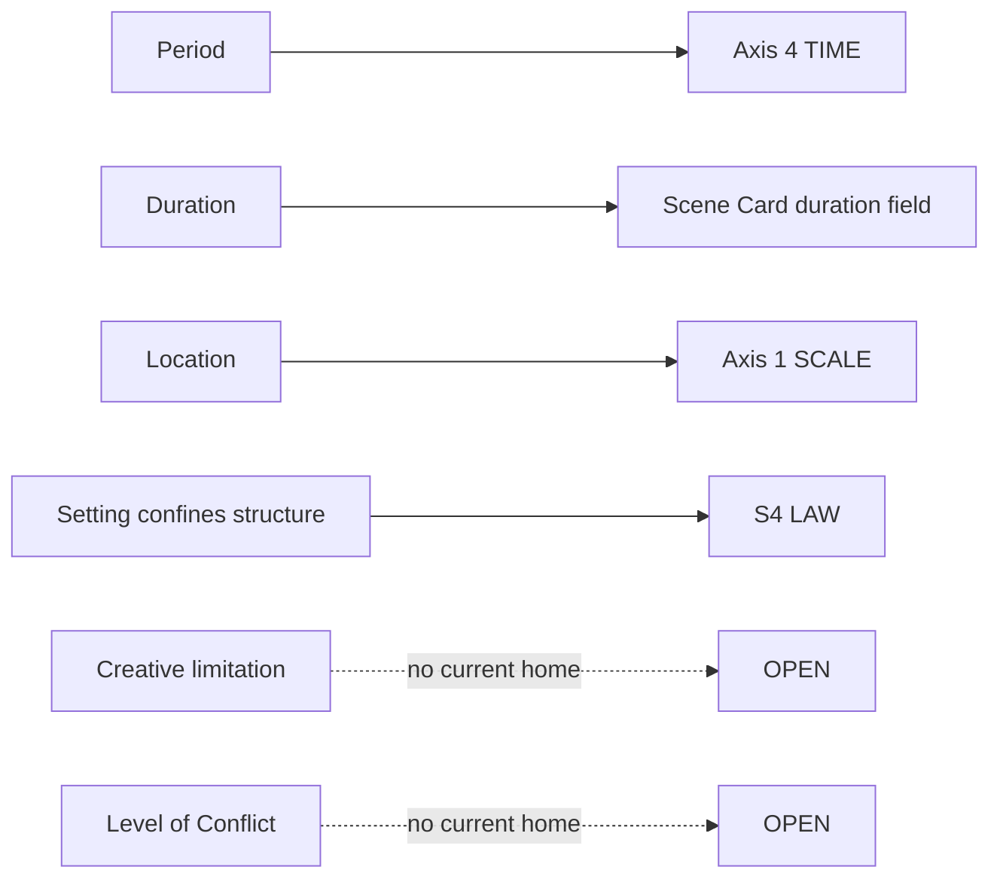

# BVX.0175 — Story: Substance, Structure, Style, and the Principles of Screenwriting — Robert McKee (1997)
### Knowledge Entry — Distill

McKee's founding text, prior to *Character* (BVX.0064) by 24 years — the plot engine that BVX.0064's dimensional cast gets put under. This is the library's deepest L4/L6 holding: the scene-level grammar Dramatica's storyform doesn't specify, and the mechanism (the Gap) that makes a Controlling Idea provable rather than stated.

## TABLE OF CONTENTS
- [Core Thesis](#1--core-thesis)
- [Mind Models](#2--mind-models)
- [Framework](#3--framework--structure)
- [Key Concepts](#4--key-concepts)
- [Heuristics](#5--heuristics--decision-rules)
- [Invariants](#6--invariants)
- [Pitfalls](#7--pitfalls--myths)
- [Application](#8--application)
- [Setting Addendum](#8b--setting-addendum-added-2026-09-16-the-setting-wave)
- [Cross-References](#9--cross-references)
- [Provenance](#10--provenance--confidence)

---

## 1 · CORE THESIS

A story is an argument the writer proves through design, never statement: the Controlling Idea (Value + Cause), demonstrated when a protagonist's escalating actions crack open the Gap between subjective expectation and objective necessity. Structure and character are one thing — true character exists only as choice under pressure.

---

## 2 · MIND MODELS

**Diagram 1 — the whole argument.**
Caption: *five branches, one pipeline — desire meets antagonism through five stages and gets argued down to one sentence.*

**Diagram 2 — the central mechanism (the Gap, a repeating escalation cycle).**
Caption: *the Gap doesn't close, it reopens bigger each pass — that's the engine, not a plot hiccup, and it's what forces the Crisis.*

**Diagram 3 — mapped onto the Command's story spine.**
Caption: *McKee keys straight to L4 and L6; his scene grammar is exactly the sub-spine material plot_systems doesn't have yet.*

---

## 3 · FRAMEWORK / STRUCTURE

**The structural hierarchy** (Ch.2, The Structure Spectrum): **Beat** (exchange of behavior, action/reaction) builds a **Scene** (an action through conflict that turns a value-charged condition — "no scene that doesn't turn") builds a **Sequence** (a moderate reversal, a capping scene of greater impact) builds an **Act** (a major reversal) builds the **Story**. A typical feature runs 40–60 scenes across 12–18 sequences across three-or-more acts.

**The five-part act design** (Ch.8–13): Inciting Incident (radically upsets life's balance) → Progressive Complications (the Gap reopens at increasing risk, passing "points of no return") → Crisis (the Obligatory Scene — a true dilemma) → Climax (the value swings, absolute and irreversible) → Resolution (subplot cleanup, spread of effects, or simple courtesy to the audience).

**The Structure Spectrum triangle** (Ch.2): a formal map of every story ever told, three corners —
- **Archplot** — Classical Design: active protagonist, external antagonism, continuous time, closed ending, single protagonist, absolute change.
- **Miniplot** — minimalism: same elements reduced (passive protagonist, internal conflict emphasis, open ending, often Multiplot).
- **Antiplot** — antistructure: reverses the Classical rather than reducing it (Nouveau Roman / Theatre of the Absurd cinema kin).

**Genre** (Ch.4): not a marketing label but an audience contract — McKee's practitioner taxonomy (Love Story, Horror, Modern Epic, Western, War, Maturation, Redemption, Punitive, Testing, Education, Disillusionment, Comedy, Crime, and others) turns on subject, setting, role, event, and values, and each genre obligates specific conventions the writer must fulfill and then exceed.

---

## 4 · KEY CONCEPTS

| Concept | What it is | Why it matters |
|---|---|---|
| **Story Event** | Meaningful change in a value-charged condition, achieved through conflict | The atomic unit — "if a scene is not a true event, cut it" |
| **Story Value** | A universal quality that can reverse charge (alive/dead, love/hate, justice/injustice) | The currency every scene must spend |
| **The Gap** | "Story is born in that place where the subjective and objective realms touch" (Ch.7) — action provokes a bigger/different reaction than expected | The generative engine of drama itself, not a plot device |
| **Necessity vs. Probability** | "Necessity is what must and does actually happen, as opposed to probability, which is what we hope or expect to happen" (Ch.7) | Only action reveals necessity — belief and hope don't |
| **Object of Desire** | What the protagonist consciously (and often unconsciously) pursues to restore balance after the Inciting Incident | The Spine / Super-Objective every Scene-Objective must serve |
| **Turning Point** | A scene's reversal, producing surprise, curiosity, insight, and new direction (Ch.10) | "Our most powerful means of self-expression is the unique way we turn the story" |
| **Setup/Payoff** | Planting knowledge, then closing the gap by delivering it | Makes insight possible instead of confusion |
| **Crisis** | "This dilemma confronts the protagonist who, when face-to-face with the most powerful and focused forces of antagonism in his life, must make a decision to take one action or another in a last effort to achieve his Object of Desire" (Ch.13) | The Obligatory Scene — decisions, not actions, cost willpower |
| **Climax / Meaning** | "A revolution in values from positive to negative or negative to positive with or without irony — a value swing at maximum charge that's absolute and irreversible" (Ch.13) | "Meaning Produces Emotion" — not spectacle |
| **Controlling Idea** | "A single sentence describing how and why life undergoes change from one condition of existence at the beginning to another at the end" (Ch.6) — Value + Cause | The house's L6 theme, load-bearing not decorative |
| **Law of Conflict** | "Nothing moves forward in a story except through conflict" (Ch.9) | Conflict is constant in quantity, only its level shifts |
| **Principle of Antagonism** | "A protagonist and his story can only be as intellectually fascinating and emotionally compelling as the forces of antagonism make them" (Ch.14) | Diagnostic for weak protagonists: weak opposition, not weak hero |
| **Negation of the Negation** | Contrary (unfairness) → Contradictory (injustice) → Negation of the Negation (tyranny — "Might Makes Right") | The ladder for how far antagonism must climb to earn a story's full weight |
| **Character vs. Characterization** | Characterization = observable traits; "TRUE CHARACTER is revealed in the choices a human being makes under pressure" (Ch.5) | Structure and character are the same claim from two directions |
| **Text vs. Subtext** | The sensory surface vs. the hidden thoughts/feelings underneath | "If the scene is about what the scene is about, you're in deep shit" |
| **Center of Good** | The positive focal point the audience needs, even for monstrous protagonists (Ch.16) | Explains empathy for Gittes, Cody Jarrett, Hannibal Lecter alike |

---

## 5 · HEURISTICS & DECISION RULES

| Situation | Do this | Not this |
|---|---|---|
| A scene feels static or expository | Ask what value turns positive↔negative across it; cut if it doesn't turn | Keep it "for information," explain motive in dialogue |
| The middle act sags | Escalate action past the previous point of no return | Repeat actions of the same magnitude as Act One |
| The antagonist/opposition feels thin | Sum antagonism across inner, personal, and extra-personal levels to match the protagonist's full capacity | Rely on one arch-villain to carry all the conflict |
| The ending feels arbitrary or bolted-on | Derive the Controlling Idea (Value + Cause) from the Climax, then work backward to justify every scene | Attach a "message" to a plot already finished |
| A choice doesn't land | Put it at true Crisis: irreconcilable goods, maximum pressure, no tomorrow | Give a right/wrong choice with an obvious correct answer |
| Antagonism plateaus | Push toward the Negation of the Negation — qualitatively, not just quantitatively, worse | Stop once the opposition has merely broken a rule |
| Dialogue reads "on the nose" | Convert exposition to ammunition — characters use facts as weapons in live conflict | Have characters recite history/backstory to each other |
| Two characters feel redundant | Check whether both oppose the protagonist on the same value axle (cross-ref BVX.0064 dimension design) | Differentiate them cosmetically |

---

## 6 · INVARIANTS

1. Structure and character are the same thing — a role is proven only through choice under pressure, never through statement or description.
2. A story event must change a value-charged condition through conflict, or it isn't an event — it's exposition or activity.
3. The Gap between subjective expectation and objective necessity is the irreducible unit of drama; it does not close, it reopens larger.
4. "The measure of the value of a character's desire is in direct proportion to the risk he's willing to take to achieve it" (Ch.7) — value is read off risk, not statement.
5. Nothing moves a story forward except conflict (the Law of Conflict); its total quantity is constant across a story, it only shifts levels.
6. A protagonist is only as compelling as the forces of antagonism arrayed against him (the Principle of Antagonism).
7. The Controlling Idea must be provable backward from the Climax — every scene either serves it or gets cut.
8. Progress must never retreat to an action of a magnitude already spent; that retreat is the mechanical cause of a sagging middle.
9. Meaning, not spectacle, produces emotion at Climax — the action must be "pure," requiring no explanatory dialogue.

---

## 7 · PITFALLS / MYTHS

"California scenes" — strangers trading intimate secrets with no dramatic motivation · dialogue written "on the nose," subtext stuffed directly into text · repeating actions of the same magnitude through the middle (recycled, antiprogressive story) · single-axle antagonism that stops at the Contradictory and never reaches the Negation of the Negation · resolving the Gap instead of reopening it bigger · mistaking "the audience wants a happy ending" for "the audience wants niceness" (it wants emotional satisfaction, delivered unexpectedly) · exposition delivered "ahead of dramatic necessity" instead of as ammunition in live conflict · a change of scenery mistaken for a scene when no value actually turns · a Resolution scene that drags because it was never fused back to the Central Plot's tension.

---

## 8 · APPLICATION

- **Spine level:** L4 (Plot) and L6 (Theme), per the SSOT's own keying of McKee as a rival root-claim ("character revealed through choice under pressure; the controlling idea"). L4 gets the five-part act design, the Gap as the turning-point engine, and the beat→scene→sequence→act grammar Dramatica's storyform doesn't specify below its signpost floor. L6 gets the Controlling Idea (Value + Cause) as the working method for compressing an OS Problem/Solution + Outcome into one load-bearing sentence.
- **12-layer character stack:** indirect, via L6 DRIVE (the Gap — desire meets antagonism, escalates) and L4 WILL (the Crisis Decision — willpower tested at maximum pressure). Character-as-cast-design is BVX.0064's territory; *Story* supplies the plot engine that puts BVX.0064's dimensional contradictions under pressure scene by scene.
- **plot_systems:** the strongest holding here. `04_PLOT_SYSTEMS/` is empty today per the spine SSOT; McKee's beat/scene/sequence/act hierarchy and the Archplot/Miniplot/Antiplot classification triangle are exactly the scene-level grammar the SSOT flags as "below the spine's floor" and out of Dramatica's scope — a natural seed for that domain.
- **Setting:** not applicable (Ch.3, Structure and Setting, not sampled in this pass — see Provenance).

The Controlling Idea method is directly usable on OXO: work backward from Tori's climax to a Value+Cause sentence the way McKee derives "Justice triumphs because the protagonist is more violent than the criminals" for *Dirty Harry*. Given OXO's ruled Outcome=Failure / Judgment=Good ("personal triumph," per the spine SSOT L3), a candidate form is "[Value] survives/is lost because [the dominant cause traced back from the climax]" — worth drafting once the climax is locked, not before.

The Negation-of-the-Negation ladder (Unfairness → Injustice → Tyranny/"Might Makes Right") is a ready-made design check for DCUS as an antagonist institution: BVX.0064 already documents Tori's dimension 4 as Equity→Inequity. McKee's ladder asks whether DCUS's opposition to her stops at mere unfairness (Contrary) or climbs to systemic, "legal" capture (Negation of the Negation) — the difference between a school with bad actors and a school built to make injustice look procedural. This is offered as a design lens, not asserted as canon.

---

## 8b · SETTING ADDENDUM (added 2026-09-16, the setting wave)

*Sourced from Ch.3, "Structure and Setting" — not read in the original pass (see §10). Pulled full-text for this addendum.*

McKee's Chapter 3 argues that setting is four-dimensional — Period, Duration, Location, Level of Conflict — and that it does not decorate structure but sharply defines and confines it: a fictional world's own internal laws of probability set the boundary of every event the writer is allowed to invent. The Principle of Creative Limitation follows directly — a story's world must be small enough for one mind to know completely, because the smaller and more thoroughly researched the world, the more original the creative choices it can generate; the war on cliché is won or lost at the setting, not the plot.

**McKee's setting tools, mapped onto the setting system:**

| McKee tool | What it does | Setting-system axis / S-layer |
|---|---|---|
| Period | The story's place in time | Axis 4 TIME (baseline dating) / S7 FOUNDING |
| Duration | The story's length through time — storytime vs. screentime | The SCENE CARD's `duration` field (scene/summary/stretch/pause/ellipsis, Genette) |
| Location | The story's place in space, down to the specific room | Axis 1 SCALE / S1 BODY |
| Level of Conflict | The vertical hierarchy of human struggle a story is pitched at — subconscious, personal, institutional, environmental — as much a part of setting as landscape or costume | No current axis — see finding below |
| Setting confines structure | A world's internal "laws of probability" limit which events are possible or probable; breaking them reads as a violated contract | S4 LAW |
| Principle of Creative Limitation | A story's world must be small enough for one writer to know completely | A scope-discipline the SSOT's OPEN list doesn't hold — see finding below |
| Research (memory / imagination / fact) | Three methods for building commanding knowledge of a setting before writing it | Authoring method for filling S1–S11, not a layer itself |
| War on cliché | Clichéd scenes trace to one cause: "the writer does not know the world of his story" | Quality gate on S3 SENSORIUM / Axis 3 FUNCTION |

**Diagram 4 — McKee's four dimensions mapped onto the setting system.**
Caption: *three of the four dimensions drop straight onto the taxonomy; Level of Conflict and the Principle of Creative Limitation both fall outside it — the chapter's two clearest gaps.*

**Quotes (Ch.3, verbatim):**

- "A story's SETTING is four-dimensional — Period, Duration, Location, Level of Conflict."
- "A STORY must obey its own internal laws of probability. The event choices of the writer, therefore, are limited to the possibilities and probabilities within the world he creates."
- "The larger the world, the more diluted the knowledge of the writer, therefore the fewer his creative choices and the more clichéd the story. The smaller the world, the more complete the knowledge of the writer, therefore the greater his creative choices."

**What the setting system does not yet hold:** McKee's Level of Conflict — a vertical axis running from subconscious through personal to institutional to environmental struggle — is a distinct dimension of setting the SSOT's four axes don't currently carry; SCALE nests physical space, not conflict altitude, so this is a candidate for a fifth axis or an S4/S12 subfield.

---

## 9 · CROSS-REFERENCES

| Related entry | Relation |
|---|---|
| [[BVX.0064]] | McKee's own later book (*Character*, 2021) — read together, not redundantly: this entry supplies the plot engine (Gap, five-part acts, antagonism) that BVX.0064's dimensional cast gets put under pressure by |
| [[BVX.0091]] | Dramatica structure chart — the L4 signpost/journey grammar McKee's beat→scene→sequence→act hierarchy sits below |
| [[BVX.0193]] | Truby, *The Anatomy of Story* — rival plot/moral-argument model occupying the same L4/L6 territory, both named as rivals in the spine SSOT |

---

## 10 · PROVENANCE & CONFIDENCE

Full text, pdftotext extraction (~137,000 words, 17,613 lines). The extraction carries no page-break markers, so citations above are by chapter (matching the source's own headings) rather than page number. Read in full or substantially: Introduction and Ch.1 (The Story Problem) opening; Ch.2 (The Structure Spectrum) — event/scene/beat/sequence hierarchy and the Archplot/Miniplot/Antiplot triangle in full; Ch.4 (Structure and Genre) opening — genre taxonomy; Ch.5 (Structure and Character) — Character vs. Characterization, Character Arc; Ch.6 (Structure and Meaning) — Premise, Controlling Idea, in full; Ch.7 (The Substance of Story) — The Gap, On Risk, writing-from-the-inside-out (the CHINATOWN case study); Ch.8 (The Inciting Incident); Ch.9 (Act Design) — Progressive Complications, the Law of Conflict; Ch.10 (Scene Design) — Turning Points, Setups/Payoffs; Ch.11 (Scene Analysis) opening — Text/Subtext; Ch.12 (Composition) opening — Unity/Variety, Pacing; Ch.13 (Crisis, Climax, Resolution) in full; Ch.14 (The Principle of Antagonism) in full; Ch.15 (Exposition) opening — Show Don't Tell; Ch.16 (Problems and Solutions) opening — the Center of Good; Fade Out (closing essay).

**Not read in this pass:** Ch.3 (Structure and Setting), Ch.17 (Character — largely superseded for house purposes by McKee's own later book, BVX.0064), Ch.18 (The Text), Ch.19 (A Writer's Method), and the back matter (Suggested Readings/Filmography/Index sampled only to confirm structure). A deeper pass on Ch.3, 17–19 would likely add setting-design and prose-craft material; flag with **"Upgrade BVX.0175"** if wanted.

All quotes verbatim from the pdftotext extraction; the character `fi`/`fl` ligatures render as dropped letters in that extraction (e.g. "definition" → "de nition") and were silently corrected in quotation here where unambiguous. The `04_PLOT_SYSTEMS` application and the OXO/DCUS synthesis in §8 are **my inference**, not McKee's — he never mentions Dramatica, DCUS, or OXO. Flagged as proposal throughout.

## META
- Template: BVX-LEARN-v4.0
- Source classification: full-text book, pdftotext extraction
- Created / Updated: 2026-09-16
